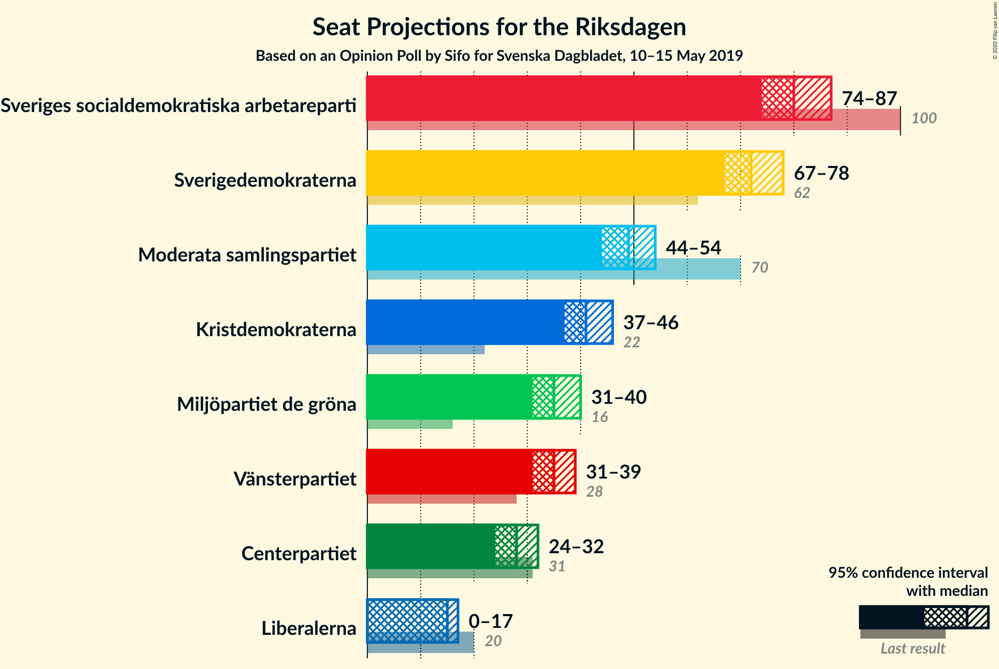
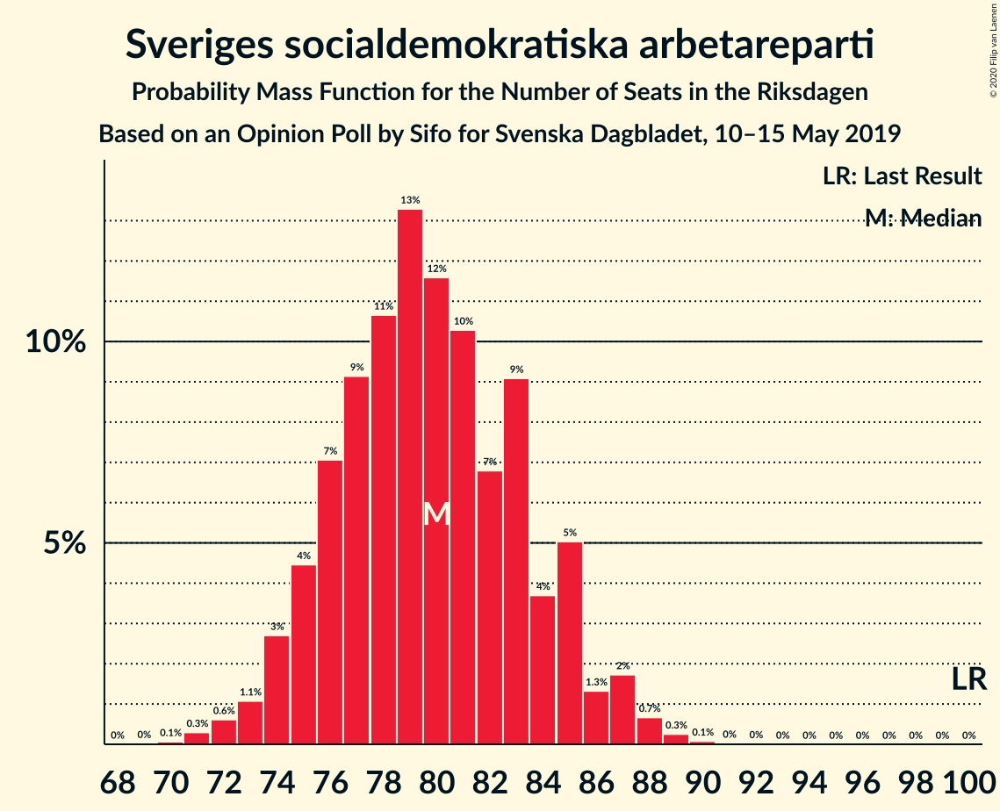
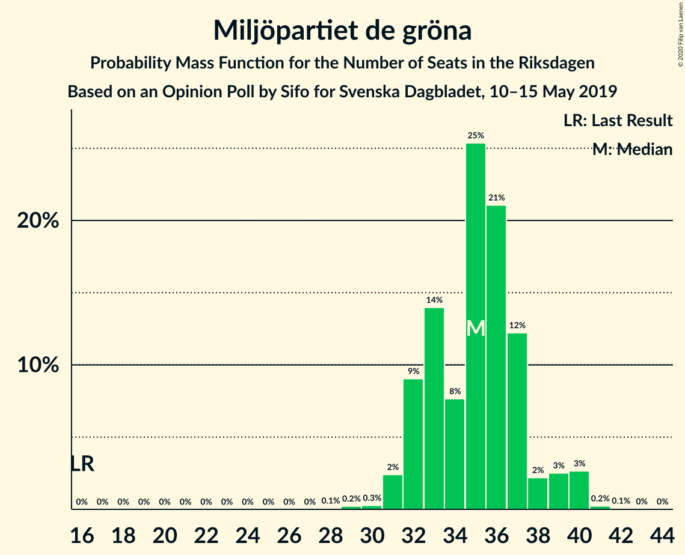
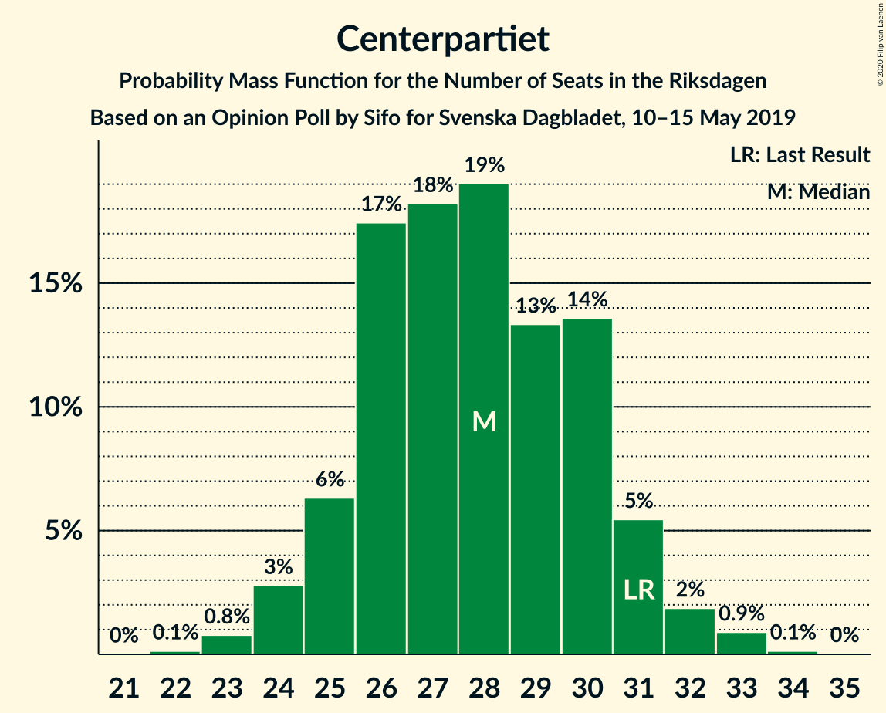
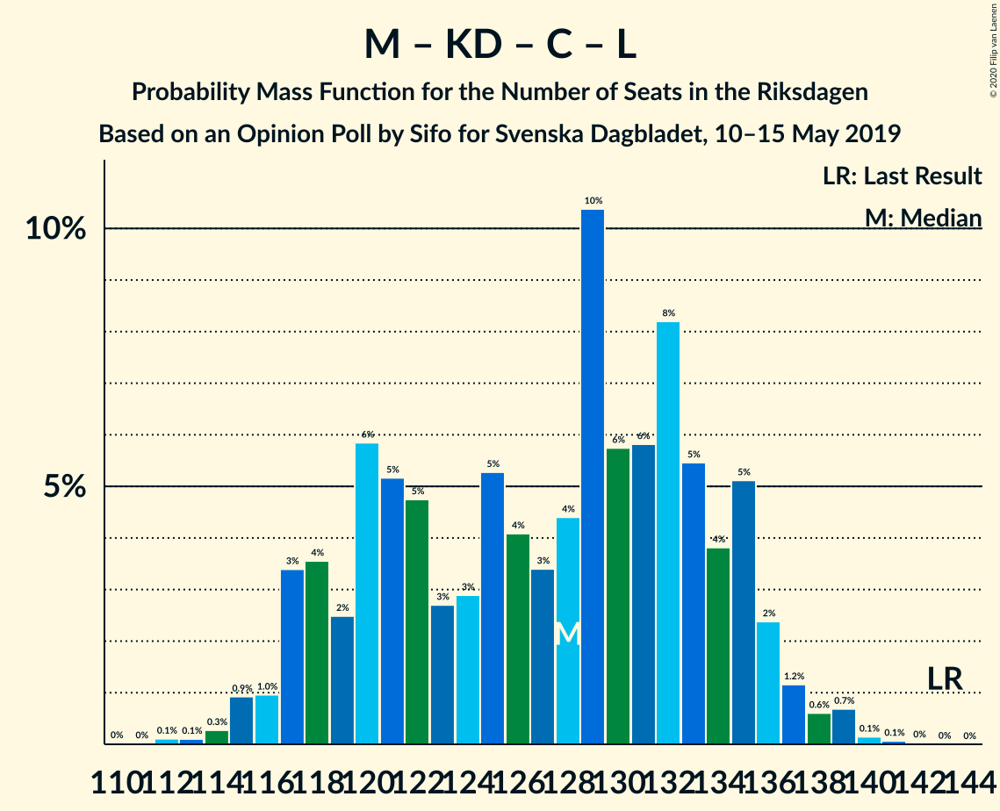

# Opinion Poll by Sifo for Svenska Dagbladet, 10–15 May 2019

<a href="#voting-intentions">Voting Intentions</a> | <a href="#seats">Seats</a> | <a href="#coalitions">Coalitions</a> | <a href="#technical-information">Technical Information</a>

## Voting Intentions

### Confidence Intervals

| Party | Last Result | Poll Result | 80% Confidence Interval | 90% Confidence Interval | 95% Confidence Interval | 99% Confidence Interval |
|:-----:|:-----------:|:-----------:|:-----------------------:|:-----------------------:|:-----------------------:|:-----------------------:|
| Sveriges socialdemokratiska arbetareparti | 28.3% | 21.9% | 20.9–22.9% |20.6–23.2% |20.4–23.4% |19.9–23.9% |
| Sverigedemokraterna | 17.5% | 19.9% | 18.9–20.9% |18.7–21.1% |18.5–21.4% |18.0–21.9% |
| Moderata samlingspartiet | 19.8% | 13.5% | 12.7–14.4% |12.5–14.6% |12.3–14.8% |11.9–15.2% |
| Kristdemokraterna | 6.3% | 11.2% | 10.5–12.0% |10.3–12.2% |10.1–12.4% |9.8–12.8% |
| Miljöpartiet de gröna | 4.4% | 9.6% | 8.9–10.3% |8.7–10.5% |8.6–10.7% |8.2–11.1% |
| Vänsterpartiet | 8.0% | 9.5% | 8.8–10.2% |8.6–10.4% |8.5–10.6% |8.2–11.0% |
| Centerpartiet | 8.6% | 7.6% | 7.0–8.3% |6.8–8.5% |6.7–8.6% |6.4–9.0% |
| Liberalerna | 5.5% | 4.1% | 3.6–4.6% |3.5–4.8% |3.4–4.9% |3.2–5.1% |

*Note:* The poll result column reflects the actual value used in the calculations. Published results may vary slightly, and in addition be rounded to fewer digits.

## Seats

### Confidence Intervals

| Party | Last Result | Median | 80% Confidence Interval | 90% Confidence Interval | 95% Confidence Interval | 99% Confidence Interval |
|:-----:|:-----------:|:------:|:-----------------------:|:-----------------------:|:-----------------------:|:-----------------------:|
| <a href="#sveriges-socialdemokratiska-arbetareparti">Sveriges socialdemokratiska arbetareparti</a> | 100 | 80 | 76–84 |75–85 |74–87 |72–88 |
| <a href="#sverigedemokraterna">Sverigedemokraterna</a> | 62 | 72 | 68–76 |67–77 |67–78 |65–80 |
| <a href="#moderata-samlingspartiet">Moderata samlingspartiet</a> | 70 | 49 | 46–53 |45–54 |44–54 |43–57 |
| <a href="#kristdemokraterna">Kristdemokraterna</a> | 22 | 41 | 38–44 |37–45 |37–46 |35–47 |
| <a href="#miljöpartiet-de-gröna">Miljöpartiet de gröna</a> | 16 | 35 | 32–37 |32–39 |31–40 |30–40 |
| <a href="#vänsterpartiet">Vänsterpartiet</a> | 28 | 35 | 32–37 |31–38 |31–39 |30–40 |
| <a href="#centerpartiet">Centerpartiet</a> | 31 | 28 | 25–30 |25–31 |24–32 |23–33 |
| <a href="#liberalerna">Liberalerna</a> | 20 | 15 | 0–16 |0–17 |0–17 |0–18 |

### Sveriges socialdemokratiska arbetareparti

*For a full overview of the results for this party, see the [Sveriges socialdemokratiska arbetareparti](party-sverigessocialdemokratiskaarbetareparti.html) page.*

| Number of Seats | Probability | Accumulated | Special Marks |
|:---------------:|:-----------:|:-----------:|:-------------:|
| 70 | 0.1% | 100% |  |
| 71 | 0.3% | 99.9% |  |
| 72 | 0.6% | 99.6% |  |
| 73 | 1.1% | 99.0% |  |
| 74 | 3% | 98% |  |
| 75 | 4% | 95% |  |
| 76 | 7% | 91% |  |
| 77 | 9% | 84% |  |
| 78 | 11% | 75% |  |
| 79 | 13% | 64% |  |
| 80 | 12% | 51% | Median |
| 81 | 10% | 39% |  |
| 82 | 7% | 29% |  |
| 83 | 9% | 22% |  |
| 84 | 4% | 13% |  |
| 85 | 5% | 9% |  |
| 86 | 1.3% | 4% |  |
| 87 | 2% | 3% |  |
| 88 | 0.7% | 1.0% |  |
| 89 | 0.3% | 0.4% |  |
| 90 | 0.1% | 0.1% |  |
| 91 | 0% | 0% |  |
| 92 | 0% | 0% |  |
| 93 | 0% | 0% |  |
| 94 | 0% | 0% |  |
| 95 | 0% | 0% |  |
| 96 | 0% | 0% |  |
| 97 | 0% | 0% |  |
| 98 | 0% | 0% |  |
| 99 | 0% | 0% |  |
| 100 | 0% | 0% | Last Result |

### Sverigedemokraterna

*For a full overview of the results for this party, see the [Sverigedemokraterna](party-sverigedemokraterna.html) page.*

| Number of Seats | Probability | Accumulated | Special Marks |
|:---------------:|:-----------:|:-----------:|:-------------:|
| 62 | 0% | 100% | Last Result |
| 63 | 0.1% | 100% |  |
| 64 | 0.2% | 99.9% |  |
| 65 | 0.7% | 99.8% |  |
| 66 | 1.4% | 99.0% |  |
| 67 | 3% | 98% |  |
| 68 | 5% | 95% |  |
| 69 | 6% | 90% |  |
| 70 | 13% | 84% |  |
| 71 | 12% | 71% |  |
| 72 | 11% | 59% | Median |
| 73 | 11% | 48% |  |
| 74 | 14% | 37% |  |
| 75 | 5% | 23% |  |
| 76 | 9% | 18% |  |
| 77 | 4% | 8% |  |
| 78 | 3% | 5% |  |
| 79 | 1.1% | 2% |  |
| 80 | 0.7% | 1.2% |  |
| 81 | 0.3% | 0.5% |  |
| 82 | 0.1% | 0.2% |  |
| 83 | 0.1% | 0.1% |  |
| 84 | 0% | 0% |  |

### Moderata samlingspartiet

*For a full overview of the results for this party, see the [Moderata samlingspartiet](party-moderatasamlingspartiet.html) page.*

| Number of Seats | Probability | Accumulated | Special Marks |
|:---------------:|:-----------:|:-----------:|:-------------:|
| 41 | 0.1% | 100% |  |
| 42 | 0.2% | 99.9% |  |
| 43 | 0.8% | 99.8% |  |
| 44 | 2% | 99.0% |  |
| 45 | 4% | 97% |  |
| 46 | 9% | 94% |  |
| 47 | 12% | 85% |  |
| 48 | 10% | 73% |  |
| 49 | 16% | 62% | Median |
| 50 | 17% | 46% |  |
| 51 | 11% | 29% |  |
| 52 | 6% | 18% |  |
| 53 | 6% | 12% |  |
| 54 | 4% | 6% |  |
| 55 | 0.7% | 2% |  |
| 56 | 0.5% | 1.0% |  |
| 57 | 0.4% | 0.5% |  |
| 58 | 0.1% | 0.1% |  |
| 59 | 0% | 0% |  |
| 60 | 0% | 0% |  |
| 61 | 0% | 0% |  |
| 62 | 0% | 0% |  |
| 63 | 0% | 0% |  |
| 64 | 0% | 0% |  |
| 65 | 0% | 0% |  |
| 66 | 0% | 0% |  |
| 67 | 0% | 0% |  |
| 68 | 0% | 0% |  |
| 69 | 0% | 0% |  |
| 70 | 0% | 0% | Last Result |

### Kristdemokraterna

*For a full overview of the results for this party, see the [Kristdemokraterna](party-kristdemokraterna.html) page.*

| Number of Seats | Probability | Accumulated | Special Marks |
|:---------------:|:-----------:|:-----------:|:-------------:|
| 22 | 0% | 100% | Last Result |
| 23 | 0% | 100% |  |
| 24 | 0% | 100% |  |
| 25 | 0% | 100% |  |
| 26 | 0% | 100% |  |
| 27 | 0% | 100% |  |
| 28 | 0% | 100% |  |
| 29 | 0% | 100% |  |
| 30 | 0% | 100% |  |
| 31 | 0% | 100% |  |
| 32 | 0% | 100% |  |
| 33 | 0% | 100% |  |
| 34 | 0.1% | 100% |  |
| 35 | 0.4% | 99.8% |  |
| 36 | 1.4% | 99.4% |  |
| 37 | 6% | 98% |  |
| 38 | 8% | 92% |  |
| 39 | 14% | 84% |  |
| 40 | 15% | 70% |  |
| 41 | 20% | 54% | Median |
| 42 | 12% | 34% |  |
| 43 | 9% | 22% |  |
| 44 | 5% | 13% |  |
| 45 | 5% | 8% |  |
| 46 | 2% | 3% |  |
| 47 | 0.6% | 0.8% |  |
| 48 | 0.1% | 0.2% |  |
| 49 | 0.1% | 0.1% |  |
| 50 | 0% | 0% |  |

### Miljöpartiet de gröna

*For a full overview of the results for this party, see the [Miljöpartiet de gröna](party-miljöpartietdegröna.html) page.*

| Number of Seats | Probability | Accumulated | Special Marks |
|:---------------:|:-----------:|:-----------:|:-------------:|
| 16 | 0% | 100% | Last Result |
| 17 | 0% | 100% |  |
| 18 | 0% | 100% |  |
| 19 | 0% | 100% |  |
| 20 | 0% | 100% |  |
| 21 | 0% | 100% |  |
| 22 | 0% | 100% |  |
| 23 | 0% | 100% |  |
| 24 | 0% | 100% |  |
| 25 | 0% | 100% |  |
| 26 | 0% | 100% |  |
| 27 | 0% | 100% |  |
| 28 | 0.1% | 100% |  |
| 29 | 0.2% | 99.9% |  |
| 30 | 0.3% | 99.7% |  |
| 31 | 2% | 99.4% |  |
| 32 | 9% | 97% |  |
| 33 | 14% | 88% |  |
| 34 | 8% | 74% |  |
| 35 | 25% | 66% | Median |
| 36 | 21% | 41% |  |
| 37 | 12% | 20% |  |
| 38 | 2% | 8% |  |
| 39 | 3% | 6% |  |
| 40 | 3% | 3% |  |
| 41 | 0.2% | 0.3% |  |
| 42 | 0.1% | 0.1% |  |
| 43 | 0% | 0% |  |

### Vänsterpartiet

*For a full overview of the results for this party, see the [Vänsterpartiet](party-vänsterpartiet.html) page.*

| Number of Seats | Probability | Accumulated | Special Marks |
|:---------------:|:-----------:|:-----------:|:-------------:|
| 28 | 0% | 100% | Last Result |
| 29 | 0.3% | 99.9% |  |
| 30 | 2% | 99.6% |  |
| 31 | 4% | 98% |  |
| 32 | 9% | 94% |  |
| 33 | 13% | 85% |  |
| 34 | 15% | 72% |  |
| 35 | 19% | 56% | Median |
| 36 | 22% | 37% |  |
| 37 | 7% | 15% |  |
| 38 | 4% | 8% |  |
| 39 | 3% | 4% |  |
| 40 | 0.9% | 1.3% |  |
| 41 | 0.3% | 0.4% |  |
| 42 | 0.1% | 0.1% |  |
| 43 | 0% | 0% |  |

### Centerpartiet

*For a full overview of the results for this party, see the [Centerpartiet](party-centerpartiet.html) page.*

| Number of Seats | Probability | Accumulated | Special Marks |
|:---------------:|:-----------:|:-----------:|:-------------:|
| 22 | 0.1% | 100% |  |
| 23 | 0.8% | 99.9% |  |
| 24 | 3% | 99.1% |  |
| 25 | 6% | 96% |  |
| 26 | 17% | 90% |  |
| 27 | 18% | 73% |  |
| 28 | 19% | 54% | Median |
| 29 | 13% | 35% |  |
| 30 | 14% | 22% |  |
| 31 | 5% | 8% | Last Result |
| 32 | 2% | 3% |  |
| 33 | 0.9% | 1.1% |  |
| 34 | 0.1% | 0.2% |  |
| 35 | 0% | 0% |  |

### Liberalerna

*For a full overview of the results for this party, see the [Liberalerna](party-liberalerna.html) page.*

| Number of Seats | Probability | Accumulated | Special Marks |
|:---------------:|:-----------:|:-----------:|:-------------:|
| 0 | 41% | 100% |  |
| 1 | 0% | 59% |  |
| 2 | 0% | 59% |  |
| 3 | 0% | 59% |  |
| 4 | 0% | 59% |  |
| 5 | 0% | 59% |  |
| 6 | 0% | 59% |  |
| 7 | 0% | 59% |  |
| 8 | 0% | 59% |  |
| 9 | 0% | 59% |  |
| 10 | 0% | 59% |  |
| 11 | 0% | 59% |  |
| 12 | 0% | 59% |  |
| 13 | 0% | 59% |  |
| 14 | 3% | 59% |  |
| 15 | 30% | 57% | Median |
| 16 | 18% | 27% |  |
| 17 | 7% | 9% |  |
| 18 | 2% | 2% |  |
| 19 | 0.4% | 0.4% |  |
| 20 | 0% | 0% | Last Result |

## Coalitions

### Confidence Intervals

| Coalition | Last Result | Median | Majority? | 80% Confidence Interval | 90% Confidence Interval | 95% Confidence Interval | 99% Confidence Interval |
|:---------:|:-----------:|:------:|:---------:|:-----------------------:|:-----------------------:|:-----------------------:|:-----------------------:|
| Sveriges socialdemokratiska arbetareparti – Miljöpartiet de gröna – Vänsterpartiet – Centerpartiet – Liberalerna | 195 | 187 | 99.5% | 180–193 | 179–194 | 178–195 | 175–197 |
| Sverigedemokraterna – Moderata samlingspartiet – Kristdemokraterna | 154 | 162 | 0.5% | 156–169 | 155–170 | 154–171 | 152–174 |
| Sveriges socialdemokratiska arbetareparti – Moderata samlingspartiet – Centerpartiet | 201 | 156 | 0% | 151–163 | 150–165 | 149–166 | 146–168 |
| Sveriges socialdemokratiska arbetareparti – Miljöpartiet de gröna – Centerpartiet – Liberalerna | 167 | 153 | 0% | 144–158 | 143–160 | 142–161 | 139–164 |
| Sveriges socialdemokratiska arbetareparti – Miljöpartiet de gröna – Vänsterpartiet | 144 | 149 | 0% | 143–156 | 142–158 | 141–158 | 139–161 |
| Sveriges socialdemokratiska arbetareparti – Moderata samlingspartiet | 170 | 128 | 0% | 124–135 | 122–136 | 122–137 | 119–140 |
| Moderata samlingspartiet – Kristdemokraterna – Centerpartiet – Liberalerna | 143 | 128 | 0% | 119–135 | 117–136 | 117–137 | 114–139 |
| Sverigedemokraterna – Moderata samlingspartiet | 132 | 122 | 0% | 116–127 | 115–129 | 114–130 | 112–132 |
| Moderata samlingspartiet – Kristdemokraterna – Centerpartiet | 123 | 118 | 0% | 113–124 | 111–125 | 110–126 | 108–129 |
| Sveriges socialdemokratiska arbetareparti – Miljöpartiet de gröna | 116 | 114 | 0% | 109–120 | 108–122 | 107–123 | 105–125 |
| Sveriges socialdemokratiska arbetareparti – Vänsterpartiet | 128 | 114 | 0% | 110–120 | 109–121 | 107–122 | 105–124 |
| Moderata samlingspartiet – Centerpartiet – Liberalerna | 121 | 88 | 0% | 77–94 | 76–95 | 75–96 | 73–98 |
| Moderata samlingspartiet – Centerpartiet | 101 | 77 | 0% | 73–81 | 72–83 | 71–84 | 69–85 |

### Sveriges socialdemokratiska arbetareparti – Miljöpartiet de gröna – Vänsterpartiet – Centerpartiet – Liberalerna

| Number of Seats | Probability | Accumulated | Special Marks |
|:---------------:|:-----------:|:-----------:|:-------------:|
| 172 | 0% | 100% |  |
| 173 | 0.1% | 99.9% |  |
| 174 | 0.3% | 99.8% |  |
| 175 | 0.4% | 99.5% | Majority |
| 176 | 0.5% | 99.1% |  |
| 177 | 1.1% | 98.6% |  |
| 178 | 2% | 98% |  |
| 179 | 4% | 96% |  |
| 180 | 3% | 91% |  |
| 181 | 5% | 88% |  |
| 182 | 8% | 82% |  |
| 183 | 4% | 75% |  |
| 184 | 6% | 71% |  |
| 185 | 5% | 65% |  |
| 186 | 7% | 60% |  |
| 187 | 7% | 53% |  |
| 188 | 8% | 46% |  |
| 189 | 6% | 38% |  |
| 190 | 6% | 32% |  |
| 191 | 8% | 26% |  |
| 192 | 7% | 17% |  |
| 193 | 4% | 10% | Median |
| 194 | 3% | 6% |  |
| 195 | 1.0% | 3% | Last Result |
| 196 | 1.1% | 2% |  |
| 197 | 0.5% | 0.8% |  |
| 198 | 0.2% | 0.3% |  |
| 199 | 0.1% | 0.1% |  |
| 200 | 0% | 0.1% |  |
| 201 | 0% | 0% |  |

### Sverigedemokraterna – Moderata samlingspartiet – Kristdemokraterna

| Number of Seats | Probability | Accumulated | Special Marks |
|:---------------:|:-----------:|:-----------:|:-------------:|
| 149 | 0% | 100% |  |
| 150 | 0.1% | 99.9% |  |
| 151 | 0.2% | 99.9% |  |
| 152 | 0.5% | 99.7% |  |
| 153 | 1.1% | 99.2% |  |
| 154 | 1.0% | 98% | Last Result |
| 155 | 3% | 97% |  |
| 156 | 4% | 94% |  |
| 157 | 7% | 90% |  |
| 158 | 8% | 83% |  |
| 159 | 6% | 74% |  |
| 160 | 6% | 68% |  |
| 161 | 8% | 62% |  |
| 162 | 7% | 54% | Median |
| 163 | 7% | 47% |  |
| 164 | 5% | 40% |  |
| 165 | 6% | 35% |  |
| 166 | 4% | 29% |  |
| 167 | 8% | 25% |  |
| 168 | 5% | 18% |  |
| 169 | 3% | 12% |  |
| 170 | 4% | 9% |  |
| 171 | 2% | 4% |  |
| 172 | 1.1% | 2% |  |
| 173 | 0.5% | 1.4% |  |
| 174 | 0.4% | 0.9% |  |
| 175 | 0.3% | 0.5% | Majority |
| 176 | 0.1% | 0.2% |  |
| 177 | 0% | 0.1% |  |
| 178 | 0% | 0% |  |

### Sveriges socialdemokratiska arbetareparti – Moderata samlingspartiet – Centerpartiet

| Number of Seats | Probability | Accumulated | Special Marks |
|:---------------:|:-----------:|:-----------:|:-------------:|
| 144 | 0.1% | 100% |  |
| 145 | 0.2% | 99.9% |  |
| 146 | 0.3% | 99.7% |  |
| 147 | 0.4% | 99.4% |  |
| 148 | 1.0% | 99.0% |  |
| 149 | 2% | 98% |  |
| 150 | 4% | 96% |  |
| 151 | 4% | 92% |  |
| 152 | 4% | 88% |  |
| 153 | 8% | 84% |  |
| 154 | 18% | 75% |  |
| 155 | 6% | 58% |  |
| 156 | 4% | 52% |  |
| 157 | 5% | 48% | Median |
| 158 | 5% | 43% |  |
| 159 | 4% | 38% |  |
| 160 | 6% | 34% |  |
| 161 | 8% | 27% |  |
| 162 | 7% | 19% |  |
| 163 | 4% | 12% |  |
| 164 | 3% | 9% |  |
| 165 | 3% | 6% |  |
| 166 | 2% | 4% |  |
| 167 | 0.8% | 1.4% |  |
| 168 | 0.3% | 0.6% |  |
| 169 | 0.1% | 0.3% |  |
| 170 | 0.2% | 0.2% |  |
| 171 | 0% | 0.1% |  |
| 172 | 0% | 0% |  |
| 173 | 0% | 0% |  |
| 174 | 0% | 0% |  |
| 175 | 0% | 0% | Majority |
| 176 | 0% | 0% |  |
| 177 | 0% | 0% |  |
| 178 | 0% | 0% |  |
| 179 | 0% | 0% |  |
| 180 | 0% | 0% |  |
| 181 | 0% | 0% |  |
| 182 | 0% | 0% |  |
| 183 | 0% | 0% |  |
| 184 | 0% | 0% |  |
| 185 | 0% | 0% |  |
| 186 | 0% | 0% |  |
| 187 | 0% | 0% |  |
| 188 | 0% | 0% |  |
| 189 | 0% | 0% |  |
| 190 | 0% | 0% |  |
| 191 | 0% | 0% |  |
| 192 | 0% | 0% |  |
| 193 | 0% | 0% |  |
| 194 | 0% | 0% |  |
| 195 | 0% | 0% |  |
| 196 | 0% | 0% |  |
| 197 | 0% | 0% |  |
| 198 | 0% | 0% |  |
| 199 | 0% | 0% |  |
| 200 | 0% | 0% |  |
| 201 | 0% | 0% | Last Result |

### Sveriges socialdemokratiska arbetareparti – Miljöpartiet de gröna – Centerpartiet – Liberalerna

| Number of Seats | Probability | Accumulated | Special Marks |
|:---------------:|:-----------:|:-----------:|:-------------:|
| 136 | 0.1% | 100% |  |
| 137 | 0.1% | 99.9% |  |
| 138 | 0.2% | 99.8% |  |
| 139 | 0.2% | 99.6% |  |
| 140 | 0.6% | 99.4% |  |
| 141 | 1.2% | 98.8% |  |
| 142 | 2% | 98% |  |
| 143 | 3% | 96% |  |
| 144 | 4% | 93% |  |
| 145 | 5% | 89% |  |
| 146 | 5% | 84% |  |
| 147 | 5% | 79% |  |
| 148 | 6% | 75% |  |
| 149 | 3% | 68% |  |
| 150 | 4% | 65% |  |
| 151 | 4% | 61% |  |
| 152 | 7% | 57% |  |
| 153 | 4% | 50% |  |
| 154 | 7% | 46% |  |
| 155 | 11% | 39% |  |
| 156 | 6% | 28% |  |
| 157 | 4% | 22% |  |
| 158 | 8% | 18% | Median |
| 159 | 4% | 9% |  |
| 160 | 2% | 5% |  |
| 161 | 2% | 4% |  |
| 162 | 0.9% | 2% |  |
| 163 | 0.6% | 1.1% |  |
| 164 | 0.4% | 0.5% |  |
| 165 | 0.1% | 0.1% |  |
| 166 | 0% | 0.1% |  |
| 167 | 0% | 0% | Last Result |

### Sveriges socialdemokratiska arbetareparti – Miljöpartiet de gröna – Vänsterpartiet

| Number of Seats | Probability | Accumulated | Special Marks |
|:---------------:|:-----------:|:-----------:|:-------------:|
| 137 | 0.1% | 100% |  |
| 138 | 0.2% | 99.8% |  |
| 139 | 0.5% | 99.6% |  |
| 140 | 0.8% | 99.1% |  |
| 141 | 3% | 98% |  |
| 142 | 2% | 95% |  |
| 143 | 3% | 93% |  |
| 144 | 5% | 90% | Last Result |
| 145 | 7% | 85% |  |
| 146 | 6% | 78% |  |
| 147 | 12% | 72% |  |
| 148 | 4% | 61% |  |
| 149 | 8% | 57% |  |
| 150 | 9% | 49% | Median |
| 151 | 8% | 40% |  |
| 152 | 5% | 32% |  |
| 153 | 4% | 27% |  |
| 154 | 7% | 23% |  |
| 155 | 2% | 16% |  |
| 156 | 6% | 14% |  |
| 157 | 3% | 8% |  |
| 158 | 3% | 5% |  |
| 159 | 0.8% | 2% |  |
| 160 | 0.5% | 1.1% |  |
| 161 | 0.4% | 0.6% |  |
| 162 | 0.1% | 0.2% |  |
| 163 | 0.1% | 0.1% |  |
| 164 | 0% | 0.1% |  |
| 165 | 0% | 0% |  |

### Sveriges socialdemokratiska arbetareparti – Moderata samlingspartiet

| Number of Seats | Probability | Accumulated | Special Marks |
|:---------------:|:-----------:|:-----------:|:-------------:|
| 117 | 0.1% | 100% |  |
| 118 | 0.2% | 99.9% |  |
| 119 | 0.3% | 99.7% |  |
| 120 | 0.6% | 99.4% |  |
| 121 | 1.2% | 98.8% |  |
| 122 | 4% | 98% |  |
| 123 | 4% | 94% |  |
| 124 | 8% | 90% |  |
| 125 | 4% | 82% |  |
| 126 | 8% | 78% |  |
| 127 | 7% | 70% |  |
| 128 | 13% | 63% |  |
| 129 | 6% | 50% | Median |
| 130 | 9% | 44% |  |
| 131 | 6% | 35% |  |
| 132 | 5% | 29% |  |
| 133 | 6% | 24% |  |
| 134 | 5% | 18% |  |
| 135 | 7% | 14% |  |
| 136 | 4% | 7% |  |
| 137 | 1.1% | 3% |  |
| 138 | 0.9% | 2% |  |
| 139 | 0.4% | 1.0% |  |
| 140 | 0.3% | 0.6% |  |
| 141 | 0.2% | 0.3% |  |
| 142 | 0.1% | 0.1% |  |
| 143 | 0% | 0% |  |
| 144 | 0% | 0% |  |
| 145 | 0% | 0% |  |
| 146 | 0% | 0% |  |
| 147 | 0% | 0% |  |
| 148 | 0% | 0% |  |
| 149 | 0% | 0% |  |
| 150 | 0% | 0% |  |
| 151 | 0% | 0% |  |
| 152 | 0% | 0% |  |
| 153 | 0% | 0% |  |
| 154 | 0% | 0% |  |
| 155 | 0% | 0% |  |
| 156 | 0% | 0% |  |
| 157 | 0% | 0% |  |
| 158 | 0% | 0% |  |
| 159 | 0% | 0% |  |
| 160 | 0% | 0% |  |
| 161 | 0% | 0% |  |
| 162 | 0% | 0% |  |
| 163 | 0% | 0% |  |
| 164 | 0% | 0% |  |
| 165 | 0% | 0% |  |
| 166 | 0% | 0% |  |
| 167 | 0% | 0% |  |
| 168 | 0% | 0% |  |
| 169 | 0% | 0% |  |
| 170 | 0% | 0% | Last Result |

### Moderata samlingspartiet – Kristdemokraterna – Centerpartiet – Liberalerna

| Number of Seats | Probability | Accumulated | Special Marks |
|:---------------:|:-----------:|:-----------:|:-------------:|
| 112 | 0.1% | 100% |  |
| 113 | 0.1% | 99.9% |  |
| 114 | 0.3% | 99.7% |  |
| 115 | 0.9% | 99.5% |  |
| 116 | 1.0% | 98.5% |  |
| 117 | 3% | 98% |  |
| 118 | 4% | 94% |  |
| 119 | 2% | 91% |  |
| 120 | 6% | 88% |  |
| 121 | 5% | 82% |  |
| 122 | 5% | 77% |  |
| 123 | 3% | 72% |  |
| 124 | 3% | 70% |  |
| 125 | 5% | 67% |  |
| 126 | 4% | 62% |  |
| 127 | 3% | 57% |  |
| 128 | 4% | 54% |  |
| 129 | 10% | 50% |  |
| 130 | 6% | 39% |  |
| 131 | 6% | 34% |  |
| 132 | 8% | 28% |  |
| 133 | 5% | 19% | Median |
| 134 | 4% | 14% |  |
| 135 | 5% | 10% |  |
| 136 | 2% | 5% |  |
| 137 | 1.2% | 3% |  |
| 138 | 0.6% | 2% |  |
| 139 | 0.7% | 0.9% |  |
| 140 | 0.1% | 0.3% |  |
| 141 | 0.1% | 0.1% |  |
| 142 | 0% | 0% |  |
| 143 | 0% | 0% | Last Result |

### Sverigedemokraterna – Moderata samlingspartiet

| Number of Seats | Probability | Accumulated | Special Marks |
|:---------------:|:-----------:|:-----------:|:-------------:|
| 110 | 0% | 100% |  |
| 111 | 0.1% | 99.9% |  |
| 112 | 0.6% | 99.8% |  |
| 113 | 0.6% | 99.2% |  |
| 114 | 2% | 98.6% |  |
| 115 | 4% | 97% |  |
| 116 | 5% | 93% |  |
| 117 | 5% | 88% |  |
| 118 | 3% | 83% |  |
| 119 | 12% | 80% |  |
| 120 | 10% | 67% |  |
| 121 | 6% | 57% | Median |
| 122 | 13% | 51% |  |
| 123 | 7% | 38% |  |
| 124 | 7% | 32% |  |
| 125 | 5% | 25% |  |
| 126 | 7% | 21% |  |
| 127 | 6% | 14% |  |
| 128 | 2% | 8% |  |
| 129 | 3% | 6% |  |
| 130 | 2% | 3% |  |
| 131 | 0.5% | 1.3% |  |
| 132 | 0.3% | 0.8% | Last Result |
| 133 | 0.2% | 0.5% |  |
| 134 | 0.2% | 0.2% |  |
| 135 | 0.1% | 0.1% |  |
| 136 | 0% | 0% |  |

### Moderata samlingspartiet – Kristdemokraterna – Centerpartiet

| Number of Seats | Probability | Accumulated | Special Marks |
|:---------------:|:-----------:|:-----------:|:-------------:|
| 106 | 0% | 100% |  |
| 107 | 0.3% | 99.9% |  |
| 108 | 0.4% | 99.6% |  |
| 109 | 0.7% | 99.2% |  |
| 110 | 2% | 98.6% |  |
| 111 | 2% | 96% |  |
| 112 | 4% | 95% |  |
| 113 | 4% | 91% |  |
| 114 | 11% | 86% |  |
| 115 | 7% | 75% |  |
| 116 | 7% | 68% |  |
| 117 | 10% | 61% |  |
| 118 | 8% | 51% | Median |
| 119 | 8% | 42% |  |
| 120 | 8% | 35% |  |
| 121 | 7% | 26% |  |
| 122 | 6% | 20% |  |
| 123 | 3% | 14% | Last Result |
| 124 | 3% | 11% |  |
| 125 | 4% | 8% |  |
| 126 | 3% | 4% |  |
| 127 | 1.0% | 2% |  |
| 128 | 0.3% | 0.8% |  |
| 129 | 0.3% | 0.6% |  |
| 130 | 0.2% | 0.3% |  |
| 131 | 0.1% | 0.1% |  |
| 132 | 0% | 0% |  |

### Sveriges socialdemokratiska arbetareparti – Miljöpartiet de gröna

| Number of Seats | Probability | Accumulated | Special Marks |
|:---------------:|:-----------:|:-----------:|:-------------:|
| 103 | 0.1% | 100% |  |
| 104 | 0.2% | 99.9% |  |
| 105 | 0.3% | 99.7% |  |
| 106 | 0.7% | 99.4% |  |
| 107 | 2% | 98.8% |  |
| 108 | 2% | 97% |  |
| 109 | 5% | 95% |  |
| 110 | 4% | 90% |  |
| 111 | 8% | 85% |  |
| 112 | 6% | 77% |  |
| 113 | 9% | 71% |  |
| 114 | 13% | 62% |  |
| 115 | 7% | 49% | Median |
| 116 | 11% | 42% | Last Result |
| 117 | 6% | 31% |  |
| 118 | 7% | 26% |  |
| 119 | 5% | 19% |  |
| 120 | 5% | 14% |  |
| 121 | 4% | 10% |  |
| 122 | 2% | 6% |  |
| 123 | 2% | 4% |  |
| 124 | 0.5% | 1.3% |  |
| 125 | 0.6% | 0.8% |  |
| 126 | 0.1% | 0.2% |  |
| 127 | 0.1% | 0.1% |  |
| 128 | 0% | 0.1% |  |
| 129 | 0% | 0% |  |

### Sveriges socialdemokratiska arbetareparti – Vänsterpartiet

| Number of Seats | Probability | Accumulated | Special Marks |
|:---------------:|:-----------:|:-----------:|:-------------:|
| 103 | 0.1% | 100% |  |
| 104 | 0.2% | 99.9% |  |
| 105 | 0.4% | 99.7% |  |
| 106 | 0.8% | 99.4% |  |
| 107 | 2% | 98.6% |  |
| 108 | 2% | 97% |  |
| 109 | 5% | 95% |  |
| 110 | 6% | 90% |  |
| 111 | 9% | 84% |  |
| 112 | 10% | 75% |  |
| 113 | 7% | 65% |  |
| 114 | 10% | 58% |  |
| 115 | 12% | 49% | Median |
| 116 | 8% | 37% |  |
| 117 | 5% | 29% |  |
| 118 | 5% | 23% |  |
| 119 | 7% | 18% |  |
| 120 | 3% | 11% |  |
| 121 | 5% | 8% |  |
| 122 | 2% | 4% |  |
| 123 | 0.6% | 2% |  |
| 124 | 0.5% | 0.9% |  |
| 125 | 0.1% | 0.3% |  |
| 126 | 0.1% | 0.2% |  |
| 127 | 0.1% | 0.1% |  |
| 128 | 0% | 0% | Last Result |

### Moderata samlingspartiet – Centerpartiet – Liberalerna

| Number of Seats | Probability | Accumulated | Special Marks |
|:---------------:|:-----------:|:-----------:|:-------------:|
| 71 | 0% | 100% |  |
| 72 | 0.2% | 99.9% |  |
| 73 | 0.5% | 99.7% |  |
| 74 | 0.9% | 99.3% |  |
| 75 | 2% | 98% |  |
| 76 | 2% | 97% |  |
| 77 | 6% | 95% |  |
| 78 | 5% | 89% |  |
| 79 | 5% | 83% |  |
| 80 | 3% | 78% |  |
| 81 | 7% | 74% |  |
| 82 | 4% | 68% |  |
| 83 | 1.4% | 64% |  |
| 84 | 3% | 63% |  |
| 85 | 1.1% | 60% |  |
| 86 | 1.4% | 59% |  |
| 87 | 2% | 57% |  |
| 88 | 7% | 56% |  |
| 89 | 4% | 49% |  |
| 90 | 12% | 45% |  |
| 91 | 8% | 33% |  |
| 92 | 6% | 25% | Median |
| 93 | 7% | 20% |  |
| 94 | 7% | 13% |  |
| 95 | 3% | 6% |  |
| 96 | 1.3% | 3% |  |
| 97 | 1.4% | 2% |  |
| 98 | 0.4% | 0.6% |  |
| 99 | 0.2% | 0.3% |  |
| 100 | 0.1% | 0.1% |  |
| 101 | 0% | 0% |  |
| 102 | 0% | 0% |  |
| 103 | 0% | 0% |  |
| 104 | 0% | 0% |  |
| 105 | 0% | 0% |  |
| 106 | 0% | 0% |  |
| 107 | 0% | 0% |  |
| 108 | 0% | 0% |  |
| 109 | 0% | 0% |  |
| 110 | 0% | 0% |  |
| 111 | 0% | 0% |  |
| 112 | 0% | 0% |  |
| 113 | 0% | 0% |  |
| 114 | 0% | 0% |  |
| 115 | 0% | 0% |  |
| 116 | 0% | 0% |  |
| 117 | 0% | 0% |  |
| 118 | 0% | 0% |  |
| 119 | 0% | 0% |  |
| 120 | 0% | 0% |  |
| 121 | 0% | 0% | Last Result |

### Moderata samlingspartiet – Centerpartiet

| Number of Seats | Probability | Accumulated | Special Marks |
|:---------------:|:-----------:|:-----------:|:-------------:|
| 67 | 0% | 100% |  |
| 68 | 0.1% | 99.9% |  |
| 69 | 0.5% | 99.8% |  |
| 70 | 1.1% | 99.3% |  |
| 71 | 1.4% | 98% |  |
| 72 | 4% | 97% |  |
| 73 | 8% | 93% |  |
| 74 | 7% | 85% |  |
| 75 | 11% | 78% |  |
| 76 | 11% | 67% |  |
| 77 | 13% | 56% | Median |
| 78 | 11% | 43% |  |
| 79 | 9% | 32% |  |
| 80 | 5% | 22% |  |
| 81 | 7% | 17% |  |
| 82 | 5% | 10% |  |
| 83 | 2% | 5% |  |
| 84 | 2% | 3% |  |
| 85 | 0.6% | 1.1% |  |
| 86 | 0.2% | 0.5% |  |
| 87 | 0.2% | 0.3% |  |
| 88 | 0% | 0.1% |  |
| 89 | 0% | 0% |  |
| 90 | 0% | 0% |  |
| 91 | 0% | 0% |  |
| 92 | 0% | 0% |  |
| 93 | 0% | 0% |  |
| 94 | 0% | 0% |  |
| 95 | 0% | 0% |  |
| 96 | 0% | 0% |  |
| 97 | 0% | 0% |  |
| 98 | 0% | 0% |  |
| 99 | 0% | 0% |  |
| 100 | 0% | 0% |  |
| 101 | 0% | 0% | Last Result |

## Technical Information

### Opinion Poll

+ **Polling firm:** Sifo
+ **Commissioner(s):** Svenska Dagbladet
+ **Fieldwork period:** 10–15 May 2019

### Calculations

+ **Sample size:** 2867
+ **Simulations done:** 1,048,576
+ **Error estimate:** 0.93%

