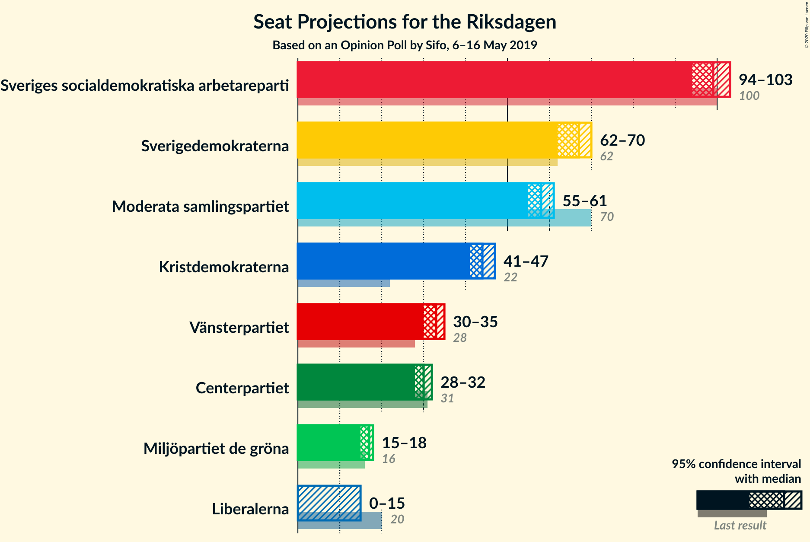
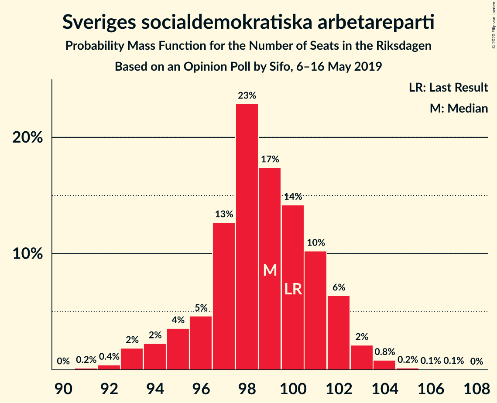
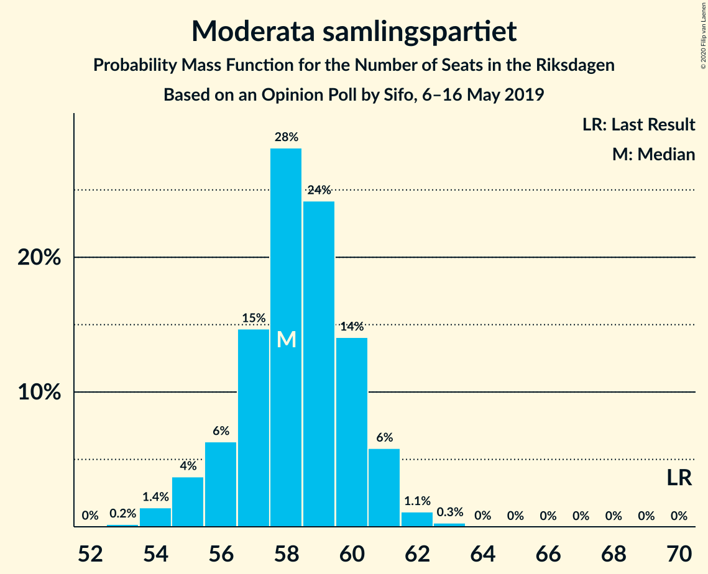
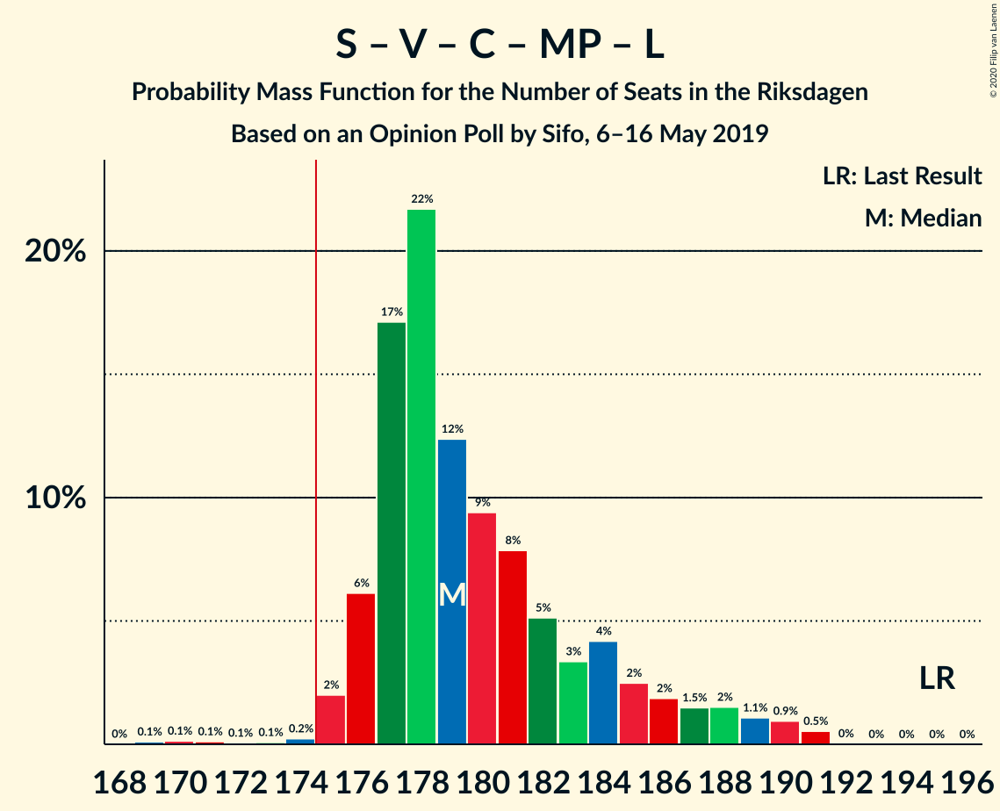
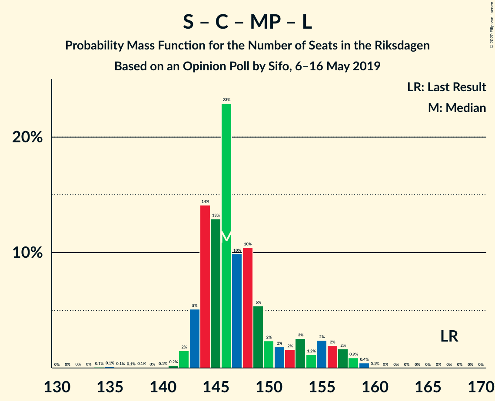
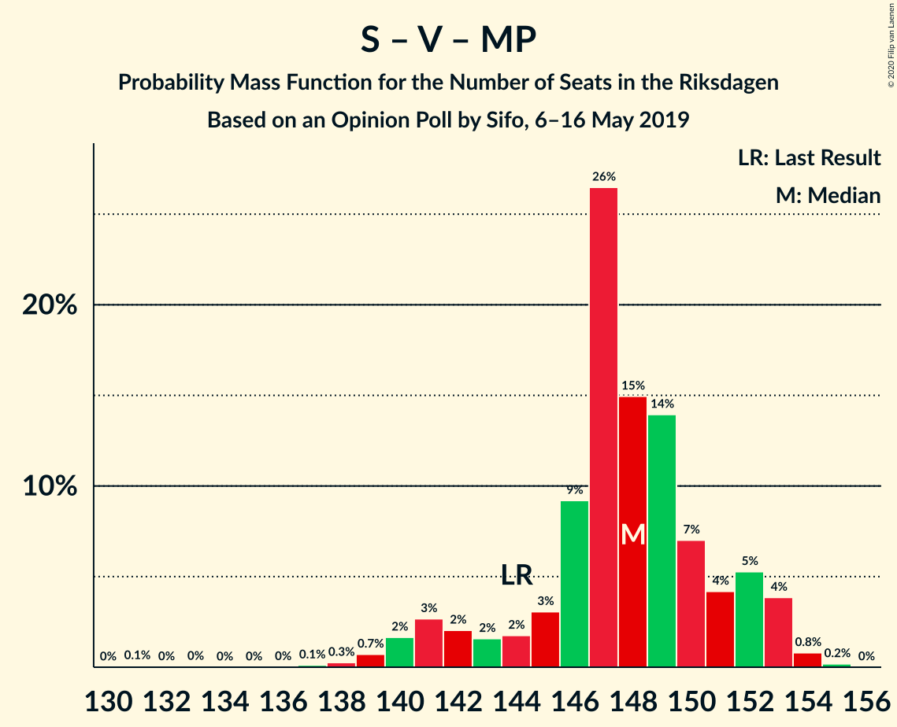

# Opinion Poll by Sifo, 6–16 May 2019

<a href="#voting-intentions">Voting Intentions</a> | <a href="#seats">Seats</a> | <a href="#coalitions">Coalitions</a> | <a href="#technical-information">Technical Information</a>

## Voting Intentions

### Confidence Intervals

| Party | Last Result | Poll Result | 80% Confidence Interval | 90% Confidence Interval | 95% Confidence Interval | 99% Confidence Interval |
|:-----:|:-----------:|:-----------:|:-----------------------:|:-----------------------:|:-----------------------:|:-----------------------:|
| Sveriges socialdemokratiska arbetareparti | 28.3% | 27.0% | 26.4–27.6% |26.3–27.8% |26.1–27.9% |25.8–28.2% |
| Sverigedemokraterna | 17.5% | 18.1% | 17.6–18.6% |17.5–18.8% |17.3–18.9% |17.1–19.1% |
| Moderata samlingspartiet | 19.8% | 15.9% | 15.4–16.4% |15.3–16.5% |15.2–16.7% |15.0–16.9% |
| Kristdemokraterna | 6.3% | 12.0% | 11.6–12.4% |11.5–12.6% |11.4–12.7% |11.2–12.9% |
| Vänsterpartiet | 8.0% | 8.9% | 8.5–9.3% |8.4–9.4% |8.3–9.5% |8.2–9.7% |
| Centerpartiet | 8.6% | 8.2% | 7.8–8.6% |7.7–8.7% |7.7–8.8% |7.5–8.9% |
| Miljöpartiet de gröna | 4.4% | 4.5% | 4.2–4.8% |4.2–4.9% |4.1–4.9% |4.0–5.1% |
| Liberalerna | 5.5% | 3.8% | 3.6–4.1% |3.5–4.1% |3.4–4.2% |3.3–4.3% |

*Note:* The poll result column reflects the actual value used in the calculations. Published results may vary slightly, and in addition be rounded to fewer digits.

## Seats

### Confidence Intervals

| Party | Last Result | Median | 80% Confidence Interval | 90% Confidence Interval | 95% Confidence Interval | 99% Confidence Interval |
|:-----:|:-----------:|:------:|:-----------------------:|:-----------------------:|:-----------------------:|:-----------------------:|
| <a href="#sveriges-socialdemokratiska-arbetareparti">Sveriges socialdemokratiska arbetareparti</a> | 100 | 98 | 97–101 |96–102 |94–102 |94–104 |
| <a href="#sverigedemokraterna">Sverigedemokraterna</a> | 62 | 67 | 65–68 |64–69 |63–69 |62–71 |
| <a href="#moderata-samlingspartiet">Moderata samlingspartiet</a> | 70 | 58 | 57–60 |56–60 |55–61 |54–62 |
| <a href="#kristdemokraterna">Kristdemokraterna</a> | 22 | 46 | 43–46 |42–46 |42–47 |40–47 |
| <a href="#vänsterpartiet">Vänsterpartiet</a> | 28 | 32 | 31–34 |31–34 |31–35 |29–35 |
| <a href="#centerpartiet">Centerpartiet</a> | 31 | 31 | 29–32 |29–32 |28–32 |28–33 |
| <a href="#miljöpartiet-de-gröna">Miljöpartiet de gröna</a> | 16 | 16 | 16–17 |15–17 |15–18 |0–18 |
| <a href="#liberalerna">Liberalerna</a> | 20 | 0 | 0 |0–14 |0–15 |0–15 |

### Sveriges socialdemokratiska arbetareparti

*For a full overview of the results for this party, see the [Sveriges socialdemokratiska arbetareparti](party-sverigessocialdemokratiskaarbetareparti.html) page.*

| Number of Seats | Probability | Accumulated | Special Marks |
|:---------------:|:-----------:|:-----------:|:-------------:|
| 91 | 0.1% | 100% |  |
| 92 | 0.1% | 99.9% |  |
| 93 | 0.3% | 99.8% |  |
| 94 | 2% | 99.6% |  |
| 95 | 0.9% | 97% |  |
| 96 | 3% | 97% |  |
| 97 | 17% | 94% |  |
| 98 | 47% | 76% | Median |
| 99 | 7% | 29% |  |
| 100 | 10% | 22% | Last Result |
| 101 | 5% | 12% |  |
| 102 | 6% | 8% |  |
| 103 | 1.4% | 2% |  |
| 104 | 0.5% | 0.6% |  |
| 105 | 0.1% | 0.1% |  |
| 106 | 0% | 0% |  |

### Sverigedemokraterna

*For a full overview of the results for this party, see the [Sverigedemokraterna](party-sverigedemokraterna.html) page.*

| Number of Seats | Probability | Accumulated | Special Marks |
|:---------------:|:-----------:|:-----------:|:-------------:|
| 60 | 0% | 100% |  |
| 61 | 0% | 99.9% |  |
| 62 | 1.2% | 99.9% | Last Result |
| 63 | 2% | 98.7% |  |
| 64 | 6% | 97% |  |
| 65 | 5% | 91% |  |
| 66 | 9% | 86% |  |
| 67 | 39% | 77% | Median |
| 68 | 30% | 38% |  |
| 69 | 7% | 8% |  |
| 70 | 0.7% | 1.3% |  |
| 71 | 0.5% | 0.6% |  |
| 72 | 0.1% | 0.1% |  |
| 73 | 0% | 0% |  |

### Moderata samlingspartiet

*For a full overview of the results for this party, see the [Moderata samlingspartiet](party-moderatasamlingspartiet.html) page.*

| Number of Seats | Probability | Accumulated | Special Marks |
|:---------------:|:-----------:|:-----------:|:-------------:|
| 53 | 0.2% | 100% |  |
| 54 | 0.4% | 99.8% |  |
| 55 | 4% | 99.4% |  |
| 56 | 3% | 95% |  |
| 57 | 11% | 93% |  |
| 58 | 45% | 81% | Median |
| 59 | 25% | 36% |  |
| 60 | 7% | 11% |  |
| 61 | 2% | 4% |  |
| 62 | 2% | 2% |  |
| 63 | 0.1% | 0.2% |  |
| 64 | 0% | 0% |  |
| 65 | 0% | 0% |  |
| 66 | 0% | 0% |  |
| 67 | 0% | 0% |  |
| 68 | 0% | 0% |  |
| 69 | 0% | 0% |  |
| 70 | 0% | 0% | Last Result |

### Kristdemokraterna

*For a full overview of the results for this party, see the [Kristdemokraterna](party-kristdemokraterna.html) page.*

| Number of Seats | Probability | Accumulated | Special Marks |
|:---------------:|:-----------:|:-----------:|:-------------:|
| 22 | 0% | 100% | Last Result |
| 23 | 0% | 100% |  |
| 24 | 0% | 100% |  |
| 25 | 0% | 100% |  |
| 26 | 0% | 100% |  |
| 27 | 0% | 100% |  |
| 28 | 0% | 100% |  |
| 29 | 0% | 100% |  |
| 30 | 0% | 100% |  |
| 31 | 0% | 100% |  |
| 32 | 0% | 100% |  |
| 33 | 0% | 100% |  |
| 34 | 0% | 100% |  |
| 35 | 0% | 100% |  |
| 36 | 0% | 100% |  |
| 37 | 0% | 100% |  |
| 38 | 0% | 100% |  |
| 39 | 0.1% | 100% |  |
| 40 | 0.5% | 99.9% |  |
| 41 | 0.5% | 99.4% |  |
| 42 | 7% | 99.0% |  |
| 43 | 2% | 92% |  |
| 44 | 30% | 90% |  |
| 45 | 5% | 60% |  |
| 46 | 52% | 55% | Median |
| 47 | 3% | 3% |  |
| 48 | 0.1% | 0.1% |  |
| 49 | 0% | 0% |  |

### Vänsterpartiet

*For a full overview of the results for this party, see the [Vänsterpartiet](party-vänsterpartiet.html) page.*

| Number of Seats | Probability | Accumulated | Special Marks |
|:---------------:|:-----------:|:-----------:|:-------------:|
| 28 | 0% | 100% | Last Result |
| 29 | 1.3% | 100% |  |
| 30 | 0.8% | 98.7% |  |
| 31 | 8% | 98% |  |
| 32 | 43% | 90% | Median |
| 33 | 21% | 47% |  |
| 34 | 22% | 26% |  |
| 35 | 3% | 4% |  |
| 36 | 0.4% | 0.4% |  |
| 37 | 0% | 0% |  |

### Centerpartiet

*For a full overview of the results for this party, see the [Centerpartiet](party-centerpartiet.html) page.*

| Number of Seats | Probability | Accumulated | Special Marks |
|:---------------:|:-----------:|:-----------:|:-------------:|
| 27 | 0.3% | 100% |  |
| 28 | 4% | 99.7% |  |
| 29 | 8% | 96% |  |
| 30 | 35% | 88% |  |
| 31 | 37% | 52% | Last Result, Median |
| 32 | 14% | 15% |  |
| 33 | 0.8% | 0.9% |  |
| 34 | 0.1% | 0.1% |  |
| 35 | 0% | 0% |  |

### Miljöpartiet de gröna

*For a full overview of the results for this party, see the [Miljöpartiet de gröna](party-miljöpartietdegröna.html) page.*

| Number of Seats | Probability | Accumulated | Special Marks |
|:---------------:|:-----------:|:-----------:|:-------------:|
| 0 | 0.7% | 100% |  |
| 1 | 0% | 99.3% |  |
| 2 | 0% | 99.3% |  |
| 3 | 0% | 99.3% |  |
| 4 | 0% | 99.3% |  |
| 5 | 0% | 99.3% |  |
| 6 | 0% | 99.3% |  |
| 7 | 0% | 99.3% |  |
| 8 | 0% | 99.3% |  |
| 9 | 0% | 99.3% |  |
| 10 | 0% | 99.3% |  |
| 11 | 0% | 99.3% |  |
| 12 | 0% | 99.3% |  |
| 13 | 0% | 99.3% |  |
| 14 | 0% | 99.3% |  |
| 15 | 6% | 99.3% |  |
| 16 | 45% | 93% | Last Result, Median |
| 17 | 45% | 48% |  |
| 18 | 3% | 3% |  |
| 19 | 0.1% | 0.1% |  |
| 20 | 0% | 0% |  |

### Liberalerna

*For a full overview of the results for this party, see the [Liberalerna](party-liberalerna.html) page.*

| Number of Seats | Probability | Accumulated | Special Marks |
|:---------------:|:-----------:|:-----------:|:-------------:|
| 0 | 93% | 100% | Median |
| 1 | 0% | 7% |  |
| 2 | 0% | 7% |  |
| 3 | 0% | 7% |  |
| 4 | 0% | 7% |  |
| 5 | 0% | 7% |  |
| 6 | 0% | 7% |  |
| 7 | 0% | 7% |  |
| 8 | 0% | 7% |  |
| 9 | 0% | 7% |  |
| 10 | 0% | 7% |  |
| 11 | 0% | 7% |  |
| 12 | 0% | 7% |  |
| 13 | 0% | 7% |  |
| 14 | 3% | 7% |  |
| 15 | 4% | 4% |  |
| 16 | 0.2% | 0.2% |  |
| 17 | 0% | 0% |  |
| 18 | 0% | 0% |  |
| 19 | 0% | 0% |  |
| 20 | 0% | 0% | Last Result |

## Coalitions

### Confidence Intervals

| Coalition | Last Result | Median | Majority? | 80% Confidence Interval | 90% Confidence Interval | 95% Confidence Interval | 99% Confidence Interval |
|:---------:|:-----------:|:------:|:---------:|:-----------------------:|:-----------------------:|:-----------------------:|:-----------------------:|
| Sveriges socialdemokratiska arbetareparti – Moderata samlingspartiet – Centerpartiet | 201 | 187 | 100% | 186–190 | 181–190 | 179–191 | 178–196 |
| Sveriges socialdemokratiska arbetareparti – Vänsterpartiet – Centerpartiet – Miljöpartiet de gröna – Liberalerna | 195 | 178 | 99.4% | 177–183 | 177–185 | 176–186 | 170–189 |
| Sverigedemokraterna – Moderata samlingspartiet – Kristdemokraterna | 154 | 171 | 0.6% | 166–172 | 164–172 | 163–173 | 160–179 |
| Sveriges socialdemokratiska arbetareparti – Moderata samlingspartiet | 170 | 156 | 0% | 156–159 | 152–160 | 150–161 | 149–166 |
| Sveriges socialdemokratiska arbetareparti – Centerpartiet – Miljöpartiet de gröna – Liberalerna | 167 | 146 | 0% | 143–150 | 143–155 | 143–156 | 136–157 |
| Sveriges socialdemokratiska arbetareparti – Vänsterpartiet – Miljöpartiet de gröna | 144 | 147 | 0% | 146–150 | 142–152 | 141–153 | 139–153 |
| Moderata samlingspartiet – Kristdemokraterna – Centerpartiet – Liberalerna | 143 | 135 | 0% | 131–136 | 131–142 | 130–144 | 129–144 |
| Moderata samlingspartiet – Kristdemokraterna – Centerpartiet | 123 | 135 | 0% | 131–135 | 129–136 | 128–136 | 125–139 |
| Sveriges socialdemokratiska arbetareparti – Vänsterpartiet | 128 | 131 | 0% | 130–134 | 128–136 | 125–136 | 125–139 |
| Sverigedemokraterna – Moderata samlingspartiet | 132 | 126 | 0% | 122–127 | 120–128 | 119–128 | 119–133 |
| Sveriges socialdemokratiska arbetareparti – Miljöpartiet de gröna | 116 | 115 | 0% | 113–118 | 112–119 | 110–119 | 104–120 |
| Moderata samlingspartiet – Centerpartiet – Liberalerna | 121 | 89 | 0% | 88–92 | 86–99 | 86–100 | 85–102 |
| Moderata samlingspartiet – Centerpartiet | 101 | 89 | 0% | 86–91 | 85–92 | 85–92 | 82–93 |

### Sveriges socialdemokratiska arbetareparti – Moderata samlingspartiet – Centerpartiet

| Number of Seats | Probability | Accumulated | Special Marks |
|:---------------:|:-----------:|:-----------:|:-------------:|
| 177 | 0.2% | 100% |  |
| 178 | 0.6% | 99.8% |  |
| 179 | 2% | 99.2% |  |
| 180 | 0.6% | 97% |  |
| 181 | 2% | 97% |  |
| 182 | 0.5% | 95% |  |
| 183 | 0.1% | 94% |  |
| 184 | 1.2% | 94% |  |
| 185 | 3% | 93% |  |
| 186 | 27% | 90% |  |
| 187 | 28% | 63% | Median |
| 188 | 6% | 36% |  |
| 189 | 18% | 30% |  |
| 190 | 7% | 12% |  |
| 191 | 2% | 5% |  |
| 192 | 2% | 2% |  |
| 193 | 0.2% | 0.8% |  |
| 194 | 0.1% | 0.7% |  |
| 195 | 0.1% | 0.6% |  |
| 196 | 0.1% | 0.5% |  |
| 197 | 0.4% | 0.5% |  |
| 198 | 0% | 0.1% |  |
| 199 | 0% | 0.1% |  |
| 200 | 0% | 0% |  |
| 201 | 0% | 0% | Last Result |

### Sveriges socialdemokratiska arbetareparti – Vänsterpartiet – Centerpartiet – Miljöpartiet de gröna – Liberalerna

| Number of Seats | Probability | Accumulated | Special Marks |
|:---------------:|:-----------:|:-----------:|:-------------:|
| 169 | 0.1% | 100% |  |
| 170 | 0.5% | 99.9% |  |
| 171 | 0% | 99.5% |  |
| 172 | 0% | 99.5% |  |
| 173 | 0% | 99.4% |  |
| 174 | 0.1% | 99.4% |  |
| 175 | 1.0% | 99.4% | Majority |
| 176 | 2% | 98% |  |
| 177 | 27% | 97% | Median |
| 178 | 34% | 70% |  |
| 179 | 14% | 36% |  |
| 180 | 6% | 21% |  |
| 181 | 1.4% | 15% |  |
| 182 | 2% | 14% |  |
| 183 | 2% | 11% |  |
| 184 | 4% | 9% |  |
| 185 | 1.0% | 6% |  |
| 186 | 2% | 5% |  |
| 187 | 1.3% | 2% |  |
| 188 | 0.5% | 1.0% |  |
| 189 | 0.2% | 0.5% |  |
| 190 | 0.3% | 0.4% |  |
| 191 | 0.1% | 0.1% |  |
| 192 | 0% | 0% |  |
| 193 | 0% | 0% |  |
| 194 | 0% | 0% |  |
| 195 | 0% | 0% | Last Result |

### Sverigedemokraterna – Moderata samlingspartiet – Kristdemokraterna

| Number of Seats | Probability | Accumulated | Special Marks |
|:---------------:|:-----------:|:-----------:|:-------------:|
| 154 | 0% | 100% | Last Result |
| 155 | 0% | 100% |  |
| 156 | 0% | 100% |  |
| 157 | 0% | 100% |  |
| 158 | 0.1% | 100% |  |
| 159 | 0.3% | 99.9% |  |
| 160 | 0.2% | 99.6% |  |
| 161 | 0.5% | 99.5% |  |
| 162 | 1.3% | 99.0% |  |
| 163 | 2% | 98% |  |
| 164 | 1.0% | 95% |  |
| 165 | 4% | 94% |  |
| 166 | 2% | 91% |  |
| 167 | 2% | 89% |  |
| 168 | 1.4% | 86% |  |
| 169 | 6% | 85% |  |
| 170 | 14% | 79% |  |
| 171 | 34% | 64% | Median |
| 172 | 27% | 30% |  |
| 173 | 2% | 3% |  |
| 174 | 1.0% | 2% |  |
| 175 | 0.1% | 0.6% | Majority |
| 176 | 0% | 0.6% |  |
| 177 | 0% | 0.6% |  |
| 178 | 0% | 0.5% |  |
| 179 | 0.5% | 0.5% |  |
| 180 | 0.1% | 0.1% |  |
| 181 | 0% | 0% |  |

### Sveriges socialdemokratiska arbetareparti – Moderata samlingspartiet

| Number of Seats | Probability | Accumulated | Special Marks |
|:---------------:|:-----------:|:-----------:|:-------------:|
| 147 | 0% | 100% |  |
| 148 | 0% | 99.9% |  |
| 149 | 2% | 99.9% |  |
| 150 | 0.7% | 98% |  |
| 151 | 2% | 97% |  |
| 152 | 0.6% | 96% |  |
| 153 | 0.4% | 95% |  |
| 154 | 1.3% | 94% |  |
| 155 | 0.9% | 93% |  |
| 156 | 54% | 92% | Median |
| 157 | 16% | 38% |  |
| 158 | 3% | 22% |  |
| 159 | 14% | 19% |  |
| 160 | 2% | 6% |  |
| 161 | 2% | 4% |  |
| 162 | 0.2% | 2% |  |
| 163 | 0.7% | 1.3% |  |
| 164 | 0.1% | 0.6% |  |
| 165 | 0% | 0.6% |  |
| 166 | 0.5% | 0.6% |  |
| 167 | 0.1% | 0.1% |  |
| 168 | 0% | 0% |  |
| 169 | 0% | 0% |  |
| 170 | 0% | 0% | Last Result |

### Sveriges socialdemokratiska arbetareparti – Centerpartiet – Miljöpartiet de gröna – Liberalerna

| Number of Seats | Probability | Accumulated | Special Marks |
|:---------------:|:-----------:|:-----------:|:-------------:|
| 134 | 0% | 100% |  |
| 135 | 0.4% | 99.9% |  |
| 136 | 0% | 99.5% |  |
| 137 | 0% | 99.5% |  |
| 138 | 0% | 99.5% |  |
| 139 | 0% | 99.4% |  |
| 140 | 0% | 99.4% |  |
| 141 | 0.1% | 99.4% |  |
| 142 | 0.3% | 99.4% |  |
| 143 | 10% | 99.0% |  |
| 144 | 20% | 89% |  |
| 145 | 8% | 69% | Median |
| 146 | 31% | 61% |  |
| 147 | 12% | 30% |  |
| 148 | 4% | 18% |  |
| 149 | 3% | 14% |  |
| 150 | 3% | 10% |  |
| 151 | 1.1% | 8% |  |
| 152 | 0.3% | 7% |  |
| 153 | 0.9% | 6% |  |
| 154 | 0.2% | 5% |  |
| 155 | 2% | 5% |  |
| 156 | 2% | 3% |  |
| 157 | 0.6% | 0.7% |  |
| 158 | 0.1% | 0.2% |  |
| 159 | 0% | 0.1% |  |
| 160 | 0% | 0% |  |
| 161 | 0% | 0% |  |
| 162 | 0% | 0% |  |
| 163 | 0% | 0% |  |
| 164 | 0% | 0% |  |
| 165 | 0% | 0% |  |
| 166 | 0% | 0% |  |
| 167 | 0% | 0% | Last Result |

### Sveriges socialdemokratiska arbetareparti – Vänsterpartiet – Miljöpartiet de gröna

| Number of Seats | Probability | Accumulated | Special Marks |
|:---------------:|:-----------:|:-----------:|:-------------:|
| 133 | 0.1% | 100% |  |
| 134 | 0% | 99.9% |  |
| 135 | 0% | 99.9% |  |
| 136 | 0% | 99.9% |  |
| 137 | 0% | 99.9% |  |
| 138 | 0% | 99.9% |  |
| 139 | 0.7% | 99.8% |  |
| 140 | 0.6% | 99.1% |  |
| 141 | 3% | 98.5% |  |
| 142 | 1.2% | 96% |  |
| 143 | 0.3% | 95% |  |
| 144 | 0.2% | 94% | Last Result |
| 145 | 2% | 94% |  |
| 146 | 8% | 92% | Median |
| 147 | 57% | 84% |  |
| 148 | 5% | 27% |  |
| 149 | 8% | 22% |  |
| 150 | 5% | 14% |  |
| 151 | 2% | 9% |  |
| 152 | 3% | 7% |  |
| 153 | 4% | 4% |  |
| 154 | 0.2% | 0.3% |  |
| 155 | 0.1% | 0.1% |  |
| 156 | 0% | 0% |  |

### Moderata samlingspartiet – Kristdemokraterna – Centerpartiet – Liberalerna

| Number of Seats | Probability | Accumulated | Special Marks |
|:---------------:|:-----------:|:-----------:|:-------------:|
| 128 | 0.2% | 100% |  |
| 129 | 0.4% | 99.7% |  |
| 130 | 2% | 99.4% |  |
| 131 | 8% | 97% |  |
| 132 | 8% | 89% |  |
| 133 | 4% | 81% |  |
| 134 | 17% | 77% |  |
| 135 | 45% | 60% | Median |
| 136 | 6% | 15% |  |
| 137 | 1.1% | 9% |  |
| 138 | 0.7% | 8% |  |
| 139 | 1.0% | 7% |  |
| 140 | 0.6% | 6% |  |
| 141 | 0.2% | 6% |  |
| 142 | 0.9% | 5% |  |
| 143 | 2% | 5% | Last Result |
| 144 | 2% | 3% |  |
| 145 | 0.1% | 0.3% |  |
| 146 | 0.1% | 0.3% |  |
| 147 | 0.1% | 0.1% |  |
| 148 | 0% | 0% |  |

### Moderata samlingspartiet – Kristdemokraterna – Centerpartiet

| Number of Seats | Probability | Accumulated | Special Marks |
|:---------------:|:-----------:|:-----------:|:-------------:|
| 123 | 0% | 100% | Last Result |
| 124 | 0.2% | 100% |  |
| 125 | 0.6% | 99.8% |  |
| 126 | 0.3% | 99.1% |  |
| 127 | 0.2% | 98.8% |  |
| 128 | 2% | 98.6% |  |
| 129 | 3% | 97% |  |
| 130 | 3% | 93% |  |
| 131 | 8% | 91% |  |
| 132 | 8% | 82% |  |
| 133 | 4% | 75% |  |
| 134 | 17% | 71% |  |
| 135 | 45% | 53% | Median |
| 136 | 6% | 8% |  |
| 137 | 1.1% | 2% |  |
| 138 | 0.6% | 1.3% |  |
| 139 | 0.6% | 0.6% |  |
| 140 | 0% | 0% |  |

### Sveriges socialdemokratiska arbetareparti – Vänsterpartiet

| Number of Seats | Probability | Accumulated | Special Marks |
|:---------------:|:-----------:|:-----------:|:-------------:|
| 123 | 0.1% | 100% |  |
| 124 | 0.3% | 99.8% |  |
| 125 | 3% | 99.5% |  |
| 126 | 0.5% | 96% |  |
| 127 | 0.9% | 96% |  |
| 128 | 2% | 95% | Last Result |
| 129 | 0.8% | 93% |  |
| 130 | 33% | 93% | Median |
| 131 | 34% | 59% |  |
| 132 | 7% | 25% |  |
| 133 | 7% | 18% |  |
| 134 | 3% | 11% |  |
| 135 | 1.0% | 7% |  |
| 136 | 6% | 6% |  |
| 137 | 0.3% | 0.9% |  |
| 138 | 0.1% | 0.6% |  |
| 139 | 0.5% | 0.5% |  |
| 140 | 0% | 0% |  |

### Sverigedemokraterna – Moderata samlingspartiet

| Number of Seats | Probability | Accumulated | Special Marks |
|:---------------:|:-----------:|:-----------:|:-------------:|
| 116 | 0.3% | 100% |  |
| 117 | 0% | 99.6% |  |
| 118 | 0.1% | 99.6% |  |
| 119 | 3% | 99.5% |  |
| 120 | 2% | 97% |  |
| 121 | 4% | 95% |  |
| 122 | 3% | 91% |  |
| 123 | 1.2% | 87% |  |
| 124 | 0.8% | 86% |  |
| 125 | 33% | 85% | Median |
| 126 | 37% | 53% |  |
| 127 | 10% | 16% |  |
| 128 | 4% | 6% |  |
| 129 | 0.8% | 2% |  |
| 130 | 0.1% | 0.8% |  |
| 131 | 0.1% | 0.7% |  |
| 132 | 0% | 0.5% | Last Result |
| 133 | 0.4% | 0.5% |  |
| 134 | 0.1% | 0.1% |  |
| 135 | 0% | 0% |  |

### Sveriges socialdemokratiska arbetareparti – Miljöpartiet de gröna

| Number of Seats | Probability | Accumulated | Special Marks |
|:---------------:|:-----------:|:-----------:|:-------------:|
| 101 | 0.1% | 100% |  |
| 102 | 0% | 99.9% |  |
| 103 | 0% | 99.9% |  |
| 104 | 0.5% | 99.8% |  |
| 105 | 0% | 99.4% |  |
| 106 | 0% | 99.3% |  |
| 107 | 0% | 99.3% |  |
| 108 | 0.1% | 99.3% |  |
| 109 | 0.2% | 99.2% |  |
| 110 | 2% | 98.9% |  |
| 111 | 2% | 97% |  |
| 112 | 1.3% | 95% |  |
| 113 | 15% | 94% |  |
| 114 | 26% | 78% | Median |
| 115 | 30% | 52% |  |
| 116 | 4% | 22% | Last Result |
| 117 | 6% | 18% |  |
| 118 | 6% | 12% |  |
| 119 | 5% | 6% |  |
| 120 | 1.3% | 2% |  |
| 121 | 0.2% | 0.2% |  |
| 122 | 0% | 0.1% |  |
| 123 | 0% | 0% |  |

### Moderata samlingspartiet – Centerpartiet – Liberalerna

| Number of Seats | Probability | Accumulated | Special Marks |
|:---------------:|:-----------:|:-----------:|:-------------:|
| 84 | 0.2% | 100% |  |
| 85 | 0.6% | 99.8% |  |
| 86 | 5% | 99.2% |  |
| 87 | 4% | 94% |  |
| 88 | 22% | 90% |  |
| 89 | 40% | 68% | Median |
| 90 | 5% | 28% |  |
| 91 | 10% | 24% |  |
| 92 | 6% | 14% |  |
| 93 | 1.2% | 8% |  |
| 94 | 0.1% | 7% |  |
| 95 | 0.1% | 7% |  |
| 96 | 0.5% | 7% |  |
| 97 | 0.4% | 6% |  |
| 98 | 0.1% | 6% |  |
| 99 | 1.0% | 6% |  |
| 100 | 4% | 5% |  |
| 101 | 0.2% | 0.9% |  |
| 102 | 0.4% | 0.6% |  |
| 103 | 0.1% | 0.3% |  |
| 104 | 0.1% | 0.1% |  |
| 105 | 0% | 0% |  |
| 106 | 0% | 0% |  |
| 107 | 0% | 0% |  |
| 108 | 0% | 0% |  |
| 109 | 0% | 0% |  |
| 110 | 0% | 0% |  |
| 111 | 0% | 0% |  |
| 112 | 0% | 0% |  |
| 113 | 0% | 0% |  |
| 114 | 0% | 0% |  |
| 115 | 0% | 0% |  |
| 116 | 0% | 0% |  |
| 117 | 0% | 0% |  |
| 118 | 0% | 0% |  |
| 119 | 0% | 0% |  |
| 120 | 0% | 0% |  |
| 121 | 0% | 0% | Last Result |

### Moderata samlingspartiet – Centerpartiet

| Number of Seats | Probability | Accumulated | Special Marks |
|:---------------:|:-----------:|:-----------:|:-------------:|
| 82 | 0.5% | 100% |  |
| 83 | 0.4% | 99.5% |  |
| 84 | 0.6% | 99.0% |  |
| 85 | 4% | 98% |  |
| 86 | 6% | 94% |  |
| 87 | 4% | 88% |  |
| 88 | 22% | 84% |  |
| 89 | 40% | 62% | Median |
| 90 | 5% | 22% |  |
| 91 | 10% | 17% |  |
| 92 | 6% | 7% |  |
| 93 | 1.2% | 1.4% |  |
| 94 | 0.1% | 0.1% |  |
| 95 | 0.1% | 0.1% |  |
| 96 | 0% | 0% |  |
| 97 | 0% | 0% |  |
| 98 | 0% | 0% |  |
| 99 | 0% | 0% |  |
| 100 | 0% | 0% |  |
| 101 | 0% | 0% | Last Result |

## Technical Information

### Opinion Poll

+ **Polling firm:** Sifo
+ **Commissioner(s):** —
+ **Fieldwork period:** 6–16 May 2019

### Calculations

+ **Sample size:** 9626
+ **Simulations done:** 131,072
+ **Error estimate:** 0.52%

