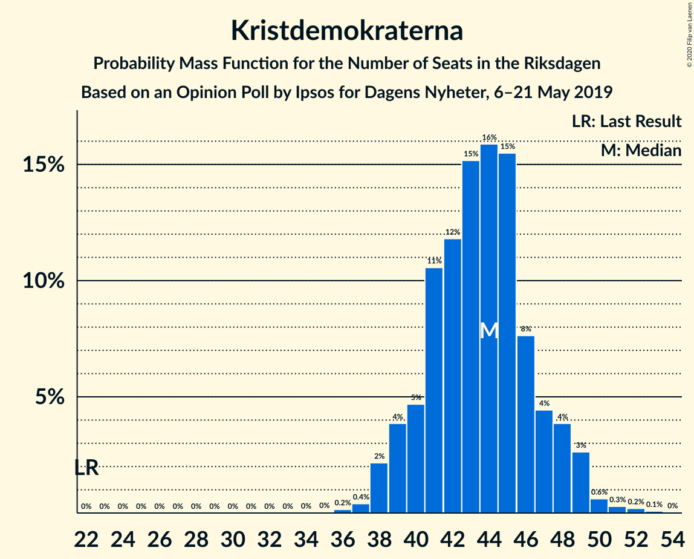
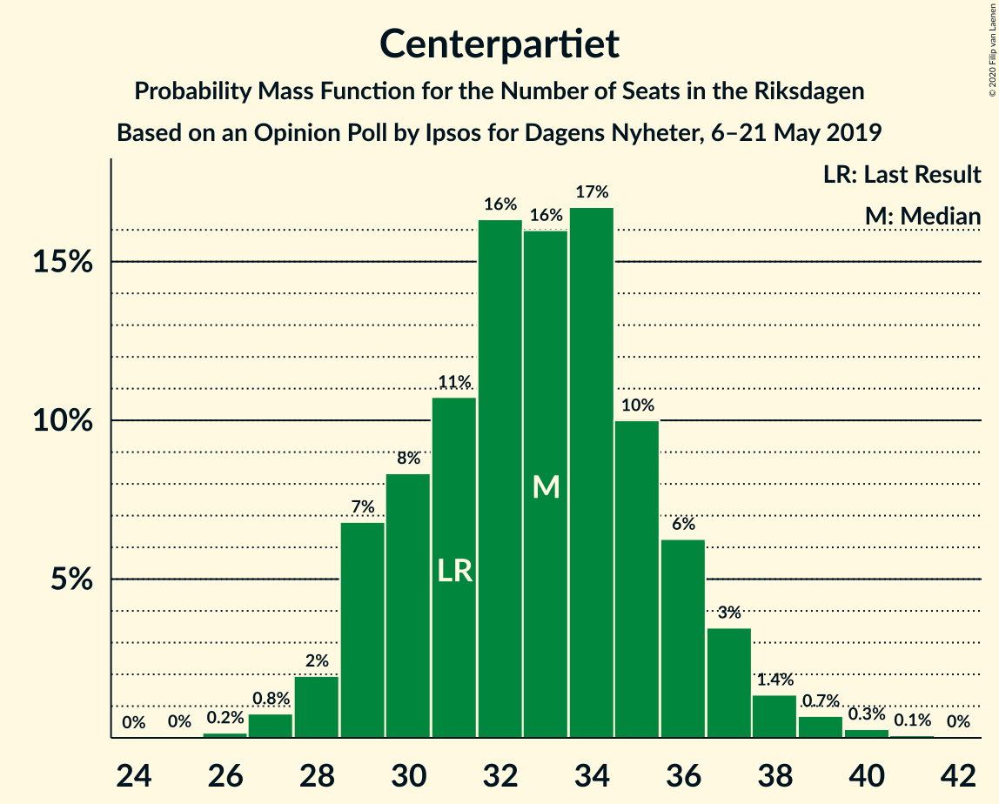
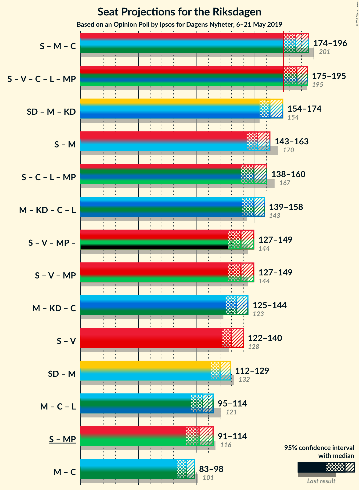
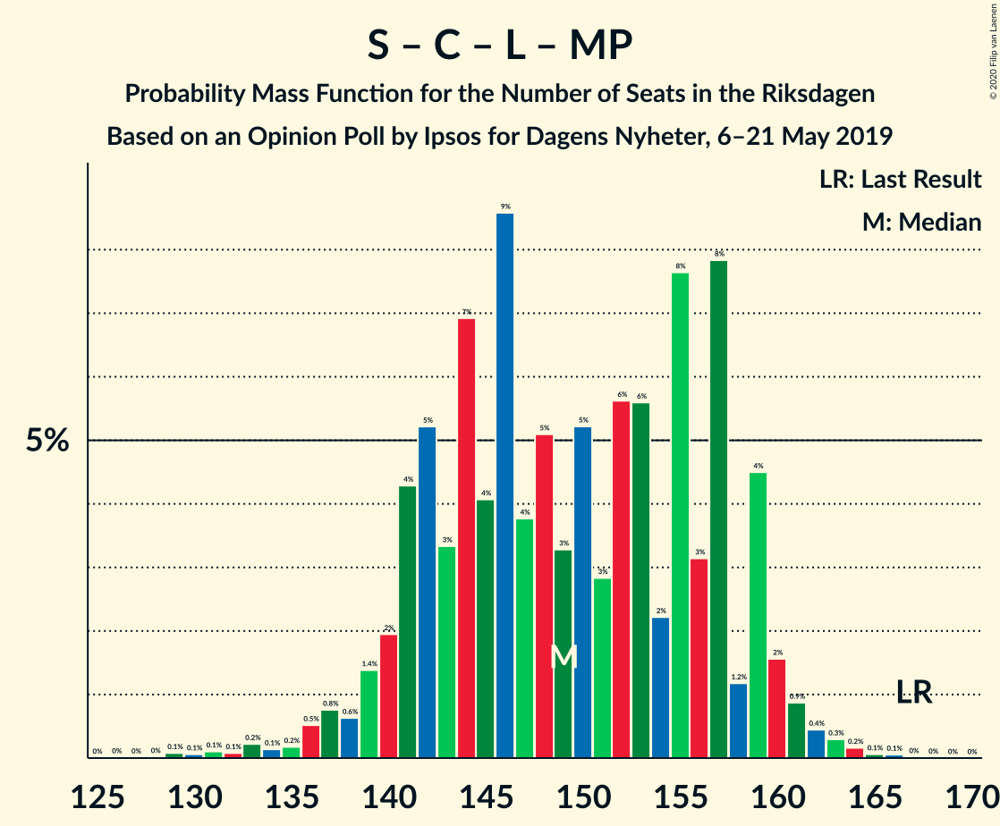
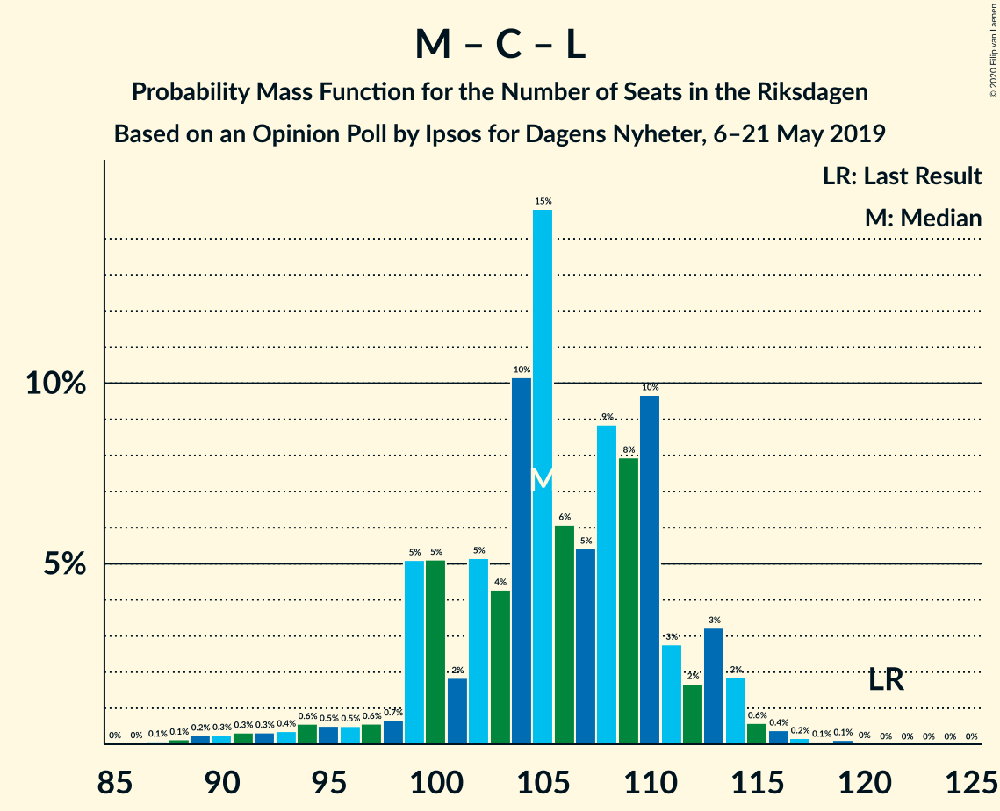

# Opinion Poll by Ipsos for Dagens Nyheter, 6–21 May 2019

<a href="#voting-intentions">Voting Intentions</a> | <a href="#seats">Seats</a> | <a href="#coalitions">Coalitions</a> | <a href="#technical-information">Technical Information</a>

## Voting Intentions

### Confidence Intervals

| Party | Last Result | Poll Result | 80% Confidence Interval | 90% Confidence Interval | 95% Confidence Interval | 99% Confidence Interval |
|:-----:|:-----------:|:-----------:|:-----------------------:|:-----------------------:|:-----------------------:|:-----------------------:|
| Sveriges socialdemokratiska arbetareparti | 28.3% | 26.0% | 24.8–27.2% |24.4–27.6% |24.2–27.9% |23.6–28.5% |
| Sverigedemokraterna | 17.5% | 17.0% | 16.0–18.1% |15.7–18.4% |15.4–18.6% |15.0–19.2% |
| Moderata samlingspartiet | 19.8% | 16.0% | 15.0–17.1% |14.7–17.4% |14.5–17.6% |14.0–18.1% |
| Kristdemokraterna | 6.3% | 12.0% | 11.1–12.9% |10.9–13.2% |10.7–13.4% |10.3–13.9% |
| Vänsterpartiet | 8.0% | 10.0% | 9.2–10.9% |9.0–11.1% |8.8–11.3% |8.4–11.8% |
| Centerpartiet | 8.6% | 9.0% | 8.2–9.8% |8.0–10.1% |7.8–10.3% |7.5–10.7% |
| Liberalerna | 5.5% | 4.0% | 3.5–4.6% |3.4–4.8% |3.2–4.9% |3.0–5.2% |
| Miljöpartiet de gröna | 4.4% | 4.0% | 3.5–4.6% |3.4–4.8% |3.2–4.9% |3.0–5.2% |

*Note:* The poll result column reflects the actual value used in the calculations. Published results may vary slightly, and in addition be rounded to fewer digits.

## Seats

### Confidence Intervals

| Party | Last Result | Median | 80% Confidence Interval | 90% Confidence Interval | 95% Confidence Interval | 99% Confidence Interval |
|:-----:|:-----------:|:------:|:-----------------------:|:-----------------------:|:-----------------------:|:-----------------------:|
| <a href="#sveriges-socialdemokratiska-arbetareparti">Sveriges socialdemokratiska arbetareparti</a> | 100 | 93 | 92–95 |92–95 |92–99 |84–103 |
| <a href="#sverigedemokraterna">Sverigedemokraterna</a> | 62 | 67 | 63–67 |62–67 |61–67 |57–70 |
| <a href="#moderata-samlingspartiet">Moderata samlingspartiet</a> | 70 | 55 | 55–57 |52–57 |52–63 |50–68 |
| <a href="#kristdemokraterna">Kristdemokraterna</a> | 22 | 39 | 39–48 |39–50 |39–50 |38–51 |
| <a href="#vänsterpartiet">Vänsterpartiet</a> | 28 | 35 | 35–38 |35–40 |35–40 |32–44 |
| <a href="#centerpartiet">Centerpartiet</a> | 31 | 27 | 27–42 |27–42 |27–42 |27–42 |
| <a href="#liberalerna">Liberalerna</a> | 20 | 16 | 0–16 |0–16 |0–16 |0–20 |
| <a href="#miljöpartiet-de-gröna">Miljöpartiet de gröna</a> | 16 | 17 | 0–17 |0–19 |0–19 |0–19 |

### Sveriges socialdemokratiska arbetareparti

*For a full overview of the results for this party, see the [Sveriges socialdemokratiska arbetareparti](party-sverigessocialdemokratiskaarbetareparti.html) page.*

| Number of Seats | Probability | Accumulated | Special Marks |
|:---------------:|:-----------:|:-----------:|:-------------:|
| 84 | 1.0% | 100% |  |
| 85 | 0.1% | 99.0% |  |
| 86 | 0% | 98.8% |  |
| 87 | 0% | 98.8% |  |
| 88 | 0% | 98.8% |  |
| 89 | 0% | 98.8% |  |
| 90 | 0.1% | 98.8% |  |
| 91 | 0% | 98.8% |  |
| 92 | 30% | 98.8% |  |
| 93 | 51% | 69% | Median |
| 94 | 0% | 18% |  |
| 95 | 14% | 18% |  |
| 96 | 0.5% | 3% |  |
| 97 | 0.3% | 3% |  |
| 98 | 0% | 3% |  |
| 99 | 0.1% | 3% |  |
| 100 | 0.5% | 2% | Last Result |
| 101 | 0.2% | 2% |  |
| 102 | 0% | 2% |  |
| 103 | 1.3% | 2% |  |
| 104 | 0.1% | 0.3% |  |
| 105 | 0% | 0.2% |  |
| 106 | 0% | 0.2% |  |
| 107 | 0% | 0.2% |  |
| 108 | 0% | 0.2% |  |
| 109 | 0% | 0.1% |  |
| 110 | 0.1% | 0.1% |  |
| 111 | 0% | 0% |  |

### Sverigedemokraterna

*For a full overview of the results for this party, see the [Sverigedemokraterna](party-sverigedemokraterna.html) page.*

| Number of Seats | Probability | Accumulated | Special Marks |
|:---------------:|:-----------:|:-----------:|:-------------:|
| 53 | 0.3% | 100% |  |
| 54 | 0% | 99.7% |  |
| 55 | 0.1% | 99.7% |  |
| 56 | 0% | 99.5% |  |
| 57 | 0% | 99.5% |  |
| 58 | 0.3% | 99.5% |  |
| 59 | 0% | 99.2% |  |
| 60 | 0% | 99.2% |  |
| 61 | 2% | 99.2% |  |
| 62 | 3% | 97% | Last Result |
| 63 | 38% | 95% |  |
| 64 | 0% | 57% |  |
| 65 | 5% | 57% |  |
| 66 | 0.2% | 52% |  |
| 67 | 51% | 52% | Median |
| 68 | 0% | 0.7% |  |
| 69 | 0.1% | 0.7% |  |
| 70 | 0.2% | 0.6% |  |
| 71 | 0% | 0.4% |  |
| 72 | 0% | 0.4% |  |
| 73 | 0.4% | 0.4% |  |
| 74 | 0% | 0% |  |

### Moderata samlingspartiet

*For a full overview of the results for this party, see the [Moderata samlingspartiet](party-moderatasamlingspartiet.html) page.*

| Number of Seats | Probability | Accumulated | Special Marks |
|:---------------:|:-----------:|:-----------:|:-------------:|
| 49 | 0.1% | 100% |  |
| 50 | 0.9% | 99.8% |  |
| 51 | 0% | 98.9% |  |
| 52 | 5% | 98.9% |  |
| 53 | 2% | 94% |  |
| 54 | 0% | 92% |  |
| 55 | 59% | 92% | Median |
| 56 | 0.2% | 33% |  |
| 57 | 30% | 33% |  |
| 58 | 0.2% | 3% |  |
| 59 | 0% | 3% |  |
| 60 | 0.3% | 3% |  |
| 61 | 0.1% | 3% |  |
| 62 | 0% | 3% |  |
| 63 | 2% | 3% |  |
| 64 | 0% | 1.1% |  |
| 65 | 0% | 1.1% |  |
| 66 | 0% | 1.1% |  |
| 67 | 0.1% | 1.1% |  |
| 68 | 1.0% | 1.0% |  |
| 69 | 0% | 0% |  |
| 70 | 0% | 0% | Last Result |

### Kristdemokraterna

*For a full overview of the results for this party, see the [Kristdemokraterna](party-kristdemokraterna.html) page.*

| Number of Seats | Probability | Accumulated | Special Marks |
|:---------------:|:-----------:|:-----------:|:-------------:|
| 22 | 0% | 100% | Last Result |
| 23 | 0% | 100% |  |
| 24 | 0% | 100% |  |
| 25 | 0% | 100% |  |
| 26 | 0% | 100% |  |
| 27 | 0% | 100% |  |
| 28 | 0% | 100% |  |
| 29 | 0% | 100% |  |
| 30 | 0% | 100% |  |
| 31 | 0% | 100% |  |
| 32 | 0% | 100% |  |
| 33 | 0% | 100% |  |
| 34 | 0% | 100% |  |
| 35 | 0% | 100% |  |
| 36 | 0.2% | 100% |  |
| 37 | 0% | 99.8% |  |
| 38 | 0.5% | 99.7% |  |
| 39 | 51% | 99.3% | Median |
| 40 | 0% | 48% |  |
| 41 | 1.1% | 48% |  |
| 42 | 30% | 47% |  |
| 43 | 0.1% | 17% |  |
| 44 | 0% | 17% |  |
| 45 | 5% | 17% |  |
| 46 | 0% | 11% |  |
| 47 | 0.1% | 11% |  |
| 48 | 2% | 11% |  |
| 49 | 0.2% | 9% |  |
| 50 | 7% | 9% |  |
| 51 | 1.2% | 1.3% |  |
| 52 | 0.1% | 0.1% |  |
| 53 | 0% | 0% |  |

### Vänsterpartiet

*For a full overview of the results for this party, see the [Vänsterpartiet](party-vänsterpartiet.html) page.*

| Number of Seats | Probability | Accumulated | Special Marks |
|:---------------:|:-----------:|:-----------:|:-------------:|
| 28 | 0% | 100% | Last Result |
| 29 | 0% | 100% |  |
| 30 | 0.1% | 100% |  |
| 31 | 0% | 99.9% |  |
| 32 | 0.4% | 99.8% |  |
| 33 | 0.5% | 99.5% |  |
| 34 | 0.5% | 99.0% |  |
| 35 | 58% | 98% | Median |
| 36 | 0% | 40% |  |
| 37 | 0.1% | 40% |  |
| 38 | 31% | 40% |  |
| 39 | 0.2% | 9% |  |
| 40 | 8% | 9% |  |
| 41 | 0% | 0.7% |  |
| 42 | 0% | 0.7% |  |
| 43 | 0% | 0.7% |  |
| 44 | 0.6% | 0.7% |  |
| 45 | 0% | 0% |  |

### Centerpartiet

*For a full overview of the results for this party, see the [Centerpartiet](party-centerpartiet.html) page.*

| Number of Seats | Probability | Accumulated | Special Marks |
|:---------------:|:-----------:|:-----------:|:-------------:|
| 27 | 51% | 100% | Median |
| 28 | 0.4% | 49% |  |
| 29 | 0.1% | 48% |  |
| 30 | 7% | 48% |  |
| 31 | 0.1% | 41% | Last Result |
| 32 | 0.7% | 41% |  |
| 33 | 0% | 40% |  |
| 34 | 0.2% | 40% |  |
| 35 | 0.3% | 40% |  |
| 36 | 2% | 40% |  |
| 37 | 2% | 37% |  |
| 38 | 5% | 35% |  |
| 39 | 0% | 30% |  |
| 40 | 0% | 30% |  |
| 41 | 0% | 30% |  |
| 42 | 30% | 30% |  |
| 43 | 0% | 0% |  |

### Liberalerna

*For a full overview of the results for this party, see the [Liberalerna](party-liberalerna.html) page.*

| Number of Seats | Probability | Accumulated | Special Marks |
|:---------------:|:-----------:|:-----------:|:-------------:|
| 0 | 15% | 100% |  |
| 1 | 0% | 85% |  |
| 2 | 0% | 85% |  |
| 3 | 0% | 85% |  |
| 4 | 0% | 85% |  |
| 5 | 0% | 85% |  |
| 6 | 0% | 85% |  |
| 7 | 0% | 85% |  |
| 8 | 0% | 85% |  |
| 9 | 0% | 85% |  |
| 10 | 0% | 85% |  |
| 11 | 0% | 85% |  |
| 12 | 0% | 85% |  |
| 13 | 0% | 85% |  |
| 14 | 0% | 85% |  |
| 15 | 32% | 85% |  |
| 16 | 51% | 53% | Median |
| 17 | 0.1% | 2% |  |
| 18 | 0% | 2% |  |
| 19 | 0% | 2% |  |
| 20 | 2% | 2% | Last Result |
| 21 | 0% | 0% |  |

### Miljöpartiet de gröna

*For a full overview of the results for this party, see the [Miljöpartiet de gröna](party-miljöpartietdegröna.html) page.*

| Number of Seats | Probability | Accumulated | Special Marks |
|:---------------:|:-----------:|:-----------:|:-------------:|
| 0 | 35% | 100% |  |
| 1 | 0% | 65% |  |
| 2 | 0% | 65% |  |
| 3 | 0% | 65% |  |
| 4 | 0% | 65% |  |
| 5 | 0% | 65% |  |
| 6 | 0% | 65% |  |
| 7 | 0% | 65% |  |
| 8 | 0% | 65% |  |
| 9 | 0% | 65% |  |
| 10 | 0% | 65% |  |
| 11 | 0% | 65% |  |
| 12 | 0% | 65% |  |
| 13 | 0% | 65% |  |
| 14 | 0.3% | 65% |  |
| 15 | 0.1% | 65% |  |
| 16 | 7% | 65% | Last Result |
| 17 | 52% | 58% | Median |
| 18 | 0% | 5% |  |
| 19 | 5% | 5% |  |
| 20 | 0% | 0% |  |

## Coalitions

### Confidence Intervals

| Coalition | Last Result | Median | Majority? | 80% Confidence Interval | 90% Confidence Interval | 95% Confidence Interval | 99% Confidence Interval |
|:---------:|:-----------:|:------:|:---------:|:-----------------------:|:-----------------------:|:-----------------------:|:-----------------------:|
| Sveriges socialdemokratiska arbetareparti – Moderata samlingspartiet – Centerpartiet | 201 | 175 | 99.9% | 175–191 | 175–191 | 175–191 | 175–200 |
| Sveriges socialdemokratiska arbetareparti – Vänsterpartiet – Centerpartiet – Liberalerna – Miljöpartiet de gröna | 195 | 188 | 98% | 181–188 | 181–188 | 180–188 | 173–196 |
| Sverigedemokraterna – Moderata samlingspartiet – Kristdemokraterna | 154 | 161 | 2% | 161–168 | 161–168 | 161–169 | 153–176 |
| Moderata samlingspartiet – Kristdemokraterna – Centerpartiet – Liberalerna | 143 | 137 | 0% | 135–156 | 135–156 | 135–158 | 127–165 |
| Sveriges socialdemokratiska arbetareparti – Moderata samlingspartiet | 170 | 148 | 0% | 148–150 | 147–150 | 147–156 | 147–168 |
| Sveriges socialdemokratiska arbetareparti – Centerpartiet – Liberalerna – Miljöpartiet de gröna | 167 | 153 | 0% | 146–153 | 141–153 | 141–153 | 133–156 |
| Sveriges socialdemokratiska arbetareparti – Vänsterpartiet – Miljöpartiet de gröna | 144 | 145 | 0% | 130–149 | 130–151 | 130–151 | 122–160 |
| Moderata samlingspartiet – Kristdemokraterna – Centerpartiet | 123 | 121 | 0% | 121–141 | 121–141 | 121–141 | 121–150 |
| Sveriges socialdemokratiska arbetareparti – Vänsterpartiet | 128 | 128 | 0% | 128–133 | 128–135 | 128–136 | 122–143 |
| Sverigedemokraterna – Moderata samlingspartiet | 132 | 122 | 0% | 118–122 | 117–122 | 114–125 | 112–131 |
| Sveriges socialdemokratiska arbetareparti – Miljöpartiet de gröna | 116 | 110 | 0% | 92–111 | 92–114 | 92–114 | 84–120 |
| Moderata samlingspartiet – Centerpartiet – Liberalerna | 121 | 98 | 0% | 90–114 | 85–114 | 85–114 | 85–115 |
| Moderata samlingspartiet – Centerpartiet | 101 | 82 | 0% | 82–99 | 82–99 | 82–99 | 82–100 |

### Sveriges socialdemokratiska arbetareparti – Moderata samlingspartiet – Centerpartiet

| Number of Seats | Probability | Accumulated | Special Marks |
|:---------------:|:-----------:|:-----------:|:-------------:|
| 171 | 0.1% | 100% |  |
| 172 | 0% | 99.9% |  |
| 173 | 0% | 99.9% |  |
| 174 | 0% | 99.9% |  |
| 175 | 51% | 99.9% | Median, Majority |
| 176 | 0.1% | 49% |  |
| 177 | 0% | 49% |  |
| 178 | 0% | 49% |  |
| 179 | 0% | 49% |  |
| 180 | 7% | 49% |  |
| 181 | 0% | 41% |  |
| 182 | 0% | 41% |  |
| 183 | 1.0% | 41% |  |
| 184 | 0% | 40% |  |
| 185 | 7% | 40% |  |
| 186 | 0% | 33% |  |
| 187 | 0% | 33% |  |
| 188 | 0.2% | 33% |  |
| 189 | 1.0% | 33% |  |
| 190 | 0% | 32% |  |
| 191 | 30% | 32% |  |
| 192 | 0.1% | 2% |  |
| 193 | 0.3% | 2% |  |
| 194 | 0.1% | 2% |  |
| 195 | 0.4% | 2% |  |
| 196 | 0% | 1.3% |  |
| 197 | 0% | 1.3% |  |
| 198 | 0% | 1.3% |  |
| 199 | 0% | 1.3% |  |
| 200 | 1.0% | 1.3% |  |
| 201 | 0% | 0.3% | Last Result |
| 202 | 0% | 0.3% |  |
| 203 | 0% | 0.3% |  |
| 204 | 0.3% | 0.3% |  |
| 205 | 0% | 0% |  |

### Sveriges socialdemokratiska arbetareparti – Vänsterpartiet – Centerpartiet – Liberalerna – Miljöpartiet de gröna

| Number of Seats | Probability | Accumulated | Special Marks |
|:---------------:|:-----------:|:-----------:|:-------------:|
| 172 | 0.1% | 100% |  |
| 173 | 1.0% | 99.9% |  |
| 174 | 0.6% | 98.9% |  |
| 175 | 0% | 98% | Majority |
| 176 | 0.5% | 98% |  |
| 177 | 0.1% | 98% |  |
| 178 | 0% | 98% |  |
| 179 | 0.1% | 98% |  |
| 180 | 0.6% | 98% |  |
| 181 | 7% | 97% |  |
| 182 | 0% | 90% |  |
| 183 | 0% | 90% |  |
| 184 | 0.2% | 90% |  |
| 185 | 0% | 89% |  |
| 186 | 0.3% | 89% |  |
| 187 | 37% | 89% |  |
| 188 | 51% | 52% | Median |
| 189 | 0% | 1.3% |  |
| 190 | 0.1% | 1.3% |  |
| 191 | 0% | 1.2% |  |
| 192 | 0% | 1.2% |  |
| 193 | 0.1% | 1.2% |  |
| 194 | 0% | 1.0% |  |
| 195 | 0% | 1.0% | Last Result |
| 196 | 1.0% | 1.0% |  |
| 197 | 0% | 0.1% |  |
| 198 | 0% | 0.1% |  |
| 199 | 0% | 0% |  |

### Sverigedemokraterna – Moderata samlingspartiet – Kristdemokraterna

| Number of Seats | Probability | Accumulated | Special Marks |
|:---------------:|:-----------:|:-----------:|:-------------:|
| 151 | 0% | 100% |  |
| 152 | 0% | 99.9% |  |
| 153 | 1.0% | 99.9% |  |
| 154 | 0% | 99.0% | Last Result |
| 155 | 0% | 99.0% |  |
| 156 | 0.1% | 99.0% |  |
| 157 | 0% | 98.8% |  |
| 158 | 0% | 98.8% |  |
| 159 | 0.1% | 98.8% |  |
| 160 | 0% | 98.7% |  |
| 161 | 51% | 98.7% | Median |
| 162 | 37% | 48% |  |
| 163 | 0.3% | 11% |  |
| 164 | 0% | 11% |  |
| 165 | 0.2% | 11% |  |
| 166 | 0% | 10% |  |
| 167 | 0% | 10% |  |
| 168 | 7% | 10% |  |
| 169 | 0.6% | 3% |  |
| 170 | 0.1% | 2% |  |
| 171 | 0% | 2% |  |
| 172 | 0.1% | 2% |  |
| 173 | 0.5% | 2% |  |
| 174 | 0% | 2% |  |
| 175 | 0.6% | 2% | Majority |
| 176 | 1.0% | 1.1% |  |
| 177 | 0.1% | 0.1% |  |
| 178 | 0% | 0% |  |

### Moderata samlingspartiet – Kristdemokraterna – Centerpartiet – Liberalerna

| Number of Seats | Probability | Accumulated | Special Marks |
|:---------------:|:-----------:|:-----------:|:-------------:|
| 127 | 0.9% | 100% |  |
| 128 | 0% | 99.1% |  |
| 129 | 0% | 99.1% |  |
| 130 | 0% | 99.0% |  |
| 131 | 0% | 99.0% |  |
| 132 | 0% | 99.0% |  |
| 133 | 0% | 99.0% |  |
| 134 | 0% | 99.0% |  |
| 135 | 13% | 99.0% |  |
| 136 | 0% | 86% |  |
| 137 | 51% | 86% | Median |
| 138 | 0% | 35% |  |
| 139 | 0.4% | 35% |  |
| 140 | 0.1% | 35% |  |
| 141 | 0% | 35% |  |
| 142 | 0% | 35% |  |
| 143 | 0.1% | 35% | Last Result |
| 144 | 0% | 34% |  |
| 145 | 0% | 34% |  |
| 146 | 0.1% | 34% |  |
| 147 | 0.5% | 34% |  |
| 148 | 0% | 34% |  |
| 149 | 0% | 34% |  |
| 150 | 0.1% | 34% |  |
| 151 | 0.2% | 34% |  |
| 152 | 0.2% | 33% |  |
| 153 | 0.8% | 33% |  |
| 154 | 0.1% | 32% |  |
| 155 | 0% | 32% |  |
| 156 | 30% | 32% |  |
| 157 | 0% | 3% |  |
| 158 | 2% | 3% |  |
| 159 | 0% | 1.1% |  |
| 160 | 0% | 1.1% |  |
| 161 | 0% | 1.1% |  |
| 162 | 0% | 1.0% |  |
| 163 | 0% | 1.0% |  |
| 164 | 0% | 1.0% |  |
| 165 | 1.0% | 1.0% |  |
| 166 | 0% | 0% |  |

### Sveriges socialdemokratiska arbetareparti – Moderata samlingspartiet

| Number of Seats | Probability | Accumulated | Special Marks |
|:---------------:|:-----------:|:-----------:|:-------------:|
| 142 | 0.1% | 100% |  |
| 143 | 0% | 99.9% |  |
| 144 | 0% | 99.9% |  |
| 145 | 0% | 99.9% |  |
| 146 | 0% | 99.8% |  |
| 147 | 6% | 99.8% |  |
| 148 | 53% | 93% | Median |
| 149 | 30% | 41% |  |
| 150 | 7% | 11% |  |
| 151 | 0% | 4% |  |
| 152 | 0% | 4% |  |
| 153 | 0.9% | 4% |  |
| 154 | 0% | 3% |  |
| 155 | 0% | 3% |  |
| 156 | 0.3% | 3% |  |
| 157 | 0.1% | 2% |  |
| 158 | 0% | 2% |  |
| 159 | 0.5% | 2% |  |
| 160 | 0.1% | 2% |  |
| 161 | 0% | 2% |  |
| 162 | 0.1% | 2% |  |
| 163 | 0.3% | 2% |  |
| 164 | 0% | 1.2% |  |
| 165 | 0.3% | 1.2% |  |
| 166 | 0.1% | 0.9% |  |
| 167 | 0% | 0.7% |  |
| 168 | 0.5% | 0.7% |  |
| 169 | 0.2% | 0.2% |  |
| 170 | 0% | 0% | Last Result |

### Sveriges socialdemokratiska arbetareparti – Centerpartiet – Liberalerna – Miljöpartiet de gröna

| Number of Seats | Probability | Accumulated | Special Marks |
|:---------------:|:-----------:|:-----------:|:-------------:|
| 132 | 0.4% | 100% |  |
| 133 | 0.1% | 99.5% |  |
| 134 | 0% | 99.4% |  |
| 135 | 1.0% | 99.4% |  |
| 136 | 0.2% | 98% |  |
| 137 | 0% | 98% |  |
| 138 | 0% | 98% |  |
| 139 | 0% | 98% |  |
| 140 | 0.4% | 98% |  |
| 141 | 7% | 98% |  |
| 142 | 0.1% | 90% |  |
| 143 | 0% | 90% |  |
| 144 | 0% | 90% |  |
| 145 | 0.2% | 90% |  |
| 146 | 0.1% | 90% |  |
| 147 | 0.5% | 90% |  |
| 148 | 0% | 89% |  |
| 149 | 30% | 89% |  |
| 150 | 0.1% | 60% |  |
| 151 | 0% | 60% |  |
| 152 | 7% | 60% |  |
| 153 | 51% | 53% | Median |
| 154 | 0.3% | 2% |  |
| 155 | 0% | 1.2% |  |
| 156 | 0.9% | 1.2% |  |
| 157 | 0% | 0.2% |  |
| 158 | 0% | 0.2% |  |
| 159 | 0.1% | 0.2% |  |
| 160 | 0% | 0.1% |  |
| 161 | 0% | 0.1% |  |
| 162 | 0% | 0.1% |  |
| 163 | 0% | 0.1% |  |
| 164 | 0% | 0% |  |
| 165 | 0% | 0% |  |
| 166 | 0% | 0% |  |
| 167 | 0% | 0% | Last Result |

### Sveriges socialdemokratiska arbetareparti – Vänsterpartiet – Miljöpartiet de gröna

| Number of Seats | Probability | Accumulated | Special Marks |
|:---------------:|:-----------:|:-----------:|:-------------:|
| 122 | 1.0% | 100% |  |
| 123 | 0% | 98.9% |  |
| 124 | 0% | 98.9% |  |
| 125 | 0% | 98.9% |  |
| 126 | 0% | 98.9% |  |
| 127 | 0% | 98.9% |  |
| 128 | 0% | 98.9% |  |
| 129 | 0% | 98.9% |  |
| 130 | 31% | 98.9% |  |
| 131 | 0% | 68% |  |
| 132 | 0.2% | 68% |  |
| 133 | 0.5% | 67% |  |
| 134 | 0.1% | 67% |  |
| 135 | 0% | 67% |  |
| 136 | 0.1% | 67% |  |
| 137 | 0.4% | 67% |  |
| 138 | 0% | 66% |  |
| 139 | 0.3% | 66% |  |
| 140 | 0.4% | 66% |  |
| 141 | 0% | 66% |  |
| 142 | 0% | 65% |  |
| 143 | 0.3% | 65% |  |
| 144 | 0.2% | 65% | Last Result |
| 145 | 51% | 65% | Median |
| 146 | 0% | 14% |  |
| 147 | 0% | 14% |  |
| 148 | 0.1% | 14% |  |
| 149 | 5% | 14% |  |
| 150 | 0% | 8% |  |
| 151 | 7% | 8% |  |
| 152 | 0% | 1.1% |  |
| 153 | 0% | 1.1% |  |
| 154 | 0% | 1.0% |  |
| 155 | 0% | 1.0% |  |
| 156 | 0% | 0.9% |  |
| 157 | 0% | 0.9% |  |
| 158 | 0% | 0.9% |  |
| 159 | 0% | 0.9% |  |
| 160 | 0.9% | 0.9% |  |
| 161 | 0% | 0% |  |

### Moderata samlingspartiet – Kristdemokraterna – Centerpartiet

| Number of Seats | Probability | Accumulated | Special Marks |
|:---------------:|:-----------:|:-----------:|:-------------:|
| 121 | 51% | 100% | Median |
| 122 | 0% | 49% |  |
| 123 | 0% | 49% | Last Result |
| 124 | 0% | 49% |  |
| 125 | 0% | 49% |  |
| 126 | 0% | 49% |  |
| 127 | 0.9% | 49% |  |
| 128 | 0.1% | 48% |  |
| 129 | 0.1% | 48% |  |
| 130 | 0% | 48% |  |
| 131 | 0.2% | 48% |  |
| 132 | 0% | 47% |  |
| 133 | 0% | 47% |  |
| 134 | 0% | 47% |  |
| 135 | 13% | 47% |  |
| 136 | 0% | 35% |  |
| 137 | 0% | 35% |  |
| 138 | 2% | 34% |  |
| 139 | 0.4% | 32% |  |
| 140 | 0.1% | 32% |  |
| 141 | 30% | 31% |  |
| 142 | 0% | 2% |  |
| 143 | 0% | 2% |  |
| 144 | 0% | 2% |  |
| 145 | 0% | 2% |  |
| 146 | 0% | 2% |  |
| 147 | 0.5% | 2% |  |
| 148 | 0% | 1.3% |  |
| 149 | 0% | 1.3% |  |
| 150 | 1.0% | 1.3% |  |
| 151 | 0% | 0.3% |  |
| 152 | 0.2% | 0.3% |  |
| 153 | 0% | 0.1% |  |
| 154 | 0.1% | 0.1% |  |
| 155 | 0% | 0% |  |

### Sveriges socialdemokratiska arbetareparti – Vänsterpartiet

| Number of Seats | Probability | Accumulated | Special Marks |
|:---------------:|:-----------:|:-----------:|:-------------:|
| 115 | 0.1% | 100% |  |
| 116 | 0% | 99.9% |  |
| 117 | 0% | 99.9% |  |
| 118 | 0% | 99.9% |  |
| 119 | 0% | 99.9% |  |
| 120 | 0% | 99.9% |  |
| 121 | 0% | 99.9% |  |
| 122 | 1.1% | 99.9% |  |
| 123 | 0% | 98.8% |  |
| 124 | 0% | 98.8% |  |
| 125 | 0% | 98.8% |  |
| 126 | 0% | 98.8% |  |
| 127 | 0% | 98.7% |  |
| 128 | 51% | 98.7% | Last Result, Median |
| 129 | 0.3% | 48% |  |
| 130 | 37% | 47% |  |
| 131 | 0% | 11% |  |
| 132 | 0.2% | 11% |  |
| 133 | 0.5% | 10% |  |
| 134 | 0% | 10% |  |
| 135 | 7% | 10% |  |
| 136 | 0.1% | 3% |  |
| 137 | 0.3% | 2% |  |
| 138 | 0.1% | 2% |  |
| 139 | 0.3% | 2% |  |
| 140 | 0.5% | 2% |  |
| 141 | 0% | 1.2% |  |
| 142 | 0% | 1.2% |  |
| 143 | 0.9% | 1.2% |  |
| 144 | 0.1% | 0.3% |  |
| 145 | 0% | 0.1% |  |
| 146 | 0% | 0.1% |  |
| 147 | 0% | 0.1% |  |
| 148 | 0.1% | 0.1% |  |
| 149 | 0% | 0% |  |

### Sverigedemokraterna – Moderata samlingspartiet

| Number of Seats | Probability | Accumulated | Special Marks |
|:---------------:|:-----------:|:-----------:|:-------------:|
| 107 | 0% | 100% |  |
| 108 | 0% | 99.9% |  |
| 109 | 0% | 99.9% |  |
| 110 | 0% | 99.9% |  |
| 111 | 0.2% | 99.9% |  |
| 112 | 0.9% | 99.8% |  |
| 113 | 0% | 98.8% |  |
| 114 | 2% | 98.8% |  |
| 115 | 0% | 97% |  |
| 116 | 0% | 97% |  |
| 117 | 5% | 97% |  |
| 118 | 7% | 92% |  |
| 119 | 0.2% | 84% |  |
| 120 | 30% | 84% |  |
| 121 | 0.3% | 54% |  |
| 122 | 51% | 54% | Median |
| 123 | 0% | 3% |  |
| 124 | 0% | 3% |  |
| 125 | 2% | 3% |  |
| 126 | 0.3% | 2% |  |
| 127 | 0% | 1.2% |  |
| 128 | 0% | 1.2% |  |
| 129 | 0.2% | 1.2% |  |
| 130 | 0% | 1.0% |  |
| 131 | 0.6% | 1.0% |  |
| 132 | 0% | 0.4% | Last Result |
| 133 | 0.3% | 0.4% |  |
| 134 | 0% | 0.1% |  |
| 135 | 0% | 0% |  |

### Sveriges socialdemokratiska arbetareparti – Miljöpartiet de gröna

| Number of Seats | Probability | Accumulated | Special Marks |
|:---------------:|:-----------:|:-----------:|:-------------:|
| 84 | 1.0% | 100% |  |
| 85 | 0% | 99.0% |  |
| 86 | 0% | 98.9% |  |
| 87 | 0% | 98.9% |  |
| 88 | 0% | 98.9% |  |
| 89 | 0% | 98.9% |  |
| 90 | 0% | 98.9% |  |
| 91 | 0% | 98.9% |  |
| 92 | 30% | 98.9% |  |
| 93 | 0.2% | 69% |  |
| 94 | 0% | 69% |  |
| 95 | 2% | 69% |  |
| 96 | 0.5% | 67% |  |
| 97 | 0% | 67% |  |
| 98 | 0% | 67% |  |
| 99 | 0.1% | 67% |  |
| 100 | 0.5% | 67% |  |
| 101 | 0.2% | 66% |  |
| 102 | 0% | 66% |  |
| 103 | 0.3% | 66% |  |
| 104 | 0.2% | 66% |  |
| 105 | 0.1% | 65% |  |
| 106 | 0% | 65% |  |
| 107 | 0% | 65% |  |
| 108 | 0% | 65% |  |
| 109 | 0% | 65% |  |
| 110 | 51% | 65% | Median |
| 111 | 8% | 14% |  |
| 112 | 0% | 6% |  |
| 113 | 0% | 6% |  |
| 114 | 5% | 6% |  |
| 115 | 0% | 1.0% |  |
| 116 | 0% | 1.0% | Last Result |
| 117 | 0% | 1.0% |  |
| 118 | 0% | 1.0% |  |
| 119 | 0% | 1.0% |  |
| 120 | 0.9% | 1.0% |  |
| 121 | 0% | 0% |  |

### Moderata samlingspartiet – Centerpartiet – Liberalerna

| Number of Seats | Probability | Accumulated | Special Marks |
|:---------------:|:-----------:|:-----------:|:-------------:|
| 85 | 7% | 100% |  |
| 86 | 0.9% | 93% |  |
| 87 | 0% | 92% |  |
| 88 | 0% | 92% |  |
| 89 | 0% | 92% |  |
| 90 | 5% | 92% |  |
| 91 | 0% | 86% |  |
| 92 | 0.1% | 86% |  |
| 93 | 0% | 86% |  |
| 94 | 0% | 86% |  |
| 95 | 0% | 86% |  |
| 96 | 0% | 86% |  |
| 97 | 0.3% | 86% |  |
| 98 | 51% | 86% | Median |
| 99 | 0.5% | 35% |  |
| 100 | 0.1% | 34% |  |
| 101 | 0% | 34% |  |
| 102 | 0.1% | 34% |  |
| 103 | 0.3% | 34% |  |
| 104 | 0% | 34% |  |
| 105 | 0.2% | 34% |  |
| 106 | 0% | 33% |  |
| 107 | 0% | 33% |  |
| 108 | 0% | 33% |  |
| 109 | 0% | 33% |  |
| 110 | 2% | 33% |  |
| 111 | 0.3% | 32% |  |
| 112 | 0% | 31% |  |
| 113 | 0% | 31% |  |
| 114 | 31% | 31% |  |
| 115 | 0.7% | 0.7% |  |
| 116 | 0% | 0.1% |  |
| 117 | 0% | 0% |  |
| 118 | 0% | 0% |  |
| 119 | 0% | 0% |  |
| 120 | 0% | 0% |  |
| 121 | 0% | 0% | Last Result |

### Moderata samlingspartiet – Centerpartiet

| Number of Seats | Probability | Accumulated | Special Marks |
|:---------------:|:-----------:|:-----------:|:-------------:|
| 77 | 0.1% | 100% |  |
| 78 | 0% | 99.8% |  |
| 79 | 0% | 99.8% |  |
| 80 | 0% | 99.8% |  |
| 81 | 0% | 99.8% |  |
| 82 | 51% | 99.8% | Median |
| 83 | 0% | 49% |  |
| 84 | 0% | 49% |  |
| 85 | 7% | 49% |  |
| 86 | 1.0% | 41% |  |
| 87 | 0% | 40% |  |
| 88 | 0% | 40% |  |
| 89 | 0% | 40% |  |
| 90 | 7% | 40% |  |
| 91 | 0% | 33% |  |
| 92 | 0% | 33% |  |
| 93 | 0% | 33% |  |
| 94 | 0% | 33% |  |
| 95 | 0.2% | 33% |  |
| 96 | 0.3% | 33% |  |
| 97 | 0.3% | 32% |  |
| 98 | 0% | 32% |  |
| 99 | 31% | 32% |  |
| 100 | 0.6% | 0.9% |  |
| 101 | 0% | 0.3% | Last Result |
| 102 | 0.1% | 0.3% |  |
| 103 | 0.2% | 0.2% |  |
| 104 | 0% | 0% |  |

## Technical Information

### Opinion Poll

+ **Polling firm:** Ipsos
+ **Commissioner(s):** Dagens Nyheter
+ **Fieldwork period:** 6–21 May 2019

### Calculations

+ **Sample size:** 2144
+ **Simulations done:** 1,024
+ **Error estimate:** 2.91%

