# Opinion Poll by Sentio for Nyheter Idag, 17–21 May 2019

<a href="#voting-intentions">Voting Intentions</a> | <a href="#seats">Seats</a> | <a href="#coalitions">Coalitions</a> | <a href="#technical-information">Technical Information</a>

## Voting Intentions

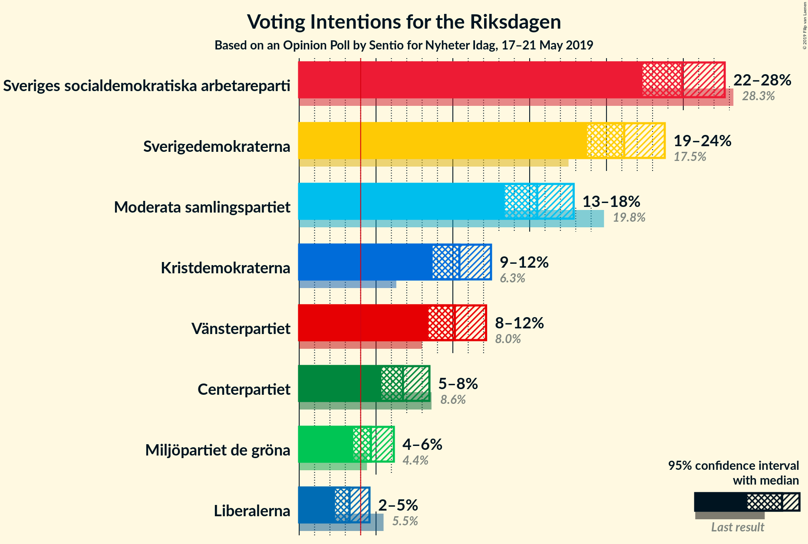

### Confidence Intervals

| Party | Last Result | Poll Result | 80% Confidence Interval | 90% Confidence Interval | 95% Confidence Interval | 99% Confidence Interval |
|:-----:|:-----------:|:-----------:|:-----------------------:|:-----------------------:|:-----------------------:|:-----------------------:|
| Sveriges socialdemokratiska arbetareparti | 28.3% | 24.9% | 23.2–26.7% |22.8–27.3% |22.3–27.7% |21.6–28.6% |
| Sverigedemokraterna | 17.5% | 21.2% | 19.6–22.9% |19.1–23.4% |18.7–23.8% |18.0–24.6% |
| Moderata samlingspartiet | 19.8% | 15.5% | 14.1–17.0% |13.7–17.5% |13.4–17.9% |12.7–18.6% |
| Kristdemokraterna | 6.3% | 10.4% | 9.3–11.8% |9.0–12.1% |8.7–12.5% |8.2–13.1% |
| Vänsterpartiet | 8.0% | 10.1% | 9.0–11.4% |8.7–11.8% |8.4–12.2% |7.9–12.8% |
| Centerpartiet | 8.6% | 6.8% | 5.8–7.9% |5.6–8.2% |5.3–8.5% |5.0–9.1% |
| Miljöpartiet de gröna | 4.4% | 4.7% | 3.9–5.6% |3.7–5.9% |3.5–6.2% |3.2–6.7% |
| Liberalerna | 5.5% | 3.3% | 2.7–4.1% |2.5–4.4% |2.3–4.6% |2.1–5.0% |

*Note:* The poll result column reflects the actual value used in the calculations. Published results may vary slightly, and in addition be rounded to fewer digits.

## Seats

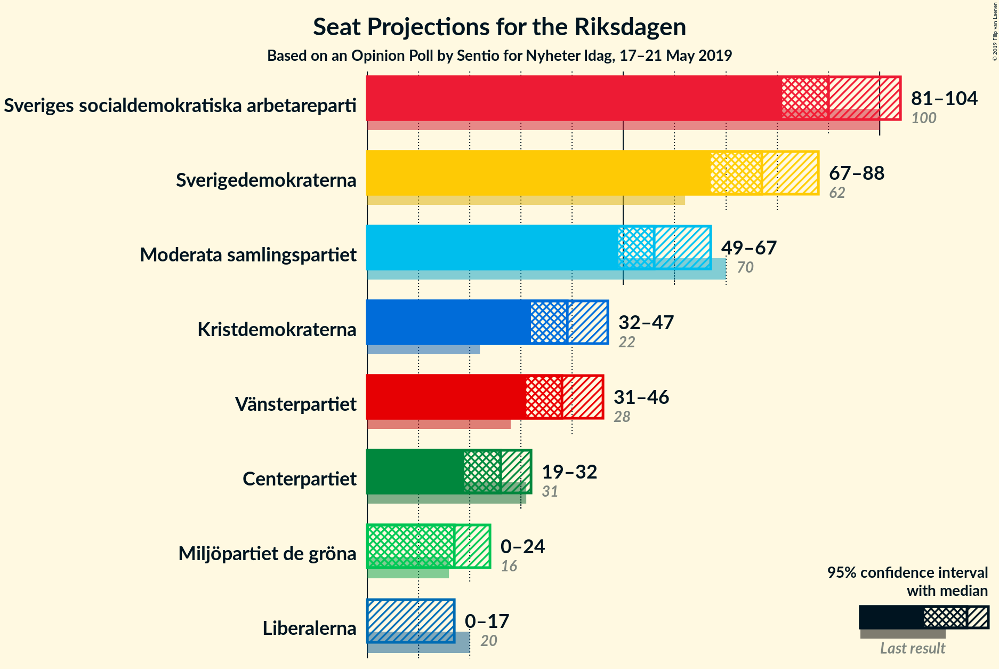

### Confidence Intervals

| Party | Last Result | Median | 80% Confidence Interval | 90% Confidence Interval | 95% Confidence Interval | 99% Confidence Interval |
|:-----:|:-----------:|:------:|:-----------------------:|:-----------------------:|:-----------------------:|:-----------------------:|
| <a href="#sveriges-socialdemokratiska-arbetareparti">Sveriges socialdemokratiska arbetareparti</a> | 100 | 90 | 84–96 |81–100 |79–107 |78–107 |
| <a href="#sverigedemokraterna">Sverigedemokraterna</a> | 62 | 76 | 69–86 |67–88 |67–89 |65–91 |
| <a href="#moderata-samlingspartiet">Moderata samlingspartiet</a> | 70 | 55 | 52–64 |49–64 |49–66 |46–72 |
| <a href="#kristdemokraterna">Kristdemokraterna</a> | 22 | 40 | 34–45 |33–47 |32–47 |31–47 |
| <a href="#vänsterpartiet">Vänsterpartiet</a> | 28 | 39 | 34–44 |32–45 |31–45 |30–47 |
| <a href="#centerpartiet">Centerpartiet</a> | 31 | 26 | 21–30 |19–32 |19–33 |19–35 |
| <a href="#miljöpartiet-de-gröna">Miljöpartiet de gröna</a> | 16 | 17 | 0–20 |0–22 |0–24 |0–25 |
| <a href="#liberalerna">Liberalerna</a> | 20 | 0 | 0–15 |0–16 |0–16 |0–18 |

### Sveriges socialdemokratiska arbetareparti

*For a full overview of the results for this party, see the [Sveriges socialdemokratiska arbetareparti](party-sverigessocialdemokratiskaarbetareparti.html) page.*

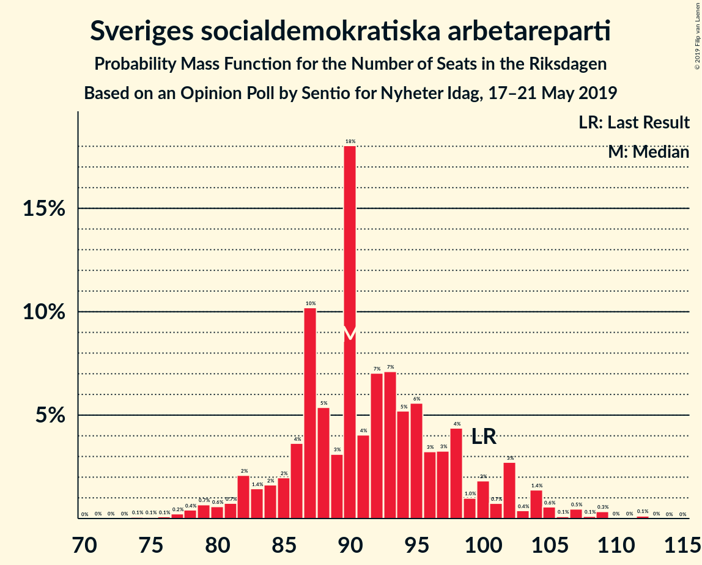

| Number of Seats | Probability | Accumulated | Special Marks |
|:---------------:|:-----------:|:-----------:|:-------------:|
| 73 | 0.1% | 100% |  |
| 74 | 0% | 99.9% |  |
| 75 | 0.1% | 99.9% |  |
| 76 | 0% | 99.8% |  |
| 77 | 0.2% | 99.8% |  |
| 78 | 1.0% | 99.6% |  |
| 79 | 2% | 98.6% |  |
| 80 | 0.8% | 96% |  |
| 81 | 2% | 95% |  |
| 82 | 2% | 93% |  |
| 83 | 0.1% | 91% |  |
| 84 | 1.1% | 91% |  |
| 85 | 4% | 90% |  |
| 86 | 5% | 85% |  |
| 87 | 9% | 81% |  |
| 88 | 5% | 72% |  |
| 89 | 10% | 67% |  |
| 90 | 10% | 57% | Median |
| 91 | 4% | 47% |  |
| 92 | 1.1% | 43% |  |
| 93 | 4% | 42% |  |
| 94 | 6% | 38% |  |
| 95 | 18% | 33% |  |
| 96 | 6% | 15% |  |
| 97 | 2% | 9% |  |
| 98 | 2% | 7% |  |
| 99 | 0.7% | 6% |  |
| 100 | 0.4% | 5% | Last Result |
| 101 | 0.4% | 5% |  |
| 102 | 0.2% | 4% |  |
| 103 | 0.3% | 4% |  |
| 104 | 0.3% | 4% |  |
| 105 | 0.4% | 4% |  |
| 106 | 0.2% | 3% |  |
| 107 | 3% | 3% |  |
| 108 | 0% | 0.1% |  |
| 109 | 0% | 0.1% |  |
| 110 | 0% | 0.1% |  |
| 111 | 0% | 0% |  |

### Sverigedemokraterna

*For a full overview of the results for this party, see the [Sverigedemokraterna](party-sverigedemokraterna.html) page.*

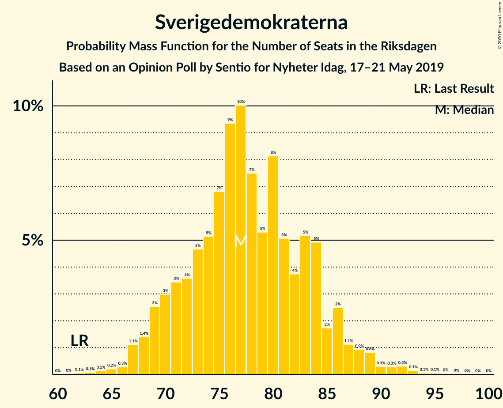

| Number of Seats | Probability | Accumulated | Special Marks |
|:---------------:|:-----------:|:-----------:|:-------------:|
| 61 | 0% | 100% |  |
| 62 | 0% | 99.9% | Last Result |
| 63 | 0.1% | 99.9% |  |
| 64 | 0.1% | 99.9% |  |
| 65 | 0.4% | 99.7% |  |
| 66 | 0.2% | 99.3% |  |
| 67 | 7% | 99.2% |  |
| 68 | 1.2% | 92% |  |
| 69 | 2% | 91% |  |
| 70 | 2% | 89% |  |
| 71 | 1.0% | 87% |  |
| 72 | 2% | 86% |  |
| 73 | 19% | 84% |  |
| 74 | 3% | 66% |  |
| 75 | 8% | 63% |  |
| 76 | 10% | 54% | Median |
| 77 | 8% | 44% |  |
| 78 | 2% | 36% |  |
| 79 | 1.4% | 34% |  |
| 80 | 6% | 33% |  |
| 81 | 7% | 27% |  |
| 82 | 2% | 20% |  |
| 83 | 3% | 18% |  |
| 84 | 1.1% | 16% |  |
| 85 | 4% | 15% |  |
| 86 | 1.2% | 11% |  |
| 87 | 5% | 10% |  |
| 88 | 0.4% | 5% |  |
| 89 | 3% | 5% |  |
| 90 | 0% | 1.4% |  |
| 91 | 1.0% | 1.4% |  |
| 92 | 0% | 0.4% |  |
| 93 | 0% | 0.4% |  |
| 94 | 0.2% | 0.4% |  |
| 95 | 0.1% | 0.2% |  |
| 96 | 0% | 0.1% |  |
| 97 | 0% | 0% |  |

### Moderata samlingspartiet

*For a full overview of the results for this party, see the [Moderata samlingspartiet](party-moderatasamlingspartiet.html) page.*

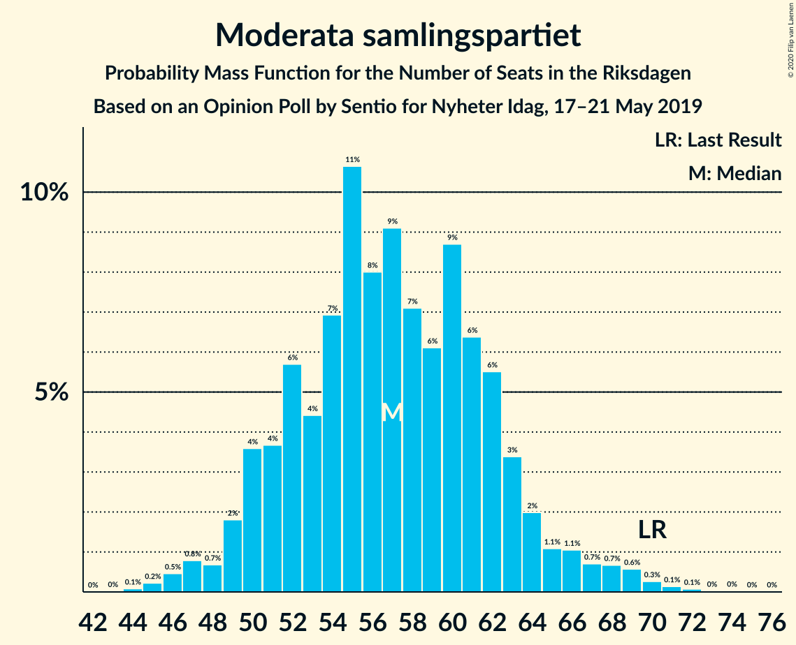

| Number of Seats | Probability | Accumulated | Special Marks |
|:---------------:|:-----------:|:-----------:|:-------------:|
| 44 | 0% | 100% |  |
| 45 | 0.3% | 99.9% |  |
| 46 | 0.4% | 99.7% |  |
| 47 | 0.2% | 99.3% |  |
| 48 | 0.4% | 99.1% |  |
| 49 | 4% | 98.7% |  |
| 50 | 2% | 95% |  |
| 51 | 1.0% | 93% |  |
| 52 | 9% | 92% |  |
| 53 | 23% | 83% |  |
| 54 | 3% | 60% |  |
| 55 | 13% | 57% | Median |
| 56 | 3% | 44% |  |
| 57 | 0.8% | 41% |  |
| 58 | 0.7% | 40% |  |
| 59 | 1.3% | 39% |  |
| 60 | 14% | 38% |  |
| 61 | 3% | 24% |  |
| 62 | 0.9% | 21% |  |
| 63 | 10% | 21% |  |
| 64 | 6% | 10% |  |
| 65 | 0.7% | 4% |  |
| 66 | 1.0% | 3% |  |
| 67 | 0.3% | 2% |  |
| 68 | 0.3% | 2% |  |
| 69 | 0.5% | 2% |  |
| 70 | 0.7% | 1.2% | Last Result |
| 71 | 0% | 0.6% |  |
| 72 | 0.1% | 0.5% |  |
| 73 | 0% | 0.4% |  |
| 74 | 0.4% | 0.4% |  |
| 75 | 0% | 0% |  |

### Kristdemokraterna

*For a full overview of the results for this party, see the [Kristdemokraterna](party-kristdemokraterna.html) page.*

| Number of Seats | Probability | Accumulated | Special Marks |
|:---------------:|:-----------:|:-----------:|:-------------:|
| 22 | 0% | 100% | Last Result |
| 23 | 0% | 100% |  |
| 24 | 0% | 100% |  |
| 25 | 0% | 100% |  |
| 26 | 0% | 100% |  |
| 27 | 0% | 100% |  |
| 28 | 0.1% | 99.9% |  |
| 29 | 0.1% | 99.9% |  |
| 30 | 0.2% | 99.8% |  |
| 31 | 0.2% | 99.6% |  |
| 32 | 2% | 99.4% |  |
| 33 | 5% | 97% |  |
| 34 | 5% | 93% |  |
| 35 | 2% | 88% |  |
| 36 | 1.0% | 86% |  |
| 37 | 9% | 85% |  |
| 38 | 16% | 76% |  |
| 39 | 8% | 60% |  |
| 40 | 7% | 52% | Median |
| 41 | 16% | 45% |  |
| 42 | 3% | 29% |  |
| 43 | 4% | 26% |  |
| 44 | 6% | 22% |  |
| 45 | 8% | 16% |  |
| 46 | 2% | 8% |  |
| 47 | 5% | 5% |  |
| 48 | 0.1% | 0.4% |  |
| 49 | 0.2% | 0.4% |  |
| 50 | 0.1% | 0.2% |  |
| 51 | 0.1% | 0.1% |  |
| 52 | 0% | 0% |  |

### Vänsterpartiet

*For a full overview of the results for this party, see the [Vänsterpartiet](party-vänsterpartiet.html) page.*

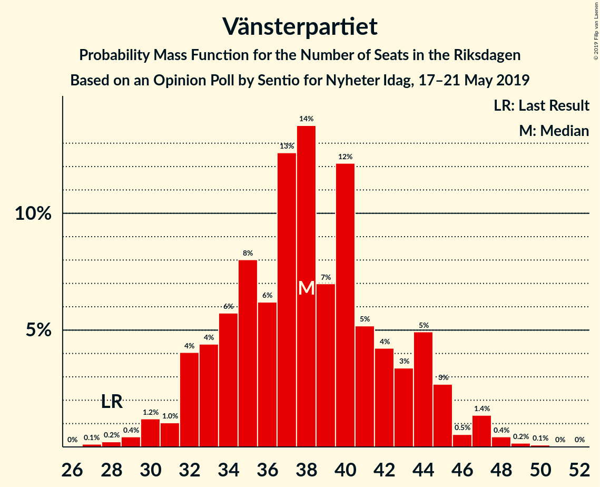

| Number of Seats | Probability | Accumulated | Special Marks |
|:---------------:|:-----------:|:-----------:|:-------------:|
| 27 | 0.1% | 100% |  |
| 28 | 0.1% | 99.9% | Last Result |
| 29 | 0.1% | 99.8% |  |
| 30 | 1.0% | 99.7% |  |
| 31 | 2% | 98.7% |  |
| 32 | 3% | 96% |  |
| 33 | 2% | 94% |  |
| 34 | 15% | 92% |  |
| 35 | 4% | 78% |  |
| 36 | 5% | 74% |  |
| 37 | 1.3% | 69% |  |
| 38 | 2% | 68% |  |
| 39 | 25% | 66% | Median |
| 40 | 5% | 40% |  |
| 41 | 11% | 36% |  |
| 42 | 1.3% | 25% |  |
| 43 | 2% | 24% |  |
| 44 | 16% | 22% |  |
| 45 | 5% | 6% |  |
| 46 | 0% | 0.6% |  |
| 47 | 0.1% | 0.5% |  |
| 48 | 0.1% | 0.4% |  |
| 49 | 0.2% | 0.3% |  |
| 50 | 0% | 0.1% |  |
| 51 | 0% | 0.1% |  |
| 52 | 0% | 0.1% |  |
| 53 | 0% | 0.1% |  |
| 54 | 0% | 0% |  |

### Centerpartiet

*For a full overview of the results for this party, see the [Centerpartiet](party-centerpartiet.html) page.*

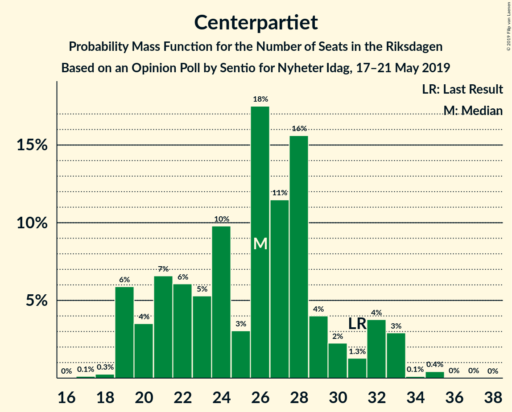

| Number of Seats | Probability | Accumulated | Special Marks |
|:---------------:|:-----------:|:-----------:|:-------------:|
| 17 | 0.1% | 100% |  |
| 18 | 0.3% | 99.9% |  |
| 19 | 6% | 99.6% |  |
| 20 | 4% | 94% |  |
| 21 | 7% | 90% |  |
| 22 | 6% | 84% |  |
| 23 | 5% | 78% |  |
| 24 | 10% | 72% |  |
| 25 | 3% | 62% |  |
| 26 | 18% | 59% | Median |
| 27 | 11% | 42% |  |
| 28 | 16% | 30% |  |
| 29 | 4% | 15% |  |
| 30 | 2% | 11% |  |
| 31 | 1.3% | 9% | Last Result |
| 32 | 4% | 7% |  |
| 33 | 3% | 4% |  |
| 34 | 0.1% | 0.6% |  |
| 35 | 0.4% | 0.5% |  |
| 36 | 0% | 0.1% |  |
| 37 | 0% | 0% |  |

### Miljöpartiet de gröna

*For a full overview of the results for this party, see the [Miljöpartiet de gröna](party-miljöpartietdegröna.html) page.*

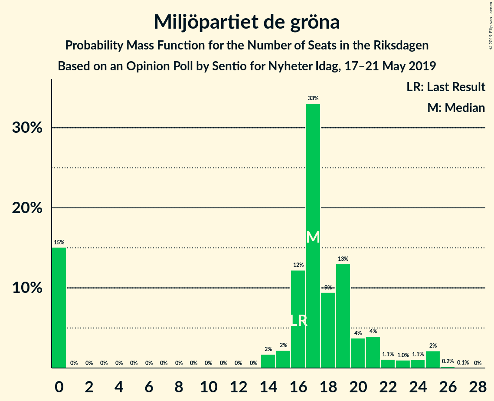

| Number of Seats | Probability | Accumulated | Special Marks |
|:---------------:|:-----------:|:-----------:|:-------------:|
| 0 | 15% | 100% |  |
| 1 | 0% | 85% |  |
| 2 | 0% | 85% |  |
| 3 | 0% | 85% |  |
| 4 | 0% | 85% |  |
| 5 | 0% | 85% |  |
| 6 | 0% | 85% |  |
| 7 | 0% | 85% |  |
| 8 | 0% | 85% |  |
| 9 | 0% | 85% |  |
| 10 | 0% | 85% |  |
| 11 | 0% | 85% |  |
| 12 | 0% | 85% |  |
| 13 | 0% | 85% |  |
| 14 | 2% | 85% |  |
| 15 | 2% | 83% |  |
| 16 | 12% | 81% | Last Result |
| 17 | 33% | 69% | Median |
| 18 | 9% | 36% |  |
| 19 | 13% | 26% |  |
| 20 | 4% | 13% |  |
| 21 | 4% | 10% |  |
| 22 | 1.1% | 6% |  |
| 23 | 1.0% | 4% |  |
| 24 | 1.1% | 3% |  |
| 25 | 2% | 2% |  |
| 26 | 0.2% | 0.3% |  |
| 27 | 0.1% | 0.1% |  |
| 28 | 0% | 0% |  |

### Liberalerna

*For a full overview of the results for this party, see the [Liberalerna](party-liberalerna.html) page.*

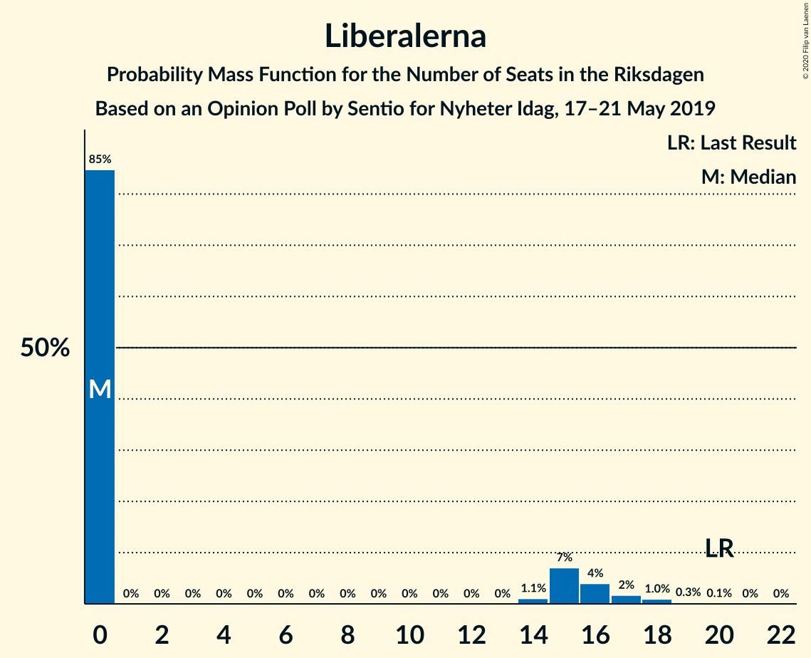

| Number of Seats | Probability | Accumulated | Special Marks |
|:---------------:|:-----------:|:-----------:|:-------------:|
| 0 | 83% | 100% | Median |
| 1 | 0% | 17% |  |
| 2 | 0% | 17% |  |
| 3 | 0% | 17% |  |
| 4 | 0% | 17% |  |
| 5 | 0% | 17% |  |
| 6 | 0% | 17% |  |
| 7 | 0% | 17% |  |
| 8 | 0% | 17% |  |
| 9 | 0% | 17% |  |
| 10 | 0% | 17% |  |
| 11 | 0% | 17% |  |
| 12 | 0% | 17% |  |
| 13 | 0% | 17% |  |
| 14 | 0.6% | 17% |  |
| 15 | 10% | 17% |  |
| 16 | 4% | 7% |  |
| 17 | 0.9% | 2% |  |
| 18 | 1.3% | 2% |  |
| 19 | 0.2% | 0.3% |  |
| 20 | 0.1% | 0.1% | Last Result |
| 21 | 0% | 0% |  |

## Coalitions

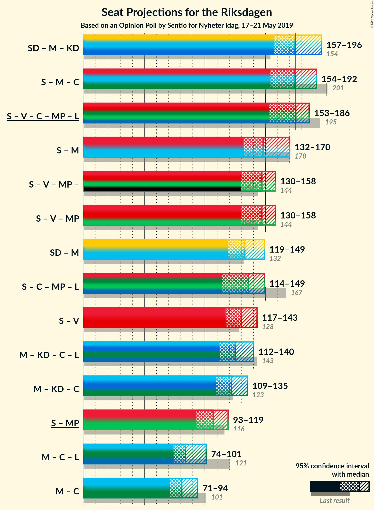

### Confidence Intervals

| Coalition | Last Result | Median | Majority? | 80% Confidence Interval | 90% Confidence Interval | 95% Confidence Interval | 99% Confidence Interval |
|:---------:|:-----------:|:------:|:---------:|:-----------------------:|:-----------------------:|:-----------------------:|:-----------------------:|
| Sverigedemokraterna – Moderata samlingspartiet – Kristdemokraterna | 154 | 174 | 40% | 163–184 | 157–190 | 157–196 | 157–196 |
| Sveriges socialdemokratiska arbetareparti – Moderata samlingspartiet – Centerpartiet | 201 | 174 | 38% | 163–182 | 158–189 | 154–192 | 154–193 |
| Sveriges socialdemokratiska arbetareparti – Vänsterpartiet – Centerpartiet – Miljöpartiet de gröna – Liberalerna | 195 | 175 | 56% | 162–182 | 156–183 | 153–186 | 153–191 |
| Sveriges socialdemokratiska arbetareparti – Moderata samlingspartiet | 170 | 148 | 0% | 139–158 | 136–161 | 132–170 | 130–170 |
| Sveriges socialdemokratiska arbetareparti – Vänsterpartiet – Miljöpartiet de gröna | 144 | 147 | 0% | 135–156 | 132–156 | 130–158 | 124–160 |
| Sverigedemokraterna – Moderata samlingspartiet | 132 | 133 | 0% | 124–144 | 119–149 | 119–149 | 119–156 |
| Sveriges socialdemokratiska arbetareparti – Centerpartiet – Miljöpartiet de gröna – Liberalerna | 167 | 136 | 0% | 125–143 | 119–146 | 114–149 | 114–156 |
| Sveriges socialdemokratiska arbetareparti – Vänsterpartiet | 128 | 130 | 0% | 121–139 | 119–140 | 117–143 | 114–144 |
| Moderata samlingspartiet – Kristdemokraterna – Centerpartiet – Liberalerna | 143 | 125 | 0% | 115–134 | 113–135 | 112–140 | 109–144 |
| Moderata samlingspartiet – Kristdemokraterna – Centerpartiet | 123 | 122 | 0% | 113–130 | 112–134 | 109–135 | 108–139 |
| Sveriges socialdemokratiska arbetareparti – Miljöpartiet de gröna | 116 | 107 | 0% | 96–112 | 93–116 | 93–119 | 89–125 |
| Moderata samlingspartiet – Centerpartiet – Liberalerna | 121 | 84 | 0% | 77–93 | 74–97 | 74–101 | 73–105 |
| Moderata samlingspartiet – Centerpartiet | 101 | 81 | 0% | 74–91 | 73–93 | 71–94 | 68–97 |

### Sverigedemokraterna – Moderata samlingspartiet – Kristdemokraterna

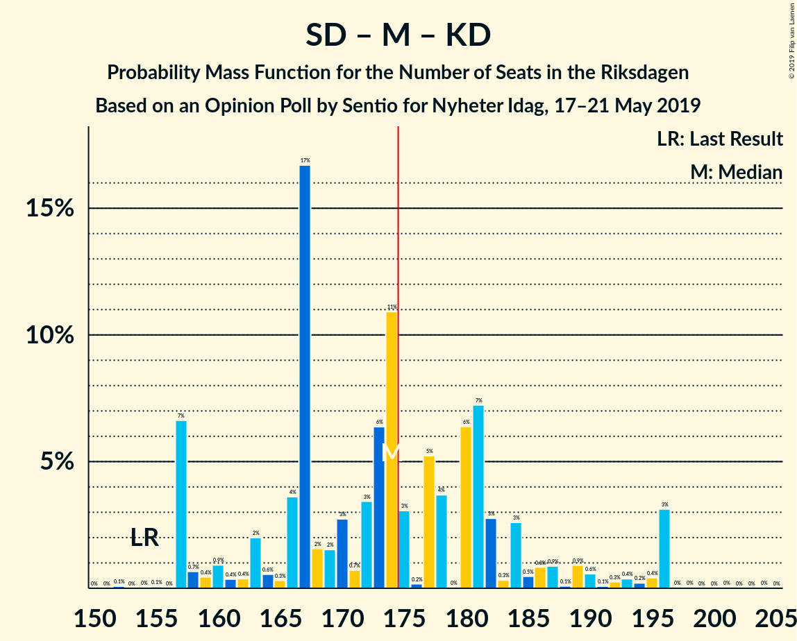

| Number of Seats | Probability | Accumulated | Special Marks |
|:---------------:|:-----------:|:-----------:|:-------------:|
| 150 | 0% | 100% |  |
| 151 | 0% | 99.9% |  |
| 152 | 0.1% | 99.9% |  |
| 153 | 0% | 99.9% |  |
| 154 | 0% | 99.9% | Last Result |
| 155 | 0.1% | 99.8% |  |
| 156 | 0% | 99.8% |  |
| 157 | 7% | 99.7% |  |
| 158 | 0.7% | 93% |  |
| 159 | 0.4% | 92% |  |
| 160 | 0.9% | 92% |  |
| 161 | 0.4% | 91% |  |
| 162 | 0.4% | 91% |  |
| 163 | 2% | 90% |  |
| 164 | 0.6% | 88% |  |
| 165 | 0.3% | 88% |  |
| 166 | 4% | 87% |  |
| 167 | 17% | 84% |  |
| 168 | 2% | 67% |  |
| 169 | 2% | 66% |  |
| 170 | 3% | 64% |  |
| 171 | 0.7% | 61% | Median |
| 172 | 3% | 61% |  |
| 173 | 6% | 57% |  |
| 174 | 11% | 51% |  |
| 175 | 3% | 40% | Majority |
| 176 | 0.2% | 37% |  |
| 177 | 5% | 37% |  |
| 178 | 4% | 31% |  |
| 179 | 0% | 28% |  |
| 180 | 6% | 28% |  |
| 181 | 7% | 21% |  |
| 182 | 3% | 14% |  |
| 183 | 0.3% | 11% |  |
| 184 | 3% | 11% |  |
| 185 | 0.5% | 8% |  |
| 186 | 0.8% | 8% |  |
| 187 | 0.9% | 7% |  |
| 188 | 0.1% | 6% |  |
| 189 | 0.9% | 6% |  |
| 190 | 0.6% | 5% |  |
| 191 | 0.1% | 5% |  |
| 192 | 0.3% | 5% |  |
| 193 | 0.4% | 4% |  |
| 194 | 0.2% | 4% |  |
| 195 | 0.4% | 4% |  |
| 196 | 3% | 3% |  |
| 197 | 0% | 0.1% |  |
| 198 | 0% | 0.1% |  |
| 199 | 0% | 0.1% |  |
| 200 | 0% | 0.1% |  |
| 201 | 0% | 0.1% |  |
| 202 | 0% | 0% |  |

### Sveriges socialdemokratiska arbetareparti – Moderata samlingspartiet – Centerpartiet

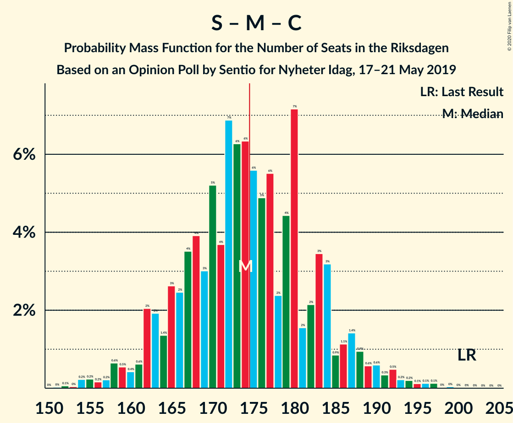

| Number of Seats | Probability | Accumulated | Special Marks |
|:---------------:|:-----------:|:-----------:|:-------------:|
| 152 | 0.1% | 100% |  |
| 153 | 0% | 99.9% |  |
| 154 | 3% | 99.9% |  |
| 155 | 0% | 97% |  |
| 156 | 0.2% | 97% |  |
| 157 | 0.1% | 97% |  |
| 158 | 3% | 97% |  |
| 159 | 0.2% | 94% |  |
| 160 | 0% | 94% |  |
| 161 | 0.1% | 94% |  |
| 162 | 1.2% | 94% |  |
| 163 | 7% | 92% |  |
| 164 | 1.1% | 85% |  |
| 165 | 1.1% | 84% |  |
| 166 | 0.7% | 83% |  |
| 167 | 0.4% | 82% |  |
| 168 | 5% | 82% |  |
| 169 | 2% | 76% |  |
| 170 | 8% | 75% |  |
| 171 | 6% | 66% | Median |
| 172 | 0.5% | 60% |  |
| 173 | 2% | 60% |  |
| 174 | 20% | 57% |  |
| 175 | 2% | 38% | Majority |
| 176 | 4% | 36% |  |
| 177 | 12% | 32% |  |
| 178 | 0.4% | 19% |  |
| 179 | 4% | 19% |  |
| 180 | 2% | 15% |  |
| 181 | 2% | 13% |  |
| 182 | 0.5% | 11% |  |
| 183 | 0.1% | 10% |  |
| 184 | 1.0% | 10% |  |
| 185 | 0.9% | 9% |  |
| 186 | 0.5% | 8% |  |
| 187 | 0.1% | 8% |  |
| 188 | 0.6% | 7% |  |
| 189 | 3% | 7% |  |
| 190 | 0.5% | 4% |  |
| 191 | 0.3% | 4% |  |
| 192 | 3% | 3% |  |
| 193 | 0.1% | 0.6% |  |
| 194 | 0.4% | 0.5% |  |
| 195 | 0% | 0.1% |  |
| 196 | 0% | 0.1% |  |
| 197 | 0.1% | 0.1% |  |
| 198 | 0% | 0% |  |
| 199 | 0% | 0% |  |
| 200 | 0% | 0% |  |
| 201 | 0% | 0% | Last Result |

### Sveriges socialdemokratiska arbetareparti – Vänsterpartiet – Centerpartiet – Miljöpartiet de gröna – Liberalerna

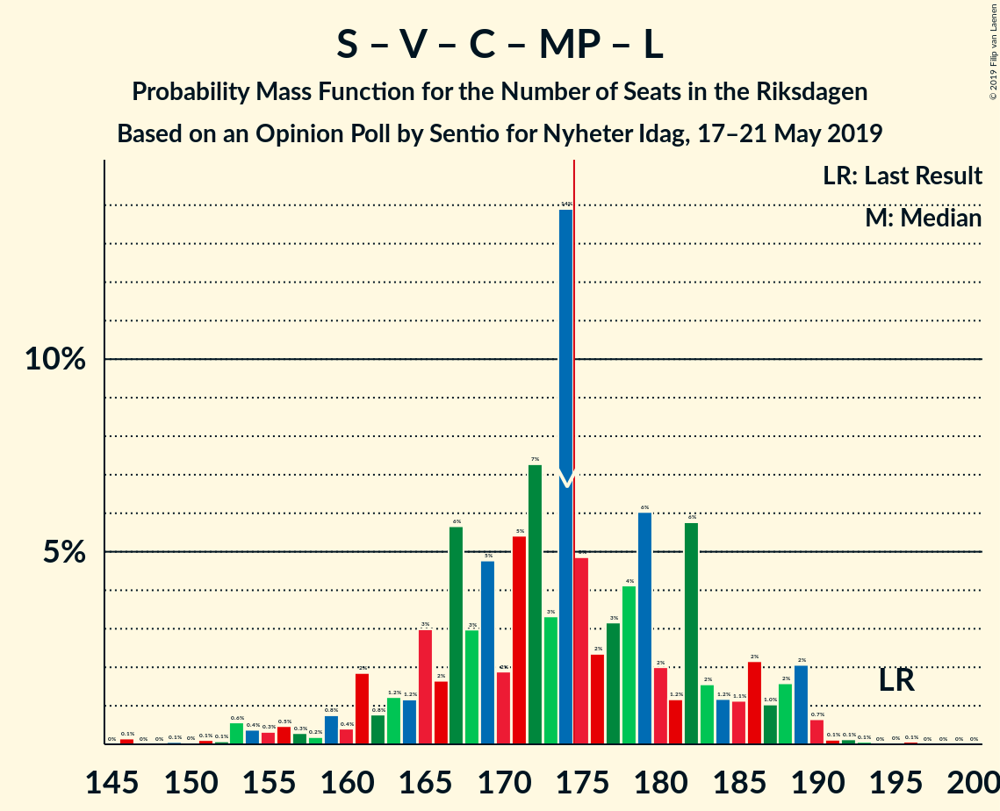

| Number of Seats | Probability | Accumulated | Special Marks |
|:---------------:|:-----------:|:-----------:|:-------------:|
| 145 | 0.1% | 100% |  |
| 146 | 0% | 99.9% |  |
| 147 | 0% | 99.9% |  |
| 148 | 0% | 99.9% |  |
| 149 | 0% | 99.9% |  |
| 150 | 0% | 99.9% |  |
| 151 | 0.1% | 99.8% |  |
| 152 | 0% | 99.8% |  |
| 153 | 3% | 99.7% |  |
| 154 | 0.4% | 97% |  |
| 155 | 0.2% | 96% |  |
| 156 | 2% | 96% |  |
| 157 | 0.3% | 94% |  |
| 158 | 0.1% | 93% |  |
| 159 | 2% | 93% |  |
| 160 | 1.0% | 91% |  |
| 161 | 0.1% | 90% |  |
| 162 | 0.9% | 90% |  |
| 163 | 1.1% | 89% |  |
| 164 | 0.6% | 88% |  |
| 165 | 3% | 87% |  |
| 166 | 2% | 85% |  |
| 167 | 3% | 83% |  |
| 168 | 7% | 80% |  |
| 169 | 6% | 73% |  |
| 170 | 0.2% | 66% |  |
| 171 | 4% | 66% |  |
| 172 | 4% | 62% | Median |
| 173 | 0.6% | 58% |  |
| 174 | 2% | 58% |  |
| 175 | 11% | 56% | Majority |
| 176 | 6% | 45% |  |
| 177 | 10% | 38% |  |
| 178 | 0.6% | 29% |  |
| 179 | 2% | 28% |  |
| 180 | 0.4% | 26% |  |
| 181 | 2% | 25% |  |
| 182 | 16% | 24% |  |
| 183 | 4% | 8% |  |
| 184 | 0.3% | 4% |  |
| 185 | 0.4% | 4% |  |
| 186 | 2% | 3% |  |
| 187 | 0.1% | 2% |  |
| 188 | 0.4% | 2% |  |
| 189 | 0.2% | 1.2% |  |
| 190 | 0.3% | 1.0% |  |
| 191 | 0.6% | 0.7% |  |
| 192 | 0% | 0.1% |  |
| 193 | 0% | 0.1% |  |
| 194 | 0% | 0% |  |
| 195 | 0% | 0% | Last Result |

### Sveriges socialdemokratiska arbetareparti – Moderata samlingspartiet

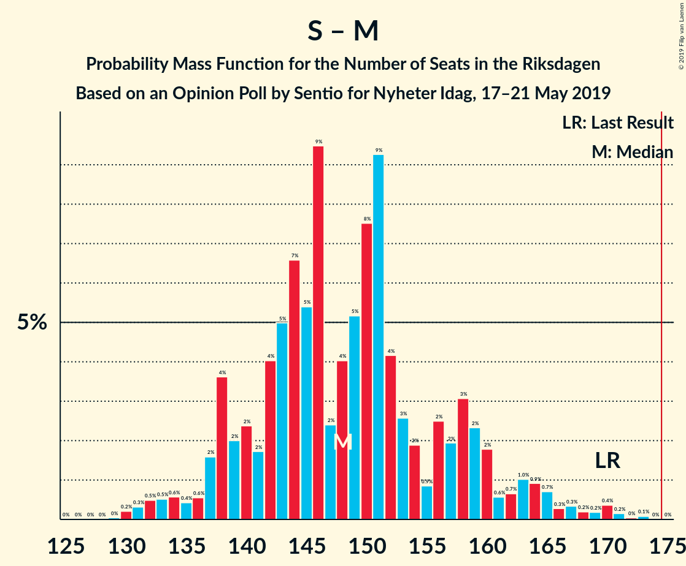

| Number of Seats | Probability | Accumulated | Special Marks |
|:---------------:|:-----------:|:-----------:|:-------------:|
| 129 | 0% | 100% |  |
| 130 | 1.0% | 99.9% |  |
| 131 | 0.6% | 98.9% |  |
| 132 | 2% | 98% |  |
| 133 | 0.1% | 97% |  |
| 134 | 0% | 96% |  |
| 135 | 1.2% | 96% |  |
| 136 | 1.1% | 95% |  |
| 137 | 2% | 94% |  |
| 138 | 0.3% | 92% |  |
| 139 | 7% | 92% |  |
| 140 | 0.5% | 85% |  |
| 141 | 0.5% | 84% |  |
| 142 | 12% | 84% |  |
| 143 | 1.4% | 72% |  |
| 144 | 0.7% | 70% |  |
| 145 | 6% | 70% | Median |
| 146 | 3% | 64% |  |
| 147 | 4% | 61% |  |
| 148 | 20% | 57% |  |
| 149 | 6% | 37% |  |
| 150 | 9% | 32% |  |
| 151 | 2% | 22% |  |
| 152 | 0.5% | 21% |  |
| 153 | 4% | 20% |  |
| 154 | 2% | 16% |  |
| 155 | 0.7% | 15% |  |
| 156 | 3% | 14% |  |
| 157 | 0.6% | 11% |  |
| 158 | 0.7% | 11% |  |
| 159 | 3% | 10% |  |
| 160 | 2% | 7% |  |
| 161 | 0.8% | 5% |  |
| 162 | 0.2% | 4% |  |
| 163 | 0% | 4% |  |
| 164 | 0.3% | 4% |  |
| 165 | 0.1% | 4% |  |
| 166 | 0.2% | 4% |  |
| 167 | 0.5% | 4% |  |
| 168 | 0.1% | 3% |  |
| 169 | 0% | 3% |  |
| 170 | 3% | 3% | Last Result |
| 171 | 0.4% | 0.4% |  |
| 172 | 0% | 0% |  |

### Sveriges socialdemokratiska arbetareparti – Vänsterpartiet – Miljöpartiet de gröna

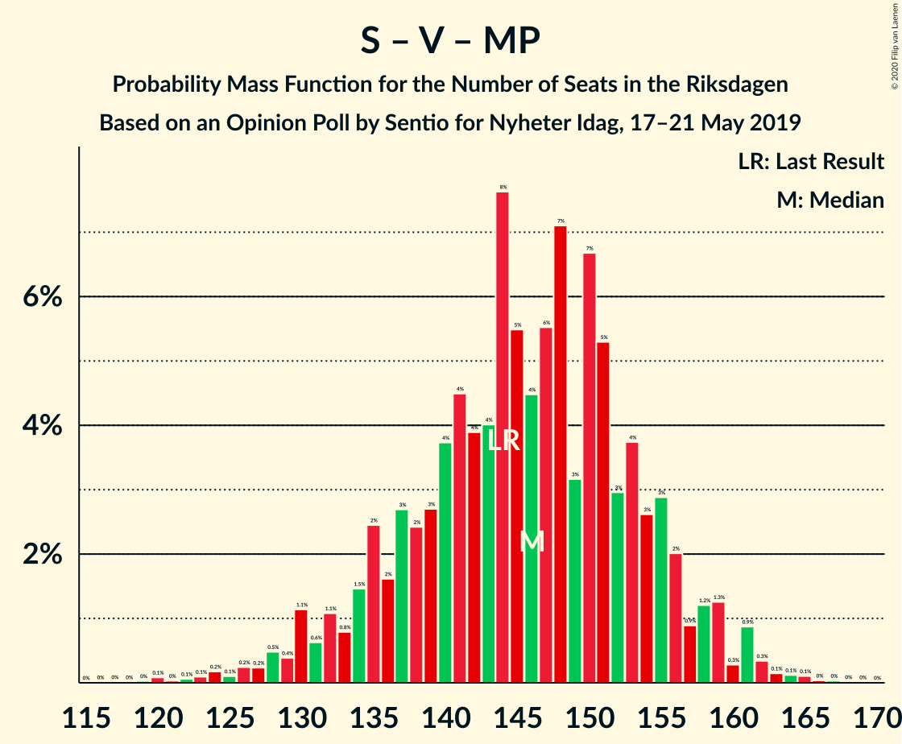

| Number of Seats | Probability | Accumulated | Special Marks |
|:---------------:|:-----------:|:-----------:|:-------------:|
| 120 | 0% | 100% |  |
| 121 | 0% | 99.9% |  |
| 122 | 0% | 99.9% |  |
| 123 | 0% | 99.9% |  |
| 124 | 0.5% | 99.8% |  |
| 125 | 0.1% | 99.3% |  |
| 126 | 0.1% | 99.2% |  |
| 127 | 0% | 99.1% |  |
| 128 | 0.4% | 99.1% |  |
| 129 | 0.6% | 98.7% |  |
| 130 | 0.8% | 98% |  |
| 131 | 0.1% | 97% |  |
| 132 | 4% | 97% |  |
| 133 | 2% | 93% |  |
| 134 | 0.7% | 91% |  |
| 135 | 5% | 90% |  |
| 136 | 1.4% | 85% |  |
| 137 | 0.9% | 84% |  |
| 138 | 9% | 83% |  |
| 139 | 2% | 74% |  |
| 140 | 5% | 72% |  |
| 141 | 5% | 66% |  |
| 142 | 2% | 61% |  |
| 143 | 4% | 59% |  |
| 144 | 1.3% | 55% | Last Result |
| 145 | 1.3% | 54% |  |
| 146 | 2% | 53% | Median |
| 147 | 8% | 50% |  |
| 148 | 3% | 42% |  |
| 149 | 12% | 39% |  |
| 150 | 1.4% | 27% |  |
| 151 | 5% | 26% |  |
| 152 | 0.8% | 21% |  |
| 153 | 0% | 20% |  |
| 154 | 0.4% | 20% |  |
| 155 | 0.2% | 20% |  |
| 156 | 16% | 19% |  |
| 157 | 0.2% | 4% |  |
| 158 | 2% | 4% |  |
| 159 | 0.8% | 1.5% |  |
| 160 | 0.3% | 0.6% |  |
| 161 | 0.1% | 0.3% |  |
| 162 | 0% | 0.2% |  |
| 163 | 0% | 0.2% |  |
| 164 | 0% | 0.2% |  |
| 165 | 0.1% | 0.2% |  |
| 166 | 0.1% | 0.2% |  |
| 167 | 0% | 0% |  |

### Sverigedemokraterna – Moderata samlingspartiet

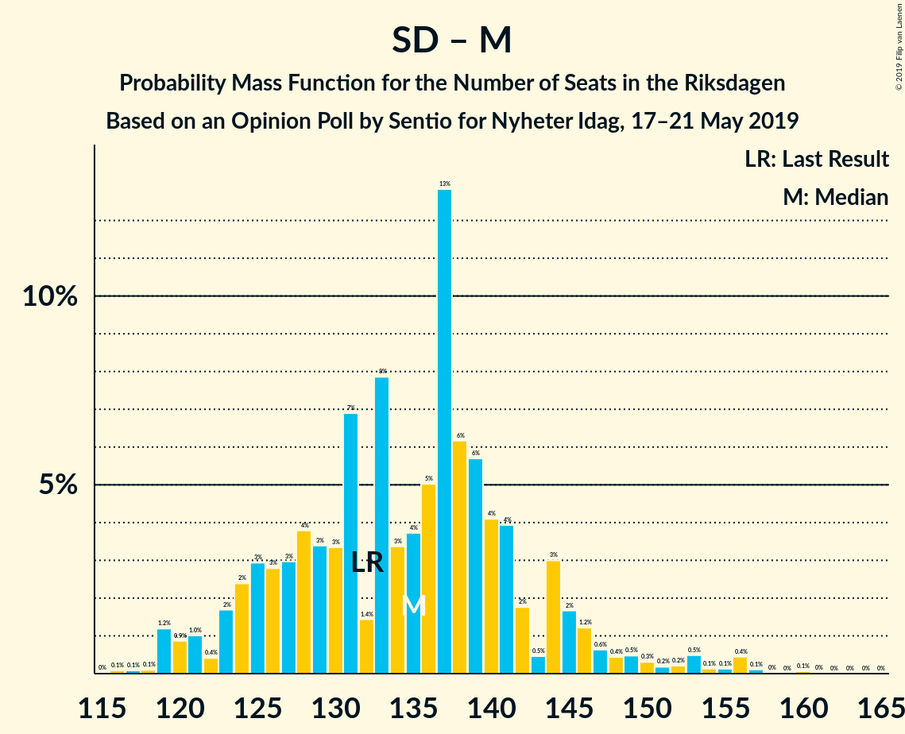

| Number of Seats | Probability | Accumulated | Special Marks |
|:---------------:|:-----------:|:-----------:|:-------------:|
| 115 | 0.1% | 100% |  |
| 116 | 0% | 99.9% |  |
| 117 | 0% | 99.8% |  |
| 118 | 0% | 99.8% |  |
| 119 | 7% | 99.8% |  |
| 120 | 0.2% | 93% |  |
| 121 | 0.1% | 93% |  |
| 122 | 0.2% | 93% |  |
| 123 | 2% | 92% |  |
| 124 | 0.7% | 90% |  |
| 125 | 3% | 90% |  |
| 126 | 16% | 87% |  |
| 127 | 0.6% | 71% |  |
| 128 | 0.8% | 70% |  |
| 129 | 10% | 69% |  |
| 130 | 2% | 59% |  |
| 131 | 2% | 57% | Median |
| 132 | 2% | 55% | Last Result |
| 133 | 4% | 53% |  |
| 134 | 2% | 49% |  |
| 135 | 8% | 47% |  |
| 136 | 4% | 40% |  |
| 137 | 2% | 36% |  |
| 138 | 0.6% | 34% |  |
| 139 | 0.4% | 33% |  |
| 140 | 7% | 33% |  |
| 141 | 7% | 26% |  |
| 142 | 5% | 19% |  |
| 143 | 0.1% | 14% |  |
| 144 | 6% | 14% |  |
| 145 | 1.0% | 8% |  |
| 146 | 1.0% | 7% |  |
| 147 | 0% | 6% |  |
| 148 | 0.7% | 6% |  |
| 149 | 3% | 5% |  |
| 150 | 0.2% | 2% |  |
| 151 | 0.4% | 2% |  |
| 152 | 0.1% | 2% |  |
| 153 | 0.5% | 1.4% |  |
| 154 | 0% | 0.9% |  |
| 155 | 0.4% | 0.9% |  |
| 156 | 0% | 0.5% |  |
| 157 | 0.4% | 0.5% |  |
| 158 | 0% | 0.1% |  |
| 159 | 0% | 0.1% |  |
| 160 | 0% | 0.1% |  |
| 161 | 0% | 0.1% |  |
| 162 | 0% | 0% |  |

### Sveriges socialdemokratiska arbetareparti – Centerpartiet – Miljöpartiet de gröna – Liberalerna

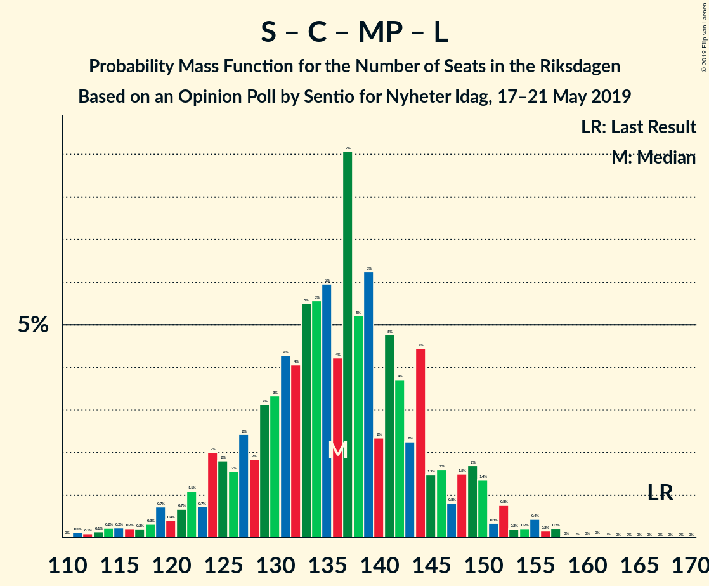

| Number of Seats | Probability | Accumulated | Special Marks |
|:---------------:|:-----------:|:-----------:|:-------------:|
| 105 | 0.1% | 100% |  |
| 106 | 0% | 99.9% |  |
| 107 | 0% | 99.9% |  |
| 108 | 0.1% | 99.9% |  |
| 109 | 0% | 99.9% |  |
| 110 | 0% | 99.9% |  |
| 111 | 0% | 99.9% |  |
| 112 | 0% | 99.8% |  |
| 113 | 0% | 99.8% |  |
| 114 | 3% | 99.8% |  |
| 115 | 0% | 97% |  |
| 116 | 0.4% | 97% |  |
| 117 | 0.2% | 96% |  |
| 118 | 0.6% | 96% |  |
| 119 | 0.4% | 95% |  |
| 120 | 2% | 95% |  |
| 121 | 0.2% | 93% |  |
| 122 | 0.9% | 93% |  |
| 123 | 0.2% | 92% |  |
| 124 | 0.4% | 92% |  |
| 125 | 4% | 91% |  |
| 126 | 2% | 88% |  |
| 127 | 3% | 86% |  |
| 128 | 0.8% | 83% |  |
| 129 | 10% | 82% |  |
| 130 | 6% | 72% |  |
| 131 | 0.3% | 66% |  |
| 132 | 2% | 65% |  |
| 133 | 0.4% | 63% | Median |
| 134 | 0.2% | 63% |  |
| 135 | 8% | 63% |  |
| 136 | 11% | 54% |  |
| 137 | 2% | 43% |  |
| 138 | 20% | 41% |  |
| 139 | 0.3% | 21% |  |
| 140 | 0.2% | 20% |  |
| 141 | 0.2% | 20% |  |
| 142 | 4% | 20% |  |
| 143 | 7% | 16% |  |
| 144 | 1.3% | 9% |  |
| 145 | 1.2% | 7% |  |
| 146 | 3% | 6% |  |
| 147 | 0.4% | 3% |  |
| 148 | 0.1% | 3% |  |
| 149 | 1.1% | 3% |  |
| 150 | 0.1% | 1.5% |  |
| 151 | 0% | 1.4% |  |
| 152 | 0.3% | 1.4% |  |
| 153 | 0.4% | 1.1% |  |
| 154 | 0.1% | 0.7% |  |
| 155 | 0% | 0.6% |  |
| 156 | 0.4% | 0.5% |  |
| 157 | 0% | 0.1% |  |
| 158 | 0% | 0.1% |  |
| 159 | 0% | 0% |  |
| 160 | 0% | 0% |  |
| 161 | 0% | 0% |  |
| 162 | 0% | 0% |  |
| 163 | 0% | 0% |  |
| 164 | 0% | 0% |  |
| 165 | 0% | 0% |  |
| 166 | 0% | 0% |  |
| 167 | 0% | 0% | Last Result |

### Sveriges socialdemokratiska arbetareparti – Vänsterpartiet

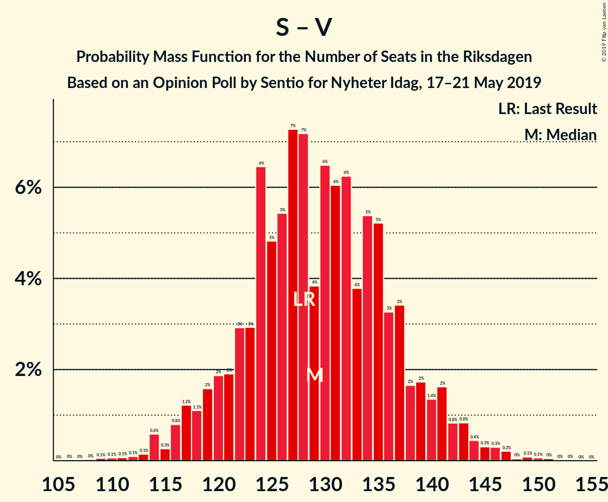

| Number of Seats | Probability | Accumulated | Special Marks |
|:---------------:|:-----------:|:-----------:|:-------------:|
| 107 | 0.1% | 100% |  |
| 108 | 0% | 99.9% |  |
| 109 | 0% | 99.9% |  |
| 110 | 0.1% | 99.9% |  |
| 111 | 0% | 99.8% |  |
| 112 | 0.2% | 99.8% |  |
| 113 | 0.1% | 99.6% |  |
| 114 | 0.6% | 99.5% |  |
| 115 | 0.1% | 98.9% |  |
| 116 | 0.1% | 98.8% |  |
| 117 | 1.3% | 98.7% |  |
| 118 | 2% | 97% |  |
| 119 | 4% | 95% |  |
| 120 | 0.6% | 91% |  |
| 121 | 10% | 91% |  |
| 122 | 2% | 81% |  |
| 123 | 2% | 79% |  |
| 124 | 9% | 77% |  |
| 125 | 2% | 68% |  |
| 126 | 0.3% | 66% |  |
| 127 | 0.6% | 66% |  |
| 128 | 9% | 66% | Last Result |
| 129 | 2% | 56% | Median |
| 130 | 4% | 54% |  |
| 131 | 10% | 50% |  |
| 132 | 4% | 40% |  |
| 133 | 6% | 36% |  |
| 134 | 1.5% | 30% |  |
| 135 | 4% | 29% |  |
| 136 | 3% | 25% |  |
| 137 | 0.1% | 22% |  |
| 138 | 1.4% | 22% |  |
| 139 | 15% | 20% |  |
| 140 | 0.8% | 5% |  |
| 141 | 0.6% | 5% |  |
| 142 | 0.2% | 4% |  |
| 143 | 3% | 4% |  |
| 144 | 0.3% | 0.8% |  |
| 145 | 0% | 0.5% |  |
| 146 | 0% | 0.4% |  |
| 147 | 0% | 0.4% |  |
| 148 | 0% | 0.4% |  |
| 149 | 0.2% | 0.4% |  |
| 150 | 0.1% | 0.2% |  |
| 151 | 0.1% | 0.1% |  |
| 152 | 0% | 0% |  |

### Moderata samlingspartiet – Kristdemokraterna – Centerpartiet – Liberalerna

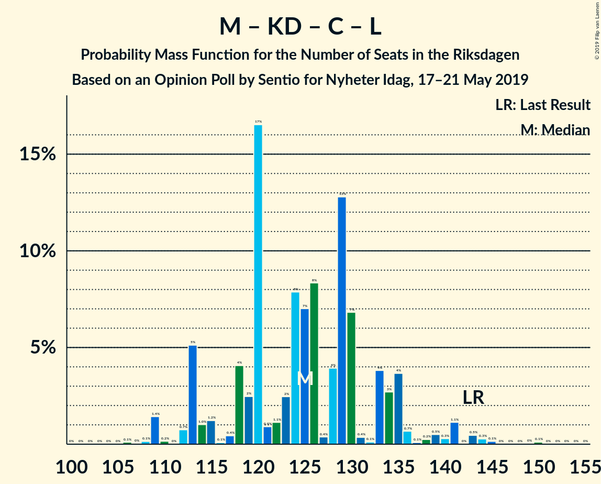

| Number of Seats | Probability | Accumulated | Special Marks |
|:---------------:|:-----------:|:-----------:|:-------------:|
| 104 | 0% | 100% |  |
| 105 | 0% | 99.9% |  |
| 106 | 0.1% | 99.9% |  |
| 107 | 0% | 99.8% |  |
| 108 | 0.1% | 99.8% |  |
| 109 | 1.4% | 99.6% |  |
| 110 | 0.2% | 98% |  |
| 111 | 0% | 98% |  |
| 112 | 0.7% | 98% |  |
| 113 | 5% | 97% |  |
| 114 | 1.0% | 92% |  |
| 115 | 1.2% | 91% |  |
| 116 | 0.1% | 90% |  |
| 117 | 0.4% | 90% |  |
| 118 | 4% | 89% |  |
| 119 | 2% | 85% |  |
| 120 | 17% | 83% |  |
| 121 | 0.9% | 66% | Median |
| 122 | 1.1% | 65% |  |
| 123 | 2% | 64% |  |
| 124 | 8% | 62% |  |
| 125 | 7% | 54% |  |
| 126 | 8% | 47% |  |
| 127 | 0.4% | 39% |  |
| 128 | 4% | 38% |  |
| 129 | 13% | 34% |  |
| 130 | 7% | 21% |  |
| 131 | 0.4% | 15% |  |
| 132 | 0.1% | 14% |  |
| 133 | 4% | 14% |  |
| 134 | 3% | 10% |  |
| 135 | 4% | 8% |  |
| 136 | 0.7% | 4% |  |
| 137 | 0.1% | 3% |  |
| 138 | 0.2% | 3% |  |
| 139 | 0.5% | 3% |  |
| 140 | 0.3% | 3% |  |
| 141 | 1.1% | 2% |  |
| 142 | 0% | 1.1% |  |
| 143 | 0.5% | 1.1% | Last Result |
| 144 | 0.3% | 0.6% |  |
| 145 | 0.1% | 0.3% |  |
| 146 | 0% | 0.2% |  |
| 147 | 0% | 0.2% |  |
| 148 | 0% | 0.2% |  |
| 149 | 0% | 0.2% |  |
| 150 | 0.1% | 0.1% |  |
| 151 | 0% | 0% |  |

### Moderata samlingspartiet – Kristdemokraterna – Centerpartiet

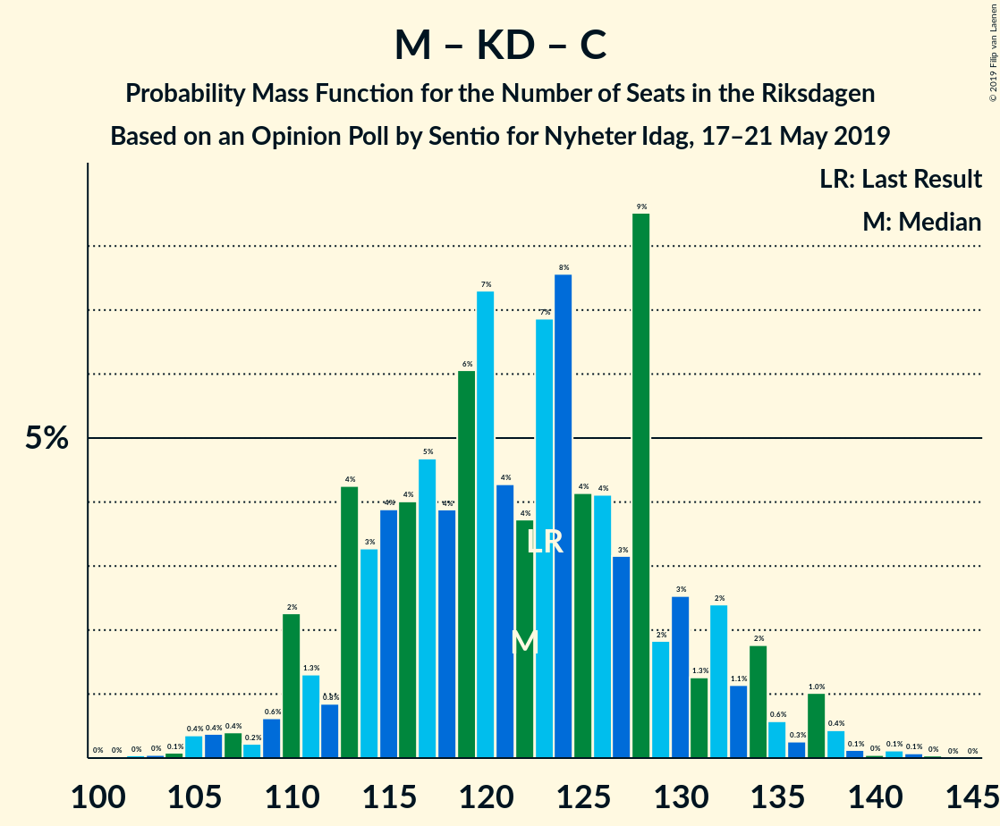

| Number of Seats | Probability | Accumulated | Special Marks |
|:---------------:|:-----------:|:-----------:|:-------------:|
| 103 | 0% | 100% |  |
| 104 | 0.1% | 99.9% |  |
| 105 | 0% | 99.8% |  |
| 106 | 0.1% | 99.8% |  |
| 107 | 0.1% | 99.6% |  |
| 108 | 0.4% | 99.5% |  |
| 109 | 3% | 99.1% |  |
| 110 | 0.2% | 96% |  |
| 111 | 0% | 96% |  |
| 112 | 0.8% | 96% |  |
| 113 | 7% | 95% |  |
| 114 | 8% | 88% |  |
| 115 | 2% | 80% |  |
| 116 | 0.2% | 78% |  |
| 117 | 0.5% | 78% |  |
| 118 | 6% | 77% |  |
| 119 | 3% | 71% |  |
| 120 | 17% | 68% |  |
| 121 | 1.2% | 52% | Median |
| 122 | 1.2% | 50% |  |
| 123 | 4% | 49% | Last Result |
| 124 | 6% | 46% |  |
| 125 | 6% | 39% |  |
| 126 | 8% | 33% |  |
| 127 | 0.4% | 25% |  |
| 128 | 5% | 24% |  |
| 129 | 4% | 20% |  |
| 130 | 6% | 15% |  |
| 131 | 0.3% | 10% |  |
| 132 | 0.1% | 9% |  |
| 133 | 3% | 9% |  |
| 134 | 1.4% | 6% |  |
| 135 | 3% | 4% |  |
| 136 | 0% | 1.0% |  |
| 137 | 0% | 0.9% |  |
| 138 | 0.1% | 0.9% |  |
| 139 | 0.5% | 0.8% |  |
| 140 | 0.3% | 0.4% |  |
| 141 | 0% | 0.1% |  |
| 142 | 0% | 0.1% |  |
| 143 | 0.1% | 0.1% |  |
| 144 | 0% | 0% |  |

### Sveriges socialdemokratiska arbetareparti – Miljöpartiet de gröna

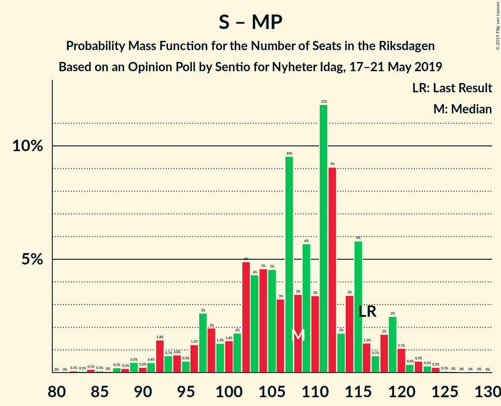

| Number of Seats | Probability | Accumulated | Special Marks |
|:---------------:|:-----------:|:-----------:|:-------------:|
| 83 | 0.1% | 100% |  |
| 84 | 0% | 99.9% |  |
| 85 | 0% | 99.9% |  |
| 86 | 0.2% | 99.9% |  |
| 87 | 0.1% | 99.7% |  |
| 88 | 0% | 99.6% |  |
| 89 | 0.1% | 99.5% |  |
| 90 | 0.8% | 99.4% |  |
| 91 | 0.5% | 98.7% |  |
| 92 | 0.1% | 98% |  |
| 93 | 3% | 98% |  |
| 94 | 0.2% | 95% |  |
| 95 | 0.1% | 95% |  |
| 96 | 5% | 95% |  |
| 97 | 2% | 89% |  |
| 98 | 4% | 87% |  |
| 99 | 0.8% | 82% |  |
| 100 | 1.0% | 82% |  |
| 101 | 2% | 81% |  |
| 102 | 5% | 78% |  |
| 103 | 5% | 74% |  |
| 104 | 7% | 68% |  |
| 105 | 3% | 61% |  |
| 106 | 6% | 58% |  |
| 107 | 4% | 52% | Median |
| 108 | 14% | 48% |  |
| 109 | 2% | 35% |  |
| 110 | 5% | 32% |  |
| 111 | 2% | 27% |  |
| 112 | 16% | 25% |  |
| 113 | 0.2% | 9% |  |
| 114 | 0.6% | 9% |  |
| 115 | 0.4% | 8% |  |
| 116 | 3% | 8% | Last Result |
| 117 | 0.3% | 5% |  |
| 118 | 2% | 5% |  |
| 119 | 0.6% | 3% |  |
| 120 | 0.1% | 2% |  |
| 121 | 0.8% | 2% |  |
| 122 | 0.7% | 1.4% |  |
| 123 | 0.1% | 0.7% |  |
| 124 | 0.1% | 0.6% |  |
| 125 | 0.2% | 0.5% |  |
| 126 | 0.3% | 0.4% |  |
| 127 | 0% | 0.1% |  |
| 128 | 0% | 0% |  |

### Moderata samlingspartiet – Centerpartiet – Liberalerna

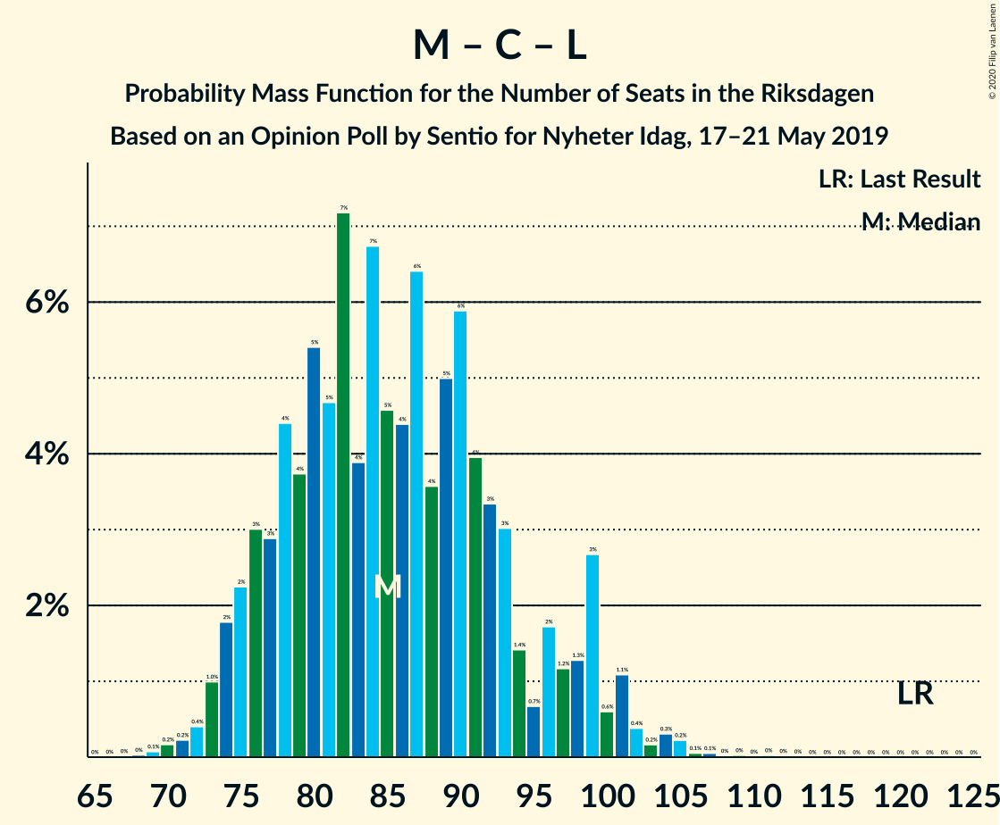

| Number of Seats | Probability | Accumulated | Special Marks |
|:---------------:|:-----------:|:-----------:|:-------------:|
| 69 | 0% | 100% |  |
| 70 | 0.1% | 99.9% |  |
| 71 | 0.1% | 99.9% |  |
| 72 | 0.1% | 99.7% |  |
| 73 | 0.9% | 99.6% |  |
| 74 | 5% | 98.7% |  |
| 75 | 0.4% | 93% |  |
| 76 | 3% | 93% |  |
| 77 | 2% | 90% |  |
| 78 | 0.2% | 89% |  |
| 79 | 16% | 88% |  |
| 80 | 0.5% | 72% |  |
| 81 | 12% | 72% | Median |
| 82 | 0.9% | 60% |  |
| 83 | 3% | 59% |  |
| 84 | 6% | 55% |  |
| 85 | 5% | 50% |  |
| 86 | 3% | 45% |  |
| 87 | 11% | 42% |  |
| 88 | 0.3% | 31% |  |
| 89 | 2% | 31% |  |
| 90 | 0.4% | 28% |  |
| 91 | 13% | 28% |  |
| 92 | 3% | 15% |  |
| 93 | 4% | 12% |  |
| 94 | 1.1% | 8% |  |
| 95 | 1.1% | 7% |  |
| 96 | 0.2% | 6% |  |
| 97 | 0.8% | 5% |  |
| 98 | 0.3% | 5% |  |
| 99 | 0.7% | 4% |  |
| 100 | 0.5% | 4% |  |
| 101 | 1.3% | 3% |  |
| 102 | 0% | 2% |  |
| 103 | 0.1% | 2% |  |
| 104 | 1.2% | 2% |  |
| 105 | 0.2% | 0.6% |  |
| 106 | 0.1% | 0.3% |  |
| 107 | 0.1% | 0.2% |  |
| 108 | 0% | 0% |  |
| 109 | 0% | 0% |  |
| 110 | 0% | 0% |  |
| 111 | 0% | 0% |  |
| 112 | 0% | 0% |  |
| 113 | 0% | 0% |  |
| 114 | 0% | 0% |  |
| 115 | 0% | 0% |  |
| 116 | 0% | 0% |  |
| 117 | 0% | 0% |  |
| 118 | 0% | 0% |  |
| 119 | 0% | 0% |  |
| 120 | 0% | 0% |  |
| 121 | 0% | 0% | Last Result |

### Moderata samlingspartiet – Centerpartiet

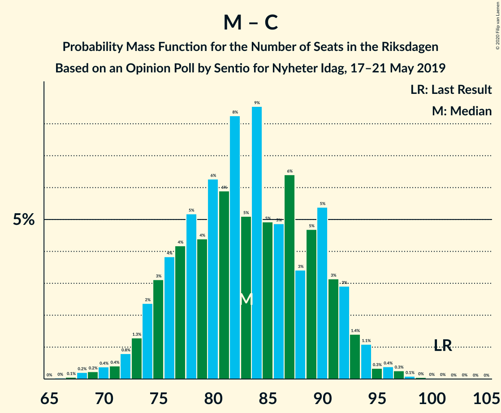

| Number of Seats | Probability | Accumulated | Special Marks |
|:---------------:|:-----------:|:-----------:|:-------------:|
| 67 | 0.1% | 100% |  |
| 68 | 0.4% | 99.9% |  |
| 69 | 0% | 99.5% |  |
| 70 | 2% | 99.4% |  |
| 71 | 0.2% | 98% |  |
| 72 | 2% | 97% |  |
| 73 | 0.9% | 96% |  |
| 74 | 5% | 95% |  |
| 75 | 0.8% | 89% |  |
| 76 | 10% | 88% |  |
| 77 | 2% | 79% |  |
| 78 | 1.2% | 77% |  |
| 79 | 16% | 76% |  |
| 80 | 0.5% | 60% |  |
| 81 | 13% | 59% | Median |
| 82 | 1.1% | 46% |  |
| 83 | 3% | 45% |  |
| 84 | 6% | 42% |  |
| 85 | 6% | 36% |  |
| 86 | 2% | 30% |  |
| 87 | 10% | 28% |  |
| 88 | 0.4% | 18% |  |
| 89 | 2% | 18% |  |
| 90 | 0.5% | 15% |  |
| 91 | 6% | 15% |  |
| 92 | 3% | 9% |  |
| 93 | 3% | 6% |  |
| 94 | 1.1% | 3% |  |
| 95 | 1.0% | 2% |  |
| 96 | 0.1% | 1.0% |  |
| 97 | 0.6% | 1.0% |  |
| 98 | 0.1% | 0.4% |  |
| 99 | 0.3% | 0.3% |  |
| 100 | 0% | 0.1% |  |
| 101 | 0% | 0.1% | Last Result |
| 102 | 0% | 0% |  |

## Technical Information

### Opinion Poll

+ **Polling firm:** Sentio
+ **Commissioner(s):** Nyheter Idag
+ **Fieldwork period:** 17–21 May 2019

### Calculations

+ **Sample size:** 1007
+ **Simulations done:** 32,768
+ **Error estimate:** 2.59%

