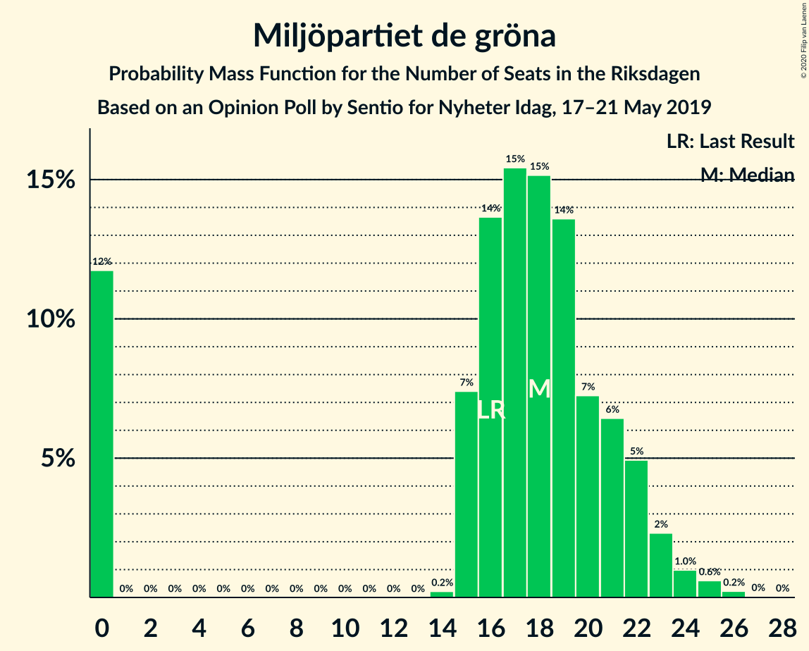
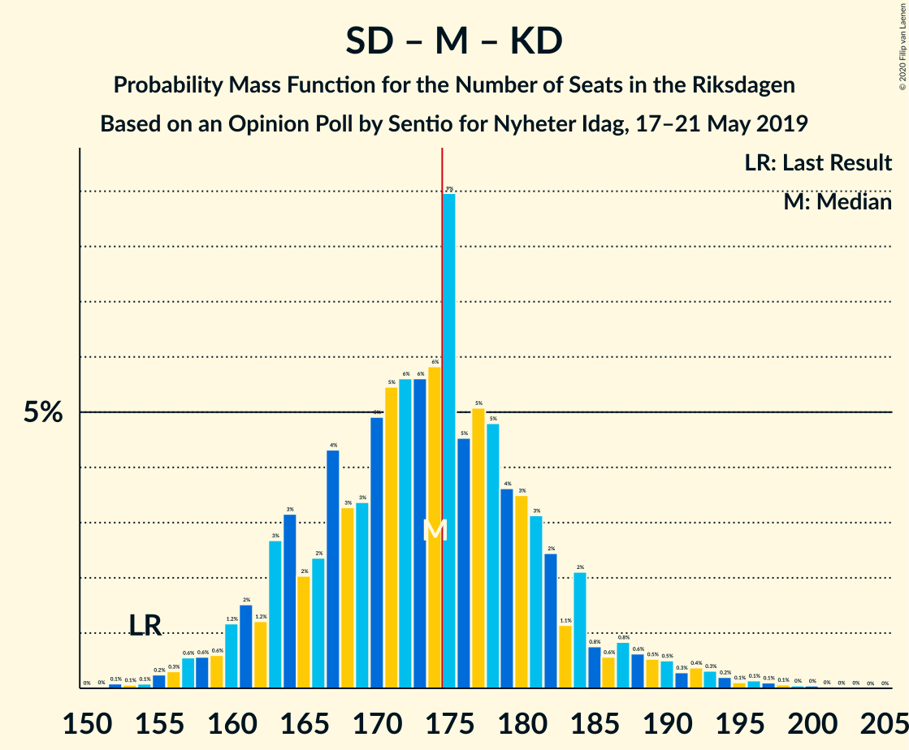
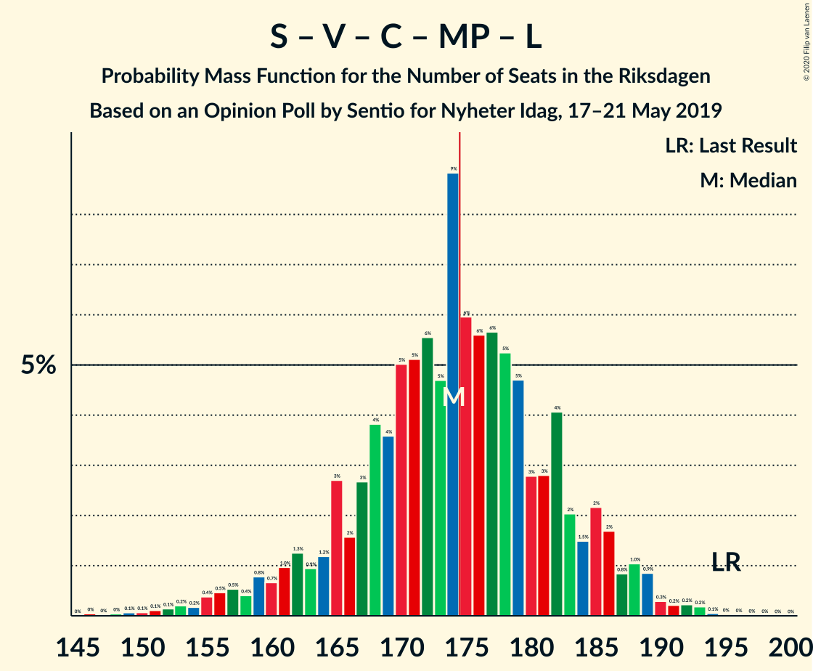

# Opinion Poll by Sentio for Nyheter Idag, 17–21 May 2019

<a href="#voting-intentions">Voting Intentions</a> | <a href="#seats">Seats</a> | <a href="#coalitions">Coalitions</a> | <a href="#technical-information">Technical Information</a>

## Voting Intentions

### Confidence Intervals

| Party | Last Result | Poll Result | 80% Confidence Interval | 90% Confidence Interval | 95% Confidence Interval | 99% Confidence Interval |
|:-----:|:-----------:|:-----------:|:-----------------------:|:-----------------------:|:-----------------------:|:-----------------------:|
| Sveriges socialdemokratiska arbetareparti | 28.3% | 24.9% | 23.2–26.7% |22.8–27.3% |22.3–27.7% |21.6–28.6% |
| Sverigedemokraterna | 17.5% | 21.2% | 19.6–22.9% |19.1–23.4% |18.7–23.8% |18.0–24.6% |
| Moderata samlingspartiet | 19.8% | 15.5% | 14.1–17.0% |13.7–17.5% |13.4–17.9% |12.7–18.6% |
| Kristdemokraterna | 6.3% | 10.4% | 9.3–11.8% |9.0–12.1% |8.7–12.5% |8.2–13.1% |
| Vänsterpartiet | 8.0% | 10.1% | 9.0–11.4% |8.7–11.8% |8.4–12.2% |7.9–12.8% |
| Centerpartiet | 8.6% | 6.8% | 5.8–7.9% |5.6–8.2% |5.3–8.5% |5.0–9.1% |
| Miljöpartiet de gröna | 4.4% | 4.7% | 3.9–5.6% |3.7–5.9% |3.5–6.2% |3.2–6.7% |
| Liberalerna | 5.5% | 3.3% | 2.7–4.1% |2.5–4.4% |2.3–4.6% |2.1–5.0% |

*Note:* The poll result column reflects the actual value used in the calculations. Published results may vary slightly, and in addition be rounded to fewer digits.

## Seats

### Confidence Intervals

| Party | Last Result | Median | 80% Confidence Interval | 90% Confidence Interval | 95% Confidence Interval | 99% Confidence Interval |
|:-----:|:-----------:|:------:|:-----------------------:|:-----------------------:|:-----------------------:|:-----------------------:|
| <a href="#sveriges-socialdemokratiska-arbetareparti">Sveriges socialdemokratiska arbetareparti</a> | 100 | 91 | 85–98 |83–100 |81–102 |78–107 |
| <a href="#sverigedemokraterna">Sverigedemokraterna</a> | 62 | 77 | 71–84 |69–86 |68–88 |65–92 |
| <a href="#moderata-samlingspartiet">Moderata samlingspartiet</a> | 70 | 57 | 51–63 |50–64 |49–67 |46–70 |
| <a href="#kristdemokraterna">Kristdemokraterna</a> | 22 | 39 | 34–44 |33–45 |32–46 |30–49 |
| <a href="#vänsterpartiet">Vänsterpartiet</a> | 28 | 38 | 34–43 |32–44 |31–46 |29–48 |
| <a href="#centerpartiet">Centerpartiet</a> | 31 | 26 | 22–30 |21–31 |19–32 |18–33 |
| <a href="#miljöpartiet-de-gröna">Miljöpartiet de gröna</a> | 16 | 18 | 0–21 |0–22 |0–23 |0–25 |
| <a href="#liberalerna">Liberalerna</a> | 20 | 0 | 0–15 |0–16 |0–17 |0–18 |

### Sveriges socialdemokratiska arbetareparti

*For a full overview of the results for this party, see the [Sveriges socialdemokratiska arbetareparti](party-sverigessocialdemokratiskaarbetareparti.html) page.*

| Number of Seats | Probability | Accumulated | Special Marks |
|:---------------:|:-----------:|:-----------:|:-------------:|
| 74 | 0% | 100% |  |
| 75 | 0% | 99.9% |  |
| 76 | 0.1% | 99.9% |  |
| 77 | 0.2% | 99.8% |  |
| 78 | 0.3% | 99.6% |  |
| 79 | 0.5% | 99.3% |  |
| 80 | 1.0% | 98.8% |  |
| 81 | 0.9% | 98% |  |
| 82 | 2% | 97% |  |
| 83 | 2% | 95% |  |
| 84 | 3% | 93% |  |
| 85 | 5% | 90% |  |
| 86 | 3% | 85% |  |
| 87 | 6% | 82% |  |
| 88 | 8% | 76% |  |
| 89 | 5% | 68% |  |
| 90 | 9% | 63% |  |
| 91 | 10% | 54% | Median |
| 92 | 5% | 44% |  |
| 93 | 7% | 38% |  |
| 94 | 7% | 32% |  |
| 95 | 4% | 24% |  |
| 96 | 4% | 20% |  |
| 97 | 4% | 16% |  |
| 98 | 3% | 12% |  |
| 99 | 3% | 10% |  |
| 100 | 2% | 7% | Last Result |
| 101 | 0.9% | 5% |  |
| 102 | 1.3% | 4% |  |
| 103 | 0.5% | 2% |  |
| 104 | 0.6% | 2% |  |
| 105 | 0.5% | 1.3% |  |
| 106 | 0.1% | 0.8% |  |
| 107 | 0.2% | 0.7% |  |
| 108 | 0.1% | 0.5% |  |
| 109 | 0.1% | 0.3% |  |
| 110 | 0.1% | 0.2% |  |
| 111 | 0.1% | 0.1% |  |
| 112 | 0% | 0.1% |  |
| 113 | 0% | 0% |  |

### Sverigedemokraterna

*For a full overview of the results for this party, see the [Sverigedemokraterna](party-sverigedemokraterna.html) page.*

| Number of Seats | Probability | Accumulated | Special Marks |
|:---------------:|:-----------:|:-----------:|:-------------:|
| 62 | 0.1% | 100% | Last Result |
| 63 | 0.1% | 99.9% |  |
| 64 | 0.1% | 99.8% |  |
| 65 | 0.2% | 99.7% |  |
| 66 | 0.3% | 99.5% |  |
| 67 | 1.1% | 99.2% |  |
| 68 | 1.4% | 98% |  |
| 69 | 3% | 97% |  |
| 70 | 3% | 94% |  |
| 71 | 3% | 91% |  |
| 72 | 4% | 88% |  |
| 73 | 5% | 84% |  |
| 74 | 5% | 79% |  |
| 75 | 7% | 74% |  |
| 76 | 9% | 68% |  |
| 77 | 10% | 58% | Median |
| 78 | 7% | 48% |  |
| 79 | 5% | 41% |  |
| 80 | 8% | 35% |  |
| 81 | 5% | 27% |  |
| 82 | 4% | 22% |  |
| 83 | 5% | 18% |  |
| 84 | 5% | 13% |  |
| 85 | 2% | 8% |  |
| 86 | 2% | 7% |  |
| 87 | 1.1% | 4% |  |
| 88 | 0.9% | 3% |  |
| 89 | 0.8% | 2% |  |
| 90 | 0.3% | 1.2% |  |
| 91 | 0.3% | 0.9% |  |
| 92 | 0.3% | 0.6% |  |
| 93 | 0.1% | 0.3% |  |
| 94 | 0.1% | 0.2% |  |
| 95 | 0.1% | 0.1% |  |
| 96 | 0% | 0.1% |  |
| 97 | 0% | 0.1% |  |
| 98 | 0% | 0% |  |

### Moderata samlingspartiet

*For a full overview of the results for this party, see the [Moderata samlingspartiet](party-moderatasamlingspartiet.html) page.*

| Number of Seats | Probability | Accumulated | Special Marks |
|:---------------:|:-----------:|:-----------:|:-------------:|
| 44 | 0.1% | 100% |  |
| 45 | 0.2% | 99.9% |  |
| 46 | 0.5% | 99.7% |  |
| 47 | 0.8% | 99.2% |  |
| 48 | 0.7% | 98% |  |
| 49 | 2% | 98% |  |
| 50 | 4% | 96% |  |
| 51 | 4% | 92% |  |
| 52 | 6% | 89% |  |
| 53 | 4% | 83% |  |
| 54 | 7% | 79% |  |
| 55 | 11% | 72% |  |
| 56 | 8% | 61% |  |
| 57 | 9% | 53% | Median |
| 58 | 7% | 44% |  |
| 59 | 6% | 37% |  |
| 60 | 9% | 31% |  |
| 61 | 6% | 22% |  |
| 62 | 6% | 16% |  |
| 63 | 3% | 10% |  |
| 64 | 2% | 7% |  |
| 65 | 1.1% | 5% |  |
| 66 | 1.1% | 4% |  |
| 67 | 0.7% | 3% |  |
| 68 | 0.7% | 2% |  |
| 69 | 0.6% | 1.1% |  |
| 70 | 0.3% | 0.6% | Last Result |
| 71 | 0.1% | 0.3% |  |
| 72 | 0.1% | 0.2% |  |
| 73 | 0% | 0.1% |  |
| 74 | 0% | 0.1% |  |
| 75 | 0% | 0% |  |

### Kristdemokraterna

*For a full overview of the results for this party, see the [Kristdemokraterna](party-kristdemokraterna.html) page.*

| Number of Seats | Probability | Accumulated | Special Marks |
|:---------------:|:-----------:|:-----------:|:-------------:|
| 22 | 0% | 100% | Last Result |
| 23 | 0% | 100% |  |
| 24 | 0% | 100% |  |
| 25 | 0% | 100% |  |
| 26 | 0% | 100% |  |
| 27 | 0% | 100% |  |
| 28 | 0.1% | 100% |  |
| 29 | 0.2% | 99.9% |  |
| 30 | 0.4% | 99.7% |  |
| 31 | 1.2% | 99.2% |  |
| 32 | 2% | 98% |  |
| 33 | 3% | 96% |  |
| 34 | 6% | 93% |  |
| 35 | 6% | 87% |  |
| 36 | 12% | 81% |  |
| 37 | 6% | 70% |  |
| 38 | 13% | 64% |  |
| 39 | 9% | 51% | Median |
| 40 | 12% | 42% |  |
| 41 | 7% | 30% |  |
| 42 | 7% | 23% |  |
| 43 | 5% | 16% |  |
| 44 | 5% | 11% |  |
| 45 | 2% | 6% |  |
| 46 | 2% | 4% |  |
| 47 | 0.8% | 2% |  |
| 48 | 0.5% | 1.3% |  |
| 49 | 0.5% | 0.8% |  |
| 50 | 0.1% | 0.3% |  |
| 51 | 0.1% | 0.2% |  |
| 52 | 0% | 0.1% |  |
| 53 | 0% | 0% |  |

### Vänsterpartiet

*For a full overview of the results for this party, see the [Vänsterpartiet](party-vänsterpartiet.html) page.*

| Number of Seats | Probability | Accumulated | Special Marks |
|:---------------:|:-----------:|:-----------:|:-------------:|
| 27 | 0.1% | 100% |  |
| 28 | 0.2% | 99.9% | Last Result |
| 29 | 0.4% | 99.7% |  |
| 30 | 1.0% | 99.3% |  |
| 31 | 1.3% | 98% |  |
| 32 | 3% | 97% |  |
| 33 | 4% | 94% |  |
| 34 | 7% | 90% |  |
| 35 | 7% | 84% |  |
| 36 | 8% | 77% |  |
| 37 | 11% | 68% |  |
| 38 | 12% | 57% | Median |
| 39 | 8% | 45% |  |
| 40 | 9% | 37% |  |
| 41 | 10% | 28% |  |
| 42 | 5% | 18% |  |
| 43 | 5% | 13% |  |
| 44 | 3% | 8% |  |
| 45 | 2% | 5% |  |
| 46 | 1.3% | 3% |  |
| 47 | 0.6% | 1.4% |  |
| 48 | 0.3% | 0.8% |  |
| 49 | 0.3% | 0.4% |  |
| 50 | 0.1% | 0.2% |  |
| 51 | 0% | 0.1% |  |
| 52 | 0% | 0% |  |

### Centerpartiet

*For a full overview of the results for this party, see the [Centerpartiet](party-centerpartiet.html) page.*

| Number of Seats | Probability | Accumulated | Special Marks |
|:---------------:|:-----------:|:-----------:|:-------------:|
| 16 | 0.1% | 100% |  |
| 17 | 0.2% | 99.9% |  |
| 18 | 0.5% | 99.7% |  |
| 19 | 2% | 99.2% |  |
| 20 | 2% | 97% |  |
| 21 | 3% | 95% |  |
| 22 | 5% | 93% |  |
| 23 | 7% | 87% |  |
| 24 | 8% | 81% |  |
| 25 | 9% | 73% |  |
| 26 | 18% | 64% | Median |
| 27 | 14% | 46% |  |
| 28 | 7% | 32% |  |
| 29 | 12% | 25% |  |
| 30 | 7% | 13% |  |
| 31 | 2% | 6% | Last Result |
| 32 | 2% | 4% |  |
| 33 | 0.9% | 1.3% |  |
| 34 | 0.3% | 0.5% |  |
| 35 | 0.1% | 0.2% |  |
| 36 | 0.1% | 0.1% |  |
| 37 | 0% | 0% |  |

### Miljöpartiet de gröna

*For a full overview of the results for this party, see the [Miljöpartiet de gröna](party-miljöpartietdegröna.html) page.*

| Number of Seats | Probability | Accumulated | Special Marks |
|:---------------:|:-----------:|:-----------:|:-------------:|
| 0 | 12% | 100% |  |
| 1 | 0% | 88% |  |
| 2 | 0% | 88% |  |
| 3 | 0% | 88% |  |
| 4 | 0% | 88% |  |
| 5 | 0% | 88% |  |
| 6 | 0% | 88% |  |
| 7 | 0% | 88% |  |
| 8 | 0% | 88% |  |
| 9 | 0% | 88% |  |
| 10 | 0% | 88% |  |
| 11 | 0% | 88% |  |
| 12 | 0% | 88% |  |
| 13 | 0% | 88% |  |
| 14 | 0.2% | 88% |  |
| 15 | 7% | 88% |  |
| 16 | 14% | 81% | Last Result |
| 17 | 15% | 67% |  |
| 18 | 15% | 52% | Median |
| 19 | 14% | 36% |  |
| 20 | 7% | 23% |  |
| 21 | 6% | 16% |  |
| 22 | 5% | 9% |  |
| 23 | 2% | 4% |  |
| 24 | 1.0% | 2% |  |
| 25 | 0.6% | 0.9% |  |
| 26 | 0.2% | 0.3% |  |
| 27 | 0% | 0.1% |  |
| 28 | 0% | 0% |  |

### Liberalerna

*For a full overview of the results for this party, see the [Liberalerna](party-liberalerna.html) page.*

| Number of Seats | Probability | Accumulated | Special Marks |
|:---------------:|:-----------:|:-----------:|:-------------:|
| 0 | 85% | 100% | Median |
| 1 | 0% | 15% |  |
| 2 | 0% | 15% |  |
| 3 | 0% | 15% |  |
| 4 | 0% | 15% |  |
| 5 | 0% | 15% |  |
| 6 | 0% | 15% |  |
| 7 | 0% | 15% |  |
| 8 | 0% | 15% |  |
| 9 | 0% | 15% |  |
| 10 | 0% | 15% |  |
| 11 | 0% | 15% |  |
| 12 | 0% | 15% |  |
| 13 | 0% | 15% |  |
| 14 | 1.1% | 15% |  |
| 15 | 7% | 14% |  |
| 16 | 4% | 7% |  |
| 17 | 2% | 3% |  |
| 18 | 1.0% | 1.4% |  |
| 19 | 0.3% | 0.4% |  |
| 20 | 0.1% | 0.1% | Last Result |
| 21 | 0% | 0% |  |

## Coalitions

### Confidence Intervals

| Coalition | Last Result | Median | Majority? | 80% Confidence Interval | 90% Confidence Interval | 95% Confidence Interval | 99% Confidence Interval |
|:---------:|:-----------:|:------:|:---------:|:-----------------------:|:-----------------------:|:-----------------------:|:-----------------------:|
| Sveriges socialdemokratiska arbetareparti – Moderata samlingspartiet – Centerpartiet | 201 | 174 | 48% | 165–184 | 162–187 | 160–189 | 155–194 |
| Sverigedemokraterna – Moderata samlingspartiet – Kristdemokraterna | 154 | 174 | 45% | 164–182 | 161–185 | 159–189 | 155–195 |
| Sveriges socialdemokratiska arbetareparti – Vänsterpartiet – Centerpartiet – Miljöpartiet de gröna – Liberalerna | 195 | 174 | 48% | 165–183 | 161–186 | 158–188 | 152–192 |
| Sveriges socialdemokratiska arbetareparti – Moderata samlingspartiet | 170 | 148 | 0% | 140–157 | 138–160 | 136–164 | 132–169 |
| Sveriges socialdemokratiska arbetareparti – Vänsterpartiet – Miljöpartiet de gröna | 144 | 146 | 0% | 136–155 | 133–157 | 130–159 | 124–162 |
| Sverigedemokraterna – Moderata samlingspartiet | 132 | 135 | 0% | 126–142 | 124–145 | 122–150 | 119–154 |
| Sveriges socialdemokratiska arbetareparti – Centerpartiet – Miljöpartiet de gröna – Liberalerna | 167 | 136 | 0% | 126–145 | 123–149 | 120–150 | 114–155 |
| Sveriges socialdemokratiska arbetareparti – Vänsterpartiet | 128 | 129 | 0% | 122–137 | 119–140 | 117–142 | 114–146 |
| Moderata samlingspartiet – Kristdemokraterna – Centerpartiet – Liberalerna | 143 | 124 | 0% | 116–134 | 113–137 | 111–139 | 107–144 |
| Moderata samlingspartiet – Kristdemokraterna – Centerpartiet | 123 | 122 | 0% | 114–131 | 111–133 | 110–134 | 106–138 |
| Sveriges socialdemokratiska arbetareparti – Miljöpartiet de gröna | 116 | 108 | 0% | 98–116 | 94–118 | 92–120 | 86–123 |
| Moderata samlingspartiet – Centerpartiet – Liberalerna | 121 | 85 | 0% | 77–95 | 75–99 | 74–100 | 71–104 |
| Moderata samlingspartiet – Centerpartiet | 101 | 83 | 0% | 76–90 | 74–92 | 73–93 | 69–96 |

### Sveriges socialdemokratiska arbetareparti – Moderata samlingspartiet – Centerpartiet

| Number of Seats | Probability | Accumulated | Special Marks |
|:---------------:|:-----------:|:-----------:|:-------------:|
| 151 | 0% | 100% |  |
| 152 | 0.1% | 99.9% |  |
| 153 | 0% | 99.9% |  |
| 154 | 0.2% | 99.8% |  |
| 155 | 0.2% | 99.6% |  |
| 156 | 0.2% | 99.4% |  |
| 157 | 0.2% | 99.2% |  |
| 158 | 0.6% | 99.0% |  |
| 159 | 0.5% | 98% |  |
| 160 | 0.4% | 98% |  |
| 161 | 0.6% | 97% |  |
| 162 | 2% | 97% |  |
| 163 | 2% | 95% |  |
| 164 | 1.4% | 93% |  |
| 165 | 3% | 91% |  |
| 166 | 2% | 89% |  |
| 167 | 4% | 86% |  |
| 168 | 4% | 83% |  |
| 169 | 3% | 79% |  |
| 170 | 5% | 76% |  |
| 171 | 4% | 71% |  |
| 172 | 7% | 67% |  |
| 173 | 6% | 60% |  |
| 174 | 6% | 54% | Median |
| 175 | 6% | 48% | Majority |
| 176 | 5% | 42% |  |
| 177 | 6% | 37% |  |
| 178 | 2% | 32% |  |
| 179 | 4% | 29% |  |
| 180 | 7% | 25% |  |
| 181 | 2% | 18% |  |
| 182 | 2% | 16% |  |
| 183 | 3% | 14% |  |
| 184 | 3% | 10% |  |
| 185 | 0.9% | 7% |  |
| 186 | 1.1% | 6% |  |
| 187 | 1.4% | 5% |  |
| 188 | 0.9% | 4% |  |
| 189 | 0.6% | 3% |  |
| 190 | 0.6% | 2% |  |
| 191 | 0.3% | 2% |  |
| 192 | 0.5% | 1.4% |  |
| 193 | 0.2% | 0.9% |  |
| 194 | 0.2% | 0.7% |  |
| 195 | 0.1% | 0.5% |  |
| 196 | 0.1% | 0.4% |  |
| 197 | 0.1% | 0.2% |  |
| 198 | 0% | 0.1% |  |
| 199 | 0% | 0.1% |  |
| 200 | 0% | 0% |  |
| 201 | 0% | 0% | Last Result |

### Sverigedemokraterna – Moderata samlingspartiet – Kristdemokraterna

| Number of Seats | Probability | Accumulated | Special Marks |
|:---------------:|:-----------:|:-----------:|:-------------:|
| 150 | 0% | 100% |  |
| 151 | 0% | 99.9% |  |
| 152 | 0.1% | 99.9% |  |
| 153 | 0.1% | 99.8% |  |
| 154 | 0.1% | 99.8% | Last Result |
| 155 | 0.2% | 99.7% |  |
| 156 | 0.3% | 99.4% |  |
| 157 | 0.6% | 99.1% |  |
| 158 | 0.6% | 98.6% |  |
| 159 | 0.6% | 98% |  |
| 160 | 1.2% | 97% |  |
| 161 | 2% | 96% |  |
| 162 | 1.2% | 95% |  |
| 163 | 3% | 94% |  |
| 164 | 3% | 91% |  |
| 165 | 2% | 88% |  |
| 166 | 2% | 86% |  |
| 167 | 4% | 83% |  |
| 168 | 3% | 79% |  |
| 169 | 3% | 76% |  |
| 170 | 5% | 72% |  |
| 171 | 5% | 67% |  |
| 172 | 6% | 62% |  |
| 173 | 6% | 56% | Median |
| 174 | 6% | 51% |  |
| 175 | 9% | 45% | Majority |
| 176 | 5% | 36% |  |
| 177 | 5% | 31% |  |
| 178 | 5% | 26% |  |
| 179 | 4% | 22% |  |
| 180 | 3% | 18% |  |
| 181 | 3% | 14% |  |
| 182 | 2% | 11% |  |
| 183 | 1.1% | 9% |  |
| 184 | 2% | 8% |  |
| 185 | 0.8% | 6% |  |
| 186 | 0.6% | 5% |  |
| 187 | 0.8% | 4% |  |
| 188 | 0.6% | 3% |  |
| 189 | 0.5% | 3% |  |
| 190 | 0.5% | 2% |  |
| 191 | 0.3% | 2% |  |
| 192 | 0.4% | 1.5% |  |
| 193 | 0.3% | 1.1% |  |
| 194 | 0.2% | 0.8% |  |
| 195 | 0.1% | 0.6% |  |
| 196 | 0.1% | 0.5% |  |
| 197 | 0.1% | 0.3% |  |
| 198 | 0.1% | 0.2% |  |
| 199 | 0% | 0.2% |  |
| 200 | 0% | 0.1% |  |
| 201 | 0% | 0.1% |  |
| 202 | 0% | 0% |  |

### Sveriges socialdemokratiska arbetareparti – Vänsterpartiet – Centerpartiet – Miljöpartiet de gröna – Liberalerna

| Number of Seats | Probability | Accumulated | Special Marks |
|:---------------:|:-----------:|:-----------:|:-------------:|
| 146 | 0% | 100% |  |
| 147 | 0% | 99.9% |  |
| 148 | 0% | 99.9% |  |
| 149 | 0.1% | 99.9% |  |
| 150 | 0.1% | 99.8% |  |
| 151 | 0.1% | 99.7% |  |
| 152 | 0.1% | 99.6% |  |
| 153 | 0.2% | 99.5% |  |
| 154 | 0.2% | 99.3% |  |
| 155 | 0.4% | 99.1% |  |
| 156 | 0.5% | 98.7% |  |
| 157 | 0.5% | 98% |  |
| 158 | 0.4% | 98% |  |
| 159 | 0.8% | 97% |  |
| 160 | 0.7% | 97% |  |
| 161 | 1.0% | 96% |  |
| 162 | 1.3% | 95% |  |
| 163 | 0.9% | 94% |  |
| 164 | 1.2% | 93% |  |
| 165 | 3% | 92% |  |
| 166 | 2% | 89% |  |
| 167 | 3% | 87% |  |
| 168 | 4% | 85% |  |
| 169 | 4% | 81% |  |
| 170 | 5% | 77% |  |
| 171 | 5% | 72% |  |
| 172 | 6% | 67% |  |
| 173 | 5% | 61% | Median |
| 174 | 9% | 57% |  |
| 175 | 6% | 48% | Majority |
| 176 | 6% | 42% |  |
| 177 | 6% | 36% |  |
| 178 | 5% | 31% |  |
| 179 | 5% | 26% |  |
| 180 | 3% | 21% |  |
| 181 | 3% | 18% |  |
| 182 | 4% | 15% |  |
| 183 | 2% | 11% |  |
| 184 | 1.5% | 9% |  |
| 185 | 2% | 8% |  |
| 186 | 2% | 5% |  |
| 187 | 0.8% | 4% |  |
| 188 | 1.0% | 3% |  |
| 189 | 0.9% | 2% |  |
| 190 | 0.3% | 1.0% |  |
| 191 | 0.2% | 0.7% |  |
| 192 | 0.2% | 0.5% |  |
| 193 | 0.2% | 0.3% |  |
| 194 | 0.1% | 0.1% |  |
| 195 | 0% | 0.1% | Last Result |
| 196 | 0% | 0% |  |

### Sveriges socialdemokratiska arbetareparti – Moderata samlingspartiet

| Number of Seats | Probability | Accumulated | Special Marks |
|:---------------:|:-----------:|:-----------:|:-------------:|
| 128 | 0% | 100% |  |
| 129 | 0% | 99.9% |  |
| 130 | 0.1% | 99.9% |  |
| 131 | 0.2% | 99.8% |  |
| 132 | 0.2% | 99.6% |  |
| 133 | 0.5% | 99.3% |  |
| 134 | 0.4% | 98.8% |  |
| 135 | 0.7% | 98% |  |
| 136 | 0.9% | 98% |  |
| 137 | 1.0% | 97% |  |
| 138 | 2% | 96% |  |
| 139 | 3% | 94% |  |
| 140 | 3% | 92% |  |
| 141 | 4% | 89% |  |
| 142 | 6% | 85% |  |
| 143 | 5% | 80% |  |
| 144 | 5% | 75% |  |
| 145 | 5% | 70% |  |
| 146 | 5% | 64% |  |
| 147 | 6% | 59% |  |
| 148 | 7% | 53% | Median |
| 149 | 8% | 47% |  |
| 150 | 7% | 39% |  |
| 151 | 6% | 32% |  |
| 152 | 3% | 26% |  |
| 153 | 5% | 23% |  |
| 154 | 3% | 19% |  |
| 155 | 2% | 15% |  |
| 156 | 2% | 13% |  |
| 157 | 2% | 11% |  |
| 158 | 2% | 9% |  |
| 159 | 1.3% | 7% |  |
| 160 | 1.3% | 6% |  |
| 161 | 0.5% | 5% |  |
| 162 | 0.6% | 4% |  |
| 163 | 0.6% | 3% |  |
| 164 | 0.5% | 3% |  |
| 165 | 0.6% | 2% |  |
| 166 | 0.6% | 2% |  |
| 167 | 0.3% | 1.1% |  |
| 168 | 0.3% | 0.8% |  |
| 169 | 0.2% | 0.5% |  |
| 170 | 0.2% | 0.4% | Last Result |
| 171 | 0.1% | 0.2% |  |
| 172 | 0% | 0.2% |  |
| 173 | 0% | 0.1% |  |
| 174 | 0% | 0.1% |  |
| 175 | 0% | 0% | Majority |

### Sveriges socialdemokratiska arbetareparti – Vänsterpartiet – Miljöpartiet de gröna

| Number of Seats | Probability | Accumulated | Special Marks |
|:---------------:|:-----------:|:-----------:|:-------------:|
| 119 | 0% | 100% |  |
| 120 | 0.1% | 99.9% |  |
| 121 | 0% | 99.8% |  |
| 122 | 0.1% | 99.8% |  |
| 123 | 0.1% | 99.7% |  |
| 124 | 0.2% | 99.7% |  |
| 125 | 0.1% | 99.5% |  |
| 126 | 0.2% | 99.4% |  |
| 127 | 0.2% | 99.1% |  |
| 128 | 0.5% | 98.9% |  |
| 129 | 0.4% | 98% |  |
| 130 | 1.1% | 98% |  |
| 131 | 0.6% | 97% |  |
| 132 | 1.1% | 96% |  |
| 133 | 0.8% | 95% |  |
| 134 | 1.5% | 94% |  |
| 135 | 2% | 93% |  |
| 136 | 2% | 90% |  |
| 137 | 3% | 89% |  |
| 138 | 2% | 86% |  |
| 139 | 3% | 84% |  |
| 140 | 4% | 81% |  |
| 141 | 4% | 77% |  |
| 142 | 4% | 73% |  |
| 143 | 4% | 69% |  |
| 144 | 8% | 65% | Last Result |
| 145 | 5% | 57% |  |
| 146 | 4% | 52% |  |
| 147 | 6% | 47% | Median |
| 148 | 7% | 42% |  |
| 149 | 3% | 35% |  |
| 150 | 7% | 32% |  |
| 151 | 5% | 25% |  |
| 152 | 3% | 20% |  |
| 153 | 4% | 17% |  |
| 154 | 3% | 13% |  |
| 155 | 3% | 10% |  |
| 156 | 2% | 7% |  |
| 157 | 0.9% | 5% |  |
| 158 | 1.2% | 4% |  |
| 159 | 1.3% | 3% |  |
| 160 | 0.3% | 2% |  |
| 161 | 0.9% | 2% |  |
| 162 | 0.3% | 0.8% |  |
| 163 | 0.1% | 0.5% |  |
| 164 | 0.1% | 0.3% |  |
| 165 | 0.1% | 0.2% |  |
| 166 | 0% | 0.1% |  |
| 167 | 0% | 0.1% |  |
| 168 | 0% | 0% |  |

### Sverigedemokraterna – Moderata samlingspartiet

| Number of Seats | Probability | Accumulated | Special Marks |
|:---------------:|:-----------:|:-----------:|:-------------:|
| 114 | 0% | 100% |  |
| 115 | 0% | 99.9% |  |
| 116 | 0.1% | 99.9% |  |
| 117 | 0.1% | 99.9% |  |
| 118 | 0.2% | 99.8% |  |
| 119 | 0.4% | 99.6% |  |
| 120 | 0.5% | 99.2% |  |
| 121 | 0.7% | 98.7% |  |
| 122 | 0.9% | 98% |  |
| 123 | 1.2% | 97% |  |
| 124 | 2% | 96% |  |
| 125 | 3% | 94% |  |
| 126 | 3% | 92% |  |
| 127 | 4% | 88% |  |
| 128 | 4% | 84% |  |
| 129 | 4% | 80% |  |
| 130 | 4% | 76% |  |
| 131 | 3% | 72% |  |
| 132 | 3% | 69% | Last Result |
| 133 | 7% | 66% |  |
| 134 | 4% | 59% | Median |
| 135 | 7% | 55% |  |
| 136 | 7% | 48% |  |
| 137 | 6% | 41% |  |
| 138 | 10% | 35% |  |
| 139 | 7% | 24% |  |
| 140 | 3% | 18% |  |
| 141 | 4% | 14% |  |
| 142 | 1.4% | 11% |  |
| 143 | 2% | 9% |  |
| 144 | 2% | 7% |  |
| 145 | 0.8% | 5% |  |
| 146 | 0.7% | 5% |  |
| 147 | 0.4% | 4% |  |
| 148 | 0.4% | 4% |  |
| 149 | 0.5% | 3% |  |
| 150 | 0.3% | 3% |  |
| 151 | 0.4% | 2% |  |
| 152 | 0.5% | 2% |  |
| 153 | 0.9% | 2% |  |
| 154 | 0.1% | 0.6% |  |
| 155 | 0.1% | 0.5% |  |
| 156 | 0.2% | 0.4% |  |
| 157 | 0.1% | 0.2% |  |
| 158 | 0.1% | 0.1% |  |
| 159 | 0% | 0.1% |  |
| 160 | 0% | 0.1% |  |
| 161 | 0% | 0% |  |

### Sveriges socialdemokratiska arbetareparti – Centerpartiet – Miljöpartiet de gröna – Liberalerna

| Number of Seats | Probability | Accumulated | Special Marks |
|:---------------:|:-----------:|:-----------:|:-------------:|
| 110 | 0% | 100% |  |
| 111 | 0.1% | 99.9% |  |
| 112 | 0.1% | 99.8% |  |
| 113 | 0.1% | 99.7% |  |
| 114 | 0.2% | 99.6% |  |
| 115 | 0.2% | 99.3% |  |
| 116 | 0.2% | 99.1% |  |
| 117 | 0.2% | 98.9% |  |
| 118 | 0.3% | 98.7% |  |
| 119 | 0.7% | 98% |  |
| 120 | 0.4% | 98% |  |
| 121 | 0.7% | 97% |  |
| 122 | 1.1% | 97% |  |
| 123 | 0.7% | 95% |  |
| 124 | 2% | 95% |  |
| 125 | 2% | 93% |  |
| 126 | 2% | 91% |  |
| 127 | 2% | 89% |  |
| 128 | 2% | 87% |  |
| 129 | 3% | 85% |  |
| 130 | 3% | 82% |  |
| 131 | 4% | 79% |  |
| 132 | 4% | 74% |  |
| 133 | 6% | 70% |  |
| 134 | 6% | 65% |  |
| 135 | 6% | 59% | Median |
| 136 | 4% | 53% |  |
| 137 | 9% | 49% |  |
| 138 | 5% | 40% |  |
| 139 | 6% | 35% |  |
| 140 | 2% | 28% |  |
| 141 | 5% | 26% |  |
| 142 | 4% | 21% |  |
| 143 | 2% | 18% |  |
| 144 | 4% | 15% |  |
| 145 | 1.5% | 11% |  |
| 146 | 2% | 9% |  |
| 147 | 0.8% | 8% |  |
| 148 | 1.5% | 7% |  |
| 149 | 2% | 6% |  |
| 150 | 1.4% | 4% |  |
| 151 | 0.3% | 2% |  |
| 152 | 0.8% | 2% |  |
| 153 | 0.2% | 1.4% |  |
| 154 | 0.2% | 1.2% |  |
| 155 | 0.4% | 0.9% |  |
| 156 | 0.2% | 0.5% |  |
| 157 | 0.2% | 0.3% |  |
| 158 | 0% | 0.1% |  |
| 159 | 0% | 0.1% |  |
| 160 | 0% | 0.1% |  |
| 161 | 0% | 0.1% |  |
| 162 | 0% | 0% |  |
| 163 | 0% | 0% |  |
| 164 | 0% | 0% |  |
| 165 | 0% | 0% |  |
| 166 | 0% | 0% |  |
| 167 | 0% | 0% | Last Result |

### Sveriges socialdemokratiska arbetareparti – Vänsterpartiet

| Number of Seats | Probability | Accumulated | Special Marks |
|:---------------:|:-----------:|:-----------:|:-------------:|
| 109 | 0.1% | 100% |  |
| 110 | 0.1% | 99.9% |  |
| 111 | 0.1% | 99.8% |  |
| 112 | 0.1% | 99.8% |  |
| 113 | 0.1% | 99.7% |  |
| 114 | 0.6% | 99.5% |  |
| 115 | 0.3% | 98.9% |  |
| 116 | 0.8% | 98.7% |  |
| 117 | 1.2% | 98% |  |
| 118 | 1.1% | 97% |  |
| 119 | 2% | 96% |  |
| 120 | 2% | 94% |  |
| 121 | 2% | 92% |  |
| 122 | 3% | 90% |  |
| 123 | 3% | 87% |  |
| 124 | 6% | 84% |  |
| 125 | 5% | 78% |  |
| 126 | 5% | 73% |  |
| 127 | 7% | 68% |  |
| 128 | 7% | 60% | Last Result |
| 129 | 4% | 53% | Median |
| 130 | 6% | 49% |  |
| 131 | 6% | 43% |  |
| 132 | 6% | 37% |  |
| 133 | 4% | 31% |  |
| 134 | 5% | 27% |  |
| 135 | 5% | 21% |  |
| 136 | 3% | 16% |  |
| 137 | 3% | 13% |  |
| 138 | 2% | 10% |  |
| 139 | 2% | 8% |  |
| 140 | 1.4% | 6% |  |
| 141 | 2% | 5% |  |
| 142 | 0.8% | 3% |  |
| 143 | 0.8% | 2% |  |
| 144 | 0.4% | 2% |  |
| 145 | 0.3% | 1.1% |  |
| 146 | 0.3% | 0.8% |  |
| 147 | 0.2% | 0.5% |  |
| 148 | 0% | 0.3% |  |
| 149 | 0.1% | 0.2% |  |
| 150 | 0.1% | 0.1% |  |
| 151 | 0% | 0.1% |  |
| 152 | 0% | 0% |  |

### Moderata samlingspartiet – Kristdemokraterna – Centerpartiet – Liberalerna

| Number of Seats | Probability | Accumulated | Special Marks |
|:---------------:|:-----------:|:-----------:|:-------------:|
| 104 | 0% | 100% |  |
| 105 | 0.1% | 99.9% |  |
| 106 | 0.1% | 99.9% |  |
| 107 | 0.3% | 99.8% |  |
| 108 | 0.3% | 99.5% |  |
| 109 | 0.4% | 99.2% |  |
| 110 | 0.7% | 98.8% |  |
| 111 | 0.7% | 98% |  |
| 112 | 1.0% | 97% |  |
| 113 | 2% | 96% |  |
| 114 | 2% | 94% |  |
| 115 | 2% | 93% |  |
| 116 | 4% | 90% |  |
| 117 | 2% | 86% |  |
| 118 | 6% | 84% |  |
| 119 | 4% | 78% |  |
| 120 | 5% | 73% |  |
| 121 | 6% | 68% |  |
| 122 | 6% | 62% | Median |
| 123 | 4% | 57% |  |
| 124 | 6% | 53% |  |
| 125 | 5% | 47% |  |
| 126 | 5% | 41% |  |
| 127 | 5% | 37% |  |
| 128 | 7% | 32% |  |
| 129 | 3% | 26% |  |
| 130 | 2% | 23% |  |
| 131 | 4% | 20% |  |
| 132 | 3% | 16% |  |
| 133 | 1.2% | 13% |  |
| 134 | 3% | 12% |  |
| 135 | 2% | 8% |  |
| 136 | 0.7% | 7% |  |
| 137 | 1.4% | 6% |  |
| 138 | 1.0% | 4% |  |
| 139 | 1.0% | 3% |  |
| 140 | 0.8% | 2% |  |
| 141 | 0.4% | 2% |  |
| 142 | 0.4% | 1.2% |  |
| 143 | 0.2% | 0.8% | Last Result |
| 144 | 0.3% | 0.6% |  |
| 145 | 0.1% | 0.3% |  |
| 146 | 0.1% | 0.2% |  |
| 147 | 0% | 0.1% |  |
| 148 | 0.1% | 0.1% |  |
| 149 | 0% | 0.1% |  |
| 150 | 0% | 0.1% |  |
| 151 | 0% | 0% |  |

### Moderata samlingspartiet – Kristdemokraterna – Centerpartiet

| Number of Seats | Probability | Accumulated | Special Marks |
|:---------------:|:-----------:|:-----------:|:-------------:|
| 101 | 0% | 100% |  |
| 102 | 0% | 99.9% |  |
| 103 | 0.1% | 99.9% |  |
| 104 | 0.1% | 99.8% |  |
| 105 | 0.2% | 99.7% |  |
| 106 | 0.4% | 99.6% |  |
| 107 | 0.5% | 99.2% |  |
| 108 | 0.5% | 98.7% |  |
| 109 | 0.7% | 98% |  |
| 110 | 1.3% | 98% |  |
| 111 | 1.3% | 96% |  |
| 112 | 2% | 95% |  |
| 113 | 3% | 93% |  |
| 114 | 3% | 90% |  |
| 115 | 3% | 88% |  |
| 116 | 5% | 84% |  |
| 117 | 3% | 79% |  |
| 118 | 7% | 76% |  |
| 119 | 5% | 69% |  |
| 120 | 6% | 63% |  |
| 121 | 6% | 58% |  |
| 122 | 7% | 52% | Median |
| 123 | 4% | 45% | Last Result |
| 124 | 7% | 41% |  |
| 125 | 5% | 34% |  |
| 126 | 4% | 29% |  |
| 127 | 5% | 25% |  |
| 128 | 6% | 20% |  |
| 129 | 2% | 14% |  |
| 130 | 2% | 12% |  |
| 131 | 3% | 10% |  |
| 132 | 2% | 7% |  |
| 133 | 0.8% | 6% |  |
| 134 | 2% | 5% |  |
| 135 | 0.8% | 2% |  |
| 136 | 0.2% | 2% |  |
| 137 | 0.6% | 1.5% |  |
| 138 | 0.4% | 0.8% |  |
| 139 | 0.1% | 0.4% |  |
| 140 | 0.1% | 0.3% |  |
| 141 | 0.1% | 0.2% |  |
| 142 | 0% | 0.1% |  |
| 143 | 0% | 0.1% |  |
| 144 | 0% | 0% |  |

### Sveriges socialdemokratiska arbetareparti – Miljöpartiet de gröna

| Number of Seats | Probability | Accumulated | Special Marks |
|:---------------:|:-----------:|:-----------:|:-------------:|
| 82 | 0% | 100% |  |
| 83 | 0.1% | 99.9% |  |
| 84 | 0.1% | 99.8% |  |
| 85 | 0.1% | 99.8% |  |
| 86 | 0.2% | 99.6% |  |
| 87 | 0.2% | 99.4% |  |
| 88 | 0.2% | 99.2% |  |
| 89 | 0.4% | 99.0% |  |
| 90 | 0.4% | 98.6% |  |
| 91 | 0.5% | 98% |  |
| 92 | 0.7% | 98% |  |
| 93 | 1.0% | 97% |  |
| 94 | 2% | 96% |  |
| 95 | 0.9% | 94% |  |
| 96 | 1.0% | 93% |  |
| 97 | 2% | 92% |  |
| 98 | 2% | 91% |  |
| 99 | 2% | 89% |  |
| 100 | 2% | 87% |  |
| 101 | 2% | 85% |  |
| 102 | 4% | 82% |  |
| 103 | 5% | 78% |  |
| 104 | 3% | 74% |  |
| 105 | 5% | 70% |  |
| 106 | 5% | 65% |  |
| 107 | 8% | 59% |  |
| 108 | 6% | 52% |  |
| 109 | 6% | 46% | Median |
| 110 | 7% | 40% |  |
| 111 | 7% | 33% |  |
| 112 | 6% | 27% |  |
| 113 | 3% | 21% |  |
| 114 | 3% | 18% |  |
| 115 | 4% | 15% |  |
| 116 | 3% | 11% | Last Result |
| 117 | 2% | 9% |  |
| 118 | 2% | 7% |  |
| 119 | 2% | 5% |  |
| 120 | 0.8% | 3% |  |
| 121 | 0.6% | 2% |  |
| 122 | 0.6% | 1.3% |  |
| 123 | 0.2% | 0.7% |  |
| 124 | 0.2% | 0.5% |  |
| 125 | 0.1% | 0.3% |  |
| 126 | 0.1% | 0.2% |  |
| 127 | 0% | 0.1% |  |
| 128 | 0% | 0% |  |

### Moderata samlingspartiet – Centerpartiet – Liberalerna

| Number of Seats | Probability | Accumulated | Special Marks |
|:---------------:|:-----------:|:-----------:|:-------------:|
| 68 | 0% | 100% |  |
| 69 | 0.1% | 99.9% |  |
| 70 | 0.2% | 99.9% |  |
| 71 | 0.2% | 99.7% |  |
| 72 | 0.4% | 99.5% |  |
| 73 | 1.0% | 99.1% |  |
| 74 | 2% | 98% |  |
| 75 | 2% | 96% |  |
| 76 | 3% | 94% |  |
| 77 | 3% | 91% |  |
| 78 | 4% | 88% |  |
| 79 | 4% | 84% |  |
| 80 | 5% | 80% |  |
| 81 | 5% | 75% |  |
| 82 | 7% | 70% |  |
| 83 | 4% | 63% | Median |
| 84 | 7% | 59% |  |
| 85 | 5% | 52% |  |
| 86 | 4% | 48% |  |
| 87 | 6% | 43% |  |
| 88 | 4% | 37% |  |
| 89 | 5% | 33% |  |
| 90 | 6% | 28% |  |
| 91 | 4% | 22% |  |
| 92 | 3% | 18% |  |
| 93 | 3% | 15% |  |
| 94 | 1.4% | 12% |  |
| 95 | 0.7% | 11% |  |
| 96 | 2% | 10% |  |
| 97 | 1.2% | 8% |  |
| 98 | 1.3% | 7% |  |
| 99 | 3% | 6% |  |
| 100 | 0.6% | 3% |  |
| 101 | 1.1% | 2% |  |
| 102 | 0.4% | 1.3% |  |
| 103 | 0.2% | 0.9% |  |
| 104 | 0.3% | 0.8% |  |
| 105 | 0.2% | 0.4% |  |
| 106 | 0.1% | 0.2% |  |
| 107 | 0.1% | 0.2% |  |
| 108 | 0% | 0.1% |  |
| 109 | 0% | 0.1% |  |
| 110 | 0% | 0.1% |  |
| 111 | 0% | 0.1% |  |
| 112 | 0% | 0% |  |
| 113 | 0% | 0% |  |
| 114 | 0% | 0% |  |
| 115 | 0% | 0% |  |
| 116 | 0% | 0% |  |
| 117 | 0% | 0% |  |
| 118 | 0% | 0% |  |
| 119 | 0% | 0% |  |
| 120 | 0% | 0% |  |
| 121 | 0% | 0% | Last Result |

### Moderata samlingspartiet – Centerpartiet

| Number of Seats | Probability | Accumulated | Special Marks |
|:---------------:|:-----------:|:-----------:|:-------------:|
| 66 | 0% | 100% |  |
| 67 | 0.1% | 99.9% |  |
| 68 | 0.2% | 99.9% |  |
| 69 | 0.2% | 99.7% |  |
| 70 | 0.4% | 99.4% |  |
| 71 | 0.4% | 99.1% |  |
| 72 | 0.8% | 98.7% |  |
| 73 | 1.3% | 98% |  |
| 74 | 2% | 97% |  |
| 75 | 3% | 94% |  |
| 76 | 4% | 91% |  |
| 77 | 4% | 87% |  |
| 78 | 5% | 83% |  |
| 79 | 4% | 78% |  |
| 80 | 6% | 74% |  |
| 81 | 6% | 67% |  |
| 82 | 8% | 61% |  |
| 83 | 5% | 53% | Median |
| 84 | 9% | 48% |  |
| 85 | 5% | 39% |  |
| 86 | 5% | 35% |  |
| 87 | 6% | 30% |  |
| 88 | 3% | 23% |  |
| 89 | 5% | 20% |  |
| 90 | 5% | 15% |  |
| 91 | 3% | 10% |  |
| 92 | 3% | 7% |  |
| 93 | 1.4% | 4% |  |
| 94 | 1.1% | 2% |  |
| 95 | 0.3% | 1.2% |  |
| 96 | 0.4% | 0.9% |  |
| 97 | 0.3% | 0.5% |  |
| 98 | 0.1% | 0.2% |  |
| 99 | 0% | 0.1% |  |
| 100 | 0% | 0.1% |  |
| 101 | 0% | 0.1% | Last Result |
| 102 | 0% | 0% |  |

## Technical Information

### Opinion Poll

+ **Polling firm:** Sentio
+ **Commissioner(s):** Nyheter Idag
+ **Fieldwork period:** 17–21 May 2019

### Calculations

+ **Sample size:** 1007
+ **Simulations done:** 1,048,576
+ **Error estimate:** 1.30%

