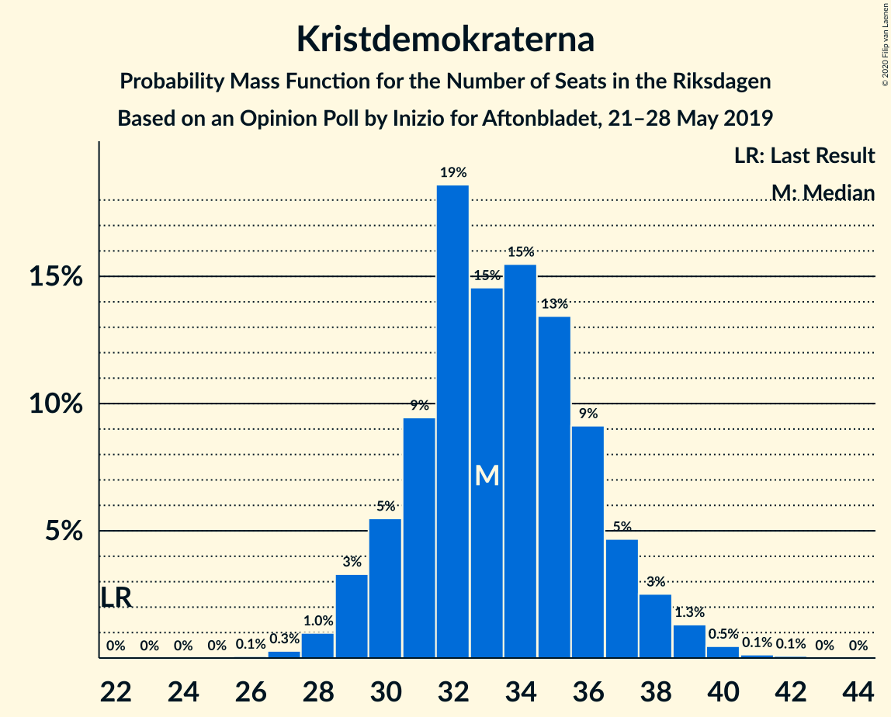
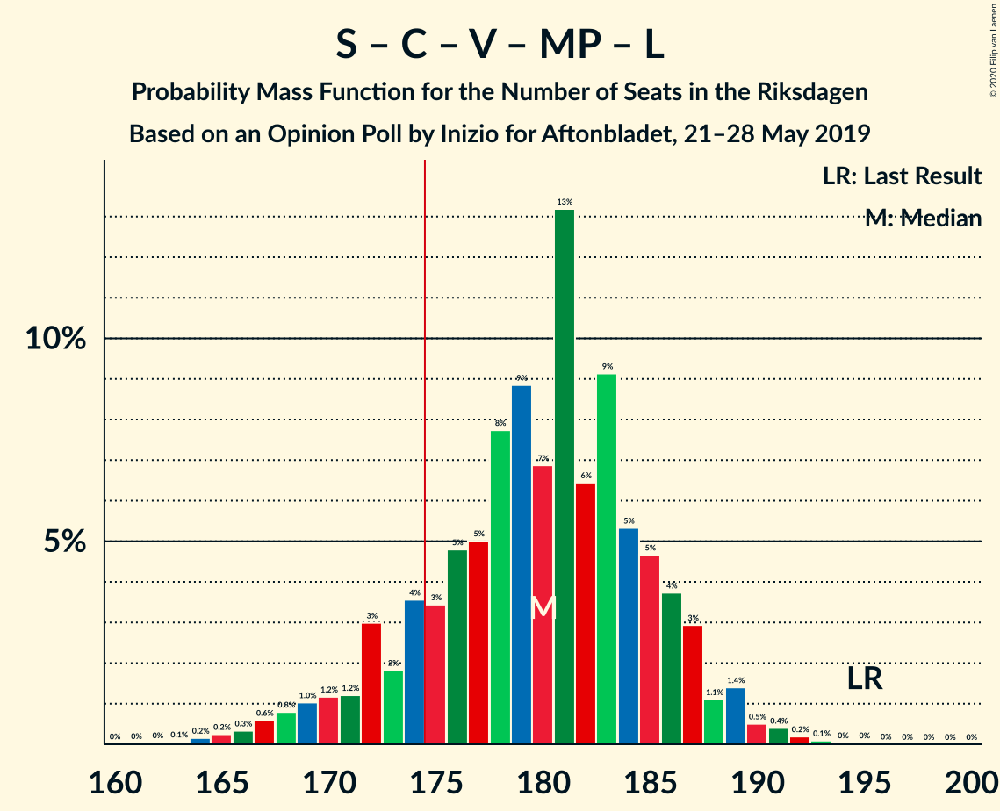
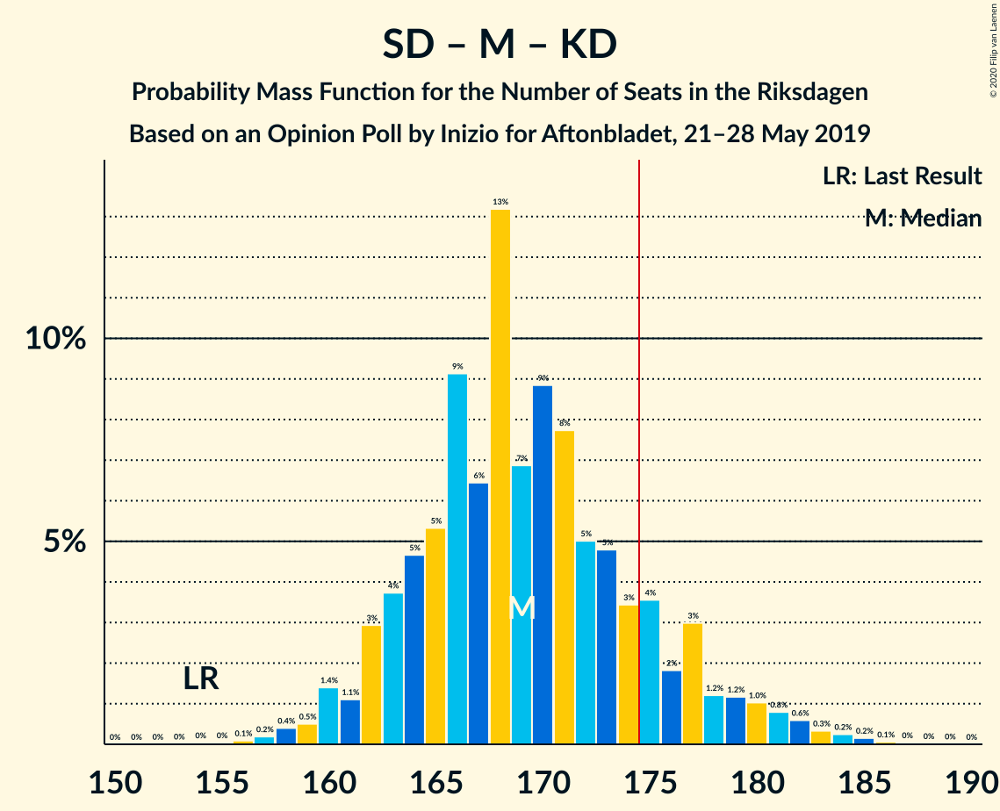

# Opinion Poll by Inizio for Aftonbladet, 21–28 May 2019

<a href="#voting-intentions">Voting Intentions</a> | <a href="#seats">Seats</a> | <a href="#coalitions">Coalitions</a> | <a href="#technical-information">Technical Information</a>

## Voting Intentions

### Confidence Intervals

| Party | Last Result | Poll Result | 80% Confidence Interval | 90% Confidence Interval | 95% Confidence Interval | 99% Confidence Interval |
|:-----:|:-----------:|:-----------:|:-----------------------:|:-----------------------:|:-----------------------:|:-----------------------:|
| Sveriges socialdemokratiska arbetareparti | 28.3% | 26.1% | 24.9–27.4% |24.6–27.7% |24.3–28.0% |23.7–28.6% |
| Sverigedemokraterna | 17.5% | 18.4% | 17.4–19.5% |17.1–19.8% |16.8–20.1% |16.3–20.6% |
| Moderata samlingspartiet | 19.8% | 18.2% | 17.2–19.3% |16.9–19.6% |16.6–19.9% |16.1–20.5% |
| Centerpartiet | 8.6% | 10.1% | 9.3–11.0% |9.1–11.2% |8.9–11.5% |8.5–11.9% |
| Kristdemokraterna | 6.3% | 9.0% | 8.2–9.8% |8.0–10.1% |7.8–10.3% |7.5–10.7% |
| Vänsterpartiet | 8.0% | 8.3% | 7.6–9.1% |7.4–9.3% |7.2–9.5% |6.9–9.9% |
| Miljöpartiet de gröna | 4.4% | 4.4% | 3.9–5.1% |3.7–5.2% |3.6–5.4% |3.4–5.7% |
| Liberalerna | 5.5% | 3.0% | 2.6–3.5% |2.4–3.7% |2.3–3.8% |2.1–4.1% |

*Note:* The poll result column reflects the actual value used in the calculations. Published results may vary slightly, and in addition be rounded to fewer digits.

## Seats

### Confidence Intervals

| Party | Last Result | Median | 80% Confidence Interval | 90% Confidence Interval | 95% Confidence Interval | 99% Confidence Interval |
|:-----:|:-----------:|:------:|:-----------------------:|:-----------------------:|:-----------------------:|:-----------------------:|
| <a href="#sveriges-socialdemokratiska-arbetareparti">Sveriges socialdemokratiska arbetareparti</a> | 100 | 98 | 92–102 |91–104 |89–105 |88–107 |
| <a href="#sverigedemokraterna">Sverigedemokraterna</a> | 62 | 68 | 64–73 |61–75 |61–77 |60–77 |
| <a href="#moderata-samlingspartiet">Moderata samlingspartiet</a> | 70 | 69 | 63–72 |63–74 |61–74 |59–76 |
| <a href="#centerpartiet">Centerpartiet</a> | 31 | 37 | 34–41 |34–42 |33–43 |31–44 |
| <a href="#kristdemokraterna">Kristdemokraterna</a> | 22 | 33 | 31–37 |30–38 |29–38 |27–40 |
| <a href="#vänsterpartiet">Vänsterpartiet</a> | 28 | 31 | 28–34 |27–35 |26–36 |25–37 |
| <a href="#miljöpartiet-de-gröna">Miljöpartiet de gröna</a> | 16 | 16 | 0–18 |0–19 |0–19 |0–21 |
| <a href="#liberalerna">Liberalerna</a> | 20 | 0 | 0 |0 |0 |0–14 |

### Sveriges socialdemokratiska arbetareparti

*For a full overview of the results for this party, see the [Sveriges socialdemokratiska arbetareparti](party-sverigessocialdemokratiskaarbetareparti.html) page.*

| Number of Seats | Probability | Accumulated | Special Marks |
|:---------------:|:-----------:|:-----------:|:-------------:|
| 85 | 0% | 100% |  |
| 86 | 0.1% | 99.9% |  |
| 87 | 0.2% | 99.8% |  |
| 88 | 0.9% | 99.6% |  |
| 89 | 2% | 98.7% |  |
| 90 | 2% | 97% |  |
| 91 | 4% | 95% |  |
| 92 | 2% | 91% |  |
| 93 | 3% | 90% |  |
| 94 | 10% | 87% |  |
| 95 | 9% | 77% |  |
| 96 | 7% | 68% |  |
| 97 | 11% | 61% |  |
| 98 | 7% | 50% | Median |
| 99 | 18% | 43% |  |
| 100 | 9% | 26% | Last Result |
| 101 | 6% | 16% |  |
| 102 | 3% | 11% |  |
| 103 | 0.5% | 7% |  |
| 104 | 4% | 7% |  |
| 105 | 0.6% | 3% |  |
| 106 | 0.9% | 2% |  |
| 107 | 1.1% | 1.5% |  |
| 108 | 0.2% | 0.4% |  |
| 109 | 0.1% | 0.2% |  |
| 110 | 0.1% | 0.1% |  |
| 111 | 0% | 0.1% |  |
| 112 | 0% | 0% |  |

### Sverigedemokraterna

*For a full overview of the results for this party, see the [Sverigedemokraterna](party-sverigedemokraterna.html) page.*

| Number of Seats | Probability | Accumulated | Special Marks |
|:---------------:|:-----------:|:-----------:|:-------------:|
| 58 | 0.1% | 100% |  |
| 59 | 0.1% | 99.9% |  |
| 60 | 1.4% | 99.8% |  |
| 61 | 4% | 98% |  |
| 62 | 0.6% | 94% | Last Result |
| 63 | 1.5% | 94% |  |
| 64 | 12% | 92% |  |
| 65 | 12% | 80% |  |
| 66 | 2% | 67% |  |
| 67 | 4% | 65% |  |
| 68 | 17% | 61% | Median |
| 69 | 12% | 44% |  |
| 70 | 4% | 31% |  |
| 71 | 6% | 28% |  |
| 72 | 10% | 22% |  |
| 73 | 2% | 12% |  |
| 74 | 4% | 10% |  |
| 75 | 2% | 6% |  |
| 76 | 0.6% | 3% |  |
| 77 | 2% | 3% |  |
| 78 | 0.1% | 0.3% |  |
| 79 | 0% | 0.2% |  |
| 80 | 0.1% | 0.2% |  |
| 81 | 0% | 0% |  |

### Moderata samlingspartiet

*For a full overview of the results for this party, see the [Moderata samlingspartiet](party-moderatasamlingspartiet.html) page.*

| Number of Seats | Probability | Accumulated | Special Marks |
|:---------------:|:-----------:|:-----------:|:-------------:|
| 58 | 0% | 100% |  |
| 59 | 0.5% | 99.9% |  |
| 60 | 1.1% | 99.4% |  |
| 61 | 1.0% | 98% |  |
| 62 | 0.9% | 97% |  |
| 63 | 7% | 96% |  |
| 64 | 6% | 90% |  |
| 65 | 2% | 84% |  |
| 66 | 9% | 82% |  |
| 67 | 10% | 72% |  |
| 68 | 6% | 62% |  |
| 69 | 12% | 56% | Median |
| 70 | 24% | 44% | Last Result |
| 71 | 9% | 20% |  |
| 72 | 2% | 11% |  |
| 73 | 4% | 9% |  |
| 74 | 4% | 5% |  |
| 75 | 0.5% | 2% |  |
| 76 | 0.8% | 1.2% |  |
| 77 | 0.2% | 0.3% |  |
| 78 | 0% | 0.1% |  |
| 79 | 0% | 0% |  |

### Centerpartiet

*For a full overview of the results for this party, see the [Centerpartiet](party-centerpartiet.html) page.*

| Number of Seats | Probability | Accumulated | Special Marks |
|:---------------:|:-----------:|:-----------:|:-------------:|
| 31 | 0.9% | 100% | Last Result |
| 32 | 0.6% | 99.1% |  |
| 33 | 3% | 98.5% |  |
| 34 | 15% | 96% |  |
| 35 | 9% | 81% |  |
| 36 | 15% | 72% |  |
| 37 | 19% | 57% | Median |
| 38 | 11% | 38% |  |
| 39 | 6% | 27% |  |
| 40 | 8% | 21% |  |
| 41 | 9% | 14% |  |
| 42 | 2% | 5% |  |
| 43 | 2% | 3% |  |
| 44 | 0.8% | 1.2% |  |
| 45 | 0.3% | 0.4% |  |
| 46 | 0.1% | 0.1% |  |
| 47 | 0% | 0% |  |

### Kristdemokraterna

*For a full overview of the results for this party, see the [Kristdemokraterna](party-kristdemokraterna.html) page.*

| Number of Seats | Probability | Accumulated | Special Marks |
|:---------------:|:-----------:|:-----------:|:-------------:|
| 22 | 0% | 100% | Last Result |
| 23 | 0% | 100% |  |
| 24 | 0% | 100% |  |
| 25 | 0% | 100% |  |
| 26 | 0% | 100% |  |
| 27 | 0.4% | 99.9% |  |
| 28 | 1.3% | 99.5% |  |
| 29 | 2% | 98% |  |
| 30 | 5% | 96% |  |
| 31 | 9% | 91% |  |
| 32 | 23% | 82% |  |
| 33 | 11% | 59% | Median |
| 34 | 17% | 48% |  |
| 35 | 16% | 31% |  |
| 36 | 4% | 14% |  |
| 37 | 2% | 10% |  |
| 38 | 7% | 9% |  |
| 39 | 1.2% | 2% |  |
| 40 | 0.6% | 0.8% |  |
| 41 | 0.1% | 0.2% |  |
| 42 | 0.1% | 0.1% |  |
| 43 | 0% | 0% |  |

### Vänsterpartiet

*For a full overview of the results for this party, see the [Vänsterpartiet](party-vänsterpartiet.html) page.*

| Number of Seats | Probability | Accumulated | Special Marks |
|:---------------:|:-----------:|:-----------:|:-------------:|
| 24 | 0.2% | 100% |  |
| 25 | 2% | 99.8% |  |
| 26 | 1.4% | 98% |  |
| 27 | 4% | 97% |  |
| 28 | 17% | 92% | Last Result |
| 29 | 7% | 75% |  |
| 30 | 11% | 68% |  |
| 31 | 21% | 56% | Median |
| 32 | 13% | 35% |  |
| 33 | 11% | 22% |  |
| 34 | 5% | 11% |  |
| 35 | 3% | 6% |  |
| 36 | 1.2% | 3% |  |
| 37 | 1.4% | 2% |  |
| 38 | 0.1% | 0.2% |  |
| 39 | 0% | 0.1% |  |
| 40 | 0.1% | 0.1% |  |
| 41 | 0% | 0% |  |

### Miljöpartiet de gröna

*For a full overview of the results for this party, see the [Miljöpartiet de gröna](party-miljöpartietdegröna.html) page.*

| Number of Seats | Probability | Accumulated | Special Marks |
|:---------------:|:-----------:|:-----------:|:-------------:|
| 0 | 16% | 100% |  |
| 1 | 0% | 84% |  |
| 2 | 0% | 84% |  |
| 3 | 0% | 84% |  |
| 4 | 0% | 84% |  |
| 5 | 0% | 84% |  |
| 6 | 0% | 84% |  |
| 7 | 0% | 84% |  |
| 8 | 0% | 84% |  |
| 9 | 0% | 84% |  |
| 10 | 0% | 84% |  |
| 11 | 0% | 84% |  |
| 12 | 0% | 84% |  |
| 13 | 0% | 84% |  |
| 14 | 0% | 84% |  |
| 15 | 23% | 84% |  |
| 16 | 25% | 61% | Last Result, Median |
| 17 | 13% | 36% |  |
| 18 | 14% | 23% |  |
| 19 | 7% | 10% |  |
| 20 | 2% | 2% |  |
| 21 | 0.5% | 0.9% |  |
| 22 | 0.3% | 0.4% |  |
| 23 | 0% | 0% |  |

### Liberalerna

*For a full overview of the results for this party, see the [Liberalerna](party-liberalerna.html) page.*

| Number of Seats | Probability | Accumulated | Special Marks |
|:---------------:|:-----------:|:-----------:|:-------------:|
| 0 | 99.2% | 100% | Median |
| 1 | 0% | 0.8% |  |
| 2 | 0% | 0.8% |  |
| 3 | 0% | 0.8% |  |
| 4 | 0% | 0.8% |  |
| 5 | 0% | 0.8% |  |
| 6 | 0% | 0.8% |  |
| 7 | 0% | 0.8% |  |
| 8 | 0% | 0.8% |  |
| 9 | 0% | 0.8% |  |
| 10 | 0% | 0.8% |  |
| 11 | 0% | 0.8% |  |
| 12 | 0% | 0.8% |  |
| 13 | 0% | 0.8% |  |
| 14 | 0.4% | 0.8% |  |
| 15 | 0.2% | 0.3% |  |
| 16 | 0.1% | 0.1% |  |
| 17 | 0% | 0% |  |
| 18 | 0% | 0% |  |
| 19 | 0% | 0% |  |
| 20 | 0% | 0% | Last Result |

## Coalitions

### Confidence Intervals

| Coalition | Last Result | Median | Majority? | 80% Confidence Interval | 90% Confidence Interval | 95% Confidence Interval | 99% Confidence Interval |
|:---------:|:-----------:|:------:|:---------:|:-----------------------:|:-----------------------:|:-----------------------:|:-----------------------:|
| Sveriges socialdemokratiska arbetareparti – Moderata samlingspartiet – Centerpartiet | 201 | 203 | 100% | 196–208 | 195–212 | 194–213 | 191–217 |
| Sveriges socialdemokratiska arbetareparti – Centerpartiet – Vänsterpartiet – Miljöpartiet de gröna – Liberalerna | 195 | 180 | 80% | 171–185 | 170–186 | 168–189 | 166–192 |
| Sverigedemokraterna – Moderata samlingspartiet – Kristdemokraterna | 154 | 169 | 20% | 164–178 | 163–179 | 160–181 | 157–183 |
| Sveriges socialdemokratiska arbetareparti – Moderata samlingspartiet | 170 | 167 | 2% | 160–170 | 157–173 | 155–174 | 154–179 |
| Sveriges socialdemokratiska arbetareparti – Centerpartiet – Miljöpartiet de gröna – Liberalerna | 167 | 150 | 0% | 140–155 | 137–157 | 135–157 | 133–163 |
| Moderata samlingspartiet – Centerpartiet – Kristdemokraterna – Liberalerna | 143 | 139 | 0% | 133–145 | 132–148 | 130–149 | 128–154 |
| Sveriges socialdemokratiska arbetareparti – Vänsterpartiet – Miljöpartiet de gröna | 144 | 142 | 0% | 133–147 | 132–149 | 127–149 | 127–154 |
| Moderata samlingspartiet – Centerpartiet – Kristdemokraterna | 123 | 139 | 0% | 133–145 | 132–147 | 130–148 | 128–154 |
| Sverigedemokraterna – Moderata samlingspartiet | 132 | 137 | 0% | 131–141 | 129–144 | 128–148 | 126–149 |
| Sveriges socialdemokratiska arbetareparti – Vänsterpartiet | 128 | 127 | 0% | 122–132 | 120–134 | 120–136 | 117–140 |
| Sveriges socialdemokratiska arbetareparti – Miljöpartiet de gröna | 116 | 113 | 0% | 101–117 | 98–119 | 96–119 | 94–123 |
| Moderata samlingspartiet – Centerpartiet – Liberalerna | 121 | 106 | 0% | 100–111 | 98–113 | 98–114 | 95–119 |
| Moderata samlingspartiet – Centerpartiet | 101 | 106 | 0% | 100–111 | 98–112 | 98–114 | 95–118 |

### Sveriges socialdemokratiska arbetareparti – Moderata samlingspartiet – Centerpartiet

| Number of Seats | Probability | Accumulated | Special Marks |
|:---------------:|:-----------:|:-----------:|:-------------:|
| 187 | 0% | 100% |  |
| 188 | 0.1% | 99.9% |  |
| 189 | 0% | 99.9% |  |
| 190 | 0.3% | 99.8% |  |
| 191 | 0.3% | 99.6% |  |
| 192 | 0.2% | 99.3% |  |
| 193 | 0.8% | 99.1% |  |
| 194 | 0.9% | 98% |  |
| 195 | 5% | 97% |  |
| 196 | 5% | 93% |  |
| 197 | 6% | 88% |  |
| 198 | 7% | 82% |  |
| 199 | 6% | 74% |  |
| 200 | 3% | 69% |  |
| 201 | 7% | 66% | Last Result |
| 202 | 5% | 59% |  |
| 203 | 9% | 54% |  |
| 204 | 2% | 46% | Median |
| 205 | 7% | 44% |  |
| 206 | 17% | 37% |  |
| 207 | 2% | 20% |  |
| 208 | 8% | 17% |  |
| 209 | 2% | 9% |  |
| 210 | 0.9% | 7% |  |
| 211 | 0.7% | 6% |  |
| 212 | 2% | 5% |  |
| 213 | 2% | 3% |  |
| 214 | 0.4% | 1.4% |  |
| 215 | 0.2% | 1.1% |  |
| 216 | 0.2% | 0.8% |  |
| 217 | 0.2% | 0.6% |  |
| 218 | 0.1% | 0.4% |  |
| 219 | 0.1% | 0.3% |  |
| 220 | 0.1% | 0.2% |  |
| 221 | 0.1% | 0.2% |  |
| 222 | 0% | 0% |  |

### Sveriges socialdemokratiska arbetareparti – Centerpartiet – Vänsterpartiet – Miljöpartiet de gröna – Liberalerna

| Number of Seats | Probability | Accumulated | Special Marks |
|:---------------:|:-----------:|:-----------:|:-------------:|
| 161 | 0.1% | 100% |  |
| 162 | 0.1% | 99.9% |  |
| 163 | 0% | 99.9% |  |
| 164 | 0% | 99.9% |  |
| 165 | 0.2% | 99.8% |  |
| 166 | 2% | 99.7% |  |
| 167 | 0.2% | 98% |  |
| 168 | 1.3% | 98% |  |
| 169 | 0.4% | 97% |  |
| 170 | 5% | 96% |  |
| 171 | 3% | 91% |  |
| 172 | 1.0% | 88% |  |
| 173 | 1.1% | 87% |  |
| 174 | 6% | 86% |  |
| 175 | 4% | 80% | Majority |
| 176 | 0.9% | 76% |  |
| 177 | 4% | 76% |  |
| 178 | 3% | 72% |  |
| 179 | 19% | 69% |  |
| 180 | 3% | 50% |  |
| 181 | 13% | 48% |  |
| 182 | 13% | 35% | Median |
| 183 | 6% | 22% |  |
| 184 | 5% | 16% |  |
| 185 | 3% | 11% |  |
| 186 | 4% | 8% |  |
| 187 | 1.1% | 5% |  |
| 188 | 0.5% | 4% |  |
| 189 | 1.4% | 3% |  |
| 190 | 0.6% | 2% |  |
| 191 | 0.3% | 1.0% |  |
| 192 | 0.4% | 0.7% |  |
| 193 | 0.1% | 0.3% |  |
| 194 | 0.1% | 0.2% |  |
| 195 | 0.1% | 0.1% | Last Result |
| 196 | 0% | 0% |  |

### Sverigedemokraterna – Moderata samlingspartiet – Kristdemokraterna

| Number of Seats | Probability | Accumulated | Special Marks |
|:---------------:|:-----------:|:-----------:|:-------------:|
| 154 | 0.1% | 100% | Last Result |
| 155 | 0.1% | 99.9% |  |
| 156 | 0.1% | 99.8% |  |
| 157 | 0.4% | 99.7% |  |
| 158 | 0.3% | 99.3% |  |
| 159 | 0.6% | 99.0% |  |
| 160 | 1.4% | 98% |  |
| 161 | 0.5% | 97% |  |
| 162 | 1.1% | 96% |  |
| 163 | 4% | 95% |  |
| 164 | 3% | 91% |  |
| 165 | 5% | 89% |  |
| 166 | 6% | 84% |  |
| 167 | 13% | 78% |  |
| 168 | 13% | 65% |  |
| 169 | 3% | 52% |  |
| 170 | 19% | 50% | Median |
| 171 | 3% | 31% |  |
| 172 | 4% | 28% |  |
| 173 | 0.9% | 24% |  |
| 174 | 4% | 24% |  |
| 175 | 6% | 20% | Majority |
| 176 | 1.1% | 14% |  |
| 177 | 1.0% | 13% |  |
| 178 | 3% | 12% |  |
| 179 | 5% | 9% |  |
| 180 | 0.4% | 4% |  |
| 181 | 1.3% | 3% |  |
| 182 | 0.2% | 2% |  |
| 183 | 2% | 2% |  |
| 184 | 0.2% | 0.3% |  |
| 185 | 0% | 0.2% |  |
| 186 | 0% | 0.1% |  |
| 187 | 0.1% | 0.1% |  |
| 188 | 0.1% | 0.1% |  |
| 189 | 0% | 0% |  |

### Sveriges socialdemokratiska arbetareparti – Moderata samlingspartiet

| Number of Seats | Probability | Accumulated | Special Marks |
|:---------------:|:-----------:|:-----------:|:-------------:|
| 150 | 0.1% | 100% |  |
| 151 | 0.2% | 99.9% |  |
| 152 | 0% | 99.7% |  |
| 153 | 0.2% | 99.7% |  |
| 154 | 0.1% | 99.5% |  |
| 155 | 3% | 99.4% |  |
| 156 | 1.0% | 96% |  |
| 157 | 0.4% | 95% |  |
| 158 | 1.2% | 95% |  |
| 159 | 3% | 94% |  |
| 160 | 3% | 91% |  |
| 161 | 8% | 88% |  |
| 162 | 12% | 80% |  |
| 163 | 3% | 68% |  |
| 164 | 7% | 64% |  |
| 165 | 4% | 57% |  |
| 166 | 2% | 53% |  |
| 167 | 4% | 51% | Median |
| 168 | 11% | 47% |  |
| 169 | 19% | 37% |  |
| 170 | 8% | 17% | Last Result |
| 171 | 2% | 9% |  |
| 172 | 1.3% | 8% |  |
| 173 | 4% | 6% |  |
| 174 | 0.3% | 3% |  |
| 175 | 1.2% | 2% | Majority |
| 176 | 0.3% | 1.0% |  |
| 177 | 0% | 0.7% |  |
| 178 | 0.1% | 0.6% |  |
| 179 | 0.1% | 0.5% |  |
| 180 | 0.3% | 0.4% |  |
| 181 | 0% | 0.1% |  |
| 182 | 0.1% | 0.1% |  |
| 183 | 0% | 0% |  |

### Sveriges socialdemokratiska arbetareparti – Centerpartiet – Miljöpartiet de gröna – Liberalerna

| Number of Seats | Probability | Accumulated | Special Marks |
|:---------------:|:-----------:|:-----------:|:-------------:|
| 130 | 0.2% | 100% |  |
| 131 | 0% | 99.8% |  |
| 132 | 0.1% | 99.8% |  |
| 133 | 1.1% | 99.7% |  |
| 134 | 0.8% | 98.6% |  |
| 135 | 2% | 98% |  |
| 136 | 0.8% | 96% |  |
| 137 | 2% | 95% |  |
| 138 | 0.5% | 94% |  |
| 139 | 3% | 93% |  |
| 140 | 0.6% | 90% |  |
| 141 | 3% | 90% |  |
| 142 | 1.3% | 87% |  |
| 143 | 2% | 85% |  |
| 144 | 2% | 83% |  |
| 145 | 5% | 81% |  |
| 146 | 3% | 76% |  |
| 147 | 7% | 72% |  |
| 148 | 2% | 66% |  |
| 149 | 3% | 64% |  |
| 150 | 15% | 60% |  |
| 151 | 22% | 46% | Median |
| 152 | 9% | 23% |  |
| 153 | 2% | 14% |  |
| 154 | 2% | 12% |  |
| 155 | 3% | 11% |  |
| 156 | 2% | 7% |  |
| 157 | 3% | 5% |  |
| 158 | 0.8% | 2% |  |
| 159 | 0.5% | 2% |  |
| 160 | 0.3% | 1.1% |  |
| 161 | 0.2% | 0.8% |  |
| 162 | 0% | 0.6% |  |
| 163 | 0.3% | 0.6% |  |
| 164 | 0.1% | 0.3% |  |
| 165 | 0.2% | 0.2% |  |
| 166 | 0% | 0% |  |
| 167 | 0% | 0% | Last Result |

### Moderata samlingspartiet – Centerpartiet – Kristdemokraterna – Liberalerna

| Number of Seats | Probability | Accumulated | Special Marks |
|:---------------:|:-----------:|:-----------:|:-------------:|
| 126 | 0.2% | 100% |  |
| 127 | 0% | 99.7% |  |
| 128 | 1.2% | 99.7% |  |
| 129 | 0.4% | 98.6% |  |
| 130 | 1.4% | 98% |  |
| 131 | 1.2% | 97% |  |
| 132 | 3% | 96% |  |
| 133 | 6% | 93% |  |
| 134 | 6% | 87% |  |
| 135 | 4% | 81% |  |
| 136 | 4% | 76% |  |
| 137 | 11% | 72% |  |
| 138 | 6% | 62% |  |
| 139 | 18% | 56% | Median |
| 140 | 6% | 38% |  |
| 141 | 5% | 32% |  |
| 142 | 3% | 26% |  |
| 143 | 5% | 23% | Last Result |
| 144 | 3% | 17% |  |
| 145 | 6% | 14% |  |
| 146 | 2% | 9% |  |
| 147 | 2% | 7% |  |
| 148 | 3% | 5% |  |
| 149 | 0.7% | 3% |  |
| 150 | 0.6% | 2% |  |
| 151 | 0.1% | 1.3% |  |
| 152 | 0% | 1.2% |  |
| 153 | 0.6% | 1.1% |  |
| 154 | 0.5% | 0.6% |  |
| 155 | 0% | 0.1% |  |
| 156 | 0% | 0.1% |  |
| 157 | 0% | 0% |  |

### Sveriges socialdemokratiska arbetareparti – Vänsterpartiet – Miljöpartiet de gröna

| Number of Seats | Probability | Accumulated | Special Marks |
|:---------------:|:-----------:|:-----------:|:-------------:|
| 124 | 0.1% | 100% |  |
| 125 | 0% | 99.9% |  |
| 126 | 0.1% | 99.9% |  |
| 127 | 2% | 99.8% |  |
| 128 | 0.2% | 97% |  |
| 129 | 0.5% | 97% |  |
| 130 | 0.3% | 97% |  |
| 131 | 0.1% | 96% |  |
| 132 | 6% | 96% |  |
| 133 | 1.2% | 90% |  |
| 134 | 2% | 89% |  |
| 135 | 2% | 87% |  |
| 136 | 1.2% | 85% |  |
| 137 | 0.6% | 84% |  |
| 138 | 3% | 83% |  |
| 139 | 3% | 81% |  |
| 140 | 8% | 77% |  |
| 141 | 4% | 69% |  |
| 142 | 18% | 65% |  |
| 143 | 8% | 46% |  |
| 144 | 2% | 38% | Last Result |
| 145 | 5% | 36% | Median |
| 146 | 5% | 32% |  |
| 147 | 18% | 27% |  |
| 148 | 3% | 9% |  |
| 149 | 3% | 6% |  |
| 150 | 0.6% | 2% |  |
| 151 | 0.4% | 2% |  |
| 152 | 0.3% | 1.4% |  |
| 153 | 0.5% | 1.1% |  |
| 154 | 0.4% | 0.6% |  |
| 155 | 0.1% | 0.1% |  |
| 156 | 0.1% | 0.1% |  |
| 157 | 0% | 0% |  |

### Moderata samlingspartiet – Centerpartiet – Kristdemokraterna

| Number of Seats | Probability | Accumulated | Special Marks |
|:---------------:|:-----------:|:-----------:|:-------------:|
| 123 | 0% | 100% | Last Result |
| 124 | 0% | 100% |  |
| 125 | 0% | 100% |  |
| 126 | 0.2% | 100% |  |
| 127 | 0% | 99.7% |  |
| 128 | 1.2% | 99.7% |  |
| 129 | 0.4% | 98.5% |  |
| 130 | 1.5% | 98% |  |
| 131 | 1.4% | 97% |  |
| 132 | 3% | 95% |  |
| 133 | 6% | 92% |  |
| 134 | 6% | 86% |  |
| 135 | 4% | 80% |  |
| 136 | 4% | 76% |  |
| 137 | 11% | 72% |  |
| 138 | 6% | 61% |  |
| 139 | 18% | 55% | Median |
| 140 | 6% | 37% |  |
| 141 | 5% | 31% |  |
| 142 | 3% | 26% |  |
| 143 | 5% | 22% |  |
| 144 | 3% | 17% |  |
| 145 | 5% | 14% |  |
| 146 | 2% | 8% |  |
| 147 | 2% | 6% |  |
| 148 | 2% | 5% |  |
| 149 | 0.7% | 2% |  |
| 150 | 0.5% | 2% |  |
| 151 | 0.1% | 1.2% |  |
| 152 | 0% | 1.1% |  |
| 153 | 0.5% | 1.0% |  |
| 154 | 0.5% | 0.5% |  |
| 155 | 0% | 0% |  |

### Sverigedemokraterna – Moderata samlingspartiet

| Number of Seats | Probability | Accumulated | Special Marks |
|:---------------:|:-----------:|:-----------:|:-------------:|
| 123 | 0.1% | 100% |  |
| 124 | 0.2% | 99.9% |  |
| 125 | 0.2% | 99.7% |  |
| 126 | 1.0% | 99.5% |  |
| 127 | 0.6% | 98% |  |
| 128 | 1.3% | 98% |  |
| 129 | 2% | 97% |  |
| 130 | 2% | 95% |  |
| 131 | 8% | 92% |  |
| 132 | 8% | 85% | Last Result |
| 133 | 2% | 76% |  |
| 134 | 9% | 74% |  |
| 135 | 11% | 65% |  |
| 136 | 3% | 53% |  |
| 137 | 4% | 50% | Median |
| 138 | 18% | 47% |  |
| 139 | 7% | 29% |  |
| 140 | 4% | 22% |  |
| 141 | 8% | 18% |  |
| 142 | 1.0% | 10% |  |
| 143 | 3% | 9% |  |
| 144 | 1.1% | 6% |  |
| 145 | 0.7% | 5% |  |
| 146 | 0.9% | 4% |  |
| 147 | 0.2% | 3% |  |
| 148 | 1.0% | 3% |  |
| 149 | 2% | 2% |  |
| 150 | 0.1% | 0.3% |  |
| 151 | 0.2% | 0.2% |  |
| 152 | 0% | 0% |  |

### Sveriges socialdemokratiska arbetareparti – Vänsterpartiet

| Number of Seats | Probability | Accumulated | Special Marks |
|:---------------:|:-----------:|:-----------:|:-------------:|
| 114 | 0% | 100% |  |
| 115 | 0.1% | 99.9% |  |
| 116 | 0.4% | 99.9% |  |
| 117 | 0.2% | 99.5% |  |
| 118 | 0.3% | 99.3% |  |
| 119 | 0.5% | 99.0% |  |
| 120 | 4% | 98% |  |
| 121 | 1.3% | 94% |  |
| 122 | 4% | 93% |  |
| 123 | 5% | 89% |  |
| 124 | 5% | 84% |  |
| 125 | 3% | 80% |  |
| 126 | 4% | 76% |  |
| 127 | 27% | 72% |  |
| 128 | 5% | 45% | Last Result |
| 129 | 2% | 40% | Median |
| 130 | 2% | 38% |  |
| 131 | 15% | 36% |  |
| 132 | 11% | 21% |  |
| 133 | 2% | 10% |  |
| 134 | 3% | 8% |  |
| 135 | 2% | 5% |  |
| 136 | 1.3% | 3% |  |
| 137 | 0.2% | 2% |  |
| 138 | 0.3% | 2% |  |
| 139 | 0.3% | 1.3% |  |
| 140 | 0.8% | 1.0% |  |
| 141 | 0% | 0.2% |  |
| 142 | 0% | 0.2% |  |
| 143 | 0.1% | 0.1% |  |
| 144 | 0% | 0% |  |

### Sveriges socialdemokratiska arbetareparti – Miljöpartiet de gröna

| Number of Seats | Probability | Accumulated | Special Marks |
|:---------------:|:-----------:|:-----------:|:-------------:|
| 92 | 0% | 100% |  |
| 93 | 0.2% | 99.9% |  |
| 94 | 0.5% | 99.7% |  |
| 95 | 0.5% | 99.2% |  |
| 96 | 2% | 98.7% |  |
| 97 | 1.4% | 97% |  |
| 98 | 0.5% | 95% |  |
| 99 | 0.5% | 95% |  |
| 100 | 1.4% | 94% |  |
| 101 | 3% | 93% |  |
| 102 | 2% | 89% |  |
| 103 | 0.4% | 87% |  |
| 104 | 1.4% | 87% |  |
| 105 | 0.5% | 85% |  |
| 106 | 1.2% | 85% |  |
| 107 | 2% | 84% |  |
| 108 | 3% | 82% |  |
| 109 | 6% | 78% |  |
| 110 | 2% | 73% |  |
| 111 | 12% | 70% |  |
| 112 | 5% | 59% |  |
| 113 | 5% | 53% |  |
| 114 | 18% | 48% | Median |
| 115 | 9% | 30% |  |
| 116 | 10% | 21% | Last Result |
| 117 | 3% | 11% |  |
| 118 | 2% | 8% |  |
| 119 | 4% | 6% |  |
| 120 | 0.5% | 2% |  |
| 121 | 0.5% | 2% |  |
| 122 | 0.5% | 1.0% |  |
| 123 | 0.4% | 0.5% |  |
| 124 | 0% | 0.1% |  |
| 125 | 0% | 0.1% |  |
| 126 | 0% | 0% |  |

### Moderata samlingspartiet – Centerpartiet – Liberalerna

| Number of Seats | Probability | Accumulated | Special Marks |
|:---------------:|:-----------:|:-----------:|:-------------:|
| 93 | 0% | 100% |  |
| 94 | 0.4% | 99.9% |  |
| 95 | 0.1% | 99.6% |  |
| 96 | 0.2% | 99.4% |  |
| 97 | 0.6% | 99.2% |  |
| 98 | 6% | 98.7% |  |
| 99 | 2% | 93% |  |
| 100 | 3% | 91% |  |
| 101 | 6% | 88% |  |
| 102 | 6% | 82% |  |
| 103 | 11% | 76% |  |
| 104 | 7% | 65% |  |
| 105 | 6% | 58% |  |
| 106 | 5% | 52% | Median |
| 107 | 20% | 47% |  |
| 108 | 5% | 26% |  |
| 109 | 2% | 22% |  |
| 110 | 4% | 19% |  |
| 111 | 8% | 15% |  |
| 112 | 2% | 8% |  |
| 113 | 2% | 6% |  |
| 114 | 1.3% | 3% |  |
| 115 | 0.7% | 2% |  |
| 116 | 0.4% | 1.4% |  |
| 117 | 0.2% | 1.1% |  |
| 118 | 0.2% | 0.8% |  |
| 119 | 0.5% | 0.6% |  |
| 120 | 0.1% | 0.1% |  |
| 121 | 0% | 0.1% | Last Result |
| 122 | 0% | 0.1% |  |
| 123 | 0% | 0% |  |

### Moderata samlingspartiet – Centerpartiet

| Number of Seats | Probability | Accumulated | Special Marks |
|:---------------:|:-----------:|:-----------:|:-------------:|
| 93 | 0% | 100% |  |
| 94 | 0.4% | 99.9% |  |
| 95 | 0.2% | 99.5% |  |
| 96 | 0.2% | 99.4% |  |
| 97 | 0.6% | 99.2% |  |
| 98 | 6% | 98.6% |  |
| 99 | 2% | 93% |  |
| 100 | 3% | 91% |  |
| 101 | 6% | 88% | Last Result |
| 102 | 6% | 82% |  |
| 103 | 11% | 76% |  |
| 104 | 7% | 64% |  |
| 105 | 6% | 57% |  |
| 106 | 5% | 51% | Median |
| 107 | 20% | 46% |  |
| 108 | 5% | 26% |  |
| 109 | 2% | 21% |  |
| 110 | 4% | 18% |  |
| 111 | 8% | 15% |  |
| 112 | 2% | 7% |  |
| 113 | 2% | 5% |  |
| 114 | 1.2% | 3% |  |
| 115 | 0.6% | 2% |  |
| 116 | 0.2% | 1.0% |  |
| 117 | 0.2% | 0.8% |  |
| 118 | 0.1% | 0.6% |  |
| 119 | 0.4% | 0.5% |  |
| 120 | 0% | 0% |  |

## Technical Information

### Opinion Poll

+ **Polling firm:** Inizio
+ **Commissioner(s):** Aftonbladet
+ **Fieldwork period:** 21–28 May 2019

### Calculations

+ **Sample size:** 2147
+ **Simulations done:** 131,072
+ **Error estimate:** 2.00%

