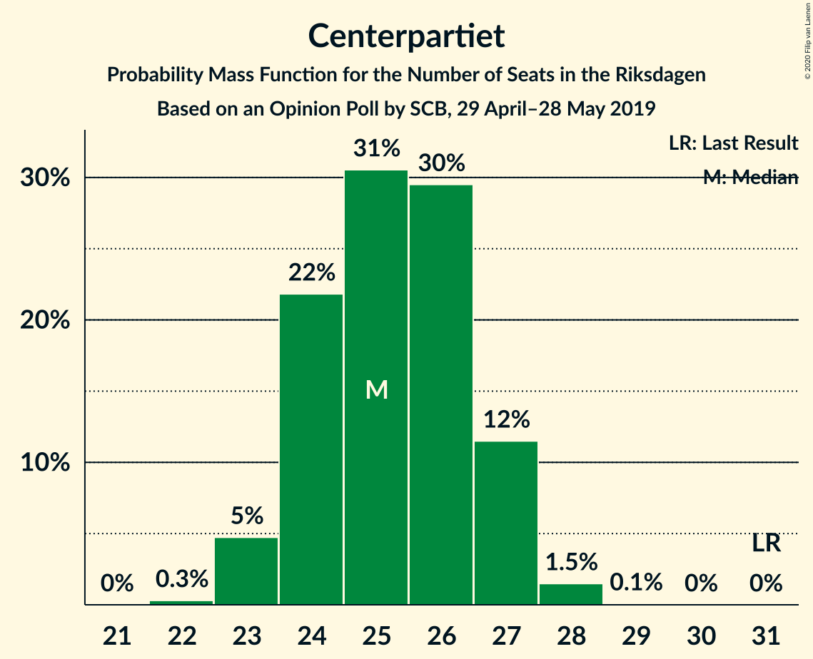
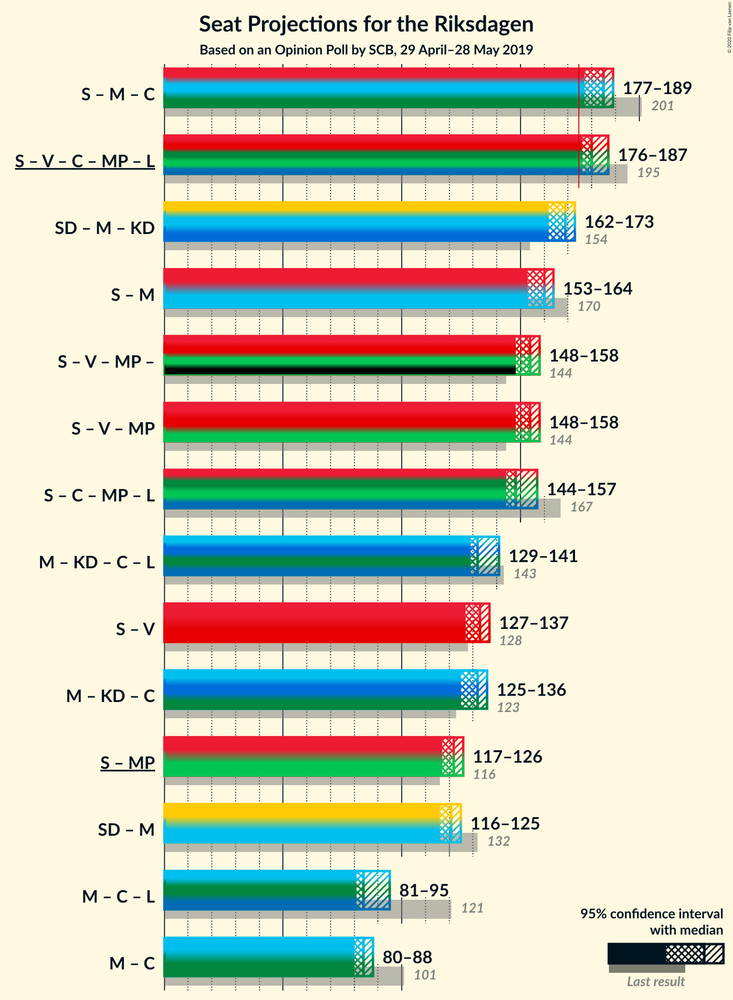
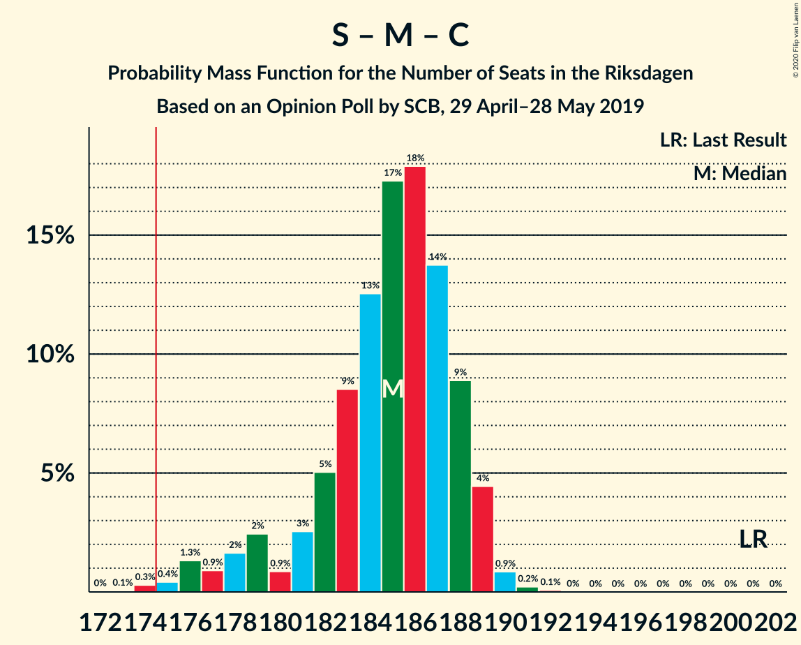
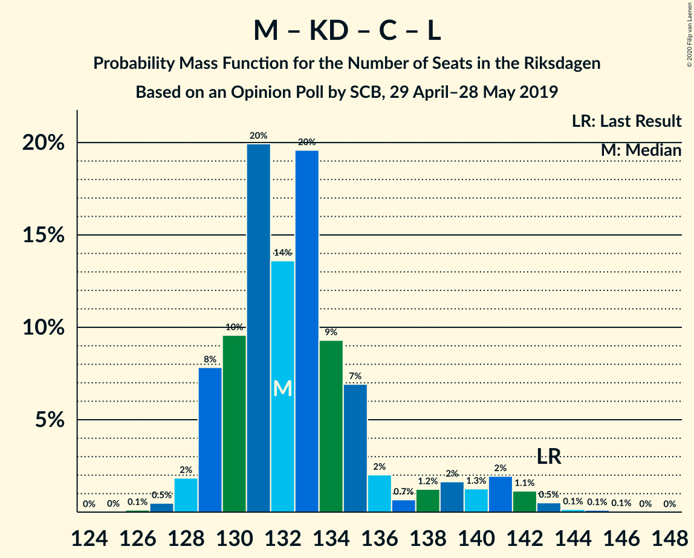
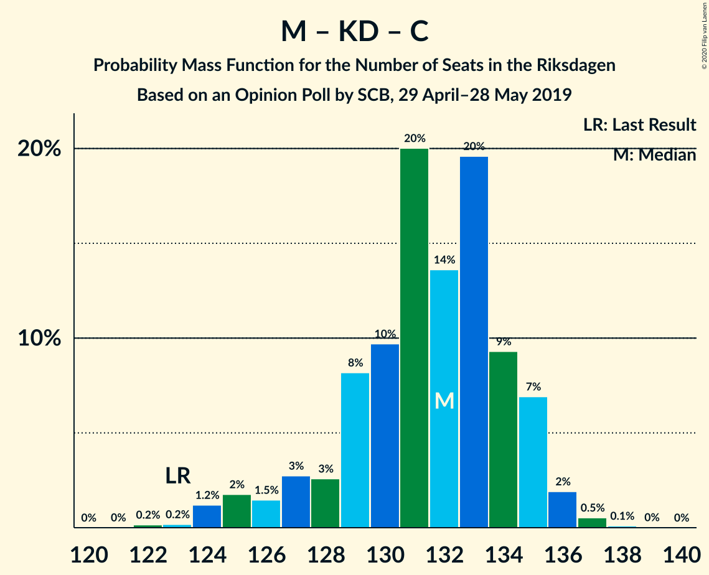

# Opinion Poll by SCB, 29 April–28 May 2019

<a href="#voting-intentions">Voting Intentions</a> | <a href="#seats">Seats</a> | <a href="#coalitions">Coalitions</a> | <a href="#technical-information">Technical Information</a>

## Voting Intentions

### Confidence Intervals

| Party | Last Result | Poll Result | 80% Confidence Interval | 90% Confidence Interval | 95% Confidence Interval | 99% Confidence Interval |
|:-----:|:-----------:|:-----------:|:-----------------------:|:-----------------------:|:-----------------------:|:-----------------------:|
| Sveriges socialdemokratiska arbetareparti | 28.3% | 27.6% | 27.0–28.2% |26.8–28.4% |26.7–28.5% |26.4–28.8% |
| Sverigedemokraterna | 17.5% | 17.1% | 16.6–17.6% |16.5–17.8% |16.3–17.9% |16.1–18.2% |
| Moderata samlingspartiet | 19.8% | 16.0% | 15.5–16.5% |15.4–16.7% |15.3–16.8% |15.0–17.0% |
| Kristdemokraterna | 6.3% | 13.0% | 12.5–13.5% |12.4–13.6% |12.3–13.7% |12.1–13.9% |
| Vänsterpartiet | 8.0% | 8.7% | 8.3–9.1% |8.2–9.2% |8.1–9.3% |8.0–9.5% |
| Centerpartiet | 8.6% | 6.9% | 6.6–7.3% |6.5–7.4% |6.4–7.4% |6.2–7.6% |
| Miljöpartiet de gröna | 4.4% | 5.7% | 5.4–6.0% |5.3–6.1% |5.2–6.2% |5.1–6.4% |
| Liberalerna | 5.5% | 3.7% | 3.4–4.0% |3.4–4.0% |3.3–4.1% |3.2–4.2% |

*Note:* The poll result column reflects the actual value used in the calculations. Published results may vary slightly, and in addition be rounded to fewer digits.

## Seats

### Confidence Intervals

| Party | Last Result | Median | 80% Confidence Interval | 90% Confidence Interval | 95% Confidence Interval | 99% Confidence Interval |
|:-----:|:-----------:|:------:|:-----------------------:|:-----------------------:|:-----------------------:|:-----------------------:|
| <a href="#sveriges-socialdemokratiska-arbetareparti">Sveriges socialdemokratiska arbetareparti</a> | 100 | 102 | 98–104 |97–105 |95–105 |95–106 |
| <a href="#sverigedemokraterna">Sverigedemokraterna</a> | 62 | 63 | 61–65 |60–66 |59–67 |58–67 |
| <a href="#moderata-samlingspartiet">Moderata samlingspartiet</a> | 70 | 58 | 56–60 |56–61 |55–62 |54–63 |
| <a href="#kristdemokraterna">Kristdemokraterna</a> | 22 | 48 | 46–50 |45–50 |44–50 |43–51 |
| <a href="#vänsterpartiet">Vänsterpartiet</a> | 28 | 32 | 30–34 |30–34 |29–34 |29–35 |
| <a href="#centerpartiet">Centerpartiet</a> | 31 | 25 | 24–27 |23–27 |23–27 |22–28 |
| <a href="#miljöpartiet-de-gröna">Miljöpartiet de gröna</a> | 16 | 20 | 19–22 |19–23 |19–23 |19–24 |
| <a href="#liberalerna">Liberalerna</a> | 20 | 0 | 0–14 |0–14 |0–15 |0–15 |

### Sveriges socialdemokratiska arbetareparti

*For a full overview of the results for this party, see the [Sveriges socialdemokratiska arbetareparti](party-sverigessocialdemokratiskaarbetareparti.html) page.*

| Number of Seats | Probability | Accumulated | Special Marks |
|:---------------:|:-----------:|:-----------:|:-------------:|
| 93 | 0.1% | 100% |  |
| 94 | 0.2% | 99.9% |  |
| 95 | 3% | 99.7% |  |
| 96 | 1.1% | 97% |  |
| 97 | 3% | 96% |  |
| 98 | 4% | 93% |  |
| 99 | 10% | 89% |  |
| 100 | 13% | 79% | Last Result |
| 101 | 10% | 66% |  |
| 102 | 19% | 56% | Median |
| 103 | 17% | 37% |  |
| 104 | 14% | 20% |  |
| 105 | 5% | 6% |  |
| 106 | 0.6% | 0.9% |  |
| 107 | 0.2% | 0.3% |  |
| 108 | 0% | 0% |  |

### Sverigedemokraterna

*For a full overview of the results for this party, see the [Sverigedemokraterna](party-sverigedemokraterna.html) page.*

| Number of Seats | Probability | Accumulated | Special Marks |
|:---------------:|:-----------:|:-----------:|:-------------:|
| 57 | 0.1% | 100% |  |
| 58 | 0.9% | 99.9% |  |
| 59 | 2% | 99.0% |  |
| 60 | 6% | 97% |  |
| 61 | 14% | 91% |  |
| 62 | 16% | 78% | Last Result |
| 63 | 28% | 62% | Median |
| 64 | 22% | 34% |  |
| 65 | 4% | 11% |  |
| 66 | 3% | 7% |  |
| 67 | 4% | 4% |  |
| 68 | 0.1% | 0.1% |  |
| 69 | 0% | 0% |  |

### Moderata samlingspartiet

*For a full overview of the results for this party, see the [Moderata samlingspartiet](party-moderatasamlingspartiet.html) page.*

| Number of Seats | Probability | Accumulated | Special Marks |
|:---------------:|:-----------:|:-----------:|:-------------:|
| 52 | 0.1% | 100% |  |
| 53 | 0.3% | 99.9% |  |
| 54 | 0.7% | 99.7% |  |
| 55 | 3% | 99.0% |  |
| 56 | 10% | 96% |  |
| 57 | 23% | 86% |  |
| 58 | 22% | 63% | Median |
| 59 | 26% | 41% |  |
| 60 | 8% | 15% |  |
| 61 | 5% | 7% |  |
| 62 | 2% | 3% |  |
| 63 | 0.5% | 0.6% |  |
| 64 | 0.1% | 0.1% |  |
| 65 | 0% | 0% |  |
| 66 | 0% | 0% |  |
| 67 | 0% | 0% |  |
| 68 | 0% | 0% |  |
| 69 | 0% | 0% |  |
| 70 | 0% | 0% | Last Result |

### Kristdemokraterna

*For a full overview of the results for this party, see the [Kristdemokraterna](party-kristdemokraterna.html) page.*

| Number of Seats | Probability | Accumulated | Special Marks |
|:---------------:|:-----------:|:-----------:|:-------------:|
| 22 | 0% | 100% | Last Result |
| 23 | 0% | 100% |  |
| 24 | 0% | 100% |  |
| 25 | 0% | 100% |  |
| 26 | 0% | 100% |  |
| 27 | 0% | 100% |  |
| 28 | 0% | 100% |  |
| 29 | 0% | 100% |  |
| 30 | 0% | 100% |  |
| 31 | 0% | 100% |  |
| 32 | 0% | 100% |  |
| 33 | 0% | 100% |  |
| 34 | 0% | 100% |  |
| 35 | 0% | 100% |  |
| 36 | 0% | 100% |  |
| 37 | 0% | 100% |  |
| 38 | 0% | 100% |  |
| 39 | 0% | 100% |  |
| 40 | 0% | 100% |  |
| 41 | 0% | 100% |  |
| 42 | 0% | 100% |  |
| 43 | 0.7% | 100% |  |
| 44 | 3% | 99.3% |  |
| 45 | 4% | 97% |  |
| 46 | 15% | 93% |  |
| 47 | 25% | 78% |  |
| 48 | 28% | 53% | Median |
| 49 | 10% | 25% |  |
| 50 | 13% | 15% |  |
| 51 | 2% | 2% |  |
| 52 | 0.4% | 0.4% |  |
| 53 | 0% | 0% |  |

### Vänsterpartiet

*For a full overview of the results for this party, see the [Vänsterpartiet](party-vänsterpartiet.html) page.*

| Number of Seats | Probability | Accumulated | Special Marks |
|:---------------:|:-----------:|:-----------:|:-------------:|
| 28 | 0.2% | 100% | Last Result |
| 29 | 3% | 99.8% |  |
| 30 | 12% | 97% |  |
| 31 | 34% | 85% |  |
| 32 | 14% | 50% | Median |
| 33 | 24% | 36% |  |
| 34 | 11% | 12% |  |
| 35 | 0.6% | 0.6% |  |
| 36 | 0% | 0.1% |  |
| 37 | 0% | 0% |  |

### Centerpartiet

*For a full overview of the results for this party, see the [Centerpartiet](party-centerpartiet.html) page.*

| Number of Seats | Probability | Accumulated | Special Marks |
|:---------------:|:-----------:|:-----------:|:-------------:|
| 22 | 0.5% | 100% |  |
| 23 | 6% | 99.5% |  |
| 24 | 14% | 94% |  |
| 25 | 33% | 80% | Median |
| 26 | 35% | 46% |  |
| 27 | 10% | 12% |  |
| 28 | 2% | 2% |  |
| 29 | 0.2% | 0.2% |  |
| 30 | 0% | 0% |  |
| 31 | 0% | 0% | Last Result |

### Miljöpartiet de gröna

*For a full overview of the results for this party, see the [Miljöpartiet de gröna](party-miljöpartietdegröna.html) page.*

| Number of Seats | Probability | Accumulated | Special Marks |
|:---------------:|:-----------:|:-----------:|:-------------:|
| 16 | 0% | 100% | Last Result |
| 17 | 0% | 100% |  |
| 18 | 0.3% | 100% |  |
| 19 | 25% | 99.7% |  |
| 20 | 35% | 75% | Median |
| 21 | 25% | 40% |  |
| 22 | 10% | 15% |  |
| 23 | 5% | 5% |  |
| 24 | 0.6% | 0.6% |  |
| 25 | 0% | 0% |  |

### Liberalerna

*For a full overview of the results for this party, see the [Liberalerna](party-liberalerna.html) page.*

| Number of Seats | Probability | Accumulated | Special Marks |
|:---------------:|:-----------:|:-----------:|:-------------:|
| 0 | 89% | 100% | Median |
| 1 | 0% | 11% |  |
| 2 | 0% | 11% |  |
| 3 | 0% | 11% |  |
| 4 | 0% | 11% |  |
| 5 | 0% | 11% |  |
| 6 | 0% | 11% |  |
| 7 | 0% | 11% |  |
| 8 | 0% | 11% |  |
| 9 | 0% | 11% |  |
| 10 | 0% | 11% |  |
| 11 | 0% | 11% |  |
| 12 | 0% | 11% |  |
| 13 | 0% | 11% |  |
| 14 | 6% | 11% |  |
| 15 | 5% | 5% |  |
| 16 | 0.1% | 0.1% |  |
| 17 | 0% | 0% |  |
| 18 | 0% | 0% |  |
| 19 | 0% | 0% |  |
| 20 | 0% | 0% | Last Result |

## Coalitions

### Confidence Intervals

| Coalition | Last Result | Median | Majority? | 80% Confidence Interval | 90% Confidence Interval | 95% Confidence Interval | 99% Confidence Interval |
|:---------:|:-----------:|:------:|:---------:|:-----------------------:|:-----------------------:|:-----------------------:|:-----------------------:|
| Sveriges socialdemokratiska arbetareparti – Moderata samlingspartiet – Centerpartiet | 201 | 186 | 99.2% | 180–188 | 178–188 | 175–189 | 174–191 |
| Sveriges socialdemokratiska arbetareparti – Vänsterpartiet – Centerpartiet – Miljöpartiet de gröna – Liberalerna | 195 | 180 | 99.7% | 177–184 | 176–187 | 176–187 | 175–190 |
| Sverigedemokraterna – Moderata samlingspartiet – Kristdemokraterna | 154 | 169 | 0.3% | 165–172 | 162–173 | 162–173 | 159–174 |
| Sveriges socialdemokratiska arbetareparti – Moderata samlingspartiet | 170 | 160 | 0% | 156–163 | 152–163 | 151–164 | 151–165 |
| Sveriges socialdemokratiska arbetareparti – Vänsterpartiet – Miljöpartiet de gröna | 144 | 154 | 0% | 150–157 | 147–158 | 145–158 | 145–160 |
| Sveriges socialdemokratiska arbetareparti – Centerpartiet – Miljöpartiet de gröna – Liberalerna | 167 | 149 | 0% | 146–152 | 145–157 | 144–157 | 143–159 |
| Moderata samlingspartiet – Kristdemokraterna – Centerpartiet – Liberalerna | 143 | 131 | 0% | 129–138 | 129–141 | 128–142 | 127–145 |
| Sveriges socialdemokratiska arbetareparti – Vänsterpartiet | 128 | 134 | 0% | 129–136 | 127–137 | 126–137 | 125–139 |
| Moderata samlingspartiet – Kristdemokraterna – Centerpartiet | 123 | 131 | 0% | 127–135 | 127–135 | 125–135 | 122–136 |
| Sveriges socialdemokratiska arbetareparti – Miljöpartiet de gröna | 116 | 122 | 0% | 118–125 | 116–126 | 115–126 | 114–127 |
| Sverigedemokraterna – Moderata samlingspartiet | 132 | 121 | 0% | 118–124 | 116–125 | 116–125 | 114–127 |
| Moderata samlingspartiet – Centerpartiet – Liberalerna | 121 | 84 | 0% | 82–92 | 81–95 | 81–96 | 80–98 |
| Moderata samlingspartiet – Centerpartiet | 101 | 83 | 0% | 81–86 | 80–86 | 80–87 | 78–88 |

### Sveriges socialdemokratiska arbetareparti – Moderata samlingspartiet – Centerpartiet

| Number of Seats | Probability | Accumulated | Special Marks |
|:---------------:|:-----------:|:-----------:|:-------------:|
| 173 | 0% | 100% |  |
| 174 | 0.7% | 99.9% |  |
| 175 | 2% | 99.2% | Majority |
| 176 | 0.4% | 97% |  |
| 177 | 0.8% | 96% |  |
| 178 | 2% | 96% |  |
| 179 | 3% | 93% |  |
| 180 | 2% | 91% |  |
| 181 | 3% | 89% |  |
| 182 | 3% | 86% |  |
| 183 | 5% | 83% |  |
| 184 | 10% | 79% |  |
| 185 | 9% | 68% | Median |
| 186 | 37% | 60% |  |
| 187 | 9% | 23% |  |
| 188 | 10% | 14% |  |
| 189 | 2% | 4% |  |
| 190 | 1.3% | 2% |  |
| 191 | 0.8% | 0.8% |  |
| 192 | 0.1% | 0.1% |  |
| 193 | 0% | 0% |  |
| 194 | 0% | 0% |  |
| 195 | 0% | 0% |  |
| 196 | 0% | 0% |  |
| 197 | 0% | 0% |  |
| 198 | 0% | 0% |  |
| 199 | 0% | 0% |  |
| 200 | 0% | 0% |  |
| 201 | 0% | 0% | Last Result |

### Sveriges socialdemokratiska arbetareparti – Vänsterpartiet – Centerpartiet – Miljöpartiet de gröna – Liberalerna

| Number of Seats | Probability | Accumulated | Special Marks |
|:---------------:|:-----------:|:-----------:|:-------------:|
| 173 | 0.2% | 100% |  |
| 174 | 0.1% | 99.8% |  |
| 175 | 1.0% | 99.7% | Majority |
| 176 | 4% | 98.7% |  |
| 177 | 10% | 95% |  |
| 178 | 7% | 85% |  |
| 179 | 11% | 78% | Median |
| 180 | 25% | 67% |  |
| 181 | 17% | 42% |  |
| 182 | 10% | 26% |  |
| 183 | 5% | 16% |  |
| 184 | 2% | 11% |  |
| 185 | 1.3% | 9% |  |
| 186 | 0.7% | 7% |  |
| 187 | 5% | 7% |  |
| 188 | 0.5% | 2% |  |
| 189 | 1.0% | 2% |  |
| 190 | 0.3% | 0.5% |  |
| 191 | 0.2% | 0.2% |  |
| 192 | 0% | 0% |  |
| 193 | 0% | 0% |  |
| 194 | 0% | 0% |  |
| 195 | 0% | 0% | Last Result |

### Sverigedemokraterna – Moderata samlingspartiet – Kristdemokraterna

| Number of Seats | Probability | Accumulated | Special Marks |
|:---------------:|:-----------:|:-----------:|:-------------:|
| 154 | 0% | 100% | Last Result |
| 155 | 0% | 100% |  |
| 156 | 0% | 100% |  |
| 157 | 0% | 100% |  |
| 158 | 0.2% | 100% |  |
| 159 | 0.3% | 99.8% |  |
| 160 | 1.0% | 99.5% |  |
| 161 | 0.5% | 98% |  |
| 162 | 5% | 98% |  |
| 163 | 0.7% | 93% |  |
| 164 | 1.3% | 93% |  |
| 165 | 2% | 91% |  |
| 166 | 5% | 89% |  |
| 167 | 10% | 84% |  |
| 168 | 17% | 74% |  |
| 169 | 25% | 58% | Median |
| 170 | 11% | 33% |  |
| 171 | 7% | 22% |  |
| 172 | 10% | 15% |  |
| 173 | 4% | 5% |  |
| 174 | 1.0% | 1.3% |  |
| 175 | 0.1% | 0.3% | Majority |
| 176 | 0.2% | 0.2% |  |
| 177 | 0% | 0% |  |

### Sveriges socialdemokratiska arbetareparti – Moderata samlingspartiet

| Number of Seats | Probability | Accumulated | Special Marks |
|:---------------:|:-----------:|:-----------:|:-------------:|
| 150 | 0.4% | 100% |  |
| 151 | 3% | 99.5% |  |
| 152 | 2% | 97% |  |
| 153 | 0.9% | 95% |  |
| 154 | 2% | 94% |  |
| 155 | 0.9% | 91% |  |
| 156 | 3% | 91% |  |
| 157 | 9% | 88% |  |
| 158 | 5% | 79% |  |
| 159 | 16% | 74% |  |
| 160 | 23% | 58% | Median |
| 161 | 12% | 35% |  |
| 162 | 2% | 23% |  |
| 163 | 17% | 20% |  |
| 164 | 2% | 4% |  |
| 165 | 1.0% | 1.3% |  |
| 166 | 0.2% | 0.2% |  |
| 167 | 0% | 0% |  |
| 168 | 0% | 0% |  |
| 169 | 0% | 0% |  |
| 170 | 0% | 0% | Last Result |

### Sveriges socialdemokratiska arbetareparti – Vänsterpartiet – Miljöpartiet de gröna

| Number of Seats | Probability | Accumulated | Special Marks |
|:---------------:|:-----------:|:-----------:|:-------------:|
| 144 | 0.1% | 100% | Last Result |
| 145 | 3% | 99.9% |  |
| 146 | 1.5% | 97% |  |
| 147 | 2% | 96% |  |
| 148 | 1.1% | 93% |  |
| 149 | 1.2% | 92% |  |
| 150 | 4% | 91% |  |
| 151 | 8% | 87% |  |
| 152 | 9% | 79% |  |
| 153 | 10% | 71% |  |
| 154 | 18% | 61% | Median |
| 155 | 20% | 43% |  |
| 156 | 10% | 23% |  |
| 157 | 8% | 13% |  |
| 158 | 4% | 5% |  |
| 159 | 0.6% | 1.1% |  |
| 160 | 0.5% | 0.5% |  |
| 161 | 0% | 0% |  |

### Sveriges socialdemokratiska arbetareparti – Centerpartiet – Miljöpartiet de gröna – Liberalerna

| Number of Seats | Probability | Accumulated | Special Marks |
|:---------------:|:-----------:|:-----------:|:-------------:|
| 142 | 0.3% | 100% |  |
| 143 | 0.7% | 99.6% |  |
| 144 | 3% | 99.0% |  |
| 145 | 4% | 96% |  |
| 146 | 11% | 92% |  |
| 147 | 26% | 81% | Median |
| 148 | 4% | 55% |  |
| 149 | 29% | 51% |  |
| 150 | 5% | 22% |  |
| 151 | 5% | 17% |  |
| 152 | 3% | 12% |  |
| 153 | 0.9% | 9% |  |
| 154 | 0.6% | 8% |  |
| 155 | 0.9% | 7% |  |
| 156 | 1.5% | 6% |  |
| 157 | 3% | 5% |  |
| 158 | 0.9% | 2% |  |
| 159 | 0.6% | 0.9% |  |
| 160 | 0.2% | 0.3% |  |
| 161 | 0% | 0.1% |  |
| 162 | 0.1% | 0.1% |  |
| 163 | 0% | 0% |  |
| 164 | 0% | 0% |  |
| 165 | 0% | 0% |  |
| 166 | 0% | 0% |  |
| 167 | 0% | 0% | Last Result |

### Moderata samlingspartiet – Kristdemokraterna – Centerpartiet – Liberalerna

| Number of Seats | Probability | Accumulated | Special Marks |
|:---------------:|:-----------:|:-----------:|:-------------:|
| 127 | 0.6% | 100% |  |
| 128 | 3% | 99.3% |  |
| 129 | 11% | 96% |  |
| 130 | 4% | 85% |  |
| 131 | 33% | 81% | Median |
| 132 | 12% | 48% |  |
| 133 | 4% | 36% |  |
| 134 | 10% | 32% |  |
| 135 | 9% | 21% |  |
| 136 | 2% | 13% |  |
| 137 | 0.1% | 10% |  |
| 138 | 1.2% | 10% |  |
| 139 | 2% | 9% |  |
| 140 | 0.2% | 7% |  |
| 141 | 2% | 7% |  |
| 142 | 4% | 5% |  |
| 143 | 0.2% | 0.8% | Last Result |
| 144 | 0% | 0.6% |  |
| 145 | 0.2% | 0.6% |  |
| 146 | 0.4% | 0.4% |  |
| 147 | 0% | 0% |  |

### Sveriges socialdemokratiska arbetareparti – Vänsterpartiet

| Number of Seats | Probability | Accumulated | Special Marks |
|:---------------:|:-----------:|:-----------:|:-------------:|
| 123 | 0.1% | 100% |  |
| 124 | 0.1% | 99.9% |  |
| 125 | 0.5% | 99.8% |  |
| 126 | 3% | 99.3% |  |
| 127 | 2% | 97% |  |
| 128 | 3% | 95% | Last Result |
| 129 | 3% | 92% |  |
| 130 | 4% | 89% |  |
| 131 | 5% | 85% |  |
| 132 | 15% | 80% |  |
| 133 | 14% | 65% |  |
| 134 | 20% | 51% | Median |
| 135 | 9% | 31% |  |
| 136 | 13% | 22% |  |
| 137 | 8% | 9% |  |
| 138 | 0.5% | 1.3% |  |
| 139 | 0.7% | 0.8% |  |
| 140 | 0.1% | 0.2% |  |
| 141 | 0% | 0% |  |

### Moderata samlingspartiet – Kristdemokraterna – Centerpartiet

| Number of Seats | Probability | Accumulated | Special Marks |
|:---------------:|:-----------:|:-----------:|:-------------:|
| 122 | 0.7% | 100% |  |
| 123 | 0.3% | 99.3% | Last Result |
| 124 | 1.0% | 99.0% |  |
| 125 | 2% | 98% |  |
| 126 | 0.4% | 96% |  |
| 127 | 6% | 96% |  |
| 128 | 4% | 90% |  |
| 129 | 11% | 86% |  |
| 130 | 4% | 74% |  |
| 131 | 33% | 71% | Median |
| 132 | 12% | 37% |  |
| 133 | 4% | 25% |  |
| 134 | 10% | 21% |  |
| 135 | 9% | 10% |  |
| 136 | 2% | 2% |  |
| 137 | 0.1% | 0.3% |  |
| 138 | 0.2% | 0.2% |  |
| 139 | 0% | 0% |  |

### Sveriges socialdemokratiska arbetareparti – Miljöpartiet de gröna

| Number of Seats | Probability | Accumulated | Special Marks |
|:---------------:|:-----------:|:-----------:|:-------------:|
| 113 | 0% | 100% |  |
| 114 | 2% | 99.9% |  |
| 115 | 1.0% | 98% |  |
| 116 | 2% | 97% | Last Result |
| 117 | 2% | 95% |  |
| 118 | 2% | 92% |  |
| 119 | 4% | 90% |  |
| 120 | 10% | 86% |  |
| 121 | 22% | 76% |  |
| 122 | 13% | 54% | Median |
| 123 | 16% | 41% |  |
| 124 | 11% | 25% |  |
| 125 | 9% | 14% |  |
| 126 | 4% | 5% |  |
| 127 | 0.7% | 1.0% |  |
| 128 | 0.2% | 0.3% |  |
| 129 | 0% | 0% |  |

### Sverigedemokraterna – Moderata samlingspartiet

| Number of Seats | Probability | Accumulated | Special Marks |
|:---------------:|:-----------:|:-----------:|:-------------:|
| 112 | 0.2% | 100% |  |
| 113 | 0.2% | 99.8% |  |
| 114 | 0.4% | 99.6% |  |
| 115 | 0.9% | 99.2% |  |
| 116 | 4% | 98% |  |
| 117 | 2% | 94% |  |
| 118 | 4% | 93% |  |
| 119 | 7% | 88% |  |
| 120 | 12% | 81% |  |
| 121 | 39% | 69% | Median |
| 122 | 7% | 30% |  |
| 123 | 9% | 22% |  |
| 124 | 8% | 13% |  |
| 125 | 5% | 6% |  |
| 126 | 0.4% | 1.0% |  |
| 127 | 0.5% | 0.6% |  |
| 128 | 0.1% | 0.1% |  |
| 129 | 0% | 0% |  |
| 130 | 0% | 0% |  |
| 131 | 0% | 0% |  |
| 132 | 0% | 0% | Last Result |

### Moderata samlingspartiet – Centerpartiet – Liberalerna

| Number of Seats | Probability | Accumulated | Special Marks |
|:---------------:|:-----------:|:-----------:|:-------------:|
| 79 | 0.1% | 100% |  |
| 80 | 1.4% | 99.9% |  |
| 81 | 5% | 98% |  |
| 82 | 5% | 93% |  |
| 83 | 28% | 88% | Median |
| 84 | 25% | 61% |  |
| 85 | 11% | 35% |  |
| 86 | 10% | 24% |  |
| 87 | 2% | 14% |  |
| 88 | 0.9% | 12% |  |
| 89 | 0.3% | 11% |  |
| 90 | 0.1% | 11% |  |
| 91 | 0.2% | 11% |  |
| 92 | 1.0% | 10% |  |
| 93 | 0.5% | 9% |  |
| 94 | 3% | 9% |  |
| 95 | 2% | 6% |  |
| 96 | 3% | 4% |  |
| 97 | 0.6% | 1.2% |  |
| 98 | 0.5% | 0.6% |  |
| 99 | 0.1% | 0.1% |  |
| 100 | 0% | 0% |  |
| 101 | 0% | 0% |  |
| 102 | 0% | 0% |  |
| 103 | 0% | 0% |  |
| 104 | 0% | 0% |  |
| 105 | 0% | 0% |  |
| 106 | 0% | 0% |  |
| 107 | 0% | 0% |  |
| 108 | 0% | 0% |  |
| 109 | 0% | 0% |  |
| 110 | 0% | 0% |  |
| 111 | 0% | 0% |  |
| 112 | 0% | 0% |  |
| 113 | 0% | 0% |  |
| 114 | 0% | 0% |  |
| 115 | 0% | 0% |  |
| 116 | 0% | 0% |  |
| 117 | 0% | 0% |  |
| 118 | 0% | 0% |  |
| 119 | 0% | 0% |  |
| 120 | 0% | 0% |  |
| 121 | 0% | 0% | Last Result |

### Moderata samlingspartiet – Centerpartiet

| Number of Seats | Probability | Accumulated | Special Marks |
|:---------------:|:-----------:|:-----------:|:-------------:|
| 76 | 0.2% | 100% |  |
| 77 | 0.2% | 99.8% |  |
| 78 | 1.0% | 99.6% |  |
| 79 | 0.9% | 98.6% |  |
| 80 | 5% | 98% |  |
| 81 | 10% | 93% |  |
| 82 | 5% | 83% |  |
| 83 | 28% | 78% | Median |
| 84 | 26% | 50% |  |
| 85 | 11% | 24% |  |
| 86 | 10% | 14% |  |
| 87 | 2% | 3% |  |
| 88 | 0.9% | 1.2% |  |
| 89 | 0.3% | 0.3% |  |
| 90 | 0% | 0% |  |
| 91 | 0% | 0% |  |
| 92 | 0% | 0% |  |
| 93 | 0% | 0% |  |
| 94 | 0% | 0% |  |
| 95 | 0% | 0% |  |
| 96 | 0% | 0% |  |
| 97 | 0% | 0% |  |
| 98 | 0% | 0% |  |
| 99 | 0% | 0% |  |
| 100 | 0% | 0% |  |
| 101 | 0% | 0% | Last Result |

## Technical Information

### Opinion Poll

+ **Polling firm:** SCB
+ **Commissioner(s):** —
+ **Fieldwork period:** 29 April–28 May 2019

### Calculations

+ **Sample size:** 9092
+ **Simulations done:** 131,072
+ **Error estimate:** 0.72%

