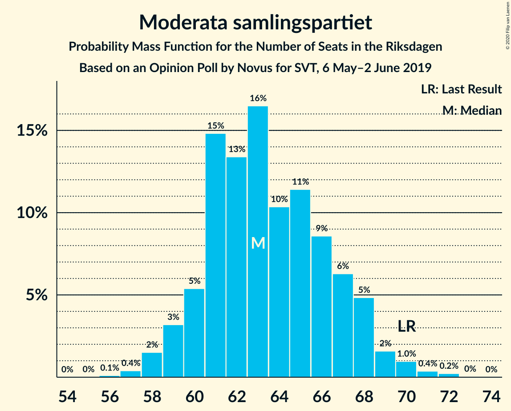
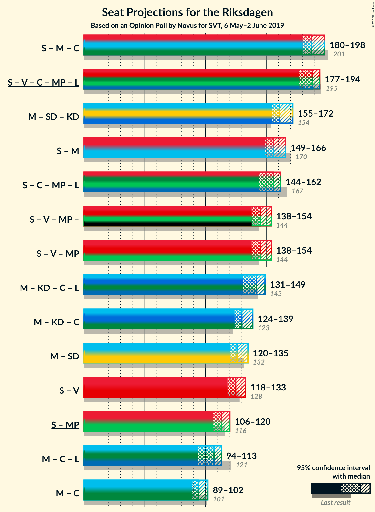
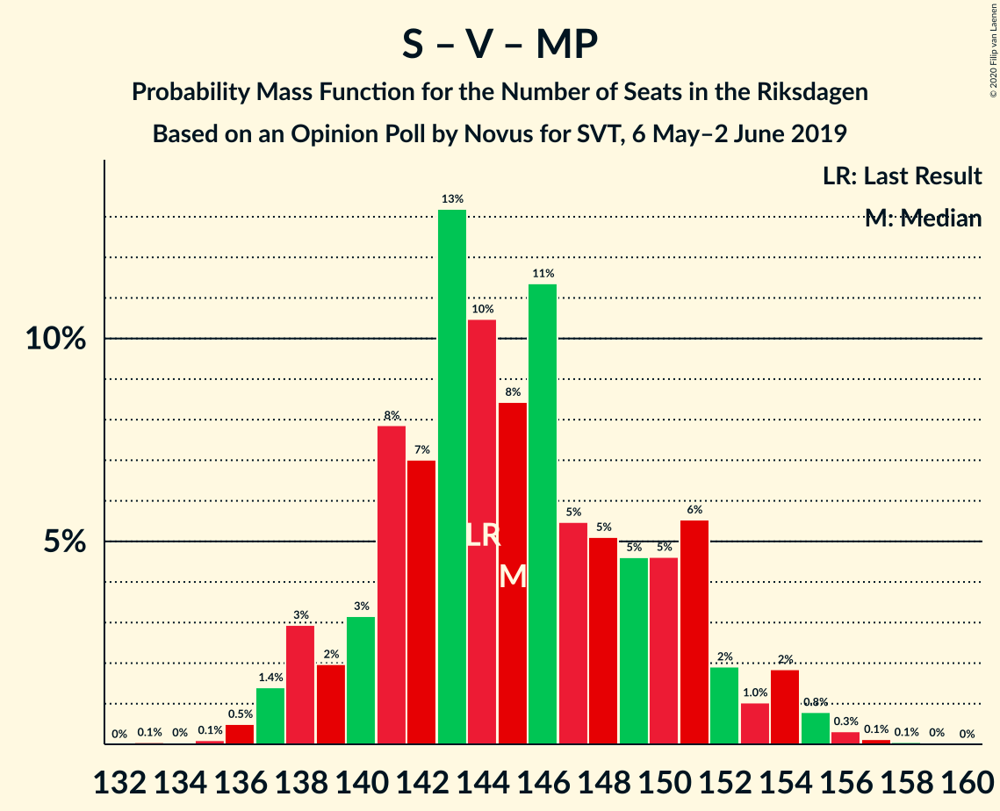

# Opinion Poll by Novus for SVT, 6 May–2 June 2019

<a href="#voting-intentions">Voting Intentions</a> | <a href="#seats">Seats</a> | <a href="#coalitions">Coalitions</a> | <a href="#technical-information">Technical Information</a>

## Voting Intentions

### Confidence Intervals

| Party | Last Result | Poll Result | 80% Confidence Interval | 90% Confidence Interval | 95% Confidence Interval | 99% Confidence Interval |
|:-----:|:-----------:|:-----------:|:-----------------------:|:-----------------------:|:-----------------------:|:-----------------------:|
| Sveriges socialdemokratiska arbetareparti | 28.3% | 25.9% | 25.0–26.9% |24.7–27.1% |24.5–27.4% |24.1–27.8% |
| Moderata samlingspartiet | 19.8% | 17.7% | 16.9–18.5% |16.7–18.8% |16.5–19.0% |16.1–19.4% |
| Sverigedemokraterna | 17.5% | 17.6% | 16.8–18.4% |16.6–18.7% |16.4–18.9% |16.0–19.3% |
| Kristdemokraterna | 6.3% | 10.0% | 9.4–10.7% |9.2–10.9% |9.1–11.0% |8.8–11.3% |
| Vänsterpartiet | 8.0% | 9.0% | 8.4–9.6% |8.2–9.8% |8.1–10.0% |7.8–10.3% |
| Centerpartiet | 8.6% | 8.7% | 8.1–9.3% |8.0–9.5% |7.8–9.7% |7.6–10.0% |
| Miljöpartiet de gröna | 4.4% | 5.5% | 5.0–6.0% |4.9–6.2% |4.8–6.3% |4.6–6.5% |
| Liberalerna | 5.5% | 4.1% | 3.7–4.5% |3.6–4.7% |3.5–4.8% |3.3–5.0% |

*Note:* The poll result column reflects the actual value used in the calculations. Published results may vary slightly, and in addition be rounded to fewer digits.

## Seats

### Confidence Intervals

| Party | Last Result | Median | 80% Confidence Interval | 90% Confidence Interval | 95% Confidence Interval | 99% Confidence Interval |
|:-----:|:-----------:|:------:|:-----------------------:|:-----------------------:|:-----------------------:|:-----------------------:|
| <a href="#sveriges-socialdemokratiska-arbetareparti">Sveriges socialdemokratiska arbetareparti</a> | 100 | 92 | 89–97 |87–98 |87–99 |85–102 |
| <a href="#moderata-samlingspartiet">Moderata samlingspartiet</a> | 70 | 63 | 60–67 |59–68 |59–69 |57–71 |
| <a href="#sverigedemokraterna">Sverigedemokraterna</a> | 62 | 63 | 60–67 |59–68 |59–69 |57–70 |
| <a href="#kristdemokraterna">Kristdemokraterna</a> | 22 | 36 | 33–38 |33–39 |32–40 |31–41 |
| <a href="#vänsterpartiet">Vänsterpartiet</a> | 28 | 32 | 30–35 |29–36 |29–36 |28–38 |
| <a href="#centerpartiet">Centerpartiet</a> | 31 | 31 | 28–34 |28–35 |28–35 |27–36 |
| <a href="#miljöpartiet-de-gröna">Miljöpartiet de gröna</a> | 16 | 20 | 18–22 |17–22 |17–23 |16–24 |
| <a href="#liberalerna">Liberalerna</a> | 20 | 15 | 0–16 |0–17 |0–17 |0–18 |

### Sveriges socialdemokratiska arbetareparti

*For a full overview of the results for this party, see the [Sveriges socialdemokratiska arbetareparti](party-sverigessocialdemokratiskaarbetareparti.html) page.*

| Number of Seats | Probability | Accumulated | Special Marks |
|:---------------:|:-----------:|:-----------:|:-------------:|
| 84 | 0.1% | 100% |  |
| 85 | 0.5% | 99.9% |  |
| 86 | 2% | 99.4% |  |
| 87 | 3% | 98% |  |
| 88 | 3% | 95% |  |
| 89 | 5% | 92% |  |
| 90 | 7% | 87% |  |
| 91 | 13% | 79% |  |
| 92 | 18% | 67% | Median |
| 93 | 10% | 49% |  |
| 94 | 11% | 38% |  |
| 95 | 8% | 27% |  |
| 96 | 7% | 19% |  |
| 97 | 5% | 13% |  |
| 98 | 4% | 7% |  |
| 99 | 1.4% | 4% |  |
| 100 | 1.0% | 2% | Last Result |
| 101 | 0.5% | 1.2% |  |
| 102 | 0.5% | 0.7% |  |
| 103 | 0.2% | 0.2% |  |
| 104 | 0% | 0% |  |

### Moderata samlingspartiet

*For a full overview of the results for this party, see the [Moderata samlingspartiet](party-moderatasamlingspartiet.html) page.*

| Number of Seats | Probability | Accumulated | Special Marks |
|:---------------:|:-----------:|:-----------:|:-------------:|
| 56 | 0.1% | 100% |  |
| 57 | 0.4% | 99.9% |  |
| 58 | 2% | 99.5% |  |
| 59 | 4% | 98% |  |
| 60 | 6% | 94% |  |
| 61 | 12% | 88% |  |
| 62 | 13% | 76% |  |
| 63 | 18% | 63% | Median |
| 64 | 10% | 45% |  |
| 65 | 12% | 35% |  |
| 66 | 8% | 23% |  |
| 67 | 6% | 15% |  |
| 68 | 6% | 9% |  |
| 69 | 1.4% | 3% |  |
| 70 | 0.7% | 2% | Last Result |
| 71 | 0.5% | 0.8% |  |
| 72 | 0.3% | 0.3% |  |
| 73 | 0% | 0% |  |

### Sverigedemokraterna

*For a full overview of the results for this party, see the [Sverigedemokraterna](party-sverigedemokraterna.html) page.*

| Number of Seats | Probability | Accumulated | Special Marks |
|:---------------:|:-----------:|:-----------:|:-------------:|
| 55 | 0.1% | 100% |  |
| 56 | 0.2% | 99.9% |  |
| 57 | 0.5% | 99.7% |  |
| 58 | 2% | 99.2% |  |
| 59 | 5% | 98% |  |
| 60 | 8% | 93% |  |
| 61 | 13% | 86% |  |
| 62 | 10% | 73% | Last Result |
| 63 | 18% | 63% | Median |
| 64 | 19% | 44% |  |
| 65 | 6% | 25% |  |
| 66 | 7% | 19% |  |
| 67 | 4% | 12% |  |
| 68 | 3% | 8% |  |
| 69 | 3% | 4% |  |
| 70 | 0.9% | 1.2% |  |
| 71 | 0.2% | 0.3% |  |
| 72 | 0.1% | 0.1% |  |
| 73 | 0% | 0% |  |

### Kristdemokraterna

*For a full overview of the results for this party, see the [Kristdemokraterna](party-kristdemokraterna.html) page.*

| Number of Seats | Probability | Accumulated | Special Marks |
|:---------------:|:-----------:|:-----------:|:-------------:|
| 22 | 0% | 100% | Last Result |
| 23 | 0% | 100% |  |
| 24 | 0% | 100% |  |
| 25 | 0% | 100% |  |
| 26 | 0% | 100% |  |
| 27 | 0% | 100% |  |
| 28 | 0% | 100% |  |
| 29 | 0% | 100% |  |
| 30 | 0.1% | 100% |  |
| 31 | 0.5% | 99.9% |  |
| 32 | 2% | 99.4% |  |
| 33 | 13% | 97% |  |
| 34 | 12% | 84% |  |
| 35 | 14% | 72% |  |
| 36 | 22% | 57% | Median |
| 37 | 13% | 35% |  |
| 38 | 13% | 21% |  |
| 39 | 5% | 8% |  |
| 40 | 2% | 3% |  |
| 41 | 0.6% | 1.0% |  |
| 42 | 0.3% | 0.4% |  |
| 43 | 0.1% | 0.1% |  |
| 44 | 0% | 0% |  |

### Vänsterpartiet

*For a full overview of the results for this party, see the [Vänsterpartiet](party-vänsterpartiet.html) page.*

| Number of Seats | Probability | Accumulated | Special Marks |
|:---------------:|:-----------:|:-----------:|:-------------:|
| 27 | 0.1% | 100% |  |
| 28 | 0.9% | 99.8% | Last Result |
| 29 | 4% | 98.9% |  |
| 30 | 11% | 94% |  |
| 31 | 11% | 83% |  |
| 32 | 25% | 72% | Median |
| 33 | 26% | 48% |  |
| 34 | 10% | 22% |  |
| 35 | 7% | 12% |  |
| 36 | 4% | 6% |  |
| 37 | 0.9% | 2% |  |
| 38 | 0.5% | 0.7% |  |
| 39 | 0.2% | 0.2% |  |
| 40 | 0% | 0% |  |

### Centerpartiet

*For a full overview of the results for this party, see the [Centerpartiet](party-centerpartiet.html) page.*

| Number of Seats | Probability | Accumulated | Special Marks |
|:---------------:|:-----------:|:-----------:|:-------------:|
| 26 | 0.2% | 100% |  |
| 27 | 0.7% | 99.8% |  |
| 28 | 10% | 99.1% |  |
| 29 | 12% | 89% |  |
| 30 | 19% | 77% |  |
| 31 | 18% | 58% | Last Result, Median |
| 32 | 9% | 39% |  |
| 33 | 17% | 30% |  |
| 34 | 8% | 14% |  |
| 35 | 5% | 6% |  |
| 36 | 0.8% | 0.9% |  |
| 37 | 0.1% | 0.1% |  |
| 38 | 0% | 0% |  |

### Miljöpartiet de gröna

*For a full overview of the results for this party, see the [Miljöpartiet de gröna](party-miljöpartietdegröna.html) page.*

| Number of Seats | Probability | Accumulated | Special Marks |
|:---------------:|:-----------:|:-----------:|:-------------:|
| 16 | 2% | 100% | Last Result |
| 17 | 4% | 98% |  |
| 18 | 13% | 94% |  |
| 19 | 22% | 81% |  |
| 20 | 31% | 59% | Median |
| 21 | 16% | 28% |  |
| 22 | 9% | 12% |  |
| 23 | 2% | 3% |  |
| 24 | 0.7% | 0.7% |  |
| 25 | 0% | 0.1% |  |
| 26 | 0% | 0% |  |

### Liberalerna

*For a full overview of the results for this party, see the [Liberalerna](party-liberalerna.html) page.*

| Number of Seats | Probability | Accumulated | Special Marks |
|:---------------:|:-----------:|:-----------:|:-------------:|
| 0 | 32% | 100% |  |
| 1 | 0% | 68% |  |
| 2 | 0% | 68% |  |
| 3 | 0% | 68% |  |
| 4 | 0% | 68% |  |
| 5 | 0% | 68% |  |
| 6 | 0% | 68% |  |
| 7 | 0% | 68% |  |
| 8 | 0% | 68% |  |
| 9 | 0% | 68% |  |
| 10 | 0% | 68% |  |
| 11 | 0% | 68% |  |
| 12 | 0% | 68% |  |
| 13 | 0% | 68% |  |
| 14 | 13% | 68% |  |
| 15 | 25% | 55% | Median |
| 16 | 24% | 29% |  |
| 17 | 4% | 5% |  |
| 18 | 0.8% | 1.0% |  |
| 19 | 0.1% | 0.1% |  |
| 20 | 0% | 0% | Last Result |

## Coalitions

### Confidence Intervals

| Coalition | Last Result | Median | Majority? | 80% Confidence Interval | 90% Confidence Interval | 95% Confidence Interval | 99% Confidence Interval |
|:---------:|:-----------:|:------:|:---------:|:-----------------------:|:-----------------------:|:-----------------------:|:-----------------------:|
| Sveriges socialdemokratiska arbetareparti – Moderata samlingspartiet – Centerpartiet | 201 | 187 | 100% | 182–195 | 180–196 | 180–198 | 178–199 |
| Sveriges socialdemokratiska arbetareparti – Vänsterpartiet – Centerpartiet – Miljöpartiet de gröna – Liberalerna | 195 | 187 | 99.6% | 179–192 | 177–193 | 177–194 | 175–196 |
| Moderata samlingspartiet – Sverigedemokraterna – Kristdemokraterna | 154 | 162 | 0.4% | 157–170 | 156–172 | 155–172 | 153–174 |
| Sveriges socialdemokratiska arbetareparti – Moderata samlingspartiet | 170 | 155 | 0% | 151–163 | 151–164 | 149–165 | 147–168 |
| Sveriges socialdemokratiska arbetareparti – Centerpartiet – Miljöpartiet de gröna – Liberalerna | 167 | 155 | 0% | 146–160 | 145–161 | 143–162 | 142–164 |
| Sveriges socialdemokratiska arbetareparti – Vänsterpartiet – Miljöpartiet de gröna | 144 | 144 | 0% | 140–151 | 138–152 | 137–154 | 136–156 |
| Moderata samlingspartiet – Kristdemokraterna – Centerpartiet – Liberalerna | 143 | 142 | 0% | 134–147 | 132–148 | 131–149 | 128–151 |
| Moderata samlingspartiet – Kristdemokraterna – Centerpartiet | 123 | 130 | 0% | 126–136 | 124–138 | 124–139 | 122–141 |
| Moderata samlingspartiet – Sverigedemokraterna | 132 | 126 | 0% | 122–133 | 121–134 | 120–135 | 118–138 |
| Sveriges socialdemokratiska arbetareparti – Vänsterpartiet | 128 | 125 | 0% | 121–130 | 119–132 | 118–133 | 117–135 |
| Sveriges socialdemokratiska arbetareparti – Miljöpartiet de gröna | 116 | 112 | 0% | 108–117 | 107–119 | 106–120 | 104–123 |
| Moderata samlingspartiet – Centerpartiet – Liberalerna | 121 | 107 | 0% | 97–111 | 95–112 | 94–113 | 91–115 |
| Moderata samlingspartiet – Centerpartiet | 101 | 94 | 0% | 90–99 | 90–101 | 89–103 | 87–103 |

### Sveriges socialdemokratiska arbetareparti – Moderata samlingspartiet – Centerpartiet

| Number of Seats | Probability | Accumulated | Special Marks |
|:---------------:|:-----------:|:-----------:|:-------------:|
| 175 | 0% | 100% | Majority |
| 176 | 0.1% | 99.9% |  |
| 177 | 0.2% | 99.9% |  |
| 178 | 0.7% | 99.6% |  |
| 179 | 0.4% | 98.9% |  |
| 180 | 5% | 98% |  |
| 181 | 2% | 94% |  |
| 182 | 7% | 92% |  |
| 183 | 9% | 85% |  |
| 184 | 9% | 75% |  |
| 185 | 10% | 67% |  |
| 186 | 6% | 57% | Median |
| 187 | 8% | 51% |  |
| 188 | 9% | 43% |  |
| 189 | 4% | 34% |  |
| 190 | 3% | 30% |  |
| 191 | 3% | 27% |  |
| 192 | 2% | 24% |  |
| 193 | 6% | 21% |  |
| 194 | 5% | 15% |  |
| 195 | 3% | 11% |  |
| 196 | 4% | 8% |  |
| 197 | 0.7% | 4% |  |
| 198 | 2% | 4% |  |
| 199 | 0.8% | 1.3% |  |
| 200 | 0.2% | 0.5% |  |
| 201 | 0.1% | 0.3% | Last Result |
| 202 | 0.1% | 0.1% |  |
| 203 | 0% | 0% |  |

### Sveriges socialdemokratiska arbetareparti – Vänsterpartiet – Centerpartiet – Miljöpartiet de gröna – Liberalerna

| Number of Seats | Probability | Accumulated | Special Marks |
|:---------------:|:-----------:|:-----------:|:-------------:|
| 173 | 0.2% | 100% |  |
| 174 | 0.1% | 99.8% |  |
| 175 | 0.5% | 99.6% | Majority |
| 176 | 1.4% | 99.2% |  |
| 177 | 3% | 98% |  |
| 178 | 0.9% | 95% |  |
| 179 | 5% | 94% |  |
| 180 | 2% | 89% |  |
| 181 | 4% | 87% |  |
| 182 | 4% | 83% |  |
| 183 | 6% | 79% |  |
| 184 | 4% | 73% |  |
| 185 | 8% | 69% |  |
| 186 | 5% | 61% |  |
| 187 | 7% | 56% |  |
| 188 | 10% | 49% |  |
| 189 | 10% | 39% |  |
| 190 | 9% | 30% | Median |
| 191 | 8% | 21% |  |
| 192 | 7% | 13% |  |
| 193 | 3% | 6% |  |
| 194 | 1.0% | 3% |  |
| 195 | 2% | 2% | Last Result |
| 196 | 0.3% | 0.6% |  |
| 197 | 0.2% | 0.3% |  |
| 198 | 0.1% | 0.1% |  |
| 199 | 0% | 0% |  |

### Moderata samlingspartiet – Sverigedemokraterna – Kristdemokraterna

| Number of Seats | Probability | Accumulated | Special Marks |
|:---------------:|:-----------:|:-----------:|:-------------:|
| 151 | 0.1% | 100% |  |
| 152 | 0.2% | 99.9% |  |
| 153 | 0.3% | 99.7% |  |
| 154 | 2% | 99.4% | Last Result |
| 155 | 1.0% | 98% |  |
| 156 | 3% | 97% |  |
| 157 | 7% | 94% |  |
| 158 | 8% | 87% |  |
| 159 | 9% | 79% |  |
| 160 | 10% | 70% |  |
| 161 | 10% | 61% |  |
| 162 | 7% | 51% | Median |
| 163 | 5% | 44% |  |
| 164 | 8% | 39% |  |
| 165 | 4% | 31% |  |
| 166 | 6% | 27% |  |
| 167 | 4% | 21% |  |
| 168 | 4% | 17% |  |
| 169 | 2% | 13% |  |
| 170 | 5% | 11% |  |
| 171 | 0.9% | 6% |  |
| 172 | 3% | 5% |  |
| 173 | 1.4% | 2% |  |
| 174 | 0.5% | 0.8% |  |
| 175 | 0.1% | 0.4% | Majority |
| 176 | 0.2% | 0.2% |  |
| 177 | 0% | 0% |  |

### Sveriges socialdemokratiska arbetareparti – Moderata samlingspartiet

| Number of Seats | Probability | Accumulated | Special Marks |
|:---------------:|:-----------:|:-----------:|:-------------:|
| 145 | 0.1% | 100% |  |
| 146 | 0.1% | 99.9% |  |
| 147 | 0.3% | 99.7% |  |
| 148 | 1.3% | 99.4% |  |
| 149 | 1.4% | 98% |  |
| 150 | 1.2% | 97% |  |
| 151 | 7% | 96% |  |
| 152 | 10% | 88% |  |
| 153 | 7% | 78% |  |
| 154 | 6% | 71% |  |
| 155 | 17% | 65% | Median |
| 156 | 8% | 48% |  |
| 157 | 5% | 40% |  |
| 158 | 5% | 35% |  |
| 159 | 6% | 30% |  |
| 160 | 7% | 24% |  |
| 161 | 3% | 17% |  |
| 162 | 4% | 15% |  |
| 163 | 5% | 11% |  |
| 164 | 1.2% | 6% |  |
| 165 | 2% | 5% |  |
| 166 | 1.0% | 2% |  |
| 167 | 0.6% | 1.2% |  |
| 168 | 0.3% | 0.7% |  |
| 169 | 0.2% | 0.3% |  |
| 170 | 0.1% | 0.1% | Last Result |
| 171 | 0% | 0% |  |

### Sveriges socialdemokratiska arbetareparti – Centerpartiet – Miljöpartiet de gröna – Liberalerna

| Number of Seats | Probability | Accumulated | Special Marks |
|:---------------:|:-----------:|:-----------:|:-------------:|
| 140 | 0.1% | 100% |  |
| 141 | 0.3% | 99.9% |  |
| 142 | 1.4% | 99.6% |  |
| 143 | 1.4% | 98% |  |
| 144 | 0.6% | 97% |  |
| 145 | 5% | 96% |  |
| 146 | 4% | 92% |  |
| 147 | 2% | 87% |  |
| 148 | 2% | 85% |  |
| 149 | 5% | 83% |  |
| 150 | 3% | 78% |  |
| 151 | 4% | 75% |  |
| 152 | 6% | 71% |  |
| 153 | 5% | 65% |  |
| 154 | 5% | 60% |  |
| 155 | 5% | 55% |  |
| 156 | 10% | 50% |  |
| 157 | 14% | 40% |  |
| 158 | 6% | 26% | Median |
| 159 | 4% | 21% |  |
| 160 | 9% | 17% |  |
| 161 | 5% | 8% |  |
| 162 | 0.9% | 3% |  |
| 163 | 0.9% | 2% |  |
| 164 | 0.6% | 0.8% |  |
| 165 | 0.1% | 0.2% |  |
| 166 | 0% | 0.1% |  |
| 167 | 0% | 0% | Last Result |

### Sveriges socialdemokratiska arbetareparti – Vänsterpartiet – Miljöpartiet de gröna

| Number of Seats | Probability | Accumulated | Special Marks |
|:---------------:|:-----------:|:-----------:|:-------------:|
| 133 | 0.1% | 100% |  |
| 134 | 0% | 99.9% |  |
| 135 | 0.1% | 99.9% |  |
| 136 | 0.7% | 99.7% |  |
| 137 | 2% | 99.1% |  |
| 138 | 3% | 97% |  |
| 139 | 2% | 95% |  |
| 140 | 4% | 93% |  |
| 141 | 10% | 88% |  |
| 142 | 7% | 78% |  |
| 143 | 7% | 71% |  |
| 144 | 14% | 64% | Last Result, Median |
| 145 | 7% | 50% |  |
| 146 | 12% | 43% |  |
| 147 | 5% | 31% |  |
| 148 | 6% | 26% |  |
| 149 | 4% | 19% |  |
| 150 | 4% | 15% |  |
| 151 | 5% | 11% |  |
| 152 | 2% | 6% |  |
| 153 | 1.2% | 4% |  |
| 154 | 2% | 3% |  |
| 155 | 0.5% | 1.2% |  |
| 156 | 0.5% | 0.8% |  |
| 157 | 0.1% | 0.2% |  |
| 158 | 0.1% | 0.1% |  |
| 159 | 0% | 0.1% |  |
| 160 | 0% | 0% |  |

### Moderata samlingspartiet – Kristdemokraterna – Centerpartiet – Liberalerna

| Number of Seats | Probability | Accumulated | Special Marks |
|:---------------:|:-----------:|:-----------:|:-------------:|
| 126 | 0% | 100% |  |
| 127 | 0.2% | 99.9% |  |
| 128 | 0.5% | 99.7% |  |
| 129 | 0.3% | 99.2% |  |
| 130 | 0.6% | 98.9% |  |
| 131 | 2% | 98% |  |
| 132 | 5% | 97% |  |
| 133 | 1.1% | 91% |  |
| 134 | 4% | 90% |  |
| 135 | 5% | 86% |  |
| 136 | 6% | 81% |  |
| 137 | 2% | 75% |  |
| 138 | 3% | 74% |  |
| 139 | 6% | 70% |  |
| 140 | 6% | 64% |  |
| 141 | 6% | 58% |  |
| 142 | 10% | 53% |  |
| 143 | 4% | 43% | Last Result |
| 144 | 15% | 39% |  |
| 145 | 5% | 24% | Median |
| 146 | 8% | 18% |  |
| 147 | 4% | 10% |  |
| 148 | 3% | 7% |  |
| 149 | 2% | 4% |  |
| 150 | 0.5% | 2% |  |
| 151 | 1.2% | 1.4% |  |
| 152 | 0.1% | 0.2% |  |
| 153 | 0.1% | 0.1% |  |
| 154 | 0% | 0% |  |

### Moderata samlingspartiet – Kristdemokraterna – Centerpartiet

| Number of Seats | Probability | Accumulated | Special Marks |
|:---------------:|:-----------:|:-----------:|:-------------:|
| 120 | 0.1% | 100% |  |
| 121 | 0.1% | 99.9% |  |
| 122 | 0.6% | 99.7% |  |
| 123 | 1.3% | 99.1% | Last Result |
| 124 | 3% | 98% |  |
| 125 | 5% | 95% |  |
| 126 | 10% | 90% |  |
| 127 | 6% | 80% |  |
| 128 | 12% | 74% |  |
| 129 | 9% | 62% |  |
| 130 | 9% | 53% | Median |
| 131 | 6% | 45% |  |
| 132 | 11% | 39% |  |
| 133 | 3% | 28% |  |
| 134 | 5% | 24% |  |
| 135 | 6% | 20% |  |
| 136 | 7% | 14% |  |
| 137 | 1.4% | 7% |  |
| 138 | 2% | 6% |  |
| 139 | 3% | 4% |  |
| 140 | 0.7% | 1.4% |  |
| 141 | 0.3% | 0.7% |  |
| 142 | 0.3% | 0.4% |  |
| 143 | 0.1% | 0.1% |  |
| 144 | 0% | 0.1% |  |
| 145 | 0% | 0% |  |

### Moderata samlingspartiet – Sverigedemokraterna

| Number of Seats | Probability | Accumulated | Special Marks |
|:---------------:|:-----------:|:-----------:|:-------------:|
| 116 | 0.1% | 100% |  |
| 117 | 0.2% | 99.9% |  |
| 118 | 0.7% | 99.7% |  |
| 119 | 0.5% | 99.0% |  |
| 120 | 2% | 98% |  |
| 121 | 4% | 96% |  |
| 122 | 4% | 92% |  |
| 123 | 7% | 88% |  |
| 124 | 17% | 81% |  |
| 125 | 8% | 65% |  |
| 126 | 12% | 57% | Median |
| 127 | 6% | 44% |  |
| 128 | 7% | 38% |  |
| 129 | 8% | 32% |  |
| 130 | 6% | 24% |  |
| 131 | 3% | 18% |  |
| 132 | 5% | 15% | Last Result |
| 133 | 3% | 10% |  |
| 134 | 3% | 7% |  |
| 135 | 2% | 5% |  |
| 136 | 1.2% | 2% |  |
| 137 | 0.4% | 1.1% |  |
| 138 | 0.5% | 0.7% |  |
| 139 | 0.1% | 0.1% |  |
| 140 | 0% | 0% |  |

### Sveriges socialdemokratiska arbetareparti – Vänsterpartiet

| Number of Seats | Probability | Accumulated | Special Marks |
|:---------------:|:-----------:|:-----------:|:-------------:|
| 115 | 0.1% | 100% |  |
| 116 | 0.2% | 99.9% |  |
| 117 | 0.8% | 99.7% |  |
| 118 | 2% | 98.9% |  |
| 119 | 3% | 97% |  |
| 120 | 4% | 94% |  |
| 121 | 6% | 90% |  |
| 122 | 7% | 85% |  |
| 123 | 12% | 77% |  |
| 124 | 11% | 65% | Median |
| 125 | 11% | 54% |  |
| 126 | 10% | 43% |  |
| 127 | 5% | 33% |  |
| 128 | 6% | 27% | Last Result |
| 129 | 11% | 22% |  |
| 130 | 2% | 10% |  |
| 131 | 3% | 8% |  |
| 132 | 2% | 6% |  |
| 133 | 2% | 4% |  |
| 134 | 0.9% | 2% |  |
| 135 | 0.4% | 0.8% |  |
| 136 | 0.2% | 0.4% |  |
| 137 | 0.1% | 0.1% |  |
| 138 | 0% | 0% |  |

### Sveriges socialdemokratiska arbetareparti – Miljöpartiet de gröna

| Number of Seats | Probability | Accumulated | Special Marks |
|:---------------:|:-----------:|:-----------:|:-------------:|
| 103 | 0.1% | 100% |  |
| 104 | 0.7% | 99.8% |  |
| 105 | 0.9% | 99.1% |  |
| 106 | 0.7% | 98% |  |
| 107 | 4% | 97% |  |
| 108 | 6% | 94% |  |
| 109 | 9% | 87% |  |
| 110 | 7% | 79% |  |
| 111 | 11% | 72% |  |
| 112 | 13% | 61% | Median |
| 113 | 10% | 48% |  |
| 114 | 12% | 39% |  |
| 115 | 8% | 27% |  |
| 116 | 6% | 19% | Last Result |
| 117 | 3% | 13% |  |
| 118 | 4% | 10% |  |
| 119 | 3% | 6% |  |
| 120 | 1.2% | 3% |  |
| 121 | 0.7% | 1.5% |  |
| 122 | 0.2% | 0.8% |  |
| 123 | 0.2% | 0.5% |  |
| 124 | 0.3% | 0.3% |  |
| 125 | 0% | 0% |  |

### Moderata samlingspartiet – Centerpartiet – Liberalerna

| Number of Seats | Probability | Accumulated | Special Marks |
|:---------------:|:-----------:|:-----------:|:-------------:|
| 89 | 0.1% | 100% |  |
| 90 | 0.1% | 99.9% |  |
| 91 | 0.4% | 99.8% |  |
| 92 | 0.2% | 99.4% |  |
| 93 | 2% | 99.2% |  |
| 94 | 1.3% | 98% |  |
| 95 | 2% | 96% |  |
| 96 | 3% | 94% |  |
| 97 | 5% | 91% |  |
| 98 | 7% | 86% |  |
| 99 | 3% | 80% |  |
| 100 | 3% | 76% |  |
| 101 | 2% | 73% |  |
| 102 | 1.2% | 71% |  |
| 103 | 3% | 70% |  |
| 104 | 2% | 67% |  |
| 105 | 4% | 65% |  |
| 106 | 11% | 62% |  |
| 107 | 11% | 51% |  |
| 108 | 10% | 40% |  |
| 109 | 7% | 30% | Median |
| 110 | 8% | 22% |  |
| 111 | 5% | 14% |  |
| 112 | 4% | 9% |  |
| 113 | 2% | 5% |  |
| 114 | 2% | 2% |  |
| 115 | 0.6% | 0.9% |  |
| 116 | 0.2% | 0.3% |  |
| 117 | 0% | 0.1% |  |
| 118 | 0% | 0% |  |
| 119 | 0% | 0% |  |
| 120 | 0% | 0% |  |
| 121 | 0% | 0% | Last Result |

### Moderata samlingspartiet – Centerpartiet

| Number of Seats | Probability | Accumulated | Special Marks |
|:---------------:|:-----------:|:-----------:|:-------------:|
| 85 | 0% | 100% |  |
| 86 | 0.1% | 99.9% |  |
| 87 | 0.6% | 99.8% |  |
| 88 | 0.9% | 99.2% |  |
| 89 | 2% | 98% |  |
| 90 | 8% | 96% |  |
| 91 | 9% | 89% |  |
| 92 | 10% | 80% |  |
| 93 | 14% | 70% |  |
| 94 | 7% | 56% | Median |
| 95 | 9% | 49% |  |
| 96 | 11% | 40% |  |
| 97 | 7% | 29% |  |
| 98 | 8% | 22% |  |
| 99 | 5% | 14% |  |
| 100 | 3% | 9% |  |
| 101 | 2% | 6% | Last Result |
| 102 | 1.0% | 4% |  |
| 103 | 2% | 3% |  |
| 104 | 0.2% | 0.5% |  |
| 105 | 0.3% | 0.3% |  |
| 106 | 0% | 0% |  |

## Technical Information

### Opinion Poll

+ **Polling firm:** Novus
+ **Commissioner(s):** SVT
+ **Fieldwork period:** 6 May–2 June 2019

### Calculations

+ **Sample size:** 3644
+ **Simulations done:** 524,288
+ **Error estimate:** 0.82%

