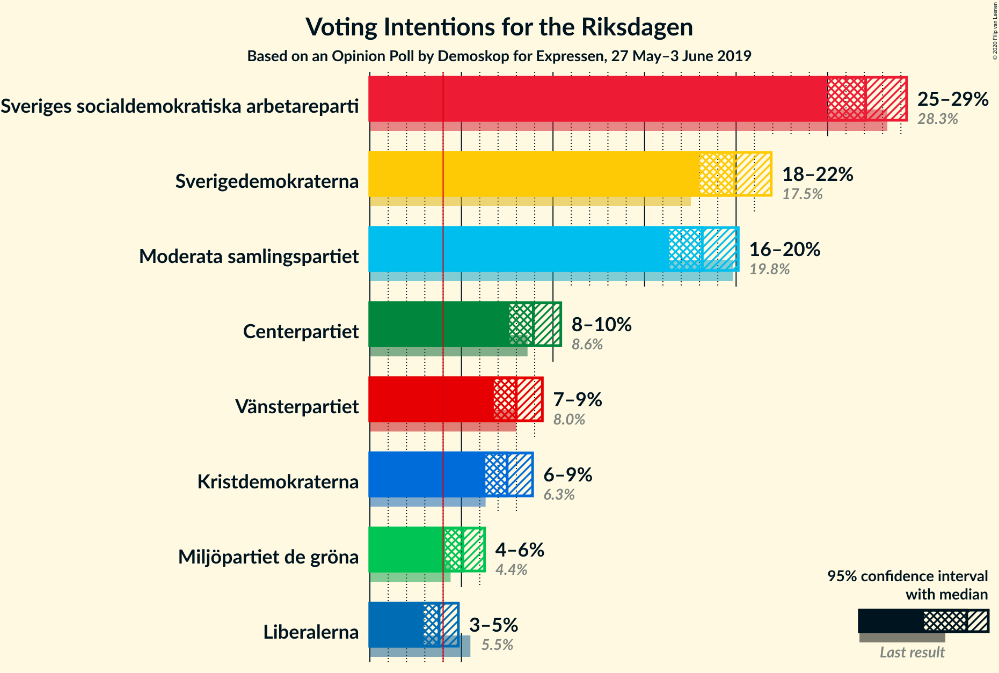
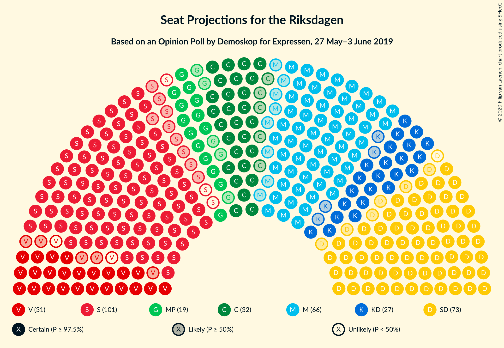
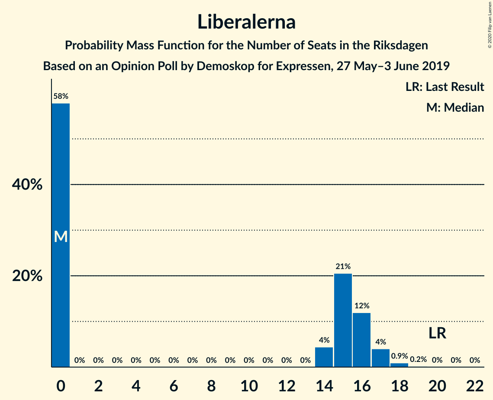
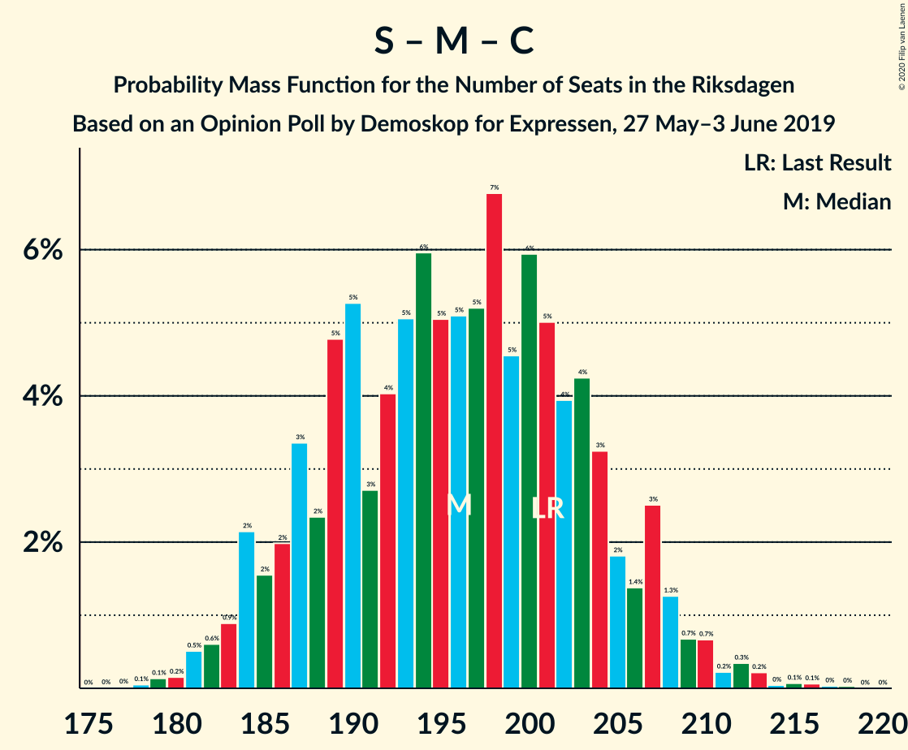
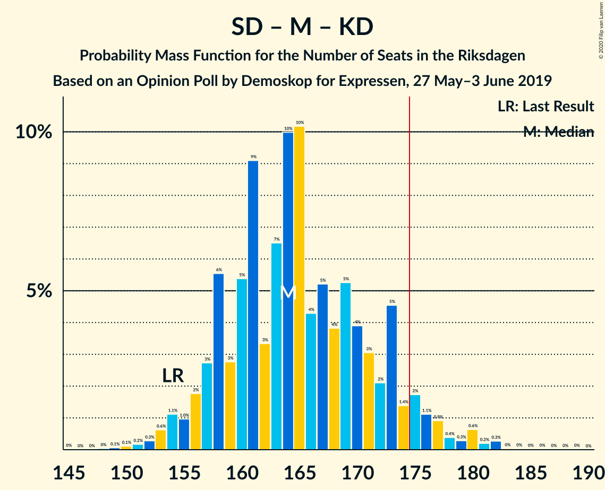

# Opinion Poll by Demoskop for Expressen, 27 May–3 June 2019

<a href="#voting-intentions">Voting Intentions</a> | <a href="#seats">Seats</a> | <a href="#coalitions">Coalitions</a> | <a href="#technical-information">Technical Information</a>

## Voting Intentions

### Confidence Intervals

| Party | Last Result | Poll Result | 80% Confidence Interval | 90% Confidence Interval | 95% Confidence Interval | 99% Confidence Interval |
|:-----:|:-----------:|:-----------:|:-----------------------:|:-----------------------:|:-----------------------:|:-----------------------:|
| Sveriges socialdemokratiska arbetareparti | 28.3% | 27.1% | 25.7–28.5% |25.3–28.9% |25.0–29.3% |24.3–30.0% |
| Sverigedemokraterna | 17.5% | 19.9% | 18.7–21.2% |18.3–21.6% |18.0–21.9% |17.4–22.6% |
| Moderata samlingspartiet | 19.8% | 18.2% | 17.0–19.4% |16.6–19.8% |16.3–20.1% |15.8–20.7% |
| Centerpartiet | 8.6% | 8.9% | 8.1–9.9% |7.8–10.2% |7.6–10.4% |7.2–10.9% |
| Vänsterpartiet | 8.0% | 8.0% | 7.2–8.9% |7.0–9.2% |6.8–9.4% |6.4–9.9% |
| Kristdemokraterna | 6.3% | 7.5% | 6.7–8.4% |6.5–8.7% |6.3–8.9% |5.9–9.3% |
| Miljöpartiet de gröna | 4.4% | 5.1% | 4.4–5.9% |4.3–6.1% |4.1–6.3% |3.8–6.7% |
| Liberalerna | 5.5% | 3.8% | 3.2–4.5% |3.1–4.7% |2.9–4.8% |2.7–5.2% |

*Note:* The poll result column reflects the actual value used in the calculations. Published results may vary slightly, and in addition be rounded to fewer digits.

## Seats

### Confidence Intervals

| Party | Last Result | Median | 80% Confidence Interval | 90% Confidence Interval | 95% Confidence Interval | 99% Confidence Interval |
|:-----:|:-----------:|:------:|:-----------------------:|:-----------------------:|:-----------------------:|:-----------------------:|
| <a href="#sveriges-socialdemokratiska-arbetareparti">Sveriges socialdemokratiska arbetareparti</a> | 100 | 98 | 91–104 |90–106 |89–107 |87–110 |
| <a href="#sverigedemokraterna">Sverigedemokraterna</a> | 62 | 72 | 67–77 |67–80 |66–81 |62–83 |
| <a href="#moderata-samlingspartiet">Moderata samlingspartiet</a> | 70 | 66 | 61–71 |60–72 |58–74 |56–76 |
| <a href="#centerpartiet">Centerpartiet</a> | 31 | 32 | 29–36 |28–37 |27–38 |26–40 |
| <a href="#vänsterpartiet">Vänsterpartiet</a> | 28 | 29 | 26–33 |25–34 |24–34 |23–36 |
| <a href="#kristdemokraterna">Kristdemokraterna</a> | 22 | 27 | 24–31 |24–32 |23–32 |21–34 |
| <a href="#miljöpartiet-de-gröna">Miljöpartiet de gröna</a> | 16 | 19 | 16–21 |15–22 |14–23 |0–25 |
| <a href="#liberalerna">Liberalerna</a> | 20 | 0 | 0–16 |0–17 |0–17 |0–18 |

### Sveriges socialdemokratiska arbetareparti

*For a full overview of the results for this party, see the [Sveriges socialdemokratiska arbetareparti](party-sverigessocialdemokratiskaarbetareparti.html) page.*

| Number of Seats | Probability | Accumulated | Special Marks |
|:---------------:|:-----------:|:-----------:|:-------------:|
| 84 | 0% | 100% |  |
| 85 | 0.1% | 99.9% |  |
| 86 | 0.3% | 99.9% |  |
| 87 | 0.4% | 99.6% |  |
| 88 | 1.2% | 99.1% |  |
| 89 | 1.3% | 98% |  |
| 90 | 4% | 97% |  |
| 91 | 3% | 93% |  |
| 92 | 7% | 90% |  |
| 93 | 7% | 82% |  |
| 94 | 6% | 75% |  |
| 95 | 7% | 69% |  |
| 96 | 5% | 62% |  |
| 97 | 4% | 57% |  |
| 98 | 5% | 53% | Median |
| 99 | 5% | 47% |  |
| 100 | 7% | 42% | Last Result |
| 101 | 8% | 36% |  |
| 102 | 8% | 28% |  |
| 103 | 6% | 20% |  |
| 104 | 5% | 14% |  |
| 105 | 4% | 9% |  |
| 106 | 2% | 5% |  |
| 107 | 1.2% | 3% |  |
| 108 | 1.1% | 2% |  |
| 109 | 0.3% | 0.9% |  |
| 110 | 0.2% | 0.5% |  |
| 111 | 0.1% | 0.3% |  |
| 112 | 0.1% | 0.2% |  |
| 113 | 0% | 0.1% |  |
| 114 | 0% | 0.1% |  |
| 115 | 0% | 0% |  |

### Sverigedemokraterna

*For a full overview of the results for this party, see the [Sverigedemokraterna](party-sverigedemokraterna.html) page.*

| Number of Seats | Probability | Accumulated | Special Marks |
|:---------------:|:-----------:|:-----------:|:-------------:|
| 60 | 0.1% | 100% |  |
| 61 | 0.1% | 99.9% |  |
| 62 | 0.3% | 99.7% | Last Result |
| 63 | 0.4% | 99.5% |  |
| 64 | 0.4% | 99.0% |  |
| 65 | 0.7% | 98.7% |  |
| 66 | 3% | 98% |  |
| 67 | 11% | 95% |  |
| 68 | 6% | 84% |  |
| 69 | 7% | 78% |  |
| 70 | 5% | 71% |  |
| 71 | 7% | 66% |  |
| 72 | 15% | 59% | Median |
| 73 | 18% | 44% |  |
| 74 | 4% | 26% |  |
| 75 | 8% | 22% |  |
| 76 | 3% | 14% |  |
| 77 | 2% | 12% |  |
| 78 | 2% | 9% |  |
| 79 | 2% | 7% |  |
| 80 | 2% | 6% |  |
| 81 | 2% | 3% |  |
| 82 | 0.5% | 1.2% |  |
| 83 | 0.4% | 0.6% |  |
| 84 | 0.1% | 0.2% |  |
| 85 | 0.1% | 0.2% |  |
| 86 | 0.1% | 0.1% |  |
| 87 | 0% | 0% |  |

### Moderata samlingspartiet

*For a full overview of the results for this party, see the [Moderata samlingspartiet](party-moderatasamlingspartiet.html) page.*

| Number of Seats | Probability | Accumulated | Special Marks |
|:---------------:|:-----------:|:-----------:|:-------------:|
| 54 | 0.1% | 100% |  |
| 55 | 0.2% | 99.9% |  |
| 56 | 0.3% | 99.7% |  |
| 57 | 0.9% | 99.4% |  |
| 58 | 2% | 98.5% |  |
| 59 | 2% | 97% |  |
| 60 | 3% | 95% |  |
| 61 | 4% | 92% |  |
| 62 | 7% | 88% |  |
| 63 | 8% | 80% |  |
| 64 | 10% | 72% |  |
| 65 | 9% | 62% |  |
| 66 | 12% | 54% | Median |
| 67 | 11% | 41% |  |
| 68 | 9% | 30% |  |
| 69 | 6% | 21% |  |
| 70 | 5% | 15% | Last Result |
| 71 | 4% | 10% |  |
| 72 | 2% | 6% |  |
| 73 | 1.2% | 4% |  |
| 74 | 1.1% | 3% |  |
| 75 | 0.9% | 1.5% |  |
| 76 | 0.3% | 0.6% |  |
| 77 | 0.2% | 0.4% |  |
| 78 | 0.1% | 0.2% |  |
| 79 | 0.1% | 0.1% |  |
| 80 | 0% | 0% |  |

### Centerpartiet

*For a full overview of the results for this party, see the [Centerpartiet](party-centerpartiet.html) page.*

| Number of Seats | Probability | Accumulated | Special Marks |
|:---------------:|:-----------:|:-----------:|:-------------:|
| 24 | 0.1% | 100% |  |
| 25 | 0.2% | 99.9% |  |
| 26 | 0.7% | 99.7% |  |
| 27 | 2% | 99.0% |  |
| 28 | 4% | 97% |  |
| 29 | 7% | 93% |  |
| 30 | 8% | 86% |  |
| 31 | 15% | 78% | Last Result |
| 32 | 15% | 63% | Median |
| 33 | 14% | 48% |  |
| 34 | 11% | 33% |  |
| 35 | 10% | 22% |  |
| 36 | 6% | 12% |  |
| 37 | 3% | 7% |  |
| 38 | 2% | 3% |  |
| 39 | 1.1% | 2% |  |
| 40 | 0.3% | 0.6% |  |
| 41 | 0.2% | 0.2% |  |
| 42 | 0% | 0.1% |  |
| 43 | 0% | 0% |  |

### Vänsterpartiet

*For a full overview of the results for this party, see the [Vänsterpartiet](party-vänsterpartiet.html) page.*

| Number of Seats | Probability | Accumulated | Special Marks |
|:---------------:|:-----------:|:-----------:|:-------------:|
| 21 | 0% | 100% |  |
| 22 | 0.2% | 99.9% |  |
| 23 | 0.7% | 99.8% |  |
| 24 | 3% | 99.1% |  |
| 25 | 5% | 96% |  |
| 26 | 10% | 91% |  |
| 27 | 12% | 81% |  |
| 28 | 12% | 69% | Last Result |
| 29 | 13% | 57% | Median |
| 30 | 11% | 44% |  |
| 31 | 13% | 33% |  |
| 32 | 7% | 19% |  |
| 33 | 6% | 12% |  |
| 34 | 3% | 6% |  |
| 35 | 2% | 2% |  |
| 36 | 0.4% | 0.7% |  |
| 37 | 0.1% | 0.2% |  |
| 38 | 0.1% | 0.1% |  |
| 39 | 0% | 0% |  |

### Kristdemokraterna

*For a full overview of the results for this party, see the [Kristdemokraterna](party-kristdemokraterna.html) page.*

| Number of Seats | Probability | Accumulated | Special Marks |
|:---------------:|:-----------:|:-----------:|:-------------:|
| 20 | 0.1% | 100% |  |
| 21 | 0.4% | 99.9% |  |
| 22 | 1.2% | 99.4% | Last Result |
| 23 | 3% | 98% |  |
| 24 | 9% | 95% |  |
| 25 | 10% | 87% |  |
| 26 | 18% | 77% |  |
| 27 | 17% | 59% | Median |
| 28 | 11% | 42% |  |
| 29 | 13% | 31% |  |
| 30 | 7% | 18% |  |
| 31 | 6% | 11% |  |
| 32 | 4% | 5% |  |
| 33 | 0.8% | 2% |  |
| 34 | 0.5% | 0.8% |  |
| 35 | 0.2% | 0.3% |  |
| 36 | 0% | 0.1% |  |
| 37 | 0% | 0% |  |

### Miljöpartiet de gröna

*For a full overview of the results for this party, see the [Miljöpartiet de gröna](party-miljöpartietdegröna.html) page.*

| Number of Seats | Probability | Accumulated | Special Marks |
|:---------------:|:-----------:|:-----------:|:-------------:|
| 0 | 2% | 100% |  |
| 1 | 0% | 98% |  |
| 2 | 0% | 98% |  |
| 3 | 0% | 98% |  |
| 4 | 0% | 98% |  |
| 5 | 0% | 98% |  |
| 6 | 0% | 98% |  |
| 7 | 0% | 98% |  |
| 8 | 0% | 98% |  |
| 9 | 0% | 98% |  |
| 10 | 0% | 98% |  |
| 11 | 0% | 98% |  |
| 12 | 0% | 98% |  |
| 13 | 0% | 98% |  |
| 14 | 0.3% | 98% |  |
| 15 | 6% | 97% |  |
| 16 | 9% | 92% | Last Result |
| 17 | 13% | 83% |  |
| 18 | 18% | 70% |  |
| 19 | 19% | 52% | Median |
| 20 | 15% | 33% |  |
| 21 | 11% | 18% |  |
| 22 | 4% | 7% |  |
| 23 | 2% | 3% |  |
| 24 | 0.9% | 1.5% |  |
| 25 | 0.4% | 0.5% |  |
| 26 | 0.1% | 0.2% |  |
| 27 | 0% | 0% |  |

### Liberalerna

*For a full overview of the results for this party, see the [Liberalerna](party-liberalerna.html) page.*

| Number of Seats | Probability | Accumulated | Special Marks |
|:---------------:|:-----------:|:-----------:|:-------------:|
| 0 | 58% | 100% | Median |
| 1 | 0% | 42% |  |
| 2 | 0% | 42% |  |
| 3 | 0% | 42% |  |
| 4 | 0% | 42% |  |
| 5 | 0% | 42% |  |
| 6 | 0% | 42% |  |
| 7 | 0% | 42% |  |
| 8 | 0% | 42% |  |
| 9 | 0% | 42% |  |
| 10 | 0% | 42% |  |
| 11 | 0% | 42% |  |
| 12 | 0% | 42% |  |
| 13 | 0% | 42% |  |
| 14 | 4% | 42% |  |
| 15 | 21% | 38% |  |
| 16 | 12% | 17% |  |
| 17 | 4% | 5% |  |
| 18 | 0.9% | 1.2% |  |
| 19 | 0.2% | 0.3% |  |
| 20 | 0% | 0.1% | Last Result |
| 21 | 0% | 0% |  |

## Coalitions

### Confidence Intervals

| Coalition | Last Result | Median | Majority? | 80% Confidence Interval | 90% Confidence Interval | 95% Confidence Interval | 99% Confidence Interval |
|:---------:|:-----------:|:------:|:---------:|:-----------------------:|:-----------------------:|:-----------------------:|:-----------------------:|
| Sveriges socialdemokratiska arbetareparti – Moderata samlingspartiet – Centerpartiet | 201 | 196 | 100% | 187–204 | 185–207 | 184–208 | 181–212 |
| Sveriges socialdemokratiska arbetareparti – Centerpartiet – Vänsterpartiet – Miljöpartiet de gröna – Liberalerna | 195 | 185 | 94% | 176–191 | 174–193 | 172–194 | 168–197 |
| Sverigedemokraterna – Moderata samlingspartiet – Kristdemokraterna | 154 | 164 | 6% | 158–173 | 156–175 | 155–177 | 152–181 |
| Sveriges socialdemokratiska arbetareparti – Moderata samlingspartiet | 170 | 164 | 3% | 155–172 | 153–173 | 153–175 | 150–179 |
| Sveriges socialdemokratiska arbetareparti – Centerpartiet – Miljöpartiet de gröna – Liberalerna | 167 | 155 | 0% | 147–163 | 145–164 | 143–166 | 138–169 |
| Sveriges socialdemokratiska arbetareparti – Vänsterpartiet – Miljöpartiet de gröna | 144 | 145 | 0% | 137–154 | 135–156 | 135–157 | 132–159 |
| Sverigedemokraterna – Moderata samlingspartiet | 132 | 138 | 0% | 131–144 | 129–147 | 128–149 | 125–153 |
| Moderata samlingspartiet – Centerpartiet – Kristdemokraterna – Liberalerna | 143 | 132 | 0% | 123–141 | 122–143 | 120–145 | 118–148 |
| Sveriges socialdemokratiska arbetareparti – Vänsterpartiet | 128 | 127 | 0% | 119–135 | 118–136 | 117–137 | 115–140 |
| Moderata samlingspartiet – Centerpartiet – Kristdemokraterna | 123 | 125 | 0% | 119–132 | 117–134 | 116–136 | 113–138 |
| Sveriges socialdemokratiska arbetareparti – Miljöpartiet de gröna | 116 | 116 | 0% | 109–123 | 107–125 | 105–127 | 102–129 |
| Moderata samlingspartiet – Centerpartiet – Liberalerna | 121 | 104 | 0% | 96–115 | 94–116 | 92–117 | 91–121 |
| Moderata samlingspartiet – Centerpartiet | 101 | 98 | 0% | 92–104 | 91–105 | 89–107 | 87–110 |

### Sveriges socialdemokratiska arbetareparti – Moderata samlingspartiet – Centerpartiet

| Number of Seats | Probability | Accumulated | Special Marks |
|:---------------:|:-----------:|:-----------:|:-------------:|
| 178 | 0.1% | 100% |  |
| 179 | 0.1% | 99.9% |  |
| 180 | 0.2% | 99.8% |  |
| 181 | 0.5% | 99.6% |  |
| 182 | 0.6% | 99.1% |  |
| 183 | 0.9% | 98.5% |  |
| 184 | 2% | 98% |  |
| 185 | 2% | 95% |  |
| 186 | 2% | 94% |  |
| 187 | 3% | 92% |  |
| 188 | 2% | 89% |  |
| 189 | 5% | 86% |  |
| 190 | 5% | 81% |  |
| 191 | 3% | 76% |  |
| 192 | 4% | 73% |  |
| 193 | 5% | 69% |  |
| 194 | 6% | 64% |  |
| 195 | 5% | 58% |  |
| 196 | 5% | 53% | Median |
| 197 | 5% | 48% |  |
| 198 | 7% | 43% |  |
| 199 | 5% | 36% |  |
| 200 | 6% | 32% |  |
| 201 | 5% | 26% | Last Result |
| 202 | 4% | 21% |  |
| 203 | 4% | 17% |  |
| 204 | 3% | 13% |  |
| 205 | 2% | 9% |  |
| 206 | 1.4% | 8% |  |
| 207 | 3% | 6% |  |
| 208 | 1.3% | 4% |  |
| 209 | 0.7% | 2% |  |
| 210 | 0.7% | 2% |  |
| 211 | 0.2% | 1.0% |  |
| 212 | 0.3% | 0.8% |  |
| 213 | 0.2% | 0.5% |  |
| 214 | 0% | 0.3% |  |
| 215 | 0.1% | 0.2% |  |
| 216 | 0.1% | 0.1% |  |
| 217 | 0% | 0.1% |  |
| 218 | 0% | 0.1% |  |
| 219 | 0% | 0% |  |

### Sveriges socialdemokratiska arbetareparti – Centerpartiet – Vänsterpartiet – Miljöpartiet de gröna – Liberalerna

| Number of Seats | Probability | Accumulated | Special Marks |
|:---------------:|:-----------:|:-----------:|:-------------:|
| 163 | 0% | 100% |  |
| 164 | 0% | 99.9% |  |
| 165 | 0% | 99.9% |  |
| 166 | 0% | 99.9% |  |
| 167 | 0.3% | 99.8% |  |
| 168 | 0.2% | 99.6% |  |
| 169 | 0.6% | 99.4% |  |
| 170 | 0.3% | 98.7% |  |
| 171 | 0.4% | 98% |  |
| 172 | 0.9% | 98% |  |
| 173 | 1.1% | 97% |  |
| 174 | 2% | 96% |  |
| 175 | 1.4% | 94% | Majority |
| 176 | 5% | 93% |  |
| 177 | 2% | 88% |  |
| 178 | 3% | 86% | Median |
| 179 | 4% | 83% |  |
| 180 | 5% | 79% |  |
| 181 | 4% | 74% |  |
| 182 | 5% | 70% |  |
| 183 | 4% | 65% |  |
| 184 | 10% | 61% |  |
| 185 | 10% | 51% |  |
| 186 | 7% | 41% |  |
| 187 | 3% | 34% |  |
| 188 | 9% | 31% |  |
| 189 | 5% | 22% |  |
| 190 | 3% | 16% |  |
| 191 | 6% | 13% |  |
| 192 | 3% | 8% |  |
| 193 | 2% | 5% |  |
| 194 | 1.0% | 3% |  |
| 195 | 1.1% | 2% | Last Result |
| 196 | 0.6% | 1.3% |  |
| 197 | 0.3% | 0.7% |  |
| 198 | 0.2% | 0.4% |  |
| 199 | 0.1% | 0.2% |  |
| 200 | 0.1% | 0.1% |  |
| 201 | 0% | 0.1% |  |
| 202 | 0% | 0% |  |

### Sverigedemokraterna – Moderata samlingspartiet – Kristdemokraterna

| Number of Seats | Probability | Accumulated | Special Marks |
|:---------------:|:-----------:|:-----------:|:-------------:|
| 148 | 0% | 100% |  |
| 149 | 0.1% | 99.9% |  |
| 150 | 0.1% | 99.9% |  |
| 151 | 0.2% | 99.8% |  |
| 152 | 0.3% | 99.6% |  |
| 153 | 0.6% | 99.3% |  |
| 154 | 1.1% | 98.7% | Last Result |
| 155 | 1.0% | 98% |  |
| 156 | 2% | 97% |  |
| 157 | 3% | 95% |  |
| 158 | 6% | 92% |  |
| 159 | 3% | 87% |  |
| 160 | 5% | 84% |  |
| 161 | 9% | 78% |  |
| 162 | 3% | 69% |  |
| 163 | 7% | 66% |  |
| 164 | 10% | 59% |  |
| 165 | 10% | 49% | Median |
| 166 | 4% | 39% |  |
| 167 | 5% | 35% |  |
| 168 | 4% | 30% |  |
| 169 | 5% | 26% |  |
| 170 | 4% | 21% |  |
| 171 | 3% | 17% |  |
| 172 | 2% | 14% |  |
| 173 | 5% | 12% |  |
| 174 | 1.4% | 7% |  |
| 175 | 2% | 6% | Majority |
| 176 | 1.1% | 4% |  |
| 177 | 0.9% | 3% |  |
| 178 | 0.4% | 2% |  |
| 179 | 0.3% | 2% |  |
| 180 | 0.6% | 1.3% |  |
| 181 | 0.2% | 0.6% |  |
| 182 | 0.3% | 0.4% |  |
| 183 | 0% | 0.2% |  |
| 184 | 0% | 0.1% |  |
| 185 | 0% | 0.1% |  |
| 186 | 0% | 0.1% |  |
| 187 | 0% | 0% |  |

### Sveriges socialdemokratiska arbetareparti – Moderata samlingspartiet

| Number of Seats | Probability | Accumulated | Special Marks |
|:---------------:|:-----------:|:-----------:|:-------------:|
| 147 | 0.1% | 100% |  |
| 148 | 0.1% | 99.9% |  |
| 149 | 0.1% | 99.8% |  |
| 150 | 0.4% | 99.7% |  |
| 151 | 1.2% | 99.4% |  |
| 152 | 0.1% | 98% |  |
| 153 | 4% | 98% |  |
| 154 | 2% | 94% |  |
| 155 | 4% | 92% |  |
| 156 | 4% | 88% |  |
| 157 | 8% | 84% |  |
| 158 | 2% | 76% |  |
| 159 | 5% | 74% |  |
| 160 | 4% | 69% |  |
| 161 | 5% | 65% |  |
| 162 | 3% | 60% |  |
| 163 | 6% | 57% |  |
| 164 | 2% | 51% | Median |
| 165 | 5% | 48% |  |
| 166 | 6% | 43% |  |
| 167 | 4% | 36% |  |
| 168 | 9% | 33% |  |
| 169 | 5% | 24% |  |
| 170 | 5% | 19% | Last Result |
| 171 | 3% | 13% |  |
| 172 | 2% | 10% |  |
| 173 | 3% | 8% |  |
| 174 | 2% | 5% |  |
| 175 | 1.0% | 3% | Majority |
| 176 | 0.7% | 2% |  |
| 177 | 0.6% | 1.4% |  |
| 178 | 0.2% | 0.8% |  |
| 179 | 0.1% | 0.6% |  |
| 180 | 0.2% | 0.4% |  |
| 181 | 0.1% | 0.2% |  |
| 182 | 0.1% | 0.1% |  |
| 183 | 0% | 0.1% |  |
| 184 | 0% | 0% |  |

### Sveriges socialdemokratiska arbetareparti – Centerpartiet – Miljöpartiet de gröna – Liberalerna

| Number of Seats | Probability | Accumulated | Special Marks |
|:---------------:|:-----------:|:-----------:|:-------------:|
| 133 | 0.1% | 100% |  |
| 134 | 0% | 99.8% |  |
| 135 | 0% | 99.8% |  |
| 136 | 0.1% | 99.8% |  |
| 137 | 0% | 99.7% |  |
| 138 | 0.5% | 99.6% |  |
| 139 | 0.2% | 99.2% |  |
| 140 | 0.5% | 99.0% |  |
| 141 | 0.4% | 98.5% |  |
| 142 | 0.4% | 98% |  |
| 143 | 0.7% | 98% |  |
| 144 | 1.5% | 97% |  |
| 145 | 2% | 95% |  |
| 146 | 2% | 94% |  |
| 147 | 4% | 91% |  |
| 148 | 3% | 88% |  |
| 149 | 3% | 85% | Median |
| 150 | 5% | 81% |  |
| 151 | 5% | 77% |  |
| 152 | 5% | 71% |  |
| 153 | 5% | 66% |  |
| 154 | 5% | 61% |  |
| 155 | 7% | 56% |  |
| 156 | 7% | 49% |  |
| 157 | 5% | 42% |  |
| 158 | 7% | 37% |  |
| 159 | 5% | 30% |  |
| 160 | 5% | 25% |  |
| 161 | 5% | 20% |  |
| 162 | 5% | 15% |  |
| 163 | 2% | 10% |  |
| 164 | 3% | 8% |  |
| 165 | 2% | 5% |  |
| 166 | 1.0% | 3% |  |
| 167 | 0.9% | 2% | Last Result |
| 168 | 0.3% | 1.2% |  |
| 169 | 0.4% | 0.8% |  |
| 170 | 0.2% | 0.4% |  |
| 171 | 0.1% | 0.2% |  |
| 172 | 0.1% | 0.1% |  |
| 173 | 0% | 0.1% |  |
| 174 | 0% | 0% |  |

### Sveriges socialdemokratiska arbetareparti – Vänsterpartiet – Miljöpartiet de gröna

| Number of Seats | Probability | Accumulated | Special Marks |
|:---------------:|:-----------:|:-----------:|:-------------:|
| 126 | 0% | 100% |  |
| 127 | 0% | 99.9% |  |
| 128 | 0.1% | 99.9% |  |
| 129 | 0% | 99.9% |  |
| 130 | 0.1% | 99.8% |  |
| 131 | 0.2% | 99.7% |  |
| 132 | 0.3% | 99.6% |  |
| 133 | 0.5% | 99.3% |  |
| 134 | 1.2% | 98.8% |  |
| 135 | 4% | 98% |  |
| 136 | 3% | 94% |  |
| 137 | 6% | 91% |  |
| 138 | 5% | 85% |  |
| 139 | 5% | 81% |  |
| 140 | 5% | 76% |  |
| 141 | 5% | 71% |  |
| 142 | 5% | 66% |  |
| 143 | 5% | 61% |  |
| 144 | 6% | 56% | Last Result |
| 145 | 4% | 51% |  |
| 146 | 5% | 46% | Median |
| 147 | 5% | 42% |  |
| 148 | 4% | 37% |  |
| 149 | 3% | 33% |  |
| 150 | 5% | 30% |  |
| 151 | 3% | 25% |  |
| 152 | 5% | 22% |  |
| 153 | 3% | 17% |  |
| 154 | 5% | 14% |  |
| 155 | 4% | 9% |  |
| 156 | 2% | 6% |  |
| 157 | 2% | 3% |  |
| 158 | 1.0% | 2% |  |
| 159 | 0.4% | 0.8% |  |
| 160 | 0.2% | 0.5% |  |
| 161 | 0.1% | 0.2% |  |
| 162 | 0.1% | 0.1% |  |
| 163 | 0% | 0% |  |

### Sverigedemokraterna – Moderata samlingspartiet

| Number of Seats | Probability | Accumulated | Special Marks |
|:---------------:|:-----------:|:-----------:|:-------------:|
| 122 | 0.1% | 100% |  |
| 123 | 0.1% | 99.9% |  |
| 124 | 0.1% | 99.8% |  |
| 125 | 0.2% | 99.7% |  |
| 126 | 0.3% | 99.5% |  |
| 127 | 1.2% | 99.2% |  |
| 128 | 1.5% | 98% |  |
| 129 | 2% | 97% |  |
| 130 | 2% | 94% |  |
| 131 | 2% | 92% |  |
| 132 | 4% | 90% | Last Result |
| 133 | 7% | 86% |  |
| 134 | 8% | 78% |  |
| 135 | 6% | 70% |  |
| 136 | 5% | 64% |  |
| 137 | 7% | 59% |  |
| 138 | 10% | 52% | Median |
| 139 | 10% | 42% |  |
| 140 | 5% | 32% |  |
| 141 | 5% | 27% |  |
| 142 | 5% | 22% |  |
| 143 | 5% | 18% |  |
| 144 | 3% | 12% |  |
| 145 | 2% | 9% |  |
| 146 | 2% | 7% |  |
| 147 | 2% | 5% |  |
| 148 | 0.8% | 3% |  |
| 149 | 0.6% | 3% |  |
| 150 | 0.7% | 2% |  |
| 151 | 0.3% | 1.3% |  |
| 152 | 0.4% | 1.0% |  |
| 153 | 0.2% | 0.6% |  |
| 154 | 0.1% | 0.3% |  |
| 155 | 0.1% | 0.2% |  |
| 156 | 0% | 0.1% |  |
| 157 | 0% | 0.1% |  |
| 158 | 0% | 0% |  |

### Moderata samlingspartiet – Centerpartiet – Kristdemokraterna – Liberalerna

| Number of Seats | Probability | Accumulated | Special Marks |
|:---------------:|:-----------:|:-----------:|:-------------:|
| 114 | 0.1% | 100% |  |
| 115 | 0.1% | 99.9% |  |
| 116 | 0.1% | 99.9% |  |
| 117 | 0.1% | 99.8% |  |
| 118 | 0.5% | 99.6% |  |
| 119 | 0.7% | 99.2% |  |
| 120 | 1.1% | 98% |  |
| 121 | 2% | 97% |  |
| 122 | 5% | 96% |  |
| 123 | 3% | 91% |  |
| 124 | 4% | 88% |  |
| 125 | 6% | 84% | Median |
| 126 | 5% | 78% |  |
| 127 | 5% | 73% |  |
| 128 | 5% | 68% |  |
| 129 | 2% | 62% |  |
| 130 | 3% | 60% |  |
| 131 | 4% | 56% |  |
| 132 | 6% | 53% |  |
| 133 | 5% | 47% |  |
| 134 | 4% | 41% |  |
| 135 | 5% | 37% |  |
| 136 | 4% | 32% |  |
| 137 | 4% | 28% |  |
| 138 | 2% | 24% |  |
| 139 | 5% | 22% |  |
| 140 | 3% | 17% |  |
| 141 | 4% | 14% |  |
| 142 | 3% | 10% |  |
| 143 | 3% | 7% | Last Result |
| 144 | 1.0% | 4% |  |
| 145 | 1.5% | 3% |  |
| 146 | 0.5% | 1.4% |  |
| 147 | 0.4% | 0.9% |  |
| 148 | 0.2% | 0.5% |  |
| 149 | 0.2% | 0.3% |  |
| 150 | 0% | 0.1% |  |
| 151 | 0% | 0.1% |  |
| 152 | 0% | 0% |  |

### Sveriges socialdemokratiska arbetareparti – Vänsterpartiet

| Number of Seats | Probability | Accumulated | Special Marks |
|:---------------:|:-----------:|:-----------:|:-------------:|
| 112 | 0% | 100% |  |
| 113 | 0.1% | 99.9% |  |
| 114 | 0.2% | 99.8% |  |
| 115 | 0.6% | 99.6% |  |
| 116 | 1.4% | 98.9% |  |
| 117 | 2% | 98% |  |
| 118 | 6% | 96% |  |
| 119 | 3% | 90% |  |
| 120 | 5% | 87% |  |
| 121 | 4% | 82% |  |
| 122 | 7% | 77% |  |
| 123 | 5% | 71% |  |
| 124 | 5% | 66% |  |
| 125 | 4% | 60% |  |
| 126 | 4% | 57% |  |
| 127 | 5% | 53% | Median |
| 128 | 4% | 48% | Last Result |
| 129 | 4% | 43% |  |
| 130 | 6% | 39% |  |
| 131 | 7% | 33% |  |
| 132 | 4% | 26% |  |
| 133 | 6% | 22% |  |
| 134 | 4% | 16% |  |
| 135 | 4% | 12% |  |
| 136 | 3% | 8% |  |
| 137 | 2% | 5% |  |
| 138 | 1.2% | 2% |  |
| 139 | 0.6% | 1.2% |  |
| 140 | 0.2% | 0.6% |  |
| 141 | 0.1% | 0.4% |  |
| 142 | 0.1% | 0.2% |  |
| 143 | 0% | 0.1% |  |
| 144 | 0% | 0.1% |  |
| 145 | 0% | 0.1% |  |
| 146 | 0% | 0% |  |

### Moderata samlingspartiet – Centerpartiet – Kristdemokraterna

| Number of Seats | Probability | Accumulated | Special Marks |
|:---------------:|:-----------:|:-----------:|:-------------:|
| 110 | 0.1% | 100% |  |
| 111 | 0.1% | 99.9% |  |
| 112 | 0.2% | 99.8% |  |
| 113 | 0.3% | 99.6% |  |
| 114 | 0.6% | 99.3% |  |
| 115 | 0.7% | 98.7% |  |
| 116 | 1.5% | 98% |  |
| 117 | 3% | 96% |  |
| 118 | 2% | 93% |  |
| 119 | 5% | 91% |  |
| 120 | 4% | 86% |  |
| 121 | 4% | 83% |  |
| 122 | 7% | 79% |  |
| 123 | 5% | 71% | Last Result |
| 124 | 10% | 66% |  |
| 125 | 7% | 57% | Median |
| 126 | 10% | 49% |  |
| 127 | 7% | 39% |  |
| 128 | 8% | 32% |  |
| 129 | 3% | 24% |  |
| 130 | 4% | 21% |  |
| 131 | 3% | 17% |  |
| 132 | 4% | 13% |  |
| 133 | 3% | 9% |  |
| 134 | 2% | 7% |  |
| 135 | 2% | 5% |  |
| 136 | 2% | 3% |  |
| 137 | 0.7% | 1.3% |  |
| 138 | 0.3% | 0.7% |  |
| 139 | 0.1% | 0.4% |  |
| 140 | 0.1% | 0.3% |  |
| 141 | 0.1% | 0.1% |  |
| 142 | 0% | 0.1% |  |
| 143 | 0% | 0% |  |

### Sveriges socialdemokratiska arbetareparti – Miljöpartiet de gröna

| Number of Seats | Probability | Accumulated | Special Marks |
|:---------------:|:-----------:|:-----------:|:-------------:|
| 96 | 0% | 100% |  |
| 97 | 0% | 99.9% |  |
| 98 | 0% | 99.9% |  |
| 99 | 0.1% | 99.9% |  |
| 100 | 0.1% | 99.8% |  |
| 101 | 0.1% | 99.7% |  |
| 102 | 0.3% | 99.6% |  |
| 103 | 0.4% | 99.3% |  |
| 104 | 0.5% | 98.9% |  |
| 105 | 1.0% | 98% |  |
| 106 | 2% | 97% |  |
| 107 | 3% | 96% |  |
| 108 | 2% | 93% |  |
| 109 | 3% | 90% |  |
| 110 | 3% | 87% |  |
| 111 | 7% | 84% |  |
| 112 | 7% | 77% |  |
| 113 | 8% | 70% |  |
| 114 | 6% | 63% |  |
| 115 | 5% | 57% |  |
| 116 | 3% | 52% | Last Result |
| 117 | 6% | 48% | Median |
| 118 | 8% | 43% |  |
| 119 | 6% | 35% |  |
| 120 | 4% | 29% |  |
| 121 | 5% | 25% |  |
| 122 | 4% | 20% |  |
| 123 | 7% | 16% |  |
| 124 | 3% | 10% |  |
| 125 | 2% | 6% |  |
| 126 | 1.3% | 4% |  |
| 127 | 1.5% | 3% |  |
| 128 | 0.4% | 2% |  |
| 129 | 0.9% | 1.3% |  |
| 130 | 0.2% | 0.5% |  |
| 131 | 0.1% | 0.2% |  |
| 132 | 0.1% | 0.1% |  |
| 133 | 0.1% | 0.1% |  |
| 134 | 0% | 0% |  |

### Moderata samlingspartiet – Centerpartiet – Liberalerna

| Number of Seats | Probability | Accumulated | Special Marks |
|:---------------:|:-----------:|:-----------:|:-------------:|
| 88 | 0.1% | 100% |  |
| 89 | 0.1% | 99.9% |  |
| 90 | 0.2% | 99.8% |  |
| 91 | 0.7% | 99.5% |  |
| 92 | 1.4% | 98.9% |  |
| 93 | 0.9% | 97% |  |
| 94 | 2% | 97% |  |
| 95 | 4% | 95% |  |
| 96 | 4% | 91% |  |
| 97 | 4% | 86% |  |
| 98 | 3% | 82% | Median |
| 99 | 8% | 79% |  |
| 100 | 5% | 71% |  |
| 101 | 5% | 66% |  |
| 102 | 6% | 62% |  |
| 103 | 3% | 55% |  |
| 104 | 5% | 52% |  |
| 105 | 4% | 48% |  |
| 106 | 3% | 44% |  |
| 107 | 3% | 40% |  |
| 108 | 4% | 37% |  |
| 109 | 3% | 33% |  |
| 110 | 5% | 30% |  |
| 111 | 3% | 25% |  |
| 112 | 4% | 22% |  |
| 113 | 5% | 17% |  |
| 114 | 2% | 13% |  |
| 115 | 5% | 11% |  |
| 116 | 2% | 6% |  |
| 117 | 2% | 4% |  |
| 118 | 0.4% | 2% |  |
| 119 | 0.9% | 2% |  |
| 120 | 0.4% | 0.9% |  |
| 121 | 0.3% | 0.5% | Last Result |
| 122 | 0.2% | 0.3% |  |
| 123 | 0.1% | 0.1% |  |
| 124 | 0% | 0.1% |  |
| 125 | 0% | 0% |  |

### Moderata samlingspartiet – Centerpartiet

| Number of Seats | Probability | Accumulated | Special Marks |
|:---------------:|:-----------:|:-----------:|:-------------:|
| 84 | 0% | 100% |  |
| 85 | 0.1% | 99.9% |  |
| 86 | 0.2% | 99.8% |  |
| 87 | 0.5% | 99.6% |  |
| 88 | 0.7% | 99.1% |  |
| 89 | 0.9% | 98% |  |
| 90 | 2% | 97% |  |
| 91 | 3% | 96% |  |
| 92 | 3% | 92% |  |
| 93 | 4% | 89% |  |
| 94 | 6% | 86% |  |
| 95 | 8% | 79% |  |
| 96 | 7% | 71% |  |
| 97 | 9% | 65% |  |
| 98 | 8% | 55% | Median |
| 99 | 9% | 48% |  |
| 100 | 9% | 38% |  |
| 101 | 6% | 29% | Last Result |
| 102 | 7% | 23% |  |
| 103 | 4% | 16% |  |
| 104 | 4% | 13% |  |
| 105 | 3% | 8% |  |
| 106 | 1.5% | 5% |  |
| 107 | 1.0% | 3% |  |
| 108 | 1.1% | 2% |  |
| 109 | 0.5% | 1.2% |  |
| 110 | 0.3% | 0.7% |  |
| 111 | 0.2% | 0.4% |  |
| 112 | 0.1% | 0.2% |  |
| 113 | 0% | 0.1% |  |
| 114 | 0% | 0.1% |  |
| 115 | 0% | 0% |  |

## Technical Information

### Opinion Poll

+ **Polling firm:** Demoskop
+ **Commissioner(s):** Expressen
+ **Fieldwork period:** 27 May–3 June 2019

### Calculations

+ **Sample size:** 1614
+ **Simulations done:** 1,048,576
+ **Error estimate:** 1.11%

