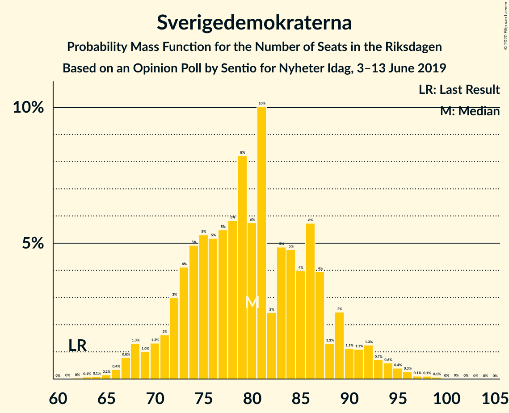
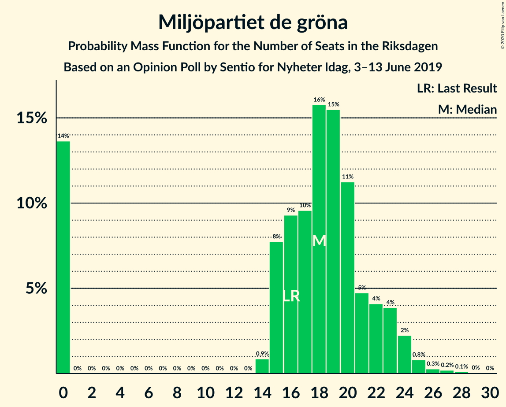
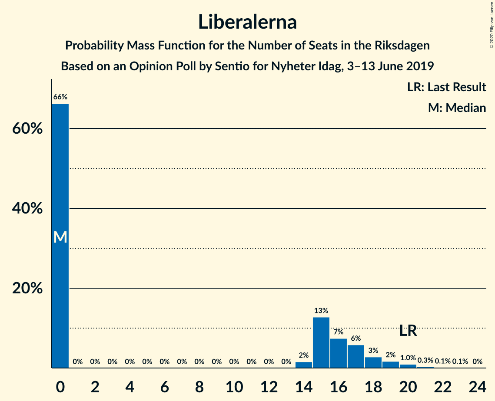
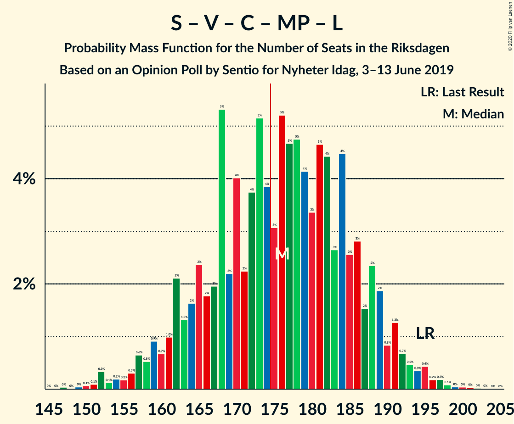
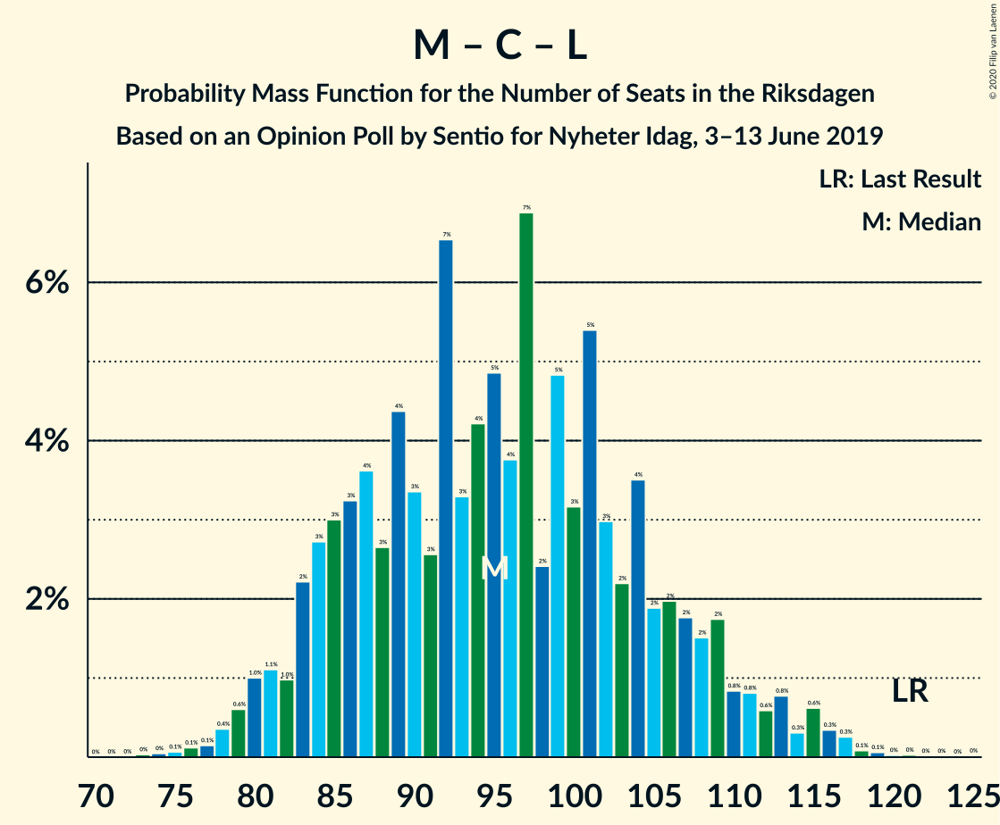

# Opinion Poll by Sentio for Nyheter Idag, 3–13 June 2019

<a href="#voting-intentions">Voting Intentions</a> | <a href="#seats">Seats</a> | <a href="#coalitions">Coalitions</a> | <a href="#technical-information">Technical Information</a>

## Voting Intentions

### Confidence Intervals

| Party | Last Result | Poll Result | 80% Confidence Interval | 90% Confidence Interval | 95% Confidence Interval | 99% Confidence Interval |
|:-----:|:-----------:|:-----------:|:-----------------------:|:-----------------------:|:-----------------------:|:-----------------------:|
| Sveriges socialdemokratiska arbetareparti | 28.3% | 25.7% | 23.8–27.8% |23.3–28.4% |22.8–28.9% |21.9–29.9% |
| Sverigedemokraterna | 17.5% | 21.8% | 20.0–23.8% |19.5–24.3% |19.1–24.8% |18.2–25.8% |
| Moderata samlingspartiet | 19.8% | 17.0% | 15.4–18.8% |14.9–19.3% |14.5–19.8% |13.8–20.7% |
| Vänsterpartiet | 8.0% | 8.7% | 7.6–10.2% |7.2–10.6% |7.0–10.9% |6.4–11.6% |
| Kristdemokraterna | 6.3% | 7.9% | 6.8–9.2% |6.4–9.6% |6.2–10.0% |5.7–10.6% |
| Centerpartiet | 8.6% | 7.4% | 6.3–8.7% |6.0–9.1% |5.7–9.4% |5.3–10.1% |
| Miljöpartiet de gröna | 4.4% | 4.8% | 4.0–5.9% |3.7–6.3% |3.5–6.6% |3.2–7.1% |
| Liberalerna | 5.5% | 3.7% | 2.9–4.7% |2.7–5.0% |2.6–5.2% |2.3–5.8% |

*Note:* The poll result column reflects the actual value used in the calculations. Published results may vary slightly, and in addition be rounded to fewer digits.

## Seats

### Confidence Intervals

| Party | Last Result | Median | 80% Confidence Interval | 90% Confidence Interval | 95% Confidence Interval | 99% Confidence Interval |
|:-----:|:-----------:|:------:|:-----------------------:|:-----------------------:|:-----------------------:|:-----------------------:|
| <a href="#sveriges-socialdemokratiska-arbetareparti">Sveriges socialdemokratiska arbetareparti</a> | 100 | 98 | 89–105 |85–107 |82–107 |77–113 |
| <a href="#sverigedemokraterna">Sverigedemokraterna</a> | 62 | 78 | 72–87 |69–93 |67–93 |65–97 |
| <a href="#moderata-samlingspartiet">Moderata samlingspartiet</a> | 70 | 64 | 56–72 |55–74 |53–74 |49–76 |
| <a href="#vänsterpartiet">Vänsterpartiet</a> | 28 | 31 | 27–35 |25–37 |25–40 |24–43 |
| <a href="#kristdemokraterna">Kristdemokraterna</a> | 22 | 28 | 26–34 |24–36 |23–38 |21–39 |
| <a href="#centerpartiet">Centerpartiet</a> | 31 | 26 | 22–31 |22–32 |20–34 |19–36 |
| <a href="#miljöpartiet-de-gröna">Miljöpartiet de gröna</a> | 16 | 19 | 15–21 |0–23 |0–24 |0–25 |
| <a href="#liberalerna">Liberalerna</a> | 20 | 0 | 0–16 |0–18 |0–18 |0–21 |

### Sveriges socialdemokratiska arbetareparti

*For a full overview of the results for this party, see the [Sveriges socialdemokratiska arbetareparti](party-sverigessocialdemokratiskaarbetareparti.html) page.*

| Number of Seats | Probability | Accumulated | Special Marks |
|:---------------:|:-----------:|:-----------:|:-------------:|
| 75 | 0% | 100% |  |
| 76 | 0% | 99.9% |  |
| 77 | 0.7% | 99.9% |  |
| 78 | 0.3% | 99.2% |  |
| 79 | 0.1% | 98.9% |  |
| 80 | 0.5% | 98.8% |  |
| 81 | 0.4% | 98% |  |
| 82 | 1.1% | 98% |  |
| 83 | 0.5% | 97% |  |
| 84 | 1.1% | 96% |  |
| 85 | 0.9% | 95% |  |
| 86 | 1.0% | 94% |  |
| 87 | 0.5% | 93% |  |
| 88 | 2% | 93% |  |
| 89 | 3% | 91% |  |
| 90 | 2% | 87% |  |
| 91 | 3% | 85% |  |
| 92 | 6% | 83% |  |
| 93 | 5% | 77% |  |
| 94 | 14% | 72% |  |
| 95 | 4% | 58% |  |
| 96 | 2% | 54% |  |
| 97 | 0.9% | 52% |  |
| 98 | 6% | 51% | Median |
| 99 | 3% | 45% |  |
| 100 | 3% | 42% | Last Result |
| 101 | 11% | 39% |  |
| 102 | 10% | 28% |  |
| 103 | 0.2% | 17% |  |
| 104 | 0.9% | 17% |  |
| 105 | 7% | 16% |  |
| 106 | 4% | 9% |  |
| 107 | 3% | 6% |  |
| 108 | 0.3% | 2% |  |
| 109 | 0.7% | 2% |  |
| 110 | 0.1% | 1.2% |  |
| 111 | 0% | 1.1% |  |
| 112 | 0.4% | 1.1% |  |
| 113 | 0.5% | 0.7% |  |
| 114 | 0.1% | 0.2% |  |
| 115 | 0% | 0.1% |  |
| 116 | 0% | 0.1% |  |
| 117 | 0% | 0% |  |

### Sverigedemokraterna

*For a full overview of the results for this party, see the [Sverigedemokraterna](party-sverigedemokraterna.html) page.*

| Number of Seats | Probability | Accumulated | Special Marks |
|:---------------:|:-----------:|:-----------:|:-------------:|
| 61 | 0% | 100% |  |
| 62 | 0.1% | 99.9% | Last Result |
| 63 | 0% | 99.9% |  |
| 64 | 0% | 99.8% |  |
| 65 | 0.5% | 99.8% |  |
| 66 | 0.6% | 99.3% |  |
| 67 | 1.3% | 98.7% |  |
| 68 | 2% | 97% |  |
| 69 | 2% | 95% |  |
| 70 | 0.4% | 94% |  |
| 71 | 2% | 93% |  |
| 72 | 2% | 91% |  |
| 73 | 7% | 90% |  |
| 74 | 8% | 83% |  |
| 75 | 1.0% | 75% |  |
| 76 | 5% | 74% |  |
| 77 | 13% | 69% |  |
| 78 | 7% | 57% | Median |
| 79 | 8% | 49% |  |
| 80 | 5% | 41% |  |
| 81 | 11% | 36% |  |
| 82 | 2% | 26% |  |
| 83 | 1.1% | 23% |  |
| 84 | 2% | 22% |  |
| 85 | 2% | 20% |  |
| 86 | 1.5% | 19% |  |
| 87 | 8% | 17% |  |
| 88 | 1.1% | 9% |  |
| 89 | 0.7% | 8% |  |
| 90 | 0.7% | 7% |  |
| 91 | 0.3% | 6% |  |
| 92 | 0.4% | 6% |  |
| 93 | 5% | 6% |  |
| 94 | 0.1% | 0.9% |  |
| 95 | 0.1% | 0.8% |  |
| 96 | 0.2% | 0.7% |  |
| 97 | 0.1% | 0.5% |  |
| 98 | 0.4% | 0.5% |  |
| 99 | 0% | 0.1% |  |
| 100 | 0% | 0% |  |

### Moderata samlingspartiet

*For a full overview of the results for this party, see the [Moderata samlingspartiet](party-moderatasamlingspartiet.html) page.*

| Number of Seats | Probability | Accumulated | Special Marks |
|:---------------:|:-----------:|:-----------:|:-------------:|
| 46 | 0.1% | 100% |  |
| 47 | 0.1% | 99.9% |  |
| 48 | 0.2% | 99.8% |  |
| 49 | 0.1% | 99.6% |  |
| 50 | 0.2% | 99.5% |  |
| 51 | 0.8% | 99.2% |  |
| 52 | 0.3% | 98% |  |
| 53 | 1.1% | 98% |  |
| 54 | 0.8% | 97% |  |
| 55 | 1.4% | 96% |  |
| 56 | 5% | 95% |  |
| 57 | 1.5% | 90% |  |
| 58 | 9% | 88% |  |
| 59 | 5% | 79% |  |
| 60 | 1.2% | 74% |  |
| 61 | 3% | 73% |  |
| 62 | 3% | 69% |  |
| 63 | 11% | 67% |  |
| 64 | 14% | 56% | Median |
| 65 | 13% | 42% |  |
| 66 | 5% | 29% |  |
| 67 | 1.5% | 24% |  |
| 68 | 0.6% | 23% |  |
| 69 | 4% | 22% |  |
| 70 | 0.3% | 17% | Last Result |
| 71 | 6% | 17% |  |
| 72 | 6% | 11% |  |
| 73 | 0.4% | 6% |  |
| 74 | 4% | 5% |  |
| 75 | 0.8% | 2% |  |
| 76 | 0.4% | 0.9% |  |
| 77 | 0% | 0.5% |  |
| 78 | 0% | 0.4% |  |
| 79 | 0.1% | 0.4% |  |
| 80 | 0.3% | 0.3% |  |
| 81 | 0% | 0% |  |

### Vänsterpartiet

*For a full overview of the results for this party, see the [Vänsterpartiet](party-vänsterpartiet.html) page.*

| Number of Seats | Probability | Accumulated | Special Marks |
|:---------------:|:-----------:|:-----------:|:-------------:|
| 21 | 0% | 100% |  |
| 22 | 0.1% | 99.9% |  |
| 23 | 0.2% | 99.9% |  |
| 24 | 0.8% | 99.7% |  |
| 25 | 6% | 98.9% |  |
| 26 | 2% | 93% |  |
| 27 | 18% | 91% |  |
| 28 | 13% | 73% | Last Result |
| 29 | 4% | 61% |  |
| 30 | 5% | 57% |  |
| 31 | 6% | 52% | Median |
| 32 | 4% | 46% |  |
| 33 | 7% | 42% |  |
| 34 | 10% | 35% |  |
| 35 | 18% | 26% |  |
| 36 | 2% | 8% |  |
| 37 | 2% | 6% |  |
| 38 | 1.2% | 4% |  |
| 39 | 0.5% | 3% |  |
| 40 | 0.7% | 3% |  |
| 41 | 0.8% | 2% |  |
| 42 | 0.6% | 1.3% |  |
| 43 | 0.5% | 0.7% |  |
| 44 | 0.2% | 0.2% |  |
| 45 | 0% | 0% |  |

### Kristdemokraterna

*For a full overview of the results for this party, see the [Kristdemokraterna](party-kristdemokraterna.html) page.*

| Number of Seats | Probability | Accumulated | Special Marks |
|:---------------:|:-----------:|:-----------:|:-------------:|
| 19 | 0% | 100% |  |
| 20 | 0.1% | 99.9% |  |
| 21 | 1.2% | 99.8% |  |
| 22 | 0.6% | 98.6% | Last Result |
| 23 | 2% | 98% |  |
| 24 | 3% | 96% |  |
| 25 | 2% | 93% |  |
| 26 | 7% | 91% |  |
| 27 | 24% | 85% |  |
| 28 | 15% | 61% | Median |
| 29 | 6% | 46% |  |
| 30 | 11% | 39% |  |
| 31 | 4% | 29% |  |
| 32 | 2% | 25% |  |
| 33 | 5% | 23% |  |
| 34 | 8% | 18% |  |
| 35 | 4% | 9% |  |
| 36 | 2% | 6% |  |
| 37 | 0.4% | 4% |  |
| 38 | 2% | 3% |  |
| 39 | 0.9% | 1.1% |  |
| 40 | 0.1% | 0.2% |  |
| 41 | 0.1% | 0.1% |  |
| 42 | 0% | 0.1% |  |
| 43 | 0% | 0% |  |

### Centerpartiet

*For a full overview of the results for this party, see the [Centerpartiet](party-centerpartiet.html) page.*

| Number of Seats | Probability | Accumulated | Special Marks |
|:---------------:|:-----------:|:-----------:|:-------------:|
| 16 | 0.1% | 100% |  |
| 17 | 0% | 99.9% |  |
| 18 | 0.3% | 99.9% |  |
| 19 | 0.6% | 99.7% |  |
| 20 | 2% | 99.1% |  |
| 21 | 0.2% | 97% |  |
| 22 | 8% | 97% |  |
| 23 | 12% | 89% |  |
| 24 | 14% | 78% |  |
| 25 | 4% | 63% |  |
| 26 | 16% | 59% | Median |
| 27 | 4% | 43% |  |
| 28 | 16% | 39% |  |
| 29 | 8% | 23% |  |
| 30 | 4% | 15% |  |
| 31 | 4% | 11% | Last Result |
| 32 | 2% | 7% |  |
| 33 | 1.3% | 5% |  |
| 34 | 1.4% | 4% |  |
| 35 | 0.9% | 2% |  |
| 36 | 0.7% | 1.2% |  |
| 37 | 0.2% | 0.5% |  |
| 38 | 0.2% | 0.3% |  |
| 39 | 0.1% | 0.1% |  |
| 40 | 0% | 0.1% |  |
| 41 | 0% | 0% |  |

### Miljöpartiet de gröna

*For a full overview of the results for this party, see the [Miljöpartiet de gröna](party-miljöpartietdegröna.html) page.*

| Number of Seats | Probability | Accumulated | Special Marks |
|:---------------:|:-----------:|:-----------:|:-------------:|
| 0 | 5% | 100% |  |
| 1 | 0% | 95% |  |
| 2 | 0% | 95% |  |
| 3 | 0% | 95% |  |
| 4 | 0% | 95% |  |
| 5 | 0% | 95% |  |
| 6 | 0% | 95% |  |
| 7 | 0% | 95% |  |
| 8 | 0% | 95% |  |
| 9 | 0% | 95% |  |
| 10 | 0% | 95% |  |
| 11 | 0% | 95% |  |
| 12 | 0% | 95% |  |
| 13 | 0% | 95% |  |
| 14 | 0.1% | 95% |  |
| 15 | 12% | 94% |  |
| 16 | 8% | 82% | Last Result |
| 17 | 10% | 74% |  |
| 18 | 12% | 64% |  |
| 19 | 22% | 52% | Median |
| 20 | 12% | 31% |  |
| 21 | 10% | 18% |  |
| 22 | 2% | 9% |  |
| 23 | 2% | 7% |  |
| 24 | 3% | 5% |  |
| 25 | 1.2% | 2% |  |
| 26 | 0.2% | 0.4% |  |
| 27 | 0.1% | 0.2% |  |
| 28 | 0% | 0.1% |  |
| 29 | 0% | 0% |  |

### Liberalerna

*For a full overview of the results for this party, see the [Liberalerna](party-liberalerna.html) page.*

| Number of Seats | Probability | Accumulated | Special Marks |
|:---------------:|:-----------:|:-----------:|:-------------:|
| 0 | 81% | 100% | Median |
| 1 | 0% | 19% |  |
| 2 | 0% | 19% |  |
| 3 | 0% | 19% |  |
| 4 | 0% | 19% |  |
| 5 | 0% | 19% |  |
| 6 | 0% | 19% |  |
| 7 | 0% | 19% |  |
| 8 | 0% | 19% |  |
| 9 | 0% | 19% |  |
| 10 | 0% | 19% |  |
| 11 | 0% | 19% |  |
| 12 | 0% | 19% |  |
| 13 | 0% | 19% |  |
| 14 | 0.6% | 19% |  |
| 15 | 3% | 19% |  |
| 16 | 8% | 16% |  |
| 17 | 2% | 7% |  |
| 18 | 3% | 5% |  |
| 19 | 1.0% | 2% |  |
| 20 | 0.3% | 1.2% | Last Result |
| 21 | 0.6% | 0.9% |  |
| 22 | 0.1% | 0.2% |  |
| 23 | 0.1% | 0.1% |  |
| 24 | 0% | 0% |  |

## Coalitions

### Confidence Intervals

| Coalition | Last Result | Median | Majority? | 80% Confidence Interval | 90% Confidence Interval | 95% Confidence Interval | 99% Confidence Interval |
|:---------:|:-----------:|:------:|:---------:|:-----------------------:|:-----------------------:|:-----------------------:|:-----------------------:|
| Sveriges socialdemokratiska arbetareparti – Moderata samlingspartiet – Centerpartiet | 201 | 189 | 91% | 176–195 | 171–198 | 168–202 | 164–209 |
| Sveriges socialdemokratiska arbetareparti – Vänsterpartiet – Centerpartiet – Miljöpartiet de gröna – Liberalerna | 195 | 175 | 51% | 167–185 | 163–188 | 158–190 | 154–195 |
| Sverigedemokraterna – Moderata samlingspartiet – Kristdemokraterna | 154 | 173 | 40% | 164–181 | 160–184 | 158–188 | 154–195 |
| Sveriges socialdemokratiska arbetareparti – Moderata samlingspartiet | 170 | 164 | 4% | 148–168 | 143–170 | 140–176 | 137–178 |
| Sveriges socialdemokratiska arbetareparti – Vänsterpartiet – Miljöpartiet de gröna | 144 | 146 | 0% | 136–156 | 132–161 | 127–161 | 121–164 |
| Sverigedemokraterna – Moderata samlingspartiet | 132 | 146 | 0% | 133–151 | 131–151 | 129–157 | 126–163 |
| Sveriges socialdemokratiska arbetareparti – Centerpartiet – Miljöpartiet de gröna – Liberalerna | 167 | 143 | 0% | 135–154 | 132–155 | 128–156 | 122–162 |
| Sveriges socialdemokratiska arbetareparti – Vänsterpartiet | 128 | 128 | 0% | 119–138 | 117–140 | 115–141 | 108–146 |
| Moderata samlingspartiet – Kristdemokraterna – Centerpartiet – Liberalerna | 143 | 122 | 0% | 114–132 | 110–136 | 110–140 | 107–146 |
| Moderata samlingspartiet – Kristdemokraterna – Centerpartiet | 123 | 119 | 0% | 110–129 | 109–131 | 107–134 | 103–136 |
| Sveriges socialdemokratiska arbetareparti – Miljöpartiet de gröna | 116 | 115 | 0% | 104–124 | 99–126 | 95–126 | 91–133 |
| Moderata samlingspartiet – Centerpartiet – Liberalerna | 121 | 93 | 0% | 84–103 | 83–106 | 81–110 | 78–116 |
| Moderata samlingspartiet – Centerpartiet | 101 | 88 | 0% | 83–98 | 80–100 | 80–101 | 75–107 |

### Sveriges socialdemokratiska arbetareparti – Moderata samlingspartiet – Centerpartiet

| Number of Seats | Probability | Accumulated | Special Marks |
|:---------------:|:-----------:|:-----------:|:-------------:|
| 159 | 0.1% | 100% |  |
| 160 | 0.1% | 99.9% |  |
| 161 | 0.1% | 99.8% |  |
| 162 | 0% | 99.7% |  |
| 163 | 0% | 99.7% |  |
| 164 | 0.9% | 99.7% |  |
| 165 | 0.3% | 98.8% |  |
| 166 | 0.5% | 98% |  |
| 167 | 0% | 98% |  |
| 168 | 0.7% | 98% |  |
| 169 | 0.9% | 97% |  |
| 170 | 0.4% | 96% |  |
| 171 | 2% | 96% |  |
| 172 | 0.4% | 94% |  |
| 173 | 0.6% | 94% |  |
| 174 | 1.5% | 93% |  |
| 175 | 0.2% | 91% | Majority |
| 176 | 6% | 91% |  |
| 177 | 0.8% | 85% |  |
| 178 | 0.8% | 85% |  |
| 179 | 3% | 84% |  |
| 180 | 1.5% | 80% |  |
| 181 | 4% | 79% |  |
| 182 | 2% | 75% |  |
| 183 | 2% | 73% |  |
| 184 | 0.6% | 71% |  |
| 185 | 11% | 70% |  |
| 186 | 2% | 60% |  |
| 187 | 0.8% | 57% |  |
| 188 | 4% | 57% | Median |
| 189 | 8% | 52% |  |
| 190 | 0.3% | 44% |  |
| 191 | 6% | 44% |  |
| 192 | 10% | 38% |  |
| 193 | 6% | 28% |  |
| 194 | 2% | 22% |  |
| 195 | 11% | 19% |  |
| 196 | 1.4% | 8% |  |
| 197 | 2% | 7% |  |
| 198 | 1.0% | 5% |  |
| 199 | 0.4% | 4% |  |
| 200 | 0.1% | 4% |  |
| 201 | 0.1% | 4% | Last Result |
| 202 | 2% | 4% |  |
| 203 | 0.2% | 1.2% |  |
| 204 | 0% | 1.0% |  |
| 205 | 0% | 1.0% |  |
| 206 | 0.1% | 1.0% |  |
| 207 | 0% | 0.9% |  |
| 208 | 0.4% | 0.9% |  |
| 209 | 0.3% | 0.5% |  |
| 210 | 0% | 0.2% |  |
| 211 | 0.1% | 0.2% |  |
| 212 | 0% | 0.1% |  |
| 213 | 0% | 0.1% |  |
| 214 | 0% | 0.1% |  |
| 215 | 0% | 0% |  |

### Sveriges socialdemokratiska arbetareparti – Vänsterpartiet – Centerpartiet – Miljöpartiet de gröna – Liberalerna

| Number of Seats | Probability | Accumulated | Special Marks |
|:---------------:|:-----------:|:-----------:|:-------------:|
| 145 | 0.1% | 100% |  |
| 146 | 0% | 99.9% |  |
| 147 | 0% | 99.9% |  |
| 148 | 0% | 99.9% |  |
| 149 | 0.1% | 99.9% |  |
| 150 | 0% | 99.8% |  |
| 151 | 0.2% | 99.8% |  |
| 152 | 0% | 99.6% |  |
| 153 | 0% | 99.6% |  |
| 154 | 0.9% | 99.6% |  |
| 155 | 0.1% | 98.6% |  |
| 156 | 0% | 98.6% |  |
| 157 | 0.7% | 98.6% |  |
| 158 | 0.5% | 98% |  |
| 159 | 0.1% | 97% |  |
| 160 | 1.1% | 97% |  |
| 161 | 0.3% | 96% |  |
| 162 | 0.7% | 96% |  |
| 163 | 0.2% | 95% |  |
| 164 | 0.3% | 95% |  |
| 165 | 3% | 95% |  |
| 166 | 0.3% | 92% |  |
| 167 | 2% | 92% |  |
| 168 | 5% | 90% |  |
| 169 | 4% | 84% |  |
| 170 | 11% | 81% |  |
| 171 | 1.0% | 69% |  |
| 172 | 1.1% | 68% |  |
| 173 | 5% | 67% |  |
| 174 | 11% | 63% | Median |
| 175 | 2% | 51% | Majority |
| 176 | 13% | 49% |  |
| 177 | 2% | 37% |  |
| 178 | 1.3% | 35% |  |
| 179 | 11% | 33% |  |
| 180 | 1.1% | 22% |  |
| 181 | 0.4% | 21% |  |
| 182 | 4% | 20% |  |
| 183 | 0.3% | 16% |  |
| 184 | 1.1% | 16% |  |
| 185 | 7% | 15% |  |
| 186 | 0.7% | 8% |  |
| 187 | 2% | 7% |  |
| 188 | 0.9% | 5% |  |
| 189 | 0.6% | 4% |  |
| 190 | 2% | 4% |  |
| 191 | 0.4% | 2% |  |
| 192 | 0.9% | 2% |  |
| 193 | 0.1% | 0.7% |  |
| 194 | 0.1% | 0.6% |  |
| 195 | 0.3% | 0.5% | Last Result |
| 196 | 0% | 0.2% |  |
| 197 | 0% | 0.2% |  |
| 198 | 0% | 0.1% |  |
| 199 | 0% | 0.1% |  |
| 200 | 0% | 0% |  |

### Sverigedemokraterna – Moderata samlingspartiet – Kristdemokraterna

| Number of Seats | Probability | Accumulated | Special Marks |
|:---------------:|:-----------:|:-----------:|:-------------:|
| 147 | 0.1% | 100% |  |
| 148 | 0% | 99.9% |  |
| 149 | 0% | 99.9% |  |
| 150 | 0.1% | 99.9% |  |
| 151 | 0% | 99.8% |  |
| 152 | 0.1% | 99.8% |  |
| 153 | 0.1% | 99.7% |  |
| 154 | 0.4% | 99.6% | Last Result |
| 155 | 0.1% | 99.2% |  |
| 156 | 0.1% | 99.1% |  |
| 157 | 1.0% | 99.0% |  |
| 158 | 0.5% | 98% |  |
| 159 | 2% | 97% |  |
| 160 | 0.7% | 95% |  |
| 161 | 2% | 95% |  |
| 162 | 2% | 93% |  |
| 163 | 0.8% | 91% |  |
| 164 | 11% | 90% |  |
| 165 | 1.1% | 79% |  |
| 166 | 0.4% | 78% |  |
| 167 | 6% | 78% |  |
| 168 | 0.7% | 72% |  |
| 169 | 1.0% | 71% |  |
| 170 | 11% | 70% | Median |
| 171 | 2% | 58% |  |
| 172 | 2% | 57% |  |
| 173 | 13% | 55% |  |
| 174 | 2% | 42% |  |
| 175 | 11% | 40% | Majority |
| 176 | 5% | 29% |  |
| 177 | 1.1% | 24% |  |
| 178 | 0.9% | 23% |  |
| 179 | 7% | 22% |  |
| 180 | 4% | 15% |  |
| 181 | 5% | 11% |  |
| 182 | 0.1% | 6% |  |
| 183 | 0.4% | 6% |  |
| 184 | 2% | 6% |  |
| 185 | 0.3% | 3% |  |
| 186 | 0.3% | 3% |  |
| 187 | 0.1% | 3% |  |
| 188 | 0.2% | 3% |  |
| 189 | 1.1% | 2% |  |
| 190 | 0.1% | 1.2% |  |
| 191 | 0.1% | 1.2% |  |
| 192 | 0% | 1.1% |  |
| 193 | 0% | 1.1% |  |
| 194 | 0% | 1.0% |  |
| 195 | 0.9% | 1.0% |  |
| 196 | 0% | 0.1% |  |
| 197 | 0% | 0.1% |  |
| 198 | 0% | 0.1% |  |
| 199 | 0% | 0.1% |  |
| 200 | 0.1% | 0.1% |  |
| 201 | 0% | 0% |  |

### Sveriges socialdemokratiska arbetareparti – Moderata samlingspartiet

| Number of Seats | Probability | Accumulated | Special Marks |
|:---------------:|:-----------:|:-----------:|:-------------:|
| 131 | 0.1% | 100% |  |
| 132 | 0.1% | 99.9% |  |
| 133 | 0.1% | 99.9% |  |
| 134 | 0% | 99.8% |  |
| 135 | 0.2% | 99.8% |  |
| 136 | 0.1% | 99.6% |  |
| 137 | 0.4% | 99.6% |  |
| 138 | 0.1% | 99.2% |  |
| 139 | 2% | 99.1% |  |
| 140 | 0.3% | 98% |  |
| 141 | 2% | 97% |  |
| 142 | 0.3% | 95% |  |
| 143 | 0.8% | 95% |  |
| 144 | 1.3% | 94% |  |
| 145 | 0.8% | 93% |  |
| 146 | 0.7% | 92% |  |
| 147 | 1.1% | 91% |  |
| 148 | 4% | 90% |  |
| 149 | 0.3% | 86% |  |
| 150 | 0.9% | 86% |  |
| 151 | 0.9% | 85% |  |
| 152 | 2% | 84% |  |
| 153 | 0.4% | 82% |  |
| 154 | 0.9% | 81% |  |
| 155 | 2% | 81% |  |
| 156 | 4% | 79% |  |
| 157 | 1.1% | 75% |  |
| 158 | 3% | 74% |  |
| 159 | 6% | 71% |  |
| 160 | 0.4% | 65% |  |
| 161 | 6% | 64% |  |
| 162 | 6% | 59% | Median |
| 163 | 2% | 53% |  |
| 164 | 5% | 51% |  |
| 165 | 12% | 46% |  |
| 166 | 7% | 34% |  |
| 167 | 10% | 27% |  |
| 168 | 10% | 17% |  |
| 169 | 0.4% | 7% |  |
| 170 | 2% | 6% | Last Result |
| 171 | 0.4% | 4% |  |
| 172 | 0.1% | 4% |  |
| 173 | 0.1% | 4% |  |
| 174 | 0% | 4% |  |
| 175 | 0.1% | 4% | Majority |
| 176 | 2% | 3% |  |
| 177 | 0.2% | 1.0% |  |
| 178 | 0.4% | 0.8% |  |
| 179 | 0.1% | 0.4% |  |
| 180 | 0.2% | 0.3% |  |
| 181 | 0% | 0.1% |  |
| 182 | 0% | 0% |  |

### Sveriges socialdemokratiska arbetareparti – Vänsterpartiet – Miljöpartiet de gröna

| Number of Seats | Probability | Accumulated | Special Marks |
|:---------------:|:-----------:|:-----------:|:-------------:|
| 116 | 0.3% | 100% |  |
| 117 | 0% | 99.7% |  |
| 118 | 0% | 99.6% |  |
| 119 | 0.1% | 99.6% |  |
| 120 | 0% | 99.5% |  |
| 121 | 0.2% | 99.5% |  |
| 122 | 0.2% | 99.4% |  |
| 123 | 0.2% | 99.2% |  |
| 124 | 0.3% | 99.0% |  |
| 125 | 0.2% | 98.7% |  |
| 126 | 0.6% | 98% |  |
| 127 | 0.4% | 98% |  |
| 128 | 1.0% | 97% |  |
| 129 | 0.4% | 96% |  |
| 130 | 0.6% | 96% |  |
| 131 | 0.3% | 95% |  |
| 132 | 0.9% | 95% |  |
| 133 | 0.8% | 94% |  |
| 134 | 2% | 94% |  |
| 135 | 1.0% | 91% |  |
| 136 | 1.2% | 90% |  |
| 137 | 1.4% | 89% |  |
| 138 | 5% | 88% |  |
| 139 | 1.0% | 83% |  |
| 140 | 7% | 82% |  |
| 141 | 0.9% | 74% |  |
| 142 | 4% | 74% |  |
| 143 | 1.0% | 70% |  |
| 144 | 8% | 69% | Last Result |
| 145 | 0.6% | 61% |  |
| 146 | 18% | 61% |  |
| 147 | 0.1% | 43% |  |
| 148 | 19% | 43% | Median |
| 149 | 0.1% | 24% |  |
| 150 | 3% | 24% |  |
| 151 | 0.8% | 20% |  |
| 152 | 2% | 19% |  |
| 153 | 4% | 17% |  |
| 154 | 2% | 13% |  |
| 155 | 0% | 11% |  |
| 156 | 0.9% | 10% |  |
| 157 | 0.1% | 10% |  |
| 158 | 0.4% | 9% |  |
| 159 | 0.2% | 9% |  |
| 160 | 0.4% | 9% |  |
| 161 | 7% | 8% |  |
| 162 | 0.1% | 2% |  |
| 163 | 0.8% | 2% |  |
| 164 | 0.6% | 0.9% |  |
| 165 | 0% | 0.3% |  |
| 166 | 0.2% | 0.3% |  |
| 167 | 0% | 0% |  |

### Sverigedemokraterna – Moderata samlingspartiet

| Number of Seats | Probability | Accumulated | Special Marks |
|:---------------:|:-----------:|:-----------:|:-------------:|
| 119 | 0% | 100% |  |
| 120 | 0% | 99.9% |  |
| 121 | 0% | 99.9% |  |
| 122 | 0% | 99.9% |  |
| 123 | 0.1% | 99.9% |  |
| 124 | 0.1% | 99.8% |  |
| 125 | 0.1% | 99.7% |  |
| 126 | 0.4% | 99.6% |  |
| 127 | 0.4% | 99.3% |  |
| 128 | 0.7% | 98.8% |  |
| 129 | 1.4% | 98% |  |
| 130 | 2% | 97% |  |
| 131 | 1.2% | 95% |  |
| 132 | 0.9% | 94% | Last Result |
| 133 | 4% | 93% |  |
| 134 | 5% | 89% |  |
| 135 | 4% | 84% |  |
| 136 | 4% | 80% |  |
| 137 | 8% | 76% |  |
| 138 | 2% | 69% |  |
| 139 | 0.2% | 67% |  |
| 140 | 3% | 67% |  |
| 141 | 2% | 64% |  |
| 142 | 7% | 62% | Median |
| 143 | 1.1% | 55% |  |
| 144 | 2% | 54% |  |
| 145 | 1.2% | 52% |  |
| 146 | 18% | 51% |  |
| 147 | 5% | 33% |  |
| 148 | 5% | 28% |  |
| 149 | 5% | 23% |  |
| 150 | 0.6% | 18% |  |
| 151 | 13% | 18% |  |
| 152 | 0.5% | 5% |  |
| 153 | 0.6% | 4% |  |
| 154 | 0.2% | 4% |  |
| 155 | 0.8% | 4% |  |
| 156 | 0.1% | 3% |  |
| 157 | 0.2% | 3% |  |
| 158 | 0% | 2% |  |
| 159 | 0.8% | 2% |  |
| 160 | 0.8% | 2% |  |
| 161 | 0.1% | 0.7% |  |
| 162 | 0.1% | 0.7% |  |
| 163 | 0.4% | 0.6% |  |
| 164 | 0% | 0.2% |  |
| 165 | 0.1% | 0.2% |  |
| 166 | 0% | 0.1% |  |
| 167 | 0.1% | 0.1% |  |
| 168 | 0% | 0% |  |

### Sveriges socialdemokratiska arbetareparti – Centerpartiet – Miljöpartiet de gröna – Liberalerna

| Number of Seats | Probability | Accumulated | Special Marks |
|:---------------:|:-----------:|:-----------:|:-------------:|
| 116 | 0% | 100% |  |
| 117 | 0.1% | 99.9% |  |
| 118 | 0.1% | 99.9% |  |
| 119 | 0.1% | 99.8% |  |
| 120 | 0% | 99.7% |  |
| 121 | 0% | 99.6% |  |
| 122 | 0.3% | 99.6% |  |
| 123 | 0.1% | 99.3% |  |
| 124 | 1.0% | 99.3% |  |
| 125 | 0% | 98% |  |
| 126 | 0.1% | 98% |  |
| 127 | 0% | 98% |  |
| 128 | 1.4% | 98% |  |
| 129 | 0.8% | 97% |  |
| 130 | 0.3% | 96% |  |
| 131 | 0.3% | 96% |  |
| 132 | 3% | 95% |  |
| 133 | 0.4% | 93% |  |
| 134 | 2% | 92% |  |
| 135 | 6% | 91% |  |
| 136 | 0.8% | 85% |  |
| 137 | 0.8% | 84% |  |
| 138 | 1.3% | 83% |  |
| 139 | 8% | 82% |  |
| 140 | 6% | 74% |  |
| 141 | 4% | 67% |  |
| 142 | 4% | 63% |  |
| 143 | 9% | 59% | Median |
| 144 | 1.5% | 50% |  |
| 145 | 1.3% | 48% |  |
| 146 | 3% | 47% |  |
| 147 | 2% | 44% |  |
| 148 | 4% | 41% |  |
| 149 | 11% | 37% |  |
| 150 | 7% | 26% |  |
| 151 | 5% | 19% |  |
| 152 | 1.5% | 15% |  |
| 153 | 2% | 13% |  |
| 154 | 6% | 11% |  |
| 155 | 1.1% | 5% |  |
| 156 | 2% | 4% |  |
| 157 | 0.3% | 2% |  |
| 158 | 0.1% | 2% |  |
| 159 | 0.7% | 2% |  |
| 160 | 0.7% | 1.3% |  |
| 161 | 0% | 0.6% |  |
| 162 | 0.1% | 0.5% |  |
| 163 | 0.2% | 0.5% |  |
| 164 | 0% | 0.2% |  |
| 165 | 0% | 0.2% |  |
| 166 | 0.1% | 0.2% |  |
| 167 | 0% | 0.1% | Last Result |
| 168 | 0% | 0.1% |  |
| 169 | 0% | 0% |  |

### Sveriges socialdemokratiska arbetareparti – Vänsterpartiet

| Number of Seats | Probability | Accumulated | Special Marks |
|:---------------:|:-----------:|:-----------:|:-------------:|
| 106 | 0% | 100% |  |
| 107 | 0.1% | 99.9% |  |
| 108 | 0.6% | 99.9% |  |
| 109 | 0.1% | 99.2% |  |
| 110 | 0.3% | 99.1% |  |
| 111 | 0.1% | 98.8% |  |
| 112 | 0.6% | 98.7% |  |
| 113 | 0.1% | 98% |  |
| 114 | 0.2% | 98% |  |
| 115 | 0.9% | 98% |  |
| 116 | 1.1% | 97% |  |
| 117 | 1.4% | 96% |  |
| 118 | 2% | 94% |  |
| 119 | 3% | 92% |  |
| 120 | 2% | 89% |  |
| 121 | 1.4% | 87% |  |
| 122 | 1.4% | 86% |  |
| 123 | 9% | 84% |  |
| 124 | 2% | 75% |  |
| 125 | 2% | 74% |  |
| 126 | 1.3% | 72% |  |
| 127 | 10% | 70% |  |
| 128 | 18% | 60% | Last Result |
| 129 | 17% | 42% | Median |
| 130 | 2% | 25% |  |
| 131 | 1.1% | 23% |  |
| 132 | 1.2% | 22% |  |
| 133 | 0.6% | 21% |  |
| 134 | 6% | 20% |  |
| 135 | 0.6% | 15% |  |
| 136 | 1.2% | 14% |  |
| 137 | 0.2% | 13% |  |
| 138 | 3% | 13% |  |
| 139 | 0.3% | 10% |  |
| 140 | 7% | 9% |  |
| 141 | 1.4% | 3% |  |
| 142 | 0% | 1.4% |  |
| 143 | 0.1% | 1.4% |  |
| 144 | 0.1% | 1.3% |  |
| 145 | 0.2% | 1.2% |  |
| 146 | 0.6% | 1.0% |  |
| 147 | 0.3% | 0.4% |  |
| 148 | 0% | 0.2% |  |
| 149 | 0.1% | 0.1% |  |
| 150 | 0% | 0.1% |  |
| 151 | 0% | 0% |  |

### Moderata samlingspartiet – Kristdemokraterna – Centerpartiet – Liberalerna

| Number of Seats | Probability | Accumulated | Special Marks |
|:---------------:|:-----------:|:-----------:|:-------------:|
| 102 | 0% | 100% |  |
| 103 | 0.1% | 99.9% |  |
| 104 | 0% | 99.9% |  |
| 105 | 0% | 99.8% |  |
| 106 | 0% | 99.8% |  |
| 107 | 0.8% | 99.8% |  |
| 108 | 0.1% | 98.9% |  |
| 109 | 0.4% | 98.8% |  |
| 110 | 5% | 98% |  |
| 111 | 0.6% | 94% |  |
| 112 | 1.4% | 93% |  |
| 113 | 0.3% | 92% |  |
| 114 | 11% | 91% |  |
| 115 | 1.0% | 80% |  |
| 116 | 8% | 79% |  |
| 117 | 3% | 71% |  |
| 118 | 0.5% | 67% | Median |
| 119 | 3% | 67% |  |
| 120 | 10% | 64% |  |
| 121 | 1.4% | 54% |  |
| 122 | 3% | 52% |  |
| 123 | 0.8% | 49% |  |
| 124 | 10% | 48% |  |
| 125 | 3% | 38% |  |
| 126 | 4% | 35% |  |
| 127 | 3% | 32% |  |
| 128 | 5% | 29% |  |
| 129 | 2% | 24% |  |
| 130 | 2% | 21% |  |
| 131 | 9% | 19% |  |
| 132 | 1.3% | 10% |  |
| 133 | 0.3% | 9% |  |
| 134 | 1.4% | 9% |  |
| 135 | 2% | 7% |  |
| 136 | 1.0% | 6% |  |
| 137 | 0.1% | 5% |  |
| 138 | 0.4% | 5% |  |
| 139 | 1.1% | 4% |  |
| 140 | 0.6% | 3% |  |
| 141 | 0.7% | 2% |  |
| 142 | 0.4% | 2% |  |
| 143 | 0.1% | 1.4% | Last Result |
| 144 | 0.1% | 1.3% |  |
| 145 | 0.5% | 1.2% |  |
| 146 | 0.5% | 0.7% |  |
| 147 | 0% | 0.2% |  |
| 148 | 0.1% | 0.2% |  |
| 149 | 0% | 0.1% |  |
| 150 | 0.1% | 0.1% |  |
| 151 | 0% | 0% |  |

### Moderata samlingspartiet – Kristdemokraterna – Centerpartiet

| Number of Seats | Probability | Accumulated | Special Marks |
|:---------------:|:-----------:|:-----------:|:-------------:|
| 96 | 0.1% | 100% |  |
| 97 | 0% | 99.9% |  |
| 98 | 0% | 99.9% |  |
| 99 | 0.2% | 99.9% |  |
| 100 | 0% | 99.7% |  |
| 101 | 0% | 99.7% |  |
| 102 | 0.1% | 99.6% |  |
| 103 | 0.2% | 99.5% |  |
| 104 | 0.4% | 99.3% |  |
| 105 | 0.6% | 99.0% |  |
| 106 | 0.4% | 98% |  |
| 107 | 1.0% | 98% |  |
| 108 | 1.1% | 97% |  |
| 109 | 2% | 96% |  |
| 110 | 5% | 94% |  |
| 111 | 2% | 89% |  |
| 112 | 2% | 87% |  |
| 113 | 1.1% | 85% |  |
| 114 | 12% | 84% |  |
| 115 | 6% | 72% |  |
| 116 | 9% | 66% |  |
| 117 | 4% | 57% |  |
| 118 | 0.8% | 53% | Median |
| 119 | 3% | 53% |  |
| 120 | 10% | 50% |  |
| 121 | 3% | 40% |  |
| 122 | 3% | 37% |  |
| 123 | 1.2% | 34% | Last Result |
| 124 | 10% | 33% |  |
| 125 | 4% | 23% |  |
| 126 | 2% | 20% |  |
| 127 | 1.3% | 17% |  |
| 128 | 4% | 16% |  |
| 129 | 3% | 12% |  |
| 130 | 1.1% | 9% |  |
| 131 | 4% | 8% |  |
| 132 | 0.8% | 4% |  |
| 133 | 0.1% | 3% |  |
| 134 | 1.1% | 3% |  |
| 135 | 1.1% | 2% |  |
| 136 | 0.2% | 0.7% |  |
| 137 | 0% | 0.5% |  |
| 138 | 0.2% | 0.5% |  |
| 139 | 0.2% | 0.3% |  |
| 140 | 0% | 0.1% |  |
| 141 | 0% | 0.1% |  |
| 142 | 0% | 0.1% |  |
| 143 | 0% | 0% |  |

### Sveriges socialdemokratiska arbetareparti – Miljöpartiet de gröna

| Number of Seats | Probability | Accumulated | Special Marks |
|:---------------:|:-----------:|:-----------:|:-------------:|
| 83 | 0% | 100% |  |
| 84 | 0% | 99.9% |  |
| 85 | 0% | 99.9% |  |
| 86 | 0% | 99.9% |  |
| 87 | 0% | 99.9% |  |
| 88 | 0.2% | 99.9% |  |
| 89 | 0.2% | 99.7% |  |
| 90 | 0% | 99.5% |  |
| 91 | 0.4% | 99.5% |  |
| 92 | 0.1% | 99.1% |  |
| 93 | 0.5% | 99.0% |  |
| 94 | 0.5% | 98% |  |
| 95 | 0.5% | 98% |  |
| 96 | 0.8% | 97% |  |
| 97 | 0.5% | 97% |  |
| 98 | 1.1% | 96% |  |
| 99 | 0.5% | 95% |  |
| 100 | 1.0% | 95% |  |
| 101 | 1.4% | 94% |  |
| 102 | 0.6% | 92% |  |
| 103 | 1.2% | 92% |  |
| 104 | 0.5% | 90% |  |
| 105 | 2% | 90% |  |
| 106 | 1.4% | 88% |  |
| 107 | 2% | 87% |  |
| 108 | 2% | 85% |  |
| 109 | 3% | 83% |  |
| 110 | 5% | 79% |  |
| 111 | 5% | 74% |  |
| 112 | 3% | 69% |  |
| 113 | 5% | 66% |  |
| 114 | 11% | 61% |  |
| 115 | 6% | 50% |  |
| 116 | 4% | 44% | Last Result |
| 117 | 2% | 40% | Median |
| 118 | 0.3% | 37% |  |
| 119 | 7% | 37% |  |
| 120 | 0.1% | 30% |  |
| 121 | 11% | 29% |  |
| 122 | 5% | 19% |  |
| 123 | 1.3% | 14% |  |
| 124 | 3% | 12% |  |
| 125 | 0.9% | 10% |  |
| 126 | 6% | 9% |  |
| 127 | 0.5% | 2% |  |
| 128 | 1.1% | 2% |  |
| 129 | 0% | 0.9% |  |
| 130 | 0.1% | 0.9% |  |
| 131 | 0.3% | 0.8% |  |
| 132 | 0% | 0.6% |  |
| 133 | 0.5% | 0.5% |  |
| 134 | 0% | 0% |  |

### Moderata samlingspartiet – Centerpartiet – Liberalerna

| Number of Seats | Probability | Accumulated | Special Marks |
|:---------------:|:-----------:|:-----------:|:-------------:|
| 74 | 0.1% | 100% |  |
| 75 | 0% | 99.9% |  |
| 76 | 0.1% | 99.9% |  |
| 77 | 0.1% | 99.8% |  |
| 78 | 0.2% | 99.7% |  |
| 79 | 0.3% | 99.5% |  |
| 80 | 2% | 99.1% |  |
| 81 | 1.2% | 98% |  |
| 82 | 0.3% | 96% |  |
| 83 | 2% | 96% |  |
| 84 | 8% | 94% |  |
| 85 | 1.0% | 86% |  |
| 86 | 2% | 85% |  |
| 87 | 9% | 82% |  |
| 88 | 9% | 73% |  |
| 89 | 0.4% | 64% |  |
| 90 | 0.4% | 64% | Median |
| 91 | 3% | 63% |  |
| 92 | 3% | 61% |  |
| 93 | 11% | 57% |  |
| 94 | 5% | 46% |  |
| 95 | 5% | 41% |  |
| 96 | 1.0% | 36% |  |
| 97 | 10% | 35% |  |
| 98 | 2% | 25% |  |
| 99 | 4% | 23% |  |
| 100 | 0.3% | 19% |  |
| 101 | 3% | 19% |  |
| 102 | 1.4% | 15% |  |
| 103 | 6% | 14% |  |
| 104 | 1.4% | 8% |  |
| 105 | 1.4% | 7% |  |
| 106 | 1.0% | 5% |  |
| 107 | 0.4% | 4% |  |
| 108 | 0.3% | 4% |  |
| 109 | 0.4% | 3% |  |
| 110 | 0.5% | 3% |  |
| 111 | 0.8% | 2% |  |
| 112 | 0.2% | 2% |  |
| 113 | 0% | 1.4% |  |
| 114 | 0.3% | 1.4% |  |
| 115 | 0.2% | 1.1% |  |
| 116 | 0.5% | 0.8% |  |
| 117 | 0.1% | 0.3% |  |
| 118 | 0% | 0.2% |  |
| 119 | 0% | 0.2% |  |
| 120 | 0% | 0.1% |  |
| 121 | 0% | 0.1% | Last Result |
| 122 | 0% | 0.1% |  |
| 123 | 0.1% | 0.1% |  |
| 124 | 0% | 0% |  |

### Moderata samlingspartiet – Centerpartiet

| Number of Seats | Probability | Accumulated | Special Marks |
|:---------------:|:-----------:|:-----------:|:-------------:|
| 71 | 0.1% | 100% |  |
| 72 | 0% | 99.9% |  |
| 73 | 0% | 99.9% |  |
| 74 | 0.4% | 99.9% |  |
| 75 | 0.1% | 99.5% |  |
| 76 | 0.2% | 99.4% |  |
| 77 | 0.3% | 99.2% |  |
| 78 | 0.8% | 98.9% |  |
| 79 | 0.6% | 98% |  |
| 80 | 3% | 98% |  |
| 81 | 2% | 95% |  |
| 82 | 2% | 93% |  |
| 83 | 2% | 91% |  |
| 84 | 9% | 89% |  |
| 85 | 2% | 80% |  |
| 86 | 3% | 78% |  |
| 87 | 15% | 75% |  |
| 88 | 10% | 59% |  |
| 89 | 0.9% | 49% |  |
| 90 | 0.6% | 48% | Median |
| 91 | 3% | 48% |  |
| 92 | 4% | 45% |  |
| 93 | 12% | 41% |  |
| 94 | 5% | 29% |  |
| 95 | 5% | 24% |  |
| 96 | 0.5% | 19% |  |
| 97 | 9% | 19% |  |
| 98 | 1.1% | 10% |  |
| 99 | 4% | 9% |  |
| 100 | 0.2% | 5% |  |
| 101 | 3% | 5% | Last Result |
| 102 | 0.3% | 2% |  |
| 103 | 0% | 1.3% |  |
| 104 | 0.4% | 1.3% |  |
| 105 | 0.1% | 0.9% |  |
| 106 | 0.2% | 0.8% |  |
| 107 | 0.3% | 0.6% |  |
| 108 | 0% | 0.4% |  |
| 109 | 0.2% | 0.3% |  |
| 110 | 0.1% | 0.1% |  |
| 111 | 0% | 0% |  |

## Technical Information

### Opinion Poll

+ **Polling firm:** Sentio
+ **Commissioner(s):** Nyheter Idag
+ **Fieldwork period:** 3–13 June 2019

### Calculations

+ **Sample size:** 789
+ **Simulations done:** 65,536
+ **Error estimate:** 1.52%

