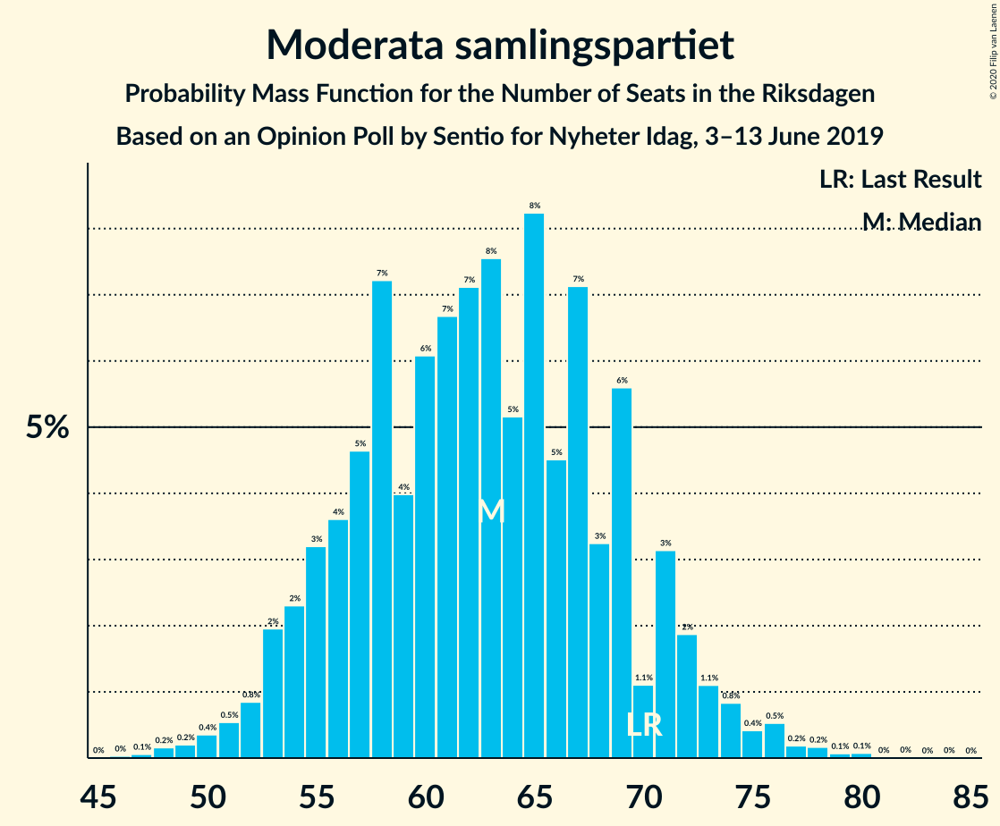
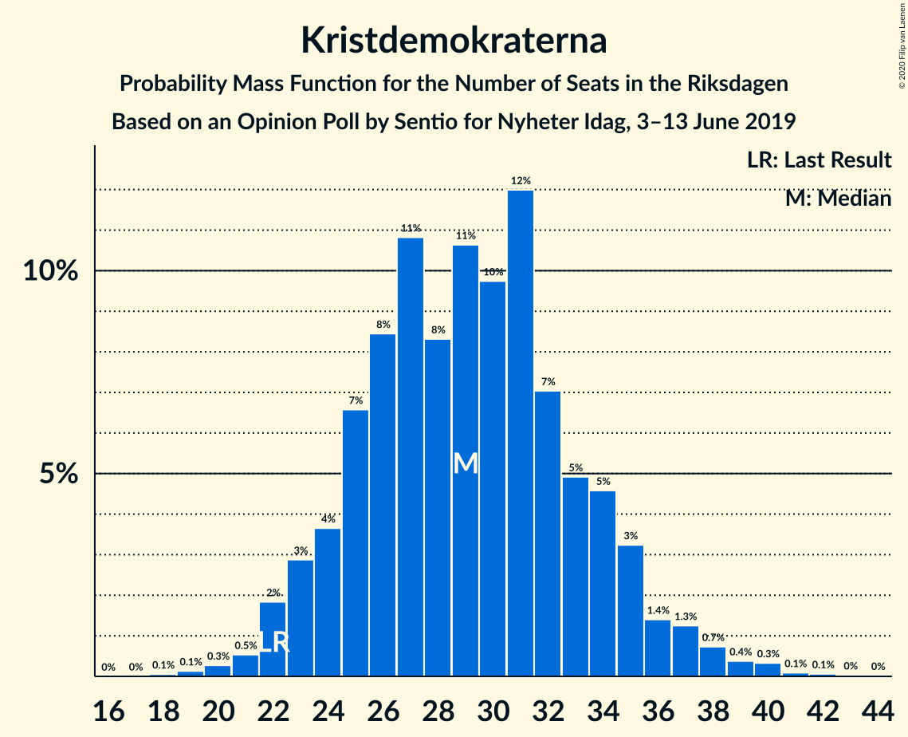
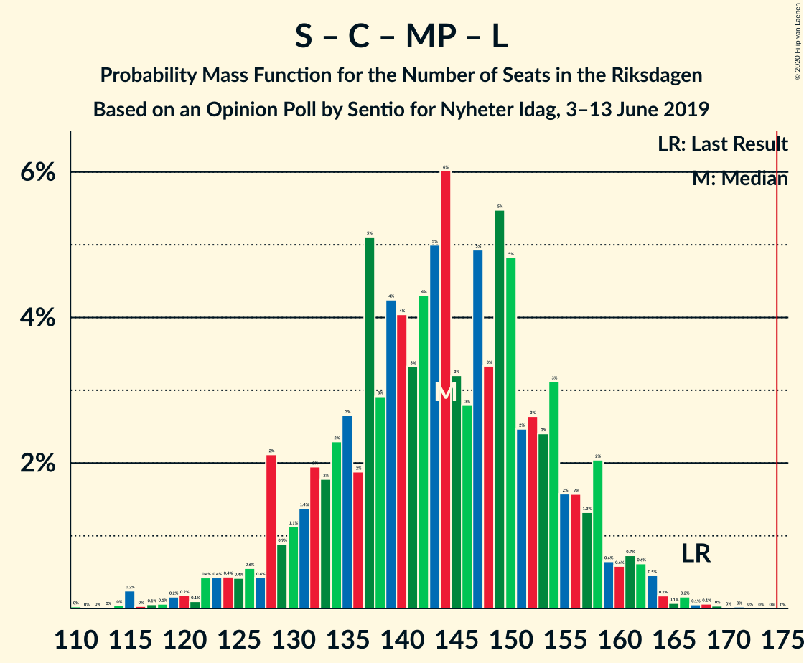
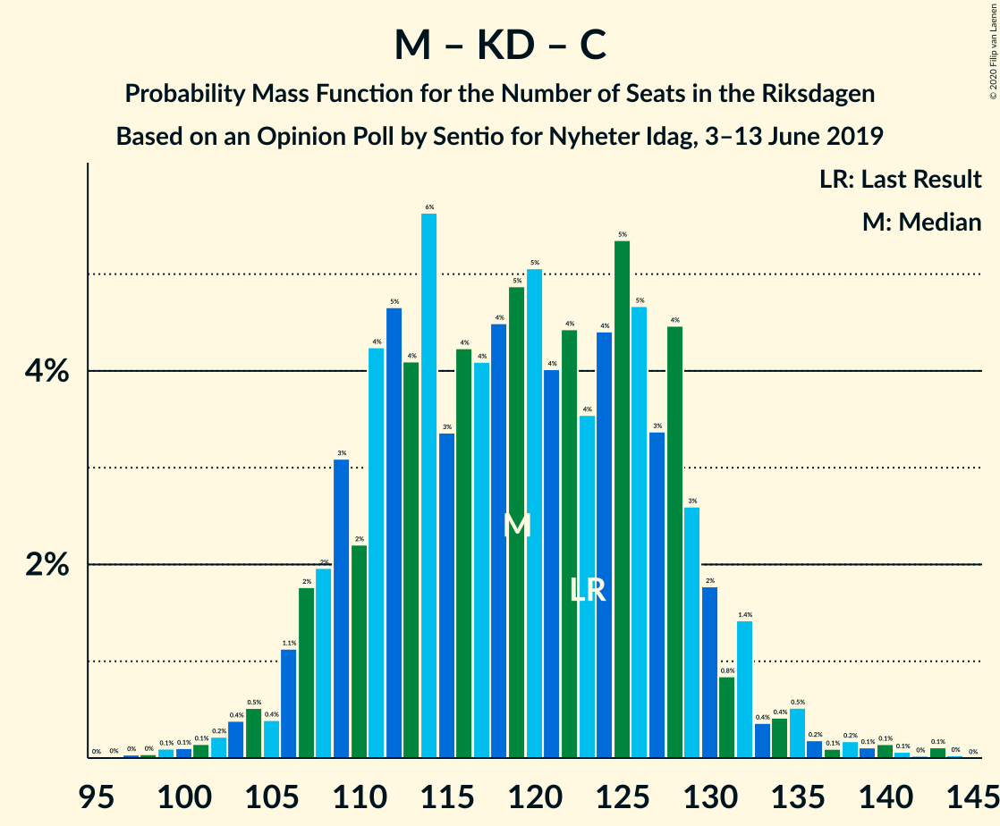

# Opinion Poll by Sentio for Nyheter Idag, 3–13 June 2019

<a href="#voting-intentions">Voting Intentions</a> | <a href="#seats">Seats</a> | <a href="#coalitions">Coalitions</a> | <a href="#technical-information">Technical Information</a>

## Voting Intentions

### Confidence Intervals

| Party | Last Result | Poll Result | 80% Confidence Interval | 90% Confidence Interval | 95% Confidence Interval | 99% Confidence Interval |
|:-----:|:-----------:|:-----------:|:-----------------------:|:-----------------------:|:-----------------------:|:-----------------------:|
| Sveriges socialdemokratiska arbetareparti | 28.3% | 26.1% | 23.8–27.8% |23.3–28.4% |22.8–28.9% |21.9–29.9% |
| Sverigedemokraterna | 17.5% | 22.1% | 20.0–23.8% |19.5–24.3% |19.1–24.8% |18.2–25.8% |
| Moderata samlingspartiet | 19.8% | 17.2% | 15.4–18.8% |14.9–19.3% |14.5–19.8% |13.8–20.7% |
| Vänsterpartiet | 8.0% | 8.9% | 7.6–10.2% |7.2–10.6% |7.0–10.9% |6.4–11.6% |
| Kristdemokraterna | 6.3% | 8.0% | 6.8–9.2% |6.4–9.6% |6.2–10.0% |5.7–10.6% |
| Centerpartiet | 8.6% | 7.5% | 6.3–8.7% |6.0–9.1% |5.7–9.4% |5.3–10.1% |
| Miljöpartiet de gröna | 4.4% | 4.8% | 4.0–5.9% |3.7–6.3% |3.5–6.6% |3.2–7.1% |
| Liberalerna | 5.5% | 3.8% | 2.9–4.7% |2.7–5.0% |2.6–5.2% |2.3–5.8% |

*Note:* The poll result column reflects the actual value used in the calculations. Published results may vary slightly, and in addition be rounded to fewer digits.

## Seats

### Confidence Intervals

| Party | Last Result | Median | 80% Confidence Interval | 90% Confidence Interval | 95% Confidence Interval | 99% Confidence Interval |
|:-----:|:-----------:|:------:|:-----------------------:|:-----------------------:|:-----------------------:|:-----------------------:|
| <a href="#sveriges-socialdemokratiska-arbetareparti">Sveriges socialdemokratiska arbetareparti</a> | 100 | 94 | 86–102 |84–105 |82–107 |79–112 |
| <a href="#sverigedemokraterna">Sverigedemokraterna</a> | 62 | 80 | 73–87 |70–90 |68–92 |66–96 |
| <a href="#moderata-samlingspartiet">Moderata samlingspartiet</a> | 70 | 63 | 56–69 |54–72 |53–73 |50–77 |
| <a href="#vänsterpartiet">Vänsterpartiet</a> | 28 | 32 | 27–37 |26–39 |25–40 |23–43 |
| <a href="#kristdemokraterna">Kristdemokraterna</a> | 22 | 29 | 25–34 |23–35 |22–37 |21–40 |
| <a href="#centerpartiet">Centerpartiet</a> | 31 | 27 | 23–32 |22–34 |21–35 |19–37 |
| <a href="#miljöpartiet-de-gröna">Miljöpartiet de gröna</a> | 16 | 18 | 0–22 |0–23 |0–24 |0–26 |
| <a href="#liberalerna">Liberalerna</a> | 20 | 0 | 0–17 |0–18 |0–19 |0–21 |

### Sveriges socialdemokratiska arbetareparti

*For a full overview of the results for this party, see the [Sveriges socialdemokratiska arbetareparti](party-sverigessocialdemokratiskaarbetareparti.html) page.*

| Number of Seats | Probability | Accumulated | Special Marks |
|:---------------:|:-----------:|:-----------:|:-------------:|
| 75 | 0% | 100% |  |
| 76 | 0.1% | 99.9% |  |
| 77 | 0.1% | 99.9% |  |
| 78 | 0.2% | 99.7% |  |
| 79 | 0.4% | 99.5% |  |
| 80 | 0.4% | 99.2% |  |
| 81 | 0.7% | 98.8% |  |
| 82 | 0.9% | 98% |  |
| 83 | 1.3% | 97% |  |
| 84 | 1.2% | 96% |  |
| 85 | 2% | 95% |  |
| 86 | 4% | 93% |  |
| 87 | 3% | 89% |  |
| 88 | 3% | 86% |  |
| 89 | 4% | 83% |  |
| 90 | 3% | 79% |  |
| 91 | 9% | 76% |  |
| 92 | 8% | 67% |  |
| 93 | 6% | 60% |  |
| 94 | 5% | 54% | Median |
| 95 | 5% | 49% |  |
| 96 | 4% | 43% |  |
| 97 | 6% | 40% |  |
| 98 | 4% | 34% |  |
| 99 | 3% | 30% |  |
| 100 | 5% | 27% | Last Result |
| 101 | 5% | 22% |  |
| 102 | 7% | 17% |  |
| 103 | 2% | 10% |  |
| 104 | 2% | 8% |  |
| 105 | 2% | 6% |  |
| 106 | 1.1% | 4% |  |
| 107 | 1.3% | 3% |  |
| 108 | 0.5% | 2% |  |
| 109 | 0.3% | 1.3% |  |
| 110 | 0.3% | 1.0% |  |
| 111 | 0.1% | 0.7% |  |
| 112 | 0.3% | 0.6% |  |
| 113 | 0.1% | 0.3% |  |
| 114 | 0.1% | 0.2% |  |
| 115 | 0% | 0.2% |  |
| 116 | 0.1% | 0.1% |  |
| 117 | 0% | 0.1% |  |
| 118 | 0% | 0% |  |

### Sverigedemokraterna

*For a full overview of the results for this party, see the [Sverigedemokraterna](party-sverigedemokraterna.html) page.*

| Number of Seats | Probability | Accumulated | Special Marks |
|:---------------:|:-----------:|:-----------:|:-------------:|
| 62 | 0% | 100% | Last Result |
| 63 | 0.1% | 99.9% |  |
| 64 | 0.1% | 99.8% |  |
| 65 | 0.2% | 99.8% |  |
| 66 | 0.4% | 99.6% |  |
| 67 | 0.8% | 99.2% |  |
| 68 | 1.3% | 98% |  |
| 69 | 1.0% | 97% |  |
| 70 | 1.3% | 96% |  |
| 71 | 2% | 95% |  |
| 72 | 3% | 93% |  |
| 73 | 4% | 90% |  |
| 74 | 5% | 86% |  |
| 75 | 5% | 81% |  |
| 76 | 5% | 76% |  |
| 77 | 5% | 71% |  |
| 78 | 6% | 65% |  |
| 79 | 8% | 59% |  |
| 80 | 6% | 51% | Median |
| 81 | 10% | 45% |  |
| 82 | 2% | 35% |  |
| 83 | 5% | 33% |  |
| 84 | 5% | 28% |  |
| 85 | 4% | 23% |  |
| 86 | 6% | 19% |  |
| 87 | 4% | 14% |  |
| 88 | 1.3% | 10% |  |
| 89 | 2% | 8% |  |
| 90 | 1.1% | 6% |  |
| 91 | 1.1% | 5% |  |
| 92 | 1.3% | 4% |  |
| 93 | 0.7% | 2% |  |
| 94 | 0.6% | 2% |  |
| 95 | 0.4% | 1.0% |  |
| 96 | 0.3% | 0.6% |  |
| 97 | 0.1% | 0.3% |  |
| 98 | 0.1% | 0.2% |  |
| 99 | 0.1% | 0.1% |  |
| 100 | 0% | 0.1% |  |
| 101 | 0% | 0% |  |

### Moderata samlingspartiet

*For a full overview of the results for this party, see the [Moderata samlingspartiet](party-moderatasamlingspartiet.html) page.*

| Number of Seats | Probability | Accumulated | Special Marks |
|:---------------:|:-----------:|:-----------:|:-------------:|
| 47 | 0.1% | 100% |  |
| 48 | 0.2% | 99.9% |  |
| 49 | 0.2% | 99.7% |  |
| 50 | 0.4% | 99.5% |  |
| 51 | 0.5% | 99.2% |  |
| 52 | 0.8% | 98.6% |  |
| 53 | 2% | 98% |  |
| 54 | 2% | 96% |  |
| 55 | 3% | 94% |  |
| 56 | 4% | 90% |  |
| 57 | 5% | 87% |  |
| 58 | 7% | 82% |  |
| 59 | 4% | 75% |  |
| 60 | 6% | 71% |  |
| 61 | 7% | 65% |  |
| 62 | 7% | 58% |  |
| 63 | 8% | 51% | Median |
| 64 | 5% | 43% |  |
| 65 | 8% | 38% |  |
| 66 | 5% | 30% |  |
| 67 | 7% | 26% |  |
| 68 | 3% | 18% |  |
| 69 | 6% | 15% |  |
| 70 | 1.1% | 10% | Last Result |
| 71 | 3% | 8% |  |
| 72 | 2% | 5% |  |
| 73 | 1.1% | 3% |  |
| 74 | 0.8% | 2% |  |
| 75 | 0.4% | 1.5% |  |
| 76 | 0.5% | 1.1% |  |
| 77 | 0.2% | 0.5% |  |
| 78 | 0.2% | 0.4% |  |
| 79 | 0.1% | 0.2% |  |
| 80 | 0.1% | 0.1% |  |
| 81 | 0% | 0% |  |

### Vänsterpartiet

*For a full overview of the results for this party, see the [Vänsterpartiet](party-vänsterpartiet.html) page.*

| Number of Seats | Probability | Accumulated | Special Marks |
|:---------------:|:-----------:|:-----------:|:-------------:|
| 21 | 0% | 100% |  |
| 22 | 0.1% | 99.9% |  |
| 23 | 0.7% | 99.8% |  |
| 24 | 0.5% | 99.1% |  |
| 25 | 2% | 98.6% |  |
| 26 | 3% | 97% |  |
| 27 | 5% | 94% |  |
| 28 | 5% | 88% | Last Result |
| 29 | 5% | 83% |  |
| 30 | 10% | 78% |  |
| 31 | 10% | 68% |  |
| 32 | 11% | 58% | Median |
| 33 | 10% | 47% |  |
| 34 | 11% | 37% |  |
| 35 | 6% | 26% |  |
| 36 | 6% | 20% |  |
| 37 | 5% | 14% |  |
| 38 | 4% | 9% |  |
| 39 | 2% | 5% |  |
| 40 | 1.0% | 3% |  |
| 41 | 0.6% | 2% |  |
| 42 | 0.9% | 2% |  |
| 43 | 0.3% | 0.7% |  |
| 44 | 0.1% | 0.4% |  |
| 45 | 0.1% | 0.2% |  |
| 46 | 0% | 0.1% |  |
| 47 | 0% | 0% |  |

### Kristdemokraterna

*For a full overview of the results for this party, see the [Kristdemokraterna](party-kristdemokraterna.html) page.*

| Number of Seats | Probability | Accumulated | Special Marks |
|:---------------:|:-----------:|:-----------:|:-------------:|
| 18 | 0.1% | 100% |  |
| 19 | 0.1% | 99.9% |  |
| 20 | 0.3% | 99.8% |  |
| 21 | 0.5% | 99.5% |  |
| 22 | 2% | 99.0% | Last Result |
| 23 | 3% | 97% |  |
| 24 | 4% | 94% |  |
| 25 | 7% | 91% |  |
| 26 | 8% | 84% |  |
| 27 | 11% | 76% |  |
| 28 | 8% | 65% |  |
| 29 | 11% | 56% | Median |
| 30 | 10% | 46% |  |
| 31 | 12% | 36% |  |
| 32 | 7% | 24% |  |
| 33 | 5% | 17% |  |
| 34 | 5% | 12% |  |
| 35 | 3% | 8% |  |
| 36 | 1.4% | 4% |  |
| 37 | 1.3% | 3% |  |
| 38 | 0.7% | 2% |  |
| 39 | 0.4% | 0.9% |  |
| 40 | 0.3% | 0.5% |  |
| 41 | 0.1% | 0.2% |  |
| 42 | 0.1% | 0.1% |  |
| 43 | 0% | 0.1% |  |
| 44 | 0% | 0% |  |

### Centerpartiet

*For a full overview of the results for this party, see the [Centerpartiet](party-centerpartiet.html) page.*

| Number of Seats | Probability | Accumulated | Special Marks |
|:---------------:|:-----------:|:-----------:|:-------------:|
| 17 | 0% | 100% |  |
| 18 | 0.2% | 99.9% |  |
| 19 | 0.7% | 99.7% |  |
| 20 | 0.9% | 99.0% |  |
| 21 | 2% | 98% |  |
| 22 | 4% | 96% |  |
| 23 | 6% | 92% |  |
| 24 | 9% | 86% |  |
| 25 | 10% | 77% |  |
| 26 | 9% | 67% |  |
| 27 | 11% | 58% | Median |
| 28 | 15% | 47% |  |
| 29 | 5% | 32% |  |
| 30 | 9% | 27% |  |
| 31 | 6% | 18% | Last Result |
| 32 | 3% | 12% |  |
| 33 | 4% | 9% |  |
| 34 | 3% | 5% |  |
| 35 | 2% | 3% |  |
| 36 | 0.6% | 1.4% |  |
| 37 | 0.3% | 0.7% |  |
| 38 | 0.3% | 0.5% |  |
| 39 | 0.1% | 0.2% |  |
| 40 | 0% | 0.1% |  |
| 41 | 0% | 0% |  |

### Miljöpartiet de gröna

*For a full overview of the results for this party, see the [Miljöpartiet de gröna](party-miljöpartietdegröna.html) page.*

| Number of Seats | Probability | Accumulated | Special Marks |
|:---------------:|:-----------:|:-----------:|:-------------:|
| 0 | 14% | 100% |  |
| 1 | 0% | 86% |  |
| 2 | 0% | 86% |  |
| 3 | 0% | 86% |  |
| 4 | 0% | 86% |  |
| 5 | 0% | 86% |  |
| 6 | 0% | 86% |  |
| 7 | 0% | 86% |  |
| 8 | 0% | 86% |  |
| 9 | 0% | 86% |  |
| 10 | 0% | 86% |  |
| 11 | 0% | 86% |  |
| 12 | 0% | 86% |  |
| 13 | 0% | 86% |  |
| 14 | 0.9% | 86% |  |
| 15 | 8% | 85% |  |
| 16 | 9% | 78% | Last Result |
| 17 | 10% | 68% |  |
| 18 | 16% | 59% | Median |
| 19 | 15% | 43% |  |
| 20 | 11% | 28% |  |
| 21 | 5% | 16% |  |
| 22 | 4% | 12% |  |
| 23 | 4% | 8% |  |
| 24 | 2% | 4% |  |
| 25 | 0.8% | 1.4% |  |
| 26 | 0.3% | 0.6% |  |
| 27 | 0.2% | 0.4% |  |
| 28 | 0.1% | 0.2% |  |
| 29 | 0% | 0.1% |  |
| 30 | 0% | 0% |  |

### Liberalerna

*For a full overview of the results for this party, see the [Liberalerna](party-liberalerna.html) page.*

| Number of Seats | Probability | Accumulated | Special Marks |
|:---------------:|:-----------:|:-----------:|:-------------:|
| 0 | 66% | 100% | Median |
| 1 | 0% | 34% |  |
| 2 | 0% | 34% |  |
| 3 | 0% | 34% |  |
| 4 | 0% | 34% |  |
| 5 | 0% | 34% |  |
| 6 | 0% | 34% |  |
| 7 | 0% | 34% |  |
| 8 | 0% | 34% |  |
| 9 | 0% | 34% |  |
| 10 | 0% | 34% |  |
| 11 | 0% | 34% |  |
| 12 | 0% | 34% |  |
| 13 | 0% | 34% |  |
| 14 | 2% | 34% |  |
| 15 | 13% | 32% |  |
| 16 | 7% | 19% |  |
| 17 | 6% | 12% |  |
| 18 | 3% | 6% |  |
| 19 | 2% | 3% |  |
| 20 | 1.0% | 2% | Last Result |
| 21 | 0.3% | 0.6% |  |
| 22 | 0.1% | 0.2% |  |
| 23 | 0.1% | 0.1% |  |
| 24 | 0% | 0% |  |

## Coalitions

### Confidence Intervals

| Coalition | Last Result | Median | Majority? | 80% Confidence Interval | 90% Confidence Interval | 95% Confidence Interval | 99% Confidence Interval |
|:---------:|:-----------:|:------:|:---------:|:-----------------------:|:-----------------------:|:-----------------------:|:-----------------------:|
| Sveriges socialdemokratiska arbetareparti – Moderata samlingspartiet – Centerpartiet | 201 | 185 | 87% | 173–195 | 170–200 | 168–200 | 163–207 |
| Sveriges socialdemokratiska arbetareparti – Vänsterpartiet – Centerpartiet – Miljöpartiet de gröna – Liberalerna | 195 | 176 | 57% | 164–187 | 161–189 | 158–192 | 152–196 |
| Sverigedemokraterna – Moderata samlingspartiet – Kristdemokraterna | 154 | 171 | 37% | 161–183 | 158–186 | 156–188 | 151–193 |
| Sveriges socialdemokratiska arbetareparti – Moderata samlingspartiet | 170 | 158 | 1.4% | 146–168 | 144–171 | 141–172 | 137–178 |
| Sveriges socialdemokratiska arbetareparti – Centerpartiet – Miljöpartiet de gröna – Liberalerna | 167 | 144 | 0% | 132–155 | 128–158 | 125–160 | 119–164 |
| Sverigedemokraterna – Moderata samlingspartiet | 132 | 142 | 0% | 132–153 | 130–156 | 128–158 | 123–163 |
| Sveriges socialdemokratiska arbetareparti – Vänsterpartiet – Miljöpartiet de gröna | 144 | 143 | 0% | 132–154 | 129–156 | 125–158 | 120–163 |
| Moderata samlingspartiet – Kristdemokraterna – Centerpartiet – Liberalerna | 143 | 125 | 0% | 113–136 | 111–140 | 109–142 | 106–146 |
| Sveriges socialdemokratiska arbetareparti – Vänsterpartiet | 128 | 127 | 0% | 118–136 | 115–138 | 113–140 | 109–145 |
| Moderata samlingspartiet – Kristdemokraterna – Centerpartiet | 123 | 119 | 0% | 110–128 | 108–130 | 106–132 | 102–138 |
| Sveriges socialdemokratiska arbetareparti – Miljöpartiet de gröna | 116 | 111 | 0% | 100–121 | 96–122 | 92–126 | 88–129 |
| Moderata samlingspartiet – Centerpartiet – Liberalerna | 121 | 95 | 0% | 85–106 | 83–109 | 81–113 | 78–117 |
| Moderata samlingspartiet – Centerpartiet | 101 | 90 | 0% | 82–99 | 80–101 | 78–102 | 75–106 |

### Sveriges socialdemokratiska arbetareparti – Moderata samlingspartiet – Centerpartiet

| Number of Seats | Probability | Accumulated | Special Marks |
|:---------------:|:-----------:|:-----------:|:-------------:|
| 157 | 0% | 100% |  |
| 158 | 0% | 99.9% |  |
| 159 | 0% | 99.9% |  |
| 160 | 0.1% | 99.9% |  |
| 161 | 0.1% | 99.8% |  |
| 162 | 0.2% | 99.7% |  |
| 163 | 0.1% | 99.5% |  |
| 164 | 0.3% | 99.4% |  |
| 165 | 0.4% | 99.1% |  |
| 166 | 0.3% | 98.8% |  |
| 167 | 0.5% | 98% |  |
| 168 | 1.3% | 98% |  |
| 169 | 0.5% | 97% |  |
| 170 | 1.2% | 96% |  |
| 171 | 1.5% | 95% |  |
| 172 | 2% | 93% |  |
| 173 | 2% | 91% |  |
| 174 | 2% | 90% |  |
| 175 | 3% | 87% | Majority |
| 176 | 4% | 85% |  |
| 177 | 2% | 80% |  |
| 178 | 4% | 78% |  |
| 179 | 4% | 75% |  |
| 180 | 3% | 70% |  |
| 181 | 4% | 67% |  |
| 182 | 3% | 63% |  |
| 183 | 5% | 60% |  |
| 184 | 5% | 55% | Median |
| 185 | 3% | 50% |  |
| 186 | 4% | 47% |  |
| 187 | 3% | 43% |  |
| 188 | 6% | 40% |  |
| 189 | 6% | 34% |  |
| 190 | 3% | 28% |  |
| 191 | 3% | 25% |  |
| 192 | 2% | 22% |  |
| 193 | 3% | 20% |  |
| 194 | 5% | 17% |  |
| 195 | 3% | 13% |  |
| 196 | 1.0% | 10% |  |
| 197 | 2% | 9% |  |
| 198 | 1.0% | 7% |  |
| 199 | 1.0% | 6% |  |
| 200 | 3% | 5% |  |
| 201 | 0.5% | 2% | Last Result |
| 202 | 0.5% | 2% |  |
| 203 | 0.2% | 1.3% |  |
| 204 | 0.3% | 1.1% |  |
| 205 | 0.2% | 0.8% |  |
| 206 | 0.1% | 0.6% |  |
| 207 | 0.1% | 0.5% |  |
| 208 | 0.1% | 0.4% |  |
| 209 | 0.1% | 0.3% |  |
| 210 | 0% | 0.3% |  |
| 211 | 0.2% | 0.3% |  |
| 212 | 0.1% | 0.1% |  |
| 213 | 0% | 0.1% |  |
| 214 | 0% | 0% |  |

### Sveriges socialdemokratiska arbetareparti – Vänsterpartiet – Centerpartiet – Miljöpartiet de gröna – Liberalerna

| Number of Seats | Probability | Accumulated | Special Marks |
|:---------------:|:-----------:|:-----------:|:-------------:|
| 147 | 0% | 100% |  |
| 148 | 0% | 99.9% |  |
| 149 | 0% | 99.9% |  |
| 150 | 0.1% | 99.9% |  |
| 151 | 0.1% | 99.8% |  |
| 152 | 0.3% | 99.7% |  |
| 153 | 0.1% | 99.4% |  |
| 154 | 0.2% | 99.3% |  |
| 155 | 0.2% | 99.1% |  |
| 156 | 0.3% | 98.9% |  |
| 157 | 0.6% | 98.6% |  |
| 158 | 0.5% | 98% |  |
| 159 | 0.9% | 97% |  |
| 160 | 0.7% | 97% |  |
| 161 | 1.0% | 96% |  |
| 162 | 2% | 95% |  |
| 163 | 1.3% | 93% |  |
| 164 | 2% | 91% |  |
| 165 | 2% | 90% |  |
| 166 | 2% | 87% |  |
| 167 | 2% | 86% |  |
| 168 | 5% | 84% |  |
| 169 | 2% | 78% |  |
| 170 | 4% | 76% |  |
| 171 | 2% | 72% | Median |
| 172 | 4% | 70% |  |
| 173 | 5% | 66% |  |
| 174 | 4% | 61% |  |
| 175 | 3% | 57% | Majority |
| 176 | 5% | 54% |  |
| 177 | 5% | 49% |  |
| 178 | 5% | 44% |  |
| 179 | 4% | 39% |  |
| 180 | 3% | 35% |  |
| 181 | 5% | 32% |  |
| 182 | 4% | 27% |  |
| 183 | 3% | 23% |  |
| 184 | 4% | 20% |  |
| 185 | 3% | 16% |  |
| 186 | 3% | 13% |  |
| 187 | 2% | 10% |  |
| 188 | 2% | 9% |  |
| 189 | 2% | 6% |  |
| 190 | 0.8% | 5% |  |
| 191 | 1.3% | 4% |  |
| 192 | 0.7% | 3% |  |
| 193 | 0.5% | 2% |  |
| 194 | 0.3% | 1.4% |  |
| 195 | 0.4% | 1.0% | Last Result |
| 196 | 0.2% | 0.6% |  |
| 197 | 0.2% | 0.4% |  |
| 198 | 0.1% | 0.2% |  |
| 199 | 0% | 0.2% |  |
| 200 | 0% | 0.1% |  |
| 201 | 0% | 0.1% |  |
| 202 | 0% | 0% |  |

### Sverigedemokraterna – Moderata samlingspartiet – Kristdemokraterna

| Number of Seats | Probability | Accumulated | Special Marks |
|:---------------:|:-----------:|:-----------:|:-------------:|
| 146 | 0% | 100% |  |
| 147 | 0% | 99.9% |  |
| 148 | 0.1% | 99.9% |  |
| 149 | 0.2% | 99.8% |  |
| 150 | 0.1% | 99.6% |  |
| 151 | 0.1% | 99.6% |  |
| 152 | 0.4% | 99.4% |  |
| 153 | 0.3% | 99.1% |  |
| 154 | 0.8% | 98.8% | Last Result |
| 155 | 0.5% | 98% |  |
| 156 | 0.6% | 98% |  |
| 157 | 0.8% | 97% |  |
| 158 | 2% | 96% |  |
| 159 | 1.3% | 95% |  |
| 160 | 2% | 93% |  |
| 161 | 3% | 91% |  |
| 162 | 2% | 89% |  |
| 163 | 3% | 86% |  |
| 164 | 3% | 83% |  |
| 165 | 5% | 80% |  |
| 166 | 3% | 75% |  |
| 167 | 5% | 72% |  |
| 168 | 5% | 68% |  |
| 169 | 3% | 62% |  |
| 170 | 4% | 59% |  |
| 171 | 5% | 55% |  |
| 172 | 5% | 50% | Median |
| 173 | 5% | 45% |  |
| 174 | 3% | 40% |  |
| 175 | 4% | 37% | Majority |
| 176 | 5% | 33% |  |
| 177 | 3% | 28% |  |
| 178 | 2% | 25% |  |
| 179 | 3% | 23% |  |
| 180 | 2% | 20% |  |
| 181 | 5% | 18% |  |
| 182 | 2% | 13% |  |
| 183 | 1.3% | 11% |  |
| 184 | 2% | 9% |  |
| 185 | 1.4% | 7% |  |
| 186 | 1.1% | 6% |  |
| 187 | 2% | 5% |  |
| 188 | 0.7% | 3% |  |
| 189 | 0.4% | 2% |  |
| 190 | 0.6% | 2% |  |
| 191 | 0.4% | 1.5% |  |
| 192 | 0.4% | 1.0% |  |
| 193 | 0.1% | 0.6% |  |
| 194 | 0.1% | 0.5% |  |
| 195 | 0.2% | 0.4% |  |
| 196 | 0.1% | 0.2% |  |
| 197 | 0.1% | 0.2% |  |
| 198 | 0% | 0.1% |  |
| 199 | 0% | 0.1% |  |
| 200 | 0% | 0% |  |

### Sveriges socialdemokratiska arbetareparti – Moderata samlingspartiet

| Number of Seats | Probability | Accumulated | Special Marks |
|:---------------:|:-----------:|:-----------:|:-------------:|
| 132 | 0% | 100% |  |
| 133 | 0% | 99.9% |  |
| 134 | 0.1% | 99.9% |  |
| 135 | 0.1% | 99.8% |  |
| 136 | 0.2% | 99.7% |  |
| 137 | 0.3% | 99.5% |  |
| 138 | 0.5% | 99.3% |  |
| 139 | 0.3% | 98.8% |  |
| 140 | 0.6% | 98% |  |
| 141 | 0.5% | 98% |  |
| 142 | 0.7% | 97% |  |
| 143 | 1.1% | 97% |  |
| 144 | 2% | 95% |  |
| 145 | 2% | 93% |  |
| 146 | 2% | 92% |  |
| 147 | 2% | 89% |  |
| 148 | 3% | 87% |  |
| 149 | 3% | 84% |  |
| 150 | 3% | 81% |  |
| 151 | 4% | 78% |  |
| 152 | 2% | 74% |  |
| 153 | 5% | 72% |  |
| 154 | 4% | 67% |  |
| 155 | 5% | 64% |  |
| 156 | 4% | 59% |  |
| 157 | 4% | 55% | Median |
| 158 | 5% | 51% |  |
| 159 | 4% | 46% |  |
| 160 | 5% | 41% |  |
| 161 | 6% | 36% |  |
| 162 | 3% | 31% |  |
| 163 | 3% | 28% |  |
| 164 | 3% | 25% |  |
| 165 | 4% | 22% |  |
| 166 | 3% | 18% |  |
| 167 | 4% | 15% |  |
| 168 | 3% | 11% |  |
| 169 | 2% | 8% |  |
| 170 | 0.8% | 6% | Last Result |
| 171 | 1.0% | 5% |  |
| 172 | 2% | 4% |  |
| 173 | 0.6% | 2% |  |
| 174 | 0.3% | 2% |  |
| 175 | 0.3% | 1.4% | Majority |
| 176 | 0.3% | 1.1% |  |
| 177 | 0.2% | 0.8% |  |
| 178 | 0.2% | 0.6% |  |
| 179 | 0.1% | 0.3% |  |
| 180 | 0% | 0.2% |  |
| 181 | 0% | 0.2% |  |
| 182 | 0.1% | 0.1% |  |
| 183 | 0% | 0.1% |  |
| 184 | 0.1% | 0.1% |  |
| 185 | 0% | 0% |  |

### Sveriges socialdemokratiska arbetareparti – Centerpartiet – Miljöpartiet de gröna – Liberalerna

| Number of Seats | Probability | Accumulated | Special Marks |
|:---------------:|:-----------:|:-----------:|:-------------:|
| 113 | 0% | 100% |  |
| 114 | 0% | 99.9% |  |
| 115 | 0.2% | 99.9% |  |
| 116 | 0% | 99.7% |  |
| 117 | 0.1% | 99.6% |  |
| 118 | 0.1% | 99.6% |  |
| 119 | 0.2% | 99.5% |  |
| 120 | 0.2% | 99.3% |  |
| 121 | 0.1% | 99.2% |  |
| 122 | 0.4% | 99.1% |  |
| 123 | 0.4% | 98.6% |  |
| 124 | 0.4% | 98% |  |
| 125 | 0.4% | 98% |  |
| 126 | 0.6% | 97% |  |
| 127 | 0.4% | 97% |  |
| 128 | 2% | 96% |  |
| 129 | 0.9% | 94% |  |
| 130 | 1.1% | 93% |  |
| 131 | 1.4% | 92% |  |
| 132 | 2% | 91% |  |
| 133 | 2% | 89% |  |
| 134 | 2% | 87% |  |
| 135 | 3% | 85% |  |
| 136 | 2% | 82% |  |
| 137 | 5% | 80% |  |
| 138 | 3% | 75% |  |
| 139 | 4% | 72% | Median |
| 140 | 4% | 68% |  |
| 141 | 3% | 64% |  |
| 142 | 4% | 61% |  |
| 143 | 5% | 56% |  |
| 144 | 6% | 51% |  |
| 145 | 3% | 45% |  |
| 146 | 3% | 42% |  |
| 147 | 5% | 39% |  |
| 148 | 3% | 34% |  |
| 149 | 5% | 31% |  |
| 150 | 5% | 26% |  |
| 151 | 2% | 21% |  |
| 152 | 3% | 18% |  |
| 153 | 2% | 16% |  |
| 154 | 3% | 13% |  |
| 155 | 2% | 10% |  |
| 156 | 2% | 9% |  |
| 157 | 1.3% | 7% |  |
| 158 | 2% | 6% |  |
| 159 | 0.6% | 4% |  |
| 160 | 0.6% | 3% |  |
| 161 | 0.7% | 2% |  |
| 162 | 0.6% | 2% |  |
| 163 | 0.5% | 1.1% |  |
| 164 | 0.2% | 0.6% |  |
| 165 | 0.1% | 0.4% |  |
| 166 | 0.2% | 0.4% |  |
| 167 | 0.1% | 0.2% | Last Result |
| 168 | 0.1% | 0.2% |  |
| 169 | 0% | 0.1% |  |
| 170 | 0% | 0.1% |  |
| 171 | 0% | 0% |  |

### Sverigedemokraterna – Moderata samlingspartiet

| Number of Seats | Probability | Accumulated | Special Marks |
|:---------------:|:-----------:|:-----------:|:-------------:|
| 119 | 0% | 100% |  |
| 120 | 0% | 99.9% |  |
| 121 | 0.1% | 99.9% |  |
| 122 | 0.1% | 99.8% |  |
| 123 | 0.2% | 99.7% |  |
| 124 | 0.2% | 99.5% |  |
| 125 | 0.4% | 99.3% |  |
| 126 | 0.2% | 98.8% |  |
| 127 | 0.6% | 98.6% |  |
| 128 | 1.3% | 98% |  |
| 129 | 1.4% | 97% |  |
| 130 | 1.2% | 95% |  |
| 131 | 1.2% | 94% |  |
| 132 | 3% | 93% | Last Result |
| 133 | 2% | 90% |  |
| 134 | 2% | 88% |  |
| 135 | 3% | 85% |  |
| 136 | 6% | 82% |  |
| 137 | 3% | 76% |  |
| 138 | 3% | 73% |  |
| 139 | 4% | 69% |  |
| 140 | 7% | 65% |  |
| 141 | 6% | 58% |  |
| 142 | 4% | 52% |  |
| 143 | 4% | 48% | Median |
| 144 | 3% | 45% |  |
| 145 | 5% | 41% |  |
| 146 | 6% | 36% |  |
| 147 | 3% | 30% |  |
| 148 | 3% | 27% |  |
| 149 | 3% | 24% |  |
| 150 | 4% | 21% |  |
| 151 | 3% | 16% |  |
| 152 | 2% | 13% |  |
| 153 | 2% | 11% |  |
| 154 | 1.3% | 9% |  |
| 155 | 2% | 8% |  |
| 156 | 0.8% | 5% |  |
| 157 | 1.3% | 5% |  |
| 158 | 1.3% | 3% |  |
| 159 | 0.4% | 2% |  |
| 160 | 0.4% | 2% |  |
| 161 | 0.2% | 1.1% |  |
| 162 | 0.2% | 0.9% |  |
| 163 | 0.4% | 0.7% |  |
| 164 | 0.1% | 0.3% |  |
| 165 | 0.1% | 0.2% |  |
| 166 | 0% | 0.1% |  |
| 167 | 0% | 0.1% |  |
| 168 | 0% | 0% |  |

### Sveriges socialdemokratiska arbetareparti – Vänsterpartiet – Miljöpartiet de gröna

| Number of Seats | Probability | Accumulated | Special Marks |
|:---------------:|:-----------:|:-----------:|:-------------:|
| 114 | 0% | 100% |  |
| 115 | 0% | 99.9% |  |
| 116 | 0% | 99.9% |  |
| 117 | 0% | 99.9% |  |
| 118 | 0.1% | 99.8% |  |
| 119 | 0.1% | 99.7% |  |
| 120 | 0.2% | 99.6% |  |
| 121 | 0.2% | 99.4% |  |
| 122 | 0.3% | 99.2% |  |
| 123 | 0.6% | 98.9% |  |
| 124 | 0.3% | 98% |  |
| 125 | 0.8% | 98% |  |
| 126 | 0.8% | 97% |  |
| 127 | 0.7% | 96% |  |
| 128 | 0.6% | 96% |  |
| 129 | 1.3% | 95% |  |
| 130 | 1.3% | 94% |  |
| 131 | 2% | 93% |  |
| 132 | 1.4% | 91% |  |
| 133 | 3% | 89% |  |
| 134 | 2% | 86% |  |
| 135 | 3% | 84% |  |
| 136 | 3% | 81% |  |
| 137 | 3% | 78% |  |
| 138 | 4% | 75% |  |
| 139 | 2% | 71% |  |
| 140 | 6% | 69% |  |
| 141 | 4% | 63% |  |
| 142 | 6% | 59% |  |
| 143 | 4% | 53% |  |
| 144 | 6% | 49% | Last Result, Median |
| 145 | 2% | 43% |  |
| 146 | 5% | 41% |  |
| 147 | 4% | 36% |  |
| 148 | 5% | 32% |  |
| 149 | 3% | 28% |  |
| 150 | 4% | 25% |  |
| 151 | 2% | 22% |  |
| 152 | 4% | 19% |  |
| 153 | 3% | 16% |  |
| 154 | 5% | 12% |  |
| 155 | 3% | 8% |  |
| 156 | 2% | 5% |  |
| 157 | 0.6% | 3% |  |
| 158 | 0.8% | 3% |  |
| 159 | 0.3% | 2% |  |
| 160 | 0.5% | 2% |  |
| 161 | 0.5% | 1.2% |  |
| 162 | 0.2% | 0.7% |  |
| 163 | 0.2% | 0.5% |  |
| 164 | 0.1% | 0.3% |  |
| 165 | 0.1% | 0.2% |  |
| 166 | 0.1% | 0.2% |  |
| 167 | 0% | 0.1% |  |
| 168 | 0% | 0.1% |  |
| 169 | 0% | 0% |  |

### Moderata samlingspartiet – Kristdemokraterna – Centerpartiet – Liberalerna

| Number of Seats | Probability | Accumulated | Special Marks |
|:---------------:|:-----------:|:-----------:|:-------------:|
| 101 | 0% | 100% |  |
| 102 | 0% | 99.9% |  |
| 103 | 0.1% | 99.9% |  |
| 104 | 0.1% | 99.8% |  |
| 105 | 0.2% | 99.7% |  |
| 106 | 0.4% | 99.5% |  |
| 107 | 0.4% | 99.2% |  |
| 108 | 0.4% | 98.7% |  |
| 109 | 1.4% | 98% |  |
| 110 | 1.4% | 97% |  |
| 111 | 1.2% | 95% |  |
| 112 | 2% | 94% |  |
| 113 | 3% | 93% |  |
| 114 | 4% | 90% |  |
| 115 | 2% | 86% |  |
| 116 | 3% | 84% |  |
| 117 | 3% | 82% |  |
| 118 | 4% | 78% |  |
| 119 | 4% | 75% | Median |
| 120 | 3% | 71% |  |
| 121 | 3% | 68% |  |
| 122 | 4% | 65% |  |
| 123 | 3% | 60% |  |
| 124 | 4% | 57% |  |
| 125 | 5% | 52% |  |
| 126 | 6% | 47% |  |
| 127 | 4% | 41% |  |
| 128 | 7% | 37% |  |
| 129 | 4% | 29% |  |
| 130 | 4% | 25% |  |
| 131 | 2% | 21% |  |
| 132 | 3% | 19% |  |
| 133 | 1.3% | 16% |  |
| 134 | 2% | 15% |  |
| 135 | 2% | 13% |  |
| 136 | 2% | 11% |  |
| 137 | 1.4% | 9% |  |
| 138 | 0.9% | 8% |  |
| 139 | 1.4% | 7% |  |
| 140 | 2% | 5% |  |
| 141 | 0.5% | 3% |  |
| 142 | 0.8% | 3% |  |
| 143 | 0.6% | 2% | Last Result |
| 144 | 0.5% | 1.2% |  |
| 145 | 0.2% | 0.7% |  |
| 146 | 0.1% | 0.5% |  |
| 147 | 0.1% | 0.4% |  |
| 148 | 0.1% | 0.3% |  |
| 149 | 0.1% | 0.2% |  |
| 150 | 0% | 0.1% |  |
| 151 | 0% | 0.1% |  |
| 152 | 0% | 0.1% |  |
| 153 | 0% | 0% |  |

### Sveriges socialdemokratiska arbetareparti – Vänsterpartiet

| Number of Seats | Probability | Accumulated | Special Marks |
|:---------------:|:-----------:|:-----------:|:-------------:|
| 104 | 0% | 100% |  |
| 105 | 0% | 99.9% |  |
| 106 | 0.1% | 99.9% |  |
| 107 | 0.1% | 99.8% |  |
| 108 | 0.1% | 99.7% |  |
| 109 | 0.2% | 99.6% |  |
| 110 | 0.3% | 99.3% |  |
| 111 | 0.5% | 99.1% |  |
| 112 | 0.8% | 98.6% |  |
| 113 | 0.7% | 98% |  |
| 114 | 1.2% | 97% |  |
| 115 | 2% | 96% |  |
| 116 | 1.3% | 94% |  |
| 117 | 2% | 93% |  |
| 118 | 3% | 91% |  |
| 119 | 2% | 89% |  |
| 120 | 3% | 86% |  |
| 121 | 4% | 83% |  |
| 122 | 6% | 79% |  |
| 123 | 6% | 73% |  |
| 124 | 5% | 67% |  |
| 125 | 6% | 62% |  |
| 126 | 5% | 55% | Median |
| 127 | 5% | 50% |  |
| 128 | 4% | 45% | Last Result |
| 129 | 4% | 41% |  |
| 130 | 4% | 36% |  |
| 131 | 4% | 33% |  |
| 132 | 3% | 29% |  |
| 133 | 4% | 26% |  |
| 134 | 5% | 22% |  |
| 135 | 5% | 17% |  |
| 136 | 3% | 12% |  |
| 137 | 2% | 8% |  |
| 138 | 2% | 6% |  |
| 139 | 0.8% | 4% |  |
| 140 | 1.1% | 3% |  |
| 141 | 0.5% | 2% |  |
| 142 | 0.5% | 2% |  |
| 143 | 0.4% | 1.2% |  |
| 144 | 0.2% | 0.9% |  |
| 145 | 0.1% | 0.6% |  |
| 146 | 0.1% | 0.5% |  |
| 147 | 0.1% | 0.4% |  |
| 148 | 0.1% | 0.3% |  |
| 149 | 0% | 0.2% |  |
| 150 | 0.1% | 0.1% |  |
| 151 | 0% | 0.1% |  |
| 152 | 0% | 0.1% |  |
| 153 | 0% | 0% |  |

### Moderata samlingspartiet – Kristdemokraterna – Centerpartiet

| Number of Seats | Probability | Accumulated | Special Marks |
|:---------------:|:-----------:|:-----------:|:-------------:|
| 97 | 0% | 100% |  |
| 98 | 0% | 99.9% |  |
| 99 | 0.1% | 99.9% |  |
| 100 | 0.1% | 99.8% |  |
| 101 | 0.1% | 99.7% |  |
| 102 | 0.2% | 99.5% |  |
| 103 | 0.4% | 99.3% |  |
| 104 | 0.5% | 98.9% |  |
| 105 | 0.4% | 98% |  |
| 106 | 1.1% | 98% |  |
| 107 | 2% | 97% |  |
| 108 | 2% | 95% |  |
| 109 | 3% | 93% |  |
| 110 | 2% | 90% |  |
| 111 | 4% | 88% |  |
| 112 | 5% | 84% |  |
| 113 | 4% | 79% |  |
| 114 | 6% | 75% |  |
| 115 | 3% | 69% |  |
| 116 | 4% | 66% |  |
| 117 | 4% | 62% |  |
| 118 | 4% | 58% |  |
| 119 | 5% | 53% | Median |
| 120 | 5% | 48% |  |
| 121 | 4% | 43% |  |
| 122 | 4% | 39% |  |
| 123 | 4% | 35% | Last Result |
| 124 | 4% | 31% |  |
| 125 | 5% | 27% |  |
| 126 | 5% | 21% |  |
| 127 | 3% | 17% |  |
| 128 | 4% | 13% |  |
| 129 | 3% | 9% |  |
| 130 | 2% | 6% |  |
| 131 | 0.8% | 5% |  |
| 132 | 1.4% | 4% |  |
| 133 | 0.4% | 2% |  |
| 134 | 0.4% | 2% |  |
| 135 | 0.5% | 1.5% |  |
| 136 | 0.2% | 0.9% |  |
| 137 | 0.1% | 0.8% |  |
| 138 | 0.2% | 0.7% |  |
| 139 | 0.1% | 0.5% |  |
| 140 | 0.1% | 0.4% |  |
| 141 | 0.1% | 0.2% |  |
| 142 | 0% | 0.2% |  |
| 143 | 0.1% | 0.2% |  |
| 144 | 0% | 0% |  |

### Sveriges socialdemokratiska arbetareparti – Miljöpartiet de gröna

| Number of Seats | Probability | Accumulated | Special Marks |
|:---------------:|:-----------:|:-----------:|:-------------:|
| 82 | 0% | 100% |  |
| 83 | 0% | 99.9% |  |
| 84 | 0% | 99.9% |  |
| 85 | 0% | 99.9% |  |
| 86 | 0.1% | 99.8% |  |
| 87 | 0.1% | 99.7% |  |
| 88 | 0.6% | 99.6% |  |
| 89 | 0.1% | 99.1% |  |
| 90 | 0.5% | 98.9% |  |
| 91 | 0.8% | 98% |  |
| 92 | 0.4% | 98% |  |
| 93 | 0.2% | 97% |  |
| 94 | 0.5% | 97% |  |
| 95 | 1.5% | 97% |  |
| 96 | 0.5% | 95% |  |
| 97 | 1.1% | 95% |  |
| 98 | 1.0% | 93% |  |
| 99 | 1.1% | 93% |  |
| 100 | 2% | 91% |  |
| 101 | 4% | 89% |  |
| 102 | 2% | 85% |  |
| 103 | 2% | 83% |  |
| 104 | 2% | 81% |  |
| 105 | 3% | 79% |  |
| 106 | 3% | 75% |  |
| 107 | 3% | 72% |  |
| 108 | 3% | 69% |  |
| 109 | 6% | 66% |  |
| 110 | 7% | 60% |  |
| 111 | 4% | 52% |  |
| 112 | 5% | 48% | Median |
| 113 | 3% | 43% |  |
| 114 | 5% | 40% |  |
| 115 | 4% | 35% |  |
| 116 | 5% | 31% | Last Result |
| 117 | 3% | 25% |  |
| 118 | 3% | 22% |  |
| 119 | 3% | 20% |  |
| 120 | 4% | 17% |  |
| 121 | 4% | 13% |  |
| 122 | 4% | 9% |  |
| 123 | 0.9% | 5% |  |
| 124 | 0.7% | 4% |  |
| 125 | 0.6% | 3% |  |
| 126 | 1.5% | 3% |  |
| 127 | 0.3% | 1.1% |  |
| 128 | 0.3% | 0.8% |  |
| 129 | 0.1% | 0.5% |  |
| 130 | 0.1% | 0.5% |  |
| 131 | 0.2% | 0.4% |  |
| 132 | 0.1% | 0.2% |  |
| 133 | 0.1% | 0.1% |  |
| 134 | 0% | 0% |  |

### Moderata samlingspartiet – Centerpartiet – Liberalerna

| Number of Seats | Probability | Accumulated | Special Marks |
|:---------------:|:-----------:|:-----------:|:-------------:|
| 73 | 0% | 100% |  |
| 74 | 0% | 99.9% |  |
| 75 | 0.1% | 99.9% |  |
| 76 | 0.1% | 99.8% |  |
| 77 | 0.1% | 99.7% |  |
| 78 | 0.4% | 99.6% |  |
| 79 | 0.6% | 99.2% |  |
| 80 | 1.0% | 98.6% |  |
| 81 | 1.1% | 98% |  |
| 82 | 1.0% | 96% |  |
| 83 | 2% | 96% |  |
| 84 | 3% | 93% |  |
| 85 | 3% | 91% |  |
| 86 | 3% | 88% |  |
| 87 | 4% | 84% |  |
| 88 | 3% | 81% |  |
| 89 | 4% | 78% |  |
| 90 | 3% | 74% | Median |
| 91 | 3% | 70% |  |
| 92 | 7% | 68% |  |
| 93 | 3% | 61% |  |
| 94 | 4% | 58% |  |
| 95 | 5% | 54% |  |
| 96 | 4% | 49% |  |
| 97 | 7% | 45% |  |
| 98 | 2% | 38% |  |
| 99 | 5% | 36% |  |
| 100 | 3% | 31% |  |
| 101 | 5% | 28% |  |
| 102 | 3% | 22% |  |
| 103 | 2% | 19% |  |
| 104 | 4% | 17% |  |
| 105 | 2% | 14% |  |
| 106 | 2% | 12% |  |
| 107 | 2% | 10% |  |
| 108 | 2% | 8% |  |
| 109 | 2% | 7% |  |
| 110 | 0.8% | 5% |  |
| 111 | 0.8% | 4% |  |
| 112 | 0.6% | 3% |  |
| 113 | 0.8% | 3% |  |
| 114 | 0.3% | 2% |  |
| 115 | 0.6% | 1.5% |  |
| 116 | 0.3% | 0.9% |  |
| 117 | 0.3% | 0.5% |  |
| 118 | 0.1% | 0.3% |  |
| 119 | 0.1% | 0.2% |  |
| 120 | 0% | 0.1% |  |
| 121 | 0% | 0.1% | Last Result |
| 122 | 0% | 0.1% |  |
| 123 | 0% | 0% |  |

### Moderata samlingspartiet – Centerpartiet

| Number of Seats | Probability | Accumulated | Special Marks |
|:---------------:|:-----------:|:-----------:|:-------------:|
| 71 | 0% | 100% |  |
| 72 | 0.1% | 99.9% |  |
| 73 | 0.1% | 99.9% |  |
| 74 | 0.2% | 99.7% |  |
| 75 | 0.2% | 99.5% |  |
| 76 | 0.4% | 99.3% |  |
| 77 | 0.7% | 99.0% |  |
| 78 | 1.2% | 98% |  |
| 79 | 2% | 97% |  |
| 80 | 2% | 95% |  |
| 81 | 3% | 94% |  |
| 82 | 3% | 91% |  |
| 83 | 5% | 88% |  |
| 84 | 4% | 83% |  |
| 85 | 4% | 79% |  |
| 86 | 8% | 75% |  |
| 87 | 6% | 67% |  |
| 88 | 4% | 62% |  |
| 89 | 6% | 57% |  |
| 90 | 5% | 51% | Median |
| 91 | 4% | 46% |  |
| 92 | 8% | 42% |  |
| 93 | 4% | 34% |  |
| 94 | 6% | 30% |  |
| 95 | 4% | 25% |  |
| 96 | 3% | 21% |  |
| 97 | 5% | 17% |  |
| 98 | 2% | 12% |  |
| 99 | 3% | 10% |  |
| 100 | 2% | 7% |  |
| 101 | 2% | 5% | Last Result |
| 102 | 1.4% | 3% |  |
| 103 | 0.7% | 2% |  |
| 104 | 0.4% | 1.4% |  |
| 105 | 0.2% | 0.9% |  |
| 106 | 0.2% | 0.7% |  |
| 107 | 0.1% | 0.5% |  |
| 108 | 0.2% | 0.4% |  |
| 109 | 0.1% | 0.2% |  |
| 110 | 0.1% | 0.1% |  |
| 111 | 0% | 0.1% |  |
| 112 | 0% | 0.1% |  |
| 113 | 0% | 0% |  |

## Technical Information

### Opinion Poll

+ **Polling firm:** Sentio
+ **Commissioner(s):** Nyheter Idag
+ **Fieldwork period:** 3–13 June 2019

### Calculations

+ **Sample size:** 789
+ **Simulations done:** 1,048,576
+ **Error estimate:** 1.49%

