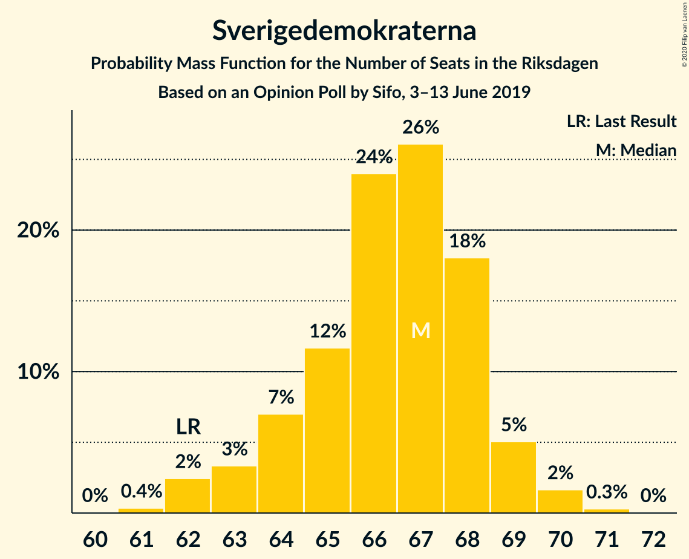
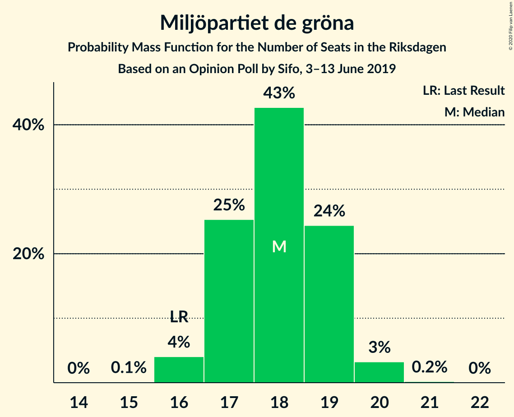
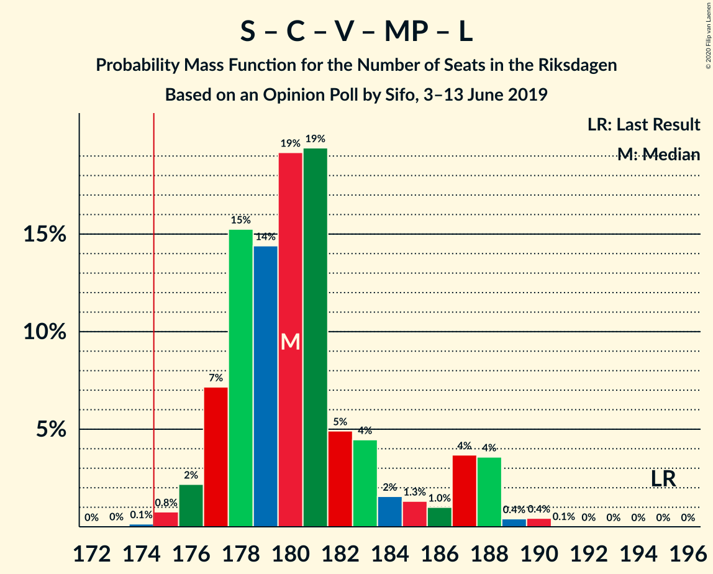

# Opinion Poll by Sifo, 3–13 June 2019

<a href="#voting-intentions">Voting Intentions</a> | <a href="#seats">Seats</a> | <a href="#coalitions">Coalitions</a> | <a href="#technical-information">Technical Information</a>

## Voting Intentions

### Confidence Intervals

| Party | Last Result | Poll Result | 80% Confidence Interval | 90% Confidence Interval | 95% Confidence Interval | 99% Confidence Interval |
|:-----:|:-----------:|:-----------:|:-----------------------:|:-----------------------:|:-----------------------:|:-----------------------:|
| Sveriges socialdemokratiska arbetareparti | 28.3% | 26.5% | 25.9–27.1% |25.7–27.3% |25.6–27.4% |25.3–27.7% |
| Moderata samlingspartiet | 19.8% | 18.4% | 17.9–18.9% |17.7–19.1% |17.6–19.2% |17.4–19.5% |
| Sverigedemokraterna | 17.5% | 18.1% | 17.6–18.6% |17.4–18.8% |17.3–18.9% |17.1–19.2% |
| Kristdemokraterna | 6.3% | 9.5% | 9.1–9.9% |9.0–10.0% |8.9–10.1% |8.7–10.3% |
| Centerpartiet | 8.6% | 8.8% | 8.4–9.2% |8.3–9.3% |8.2–9.4% |8.1–9.6% |
| Vänsterpartiet | 8.0% | 8.6% | 8.2–9.0% |8.1–9.1% |8.0–9.2% |7.9–9.4% |
| Miljöpartiet de gröna | 4.4% | 4.9% | 4.6–5.2% |4.5–5.3% |4.5–5.4% |4.3–5.5% |
| Liberalerna | 5.5% | 3.7% | 3.5–4.0% |3.4–4.1% |3.3–4.1% |3.2–4.3% |

*Note:* The poll result column reflects the actual value used in the calculations. Published results may vary slightly, and in addition be rounded to fewer digits.

## Seats

### Confidence Intervals

| Party | Last Result | Median | 80% Confidence Interval | 90% Confidence Interval | 95% Confidence Interval | 99% Confidence Interval |
|:-----:|:-----------:|:------:|:-----------------------:|:-----------------------:|:-----------------------:|:-----------------------:|
| <a href="#sveriges-socialdemokratiska-arbetareparti">Sveriges socialdemokratiska arbetareparti</a> | 100 | 97 | 94–100 |94–100 |93–101 |91–102 |
| <a href="#moderata-samlingspartiet">Moderata samlingspartiet</a> | 70 | 67 | 65–70 |65–70 |64–71 |63–71 |
| <a href="#sverigedemokraterna">Sverigedemokraterna</a> | 62 | 67 | 64–68 |63–69 |62–69 |62–70 |
| <a href="#kristdemokraterna">Kristdemokraterna</a> | 22 | 35 | 33–36 |33–37 |32–37 |32–38 |
| <a href="#centerpartiet">Centerpartiet</a> | 31 | 32 | 31–34 |30–34 |30–35 |29–35 |
| <a href="#vänsterpartiet">Vänsterpartiet</a> | 28 | 32 | 30–33 |30–34 |30–34 |29–34 |
| <a href="#miljöpartiet-de-gröna">Miljöpartiet de gröna</a> | 16 | 18 | 17–19 |17–19 |16–20 |16–20 |
| <a href="#liberalerna">Liberalerna</a> | 20 | 0 | 0–14 |0–14 |0–15 |0–15 |

### Sveriges socialdemokratiska arbetareparti

*For a full overview of the results for this party, see the [Sveriges socialdemokratiska arbetareparti](party-sverigessocialdemokratiskaarbetareparti.html) page.*

| Number of Seats | Probability | Accumulated | Special Marks |
|:---------------:|:-----------:|:-----------:|:-------------:|
| 89 | 0.1% | 100% |  |
| 90 | 0.2% | 99.9% |  |
| 91 | 0.3% | 99.8% |  |
| 92 | 0.8% | 99.5% |  |
| 93 | 3% | 98.7% |  |
| 94 | 9% | 96% |  |
| 95 | 10% | 87% |  |
| 96 | 15% | 77% |  |
| 97 | 15% | 62% | Median |
| 98 | 20% | 47% |  |
| 99 | 17% | 27% |  |
| 100 | 6% | 10% | Last Result |
| 101 | 3% | 4% |  |
| 102 | 0.6% | 0.8% |  |
| 103 | 0.1% | 0.2% |  |
| 104 | 0% | 0% |  |

### Moderata samlingspartiet

*For a full overview of the results for this party, see the [Moderata samlingspartiet](party-moderatasamlingspartiet.html) page.*

| Number of Seats | Probability | Accumulated | Special Marks |
|:---------------:|:-----------:|:-----------:|:-------------:|
| 62 | 0.4% | 100% |  |
| 63 | 2% | 99.5% |  |
| 64 | 3% | 98% |  |
| 65 | 10% | 95% |  |
| 66 | 18% | 85% |  |
| 67 | 23% | 67% | Median |
| 68 | 19% | 45% |  |
| 69 | 15% | 25% |  |
| 70 | 7% | 11% | Last Result |
| 71 | 3% | 4% |  |
| 72 | 0.4% | 0.5% |  |
| 73 | 0.1% | 0.1% |  |
| 74 | 0% | 0% |  |

### Sverigedemokraterna

*For a full overview of the results for this party, see the [Sverigedemokraterna](party-sverigedemokraterna.html) page.*

| Number of Seats | Probability | Accumulated | Special Marks |
|:---------------:|:-----------:|:-----------:|:-------------:|
| 61 | 0.4% | 100% |  |
| 62 | 2% | 99.6% | Last Result |
| 63 | 3% | 97% |  |
| 64 | 7% | 94% |  |
| 65 | 12% | 87% |  |
| 66 | 24% | 75% |  |
| 67 | 26% | 51% | Median |
| 68 | 18% | 25% |  |
| 69 | 5% | 7% |  |
| 70 | 2% | 2% |  |
| 71 | 0.3% | 0.3% |  |
| 72 | 0% | 0% |  |

### Kristdemokraterna

*For a full overview of the results for this party, see the [Kristdemokraterna](party-kristdemokraterna.html) page.*

| Number of Seats | Probability | Accumulated | Special Marks |
|:---------------:|:-----------:|:-----------:|:-------------:|
| 22 | 0% | 100% | Last Result |
| 23 | 0% | 100% |  |
| 24 | 0% | 100% |  |
| 25 | 0% | 100% |  |
| 26 | 0% | 100% |  |
| 27 | 0% | 100% |  |
| 28 | 0% | 100% |  |
| 29 | 0% | 100% |  |
| 30 | 0% | 100% |  |
| 31 | 0.3% | 100% |  |
| 32 | 2% | 99.7% |  |
| 33 | 11% | 97% |  |
| 34 | 24% | 87% |  |
| 35 | 30% | 63% | Median |
| 36 | 27% | 33% |  |
| 37 | 5% | 7% |  |
| 38 | 1.1% | 1.2% |  |
| 39 | 0.1% | 0.1% |  |
| 40 | 0% | 0% |  |

### Centerpartiet

*For a full overview of the results for this party, see the [Centerpartiet](party-centerpartiet.html) page.*

| Number of Seats | Probability | Accumulated | Special Marks |
|:---------------:|:-----------:|:-----------:|:-------------:|
| 28 | 0.1% | 100% |  |
| 29 | 0.8% | 99.9% |  |
| 30 | 5% | 99.2% |  |
| 31 | 16% | 94% | Last Result |
| 32 | 36% | 78% | Median |
| 33 | 28% | 42% |  |
| 34 | 12% | 14% |  |
| 35 | 2% | 3% |  |
| 36 | 0.3% | 0.3% |  |
| 37 | 0% | 0% |  |

### Vänsterpartiet

*For a full overview of the results for this party, see the [Vänsterpartiet](party-vänsterpartiet.html) page.*

| Number of Seats | Probability | Accumulated | Special Marks |
|:---------------:|:-----------:|:-----------:|:-------------:|
| 28 | 0.3% | 100% | Last Result |
| 29 | 2% | 99.7% |  |
| 30 | 15% | 98% |  |
| 31 | 31% | 83% |  |
| 32 | 37% | 52% | Median |
| 33 | 9% | 15% |  |
| 34 | 6% | 6% |  |
| 35 | 0.2% | 0.2% |  |
| 36 | 0% | 0% |  |

### Miljöpartiet de gröna

*For a full overview of the results for this party, see the [Miljöpartiet de gröna](party-miljöpartietdegröna.html) page.*

| Number of Seats | Probability | Accumulated | Special Marks |
|:---------------:|:-----------:|:-----------:|:-------------:|
| 15 | 0.1% | 100% |  |
| 16 | 4% | 99.9% | Last Result |
| 17 | 25% | 96% |  |
| 18 | 43% | 71% | Median |
| 19 | 24% | 28% |  |
| 20 | 3% | 3% |  |
| 21 | 0.2% | 0.2% |  |
| 22 | 0% | 0% |  |

### Liberalerna

*For a full overview of the results for this party, see the [Liberalerna](party-liberalerna.html) page.*

| Number of Seats | Probability | Accumulated | Special Marks |
|:---------------:|:-----------:|:-----------:|:-------------:|
| 0 | 89% | 100% | Median |
| 1 | 0% | 11% |  |
| 2 | 0% | 11% |  |
| 3 | 0% | 11% |  |
| 4 | 0% | 11% |  |
| 5 | 0% | 11% |  |
| 6 | 0% | 11% |  |
| 7 | 0% | 11% |  |
| 8 | 0% | 11% |  |
| 9 | 0% | 11% |  |
| 10 | 0% | 11% |  |
| 11 | 0% | 11% |  |
| 12 | 0% | 11% |  |
| 13 | 0% | 11% |  |
| 14 | 6% | 11% |  |
| 15 | 4% | 4% |  |
| 16 | 0.1% | 0.1% |  |
| 17 | 0% | 0% |  |
| 18 | 0% | 0% |  |
| 19 | 0% | 0% |  |
| 20 | 0% | 0% | Last Result |

## Coalitions

### Confidence Intervals

| Coalition | Last Result | Median | Majority? | 80% Confidence Interval | 90% Confidence Interval | 95% Confidence Interval | 99% Confidence Interval |
|:---------:|:-----------:|:------:|:---------:|:-----------------------:|:-----------------------:|:-----------------------:|:-----------------------:|
| Sveriges socialdemokratiska arbetareparti – Moderata samlingspartiet – Centerpartiet | 201 | 197 | 100% | 192–200 | 190–201 | 188–201 | 187–202 |
| Sveriges socialdemokratiska arbetareparti – Centerpartiet – Vänsterpartiet – Miljöpartiet de gröna – Liberalerna | 195 | 180 | 99.8% | 177–185 | 177–187 | 176–188 | 175–190 |
| Moderata samlingspartiet – Sverigedemokraterna – Kristdemokraterna | 154 | 169 | 0.2% | 164–172 | 162–172 | 161–173 | 159–174 |
| Sveriges socialdemokratiska arbetareparti – Moderata samlingspartiet | 170 | 165 | 0% | 160–167 | 159–168 | 157–169 | 156–170 |
| Sveriges socialdemokratiska arbetareparti – Centerpartiet – Miljöpartiet de gröna – Liberalerna | 167 | 148 | 0% | 146–154 | 145–157 | 144–158 | 143–159 |
| Sveriges socialdemokratiska arbetareparti – Vänsterpartiet – Miljöpartiet de gröna | 144 | 147 | 0% | 143–149 | 142–150 | 141–151 | 139–152 |
| Moderata samlingspartiet – Kristdemokraterna – Centerpartiet – Liberalerna | 143 | 135 | 0% | 133–141 | 132–144 | 131–145 | 130–146 |
| Moderata samlingspartiet – Kristdemokraterna – Centerpartiet | 123 | 135 | 0% | 131–137 | 129–138 | 128–139 | 127–140 |
| Moderata samlingspartiet – Sverigedemokraterna | 132 | 134 | 0% | 130–137 | 128–137 | 127–138 | 126–139 |
| Sveriges socialdemokratiska arbetareparti – Vänsterpartiet | 128 | 129 | 0% | 125–131 | 124–132 | 123–133 | 122–134 |
| Sveriges socialdemokratiska arbetareparti – Miljöpartiet de gröna | 116 | 116 | 0% | 112–118 | 111–118 | 111–119 | 108–120 |
| Moderata samlingspartiet – Centerpartiet – Liberalerna | 121 | 100 | 0% | 98–108 | 97–111 | 97–111 | 96–113 |
| Moderata samlingspartiet – Centerpartiet | 101 | 100 | 0% | 97–102 | 96–103 | 95–103 | 94–104 |

### Sveriges socialdemokratiska arbetareparti – Moderata samlingspartiet – Centerpartiet

| Number of Seats | Probability | Accumulated | Special Marks |
|:---------------:|:-----------:|:-----------:|:-------------:|
| 185 | 0.1% | 100% |  |
| 186 | 0.3% | 99.9% |  |
| 187 | 0.9% | 99.6% |  |
| 188 | 1.5% | 98.7% |  |
| 189 | 2% | 97% |  |
| 190 | 1.4% | 95% |  |
| 191 | 3% | 94% |  |
| 192 | 0.6% | 91% |  |
| 193 | 2% | 90% |  |
| 194 | 3% | 88% |  |
| 195 | 6% | 85% |  |
| 196 | 11% | 79% | Median |
| 197 | 28% | 68% |  |
| 198 | 14% | 40% |  |
| 199 | 14% | 26% |  |
| 200 | 6% | 12% |  |
| 201 | 4% | 5% | Last Result |
| 202 | 1.3% | 2% |  |
| 203 | 0.3% | 0.4% |  |
| 204 | 0% | 0% |  |

### Sveriges socialdemokratiska arbetareparti – Centerpartiet – Vänsterpartiet – Miljöpartiet de gröna – Liberalerna

| Number of Seats | Probability | Accumulated | Special Marks |
|:---------------:|:-----------:|:-----------:|:-------------:|
| 173 | 0% | 100% |  |
| 174 | 0.1% | 99.9% |  |
| 175 | 0.8% | 99.8% | Majority |
| 176 | 2% | 99.0% |  |
| 177 | 7% | 97% |  |
| 178 | 15% | 90% |  |
| 179 | 14% | 74% | Median |
| 180 | 19% | 60% |  |
| 181 | 19% | 41% |  |
| 182 | 5% | 21% |  |
| 183 | 4% | 17% |  |
| 184 | 2% | 12% |  |
| 185 | 1.3% | 10% |  |
| 186 | 1.0% | 9% |  |
| 187 | 4% | 8% |  |
| 188 | 4% | 4% |  |
| 189 | 0.4% | 0.9% |  |
| 190 | 0.4% | 0.5% |  |
| 191 | 0.1% | 0.1% |  |
| 192 | 0% | 0% |  |
| 193 | 0% | 0% |  |
| 194 | 0% | 0% |  |
| 195 | 0% | 0% | Last Result |

### Moderata samlingspartiet – Sverigedemokraterna – Kristdemokraterna

| Number of Seats | Probability | Accumulated | Special Marks |
|:---------------:|:-----------:|:-----------:|:-------------:|
| 154 | 0% | 100% | Last Result |
| 155 | 0% | 100% |  |
| 156 | 0% | 100% |  |
| 157 | 0% | 100% |  |
| 158 | 0.1% | 100% |  |
| 159 | 0.4% | 99.9% |  |
| 160 | 0.4% | 99.5% |  |
| 161 | 4% | 99.1% |  |
| 162 | 4% | 96% |  |
| 163 | 1.0% | 92% |  |
| 164 | 1.3% | 91% |  |
| 165 | 2% | 90% |  |
| 166 | 4% | 88% |  |
| 167 | 5% | 83% |  |
| 168 | 19% | 79% |  |
| 169 | 19% | 59% | Median |
| 170 | 14% | 40% |  |
| 171 | 15% | 26% |  |
| 172 | 7% | 10% |  |
| 173 | 2% | 3% |  |
| 174 | 0.8% | 1.0% |  |
| 175 | 0.1% | 0.2% | Majority |
| 176 | 0% | 0.1% |  |
| 177 | 0% | 0% |  |

### Sveriges socialdemokratiska arbetareparti – Moderata samlingspartiet

| Number of Seats | Probability | Accumulated | Special Marks |
|:---------------:|:-----------:|:-----------:|:-------------:|
| 154 | 0% | 100% |  |
| 155 | 0.3% | 99.9% |  |
| 156 | 1.3% | 99.6% |  |
| 157 | 1.1% | 98% |  |
| 158 | 1.4% | 97% |  |
| 159 | 4% | 96% |  |
| 160 | 2% | 92% |  |
| 161 | 2% | 90% |  |
| 162 | 7% | 88% |  |
| 163 | 7% | 81% |  |
| 164 | 17% | 74% | Median |
| 165 | 25% | 58% |  |
| 166 | 13% | 32% |  |
| 167 | 12% | 20% |  |
| 168 | 5% | 8% |  |
| 169 | 3% | 4% |  |
| 170 | 1.0% | 1.2% | Last Result |
| 171 | 0.2% | 0.2% |  |
| 172 | 0% | 0% |  |

### Sveriges socialdemokratiska arbetareparti – Centerpartiet – Miljöpartiet de gröna – Liberalerna

| Number of Seats | Probability | Accumulated | Special Marks |
|:---------------:|:-----------:|:-----------:|:-------------:|
| 142 | 0.2% | 100% |  |
| 143 | 0.8% | 99.8% |  |
| 144 | 2% | 99.0% |  |
| 145 | 5% | 97% |  |
| 146 | 12% | 92% |  |
| 147 | 12% | 80% | Median |
| 148 | 22% | 67% |  |
| 149 | 15% | 45% |  |
| 150 | 13% | 30% |  |
| 151 | 4% | 17% |  |
| 152 | 3% | 14% |  |
| 153 | 0.8% | 11% |  |
| 154 | 0.9% | 10% |  |
| 155 | 0.6% | 10% |  |
| 156 | 3% | 9% |  |
| 157 | 2% | 6% |  |
| 158 | 3% | 4% |  |
| 159 | 0.4% | 0.8% |  |
| 160 | 0.4% | 0.4% |  |
| 161 | 0% | 0.1% |  |
| 162 | 0% | 0% |  |
| 163 | 0% | 0% |  |
| 164 | 0% | 0% |  |
| 165 | 0% | 0% |  |
| 166 | 0% | 0% |  |
| 167 | 0% | 0% | Last Result |

### Sveriges socialdemokratiska arbetareparti – Vänsterpartiet – Miljöpartiet de gröna

| Number of Seats | Probability | Accumulated | Special Marks |
|:---------------:|:-----------:|:-----------:|:-------------:|
| 137 | 0.1% | 100% |  |
| 138 | 0.3% | 99.9% |  |
| 139 | 0.8% | 99.6% |  |
| 140 | 0.3% | 98.8% |  |
| 141 | 2% | 98.5% |  |
| 142 | 6% | 96% |  |
| 143 | 2% | 90% |  |
| 144 | 7% | 89% | Last Result |
| 145 | 13% | 82% |  |
| 146 | 14% | 69% |  |
| 147 | 8% | 55% | Median |
| 148 | 24% | 47% |  |
| 149 | 16% | 23% |  |
| 150 | 4% | 7% |  |
| 151 | 0.8% | 3% |  |
| 152 | 2% | 2% |  |
| 153 | 0.4% | 0.4% |  |
| 154 | 0% | 0% |  |

### Moderata samlingspartiet – Kristdemokraterna – Centerpartiet – Liberalerna

| Number of Seats | Probability | Accumulated | Special Marks |
|:---------------:|:-----------:|:-----------:|:-------------:|
| 129 | 0.1% | 100% |  |
| 130 | 0.6% | 99.9% |  |
| 131 | 2% | 99.3% |  |
| 132 | 5% | 97% |  |
| 133 | 13% | 92% |  |
| 134 | 13% | 79% | Median |
| 135 | 19% | 66% |  |
| 136 | 12% | 47% |  |
| 137 | 15% | 35% |  |
| 138 | 6% | 20% |  |
| 139 | 3% | 14% |  |
| 140 | 0.6% | 11% |  |
| 141 | 0.7% | 11% |  |
| 142 | 0.9% | 10% |  |
| 143 | 3% | 9% | Last Result |
| 144 | 2% | 6% |  |
| 145 | 2% | 4% |  |
| 146 | 0.8% | 1.3% |  |
| 147 | 0.3% | 0.5% |  |
| 148 | 0.1% | 0.1% |  |
| 149 | 0% | 0% |  |

### Moderata samlingspartiet – Kristdemokraterna – Centerpartiet

| Number of Seats | Probability | Accumulated | Special Marks |
|:---------------:|:-----------:|:-----------:|:-------------:|
| 123 | 0% | 100% | Last Result |
| 124 | 0% | 100% |  |
| 125 | 0% | 100% |  |
| 126 | 0.1% | 99.9% |  |
| 127 | 0.7% | 99.8% |  |
| 128 | 2% | 99.1% |  |
| 129 | 3% | 97% |  |
| 130 | 2% | 94% |  |
| 131 | 5% | 92% |  |
| 132 | 5% | 87% |  |
| 133 | 14% | 82% |  |
| 134 | 13% | 68% | Median |
| 135 | 19% | 55% |  |
| 136 | 12% | 37% |  |
| 137 | 15% | 25% |  |
| 138 | 6% | 9% |  |
| 139 | 3% | 3% |  |
| 140 | 0.5% | 0.6% |  |
| 141 | 0.1% | 0.1% |  |
| 142 | 0% | 0% |  |

### Moderata samlingspartiet – Sverigedemokraterna

| Number of Seats | Probability | Accumulated | Special Marks |
|:---------------:|:-----------:|:-----------:|:-------------:|
| 125 | 0.1% | 100% |  |
| 126 | 0.9% | 99.8% |  |
| 127 | 3% | 98.9% |  |
| 128 | 1.1% | 96% |  |
| 129 | 4% | 95% |  |
| 130 | 2% | 91% |  |
| 131 | 4% | 89% |  |
| 132 | 7% | 85% | Last Result |
| 133 | 21% | 78% |  |
| 134 | 17% | 57% | Median |
| 135 | 19% | 39% |  |
| 136 | 8% | 20% |  |
| 137 | 9% | 13% |  |
| 138 | 2% | 3% |  |
| 139 | 1.1% | 1.3% |  |
| 140 | 0.2% | 0.2% |  |
| 141 | 0% | 0% |  |

### Sveriges socialdemokratiska arbetareparti – Vänsterpartiet

| Number of Seats | Probability | Accumulated | Special Marks |
|:---------------:|:-----------:|:-----------:|:-------------:|
| 120 | 0.1% | 100% |  |
| 121 | 0.3% | 99.9% |  |
| 122 | 0.6% | 99.5% |  |
| 123 | 2% | 99.0% |  |
| 124 | 4% | 97% |  |
| 125 | 4% | 93% |  |
| 126 | 7% | 89% |  |
| 127 | 12% | 83% |  |
| 128 | 15% | 70% | Last Result |
| 129 | 12% | 55% | Median |
| 130 | 21% | 43% |  |
| 131 | 14% | 22% |  |
| 132 | 4% | 7% |  |
| 133 | 3% | 3% |  |
| 134 | 0.6% | 0.9% |  |
| 135 | 0.3% | 0.3% |  |
| 136 | 0% | 0% |  |

### Sveriges socialdemokratiska arbetareparti – Miljöpartiet de gröna

| Number of Seats | Probability | Accumulated | Special Marks |
|:---------------:|:-----------:|:-----------:|:-------------:|
| 106 | 0.1% | 100% |  |
| 107 | 0.1% | 99.9% |  |
| 108 | 0.3% | 99.8% |  |
| 109 | 0.4% | 99.4% |  |
| 110 | 1.0% | 99.0% |  |
| 111 | 5% | 98% |  |
| 112 | 9% | 93% |  |
| 113 | 11% | 84% |  |
| 114 | 7% | 73% |  |
| 115 | 15% | 66% | Median |
| 116 | 25% | 51% | Last Result |
| 117 | 13% | 26% |  |
| 118 | 8% | 13% |  |
| 119 | 3% | 5% |  |
| 120 | 1.0% | 2% |  |
| 121 | 0.4% | 0.5% |  |
| 122 | 0% | 0% |  |

### Moderata samlingspartiet – Centerpartiet – Liberalerna

| Number of Seats | Probability | Accumulated | Special Marks |
|:---------------:|:-----------:|:-----------:|:-------------:|
| 95 | 0.2% | 100% |  |
| 96 | 2% | 99.8% |  |
| 97 | 6% | 98% |  |
| 98 | 12% | 93% |  |
| 99 | 17% | 80% | Median |
| 100 | 15% | 64% |  |
| 101 | 17% | 49% |  |
| 102 | 13% | 32% |  |
| 103 | 7% | 19% |  |
| 104 | 1.2% | 12% |  |
| 105 | 0.3% | 11% |  |
| 106 | 0.1% | 11% |  |
| 107 | 0.2% | 11% |  |
| 108 | 1.4% | 10% |  |
| 109 | 0.9% | 9% |  |
| 110 | 3% | 8% |  |
| 111 | 3% | 5% |  |
| 112 | 1.2% | 2% |  |
| 113 | 0.5% | 0.7% |  |
| 114 | 0.1% | 0.2% |  |
| 115 | 0% | 0.1% |  |
| 116 | 0% | 0% |  |
| 117 | 0% | 0% |  |
| 118 | 0% | 0% |  |
| 119 | 0% | 0% |  |
| 120 | 0% | 0% |  |
| 121 | 0% | 0% | Last Result |

### Moderata samlingspartiet – Centerpartiet

| Number of Seats | Probability | Accumulated | Special Marks |
|:---------------:|:-----------:|:-----------:|:-------------:|
| 92 | 0% | 100% |  |
| 93 | 0.2% | 99.9% |  |
| 94 | 2% | 99.7% |  |
| 95 | 3% | 98% |  |
| 96 | 4% | 95% |  |
| 97 | 8% | 92% |  |
| 98 | 13% | 83% |  |
| 99 | 17% | 70% | Median |
| 100 | 15% | 53% |  |
| 101 | 17% | 38% | Last Result |
| 102 | 13% | 21% |  |
| 103 | 7% | 8% |  |
| 104 | 1.2% | 2% |  |
| 105 | 0.3% | 0.4% |  |
| 106 | 0% | 0.1% |  |
| 107 | 0% | 0% |  |

## Technical Information

### Opinion Poll

+ **Polling firm:** Sifo
+ **Commissioner(s):** —
+ **Fieldwork period:** 3–13 June 2019

### Calculations

+ **Sample size:** 9261
+ **Simulations done:** 1,048,576
+ **Error estimate:** 0.56%

