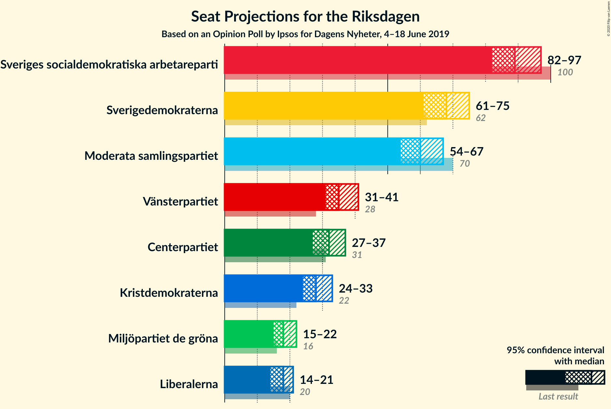
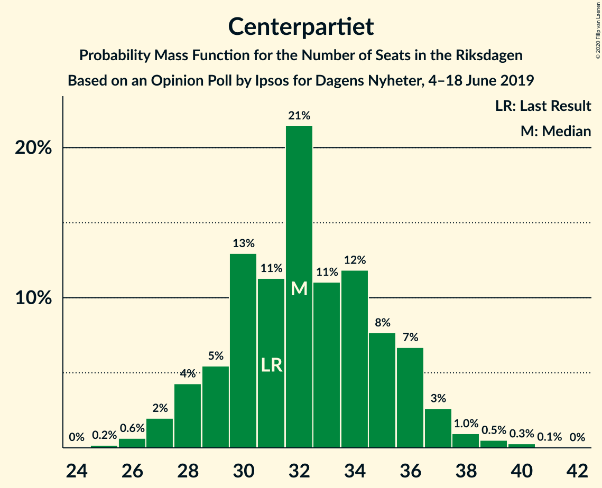
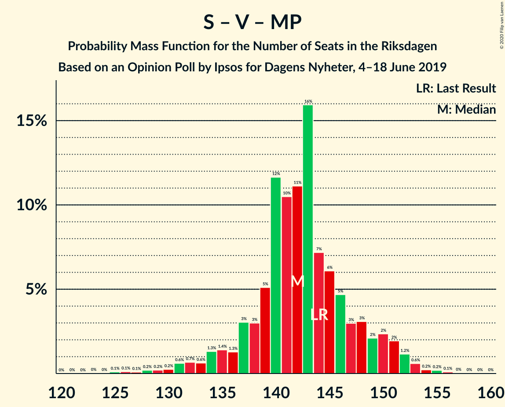

# Opinion Poll by Ipsos for Dagens Nyheter, 4–18 June 2019

<a href="#voting-intentions">Voting Intentions</a> | <a href="#seats">Seats</a> | <a href="#coalitions">Coalitions</a> | <a href="#technical-information">Technical Information</a>

## Voting Intentions

### Confidence Intervals

| Party | Last Result | Poll Result | 80% Confidence Interval | 90% Confidence Interval | 95% Confidence Interval | 99% Confidence Interval |
|:-----:|:-----------:|:-----------:|:-----------------------:|:-----------------------:|:-----------------------:|:-----------------------:|
| Sveriges socialdemokratiska arbetareparti | 28.3% | 25.0% | 23.7–26.4% |23.3–26.9% |23.0–27.2% |22.3–27.9% |
| Sverigedemokraterna | 17.5% | 19.0% | 17.8–20.3% |17.5–20.7% |17.2–21.0% |16.6–21.6% |
| Moderata samlingspartiet | 19.8% | 17.0% | 15.8–18.2% |15.5–18.6% |15.2–18.9% |14.7–19.5% |
| Vänsterpartiet | 8.0% | 10.0% | 9.1–11.0% |8.8–11.3% |8.6–11.6% |8.2–12.1% |
| Centerpartiet | 8.6% | 9.0% | 8.2–10.0% |7.9–10.3% |7.7–10.5% |7.3–11.0% |
| Kristdemokraterna | 6.3% | 8.0% | 7.2–8.9% |7.0–9.2% |6.8–9.4% |6.4–9.9% |
| Liberalerna | 5.5% | 5.0% | 4.4–5.8% |4.2–6.0% |4.1–6.2% |3.8–6.6% |
| Miljöpartiet de gröna | 4.4% | 5.0% | 4.4–5.8% |4.2–6.0% |4.1–6.2% |3.8–6.6% |

*Note:* The poll result column reflects the actual value used in the calculations. Published results may vary slightly, and in addition be rounded to fewer digits.

## Seats

### Confidence Intervals

| Party | Last Result | Median | 80% Confidence Interval | 90% Confidence Interval | 95% Confidence Interval | 99% Confidence Interval |
|:-----:|:-----------:|:------:|:-----------------------:|:-----------------------:|:-----------------------:|:-----------------------:|
| <a href="#sveriges-socialdemokratiska-arbetareparti">Sveriges socialdemokratiska arbetareparti</a> | 100 | 89 | 84–94 |83–95 |82–97 |79–100 |
| <a href="#sverigedemokraterna">Sverigedemokraterna</a> | 62 | 68 | 63–72 |62–73 |61–75 |59–77 |
| <a href="#moderata-samlingspartiet">Moderata samlingspartiet</a> | 70 | 60 | 56–65 |55–66 |54–67 |52–69 |
| <a href="#vänsterpartiet">Vänsterpartiet</a> | 28 | 35 | 32–39 |31–40 |31–41 |29–43 |
| <a href="#centerpartiet">Centerpartiet</a> | 31 | 32 | 29–36 |28–36 |27–37 |26–39 |
| <a href="#kristdemokraterna">Kristdemokraterna</a> | 22 | 28 | 26–31 |25–32 |24–33 |23–35 |
| <a href="#liberalerna">Liberalerna</a> | 20 | 18 | 16–21 |15–21 |14–21 |0–23 |
| <a href="#miljöpartiet-de-gröna">Miljöpartiet de gröna</a> | 16 | 18 | 16–20 |15–21 |15–22 |0–23 |

### Sveriges socialdemokratiska arbetareparti

*For a full overview of the results for this party, see the [Sveriges socialdemokratiska arbetareparti](party-sverigessocialdemokratiskaarbetareparti.html) page.*

| Number of Seats | Probability | Accumulated | Special Marks |
|:---------------:|:-----------:|:-----------:|:-------------:|
| 77 | 0.1% | 100% |  |
| 78 | 0.1% | 99.9% |  |
| 79 | 0.4% | 99.8% |  |
| 80 | 0.7% | 99.4% |  |
| 81 | 1.1% | 98.7% |  |
| 82 | 2% | 98% |  |
| 83 | 3% | 96% |  |
| 84 | 4% | 93% |  |
| 85 | 4% | 88% |  |
| 86 | 9% | 84% |  |
| 87 | 8% | 75% |  |
| 88 | 12% | 66% |  |
| 89 | 9% | 54% | Median |
| 90 | 12% | 45% |  |
| 91 | 10% | 34% |  |
| 92 | 6% | 24% |  |
| 93 | 6% | 18% |  |
| 94 | 5% | 12% |  |
| 95 | 2% | 7% |  |
| 96 | 2% | 5% |  |
| 97 | 1.1% | 3% |  |
| 98 | 0.6% | 2% |  |
| 99 | 0.4% | 1.1% |  |
| 100 | 0.4% | 0.7% | Last Result |
| 101 | 0.1% | 0.3% |  |
| 102 | 0.1% | 0.2% |  |
| 103 | 0.1% | 0.1% |  |
| 104 | 0% | 0% |  |

### Sverigedemokraterna

*For a full overview of the results for this party, see the [Sverigedemokraterna](party-sverigedemokraterna.html) page.*

| Number of Seats | Probability | Accumulated | Special Marks |
|:---------------:|:-----------:|:-----------:|:-------------:|
| 57 | 0.1% | 100% |  |
| 58 | 0.2% | 99.9% |  |
| 59 | 0.5% | 99.7% |  |
| 60 | 1.2% | 99.2% |  |
| 61 | 2% | 98% |  |
| 62 | 4% | 96% | Last Result |
| 63 | 4% | 92% |  |
| 64 | 7% | 88% |  |
| 65 | 6% | 81% |  |
| 66 | 15% | 75% |  |
| 67 | 6% | 60% |  |
| 68 | 15% | 54% | Median |
| 69 | 8% | 39% |  |
| 70 | 13% | 30% |  |
| 71 | 4% | 17% |  |
| 72 | 6% | 13% |  |
| 73 | 2% | 7% |  |
| 74 | 2% | 5% |  |
| 75 | 1.1% | 3% |  |
| 76 | 1.0% | 2% |  |
| 77 | 0.4% | 0.8% |  |
| 78 | 0.3% | 0.4% |  |
| 79 | 0.1% | 0.2% |  |
| 80 | 0.1% | 0.1% |  |
| 81 | 0% | 0% |  |

### Moderata samlingspartiet

*For a full overview of the results for this party, see the [Moderata samlingspartiet](party-moderatasamlingspartiet.html) page.*

| Number of Seats | Probability | Accumulated | Special Marks |
|:---------------:|:-----------:|:-----------:|:-------------:|
| 50 | 0% | 100% |  |
| 51 | 0.1% | 99.9% |  |
| 52 | 0.5% | 99.9% |  |
| 53 | 1.4% | 99.4% |  |
| 54 | 2% | 98% |  |
| 55 | 4% | 96% |  |
| 56 | 3% | 92% |  |
| 57 | 3% | 89% |  |
| 58 | 5% | 86% |  |
| 59 | 15% | 81% |  |
| 60 | 20% | 66% | Median |
| 61 | 15% | 46% |  |
| 62 | 11% | 30% |  |
| 63 | 4% | 19% |  |
| 64 | 3% | 15% |  |
| 65 | 3% | 12% |  |
| 66 | 5% | 9% |  |
| 67 | 3% | 4% |  |
| 68 | 1.1% | 2% |  |
| 69 | 0.4% | 0.8% |  |
| 70 | 0.2% | 0.4% | Last Result |
| 71 | 0.1% | 0.2% |  |
| 72 | 0.1% | 0.1% |  |
| 73 | 0% | 0% |  |

### Vänsterpartiet

*For a full overview of the results for this party, see the [Vänsterpartiet](party-vänsterpartiet.html) page.*

| Number of Seats | Probability | Accumulated | Special Marks |
|:---------------:|:-----------:|:-----------:|:-------------:|
| 28 | 0.2% | 100% | Last Result |
| 29 | 0.6% | 99.7% |  |
| 30 | 1.4% | 99.1% |  |
| 31 | 3% | 98% |  |
| 32 | 5% | 95% |  |
| 33 | 9% | 90% |  |
| 34 | 16% | 81% |  |
| 35 | 19% | 65% | Median |
| 36 | 17% | 46% |  |
| 37 | 7% | 29% |  |
| 38 | 5% | 22% |  |
| 39 | 8% | 17% |  |
| 40 | 5% | 9% |  |
| 41 | 3% | 4% |  |
| 42 | 0.9% | 2% |  |
| 43 | 0.3% | 0.6% |  |
| 44 | 0.2% | 0.3% |  |
| 45 | 0.1% | 0.1% |  |
| 46 | 0% | 0% |  |

### Centerpartiet

*For a full overview of the results for this party, see the [Centerpartiet](party-centerpartiet.html) page.*

| Number of Seats | Probability | Accumulated | Special Marks |
|:---------------:|:-----------:|:-----------:|:-------------:|
| 24 | 0% | 100% |  |
| 25 | 0.2% | 99.9% |  |
| 26 | 0.6% | 99.8% |  |
| 27 | 2% | 99.1% |  |
| 28 | 4% | 97% |  |
| 29 | 5% | 93% |  |
| 30 | 13% | 87% |  |
| 31 | 11% | 74% | Last Result |
| 32 | 21% | 63% | Median |
| 33 | 11% | 42% |  |
| 34 | 12% | 31% |  |
| 35 | 8% | 19% |  |
| 36 | 7% | 11% |  |
| 37 | 3% | 4% |  |
| 38 | 1.0% | 2% |  |
| 39 | 0.5% | 0.9% |  |
| 40 | 0.3% | 0.4% |  |
| 41 | 0.1% | 0.1% |  |
| 42 | 0% | 0% |  |

### Kristdemokraterna

*For a full overview of the results for this party, see the [Kristdemokraterna](party-kristdemokraterna.html) page.*

| Number of Seats | Probability | Accumulated | Special Marks |
|:---------------:|:-----------:|:-----------:|:-------------:|
| 21 | 0.1% | 100% |  |
| 22 | 0.3% | 99.9% | Last Result |
| 23 | 1.0% | 99.6% |  |
| 24 | 2% | 98.7% |  |
| 25 | 6% | 96% |  |
| 26 | 10% | 91% |  |
| 27 | 13% | 81% |  |
| 28 | 19% | 67% | Median |
| 29 | 18% | 48% |  |
| 30 | 12% | 30% |  |
| 31 | 9% | 18% |  |
| 32 | 5% | 9% |  |
| 33 | 2% | 5% |  |
| 34 | 2% | 2% |  |
| 35 | 0.5% | 0.8% |  |
| 36 | 0.2% | 0.3% |  |
| 37 | 0.1% | 0.1% |  |
| 38 | 0% | 0% |  |

### Liberalerna

*For a full overview of the results for this party, see the [Liberalerna](party-liberalerna.html) page.*

| Number of Seats | Probability | Accumulated | Special Marks |
|:---------------:|:-----------:|:-----------:|:-------------:|
| 0 | 1.4% | 100% |  |
| 1 | 0% | 98.6% |  |
| 2 | 0% | 98.6% |  |
| 3 | 0% | 98.6% |  |
| 4 | 0% | 98.6% |  |
| 5 | 0% | 98.6% |  |
| 6 | 0% | 98.6% |  |
| 7 | 0% | 98.6% |  |
| 8 | 0% | 98.6% |  |
| 9 | 0% | 98.6% |  |
| 10 | 0% | 98.6% |  |
| 11 | 0% | 98.6% |  |
| 12 | 0% | 98.6% |  |
| 13 | 0% | 98.6% |  |
| 14 | 3% | 98.6% |  |
| 15 | 1.1% | 96% |  |
| 16 | 25% | 95% |  |
| 17 | 2% | 70% |  |
| 18 | 31% | 67% | Median |
| 19 | 14% | 37% |  |
| 20 | 10% | 22% | Last Result |
| 21 | 10% | 12% |  |
| 22 | 0.5% | 2% |  |
| 23 | 2% | 2% |  |
| 24 | 0.1% | 0.2% |  |
| 25 | 0.1% | 0.2% |  |
| 26 | 0% | 0% |  |

### Miljöpartiet de gröna

*For a full overview of the results for this party, see the [Miljöpartiet de gröna](party-miljöpartietdegröna.html) page.*

| Number of Seats | Probability | Accumulated | Special Marks |
|:---------------:|:-----------:|:-----------:|:-------------:|
| 0 | 2% | 100% |  |
| 1 | 0% | 98% |  |
| 2 | 0% | 98% |  |
| 3 | 0% | 98% |  |
| 4 | 0% | 98% |  |
| 5 | 0% | 98% |  |
| 6 | 0% | 98% |  |
| 7 | 0% | 98% |  |
| 8 | 0% | 98% |  |
| 9 | 0% | 98% |  |
| 10 | 0% | 98% |  |
| 11 | 0% | 98% |  |
| 12 | 0% | 98% |  |
| 13 | 0% | 98% |  |
| 14 | 0.9% | 98% |  |
| 15 | 7% | 98% |  |
| 16 | 8% | 90% | Last Result |
| 17 | 17% | 82% |  |
| 18 | 31% | 65% | Median |
| 19 | 15% | 34% |  |
| 20 | 8% | 18% |  |
| 21 | 5% | 10% |  |
| 22 | 3% | 4% |  |
| 23 | 1.2% | 2% |  |
| 24 | 0.3% | 0.4% |  |
| 25 | 0.1% | 0.1% |  |
| 26 | 0% | 0% |  |

## Coalitions

### Confidence Intervals

| Coalition | Last Result | Median | Majority? | 80% Confidence Interval | 90% Confidence Interval | 95% Confidence Interval | 99% Confidence Interval |
|:---------:|:-----------:|:------:|:---------:|:-----------------------:|:-----------------------:|:-----------------------:|:-----------------------:|
| Sveriges socialdemokratiska arbetareparti – Vänsterpartiet – Centerpartiet – Liberalerna – Miljöpartiet de gröna | 195 | 193 | 99.9% | 187–198 | 185–200 | 183–202 | 179–204 |
| Sveriges socialdemokratiska arbetareparti – Moderata samlingspartiet – Centerpartiet | 201 | 182 | 93% | 176–187 | 174–189 | 172–191 | 170–198 |
| Sveriges socialdemokratiska arbetareparti – Centerpartiet – Liberalerna – Miljöpartiet de gröna | 167 | 157 | 0% | 151–163 | 149–164 | 147–166 | 141–169 |
| Sverigedemokraterna – Moderata samlingspartiet – Kristdemokraterna | 154 | 156 | 0.1% | 151–162 | 149–164 | 147–166 | 145–170 |
| Sveriges socialdemokratiska arbetareparti – Moderata samlingspartiet | 170 | 149 | 0% | 144–155 | 142–157 | 141–159 | 138–163 |
| Sveriges socialdemokratiska arbetareparti – Vänsterpartiet – Miljöpartiet de gröna | 144 | 142 | 0% | 138–148 | 135–150 | 133–151 | 128–154 |
| Moderata samlingspartiet – Centerpartiet – Kristdemokraterna – Liberalerna | 143 | 139 | 0% | 134–145 | 132–146 | 130–148 | 126–151 |
| Sverigedemokraterna – Moderata samlingspartiet | 132 | 128 | 0% | 123–133 | 121–135 | 120–137 | 117–141 |
| Sveriges socialdemokratiska arbetareparti – Vänsterpartiet | 128 | 124 | 0% | 120–130 | 118–132 | 116–133 | 114–137 |
| Moderata samlingspartiet – Centerpartiet – Kristdemokraterna | 123 | 121 | 0% | 116–126 | 115–128 | 113–130 | 110–134 |
| Moderata samlingspartiet – Centerpartiet – Liberalerna | 121 | 111 | 0% | 105–116 | 103–118 | 102–119 | 97–122 |
| Sveriges socialdemokratiska arbetareparti – Miljöpartiet de gröna | 116 | 107 | 0% | 102–112 | 100–113 | 98–115 | 91–118 |
| Moderata samlingspartiet – Centerpartiet | 101 | 92 | 0% | 88–98 | 86–99 | 84–100 | 83–104 |

### Sveriges socialdemokratiska arbetareparti – Vänsterpartiet – Centerpartiet – Liberalerna – Miljöpartiet de gröna

| Number of Seats | Probability | Accumulated | Special Marks |
|:---------------:|:-----------:|:-----------:|:-------------:|
| 173 | 0% | 100% |  |
| 174 | 0% | 99.9% |  |
| 175 | 0% | 99.9% | Majority |
| 176 | 0.1% | 99.8% |  |
| 177 | 0.1% | 99.8% |  |
| 178 | 0.1% | 99.7% |  |
| 179 | 0.2% | 99.6% |  |
| 180 | 0.3% | 99.4% |  |
| 181 | 0.5% | 99.0% |  |
| 182 | 0.5% | 98.6% |  |
| 183 | 1.1% | 98% |  |
| 184 | 2% | 97% |  |
| 185 | 2% | 95% |  |
| 186 | 2% | 94% |  |
| 187 | 3% | 92% |  |
| 188 | 4% | 89% |  |
| 189 | 7% | 86% |  |
| 190 | 7% | 78% |  |
| 191 | 9% | 71% |  |
| 192 | 12% | 63% | Median |
| 193 | 8% | 51% |  |
| 194 | 15% | 42% |  |
| 195 | 6% | 27% | Last Result |
| 196 | 5% | 20% |  |
| 197 | 4% | 15% |  |
| 198 | 3% | 12% |  |
| 199 | 3% | 9% |  |
| 200 | 2% | 5% |  |
| 201 | 1.3% | 4% |  |
| 202 | 1.3% | 3% |  |
| 203 | 0.7% | 1.3% |  |
| 204 | 0.3% | 0.5% |  |
| 205 | 0.1% | 0.2% |  |
| 206 | 0.1% | 0.1% |  |
| 207 | 0% | 0% |  |

### Sveriges socialdemokratiska arbetareparti – Moderata samlingspartiet – Centerpartiet

| Number of Seats | Probability | Accumulated | Special Marks |
|:---------------:|:-----------:|:-----------:|:-------------:|
| 167 | 0.1% | 100% |  |
| 168 | 0.1% | 99.9% |  |
| 169 | 0.2% | 99.8% |  |
| 170 | 0.3% | 99.6% |  |
| 171 | 0.4% | 99.3% |  |
| 172 | 2% | 98.9% |  |
| 173 | 1.2% | 97% |  |
| 174 | 3% | 96% |  |
| 175 | 1.5% | 93% | Majority |
| 176 | 4% | 92% |  |
| 177 | 4% | 87% |  |
| 178 | 6% | 84% |  |
| 179 | 4% | 78% |  |
| 180 | 7% | 74% |  |
| 181 | 12% | 66% | Median |
| 182 | 15% | 55% |  |
| 183 | 10% | 40% |  |
| 184 | 8% | 30% |  |
| 185 | 6% | 22% |  |
| 186 | 4% | 16% |  |
| 187 | 4% | 12% |  |
| 188 | 3% | 8% |  |
| 189 | 1.5% | 6% |  |
| 190 | 1.0% | 4% |  |
| 191 | 1.0% | 3% |  |
| 192 | 0.6% | 2% |  |
| 193 | 0.4% | 2% |  |
| 194 | 0.2% | 1.3% |  |
| 195 | 0.2% | 1.1% |  |
| 196 | 0.2% | 0.9% |  |
| 197 | 0.2% | 0.7% |  |
| 198 | 0.2% | 0.5% |  |
| 199 | 0.1% | 0.3% |  |
| 200 | 0.1% | 0.2% |  |
| 201 | 0% | 0.1% | Last Result |
| 202 | 0% | 0.1% |  |
| 203 | 0% | 0.1% |  |
| 204 | 0% | 0% |  |

### Sveriges socialdemokratiska arbetareparti – Centerpartiet – Liberalerna – Miljöpartiet de gröna

| Number of Seats | Probability | Accumulated | Special Marks |
|:---------------:|:-----------:|:-----------:|:-------------:|
| 135 | 0% | 100% |  |
| 136 | 0% | 99.9% |  |
| 137 | 0% | 99.9% |  |
| 138 | 0% | 99.9% |  |
| 139 | 0.1% | 99.8% |  |
| 140 | 0.1% | 99.7% |  |
| 141 | 0.1% | 99.6% |  |
| 142 | 0.2% | 99.5% |  |
| 143 | 0.2% | 99.3% |  |
| 144 | 0.2% | 99.0% |  |
| 145 | 0.4% | 98.8% |  |
| 146 | 0.6% | 98% |  |
| 147 | 0.6% | 98% |  |
| 148 | 1.3% | 97% |  |
| 149 | 2% | 96% |  |
| 150 | 2% | 94% |  |
| 151 | 4% | 92% |  |
| 152 | 3% | 88% |  |
| 153 | 4% | 85% |  |
| 154 | 10% | 81% |  |
| 155 | 5% | 71% |  |
| 156 | 12% | 66% |  |
| 157 | 6% | 54% | Median |
| 158 | 13% | 49% |  |
| 159 | 6% | 36% |  |
| 160 | 9% | 29% |  |
| 161 | 6% | 20% |  |
| 162 | 4% | 15% |  |
| 163 | 3% | 10% |  |
| 164 | 3% | 7% |  |
| 165 | 2% | 4% |  |
| 166 | 1.0% | 3% |  |
| 167 | 0.8% | 2% | Last Result |
| 168 | 0.4% | 0.9% |  |
| 169 | 0.2% | 0.5% |  |
| 170 | 0.2% | 0.3% |  |
| 171 | 0.1% | 0.1% |  |
| 172 | 0% | 0% |  |

### Sverigedemokraterna – Moderata samlingspartiet – Kristdemokraterna

| Number of Seats | Probability | Accumulated | Special Marks |
|:---------------:|:-----------:|:-----------:|:-------------:|
| 143 | 0.1% | 100% |  |
| 144 | 0.1% | 99.9% |  |
| 145 | 0.3% | 99.8% |  |
| 146 | 0.7% | 99.5% |  |
| 147 | 1.3% | 98.7% |  |
| 148 | 1.3% | 97% |  |
| 149 | 2% | 96% |  |
| 150 | 3% | 95% |  |
| 151 | 3% | 91% |  |
| 152 | 4% | 88% |  |
| 153 | 5% | 85% |  |
| 154 | 6% | 80% | Last Result |
| 155 | 15% | 73% |  |
| 156 | 8% | 58% | Median |
| 157 | 12% | 49% |  |
| 158 | 9% | 37% |  |
| 159 | 7% | 29% |  |
| 160 | 7% | 22% |  |
| 161 | 4% | 14% |  |
| 162 | 3% | 11% |  |
| 163 | 2% | 8% |  |
| 164 | 2% | 6% |  |
| 165 | 2% | 5% |  |
| 166 | 1.1% | 3% |  |
| 167 | 0.5% | 2% |  |
| 168 | 0.5% | 1.4% |  |
| 169 | 0.3% | 1.0% |  |
| 170 | 0.2% | 0.6% |  |
| 171 | 0.1% | 0.4% |  |
| 172 | 0.1% | 0.3% |  |
| 173 | 0.1% | 0.2% |  |
| 174 | 0% | 0.2% |  |
| 175 | 0% | 0.1% | Majority |
| 176 | 0% | 0.1% |  |
| 177 | 0% | 0% |  |

### Sveriges socialdemokratiska arbetareparti – Moderata samlingspartiet

| Number of Seats | Probability | Accumulated | Special Marks |
|:---------------:|:-----------:|:-----------:|:-------------:|
| 135 | 0% | 100% |  |
| 136 | 0.1% | 99.9% |  |
| 137 | 0.2% | 99.8% |  |
| 138 | 0.2% | 99.7% |  |
| 139 | 0.4% | 99.5% |  |
| 140 | 1.4% | 99.0% |  |
| 141 | 1.2% | 98% |  |
| 142 | 2% | 96% |  |
| 143 | 3% | 95% |  |
| 144 | 5% | 92% |  |
| 145 | 8% | 87% |  |
| 146 | 3% | 79% |  |
| 147 | 4% | 76% |  |
| 148 | 15% | 72% |  |
| 149 | 10% | 57% | Median |
| 150 | 4% | 47% |  |
| 151 | 12% | 44% |  |
| 152 | 12% | 32% |  |
| 153 | 3% | 19% |  |
| 154 | 3% | 16% |  |
| 155 | 4% | 13% |  |
| 156 | 4% | 9% |  |
| 157 | 1.3% | 5% |  |
| 158 | 1.2% | 4% |  |
| 159 | 1.0% | 3% |  |
| 160 | 0.7% | 2% |  |
| 161 | 0.1% | 1.1% |  |
| 162 | 0.2% | 1.0% |  |
| 163 | 0.4% | 0.8% |  |
| 164 | 0.1% | 0.4% |  |
| 165 | 0.1% | 0.3% |  |
| 166 | 0.1% | 0.2% |  |
| 167 | 0% | 0.1% |  |
| 168 | 0% | 0.1% |  |
| 169 | 0% | 0% |  |
| 170 | 0% | 0% | Last Result |

### Sveriges socialdemokratiska arbetareparti – Vänsterpartiet – Miljöpartiet de gröna

| Number of Seats | Probability | Accumulated | Special Marks |
|:---------------:|:-----------:|:-----------:|:-------------:|
| 124 | 0% | 100% |  |
| 125 | 0.1% | 99.9% |  |
| 126 | 0.1% | 99.8% |  |
| 127 | 0.1% | 99.7% |  |
| 128 | 0.2% | 99.6% |  |
| 129 | 0.2% | 99.4% |  |
| 130 | 0.2% | 99.2% |  |
| 131 | 0.6% | 99.0% |  |
| 132 | 0.7% | 98% |  |
| 133 | 0.6% | 98% |  |
| 134 | 1.3% | 97% |  |
| 135 | 1.4% | 96% |  |
| 136 | 1.3% | 94% |  |
| 137 | 3% | 93% |  |
| 138 | 3% | 90% |  |
| 139 | 5% | 87% |  |
| 140 | 12% | 82% |  |
| 141 | 10% | 70% |  |
| 142 | 11% | 60% | Median |
| 143 | 16% | 49% |  |
| 144 | 7% | 33% | Last Result |
| 145 | 6% | 26% |  |
| 146 | 5% | 19% |  |
| 147 | 3% | 15% |  |
| 148 | 3% | 12% |  |
| 149 | 2% | 9% |  |
| 150 | 2% | 7% |  |
| 151 | 2% | 4% |  |
| 152 | 1.2% | 2% |  |
| 153 | 0.6% | 1.2% |  |
| 154 | 0.2% | 0.6% |  |
| 155 | 0.2% | 0.4% |  |
| 156 | 0.1% | 0.2% |  |
| 157 | 0% | 0.1% |  |
| 158 | 0% | 0.1% |  |
| 159 | 0% | 0% |  |

### Moderata samlingspartiet – Centerpartiet – Kristdemokraterna – Liberalerna

| Number of Seats | Probability | Accumulated | Special Marks |
|:---------------:|:-----------:|:-----------:|:-------------:|
| 120 | 0% | 100% |  |
| 121 | 0% | 99.9% |  |
| 122 | 0% | 99.9% |  |
| 123 | 0% | 99.9% |  |
| 124 | 0.2% | 99.9% |  |
| 125 | 0.1% | 99.7% |  |
| 126 | 0.1% | 99.5% |  |
| 127 | 0.3% | 99.4% |  |
| 128 | 0.6% | 99.1% |  |
| 129 | 0.6% | 98.5% |  |
| 130 | 0.8% | 98% |  |
| 131 | 1.4% | 97% |  |
| 132 | 2% | 96% |  |
| 133 | 3% | 93% |  |
| 134 | 3% | 91% |  |
| 135 | 5% | 87% |  |
| 136 | 9% | 82% |  |
| 137 | 8% | 74% |  |
| 138 | 10% | 66% | Median |
| 139 | 10% | 55% |  |
| 140 | 10% | 45% |  |
| 141 | 12% | 35% |  |
| 142 | 4% | 23% |  |
| 143 | 5% | 19% | Last Result |
| 144 | 4% | 14% |  |
| 145 | 4% | 10% |  |
| 146 | 2% | 7% |  |
| 147 | 2% | 5% |  |
| 148 | 0.9% | 3% |  |
| 149 | 0.7% | 2% |  |
| 150 | 0.5% | 1.2% |  |
| 151 | 0.3% | 0.7% |  |
| 152 | 0.2% | 0.4% |  |
| 153 | 0.2% | 0.3% |  |
| 154 | 0.1% | 0.1% |  |
| 155 | 0% | 0.1% |  |
| 156 | 0% | 0% |  |

### Sverigedemokraterna – Moderata samlingspartiet

| Number of Seats | Probability | Accumulated | Special Marks |
|:---------------:|:-----------:|:-----------:|:-------------:|
| 114 | 0% | 100% |  |
| 115 | 0.1% | 99.9% |  |
| 116 | 0.1% | 99.9% |  |
| 117 | 0.3% | 99.7% |  |
| 118 | 0.6% | 99.4% |  |
| 119 | 1.0% | 98.8% |  |
| 120 | 2% | 98% |  |
| 121 | 2% | 96% |  |
| 122 | 3% | 94% |  |
| 123 | 4% | 91% |  |
| 124 | 6% | 86% |  |
| 125 | 8% | 80% |  |
| 126 | 11% | 72% |  |
| 127 | 8% | 61% |  |
| 128 | 9% | 53% | Median |
| 129 | 6% | 44% |  |
| 130 | 9% | 38% |  |
| 131 | 7% | 29% |  |
| 132 | 8% | 22% | Last Result |
| 133 | 5% | 14% |  |
| 134 | 3% | 9% |  |
| 135 | 2% | 6% |  |
| 136 | 1.3% | 4% |  |
| 137 | 0.8% | 3% |  |
| 138 | 0.7% | 2% |  |
| 139 | 0.4% | 1.4% |  |
| 140 | 0.5% | 1.0% |  |
| 141 | 0.2% | 0.5% |  |
| 142 | 0.1% | 0.3% |  |
| 143 | 0.1% | 0.2% |  |
| 144 | 0% | 0.1% |  |
| 145 | 0% | 0.1% |  |
| 146 | 0% | 0% |  |

### Sveriges socialdemokratiska arbetareparti – Vänsterpartiet

| Number of Seats | Probability | Accumulated | Special Marks |
|:---------------:|:-----------:|:-----------:|:-------------:|
| 111 | 0% | 100% |  |
| 112 | 0.1% | 99.9% |  |
| 113 | 0.2% | 99.8% |  |
| 114 | 0.5% | 99.7% |  |
| 115 | 0.6% | 99.1% |  |
| 116 | 1.4% | 98.5% |  |
| 117 | 2% | 97% |  |
| 118 | 2% | 96% |  |
| 119 | 3% | 93% |  |
| 120 | 4% | 90% |  |
| 121 | 6% | 87% |  |
| 122 | 8% | 81% |  |
| 123 | 13% | 73% |  |
| 124 | 11% | 61% | Median |
| 125 | 16% | 50% |  |
| 126 | 6% | 34% |  |
| 127 | 6% | 28% |  |
| 128 | 7% | 22% | Last Result |
| 129 | 4% | 15% |  |
| 130 | 3% | 11% |  |
| 131 | 3% | 8% |  |
| 132 | 2% | 6% |  |
| 133 | 1.3% | 4% |  |
| 134 | 1.0% | 2% |  |
| 135 | 0.6% | 2% |  |
| 136 | 0.2% | 0.9% |  |
| 137 | 0.3% | 0.7% |  |
| 138 | 0.1% | 0.4% |  |
| 139 | 0.2% | 0.3% |  |
| 140 | 0% | 0.1% |  |
| 141 | 0.1% | 0.1% |  |
| 142 | 0% | 0% |  |

### Moderata samlingspartiet – Centerpartiet – Kristdemokraterna

| Number of Seats | Probability | Accumulated | Special Marks |
|:---------------:|:-----------:|:-----------:|:-------------:|
| 108 | 0.1% | 100% |  |
| 109 | 0.3% | 99.9% |  |
| 110 | 0.2% | 99.6% |  |
| 111 | 0.4% | 99.4% |  |
| 112 | 1.3% | 99.0% |  |
| 113 | 1.4% | 98% |  |
| 114 | 1.2% | 96% |  |
| 115 | 2% | 95% |  |
| 116 | 5% | 93% |  |
| 117 | 5% | 88% |  |
| 118 | 6% | 83% |  |
| 119 | 8% | 77% |  |
| 120 | 13% | 69% | Median |
| 121 | 12% | 56% |  |
| 122 | 9% | 44% |  |
| 123 | 11% | 35% | Last Result |
| 124 | 6% | 24% |  |
| 125 | 4% | 18% |  |
| 126 | 3% | 13% |  |
| 127 | 3% | 10% |  |
| 128 | 2% | 7% |  |
| 129 | 2% | 5% |  |
| 130 | 0.9% | 3% |  |
| 131 | 0.8% | 2% |  |
| 132 | 0.6% | 1.3% |  |
| 133 | 0.2% | 0.7% |  |
| 134 | 0.2% | 0.5% |  |
| 135 | 0.2% | 0.4% |  |
| 136 | 0.1% | 0.2% |  |
| 137 | 0% | 0.1% |  |
| 138 | 0% | 0% |  |

### Moderata samlingspartiet – Centerpartiet – Liberalerna

| Number of Seats | Probability | Accumulated | Special Marks |
|:---------------:|:-----------:|:-----------:|:-------------:|
| 90 | 0% | 100% |  |
| 91 | 0% | 99.9% |  |
| 92 | 0.1% | 99.9% |  |
| 93 | 0.1% | 99.8% |  |
| 94 | 0% | 99.8% |  |
| 95 | 0% | 99.8% |  |
| 96 | 0.2% | 99.7% |  |
| 97 | 0.2% | 99.5% |  |
| 98 | 0.3% | 99.3% |  |
| 99 | 0.2% | 99.1% |  |
| 100 | 0.4% | 98.9% |  |
| 101 | 0.8% | 98% |  |
| 102 | 1.4% | 98% |  |
| 103 | 1.4% | 96% |  |
| 104 | 4% | 95% |  |
| 105 | 2% | 91% |  |
| 106 | 3% | 90% |  |
| 107 | 4% | 86% |  |
| 108 | 10% | 82% |  |
| 109 | 8% | 73% |  |
| 110 | 12% | 65% | Median |
| 111 | 18% | 53% |  |
| 112 | 6% | 35% |  |
| 113 | 11% | 29% |  |
| 114 | 3% | 18% |  |
| 115 | 3% | 15% |  |
| 116 | 3% | 12% |  |
| 117 | 2% | 8% |  |
| 118 | 3% | 6% |  |
| 119 | 1.5% | 3% |  |
| 120 | 1.1% | 2% |  |
| 121 | 0.4% | 0.9% | Last Result |
| 122 | 0.1% | 0.5% |  |
| 123 | 0.2% | 0.4% |  |
| 124 | 0.1% | 0.2% |  |
| 125 | 0.1% | 0.1% |  |
| 126 | 0% | 0.1% |  |
| 127 | 0% | 0% |  |

### Sveriges socialdemokratiska arbetareparti – Miljöpartiet de gröna

| Number of Seats | Probability | Accumulated | Special Marks |
|:---------------:|:-----------:|:-----------:|:-------------:|
| 86 | 0% | 100% |  |
| 87 | 0% | 99.9% |  |
| 88 | 0.1% | 99.9% |  |
| 89 | 0.1% | 99.8% |  |
| 90 | 0.1% | 99.7% |  |
| 91 | 0.1% | 99.6% |  |
| 92 | 0.1% | 99.5% |  |
| 93 | 0.2% | 99.4% |  |
| 94 | 0.1% | 99.2% |  |
| 95 | 0.3% | 99.1% |  |
| 96 | 0.4% | 98.8% |  |
| 97 | 0.4% | 98% |  |
| 98 | 1.0% | 98% |  |
| 99 | 0.8% | 97% |  |
| 100 | 2% | 96% |  |
| 101 | 3% | 94% |  |
| 102 | 4% | 91% |  |
| 103 | 5% | 87% |  |
| 104 | 9% | 82% |  |
| 105 | 7% | 73% |  |
| 106 | 12% | 66% |  |
| 107 | 9% | 54% | Median |
| 108 | 11% | 45% |  |
| 109 | 11% | 34% |  |
| 110 | 6% | 23% |  |
| 111 | 5% | 18% |  |
| 112 | 4% | 12% |  |
| 113 | 3% | 8% |  |
| 114 | 1.4% | 5% |  |
| 115 | 1.5% | 3% |  |
| 116 | 0.7% | 2% | Last Result |
| 117 | 0.4% | 1.2% |  |
| 118 | 0.5% | 0.8% |  |
| 119 | 0.1% | 0.3% |  |
| 120 | 0.1% | 0.1% |  |
| 121 | 0% | 0.1% |  |
| 122 | 0% | 0% |  |

### Moderata samlingspartiet – Centerpartiet

| Number of Seats | Probability | Accumulated | Special Marks |
|:---------------:|:-----------:|:-----------:|:-------------:|
| 81 | 0% | 100% |  |
| 82 | 0.1% | 99.9% |  |
| 83 | 0.4% | 99.8% |  |
| 84 | 2% | 99.4% |  |
| 85 | 2% | 97% |  |
| 86 | 3% | 96% |  |
| 87 | 2% | 93% |  |
| 88 | 2% | 90% |  |
| 89 | 2% | 88% |  |
| 90 | 5% | 86% |  |
| 91 | 10% | 81% |  |
| 92 | 23% | 71% | Median |
| 93 | 14% | 48% |  |
| 94 | 10% | 34% |  |
| 95 | 8% | 24% |  |
| 96 | 2% | 17% |  |
| 97 | 3% | 15% |  |
| 98 | 4% | 12% |  |
| 99 | 4% | 8% |  |
| 100 | 2% | 4% |  |
| 101 | 1.1% | 2% | Last Result |
| 102 | 0.5% | 1.3% |  |
| 103 | 0.3% | 0.9% |  |
| 104 | 0.1% | 0.6% |  |
| 105 | 0.3% | 0.5% |  |
| 106 | 0.1% | 0.2% |  |
| 107 | 0.1% | 0.1% |  |
| 108 | 0% | 0% |  |

## Technical Information

### Opinion Poll

+ **Polling firm:** Ipsos
+ **Commissioner(s):** Dagens Nyheter
+ **Fieldwork period:** 4–18 June 2019

### Calculations

+ **Sample size:** 1630
+ **Simulations done:** 1,048,576
+ **Error estimate:** 1.08%

