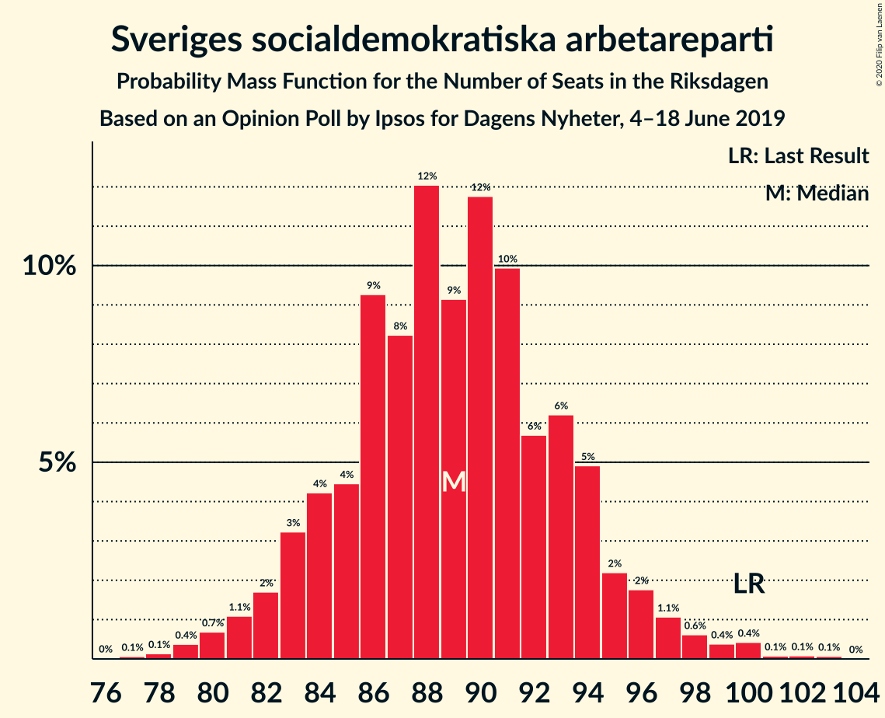
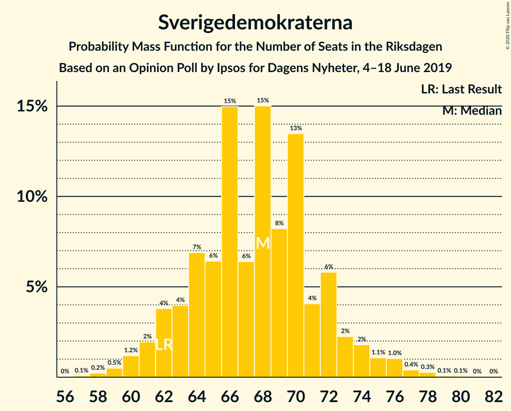
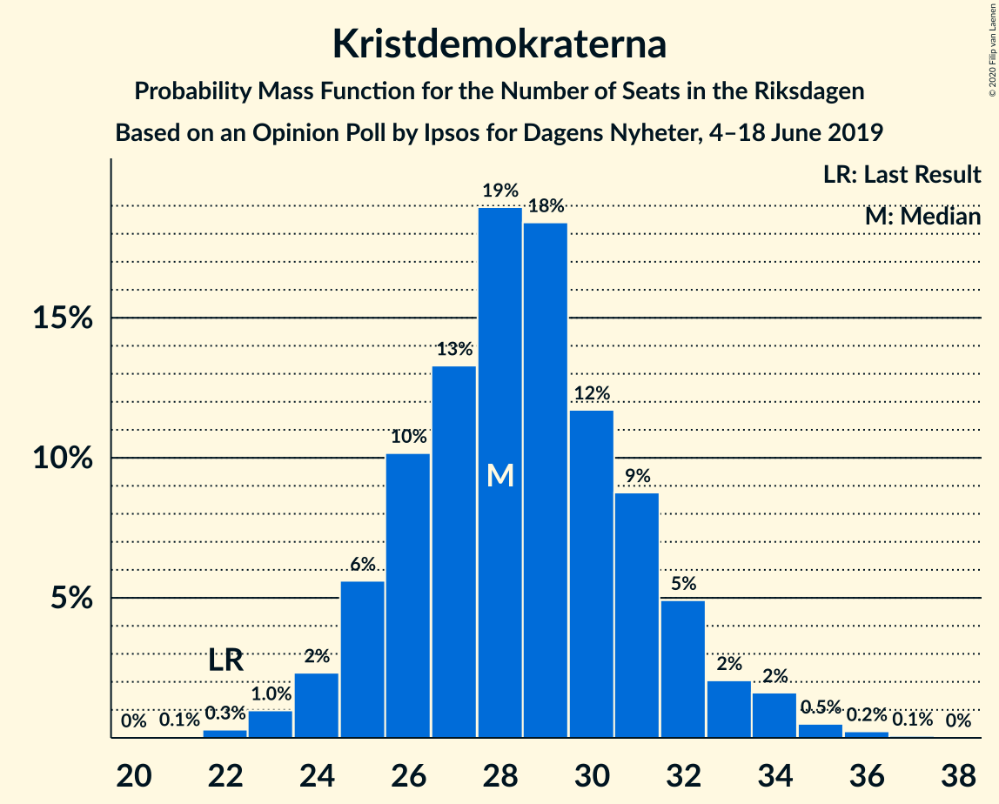
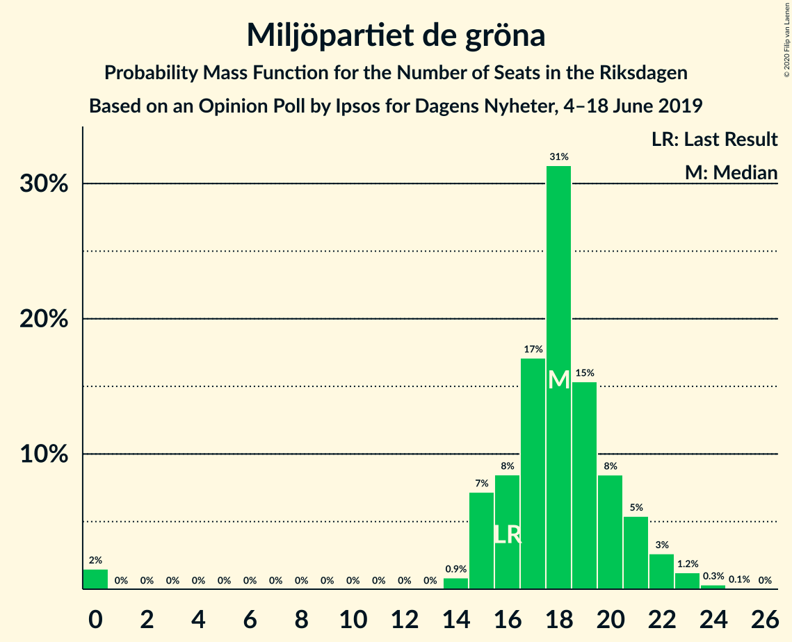
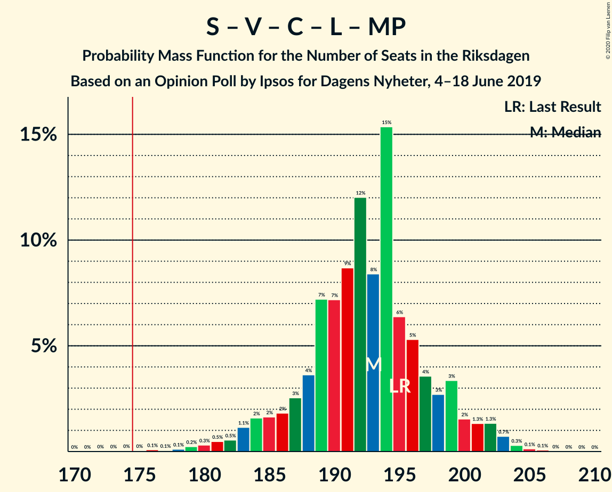
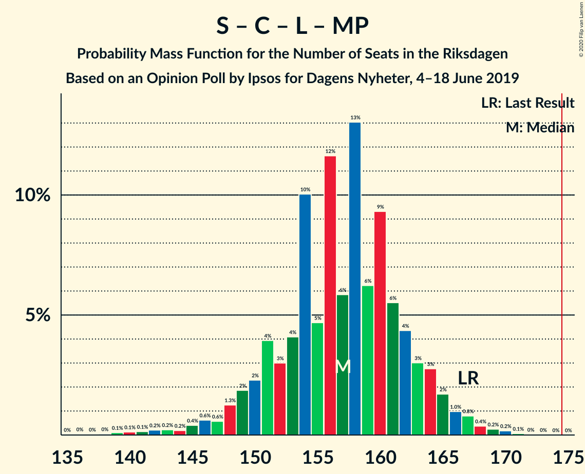
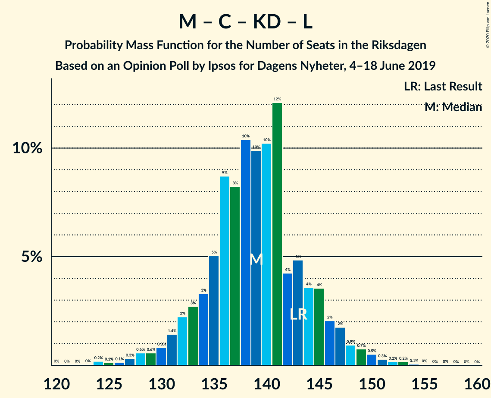
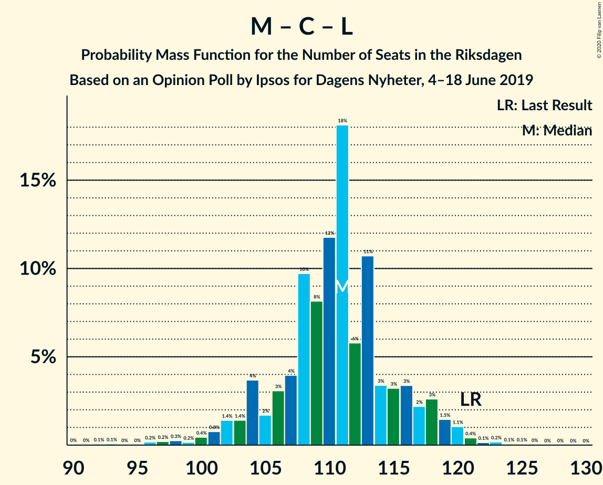

# Opinion Poll by Ipsos for Dagens Nyheter, 4–18 June 2019

<a href="#voting-intentions">Voting Intentions</a> | <a href="#seats">Seats</a> | <a href="#coalitions">Coalitions</a> | <a href="#technical-information">Technical Information</a>

## Voting Intentions

### Confidence Intervals

| Party | Last Result | Poll Result | 80% Confidence Interval | 90% Confidence Interval | 95% Confidence Interval | 99% Confidence Interval |
|:-----:|:-----------:|:-----------:|:-----------------------:|:-----------------------:|:-----------------------:|:-----------------------:|
| Sveriges socialdemokratiska arbetareparti | 28.3% | 25.0% | 23.7–26.4% |23.3–26.9% |23.0–27.2% |22.3–27.9% |
| Sverigedemokraterna | 17.5% | 19.0% | 17.8–20.3% |17.5–20.7% |17.2–21.0% |16.6–21.6% |
| Moderata samlingspartiet | 19.8% | 17.0% | 15.8–18.2% |15.5–18.6% |15.2–18.9% |14.7–19.5% |
| Vänsterpartiet | 8.0% | 10.0% | 9.1–11.0% |8.8–11.3% |8.6–11.6% |8.2–12.1% |
| Centerpartiet | 8.6% | 9.0% | 8.2–10.0% |7.9–10.3% |7.7–10.5% |7.3–11.0% |
| Kristdemokraterna | 6.3% | 8.0% | 7.2–8.9% |7.0–9.2% |6.8–9.4% |6.4–9.9% |
| Liberalerna | 5.5% | 5.0% | 4.4–5.8% |4.2–6.0% |4.1–6.2% |3.8–6.6% |
| Miljöpartiet de gröna | 4.4% | 5.0% | 4.4–5.8% |4.2–6.0% |4.1–6.2% |3.8–6.6% |

*Note:* The poll result column reflects the actual value used in the calculations. Published results may vary slightly, and in addition be rounded to fewer digits.

## Seats

### Confidence Intervals

| Party | Last Result | Median | 80% Confidence Interval | 90% Confidence Interval | 95% Confidence Interval | 99% Confidence Interval |
|:-----:|:-----------:|:------:|:-----------------------:|:-----------------------:|:-----------------------:|:-----------------------:|
| <a href="#sveriges-socialdemokratiska-arbetareparti">Sveriges socialdemokratiska arbetareparti</a> | 100 | 88 | 83–94 |82–96 |81–97 |79–100 |
| <a href="#sverigedemokraterna">Sverigedemokraterna</a> | 62 | 68 | 64–73 |62–75 |61–76 |58–78 |
| <a href="#moderata-samlingspartiet">Moderata samlingspartiet</a> | 70 | 61 | 56–65 |55–66 |54–67 |52–70 |
| <a href="#vänsterpartiet">Vänsterpartiet</a> | 28 | 37 | 32–39 |31–40 |31–42 |28–43 |
| <a href="#centerpartiet">Centerpartiet</a> | 31 | 32 | 28–35 |27–36 |27–37 |26–40 |
| <a href="#kristdemokraterna">Kristdemokraterna</a> | 22 | 29 | 25–31 |24–32 |24–33 |23–35 |
| <a href="#liberalerna">Liberalerna</a> | 20 | 18 | 16–21 |16–21 |14–23 |0–23 |
| <a href="#miljöpartiet-de-gröna">Miljöpartiet de gröna</a> | 16 | 18 | 16–21 |15–21 |0–22 |0–24 |

### Sveriges socialdemokratiska arbetareparti

*For a full overview of the results for this party, see the [Sveriges socialdemokratiska arbetareparti](party-sverigessocialdemokratiskaarbetareparti.html) page.*

| Number of Seats | Probability | Accumulated | Special Marks |
|:---------------:|:-----------:|:-----------:|:-------------:|
| 76 | 0% | 100% |  |
| 77 | 0% | 99.9% |  |
| 78 | 0.4% | 99.9% |  |
| 79 | 1.1% | 99.6% |  |
| 80 | 0.5% | 98% |  |
| 81 | 3% | 98% |  |
| 82 | 4% | 95% |  |
| 83 | 5% | 91% |  |
| 84 | 2% | 86% |  |
| 85 | 4% | 84% |  |
| 86 | 14% | 80% |  |
| 87 | 10% | 65% |  |
| 88 | 7% | 56% | Median |
| 89 | 11% | 48% |  |
| 90 | 4% | 37% |  |
| 91 | 7% | 33% |  |
| 92 | 2% | 26% |  |
| 93 | 13% | 24% |  |
| 94 | 3% | 10% |  |
| 95 | 2% | 7% |  |
| 96 | 1.3% | 5% |  |
| 97 | 1.5% | 4% |  |
| 98 | 1.2% | 2% |  |
| 99 | 0.1% | 1.3% |  |
| 100 | 0.9% | 1.1% | Last Result |
| 101 | 0% | 0.2% |  |
| 102 | 0.1% | 0.2% |  |
| 103 | 0% | 0.1% |  |
| 104 | 0% | 0% |  |

### Sverigedemokraterna

*For a full overview of the results for this party, see the [Sverigedemokraterna](party-sverigedemokraterna.html) page.*

| Number of Seats | Probability | Accumulated | Special Marks |
|:---------------:|:-----------:|:-----------:|:-------------:|
| 56 | 0% | 100% |  |
| 57 | 0.1% | 99.9% |  |
| 58 | 0.4% | 99.8% |  |
| 59 | 0.2% | 99.4% |  |
| 60 | 1.1% | 99.2% |  |
| 61 | 2% | 98% |  |
| 62 | 3% | 96% | Last Result |
| 63 | 3% | 93% |  |
| 64 | 13% | 90% |  |
| 65 | 5% | 77% |  |
| 66 | 16% | 72% |  |
| 67 | 6% | 56% |  |
| 68 | 13% | 50% | Median |
| 69 | 12% | 37% |  |
| 70 | 3% | 25% |  |
| 71 | 4% | 22% |  |
| 72 | 2% | 18% |  |
| 73 | 7% | 15% |  |
| 74 | 2% | 8% |  |
| 75 | 2% | 6% |  |
| 76 | 3% | 4% |  |
| 77 | 0.5% | 1.3% |  |
| 78 | 0.6% | 0.8% |  |
| 79 | 0.2% | 0.2% |  |
| 80 | 0% | 0.1% |  |
| 81 | 0% | 0% |  |

### Moderata samlingspartiet

*For a full overview of the results for this party, see the [Moderata samlingspartiet](party-moderatasamlingspartiet.html) page.*

| Number of Seats | Probability | Accumulated | Special Marks |
|:---------------:|:-----------:|:-----------:|:-------------:|
| 50 | 0% | 100% |  |
| 51 | 0.1% | 99.9% |  |
| 52 | 0.5% | 99.9% |  |
| 53 | 0.9% | 99.4% |  |
| 54 | 2% | 98.5% |  |
| 55 | 6% | 96% |  |
| 56 | 2% | 91% |  |
| 57 | 3% | 88% |  |
| 58 | 4% | 85% |  |
| 59 | 23% | 81% |  |
| 60 | 8% | 58% |  |
| 61 | 11% | 50% | Median |
| 62 | 17% | 39% |  |
| 63 | 7% | 22% |  |
| 64 | 5% | 15% |  |
| 65 | 3% | 10% |  |
| 66 | 4% | 8% |  |
| 67 | 2% | 4% |  |
| 68 | 0.5% | 1.5% |  |
| 69 | 0.2% | 1.0% |  |
| 70 | 0.4% | 0.8% | Last Result |
| 71 | 0.2% | 0.5% |  |
| 72 | 0.2% | 0.2% |  |
| 73 | 0% | 0% |  |

### Vänsterpartiet

*For a full overview of the results for this party, see the [Vänsterpartiet](party-vänsterpartiet.html) page.*

| Number of Seats | Probability | Accumulated | Special Marks |
|:---------------:|:-----------:|:-----------:|:-------------:|
| 27 | 0.1% | 100% |  |
| 28 | 0.6% | 99.9% | Last Result |
| 29 | 0.5% | 99.3% |  |
| 30 | 1.1% | 98.9% |  |
| 31 | 3% | 98% |  |
| 32 | 15% | 95% |  |
| 33 | 5% | 80% |  |
| 34 | 10% | 75% |  |
| 35 | 8% | 65% |  |
| 36 | 4% | 57% |  |
| 37 | 3% | 53% | Median |
| 38 | 15% | 50% |  |
| 39 | 25% | 35% |  |
| 40 | 6% | 9% |  |
| 41 | 0.9% | 3% |  |
| 42 | 1.5% | 3% |  |
| 43 | 0.8% | 1.2% |  |
| 44 | 0.4% | 0.4% |  |
| 45 | 0% | 0.1% |  |
| 46 | 0% | 0% |  |

### Centerpartiet

*For a full overview of the results for this party, see the [Centerpartiet](party-centerpartiet.html) page.*

| Number of Seats | Probability | Accumulated | Special Marks |
|:---------------:|:-----------:|:-----------:|:-------------:|
| 24 | 0.1% | 100% |  |
| 25 | 0.2% | 99.9% |  |
| 26 | 0.5% | 99.7% |  |
| 27 | 5% | 99.3% |  |
| 28 | 4% | 94% |  |
| 29 | 8% | 90% |  |
| 30 | 13% | 82% |  |
| 31 | 9% | 68% | Last Result |
| 32 | 26% | 60% | Median |
| 33 | 8% | 34% |  |
| 34 | 10% | 26% |  |
| 35 | 7% | 16% |  |
| 36 | 4% | 9% |  |
| 37 | 3% | 5% |  |
| 38 | 1.0% | 2% |  |
| 39 | 0.6% | 1.3% |  |
| 40 | 0.5% | 0.6% |  |
| 41 | 0.1% | 0.1% |  |
| 42 | 0% | 0% |  |

### Kristdemokraterna

*For a full overview of the results for this party, see the [Kristdemokraterna](party-kristdemokraterna.html) page.*

| Number of Seats | Probability | Accumulated | Special Marks |
|:---------------:|:-----------:|:-----------:|:-------------:|
| 21 | 0% | 100% |  |
| 22 | 0.2% | 99.9% | Last Result |
| 23 | 2% | 99.7% |  |
| 24 | 4% | 98% |  |
| 25 | 11% | 94% |  |
| 26 | 8% | 83% |  |
| 27 | 12% | 75% |  |
| 28 | 11% | 63% |  |
| 29 | 10% | 52% | Median |
| 30 | 27% | 42% |  |
| 31 | 8% | 15% |  |
| 32 | 2% | 7% |  |
| 33 | 2% | 5% |  |
| 34 | 1.4% | 2% |  |
| 35 | 0.5% | 1.0% |  |
| 36 | 0.4% | 0.5% |  |
| 37 | 0.1% | 0.1% |  |
| 38 | 0% | 0% |  |

### Liberalerna

*For a full overview of the results for this party, see the [Liberalerna](party-liberalerna.html) page.*

| Number of Seats | Probability | Accumulated | Special Marks |
|:---------------:|:-----------:|:-----------:|:-------------:|
| 0 | 1.4% | 100% |  |
| 1 | 0% | 98.6% |  |
| 2 | 0% | 98.6% |  |
| 3 | 0% | 98.6% |  |
| 4 | 0% | 98.6% |  |
| 5 | 0% | 98.6% |  |
| 6 | 0% | 98.6% |  |
| 7 | 0% | 98.6% |  |
| 8 | 0% | 98.6% |  |
| 9 | 0% | 98.6% |  |
| 10 | 0% | 98.6% |  |
| 11 | 0% | 98.6% |  |
| 12 | 0% | 98.6% |  |
| 13 | 0% | 98.6% |  |
| 14 | 2% | 98.6% |  |
| 15 | 1.5% | 97% |  |
| 16 | 28% | 95% |  |
| 17 | 0.6% | 67% |  |
| 18 | 23% | 67% | Median |
| 19 | 13% | 44% |  |
| 20 | 16% | 31% | Last Result |
| 21 | 12% | 15% |  |
| 22 | 0.6% | 3% |  |
| 23 | 3% | 3% |  |
| 24 | 0% | 0.2% |  |
| 25 | 0.2% | 0.2% |  |
| 26 | 0% | 0% |  |

### Miljöpartiet de gröna

*For a full overview of the results for this party, see the [Miljöpartiet de gröna](party-miljöpartietdegröna.html) page.*

| Number of Seats | Probability | Accumulated | Special Marks |
|:---------------:|:-----------:|:-----------:|:-------------:|
| 0 | 3% | 100% |  |
| 1 | 0% | 97% |  |
| 2 | 0% | 97% |  |
| 3 | 0% | 97% |  |
| 4 | 0% | 97% |  |
| 5 | 0% | 97% |  |
| 6 | 0% | 97% |  |
| 7 | 0% | 97% |  |
| 8 | 0% | 97% |  |
| 9 | 0% | 97% |  |
| 10 | 0% | 97% |  |
| 11 | 0% | 97% |  |
| 12 | 0% | 97% |  |
| 13 | 0% | 97% |  |
| 14 | 1.2% | 97% |  |
| 15 | 5% | 96% |  |
| 16 | 9% | 91% | Last Result |
| 17 | 18% | 83% |  |
| 18 | 17% | 65% | Median |
| 19 | 27% | 48% |  |
| 20 | 8% | 20% |  |
| 21 | 8% | 12% |  |
| 22 | 2% | 4% |  |
| 23 | 1.0% | 2% |  |
| 24 | 1.0% | 1.0% |  |
| 25 | 0% | 0.1% |  |
| 26 | 0% | 0% |  |

## Coalitions

### Confidence Intervals

| Coalition | Last Result | Median | Majority? | 80% Confidence Interval | 90% Confidence Interval | 95% Confidence Interval | 99% Confidence Interval |
|:---------:|:-----------:|:------:|:---------:|:-----------------------:|:-----------------------:|:-----------------------:|:-----------------------:|
| Sveriges socialdemokratiska arbetareparti – Vänsterpartiet – Centerpartiet – Liberalerna – Miljöpartiet de gröna | 195 | 192 | 99.9% | 187–199 | 183–200 | 180–201 | 179–204 |
| Sveriges socialdemokratiska arbetareparti – Moderata samlingspartiet – Centerpartiet | 201 | 180 | 93% | 176–189 | 174–191 | 173–192 | 170–197 |
| Sverigedemokraterna – Moderata samlingspartiet – Kristdemokraterna | 154 | 157 | 0.1% | 150–162 | 149–166 | 148–169 | 145–170 |
| Sveriges socialdemokratiska arbetareparti – Centerpartiet – Liberalerna – Miljöpartiet de gröna | 167 | 156 | 0% | 150–164 | 147–165 | 145–166 | 140–169 |
| Sveriges socialdemokratiska arbetareparti – Moderata samlingspartiet | 170 | 148 | 0% | 142–156 | 141–158 | 141–159 | 139–164 |
| Sveriges socialdemokratiska arbetareparti – Vänsterpartiet – Miljöpartiet de gröna | 144 | 143 | 0% | 137–149 | 133–150 | 131–151 | 126–154 |
| Moderata samlingspartiet – Centerpartiet – Kristdemokraterna – Liberalerna | 143 | 139 | 0% | 133–145 | 131–147 | 129–149 | 127–152 |
| Sverigedemokraterna – Moderata samlingspartiet | 132 | 128 | 0% | 123–134 | 122–136 | 120–140 | 117–141 |
| Sveriges socialdemokratiska arbetareparti – Vänsterpartiet | 128 | 125 | 0% | 119–130 | 117–132 | 116–133 | 113–138 |
| Moderata samlingspartiet – Centerpartiet – Kristdemokraterna | 123 | 121 | 0% | 116–127 | 115–129 | 113–130 | 109–134 |
| Moderata samlingspartiet – Centerpartiet – Liberalerna | 121 | 111 | 0% | 105–116 | 103–118 | 101–120 | 97–121 |
| Sveriges socialdemokratiska arbetareparti – Miljöpartiet de gröna | 116 | 106 | 0% | 101–112 | 98–113 | 95–115 | 88–118 |
| Moderata samlingspartiet – Centerpartiet | 101 | 92 | 0% | 87–98 | 86–100 | 85–101 | 83–104 |

### Sveriges socialdemokratiska arbetareparti – Vänsterpartiet – Centerpartiet – Liberalerna – Miljöpartiet de gröna

| Number of Seats | Probability | Accumulated | Special Marks |
|:---------------:|:-----------:|:-----------:|:-------------:|
| 171 | 0% | 100% |  |
| 172 | 0% | 99.9% |  |
| 173 | 0% | 99.9% |  |
| 174 | 0% | 99.9% |  |
| 175 | 0% | 99.9% | Majority |
| 176 | 0% | 99.9% |  |
| 177 | 0.1% | 99.8% |  |
| 178 | 0.1% | 99.7% |  |
| 179 | 1.3% | 99.6% |  |
| 180 | 1.1% | 98% |  |
| 181 | 1.1% | 97% |  |
| 182 | 0.2% | 96% |  |
| 183 | 2% | 96% |  |
| 184 | 0.8% | 94% |  |
| 185 | 0.9% | 93% |  |
| 186 | 2% | 92% |  |
| 187 | 2% | 91% |  |
| 188 | 3% | 89% |  |
| 189 | 12% | 85% |  |
| 190 | 8% | 73% |  |
| 191 | 13% | 65% |  |
| 192 | 3% | 52% |  |
| 193 | 8% | 49% | Median |
| 194 | 5% | 41% |  |
| 195 | 3% | 37% | Last Result |
| 196 | 13% | 34% |  |
| 197 | 7% | 21% |  |
| 198 | 2% | 14% |  |
| 199 | 7% | 13% |  |
| 200 | 2% | 5% |  |
| 201 | 0.9% | 3% |  |
| 202 | 1.3% | 2% |  |
| 203 | 0.4% | 0.9% |  |
| 204 | 0.3% | 0.6% |  |
| 205 | 0.1% | 0.3% |  |
| 206 | 0.1% | 0.1% |  |
| 207 | 0% | 0% |  |

### Sveriges socialdemokratiska arbetareparti – Moderata samlingspartiet – Centerpartiet

| Number of Seats | Probability | Accumulated | Special Marks |
|:---------------:|:-----------:|:-----------:|:-------------:|
| 167 | 0% | 100% |  |
| 168 | 0.2% | 99.9% |  |
| 169 | 0.1% | 99.8% |  |
| 170 | 0.5% | 99.7% |  |
| 171 | 0.8% | 99.2% |  |
| 172 | 0.9% | 98% |  |
| 173 | 0.6% | 98% |  |
| 174 | 4% | 97% |  |
| 175 | 0.9% | 93% | Majority |
| 176 | 9% | 92% |  |
| 177 | 10% | 83% |  |
| 178 | 15% | 73% |  |
| 179 | 4% | 58% |  |
| 180 | 11% | 54% |  |
| 181 | 3% | 42% | Median |
| 182 | 4% | 39% |  |
| 183 | 5% | 35% |  |
| 184 | 12% | 30% |  |
| 185 | 1.4% | 18% |  |
| 186 | 3% | 17% |  |
| 187 | 2% | 14% |  |
| 188 | 2% | 13% |  |
| 189 | 3% | 10% |  |
| 190 | 2% | 8% |  |
| 191 | 2% | 6% |  |
| 192 | 2% | 4% |  |
| 193 | 0.5% | 2% |  |
| 194 | 0.3% | 1.4% |  |
| 195 | 0.1% | 1.0% |  |
| 196 | 0.4% | 0.9% |  |
| 197 | 0.1% | 0.5% |  |
| 198 | 0.1% | 0.4% |  |
| 199 | 0.3% | 0.4% |  |
| 200 | 0% | 0.1% |  |
| 201 | 0% | 0.1% | Last Result |
| 202 | 0% | 0% |  |

### Sverigedemokraterna – Moderata samlingspartiet – Kristdemokraterna

| Number of Seats | Probability | Accumulated | Special Marks |
|:---------------:|:-----------:|:-----------:|:-------------:|
| 143 | 0.1% | 100% |  |
| 144 | 0.1% | 99.9% |  |
| 145 | 0.3% | 99.7% |  |
| 146 | 0.4% | 99.4% |  |
| 147 | 1.3% | 99.1% |  |
| 148 | 0.9% | 98% |  |
| 149 | 2% | 97% |  |
| 150 | 7% | 95% |  |
| 151 | 2% | 87% |  |
| 152 | 7% | 86% |  |
| 153 | 13% | 79% |  |
| 154 | 3% | 66% | Last Result |
| 155 | 5% | 63% |  |
| 156 | 8% | 59% |  |
| 157 | 3% | 51% |  |
| 158 | 13% | 48% | Median |
| 159 | 8% | 35% |  |
| 160 | 12% | 27% |  |
| 161 | 3% | 15% |  |
| 162 | 2% | 11% |  |
| 163 | 2% | 9% |  |
| 164 | 0.9% | 8% |  |
| 165 | 0.8% | 7% |  |
| 166 | 2% | 6% |  |
| 167 | 0.2% | 4% |  |
| 168 | 1.1% | 4% |  |
| 169 | 1.1% | 3% |  |
| 170 | 1.3% | 2% |  |
| 171 | 0.1% | 0.4% |  |
| 172 | 0.1% | 0.3% |  |
| 173 | 0% | 0.2% |  |
| 174 | 0% | 0.1% |  |
| 175 | 0% | 0.1% | Majority |
| 176 | 0% | 0.1% |  |
| 177 | 0% | 0.1% |  |
| 178 | 0% | 0.1% |  |
| 179 | 0% | 0% |  |

### Sveriges socialdemokratiska arbetareparti – Centerpartiet – Liberalerna – Miljöpartiet de gröna

| Number of Seats | Probability | Accumulated | Special Marks |
|:---------------:|:-----------:|:-----------:|:-------------:|
| 130 | 0% | 100% |  |
| 131 | 0% | 99.9% |  |
| 132 | 0% | 99.9% |  |
| 133 | 0% | 99.9% |  |
| 134 | 0% | 99.9% |  |
| 135 | 0% | 99.9% |  |
| 136 | 0% | 99.9% |  |
| 137 | 0% | 99.9% |  |
| 138 | 0% | 99.9% |  |
| 139 | 0.1% | 99.8% |  |
| 140 | 0.7% | 99.7% |  |
| 141 | 0% | 99.0% |  |
| 142 | 0.7% | 99.0% |  |
| 143 | 0.5% | 98% |  |
| 144 | 0.2% | 98% |  |
| 145 | 0.8% | 98% |  |
| 146 | 1.4% | 97% |  |
| 147 | 0.8% | 95% |  |
| 148 | 2% | 95% |  |
| 149 | 0.6% | 93% |  |
| 150 | 9% | 92% |  |
| 151 | 9% | 83% |  |
| 152 | 1.3% | 75% |  |
| 153 | 7% | 73% |  |
| 154 | 9% | 66% |  |
| 155 | 4% | 57% |  |
| 156 | 8% | 54% | Median |
| 157 | 4% | 46% |  |
| 158 | 6% | 42% |  |
| 159 | 2% | 36% |  |
| 160 | 9% | 34% |  |
| 161 | 4% | 24% |  |
| 162 | 2% | 21% |  |
| 163 | 2% | 19% |  |
| 164 | 11% | 17% |  |
| 165 | 3% | 6% |  |
| 166 | 1.0% | 3% |  |
| 167 | 1.1% | 2% | Last Result |
| 168 | 0.2% | 0.9% |  |
| 169 | 0.3% | 0.7% |  |
| 170 | 0.2% | 0.4% |  |
| 171 | 0% | 0.1% |  |
| 172 | 0% | 0.1% |  |
| 173 | 0% | 0% |  |

### Sveriges socialdemokratiska arbetareparti – Moderata samlingspartiet

| Number of Seats | Probability | Accumulated | Special Marks |
|:---------------:|:-----------:|:-----------:|:-------------:|
| 134 | 0% | 100% |  |
| 135 | 0% | 99.9% |  |
| 136 | 0% | 99.9% |  |
| 137 | 0% | 99.8% |  |
| 138 | 0.3% | 99.8% |  |
| 139 | 0.6% | 99.5% |  |
| 140 | 1.2% | 98.9% |  |
| 141 | 4% | 98% |  |
| 142 | 5% | 94% |  |
| 143 | 2% | 89% |  |
| 144 | 5% | 87% |  |
| 145 | 5% | 81% |  |
| 146 | 1.2% | 76% |  |
| 147 | 3% | 75% |  |
| 148 | 24% | 72% |  |
| 149 | 7% | 48% | Median |
| 150 | 3% | 41% |  |
| 151 | 11% | 39% |  |
| 152 | 13% | 28% |  |
| 153 | 2% | 15% |  |
| 154 | 1.1% | 13% |  |
| 155 | 2% | 12% |  |
| 156 | 3% | 10% |  |
| 157 | 2% | 8% |  |
| 158 | 2% | 6% |  |
| 159 | 2% | 4% |  |
| 160 | 0.8% | 2% |  |
| 161 | 0.1% | 1.1% |  |
| 162 | 0.1% | 1.1% |  |
| 163 | 0.3% | 1.0% |  |
| 164 | 0.4% | 0.7% |  |
| 165 | 0.1% | 0.3% |  |
| 166 | 0% | 0.2% |  |
| 167 | 0.1% | 0.1% |  |
| 168 | 0% | 0.1% |  |
| 169 | 0% | 0% |  |
| 170 | 0% | 0% | Last Result |

### Sveriges socialdemokratiska arbetareparti – Vänsterpartiet – Miljöpartiet de gröna

| Number of Seats | Probability | Accumulated | Special Marks |
|:---------------:|:-----------:|:-----------:|:-------------:|
| 125 | 0.2% | 100% |  |
| 126 | 0.6% | 99.8% |  |
| 127 | 0% | 99.1% |  |
| 128 | 0.2% | 99.1% |  |
| 129 | 0.6% | 99.0% |  |
| 130 | 0.3% | 98% |  |
| 131 | 1.4% | 98% |  |
| 132 | 0.2% | 97% |  |
| 133 | 2% | 96% |  |
| 134 | 1.0% | 95% |  |
| 135 | 1.4% | 94% |  |
| 136 | 2% | 92% |  |
| 137 | 2% | 91% |  |
| 138 | 4% | 89% |  |
| 139 | 4% | 85% |  |
| 140 | 10% | 81% |  |
| 141 | 7% | 71% |  |
| 142 | 11% | 64% |  |
| 143 | 13% | 53% | Median |
| 144 | 13% | 40% | Last Result |
| 145 | 5% | 28% |  |
| 146 | 4% | 23% |  |
| 147 | 3% | 19% |  |
| 148 | 2% | 16% |  |
| 149 | 6% | 14% |  |
| 150 | 3% | 7% |  |
| 151 | 1.5% | 4% |  |
| 152 | 2% | 2% |  |
| 153 | 0.3% | 0.9% |  |
| 154 | 0.3% | 0.6% |  |
| 155 | 0.1% | 0.2% |  |
| 156 | 0.1% | 0.2% |  |
| 157 | 0% | 0.1% |  |
| 158 | 0% | 0.1% |  |
| 159 | 0% | 0.1% |  |
| 160 | 0% | 0% |  |

### Moderata samlingspartiet – Centerpartiet – Kristdemokraterna – Liberalerna

| Number of Seats | Probability | Accumulated | Special Marks |
|:---------------:|:-----------:|:-----------:|:-------------:|
| 120 | 0.1% | 100% |  |
| 121 | 0% | 99.9% |  |
| 122 | 0% | 99.9% |  |
| 123 | 0% | 99.9% |  |
| 124 | 0% | 99.9% |  |
| 125 | 0.1% | 99.8% |  |
| 126 | 0.2% | 99.8% |  |
| 127 | 0.2% | 99.5% |  |
| 128 | 2% | 99.4% |  |
| 129 | 0.7% | 98% |  |
| 130 | 1.4% | 97% |  |
| 131 | 1.1% | 96% |  |
| 132 | 2% | 95% |  |
| 133 | 5% | 93% |  |
| 134 | 8% | 87% |  |
| 135 | 2% | 80% |  |
| 136 | 8% | 78% |  |
| 137 | 8% | 70% |  |
| 138 | 11% | 62% |  |
| 139 | 7% | 51% |  |
| 140 | 2% | 43% | Median |
| 141 | 16% | 41% |  |
| 142 | 8% | 25% |  |
| 143 | 4% | 17% | Last Result |
| 144 | 2% | 13% |  |
| 145 | 4% | 10% |  |
| 146 | 1.3% | 6% |  |
| 147 | 1.5% | 5% |  |
| 148 | 0.4% | 4% |  |
| 149 | 1.4% | 3% |  |
| 150 | 0.8% | 2% |  |
| 151 | 0.5% | 1.0% |  |
| 152 | 0.3% | 0.5% |  |
| 153 | 0.1% | 0.2% |  |
| 154 | 0% | 0.1% |  |
| 155 | 0% | 0.1% |  |
| 156 | 0% | 0% |  |

### Sverigedemokraterna – Moderata samlingspartiet

| Number of Seats | Probability | Accumulated | Special Marks |
|:---------------:|:-----------:|:-----------:|:-------------:|
| 114 | 0% | 100% |  |
| 115 | 0.1% | 99.9% |  |
| 116 | 0.2% | 99.9% |  |
| 117 | 0.4% | 99.7% |  |
| 118 | 1.1% | 99.3% |  |
| 119 | 0.7% | 98% |  |
| 120 | 0.8% | 98% |  |
| 121 | 1.3% | 97% |  |
| 122 | 4% | 95% |  |
| 123 | 13% | 91% |  |
| 124 | 2% | 78% |  |
| 125 | 7% | 76% |  |
| 126 | 9% | 69% |  |
| 127 | 9% | 59% |  |
| 128 | 3% | 50% |  |
| 129 | 4% | 47% | Median |
| 130 | 10% | 43% |  |
| 131 | 10% | 33% |  |
| 132 | 6% | 23% | Last Result |
| 133 | 2% | 16% |  |
| 134 | 6% | 14% |  |
| 135 | 2% | 8% |  |
| 136 | 2% | 6% |  |
| 137 | 1.0% | 4% |  |
| 138 | 0.3% | 3% |  |
| 139 | 0.1% | 3% |  |
| 140 | 2% | 3% |  |
| 141 | 0.4% | 0.8% |  |
| 142 | 0.2% | 0.5% |  |
| 143 | 0% | 0.3% |  |
| 144 | 0% | 0.3% |  |
| 145 | 0.1% | 0.2% |  |
| 146 | 0.1% | 0.1% |  |
| 147 | 0% | 0% |  |

### Sveriges socialdemokratiska arbetareparti – Vänsterpartiet

| Number of Seats | Probability | Accumulated | Special Marks |
|:---------------:|:-----------:|:-----------:|:-------------:|
| 111 | 0% | 100% |  |
| 112 | 0.1% | 99.9% |  |
| 113 | 0.4% | 99.9% |  |
| 114 | 1.0% | 99.5% |  |
| 115 | 0.6% | 98% |  |
| 116 | 1.5% | 98% |  |
| 117 | 1.4% | 96% |  |
| 118 | 2% | 95% |  |
| 119 | 5% | 93% |  |
| 120 | 2% | 88% |  |
| 121 | 10% | 87% |  |
| 122 | 3% | 77% |  |
| 123 | 10% | 74% |  |
| 124 | 7% | 64% |  |
| 125 | 19% | 56% | Median |
| 126 | 8% | 37% |  |
| 127 | 4% | 29% |  |
| 128 | 9% | 26% | Last Result |
| 129 | 3% | 16% |  |
| 130 | 5% | 14% |  |
| 131 | 3% | 9% |  |
| 132 | 1.3% | 6% |  |
| 133 | 2% | 5% |  |
| 134 | 0.5% | 2% |  |
| 135 | 0.6% | 2% |  |
| 136 | 0.3% | 1.1% |  |
| 137 | 0.2% | 0.8% |  |
| 138 | 0.4% | 0.6% |  |
| 139 | 0% | 0.2% |  |
| 140 | 0.1% | 0.1% |  |
| 141 | 0% | 0.1% |  |
| 142 | 0% | 0% |  |

### Moderata samlingspartiet – Centerpartiet – Kristdemokraterna

| Number of Seats | Probability | Accumulated | Special Marks |
|:---------------:|:-----------:|:-----------:|:-------------:|
| 108 | 0.2% | 100% |  |
| 109 | 0.8% | 99.8% |  |
| 110 | 0.3% | 99.0% |  |
| 111 | 0% | 98.7% |  |
| 112 | 0.4% | 98.6% |  |
| 113 | 2% | 98% |  |
| 114 | 2% | 97% |  |
| 115 | 2% | 95% |  |
| 116 | 7% | 93% |  |
| 117 | 10% | 86% |  |
| 118 | 17% | 75% |  |
| 119 | 3% | 59% |  |
| 120 | 3% | 55% |  |
| 121 | 13% | 53% |  |
| 122 | 11% | 40% | Median |
| 123 | 3% | 29% | Last Result |
| 124 | 4% | 26% |  |
| 125 | 8% | 21% |  |
| 126 | 4% | 14% |  |
| 127 | 2% | 10% |  |
| 128 | 2% | 8% |  |
| 129 | 2% | 7% |  |
| 130 | 2% | 4% |  |
| 131 | 1.0% | 2% |  |
| 132 | 0.7% | 1.5% |  |
| 133 | 0.2% | 0.8% |  |
| 134 | 0.2% | 0.6% |  |
| 135 | 0.1% | 0.4% |  |
| 136 | 0% | 0.2% |  |
| 137 | 0.1% | 0.2% |  |
| 138 | 0% | 0% |  |

### Moderata samlingspartiet – Centerpartiet – Liberalerna

| Number of Seats | Probability | Accumulated | Special Marks |
|:---------------:|:-----------:|:-----------:|:-------------:|
| 91 | 0% | 100% |  |
| 92 | 0% | 99.9% |  |
| 93 | 0.1% | 99.9% |  |
| 94 | 0% | 99.9% |  |
| 95 | 0% | 99.9% |  |
| 96 | 0.1% | 99.8% |  |
| 97 | 0.3% | 99.7% |  |
| 98 | 0% | 99.4% |  |
| 99 | 0.3% | 99.4% |  |
| 100 | 0.5% | 99.0% |  |
| 101 | 1.2% | 98.5% |  |
| 102 | 2% | 97% |  |
| 103 | 2% | 96% |  |
| 104 | 2% | 94% |  |
| 105 | 3% | 92% |  |
| 106 | 4% | 89% |  |
| 107 | 5% | 85% |  |
| 108 | 10% | 80% |  |
| 109 | 13% | 70% |  |
| 110 | 5% | 57% |  |
| 111 | 17% | 52% | Median |
| 112 | 11% | 35% |  |
| 113 | 6% | 24% |  |
| 114 | 2% | 18% |  |
| 115 | 4% | 16% |  |
| 116 | 2% | 11% |  |
| 117 | 2% | 9% |  |
| 118 | 4% | 8% |  |
| 119 | 0.9% | 4% |  |
| 120 | 2% | 3% |  |
| 121 | 0.5% | 0.9% | Last Result |
| 122 | 0.2% | 0.4% |  |
| 123 | 0.1% | 0.2% |  |
| 124 | 0% | 0.1% |  |
| 125 | 0% | 0.1% |  |
| 126 | 0% | 0% |  |

### Sveriges socialdemokratiska arbetareparti – Miljöpartiet de gröna

| Number of Seats | Probability | Accumulated | Special Marks |
|:---------------:|:-----------:|:-----------:|:-------------:|
| 86 | 0.2% | 100% |  |
| 87 | 0% | 99.8% |  |
| 88 | 0.6% | 99.8% |  |
| 89 | 0% | 99.1% |  |
| 90 | 0.6% | 99.1% |  |
| 91 | 0.2% | 98% |  |
| 92 | 0% | 98% |  |
| 93 | 0.3% | 98% |  |
| 94 | 0.4% | 98% |  |
| 95 | 0.4% | 98% |  |
| 96 | 1.2% | 97% |  |
| 97 | 0.1% | 96% |  |
| 98 | 1.5% | 96% |  |
| 99 | 0.8% | 94% |  |
| 100 | 2% | 94% |  |
| 101 | 5% | 92% |  |
| 102 | 5% | 86% |  |
| 103 | 9% | 81% |  |
| 104 | 10% | 71% |  |
| 105 | 8% | 61% |  |
| 106 | 7% | 53% | Median |
| 107 | 4% | 46% |  |
| 108 | 4% | 43% |  |
| 109 | 4% | 38% |  |
| 110 | 10% | 34% |  |
| 111 | 4% | 24% |  |
| 112 | 13% | 20% |  |
| 113 | 4% | 7% |  |
| 114 | 0.5% | 3% |  |
| 115 | 1.5% | 3% |  |
| 116 | 0.4% | 1.3% | Last Result |
| 117 | 0.3% | 0.9% |  |
| 118 | 0.3% | 0.6% |  |
| 119 | 0.1% | 0.3% |  |
| 120 | 0.1% | 0.3% |  |
| 121 | 0.1% | 0.1% |  |
| 122 | 0% | 0% |  |

### Moderata samlingspartiet – Centerpartiet

| Number of Seats | Probability | Accumulated | Special Marks |
|:---------------:|:-----------:|:-----------:|:-------------:|
| 80 | 0% | 100% |  |
| 81 | 0% | 99.9% |  |
| 82 | 0.1% | 99.9% |  |
| 83 | 0.7% | 99.8% |  |
| 84 | 0.9% | 99.1% |  |
| 85 | 2% | 98% |  |
| 86 | 2% | 96% |  |
| 87 | 4% | 94% |  |
| 88 | 2% | 90% |  |
| 89 | 4% | 88% |  |
| 90 | 6% | 84% |  |
| 91 | 26% | 78% |  |
| 92 | 13% | 52% |  |
| 93 | 9% | 39% | Median |
| 94 | 10% | 31% |  |
| 95 | 3% | 20% |  |
| 96 | 2% | 17% |  |
| 97 | 3% | 15% |  |
| 98 | 3% | 12% |  |
| 99 | 4% | 9% |  |
| 100 | 2% | 5% |  |
| 101 | 1.0% | 3% | Last Result |
| 102 | 0.7% | 2% |  |
| 103 | 1.0% | 1.5% |  |
| 104 | 0.1% | 0.5% |  |
| 105 | 0.3% | 0.5% |  |
| 106 | 0.1% | 0.2% |  |
| 107 | 0.1% | 0.2% |  |
| 108 | 0% | 0% |  |

## Technical Information

### Opinion Poll

+ **Polling firm:** Ipsos
+ **Commissioner(s):** Dagens Nyheter
+ **Fieldwork period:** 4–18 June 2019

### Calculations

+ **Sample size:** 1630
+ **Simulations done:** 131,072
+ **Error estimate:** 1.92%

