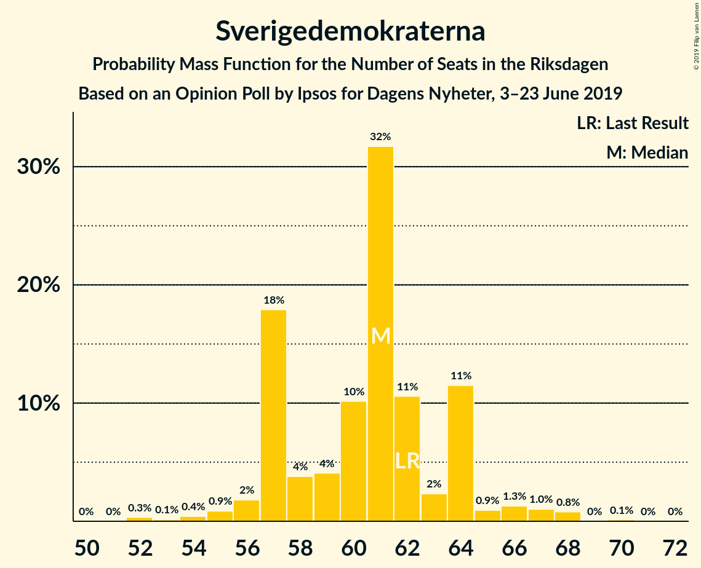
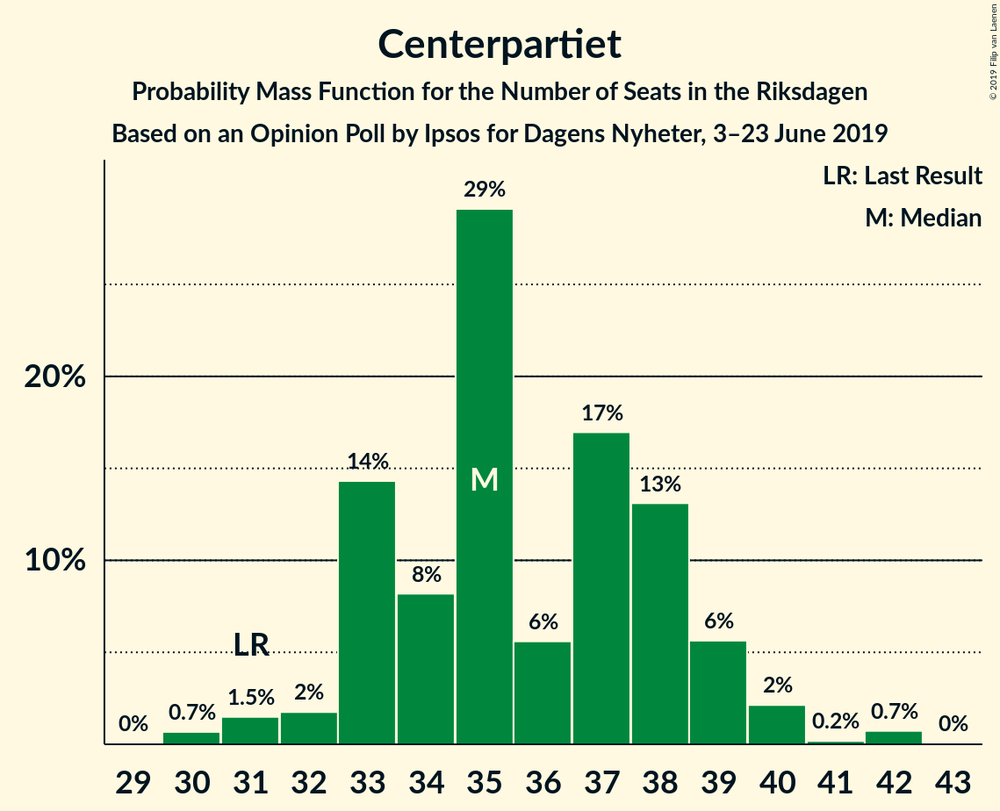
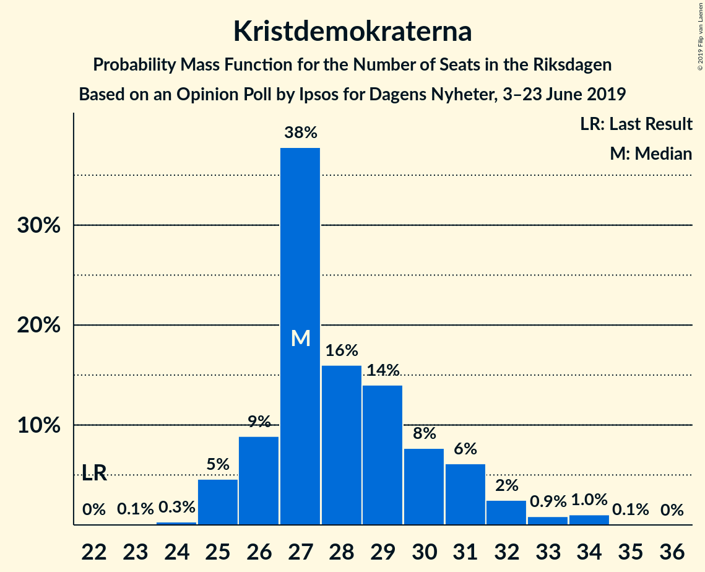
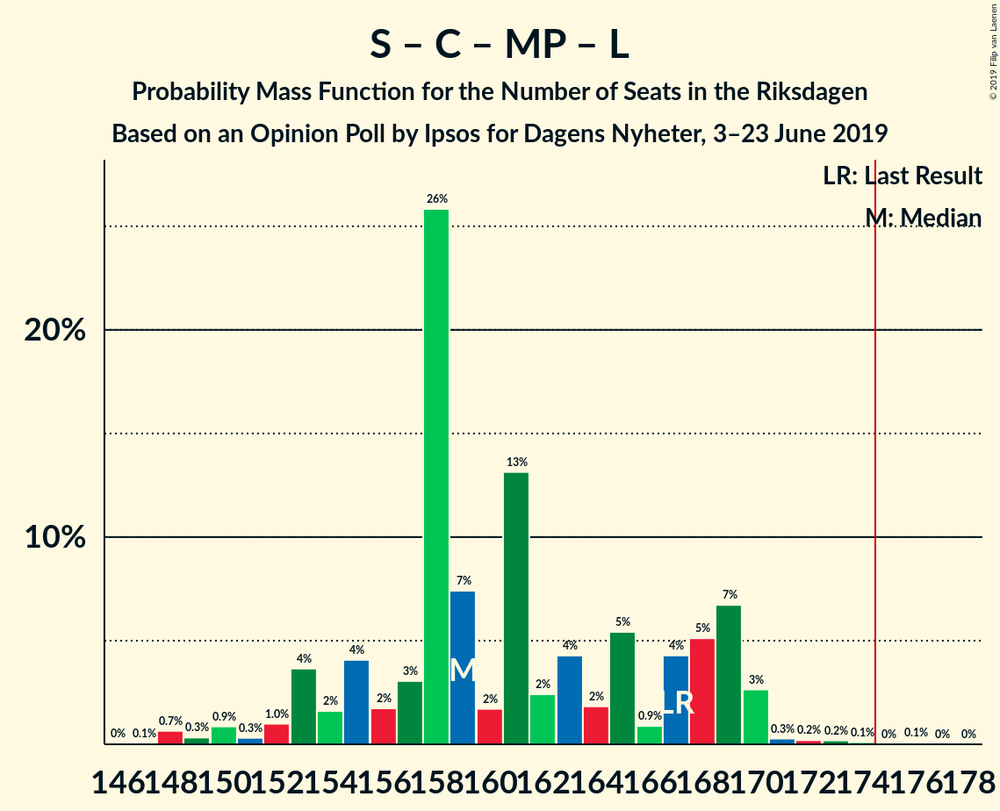
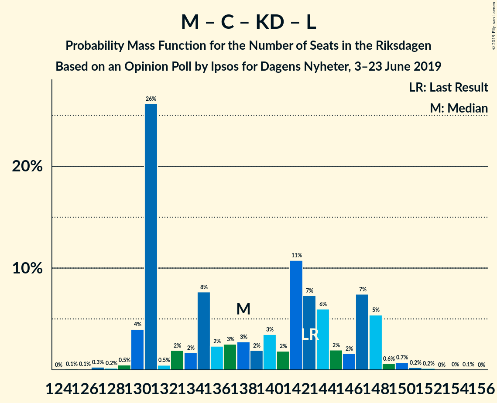

# Opinion Poll by Ipsos for Dagens Nyheter, 3–23 June 2019

<a href="#voting-intentions">Voting Intentions</a> | <a href="#seats">Seats</a> | <a href="#coalitions">Coalitions</a> | <a href="#technical-information">Technical Information</a>

## Voting Intentions

### Confidence Intervals

| Party | Last Result | Poll Result | 80% Confidence Interval | 90% Confidence Interval | 95% Confidence Interval | 99% Confidence Interval |
|:-----:|:-----------:|:-----------:|:-----------------------:|:-----------------------:|:-----------------------:|:-----------------------:|
| Sveriges socialdemokratiska arbetareparti | 28.3% | 27.0% | 25.9–28.1% |25.6–28.4% |25.3–28.7% |24.8–29.2% |
| Moderata samlingspartiet | 19.8% | 19.0% | 18.1–20.0% |17.8–20.3% |17.6–20.5% |17.1–21.0% |
| Sverigedemokraterna | 17.5% | 17.0% | 16.1–18.0% |15.9–18.2% |15.6–18.5% |15.2–18.9% |
| Centerpartiet | 8.6% | 10.0% | 9.3–10.8% |9.1–11.0% |8.9–11.2% |8.6–11.6% |
| Vänsterpartiet | 8.0% | 9.0% | 8.3–9.7% |8.1–9.9% |8.0–10.1% |7.7–10.5% |
| Kristdemokraterna | 6.3% | 8.0% | 7.4–8.7% |7.2–8.9% |7.0–9.1% |6.8–9.4% |
| Miljöpartiet de gröna | 4.4% | 6.0% | 5.5–6.6% |5.3–6.8% |5.2–7.0% |4.9–7.3% |
| Liberalerna | 5.5% | 4.0% | 3.6–4.5% |3.4–4.7% |3.3–4.8% |3.1–5.1% |

*Note:* The poll result column reflects the actual value used in the calculations. Published results may vary slightly, and in addition be rounded to fewer digits.

## Seats

### Confidence Intervals

| Party | Last Result | Median | 80% Confidence Interval | 90% Confidence Interval | 95% Confidence Interval | 99% Confidence Interval |
|:-----:|:-----------:|:------:|:-----------------------:|:-----------------------:|:-----------------------:|:-----------------------:|
| <a href="#sveriges-socialdemokratiska-arbetareparti">Sveriges socialdemokratiska arbetareparti</a> | 100 | 92 | 88–98 |88–99 |88–102 |87–106 |
| <a href="#moderata-samlingspartiet">Moderata samlingspartiet</a> | 70 | 68 | 64–73 |63–74 |62–74 |60–76 |
| <a href="#sverigedemokraterna">Sverigedemokraterna</a> | 62 | 62 | 56–66 |55–68 |53–68 |51–68 |
| <a href="#centerpartiet">Centerpartiet</a> | 31 | 35 | 34–38 |32–39 |32–40 |31–42 |
| <a href="#vänsterpartiet">Vänsterpartiet</a> | 28 | 32 | 29–34 |28–35 |28–35 |26–36 |
| <a href="#kristdemokraterna">Kristdemokraterna</a> | 22 | 29 | 25–34 |24–34 |24–34 |22–35 |
| <a href="#miljöpartiet-de-gröna">Miljöpartiet de gröna</a> | 16 | 21 | 19–25 |19–25 |19–25 |18–26 |
| <a href="#liberalerna">Liberalerna</a> | 20 | 14 | 0–16 |0–17 |0–17 |0–19 |

### Sveriges socialdemokratiska arbetareparti

*For a full overview of the results for this party, see the [Sveriges socialdemokratiska arbetareparti](party-sverigessocialdemokratiskaarbetareparti.html) page.*

| Number of Seats | Probability | Accumulated | Special Marks |
|:---------------:|:-----------:|:-----------:|:-------------:|
| 85 | 0.2% | 100% |  |
| 86 | 0.2% | 99.8% |  |
| 87 | 0.9% | 99.6% |  |
| 88 | 20% | 98.7% |  |
| 89 | 0.5% | 79% |  |
| 90 | 2% | 78% |  |
| 91 | 10% | 76% |  |
| 92 | 22% | 66% | Median |
| 93 | 15% | 44% |  |
| 94 | 7% | 29% |  |
| 95 | 3% | 22% |  |
| 96 | 2% | 19% |  |
| 97 | 5% | 17% |  |
| 98 | 4% | 11% |  |
| 99 | 3% | 7% |  |
| 100 | 0.2% | 5% | Last Result |
| 101 | 1.4% | 4% |  |
| 102 | 0.7% | 3% |  |
| 103 | 0.4% | 2% |  |
| 104 | 0.2% | 2% |  |
| 105 | 1.0% | 2% |  |
| 106 | 0.5% | 0.8% |  |
| 107 | 0% | 0.3% |  |
| 108 | 0.1% | 0.2% |  |
| 109 | 0.2% | 0.2% |  |
| 110 | 0% | 0% |  |

### Moderata samlingspartiet

*For a full overview of the results for this party, see the [Moderata samlingspartiet](party-moderatasamlingspartiet.html) page.*

| Number of Seats | Probability | Accumulated | Special Marks |
|:---------------:|:-----------:|:-----------:|:-------------:|
| 58 | 0.1% | 100% |  |
| 59 | 0% | 99.9% |  |
| 60 | 2% | 99.9% |  |
| 61 | 0.6% | 98% |  |
| 62 | 0.4% | 98% |  |
| 63 | 5% | 97% |  |
| 64 | 5% | 93% |  |
| 65 | 9% | 87% |  |
| 66 | 4% | 78% |  |
| 67 | 1.2% | 74% |  |
| 68 | 32% | 73% | Median |
| 69 | 9% | 40% |  |
| 70 | 2% | 31% | Last Result |
| 71 | 9% | 29% |  |
| 72 | 0.1% | 20% |  |
| 73 | 14% | 20% |  |
| 74 | 3% | 6% |  |
| 75 | 2% | 2% |  |
| 76 | 0.7% | 0.8% |  |
| 77 | 0% | 0.1% |  |
| 78 | 0% | 0% |  |

### Sverigedemokraterna

*For a full overview of the results for this party, see the [Sverigedemokraterna](party-sverigedemokraterna.html) page.*

| Number of Seats | Probability | Accumulated | Special Marks |
|:---------------:|:-----------:|:-----------:|:-------------:|
| 51 | 1.1% | 100% |  |
| 52 | 0.8% | 98.9% |  |
| 53 | 3% | 98% |  |
| 54 | 0.2% | 96% |  |
| 55 | 2% | 95% |  |
| 56 | 6% | 94% |  |
| 57 | 15% | 88% |  |
| 58 | 6% | 73% |  |
| 59 | 3% | 67% |  |
| 60 | 10% | 64% |  |
| 61 | 2% | 54% |  |
| 62 | 19% | 52% | Last Result, Median |
| 63 | 14% | 33% |  |
| 64 | 0.7% | 19% |  |
| 65 | 6% | 18% |  |
| 66 | 3% | 12% |  |
| 67 | 0.1% | 9% |  |
| 68 | 8% | 9% |  |
| 69 | 0.2% | 0.3% |  |
| 70 | 0% | 0.1% |  |
| 71 | 0% | 0% |  |

### Centerpartiet

*For a full overview of the results for this party, see the [Centerpartiet](party-centerpartiet.html) page.*

| Number of Seats | Probability | Accumulated | Special Marks |
|:---------------:|:-----------:|:-----------:|:-------------:|
| 28 | 0.1% | 100% |  |
| 29 | 0% | 99.8% |  |
| 30 | 0.1% | 99.8% |  |
| 31 | 1.0% | 99.7% | Last Result |
| 32 | 5% | 98.7% |  |
| 33 | 4% | 94% |  |
| 34 | 28% | 90% |  |
| 35 | 16% | 63% | Median |
| 36 | 3% | 47% |  |
| 37 | 11% | 44% |  |
| 38 | 24% | 33% |  |
| 39 | 7% | 9% |  |
| 40 | 2% | 3% |  |
| 41 | 0.4% | 1.0% |  |
| 42 | 0.4% | 0.6% |  |
| 43 | 0.1% | 0.2% |  |
| 44 | 0% | 0% |  |

### Vänsterpartiet

*For a full overview of the results for this party, see the [Vänsterpartiet](party-vänsterpartiet.html) page.*

| Number of Seats | Probability | Accumulated | Special Marks |
|:---------------:|:-----------:|:-----------:|:-------------:|
| 25 | 0.1% | 100% |  |
| 26 | 0.7% | 99.9% |  |
| 27 | 0.3% | 99.1% |  |
| 28 | 8% | 98.8% | Last Result |
| 29 | 3% | 91% |  |
| 30 | 15% | 88% |  |
| 31 | 18% | 73% |  |
| 32 | 19% | 55% | Median |
| 33 | 16% | 36% |  |
| 34 | 11% | 20% |  |
| 35 | 8% | 9% |  |
| 36 | 0.8% | 1.2% |  |
| 37 | 0.2% | 0.4% |  |
| 38 | 0.1% | 0.3% |  |
| 39 | 0.1% | 0.1% |  |
| 40 | 0% | 0% |  |

### Kristdemokraterna

*For a full overview of the results for this party, see the [Kristdemokraterna](party-kristdemokraterna.html) page.*

| Number of Seats | Probability | Accumulated | Special Marks |
|:---------------:|:-----------:|:-----------:|:-------------:|
| 22 | 1.0% | 100% | Last Result |
| 23 | 0.6% | 99.0% |  |
| 24 | 4% | 98% |  |
| 25 | 9% | 94% |  |
| 26 | 15% | 85% |  |
| 27 | 3% | 69% |  |
| 28 | 7% | 66% |  |
| 29 | 9% | 59% | Median |
| 30 | 3% | 49% |  |
| 31 | 20% | 46% |  |
| 32 | 5% | 26% |  |
| 33 | 11% | 21% |  |
| 34 | 10% | 10% |  |
| 35 | 0.4% | 0.5% |  |
| 36 | 0.1% | 0.1% |  |
| 37 | 0.1% | 0.1% |  |
| 38 | 0% | 0% |  |

### Miljöpartiet de gröna

*For a full overview of the results for this party, see the [Miljöpartiet de gröna](party-miljöpartietdegröna.html) page.*

| Number of Seats | Probability | Accumulated | Special Marks |
|:---------------:|:-----------:|:-----------:|:-------------:|
| 16 | 0% | 100% | Last Result |
| 17 | 0.3% | 100% |  |
| 18 | 1.1% | 99.6% |  |
| 19 | 10% | 98.5% |  |
| 20 | 38% | 89% |  |
| 21 | 11% | 50% | Median |
| 22 | 13% | 40% |  |
| 23 | 10% | 27% |  |
| 24 | 4% | 17% |  |
| 25 | 11% | 12% |  |
| 26 | 1.1% | 1.4% |  |
| 27 | 0.2% | 0.3% |  |
| 28 | 0% | 0% |  |

### Liberalerna

*For a full overview of the results for this party, see the [Liberalerna](party-liberalerna.html) page.*

| Number of Seats | Probability | Accumulated | Special Marks |
|:---------------:|:-----------:|:-----------:|:-------------:|
| 0 | 42% | 100% |  |
| 1 | 0% | 58% |  |
| 2 | 0% | 58% |  |
| 3 | 0% | 58% |  |
| 4 | 0% | 58% |  |
| 5 | 0% | 58% |  |
| 6 | 0% | 58% |  |
| 7 | 0% | 58% |  |
| 8 | 0% | 58% |  |
| 9 | 0% | 58% |  |
| 10 | 0% | 58% |  |
| 11 | 0% | 58% |  |
| 12 | 0% | 58% |  |
| 13 | 0% | 58% |  |
| 14 | 10% | 58% | Median |
| 15 | 23% | 48% |  |
| 16 | 19% | 26% |  |
| 17 | 5% | 6% |  |
| 18 | 0.4% | 1.5% |  |
| 19 | 1.0% | 1.1% |  |
| 20 | 0% | 0% | Last Result |

## Coalitions

### Confidence Intervals

| Coalition | Last Result | Median | Majority? | 80% Confidence Interval | 90% Confidence Interval | 95% Confidence Interval | 99% Confidence Interval |
|:---------:|:-----------:|:------:|:---------:|:-----------------------:|:-----------------------:|:-----------------------:|:-----------------------:|
| Sveriges socialdemokratiska arbetareparti – Moderata samlingspartiet – Centerpartiet | 201 | 198 | 100% | 189–203 | 189–210 | 189–210 | 184–214 |
| Sveriges socialdemokratiska arbetareparti – Centerpartiet – Vänsterpartiet – Miljöpartiet de gröna – Liberalerna | 195 | 190 | 100% | 185–200 | 181–200 | 181–203 | 175–205 |
| Sveriges socialdemokratiska arbetareparti – Moderata samlingspartiet | 170 | 161 | 1.0% | 156–167 | 152–171 | 152–174 | 151–178 |
| Sveriges socialdemokratiska arbetareparti – Centerpartiet – Miljöpartiet de gröna – Liberalerna | 167 | 158 | 0.8% | 152–168 | 149–172 | 149–172 | 146–176 |
| Moderata samlingspartiet – Sverigedemokraterna – Kristdemokraterna | 154 | 159 | 0% | 149–164 | 149–168 | 146–168 | 144–174 |
| Sveriges socialdemokratiska arbetareparti – Vänsterpartiet – Miljöpartiet de gröna | 144 | 144 | 0% | 139–152 | 139–153 | 139–155 | 136–161 |
| Moderata samlingspartiet – Centerpartiet – Kristdemokraterna – Liberalerna | 143 | 143 | 0% | 135–150 | 133–150 | 131–150 | 128–151 |
| Moderata samlingspartiet – Centerpartiet – Kristdemokraterna | 123 | 134 | 0% | 128–138 | 126–141 | 125–141 | 121–143 |
| Moderata samlingspartiet – Sverigedemokraterna | 132 | 130 | 0% | 123–134 | 121–139 | 119–139 | 117–141 |
| Sveriges socialdemokratiska arbetareparti – Vänsterpartiet | 128 | 123 | 0% | 119–130 | 119–130 | 119–134 | 116–137 |
| Sveriges socialdemokratiska arbetareparti – Miljöpartiet de gröna | 116 | 113 | 0% | 108–120 | 107–121 | 107–124 | 106–130 |
| Moderata samlingspartiet – Centerpartiet – Liberalerna | 121 | 115 | 0% | 102–124 | 102–124 | 101–124 | 98–124 |
| Moderata samlingspartiet – Centerpartiet | 101 | 104 | 0% | 100–109 | 97–111 | 97–113 | 94–115 |

### Sveriges socialdemokratiska arbetareparti – Moderata samlingspartiet – Centerpartiet

| Number of Seats | Probability | Accumulated | Special Marks |
|:---------------:|:-----------:|:-----------:|:-------------:|
| 181 | 0.1% | 100% |  |
| 182 | 0.1% | 99.9% |  |
| 183 | 0% | 99.8% |  |
| 184 | 0.6% | 99.8% |  |
| 185 | 0.5% | 99.2% |  |
| 186 | 0.3% | 98.7% |  |
| 187 | 0% | 98% |  |
| 188 | 0% | 98% |  |
| 189 | 9% | 98% |  |
| 190 | 16% | 89% |  |
| 191 | 0.9% | 73% |  |
| 192 | 0.9% | 72% |  |
| 193 | 0.1% | 72% |  |
| 194 | 5% | 71% |  |
| 195 | 10% | 67% | Median |
| 196 | 0% | 57% |  |
| 197 | 5% | 57% |  |
| 198 | 5% | 52% |  |
| 199 | 4% | 47% |  |
| 200 | 22% | 43% |  |
| 201 | 8% | 21% | Last Result |
| 202 | 0.8% | 14% |  |
| 203 | 4% | 13% |  |
| 204 | 1.2% | 9% |  |
| 205 | 0.9% | 8% |  |
| 206 | 0.2% | 7% |  |
| 207 | 0.4% | 7% |  |
| 208 | 0.8% | 6% |  |
| 209 | 0.1% | 6% |  |
| 210 | 3% | 6% |  |
| 211 | 0.3% | 2% |  |
| 212 | 0.5% | 2% |  |
| 213 | 0.1% | 2% |  |
| 214 | 1.5% | 2% |  |
| 215 | 0% | 0.1% |  |
| 216 | 0% | 0.1% |  |
| 217 | 0.1% | 0.1% |  |
| 218 | 0% | 0% |  |

### Sveriges socialdemokratiska arbetareparti – Centerpartiet – Vänsterpartiet – Miljöpartiet de gröna – Liberalerna

| Number of Seats | Probability | Accumulated | Special Marks |
|:---------------:|:-----------:|:-----------:|:-------------:|
| 175 | 0.5% | 100% | Majority |
| 176 | 0% | 99.5% |  |
| 177 | 0% | 99.5% |  |
| 178 | 0.1% | 99.4% |  |
| 179 | 0% | 99.3% |  |
| 180 | 0% | 99.3% |  |
| 181 | 8% | 99.3% |  |
| 182 | 0% | 91% |  |
| 183 | 0.3% | 91% |  |
| 184 | 0.5% | 91% |  |
| 185 | 9% | 90% |  |
| 186 | 7% | 81% |  |
| 187 | 5% | 75% |  |
| 188 | 15% | 70% |  |
| 189 | 0.2% | 55% |  |
| 190 | 9% | 55% |  |
| 191 | 2% | 46% |  |
| 192 | 10% | 44% |  |
| 193 | 14% | 34% |  |
| 194 | 0.7% | 20% | Median |
| 195 | 0.3% | 19% | Last Result |
| 196 | 0.7% | 19% |  |
| 197 | 3% | 18% |  |
| 198 | 2% | 15% |  |
| 199 | 3% | 13% |  |
| 200 | 7% | 10% |  |
| 201 | 0.2% | 4% |  |
| 202 | 0.1% | 3% |  |
| 203 | 1.1% | 3% |  |
| 204 | 0.1% | 2% |  |
| 205 | 2% | 2% |  |
| 206 | 0.2% | 0.2% |  |
| 207 | 0% | 0.1% |  |
| 208 | 0% | 0.1% |  |
| 209 | 0% | 0.1% |  |
| 210 | 0% | 0% |  |

### Sveriges socialdemokratiska arbetareparti – Moderata samlingspartiet

| Number of Seats | Probability | Accumulated | Special Marks |
|:---------------:|:-----------:|:-----------:|:-------------:|
| 147 | 0.1% | 100% |  |
| 148 | 0.1% | 99.9% |  |
| 149 | 0% | 99.8% |  |
| 150 | 0% | 99.8% |  |
| 151 | 2% | 99.8% |  |
| 152 | 5% | 98% |  |
| 153 | 0.3% | 93% |  |
| 154 | 0.4% | 93% |  |
| 155 | 2% | 92% |  |
| 156 | 18% | 90% |  |
| 157 | 3% | 72% |  |
| 158 | 0.2% | 69% |  |
| 159 | 2% | 68% |  |
| 160 | 7% | 66% | Median |
| 161 | 10% | 59% |  |
| 162 | 11% | 49% |  |
| 163 | 10% | 38% |  |
| 164 | 0.4% | 29% |  |
| 165 | 13% | 28% |  |
| 166 | 5% | 15% |  |
| 167 | 0.7% | 10% |  |
| 168 | 1.0% | 9% |  |
| 169 | 1.2% | 8% |  |
| 170 | 0.3% | 7% | Last Result |
| 171 | 4% | 7% |  |
| 172 | 0.2% | 3% |  |
| 173 | 0% | 3% |  |
| 174 | 2% | 3% |  |
| 175 | 0% | 1.0% | Majority |
| 176 | 0.3% | 0.9% |  |
| 177 | 0.1% | 0.7% |  |
| 178 | 0.5% | 0.6% |  |
| 179 | 0% | 0.1% |  |
| 180 | 0.1% | 0.1% |  |
| 181 | 0% | 0% |  |

### Sveriges socialdemokratiska arbetareparti – Centerpartiet – Miljöpartiet de gröna – Liberalerna

| Number of Seats | Probability | Accumulated | Special Marks |
|:---------------:|:-----------:|:-----------:|:-------------:|
| 144 | 0.1% | 100% |  |
| 145 | 0% | 99.9% |  |
| 146 | 0.6% | 99.9% |  |
| 147 | 0.1% | 99.3% |  |
| 148 | 0.3% | 99.3% |  |
| 149 | 8% | 98.9% |  |
| 150 | 0% | 91% |  |
| 151 | 0.1% | 91% |  |
| 152 | 8% | 90% |  |
| 153 | 5% | 82% |  |
| 154 | 6% | 77% |  |
| 155 | 5% | 71% |  |
| 156 | 0.3% | 66% |  |
| 157 | 15% | 66% |  |
| 158 | 6% | 50% |  |
| 159 | 4% | 44% |  |
| 160 | 3% | 40% |  |
| 161 | 1.1% | 37% |  |
| 162 | 4% | 36% | Median |
| 163 | 14% | 32% |  |
| 164 | 2% | 18% |  |
| 165 | 0.7% | 16% |  |
| 166 | 3% | 15% |  |
| 167 | 1.0% | 12% | Last Result |
| 168 | 2% | 11% |  |
| 169 | 0.3% | 9% |  |
| 170 | 1.1% | 9% |  |
| 171 | 2% | 8% |  |
| 172 | 4% | 6% |  |
| 173 | 0.2% | 2% |  |
| 174 | 1.2% | 2% |  |
| 175 | 0% | 0.8% | Majority |
| 176 | 0.7% | 0.8% |  |
| 177 | 0% | 0.1% |  |
| 178 | 0% | 0% |  |

### Moderata samlingspartiet – Sverigedemokraterna – Kristdemokraterna

| Number of Seats | Probability | Accumulated | Special Marks |
|:---------------:|:-----------:|:-----------:|:-------------:|
| 140 | 0% | 100% |  |
| 141 | 0% | 99.9% |  |
| 142 | 0% | 99.9% |  |
| 143 | 0.2% | 99.9% |  |
| 144 | 2% | 99.8% |  |
| 145 | 0.1% | 98% |  |
| 146 | 1.1% | 98% |  |
| 147 | 0.1% | 97% |  |
| 148 | 0.2% | 97% |  |
| 149 | 7% | 96% |  |
| 150 | 3% | 90% |  |
| 151 | 2% | 87% |  |
| 152 | 3% | 85% |  |
| 153 | 0.7% | 82% |  |
| 154 | 0.3% | 81% | Last Result |
| 155 | 0.7% | 81% |  |
| 156 | 14% | 80% |  |
| 157 | 10% | 66% |  |
| 158 | 2% | 56% |  |
| 159 | 9% | 54% | Median |
| 160 | 0.2% | 45% |  |
| 161 | 15% | 45% |  |
| 162 | 5% | 30% |  |
| 163 | 7% | 25% |  |
| 164 | 9% | 19% |  |
| 165 | 0.5% | 10% |  |
| 166 | 0.3% | 9% |  |
| 167 | 0% | 9% |  |
| 168 | 8% | 9% |  |
| 169 | 0% | 0.7% |  |
| 170 | 0% | 0.7% |  |
| 171 | 0.1% | 0.7% |  |
| 172 | 0% | 0.6% |  |
| 173 | 0% | 0.5% |  |
| 174 | 0.5% | 0.5% |  |
| 175 | 0% | 0% | Majority |

### Sveriges socialdemokratiska arbetareparti – Vänsterpartiet – Miljöpartiet de gröna

| Number of Seats | Probability | Accumulated | Special Marks |
|:---------------:|:-----------:|:-----------:|:-------------:|
| 135 | 0.4% | 100% |  |
| 136 | 0.2% | 99.6% |  |
| 137 | 0.1% | 99.3% |  |
| 138 | 0.5% | 99.3% |  |
| 139 | 14% | 98.8% |  |
| 140 | 0.2% | 84% |  |
| 141 | 11% | 84% |  |
| 142 | 13% | 73% |  |
| 143 | 9% | 60% |  |
| 144 | 2% | 51% | Last Result |
| 145 | 0.3% | 50% | Median |
| 146 | 0.3% | 49% |  |
| 147 | 2% | 49% |  |
| 148 | 11% | 47% |  |
| 149 | 7% | 36% |  |
| 150 | 4% | 29% |  |
| 151 | 13% | 25% |  |
| 152 | 5% | 12% |  |
| 153 | 4% | 7% |  |
| 154 | 0.4% | 3% |  |
| 155 | 0.3% | 3% |  |
| 156 | 0.3% | 2% |  |
| 157 | 0.2% | 2% |  |
| 158 | 0.3% | 2% |  |
| 159 | 0.4% | 1.5% |  |
| 160 | 0.3% | 1.1% |  |
| 161 | 0.5% | 0.8% |  |
| 162 | 0.1% | 0.3% |  |
| 163 | 0.1% | 0.2% |  |
| 164 | 0% | 0.1% |  |
| 165 | 0.1% | 0.1% |  |
| 166 | 0% | 0% |  |

### Moderata samlingspartiet – Centerpartiet – Kristdemokraterna – Liberalerna

| Number of Seats | Probability | Accumulated | Special Marks |
|:---------------:|:-----------:|:-----------:|:-------------:|
| 124 | 0% | 100% |  |
| 125 | 0.3% | 99.9% |  |
| 126 | 0% | 99.7% |  |
| 127 | 0.1% | 99.6% |  |
| 128 | 0.3% | 99.5% |  |
| 129 | 0.4% | 99.2% |  |
| 130 | 0.3% | 98.8% |  |
| 131 | 3% | 98.6% |  |
| 132 | 0.6% | 96% |  |
| 133 | 0.1% | 95% |  |
| 134 | 0.7% | 95% |  |
| 135 | 9% | 94% |  |
| 136 | 0.5% | 85% |  |
| 137 | 5% | 85% |  |
| 138 | 14% | 80% |  |
| 139 | 0.3% | 65% |  |
| 140 | 2% | 65% |  |
| 141 | 7% | 63% |  |
| 142 | 0.9% | 55% |  |
| 143 | 9% | 54% | Last Result |
| 144 | 2% | 46% |  |
| 145 | 6% | 44% |  |
| 146 | 5% | 38% | Median |
| 147 | 2% | 33% |  |
| 148 | 16% | 32% |  |
| 149 | 0.2% | 16% |  |
| 150 | 14% | 15% |  |
| 151 | 0.6% | 1.0% |  |
| 152 | 0.1% | 0.4% |  |
| 153 | 0% | 0.3% |  |
| 154 | 0.2% | 0.3% |  |
| 155 | 0% | 0% |  |

### Moderata samlingspartiet – Centerpartiet – Kristdemokraterna

| Number of Seats | Probability | Accumulated | Special Marks |
|:---------------:|:-----------:|:-----------:|:-------------:|
| 119 | 0.1% | 100% |  |
| 120 | 0% | 99.9% |  |
| 121 | 0.7% | 99.9% |  |
| 122 | 1.1% | 99.2% |  |
| 123 | 0.2% | 98% | Last Result |
| 124 | 0.2% | 98% |  |
| 125 | 2% | 98% |  |
| 126 | 3% | 96% |  |
| 127 | 1.2% | 93% |  |
| 128 | 2% | 92% |  |
| 129 | 10% | 90% |  |
| 130 | 5% | 79% |  |
| 131 | 5% | 74% |  |
| 132 | 0.7% | 69% | Median |
| 133 | 15% | 68% |  |
| 134 | 16% | 53% |  |
| 135 | 9% | 37% |  |
| 136 | 0.5% | 29% |  |
| 137 | 5% | 28% |  |
| 138 | 13% | 23% |  |
| 139 | 0.1% | 9% |  |
| 140 | 0.4% | 9% |  |
| 141 | 6% | 9% |  |
| 142 | 0.2% | 2% |  |
| 143 | 2% | 2% |  |
| 144 | 0% | 0.1% |  |
| 145 | 0% | 0.1% |  |
| 146 | 0% | 0.1% |  |
| 147 | 0.1% | 0.1% |  |
| 148 | 0% | 0% |  |

### Moderata samlingspartiet – Sverigedemokraterna

| Number of Seats | Probability | Accumulated | Special Marks |
|:---------------:|:-----------:|:-----------:|:-------------:|
| 115 | 0.1% | 100% |  |
| 116 | 0% | 99.9% |  |
| 117 | 2% | 99.9% |  |
| 118 | 0.5% | 98% |  |
| 119 | 1.3% | 98% |  |
| 120 | 0.1% | 97% |  |
| 121 | 2% | 96% |  |
| 122 | 1.3% | 95% |  |
| 123 | 5% | 93% |  |
| 124 | 4% | 89% |  |
| 125 | 4% | 84% |  |
| 126 | 1.0% | 80% |  |
| 127 | 5% | 79% |  |
| 128 | 2% | 75% |  |
| 129 | 15% | 73% |  |
| 130 | 30% | 58% | Median |
| 131 | 13% | 28% |  |
| 132 | 4% | 14% | Last Result |
| 133 | 0.3% | 11% |  |
| 134 | 0.5% | 10% |  |
| 135 | 0.6% | 10% |  |
| 136 | 0.2% | 9% |  |
| 137 | 0% | 9% |  |
| 138 | 0.2% | 9% |  |
| 139 | 8% | 9% |  |
| 140 | 0% | 0.6% |  |
| 141 | 0.6% | 0.6% |  |
| 142 | 0% | 0% |  |

### Sveriges socialdemokratiska arbetareparti – Vänsterpartiet

| Number of Seats | Probability | Accumulated | Special Marks |
|:---------------:|:-----------:|:-----------:|:-------------:|
| 115 | 0.5% | 100% |  |
| 116 | 0% | 99.5% |  |
| 117 | 0% | 99.5% |  |
| 118 | 0.2% | 99.4% |  |
| 119 | 15% | 99.2% |  |
| 120 | 4% | 84% |  |
| 121 | 0.2% | 80% |  |
| 122 | 21% | 80% |  |
| 123 | 9% | 59% |  |
| 124 | 0.5% | 50% | Median |
| 125 | 3% | 49% |  |
| 126 | 26% | 46% |  |
| 127 | 2% | 21% |  |
| 128 | 4% | 19% | Last Result |
| 129 | 2% | 15% |  |
| 130 | 8% | 13% |  |
| 131 | 0.2% | 4% |  |
| 132 | 0.1% | 4% |  |
| 133 | 0.5% | 4% |  |
| 134 | 1.3% | 4% |  |
| 135 | 0.7% | 2% |  |
| 136 | 0.4% | 2% |  |
| 137 | 0.8% | 1.2% |  |
| 138 | 0% | 0.4% |  |
| 139 | 0.1% | 0.4% |  |
| 140 | 0% | 0.2% |  |
| 141 | 0% | 0.2% |  |
| 142 | 0.1% | 0.2% |  |
| 143 | 0.1% | 0.1% |  |
| 144 | 0% | 0% |  |

### Sveriges socialdemokratiska arbetareparti – Miljöpartiet de gröna

| Number of Seats | Probability | Accumulated | Special Marks |
|:---------------:|:-----------:|:-----------:|:-------------:|
| 105 | 0% | 100% |  |
| 106 | 0.7% | 99.9% |  |
| 107 | 6% | 99.3% |  |
| 108 | 15% | 93% |  |
| 109 | 2% | 79% |  |
| 110 | 0.1% | 76% |  |
| 111 | 9% | 76% |  |
| 112 | 15% | 68% |  |
| 113 | 4% | 53% | Median |
| 114 | 0.5% | 49% |  |
| 115 | 6% | 48% |  |
| 116 | 10% | 43% | Last Result |
| 117 | 8% | 32% |  |
| 118 | 9% | 25% |  |
| 119 | 0.5% | 16% |  |
| 120 | 9% | 16% |  |
| 121 | 2% | 7% |  |
| 122 | 1.4% | 5% |  |
| 123 | 0.9% | 4% |  |
| 124 | 0.6% | 3% |  |
| 125 | 0.2% | 2% |  |
| 126 | 0.4% | 2% |  |
| 127 | 0.5% | 1.4% |  |
| 128 | 0.2% | 0.9% |  |
| 129 | 0.1% | 0.6% |  |
| 130 | 0.4% | 0.6% |  |
| 131 | 0.2% | 0.2% |  |
| 132 | 0% | 0% |  |

### Moderata samlingspartiet – Centerpartiet – Liberalerna

| Number of Seats | Probability | Accumulated | Special Marks |
|:---------------:|:-----------:|:-----------:|:-------------:|
| 96 | 0.3% | 100% |  |
| 97 | 0% | 99.7% |  |
| 98 | 0.3% | 99.7% |  |
| 99 | 0.3% | 99.4% |  |
| 100 | 0.2% | 99.1% |  |
| 101 | 3% | 98.9% |  |
| 102 | 9% | 96% |  |
| 103 | 0.5% | 87% |  |
| 104 | 2% | 87% |  |
| 105 | 0.3% | 85% |  |
| 106 | 5% | 84% |  |
| 107 | 7% | 80% |  |
| 108 | 0.6% | 72% |  |
| 109 | 8% | 72% |  |
| 110 | 0.8% | 63% |  |
| 111 | 2% | 63% |  |
| 112 | 0.2% | 61% |  |
| 113 | 4% | 61% |  |
| 114 | 5% | 56% |  |
| 115 | 7% | 52% |  |
| 116 | 5% | 44% |  |
| 117 | 15% | 40% | Median |
| 118 | 0.9% | 25% |  |
| 119 | 3% | 24% |  |
| 120 | 5% | 21% |  |
| 121 | 0.4% | 16% | Last Result |
| 122 | 0.4% | 15% |  |
| 123 | 2% | 15% |  |
| 124 | 13% | 13% |  |
| 125 | 0% | 0% |  |

### Moderata samlingspartiet – Centerpartiet

| Number of Seats | Probability | Accumulated | Special Marks |
|:---------------:|:-----------:|:-----------:|:-------------:|
| 90 | 0.1% | 100% |  |
| 91 | 0% | 99.9% |  |
| 92 | 0% | 99.9% |  |
| 93 | 0.2% | 99.9% |  |
| 94 | 0.5% | 99.7% |  |
| 95 | 0.2% | 99.3% |  |
| 96 | 1.1% | 99.0% |  |
| 97 | 4% | 98% |  |
| 98 | 2% | 93% |  |
| 99 | 0.5% | 91% |  |
| 100 | 4% | 91% |  |
| 101 | 9% | 87% | Last Result |
| 102 | 25% | 77% |  |
| 103 | 1.2% | 53% | Median |
| 104 | 6% | 51% |  |
| 105 | 4% | 45% |  |
| 106 | 5% | 41% |  |
| 107 | 7% | 37% |  |
| 108 | 14% | 29% |  |
| 109 | 9% | 15% |  |
| 110 | 0.6% | 6% |  |
| 111 | 0.4% | 5% |  |
| 112 | 0.1% | 5% |  |
| 113 | 3% | 5% |  |
| 114 | 0% | 1.5% |  |
| 115 | 1.4% | 1.4% |  |
| 116 | 0% | 0% |  |

## Technical Information

### Opinion Poll

+ **Polling firm:** Ipsos
+ **Commissioner(s):** Dagens Nyheter
+ **Fieldwork period:** 3–23 June 2019

### Calculations

+ **Sample size:** 2747
+ **Simulations done:** 131,072
+ **Error estimate:** 1.60%

