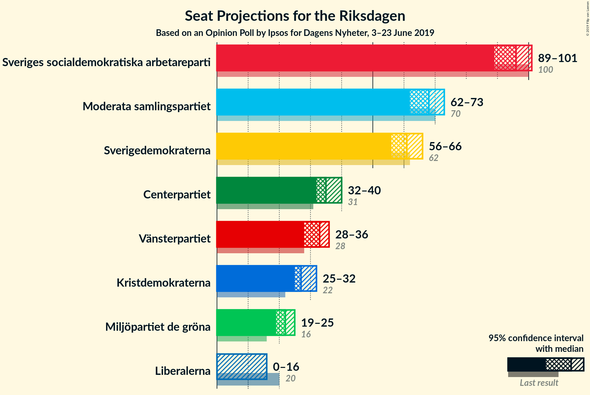
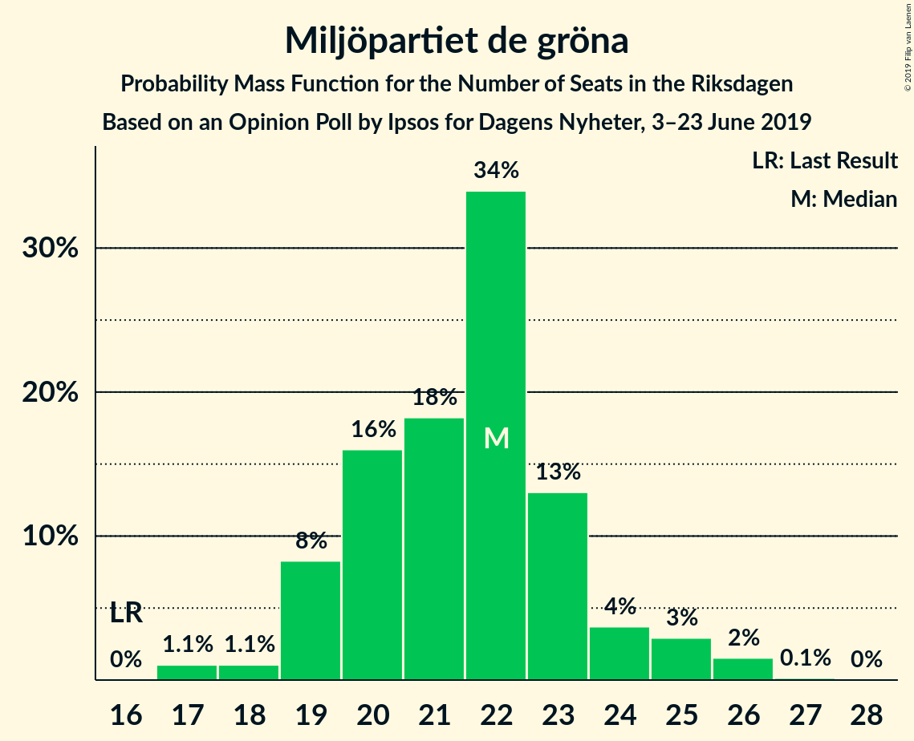
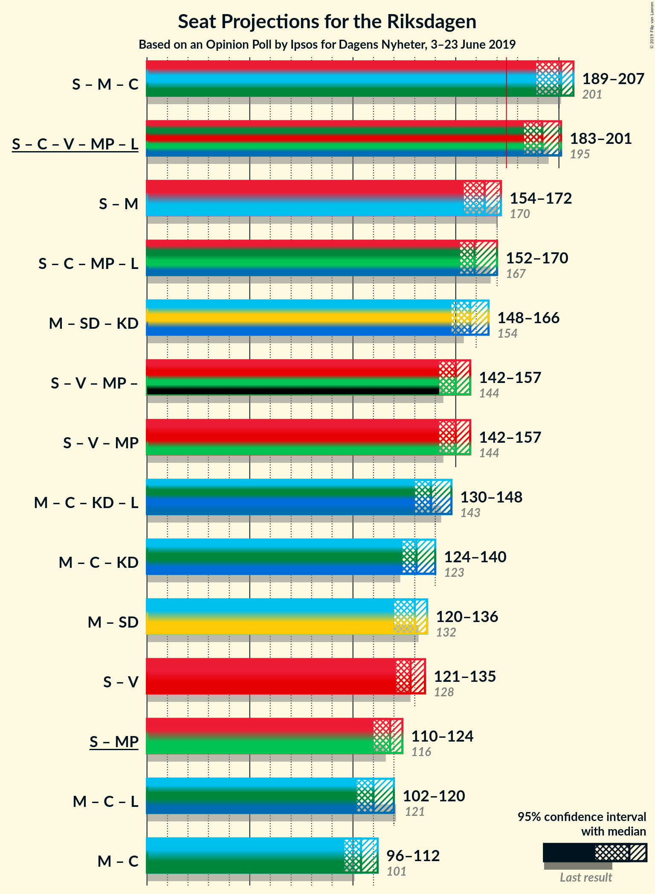

# Opinion Poll by Ipsos for Dagens Nyheter, 3–23 June 2019

<a href="#voting-intentions">Voting Intentions</a> | <a href="#seats">Seats</a> | <a href="#coalitions">Coalitions</a> | <a href="#technical-information">Technical Information</a>

## Voting Intentions

### Confidence Intervals

| Party | Last Result | Poll Result | 80% Confidence Interval | 90% Confidence Interval | 95% Confidence Interval | 99% Confidence Interval |
|:-----:|:-----------:|:-----------:|:-----------------------:|:-----------------------:|:-----------------------:|:-----------------------:|
| Sveriges socialdemokratiska arbetareparti | 28.3% | 27.0% | 25.9–28.1% |25.6–28.4% |25.3–28.7% |24.8–29.2% |
| Moderata samlingspartiet | 19.8% | 19.0% | 18.1–20.0% |17.8–20.3% |17.6–20.5% |17.1–21.0% |
| Sverigedemokraterna | 17.5% | 17.0% | 16.1–18.0% |15.9–18.2% |15.6–18.5% |15.2–18.9% |
| Centerpartiet | 8.6% | 10.0% | 9.3–10.8% |9.1–11.0% |8.9–11.2% |8.6–11.6% |
| Vänsterpartiet | 8.0% | 9.0% | 8.3–9.7% |8.1–9.9% |8.0–10.1% |7.7–10.5% |
| Kristdemokraterna | 6.3% | 8.0% | 7.4–8.7% |7.2–8.9% |7.0–9.1% |6.8–9.4% |
| Miljöpartiet de gröna | 4.4% | 6.0% | 5.5–6.6% |5.3–6.8% |5.2–7.0% |4.9–7.3% |
| Liberalerna | 5.5% | 4.0% | 3.6–4.5% |3.4–4.7% |3.3–4.8% |3.1–5.1% |

*Note:* The poll result column reflects the actual value used in the calculations. Published results may vary slightly, and in addition be rounded to fewer digits.

## Seats

### Confidence Intervals

| Party | Last Result | Median | 80% Confidence Interval | 90% Confidence Interval | 95% Confidence Interval | 99% Confidence Interval |
|:-----:|:-----------:|:------:|:-----------------------:|:-----------------------:|:-----------------------:|:-----------------------:|
| <a href="#sveriges-socialdemokratiska-arbetareparti">Sveriges socialdemokratiska arbetareparti</a> | 100 | 96 | 92–101 |90–101 |89–101 |87–104 |
| <a href="#moderata-samlingspartiet">Moderata samlingspartiet</a> | 70 | 68 | 64–71 |63–72 |62–73 |61–74 |
| <a href="#sverigedemokraterna">Sverigedemokraterna</a> | 62 | 61 | 57–64 |57–64 |56–66 |53–68 |
| <a href="#centerpartiet">Centerpartiet</a> | 31 | 35 | 33–38 |33–39 |32–40 |30–42 |
| <a href="#vänsterpartiet">Vänsterpartiet</a> | 28 | 33 | 29–34 |28–35 |28–36 |28–37 |
| <a href="#kristdemokraterna">Kristdemokraterna</a> | 22 | 27 | 26–31 |25–31 |25–32 |25–34 |
| <a href="#miljöpartiet-de-gröna">Miljöpartiet de gröna</a> | 16 | 22 | 19–23 |19–24 |19–25 |17–26 |
| <a href="#liberalerna">Liberalerna</a> | 20 | 0 | 0–16 |0–16 |0–16 |0–18 |

### Sveriges socialdemokratiska arbetareparti

*For a full overview of the results for this party, see the [Sveriges socialdemokratiska arbetareparti](party-sverigessocialdemokratiskaarbetareparti.html) page.*

| Number of Seats | Probability | Accumulated | Special Marks |
|:---------------:|:-----------:|:-----------:|:-------------:|
| 85 | 0.2% | 100% |  |
| 86 | 0.1% | 99.8% |  |
| 87 | 0.3% | 99.7% |  |
| 88 | 1.1% | 99.4% |  |
| 89 | 1.3% | 98% |  |
| 90 | 2% | 97% |  |
| 91 | 2% | 95% |  |
| 92 | 3% | 93% |  |
| 93 | 15% | 90% |  |
| 94 | 13% | 75% |  |
| 95 | 6% | 62% |  |
| 96 | 7% | 56% | Median |
| 97 | 7% | 49% |  |
| 98 | 2% | 43% |  |
| 99 | 4% | 40% |  |
| 100 | 7% | 36% | Last Result |
| 101 | 27% | 29% |  |
| 102 | 0.5% | 2% |  |
| 103 | 0.8% | 1.5% |  |
| 104 | 0.4% | 0.7% |  |
| 105 | 0.1% | 0.3% |  |
| 106 | 0.2% | 0.3% |  |
| 107 | 0% | 0% |  |

### Moderata samlingspartiet

*For a full overview of the results for this party, see the [Moderata samlingspartiet](party-moderatasamlingspartiet.html) page.*

| Number of Seats | Probability | Accumulated | Special Marks |
|:---------------:|:-----------:|:-----------:|:-------------:|
| 59 | 0.1% | 100% |  |
| 60 | 0.2% | 99.9% |  |
| 61 | 2% | 99.7% |  |
| 62 | 2% | 98% |  |
| 63 | 6% | 96% |  |
| 64 | 5% | 90% |  |
| 65 | 7% | 86% |  |
| 66 | 7% | 78% |  |
| 67 | 17% | 72% |  |
| 68 | 7% | 54% | Median |
| 69 | 28% | 47% |  |
| 70 | 7% | 19% | Last Result |
| 71 | 3% | 12% |  |
| 72 | 4% | 9% |  |
| 73 | 4% | 5% |  |
| 74 | 0.4% | 0.9% |  |
| 75 | 0.2% | 0.5% |  |
| 76 | 0.2% | 0.3% |  |
| 77 | 0% | 0.1% |  |
| 78 | 0% | 0.1% |  |
| 79 | 0% | 0% |  |

### Sverigedemokraterna

*For a full overview of the results for this party, see the [Sverigedemokraterna](party-sverigedemokraterna.html) page.*

| Number of Seats | Probability | Accumulated | Special Marks |
|:---------------:|:-----------:|:-----------:|:-------------:|
| 52 | 0.3% | 100% |  |
| 53 | 0.1% | 99.6% |  |
| 54 | 0.4% | 99.5% |  |
| 55 | 0.9% | 99.1% |  |
| 56 | 2% | 98% |  |
| 57 | 18% | 96% |  |
| 58 | 4% | 78% |  |
| 59 | 4% | 75% |  |
| 60 | 10% | 71% |  |
| 61 | 32% | 60% | Median |
| 62 | 11% | 29% | Last Result |
| 63 | 2% | 18% |  |
| 64 | 11% | 16% |  |
| 65 | 0.9% | 4% |  |
| 66 | 1.3% | 3% |  |
| 67 | 1.0% | 2% |  |
| 68 | 0.8% | 1.0% |  |
| 69 | 0% | 0.2% |  |
| 70 | 0.1% | 0.2% |  |
| 71 | 0% | 0% |  |

### Centerpartiet

*For a full overview of the results for this party, see the [Centerpartiet](party-centerpartiet.html) page.*

| Number of Seats | Probability | Accumulated | Special Marks |
|:---------------:|:-----------:|:-----------:|:-------------:|
| 29 | 0% | 100% |  |
| 30 | 0.7% | 99.9% |  |
| 31 | 1.5% | 99.3% | Last Result |
| 32 | 2% | 98% |  |
| 33 | 14% | 96% |  |
| 34 | 8% | 82% |  |
| 35 | 29% | 74% | Median |
| 36 | 6% | 44% |  |
| 37 | 17% | 39% |  |
| 38 | 13% | 22% |  |
| 39 | 6% | 9% |  |
| 40 | 2% | 3% |  |
| 41 | 0.2% | 1.0% |  |
| 42 | 0.7% | 0.8% |  |
| 43 | 0% | 0% |  |

### Vänsterpartiet

*For a full overview of the results for this party, see the [Vänsterpartiet](party-vänsterpartiet.html) page.*

| Number of Seats | Probability | Accumulated | Special Marks |
|:---------------:|:-----------:|:-----------:|:-------------:|
| 26 | 0.1% | 100% |  |
| 27 | 0.3% | 99.9% |  |
| 28 | 8% | 99.6% | Last Result |
| 29 | 8% | 92% |  |
| 30 | 11% | 84% |  |
| 31 | 18% | 73% |  |
| 32 | 5% | 55% |  |
| 33 | 10% | 50% | Median |
| 34 | 33% | 40% |  |
| 35 | 4% | 8% |  |
| 36 | 2% | 3% |  |
| 37 | 1.3% | 2% |  |
| 38 | 0.2% | 0.3% |  |
| 39 | 0.1% | 0.1% |  |
| 40 | 0% | 0% |  |

### Kristdemokraterna

*For a full overview of the results for this party, see the [Kristdemokraterna](party-kristdemokraterna.html) page.*

| Number of Seats | Probability | Accumulated | Special Marks |
|:---------------:|:-----------:|:-----------:|:-------------:|
| 22 | 0% | 100% | Last Result |
| 23 | 0.1% | 100% |  |
| 24 | 0.3% | 99.9% |  |
| 25 | 5% | 99.6% |  |
| 26 | 9% | 95% |  |
| 27 | 38% | 86% | Median |
| 28 | 16% | 48% |  |
| 29 | 14% | 32% |  |
| 30 | 8% | 18% |  |
| 31 | 6% | 11% |  |
| 32 | 2% | 4% |  |
| 33 | 0.9% | 2% |  |
| 34 | 1.0% | 1.1% |  |
| 35 | 0.1% | 0.1% |  |
| 36 | 0% | 0% |  |

### Miljöpartiet de gröna

*For a full overview of the results for this party, see the [Miljöpartiet de gröna](party-miljöpartietdegröna.html) page.*

| Number of Seats | Probability | Accumulated | Special Marks |
|:---------------:|:-----------:|:-----------:|:-------------:|
| 16 | 0% | 100% | Last Result |
| 17 | 1.1% | 100% |  |
| 18 | 1.1% | 98.9% |  |
| 19 | 8% | 98% |  |
| 20 | 16% | 90% |  |
| 21 | 18% | 74% |  |
| 22 | 34% | 55% | Median |
| 23 | 13% | 21% |  |
| 24 | 4% | 8% |  |
| 25 | 3% | 5% |  |
| 26 | 2% | 2% |  |
| 27 | 0.1% | 0.2% |  |
| 28 | 0% | 0% |  |

### Liberalerna

*For a full overview of the results for this party, see the [Liberalerna](party-liberalerna.html) page.*

| Number of Seats | Probability | Accumulated | Special Marks |
|:---------------:|:-----------:|:-----------:|:-------------:|
| 0 | 54% | 100% | Median |
| 1 | 0% | 46% |  |
| 2 | 0% | 46% |  |
| 3 | 0% | 46% |  |
| 4 | 0% | 46% |  |
| 5 | 0% | 46% |  |
| 6 | 0% | 46% |  |
| 7 | 0% | 46% |  |
| 8 | 0% | 46% |  |
| 9 | 0% | 46% |  |
| 10 | 0% | 46% |  |
| 11 | 0% | 46% |  |
| 12 | 0% | 46% |  |
| 13 | 0% | 46% |  |
| 14 | 7% | 46% |  |
| 15 | 28% | 39% |  |
| 16 | 8% | 10% |  |
| 17 | 2% | 2% |  |
| 18 | 0.7% | 0.7% |  |
| 19 | 0.1% | 0.1% |  |
| 20 | 0% | 0% | Last Result |

## Coalitions

### Confidence Intervals

| Coalition | Last Result | Median | Majority? | 80% Confidence Interval | 90% Confidence Interval | 95% Confidence Interval | 99% Confidence Interval |
|:---------:|:-----------:|:------:|:---------:|:-----------------------:|:-----------------------:|:-----------------------:|:-----------------------:|
| Sveriges socialdemokratiska arbetareparti – Moderata samlingspartiet – Centerpartiet | 201 | 201 | 100% | 193–206 | 190–206 | 189–207 | 188–210 |
| Sveriges socialdemokratiska arbetareparti – Centerpartiet – Vänsterpartiet – Miljöpartiet de gröna – Liberalerna | 195 | 192 | 100% | 188–198 | 186–200 | 183–201 | 182–204 |
| Sveriges socialdemokratiska arbetareparti – Moderata samlingspartiet | 170 | 164 | 0.2% | 158–170 | 157–170 | 154–172 | 151–173 |
| Sveriges socialdemokratiska arbetareparti – Centerpartiet – Miljöpartiet de gröna – Liberalerna | 167 | 159 | 0.1% | 155–169 | 153–169 | 152–170 | 148–172 |
| Moderata samlingspartiet – Sverigedemokraterna – Kristdemokraterna | 154 | 157 | 0% | 151–161 | 149–163 | 148–166 | 145–167 |
| Sveriges socialdemokratiska arbetareparti – Vänsterpartiet – Miljöpartiet de gröna | 144 | 150 | 0% | 143–157 | 143–157 | 142–157 | 139–158 |
| Moderata samlingspartiet – Centerpartiet – Kristdemokraterna – Liberalerna | 143 | 138 | 0% | 131–147 | 130–148 | 130–148 | 128–150 |
| Moderata samlingspartiet – Centerpartiet – Kristdemokraterna | 123 | 131 | 0% | 127–137 | 126–139 | 124–140 | 121–142 |
| Moderata samlingspartiet – Sverigedemokraterna | 132 | 130 | 0% | 123–132 | 121–134 | 120–136 | 118–139 |
| Sveriges socialdemokratiska arbetareparti – Vänsterpartiet | 128 | 128 | 0% | 122–135 | 122–135 | 121–135 | 119–137 |
| Sveriges socialdemokratiska arbetareparti – Miljöpartiet de gröna | 116 | 118 | 0% | 113–123 | 112–123 | 110–124 | 108–125 |
| Moderata samlingspartiet – Centerpartiet – Liberalerna | 121 | 110 | 0% | 104–119 | 102–119 | 102–120 | 98–123 |
| Moderata samlingspartiet – Centerpartiet | 101 | 104 | 0% | 99–107 | 98–110 | 96–112 | 95–112 |

### Sveriges socialdemokratiska arbetareparti – Moderata samlingspartiet – Centerpartiet

| Number of Seats | Probability | Accumulated | Special Marks |
|:---------------:|:-----------:|:-----------:|:-------------:|
| 185 | 0% | 100% |  |
| 186 | 0.2% | 99.9% |  |
| 187 | 0.1% | 99.7% |  |
| 188 | 2% | 99.6% |  |
| 189 | 0.4% | 98% |  |
| 190 | 2% | 97% |  |
| 191 | 0.6% | 95% |  |
| 192 | 0.8% | 94% |  |
| 193 | 10% | 93% |  |
| 194 | 3% | 83% |  |
| 195 | 9% | 81% |  |
| 196 | 3% | 72% |  |
| 197 | 4% | 69% |  |
| 198 | 7% | 66% |  |
| 199 | 2% | 59% | Median |
| 200 | 6% | 56% |  |
| 201 | 5% | 50% | Last Result |
| 202 | 1.3% | 45% |  |
| 203 | 4% | 44% |  |
| 204 | 2% | 41% |  |
| 205 | 27% | 39% |  |
| 206 | 7% | 12% |  |
| 207 | 2% | 4% |  |
| 208 | 0.9% | 2% |  |
| 209 | 0.5% | 1.3% |  |
| 210 | 0.5% | 0.8% |  |
| 211 | 0.1% | 0.3% |  |
| 212 | 0.1% | 0.2% |  |
| 213 | 0.1% | 0.1% |  |
| 214 | 0% | 0.1% |  |
| 215 | 0% | 0% |  |

### Sveriges socialdemokratiska arbetareparti – Centerpartiet – Vänsterpartiet – Miljöpartiet de gröna – Liberalerna

| Number of Seats | Probability | Accumulated | Special Marks |
|:---------------:|:-----------:|:-----------:|:-------------:|
| 178 | 0% | 100% |  |
| 179 | 0% | 99.9% |  |
| 180 | 0% | 99.9% |  |
| 181 | 0.2% | 99.9% |  |
| 182 | 0.9% | 99.6% |  |
| 183 | 1.3% | 98.7% |  |
| 184 | 0.4% | 97% |  |
| 185 | 1.3% | 97% |  |
| 186 | 2% | 96% | Median |
| 187 | 3% | 94% |  |
| 188 | 5% | 91% |  |
| 189 | 2% | 86% |  |
| 190 | 6% | 84% |  |
| 191 | 11% | 77% |  |
| 192 | 27% | 67% |  |
| 193 | 2% | 40% |  |
| 194 | 5% | 38% |  |
| 195 | 4% | 33% | Last Result |
| 196 | 5% | 29% |  |
| 197 | 13% | 24% |  |
| 198 | 5% | 11% |  |
| 199 | 0.9% | 7% |  |
| 200 | 1.3% | 6% |  |
| 201 | 2% | 4% |  |
| 202 | 0.7% | 2% |  |
| 203 | 0.2% | 1.3% |  |
| 204 | 0.9% | 1.1% |  |
| 205 | 0.1% | 0.2% |  |
| 206 | 0.1% | 0.1% |  |
| 207 | 0% | 0% |  |

### Sveriges socialdemokratiska arbetareparti – Moderata samlingspartiet

| Number of Seats | Probability | Accumulated | Special Marks |
|:---------------:|:-----------:|:-----------:|:-------------:|
| 150 | 0.2% | 100% |  |
| 151 | 1.1% | 99.8% |  |
| 152 | 0.1% | 98.7% |  |
| 153 | 0.3% | 98.5% |  |
| 154 | 0.9% | 98% |  |
| 155 | 1.1% | 97% |  |
| 156 | 0.9% | 96% |  |
| 157 | 2% | 95% |  |
| 158 | 6% | 93% |  |
| 159 | 3% | 88% |  |
| 160 | 10% | 85% |  |
| 161 | 9% | 74% |  |
| 162 | 9% | 66% |  |
| 163 | 4% | 57% |  |
| 164 | 6% | 53% | Median |
| 165 | 3% | 47% |  |
| 166 | 5% | 44% |  |
| 167 | 2% | 39% |  |
| 168 | 6% | 38% |  |
| 169 | 3% | 31% |  |
| 170 | 24% | 28% | Last Result |
| 171 | 0.9% | 3% |  |
| 172 | 0.6% | 3% |  |
| 173 | 2% | 2% |  |
| 174 | 0.2% | 0.4% |  |
| 175 | 0.1% | 0.2% | Majority |
| 176 | 0% | 0.1% |  |
| 177 | 0% | 0% |  |

### Sveriges socialdemokratiska arbetareparti – Centerpartiet – Miljöpartiet de gröna – Liberalerna

| Number of Seats | Probability | Accumulated | Special Marks |
|:---------------:|:-----------:|:-----------:|:-------------:|
| 146 | 0% | 100% |  |
| 147 | 0.1% | 99.9% |  |
| 148 | 0.7% | 99.9% |  |
| 149 | 0.3% | 99.2% |  |
| 150 | 0.9% | 98.9% |  |
| 151 | 0.3% | 98% |  |
| 152 | 1.0% | 98% |  |
| 153 | 4% | 97% | Median |
| 154 | 2% | 93% |  |
| 155 | 4% | 91% |  |
| 156 | 2% | 87% |  |
| 157 | 3% | 86% |  |
| 158 | 26% | 83% |  |
| 159 | 7% | 57% |  |
| 160 | 2% | 49% |  |
| 161 | 13% | 48% |  |
| 162 | 2% | 34% |  |
| 163 | 4% | 32% |  |
| 164 | 2% | 28% |  |
| 165 | 5% | 26% |  |
| 166 | 0.9% | 21% |  |
| 167 | 4% | 20% | Last Result |
| 168 | 5% | 15% |  |
| 169 | 7% | 10% |  |
| 170 | 3% | 4% |  |
| 171 | 0.3% | 0.9% |  |
| 172 | 0.2% | 0.6% |  |
| 173 | 0.2% | 0.4% |  |
| 174 | 0.1% | 0.2% |  |
| 175 | 0% | 0.1% | Majority |
| 176 | 0.1% | 0.1% |  |
| 177 | 0% | 0% |  |

### Moderata samlingspartiet – Sverigedemokraterna – Kristdemokraterna

| Number of Seats | Probability | Accumulated | Special Marks |
|:---------------:|:-----------:|:-----------:|:-------------:|
| 143 | 0.1% | 100% |  |
| 144 | 0.1% | 99.9% |  |
| 145 | 0.9% | 99.8% |  |
| 146 | 0.2% | 98.9% |  |
| 147 | 0.7% | 98.7% |  |
| 148 | 2% | 98% |  |
| 149 | 1.3% | 96% |  |
| 150 | 0.9% | 94% |  |
| 151 | 5% | 93% |  |
| 152 | 13% | 89% |  |
| 153 | 5% | 76% |  |
| 154 | 4% | 71% | Last Result |
| 155 | 5% | 67% |  |
| 156 | 2% | 62% | Median |
| 157 | 27% | 60% |  |
| 158 | 11% | 33% |  |
| 159 | 6% | 23% |  |
| 160 | 2% | 16% |  |
| 161 | 5% | 14% |  |
| 162 | 3% | 9% |  |
| 163 | 2% | 6% |  |
| 164 | 1.3% | 4% |  |
| 165 | 0.4% | 3% |  |
| 166 | 1.3% | 3% |  |
| 167 | 0.9% | 1.3% |  |
| 168 | 0.2% | 0.4% |  |
| 169 | 0% | 0.1% |  |
| 170 | 0% | 0.1% |  |
| 171 | 0% | 0.1% |  |
| 172 | 0% | 0% |  |

### Sveriges socialdemokratiska arbetareparti – Vänsterpartiet – Miljöpartiet de gröna

| Number of Seats | Probability | Accumulated | Special Marks |
|:---------------:|:-----------:|:-----------:|:-------------:|
| 135 | 0.1% | 100% |  |
| 136 | 0% | 99.9% |  |
| 137 | 0% | 99.9% |  |
| 138 | 0.1% | 99.9% |  |
| 139 | 0.5% | 99.7% |  |
| 140 | 0.4% | 99.3% |  |
| 141 | 0.9% | 98.9% |  |
| 142 | 1.0% | 98% |  |
| 143 | 9% | 97% |  |
| 144 | 7% | 88% | Last Result |
| 145 | 12% | 81% |  |
| 146 | 4% | 69% |  |
| 147 | 4% | 65% |  |
| 148 | 5% | 61% |  |
| 149 | 6% | 56% |  |
| 150 | 2% | 50% |  |
| 151 | 1.5% | 48% | Median |
| 152 | 9% | 46% |  |
| 153 | 2% | 38% |  |
| 154 | 3% | 36% |  |
| 155 | 2% | 33% |  |
| 156 | 2% | 31% |  |
| 157 | 26% | 29% |  |
| 158 | 2% | 2% |  |
| 159 | 0.2% | 0.4% |  |
| 160 | 0.1% | 0.2% |  |
| 161 | 0% | 0.1% |  |
| 162 | 0% | 0.1% |  |
| 163 | 0% | 0% |  |

### Moderata samlingspartiet – Centerpartiet – Kristdemokraterna – Liberalerna

| Number of Seats | Probability | Accumulated | Special Marks |
|:---------------:|:-----------:|:-----------:|:-------------:|
| 125 | 0.1% | 100% |  |
| 126 | 0.1% | 99.9% |  |
| 127 | 0.3% | 99.8% |  |
| 128 | 0.2% | 99.5% |  |
| 129 | 0.5% | 99.3% |  |
| 130 | 4% | 98.9% | Median |
| 131 | 26% | 95% |  |
| 132 | 0.5% | 69% |  |
| 133 | 2% | 68% |  |
| 134 | 2% | 66% |  |
| 135 | 8% | 65% |  |
| 136 | 2% | 57% |  |
| 137 | 3% | 55% |  |
| 138 | 3% | 52% |  |
| 139 | 2% | 49% |  |
| 140 | 3% | 48% |  |
| 141 | 2% | 44% |  |
| 142 | 11% | 42% |  |
| 143 | 7% | 31% | Last Result |
| 144 | 6% | 24% |  |
| 145 | 2% | 18% |  |
| 146 | 2% | 16% |  |
| 147 | 7% | 15% |  |
| 148 | 5% | 7% |  |
| 149 | 0.6% | 2% |  |
| 150 | 0.7% | 1.2% |  |
| 151 | 0.2% | 0.5% |  |
| 152 | 0.2% | 0.3% |  |
| 153 | 0% | 0.1% |  |
| 154 | 0% | 0.1% |  |
| 155 | 0.1% | 0.1% |  |
| 156 | 0% | 0% |  |

### Moderata samlingspartiet – Centerpartiet – Kristdemokraterna

| Number of Seats | Probability | Accumulated | Special Marks |
|:---------------:|:-----------:|:-----------:|:-------------:|
| 118 | 0.1% | 100% |  |
| 119 | 0% | 99.9% |  |
| 120 | 0.1% | 99.9% |  |
| 121 | 0.4% | 99.8% |  |
| 122 | 1.0% | 99.4% |  |
| 123 | 0.2% | 98% | Last Result |
| 124 | 2% | 98% |  |
| 125 | 1.1% | 97% |  |
| 126 | 1.2% | 95% |  |
| 127 | 12% | 94% |  |
| 128 | 4% | 82% |  |
| 129 | 8% | 79% |  |
| 130 | 6% | 71% | Median |
| 131 | 27% | 65% |  |
| 132 | 10% | 39% |  |
| 133 | 7% | 29% |  |
| 134 | 2% | 22% |  |
| 135 | 8% | 20% |  |
| 136 | 2% | 12% |  |
| 137 | 3% | 10% |  |
| 138 | 2% | 8% |  |
| 139 | 0.6% | 5% |  |
| 140 | 3% | 5% |  |
| 141 | 0.3% | 2% |  |
| 142 | 1.5% | 2% |  |
| 143 | 0.1% | 0.3% |  |
| 144 | 0.1% | 0.2% |  |
| 145 | 0.1% | 0.1% |  |
| 146 | 0% | 0% |  |

### Moderata samlingspartiet – Sverigedemokraterna

| Number of Seats | Probability | Accumulated | Special Marks |
|:---------------:|:-----------:|:-----------:|:-------------:|
| 116 | 0.2% | 100% |  |
| 117 | 0.1% | 99.8% |  |
| 118 | 0.3% | 99.7% |  |
| 119 | 1.0% | 99.4% |  |
| 120 | 2% | 98% |  |
| 121 | 1.3% | 96% |  |
| 122 | 4% | 95% |  |
| 123 | 7% | 91% |  |
| 124 | 7% | 84% |  |
| 125 | 7% | 76% |  |
| 126 | 2% | 69% |  |
| 127 | 5% | 68% |  |
| 128 | 2% | 63% |  |
| 129 | 4% | 61% | Median |
| 130 | 32% | 57% |  |
| 131 | 11% | 24% |  |
| 132 | 4% | 13% | Last Result |
| 133 | 4% | 9% |  |
| 134 | 1.4% | 5% |  |
| 135 | 0.3% | 4% |  |
| 136 | 2% | 4% |  |
| 137 | 0.1% | 1.2% |  |
| 138 | 0.1% | 1.2% |  |
| 139 | 0.9% | 1.0% |  |
| 140 | 0.1% | 0.1% |  |
| 141 | 0% | 0.1% |  |
| 142 | 0% | 0% |  |

### Sveriges socialdemokratiska arbetareparti – Vänsterpartiet

| Number of Seats | Probability | Accumulated | Special Marks |
|:---------------:|:-----------:|:-----------:|:-------------:|
| 115 | 0% | 100% |  |
| 116 | 0.1% | 99.9% |  |
| 117 | 0.1% | 99.9% |  |
| 118 | 0.2% | 99.7% |  |
| 119 | 0.6% | 99.6% |  |
| 120 | 1.4% | 98.9% |  |
| 121 | 0.6% | 98% |  |
| 122 | 8% | 97% |  |
| 123 | 10% | 89% |  |
| 124 | 4% | 79% |  |
| 125 | 9% | 75% |  |
| 126 | 8% | 66% |  |
| 127 | 4% | 58% |  |
| 128 | 6% | 54% | Last Result |
| 129 | 2% | 47% | Median |
| 130 | 3% | 45% |  |
| 131 | 7% | 42% |  |
| 132 | 4% | 35% |  |
| 133 | 3% | 32% |  |
| 134 | 1.3% | 29% |  |
| 135 | 26% | 28% |  |
| 136 | 0.5% | 1.2% |  |
| 137 | 0.3% | 0.8% |  |
| 138 | 0.3% | 0.5% |  |
| 139 | 0.1% | 0.2% |  |
| 140 | 0% | 0% |  |

### Sveriges socialdemokratiska arbetareparti – Miljöpartiet de gröna

| Number of Seats | Probability | Accumulated | Special Marks |
|:---------------:|:-----------:|:-----------:|:-------------:|
| 105 | 0.1% | 100% |  |
| 106 | 0.1% | 99.9% |  |
| 107 | 0.2% | 99.8% |  |
| 108 | 0.5% | 99.6% |  |
| 109 | 0.6% | 99.1% |  |
| 110 | 2% | 98% |  |
| 111 | 0.6% | 96% |  |
| 112 | 4% | 96% |  |
| 113 | 11% | 92% |  |
| 114 | 7% | 81% |  |
| 115 | 7% | 74% |  |
| 116 | 5% | 67% | Last Result |
| 117 | 12% | 63% |  |
| 118 | 4% | 51% | Median |
| 119 | 3% | 47% |  |
| 120 | 2% | 43% |  |
| 121 | 8% | 41% |  |
| 122 | 4% | 34% |  |
| 123 | 26% | 30% |  |
| 124 | 2% | 4% |  |
| 125 | 2% | 2% |  |
| 126 | 0.1% | 0.5% |  |
| 127 | 0.1% | 0.3% |  |
| 128 | 0.2% | 0.3% |  |
| 129 | 0.1% | 0.1% |  |
| 130 | 0% | 0% |  |

### Moderata samlingspartiet – Centerpartiet – Liberalerna

| Number of Seats | Probability | Accumulated | Special Marks |
|:---------------:|:-----------:|:-----------:|:-------------:|
| 96 | 0% | 100% |  |
| 97 | 0% | 99.9% |  |
| 98 | 0.5% | 99.9% |  |
| 99 | 0.4% | 99.4% |  |
| 100 | 0.6% | 99.0% |  |
| 101 | 0.8% | 98% |  |
| 102 | 4% | 98% |  |
| 103 | 0.6% | 93% | Median |
| 104 | 27% | 93% |  |
| 105 | 1.4% | 65% |  |
| 106 | 9% | 64% |  |
| 107 | 0.8% | 55% |  |
| 108 | 2% | 55% |  |
| 109 | 0.9% | 52% |  |
| 110 | 3% | 52% |  |
| 111 | 1.3% | 49% |  |
| 112 | 8% | 47% |  |
| 113 | 1.3% | 39% |  |
| 114 | 2% | 38% |  |
| 115 | 9% | 36% |  |
| 116 | 4% | 27% |  |
| 117 | 4% | 23% |  |
| 118 | 2% | 19% |  |
| 119 | 14% | 17% |  |
| 120 | 2% | 4% |  |
| 121 | 0.6% | 2% | Last Result |
| 122 | 0.2% | 1.0% |  |
| 123 | 0.4% | 0.8% |  |
| 124 | 0.3% | 0.4% |  |
| 125 | 0.1% | 0.1% |  |
| 126 | 0% | 0% |  |

### Moderata samlingspartiet – Centerpartiet

| Number of Seats | Probability | Accumulated | Special Marks |
|:---------------:|:-----------:|:-----------:|:-------------:|
| 92 | 0.1% | 100% |  |
| 93 | 0.1% | 99.9% |  |
| 94 | 0.2% | 99.8% |  |
| 95 | 0.4% | 99.6% |  |
| 96 | 2% | 99.2% |  |
| 97 | 1.2% | 97% |  |
| 98 | 5% | 96% |  |
| 99 | 2% | 91% |  |
| 100 | 12% | 88% |  |
| 101 | 4% | 76% | Last Result |
| 102 | 6% | 72% |  |
| 103 | 2% | 66% | Median |
| 104 | 41% | 64% |  |
| 105 | 2% | 23% |  |
| 106 | 10% | 21% |  |
| 107 | 1.0% | 11% |  |
| 108 | 2% | 10% |  |
| 109 | 0.7% | 7% |  |
| 110 | 2% | 6% |  |
| 111 | 0.2% | 4% |  |
| 112 | 4% | 4% |  |
| 113 | 0.1% | 0.3% |  |
| 114 | 0.1% | 0.2% |  |
| 115 | 0% | 0.1% |  |
| 116 | 0.1% | 0.1% |  |
| 117 | 0% | 0% |  |

## Technical Information

### Opinion Poll

+ **Polling firm:** Ipsos
+ **Commissioner(s):** Dagens Nyheter
+ **Fieldwork period:** 3–23 June 2019

### Calculations

+ **Sample size:** 2747
+ **Simulations done:** 1,048,576
+ **Error estimate:** 1.33%

