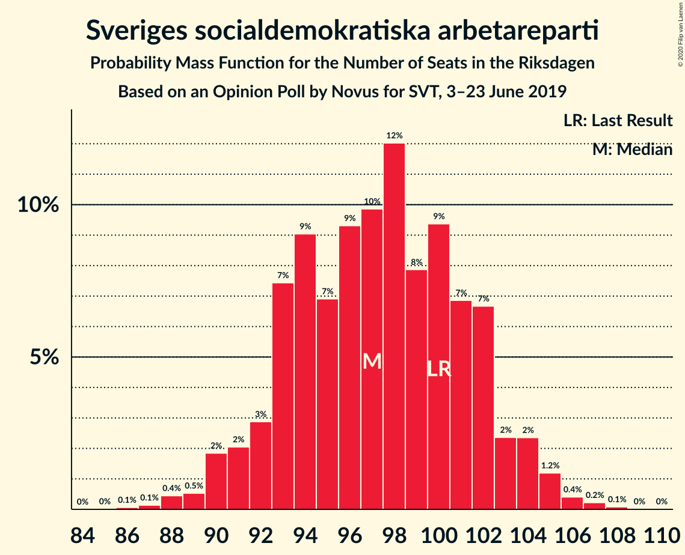
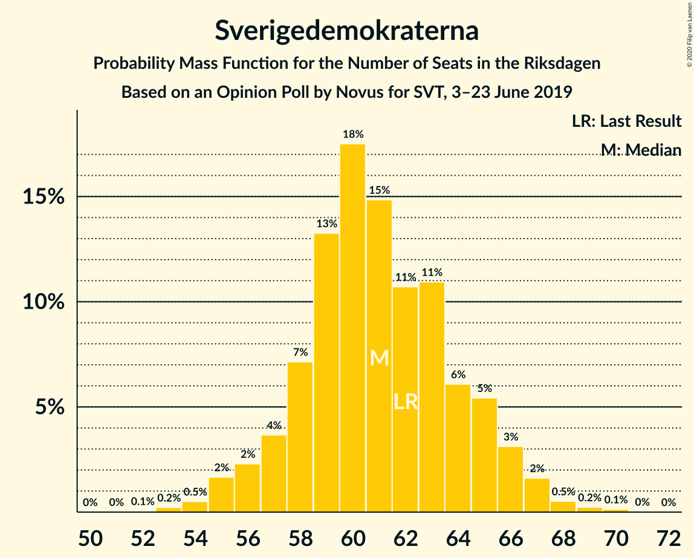
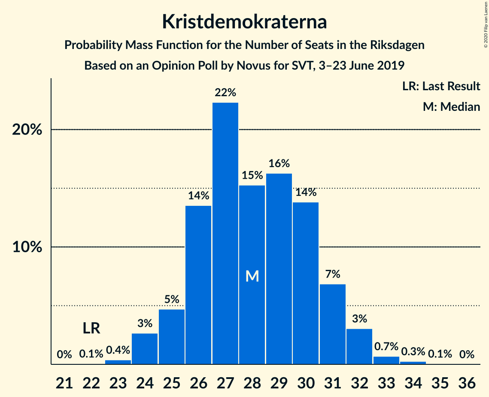
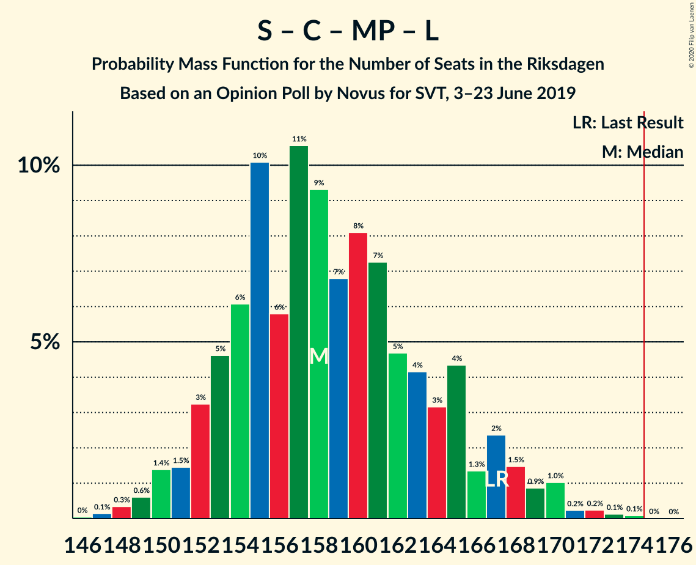

# Opinion Poll by Novus for SVT, 3–23 June 2019

<a href="#voting-intentions">Voting Intentions</a> | <a href="#seats">Seats</a> | <a href="#coalitions">Coalitions</a> | <a href="#technical-information">Technical Information</a>

## Voting Intentions

### Confidence Intervals

| Party | Last Result | Poll Result | 80% Confidence Interval | 90% Confidence Interval | 95% Confidence Interval | 99% Confidence Interval |
|:-----:|:-----------:|:-----------:|:-----------------------:|:-----------------------:|:-----------------------:|:-----------------------:|
| Sveriges socialdemokratiska arbetareparti | 28.3% | 26.7% | 25.6–27.8% |25.3–28.1% |25.1–28.4% |24.6–28.9% |
| Moderata samlingspartiet | 19.8% | 18.8% | 17.9–19.8% |17.6–20.1% |17.4–20.3% |16.9–20.8% |
| Sverigedemokraterna | 17.5% | 16.7% | 15.8–17.7% |15.6–17.9% |15.4–18.2% |14.9–18.6% |
| Centerpartiet | 8.6% | 10.1% | 9.4–10.9% |9.2–11.1% |9.0–11.3% |8.7–11.7% |
| Vänsterpartiet | 8.0% | 9.0% | 8.3–9.7% |8.1–10.0% |8.0–10.1% |7.7–10.5% |
| Kristdemokraterna | 6.3% | 7.7% | 7.1–8.4% |6.9–8.6% |6.7–8.7% |6.4–9.1% |
| Miljöpartiet de gröna | 4.4% | 5.9% | 5.3–6.5% |5.2–6.7% |5.1–6.9% |4.8–7.2% |
| Liberalerna | 5.5% | 3.6% | 3.2–4.1% |3.1–4.3% |3.0–4.4% |2.8–4.6% |

*Note:* The poll result column reflects the actual value used in the calculations. Published results may vary slightly, and in addition be rounded to fewer digits.

## Seats

### Confidence Intervals

| Party | Last Result | Median | 80% Confidence Interval | 90% Confidence Interval | 95% Confidence Interval | 99% Confidence Interval |
|:-----:|:-----------:|:------:|:-----------------------:|:-----------------------:|:-----------------------:|:-----------------------:|
| <a href="#sveriges-socialdemokratiska-arbetareparti">Sveriges socialdemokratiska arbetareparti</a> | 100 | 97 | 93–102 |91–103 |90–104 |88–106 |
| <a href="#moderata-samlingspartiet">Moderata samlingspartiet</a> | 70 | 68 | 65–72 |64–73 |63–74 |61–76 |
| <a href="#sverigedemokraterna">Sverigedemokraterna</a> | 62 | 61 | 58–65 |57–66 |56–67 |54–68 |
| <a href="#centerpartiet">Centerpartiet</a> | 31 | 37 | 34–40 |33–40 |33–41 |32–43 |
| <a href="#vänsterpartiet">Vänsterpartiet</a> | 28 | 33 | 30–35 |29–36 |29–37 |28–38 |
| <a href="#kristdemokraterna">Kristdemokraterna</a> | 22 | 28 | 26–31 |25–31 |24–32 |24–33 |
| <a href="#miljöpartiet-de-gröna">Miljöpartiet de gröna</a> | 16 | 22 | 20–23 |19–24 |18–25 |17–26 |
| <a href="#liberalerna">Liberalerna</a> | 20 | 0 | 0–14 |0–15 |0–16 |0–16 |

### Sveriges socialdemokratiska arbetareparti

*For a full overview of the results for this party, see the [Sveriges socialdemokratiska arbetareparti](party-sverigessocialdemokratiskaarbetareparti.html) page.*

| Number of Seats | Probability | Accumulated | Special Marks |
|:---------------:|:-----------:|:-----------:|:-------------:|
| 86 | 0.1% | 100% |  |
| 87 | 0.1% | 99.9% |  |
| 88 | 0.4% | 99.8% |  |
| 89 | 0.5% | 99.3% |  |
| 90 | 2% | 98.8% |  |
| 91 | 2% | 97% |  |
| 92 | 3% | 95% |  |
| 93 | 7% | 92% |  |
| 94 | 9% | 85% |  |
| 95 | 7% | 76% |  |
| 96 | 9% | 69% |  |
| 97 | 10% | 59% | Median |
| 98 | 12% | 49% |  |
| 99 | 8% | 37% |  |
| 100 | 9% | 30% | Last Result |
| 101 | 7% | 20% |  |
| 102 | 7% | 13% |  |
| 103 | 2% | 7% |  |
| 104 | 2% | 4% |  |
| 105 | 1.2% | 2% |  |
| 106 | 0.4% | 0.7% |  |
| 107 | 0.2% | 0.3% |  |
| 108 | 0.1% | 0.1% |  |
| 109 | 0% | 0% |  |

### Moderata samlingspartiet

*For a full overview of the results for this party, see the [Moderata samlingspartiet](party-moderatasamlingspartiet.html) page.*

| Number of Seats | Probability | Accumulated | Special Marks |
|:---------------:|:-----------:|:-----------:|:-------------:|
| 59 | 0.1% | 100% |  |
| 60 | 0.2% | 99.9% |  |
| 61 | 0.5% | 99.8% |  |
| 62 | 1.1% | 99.3% |  |
| 63 | 2% | 98% |  |
| 64 | 4% | 97% |  |
| 65 | 6% | 92% |  |
| 66 | 11% | 86% |  |
| 67 | 11% | 75% |  |
| 68 | 15% | 64% | Median |
| 69 | 12% | 49% |  |
| 70 | 11% | 37% | Last Result |
| 71 | 11% | 26% |  |
| 72 | 6% | 14% |  |
| 73 | 4% | 9% |  |
| 74 | 2% | 4% |  |
| 75 | 1.1% | 2% |  |
| 76 | 0.5% | 0.8% |  |
| 77 | 0.2% | 0.3% |  |
| 78 | 0.1% | 0.1% |  |
| 79 | 0% | 0% |  |

### Sverigedemokraterna

*For a full overview of the results for this party, see the [Sverigedemokraterna](party-sverigedemokraterna.html) page.*

| Number of Seats | Probability | Accumulated | Special Marks |
|:---------------:|:-----------:|:-----------:|:-------------:|
| 52 | 0.1% | 100% |  |
| 53 | 0.2% | 99.9% |  |
| 54 | 0.5% | 99.7% |  |
| 55 | 2% | 99.2% |  |
| 56 | 2% | 98% |  |
| 57 | 4% | 95% |  |
| 58 | 7% | 92% |  |
| 59 | 13% | 84% |  |
| 60 | 18% | 71% |  |
| 61 | 15% | 54% | Median |
| 62 | 11% | 39% | Last Result |
| 63 | 11% | 28% |  |
| 64 | 6% | 17% |  |
| 65 | 5% | 11% |  |
| 66 | 3% | 6% |  |
| 67 | 2% | 3% |  |
| 68 | 0.5% | 0.9% |  |
| 69 | 0.2% | 0.4% |  |
| 70 | 0.1% | 0.2% |  |
| 71 | 0% | 0% |  |

### Centerpartiet

*For a full overview of the results for this party, see the [Centerpartiet](party-centerpartiet.html) page.*

| Number of Seats | Probability | Accumulated | Special Marks |
|:---------------:|:-----------:|:-----------:|:-------------:|
| 30 | 0.1% | 100% |  |
| 31 | 0.3% | 99.9% | Last Result |
| 32 | 1.5% | 99.6% |  |
| 33 | 4% | 98% |  |
| 34 | 7% | 94% |  |
| 35 | 14% | 87% |  |
| 36 | 18% | 74% |  |
| 37 | 17% | 55% | Median |
| 38 | 12% | 38% |  |
| 39 | 13% | 26% |  |
| 40 | 8% | 13% |  |
| 41 | 3% | 5% |  |
| 42 | 1.4% | 2% |  |
| 43 | 0.5% | 0.6% |  |
| 44 | 0.1% | 0.1% |  |
| 45 | 0% | 0% |  |

### Vänsterpartiet

*For a full overview of the results for this party, see the [Vänsterpartiet](party-vänsterpartiet.html) page.*

| Number of Seats | Probability | Accumulated | Special Marks |
|:---------------:|:-----------:|:-----------:|:-------------:|
| 26 | 0% | 100% |  |
| 27 | 0.3% | 99.9% |  |
| 28 | 1.4% | 99.6% | Last Result |
| 29 | 4% | 98% |  |
| 30 | 8% | 95% |  |
| 31 | 14% | 86% |  |
| 32 | 16% | 72% |  |
| 33 | 17% | 56% | Median |
| 34 | 18% | 39% |  |
| 35 | 12% | 21% |  |
| 36 | 5% | 9% |  |
| 37 | 3% | 4% |  |
| 38 | 0.9% | 1.2% |  |
| 39 | 0.2% | 0.3% |  |
| 40 | 0.1% | 0.1% |  |
| 41 | 0% | 0% |  |

### Kristdemokraterna

*For a full overview of the results for this party, see the [Kristdemokraterna](party-kristdemokraterna.html) page.*

| Number of Seats | Probability | Accumulated | Special Marks |
|:---------------:|:-----------:|:-----------:|:-------------:|
| 22 | 0.1% | 100% | Last Result |
| 23 | 0.4% | 99.9% |  |
| 24 | 3% | 99.5% |  |
| 25 | 5% | 97% |  |
| 26 | 14% | 92% |  |
| 27 | 22% | 79% |  |
| 28 | 15% | 56% | Median |
| 29 | 16% | 41% |  |
| 30 | 14% | 25% |  |
| 31 | 7% | 11% |  |
| 32 | 3% | 4% |  |
| 33 | 0.7% | 1.0% |  |
| 34 | 0.3% | 0.3% |  |
| 35 | 0.1% | 0.1% |  |
| 36 | 0% | 0% |  |

### Miljöpartiet de gröna

*For a full overview of the results for this party, see the [Miljöpartiet de gröna](party-miljöpartietdegröna.html) page.*

| Number of Seats | Probability | Accumulated | Special Marks |
|:---------------:|:-----------:|:-----------:|:-------------:|
| 16 | 0% | 100% | Last Result |
| 17 | 0.5% | 100% |  |
| 18 | 3% | 99.5% |  |
| 19 | 3% | 97% |  |
| 20 | 18% | 94% |  |
| 21 | 25% | 76% |  |
| 22 | 23% | 51% | Median |
| 23 | 19% | 28% |  |
| 24 | 5% | 9% |  |
| 25 | 3% | 5% |  |
| 26 | 1.1% | 1.3% |  |
| 27 | 0.1% | 0.2% |  |
| 28 | 0.1% | 0.1% |  |
| 29 | 0% | 0% |  |

### Liberalerna

*For a full overview of the results for this party, see the [Liberalerna](party-liberalerna.html) page.*

| Number of Seats | Probability | Accumulated | Special Marks |
|:---------------:|:-----------:|:-----------:|:-------------:|
| 0 | 81% | 100% | Median |
| 1 | 0% | 19% |  |
| 2 | 0% | 19% |  |
| 3 | 0% | 19% |  |
| 4 | 0% | 19% |  |
| 5 | 0% | 19% |  |
| 6 | 0% | 19% |  |
| 7 | 0% | 19% |  |
| 8 | 0% | 19% |  |
| 9 | 0% | 19% |  |
| 10 | 0% | 19% |  |
| 11 | 0% | 19% |  |
| 12 | 0% | 19% |  |
| 13 | 0% | 19% |  |
| 14 | 10% | 19% |  |
| 15 | 6% | 9% |  |
| 16 | 2% | 3% |  |
| 17 | 0.4% | 0.5% |  |
| 18 | 0% | 0% |  |
| 19 | 0% | 0% |  |
| 20 | 0% | 0% | Last Result |

## Coalitions

### Confidence Intervals

| Coalition | Last Result | Median | Majority? | 80% Confidence Interval | 90% Confidence Interval | 95% Confidence Interval | 99% Confidence Interval |
|:---------:|:-----------:|:------:|:---------:|:-----------------------:|:-----------------------:|:-----------------------:|:-----------------------:|
| Sveriges socialdemokratiska arbetareparti – Moderata samlingspartiet – Centerpartiet | 201 | 204 | 100% | 196–208 | 194–209 | 192–210 | 190–212 |
| Sveriges socialdemokratiska arbetareparti – Centerpartiet – Vänsterpartiet – Miljöpartiet de gröna – Liberalerna | 195 | 191 | 100% | 186–197 | 185–199 | 184–200 | 182–203 |
| Sveriges socialdemokratiska arbetareparti – Moderata samlingspartiet | 170 | 166 | 1.2% | 160–171 | 158–172 | 157–174 | 154–175 |
| Sveriges socialdemokratiska arbetareparti – Centerpartiet – Miljöpartiet de gröna – Liberalerna | 167 | 158 | 0% | 153–165 | 152–167 | 150–169 | 148–171 |
| Moderata samlingspartiet – Sverigedemokraterna – Kristdemokraterna | 154 | 158 | 0% | 152–163 | 150–164 | 149–165 | 146–167 |
| Sveriges socialdemokratiska arbetareparti – Vänsterpartiet – Miljöpartiet de gröna | 144 | 152 | 0% | 146–157 | 144–159 | 143–160 | 140–162 |
| Moderata samlingspartiet – Centerpartiet – Kristdemokraterna – Liberalerna | 143 | 136 | 0% | 131–144 | 130–145 | 128–147 | 126–150 |
| Moderata samlingspartiet – Centerpartiet – Kristdemokraterna | 123 | 134 | 0% | 128–139 | 127–140 | 126–140 | 123–143 |
| Moderata samlingspartiet – Sverigedemokraterna | 132 | 129 | 0% | 125–134 | 123–135 | 122–137 | 119–139 |
| Sveriges socialdemokratiska arbetareparti – Vänsterpartiet | 128 | 130 | 0% | 124–136 | 123–137 | 121–137 | 119–140 |
| Sveriges socialdemokratiska arbetareparti – Miljöpartiet de gröna | 116 | 119 | 0% | 114–123 | 112–125 | 112–126 | 109–128 |
| Moderata samlingspartiet – Centerpartiet – Liberalerna | 121 | 107 | 0% | 102–117 | 101–118 | 100–120 | 98–123 |
| Moderata samlingspartiet – Centerpartiet | 101 | 105 | 0% | 101–110 | 100–111 | 99–112 | 96–114 |

### Sveriges socialdemokratiska arbetareparti – Moderata samlingspartiet – Centerpartiet

| Number of Seats | Probability | Accumulated | Special Marks |
|:---------------:|:-----------:|:-----------:|:-------------:|
| 187 | 0% | 100% |  |
| 188 | 0.1% | 99.9% |  |
| 189 | 0.2% | 99.8% |  |
| 190 | 0.3% | 99.6% |  |
| 191 | 0.5% | 99.3% |  |
| 192 | 2% | 98.8% |  |
| 193 | 1.3% | 97% |  |
| 194 | 3% | 96% |  |
| 195 | 1.4% | 93% |  |
| 196 | 5% | 92% |  |
| 197 | 3% | 87% |  |
| 198 | 3% | 84% |  |
| 199 | 4% | 81% |  |
| 200 | 4% | 77% |  |
| 201 | 6% | 72% | Last Result |
| 202 | 6% | 66% | Median |
| 203 | 8% | 60% |  |
| 204 | 11% | 52% |  |
| 205 | 7% | 40% |  |
| 206 | 7% | 33% |  |
| 207 | 11% | 25% |  |
| 208 | 7% | 14% |  |
| 209 | 3% | 7% |  |
| 210 | 3% | 5% |  |
| 211 | 0.9% | 2% |  |
| 212 | 0.5% | 1.0% |  |
| 213 | 0.3% | 0.5% |  |
| 214 | 0.1% | 0.2% |  |
| 215 | 0.1% | 0.1% |  |
| 216 | 0% | 0% |  |

### Sveriges socialdemokratiska arbetareparti – Centerpartiet – Vänsterpartiet – Miljöpartiet de gröna – Liberalerna

| Number of Seats | Probability | Accumulated | Special Marks |
|:---------------:|:-----------:|:-----------:|:-------------:|
| 179 | 0% | 100% |  |
| 180 | 0.1% | 99.9% |  |
| 181 | 0.2% | 99.8% |  |
| 182 | 0.7% | 99.6% |  |
| 183 | 0.8% | 98.8% |  |
| 184 | 2% | 98% |  |
| 185 | 3% | 97% |  |
| 186 | 4% | 93% |  |
| 187 | 5% | 89% |  |
| 188 | 8% | 84% |  |
| 189 | 13% | 76% | Median |
| 190 | 6% | 63% |  |
| 191 | 9% | 57% |  |
| 192 | 12% | 48% |  |
| 193 | 6% | 36% |  |
| 194 | 8% | 30% |  |
| 195 | 7% | 23% | Last Result |
| 196 | 3% | 16% |  |
| 197 | 3% | 12% |  |
| 198 | 4% | 9% |  |
| 199 | 2% | 5% |  |
| 200 | 1.4% | 4% |  |
| 201 | 0.7% | 2% |  |
| 202 | 0.8% | 1.4% |  |
| 203 | 0.3% | 0.6% |  |
| 204 | 0.2% | 0.3% |  |
| 205 | 0.1% | 0.1% |  |
| 206 | 0% | 0.1% |  |
| 207 | 0% | 0% |  |

### Sveriges socialdemokratiska arbetareparti – Moderata samlingspartiet

| Number of Seats | Probability | Accumulated | Special Marks |
|:---------------:|:-----------:|:-----------:|:-------------:|
| 151 | 0.1% | 100% |  |
| 152 | 0.1% | 99.9% |  |
| 153 | 0.2% | 99.8% |  |
| 154 | 0.3% | 99.6% |  |
| 155 | 0.8% | 99.3% |  |
| 156 | 0.4% | 98% |  |
| 157 | 2% | 98% |  |
| 158 | 2% | 96% |  |
| 159 | 2% | 94% |  |
| 160 | 7% | 92% |  |
| 161 | 3% | 86% |  |
| 162 | 4% | 83% |  |
| 163 | 5% | 78% |  |
| 164 | 8% | 73% |  |
| 165 | 9% | 65% | Median |
| 166 | 9% | 56% |  |
| 167 | 8% | 47% |  |
| 168 | 9% | 39% |  |
| 169 | 6% | 29% |  |
| 170 | 8% | 23% | Last Result |
| 171 | 6% | 14% |  |
| 172 | 4% | 9% |  |
| 173 | 1.5% | 5% |  |
| 174 | 2% | 3% |  |
| 175 | 0.7% | 1.2% | Majority |
| 176 | 0.2% | 0.4% |  |
| 177 | 0.1% | 0.3% |  |
| 178 | 0.1% | 0.1% |  |
| 179 | 0% | 0% |  |

### Sveriges socialdemokratiska arbetareparti – Centerpartiet – Miljöpartiet de gröna – Liberalerna

| Number of Seats | Probability | Accumulated | Special Marks |
|:---------------:|:-----------:|:-----------:|:-------------:|
| 146 | 0% | 100% |  |
| 147 | 0.1% | 99.9% |  |
| 148 | 0.3% | 99.8% |  |
| 149 | 0.6% | 99.4% |  |
| 150 | 1.4% | 98.8% |  |
| 151 | 1.5% | 97% |  |
| 152 | 3% | 96% |  |
| 153 | 5% | 93% |  |
| 154 | 6% | 88% |  |
| 155 | 10% | 82% |  |
| 156 | 6% | 72% | Median |
| 157 | 11% | 66% |  |
| 158 | 9% | 56% |  |
| 159 | 7% | 46% |  |
| 160 | 8% | 39% |  |
| 161 | 7% | 31% |  |
| 162 | 5% | 24% |  |
| 163 | 4% | 19% |  |
| 164 | 3% | 15% |  |
| 165 | 4% | 12% |  |
| 166 | 1.3% | 8% |  |
| 167 | 2% | 6% | Last Result |
| 168 | 1.5% | 4% |  |
| 169 | 0.9% | 3% |  |
| 170 | 1.0% | 2% |  |
| 171 | 0.2% | 0.7% |  |
| 172 | 0.2% | 0.5% |  |
| 173 | 0.1% | 0.2% |  |
| 174 | 0.1% | 0.1% |  |
| 175 | 0% | 0% | Majority |

### Moderata samlingspartiet – Sverigedemokraterna – Kristdemokraterna

| Number of Seats | Probability | Accumulated | Special Marks |
|:---------------:|:-----------:|:-----------:|:-------------:|
| 143 | 0% | 100% |  |
| 144 | 0.1% | 99.9% |  |
| 145 | 0.2% | 99.9% |  |
| 146 | 0.3% | 99.7% |  |
| 147 | 0.8% | 99.4% |  |
| 148 | 0.7% | 98.6% |  |
| 149 | 1.4% | 98% |  |
| 150 | 2% | 96% |  |
| 151 | 4% | 95% |  |
| 152 | 3% | 91% |  |
| 153 | 3% | 88% |  |
| 154 | 7% | 84% | Last Result |
| 155 | 8% | 77% |  |
| 156 | 6% | 70% |  |
| 157 | 12% | 64% | Median |
| 158 | 9% | 52% |  |
| 159 | 6% | 43% |  |
| 160 | 13% | 37% |  |
| 161 | 8% | 24% |  |
| 162 | 5% | 16% |  |
| 163 | 4% | 11% |  |
| 164 | 3% | 7% |  |
| 165 | 2% | 3% |  |
| 166 | 0.8% | 2% |  |
| 167 | 0.7% | 1.2% |  |
| 168 | 0.2% | 0.4% |  |
| 169 | 0.1% | 0.2% |  |
| 170 | 0% | 0.1% |  |
| 171 | 0% | 0% |  |

### Sveriges socialdemokratiska arbetareparti – Vänsterpartiet – Miljöpartiet de gröna

| Number of Seats | Probability | Accumulated | Special Marks |
|:---------------:|:-----------:|:-----------:|:-------------:|
| 138 | 0.2% | 100% |  |
| 139 | 0.2% | 99.8% |  |
| 140 | 0.2% | 99.6% |  |
| 141 | 0.6% | 99.4% |  |
| 142 | 0.6% | 98.9% |  |
| 143 | 2% | 98% |  |
| 144 | 1.4% | 96% | Last Result |
| 145 | 4% | 95% |  |
| 146 | 3% | 91% |  |
| 147 | 5% | 88% |  |
| 148 | 4% | 83% |  |
| 149 | 8% | 79% |  |
| 150 | 8% | 70% |  |
| 151 | 9% | 63% |  |
| 152 | 9% | 54% | Median |
| 153 | 11% | 45% |  |
| 154 | 7% | 34% |  |
| 155 | 6% | 27% |  |
| 156 | 6% | 22% |  |
| 157 | 9% | 16% |  |
| 158 | 2% | 7% |  |
| 159 | 2% | 5% |  |
| 160 | 1.4% | 3% |  |
| 161 | 0.6% | 1.4% |  |
| 162 | 0.5% | 0.7% |  |
| 163 | 0.2% | 0.3% |  |
| 164 | 0.1% | 0.1% |  |
| 165 | 0% | 0% |  |

### Moderata samlingspartiet – Centerpartiet – Kristdemokraterna – Liberalerna

| Number of Seats | Probability | Accumulated | Special Marks |
|:---------------:|:-----------:|:-----------:|:-------------:|
| 124 | 0.1% | 100% |  |
| 125 | 0.2% | 99.9% |  |
| 126 | 0.3% | 99.8% |  |
| 127 | 0.7% | 99.4% |  |
| 128 | 1.3% | 98.8% |  |
| 129 | 2% | 97% |  |
| 130 | 5% | 95% |  |
| 131 | 6% | 91% |  |
| 132 | 8% | 84% |  |
| 133 | 8% | 76% | Median |
| 134 | 9% | 68% |  |
| 135 | 6% | 60% |  |
| 136 | 11% | 53% |  |
| 137 | 9% | 42% |  |
| 138 | 6% | 34% |  |
| 139 | 5% | 28% |  |
| 140 | 5% | 23% |  |
| 141 | 2% | 18% |  |
| 142 | 3% | 16% |  |
| 143 | 3% | 14% | Last Result |
| 144 | 3% | 11% |  |
| 145 | 3% | 7% |  |
| 146 | 2% | 4% |  |
| 147 | 0.8% | 3% |  |
| 148 | 0.5% | 2% |  |
| 149 | 0.4% | 1.2% |  |
| 150 | 0.4% | 0.8% |  |
| 151 | 0.2% | 0.3% |  |
| 152 | 0.1% | 0.1% |  |
| 153 | 0% | 0% |  |

### Moderata samlingspartiet – Centerpartiet – Kristdemokraterna

| Number of Seats | Probability | Accumulated | Special Marks |
|:---------------:|:-----------:|:-----------:|:-------------:|
| 121 | 0.1% | 100% |  |
| 122 | 0.3% | 99.9% |  |
| 123 | 0.3% | 99.6% | Last Result |
| 124 | 0.9% | 99.3% |  |
| 125 | 0.8% | 98% |  |
| 126 | 2% | 98% |  |
| 127 | 2% | 95% |  |
| 128 | 4% | 94% |  |
| 129 | 5% | 90% |  |
| 130 | 8% | 85% |  |
| 131 | 9% | 77% |  |
| 132 | 10% | 69% |  |
| 133 | 8% | 59% | Median |
| 134 | 9% | 51% |  |
| 135 | 7% | 42% |  |
| 136 | 11% | 35% |  |
| 137 | 9% | 24% |  |
| 138 | 5% | 15% |  |
| 139 | 4% | 10% |  |
| 140 | 4% | 6% |  |
| 141 | 0.5% | 2% |  |
| 142 | 1.1% | 2% |  |
| 143 | 0.3% | 0.6% |  |
| 144 | 0.2% | 0.3% |  |
| 145 | 0% | 0.1% |  |
| 146 | 0% | 0.1% |  |
| 147 | 0% | 0% |  |

### Moderata samlingspartiet – Sverigedemokraterna

| Number of Seats | Probability | Accumulated | Special Marks |
|:---------------:|:-----------:|:-----------:|:-------------:|
| 117 | 0.1% | 100% |  |
| 118 | 0.1% | 99.9% |  |
| 119 | 0.5% | 99.8% |  |
| 120 | 0.4% | 99.3% |  |
| 121 | 0.8% | 98.9% |  |
| 122 | 2% | 98% |  |
| 123 | 3% | 96% |  |
| 124 | 3% | 93% |  |
| 125 | 5% | 90% |  |
| 126 | 5% | 86% |  |
| 127 | 9% | 81% |  |
| 128 | 11% | 72% |  |
| 129 | 11% | 61% | Median |
| 130 | 12% | 50% |  |
| 131 | 8% | 38% |  |
| 132 | 6% | 29% | Last Result |
| 133 | 5% | 23% |  |
| 134 | 9% | 18% |  |
| 135 | 4% | 9% |  |
| 136 | 2% | 5% |  |
| 137 | 2% | 3% |  |
| 138 | 0.6% | 1.2% |  |
| 139 | 0.4% | 0.6% |  |
| 140 | 0.1% | 0.2% |  |
| 141 | 0.1% | 0.1% |  |
| 142 | 0% | 0% |  |

### Sveriges socialdemokratiska arbetareparti – Vänsterpartiet

| Number of Seats | Probability | Accumulated | Special Marks |
|:---------------:|:-----------:|:-----------:|:-------------:|
| 117 | 0.2% | 100% |  |
| 118 | 0.1% | 99.8% |  |
| 119 | 0.5% | 99.7% |  |
| 120 | 0.4% | 99.2% |  |
| 121 | 2% | 98.9% |  |
| 122 | 0.7% | 97% |  |
| 123 | 4% | 96% |  |
| 124 | 3% | 93% |  |
| 125 | 3% | 90% |  |
| 126 | 6% | 87% |  |
| 127 | 8% | 81% |  |
| 128 | 5% | 73% | Last Result |
| 129 | 9% | 67% |  |
| 130 | 10% | 58% | Median |
| 131 | 10% | 48% |  |
| 132 | 10% | 38% |  |
| 133 | 6% | 29% |  |
| 134 | 5% | 23% |  |
| 135 | 5% | 17% |  |
| 136 | 7% | 12% |  |
| 137 | 3% | 5% |  |
| 138 | 1.3% | 2% |  |
| 139 | 0.4% | 1.0% |  |
| 140 | 0.4% | 0.6% |  |
| 141 | 0.1% | 0.2% |  |
| 142 | 0.1% | 0.1% |  |
| 143 | 0% | 0% |  |

### Sveriges socialdemokratiska arbetareparti – Miljöpartiet de gröna

| Number of Seats | Probability | Accumulated | Special Marks |
|:---------------:|:-----------:|:-----------:|:-------------:|
| 107 | 0% | 100% |  |
| 108 | 0.2% | 99.9% |  |
| 109 | 0.4% | 99.7% |  |
| 110 | 0.5% | 99.3% |  |
| 111 | 1.0% | 98.8% |  |
| 112 | 3% | 98% |  |
| 113 | 3% | 95% |  |
| 114 | 4% | 92% |  |
| 115 | 6% | 88% |  |
| 116 | 11% | 81% | Last Result |
| 117 | 7% | 70% |  |
| 118 | 7% | 63% |  |
| 119 | 11% | 56% | Median |
| 120 | 7% | 45% |  |
| 121 | 11% | 38% |  |
| 122 | 7% | 27% |  |
| 123 | 10% | 20% |  |
| 124 | 3% | 10% |  |
| 125 | 2% | 7% |  |
| 126 | 3% | 5% |  |
| 127 | 1.2% | 2% |  |
| 128 | 0.4% | 0.8% |  |
| 129 | 0.3% | 0.4% |  |
| 130 | 0.1% | 0.1% |  |
| 131 | 0% | 0% |  |

### Moderata samlingspartiet – Centerpartiet – Liberalerna

| Number of Seats | Probability | Accumulated | Special Marks |
|:---------------:|:-----------:|:-----------:|:-------------:|
| 96 | 0.1% | 100% |  |
| 97 | 0.2% | 99.9% |  |
| 98 | 0.3% | 99.8% |  |
| 99 | 0.6% | 99.5% |  |
| 100 | 2% | 98.9% |  |
| 101 | 2% | 97% |  |
| 102 | 7% | 94% |  |
| 103 | 4% | 87% |  |
| 104 | 5% | 83% |  |
| 105 | 14% | 78% | Median |
| 106 | 7% | 64% |  |
| 107 | 9% | 57% |  |
| 108 | 6% | 48% |  |
| 109 | 11% | 42% |  |
| 110 | 6% | 31% |  |
| 111 | 3% | 25% |  |
| 112 | 2% | 22% |  |
| 113 | 2% | 20% |  |
| 114 | 3% | 18% |  |
| 115 | 1.4% | 15% |  |
| 116 | 2% | 14% |  |
| 117 | 5% | 12% |  |
| 118 | 3% | 7% |  |
| 119 | 2% | 4% |  |
| 120 | 1.1% | 3% |  |
| 121 | 0.8% | 2% | Last Result |
| 122 | 0.3% | 0.8% |  |
| 123 | 0.4% | 0.5% |  |
| 124 | 0.1% | 0.1% |  |
| 125 | 0% | 0% |  |

### Moderata samlingspartiet – Centerpartiet

| Number of Seats | Probability | Accumulated | Special Marks |
|:---------------:|:-----------:|:-----------:|:-------------:|
| 94 | 0.1% | 100% |  |
| 95 | 0.1% | 99.9% |  |
| 96 | 0.4% | 99.8% |  |
| 97 | 0.7% | 99.3% |  |
| 98 | 0.9% | 98.7% |  |
| 99 | 2% | 98% |  |
| 100 | 5% | 96% |  |
| 101 | 4% | 91% | Last Result |
| 102 | 9% | 87% |  |
| 103 | 9% | 79% |  |
| 104 | 7% | 70% |  |
| 105 | 15% | 62% | Median |
| 106 | 8% | 47% |  |
| 107 | 9% | 39% |  |
| 108 | 6% | 30% |  |
| 109 | 11% | 24% |  |
| 110 | 6% | 13% |  |
| 111 | 2% | 7% |  |
| 112 | 2% | 4% |  |
| 113 | 1.4% | 2% |  |
| 114 | 0.5% | 0.9% |  |
| 115 | 0.2% | 0.3% |  |
| 116 | 0.1% | 0.2% |  |
| 117 | 0% | 0% |  |

## Technical Information

### Opinion Poll

+ **Polling firm:** Novus
+ **Commissioner(s):** SVT
+ **Fieldwork period:** 3–23 June 2019

### Calculations

+ **Sample size:** 2746
+ **Simulations done:** 1,048,576
+ **Error estimate:** 2.01%

