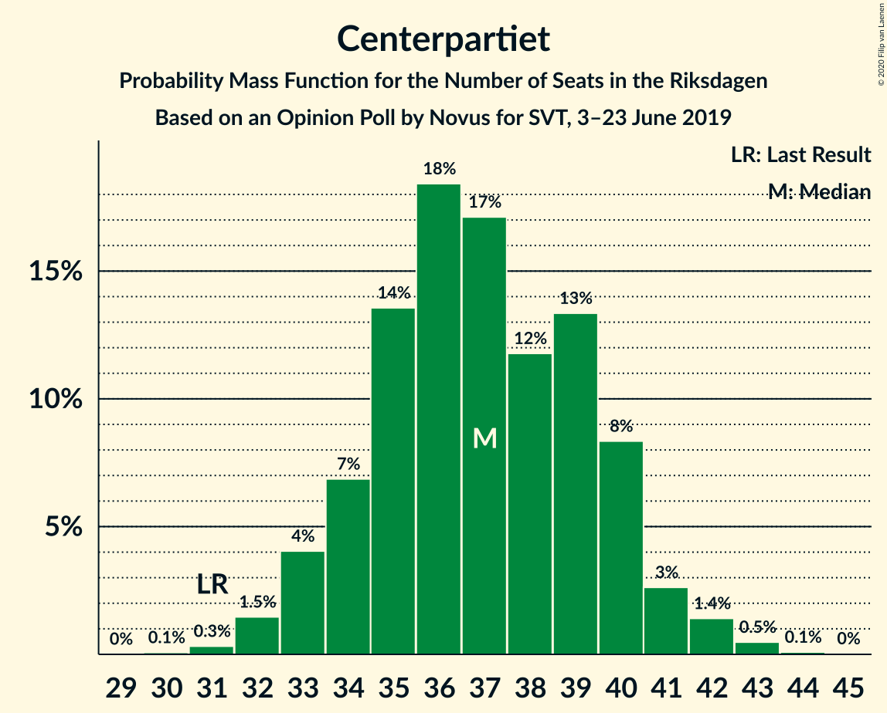
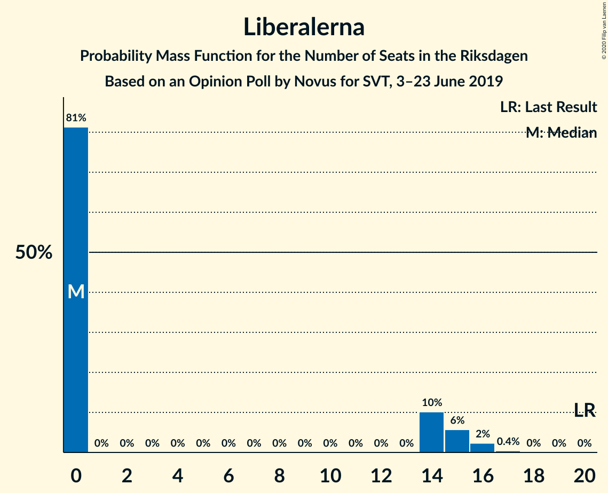
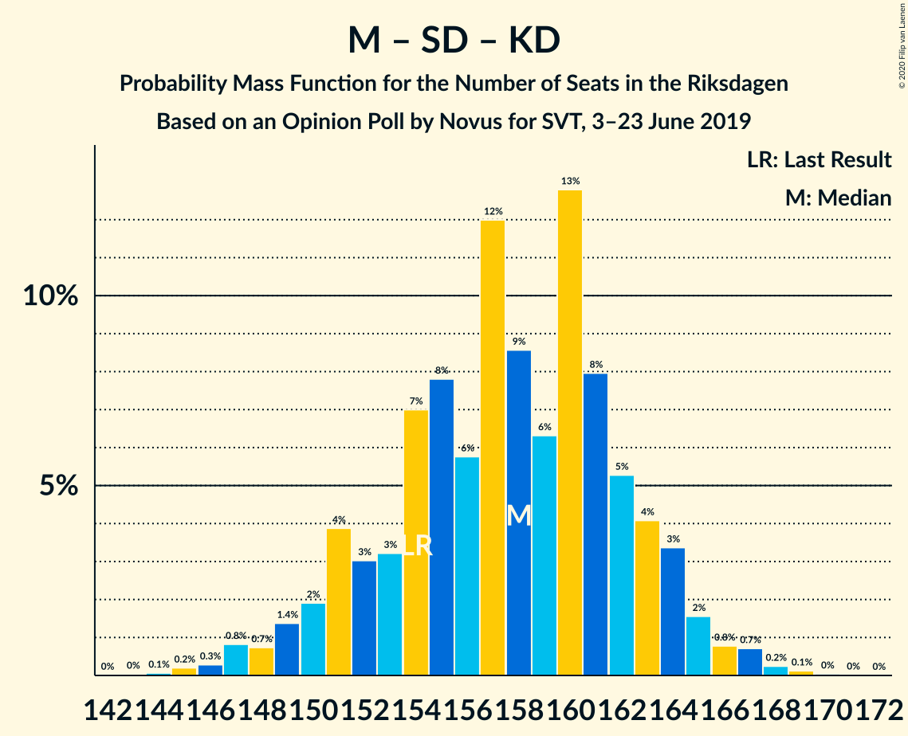
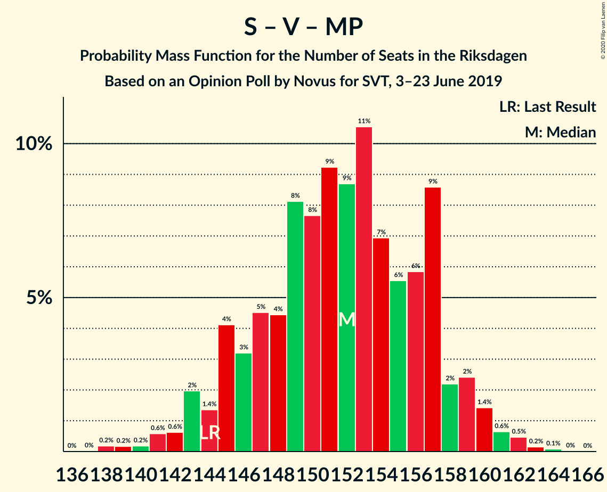
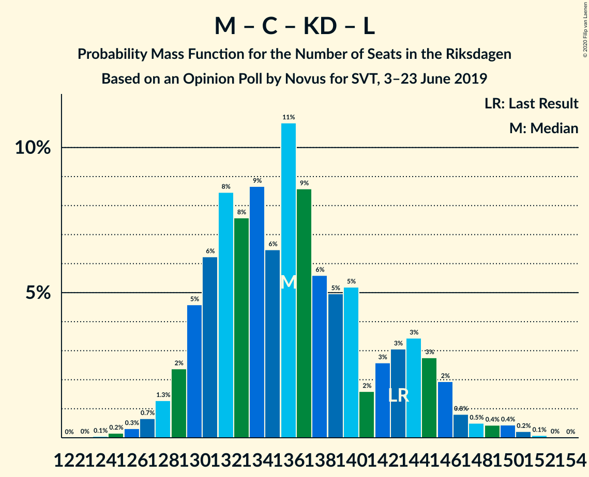
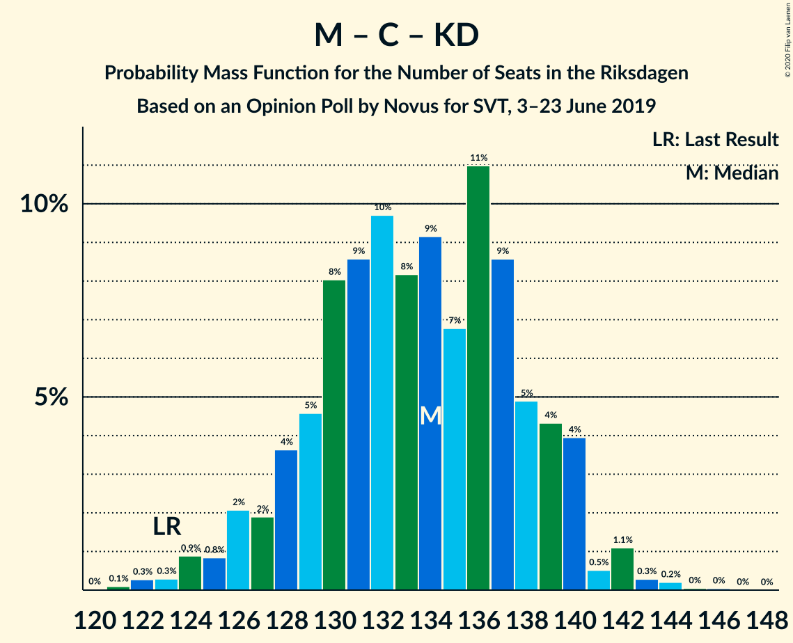

# Opinion Poll by Novus for SVT, 3–23 June 2019

<a href="#voting-intentions">Voting Intentions</a> | <a href="#seats">Seats</a> | <a href="#coalitions">Coalitions</a> | <a href="#technical-information">Technical Information</a>

## Voting Intentions

### Confidence Intervals

| Party | Last Result | Poll Result | 80% Confidence Interval | 90% Confidence Interval | 95% Confidence Interval | 99% Confidence Interval |
|:-----:|:-----------:|:-----------:|:-----------------------:|:-----------------------:|:-----------------------:|:-----------------------:|
| Sveriges socialdemokratiska arbetareparti | 28.3% | 26.7% | 25.6–27.8% |25.3–28.1% |25.1–28.4% |24.6–28.9% |
| Moderata samlingspartiet | 19.8% | 18.8% | 17.9–19.8% |17.6–20.1% |17.4–20.3% |16.9–20.8% |
| Sverigedemokraterna | 17.5% | 16.7% | 15.8–17.7% |15.6–17.9% |15.4–18.2% |14.9–18.6% |
| Centerpartiet | 8.6% | 10.1% | 9.4–10.9% |9.2–11.1% |9.0–11.3% |8.7–11.7% |
| Vänsterpartiet | 8.0% | 9.0% | 8.3–9.7% |8.1–10.0% |8.0–10.1% |7.7–10.5% |
| Kristdemokraterna | 6.3% | 7.7% | 7.1–8.4% |6.9–8.6% |6.7–8.7% |6.4–9.1% |
| Miljöpartiet de gröna | 4.4% | 5.9% | 5.3–6.5% |5.2–6.7% |5.1–6.9% |4.8–7.2% |
| Liberalerna | 5.5% | 3.6% | 3.2–4.1% |3.1–4.3% |3.0–4.4% |2.8–4.6% |

*Note:* The poll result column reflects the actual value used in the calculations. Published results may vary slightly, and in addition be rounded to fewer digits.

## Seats

### Confidence Intervals

| Party | Last Result | Median | 80% Confidence Interval | 90% Confidence Interval | 95% Confidence Interval | 99% Confidence Interval |
|:-----:|:-----------:|:------:|:-----------------------:|:-----------------------:|:-----------------------:|:-----------------------:|
| <a href="#sveriges-socialdemokratiska-arbetareparti">Sveriges socialdemokratiska arbetareparti</a> | 100 | 96 | 93–104 |92–104 |90–104 |88–106 |
| <a href="#moderata-samlingspartiet">Moderata samlingspartiet</a> | 70 | 68 | 65–72 |64–73 |63–75 |62–76 |
| <a href="#sverigedemokraterna">Sverigedemokraterna</a> | 62 | 62 | 58–64 |57–65 |56–66 |54–68 |
| <a href="#centerpartiet">Centerpartiet</a> | 31 | 37 | 34–40 |33–40 |33–41 |32–43 |
| <a href="#vänsterpartiet">Vänsterpartiet</a> | 28 | 33 | 30–35 |29–36 |29–37 |28–38 |
| <a href="#kristdemokraterna">Kristdemokraterna</a> | 22 | 28 | 26–30 |25–31 |24–32 |24–33 |
| <a href="#miljöpartiet-de-gröna">Miljöpartiet de gröna</a> | 16 | 22 | 20–23 |19–24 |18–26 |18–26 |
| <a href="#liberalerna">Liberalerna</a> | 20 | 0 | 0–15 |0–15 |0–15 |0–17 |

### Sveriges socialdemokratiska arbetareparti

*For a full overview of the results for this party, see the [Sveriges socialdemokratiska arbetareparti](party-sverigessocialdemokratiskaarbetareparti.html) page.*

| Number of Seats | Probability | Accumulated | Special Marks |
|:---------------:|:-----------:|:-----------:|:-------------:|
| 86 | 0.2% | 100% |  |
| 87 | 0% | 99.8% |  |
| 88 | 0.4% | 99.7% |  |
| 89 | 0.9% | 99.3% |  |
| 90 | 1.4% | 98% |  |
| 91 | 0.6% | 97% |  |
| 92 | 4% | 96% |  |
| 93 | 16% | 93% |  |
| 94 | 5% | 77% |  |
| 95 | 15% | 72% |  |
| 96 | 14% | 57% | Median |
| 97 | 7% | 43% |  |
| 98 | 6% | 36% |  |
| 99 | 5% | 31% |  |
| 100 | 4% | 25% | Last Result |
| 101 | 4% | 21% |  |
| 102 | 2% | 17% |  |
| 103 | 1.3% | 15% |  |
| 104 | 12% | 13% |  |
| 105 | 0.5% | 1.3% |  |
| 106 | 0.4% | 0.8% |  |
| 107 | 0.4% | 0.4% |  |
| 108 | 0.1% | 0.1% |  |
| 109 | 0% | 0% |  |

### Moderata samlingspartiet

*For a full overview of the results for this party, see the [Moderata samlingspartiet](party-moderatasamlingspartiet.html) page.*

| Number of Seats | Probability | Accumulated | Special Marks |
|:---------------:|:-----------:|:-----------:|:-------------:|
| 59 | 0.1% | 100% |  |
| 60 | 0.2% | 99.9% |  |
| 61 | 0.1% | 99.7% |  |
| 62 | 2% | 99.6% |  |
| 63 | 1.1% | 98% |  |
| 64 | 6% | 97% |  |
| 65 | 10% | 90% |  |
| 66 | 18% | 81% |  |
| 67 | 4% | 63% |  |
| 68 | 19% | 59% | Median |
| 69 | 13% | 41% |  |
| 70 | 6% | 27% | Last Result |
| 71 | 9% | 21% |  |
| 72 | 4% | 12% |  |
| 73 | 3% | 7% |  |
| 74 | 0.6% | 4% |  |
| 75 | 2% | 3% |  |
| 76 | 1.4% | 2% |  |
| 77 | 0.1% | 0.2% |  |
| 78 | 0.1% | 0.1% |  |
| 79 | 0% | 0% |  |

### Sverigedemokraterna

*For a full overview of the results for this party, see the [Sverigedemokraterna](party-sverigedemokraterna.html) page.*

| Number of Seats | Probability | Accumulated | Special Marks |
|:---------------:|:-----------:|:-----------:|:-------------:|
| 52 | 0.1% | 100% |  |
| 53 | 0.1% | 99.9% |  |
| 54 | 1.4% | 99.8% |  |
| 55 | 0.9% | 98% |  |
| 56 | 2% | 98% |  |
| 57 | 3% | 96% |  |
| 58 | 5% | 92% |  |
| 59 | 8% | 88% |  |
| 60 | 23% | 80% |  |
| 61 | 7% | 57% |  |
| 62 | 26% | 50% | Last Result, Median |
| 63 | 7% | 24% |  |
| 64 | 11% | 17% |  |
| 65 | 3% | 6% |  |
| 66 | 1.4% | 3% |  |
| 67 | 0.4% | 2% |  |
| 68 | 0.8% | 1.3% |  |
| 69 | 0.1% | 0.5% |  |
| 70 | 0.4% | 0.4% |  |
| 71 | 0% | 0% |  |

### Centerpartiet

*For a full overview of the results for this party, see the [Centerpartiet](party-centerpartiet.html) page.*

| Number of Seats | Probability | Accumulated | Special Marks |
|:---------------:|:-----------:|:-----------:|:-------------:|
| 30 | 0.1% | 100% |  |
| 31 | 0.3% | 99.9% | Last Result |
| 32 | 2% | 99.6% |  |
| 33 | 5% | 98% |  |
| 34 | 4% | 93% |  |
| 35 | 13% | 89% |  |
| 36 | 21% | 76% |  |
| 37 | 8% | 55% | Median |
| 38 | 25% | 47% |  |
| 39 | 6% | 22% |  |
| 40 | 12% | 16% |  |
| 41 | 1.4% | 4% |  |
| 42 | 1.1% | 2% |  |
| 43 | 1.2% | 1.3% |  |
| 44 | 0.1% | 0.1% |  |
| 45 | 0% | 0% |  |

### Vänsterpartiet

*For a full overview of the results for this party, see the [Vänsterpartiet](party-vänsterpartiet.html) page.*

| Number of Seats | Probability | Accumulated | Special Marks |
|:---------------:|:-----------:|:-----------:|:-------------:|
| 27 | 0.1% | 100% |  |
| 28 | 2% | 99.8% | Last Result |
| 29 | 3% | 98% |  |
| 30 | 9% | 95% |  |
| 31 | 18% | 86% |  |
| 32 | 8% | 68% |  |
| 33 | 28% | 60% | Median |
| 34 | 7% | 32% |  |
| 35 | 16% | 25% |  |
| 36 | 7% | 9% |  |
| 37 | 2% | 3% |  |
| 38 | 0.4% | 0.9% |  |
| 39 | 0.3% | 0.4% |  |
| 40 | 0.1% | 0.1% |  |
| 41 | 0% | 0% |  |

### Kristdemokraterna

*For a full overview of the results for this party, see the [Kristdemokraterna](party-kristdemokraterna.html) page.*

| Number of Seats | Probability | Accumulated | Special Marks |
|:---------------:|:-----------:|:-----------:|:-------------:|
| 22 | 0.1% | 100% | Last Result |
| 23 | 0.4% | 99.9% |  |
| 24 | 3% | 99.5% |  |
| 25 | 4% | 97% |  |
| 26 | 21% | 93% |  |
| 27 | 7% | 72% |  |
| 28 | 24% | 65% | Median |
| 29 | 16% | 41% |  |
| 30 | 17% | 25% |  |
| 31 | 5% | 8% |  |
| 32 | 2% | 4% |  |
| 33 | 1.2% | 1.5% |  |
| 34 | 0.3% | 0.3% |  |
| 35 | 0.1% | 0.1% |  |
| 36 | 0% | 0% |  |

### Miljöpartiet de gröna

*For a full overview of the results for this party, see the [Miljöpartiet de gröna](party-miljöpartietdegröna.html) page.*

| Number of Seats | Probability | Accumulated | Special Marks |
|:---------------:|:-----------:|:-----------:|:-------------:|
| 16 | 0.1% | 100% | Last Result |
| 17 | 0.1% | 99.9% |  |
| 18 | 4% | 99.8% |  |
| 19 | 4% | 96% |  |
| 20 | 13% | 92% |  |
| 21 | 24% | 79% |  |
| 22 | 29% | 55% | Median |
| 23 | 18% | 26% |  |
| 24 | 4% | 8% |  |
| 25 | 2% | 5% |  |
| 26 | 3% | 3% |  |
| 27 | 0.1% | 0.2% |  |
| 28 | 0% | 0% |  |

### Liberalerna

*For a full overview of the results for this party, see the [Liberalerna](party-liberalerna.html) page.*

| Number of Seats | Probability | Accumulated | Special Marks |
|:---------------:|:-----------:|:-----------:|:-------------:|
| 0 | 77% | 100% | Median |
| 1 | 0% | 23% |  |
| 2 | 0% | 23% |  |
| 3 | 0% | 23% |  |
| 4 | 0% | 23% |  |
| 5 | 0% | 23% |  |
| 6 | 0% | 23% |  |
| 7 | 0% | 23% |  |
| 8 | 0% | 23% |  |
| 9 | 0% | 23% |  |
| 10 | 0% | 23% |  |
| 11 | 0% | 23% |  |
| 12 | 0% | 23% |  |
| 13 | 0% | 23% |  |
| 14 | 12% | 23% |  |
| 15 | 9% | 11% |  |
| 16 | 2% | 2% |  |
| 17 | 0.7% | 0.7% |  |
| 18 | 0% | 0% |  |
| 19 | 0% | 0% |  |
| 20 | 0% | 0% | Last Result |

## Coalitions

### Confidence Intervals

| Coalition | Last Result | Median | Majority? | 80% Confidence Interval | 90% Confidence Interval | 95% Confidence Interval | 99% Confidence Interval |
|:---------:|:-----------:|:------:|:---------:|:-----------------------:|:-----------------------:|:-----------------------:|:-----------------------:|
| Sveriges socialdemokratiska arbetareparti – Moderata samlingspartiet – Centerpartiet | 201 | 203 | 100% | 195–207 | 192–210 | 192–210 | 190–211 |
| Sveriges socialdemokratiska arbetareparti – Centerpartiet – Vänsterpartiet – Miljöpartiet de gröna – Liberalerna | 195 | 192 | 100% | 187–198 | 186–198 | 183–198 | 181–202 |
| Sveriges socialdemokratiska arbetareparti – Moderata samlingspartiet | 170 | 165 | 1.1% | 158–171 | 157–172 | 157–173 | 155–176 |
| Sveriges socialdemokratiska arbetareparti – Centerpartiet – Miljöpartiet de gröna – Liberalerna | 167 | 159 | 0% | 153–167 | 152–167 | 151–167 | 148–171 |
| Moderata samlingspartiet – Sverigedemokraterna – Kristdemokraterna | 154 | 157 | 0% | 151–162 | 151–163 | 151–166 | 147–168 |
| Sveriges socialdemokratiska arbetareparti – Vänsterpartiet – Miljöpartiet de gröna | 144 | 151 | 0% | 146–159 | 145–159 | 142–159 | 139–162 |
| Moderata samlingspartiet – Centerpartiet – Kristdemokraterna – Liberalerna | 143 | 136 | 0% | 130–143 | 130–146 | 129–147 | 127–151 |
| Moderata samlingspartiet – Centerpartiet – Kristdemokraterna | 123 | 134 | 0% | 128–138 | 127–140 | 125–142 | 123–143 |
| Moderata samlingspartiet – Sverigedemokraterna | 132 | 130 | 0% | 125–135 | 123–135 | 123–137 | 119–139 |
| Sveriges socialdemokratiska arbetareparti – Vänsterpartiet | 128 | 129 | 0% | 124–137 | 124–137 | 121–137 | 119–140 |
| Sveriges socialdemokratiska arbetareparti – Miljöpartiet de gröna | 116 | 118 | 0% | 114–126 | 113–126 | 112–126 | 108–129 |
| Moderata samlingspartiet – Centerpartiet – Liberalerna | 121 | 107 | 0% | 102–117 | 102–118 | 101–120 | 98–123 |
| Moderata samlingspartiet – Centerpartiet | 101 | 106 | 0% | 101–109 | 99–111 | 98–112 | 96–114 |

### Sveriges socialdemokratiska arbetareparti – Moderata samlingspartiet – Centerpartiet

| Number of Seats | Probability | Accumulated | Special Marks |
|:---------------:|:-----------:|:-----------:|:-------------:|
| 186 | 0.1% | 100% |  |
| 187 | 0% | 99.9% |  |
| 188 | 0% | 99.9% |  |
| 189 | 0.2% | 99.9% |  |
| 190 | 0.2% | 99.7% |  |
| 191 | 0.9% | 99.4% |  |
| 192 | 4% | 98.5% |  |
| 193 | 3% | 94% |  |
| 194 | 0.3% | 91% |  |
| 195 | 1.3% | 91% |  |
| 196 | 9% | 90% |  |
| 197 | 2% | 81% |  |
| 198 | 4% | 79% |  |
| 199 | 2% | 75% |  |
| 200 | 1.3% | 73% |  |
| 201 | 14% | 71% | Last Result, Median |
| 202 | 5% | 58% |  |
| 203 | 7% | 52% |  |
| 204 | 8% | 45% |  |
| 205 | 12% | 38% |  |
| 206 | 14% | 26% |  |
| 207 | 3% | 12% |  |
| 208 | 2% | 10% |  |
| 209 | 2% | 8% |  |
| 210 | 4% | 7% |  |
| 211 | 2% | 2% |  |
| 212 | 0.1% | 0.4% |  |
| 213 | 0.1% | 0.3% |  |
| 214 | 0.1% | 0.2% |  |
| 215 | 0% | 0.1% |  |
| 216 | 0% | 0.1% |  |
| 217 | 0% | 0% |  |

### Sveriges socialdemokratiska arbetareparti – Centerpartiet – Vänsterpartiet – Miljöpartiet de gröna – Liberalerna

| Number of Seats | Probability | Accumulated | Special Marks |
|:---------------:|:-----------:|:-----------:|:-------------:|
| 180 | 0.1% | 100% |  |
| 181 | 0.8% | 99.9% |  |
| 182 | 0.6% | 99.1% |  |
| 183 | 2% | 98.5% |  |
| 184 | 0.6% | 97% |  |
| 185 | 0.6% | 96% |  |
| 186 | 5% | 95% |  |
| 187 | 8% | 90% |  |
| 188 | 7% | 83% | Median |
| 189 | 17% | 76% |  |
| 190 | 2% | 58% |  |
| 191 | 6% | 56% |  |
| 192 | 10% | 50% |  |
| 193 | 2% | 41% |  |
| 194 | 1.2% | 39% |  |
| 195 | 16% | 38% | Last Result |
| 196 | 3% | 22% |  |
| 197 | 7% | 19% |  |
| 198 | 10% | 12% |  |
| 199 | 0.7% | 2% |  |
| 200 | 0.2% | 2% |  |
| 201 | 0.6% | 1.3% |  |
| 202 | 0.4% | 0.8% |  |
| 203 | 0.2% | 0.4% |  |
| 204 | 0.1% | 0.2% |  |
| 205 | 0% | 0.1% |  |
| 206 | 0% | 0.1% |  |
| 207 | 0% | 0% |  |

### Sveriges socialdemokratiska arbetareparti – Moderata samlingspartiet

| Number of Seats | Probability | Accumulated | Special Marks |
|:---------------:|:-----------:|:-----------:|:-------------:|
| 151 | 0.2% | 100% |  |
| 152 | 0% | 99.7% |  |
| 153 | 0.1% | 99.7% |  |
| 154 | 0.1% | 99.6% |  |
| 155 | 0.2% | 99.5% |  |
| 156 | 0.3% | 99.3% |  |
| 157 | 5% | 99.1% |  |
| 158 | 8% | 94% |  |
| 159 | 2% | 86% |  |
| 160 | 5% | 84% |  |
| 161 | 0.9% | 79% |  |
| 162 | 4% | 78% |  |
| 163 | 16% | 74% |  |
| 164 | 5% | 58% | Median |
| 165 | 9% | 53% |  |
| 166 | 5% | 44% |  |
| 167 | 2% | 39% |  |
| 168 | 13% | 38% |  |
| 169 | 1.4% | 25% |  |
| 170 | 12% | 23% | Last Result |
| 171 | 4% | 11% |  |
| 172 | 3% | 7% |  |
| 173 | 3% | 4% |  |
| 174 | 0.4% | 1.4% |  |
| 175 | 0.5% | 1.1% | Majority |
| 176 | 0.3% | 0.6% |  |
| 177 | 0.2% | 0.3% |  |
| 178 | 0.1% | 0.1% |  |
| 179 | 0% | 0% |  |

### Sveriges socialdemokratiska arbetareparti – Centerpartiet – Miljöpartiet de gröna – Liberalerna

| Number of Seats | Probability | Accumulated | Special Marks |
|:---------------:|:-----------:|:-----------:|:-------------:|
| 147 | 0.3% | 100% |  |
| 148 | 0.7% | 99.7% |  |
| 149 | 0.4% | 99.0% |  |
| 150 | 0.7% | 98.6% |  |
| 151 | 0.8% | 98% |  |
| 152 | 6% | 97% |  |
| 153 | 3% | 91% |  |
| 154 | 13% | 88% |  |
| 155 | 6% | 75% | Median |
| 156 | 3% | 69% |  |
| 157 | 7% | 66% |  |
| 158 | 7% | 59% |  |
| 159 | 10% | 52% |  |
| 160 | 2% | 42% |  |
| 161 | 3% | 40% |  |
| 162 | 13% | 36% |  |
| 163 | 2% | 23% |  |
| 164 | 6% | 21% |  |
| 165 | 2% | 14% |  |
| 166 | 2% | 13% |  |
| 167 | 9% | 11% | Last Result |
| 168 | 1.2% | 2% |  |
| 169 | 0.2% | 1.2% |  |
| 170 | 0.3% | 1.1% |  |
| 171 | 0.3% | 0.8% |  |
| 172 | 0.3% | 0.4% |  |
| 173 | 0.1% | 0.1% |  |
| 174 | 0% | 0.1% |  |
| 175 | 0% | 0% | Majority |

### Moderata samlingspartiet – Sverigedemokraterna – Kristdemokraterna

| Number of Seats | Probability | Accumulated | Special Marks |
|:---------------:|:-----------:|:-----------:|:-------------:|
| 143 | 0% | 100% |  |
| 144 | 0% | 99.9% |  |
| 145 | 0.1% | 99.9% |  |
| 146 | 0.2% | 99.8% |  |
| 147 | 0.4% | 99.6% |  |
| 148 | 0.6% | 99.2% |  |
| 149 | 0.2% | 98.7% |  |
| 150 | 0.7% | 98% |  |
| 151 | 10% | 98% |  |
| 152 | 7% | 88% |  |
| 153 | 3% | 81% |  |
| 154 | 16% | 78% | Last Result |
| 155 | 1.2% | 62% |  |
| 156 | 2% | 61% |  |
| 157 | 10% | 59% |  |
| 158 | 6% | 50% | Median |
| 159 | 2% | 44% |  |
| 160 | 17% | 42% |  |
| 161 | 7% | 24% |  |
| 162 | 8% | 17% |  |
| 163 | 5% | 10% |  |
| 164 | 0.6% | 5% |  |
| 165 | 0.6% | 4% |  |
| 166 | 2% | 3% |  |
| 167 | 0.6% | 1.5% |  |
| 168 | 0.8% | 0.9% |  |
| 169 | 0.1% | 0.1% |  |
| 170 | 0% | 0% |  |

### Sveriges socialdemokratiska arbetareparti – Vänsterpartiet – Miljöpartiet de gröna

| Number of Seats | Probability | Accumulated | Special Marks |
|:---------------:|:-----------:|:-----------:|:-------------:|
| 138 | 0.4% | 100% |  |
| 139 | 0.1% | 99.6% |  |
| 140 | 0.3% | 99.5% |  |
| 141 | 1.1% | 99.2% |  |
| 142 | 0.7% | 98% |  |
| 143 | 0.2% | 97% |  |
| 144 | 2% | 97% | Last Result |
| 145 | 1.0% | 95% |  |
| 146 | 9% | 94% |  |
| 147 | 8% | 86% |  |
| 148 | 5% | 78% |  |
| 149 | 7% | 73% |  |
| 150 | 8% | 66% |  |
| 151 | 13% | 58% | Median |
| 152 | 16% | 44% |  |
| 153 | 4% | 29% |  |
| 154 | 2% | 25% |  |
| 155 | 4% | 23% |  |
| 156 | 2% | 19% |  |
| 157 | 2% | 18% |  |
| 158 | 1.4% | 16% |  |
| 159 | 13% | 14% |  |
| 160 | 0.3% | 2% |  |
| 161 | 0.6% | 1.3% |  |
| 162 | 0.5% | 0.7% |  |
| 163 | 0.2% | 0.2% |  |
| 164 | 0% | 0.1% |  |
| 165 | 0% | 0% |  |

### Moderata samlingspartiet – Centerpartiet – Kristdemokraterna – Liberalerna

| Number of Seats | Probability | Accumulated | Special Marks |
|:---------------:|:-----------:|:-----------:|:-------------:|
| 123 | 0.1% | 100% |  |
| 124 | 0% | 99.9% |  |
| 125 | 0.1% | 99.9% |  |
| 126 | 0.2% | 99.8% |  |
| 127 | 0.7% | 99.6% |  |
| 128 | 1.1% | 98.9% |  |
| 129 | 2% | 98% |  |
| 130 | 12% | 96% |  |
| 131 | 1.1% | 83% |  |
| 132 | 3% | 82% |  |
| 133 | 6% | 79% | Median |
| 134 | 4% | 73% |  |
| 135 | 13% | 69% |  |
| 136 | 18% | 56% |  |
| 137 | 3% | 38% |  |
| 138 | 4% | 35% |  |
| 139 | 5% | 31% |  |
| 140 | 3% | 26% |  |
| 141 | 1.1% | 23% |  |
| 142 | 3% | 22% |  |
| 143 | 12% | 19% | Last Result |
| 144 | 0.8% | 7% |  |
| 145 | 0.4% | 6% |  |
| 146 | 2% | 6% |  |
| 147 | 2% | 3% |  |
| 148 | 0.5% | 1.3% |  |
| 149 | 0.1% | 0.8% |  |
| 150 | 0.2% | 0.7% |  |
| 151 | 0.2% | 0.6% |  |
| 152 | 0.4% | 0.4% |  |
| 153 | 0% | 0% |  |

### Moderata samlingspartiet – Centerpartiet – Kristdemokraterna

| Number of Seats | Probability | Accumulated | Special Marks |
|:---------------:|:-----------:|:-----------:|:-------------:|
| 121 | 0% | 100% |  |
| 122 | 0.4% | 99.9% |  |
| 123 | 0.3% | 99.5% | Last Result |
| 124 | 0.6% | 99.2% |  |
| 125 | 3% | 98.6% |  |
| 126 | 0.7% | 96% |  |
| 127 | 1.3% | 95% |  |
| 128 | 6% | 94% |  |
| 129 | 11% | 88% |  |
| 130 | 13% | 78% |  |
| 131 | 3% | 65% |  |
| 132 | 4% | 62% |  |
| 133 | 7% | 58% | Median |
| 134 | 5% | 51% |  |
| 135 | 13% | 47% |  |
| 136 | 18% | 33% |  |
| 137 | 3% | 15% |  |
| 138 | 4% | 12% |  |
| 139 | 2% | 8% |  |
| 140 | 3% | 6% |  |
| 141 | 0.8% | 3% |  |
| 142 | 2% | 3% |  |
| 143 | 0.3% | 0.8% |  |
| 144 | 0.4% | 0.5% |  |
| 145 | 0% | 0.1% |  |
| 146 | 0.1% | 0.1% |  |
| 147 | 0% | 0% |  |

### Moderata samlingspartiet – Sverigedemokraterna

| Number of Seats | Probability | Accumulated | Special Marks |
|:---------------:|:-----------:|:-----------:|:-------------:|
| 117 | 0% | 100% |  |
| 118 | 0.1% | 99.9% |  |
| 119 | 0.4% | 99.8% |  |
| 120 | 0.2% | 99.4% |  |
| 121 | 0.8% | 99.2% |  |
| 122 | 0.5% | 98% |  |
| 123 | 6% | 98% |  |
| 124 | 2% | 92% |  |
| 125 | 10% | 90% |  |
| 126 | 14% | 80% |  |
| 127 | 4% | 66% |  |
| 128 | 4% | 62% |  |
| 129 | 4% | 58% |  |
| 130 | 18% | 54% | Median |
| 131 | 10% | 37% |  |
| 132 | 5% | 26% | Last Result |
| 133 | 9% | 21% |  |
| 134 | 1.5% | 13% |  |
| 135 | 7% | 11% |  |
| 136 | 0.7% | 4% |  |
| 137 | 2% | 4% |  |
| 138 | 0.9% | 2% |  |
| 139 | 0.5% | 0.8% |  |
| 140 | 0.1% | 0.3% |  |
| 141 | 0.1% | 0.1% |  |
| 142 | 0.1% | 0.1% |  |
| 143 | 0% | 0% |  |

### Sveriges socialdemokratiska arbetareparti – Vänsterpartiet

| Number of Seats | Probability | Accumulated | Special Marks |
|:---------------:|:-----------:|:-----------:|:-------------:|
| 118 | 0.3% | 100% |  |
| 119 | 1.4% | 99.7% |  |
| 120 | 0.5% | 98% |  |
| 121 | 0.3% | 98% |  |
| 122 | 0.5% | 97% |  |
| 123 | 0.6% | 97% |  |
| 124 | 8% | 96% |  |
| 125 | 2% | 88% |  |
| 126 | 10% | 86% |  |
| 127 | 6% | 76% |  |
| 128 | 8% | 71% | Last Result |
| 129 | 16% | 62% | Median |
| 130 | 15% | 46% |  |
| 131 | 2% | 31% |  |
| 132 | 4% | 29% |  |
| 133 | 4% | 25% |  |
| 134 | 5% | 21% |  |
| 135 | 3% | 17% |  |
| 136 | 0.8% | 14% |  |
| 137 | 11% | 13% |  |
| 138 | 0.4% | 2% |  |
| 139 | 0.2% | 1.2% |  |
| 140 | 0.7% | 1.0% |  |
| 141 | 0.2% | 0.3% |  |
| 142 | 0.1% | 0.1% |  |
| 143 | 0% | 0% |  |

### Sveriges socialdemokratiska arbetareparti – Miljöpartiet de gröna

| Number of Seats | Probability | Accumulated | Special Marks |
|:---------------:|:-----------:|:-----------:|:-------------:|
| 108 | 0.7% | 100% |  |
| 109 | 0.1% | 99.3% |  |
| 110 | 0.5% | 99.2% |  |
| 111 | 0.5% | 98.6% |  |
| 112 | 3% | 98% |  |
| 113 | 4% | 96% |  |
| 114 | 8% | 92% |  |
| 115 | 10% | 84% |  |
| 116 | 17% | 74% | Last Result |
| 117 | 4% | 57% |  |
| 118 | 5% | 53% | Median |
| 119 | 13% | 48% |  |
| 120 | 5% | 35% |  |
| 121 | 3% | 30% |  |
| 122 | 7% | 26% |  |
| 123 | 2% | 19% |  |
| 124 | 2% | 18% |  |
| 125 | 2% | 16% |  |
| 126 | 12% | 14% |  |
| 127 | 1.1% | 2% |  |
| 128 | 0.6% | 1.2% |  |
| 129 | 0.5% | 0.6% |  |
| 130 | 0.1% | 0.1% |  |
| 131 | 0% | 0% |  |

### Moderata samlingspartiet – Centerpartiet – Liberalerna

| Number of Seats | Probability | Accumulated | Special Marks |
|:---------------:|:-----------:|:-----------:|:-------------:|
| 96 | 0% | 100% |  |
| 97 | 0.1% | 99.9% |  |
| 98 | 0.5% | 99.9% |  |
| 99 | 0.5% | 99.3% |  |
| 100 | 0.6% | 98.8% |  |
| 101 | 2% | 98% |  |
| 102 | 14% | 96% |  |
| 103 | 2% | 82% |  |
| 104 | 6% | 80% |  |
| 105 | 3% | 74% | Median |
| 106 | 16% | 71% |  |
| 107 | 7% | 56% |  |
| 108 | 2% | 48% |  |
| 109 | 14% | 46% |  |
| 110 | 2% | 32% |  |
| 111 | 4% | 29% |  |
| 112 | 2% | 25% |  |
| 113 | 1.2% | 24% |  |
| 114 | 6% | 23% |  |
| 115 | 2% | 17% |  |
| 116 | 0.2% | 14% |  |
| 117 | 8% | 14% |  |
| 118 | 1.0% | 6% |  |
| 119 | 2% | 5% |  |
| 120 | 1.2% | 3% |  |
| 121 | 2% | 2% | Last Result |
| 122 | 0.1% | 0.6% |  |
| 123 | 0.2% | 0.5% |  |
| 124 | 0.2% | 0.3% |  |
| 125 | 0% | 0% |  |

### Moderata samlingspartiet – Centerpartiet

| Number of Seats | Probability | Accumulated | Special Marks |
|:---------------:|:-----------:|:-----------:|:-------------:|
| 94 | 0.3% | 100% |  |
| 95 | 0.1% | 99.7% |  |
| 96 | 0.5% | 99.6% |  |
| 97 | 1.2% | 99.1% |  |
| 98 | 0.7% | 98% |  |
| 99 | 5% | 97% |  |
| 100 | 1.1% | 92% |  |
| 101 | 4% | 91% | Last Result |
| 102 | 16% | 87% |  |
| 103 | 10% | 71% |  |
| 104 | 7% | 62% |  |
| 105 | 5% | 55% | Median |
| 106 | 17% | 50% |  |
| 107 | 8% | 33% |  |
| 108 | 2% | 25% |  |
| 109 | 14% | 23% |  |
| 110 | 2% | 9% |  |
| 111 | 3% | 7% |  |
| 112 | 1.4% | 4% |  |
| 113 | 0.8% | 2% |  |
| 114 | 1.2% | 1.4% |  |
| 115 | 0.2% | 0.2% |  |
| 116 | 0% | 0.1% |  |
| 117 | 0% | 0% |  |

## Technical Information

### Opinion Poll

+ **Polling firm:** Novus
+ **Commissioner(s):** SVT
+ **Fieldwork period:** 3–23 June 2019

### Calculations

+ **Sample size:** 2746
+ **Simulations done:** 131,072
+ **Error estimate:** 0.91%

