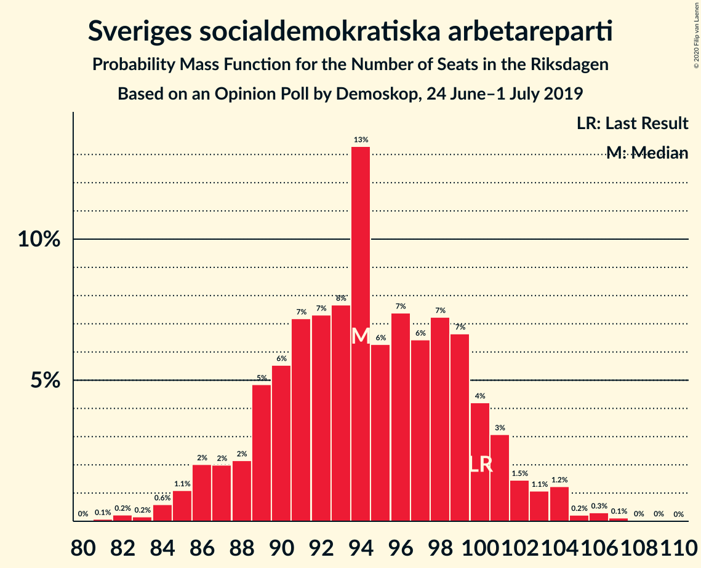
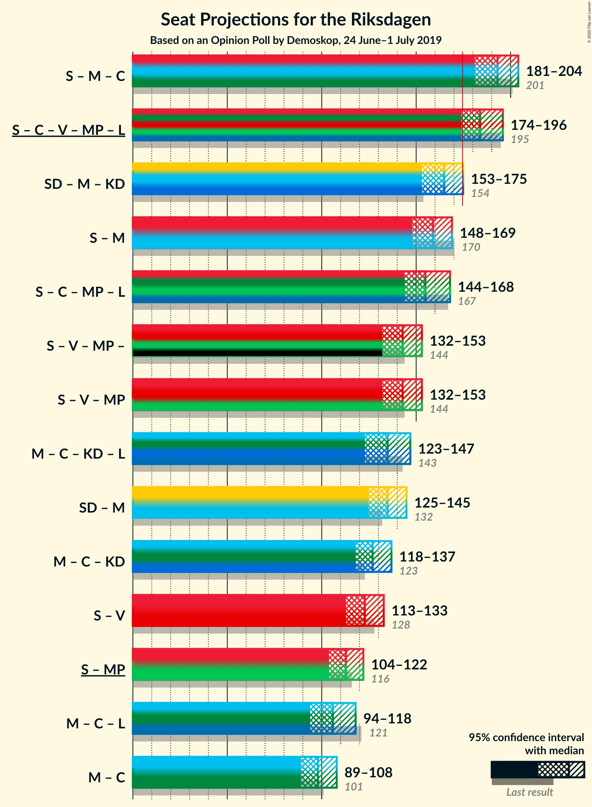
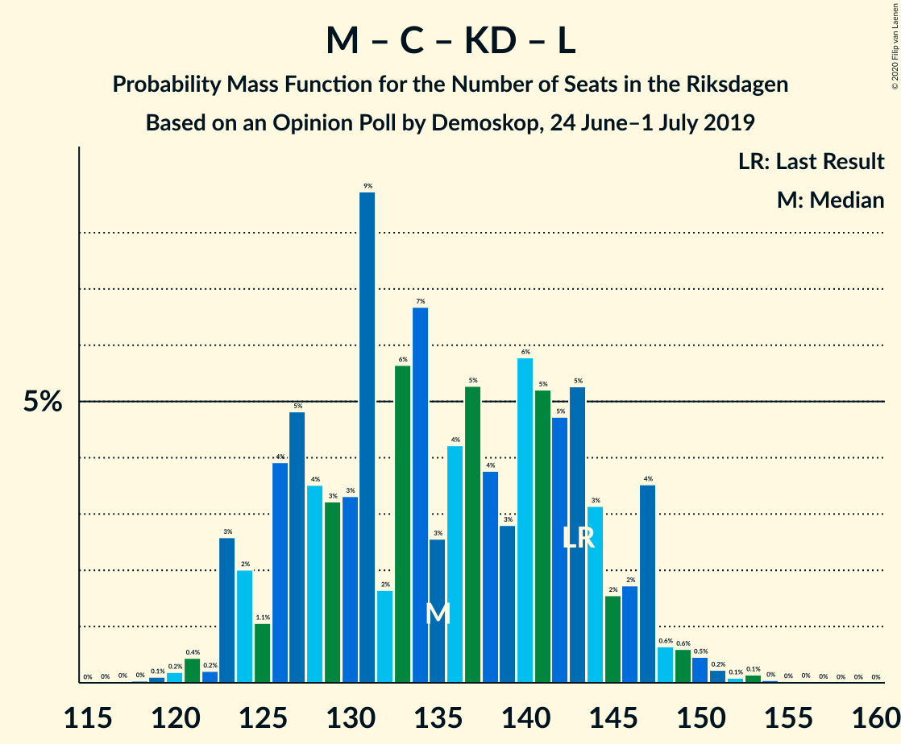

# Opinion Poll by Demoskop, 24 June–1 July 2019

<a href="#voting-intentions">Voting Intentions</a> | <a href="#seats">Seats</a> | <a href="#coalitions">Coalitions</a> | <a href="#technical-information">Technical Information</a>

## Voting Intentions

### Confidence Intervals

| Party | Last Result | Poll Result | 80% Confidence Interval | 90% Confidence Interval | 95% Confidence Interval | 99% Confidence Interval |
|:-----:|:-----------:|:-----------:|:-----------------------:|:-----------------------:|:-----------------------:|:-----------------------:|
| Sveriges socialdemokratiska arbetareparti | 28.3% | 25.9% | 24.6–27.4% |24.2–27.8% |23.8–28.1% |23.2–28.8% |
| Sverigedemokraterna | 17.5% | 19.6% | 18.4–20.9% |18.0–21.3% |17.7–21.6% |17.1–22.3% |
| Moderata samlingspartiet | 19.8% | 17.6% | 16.4–18.9% |16.1–19.2% |15.8–19.5% |15.3–20.2% |
| Centerpartiet | 8.6% | 9.3% | 8.5–10.3% |8.2–10.6% |8.0–10.9% |7.6–11.4% |
| Kristdemokraterna | 6.3% | 8.0% | 7.2–9.0% |7.0–9.2% |6.8–9.5% |6.4–9.9% |
| Vänsterpartiet | 8.0% | 7.9% | 7.1–8.8% |6.9–9.1% |6.7–9.3% |6.3–9.8% |
| Miljöpartiet de gröna | 4.4% | 5.3% | 4.6–6.1% |4.5–6.3% |4.3–6.5% |4.0–6.9% |
| Liberalerna | 5.5% | 4.1% | 3.5–4.8% |3.4–5.0% |3.2–5.2% |3.0–5.6% |

*Note:* The poll result column reflects the actual value used in the calculations. Published results may vary slightly, and in addition be rounded to fewer digits.

## Seats

### Confidence Intervals

| Party | Last Result | Median | 80% Confidence Interval | 90% Confidence Interval | 95% Confidence Interval | 99% Confidence Interval |
|:-----:|:-----------:|:------:|:-----------------------:|:-----------------------:|:-----------------------:|:-----------------------:|
| <a href="#sveriges-socialdemokratiska-arbetareparti">Sveriges socialdemokratiska arbetareparti</a> | 100 | 94 | 90–98 |87–100 |86–100 |84–105 |
| <a href="#sverigedemokraterna">Sverigedemokraterna</a> | 62 | 70 | 66–76 |65–77 |63–79 |62–80 |
| <a href="#moderata-samlingspartiet">Moderata samlingspartiet</a> | 70 | 64 | 61–69 |58–69 |58–71 |56–72 |
| <a href="#centerpartiet">Centerpartiet</a> | 31 | 35 | 31–36 |29–37 |29–38 |27–42 |
| <a href="#kristdemokraterna">Kristdemokraterna</a> | 22 | 29 | 26–32 |26–33 |25–33 |24–36 |
| <a href="#vänsterpartiet">Vänsterpartiet</a> | 28 | 28 | 26–33 |25–33 |25–33 |23–35 |
| <a href="#miljöpartiet-de-gröna">Miljöpartiet de gröna</a> | 16 | 19 | 17–22 |17–22 |16–23 |14–24 |
| <a href="#liberalerna">Liberalerna</a> | 20 | 0 | 0–17 |0–17 |0–18 |0–19 |

### Sveriges socialdemokratiska arbetareparti

*For a full overview of the results for this party, see the [Sveriges socialdemokratiska arbetareparti](party-sverigessocialdemokratiskaarbetareparti.html) page.*

| Number of Seats | Probability | Accumulated | Special Marks |
|:---------------:|:-----------:|:-----------:|:-------------:|
| 81 | 0.1% | 100% |  |
| 82 | 0.2% | 99.9% |  |
| 83 | 0% | 99.6% |  |
| 84 | 0.7% | 99.6% |  |
| 85 | 0.5% | 99.0% |  |
| 86 | 2% | 98.5% |  |
| 87 | 2% | 96% |  |
| 88 | 1.3% | 95% |  |
| 89 | 0.7% | 93% |  |
| 90 | 4% | 93% |  |
| 91 | 10% | 88% |  |
| 92 | 2% | 79% |  |
| 93 | 23% | 77% |  |
| 94 | 25% | 53% | Median |
| 95 | 0.5% | 28% |  |
| 96 | 10% | 28% |  |
| 97 | 3% | 18% |  |
| 98 | 5% | 15% |  |
| 99 | 3% | 10% |  |
| 100 | 4% | 7% | Last Result |
| 101 | 0.2% | 2% |  |
| 102 | 1.0% | 2% |  |
| 103 | 0.4% | 1.2% |  |
| 104 | 0.2% | 0.8% |  |
| 105 | 0.1% | 0.6% |  |
| 106 | 0.1% | 0.5% |  |
| 107 | 0.3% | 0.4% |  |
| 108 | 0% | 0.1% |  |
| 109 | 0% | 0.1% |  |
| 110 | 0% | 0% |  |

### Sverigedemokraterna

*For a full overview of the results for this party, see the [Sverigedemokraterna](party-sverigedemokraterna.html) page.*

| Number of Seats | Probability | Accumulated | Special Marks |
|:---------------:|:-----------:|:-----------:|:-------------:|
| 60 | 0.2% | 100% |  |
| 61 | 0.1% | 99.8% |  |
| 62 | 0.8% | 99.6% | Last Result |
| 63 | 2% | 98.9% |  |
| 64 | 0.6% | 97% |  |
| 65 | 3% | 96% |  |
| 66 | 6% | 93% |  |
| 67 | 3% | 87% |  |
| 68 | 3% | 84% |  |
| 69 | 22% | 81% |  |
| 70 | 14% | 60% | Median |
| 71 | 2% | 45% |  |
| 72 | 10% | 43% |  |
| 73 | 2% | 34% |  |
| 74 | 8% | 31% |  |
| 75 | 5% | 24% |  |
| 76 | 13% | 19% |  |
| 77 | 1.1% | 5% |  |
| 78 | 2% | 4% |  |
| 79 | 2% | 3% |  |
| 80 | 0.5% | 0.8% |  |
| 81 | 0.1% | 0.4% |  |
| 82 | 0.1% | 0.3% |  |
| 83 | 0.1% | 0.2% |  |
| 84 | 0% | 0% |  |

### Moderata samlingspartiet

*For a full overview of the results for this party, see the [Moderata samlingspartiet](party-moderatasamlingspartiet.html) page.*

| Number of Seats | Probability | Accumulated | Special Marks |
|:---------------:|:-----------:|:-----------:|:-------------:|
| 53 | 0% | 100% |  |
| 54 | 0.1% | 99.9% |  |
| 55 | 0.1% | 99.8% |  |
| 56 | 1.2% | 99.7% |  |
| 57 | 0.8% | 98% |  |
| 58 | 3% | 98% |  |
| 59 | 2% | 95% |  |
| 60 | 2% | 93% |  |
| 61 | 19% | 90% |  |
| 62 | 7% | 71% |  |
| 63 | 7% | 64% |  |
| 64 | 16% | 57% | Median |
| 65 | 8% | 41% |  |
| 66 | 2% | 33% |  |
| 67 | 17% | 31% |  |
| 68 | 0.9% | 14% |  |
| 69 | 9% | 13% |  |
| 70 | 1.3% | 5% | Last Result |
| 71 | 1.0% | 3% |  |
| 72 | 2% | 2% |  |
| 73 | 0.1% | 0.4% |  |
| 74 | 0% | 0.3% |  |
| 75 | 0% | 0.2% |  |
| 76 | 0.2% | 0.2% |  |
| 77 | 0% | 0% |  |

### Centerpartiet

*For a full overview of the results for this party, see the [Centerpartiet](party-centerpartiet.html) page.*

| Number of Seats | Probability | Accumulated | Special Marks |
|:---------------:|:-----------:|:-----------:|:-------------:|
| 26 | 0.1% | 100% |  |
| 27 | 0.5% | 99.9% |  |
| 28 | 2% | 99.4% |  |
| 29 | 3% | 98% |  |
| 30 | 3% | 95% |  |
| 31 | 4% | 92% | Last Result |
| 32 | 5% | 88% |  |
| 33 | 11% | 83% |  |
| 34 | 16% | 72% |  |
| 35 | 30% | 56% | Median |
| 36 | 17% | 27% |  |
| 37 | 6% | 10% |  |
| 38 | 1.4% | 4% |  |
| 39 | 0.6% | 2% |  |
| 40 | 0.7% | 2% |  |
| 41 | 0.3% | 0.9% |  |
| 42 | 0.5% | 0.5% |  |
| 43 | 0% | 0.1% |  |
| 44 | 0% | 0% |  |

### Kristdemokraterna

*For a full overview of the results for this party, see the [Kristdemokraterna](party-kristdemokraterna.html) page.*

| Number of Seats | Probability | Accumulated | Special Marks |
|:---------------:|:-----------:|:-----------:|:-------------:|
| 21 | 0.1% | 100% |  |
| 22 | 0.2% | 99.9% | Last Result |
| 23 | 0.1% | 99.8% |  |
| 24 | 1.2% | 99.6% |  |
| 25 | 2% | 98% |  |
| 26 | 8% | 97% |  |
| 27 | 11% | 89% |  |
| 28 | 6% | 77% |  |
| 29 | 23% | 71% | Median |
| 30 | 8% | 48% |  |
| 31 | 23% | 41% |  |
| 32 | 11% | 18% |  |
| 33 | 5% | 7% |  |
| 34 | 0.6% | 2% |  |
| 35 | 0.4% | 0.9% |  |
| 36 | 0.1% | 0.5% |  |
| 37 | 0.4% | 0.4% |  |
| 38 | 0% | 0% |  |

### Vänsterpartiet

*For a full overview of the results for this party, see the [Vänsterpartiet](party-vänsterpartiet.html) page.*

| Number of Seats | Probability | Accumulated | Special Marks |
|:---------------:|:-----------:|:-----------:|:-------------:|
| 22 | 0.2% | 100% |  |
| 23 | 0.8% | 99.8% |  |
| 24 | 1.1% | 99.0% |  |
| 25 | 4% | 98% |  |
| 26 | 4% | 94% |  |
| 27 | 22% | 89% |  |
| 28 | 18% | 68% | Last Result, Median |
| 29 | 14% | 50% |  |
| 30 | 8% | 36% |  |
| 31 | 9% | 28% |  |
| 32 | 3% | 18% |  |
| 33 | 13% | 15% |  |
| 34 | 1.1% | 2% |  |
| 35 | 0.7% | 0.9% |  |
| 36 | 0% | 0.1% |  |
| 37 | 0% | 0.1% |  |
| 38 | 0% | 0% |  |

### Miljöpartiet de gröna

*For a full overview of the results for this party, see the [Miljöpartiet de gröna](party-miljöpartietdegröna.html) page.*

| Number of Seats | Probability | Accumulated | Special Marks |
|:---------------:|:-----------:|:-----------:|:-------------:|
| 0 | 0.5% | 100% |  |
| 1 | 0% | 99.5% |  |
| 2 | 0% | 99.5% |  |
| 3 | 0% | 99.5% |  |
| 4 | 0% | 99.5% |  |
| 5 | 0% | 99.5% |  |
| 6 | 0% | 99.5% |  |
| 7 | 0% | 99.5% |  |
| 8 | 0% | 99.5% |  |
| 9 | 0% | 99.5% |  |
| 10 | 0% | 99.5% |  |
| 11 | 0% | 99.5% |  |
| 12 | 0% | 99.5% |  |
| 13 | 0% | 99.5% |  |
| 14 | 0% | 99.5% |  |
| 15 | 1.1% | 99.5% |  |
| 16 | 3% | 98% | Last Result |
| 17 | 11% | 96% |  |
| 18 | 6% | 85% |  |
| 19 | 36% | 79% | Median |
| 20 | 19% | 43% |  |
| 21 | 9% | 24% |  |
| 22 | 12% | 15% |  |
| 23 | 1.0% | 3% |  |
| 24 | 1.4% | 2% |  |
| 25 | 0.2% | 0.4% |  |
| 26 | 0.2% | 0.2% |  |
| 27 | 0% | 0% |  |

### Liberalerna

*For a full overview of the results for this party, see the [Liberalerna](party-liberalerna.html) page.*

| Number of Seats | Probability | Accumulated | Special Marks |
|:---------------:|:-----------:|:-----------:|:-------------:|
| 0 | 51% | 100% | Median |
| 1 | 0% | 49% |  |
| 2 | 0% | 49% |  |
| 3 | 0% | 49% |  |
| 4 | 0% | 49% |  |
| 5 | 0% | 49% |  |
| 6 | 0% | 49% |  |
| 7 | 0% | 49% |  |
| 8 | 0% | 49% |  |
| 9 | 0% | 49% |  |
| 10 | 0% | 49% |  |
| 11 | 0% | 49% |  |
| 12 | 0% | 49% |  |
| 13 | 0% | 49% |  |
| 14 | 3% | 49% |  |
| 15 | 10% | 46% |  |
| 16 | 25% | 37% |  |
| 17 | 7% | 11% |  |
| 18 | 3% | 4% |  |
| 19 | 1.2% | 2% |  |
| 20 | 0.2% | 0.4% | Last Result |
| 21 | 0.1% | 0.1% |  |
| 22 | 0% | 0% |  |

## Coalitions

### Confidence Intervals

| Coalition | Last Result | Median | Majority? | 80% Confidence Interval | 90% Confidence Interval | 95% Confidence Interval | 99% Confidence Interval |
|:---------:|:-----------:|:------:|:---------:|:-----------------------:|:-----------------------:|:-----------------------:|:-----------------------:|
| Sveriges socialdemokratiska arbetareparti – Moderata samlingspartiet – Centerpartiet | 201 | 192 | 99.9% | 186–200 | 184–202 | 182–204 | 178–206 |
| Sveriges socialdemokratiska arbetareparti – Centerpartiet – Vänsterpartiet – Miljöpartiet de gröna – Liberalerna | 195 | 182 | 99.1% | 177–192 | 177–194 | 177–196 | 172–198 |
| Sverigedemokraterna – Moderata samlingspartiet – Kristdemokraterna | 154 | 167 | 0.9% | 157–172 | 155–172 | 153–172 | 151–177 |
| Sveriges socialdemokratiska arbetareparti – Moderata samlingspartiet | 170 | 158 | 0.2% | 153–165 | 150–169 | 148–169 | 145–170 |
| Sveriges socialdemokratiska arbetareparti – Centerpartiet – Miljöpartiet de gröna – Liberalerna | 167 | 153 | 0% | 147–165 | 146–165 | 146–168 | 143–170 |
| Sveriges socialdemokratiska arbetareparti – Vänsterpartiet – Miljöpartiet de gröna | 144 | 142 | 0% | 137–147 | 133–149 | 131–150 | 129–154 |
| Moderata samlingspartiet – Centerpartiet – Kristdemokraterna – Liberalerna | 143 | 134 | 0% | 129–143 | 126–145 | 124–146 | 122–150 |
| Sverigedemokraterna – Moderata samlingspartiet | 132 | 137 | 0% | 129–141 | 127–144 | 126–144 | 123–148 |
| Moderata samlingspartiet – Centerpartiet – Kristdemokraterna | 123 | 127 | 0% | 121–133 | 119–134 | 119–134 | 116–140 |
| Sveriges socialdemokratiska arbetareparti – Vänsterpartiet | 128 | 122 | 0% | 118–127 | 116–129 | 114–130 | 112–135 |
| Sveriges socialdemokratiska arbetareparti – Miljöpartiet de gröna | 116 | 113 | 0% | 110–118 | 106–119 | 103–120 | 100–124 |
| Moderata samlingspartiet – Centerpartiet – Liberalerna | 121 | 106 | 0% | 98–113 | 98–115 | 97–117 | 93–122 |
| Moderata samlingspartiet – Centerpartiet | 101 | 98 | 0% | 95–104 | 93–105 | 91–107 | 87–109 |

### Sveriges socialdemokratiska arbetareparti – Moderata samlingspartiet – Centerpartiet

| Number of Seats | Probability | Accumulated | Special Marks |
|:---------------:|:-----------:|:-----------:|:-------------:|
| 174 | 0% | 100% |  |
| 175 | 0% | 99.9% | Majority |
| 176 | 0.2% | 99.9% |  |
| 177 | 0.1% | 99.8% |  |
| 178 | 0.3% | 99.6% |  |
| 179 | 0.2% | 99.3% |  |
| 180 | 0.3% | 99.1% |  |
| 181 | 0.9% | 98.8% |  |
| 182 | 1.4% | 98% |  |
| 183 | 0.6% | 96% |  |
| 184 | 4% | 96% |  |
| 185 | 1.1% | 92% |  |
| 186 | 3% | 91% |  |
| 187 | 2% | 88% |  |
| 188 | 0.8% | 86% |  |
| 189 | 22% | 85% |  |
| 190 | 2% | 63% |  |
| 191 | 8% | 61% |  |
| 192 | 4% | 53% |  |
| 193 | 8% | 49% | Median |
| 194 | 13% | 41% |  |
| 195 | 11% | 28% |  |
| 196 | 2% | 17% |  |
| 197 | 0.4% | 15% |  |
| 198 | 4% | 15% |  |
| 199 | 0.8% | 11% |  |
| 200 | 1.0% | 10% |  |
| 201 | 0.3% | 9% | Last Result |
| 202 | 5% | 9% |  |
| 203 | 0.5% | 4% |  |
| 204 | 2% | 3% |  |
| 205 | 0.5% | 2% |  |
| 206 | 0.8% | 1.0% |  |
| 207 | 0% | 0.3% |  |
| 208 | 0.1% | 0.2% |  |
| 209 | 0% | 0.1% |  |
| 210 | 0% | 0.1% |  |
| 211 | 0% | 0% |  |

### Sveriges socialdemokratiska arbetareparti – Centerpartiet – Vänsterpartiet – Miljöpartiet de gröna – Liberalerna

| Number of Seats | Probability | Accumulated | Special Marks |
|:---------------:|:-----------:|:-----------:|:-------------:|
| 167 | 0% | 100% |  |
| 168 | 0% | 99.9% |  |
| 169 | 0.1% | 99.9% |  |
| 170 | 0.1% | 99.9% |  |
| 171 | 0% | 99.7% |  |
| 172 | 0.3% | 99.7% |  |
| 173 | 0.1% | 99.4% |  |
| 174 | 0.3% | 99.4% |  |
| 175 | 0.3% | 99.1% | Majority |
| 176 | 1.2% | 98.8% | Median |
| 177 | 8% | 98% |  |
| 178 | 16% | 90% |  |
| 179 | 3% | 74% |  |
| 180 | 13% | 71% |  |
| 181 | 6% | 58% |  |
| 182 | 2% | 52% |  |
| 183 | 1.3% | 50% |  |
| 184 | 1.0% | 48% |  |
| 185 | 3% | 47% |  |
| 186 | 2% | 44% |  |
| 187 | 1.2% | 42% |  |
| 188 | 3% | 41% |  |
| 189 | 6% | 38% |  |
| 190 | 19% | 33% |  |
| 191 | 2% | 14% |  |
| 192 | 2% | 12% |  |
| 193 | 0.9% | 10% |  |
| 194 | 4% | 9% |  |
| 195 | 2% | 4% | Last Result |
| 196 | 2% | 3% |  |
| 197 | 0.3% | 0.9% |  |
| 198 | 0.2% | 0.6% |  |
| 199 | 0.2% | 0.4% |  |
| 200 | 0.2% | 0.2% |  |
| 201 | 0% | 0% |  |

### Sverigedemokraterna – Moderata samlingspartiet – Kristdemokraterna

| Number of Seats | Probability | Accumulated | Special Marks |
|:---------------:|:-----------:|:-----------:|:-------------:|
| 149 | 0.2% | 100% |  |
| 150 | 0.2% | 99.8% |  |
| 151 | 0.2% | 99.6% |  |
| 152 | 0.3% | 99.4% |  |
| 153 | 2% | 99.1% |  |
| 154 | 2% | 97% | Last Result |
| 155 | 4% | 96% |  |
| 156 | 0.9% | 91% |  |
| 157 | 2% | 90% |  |
| 158 | 2% | 88% |  |
| 159 | 19% | 86% |  |
| 160 | 6% | 67% |  |
| 161 | 3% | 62% |  |
| 162 | 1.2% | 59% |  |
| 163 | 2% | 58% | Median |
| 164 | 3% | 56% |  |
| 165 | 1.0% | 53% |  |
| 166 | 1.3% | 52% |  |
| 167 | 2% | 50% |  |
| 168 | 6% | 48% |  |
| 169 | 13% | 42% |  |
| 170 | 3% | 29% |  |
| 171 | 16% | 26% |  |
| 172 | 8% | 10% |  |
| 173 | 1.2% | 2% |  |
| 174 | 0.3% | 1.2% |  |
| 175 | 0.3% | 0.9% | Majority |
| 176 | 0.1% | 0.6% |  |
| 177 | 0.3% | 0.6% |  |
| 178 | 0% | 0.3% |  |
| 179 | 0.1% | 0.3% |  |
| 180 | 0.1% | 0.1% |  |
| 181 | 0% | 0.1% |  |
| 182 | 0% | 0.1% |  |
| 183 | 0% | 0% |  |

### Sveriges socialdemokratiska arbetareparti – Moderata samlingspartiet

| Number of Seats | Probability | Accumulated | Special Marks |
|:---------------:|:-----------:|:-----------:|:-------------:|
| 142 | 0% | 100% |  |
| 143 | 0.2% | 99.9% |  |
| 144 | 0.2% | 99.8% |  |
| 145 | 0.3% | 99.5% |  |
| 146 | 0.2% | 99.2% |  |
| 147 | 0.3% | 99.0% |  |
| 148 | 1.3% | 98.7% |  |
| 149 | 2% | 97% |  |
| 150 | 3% | 96% |  |
| 151 | 0.9% | 93% |  |
| 152 | 1.2% | 92% |  |
| 153 | 1.2% | 91% |  |
| 154 | 22% | 89% |  |
| 155 | 4% | 68% |  |
| 156 | 4% | 64% |  |
| 157 | 3% | 60% |  |
| 158 | 17% | 57% | Median |
| 159 | 5% | 40% |  |
| 160 | 7% | 35% |  |
| 161 | 11% | 28% |  |
| 162 | 1.4% | 17% |  |
| 163 | 0.9% | 16% |  |
| 164 | 2% | 15% |  |
| 165 | 6% | 13% |  |
| 166 | 0.7% | 7% |  |
| 167 | 1.0% | 7% |  |
| 168 | 0.2% | 6% |  |
| 169 | 5% | 6% |  |
| 170 | 0.2% | 0.5% | Last Result |
| 171 | 0.1% | 0.4% |  |
| 172 | 0% | 0.3% |  |
| 173 | 0% | 0.3% |  |
| 174 | 0.1% | 0.2% |  |
| 175 | 0.1% | 0.2% | Majority |
| 176 | 0% | 0% |  |

### Sveriges socialdemokratiska arbetareparti – Centerpartiet – Miljöpartiet de gröna – Liberalerna

| Number of Seats | Probability | Accumulated | Special Marks |
|:---------------:|:-----------:|:-----------:|:-------------:|
| 137 | 0.1% | 100% |  |
| 138 | 0% | 99.9% |  |
| 139 | 0% | 99.9% |  |
| 140 | 0.1% | 99.9% |  |
| 141 | 0% | 99.8% |  |
| 142 | 0.1% | 99.7% |  |
| 143 | 0.1% | 99.6% |  |
| 144 | 0.3% | 99.5% |  |
| 145 | 0.7% | 99.1% |  |
| 146 | 7% | 98% |  |
| 147 | 10% | 91% |  |
| 148 | 3% | 81% | Median |
| 149 | 2% | 78% |  |
| 150 | 14% | 76% |  |
| 151 | 2% | 62% |  |
| 152 | 7% | 60% |  |
| 153 | 5% | 52% |  |
| 154 | 0.9% | 47% |  |
| 155 | 1.1% | 47% |  |
| 156 | 1.3% | 46% |  |
| 157 | 0.9% | 44% |  |
| 158 | 2% | 43% |  |
| 159 | 4% | 41% |  |
| 160 | 0.6% | 37% |  |
| 161 | 3% | 36% |  |
| 162 | 0.7% | 33% |  |
| 163 | 21% | 33% |  |
| 164 | 2% | 12% |  |
| 165 | 6% | 10% |  |
| 166 | 0.7% | 4% |  |
| 167 | 0.3% | 3% | Last Result |
| 168 | 0.6% | 3% |  |
| 169 | 2% | 2% |  |
| 170 | 0.3% | 0.6% |  |
| 171 | 0.1% | 0.3% |  |
| 172 | 0% | 0.2% |  |
| 173 | 0% | 0.1% |  |
| 174 | 0.1% | 0.1% |  |
| 175 | 0% | 0% | Majority |

### Sveriges socialdemokratiska arbetareparti – Vänsterpartiet – Miljöpartiet de gröna

| Number of Seats | Probability | Accumulated | Special Marks |
|:---------------:|:-----------:|:-----------:|:-------------:|
| 123 | 0.1% | 100% |  |
| 124 | 0.1% | 99.8% |  |
| 125 | 0% | 99.7% |  |
| 126 | 0% | 99.7% |  |
| 127 | 0% | 99.6% |  |
| 128 | 0% | 99.6% |  |
| 129 | 0.1% | 99.6% |  |
| 130 | 0.3% | 99.5% |  |
| 131 | 2% | 99.1% |  |
| 132 | 0.6% | 97% |  |
| 133 | 2% | 96% |  |
| 134 | 0.8% | 95% |  |
| 135 | 1.4% | 94% |  |
| 136 | 1.3% | 92% |  |
| 137 | 1.2% | 91% |  |
| 138 | 0.3% | 90% |  |
| 139 | 21% | 89% |  |
| 140 | 3% | 69% |  |
| 141 | 4% | 66% | Median |
| 142 | 17% | 62% |  |
| 143 | 3% | 45% |  |
| 144 | 13% | 42% | Last Result |
| 145 | 0.6% | 28% |  |
| 146 | 13% | 28% |  |
| 147 | 6% | 15% |  |
| 148 | 3% | 9% |  |
| 149 | 2% | 6% |  |
| 150 | 2% | 4% |  |
| 151 | 0.3% | 2% |  |
| 152 | 0.8% | 1.4% |  |
| 153 | 0.2% | 0.7% |  |
| 154 | 0.2% | 0.5% |  |
| 155 | 0.1% | 0.3% |  |
| 156 | 0% | 0.2% |  |
| 157 | 0% | 0.2% |  |
| 158 | 0% | 0.2% |  |
| 159 | 0.1% | 0.1% |  |
| 160 | 0% | 0% |  |

### Moderata samlingspartiet – Centerpartiet – Kristdemokraterna – Liberalerna

| Number of Seats | Probability | Accumulated | Special Marks |
|:---------------:|:-----------:|:-----------:|:-------------:|
| 119 | 0% | 100% |  |
| 120 | 0.2% | 99.9% |  |
| 121 | 0.1% | 99.7% |  |
| 122 | 0.5% | 99.6% |  |
| 123 | 0.3% | 99.2% |  |
| 124 | 2% | 98.9% |  |
| 125 | 0.2% | 96% |  |
| 126 | 3% | 96% |  |
| 127 | 0.9% | 94% |  |
| 128 | 2% | 93% | Median |
| 129 | 1.2% | 90% |  |
| 130 | 0.8% | 89% |  |
| 131 | 19% | 88% |  |
| 132 | 0.6% | 69% |  |
| 133 | 18% | 69% |  |
| 134 | 4% | 51% |  |
| 135 | 1.4% | 47% |  |
| 136 | 4% | 46% |  |
| 137 | 2% | 41% |  |
| 138 | 2% | 40% |  |
| 139 | 0.8% | 38% |  |
| 140 | 2% | 37% |  |
| 141 | 19% | 35% |  |
| 142 | 1.0% | 16% |  |
| 143 | 7% | 15% | Last Result |
| 144 | 3% | 8% |  |
| 145 | 0.9% | 5% |  |
| 146 | 2% | 4% |  |
| 147 | 0.3% | 2% |  |
| 148 | 0.8% | 2% |  |
| 149 | 0.3% | 0.9% |  |
| 150 | 0.2% | 0.6% |  |
| 151 | 0% | 0.4% |  |
| 152 | 0% | 0.4% |  |
| 153 | 0.1% | 0.3% |  |
| 154 | 0% | 0.2% |  |
| 155 | 0% | 0.2% |  |
| 156 | 0.1% | 0.1% |  |
| 157 | 0% | 0% |  |

### Sverigedemokraterna – Moderata samlingspartiet

| Number of Seats | Probability | Accumulated | Special Marks |
|:---------------:|:-----------:|:-----------:|:-------------:|
| 120 | 0% | 100% |  |
| 121 | 0% | 99.9% |  |
| 122 | 0.3% | 99.9% |  |
| 123 | 0.3% | 99.6% |  |
| 124 | 0.3% | 99.3% |  |
| 125 | 0.7% | 98.9% |  |
| 126 | 2% | 98% |  |
| 127 | 2% | 96% |  |
| 128 | 4% | 94% |  |
| 129 | 5% | 91% |  |
| 130 | 21% | 85% |  |
| 131 | 0.4% | 64% |  |
| 132 | 4% | 64% | Last Result |
| 133 | 2% | 60% |  |
| 134 | 1.4% | 58% | Median |
| 135 | 0.8% | 56% |  |
| 136 | 5% | 55% |  |
| 137 | 13% | 51% |  |
| 138 | 2% | 38% |  |
| 139 | 4% | 36% |  |
| 140 | 14% | 32% |  |
| 141 | 11% | 18% |  |
| 142 | 1.4% | 7% |  |
| 143 | 0.4% | 6% |  |
| 144 | 4% | 6% |  |
| 145 | 0.3% | 2% |  |
| 146 | 0.8% | 1.3% |  |
| 147 | 0% | 0.6% |  |
| 148 | 0.2% | 0.5% |  |
| 149 | 0% | 0.3% |  |
| 150 | 0.3% | 0.3% |  |
| 151 | 0% | 0% |  |

### Moderata samlingspartiet – Centerpartiet – Kristdemokraterna

| Number of Seats | Probability | Accumulated | Special Marks |
|:---------------:|:-----------:|:-----------:|:-------------:|
| 112 | 0.1% | 100% |  |
| 113 | 0% | 99.9% |  |
| 114 | 0.1% | 99.9% |  |
| 115 | 0.1% | 99.7% |  |
| 116 | 0.3% | 99.6% |  |
| 117 | 0.5% | 99.4% |  |
| 118 | 0.6% | 98.9% |  |
| 119 | 4% | 98% |  |
| 120 | 2% | 94% |  |
| 121 | 4% | 93% |  |
| 122 | 1.3% | 89% |  |
| 123 | 1.3% | 87% | Last Result |
| 124 | 4% | 86% |  |
| 125 | 21% | 83% |  |
| 126 | 6% | 61% |  |
| 127 | 6% | 55% |  |
| 128 | 3% | 49% | Median |
| 129 | 1.4% | 46% |  |
| 130 | 2% | 45% |  |
| 131 | 21% | 43% |  |
| 132 | 0.9% | 22% |  |
| 133 | 16% | 21% |  |
| 134 | 3% | 5% |  |
| 135 | 0.4% | 2% |  |
| 136 | 0.2% | 2% |  |
| 137 | 0.2% | 2% |  |
| 138 | 0.7% | 2% |  |
| 139 | 0.1% | 0.8% |  |
| 140 | 0.6% | 0.7% |  |
| 141 | 0% | 0.1% |  |
| 142 | 0% | 0.1% |  |
| 143 | 0% | 0.1% |  |
| 144 | 0% | 0% |  |

### Sveriges socialdemokratiska arbetareparti – Vänsterpartiet

| Number of Seats | Probability | Accumulated | Special Marks |
|:---------------:|:-----------:|:-----------:|:-------------:|
| 108 | 0% | 100% |  |
| 109 | 0.1% | 99.9% |  |
| 110 | 0.1% | 99.8% |  |
| 111 | 0.2% | 99.8% |  |
| 112 | 0.7% | 99.5% |  |
| 113 | 0.1% | 98.8% |  |
| 114 | 2% | 98.7% |  |
| 115 | 0.8% | 96% |  |
| 116 | 1.4% | 95% |  |
| 117 | 3% | 94% |  |
| 118 | 2% | 91% |  |
| 119 | 2% | 89% |  |
| 120 | 21% | 87% |  |
| 121 | 3% | 66% |  |
| 122 | 19% | 63% | Median |
| 123 | 2% | 44% |  |
| 124 | 7% | 41% |  |
| 125 | 7% | 34% |  |
| 126 | 0.7% | 27% |  |
| 127 | 17% | 27% |  |
| 128 | 3% | 10% | Last Result |
| 129 | 3% | 6% |  |
| 130 | 1.2% | 4% |  |
| 131 | 0.7% | 2% |  |
| 132 | 0.3% | 2% |  |
| 133 | 0.2% | 1.4% |  |
| 134 | 0.4% | 1.2% |  |
| 135 | 0.4% | 0.8% |  |
| 136 | 0% | 0.4% |  |
| 137 | 0.2% | 0.4% |  |
| 138 | 0.1% | 0.1% |  |
| 139 | 0% | 0% |  |

### Sveriges socialdemokratiska arbetareparti – Miljöpartiet de gröna

| Number of Seats | Probability | Accumulated | Special Marks |
|:---------------:|:-----------:|:-----------:|:-------------:|
| 92 | 0.1% | 100% |  |
| 93 | 0% | 99.9% |  |
| 94 | 0.1% | 99.9% |  |
| 95 | 0% | 99.7% |  |
| 96 | 0% | 99.7% |  |
| 97 | 0% | 99.7% |  |
| 98 | 0% | 99.7% |  |
| 99 | 0% | 99.6% |  |
| 100 | 0.1% | 99.6% |  |
| 101 | 0.1% | 99.5% |  |
| 102 | 0.4% | 99.4% |  |
| 103 | 2% | 99.1% |  |
| 104 | 0.4% | 97% |  |
| 105 | 1.4% | 96% |  |
| 106 | 2% | 95% |  |
| 107 | 0.5% | 93% |  |
| 108 | 1.5% | 93% |  |
| 109 | 1.0% | 91% |  |
| 110 | 2% | 90% |  |
| 111 | 7% | 88% |  |
| 112 | 20% | 81% |  |
| 113 | 18% | 61% | Median |
| 114 | 15% | 43% |  |
| 115 | 6% | 27% |  |
| 116 | 5% | 21% | Last Result |
| 117 | 2% | 16% |  |
| 118 | 6% | 14% |  |
| 119 | 4% | 9% |  |
| 120 | 3% | 5% |  |
| 121 | 0.4% | 2% |  |
| 122 | 0.6% | 2% |  |
| 123 | 0.1% | 0.9% |  |
| 124 | 0.5% | 0.8% |  |
| 125 | 0.1% | 0.3% |  |
| 126 | 0.1% | 0.3% |  |
| 127 | 0% | 0.1% |  |
| 128 | 0% | 0.1% |  |
| 129 | 0% | 0.1% |  |
| 130 | 0% | 0.1% |  |
| 131 | 0% | 0% |  |

### Moderata samlingspartiet – Centerpartiet – Liberalerna

| Number of Seats | Probability | Accumulated | Special Marks |
|:---------------:|:-----------:|:-----------:|:-------------:|
| 90 | 0% | 100% |  |
| 91 | 0.2% | 99.9% |  |
| 92 | 0.2% | 99.7% |  |
| 93 | 0.2% | 99.5% |  |
| 94 | 0.4% | 99.3% |  |
| 95 | 0.5% | 99.0% |  |
| 96 | 0.4% | 98% |  |
| 97 | 3% | 98% |  |
| 98 | 6% | 96% |  |
| 99 | 0.7% | 90% | Median |
| 100 | 14% | 89% |  |
| 101 | 10% | 75% |  |
| 102 | 5% | 64% |  |
| 103 | 2% | 59% |  |
| 104 | 5% | 57% |  |
| 105 | 1.4% | 53% |  |
| 106 | 1.4% | 51% |  |
| 107 | 4% | 50% |  |
| 108 | 2% | 46% |  |
| 109 | 1.2% | 44% |  |
| 110 | 5% | 43% |  |
| 111 | 2% | 38% |  |
| 112 | 20% | 36% |  |
| 113 | 8% | 16% |  |
| 114 | 2% | 8% |  |
| 115 | 2% | 6% |  |
| 116 | 0.6% | 4% |  |
| 117 | 1.4% | 3% |  |
| 118 | 0.7% | 2% |  |
| 119 | 0.2% | 0.9% |  |
| 120 | 0.1% | 0.7% |  |
| 121 | 0.1% | 0.6% | Last Result |
| 122 | 0.3% | 0.5% |  |
| 123 | 0% | 0.3% |  |
| 124 | 0.2% | 0.2% |  |
| 125 | 0% | 0.1% |  |
| 126 | 0% | 0% |  |

### Moderata samlingspartiet – Centerpartiet

| Number of Seats | Probability | Accumulated | Special Marks |
|:---------------:|:-----------:|:-----------:|:-------------:|
| 84 | 0% | 100% |  |
| 85 | 0.1% | 99.9% |  |
| 86 | 0.1% | 99.9% |  |
| 87 | 0.5% | 99.7% |  |
| 88 | 0.1% | 99.2% |  |
| 89 | 0.9% | 99.1% |  |
| 90 | 0.6% | 98% |  |
| 91 | 0.9% | 98% |  |
| 92 | 0.6% | 97% |  |
| 93 | 4% | 96% |  |
| 94 | 2% | 92% |  |
| 95 | 5% | 90% |  |
| 96 | 25% | 85% |  |
| 97 | 6% | 60% |  |
| 98 | 10% | 54% |  |
| 99 | 1.1% | 44% | Median |
| 100 | 15% | 43% |  |
| 101 | 11% | 28% | Last Result |
| 102 | 6% | 17% |  |
| 103 | 1.4% | 12% |  |
| 104 | 5% | 10% |  |
| 105 | 1.1% | 5% |  |
| 106 | 1.3% | 4% |  |
| 107 | 2% | 3% |  |
| 108 | 0.3% | 1.1% |  |
| 109 | 0.4% | 0.8% |  |
| 110 | 0.1% | 0.4% |  |
| 111 | 0.2% | 0.3% |  |
| 112 | 0% | 0% |  |

## Technical Information

### Opinion Poll

+ **Polling firm:** Demoskop
+ **Commissioner(s):** —
+ **Fieldwork period:** 24 June–1 July 2019

### Calculations

+ **Sample size:** 1608
+ **Simulations done:** 131,072
+ **Error estimate:** 1.25%

