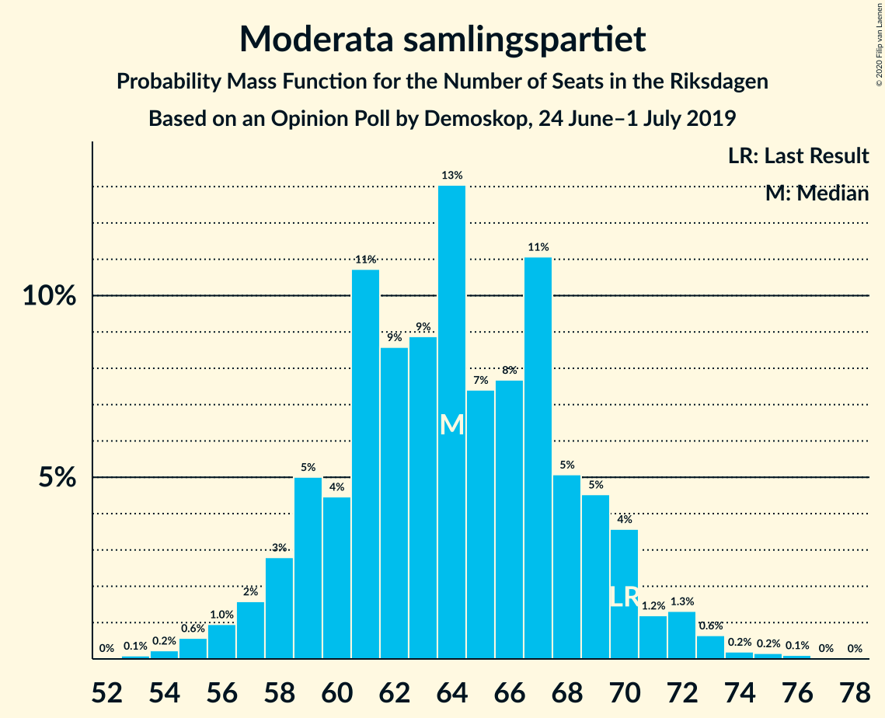
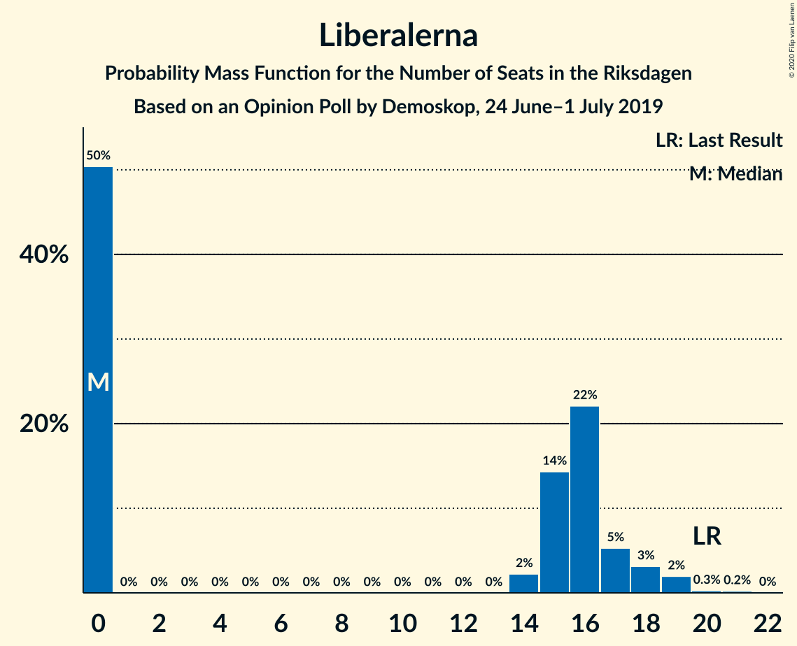
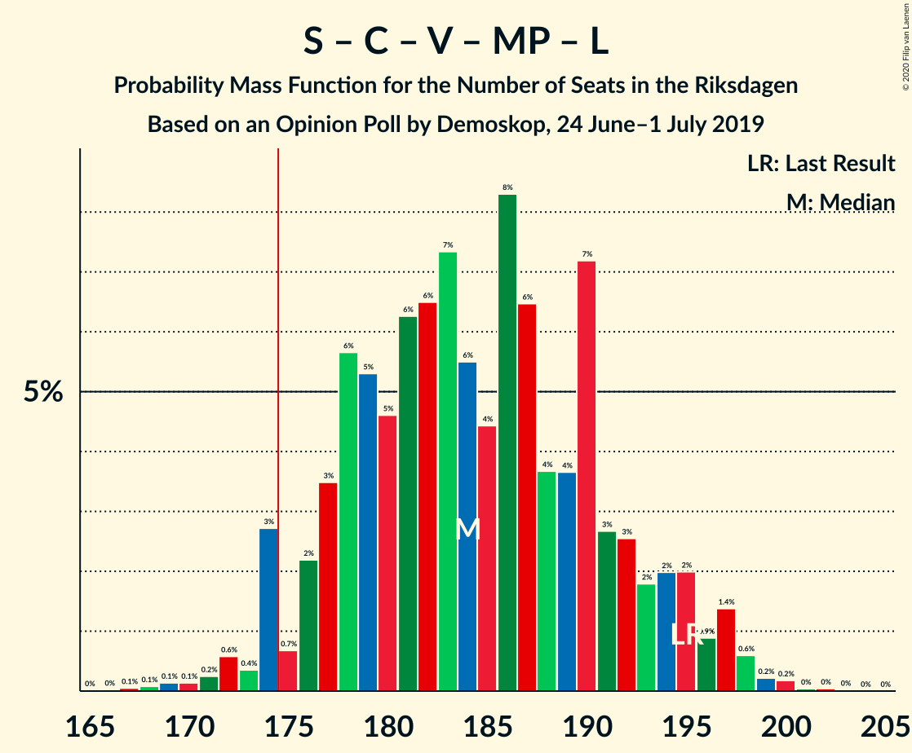
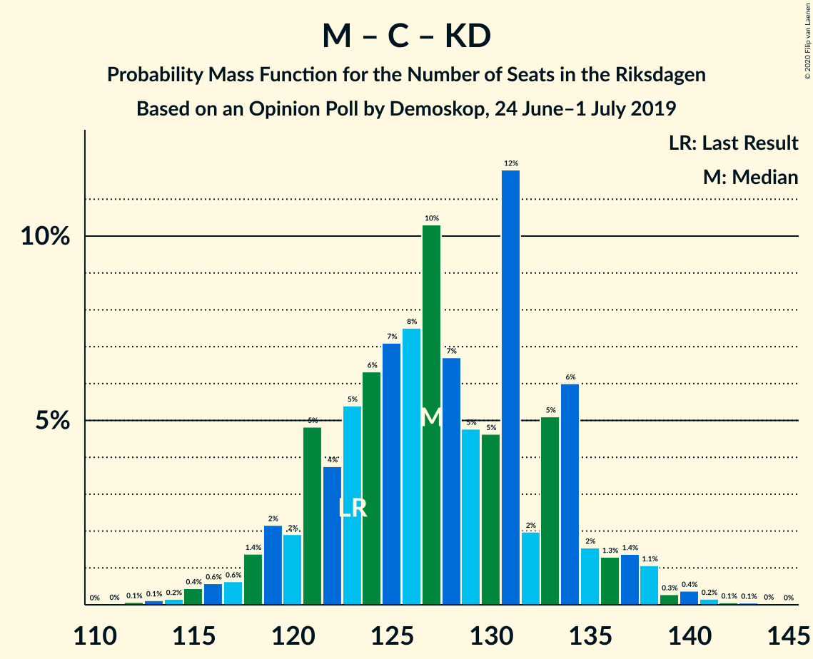

# Opinion Poll by Demoskop, 24 June–1 July 2019

<a href="#voting-intentions">Voting Intentions</a> | <a href="#seats">Seats</a> | <a href="#coalitions">Coalitions</a> | <a href="#technical-information">Technical Information</a>

## Voting Intentions

### Confidence Intervals

| Party | Last Result | Poll Result | 80% Confidence Interval | 90% Confidence Interval | 95% Confidence Interval | 99% Confidence Interval |
|:-----:|:-----------:|:-----------:|:-----------------------:|:-----------------------:|:-----------------------:|:-----------------------:|
| Sveriges socialdemokratiska arbetareparti | 28.3% | 25.9% | 24.6–27.4% |24.2–27.8% |23.8–28.1% |23.2–28.8% |
| Sverigedemokraterna | 17.5% | 19.6% | 18.4–20.9% |18.0–21.3% |17.7–21.6% |17.1–22.3% |
| Moderata samlingspartiet | 19.8% | 17.6% | 16.4–18.9% |16.1–19.2% |15.8–19.5% |15.3–20.2% |
| Centerpartiet | 8.6% | 9.3% | 8.5–10.3% |8.2–10.6% |8.0–10.9% |7.6–11.4% |
| Kristdemokraterna | 6.3% | 8.0% | 7.2–9.0% |7.0–9.2% |6.8–9.5% |6.4–9.9% |
| Vänsterpartiet | 8.0% | 7.9% | 7.1–8.8% |6.9–9.1% |6.7–9.3% |6.3–9.8% |
| Miljöpartiet de gröna | 4.4% | 5.3% | 4.6–6.1% |4.5–6.3% |4.3–6.5% |4.0–6.9% |
| Liberalerna | 5.5% | 4.1% | 3.5–4.8% |3.4–5.0% |3.2–5.2% |3.0–5.6% |

*Note:* The poll result column reflects the actual value used in the calculations. Published results may vary slightly, and in addition be rounded to fewer digits.

## Seats

### Confidence Intervals

| Party | Last Result | Median | 80% Confidence Interval | 90% Confidence Interval | 95% Confidence Interval | 99% Confidence Interval |
|:-----:|:-----------:|:------:|:-----------------------:|:-----------------------:|:-----------------------:|:-----------------------:|
| <a href="#sveriges-socialdemokratiska-arbetareparti">Sveriges socialdemokratiska arbetareparti</a> | 100 | 94 | 89–100 |87–101 |86–103 |83–106 |
| <a href="#sverigedemokraterna">Sverigedemokraterna</a> | 62 | 71 | 66–76 |65–77 |63–79 |61–81 |
| <a href="#moderata-samlingspartiet">Moderata samlingspartiet</a> | 70 | 64 | 59–69 |58–70 |57–71 |55–74 |
| <a href="#centerpartiet">Centerpartiet</a> | 31 | 34 | 30–38 |30–39 |29–39 |27–41 |
| <a href="#kristdemokraterna">Kristdemokraterna</a> | 22 | 29 | 26–32 |26–33 |25–34 |23–36 |
| <a href="#vänsterpartiet">Vänsterpartiet</a> | 28 | 29 | 26–32 |25–33 |24–34 |23–35 |
| <a href="#miljöpartiet-de-gröna">Miljöpartiet de gröna</a> | 16 | 19 | 17–22 |16–23 |16–24 |14–25 |
| <a href="#liberalerna">Liberalerna</a> | 20 | 0 | 0–17 |0–18 |0–18 |0–20 |

### Sveriges socialdemokratiska arbetareparti

*For a full overview of the results for this party, see the [Sveriges socialdemokratiska arbetareparti](party-sverigessocialdemokratiskaarbetareparti.html) page.*

| Number of Seats | Probability | Accumulated | Special Marks |
|:---------------:|:-----------:|:-----------:|:-------------:|
| 80 | 0% | 100% |  |
| 81 | 0.1% | 99.9% |  |
| 82 | 0.2% | 99.9% |  |
| 83 | 0.2% | 99.6% |  |
| 84 | 0.6% | 99.5% |  |
| 85 | 1.1% | 98.9% |  |
| 86 | 2% | 98% |  |
| 87 | 2% | 96% |  |
| 88 | 2% | 94% |  |
| 89 | 5% | 92% |  |
| 90 | 6% | 87% |  |
| 91 | 7% | 81% |  |
| 92 | 7% | 74% |  |
| 93 | 8% | 67% |  |
| 94 | 13% | 59% | Median |
| 95 | 6% | 46% |  |
| 96 | 7% | 39% |  |
| 97 | 6% | 32% |  |
| 98 | 7% | 26% |  |
| 99 | 7% | 18% |  |
| 100 | 4% | 12% | Last Result |
| 101 | 3% | 8% |  |
| 102 | 1.5% | 5% |  |
| 103 | 1.1% | 3% |  |
| 104 | 1.2% | 2% |  |
| 105 | 0.2% | 0.7% |  |
| 106 | 0.3% | 0.5% |  |
| 107 | 0.1% | 0.2% |  |
| 108 | 0% | 0.1% |  |
| 109 | 0% | 0.1% |  |
| 110 | 0% | 0% |  |

### Sverigedemokraterna

*For a full overview of the results for this party, see the [Sverigedemokraterna](party-sverigedemokraterna.html) page.*

| Number of Seats | Probability | Accumulated | Special Marks |
|:---------------:|:-----------:|:-----------:|:-------------:|
| 59 | 0.1% | 100% |  |
| 60 | 0.1% | 99.9% |  |
| 61 | 0.3% | 99.8% |  |
| 62 | 0.8% | 99.4% | Last Result |
| 63 | 2% | 98.7% |  |
| 64 | 2% | 97% |  |
| 65 | 4% | 95% |  |
| 66 | 4% | 92% |  |
| 67 | 7% | 88% |  |
| 68 | 6% | 81% |  |
| 69 | 9% | 75% |  |
| 70 | 10% | 66% |  |
| 71 | 9% | 56% | Median |
| 72 | 10% | 47% |  |
| 73 | 8% | 36% |  |
| 74 | 8% | 28% |  |
| 75 | 6% | 20% |  |
| 76 | 6% | 15% |  |
| 77 | 4% | 9% |  |
| 78 | 2% | 5% |  |
| 79 | 1.2% | 3% |  |
| 80 | 0.7% | 1.4% |  |
| 81 | 0.4% | 0.7% |  |
| 82 | 0.2% | 0.4% |  |
| 83 | 0.1% | 0.2% |  |
| 84 | 0% | 0.1% |  |
| 85 | 0% | 0% |  |

### Moderata samlingspartiet

*For a full overview of the results for this party, see the [Moderata samlingspartiet](party-moderatasamlingspartiet.html) page.*

| Number of Seats | Probability | Accumulated | Special Marks |
|:---------------:|:-----------:|:-----------:|:-------------:|
| 53 | 0.1% | 100% |  |
| 54 | 0.2% | 99.9% |  |
| 55 | 0.6% | 99.6% |  |
| 56 | 1.0% | 99.1% |  |
| 57 | 2% | 98% |  |
| 58 | 3% | 97% |  |
| 59 | 5% | 94% |  |
| 60 | 4% | 89% |  |
| 61 | 11% | 84% |  |
| 62 | 9% | 74% |  |
| 63 | 9% | 65% |  |
| 64 | 13% | 56% | Median |
| 65 | 7% | 43% |  |
| 66 | 8% | 36% |  |
| 67 | 11% | 28% |  |
| 68 | 5% | 17% |  |
| 69 | 5% | 12% |  |
| 70 | 4% | 7% | Last Result |
| 71 | 1.2% | 4% |  |
| 72 | 1.3% | 2% |  |
| 73 | 0.6% | 1.2% |  |
| 74 | 0.2% | 0.5% |  |
| 75 | 0.2% | 0.3% |  |
| 76 | 0.1% | 0.2% |  |
| 77 | 0% | 0.1% |  |
| 78 | 0% | 0% |  |

### Centerpartiet

*For a full overview of the results for this party, see the [Centerpartiet](party-centerpartiet.html) page.*

| Number of Seats | Probability | Accumulated | Special Marks |
|:---------------:|:-----------:|:-----------:|:-------------:|
| 26 | 0.1% | 100% |  |
| 27 | 0.5% | 99.9% |  |
| 28 | 1.1% | 99.4% |  |
| 29 | 3% | 98% |  |
| 30 | 6% | 96% |  |
| 31 | 8% | 90% | Last Result |
| 32 | 12% | 82% |  |
| 33 | 13% | 69% |  |
| 34 | 13% | 56% | Median |
| 35 | 13% | 43% |  |
| 36 | 11% | 30% |  |
| 37 | 7% | 19% |  |
| 38 | 6% | 12% |  |
| 39 | 3% | 5% |  |
| 40 | 1.1% | 2% |  |
| 41 | 0.7% | 1.1% |  |
| 42 | 0.3% | 0.4% |  |
| 43 | 0.1% | 0.2% |  |
| 44 | 0% | 0.1% |  |
| 45 | 0% | 0% |  |

### Kristdemokraterna

*For a full overview of the results for this party, see the [Kristdemokraterna](party-kristdemokraterna.html) page.*

| Number of Seats | Probability | Accumulated | Special Marks |
|:---------------:|:-----------:|:-----------:|:-------------:|
| 22 | 0.2% | 100% | Last Result |
| 23 | 0.5% | 99.8% |  |
| 24 | 1.3% | 99.2% |  |
| 25 | 3% | 98% |  |
| 26 | 6% | 95% |  |
| 27 | 10% | 89% |  |
| 28 | 14% | 79% |  |
| 29 | 17% | 64% | Median |
| 30 | 15% | 47% |  |
| 31 | 13% | 32% |  |
| 32 | 10% | 19% |  |
| 33 | 5% | 9% |  |
| 34 | 2% | 4% |  |
| 35 | 1.0% | 2% |  |
| 36 | 0.3% | 0.6% |  |
| 37 | 0.2% | 0.3% |  |
| 38 | 0.1% | 0.1% |  |
| 39 | 0% | 0% |  |

### Vänsterpartiet

*For a full overview of the results for this party, see the [Vänsterpartiet](party-vänsterpartiet.html) page.*

| Number of Seats | Probability | Accumulated | Special Marks |
|:---------------:|:-----------:|:-----------:|:-------------:|
| 21 | 0.1% | 100% |  |
| 22 | 0.3% | 99.9% |  |
| 23 | 1.3% | 99.6% |  |
| 24 | 2% | 98% |  |
| 25 | 5% | 97% |  |
| 26 | 9% | 91% |  |
| 27 | 16% | 82% |  |
| 28 | 15% | 66% | Last Result |
| 29 | 14% | 51% | Median |
| 30 | 11% | 37% |  |
| 31 | 11% | 26% |  |
| 32 | 6% | 15% |  |
| 33 | 6% | 9% |  |
| 34 | 2% | 3% |  |
| 35 | 0.7% | 1.1% |  |
| 36 | 0.3% | 0.5% |  |
| 37 | 0.1% | 0.1% |  |
| 38 | 0% | 0.1% |  |
| 39 | 0% | 0% |  |

### Miljöpartiet de gröna

*For a full overview of the results for this party, see the [Miljöpartiet de gröna](party-miljöpartietdegröna.html) page.*

| Number of Seats | Probability | Accumulated | Special Marks |
|:---------------:|:-----------:|:-----------:|:-------------:|
| 0 | 0.5% | 100% |  |
| 1 | 0% | 99.5% |  |
| 2 | 0% | 99.5% |  |
| 3 | 0% | 99.5% |  |
| 4 | 0% | 99.5% |  |
| 5 | 0% | 99.5% |  |
| 6 | 0% | 99.5% |  |
| 7 | 0% | 99.5% |  |
| 8 | 0% | 99.5% |  |
| 9 | 0% | 99.5% |  |
| 10 | 0% | 99.5% |  |
| 11 | 0% | 99.5% |  |
| 12 | 0% | 99.5% |  |
| 13 | 0% | 99.5% |  |
| 14 | 0.3% | 99.5% |  |
| 15 | 1.5% | 99.2% |  |
| 16 | 6% | 98% | Last Result |
| 17 | 10% | 92% |  |
| 18 | 16% | 82% |  |
| 19 | 20% | 66% | Median |
| 20 | 16% | 46% |  |
| 21 | 14% | 30% |  |
| 22 | 9% | 17% |  |
| 23 | 5% | 8% |  |
| 24 | 2% | 3% |  |
| 25 | 0.7% | 0.9% |  |
| 26 | 0.1% | 0.2% |  |
| 27 | 0.1% | 0.1% |  |
| 28 | 0% | 0% |  |

### Liberalerna

*For a full overview of the results for this party, see the [Liberalerna](party-liberalerna.html) page.*

| Number of Seats | Probability | Accumulated | Special Marks |
|:---------------:|:-----------:|:-----------:|:-------------:|
| 0 | 50% | 100% | Median |
| 1 | 0% | 50% |  |
| 2 | 0% | 50% |  |
| 3 | 0% | 50% |  |
| 4 | 0% | 50% |  |
| 5 | 0% | 50% |  |
| 6 | 0% | 50% |  |
| 7 | 0% | 50% |  |
| 8 | 0% | 50% |  |
| 9 | 0% | 50% |  |
| 10 | 0% | 50% |  |
| 11 | 0% | 50% |  |
| 12 | 0% | 50% |  |
| 13 | 0% | 50% |  |
| 14 | 2% | 50% |  |
| 15 | 14% | 47% |  |
| 16 | 22% | 33% |  |
| 17 | 5% | 11% |  |
| 18 | 3% | 6% |  |
| 19 | 2% | 2% |  |
| 20 | 0.3% | 0.5% | Last Result |
| 21 | 0.2% | 0.3% |  |
| 22 | 0% | 0% |  |

## Coalitions

### Confidence Intervals

| Coalition | Last Result | Median | Majority? | 80% Confidence Interval | 90% Confidence Interval | 95% Confidence Interval | 99% Confidence Interval |
|:---------:|:-----------:|:------:|:---------:|:-----------------------:|:-----------------------:|:-----------------------:|:-----------------------:|
| Sveriges socialdemokratiska arbetareparti – Moderata samlingspartiet – Centerpartiet | 201 | 193 | 99.9% | 184–201 | 182–202 | 181–204 | 177–206 |
| Sveriges socialdemokratiska arbetareparti – Centerpartiet – Vänsterpartiet – Miljöpartiet de gröna – Liberalerna | 195 | 184 | 96% | 177–192 | 175–195 | 174–196 | 171–199 |
| Sverigedemokraterna – Moderata samlingspartiet – Kristdemokraterna | 154 | 165 | 4% | 157–172 | 154–174 | 153–175 | 150–178 |
| Sveriges socialdemokratiska arbetareparti – Moderata samlingspartiet | 170 | 159 | 0.1% | 151–165 | 149–166 | 148–169 | 144–171 |
| Sveriges socialdemokratiska arbetareparti – Centerpartiet – Miljöpartiet de gröna – Liberalerna | 167 | 155 | 0% | 147–164 | 146–167 | 144–168 | 141–171 |
| Sveriges socialdemokratiska arbetareparti – Vänsterpartiet – Miljöpartiet de gröna | 144 | 143 | 0% | 135–149 | 133–151 | 132–153 | 128–155 |
| Moderata samlingspartiet – Centerpartiet – Kristdemokraterna – Liberalerna | 143 | 135 | 0% | 126–144 | 124–147 | 123–147 | 121–151 |
| Sverigedemokraterna – Moderata samlingspartiet | 132 | 135 | 0% | 128–142 | 126–144 | 125–145 | 122–149 |
| Moderata samlingspartiet – Centerpartiet – Kristdemokraterna | 123 | 127 | 0% | 121–134 | 119–135 | 118–137 | 115–140 |
| Sveriges socialdemokratiska arbetareparti – Vänsterpartiet | 128 | 123 | 0% | 117–130 | 115–131 | 113–133 | 111–135 |
| Sveriges socialdemokratiska arbetareparti – Miljöpartiet de gröna | 116 | 113 | 0% | 107–120 | 106–122 | 104–122 | 100–125 |
| Moderata samlingspartiet – Centerpartiet – Liberalerna | 121 | 106 | 0% | 97–115 | 95–117 | 94–118 | 91–121 |
| Moderata samlingspartiet – Centerpartiet | 101 | 98 | 0% | 92–104 | 91–106 | 89–108 | 87–110 |

### Sveriges socialdemokratiska arbetareparti – Moderata samlingspartiet – Centerpartiet

| Number of Seats | Probability | Accumulated | Special Marks |
|:---------------:|:-----------:|:-----------:|:-------------:|
| 174 | 0.1% | 100% |  |
| 175 | 0.1% | 99.9% | Majority |
| 176 | 0.2% | 99.9% |  |
| 177 | 0.2% | 99.7% |  |
| 178 | 0.4% | 99.5% |  |
| 179 | 0.7% | 99.1% |  |
| 180 | 0.6% | 98% |  |
| 181 | 1.2% | 98% |  |
| 182 | 2% | 97% |  |
| 183 | 2% | 95% |  |
| 184 | 4% | 93% |  |
| 185 | 4% | 89% |  |
| 186 | 3% | 86% |  |
| 187 | 3% | 82% |  |
| 188 | 4% | 79% |  |
| 189 | 7% | 75% |  |
| 190 | 6% | 68% |  |
| 191 | 5% | 62% |  |
| 192 | 5% | 57% | Median |
| 193 | 8% | 52% |  |
| 194 | 6% | 44% |  |
| 195 | 9% | 38% |  |
| 196 | 3% | 30% |  |
| 197 | 5% | 26% |  |
| 198 | 5% | 21% |  |
| 199 | 4% | 16% |  |
| 200 | 3% | 13% |  |
| 201 | 3% | 10% | Last Result |
| 202 | 3% | 7% |  |
| 203 | 2% | 5% |  |
| 204 | 1.5% | 3% |  |
| 205 | 0.4% | 1.3% |  |
| 206 | 0.5% | 0.9% |  |
| 207 | 0.1% | 0.4% |  |
| 208 | 0.1% | 0.3% |  |
| 209 | 0.1% | 0.2% |  |
| 210 | 0% | 0.1% |  |
| 211 | 0% | 0.1% |  |
| 212 | 0% | 0.1% |  |
| 213 | 0% | 0% |  |

### Sveriges socialdemokratiska arbetareparti – Centerpartiet – Vänsterpartiet – Miljöpartiet de gröna – Liberalerna

| Number of Seats | Probability | Accumulated | Special Marks |
|:---------------:|:-----------:|:-----------:|:-------------:|
| 165 | 0% | 100% |  |
| 166 | 0% | 99.9% |  |
| 167 | 0.1% | 99.9% |  |
| 168 | 0.1% | 99.9% |  |
| 169 | 0.1% | 99.8% |  |
| 170 | 0.1% | 99.7% |  |
| 171 | 0.2% | 99.5% |  |
| 172 | 0.6% | 99.3% |  |
| 173 | 0.4% | 98.7% |  |
| 174 | 3% | 98% |  |
| 175 | 0.7% | 96% | Majority |
| 176 | 2% | 95% | Median |
| 177 | 3% | 93% |  |
| 178 | 6% | 89% |  |
| 179 | 5% | 84% |  |
| 180 | 5% | 78% |  |
| 181 | 6% | 74% |  |
| 182 | 6% | 67% |  |
| 183 | 7% | 61% |  |
| 184 | 6% | 54% |  |
| 185 | 4% | 48% |  |
| 186 | 8% | 44% |  |
| 187 | 6% | 35% |  |
| 188 | 4% | 29% |  |
| 189 | 4% | 25% |  |
| 190 | 7% | 22% |  |
| 191 | 3% | 14% |  |
| 192 | 3% | 12% |  |
| 193 | 2% | 9% |  |
| 194 | 2% | 7% |  |
| 195 | 2% | 5% | Last Result |
| 196 | 0.9% | 3% |  |
| 197 | 1.4% | 2% |  |
| 198 | 0.6% | 1.1% |  |
| 199 | 0.2% | 0.5% |  |
| 200 | 0.2% | 0.3% |  |
| 201 | 0% | 0.1% |  |
| 202 | 0% | 0.1% |  |
| 203 | 0% | 0% |  |

### Sverigedemokraterna – Moderata samlingspartiet – Kristdemokraterna

| Number of Seats | Probability | Accumulated | Special Marks |
|:---------------:|:-----------:|:-----------:|:-------------:|
| 147 | 0% | 100% |  |
| 148 | 0% | 99.9% |  |
| 149 | 0.2% | 99.9% |  |
| 150 | 0.2% | 99.7% |  |
| 151 | 0.6% | 99.5% |  |
| 152 | 1.4% | 98.9% |  |
| 153 | 0.9% | 98% |  |
| 154 | 2% | 97% | Last Result |
| 155 | 2% | 95% |  |
| 156 | 2% | 93% |  |
| 157 | 3% | 91% |  |
| 158 | 3% | 88% |  |
| 159 | 7% | 86% |  |
| 160 | 4% | 78% |  |
| 161 | 4% | 75% |  |
| 162 | 6% | 71% |  |
| 163 | 8% | 65% |  |
| 164 | 4% | 56% | Median |
| 165 | 6% | 52% |  |
| 166 | 7% | 46% |  |
| 167 | 6% | 39% |  |
| 168 | 6% | 33% |  |
| 169 | 5% | 26% |  |
| 170 | 5% | 22% |  |
| 171 | 6% | 16% |  |
| 172 | 3% | 11% |  |
| 173 | 2% | 7% |  |
| 174 | 0.7% | 5% |  |
| 175 | 3% | 4% | Majority |
| 176 | 0.4% | 2% |  |
| 177 | 0.6% | 1.3% |  |
| 178 | 0.2% | 0.7% |  |
| 179 | 0.1% | 0.5% |  |
| 180 | 0.1% | 0.3% |  |
| 181 | 0.1% | 0.2% |  |
| 182 | 0.1% | 0.1% |  |
| 183 | 0% | 0.1% |  |
| 184 | 0% | 0.1% |  |
| 185 | 0% | 0% |  |

### Sveriges socialdemokratiska arbetareparti – Moderata samlingspartiet

| Number of Seats | Probability | Accumulated | Special Marks |
|:---------------:|:-----------:|:-----------:|:-------------:|
| 141 | 0% | 100% |  |
| 142 | 0% | 99.9% |  |
| 143 | 0.2% | 99.9% |  |
| 144 | 0.3% | 99.7% |  |
| 145 | 0.6% | 99.4% |  |
| 146 | 0.4% | 98.7% |  |
| 147 | 0.6% | 98% |  |
| 148 | 2% | 98% |  |
| 149 | 2% | 96% |  |
| 150 | 3% | 95% |  |
| 151 | 3% | 92% |  |
| 152 | 2% | 89% |  |
| 153 | 3% | 87% |  |
| 154 | 9% | 84% |  |
| 155 | 9% | 75% |  |
| 156 | 6% | 66% |  |
| 157 | 3% | 61% |  |
| 158 | 7% | 58% | Median |
| 159 | 7% | 51% |  |
| 160 | 8% | 44% |  |
| 161 | 7% | 36% |  |
| 162 | 5% | 30% |  |
| 163 | 5% | 25% |  |
| 164 | 5% | 20% |  |
| 165 | 7% | 15% |  |
| 166 | 4% | 8% |  |
| 167 | 1.2% | 5% |  |
| 168 | 0.7% | 4% |  |
| 169 | 1.3% | 3% |  |
| 170 | 1.2% | 2% | Last Result |
| 171 | 0.2% | 0.6% |  |
| 172 | 0.1% | 0.4% |  |
| 173 | 0.1% | 0.3% |  |
| 174 | 0.1% | 0.2% |  |
| 175 | 0% | 0.1% | Majority |
| 176 | 0% | 0.1% |  |
| 177 | 0% | 0% |  |

### Sveriges socialdemokratiska arbetareparti – Centerpartiet – Miljöpartiet de gröna – Liberalerna

| Number of Seats | Probability | Accumulated | Special Marks |
|:---------------:|:-----------:|:-----------:|:-------------:|
| 136 | 0% | 100% |  |
| 137 | 0% | 99.9% |  |
| 138 | 0.1% | 99.9% |  |
| 139 | 0.1% | 99.8% |  |
| 140 | 0.2% | 99.7% |  |
| 141 | 0.4% | 99.6% |  |
| 142 | 0.4% | 99.2% |  |
| 143 | 0.6% | 98.8% |  |
| 144 | 0.8% | 98% |  |
| 145 | 2% | 97% |  |
| 146 | 3% | 96% |  |
| 147 | 5% | 93% | Median |
| 148 | 2% | 88% |  |
| 149 | 4% | 86% |  |
| 150 | 6% | 82% |  |
| 151 | 3% | 76% |  |
| 152 | 6% | 73% |  |
| 153 | 7% | 66% |  |
| 154 | 3% | 60% |  |
| 155 | 7% | 56% |  |
| 156 | 4% | 50% |  |
| 157 | 6% | 45% |  |
| 158 | 6% | 40% |  |
| 159 | 3% | 34% |  |
| 160 | 6% | 31% |  |
| 161 | 4% | 24% |  |
| 162 | 3% | 20% |  |
| 163 | 5% | 17% |  |
| 164 | 3% | 12% |  |
| 165 | 2% | 9% |  |
| 166 | 1.3% | 6% |  |
| 167 | 2% | 5% | Last Result |
| 168 | 1.3% | 3% |  |
| 169 | 1.0% | 2% |  |
| 170 | 0.5% | 1.0% |  |
| 171 | 0.2% | 0.5% |  |
| 172 | 0.2% | 0.3% |  |
| 173 | 0.1% | 0.1% |  |
| 174 | 0% | 0.1% |  |
| 175 | 0% | 0% | Majority |

### Sveriges socialdemokratiska arbetareparti – Vänsterpartiet – Miljöpartiet de gröna

| Number of Seats | Probability | Accumulated | Special Marks |
|:---------------:|:-----------:|:-----------:|:-------------:|
| 122 | 0% | 100% |  |
| 123 | 0% | 99.9% |  |
| 124 | 0.1% | 99.9% |  |
| 125 | 0% | 99.9% |  |
| 126 | 0.1% | 99.8% |  |
| 127 | 0.1% | 99.8% |  |
| 128 | 0.2% | 99.7% |  |
| 129 | 0.4% | 99.4% |  |
| 130 | 0.5% | 99.1% |  |
| 131 | 0.9% | 98.6% |  |
| 132 | 2% | 98% |  |
| 133 | 2% | 96% |  |
| 134 | 3% | 94% |  |
| 135 | 3% | 92% |  |
| 136 | 3% | 88% |  |
| 137 | 4% | 85% |  |
| 138 | 6% | 81% |  |
| 139 | 7% | 75% |  |
| 140 | 5% | 68% |  |
| 141 | 5% | 62% |  |
| 142 | 7% | 57% | Median |
| 143 | 5% | 51% |  |
| 144 | 8% | 46% | Last Result |
| 145 | 6% | 38% |  |
| 146 | 6% | 32% |  |
| 147 | 4% | 26% |  |
| 148 | 7% | 22% |  |
| 149 | 5% | 14% |  |
| 150 | 3% | 10% |  |
| 151 | 2% | 7% |  |
| 152 | 2% | 5% |  |
| 153 | 2% | 3% |  |
| 154 | 0.4% | 1.0% |  |
| 155 | 0.2% | 0.5% |  |
| 156 | 0.1% | 0.4% |  |
| 157 | 0.1% | 0.2% |  |
| 158 | 0.1% | 0.2% |  |
| 159 | 0% | 0.1% |  |
| 160 | 0% | 0% |  |

### Moderata samlingspartiet – Centerpartiet – Kristdemokraterna – Liberalerna

| Number of Seats | Probability | Accumulated | Special Marks |
|:---------------:|:-----------:|:-----------:|:-------------:|
| 118 | 0% | 100% |  |
| 119 | 0.1% | 99.9% |  |
| 120 | 0.2% | 99.8% |  |
| 121 | 0.4% | 99.6% |  |
| 122 | 0.2% | 99.2% |  |
| 123 | 3% | 99.0% |  |
| 124 | 2% | 96% |  |
| 125 | 1.1% | 94% |  |
| 126 | 4% | 93% |  |
| 127 | 5% | 89% | Median |
| 128 | 4% | 85% |  |
| 129 | 3% | 81% |  |
| 130 | 3% | 78% |  |
| 131 | 9% | 75% |  |
| 132 | 2% | 66% |  |
| 133 | 6% | 64% |  |
| 134 | 7% | 59% |  |
| 135 | 3% | 52% |  |
| 136 | 4% | 49% |  |
| 137 | 5% | 45% |  |
| 138 | 4% | 40% |  |
| 139 | 3% | 36% |  |
| 140 | 6% | 33% |  |
| 141 | 5% | 27% |  |
| 142 | 5% | 22% |  |
| 143 | 5% | 17% | Last Result |
| 144 | 3% | 12% |  |
| 145 | 2% | 9% |  |
| 146 | 2% | 8% |  |
| 147 | 4% | 6% |  |
| 148 | 0.6% | 2% |  |
| 149 | 0.6% | 2% |  |
| 150 | 0.5% | 1.0% |  |
| 151 | 0.2% | 0.6% |  |
| 152 | 0.1% | 0.3% |  |
| 153 | 0.1% | 0.3% |  |
| 154 | 0% | 0.1% |  |
| 155 | 0% | 0.1% |  |
| 156 | 0% | 0% |  |

### Sverigedemokraterna – Moderata samlingspartiet

| Number of Seats | Probability | Accumulated | Special Marks |
|:---------------:|:-----------:|:-----------:|:-------------:|
| 119 | 0% | 100% |  |
| 120 | 0.1% | 99.9% |  |
| 121 | 0.2% | 99.8% |  |
| 122 | 0.3% | 99.6% |  |
| 123 | 0.9% | 99.3% |  |
| 124 | 0.5% | 98% |  |
| 125 | 2% | 98% |  |
| 126 | 1.3% | 96% |  |
| 127 | 2% | 95% |  |
| 128 | 3% | 92% |  |
| 129 | 5% | 89% |  |
| 130 | 7% | 85% |  |
| 131 | 4% | 78% |  |
| 132 | 6% | 74% | Last Result |
| 133 | 8% | 68% |  |
| 134 | 6% | 60% |  |
| 135 | 6% | 54% | Median |
| 136 | 7% | 48% |  |
| 137 | 6% | 41% |  |
| 138 | 6% | 35% |  |
| 139 | 6% | 29% |  |
| 140 | 6% | 23% |  |
| 141 | 6% | 18% |  |
| 142 | 3% | 11% |  |
| 143 | 1.0% | 8% |  |
| 144 | 3% | 7% |  |
| 145 | 2% | 4% |  |
| 146 | 0.9% | 2% |  |
| 147 | 0.3% | 1.2% |  |
| 148 | 0.3% | 0.8% |  |
| 149 | 0.2% | 0.5% |  |
| 150 | 0.1% | 0.3% |  |
| 151 | 0.1% | 0.2% |  |
| 152 | 0% | 0.1% |  |
| 153 | 0% | 0% |  |

### Moderata samlingspartiet – Centerpartiet – Kristdemokraterna

| Number of Seats | Probability | Accumulated | Special Marks |
|:---------------:|:-----------:|:-----------:|:-------------:|
| 112 | 0.1% | 100% |  |
| 113 | 0.1% | 99.9% |  |
| 114 | 0.2% | 99.8% |  |
| 115 | 0.4% | 99.6% |  |
| 116 | 0.6% | 99.2% |  |
| 117 | 0.6% | 98.6% |  |
| 118 | 1.4% | 98% |  |
| 119 | 2% | 97% |  |
| 120 | 2% | 94% |  |
| 121 | 5% | 92% |  |
| 122 | 4% | 88% |  |
| 123 | 5% | 84% | Last Result |
| 124 | 6% | 79% |  |
| 125 | 7% | 72% |  |
| 126 | 8% | 65% |  |
| 127 | 10% | 58% | Median |
| 128 | 7% | 47% |  |
| 129 | 5% | 41% |  |
| 130 | 5% | 36% |  |
| 131 | 12% | 31% |  |
| 132 | 2% | 19% |  |
| 133 | 5% | 17% |  |
| 134 | 6% | 12% |  |
| 135 | 2% | 6% |  |
| 136 | 1.3% | 5% |  |
| 137 | 1.4% | 3% |  |
| 138 | 1.1% | 2% |  |
| 139 | 0.3% | 1.0% |  |
| 140 | 0.4% | 0.7% |  |
| 141 | 0.2% | 0.3% |  |
| 142 | 0.1% | 0.2% |  |
| 143 | 0.1% | 0.1% |  |
| 144 | 0% | 0.1% |  |
| 145 | 0% | 0% |  |

### Sveriges socialdemokratiska arbetareparti – Vänsterpartiet

| Number of Seats | Probability | Accumulated | Special Marks |
|:---------------:|:-----------:|:-----------:|:-------------:|
| 107 | 0% | 100% |  |
| 108 | 0% | 99.9% |  |
| 109 | 0.2% | 99.9% |  |
| 110 | 0.2% | 99.7% |  |
| 111 | 0.5% | 99.6% |  |
| 112 | 0.9% | 99.0% |  |
| 113 | 2% | 98% |  |
| 114 | 1.3% | 96% |  |
| 115 | 2% | 95% |  |
| 116 | 2% | 93% |  |
| 117 | 6% | 91% |  |
| 118 | 5% | 85% |  |
| 119 | 4% | 80% |  |
| 120 | 9% | 76% |  |
| 121 | 6% | 68% |  |
| 122 | 9% | 61% |  |
| 123 | 5% | 52% | Median |
| 124 | 7% | 48% |  |
| 125 | 8% | 40% |  |
| 126 | 5% | 33% |  |
| 127 | 6% | 27% |  |
| 128 | 6% | 21% | Last Result |
| 129 | 3% | 15% |  |
| 130 | 3% | 12% |  |
| 131 | 4% | 9% |  |
| 132 | 1.1% | 5% |  |
| 133 | 2% | 4% |  |
| 134 | 0.6% | 2% |  |
| 135 | 0.8% | 1.3% |  |
| 136 | 0.2% | 0.5% |  |
| 137 | 0.1% | 0.3% |  |
| 138 | 0.1% | 0.1% |  |
| 139 | 0% | 0.1% |  |
| 140 | 0% | 0% |  |

### Sveriges socialdemokratiska arbetareparti – Miljöpartiet de gröna

| Number of Seats | Probability | Accumulated | Special Marks |
|:---------------:|:-----------:|:-----------:|:-------------:|
| 92 | 0% | 100% |  |
| 93 | 0% | 99.9% |  |
| 94 | 0% | 99.9% |  |
| 95 | 0% | 99.9% |  |
| 96 | 0% | 99.9% |  |
| 97 | 0.1% | 99.8% |  |
| 98 | 0% | 99.8% |  |
| 99 | 0.1% | 99.7% |  |
| 100 | 0.2% | 99.7% |  |
| 101 | 0.2% | 99.5% |  |
| 102 | 0.5% | 99.3% |  |
| 103 | 0.9% | 98.8% |  |
| 104 | 1.2% | 98% |  |
| 105 | 1.3% | 97% |  |
| 106 | 3% | 95% |  |
| 107 | 4% | 93% |  |
| 108 | 2% | 88% |  |
| 109 | 4% | 86% |  |
| 110 | 5% | 82% |  |
| 111 | 8% | 77% |  |
| 112 | 9% | 68% |  |
| 113 | 9% | 59% | Median |
| 114 | 6% | 50% |  |
| 115 | 5% | 43% |  |
| 116 | 5% | 38% | Last Result |
| 117 | 8% | 33% |  |
| 118 | 10% | 25% |  |
| 119 | 5% | 16% |  |
| 120 | 4% | 11% |  |
| 121 | 2% | 7% |  |
| 122 | 3% | 5% |  |
| 123 | 1.4% | 2% |  |
| 124 | 0.4% | 0.9% |  |
| 125 | 0.2% | 0.5% |  |
| 126 | 0.1% | 0.3% |  |
| 127 | 0.1% | 0.2% |  |
| 128 | 0.1% | 0.1% |  |
| 129 | 0% | 0.1% |  |
| 130 | 0% | 0% |  |

### Moderata samlingspartiet – Centerpartiet – Liberalerna

| Number of Seats | Probability | Accumulated | Special Marks |
|:---------------:|:-----------:|:-----------:|:-------------:|
| 88 | 0% | 100% |  |
| 89 | 0.1% | 99.9% |  |
| 90 | 0.2% | 99.9% |  |
| 91 | 0.3% | 99.7% |  |
| 92 | 0.5% | 99.4% |  |
| 93 | 1.2% | 98.9% |  |
| 94 | 2% | 98% |  |
| 95 | 3% | 95% |  |
| 96 | 2% | 93% |  |
| 97 | 3% | 90% |  |
| 98 | 4% | 87% | Median |
| 99 | 5% | 83% |  |
| 100 | 4% | 78% |  |
| 101 | 4% | 74% |  |
| 102 | 5% | 69% |  |
| 103 | 4% | 64% |  |
| 104 | 5% | 60% |  |
| 105 | 2% | 55% |  |
| 106 | 4% | 52% |  |
| 107 | 3% | 49% |  |
| 108 | 5% | 46% |  |
| 109 | 5% | 41% |  |
| 110 | 5% | 36% |  |
| 111 | 4% | 31% |  |
| 112 | 7% | 27% |  |
| 113 | 4% | 21% |  |
| 114 | 4% | 17% |  |
| 115 | 5% | 13% |  |
| 116 | 2% | 8% |  |
| 117 | 3% | 7% |  |
| 118 | 1.2% | 4% |  |
| 119 | 0.9% | 2% |  |
| 120 | 0.8% | 2% |  |
| 121 | 0.3% | 0.8% | Last Result |
| 122 | 0.2% | 0.5% |  |
| 123 | 0.1% | 0.3% |  |
| 124 | 0.1% | 0.1% |  |
| 125 | 0% | 0.1% |  |
| 126 | 0% | 0% |  |

### Moderata samlingspartiet – Centerpartiet

| Number of Seats | Probability | Accumulated | Special Marks |
|:---------------:|:-----------:|:-----------:|:-------------:|
| 84 | 0% | 100% |  |
| 85 | 0.1% | 99.9% |  |
| 86 | 0.2% | 99.8% |  |
| 87 | 0.5% | 99.6% |  |
| 88 | 0.9% | 99.1% |  |
| 89 | 0.8% | 98% |  |
| 90 | 2% | 97% |  |
| 91 | 2% | 96% |  |
| 92 | 4% | 94% |  |
| 93 | 4% | 89% |  |
| 94 | 9% | 85% |  |
| 95 | 6% | 76% |  |
| 96 | 10% | 70% |  |
| 97 | 6% | 60% |  |
| 98 | 8% | 54% | Median |
| 99 | 10% | 46% |  |
| 100 | 6% | 37% |  |
| 101 | 7% | 31% | Last Result |
| 102 | 6% | 23% |  |
| 103 | 5% | 17% |  |
| 104 | 5% | 13% |  |
| 105 | 2% | 8% |  |
| 106 | 2% | 6% |  |
| 107 | 0.9% | 4% |  |
| 108 | 2% | 3% |  |
| 109 | 0.5% | 1.0% |  |
| 110 | 0.3% | 0.6% |  |
| 111 | 0.1% | 0.3% |  |
| 112 | 0.1% | 0.2% |  |
| 113 | 0.1% | 0.1% |  |
| 114 | 0% | 0% |  |

## Technical Information

### Opinion Poll

+ **Polling firm:** Demoskop
+ **Commissioner(s):** —
+ **Fieldwork period:** 24 June–1 July 2019

### Calculations

+ **Sample size:** 1608
+ **Simulations done:** 1,048,576
+ **Error estimate:** 1.40%

