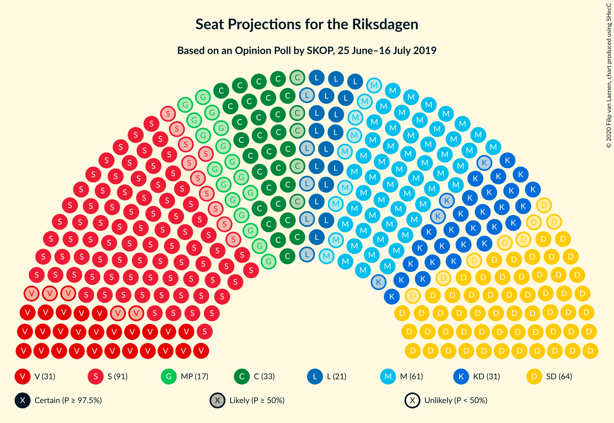
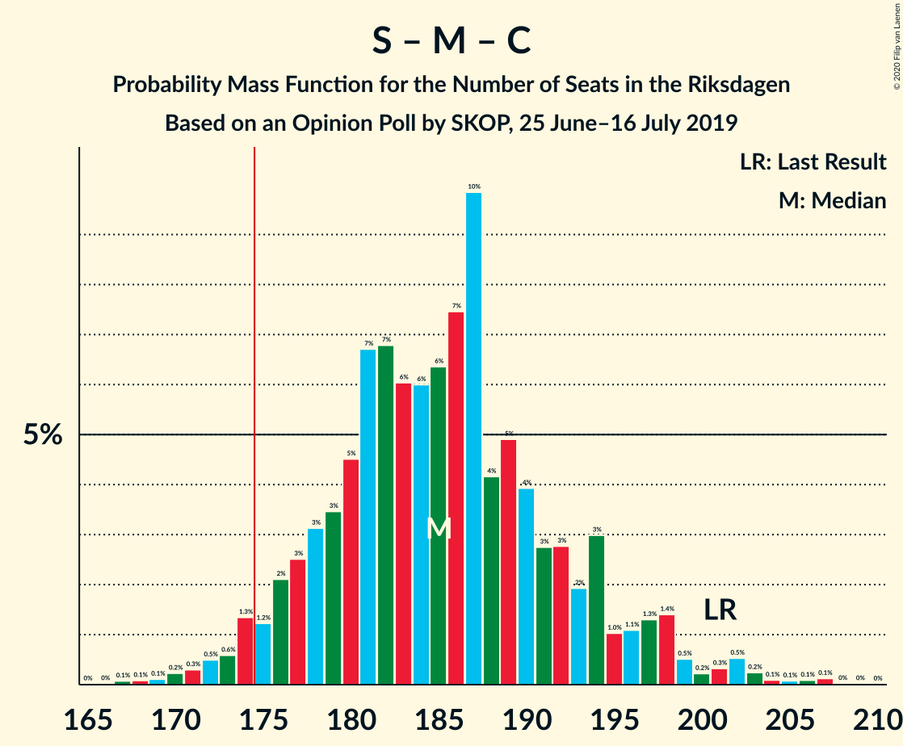
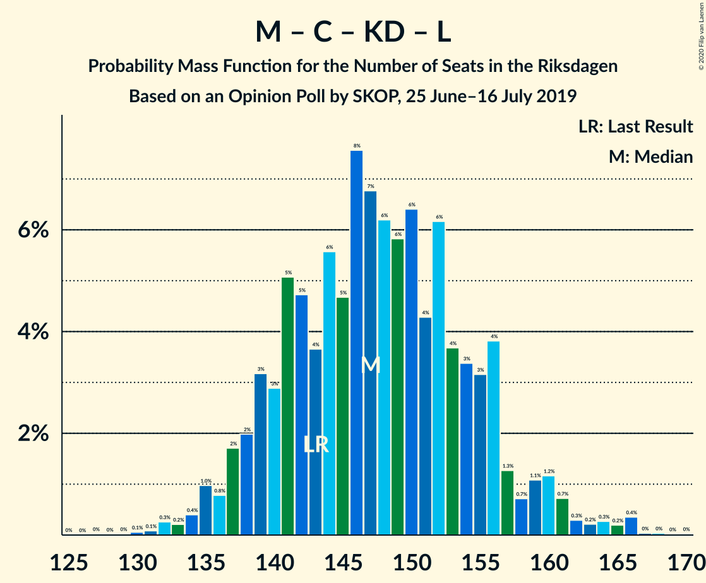

# Opinion Poll by SKOP, 25 June–16 July 2019

<a href="#voting-intentions">Voting Intentions</a> | <a href="#seats">Seats</a> | <a href="#coalitions">Coalitions</a> | <a href="#technical-information">Technical Information</a>

## Voting Intentions

### Confidence Intervals

| Party | Last Result | Poll Result | 80% Confidence Interval | 90% Confidence Interval | 95% Confidence Interval | 99% Confidence Interval |
|:-----:|:-----------:|:-----------:|:-----------------------:|:-----------------------:|:-----------------------:|:-----------------------:|
| Sveriges socialdemokratiska arbetareparti | 28.3% | 25.6% | 23.9–27.4% |23.4–27.9% |23.0–28.3% |22.2–29.2% |
| Sverigedemokraterna | 17.5% | 18.0% | 16.6–19.6% |16.2–20.1% |15.8–20.5% |15.2–21.3% |
| Moderata samlingspartiet | 19.8% | 17.0% | 15.6–18.5% |15.2–19.0% |14.8–19.4% |14.2–20.2% |
| Centerpartiet | 8.6% | 9.5% | 8.5–10.8% |8.2–11.2% |7.9–11.5% |7.4–12.1% |
| Kristdemokraterna | 6.3% | 9.2% | 8.1–10.4% |7.8–10.8% |7.6–11.1% |7.1–11.7% |
| Vänsterpartiet | 8.0% | 8.9% | 7.8–10.1% |7.5–10.5% |7.3–10.8% |6.8–11.4% |
| Liberalerna | 5.5% | 5.7% | 4.9–6.8% |4.7–7.1% |4.5–7.3% |4.1–7.8% |
| Miljöpartiet de gröna | 4.4% | 4.7% | 3.9–5.6% |3.7–5.9% |3.6–6.1% |3.2–6.6% |

*Note:* The poll result column reflects the actual value used in the calculations. Published results may vary slightly, and in addition be rounded to fewer digits.

## Seats

### Confidence Intervals

| Party | Last Result | Median | 80% Confidence Interval | 90% Confidence Interval | 95% Confidence Interval | 99% Confidence Interval |
|:-----:|:-----------:|:------:|:-----------------------:|:-----------------------:|:-----------------------:|:-----------------------:|
| <a href="#sveriges-socialdemokratiska-arbetareparti">Sveriges socialdemokratiska arbetareparti</a> | 100 | 90 | 85–95 |84–98 |81–100 |78–103 |
| <a href="#sverigedemokraterna">Sverigedemokraterna</a> | 62 | 64 | 60–69 |57–70 |56–72 |55–75 |
| <a href="#moderata-samlingspartiet">Moderata samlingspartiet</a> | 70 | 62 | 56–65 |54–67 |52–69 |50–71 |
| <a href="#centerpartiet">Centerpartiet</a> | 31 | 33 | 30–37 |29–39 |28–41 |26–42 |
| <a href="#kristdemokraterna">Kristdemokraterna</a> | 22 | 33 | 30–36 |29–36 |27–38 |26–42 |
| <a href="#vänsterpartiet">Vänsterpartiet</a> | 28 | 30 | 29–35 |28–36 |26–39 |25–39 |
| <a href="#liberalerna">Liberalerna</a> | 20 | 21 | 18–22 |17–24 |16–26 |14–27 |
| <a href="#miljöpartiet-de-gröna">Miljöpartiet de gröna</a> | 16 | 17 | 14–19 |0–21 |0–22 |0–23 |

### Sveriges socialdemokratiska arbetareparti

*For a full overview of the results for this party, see the [Sveriges socialdemokratiska arbetareparti](party-sverigessocialdemokratiskaarbetareparti.html) page.*

| Number of Seats | Probability | Accumulated | Special Marks |
|:---------------:|:-----------:|:-----------:|:-------------:|
| 75 | 0% | 100% |  |
| 76 | 0% | 99.9% |  |
| 77 | 0.1% | 99.9% |  |
| 78 | 0.7% | 99.8% |  |
| 79 | 0.2% | 99.2% |  |
| 80 | 1.1% | 99.0% |  |
| 81 | 0.9% | 98% |  |
| 82 | 0.7% | 97% |  |
| 83 | 1.0% | 96% |  |
| 84 | 2% | 95% |  |
| 85 | 9% | 93% |  |
| 86 | 10% | 84% |  |
| 87 | 18% | 75% |  |
| 88 | 3% | 57% |  |
| 89 | 4% | 54% |  |
| 90 | 6% | 50% | Median |
| 91 | 6% | 44% |  |
| 92 | 6% | 39% |  |
| 93 | 7% | 32% |  |
| 94 | 14% | 25% |  |
| 95 | 3% | 11% |  |
| 96 | 1.1% | 9% |  |
| 97 | 1.4% | 8% |  |
| 98 | 3% | 6% |  |
| 99 | 0.6% | 3% |  |
| 100 | 0.9% | 3% | Last Result |
| 101 | 0.8% | 2% |  |
| 102 | 0.3% | 1.0% |  |
| 103 | 0.3% | 0.7% |  |
| 104 | 0.1% | 0.4% |  |
| 105 | 0.1% | 0.3% |  |
| 106 | 0% | 0.2% |  |
| 107 | 0% | 0.2% |  |
| 108 | 0.1% | 0.2% |  |
| 109 | 0% | 0% |  |

### Sverigedemokraterna

*For a full overview of the results for this party, see the [Sverigedemokraterna](party-sverigedemokraterna.html) page.*

| Number of Seats | Probability | Accumulated | Special Marks |
|:---------------:|:-----------:|:-----------:|:-------------:|
| 51 | 0.1% | 100% |  |
| 52 | 0.2% | 99.9% |  |
| 53 | 0.1% | 99.8% |  |
| 54 | 0% | 99.6% |  |
| 55 | 2% | 99.6% |  |
| 56 | 0.5% | 98% |  |
| 57 | 3% | 97% |  |
| 58 | 0.5% | 95% |  |
| 59 | 2% | 94% |  |
| 60 | 10% | 92% |  |
| 61 | 16% | 82% |  |
| 62 | 13% | 66% | Last Result |
| 63 | 1.4% | 53% |  |
| 64 | 19% | 51% | Median |
| 65 | 3% | 32% |  |
| 66 | 14% | 30% |  |
| 67 | 1.1% | 15% |  |
| 68 | 3% | 14% |  |
| 69 | 5% | 12% |  |
| 70 | 3% | 7% |  |
| 71 | 1.3% | 4% |  |
| 72 | 1.0% | 3% |  |
| 73 | 0.5% | 2% |  |
| 74 | 0.1% | 1.1% |  |
| 75 | 0.7% | 1.0% |  |
| 76 | 0.2% | 0.3% |  |
| 77 | 0% | 0.1% |  |
| 78 | 0% | 0.1% |  |
| 79 | 0% | 0.1% |  |
| 80 | 0% | 0.1% |  |
| 81 | 0% | 0% |  |

### Moderata samlingspartiet

*For a full overview of the results for this party, see the [Moderata samlingspartiet](party-moderatasamlingspartiet.html) page.*

| Number of Seats | Probability | Accumulated | Special Marks |
|:---------------:|:-----------:|:-----------:|:-------------:|
| 47 | 0% | 100% |  |
| 48 | 0.3% | 99.9% |  |
| 49 | 0.1% | 99.7% |  |
| 50 | 0.4% | 99.6% |  |
| 51 | 0.6% | 99.2% |  |
| 52 | 2% | 98.6% |  |
| 53 | 1.2% | 96% |  |
| 54 | 0.6% | 95% |  |
| 55 | 1.1% | 95% |  |
| 56 | 4% | 94% |  |
| 57 | 3% | 89% |  |
| 58 | 3% | 86% |  |
| 59 | 3% | 83% |  |
| 60 | 6% | 80% |  |
| 61 | 13% | 74% |  |
| 62 | 22% | 61% | Median |
| 63 | 12% | 38% |  |
| 64 | 10% | 27% |  |
| 65 | 8% | 17% |  |
| 66 | 1.3% | 9% |  |
| 67 | 4% | 8% |  |
| 68 | 0.6% | 4% |  |
| 69 | 2% | 3% |  |
| 70 | 0.1% | 0.7% | Last Result |
| 71 | 0.2% | 0.5% |  |
| 72 | 0% | 0.3% |  |
| 73 | 0.2% | 0.2% |  |
| 74 | 0% | 0.1% |  |
| 75 | 0% | 0% |  |

### Centerpartiet

*For a full overview of the results for this party, see the [Centerpartiet](party-centerpartiet.html) page.*

| Number of Seats | Probability | Accumulated | Special Marks |
|:---------------:|:-----------:|:-----------:|:-------------:|
| 25 | 0.1% | 100% |  |
| 26 | 0.5% | 99.9% |  |
| 27 | 0.2% | 99.4% |  |
| 28 | 4% | 99.2% |  |
| 29 | 3% | 95% |  |
| 30 | 14% | 93% |  |
| 31 | 2% | 79% | Last Result |
| 32 | 22% | 77% |  |
| 33 | 18% | 55% | Median |
| 34 | 7% | 37% |  |
| 35 | 4% | 30% |  |
| 36 | 4% | 26% |  |
| 37 | 14% | 23% |  |
| 38 | 2% | 9% |  |
| 39 | 3% | 7% |  |
| 40 | 1.1% | 4% |  |
| 41 | 2% | 3% |  |
| 42 | 0.5% | 0.9% |  |
| 43 | 0.2% | 0.4% |  |
| 44 | 0.1% | 0.2% |  |
| 45 | 0% | 0.1% |  |
| 46 | 0% | 0.1% |  |
| 47 | 0% | 0% |  |

### Kristdemokraterna

*For a full overview of the results for this party, see the [Kristdemokraterna](party-kristdemokraterna.html) page.*

| Number of Seats | Probability | Accumulated | Special Marks |
|:---------------:|:-----------:|:-----------:|:-------------:|
| 22 | 0% | 100% | Last Result |
| 23 | 0.1% | 100% |  |
| 24 | 0.1% | 99.9% |  |
| 25 | 0.3% | 99.9% |  |
| 26 | 0.4% | 99.5% |  |
| 27 | 2% | 99.1% |  |
| 28 | 2% | 97% |  |
| 29 | 4% | 95% |  |
| 30 | 4% | 91% |  |
| 31 | 16% | 87% |  |
| 32 | 15% | 71% |  |
| 33 | 13% | 56% | Median |
| 34 | 11% | 43% |  |
| 35 | 5% | 33% |  |
| 36 | 22% | 27% |  |
| 37 | 0.8% | 5% |  |
| 38 | 2% | 4% |  |
| 39 | 0.8% | 2% |  |
| 40 | 0.6% | 2% |  |
| 41 | 0.3% | 1.0% |  |
| 42 | 0.5% | 0.6% |  |
| 43 | 0% | 0.2% |  |
| 44 | 0.1% | 0.1% |  |
| 45 | 0% | 0% |  |

### Vänsterpartiet

*For a full overview of the results for this party, see the [Vänsterpartiet](party-vänsterpartiet.html) page.*

| Number of Seats | Probability | Accumulated | Special Marks |
|:---------------:|:-----------:|:-----------:|:-------------:|
| 23 | 0.2% | 100% |  |
| 24 | 0.1% | 99.7% |  |
| 25 | 0.7% | 99.6% |  |
| 26 | 2% | 98.9% |  |
| 27 | 2% | 97% |  |
| 28 | 1.1% | 95% | Last Result |
| 29 | 28% | 94% |  |
| 30 | 18% | 66% | Median |
| 31 | 2% | 48% |  |
| 32 | 14% | 46% |  |
| 33 | 7% | 32% |  |
| 34 | 5% | 25% |  |
| 35 | 12% | 20% |  |
| 36 | 3% | 8% |  |
| 37 | 0.8% | 5% |  |
| 38 | 1.1% | 4% |  |
| 39 | 3% | 3% |  |
| 40 | 0.1% | 0.3% |  |
| 41 | 0.1% | 0.2% |  |
| 42 | 0% | 0.1% |  |
| 43 | 0% | 0.1% |  |
| 44 | 0% | 0% |  |

### Liberalerna

*For a full overview of the results for this party, see the [Liberalerna](party-liberalerna.html) page.*

| Number of Seats | Probability | Accumulated | Special Marks |
|:---------------:|:-----------:|:-----------:|:-------------:|
| 0 | 0.1% | 100% |  |
| 1 | 0% | 99.9% |  |
| 2 | 0% | 99.9% |  |
| 3 | 0% | 99.9% |  |
| 4 | 0% | 99.9% |  |
| 5 | 0% | 99.9% |  |
| 6 | 0% | 99.9% |  |
| 7 | 0% | 99.9% |  |
| 8 | 0% | 99.9% |  |
| 9 | 0% | 99.9% |  |
| 10 | 0% | 99.9% |  |
| 11 | 0% | 99.9% |  |
| 12 | 0% | 99.9% |  |
| 13 | 0% | 99.9% |  |
| 14 | 0.7% | 99.9% |  |
| 15 | 2% | 99.2% |  |
| 16 | 2% | 98% |  |
| 17 | 5% | 96% |  |
| 18 | 8% | 91% |  |
| 19 | 4% | 83% |  |
| 20 | 24% | 79% | Last Result |
| 21 | 37% | 55% | Median |
| 22 | 10% | 18% |  |
| 23 | 3% | 8% |  |
| 24 | 0.9% | 6% |  |
| 25 | 0.9% | 5% |  |
| 26 | 2% | 4% |  |
| 27 | 0.8% | 1.3% |  |
| 28 | 0.2% | 0.5% |  |
| 29 | 0.2% | 0.3% |  |
| 30 | 0% | 0% |  |

### Miljöpartiet de gröna

*For a full overview of the results for this party, see the [Miljöpartiet de gröna](party-miljöpartietdegröna.html) page.*

| Number of Seats | Probability | Accumulated | Special Marks |
|:---------------:|:-----------:|:-----------:|:-------------:|
| 0 | 9% | 100% |  |
| 1 | 0% | 91% |  |
| 2 | 0% | 91% |  |
| 3 | 0% | 91% |  |
| 4 | 0% | 91% |  |
| 5 | 0% | 91% |  |
| 6 | 0% | 91% |  |
| 7 | 0% | 91% |  |
| 8 | 0% | 91% |  |
| 9 | 0% | 91% |  |
| 10 | 0% | 91% |  |
| 11 | 0% | 91% |  |
| 12 | 0% | 91% |  |
| 13 | 0% | 91% |  |
| 14 | 1.0% | 91% |  |
| 15 | 21% | 90% |  |
| 16 | 2% | 68% | Last Result |
| 17 | 34% | 67% | Median |
| 18 | 3% | 32% |  |
| 19 | 21% | 30% |  |
| 20 | 3% | 9% |  |
| 21 | 4% | 6% |  |
| 22 | 1.1% | 3% |  |
| 23 | 1.2% | 1.5% |  |
| 24 | 0.1% | 0.3% |  |
| 25 | 0.1% | 0.1% |  |
| 26 | 0% | 0% |  |

## Coalitions

### Confidence Intervals

| Coalition | Last Result | Median | Majority? | 80% Confidence Interval | 90% Confidence Interval | 95% Confidence Interval | 99% Confidence Interval |
|:---------:|:-----------:|:------:|:---------:|:-----------------------:|:-----------------------:|:-----------------------:|:-----------------------:|
| Sveriges socialdemokratiska arbetareparti – Centerpartiet – Vänsterpartiet – Liberalerna – Miljöpartiet de gröna | 195 | 191 | 99.1% | 185–199 | 179–202 | 179–203 | 174–205 |
| Sveriges socialdemokratiska arbetareparti – Moderata samlingspartiet – Centerpartiet | 201 | 184 | 98% | 179–191 | 177–193 | 175–197 | 171–203 |
| Sveriges socialdemokratiska arbetareparti – Centerpartiet – Liberalerna – Miljöpartiet de gröna | 167 | 159 | 0.8% | 153–166 | 146–169 | 146–172 | 144–176 |
| Sverigedemokraterna – Moderata samlingspartiet – Kristdemokraterna | 154 | 158 | 0.9% | 150–164 | 147–170 | 146–170 | 144–175 |
| Sveriges socialdemokratiska arbetareparti – Moderata samlingspartiet | 170 | 149 | 0% | 145–157 | 143–159 | 140–161 | 138–166 |
| Moderata samlingspartiet – Centerpartiet – Kristdemokraterna – Liberalerna | 143 | 149 | 0% | 141–154 | 139–156 | 137–160 | 133–164 |
| Sveriges socialdemokratiska arbetareparti – Vänsterpartiet – Miljöpartiet de gröna | 144 | 138 | 0% | 130–145 | 125–147 | 125–150 | 117–153 |
| Moderata samlingspartiet – Centerpartiet – Kristdemokraterna | 123 | 128 | 0% | 121–134 | 119–136 | 118–139 | 115–144 |
| Sverigedemokraterna – Moderata samlingspartiet | 132 | 125 | 0% | 118–131 | 117–134 | 114–135 | 111–138 |
| Sveriges socialdemokratiska arbetareparti – Vänsterpartiet | 128 | 121 | 0% | 115–128 | 115–130 | 113–133 | 108–139 |
| Moderata samlingspartiet – Centerpartiet – Liberalerna | 121 | 116 | 0% | 108–120 | 106–123 | 105–126 | 101–130 |
| Sveriges socialdemokratiska arbetareparti – Miljöpartiet de gröna | 116 | 104 | 0% | 98–112 | 92–114 | 92–117 | 87–120 |
| Moderata samlingspartiet – Centerpartiet | 101 | 95 | 0% | 88–101 | 87–103 | 86–105 | 82–107 |

### Sveriges socialdemokratiska arbetareparti – Centerpartiet – Vänsterpartiet – Liberalerna – Miljöpartiet de gröna

| Number of Seats | Probability | Accumulated | Special Marks |
|:---------------:|:-----------:|:-----------:|:-------------:|
| 172 | 0.1% | 100% |  |
| 173 | 0.1% | 99.9% |  |
| 174 | 0.7% | 99.8% |  |
| 175 | 0.1% | 99.1% | Majority |
| 176 | 0.1% | 99.0% |  |
| 177 | 0.2% | 98.9% |  |
| 178 | 0.1% | 98.7% |  |
| 179 | 4% | 98.6% |  |
| 180 | 0.8% | 94% |  |
| 181 | 0.5% | 93% |  |
| 182 | 0.8% | 93% |  |
| 183 | 0.6% | 92% |  |
| 184 | 0.6% | 91% |  |
| 185 | 1.2% | 91% |  |
| 186 | 4% | 90% |  |
| 187 | 24% | 85% |  |
| 188 | 1.2% | 61% |  |
| 189 | 3% | 60% |  |
| 190 | 2% | 57% |  |
| 191 | 12% | 55% | Median |
| 192 | 6% | 43% |  |
| 193 | 9% | 37% |  |
| 194 | 1.3% | 28% |  |
| 195 | 0.7% | 27% | Last Result |
| 196 | 10% | 26% |  |
| 197 | 2% | 16% |  |
| 198 | 2% | 14% |  |
| 199 | 4% | 11% |  |
| 200 | 0.9% | 8% |  |
| 201 | 1.0% | 7% |  |
| 202 | 3% | 6% |  |
| 203 | 2% | 3% |  |
| 204 | 0.4% | 1.1% |  |
| 205 | 0.3% | 0.7% |  |
| 206 | 0.1% | 0.5% |  |
| 207 | 0.2% | 0.4% |  |
| 208 | 0.1% | 0.2% |  |
| 209 | 0.1% | 0.1% |  |
| 210 | 0% | 0% |  |

### Sveriges socialdemokratiska arbetareparti – Moderata samlingspartiet – Centerpartiet

| Number of Seats | Probability | Accumulated | Special Marks |
|:---------------:|:-----------:|:-----------:|:-------------:|
| 167 | 0% | 100% |  |
| 168 | 0.1% | 99.9% |  |
| 169 | 0.1% | 99.8% |  |
| 170 | 0.2% | 99.8% |  |
| 171 | 0.2% | 99.6% |  |
| 172 | 0.6% | 99.4% |  |
| 173 | 0.2% | 98.8% |  |
| 174 | 0.6% | 98.6% |  |
| 175 | 1.4% | 98% | Majority |
| 176 | 0.8% | 97% |  |
| 177 | 3% | 96% |  |
| 178 | 2% | 93% |  |
| 179 | 4% | 91% |  |
| 180 | 0.8% | 87% |  |
| 181 | 10% | 87% |  |
| 182 | 17% | 77% |  |
| 183 | 1.4% | 60% |  |
| 184 | 12% | 59% |  |
| 185 | 2% | 46% | Median |
| 186 | 4% | 44% |  |
| 187 | 18% | 41% |  |
| 188 | 2% | 23% |  |
| 189 | 6% | 21% |  |
| 190 | 3% | 15% |  |
| 191 | 5% | 12% |  |
| 192 | 1.2% | 7% |  |
| 193 | 2% | 6% |  |
| 194 | 0.7% | 4% |  |
| 195 | 0.3% | 3% |  |
| 196 | 0.2% | 3% |  |
| 197 | 1.1% | 3% |  |
| 198 | 0.1% | 2% |  |
| 199 | 0.4% | 2% |  |
| 200 | 0% | 1.3% |  |
| 201 | 0.1% | 1.3% | Last Result |
| 202 | 0.6% | 1.2% |  |
| 203 | 0.2% | 0.7% |  |
| 204 | 0% | 0.4% |  |
| 205 | 0.1% | 0.4% |  |
| 206 | 0.2% | 0.3% |  |
| 207 | 0% | 0.1% |  |
| 208 | 0% | 0% |  |

### Sveriges socialdemokratiska arbetareparti – Centerpartiet – Liberalerna – Miljöpartiet de gröna

| Number of Seats | Probability | Accumulated | Special Marks |
|:---------------:|:-----------:|:-----------:|:-------------:|
| 137 | 0% | 100% |  |
| 138 | 0% | 99.9% |  |
| 139 | 0% | 99.9% |  |
| 140 | 0% | 99.9% |  |
| 141 | 0.1% | 99.9% |  |
| 142 | 0.1% | 99.8% |  |
| 143 | 0% | 99.8% |  |
| 144 | 0.8% | 99.8% |  |
| 145 | 0% | 98.9% |  |
| 146 | 4% | 98.9% |  |
| 147 | 0.2% | 95% |  |
| 148 | 0.6% | 94% |  |
| 149 | 0.3% | 94% |  |
| 150 | 0.9% | 93% |  |
| 151 | 2% | 93% |  |
| 152 | 0.9% | 91% |  |
| 153 | 1.1% | 90% |  |
| 154 | 2% | 89% |  |
| 155 | 2% | 87% |  |
| 156 | 0.9% | 86% |  |
| 157 | 13% | 85% |  |
| 158 | 18% | 72% |  |
| 159 | 13% | 54% |  |
| 160 | 2% | 41% |  |
| 161 | 11% | 39% | Median |
| 162 | 3% | 28% |  |
| 163 | 4% | 25% |  |
| 164 | 7% | 21% |  |
| 165 | 1.1% | 14% |  |
| 166 | 4% | 13% |  |
| 167 | 1.4% | 9% | Last Result |
| 168 | 2% | 8% |  |
| 169 | 1.3% | 6% |  |
| 170 | 0.7% | 5% |  |
| 171 | 1.4% | 4% |  |
| 172 | 1.4% | 3% |  |
| 173 | 0.4% | 1.2% |  |
| 174 | 0.1% | 0.8% |  |
| 175 | 0.2% | 0.8% | Majority |
| 176 | 0.3% | 0.6% |  |
| 177 | 0% | 0.2% |  |
| 178 | 0.1% | 0.2% |  |
| 179 | 0.1% | 0.1% |  |
| 180 | 0% | 0% |  |

### Sverigedemokraterna – Moderata samlingspartiet – Kristdemokraterna

| Number of Seats | Probability | Accumulated | Special Marks |
|:---------------:|:-----------:|:-----------:|:-------------:|
| 140 | 0.1% | 100% |  |
| 141 | 0.1% | 99.9% |  |
| 142 | 0.2% | 99.8% |  |
| 143 | 0.1% | 99.6% |  |
| 144 | 0.3% | 99.5% |  |
| 145 | 0.4% | 99.3% |  |
| 146 | 2% | 98.9% |  |
| 147 | 3% | 97% |  |
| 148 | 1.0% | 94% |  |
| 149 | 0.9% | 93% |  |
| 150 | 4% | 92% |  |
| 151 | 2% | 89% |  |
| 152 | 2% | 86% |  |
| 153 | 10% | 84% |  |
| 154 | 0.7% | 74% | Last Result |
| 155 | 1.3% | 73% |  |
| 156 | 9% | 72% |  |
| 157 | 6% | 63% |  |
| 158 | 12% | 57% |  |
| 159 | 2% | 45% | Median |
| 160 | 3% | 43% |  |
| 161 | 1.2% | 40% |  |
| 162 | 24% | 39% |  |
| 163 | 4% | 15% |  |
| 164 | 1.2% | 10% |  |
| 165 | 0.6% | 9% |  |
| 166 | 0.6% | 9% |  |
| 167 | 0.8% | 8% |  |
| 168 | 0.5% | 7% |  |
| 169 | 0.8% | 7% |  |
| 170 | 4% | 6% |  |
| 171 | 0.1% | 1.4% |  |
| 172 | 0.2% | 1.3% |  |
| 173 | 0.1% | 1.1% |  |
| 174 | 0.1% | 1.0% |  |
| 175 | 0.7% | 0.9% | Majority |
| 176 | 0.1% | 0.2% |  |
| 177 | 0.1% | 0.1% |  |
| 178 | 0% | 0% |  |

### Sveriges socialdemokratiska arbetareparti – Moderata samlingspartiet

| Number of Seats | Probability | Accumulated | Special Marks |
|:---------------:|:-----------:|:-----------:|:-------------:|
| 133 | 0% | 100% |  |
| 134 | 0% | 99.9% |  |
| 135 | 0.1% | 99.9% |  |
| 136 | 0.1% | 99.8% |  |
| 137 | 0.2% | 99.7% |  |
| 138 | 0.2% | 99.5% |  |
| 139 | 0.2% | 99.3% |  |
| 140 | 2% | 99.1% |  |
| 141 | 0.7% | 97% |  |
| 142 | 1.2% | 96% |  |
| 143 | 0.8% | 95% |  |
| 144 | 3% | 94% |  |
| 145 | 2% | 91% |  |
| 146 | 2% | 90% |  |
| 147 | 11% | 88% |  |
| 148 | 3% | 77% |  |
| 149 | 26% | 74% |  |
| 150 | 0.6% | 48% |  |
| 151 | 2% | 48% |  |
| 152 | 3% | 45% | Median |
| 153 | 4% | 43% |  |
| 154 | 2% | 38% |  |
| 155 | 7% | 36% |  |
| 156 | 5% | 29% |  |
| 157 | 19% | 25% |  |
| 158 | 0.5% | 6% |  |
| 159 | 1.3% | 6% |  |
| 160 | 1.0% | 4% |  |
| 161 | 1.2% | 3% |  |
| 162 | 0.4% | 2% |  |
| 163 | 0.1% | 2% |  |
| 164 | 0.9% | 2% |  |
| 165 | 0.2% | 0.7% |  |
| 166 | 0.1% | 0.5% |  |
| 167 | 0% | 0.4% |  |
| 168 | 0.3% | 0.4% |  |
| 169 | 0% | 0.1% |  |
| 170 | 0% | 0.1% | Last Result |
| 171 | 0% | 0.1% |  |
| 172 | 0% | 0.1% |  |
| 173 | 0% | 0.1% |  |
| 174 | 0% | 0% |  |

### Moderata samlingspartiet – Centerpartiet – Kristdemokraterna – Liberalerna

| Number of Seats | Probability | Accumulated | Special Marks |
|:---------------:|:-----------:|:-----------:|:-------------:|
| 130 | 0.1% | 100% |  |
| 131 | 0% | 99.9% |  |
| 132 | 0.3% | 99.8% |  |
| 133 | 0.1% | 99.6% |  |
| 134 | 0.1% | 99.5% |  |
| 135 | 0.8% | 99.3% |  |
| 136 | 0.5% | 98.6% |  |
| 137 | 1.1% | 98% |  |
| 138 | 1.3% | 97% |  |
| 139 | 4% | 96% |  |
| 140 | 0.8% | 91% |  |
| 141 | 4% | 91% |  |
| 142 | 3% | 87% |  |
| 143 | 1.3% | 84% | Last Result |
| 144 | 0.9% | 83% |  |
| 145 | 3% | 82% |  |
| 146 | 13% | 78% |  |
| 147 | 2% | 65% |  |
| 148 | 9% | 63% |  |
| 149 | 8% | 55% | Median |
| 150 | 11% | 46% |  |
| 151 | 2% | 35% |  |
| 152 | 17% | 33% |  |
| 153 | 2% | 16% |  |
| 154 | 4% | 14% |  |
| 155 | 5% | 10% |  |
| 156 | 0.3% | 5% |  |
| 157 | 1.1% | 5% |  |
| 158 | 0.4% | 4% |  |
| 159 | 0.5% | 3% |  |
| 160 | 1.3% | 3% |  |
| 161 | 0.1% | 2% |  |
| 162 | 0.2% | 1.5% |  |
| 163 | 0.3% | 1.3% |  |
| 164 | 0.7% | 0.9% |  |
| 165 | 0% | 0.2% |  |
| 166 | 0.1% | 0.2% |  |
| 167 | 0% | 0.1% |  |
| 168 | 0% | 0.1% |  |
| 169 | 0% | 0% |  |

### Sveriges socialdemokratiska arbetareparti – Vänsterpartiet – Miljöpartiet de gröna

| Number of Seats | Probability | Accumulated | Special Marks |
|:---------------:|:-----------:|:-----------:|:-------------:|
| 116 | 0.1% | 100% |  |
| 117 | 0.8% | 99.9% |  |
| 118 | 0.2% | 99.1% |  |
| 119 | 0.1% | 99.0% |  |
| 120 | 0% | 98.9% |  |
| 121 | 0% | 98.9% |  |
| 122 | 0.2% | 98.9% |  |
| 123 | 0.3% | 98.6% |  |
| 124 | 0.4% | 98% |  |
| 125 | 5% | 98% |  |
| 126 | 0.3% | 93% |  |
| 127 | 0.3% | 93% |  |
| 128 | 0.2% | 92% |  |
| 129 | 0.8% | 92% |  |
| 130 | 2% | 91% |  |
| 131 | 1.4% | 90% |  |
| 132 | 1.3% | 88% |  |
| 133 | 17% | 87% |  |
| 134 | 13% | 70% |  |
| 135 | 0.7% | 57% |  |
| 136 | 1.0% | 56% |  |
| 137 | 2% | 55% | Median |
| 138 | 11% | 53% |  |
| 139 | 2% | 42% |  |
| 140 | 4% | 40% |  |
| 141 | 16% | 36% |  |
| 142 | 7% | 19% |  |
| 143 | 0.4% | 12% |  |
| 144 | 0.8% | 12% | Last Result |
| 145 | 2% | 11% |  |
| 146 | 3% | 9% |  |
| 147 | 2% | 6% |  |
| 148 | 0.7% | 4% |  |
| 149 | 0.5% | 3% |  |
| 150 | 2% | 3% |  |
| 151 | 0% | 0.7% |  |
| 152 | 0% | 0.6% |  |
| 153 | 0.3% | 0.6% |  |
| 154 | 0.1% | 0.3% |  |
| 155 | 0.1% | 0.1% |  |
| 156 | 0% | 0% |  |

### Moderata samlingspartiet – Centerpartiet – Kristdemokraterna

| Number of Seats | Probability | Accumulated | Special Marks |
|:---------------:|:-----------:|:-----------:|:-------------:|
| 111 | 0% | 100% |  |
| 112 | 0.1% | 99.9% |  |
| 113 | 0.1% | 99.8% |  |
| 114 | 0.1% | 99.7% |  |
| 115 | 0.4% | 99.6% |  |
| 116 | 0.5% | 99.2% |  |
| 117 | 0.6% | 98.7% |  |
| 118 | 3% | 98% |  |
| 119 | 3% | 95% |  |
| 120 | 2% | 93% |  |
| 121 | 3% | 91% |  |
| 122 | 3% | 88% |  |
| 123 | 2% | 85% | Last Result |
| 124 | 2% | 83% |  |
| 125 | 3% | 81% |  |
| 126 | 14% | 77% |  |
| 127 | 0.8% | 63% |  |
| 128 | 16% | 62% | Median |
| 129 | 10% | 46% |  |
| 130 | 2% | 36% |  |
| 131 | 18% | 34% |  |
| 132 | 1.3% | 17% |  |
| 133 | 5% | 15% |  |
| 134 | 1.1% | 11% |  |
| 135 | 2% | 10% |  |
| 136 | 4% | 8% |  |
| 137 | 1.0% | 4% |  |
| 138 | 0.4% | 3% |  |
| 139 | 0.3% | 3% |  |
| 140 | 0.6% | 2% |  |
| 141 | 0.5% | 2% |  |
| 142 | 0.1% | 1.1% |  |
| 143 | 0.1% | 1.1% |  |
| 144 | 0.9% | 1.0% |  |
| 145 | 0% | 0.1% |  |
| 146 | 0% | 0.1% |  |
| 147 | 0% | 0% |  |

### Sverigedemokraterna – Moderata samlingspartiet

| Number of Seats | Probability | Accumulated | Special Marks |
|:---------------:|:-----------:|:-----------:|:-------------:|
| 107 | 0% | 100% |  |
| 108 | 0% | 99.9% |  |
| 109 | 0.1% | 99.9% |  |
| 110 | 0.1% | 99.8% |  |
| 111 | 0.3% | 99.7% |  |
| 112 | 0.1% | 99.4% |  |
| 113 | 0.2% | 99.3% |  |
| 114 | 3% | 99.1% |  |
| 115 | 0.8% | 96% |  |
| 116 | 0.6% | 96% |  |
| 117 | 0.5% | 95% |  |
| 118 | 7% | 95% |  |
| 119 | 0.7% | 88% |  |
| 120 | 2% | 87% |  |
| 121 | 1.3% | 85% |  |
| 122 | 19% | 83% |  |
| 123 | 0.8% | 65% |  |
| 124 | 0.9% | 64% |  |
| 125 | 13% | 63% |  |
| 126 | 23% | 50% | Median |
| 127 | 0.4% | 27% |  |
| 128 | 4% | 26% |  |
| 129 | 3% | 22% |  |
| 130 | 9% | 19% |  |
| 131 | 0.8% | 10% |  |
| 132 | 0.2% | 10% | Last Result |
| 133 | 2% | 10% |  |
| 134 | 5% | 7% |  |
| 135 | 0.8% | 3% |  |
| 136 | 0% | 2% |  |
| 137 | 1.0% | 2% |  |
| 138 | 0.5% | 1.0% |  |
| 139 | 0.1% | 0.5% |  |
| 140 | 0% | 0.3% |  |
| 141 | 0.1% | 0.3% |  |
| 142 | 0.1% | 0.2% |  |
| 143 | 0.1% | 0.1% |  |
| 144 | 0% | 0% |  |

### Sveriges socialdemokratiska arbetareparti – Vänsterpartiet

| Number of Seats | Probability | Accumulated | Special Marks |
|:---------------:|:-----------:|:-----------:|:-------------:|
| 104 | 0% | 100% |  |
| 105 | 0% | 99.9% |  |
| 106 | 0% | 99.9% |  |
| 107 | 0.2% | 99.9% |  |
| 108 | 0.8% | 99.7% |  |
| 109 | 0.1% | 98.9% |  |
| 110 | 0.3% | 98.8% |  |
| 111 | 0.2% | 98.6% |  |
| 112 | 0.3% | 98% |  |
| 113 | 0.9% | 98% |  |
| 114 | 1.0% | 97% |  |
| 115 | 9% | 96% |  |
| 116 | 17% | 87% |  |
| 117 | 2% | 70% |  |
| 118 | 2% | 67% |  |
| 119 | 6% | 65% |  |
| 120 | 2% | 60% | Median |
| 121 | 13% | 58% |  |
| 122 | 7% | 45% |  |
| 123 | 4% | 38% |  |
| 124 | 2% | 34% |  |
| 125 | 5% | 32% |  |
| 126 | 11% | 26% |  |
| 127 | 4% | 15% |  |
| 128 | 2% | 11% | Last Result |
| 129 | 3% | 9% |  |
| 130 | 1.2% | 6% |  |
| 131 | 2% | 5% |  |
| 132 | 0.5% | 3% |  |
| 133 | 0.8% | 3% |  |
| 134 | 0.5% | 2% |  |
| 135 | 0.3% | 1.3% |  |
| 136 | 0.2% | 1.1% |  |
| 137 | 0% | 0.9% |  |
| 138 | 0.2% | 0.9% |  |
| 139 | 0.6% | 0.7% |  |
| 140 | 0.1% | 0.1% |  |
| 141 | 0% | 0% |  |

### Moderata samlingspartiet – Centerpartiet – Liberalerna

| Number of Seats | Probability | Accumulated | Special Marks |
|:---------------:|:-----------:|:-----------:|:-------------:|
| 98 | 0.1% | 100% |  |
| 99 | 0.1% | 99.9% |  |
| 100 | 0.1% | 99.8% |  |
| 101 | 0.4% | 99.7% |  |
| 102 | 0.1% | 99.2% |  |
| 103 | 0.7% | 99.1% |  |
| 104 | 0.5% | 98% |  |
| 105 | 2% | 98% |  |
| 106 | 3% | 96% |  |
| 107 | 2% | 93% |  |
| 108 | 1.1% | 91% |  |
| 109 | 0.8% | 90% |  |
| 110 | 3% | 89% |  |
| 111 | 3% | 86% |  |
| 112 | 2% | 83% |  |
| 113 | 12% | 81% |  |
| 114 | 8% | 69% |  |
| 115 | 3% | 61% |  |
| 116 | 19% | 58% | Median |
| 117 | 9% | 39% |  |
| 118 | 2% | 30% |  |
| 119 | 18% | 29% |  |
| 120 | 3% | 11% |  |
| 121 | 2% | 8% | Last Result |
| 122 | 0.6% | 6% |  |
| 123 | 1.4% | 5% |  |
| 124 | 0.5% | 4% |  |
| 125 | 0.7% | 4% |  |
| 126 | 1.3% | 3% |  |
| 127 | 0.6% | 2% |  |
| 128 | 0.1% | 1.0% |  |
| 129 | 0.3% | 0.9% |  |
| 130 | 0.4% | 0.6% |  |
| 131 | 0.1% | 0.2% |  |
| 132 | 0% | 0.1% |  |
| 133 | 0% | 0.1% |  |
| 134 | 0% | 0% |  |

### Sveriges socialdemokratiska arbetareparti – Miljöpartiet de gröna

| Number of Seats | Probability | Accumulated | Special Marks |
|:---------------:|:-----------:|:-----------:|:-------------:|
| 84 | 0% | 100% |  |
| 85 | 0% | 99.9% |  |
| 86 | 0.1% | 99.9% |  |
| 87 | 0.8% | 99.8% |  |
| 88 | 0.2% | 99.0% |  |
| 89 | 0.1% | 98.8% |  |
| 90 | 0.1% | 98.7% |  |
| 91 | 0.1% | 98.6% |  |
| 92 | 5% | 98.5% |  |
| 93 | 0.4% | 94% |  |
| 94 | 0.3% | 94% |  |
| 95 | 2% | 93% |  |
| 96 | 0.2% | 91% |  |
| 97 | 0.3% | 91% |  |
| 98 | 0.8% | 91% |  |
| 99 | 2% | 90% |  |
| 100 | 2% | 88% |  |
| 101 | 0.9% | 86% |  |
| 102 | 1.3% | 85% |  |
| 103 | 9% | 84% |  |
| 104 | 25% | 75% |  |
| 105 | 4% | 50% |  |
| 106 | 2% | 45% |  |
| 107 | 3% | 43% | Median |
| 108 | 3% | 40% |  |
| 109 | 12% | 37% |  |
| 110 | 4% | 25% |  |
| 111 | 5% | 21% |  |
| 112 | 8% | 16% |  |
| 113 | 2% | 8% |  |
| 114 | 1.0% | 6% |  |
| 115 | 0.7% | 5% |  |
| 116 | 0.7% | 4% | Last Result |
| 117 | 2% | 4% |  |
| 118 | 1.1% | 2% |  |
| 119 | 0.1% | 0.7% |  |
| 120 | 0.4% | 0.6% |  |
| 121 | 0.1% | 0.2% |  |
| 122 | 0% | 0.1% |  |
| 123 | 0% | 0.1% |  |
| 124 | 0% | 0.1% |  |
| 125 | 0% | 0% |  |

### Moderata samlingspartiet – Centerpartiet

| Number of Seats | Probability | Accumulated | Special Marks |
|:---------------:|:-----------:|:-----------:|:-------------:|
| 79 | 0.1% | 100% |  |
| 80 | 0.1% | 99.9% |  |
| 81 | 0.2% | 99.8% |  |
| 82 | 0.2% | 99.6% |  |
| 83 | 0.1% | 99.4% |  |
| 84 | 0.1% | 99.3% |  |
| 85 | 0.5% | 99.2% |  |
| 86 | 2% | 98.7% |  |
| 87 | 2% | 97% |  |
| 88 | 6% | 95% |  |
| 89 | 4% | 89% |  |
| 90 | 1.4% | 85% |  |
| 91 | 0.6% | 83% |  |
| 92 | 0.7% | 83% |  |
| 93 | 12% | 82% |  |
| 94 | 8% | 70% |  |
| 95 | 20% | 62% | Median |
| 96 | 13% | 43% |  |
| 97 | 6% | 29% |  |
| 98 | 11% | 23% |  |
| 99 | 1.0% | 12% |  |
| 100 | 0.5% | 11% |  |
| 101 | 4% | 11% | Last Result |
| 102 | 0.4% | 6% |  |
| 103 | 1.0% | 6% |  |
| 104 | 2% | 5% |  |
| 105 | 0.9% | 3% |  |
| 106 | 0.9% | 2% |  |
| 107 | 0.8% | 1.1% |  |
| 108 | 0% | 0.3% |  |
| 109 | 0.1% | 0.2% |  |
| 110 | 0.1% | 0.1% |  |
| 111 | 0% | 0.1% |  |
| 112 | 0% | 0.1% |  |
| 113 | 0% | 0% |  |

## Technical Information

### Opinion Poll

+ **Polling firm:** SKOP
+ **Commissioner(s):** —
+ **Fieldwork period:** 25 June–16 July 2019

### Calculations

+ **Sample size:** 1048
+ **Simulations done:** 131,072
+ **Error estimate:** 2.18%

