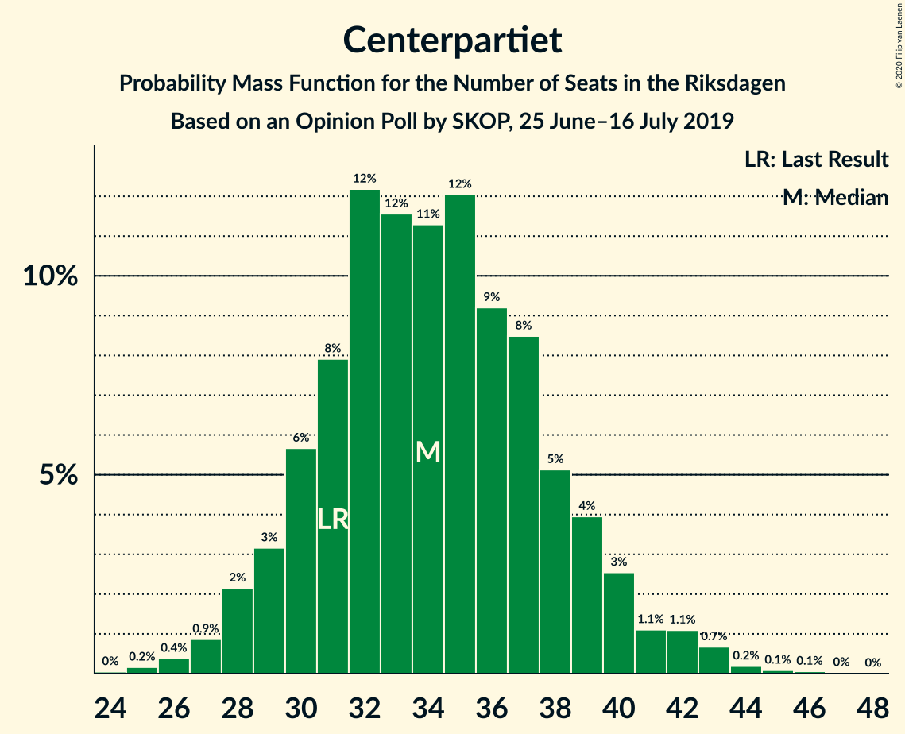
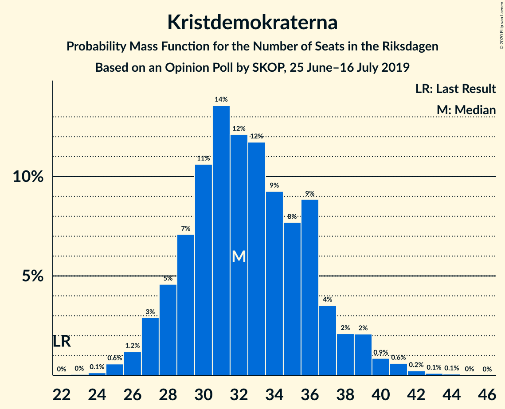
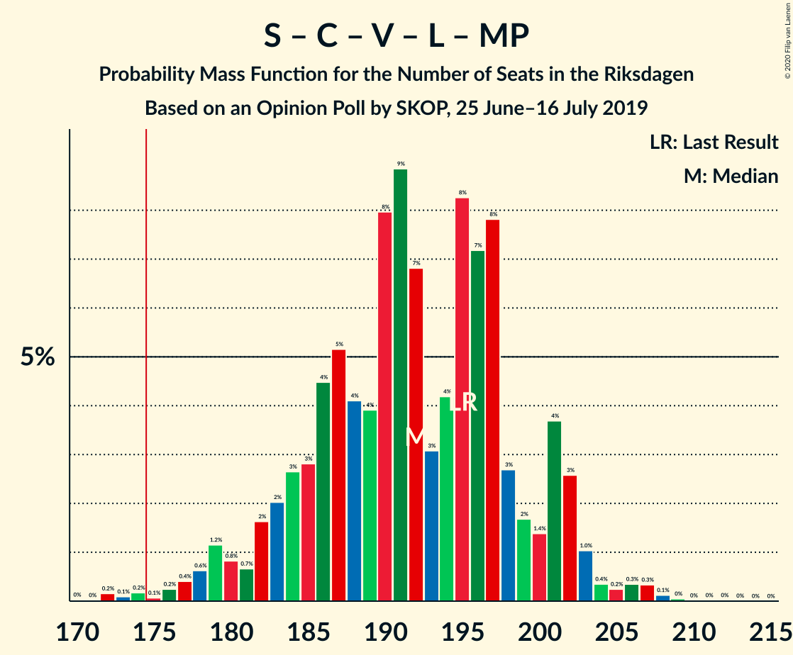

# Opinion Poll by SKOP, 25 June–16 July 2019

<a href="#voting-intentions">Voting Intentions</a> | <a href="#seats">Seats</a> | <a href="#coalitions">Coalitions</a> | <a href="#technical-information">Technical Information</a>

## Voting Intentions

### Confidence Intervals

| Party | Last Result | Poll Result | 80% Confidence Interval | 90% Confidence Interval | 95% Confidence Interval | 99% Confidence Interval |
|:-----:|:-----------:|:-----------:|:-----------------------:|:-----------------------:|:-----------------------:|:-----------------------:|
| Sveriges socialdemokratiska arbetareparti | 28.3% | 25.6% | 23.9–27.4% |23.4–27.9% |23.0–28.3% |22.2–29.2% |
| Sverigedemokraterna | 17.5% | 18.0% | 16.6–19.6% |16.2–20.1% |15.8–20.5% |15.2–21.3% |
| Moderata samlingspartiet | 19.8% | 17.0% | 15.6–18.5% |15.2–19.0% |14.8–19.4% |14.2–20.2% |
| Centerpartiet | 8.6% | 9.5% | 8.5–10.8% |8.2–11.2% |7.9–11.5% |7.4–12.1% |
| Kristdemokraterna | 6.3% | 9.2% | 8.1–10.4% |7.8–10.8% |7.6–11.1% |7.1–11.7% |
| Vänsterpartiet | 8.0% | 8.9% | 7.8–10.1% |7.5–10.5% |7.3–10.8% |6.8–11.4% |
| Liberalerna | 5.5% | 5.7% | 4.9–6.8% |4.7–7.1% |4.5–7.3% |4.1–7.8% |
| Miljöpartiet de gröna | 4.4% | 4.7% | 3.9–5.6% |3.7–5.9% |3.6–6.1% |3.2–6.6% |

*Note:* The poll result column reflects the actual value used in the calculations. Published results may vary slightly, and in addition be rounded to fewer digits.

## Seats

### Confidence Intervals

| Party | Last Result | Median | 80% Confidence Interval | 90% Confidence Interval | 95% Confidence Interval | 99% Confidence Interval |
|:-----:|:-----------:|:------:|:-----------------------:|:-----------------------:|:-----------------------:|:-----------------------:|
| <a href="#sveriges-socialdemokratiska-arbetareparti">Sveriges socialdemokratiska arbetareparti</a> | 100 | 89 | 84–97 |83–98 |82–100 |78–103 |
| <a href="#sverigedemokraterna">Sverigedemokraterna</a> | 62 | 64 | 59–69 |58–70 |56–72 |54–76 |
| <a href="#moderata-samlingspartiet">Moderata samlingspartiet</a> | 70 | 61 | 54–66 |53–68 |53–69 |50–73 |
| <a href="#centerpartiet">Centerpartiet</a> | 31 | 33 | 30–38 |29–39 |28–41 |26–43 |
| <a href="#kristdemokraterna">Kristdemokraterna</a> | 22 | 33 | 30–36 |28–37 |27–38 |25–41 |
| <a href="#vänsterpartiet">Vänsterpartiet</a> | 28 | 31 | 29–35 |28–36 |26–39 |24–40 |
| <a href="#liberalerna">Liberalerna</a> | 20 | 21 | 18–24 |17–25 |16–26 |14–27 |
| <a href="#miljöpartiet-de-gröna">Miljöpartiet de gröna</a> | 16 | 17 | 0–20 |0–21 |0–21 |0–23 |

### Sveriges socialdemokratiska arbetareparti

*For a full overview of the results for this party, see the [Sveriges socialdemokratiska arbetareparti](party-sverigessocialdemokratiskaarbetareparti.html) page.*

| Number of Seats | Probability | Accumulated | Special Marks |
|:---------------:|:-----------:|:-----------:|:-------------:|
| 76 | 0% | 100% |  |
| 77 | 0.1% | 99.9% |  |
| 78 | 0.4% | 99.8% |  |
| 79 | 0.2% | 99.3% |  |
| 80 | 0.8% | 99.1% |  |
| 81 | 0.7% | 98% |  |
| 82 | 1.4% | 98% |  |
| 83 | 5% | 96% |  |
| 84 | 2% | 91% |  |
| 85 | 6% | 89% |  |
| 86 | 9% | 83% |  |
| 87 | 11% | 75% |  |
| 88 | 5% | 63% |  |
| 89 | 9% | 59% | Median |
| 90 | 4% | 50% |  |
| 91 | 7% | 45% |  |
| 92 | 7% | 38% |  |
| 93 | 5% | 31% |  |
| 94 | 9% | 26% |  |
| 95 | 5% | 17% |  |
| 96 | 2% | 12% |  |
| 97 | 4% | 11% |  |
| 98 | 2% | 6% |  |
| 99 | 0.9% | 4% |  |
| 100 | 1.1% | 3% | Last Result |
| 101 | 0.6% | 2% |  |
| 102 | 0.5% | 1.1% |  |
| 103 | 0.3% | 0.6% |  |
| 104 | 0.1% | 0.4% |  |
| 105 | 0.1% | 0.3% |  |
| 106 | 0.1% | 0.2% |  |
| 107 | 0% | 0.1% |  |
| 108 | 0.1% | 0.1% |  |
| 109 | 0% | 0% |  |

### Sverigedemokraterna

*For a full overview of the results for this party, see the [Sverigedemokraterna](party-sverigedemokraterna.html) page.*

| Number of Seats | Probability | Accumulated | Special Marks |
|:---------------:|:-----------:|:-----------:|:-------------:|
| 51 | 0% | 100% |  |
| 52 | 0.1% | 99.9% |  |
| 53 | 0.1% | 99.8% |  |
| 54 | 0.3% | 99.7% |  |
| 55 | 2% | 99.4% |  |
| 56 | 1.0% | 98% |  |
| 57 | 1.5% | 97% |  |
| 58 | 4% | 95% |  |
| 59 | 2% | 92% |  |
| 60 | 11% | 90% |  |
| 61 | 9% | 78% |  |
| 62 | 8% | 69% | Last Result |
| 63 | 9% | 61% |  |
| 64 | 15% | 52% | Median |
| 65 | 9% | 37% |  |
| 66 | 9% | 28% |  |
| 67 | 4% | 19% |  |
| 68 | 2% | 14% |  |
| 69 | 6% | 12% |  |
| 70 | 2% | 6% |  |
| 71 | 1.0% | 4% |  |
| 72 | 0.9% | 3% |  |
| 73 | 0.4% | 2% |  |
| 74 | 0.4% | 1.4% |  |
| 75 | 0.5% | 1.0% |  |
| 76 | 0.4% | 0.5% |  |
| 77 | 0% | 0.2% |  |
| 78 | 0.1% | 0.1% |  |
| 79 | 0% | 0.1% |  |
| 80 | 0% | 0% |  |

### Moderata samlingspartiet

*For a full overview of the results for this party, see the [Moderata samlingspartiet](party-moderatasamlingspartiet.html) page.*

| Number of Seats | Probability | Accumulated | Special Marks |
|:---------------:|:-----------:|:-----------:|:-------------:|
| 48 | 0.2% | 100% |  |
| 49 | 0.3% | 99.8% |  |
| 50 | 0.2% | 99.5% |  |
| 51 | 0.5% | 99.3% |  |
| 52 | 1.3% | 98.8% |  |
| 53 | 6% | 98% |  |
| 54 | 3% | 92% |  |
| 55 | 1.4% | 89% |  |
| 56 | 5% | 87% |  |
| 57 | 5% | 82% |  |
| 58 | 3% | 77% |  |
| 59 | 4% | 74% |  |
| 60 | 5% | 70% |  |
| 61 | 17% | 65% | Median |
| 62 | 13% | 48% |  |
| 63 | 9% | 35% |  |
| 64 | 6% | 26% |  |
| 65 | 7% | 20% |  |
| 66 | 4% | 13% |  |
| 67 | 3% | 9% |  |
| 68 | 1.2% | 6% |  |
| 69 | 4% | 5% |  |
| 70 | 0.3% | 1.3% | Last Result |
| 71 | 0.3% | 1.0% |  |
| 72 | 0% | 0.6% |  |
| 73 | 0.5% | 0.6% |  |
| 74 | 0.1% | 0.1% |  |
| 75 | 0% | 0% |  |

### Centerpartiet

*For a full overview of the results for this party, see the [Centerpartiet](party-centerpartiet.html) page.*

| Number of Seats | Probability | Accumulated | Special Marks |
|:---------------:|:-----------:|:-----------:|:-------------:|
| 24 | 0% | 100% |  |
| 25 | 0.2% | 99.9% |  |
| 26 | 0.3% | 99.8% |  |
| 27 | 0.6% | 99.4% |  |
| 28 | 3% | 98.9% |  |
| 29 | 5% | 96% |  |
| 30 | 11% | 91% |  |
| 31 | 2% | 80% | Last Result |
| 32 | 15% | 78% |  |
| 33 | 14% | 63% | Median |
| 34 | 6% | 48% |  |
| 35 | 12% | 42% |  |
| 36 | 11% | 30% |  |
| 37 | 9% | 19% |  |
| 38 | 3% | 10% |  |
| 39 | 2% | 7% |  |
| 40 | 2% | 5% |  |
| 41 | 2% | 3% |  |
| 42 | 0.4% | 0.9% |  |
| 43 | 0.3% | 0.5% |  |
| 44 | 0.1% | 0.2% |  |
| 45 | 0.1% | 0.1% |  |
| 46 | 0% | 0.1% |  |
| 47 | 0% | 0% |  |

### Kristdemokraterna

*For a full overview of the results for this party, see the [Kristdemokraterna](party-kristdemokraterna.html) page.*

| Number of Seats | Probability | Accumulated | Special Marks |
|:---------------:|:-----------:|:-----------:|:-------------:|
| 22 | 0% | 100% | Last Result |
| 23 | 0.1% | 100% |  |
| 24 | 0.1% | 99.9% |  |
| 25 | 0.7% | 99.8% |  |
| 26 | 0.8% | 99.1% |  |
| 27 | 2% | 98% |  |
| 28 | 2% | 96% |  |
| 29 | 3% | 94% |  |
| 30 | 7% | 91% |  |
| 31 | 18% | 84% |  |
| 32 | 13% | 67% |  |
| 33 | 16% | 54% | Median |
| 34 | 8% | 38% |  |
| 35 | 11% | 30% |  |
| 36 | 12% | 19% |  |
| 37 | 3% | 6% |  |
| 38 | 1.4% | 4% |  |
| 39 | 0.7% | 2% |  |
| 40 | 0.6% | 1.5% |  |
| 41 | 0.4% | 0.8% |  |
| 42 | 0.3% | 0.5% |  |
| 43 | 0.1% | 0.2% |  |
| 44 | 0.1% | 0.1% |  |
| 45 | 0% | 0.1% |  |
| 46 | 0% | 0% |  |

### Vänsterpartiet

*For a full overview of the results for this party, see the [Vänsterpartiet](party-vänsterpartiet.html) page.*

| Number of Seats | Probability | Accumulated | Special Marks |
|:---------------:|:-----------:|:-----------:|:-------------:|
| 22 | 0.1% | 100% |  |
| 23 | 0.2% | 99.9% |  |
| 24 | 0.4% | 99.8% |  |
| 25 | 0.7% | 99.4% |  |
| 26 | 2% | 98.7% |  |
| 27 | 1.3% | 97% |  |
| 28 | 4% | 95% | Last Result |
| 29 | 15% | 92% |  |
| 30 | 15% | 76% |  |
| 31 | 17% | 61% | Median |
| 32 | 9% | 44% |  |
| 33 | 9% | 35% |  |
| 34 | 8% | 26% |  |
| 35 | 11% | 18% |  |
| 36 | 3% | 8% |  |
| 37 | 1.1% | 5% |  |
| 38 | 0.8% | 4% |  |
| 39 | 2% | 3% |  |
| 40 | 0.9% | 1.1% |  |
| 41 | 0.1% | 0.2% |  |
| 42 | 0% | 0.1% |  |
| 43 | 0.1% | 0.1% |  |
| 44 | 0% | 0% |  |

### Liberalerna

*For a full overview of the results for this party, see the [Liberalerna](party-liberalerna.html) page.*

| Number of Seats | Probability | Accumulated | Special Marks |
|:---------------:|:-----------:|:-----------:|:-------------:|
| 0 | 0.5% | 100% |  |
| 1 | 0% | 99.5% |  |
| 2 | 0% | 99.5% |  |
| 3 | 0% | 99.5% |  |
| 4 | 0% | 99.5% |  |
| 5 | 0% | 99.5% |  |
| 6 | 0% | 99.5% |  |
| 7 | 0% | 99.5% |  |
| 8 | 0% | 99.5% |  |
| 9 | 0% | 99.5% |  |
| 10 | 0% | 99.5% |  |
| 11 | 0% | 99.5% |  |
| 12 | 0% | 99.5% |  |
| 13 | 0% | 99.5% |  |
| 14 | 0.4% | 99.5% |  |
| 15 | 1.1% | 99.1% |  |
| 16 | 1.4% | 98% |  |
| 17 | 4% | 97% |  |
| 18 | 12% | 93% |  |
| 19 | 8% | 81% |  |
| 20 | 15% | 72% | Last Result |
| 21 | 24% | 57% | Median |
| 22 | 13% | 34% |  |
| 23 | 4% | 21% |  |
| 24 | 10% | 17% |  |
| 25 | 4% | 7% |  |
| 26 | 2% | 3% |  |
| 27 | 0.5% | 0.9% |  |
| 28 | 0.1% | 0.4% |  |
| 29 | 0.2% | 0.2% |  |
| 30 | 0% | 0.1% |  |
| 31 | 0% | 0% |  |

### Miljöpartiet de gröna

*For a full overview of the results for this party, see the [Miljöpartiet de gröna](party-miljöpartietdegröna.html) page.*

| Number of Seats | Probability | Accumulated | Special Marks |
|:---------------:|:-----------:|:-----------:|:-------------:|
| 0 | 11% | 100% |  |
| 1 | 0% | 89% |  |
| 2 | 0% | 89% |  |
| 3 | 0% | 89% |  |
| 4 | 0% | 89% |  |
| 5 | 0% | 89% |  |
| 6 | 0% | 89% |  |
| 7 | 0% | 89% |  |
| 8 | 0% | 89% |  |
| 9 | 0% | 89% |  |
| 10 | 0% | 89% |  |
| 11 | 0% | 89% |  |
| 12 | 0% | 89% |  |
| 13 | 0% | 89% |  |
| 14 | 2% | 89% |  |
| 15 | 20% | 88% |  |
| 16 | 3% | 68% | Last Result |
| 17 | 32% | 65% | Median |
| 18 | 4% | 33% |  |
| 19 | 17% | 28% |  |
| 20 | 6% | 12% |  |
| 21 | 3% | 6% |  |
| 22 | 0.9% | 2% |  |
| 23 | 1.0% | 1.3% |  |
| 24 | 0.1% | 0.3% |  |
| 25 | 0.1% | 0.1% |  |
| 26 | 0.1% | 0.1% |  |
| 27 | 0% | 0% |  |

## Coalitions

### Confidence Intervals

| Coalition | Last Result | Median | Majority? | 80% Confidence Interval | 90% Confidence Interval | 95% Confidence Interval | 99% Confidence Interval |
|:---------:|:-----------:|:------:|:---------:|:-----------------------:|:-----------------------:|:-----------------------:|:-----------------------:|
| Sveriges socialdemokratiska arbetareparti – Centerpartiet – Vänsterpartiet – Liberalerna – Miljöpartiet de gröna | 195 | 191 | 99.3% | 185–199 | 180–202 | 179–203 | 174–206 |
| Sveriges socialdemokratiska arbetareparti – Moderata samlingspartiet – Centerpartiet | 201 | 184 | 98% | 178–192 | 176–195 | 175–197 | 171–203 |
| Sveriges socialdemokratiska arbetareparti – Centerpartiet – Liberalerna – Miljöpartiet de gröna | 167 | 160 | 0.6% | 152–167 | 149–169 | 146–171 | 143–175 |
| Sverigedemokraterna – Moderata samlingspartiet – Kristdemokraterna | 154 | 158 | 0.7% | 150–164 | 147–169 | 146–170 | 143–175 |
| Sveriges socialdemokratiska arbetareparti – Moderata samlingspartiet | 170 | 150 | 0% | 144–158 | 142–159 | 140–162 | 137–166 |
| Moderata samlingspartiet – Centerpartiet – Kristdemokraterna – Liberalerna | 143 | 149 | 0% | 139–155 | 138–156 | 137–160 | 132–165 |
| Sveriges socialdemokratiska arbetareparti – Vänsterpartiet – Miljöpartiet de gröna | 144 | 138 | 0% | 130–146 | 125–147 | 124–148 | 117–153 |
| Moderata samlingspartiet – Centerpartiet – Kristdemokraterna | 123 | 128 | 0% | 119–134 | 119–136 | 117–139 | 114–144 |
| Sverigedemokraterna – Moderata samlingspartiet | 132 | 125 | 0% | 118–132 | 117–134 | 114–136 | 111–140 |
| Sveriges socialdemokratiska arbetareparti – Vänsterpartiet | 128 | 121 | 0% | 115–130 | 114–131 | 112–132 | 108–138 |
| Moderata samlingspartiet – Centerpartiet – Liberalerna | 121 | 116 | 0% | 107–121 | 106–123 | 105–126 | 100–130 |
| Sveriges socialdemokratiska arbetareparti – Miljöpartiet de gröna | 116 | 105 | 0% | 97–113 | 92–114 | 91–117 | 86–120 |
| Moderata samlingspartiet – Centerpartiet | 101 | 95 | 0% | 88–101 | 87–104 | 86–106 | 82–109 |

### Sveriges socialdemokratiska arbetareparti – Centerpartiet – Vänsterpartiet – Liberalerna – Miljöpartiet de gröna

| Number of Seats | Probability | Accumulated | Special Marks |
|:---------------:|:-----------:|:-----------:|:-------------:|
| 172 | 0.1% | 100% |  |
| 173 | 0.2% | 99.9% |  |
| 174 | 0.4% | 99.7% |  |
| 175 | 0.1% | 99.3% | Majority |
| 176 | 0.1% | 99.3% |  |
| 177 | 0.5% | 99.2% |  |
| 178 | 0.1% | 98.7% |  |
| 179 | 2% | 98.6% |  |
| 180 | 1.3% | 96% |  |
| 181 | 0.8% | 95% |  |
| 182 | 0.8% | 94% |  |
| 183 | 1.1% | 93% |  |
| 184 | 1.0% | 92% |  |
| 185 | 3% | 91% |  |
| 186 | 6% | 88% |  |
| 187 | 14% | 82% |  |
| 188 | 1.1% | 68% |  |
| 189 | 2% | 67% |  |
| 190 | 5% | 65% |  |
| 191 | 12% | 59% | Median |
| 192 | 6% | 48% |  |
| 193 | 5% | 41% |  |
| 194 | 1.4% | 37% |  |
| 195 | 2% | 35% | Last Result |
| 196 | 7% | 34% |  |
| 197 | 12% | 27% |  |
| 198 | 5% | 15% |  |
| 199 | 2% | 10% |  |
| 200 | 0.6% | 8% |  |
| 201 | 2% | 8% |  |
| 202 | 3% | 6% |  |
| 203 | 2% | 3% |  |
| 204 | 0.4% | 1.1% |  |
| 205 | 0.2% | 0.7% |  |
| 206 | 0.1% | 0.5% |  |
| 207 | 0.2% | 0.5% |  |
| 208 | 0.2% | 0.3% |  |
| 209 | 0.1% | 0.1% |  |
| 210 | 0% | 0% |  |

### Sveriges socialdemokratiska arbetareparti – Moderata samlingspartiet – Centerpartiet

| Number of Seats | Probability | Accumulated | Special Marks |
|:---------------:|:-----------:|:-----------:|:-------------:|
| 167 | 0% | 100% |  |
| 168 | 0.1% | 99.9% |  |
| 169 | 0.1% | 99.8% |  |
| 170 | 0.2% | 99.7% |  |
| 171 | 0.2% | 99.5% |  |
| 172 | 0.5% | 99.3% |  |
| 173 | 0.2% | 98.8% |  |
| 174 | 0.7% | 98.5% |  |
| 175 | 1.3% | 98% | Majority |
| 176 | 3% | 97% |  |
| 177 | 3% | 93% |  |
| 178 | 3% | 91% |  |
| 179 | 2% | 87% |  |
| 180 | 6% | 85% |  |
| 181 | 9% | 79% |  |
| 182 | 10% | 70% |  |
| 183 | 4% | 60% | Median |
| 184 | 9% | 56% |  |
| 185 | 6% | 47% |  |
| 186 | 4% | 41% |  |
| 187 | 13% | 37% |  |
| 188 | 1.2% | 24% |  |
| 189 | 6% | 23% |  |
| 190 | 2% | 17% |  |
| 191 | 3% | 15% |  |
| 192 | 2% | 11% |  |
| 193 | 3% | 9% |  |
| 194 | 0.6% | 6% |  |
| 195 | 1.2% | 6% |  |
| 196 | 0.7% | 5% |  |
| 197 | 2% | 4% |  |
| 198 | 0.7% | 2% |  |
| 199 | 0.5% | 2% |  |
| 200 | 0.1% | 1.1% |  |
| 201 | 0.2% | 1.1% | Last Result |
| 202 | 0.3% | 0.9% |  |
| 203 | 0.1% | 0.6% |  |
| 204 | 0.2% | 0.4% |  |
| 205 | 0.1% | 0.3% |  |
| 206 | 0.1% | 0.2% |  |
| 207 | 0% | 0.1% |  |
| 208 | 0% | 0.1% |  |
| 209 | 0% | 0.1% |  |
| 210 | 0% | 0% |  |

### Sveriges socialdemokratiska arbetareparti – Centerpartiet – Liberalerna – Miljöpartiet de gröna

| Number of Seats | Probability | Accumulated | Special Marks |
|:---------------:|:-----------:|:-----------:|:-------------:|
| 137 | 0% | 100% |  |
| 138 | 0% | 99.9% |  |
| 139 | 0% | 99.9% |  |
| 140 | 0% | 99.9% |  |
| 141 | 0.1% | 99.9% |  |
| 142 | 0% | 99.8% |  |
| 143 | 0.4% | 99.7% |  |
| 144 | 0.5% | 99.3% |  |
| 145 | 0% | 98.8% |  |
| 146 | 3% | 98.8% |  |
| 147 | 0.6% | 96% |  |
| 148 | 0.5% | 96% |  |
| 149 | 0.9% | 95% |  |
| 150 | 2% | 94% |  |
| 151 | 1.3% | 93% |  |
| 152 | 3% | 91% |  |
| 153 | 1.4% | 89% |  |
| 154 | 1.3% | 87% |  |
| 155 | 1.2% | 86% |  |
| 156 | 4% | 85% |  |
| 157 | 9% | 80% |  |
| 158 | 11% | 71% |  |
| 159 | 8% | 60% |  |
| 160 | 6% | 52% | Median |
| 161 | 9% | 46% |  |
| 162 | 5% | 37% |  |
| 163 | 5% | 32% |  |
| 164 | 4% | 27% |  |
| 165 | 2% | 23% |  |
| 166 | 8% | 22% |  |
| 167 | 6% | 14% | Last Result |
| 168 | 2% | 8% |  |
| 169 | 2% | 6% |  |
| 170 | 0.7% | 4% |  |
| 171 | 1.2% | 3% |  |
| 172 | 1.1% | 2% |  |
| 173 | 0.4% | 1.1% |  |
| 174 | 0.1% | 0.7% |  |
| 175 | 0.1% | 0.6% | Majority |
| 176 | 0.2% | 0.4% |  |
| 177 | 0% | 0.2% |  |
| 178 | 0.1% | 0.2% |  |
| 179 | 0.1% | 0.1% |  |
| 180 | 0% | 0.1% |  |
| 181 | 0% | 0% |  |

### Sverigedemokraterna – Moderata samlingspartiet – Kristdemokraterna

| Number of Seats | Probability | Accumulated | Special Marks |
|:---------------:|:-----------:|:-----------:|:-------------:|
| 140 | 0.1% | 100% |  |
| 141 | 0.2% | 99.9% |  |
| 142 | 0.2% | 99.7% |  |
| 143 | 0.1% | 99.5% |  |
| 144 | 0.2% | 99.5% |  |
| 145 | 0.4% | 99.3% |  |
| 146 | 2% | 98.9% |  |
| 147 | 3% | 97% |  |
| 148 | 2% | 94% |  |
| 149 | 0.6% | 92% |  |
| 150 | 2% | 92% |  |
| 151 | 5% | 90% |  |
| 152 | 12% | 85% |  |
| 153 | 7% | 73% |  |
| 154 | 2% | 66% | Last Result |
| 155 | 1.4% | 65% |  |
| 156 | 5% | 63% |  |
| 157 | 6% | 59% |  |
| 158 | 12% | 52% | Median |
| 159 | 5% | 41% |  |
| 160 | 2% | 35% |  |
| 161 | 1.1% | 33% |  |
| 162 | 14% | 32% |  |
| 163 | 6% | 18% |  |
| 164 | 3% | 12% |  |
| 165 | 1.0% | 9% |  |
| 166 | 1.1% | 8% |  |
| 167 | 0.8% | 7% |  |
| 168 | 0.8% | 6% |  |
| 169 | 1.3% | 5% |  |
| 170 | 2% | 4% |  |
| 171 | 0.1% | 1.4% |  |
| 172 | 0.5% | 1.3% |  |
| 173 | 0.1% | 0.8% |  |
| 174 | 0.1% | 0.7% |  |
| 175 | 0.4% | 0.7% | Majority |
| 176 | 0.2% | 0.3% |  |
| 177 | 0.1% | 0.1% |  |
| 178 | 0% | 0% |  |

### Sveriges socialdemokratiska arbetareparti – Moderata samlingspartiet

| Number of Seats | Probability | Accumulated | Special Marks |
|:---------------:|:-----------:|:-----------:|:-------------:|
| 133 | 0% | 100% |  |
| 134 | 0% | 99.9% |  |
| 135 | 0.2% | 99.9% |  |
| 136 | 0.1% | 99.7% |  |
| 137 | 0.2% | 99.6% |  |
| 138 | 0.3% | 99.4% |  |
| 139 | 0.4% | 99.1% |  |
| 140 | 1.2% | 98.7% |  |
| 141 | 0.9% | 97% |  |
| 142 | 3% | 97% |  |
| 143 | 2% | 93% |  |
| 144 | 9% | 92% |  |
| 145 | 1.1% | 83% |  |
| 146 | 2% | 82% |  |
| 147 | 7% | 80% |  |
| 148 | 5% | 73% |  |
| 149 | 14% | 68% |  |
| 150 | 7% | 54% | Median |
| 151 | 6% | 47% |  |
| 152 | 2% | 40% |  |
| 153 | 3% | 39% |  |
| 154 | 4% | 36% |  |
| 155 | 6% | 32% |  |
| 156 | 4% | 26% |  |
| 157 | 11% | 22% |  |
| 158 | 5% | 11% |  |
| 159 | 2% | 6% |  |
| 160 | 0.8% | 5% |  |
| 161 | 1.2% | 4% |  |
| 162 | 0.7% | 3% |  |
| 163 | 0.1% | 2% |  |
| 164 | 0.8% | 2% |  |
| 165 | 0.1% | 1.1% |  |
| 166 | 0.5% | 1.0% |  |
| 167 | 0.1% | 0.5% |  |
| 168 | 0.2% | 0.4% |  |
| 169 | 0% | 0.2% |  |
| 170 | 0% | 0.2% | Last Result |
| 171 | 0% | 0.2% |  |
| 172 | 0.1% | 0.2% |  |
| 173 | 0% | 0% |  |

### Moderata samlingspartiet – Centerpartiet – Kristdemokraterna – Liberalerna

| Number of Seats | Probability | Accumulated | Special Marks |
|:---------------:|:-----------:|:-----------:|:-------------:|
| 130 | 0.1% | 100% |  |
| 131 | 0.1% | 99.9% |  |
| 132 | 0.5% | 99.7% |  |
| 133 | 0.1% | 99.2% |  |
| 134 | 0.2% | 99.1% |  |
| 135 | 0.5% | 99.0% |  |
| 136 | 0.5% | 98% |  |
| 137 | 2% | 98% |  |
| 138 | 1.0% | 96% |  |
| 139 | 5% | 95% |  |
| 140 | 1.2% | 90% |  |
| 141 | 3% | 88% |  |
| 142 | 2% | 85% |  |
| 143 | 4% | 83% | Last Result |
| 144 | 6% | 79% |  |
| 145 | 2% | 74% |  |
| 146 | 8% | 72% |  |
| 147 | 3% | 63% |  |
| 148 | 8% | 61% | Median |
| 149 | 10% | 52% |  |
| 150 | 6% | 42% |  |
| 151 | 3% | 36% |  |
| 152 | 10% | 32% |  |
| 153 | 4% | 22% |  |
| 154 | 6% | 19% |  |
| 155 | 6% | 12% |  |
| 156 | 1.4% | 6% |  |
| 157 | 1.0% | 5% |  |
| 158 | 0.6% | 4% |  |
| 159 | 0.4% | 3% |  |
| 160 | 1.0% | 3% |  |
| 161 | 0.1% | 2% |  |
| 162 | 0.6% | 2% |  |
| 163 | 0.2% | 1.3% |  |
| 164 | 0.4% | 1.1% |  |
| 165 | 0.6% | 0.7% |  |
| 166 | 0.1% | 0.1% |  |
| 167 | 0% | 0.1% |  |
| 168 | 0% | 0.1% |  |
| 169 | 0% | 0% |  |

### Sveriges socialdemokratiska arbetareparti – Vänsterpartiet – Miljöpartiet de gröna

| Number of Seats | Probability | Accumulated | Special Marks |
|:---------------:|:-----------:|:-----------:|:-------------:|
| 114 | 0% | 100% |  |
| 115 | 0% | 99.9% |  |
| 116 | 0% | 99.9% |  |
| 117 | 0.4% | 99.9% |  |
| 118 | 0.2% | 99.5% |  |
| 119 | 0.1% | 99.3% |  |
| 120 | 0% | 99.2% |  |
| 121 | 0% | 99.2% |  |
| 122 | 1.2% | 99.2% |  |
| 123 | 0.5% | 98% |  |
| 124 | 0.6% | 98% |  |
| 125 | 3% | 97% |  |
| 126 | 0.3% | 94% |  |
| 127 | 2% | 94% |  |
| 128 | 0.1% | 92% |  |
| 129 | 1.0% | 92% |  |
| 130 | 2% | 91% |  |
| 131 | 8% | 89% |  |
| 132 | 2% | 82% |  |
| 133 | 9% | 80% |  |
| 134 | 9% | 71% |  |
| 135 | 4% | 61% |  |
| 136 | 0.8% | 58% |  |
| 137 | 4% | 57% | Median |
| 138 | 9% | 53% |  |
| 139 | 3% | 44% |  |
| 140 | 9% | 41% |  |
| 141 | 10% | 32% |  |
| 142 | 6% | 22% |  |
| 143 | 0.7% | 16% |  |
| 144 | 0.6% | 15% | Last Result |
| 145 | 4% | 15% |  |
| 146 | 3% | 10% |  |
| 147 | 3% | 7% |  |
| 148 | 1.5% | 4% |  |
| 149 | 0.4% | 2% |  |
| 150 | 1.1% | 2% |  |
| 151 | 0.1% | 0.7% |  |
| 152 | 0.1% | 0.6% |  |
| 153 | 0.4% | 0.6% |  |
| 154 | 0.1% | 0.2% |  |
| 155 | 0.1% | 0.1% |  |
| 156 | 0% | 0% |  |

### Moderata samlingspartiet – Centerpartiet – Kristdemokraterna

| Number of Seats | Probability | Accumulated | Special Marks |
|:---------------:|:-----------:|:-----------:|:-------------:|
| 110 | 0% | 100% |  |
| 111 | 0.1% | 99.9% |  |
| 112 | 0.1% | 99.8% |  |
| 113 | 0.1% | 99.7% |  |
| 114 | 0.2% | 99.5% |  |
| 115 | 0.5% | 99.4% |  |
| 116 | 0.4% | 98.9% |  |
| 117 | 1.4% | 98.5% |  |
| 118 | 2% | 97% |  |
| 119 | 6% | 95% |  |
| 120 | 2% | 90% |  |
| 121 | 5% | 88% |  |
| 122 | 3% | 83% |  |
| 123 | 1.3% | 80% | Last Result |
| 124 | 5% | 78% |  |
| 125 | 5% | 74% |  |
| 126 | 8% | 69% |  |
| 127 | 9% | 61% | Median |
| 128 | 9% | 52% |  |
| 129 | 5% | 43% |  |
| 130 | 8% | 38% |  |
| 131 | 11% | 29% |  |
| 132 | 2% | 18% |  |
| 133 | 4% | 15% |  |
| 134 | 2% | 11% |  |
| 135 | 2% | 9% |  |
| 136 | 3% | 7% |  |
| 137 | 1.1% | 4% |  |
| 138 | 0.5% | 3% |  |
| 139 | 0.3% | 3% |  |
| 140 | 0.4% | 2% |  |
| 141 | 0.3% | 2% |  |
| 142 | 0.5% | 2% |  |
| 143 | 0.6% | 1.2% |  |
| 144 | 0.5% | 0.6% |  |
| 145 | 0% | 0.1% |  |
| 146 | 0% | 0.1% |  |
| 147 | 0% | 0.1% |  |
| 148 | 0% | 0% |  |

### Sverigedemokraterna – Moderata samlingspartiet

| Number of Seats | Probability | Accumulated | Special Marks |
|:---------------:|:-----------:|:-----------:|:-------------:|
| 108 | 0% | 100% |  |
| 109 | 0.2% | 99.9% |  |
| 110 | 0% | 99.7% |  |
| 111 | 0.2% | 99.7% |  |
| 112 | 0.2% | 99.5% |  |
| 113 | 1.0% | 99.2% |  |
| 114 | 2% | 98% |  |
| 115 | 0.5% | 97% |  |
| 116 | 1.0% | 96% |  |
| 117 | 4% | 95% |  |
| 118 | 7% | 91% |  |
| 119 | 1.4% | 84% |  |
| 120 | 3% | 83% |  |
| 121 | 9% | 80% |  |
| 122 | 12% | 71% |  |
| 123 | 1.1% | 58% |  |
| 124 | 4% | 57% |  |
| 125 | 11% | 53% | Median |
| 126 | 14% | 42% |  |
| 127 | 0.5% | 29% |  |
| 128 | 5% | 28% |  |
| 129 | 5% | 23% |  |
| 130 | 5% | 18% |  |
| 131 | 0.5% | 13% |  |
| 132 | 4% | 13% | Last Result |
| 133 | 2% | 8% |  |
| 134 | 3% | 6% |  |
| 135 | 0.7% | 4% |  |
| 136 | 0.8% | 3% |  |
| 137 | 0.7% | 2% |  |
| 138 | 0.5% | 1.4% |  |
| 139 | 0.1% | 0.8% |  |
| 140 | 0.4% | 0.7% |  |
| 141 | 0.1% | 0.3% |  |
| 142 | 0.1% | 0.2% |  |
| 143 | 0% | 0.1% |  |
| 144 | 0% | 0.1% |  |
| 145 | 0% | 0% |  |

### Sveriges socialdemokratiska arbetareparti – Vänsterpartiet

| Number of Seats | Probability | Accumulated | Special Marks |
|:---------------:|:-----------:|:-----------:|:-------------:|
| 105 | 0.1% | 100% |  |
| 106 | 0% | 99.9% |  |
| 107 | 0.1% | 99.9% |  |
| 108 | 0.6% | 99.7% |  |
| 109 | 0.2% | 99.1% |  |
| 110 | 0.2% | 98.9% |  |
| 111 | 0.2% | 98.8% |  |
| 112 | 1.3% | 98.5% |  |
| 113 | 0.8% | 97% |  |
| 114 | 5% | 96% |  |
| 115 | 6% | 91% |  |
| 116 | 9% | 85% |  |
| 117 | 3% | 76% |  |
| 118 | 2% | 72% |  |
| 119 | 6% | 71% |  |
| 120 | 9% | 64% | Median |
| 121 | 9% | 55% |  |
| 122 | 5% | 46% |  |
| 123 | 5% | 41% |  |
| 124 | 3% | 36% |  |
| 125 | 6% | 33% |  |
| 126 | 9% | 27% |  |
| 127 | 4% | 18% |  |
| 128 | 1.0% | 15% | Last Result |
| 129 | 3% | 13% |  |
| 130 | 1.5% | 10% |  |
| 131 | 5% | 9% |  |
| 132 | 2% | 4% |  |
| 133 | 0.5% | 2% |  |
| 134 | 0.4% | 2% |  |
| 135 | 0.2% | 1.1% |  |
| 136 | 0.2% | 0.9% |  |
| 137 | 0.1% | 0.7% |  |
| 138 | 0.1% | 0.6% |  |
| 139 | 0.3% | 0.5% |  |
| 140 | 0.1% | 0.1% |  |
| 141 | 0% | 0% |  |

### Moderata samlingspartiet – Centerpartiet – Liberalerna

| Number of Seats | Probability | Accumulated | Special Marks |
|:---------------:|:-----------:|:-----------:|:-------------:|
| 97 | 0% | 100% |  |
| 98 | 0.4% | 99.9% |  |
| 99 | 0% | 99.6% |  |
| 100 | 0.2% | 99.5% |  |
| 101 | 0.3% | 99.4% |  |
| 102 | 0.3% | 99.1% |  |
| 103 | 0.5% | 98.8% |  |
| 104 | 0.4% | 98% |  |
| 105 | 3% | 98% |  |
| 106 | 4% | 95% |  |
| 107 | 1.4% | 91% |  |
| 108 | 3% | 90% |  |
| 109 | 1.1% | 87% |  |
| 110 | 3% | 85% |  |
| 111 | 3% | 83% |  |
| 112 | 2% | 79% |  |
| 113 | 10% | 78% |  |
| 114 | 8% | 67% |  |
| 115 | 3% | 59% | Median |
| 116 | 13% | 56% |  |
| 117 | 5% | 43% |  |
| 118 | 8% | 38% |  |
| 119 | 11% | 30% |  |
| 120 | 5% | 19% |  |
| 121 | 6% | 14% | Last Result |
| 122 | 3% | 8% |  |
| 123 | 1.2% | 6% |  |
| 124 | 0.6% | 4% |  |
| 125 | 0.6% | 4% |  |
| 126 | 0.8% | 3% |  |
| 127 | 0.4% | 2% |  |
| 128 | 0.8% | 2% |  |
| 129 | 0.6% | 1.3% |  |
| 130 | 0.2% | 0.7% |  |
| 131 | 0.3% | 0.4% |  |
| 132 | 0% | 0.1% |  |
| 133 | 0% | 0.1% |  |
| 134 | 0% | 0% |  |

### Sveriges socialdemokratiska arbetareparti – Miljöpartiet de gröna

| Number of Seats | Probability | Accumulated | Special Marks |
|:---------------:|:-----------:|:-----------:|:-------------:|
| 83 | 0% | 100% |  |
| 84 | 0% | 99.9% |  |
| 85 | 0% | 99.9% |  |
| 86 | 0.5% | 99.9% |  |
| 87 | 0.4% | 99.4% |  |
| 88 | 0.1% | 99.0% |  |
| 89 | 0.2% | 98.8% |  |
| 90 | 0.2% | 98.7% |  |
| 91 | 1.3% | 98% |  |
| 92 | 2% | 97% |  |
| 93 | 0.9% | 95% |  |
| 94 | 0.4% | 94% |  |
| 95 | 1.4% | 93% |  |
| 96 | 0.3% | 92% |  |
| 97 | 3% | 92% |  |
| 98 | 0.9% | 89% |  |
| 99 | 1.3% | 88% |  |
| 100 | 6% | 87% |  |
| 101 | 3% | 81% |  |
| 102 | 1.1% | 77% |  |
| 103 | 5% | 76% |  |
| 104 | 15% | 71% |  |
| 105 | 6% | 56% |  |
| 106 | 4% | 49% | Median |
| 107 | 4% | 46% |  |
| 108 | 5% | 42% |  |
| 109 | 14% | 37% |  |
| 110 | 3% | 24% |  |
| 111 | 3% | 20% |  |
| 112 | 6% | 17% |  |
| 113 | 3% | 11% |  |
| 114 | 4% | 9% |  |
| 115 | 1.0% | 5% |  |
| 116 | 0.9% | 4% | Last Result |
| 117 | 1.4% | 3% |  |
| 118 | 0.8% | 1.4% |  |
| 119 | 0.1% | 0.7% |  |
| 120 | 0.3% | 0.6% |  |
| 121 | 0.1% | 0.3% |  |
| 122 | 0.1% | 0.2% |  |
| 123 | 0% | 0.1% |  |
| 124 | 0% | 0.1% |  |
| 125 | 0% | 0% |  |

### Moderata samlingspartiet – Centerpartiet

| Number of Seats | Probability | Accumulated | Special Marks |
|:---------------:|:-----------:|:-----------:|:-------------:|
| 79 | 0.1% | 100% |  |
| 80 | 0.1% | 99.9% |  |
| 81 | 0.3% | 99.8% |  |
| 82 | 0.2% | 99.5% |  |
| 83 | 0.1% | 99.4% |  |
| 84 | 0.3% | 99.3% |  |
| 85 | 0.5% | 99.0% |  |
| 86 | 2% | 98% |  |
| 87 | 5% | 96% |  |
| 88 | 8% | 92% |  |
| 89 | 5% | 84% |  |
| 90 | 2% | 79% |  |
| 91 | 0.8% | 77% |  |
| 92 | 2% | 76% |  |
| 93 | 7% | 74% |  |
| 94 | 5% | 67% | Median |
| 95 | 18% | 62% |  |
| 96 | 15% | 44% |  |
| 97 | 9% | 29% |  |
| 98 | 7% | 21% |  |
| 99 | 1.2% | 14% |  |
| 100 | 0.7% | 13% |  |
| 101 | 3% | 12% | Last Result |
| 102 | 2% | 9% |  |
| 103 | 2% | 7% |  |
| 104 | 2% | 6% |  |
| 105 | 1.0% | 4% |  |
| 106 | 1.4% | 3% |  |
| 107 | 0.5% | 1.2% |  |
| 108 | 0.1% | 0.7% |  |
| 109 | 0.5% | 0.7% |  |
| 110 | 0.1% | 0.2% |  |
| 111 | 0% | 0.1% |  |
| 112 | 0% | 0.1% |  |
| 113 | 0% | 0% |  |

## Technical Information

### Opinion Poll

+ **Polling firm:** SKOP
+ **Commissioner(s):** —
+ **Fieldwork period:** 25 June–16 July 2019

### Calculations

+ **Sample size:** 1048
+ **Simulations done:** 262,144
+ **Error estimate:** 1.34%

