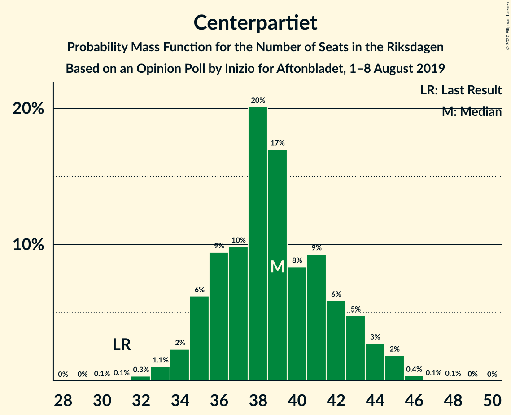
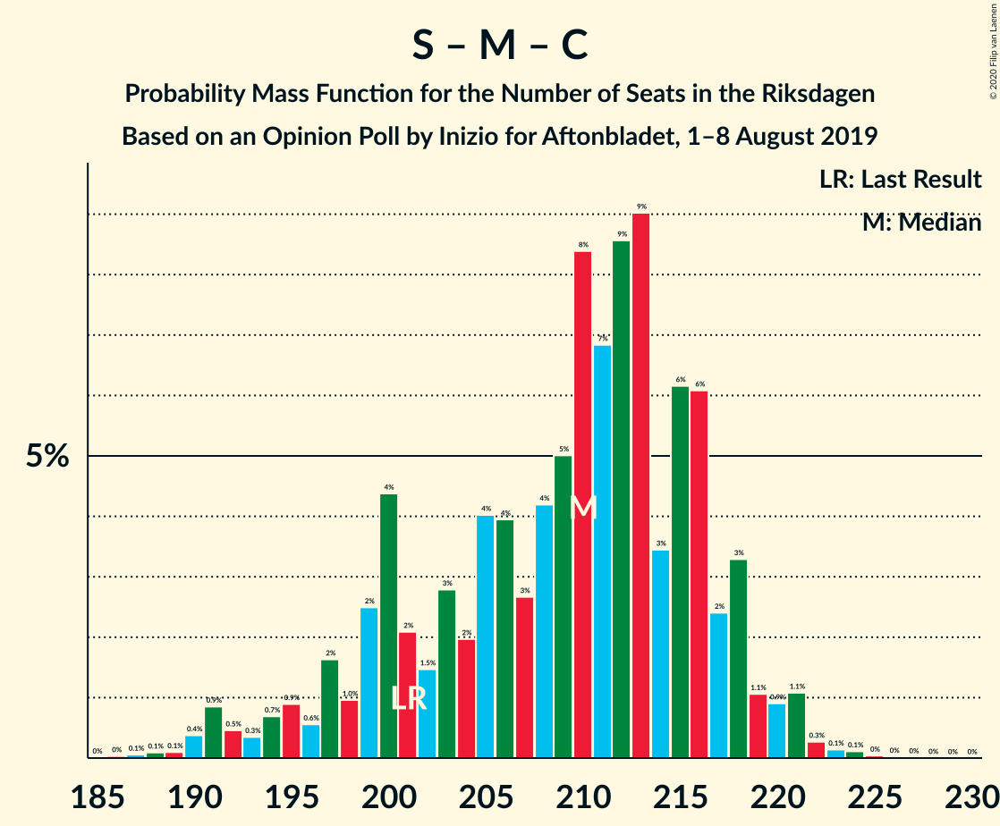
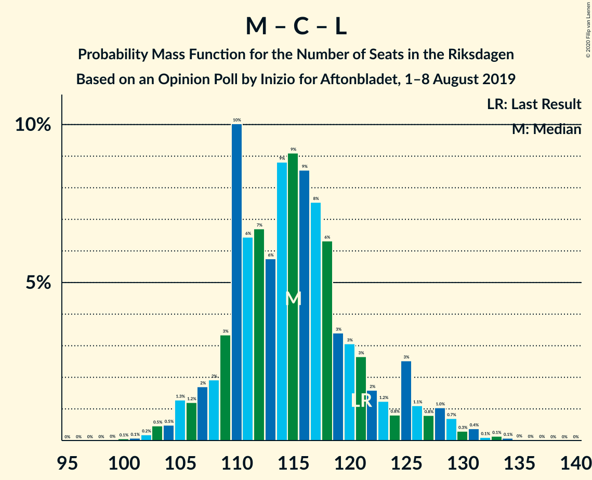

# Opinion Poll by Inizio for Aftonbladet, 1–8 August 2019

<a href="#voting-intentions">Voting Intentions</a> | <a href="#seats">Seats</a> | <a href="#coalitions">Coalitions</a> | <a href="#technical-information">Technical Information</a>

## Voting Intentions

### Confidence Intervals

| Party | Last Result | Poll Result | 80% Confidence Interval | 90% Confidence Interval | 95% Confidence Interval | 99% Confidence Interval |
|:-----:|:-----------:|:-----------:|:-----------------------:|:-----------------------:|:-----------------------:|:-----------------------:|
| Sveriges socialdemokratiska arbetareparti | 28.3% | 25.6% | 24.4–26.9% |24.1–27.3% |23.8–27.6% |23.2–28.2% |
| Sverigedemokraterna | 17.5% | 19.7% | 18.6–20.9% |18.3–21.2% |18.0–21.5% |17.5–22.0% |
| Moderata samlingspartiet | 19.8% | 19.6% | 18.5–20.8% |18.2–21.1% |18.0–21.4% |17.4–21.9% |
| Centerpartiet | 8.6% | 10.3% | 9.5–11.2% |9.3–11.5% |9.1–11.7% |8.7–12.1% |
| Vänsterpartiet | 8.0% | 8.5% | 7.8–9.4% |7.6–9.6% |7.4–9.8% |7.1–10.2% |
| Kristdemokraterna | 6.3% | 7.3% | 6.6–8.1% |6.4–8.3% |6.3–8.5% |6.0–8.9% |
| Liberalerna | 5.5% | 3.6% | 3.1–4.2% |3.0–4.4% |2.9–4.5% |2.7–4.8% |
| Miljöpartiet de gröna | 4.4% | 3.6% | 3.1–4.2% |3.0–4.4% |2.9–4.5% |2.7–4.8% |

*Note:* The poll result column reflects the actual value used in the calculations. Published results may vary slightly, and in addition be rounded to fewer digits.

## Seats

### Confidence Intervals

| Party | Last Result | Median | 80% Confidence Interval | 90% Confidence Interval | 95% Confidence Interval | 99% Confidence Interval |
|:-----:|:-----------:|:------:|:-----------------------:|:-----------------------:|:-----------------------:|:-----------------------:|
| <a href="#sveriges-socialdemokratiska-arbetareparti">Sveriges socialdemokratiska arbetareparti</a> | 100 | 97 | 90–102 |89–103 |87–105 |85–107 |
| <a href="#sverigedemokraterna">Sverigedemokraterna</a> | 62 | 75 | 70–78 |68–79 |67–81 |64–84 |
| <a href="#moderata-samlingspartiet">Moderata samlingspartiet</a> | 70 | 74 | 69–79 |68–79 |66–81 |64–83 |
| <a href="#centerpartiet">Centerpartiet</a> | 31 | 39 | 35–42 |35–44 |34–44 |32–46 |
| <a href="#vänsterpartiet">Vänsterpartiet</a> | 28 | 32 | 29–35 |28–36 |28–37 |26–39 |
| <a href="#kristdemokraterna">Kristdemokraterna</a> | 22 | 28 | 25–31 |24–31 |23–32 |22–34 |
| <a href="#liberalerna">Liberalerna</a> | 20 | 0 | 0–15 |0–16 |0–16 |0–17 |
| <a href="#miljöpartiet-de-gröna">Miljöpartiet de gröna</a> | 16 | 0 | 0–15 |0–16 |0–16 |0–17 |

### Sveriges socialdemokratiska arbetareparti

*For a full overview of the results for this party, see the [Sveriges socialdemokratiska arbetareparti](party-sverigessocialdemokratiskaarbetareparti.html) page.*

| Number of Seats | Probability | Accumulated | Special Marks |
|:---------------:|:-----------:|:-----------:|:-------------:|
| 82 | 0.1% | 100% |  |
| 83 | 0.1% | 99.9% |  |
| 84 | 0.1% | 99.8% |  |
| 85 | 0.4% | 99.7% |  |
| 86 | 0.2% | 99.3% |  |
| 87 | 2% | 99.1% |  |
| 88 | 2% | 97% |  |
| 89 | 2% | 95% |  |
| 90 | 5% | 93% |  |
| 91 | 2% | 88% |  |
| 92 | 4% | 86% |  |
| 93 | 7% | 82% |  |
| 94 | 9% | 75% |  |
| 95 | 5% | 67% |  |
| 96 | 6% | 62% |  |
| 97 | 18% | 56% | Median |
| 98 | 4% | 37% |  |
| 99 | 11% | 33% |  |
| 100 | 5% | 22% | Last Result |
| 101 | 4% | 17% |  |
| 102 | 7% | 13% |  |
| 103 | 1.5% | 6% |  |
| 104 | 1.3% | 5% |  |
| 105 | 2% | 3% |  |
| 106 | 1.0% | 2% |  |
| 107 | 0.3% | 0.6% |  |
| 108 | 0.2% | 0.3% |  |
| 109 | 0.1% | 0.1% |  |
| 110 | 0.1% | 0.1% |  |
| 111 | 0% | 0% |  |

### Sverigedemokraterna

*For a full overview of the results for this party, see the [Sverigedemokraterna](party-sverigedemokraterna.html) page.*

| Number of Seats | Probability | Accumulated | Special Marks |
|:---------------:|:-----------:|:-----------:|:-------------:|
| 62 | 0.2% | 100% | Last Result |
| 63 | 0.1% | 99.8% |  |
| 64 | 0.4% | 99.7% |  |
| 65 | 0.7% | 99.3% |  |
| 66 | 1.0% | 98.6% |  |
| 67 | 1.4% | 98% |  |
| 68 | 2% | 96% |  |
| 69 | 3% | 94% |  |
| 70 | 6% | 91% |  |
| 71 | 6% | 86% |  |
| 72 | 6% | 80% |  |
| 73 | 10% | 74% |  |
| 74 | 7% | 64% |  |
| 75 | 17% | 57% | Median |
| 76 | 14% | 40% |  |
| 77 | 8% | 26% |  |
| 78 | 10% | 18% |  |
| 79 | 4% | 9% |  |
| 80 | 2% | 5% |  |
| 81 | 0.9% | 3% |  |
| 82 | 0.6% | 2% |  |
| 83 | 0.6% | 2% |  |
| 84 | 0.7% | 1.0% |  |
| 85 | 0.2% | 0.4% |  |
| 86 | 0.1% | 0.1% |  |
| 87 | 0% | 0% |  |

### Moderata samlingspartiet

*For a full overview of the results for this party, see the [Moderata samlingspartiet](party-moderatasamlingspartiet.html) page.*

| Number of Seats | Probability | Accumulated | Special Marks |
|:---------------:|:-----------:|:-----------:|:-------------:|
| 61 | 0.1% | 100% |  |
| 62 | 0.1% | 99.9% |  |
| 63 | 0.1% | 99.7% |  |
| 64 | 0.4% | 99.6% |  |
| 65 | 0.8% | 99.3% |  |
| 66 | 1.2% | 98% |  |
| 67 | 2% | 97% |  |
| 68 | 2% | 95% |  |
| 69 | 6% | 93% |  |
| 70 | 4% | 87% | Last Result |
| 71 | 7% | 83% |  |
| 72 | 9% | 76% |  |
| 73 | 13% | 67% |  |
| 74 | 10% | 54% | Median |
| 75 | 8% | 45% |  |
| 76 | 8% | 37% |  |
| 77 | 14% | 29% |  |
| 78 | 5% | 15% |  |
| 79 | 6% | 10% |  |
| 80 | 2% | 5% |  |
| 81 | 1.4% | 3% |  |
| 82 | 0.6% | 1.3% |  |
| 83 | 0.3% | 0.7% |  |
| 84 | 0.2% | 0.5% |  |
| 85 | 0.2% | 0.2% |  |
| 86 | 0.1% | 0.1% |  |
| 87 | 0% | 0% |  |

### Centerpartiet

*For a full overview of the results for this party, see the [Centerpartiet](party-centerpartiet.html) page.*

| Number of Seats | Probability | Accumulated | Special Marks |
|:---------------:|:-----------:|:-----------:|:-------------:|
| 30 | 0.1% | 100% |  |
| 31 | 0.1% | 99.9% | Last Result |
| 32 | 0.3% | 99.8% |  |
| 33 | 1.1% | 99.5% |  |
| 34 | 2% | 98% |  |
| 35 | 6% | 96% |  |
| 36 | 9% | 90% |  |
| 37 | 10% | 80% |  |
| 38 | 20% | 71% |  |
| 39 | 17% | 51% | Median |
| 40 | 8% | 34% |  |
| 41 | 9% | 25% |  |
| 42 | 6% | 16% |  |
| 43 | 5% | 10% |  |
| 44 | 3% | 5% |  |
| 45 | 2% | 2% |  |
| 46 | 0.4% | 0.6% |  |
| 47 | 0.1% | 0.2% |  |
| 48 | 0.1% | 0.1% |  |
| 49 | 0% | 0% |  |

### Vänsterpartiet

*For a full overview of the results for this party, see the [Vänsterpartiet](party-vänsterpartiet.html) page.*

| Number of Seats | Probability | Accumulated | Special Marks |
|:---------------:|:-----------:|:-----------:|:-------------:|
| 24 | 0.1% | 100% |  |
| 25 | 0.2% | 99.9% |  |
| 26 | 0.4% | 99.7% |  |
| 27 | 2% | 99.3% |  |
| 28 | 6% | 98% | Last Result |
| 29 | 5% | 92% |  |
| 30 | 12% | 86% |  |
| 31 | 11% | 75% |  |
| 32 | 15% | 64% | Median |
| 33 | 27% | 48% |  |
| 34 | 6% | 21% |  |
| 35 | 7% | 15% |  |
| 36 | 3% | 8% |  |
| 37 | 3% | 5% |  |
| 38 | 1.2% | 2% |  |
| 39 | 0.4% | 0.6% |  |
| 40 | 0.1% | 0.2% |  |
| 41 | 0% | 0.1% |  |
| 42 | 0% | 0% |  |

### Kristdemokraterna

*For a full overview of the results for this party, see the [Kristdemokraterna](party-kristdemokraterna.html) page.*

| Number of Seats | Probability | Accumulated | Special Marks |
|:---------------:|:-----------:|:-----------:|:-------------:|
| 21 | 0.2% | 100% |  |
| 22 | 0.6% | 99.8% | Last Result |
| 23 | 2% | 99.2% |  |
| 24 | 4% | 97% |  |
| 25 | 8% | 93% |  |
| 26 | 16% | 85% |  |
| 27 | 11% | 69% |  |
| 28 | 26% | 58% | Median |
| 29 | 12% | 31% |  |
| 30 | 9% | 20% |  |
| 31 | 6% | 11% |  |
| 32 | 3% | 5% |  |
| 33 | 1.5% | 2% |  |
| 34 | 0.4% | 0.6% |  |
| 35 | 0.1% | 0.2% |  |
| 36 | 0% | 0% |  |

### Liberalerna

*For a full overview of the results for this party, see the [Liberalerna](party-liberalerna.html) page.*

| Number of Seats | Probability | Accumulated | Special Marks |
|:---------------:|:-----------:|:-----------:|:-------------:|
| 0 | 85% | 100% | Median |
| 1 | 0% | 15% |  |
| 2 | 0% | 15% |  |
| 3 | 0% | 15% |  |
| 4 | 0% | 15% |  |
| 5 | 0% | 15% |  |
| 6 | 0% | 15% |  |
| 7 | 0% | 15% |  |
| 8 | 0% | 15% |  |
| 9 | 0% | 15% |  |
| 10 | 0% | 15% |  |
| 11 | 0% | 15% |  |
| 12 | 0% | 15% |  |
| 13 | 0% | 15% |  |
| 14 | 4% | 15% |  |
| 15 | 0.5% | 10% |  |
| 16 | 8% | 10% |  |
| 17 | 2% | 2% |  |
| 18 | 0.1% | 0.3% |  |
| 19 | 0.1% | 0.2% |  |
| 20 | 0% | 0% | Last Result |

### Miljöpartiet de gröna

*For a full overview of the results for this party, see the [Miljöpartiet de gröna](party-miljöpartietdegröna.html) page.*

| Number of Seats | Probability | Accumulated | Special Marks |
|:---------------:|:-----------:|:-----------:|:-------------:|
| 0 | 78% | 100% | Median |
| 1 | 0% | 22% |  |
| 2 | 0% | 22% |  |
| 3 | 0% | 22% |  |
| 4 | 0% | 22% |  |
| 5 | 0% | 22% |  |
| 6 | 0% | 22% |  |
| 7 | 0% | 22% |  |
| 8 | 0% | 22% |  |
| 9 | 0% | 22% |  |
| 10 | 0% | 22% |  |
| 11 | 0% | 22% |  |
| 12 | 0% | 22% |  |
| 13 | 0% | 22% |  |
| 14 | 2% | 22% |  |
| 15 | 11% | 19% |  |
| 16 | 6% | 8% | Last Result |
| 17 | 2% | 2% |  |
| 18 | 0.2% | 0.3% |  |
| 19 | 0.1% | 0.1% |  |
| 20 | 0% | 0% |  |

## Coalitions

### Confidence Intervals

| Coalition | Last Result | Median | Majority? | 80% Confidence Interval | 90% Confidence Interval | 95% Confidence Interval | 99% Confidence Interval |
|:---------:|:-----------:|:------:|:---------:|:-----------------------:|:-----------------------:|:-----------------------:|:-----------------------:|
| Sveriges socialdemokratiska arbetareparti – Moderata samlingspartiet – Centerpartiet | 201 | 210 | 100% | 200–216 | 197–218 | 194–220 | 190–222 |
| Sveriges socialdemokratiska arbetareparti – Centerpartiet – Vänsterpartiet – Liberalerna – Miljöpartiet de gröna | 195 | 173 | 38% | 166–180 | 165–184 | 164–186 | 161–190 |
| Sverigedemokraterna – Moderata samlingspartiet – Kristdemokraterna | 154 | 176 | 62% | 169–183 | 165–184 | 163–185 | 159–188 |
| Sveriges socialdemokratiska arbetareparti – Moderata samlingspartiet | 170 | 171 | 23% | 162–178 | 160–179 | 157–180 | 154–183 |
| Sverigedemokraterna – Moderata samlingspartiet | 132 | 149 | 0% | 141–154 | 139–156 | 137–157 | 133–160 |
| Sveriges socialdemokratiska arbetareparti – Centerpartiet – Liberalerna – Miljöpartiet de gröna | 167 | 140 | 0% | 134–149 | 132–154 | 131–156 | 128–160 |
| Moderata samlingspartiet – Centerpartiet – Kristdemokraterna – Liberalerna | 143 | 143 | 0% | 136–149 | 134–153 | 133–154 | 130–158 |
| Moderata samlingspartiet – Centerpartiet – Kristdemokraterna | 123 | 141 | 0% | 134–146 | 131–148 | 129–149 | 125–152 |
| Sveriges socialdemokratiska arbetareparti – Vänsterpartiet – Miljöpartiet de gröna | 144 | 131 | 0% | 125–139 | 124–143 | 122–144 | 118–147 |
| Sveriges socialdemokratiska arbetareparti – Vänsterpartiet | 128 | 130 | 0% | 122–135 | 119–137 | 117–138 | 115–140 |
| Moderata samlingspartiet – Centerpartiet – Liberalerna | 121 | 115 | 0% | 109–122 | 107–125 | 105–128 | 103–131 |
| Moderata samlingspartiet – Centerpartiet | 101 | 113 | 0% | 107–118 | 104–120 | 103–121 | 100–123 |
| Sveriges socialdemokratiska arbetareparti – Miljöpartiet de gröna | 116 | 99 | 0% | 93–109 | 92–111 | 90–112 | 88–115 |

### Sveriges socialdemokratiska arbetareparti – Moderata samlingspartiet – Centerpartiet

| Number of Seats | Probability | Accumulated | Special Marks |
|:---------------:|:-----------:|:-----------:|:-------------:|
| 186 | 0% | 100% |  |
| 187 | 0.1% | 99.9% |  |
| 188 | 0.1% | 99.9% |  |
| 189 | 0.1% | 99.8% |  |
| 190 | 0.4% | 99.7% |  |
| 191 | 0.9% | 99.3% |  |
| 192 | 0.5% | 98% |  |
| 193 | 0.3% | 98% |  |
| 194 | 0.7% | 98% |  |
| 195 | 0.9% | 97% |  |
| 196 | 0.6% | 96% |  |
| 197 | 2% | 96% |  |
| 198 | 1.0% | 94% |  |
| 199 | 2% | 93% |  |
| 200 | 4% | 90% |  |
| 201 | 2% | 86% | Last Result |
| 202 | 1.5% | 84% |  |
| 203 | 3% | 82% |  |
| 204 | 2% | 80% |  |
| 205 | 4% | 78% |  |
| 206 | 4% | 74% |  |
| 207 | 3% | 70% |  |
| 208 | 4% | 67% |  |
| 209 | 5% | 63% |  |
| 210 | 8% | 58% | Median |
| 211 | 7% | 49% |  |
| 212 | 9% | 43% |  |
| 213 | 9% | 34% |  |
| 214 | 3% | 25% |  |
| 215 | 6% | 22% |  |
| 216 | 6% | 15% |  |
| 217 | 2% | 9% |  |
| 218 | 3% | 7% |  |
| 219 | 1.1% | 4% |  |
| 220 | 0.9% | 3% |  |
| 221 | 1.1% | 2% |  |
| 222 | 0.3% | 0.6% |  |
| 223 | 0.1% | 0.3% |  |
| 224 | 0.1% | 0.2% |  |
| 225 | 0% | 0.1% |  |
| 226 | 0% | 0% |  |

### Sveriges socialdemokratiska arbetareparti – Centerpartiet – Vänsterpartiet – Liberalerna – Miljöpartiet de gröna

| Number of Seats | Probability | Accumulated | Special Marks |
|:---------------:|:-----------:|:-----------:|:-------------:|
| 158 | 0.1% | 100% |  |
| 159 | 0.1% | 99.9% |  |
| 160 | 0.1% | 99.7% |  |
| 161 | 0.4% | 99.6% |  |
| 162 | 0.4% | 99.2% |  |
| 163 | 0.5% | 98.8% |  |
| 164 | 1.1% | 98% |  |
| 165 | 4% | 97% |  |
| 166 | 5% | 93% |  |
| 167 | 3% | 88% |  |
| 168 | 12% | 84% | Median |
| 169 | 12% | 73% |  |
| 170 | 5% | 61% |  |
| 171 | 3% | 56% |  |
| 172 | 3% | 54% |  |
| 173 | 7% | 51% |  |
| 174 | 6% | 44% |  |
| 175 | 4% | 38% | Majority |
| 176 | 10% | 34% |  |
| 177 | 4% | 25% |  |
| 178 | 2% | 21% |  |
| 179 | 6% | 19% |  |
| 180 | 3% | 13% |  |
| 181 | 0.9% | 10% |  |
| 182 | 2% | 9% |  |
| 183 | 2% | 7% |  |
| 184 | 1.0% | 5% |  |
| 185 | 0.6% | 4% |  |
| 186 | 1.3% | 3% |  |
| 187 | 0.8% | 2% |  |
| 188 | 0.5% | 1.4% |  |
| 189 | 0.2% | 0.9% |  |
| 190 | 0.3% | 0.7% |  |
| 191 | 0% | 0.4% |  |
| 192 | 0.1% | 0.4% |  |
| 193 | 0.1% | 0.3% |  |
| 194 | 0.1% | 0.1% |  |
| 195 | 0% | 0% | Last Result |

### Sverigedemokraterna – Moderata samlingspartiet – Kristdemokraterna

| Number of Seats | Probability | Accumulated | Special Marks |
|:---------------:|:-----------:|:-----------:|:-------------:|
| 154 | 0% | 100% | Last Result |
| 155 | 0.1% | 100% |  |
| 156 | 0.1% | 99.9% |  |
| 157 | 0.1% | 99.7% |  |
| 158 | 0% | 99.6% |  |
| 159 | 0.3% | 99.6% |  |
| 160 | 0.2% | 99.3% |  |
| 161 | 0.5% | 99.1% |  |
| 162 | 0.8% | 98.6% |  |
| 163 | 1.3% | 98% |  |
| 164 | 0.6% | 97% |  |
| 165 | 1.0% | 96% |  |
| 166 | 2% | 95% |  |
| 167 | 2% | 93% |  |
| 168 | 0.9% | 91% |  |
| 169 | 3% | 90% |  |
| 170 | 6% | 87% |  |
| 171 | 2% | 81% |  |
| 172 | 4% | 79% |  |
| 173 | 10% | 75% |  |
| 174 | 4% | 66% |  |
| 175 | 6% | 62% | Majority |
| 176 | 7% | 56% |  |
| 177 | 3% | 49% | Median |
| 178 | 3% | 46% |  |
| 179 | 5% | 44% |  |
| 180 | 12% | 39% |  |
| 181 | 12% | 27% |  |
| 182 | 3% | 16% |  |
| 183 | 5% | 12% |  |
| 184 | 4% | 7% |  |
| 185 | 1.1% | 3% |  |
| 186 | 0.5% | 2% |  |
| 187 | 0.4% | 1.2% |  |
| 188 | 0.4% | 0.8% |  |
| 189 | 0.1% | 0.4% |  |
| 190 | 0.1% | 0.3% |  |
| 191 | 0.1% | 0.1% |  |
| 192 | 0% | 0% |  |

### Sveriges socialdemokratiska arbetareparti – Moderata samlingspartiet

| Number of Seats | Probability | Accumulated | Special Marks |
|:---------------:|:-----------:|:-----------:|:-------------:|
| 150 | 0% | 100% |  |
| 151 | 0.1% | 99.9% |  |
| 152 | 0.1% | 99.8% |  |
| 153 | 0.2% | 99.7% |  |
| 154 | 0.3% | 99.5% |  |
| 155 | 0.3% | 99.2% |  |
| 156 | 1.0% | 99.0% |  |
| 157 | 0.9% | 98% |  |
| 158 | 0.8% | 97% |  |
| 159 | 1.0% | 96% |  |
| 160 | 2% | 95% |  |
| 161 | 2% | 94% |  |
| 162 | 4% | 91% |  |
| 163 | 2% | 87% |  |
| 164 | 3% | 86% |  |
| 165 | 3% | 83% |  |
| 166 | 4% | 79% |  |
| 167 | 3% | 76% |  |
| 168 | 7% | 73% |  |
| 169 | 6% | 66% |  |
| 170 | 6% | 60% | Last Result |
| 171 | 6% | 54% | Median |
| 172 | 7% | 48% |  |
| 173 | 6% | 40% |  |
| 174 | 12% | 35% |  |
| 175 | 4% | 23% | Majority |
| 176 | 5% | 18% |  |
| 177 | 2% | 14% |  |
| 178 | 6% | 12% |  |
| 179 | 2% | 5% |  |
| 180 | 2% | 4% |  |
| 181 | 1.1% | 2% |  |
| 182 | 0.3% | 1.1% |  |
| 183 | 0.4% | 0.8% |  |
| 184 | 0.2% | 0.4% |  |
| 185 | 0.1% | 0.2% |  |
| 186 | 0% | 0.1% |  |
| 187 | 0% | 0% |  |

### Sverigedemokraterna – Moderata samlingspartiet

| Number of Seats | Probability | Accumulated | Special Marks |
|:---------------:|:-----------:|:-----------:|:-------------:|
| 129 | 0% | 100% |  |
| 130 | 0.1% | 99.9% |  |
| 131 | 0.1% | 99.9% |  |
| 132 | 0.2% | 99.7% | Last Result |
| 133 | 0.2% | 99.5% |  |
| 134 | 0.3% | 99.3% |  |
| 135 | 0.6% | 99.0% |  |
| 136 | 0.7% | 98% |  |
| 137 | 0.8% | 98% |  |
| 138 | 1.3% | 97% |  |
| 139 | 3% | 96% |  |
| 140 | 1.4% | 93% |  |
| 141 | 2% | 92% |  |
| 142 | 3% | 90% |  |
| 143 | 4% | 87% |  |
| 144 | 4% | 83% |  |
| 145 | 6% | 79% |  |
| 146 | 5% | 73% |  |
| 147 | 10% | 68% |  |
| 148 | 5% | 58% |  |
| 149 | 7% | 53% | Median |
| 150 | 4% | 46% |  |
| 151 | 7% | 42% |  |
| 152 | 11% | 34% |  |
| 153 | 10% | 23% |  |
| 154 | 4% | 13% |  |
| 155 | 3% | 9% |  |
| 156 | 3% | 6% |  |
| 157 | 2% | 4% |  |
| 158 | 0.9% | 2% |  |
| 159 | 0.4% | 1.0% |  |
| 160 | 0.2% | 0.6% |  |
| 161 | 0.2% | 0.4% |  |
| 162 | 0.1% | 0.2% |  |
| 163 | 0% | 0.1% |  |
| 164 | 0% | 0.1% |  |
| 165 | 0% | 0% |  |

### Sveriges socialdemokratiska arbetareparti – Centerpartiet – Liberalerna – Miljöpartiet de gröna

| Number of Seats | Probability | Accumulated | Special Marks |
|:---------------:|:-----------:|:-----------:|:-------------:|
| 125 | 0% | 100% |  |
| 126 | 0.1% | 99.9% |  |
| 127 | 0.1% | 99.8% |  |
| 128 | 0.3% | 99.7% |  |
| 129 | 0.4% | 99.4% |  |
| 130 | 1.0% | 99.0% |  |
| 131 | 2% | 98% |  |
| 132 | 1.1% | 96% |  |
| 133 | 4% | 95% |  |
| 134 | 4% | 91% |  |
| 135 | 8% | 87% |  |
| 136 | 9% | 79% | Median |
| 137 | 9% | 70% |  |
| 138 | 5% | 61% |  |
| 139 | 4% | 56% |  |
| 140 | 8% | 52% |  |
| 141 | 4% | 44% |  |
| 142 | 4% | 40% |  |
| 143 | 6% | 36% |  |
| 144 | 5% | 30% |  |
| 145 | 2% | 25% |  |
| 146 | 2% | 23% |  |
| 147 | 5% | 21% |  |
| 148 | 3% | 16% |  |
| 149 | 2% | 12% |  |
| 150 | 2% | 10% |  |
| 151 | 2% | 8% |  |
| 152 | 0.8% | 7% |  |
| 153 | 1.0% | 6% |  |
| 154 | 1.1% | 5% |  |
| 155 | 1.4% | 4% |  |
| 156 | 0.5% | 3% |  |
| 157 | 0.7% | 2% |  |
| 158 | 0.4% | 1.4% |  |
| 159 | 0.3% | 1.0% |  |
| 160 | 0.2% | 0.7% |  |
| 161 | 0.1% | 0.4% |  |
| 162 | 0.1% | 0.3% |  |
| 163 | 0.1% | 0.2% |  |
| 164 | 0.1% | 0.1% |  |
| 165 | 0% | 0% |  |
| 166 | 0% | 0% |  |
| 167 | 0% | 0% | Last Result |

### Moderata samlingspartiet – Centerpartiet – Kristdemokraterna – Liberalerna

| Number of Seats | Probability | Accumulated | Special Marks |
|:---------------:|:-----------:|:-----------:|:-------------:|
| 126 | 0% | 100% |  |
| 127 | 0.1% | 99.9% |  |
| 128 | 0.1% | 99.9% |  |
| 129 | 0.2% | 99.8% |  |
| 130 | 0.3% | 99.6% |  |
| 131 | 0.5% | 99.3% |  |
| 132 | 0.6% | 98.8% |  |
| 133 | 2% | 98% |  |
| 134 | 1.3% | 96% |  |
| 135 | 3% | 95% |  |
| 136 | 5% | 92% |  |
| 137 | 3% | 87% |  |
| 138 | 6% | 84% |  |
| 139 | 4% | 78% |  |
| 140 | 6% | 73% |  |
| 141 | 9% | 68% | Median |
| 142 | 7% | 59% |  |
| 143 | 11% | 52% | Last Result |
| 144 | 8% | 41% |  |
| 145 | 6% | 33% |  |
| 146 | 8% | 27% |  |
| 147 | 3% | 20% |  |
| 148 | 5% | 16% |  |
| 149 | 2% | 12% |  |
| 150 | 1.4% | 10% |  |
| 151 | 2% | 8% |  |
| 152 | 1.2% | 6% |  |
| 153 | 1.1% | 5% |  |
| 154 | 2% | 4% |  |
| 155 | 0.7% | 2% |  |
| 156 | 0.5% | 2% |  |
| 157 | 0.5% | 1.2% |  |
| 158 | 0.2% | 0.7% |  |
| 159 | 0.2% | 0.5% |  |
| 160 | 0.1% | 0.3% |  |
| 161 | 0.1% | 0.2% |  |
| 162 | 0% | 0.1% |  |
| 163 | 0.1% | 0.1% |  |
| 164 | 0% | 0% |  |

### Moderata samlingspartiet – Centerpartiet – Kristdemokraterna

| Number of Seats | Probability | Accumulated | Special Marks |
|:---------------:|:-----------:|:-----------:|:-------------:|
| 122 | 0.1% | 100% |  |
| 123 | 0.1% | 99.9% | Last Result |
| 124 | 0.1% | 99.8% |  |
| 125 | 0.3% | 99.7% |  |
| 126 | 0.4% | 99.4% |  |
| 127 | 0.6% | 99.0% |  |
| 128 | 0.7% | 98% |  |
| 129 | 0.7% | 98% |  |
| 130 | 0.9% | 97% |  |
| 131 | 1.2% | 96% |  |
| 132 | 2% | 95% |  |
| 133 | 3% | 93% |  |
| 134 | 3% | 90% |  |
| 135 | 4% | 87% |  |
| 136 | 6% | 83% |  |
| 137 | 4% | 77% |  |
| 138 | 8% | 73% |  |
| 139 | 5% | 66% |  |
| 140 | 6% | 61% |  |
| 141 | 8% | 55% | Median |
| 142 | 7% | 46% |  |
| 143 | 10% | 40% |  |
| 144 | 8% | 29% |  |
| 145 | 6% | 21% |  |
| 146 | 7% | 16% |  |
| 147 | 3% | 9% |  |
| 148 | 3% | 6% |  |
| 149 | 1.0% | 3% |  |
| 150 | 0.7% | 2% |  |
| 151 | 0.7% | 2% |  |
| 152 | 0.4% | 0.8% |  |
| 153 | 0.2% | 0.5% |  |
| 154 | 0.1% | 0.3% |  |
| 155 | 0.1% | 0.1% |  |
| 156 | 0% | 0% |  |

### Sveriges socialdemokratiska arbetareparti – Vänsterpartiet – Miljöpartiet de gröna

| Number of Seats | Probability | Accumulated | Special Marks |
|:---------------:|:-----------:|:-----------:|:-------------:|
| 115 | 0% | 100% |  |
| 116 | 0% | 99.9% |  |
| 117 | 0.2% | 99.9% |  |
| 118 | 0.3% | 99.7% |  |
| 119 | 0.5% | 99.5% |  |
| 120 | 0.7% | 99.0% |  |
| 121 | 0.6% | 98% |  |
| 122 | 1.0% | 98% |  |
| 123 | 1.3% | 97% |  |
| 124 | 5% | 95% |  |
| 125 | 3% | 90% |  |
| 126 | 3% | 87% |  |
| 127 | 4% | 84% |  |
| 128 | 2% | 80% |  |
| 129 | 4% | 77% | Median |
| 130 | 20% | 73% |  |
| 131 | 8% | 54% |  |
| 132 | 9% | 45% |  |
| 133 | 6% | 36% |  |
| 134 | 3% | 31% |  |
| 135 | 2% | 28% |  |
| 136 | 4% | 27% |  |
| 137 | 6% | 22% |  |
| 138 | 6% | 17% |  |
| 139 | 2% | 10% |  |
| 140 | 0.3% | 9% |  |
| 141 | 0.4% | 8% |  |
| 142 | 0.5% | 8% |  |
| 143 | 4% | 7% |  |
| 144 | 2% | 3% | Last Result |
| 145 | 0.8% | 1.3% |  |
| 146 | 0% | 0.5% |  |
| 147 | 0.1% | 0.5% |  |
| 148 | 0.1% | 0.5% |  |
| 149 | 0.2% | 0.4% |  |
| 150 | 0.1% | 0.2% |  |
| 151 | 0.1% | 0.1% |  |
| 152 | 0% | 0% |  |

### Sveriges socialdemokratiska arbetareparti – Vänsterpartiet

| Number of Seats | Probability | Accumulated | Special Marks |
|:---------------:|:-----------:|:-----------:|:-------------:|
| 111 | 0% | 100% |  |
| 112 | 0% | 99.9% |  |
| 113 | 0.1% | 99.9% |  |
| 114 | 0.1% | 99.8% |  |
| 115 | 0.3% | 99.7% |  |
| 116 | 0.7% | 99.4% |  |
| 117 | 1.3% | 98.7% |  |
| 118 | 0.8% | 97% |  |
| 119 | 2% | 97% |  |
| 120 | 2% | 95% |  |
| 121 | 3% | 93% |  |
| 122 | 3% | 90% |  |
| 123 | 5% | 88% |  |
| 124 | 6% | 82% |  |
| 125 | 4% | 76% |  |
| 126 | 4% | 73% |  |
| 127 | 5% | 69% |  |
| 128 | 5% | 63% | Last Result |
| 129 | 5% | 58% | Median |
| 130 | 20% | 53% |  |
| 131 | 7% | 33% |  |
| 132 | 8% | 26% |  |
| 133 | 5% | 18% |  |
| 134 | 3% | 13% |  |
| 135 | 2% | 11% |  |
| 136 | 3% | 9% |  |
| 137 | 3% | 6% |  |
| 138 | 2% | 3% |  |
| 139 | 0.8% | 1.4% |  |
| 140 | 0.2% | 0.5% |  |
| 141 | 0.1% | 0.3% |  |
| 142 | 0.1% | 0.2% |  |
| 143 | 0.1% | 0.1% |  |
| 144 | 0% | 0.1% |  |
| 145 | 0% | 0% |  |

### Moderata samlingspartiet – Centerpartiet – Liberalerna

| Number of Seats | Probability | Accumulated | Special Marks |
|:---------------:|:-----------:|:-----------:|:-------------:|
| 100 | 0.1% | 100% |  |
| 101 | 0.1% | 99.9% |  |
| 102 | 0.2% | 99.8% |  |
| 103 | 0.5% | 99.7% |  |
| 104 | 0.5% | 99.2% |  |
| 105 | 1.3% | 98.7% |  |
| 106 | 1.2% | 97% |  |
| 107 | 2% | 96% |  |
| 108 | 2% | 95% |  |
| 109 | 3% | 93% |  |
| 110 | 10% | 89% |  |
| 111 | 6% | 79% |  |
| 112 | 7% | 73% |  |
| 113 | 6% | 66% | Median |
| 114 | 9% | 60% |  |
| 115 | 9% | 52% |  |
| 116 | 9% | 42% |  |
| 117 | 8% | 34% |  |
| 118 | 6% | 26% |  |
| 119 | 3% | 20% |  |
| 120 | 3% | 17% |  |
| 121 | 3% | 14% | Last Result |
| 122 | 2% | 11% |  |
| 123 | 1.2% | 9% |  |
| 124 | 0.8% | 8% |  |
| 125 | 3% | 7% |  |
| 126 | 1.1% | 5% |  |
| 127 | 0.8% | 4% |  |
| 128 | 1.0% | 3% |  |
| 129 | 0.7% | 2% |  |
| 130 | 0.3% | 1.0% |  |
| 131 | 0.4% | 0.7% |  |
| 132 | 0.1% | 0.4% |  |
| 133 | 0.1% | 0.3% |  |
| 134 | 0.1% | 0.1% |  |
| 135 | 0% | 0.1% |  |
| 136 | 0% | 0% |  |

### Moderata samlingspartiet – Centerpartiet

| Number of Seats | Probability | Accumulated | Special Marks |
|:---------------:|:-----------:|:-----------:|:-------------:|
| 97 | 0.1% | 100% |  |
| 98 | 0.1% | 99.9% |  |
| 99 | 0.2% | 99.8% |  |
| 100 | 0.4% | 99.6% |  |
| 101 | 0.5% | 99.2% | Last Result |
| 102 | 0.7% | 98.7% |  |
| 103 | 1.3% | 98% |  |
| 104 | 2% | 97% |  |
| 105 | 2% | 95% |  |
| 106 | 2% | 93% |  |
| 107 | 2% | 90% |  |
| 108 | 3% | 88% |  |
| 109 | 5% | 85% |  |
| 110 | 11% | 80% |  |
| 111 | 8% | 69% |  |
| 112 | 7% | 61% |  |
| 113 | 6% | 54% | Median |
| 114 | 9% | 47% |  |
| 115 | 9% | 38% |  |
| 116 | 8% | 29% |  |
| 117 | 7% | 21% |  |
| 118 | 5% | 13% |  |
| 119 | 2% | 8% |  |
| 120 | 2% | 6% |  |
| 121 | 2% | 3% |  |
| 122 | 0.7% | 2% |  |
| 123 | 0.6% | 1.1% |  |
| 124 | 0.2% | 0.5% |  |
| 125 | 0.2% | 0.3% |  |
| 126 | 0.1% | 0.1% |  |
| 127 | 0% | 0% |  |

### Sveriges socialdemokratiska arbetareparti – Miljöpartiet de gröna

| Number of Seats | Probability | Accumulated | Special Marks |
|:---------------:|:-----------:|:-----------:|:-------------:|
| 85 | 0.1% | 100% |  |
| 86 | 0.1% | 99.9% |  |
| 87 | 0.2% | 99.8% |  |
| 88 | 0.6% | 99.6% |  |
| 89 | 0.6% | 99.0% |  |
| 90 | 2% | 98% |  |
| 91 | 1.1% | 97% |  |
| 92 | 3% | 95% |  |
| 93 | 3% | 92% |  |
| 94 | 8% | 89% |  |
| 95 | 3% | 81% |  |
| 96 | 3% | 78% |  |
| 97 | 17% | 75% | Median |
| 98 | 4% | 57% |  |
| 99 | 11% | 54% |  |
| 100 | 5% | 43% |  |
| 101 | 5% | 38% |  |
| 102 | 8% | 33% |  |
| 103 | 2% | 25% |  |
| 104 | 3% | 23% |  |
| 105 | 5% | 20% |  |
| 106 | 2% | 15% |  |
| 107 | 2% | 13% |  |
| 108 | 1.2% | 12% |  |
| 109 | 2% | 11% |  |
| 110 | 2% | 8% |  |
| 111 | 3% | 6% |  |
| 112 | 0.7% | 3% |  |
| 113 | 0.8% | 2% |  |
| 114 | 0.8% | 2% |  |
| 115 | 0.5% | 0.9% |  |
| 116 | 0.2% | 0.4% | Last Result |
| 117 | 0.1% | 0.2% |  |
| 118 | 0.1% | 0.1% |  |
| 119 | 0% | 0.1% |  |
| 120 | 0% | 0% |  |

## Technical Information

### Opinion Poll

+ **Polling firm:** Inizio
+ **Commissioner(s):** Aftonbladet
+ **Fieldwork period:** 1–8 August 2019

### Calculations

+ **Sample size:** 2076
+ **Simulations done:** 1,048,576
+ **Error estimate:** 0.72%

