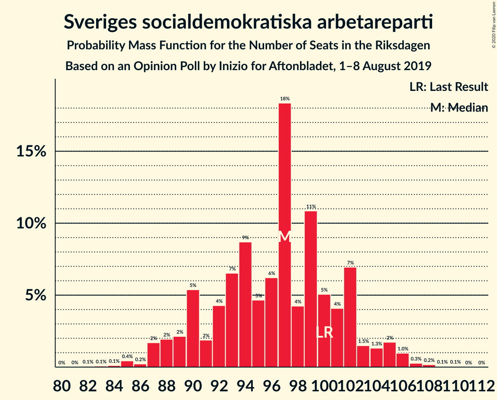
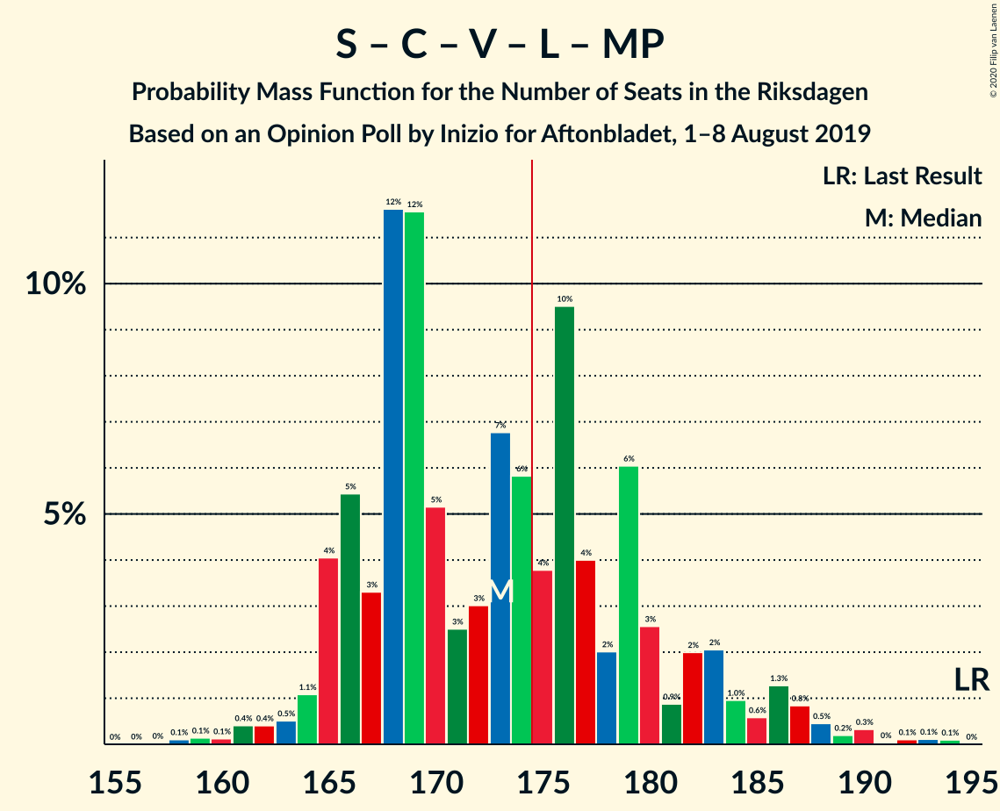
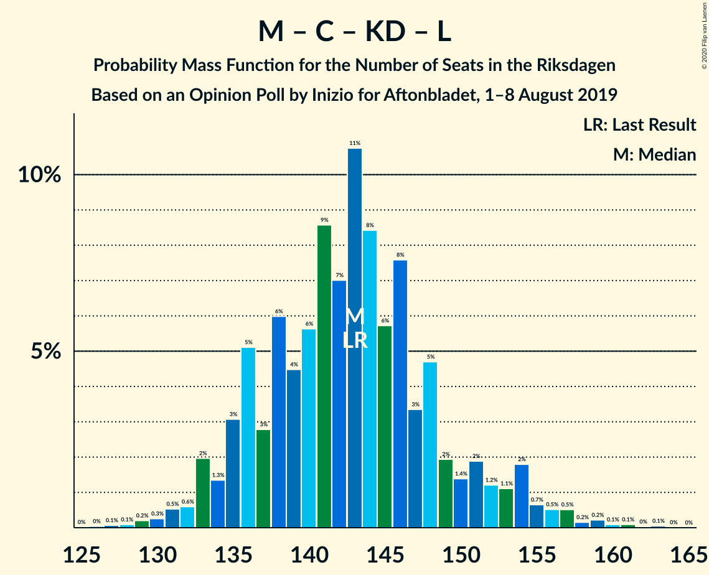

# Opinion Poll by Inizio for Aftonbladet, 1–8 August 2019

<a href="#voting-intentions">Voting Intentions</a> | <a href="#seats">Seats</a> | <a href="#coalitions">Coalitions</a> | <a href="#technical-information">Technical Information</a>

## Voting Intentions

### Confidence Intervals

| Party | Last Result | Poll Result | 80% Confidence Interval | 90% Confidence Interval | 95% Confidence Interval | 99% Confidence Interval |
|:-----:|:-----------:|:-----------:|:-----------------------:|:-----------------------:|:-----------------------:|:-----------------------:|
| Sveriges socialdemokratiska arbetareparti | 28.3% | 25.6% | 24.4–26.9% |24.1–27.3% |23.8–27.6% |23.2–28.2% |
| Sverigedemokraterna | 17.5% | 19.7% | 18.6–20.9% |18.3–21.2% |18.0–21.5% |17.5–22.0% |
| Moderata samlingspartiet | 19.8% | 19.6% | 18.5–20.8% |18.2–21.1% |18.0–21.4% |17.4–21.9% |
| Centerpartiet | 8.6% | 10.3% | 9.5–11.2% |9.3–11.5% |9.1–11.7% |8.7–12.1% |
| Vänsterpartiet | 8.0% | 8.5% | 7.8–9.4% |7.6–9.6% |7.4–9.8% |7.1–10.2% |
| Kristdemokraterna | 6.3% | 7.3% | 6.6–8.1% |6.4–8.3% |6.3–8.5% |6.0–8.9% |
| Liberalerna | 5.5% | 3.6% | 3.1–4.2% |3.0–4.4% |2.9–4.5% |2.7–4.8% |
| Miljöpartiet de gröna | 4.4% | 3.6% | 3.1–4.2% |3.0–4.4% |2.9–4.5% |2.7–4.8% |

*Note:* The poll result column reflects the actual value used in the calculations. Published results may vary slightly, and in addition be rounded to fewer digits.

## Seats

### Confidence Intervals

| Party | Last Result | Median | 80% Confidence Interval | 90% Confidence Interval | 95% Confidence Interval | 99% Confidence Interval |
|:-----:|:-----------:|:------:|:-----------------------:|:-----------------------:|:-----------------------:|:-----------------------:|
| <a href="#sveriges-socialdemokratiska-arbetareparti">Sveriges socialdemokratiska arbetareparti</a> | 100 | 96 | 90–101 |90–103 |88–103 |86–106 |
| <a href="#sverigedemokraterna">Sverigedemokraterna</a> | 62 | 75 | 71–78 |69–78 |68–79 |64–84 |
| <a href="#moderata-samlingspartiet">Moderata samlingspartiet</a> | 70 | 72 | 69–78 |67–79 |67–81 |65–83 |
| <a href="#centerpartiet">Centerpartiet</a> | 31 | 38 | 35–42 |35–44 |35–45 |33–46 |
| <a href="#vänsterpartiet">Vänsterpartiet</a> | 28 | 33 | 29–34 |28–35 |28–36 |26–38 |
| <a href="#kristdemokraterna">Kristdemokraterna</a> | 22 | 28 | 26–31 |25–31 |23–31 |23–32 |
| <a href="#liberalerna">Liberalerna</a> | 20 | 0 | 0 |0–16 |0–16 |0–17 |
| <a href="#miljöpartiet-de-gröna">Miljöpartiet de gröna</a> | 16 | 0 | 0–15 |0–15 |0–16 |0–17 |

### Sveriges socialdemokratiska arbetareparti

*For a full overview of the results for this party, see the [Sveriges socialdemokratiska arbetareparti](party-sverigessocialdemokratiskaarbetareparti.html) page.*

| Number of Seats | Probability | Accumulated | Special Marks |
|:---------------:|:-----------:|:-----------:|:-------------:|
| 82 | 0% | 100% |  |
| 83 | 0% | 99.9% |  |
| 84 | 0.1% | 99.9% |  |
| 85 | 0% | 99.9% |  |
| 86 | 0.4% | 99.9% |  |
| 87 | 2% | 99.4% |  |
| 88 | 0.4% | 98% |  |
| 89 | 0.2% | 97% |  |
| 90 | 30% | 97% |  |
| 91 | 0.7% | 67% |  |
| 92 | 2% | 67% |  |
| 93 | 0.8% | 65% |  |
| 94 | 9% | 64% |  |
| 95 | 4% | 55% |  |
| 96 | 2% | 51% | Median |
| 97 | 3% | 49% |  |
| 98 | 3% | 46% |  |
| 99 | 32% | 43% |  |
| 100 | 0.4% | 11% | Last Result |
| 101 | 1.3% | 11% |  |
| 102 | 4% | 10% |  |
| 103 | 4% | 5% |  |
| 104 | 0.1% | 2% |  |
| 105 | 0.9% | 2% |  |
| 106 | 0.2% | 0.6% |  |
| 107 | 0.3% | 0.4% |  |
| 108 | 0% | 0.1% |  |
| 109 | 0% | 0.1% |  |
| 110 | 0.1% | 0.1% |  |
| 111 | 0% | 0% |  |

### Sverigedemokraterna

*For a full overview of the results for this party, see the [Sverigedemokraterna](party-sverigedemokraterna.html) page.*

| Number of Seats | Probability | Accumulated | Special Marks |
|:---------------:|:-----------:|:-----------:|:-------------:|
| 62 | 0% | 100% | Last Result |
| 63 | 0.1% | 100% |  |
| 64 | 0.6% | 99.9% |  |
| 65 | 0.3% | 99.3% |  |
| 66 | 0.4% | 99.0% |  |
| 67 | 1.0% | 98.7% |  |
| 68 | 2% | 98% |  |
| 69 | 4% | 96% |  |
| 70 | 0.4% | 92% |  |
| 71 | 4% | 92% |  |
| 72 | 4% | 87% |  |
| 73 | 10% | 83% |  |
| 74 | 0.6% | 73% |  |
| 75 | 29% | 73% | Median |
| 76 | 2% | 44% |  |
| 77 | 15% | 42% |  |
| 78 | 24% | 27% |  |
| 79 | 0.4% | 3% |  |
| 80 | 0.4% | 2% |  |
| 81 | 0.5% | 2% |  |
| 82 | 0.5% | 1.3% |  |
| 83 | 0.3% | 0.8% |  |
| 84 | 0.1% | 0.5% |  |
| 85 | 0.3% | 0.4% |  |
| 86 | 0% | 0.1% |  |
| 87 | 0% | 0.1% |  |
| 88 | 0.1% | 0.1% |  |
| 89 | 0% | 0% |  |

### Moderata samlingspartiet

*For a full overview of the results for this party, see the [Moderata samlingspartiet](party-moderatasamlingspartiet.html) page.*

| Number of Seats | Probability | Accumulated | Special Marks |
|:---------------:|:-----------:|:-----------:|:-------------:|
| 61 | 0.1% | 100% |  |
| 62 | 0% | 99.9% |  |
| 63 | 0% | 99.8% |  |
| 64 | 0.3% | 99.8% |  |
| 65 | 0.4% | 99.5% |  |
| 66 | 0.4% | 99.1% |  |
| 67 | 4% | 98.7% |  |
| 68 | 0.8% | 95% |  |
| 69 | 19% | 94% |  |
| 70 | 0.4% | 76% | Last Result |
| 71 | 2% | 75% |  |
| 72 | 34% | 73% | Median |
| 73 | 3% | 39% |  |
| 74 | 18% | 37% |  |
| 75 | 5% | 19% |  |
| 76 | 1.0% | 14% |  |
| 77 | 3% | 13% |  |
| 78 | 4% | 10% |  |
| 79 | 2% | 6% |  |
| 80 | 0.9% | 4% |  |
| 81 | 2% | 3% |  |
| 82 | 0.5% | 1.2% |  |
| 83 | 0.6% | 0.7% |  |
| 84 | 0% | 0.1% |  |
| 85 | 0% | 0.1% |  |
| 86 | 0% | 0.1% |  |
| 87 | 0% | 0% |  |

### Centerpartiet

*For a full overview of the results for this party, see the [Centerpartiet](party-centerpartiet.html) page.*

| Number of Seats | Probability | Accumulated | Special Marks |
|:---------------:|:-----------:|:-----------:|:-------------:|
| 31 | 0.1% | 100% | Last Result |
| 32 | 0.2% | 99.9% |  |
| 33 | 1.0% | 99.7% |  |
| 34 | 1.0% | 98.7% |  |
| 35 | 8% | 98% |  |
| 36 | 3% | 89% |  |
| 37 | 14% | 87% |  |
| 38 | 30% | 72% | Median |
| 39 | 3% | 43% |  |
| 40 | 6% | 39% |  |
| 41 | 22% | 34% |  |
| 42 | 3% | 12% |  |
| 43 | 2% | 9% |  |
| 44 | 4% | 7% |  |
| 45 | 2% | 3% |  |
| 46 | 1.1% | 1.2% |  |
| 47 | 0% | 0.1% |  |
| 48 | 0% | 0.1% |  |
| 49 | 0% | 0% |  |

### Vänsterpartiet

*For a full overview of the results for this party, see the [Vänsterpartiet](party-vänsterpartiet.html) page.*

| Number of Seats | Probability | Accumulated | Special Marks |
|:---------------:|:-----------:|:-----------:|:-------------:|
| 24 | 0% | 100% |  |
| 25 | 0.1% | 99.9% |  |
| 26 | 0.4% | 99.8% |  |
| 27 | 0.4% | 99.4% |  |
| 28 | 5% | 98.9% | Last Result |
| 29 | 9% | 94% |  |
| 30 | 1.4% | 85% |  |
| 31 | 16% | 84% |  |
| 32 | 5% | 68% |  |
| 33 | 35% | 63% | Median |
| 34 | 21% | 28% |  |
| 35 | 4% | 7% |  |
| 36 | 0.5% | 3% |  |
| 37 | 0.7% | 2% |  |
| 38 | 2% | 2% |  |
| 39 | 0.1% | 0.2% |  |
| 40 | 0% | 0.1% |  |
| 41 | 0% | 0% |  |

### Kristdemokraterna

*For a full overview of the results for this party, see the [Kristdemokraterna](party-kristdemokraterna.html) page.*

| Number of Seats | Probability | Accumulated | Special Marks |
|:---------------:|:-----------:|:-----------:|:-------------:|
| 21 | 0.1% | 100% |  |
| 22 | 0.3% | 99.9% | Last Result |
| 23 | 2% | 99.6% |  |
| 24 | 1.1% | 97% |  |
| 25 | 4% | 96% |  |
| 26 | 34% | 92% |  |
| 27 | 5% | 59% |  |
| 28 | 28% | 53% | Median |
| 29 | 7% | 26% |  |
| 30 | 1.3% | 19% |  |
| 31 | 16% | 18% |  |
| 32 | 1.0% | 1.4% |  |
| 33 | 0.2% | 0.4% |  |
| 34 | 0.1% | 0.1% |  |
| 35 | 0% | 0.1% |  |
| 36 | 0% | 0% |  |

### Liberalerna

*For a full overview of the results for this party, see the [Liberalerna](party-liberalerna.html) page.*

| Number of Seats | Probability | Accumulated | Special Marks |
|:---------------:|:-----------:|:-----------:|:-------------:|
| 0 | 90% | 100% | Median |
| 1 | 0% | 10% |  |
| 2 | 0% | 10% |  |
| 3 | 0% | 10% |  |
| 4 | 0% | 10% |  |
| 5 | 0% | 10% |  |
| 6 | 0% | 10% |  |
| 7 | 0% | 10% |  |
| 8 | 0% | 10% |  |
| 9 | 0% | 10% |  |
| 10 | 0% | 10% |  |
| 11 | 0% | 10% |  |
| 12 | 0% | 10% |  |
| 13 | 0% | 10% |  |
| 14 | 3% | 10% |  |
| 15 | 0.1% | 7% |  |
| 16 | 6% | 7% |  |
| 17 | 0.6% | 0.8% |  |
| 18 | 0.1% | 0.1% |  |
| 19 | 0% | 0% |  |
| 20 | 0% | 0% | Last Result |

### Miljöpartiet de gröna

*For a full overview of the results for this party, see the [Miljöpartiet de gröna](party-miljöpartietdegröna.html) page.*

| Number of Seats | Probability | Accumulated | Special Marks |
|:---------------:|:-----------:|:-----------:|:-------------:|
| 0 | 64% | 100% | Median |
| 1 | 0% | 36% |  |
| 2 | 0% | 36% |  |
| 3 | 0% | 36% |  |
| 4 | 0% | 36% |  |
| 5 | 0% | 36% |  |
| 6 | 0% | 36% |  |
| 7 | 0% | 36% |  |
| 8 | 0% | 36% |  |
| 9 | 0% | 36% |  |
| 10 | 0% | 36% |  |
| 11 | 0% | 36% |  |
| 12 | 0% | 36% |  |
| 13 | 0% | 36% |  |
| 14 | 0.4% | 36% |  |
| 15 | 31% | 36% |  |
| 16 | 4% | 5% | Last Result |
| 17 | 0.4% | 0.6% |  |
| 18 | 0.1% | 0.2% |  |
| 19 | 0.2% | 0.2% |  |
| 20 | 0% | 0% |  |

## Coalitions

### Confidence Intervals

| Coalition | Last Result | Median | Majority? | 80% Confidence Interval | 90% Confidence Interval | 95% Confidence Interval | 99% Confidence Interval |
|:---------:|:-----------:|:------:|:---------:|:-----------------------:|:-----------------------:|:-----------------------:|:-----------------------:|
| Sveriges socialdemokratiska arbetareparti – Moderata samlingspartiet – Centerpartiet | 201 | 209 | 100% | 200–215 | 198–218 | 197–219 | 193–222 |
| Sveriges socialdemokratiska arbetareparti – Centerpartiet – Vänsterpartiet – Liberalerna – Miljöpartiet de gröna | 195 | 174 | 46% | 167–179 | 166–184 | 165–188 | 163–190 |
| Sverigedemokraterna – Moderata samlingspartiet – Kristdemokraterna | 154 | 175 | 54% | 170–182 | 165–183 | 161–184 | 159–186 |
| Sveriges socialdemokratiska arbetareparti – Moderata samlingspartiet | 170 | 168 | 13% | 162–175 | 162–177 | 159–179 | 157–182 |
| Sveriges socialdemokratiska arbetareparti – Centerpartiet – Liberalerna – Miljöpartiet de gröna | 167 | 140 | 0% | 136–147 | 134–153 | 134–158 | 128–159 |
| Sverigedemokraterna – Moderata samlingspartiet | 132 | 147 | 0% | 143–153 | 138–156 | 136–156 | 133–158 |
| Moderata samlingspartiet – Centerpartiet – Kristdemokraterna – Liberalerna | 143 | 139 | 0% | 136–148 | 136–151 | 135–154 | 130–157 |
| Moderata samlingspartiet – Centerpartiet – Kristdemokraterna | 123 | 138 | 0% | 136–145 | 133–148 | 128–150 | 125–151 |
| Sveriges socialdemokratiska arbetareparti – Vänsterpartiet – Miljöpartiet de gröna | 144 | 133 | 0% | 126–138 | 124–139 | 122–139 | 117–145 |
| Sveriges socialdemokratiska arbetareparti – Vänsterpartiet | 128 | 127 | 0% | 123–133 | 122–136 | 119–137 | 116–139 |
| Moderata samlingspartiet – Centerpartiet – Liberalerna | 121 | 110 | 0% | 110–120 | 110–123 | 108–127 | 104–130 |
| Moderata samlingspartiet – Centerpartiet | 101 | 110 | 0% | 109–118 | 106–120 | 102–122 | 102–123 |
| Sveriges socialdemokratiska arbetareparti – Miljöpartiet de gröna | 116 | 99 | 0% | 94–105 | 92–110 | 90–110 | 87–113 |

### Sveriges socialdemokratiska arbetareparti – Moderata samlingspartiet – Centerpartiet

| Number of Seats | Probability | Accumulated | Special Marks |
|:---------------:|:-----------:|:-----------:|:-------------:|
| 186 | 0.1% | 100% |  |
| 187 | 0% | 99.9% |  |
| 188 | 0% | 99.9% |  |
| 189 | 0% | 99.9% |  |
| 190 | 0% | 99.9% |  |
| 191 | 0% | 99.8% |  |
| 192 | 0% | 99.8% |  |
| 193 | 0.7% | 99.8% |  |
| 194 | 0% | 99.0% |  |
| 195 | 0.7% | 99.0% |  |
| 196 | 0.5% | 98% |  |
| 197 | 2% | 98% |  |
| 198 | 1.0% | 95% |  |
| 199 | 0.1% | 94% |  |
| 200 | 28% | 94% |  |
| 201 | 1.1% | 66% | Last Result |
| 202 | 0.3% | 65% |  |
| 203 | 3% | 65% |  |
| 204 | 2% | 62% |  |
| 205 | 0.5% | 61% |  |
| 206 | 0.8% | 60% | Median |
| 207 | 0.9% | 59% |  |
| 208 | 0.5% | 59% |  |
| 209 | 21% | 58% |  |
| 210 | 14% | 37% |  |
| 211 | 0.6% | 23% |  |
| 212 | 6% | 22% |  |
| 213 | 2% | 17% |  |
| 214 | 3% | 15% |  |
| 215 | 3% | 12% |  |
| 216 | 0.4% | 8% |  |
| 217 | 2% | 8% |  |
| 218 | 1.2% | 6% |  |
| 219 | 3% | 5% |  |
| 220 | 0.6% | 2% |  |
| 221 | 0.4% | 0.9% |  |
| 222 | 0.1% | 0.5% |  |
| 223 | 0.4% | 0.4% |  |
| 224 | 0% | 0% |  |

### Sveriges socialdemokratiska arbetareparti – Centerpartiet – Vänsterpartiet – Liberalerna – Miljöpartiet de gröna

| Number of Seats | Probability | Accumulated | Special Marks |
|:---------------:|:-----------:|:-----------:|:-------------:|
| 159 | 0.1% | 100% |  |
| 160 | 0% | 99.9% |  |
| 161 | 0.2% | 99.9% |  |
| 162 | 0.1% | 99.7% |  |
| 163 | 0.2% | 99.6% |  |
| 164 | 0.3% | 99.4% |  |
| 165 | 2% | 99.1% |  |
| 166 | 3% | 97% |  |
| 167 | 17% | 94% | Median |
| 168 | 0.2% | 77% |  |
| 169 | 1.4% | 77% |  |
| 170 | 2% | 76% |  |
| 171 | 5% | 74% |  |
| 172 | 3% | 69% |  |
| 173 | 2% | 66% |  |
| 174 | 18% | 64% |  |
| 175 | 1.1% | 46% | Majority |
| 176 | 32% | 45% |  |
| 177 | 2% | 13% |  |
| 178 | 0.4% | 11% |  |
| 179 | 3% | 11% |  |
| 180 | 1.2% | 8% |  |
| 181 | 0.4% | 7% |  |
| 182 | 0.5% | 6% |  |
| 183 | 0.4% | 6% |  |
| 184 | 0.3% | 5% |  |
| 185 | 0.2% | 5% |  |
| 186 | 1.5% | 5% |  |
| 187 | 0.1% | 3% |  |
| 188 | 2% | 3% |  |
| 189 | 0% | 0.9% |  |
| 190 | 0.5% | 0.9% |  |
| 191 | 0% | 0.4% |  |
| 192 | 0.1% | 0.4% |  |
| 193 | 0.2% | 0.2% |  |
| 194 | 0% | 0% |  |
| 195 | 0% | 0% | Last Result |

### Sverigedemokraterna – Moderata samlingspartiet – Kristdemokraterna

| Number of Seats | Probability | Accumulated | Special Marks |
|:---------------:|:-----------:|:-----------:|:-------------:|
| 154 | 0% | 100% | Last Result |
| 155 | 0% | 100% |  |
| 156 | 0.2% | 100% |  |
| 157 | 0.1% | 99.8% |  |
| 158 | 0% | 99.6% |  |
| 159 | 0.5% | 99.6% |  |
| 160 | 0% | 99.1% |  |
| 161 | 2% | 99.1% |  |
| 162 | 0.1% | 97% |  |
| 163 | 1.5% | 97% |  |
| 164 | 0.2% | 95% |  |
| 165 | 0.3% | 95% |  |
| 166 | 0.4% | 95% |  |
| 167 | 0.5% | 94% |  |
| 168 | 0.4% | 94% |  |
| 169 | 1.2% | 93% |  |
| 170 | 3% | 92% |  |
| 171 | 0.4% | 89% |  |
| 172 | 2% | 89% |  |
| 173 | 32% | 87% |  |
| 174 | 1.1% | 55% |  |
| 175 | 18% | 54% | Median, Majority |
| 176 | 2% | 36% |  |
| 177 | 3% | 34% |  |
| 178 | 5% | 31% |  |
| 179 | 2% | 26% |  |
| 180 | 1.4% | 24% |  |
| 181 | 0.2% | 23% |  |
| 182 | 17% | 23% |  |
| 183 | 3% | 6% |  |
| 184 | 2% | 3% |  |
| 185 | 0.3% | 0.9% |  |
| 186 | 0.2% | 0.6% |  |
| 187 | 0.1% | 0.4% |  |
| 188 | 0.2% | 0.3% |  |
| 189 | 0% | 0.1% |  |
| 190 | 0.1% | 0.1% |  |
| 191 | 0% | 0% |  |

### Sveriges socialdemokratiska arbetareparti – Moderata samlingspartiet

| Number of Seats | Probability | Accumulated | Special Marks |
|:---------------:|:-----------:|:-----------:|:-------------:|
| 150 | 0% | 100% |  |
| 151 | 0% | 99.9% |  |
| 152 | 0% | 99.9% |  |
| 153 | 0.1% | 99.9% |  |
| 154 | 0.1% | 99.8% |  |
| 155 | 0% | 99.8% |  |
| 156 | 0.2% | 99.7% |  |
| 157 | 0.4% | 99.5% |  |
| 158 | 1.1% | 99.1% |  |
| 159 | 0.6% | 98% |  |
| 160 | 1.0% | 97% |  |
| 161 | 0.5% | 96% |  |
| 162 | 30% | 96% |  |
| 163 | 0.2% | 66% |  |
| 164 | 0.3% | 66% |  |
| 165 | 2% | 65% |  |
| 166 | 2% | 64% |  |
| 167 | 2% | 62% |  |
| 168 | 23% | 60% | Median |
| 169 | 0.9% | 38% |  |
| 170 | 1.3% | 37% | Last Result |
| 171 | 2% | 35% |  |
| 172 | 5% | 34% |  |
| 173 | 15% | 29% |  |
| 174 | 0.3% | 14% |  |
| 175 | 4% | 13% | Majority |
| 176 | 2% | 9% |  |
| 177 | 2% | 7% |  |
| 178 | 1.1% | 5% |  |
| 179 | 2% | 4% |  |
| 180 | 1.0% | 2% |  |
| 181 | 0.1% | 0.7% |  |
| 182 | 0.1% | 0.5% |  |
| 183 | 0.3% | 0.5% |  |
| 184 | 0% | 0.2% |  |
| 185 | 0.1% | 0.2% |  |
| 186 | 0% | 0% |  |

### Sveriges socialdemokratiska arbetareparti – Centerpartiet – Liberalerna – Miljöpartiet de gröna

| Number of Seats | Probability | Accumulated | Special Marks |
|:---------------:|:-----------:|:-----------:|:-------------:|
| 126 | 0.1% | 100% |  |
| 127 | 0% | 99.8% |  |
| 128 | 0.4% | 99.8% |  |
| 129 | 0% | 99.4% |  |
| 130 | 0.6% | 99.4% |  |
| 131 | 0.9% | 98.8% |  |
| 132 | 0.1% | 98% |  |
| 133 | 0.1% | 98% |  |
| 134 | 5% | 98% | Median |
| 135 | 0.3% | 93% |  |
| 136 | 14% | 92% |  |
| 137 | 5% | 78% |  |
| 138 | 3% | 73% |  |
| 139 | 3% | 70% |  |
| 140 | 19% | 68% |  |
| 141 | 2% | 49% |  |
| 142 | 0.9% | 47% |  |
| 143 | 29% | 46% |  |
| 144 | 1.2% | 17% |  |
| 145 | 0.2% | 16% |  |
| 146 | 0.6% | 15% |  |
| 147 | 5% | 15% |  |
| 148 | 0.1% | 10% |  |
| 149 | 0.8% | 9% |  |
| 150 | 1.1% | 9% |  |
| 151 | 2% | 8% |  |
| 152 | 0.2% | 5% |  |
| 153 | 2% | 5% |  |
| 154 | 0.1% | 3% |  |
| 155 | 0.1% | 3% |  |
| 156 | 0% | 3% |  |
| 157 | 0.1% | 3% |  |
| 158 | 0.7% | 3% |  |
| 159 | 2% | 2% |  |
| 160 | 0% | 0.2% |  |
| 161 | 0% | 0.2% |  |
| 162 | 0.1% | 0.1% |  |
| 163 | 0% | 0% |  |
| 164 | 0% | 0% |  |
| 165 | 0% | 0% |  |
| 166 | 0% | 0% |  |
| 167 | 0% | 0% | Last Result |

### Sverigedemokraterna – Moderata samlingspartiet

| Number of Seats | Probability | Accumulated | Special Marks |
|:---------------:|:-----------:|:-----------:|:-------------:|
| 128 | 0.1% | 100% |  |
| 129 | 0% | 99.9% |  |
| 130 | 0% | 99.9% |  |
| 131 | 0% | 99.9% |  |
| 132 | 0.2% | 99.8% | Last Result |
| 133 | 0.5% | 99.6% |  |
| 134 | 0.1% | 99.1% |  |
| 135 | 1.5% | 99.0% |  |
| 136 | 0.1% | 98% |  |
| 137 | 0.1% | 97% |  |
| 138 | 2% | 97% |  |
| 139 | 0.5% | 95% |  |
| 140 | 0.2% | 94% |  |
| 141 | 0.4% | 94% |  |
| 142 | 2% | 94% |  |
| 143 | 3% | 92% |  |
| 144 | 4% | 88% |  |
| 145 | 2% | 85% |  |
| 146 | 1.2% | 83% |  |
| 147 | 48% | 82% | Median |
| 148 | 3% | 34% |  |
| 149 | 1.1% | 31% |  |
| 150 | 3% | 30% |  |
| 151 | 15% | 27% |  |
| 152 | 2% | 12% |  |
| 153 | 1.4% | 10% |  |
| 154 | 0.8% | 9% |  |
| 155 | 2% | 8% |  |
| 156 | 4% | 6% |  |
| 157 | 0.2% | 2% |  |
| 158 | 2% | 2% |  |
| 159 | 0.2% | 0.4% |  |
| 160 | 0.2% | 0.3% |  |
| 161 | 0% | 0.1% |  |
| 162 | 0% | 0% |  |

### Moderata samlingspartiet – Centerpartiet – Kristdemokraterna – Liberalerna

| Number of Seats | Probability | Accumulated | Special Marks |
|:---------------:|:-----------:|:-----------:|:-------------:|
| 128 | 0.1% | 100% |  |
| 129 | 0.2% | 99.9% |  |
| 130 | 0.3% | 99.7% |  |
| 131 | 0.1% | 99.4% |  |
| 132 | 0.2% | 99.3% |  |
| 133 | 0.9% | 99.1% |  |
| 134 | 0.5% | 98% |  |
| 135 | 0.7% | 98% |  |
| 136 | 28% | 97% |  |
| 137 | 0.2% | 69% |  |
| 138 | 18% | 69% | Median |
| 139 | 5% | 51% |  |
| 140 | 3% | 46% |  |
| 141 | 0.9% | 43% |  |
| 142 | 16% | 42% |  |
| 143 | 0.6% | 26% | Last Result |
| 144 | 5% | 26% |  |
| 145 | 5% | 20% |  |
| 146 | 2% | 16% |  |
| 147 | 0.9% | 14% |  |
| 148 | 4% | 13% |  |
| 149 | 0.2% | 9% |  |
| 150 | 3% | 9% |  |
| 151 | 1.0% | 5% |  |
| 152 | 2% | 4% |  |
| 153 | 0.2% | 3% |  |
| 154 | 0.9% | 3% |  |
| 155 | 0.1% | 2% |  |
| 156 | 0.4% | 2% |  |
| 157 | 1.0% | 1.2% |  |
| 158 | 0% | 0.2% |  |
| 159 | 0% | 0.2% |  |
| 160 | 0% | 0.1% |  |
| 161 | 0.1% | 0.1% |  |
| 162 | 0% | 0% |  |

### Moderata samlingspartiet – Centerpartiet – Kristdemokraterna

| Number of Seats | Probability | Accumulated | Special Marks |
|:---------------:|:-----------:|:-----------:|:-------------:|
| 123 | 0% | 100% | Last Result |
| 124 | 0% | 100% |  |
| 125 | 2% | 99.9% |  |
| 126 | 0% | 98% |  |
| 127 | 0.2% | 98% |  |
| 128 | 0.3% | 98% |  |
| 129 | 0.2% | 97% |  |
| 130 | 0.7% | 97% |  |
| 131 | 0.6% | 96% |  |
| 132 | 0.4% | 96% |  |
| 133 | 0.9% | 95% |  |
| 134 | 3% | 95% |  |
| 135 | 0.8% | 92% |  |
| 136 | 29% | 91% |  |
| 137 | 0.3% | 62% |  |
| 138 | 19% | 61% | Median |
| 139 | 3% | 42% |  |
| 140 | 3% | 39% |  |
| 141 | 2% | 37% |  |
| 142 | 16% | 35% |  |
| 143 | 0.4% | 19% |  |
| 144 | 5% | 19% |  |
| 145 | 5% | 13% |  |
| 146 | 1.5% | 8% |  |
| 147 | 0.4% | 7% |  |
| 148 | 3% | 7% |  |
| 149 | 0.1% | 3% |  |
| 150 | 2% | 3% |  |
| 151 | 1.0% | 1.3% |  |
| 152 | 0.1% | 0.3% |  |
| 153 | 0.2% | 0.3% |  |
| 154 | 0% | 0.1% |  |
| 155 | 0% | 0.1% |  |
| 156 | 0.1% | 0.1% |  |
| 157 | 0% | 0% |  |

### Sveriges socialdemokratiska arbetareparti – Vänsterpartiet – Miljöpartiet de gröna

| Number of Seats | Probability | Accumulated | Special Marks |
|:---------------:|:-----------:|:-----------:|:-------------:|
| 117 | 0.8% | 100% |  |
| 118 | 0.1% | 99.2% |  |
| 119 | 1.0% | 99.1% |  |
| 120 | 0.1% | 98% |  |
| 121 | 0.4% | 98% |  |
| 122 | 0.2% | 98% |  |
| 123 | 0.3% | 97% |  |
| 124 | 3% | 97% |  |
| 125 | 2% | 94% |  |
| 126 | 3% | 92% |  |
| 127 | 5% | 89% |  |
| 128 | 0.6% | 84% |  |
| 129 | 0.3% | 83% | Median |
| 130 | 14% | 83% |  |
| 131 | 3% | 69% |  |
| 132 | 5% | 66% |  |
| 133 | 18% | 60% |  |
| 134 | 0.7% | 42% |  |
| 135 | 0% | 41% |  |
| 136 | 2% | 41% |  |
| 137 | 3% | 39% |  |
| 138 | 31% | 36% |  |
| 139 | 3% | 5% |  |
| 140 | 0.2% | 2% |  |
| 141 | 0.1% | 2% |  |
| 142 | 0.1% | 2% |  |
| 143 | 0.3% | 2% |  |
| 144 | 0.6% | 1.4% | Last Result |
| 145 | 0.5% | 0.9% |  |
| 146 | 0% | 0.3% |  |
| 147 | 0% | 0.3% |  |
| 148 | 0% | 0.3% |  |
| 149 | 0% | 0.3% |  |
| 150 | 0.1% | 0.3% |  |
| 151 | 0.1% | 0.1% |  |
| 152 | 0% | 0% |  |

### Sveriges socialdemokratiska arbetareparti – Vänsterpartiet

| Number of Seats | Probability | Accumulated | Special Marks |
|:---------------:|:-----------:|:-----------:|:-------------:|
| 113 | 0% | 100% |  |
| 114 | 0% | 99.9% |  |
| 115 | 0.1% | 99.9% |  |
| 116 | 0.7% | 99.8% |  |
| 117 | 1.1% | 99.1% |  |
| 118 | 0.2% | 98% |  |
| 119 | 1.3% | 98% |  |
| 120 | 0.2% | 97% |  |
| 121 | 0.4% | 96% |  |
| 122 | 3% | 96% |  |
| 123 | 28% | 93% |  |
| 124 | 5% | 65% |  |
| 125 | 2% | 60% |  |
| 126 | 3% | 57% |  |
| 127 | 5% | 54% |  |
| 128 | 1.1% | 49% | Last Result |
| 129 | 0.3% | 48% | Median |
| 130 | 15% | 48% |  |
| 131 | 3% | 33% |  |
| 132 | 4% | 30% |  |
| 133 | 18% | 25% |  |
| 134 | 0.7% | 7% |  |
| 135 | 0% | 7% |  |
| 136 | 2% | 6% |  |
| 137 | 2% | 4% |  |
| 138 | 1.0% | 2% |  |
| 139 | 0.5% | 0.9% |  |
| 140 | 0.1% | 0.4% |  |
| 141 | 0.1% | 0.3% |  |
| 142 | 0% | 0.2% |  |
| 143 | 0.1% | 0.2% |  |
| 144 | 0% | 0.1% |  |
| 145 | 0% | 0.1% |  |
| 146 | 0% | 0% |  |

### Moderata samlingspartiet – Centerpartiet – Liberalerna

| Number of Seats | Probability | Accumulated | Special Marks |
|:---------------:|:-----------:|:-----------:|:-------------:|
| 101 | 0% | 100% |  |
| 102 | 0.1% | 99.9% |  |
| 103 | 0.3% | 99.8% |  |
| 104 | 0.1% | 99.5% |  |
| 105 | 0.3% | 99.4% |  |
| 106 | 0.5% | 99.1% |  |
| 107 | 0.6% | 98.5% |  |
| 108 | 0.5% | 98% |  |
| 109 | 0.8% | 97% |  |
| 110 | 48% | 97% | Median |
| 111 | 14% | 49% |  |
| 112 | 2% | 35% |  |
| 113 | 0.9% | 33% |  |
| 114 | 1.4% | 32% |  |
| 115 | 4% | 30% |  |
| 116 | 6% | 26% |  |
| 117 | 0.9% | 21% |  |
| 118 | 4% | 20% |  |
| 119 | 3% | 16% |  |
| 120 | 3% | 13% |  |
| 121 | 1.0% | 9% | Last Result |
| 122 | 2% | 8% |  |
| 123 | 2% | 6% |  |
| 124 | 2% | 4% |  |
| 125 | 0.1% | 3% |  |
| 126 | 0.1% | 3% |  |
| 127 | 0.9% | 3% |  |
| 128 | 0.1% | 2% |  |
| 129 | 1.0% | 2% |  |
| 130 | 0.3% | 0.5% |  |
| 131 | 0% | 0.2% |  |
| 132 | 0.1% | 0.2% |  |
| 133 | 0.1% | 0.1% |  |
| 134 | 0% | 0% |  |

### Moderata samlingspartiet – Centerpartiet

| Number of Seats | Probability | Accumulated | Special Marks |
|:---------------:|:-----------:|:-----------:|:-------------:|
| 99 | 0.1% | 100% |  |
| 100 | 0.1% | 99.8% |  |
| 101 | 0.2% | 99.7% | Last Result |
| 102 | 2% | 99.5% |  |
| 103 | 0.4% | 97% |  |
| 104 | 0.2% | 97% |  |
| 105 | 0.8% | 97% |  |
| 106 | 3% | 96% |  |
| 107 | 0.8% | 93% |  |
| 108 | 2% | 92% |  |
| 109 | 0.8% | 90% |  |
| 110 | 48% | 89% | Median |
| 111 | 15% | 41% |  |
| 112 | 2% | 27% |  |
| 113 | 2% | 24% |  |
| 114 | 1.4% | 22% |  |
| 115 | 4% | 21% |  |
| 116 | 4% | 17% |  |
| 117 | 0.9% | 13% |  |
| 118 | 4% | 12% |  |
| 119 | 3% | 8% |  |
| 120 | 2% | 5% |  |
| 121 | 0.4% | 3% |  |
| 122 | 0.5% | 3% |  |
| 123 | 2% | 2% |  |
| 124 | 0.1% | 0.1% |  |
| 125 | 0% | 0.1% |  |
| 126 | 0% | 0% |  |

### Sveriges socialdemokratiska arbetareparti – Miljöpartiet de gröna

| Number of Seats | Probability | Accumulated | Special Marks |
|:---------------:|:-----------:|:-----------:|:-------------:|
| 86 | 0.1% | 100% |  |
| 87 | 0.8% | 99.9% |  |
| 88 | 0.4% | 99.1% |  |
| 89 | 0% | 98.7% |  |
| 90 | 1.3% | 98.6% |  |
| 91 | 0.5% | 97% |  |
| 92 | 2% | 97% |  |
| 93 | 0.3% | 95% |  |
| 94 | 6% | 95% |  |
| 95 | 2% | 88% |  |
| 96 | 2% | 86% | Median |
| 97 | 3% | 84% |  |
| 98 | 3% | 82% |  |
| 99 | 32% | 79% |  |
| 100 | 0.4% | 47% |  |
| 101 | 1.1% | 47% |  |
| 102 | 5% | 46% |  |
| 103 | 4% | 41% |  |
| 104 | 0.5% | 37% |  |
| 105 | 29% | 36% |  |
| 106 | 0.8% | 8% |  |
| 107 | 0.3% | 7% |  |
| 108 | 0.4% | 6% |  |
| 109 | 0.2% | 6% |  |
| 110 | 5% | 6% |  |
| 111 | 0% | 0.9% |  |
| 112 | 0.3% | 0.9% |  |
| 113 | 0.1% | 0.6% |  |
| 114 | 0% | 0.5% |  |
| 115 | 0.1% | 0.5% |  |
| 116 | 0.1% | 0.4% | Last Result |
| 117 | 0.2% | 0.3% |  |
| 118 | 0% | 0.1% |  |
| 119 | 0% | 0.1% |  |
| 120 | 0% | 0.1% |  |
| 121 | 0.1% | 0.1% |  |
| 122 | 0% | 0% |  |

## Technical Information

### Opinion Poll

+ **Polling firm:** Inizio
+ **Commissioner(s):** Aftonbladet
+ **Fieldwork period:** 1–8 August 2019

### Calculations

+ **Sample size:** 2076
+ **Simulations done:** 65,536
+ **Error estimate:** 2.24%

