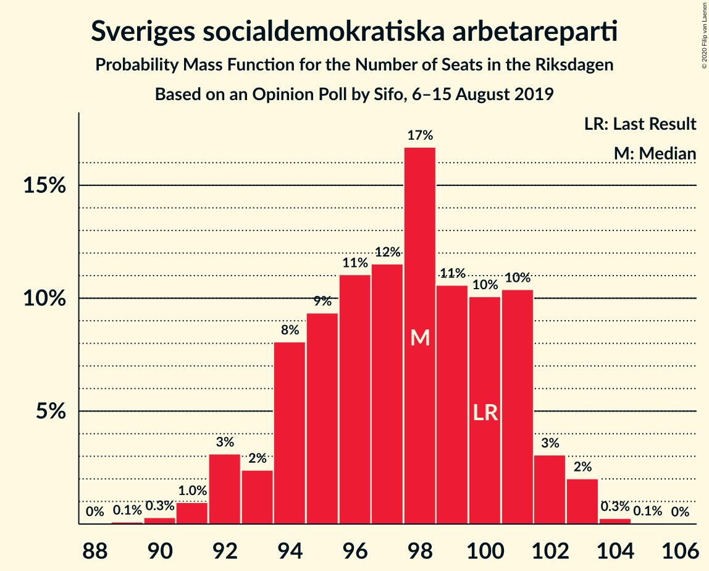
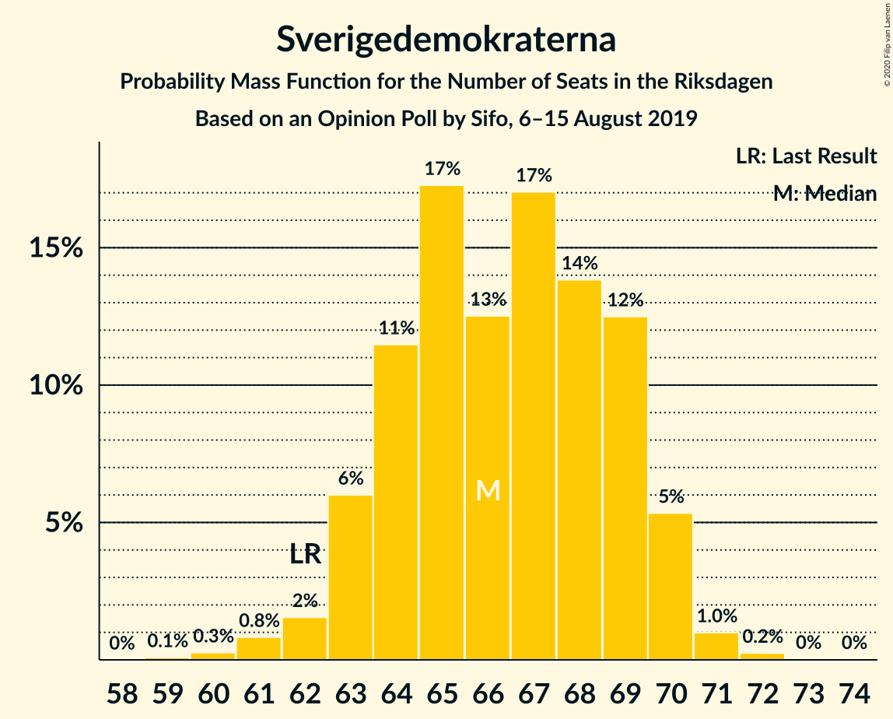
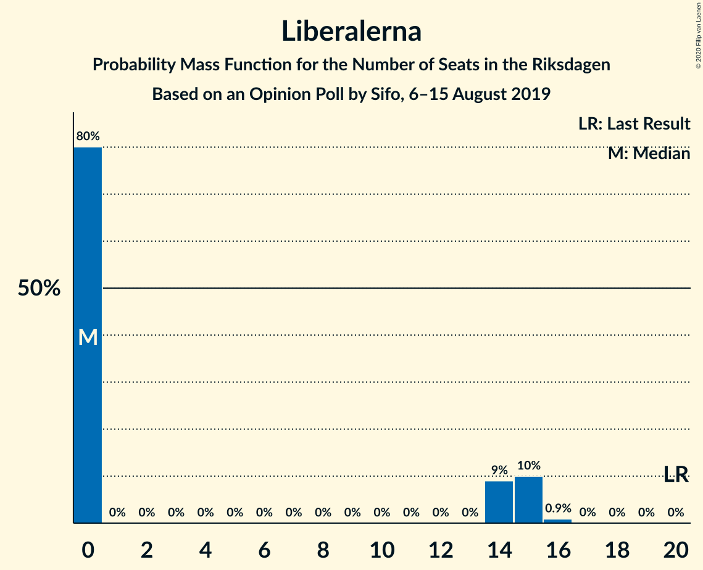
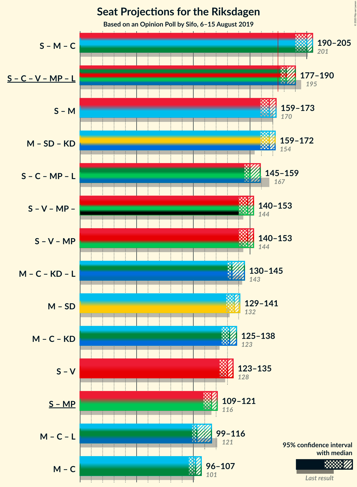
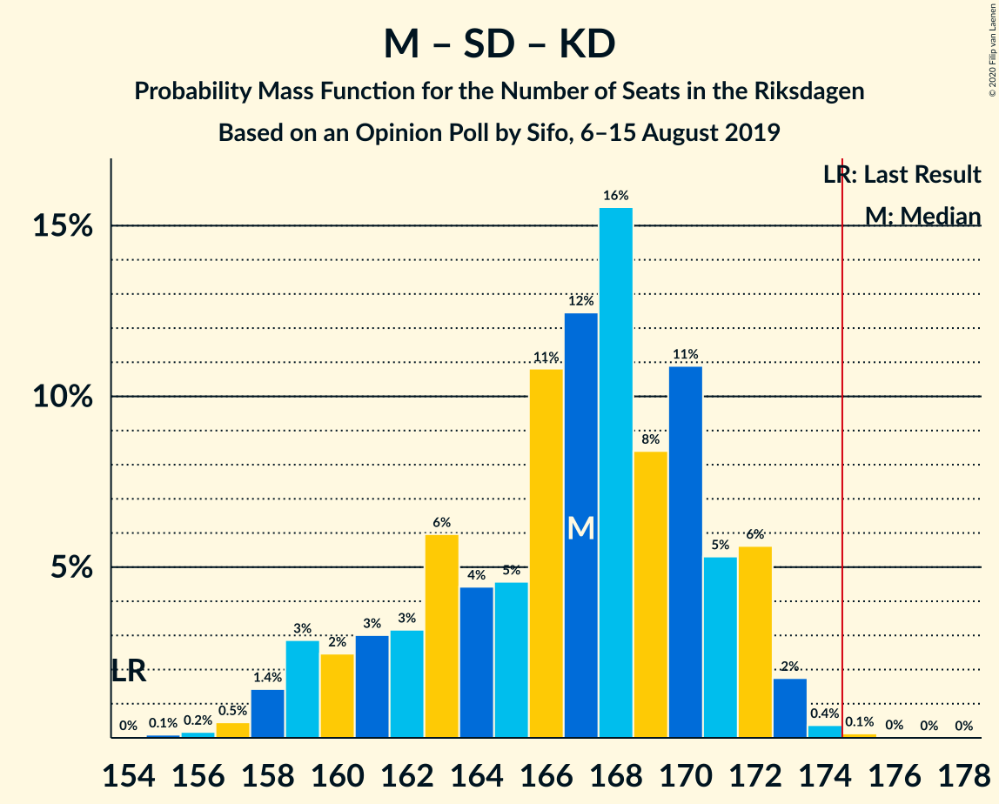
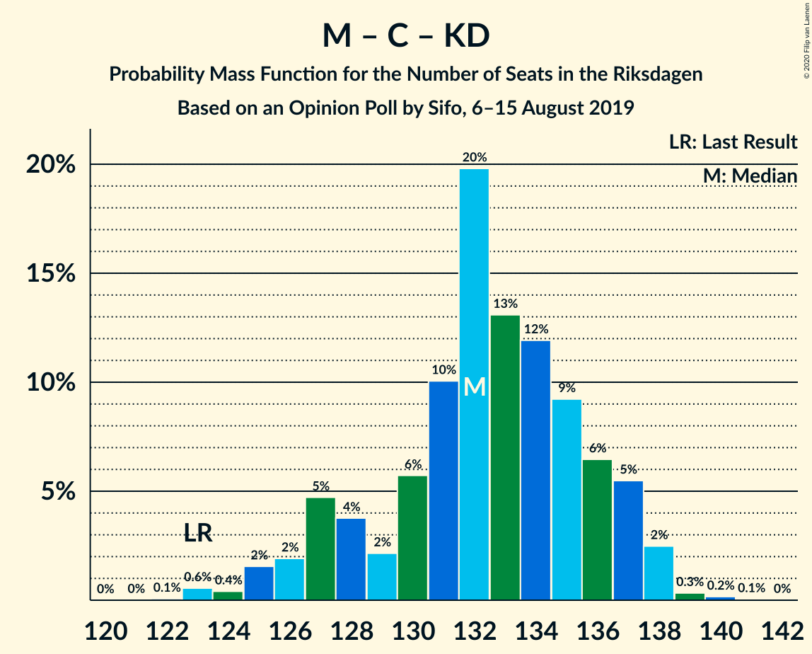
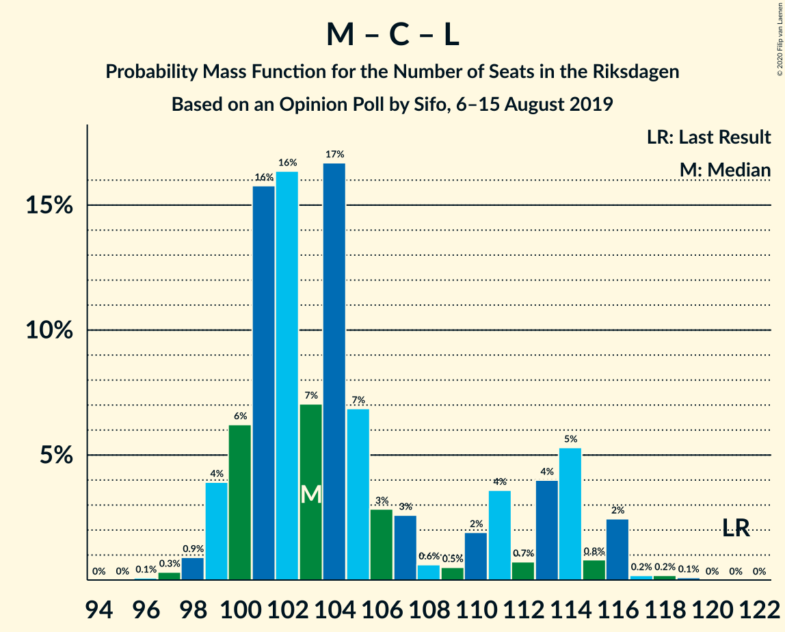

# Opinion Poll by Sifo, 6–15 August 2019

<a href="#voting-intentions">Voting Intentions</a> | <a href="#seats">Seats</a> | <a href="#coalitions">Coalitions</a> | <a href="#technical-information">Technical Information</a>

## Voting Intentions

### Confidence Intervals

| Party | Last Result | Poll Result | 80% Confidence Interval | 90% Confidence Interval | 95% Confidence Interval | 99% Confidence Interval |
|:-----:|:-----------:|:-----------:|:-----------------------:|:-----------------------:|:-----------------------:|:-----------------------:|
| Sveriges socialdemokratiska arbetareparti | 28.3% | 26.8% | 26.1–27.5% |25.9–27.7% |25.7–27.9% |25.3–28.2% |
| Moderata samlingspartiet | 19.8% | 19.1% | 18.4–19.7% |18.3–19.9% |18.1–20.1% |17.8–20.4% |
| Sverigedemokraterna | 17.5% | 18.2% | 17.6–18.8% |17.4–19.0% |17.2–19.2% |16.9–19.5% |
| Centerpartiet | 8.6% | 8.8% | 8.3–9.3% |8.2–9.4% |8.1–9.5% |7.9–9.8% |
| Vänsterpartiet | 8.0% | 8.7% | 8.2–9.2% |8.1–9.3% |8.0–9.4% |7.8–9.6% |
| Kristdemokraterna | 6.3% | 8.4% | 8.0–8.9% |7.8–9.0% |7.7–9.1% |7.5–9.3% |
| Miljöpartiet de gröna | 4.4% | 4.9% | 4.6–5.3% |4.5–5.4% |4.4–5.5% |4.2–5.6% |
| Liberalerna | 5.5% | 3.8% | 3.5–4.1% |3.4–4.2% |3.4–4.3% |3.2–4.5% |

*Note:* The poll result column reflects the actual value used in the calculations. Published results may vary slightly, and in addition be rounded to fewer digits.

## Seats

### Confidence Intervals

| Party | Last Result | Median | 80% Confidence Interval | 90% Confidence Interval | 95% Confidence Interval | 99% Confidence Interval |
|:-----:|:-----------:|:------:|:-----------------------:|:-----------------------:|:-----------------------:|:-----------------------:|
| <a href="#sveriges-socialdemokratiska-arbetareparti">Sveriges socialdemokratiska arbetareparti</a> | 100 | 98 | 94–101 |93–102 |92–102 |91–103 |
| <a href="#moderata-samlingspartiet">Moderata samlingspartiet</a> | 70 | 70 | 67–72 |66–73 |65–73 |64–75 |
| <a href="#sverigedemokraterna">Sverigedemokraterna</a> | 62 | 66 | 64–69 |63–70 |62–70 |61–71 |
| <a href="#centerpartiet">Centerpartiet</a> | 31 | 32 | 30–34 |30–34 |29–35 |29–36 |
| <a href="#vänsterpartiet">Vänsterpartiet</a> | 28 | 32 | 30–34 |29–34 |29–35 |28–35 |
| <a href="#kristdemokraterna">Kristdemokraterna</a> | 22 | 31 | 29–32 |28–33 |28–33 |27–34 |
| <a href="#miljöpartiet-de-gröna">Miljöpartiet de gröna</a> | 16 | 18 | 17–19 |16–20 |16–20 |15–20 |
| <a href="#liberalerna">Liberalerna</a> | 20 | 0 | 0–15 |0–15 |0–15 |0–16 |

### Sveriges socialdemokratiska arbetareparti

*For a full overview of the results for this party, see the [Sveriges socialdemokratiska arbetareparti](party-sverigessocialdemokratiskaarbetareparti.html) page.*

| Number of Seats | Probability | Accumulated | Special Marks |
|:---------------:|:-----------:|:-----------:|:-------------:|
| 89 | 0.1% | 100% |  |
| 90 | 0.3% | 99.9% |  |
| 91 | 1.0% | 99.6% |  |
| 92 | 3% | 98.6% |  |
| 93 | 2% | 96% |  |
| 94 | 8% | 93% |  |
| 95 | 9% | 85% |  |
| 96 | 11% | 76% |  |
| 97 | 12% | 65% |  |
| 98 | 17% | 53% | Median |
| 99 | 11% | 36% |  |
| 100 | 10% | 26% | Last Result |
| 101 | 10% | 16% |  |
| 102 | 3% | 5% |  |
| 103 | 2% | 2% |  |
| 104 | 0.3% | 0.3% |  |
| 105 | 0.1% | 0.1% |  |
| 106 | 0% | 0% |  |

### Moderata samlingspartiet

*For a full overview of the results for this party, see the [Moderata samlingspartiet](party-moderatasamlingspartiet.html) page.*

| Number of Seats | Probability | Accumulated | Special Marks |
|:---------------:|:-----------:|:-----------:|:-------------:|
| 62 | 0% | 100% |  |
| 63 | 0.3% | 99.9% |  |
| 64 | 1.4% | 99.6% |  |
| 65 | 2% | 98% |  |
| 66 | 3% | 97% |  |
| 67 | 8% | 94% |  |
| 68 | 12% | 85% |  |
| 69 | 20% | 73% |  |
| 70 | 16% | 53% | Last Result, Median |
| 71 | 16% | 37% |  |
| 72 | 12% | 21% |  |
| 73 | 6% | 8% |  |
| 74 | 2% | 2% |  |
| 75 | 0.5% | 0.7% |  |
| 76 | 0.1% | 0.1% |  |
| 77 | 0% | 0% |  |

### Sverigedemokraterna

*For a full overview of the results for this party, see the [Sverigedemokraterna](party-sverigedemokraterna.html) page.*

| Number of Seats | Probability | Accumulated | Special Marks |
|:---------------:|:-----------:|:-----------:|:-------------:|
| 59 | 0.1% | 100% |  |
| 60 | 0.3% | 99.9% |  |
| 61 | 0.8% | 99.6% |  |
| 62 | 2% | 98.8% | Last Result |
| 63 | 6% | 97% |  |
| 64 | 11% | 91% |  |
| 65 | 17% | 80% |  |
| 66 | 13% | 63% | Median |
| 67 | 17% | 50% |  |
| 68 | 14% | 33% |  |
| 69 | 12% | 19% |  |
| 70 | 5% | 7% |  |
| 71 | 1.0% | 1.3% |  |
| 72 | 0.2% | 0.3% |  |
| 73 | 0% | 0.1% |  |
| 74 | 0% | 0% |  |

### Centerpartiet

*For a full overview of the results for this party, see the [Centerpartiet](party-centerpartiet.html) page.*

| Number of Seats | Probability | Accumulated | Special Marks |
|:---------------:|:-----------:|:-----------:|:-------------:|
| 27 | 0.1% | 100% |  |
| 28 | 0.3% | 99.9% |  |
| 29 | 3% | 99.6% |  |
| 30 | 10% | 96% |  |
| 31 | 19% | 87% | Last Result |
| 32 | 35% | 67% | Median |
| 33 | 19% | 33% |  |
| 34 | 9% | 14% |  |
| 35 | 4% | 4% |  |
| 36 | 0.5% | 0.5% |  |
| 37 | 0.1% | 0.1% |  |
| 38 | 0% | 0% |  |

### Vänsterpartiet

*For a full overview of the results for this party, see the [Vänsterpartiet](party-vänsterpartiet.html) page.*

| Number of Seats | Probability | Accumulated | Special Marks |
|:---------------:|:-----------:|:-----------:|:-------------:|
| 27 | 0.1% | 100% |  |
| 28 | 0.6% | 99.9% | Last Result |
| 29 | 4% | 99.3% |  |
| 30 | 12% | 95% |  |
| 31 | 24% | 83% |  |
| 32 | 26% | 59% | Median |
| 33 | 18% | 33% |  |
| 34 | 12% | 15% |  |
| 35 | 3% | 3% |  |
| 36 | 0.3% | 0.4% |  |
| 37 | 0% | 0% |  |

### Kristdemokraterna

*For a full overview of the results for this party, see the [Kristdemokraterna](party-kristdemokraterna.html) page.*

| Number of Seats | Probability | Accumulated | Special Marks |
|:---------------:|:-----------:|:-----------:|:-------------:|
| 22 | 0% | 100% | Last Result |
| 23 | 0% | 100% |  |
| 24 | 0% | 100% |  |
| 25 | 0% | 100% |  |
| 26 | 0.1% | 100% |  |
| 27 | 0.8% | 99.9% |  |
| 28 | 6% | 99.1% |  |
| 29 | 12% | 93% |  |
| 30 | 23% | 81% |  |
| 31 | 32% | 58% | Median |
| 32 | 17% | 26% |  |
| 33 | 7% | 9% |  |
| 34 | 2% | 2% |  |
| 35 | 0.3% | 0.3% |  |
| 36 | 0% | 0% |  |

### Miljöpartiet de gröna

*For a full overview of the results for this party, see the [Miljöpartiet de gröna](party-miljöpartietdegröna.html) page.*

| Number of Seats | Probability | Accumulated | Special Marks |
|:---------------:|:-----------:|:-----------:|:-------------:|
| 15 | 0.8% | 100% |  |
| 16 | 8% | 99.1% | Last Result |
| 17 | 27% | 92% |  |
| 18 | 36% | 64% | Median |
| 19 | 21% | 28% |  |
| 20 | 7% | 7% |  |
| 21 | 0.4% | 0.5% |  |
| 22 | 0% | 0% |  |

### Liberalerna

*For a full overview of the results for this party, see the [Liberalerna](party-liberalerna.html) page.*

| Number of Seats | Probability | Accumulated | Special Marks |
|:---------------:|:-----------:|:-----------:|:-------------:|
| 0 | 80% | 100% | Median |
| 1 | 0% | 20% |  |
| 2 | 0% | 20% |  |
| 3 | 0% | 20% |  |
| 4 | 0% | 20% |  |
| 5 | 0% | 20% |  |
| 6 | 0% | 20% |  |
| 7 | 0% | 20% |  |
| 8 | 0% | 20% |  |
| 9 | 0% | 20% |  |
| 10 | 0% | 20% |  |
| 11 | 0% | 20% |  |
| 12 | 0% | 20% |  |
| 13 | 0% | 20% |  |
| 14 | 9% | 20% |  |
| 15 | 10% | 11% |  |
| 16 | 0.9% | 0.9% |  |
| 17 | 0% | 0% |  |
| 18 | 0% | 0% |  |
| 19 | 0% | 0% |  |
| 20 | 0% | 0% | Last Result |

## Coalitions

### Confidence Intervals

| Coalition | Last Result | Median | Majority? | 80% Confidence Interval | 90% Confidence Interval | 95% Confidence Interval | 99% Confidence Interval |
|:---------:|:-----------:|:------:|:---------:|:-----------------------:|:-----------------------:|:-----------------------:|:-----------------------:|
| Sveriges socialdemokratiska arbetareparti – Moderata samlingspartiet – Centerpartiet | 201 | 200 | 100% | 192–204 | 191–205 | 190–205 | 188–207 |
| Sveriges socialdemokratiska arbetareparti – Centerpartiet – Vänsterpartiet – Miljöpartiet de gröna – Liberalerna | 195 | 182 | 99.8% | 178–188 | 177–190 | 177–190 | 175–192 |
| Sveriges socialdemokratiska arbetareparti – Moderata samlingspartiet | 170 | 167 | 0.3% | 161–172 | 160–172 | 159–173 | 158–174 |
| Moderata samlingspartiet – Sverigedemokraterna – Kristdemokraterna | 154 | 167 | 0.2% | 161–171 | 159–172 | 159–172 | 157–174 |
| Sveriges socialdemokratiska arbetareparti – Centerpartiet – Miljöpartiet de gröna – Liberalerna | 167 | 150 | 0% | 146–157 | 145–158 | 145–159 | 143–162 |
| Sveriges socialdemokratiska arbetareparti – Vänsterpartiet – Miljöpartiet de gröna | 144 | 148 | 0% | 142–151 | 140–152 | 140–153 | 138–154 |
| Moderata samlingspartiet – Centerpartiet – Kristdemokraterna – Liberalerna | 143 | 134 | 0% | 131–143 | 131–145 | 130–145 | 128–147 |
| Moderata samlingspartiet – Sverigedemokraterna | 132 | 136 | 0% | 131–140 | 130–141 | 129–141 | 128–143 |
| Moderata samlingspartiet – Centerpartiet – Kristdemokraterna | 123 | 132 | 0% | 128–136 | 127–137 | 125–138 | 123–139 |
| Sveriges socialdemokratiska arbetareparti – Vänsterpartiet | 128 | 130 | 0% | 125–133 | 123–134 | 123–135 | 121–136 |
| Sveriges socialdemokratiska arbetareparti – Miljöpartiet de gröna | 116 | 116 | 0% | 111–119 | 110–120 | 109–121 | 108–121 |
| Moderata samlingspartiet – Centerpartiet – Liberalerna | 121 | 103 | 0% | 100–113 | 99–114 | 99–116 | 98–116 |
| Moderata samlingspartiet – Centerpartiet | 101 | 102 | 0% | 98–105 | 97–106 | 96–107 | 94–107 |

### Sveriges socialdemokratiska arbetareparti – Moderata samlingspartiet – Centerpartiet

| Number of Seats | Probability | Accumulated | Special Marks |
|:---------------:|:-----------:|:-----------:|:-------------:|
| 186 | 0.1% | 100% |  |
| 187 | 0.2% | 99.9% |  |
| 188 | 0.3% | 99.8% |  |
| 189 | 0.6% | 99.5% |  |
| 190 | 2% | 98.9% |  |
| 191 | 3% | 97% |  |
| 192 | 4% | 94% |  |
| 193 | 5% | 90% |  |
| 194 | 2% | 85% |  |
| 195 | 1.0% | 83% |  |
| 196 | 2% | 82% |  |
| 197 | 4% | 79% |  |
| 198 | 10% | 75% |  |
| 199 | 14% | 65% |  |
| 200 | 9% | 51% | Median |
| 201 | 9% | 42% | Last Result |
| 202 | 11% | 34% |  |
| 203 | 8% | 23% |  |
| 204 | 9% | 15% |  |
| 205 | 4% | 6% |  |
| 206 | 2% | 2% |  |
| 207 | 0.4% | 0.5% |  |
| 208 | 0.1% | 0.1% |  |
| 209 | 0% | 0% |  |

### Sveriges socialdemokratiska arbetareparti – Centerpartiet – Vänsterpartiet – Miljöpartiet de gröna – Liberalerna

| Number of Seats | Probability | Accumulated | Special Marks |
|:---------------:|:-----------:|:-----------:|:-------------:|
| 173 | 0% | 100% |  |
| 174 | 0.1% | 99.9% |  |
| 175 | 0.4% | 99.8% | Majority |
| 176 | 2% | 99.4% |  |
| 177 | 6% | 98% |  |
| 178 | 5% | 92% |  |
| 179 | 11% | 87% |  |
| 180 | 8% | 76% | Median |
| 181 | 16% | 67% |  |
| 182 | 12% | 52% |  |
| 183 | 11% | 39% |  |
| 184 | 5% | 29% |  |
| 185 | 4% | 24% |  |
| 186 | 6% | 20% |  |
| 187 | 3% | 14% |  |
| 188 | 3% | 11% |  |
| 189 | 2% | 8% |  |
| 190 | 3% | 5% |  |
| 191 | 1.4% | 2% |  |
| 192 | 0.5% | 0.7% |  |
| 193 | 0.2% | 0.3% |  |
| 194 | 0.1% | 0.1% |  |
| 195 | 0% | 0% | Last Result |

### Sveriges socialdemokratiska arbetareparti – Moderata samlingspartiet

| Number of Seats | Probability | Accumulated | Special Marks |
|:---------------:|:-----------:|:-----------:|:-------------:|
| 155 | 0% | 100% |  |
| 156 | 0.2% | 99.9% |  |
| 157 | 0.2% | 99.7% |  |
| 158 | 1.1% | 99.5% |  |
| 159 | 2% | 98% |  |
| 160 | 2% | 96% |  |
| 161 | 5% | 94% |  |
| 162 | 4% | 89% |  |
| 163 | 3% | 85% |  |
| 164 | 2% | 82% |  |
| 165 | 6% | 80% |  |
| 166 | 9% | 74% |  |
| 167 | 18% | 65% |  |
| 168 | 8% | 47% | Median |
| 169 | 7% | 39% |  |
| 170 | 12% | 32% | Last Result |
| 171 | 7% | 20% |  |
| 172 | 9% | 13% |  |
| 173 | 3% | 5% |  |
| 174 | 0.9% | 1.2% |  |
| 175 | 0.3% | 0.3% | Majority |
| 176 | 0% | 0.1% |  |
| 177 | 0% | 0% |  |

### Moderata samlingspartiet – Sverigedemokraterna – Kristdemokraterna

| Number of Seats | Probability | Accumulated | Special Marks |
|:---------------:|:-----------:|:-----------:|:-------------:|
| 154 | 0% | 100% | Last Result |
| 155 | 0.1% | 100% |  |
| 156 | 0.2% | 99.9% |  |
| 157 | 0.5% | 99.7% |  |
| 158 | 1.4% | 99.3% |  |
| 159 | 3% | 98% |  |
| 160 | 2% | 95% |  |
| 161 | 3% | 92% |  |
| 162 | 3% | 89% |  |
| 163 | 6% | 86% |  |
| 164 | 4% | 80% |  |
| 165 | 5% | 76% |  |
| 166 | 11% | 71% |  |
| 167 | 12% | 61% | Median |
| 168 | 16% | 48% |  |
| 169 | 8% | 33% |  |
| 170 | 11% | 24% |  |
| 171 | 5% | 13% |  |
| 172 | 6% | 8% |  |
| 173 | 2% | 2% |  |
| 174 | 0.4% | 0.6% |  |
| 175 | 0.1% | 0.2% | Majority |
| 176 | 0% | 0.1% |  |
| 177 | 0% | 0% |  |

### Sveriges socialdemokratiska arbetareparti – Centerpartiet – Miljöpartiet de gröna – Liberalerna

| Number of Seats | Probability | Accumulated | Special Marks |
|:---------------:|:-----------:|:-----------:|:-------------:|
| 142 | 0.1% | 100% |  |
| 143 | 1.2% | 99.9% |  |
| 144 | 0.8% | 98.7% |  |
| 145 | 4% | 98% |  |
| 146 | 10% | 94% |  |
| 147 | 7% | 85% |  |
| 148 | 19% | 78% | Median |
| 149 | 9% | 59% |  |
| 150 | 12% | 50% |  |
| 151 | 8% | 38% |  |
| 152 | 5% | 29% |  |
| 153 | 4% | 24% |  |
| 154 | 2% | 20% |  |
| 155 | 3% | 18% |  |
| 156 | 3% | 15% |  |
| 157 | 4% | 12% |  |
| 158 | 4% | 8% |  |
| 159 | 1.4% | 4% |  |
| 160 | 1.3% | 2% |  |
| 161 | 0.4% | 1.0% |  |
| 162 | 0.3% | 0.5% |  |
| 163 | 0.2% | 0.2% |  |
| 164 | 0.1% | 0.1% |  |
| 165 | 0% | 0% |  |
| 166 | 0% | 0% |  |
| 167 | 0% | 0% | Last Result |

### Sveriges socialdemokratiska arbetareparti – Vänsterpartiet – Miljöpartiet de gröna

| Number of Seats | Probability | Accumulated | Special Marks |
|:---------------:|:-----------:|:-----------:|:-------------:|
| 136 | 0% | 100% |  |
| 137 | 0.2% | 99.9% |  |
| 138 | 0.4% | 99.7% |  |
| 139 | 2% | 99.3% |  |
| 140 | 3% | 98% |  |
| 141 | 4% | 95% |  |
| 142 | 3% | 91% |  |
| 143 | 3% | 88% |  |
| 144 | 4% | 85% | Last Result |
| 145 | 7% | 81% |  |
| 146 | 8% | 74% |  |
| 147 | 14% | 66% |  |
| 148 | 10% | 52% | Median |
| 149 | 11% | 41% |  |
| 150 | 14% | 31% |  |
| 151 | 10% | 17% |  |
| 152 | 3% | 7% |  |
| 153 | 3% | 5% |  |
| 154 | 1.0% | 1.2% |  |
| 155 | 0.1% | 0.3% |  |
| 156 | 0.1% | 0.1% |  |
| 157 | 0% | 0% |  |

### Moderata samlingspartiet – Centerpartiet – Kristdemokraterna – Liberalerna

| Number of Seats | Probability | Accumulated | Special Marks |
|:---------------:|:-----------:|:-----------:|:-------------:|
| 127 | 0.2% | 100% |  |
| 128 | 0.8% | 99.8% |  |
| 129 | 0.7% | 99.0% |  |
| 130 | 3% | 98% |  |
| 131 | 8% | 96% |  |
| 132 | 19% | 88% |  |
| 133 | 13% | 69% | Median |
| 134 | 12% | 56% |  |
| 135 | 9% | 44% |  |
| 136 | 6% | 35% |  |
| 137 | 6% | 28% |  |
| 138 | 3% | 23% |  |
| 139 | 2% | 20% |  |
| 140 | 1.3% | 18% |  |
| 141 | 4% | 17% |  |
| 142 | 2% | 13% |  |
| 143 | 3% | 11% | Last Result |
| 144 | 2% | 7% |  |
| 145 | 3% | 5% |  |
| 146 | 2% | 2% |  |
| 147 | 0.5% | 0.8% |  |
| 148 | 0.2% | 0.2% |  |
| 149 | 0% | 0% |  |

### Moderata samlingspartiet – Sverigedemokraterna

| Number of Seats | Probability | Accumulated | Special Marks |
|:---------------:|:-----------:|:-----------:|:-------------:|
| 125 | 0.1% | 100% |  |
| 126 | 0.1% | 99.9% |  |
| 127 | 0.2% | 99.8% |  |
| 128 | 0.9% | 99.6% |  |
| 129 | 2% | 98.7% |  |
| 130 | 3% | 97% |  |
| 131 | 5% | 94% |  |
| 132 | 4% | 89% | Last Result |
| 133 | 5% | 85% |  |
| 134 | 10% | 80% |  |
| 135 | 9% | 71% |  |
| 136 | 12% | 62% | Median |
| 137 | 14% | 49% |  |
| 138 | 13% | 35% |  |
| 139 | 7% | 22% |  |
| 140 | 8% | 15% |  |
| 141 | 6% | 8% |  |
| 142 | 1.2% | 2% |  |
| 143 | 0.3% | 0.6% |  |
| 144 | 0.2% | 0.2% |  |
| 145 | 0% | 0.1% |  |
| 146 | 0% | 0% |  |

### Moderata samlingspartiet – Centerpartiet – Kristdemokraterna

| Number of Seats | Probability | Accumulated | Special Marks |
|:---------------:|:-----------:|:-----------:|:-------------:|
| 122 | 0.1% | 100% |  |
| 123 | 0.6% | 99.9% | Last Result |
| 124 | 0.4% | 99.4% |  |
| 125 | 2% | 98.9% |  |
| 126 | 2% | 97% |  |
| 127 | 5% | 95% |  |
| 128 | 4% | 91% |  |
| 129 | 2% | 87% |  |
| 130 | 6% | 85% |  |
| 131 | 10% | 79% |  |
| 132 | 20% | 69% |  |
| 133 | 13% | 49% | Median |
| 134 | 12% | 36% |  |
| 135 | 9% | 24% |  |
| 136 | 6% | 15% |  |
| 137 | 5% | 9% |  |
| 138 | 2% | 3% |  |
| 139 | 0.3% | 0.6% |  |
| 140 | 0.2% | 0.2% |  |
| 141 | 0.1% | 0.1% |  |
| 142 | 0% | 0% |  |

### Sveriges socialdemokratiska arbetareparti – Vänsterpartiet

| Number of Seats | Probability | Accumulated | Special Marks |
|:---------------:|:-----------:|:-----------:|:-------------:|
| 119 | 0% | 100% |  |
| 120 | 0.4% | 99.9% |  |
| 121 | 0.4% | 99.6% |  |
| 122 | 0.8% | 99.2% |  |
| 123 | 5% | 98% |  |
| 124 | 3% | 94% |  |
| 125 | 4% | 90% |  |
| 126 | 3% | 86% |  |
| 127 | 9% | 83% |  |
| 128 | 13% | 75% | Last Result |
| 129 | 10% | 61% |  |
| 130 | 7% | 51% | Median |
| 131 | 10% | 44% |  |
| 132 | 18% | 33% |  |
| 133 | 10% | 16% |  |
| 134 | 2% | 5% |  |
| 135 | 1.3% | 3% |  |
| 136 | 2% | 2% |  |
| 137 | 0.2% | 0.2% |  |
| 138 | 0% | 0.1% |  |
| 139 | 0% | 0% |  |

### Sveriges socialdemokratiska arbetareparti – Miljöpartiet de gröna

| Number of Seats | Probability | Accumulated | Special Marks |
|:---------------:|:-----------:|:-----------:|:-------------:|
| 106 | 0.1% | 100% |  |
| 107 | 0.2% | 99.8% |  |
| 108 | 2% | 99.7% |  |
| 109 | 1.4% | 98% |  |
| 110 | 2% | 96% |  |
| 111 | 6% | 94% |  |
| 112 | 5% | 88% |  |
| 113 | 11% | 84% |  |
| 114 | 5% | 73% |  |
| 115 | 17% | 68% |  |
| 116 | 15% | 51% | Last Result, Median |
| 117 | 8% | 36% |  |
| 118 | 15% | 28% |  |
| 119 | 4% | 13% |  |
| 120 | 6% | 9% |  |
| 121 | 3% | 3% |  |
| 122 | 0.3% | 0.4% |  |
| 123 | 0.1% | 0.1% |  |
| 124 | 0% | 0% |  |

### Moderata samlingspartiet – Centerpartiet – Liberalerna

| Number of Seats | Probability | Accumulated | Special Marks |
|:---------------:|:-----------:|:-----------:|:-------------:|
| 96 | 0.1% | 100% |  |
| 97 | 0.3% | 99.9% |  |
| 98 | 0.9% | 99.6% |  |
| 99 | 4% | 98.7% |  |
| 100 | 6% | 95% |  |
| 101 | 16% | 89% |  |
| 102 | 16% | 73% | Median |
| 103 | 7% | 56% |  |
| 104 | 17% | 49% |  |
| 105 | 7% | 33% |  |
| 106 | 3% | 26% |  |
| 107 | 3% | 23% |  |
| 108 | 0.6% | 20% |  |
| 109 | 0.5% | 20% |  |
| 110 | 2% | 19% |  |
| 111 | 4% | 17% |  |
| 112 | 0.7% | 14% |  |
| 113 | 4% | 13% |  |
| 114 | 5% | 9% |  |
| 115 | 0.8% | 4% |  |
| 116 | 2% | 3% |  |
| 117 | 0.2% | 0.5% |  |
| 118 | 0.2% | 0.3% |  |
| 119 | 0.1% | 0.1% |  |
| 120 | 0% | 0% |  |
| 121 | 0% | 0% | Last Result |

### Moderata samlingspartiet – Centerpartiet

| Number of Seats | Probability | Accumulated | Special Marks |
|:---------------:|:-----------:|:-----------:|:-------------:|
| 93 | 0.2% | 100% |  |
| 94 | 0.4% | 99.8% |  |
| 95 | 0.7% | 99.4% |  |
| 96 | 3% | 98.6% |  |
| 97 | 4% | 96% |  |
| 98 | 3% | 92% |  |
| 99 | 10% | 90% |  |
| 100 | 8% | 80% |  |
| 101 | 18% | 72% | Last Result |
| 102 | 17% | 54% | Median |
| 103 | 7% | 37% |  |
| 104 | 17% | 30% |  |
| 105 | 7% | 13% |  |
| 106 | 3% | 6% |  |
| 107 | 3% | 3% |  |
| 108 | 0.2% | 0.5% |  |
| 109 | 0.2% | 0.2% |  |
| 110 | 0% | 0% |  |

## Technical Information

### Opinion Poll

+ **Polling firm:** Sifo
+ **Commissioner(s):** —
+ **Fieldwork period:** 6–15 August 2019

### Calculations

+ **Sample size:** 6316
+ **Simulations done:** 1,048,576
+ **Error estimate:** 0.53%

