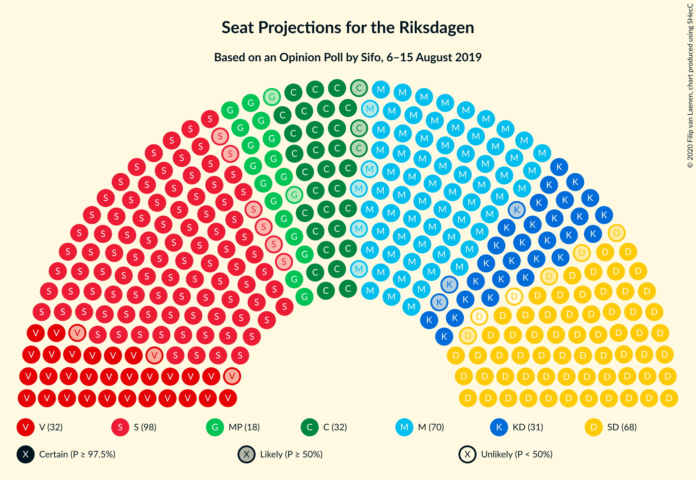
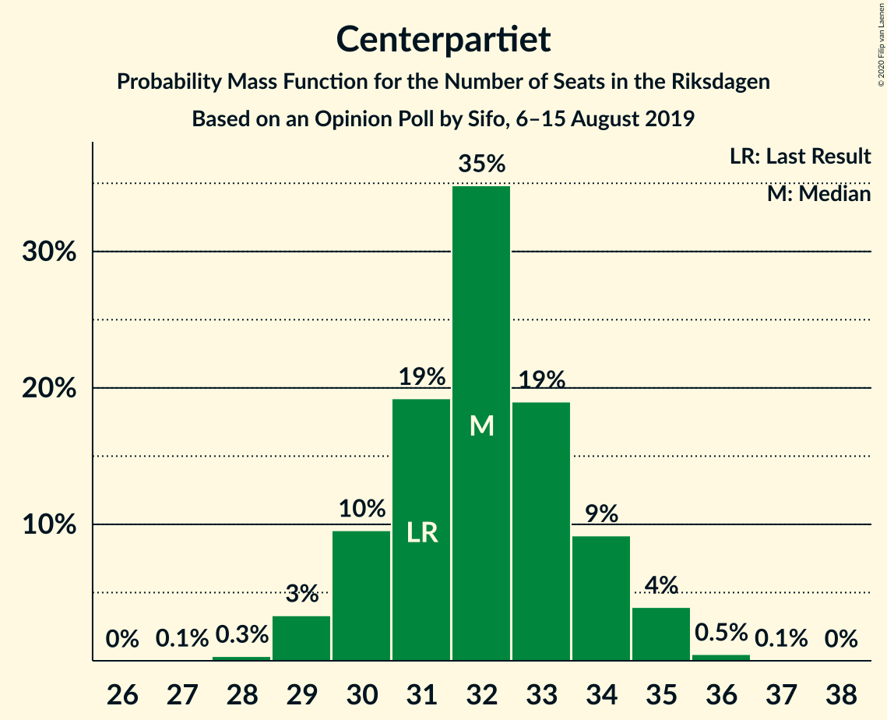
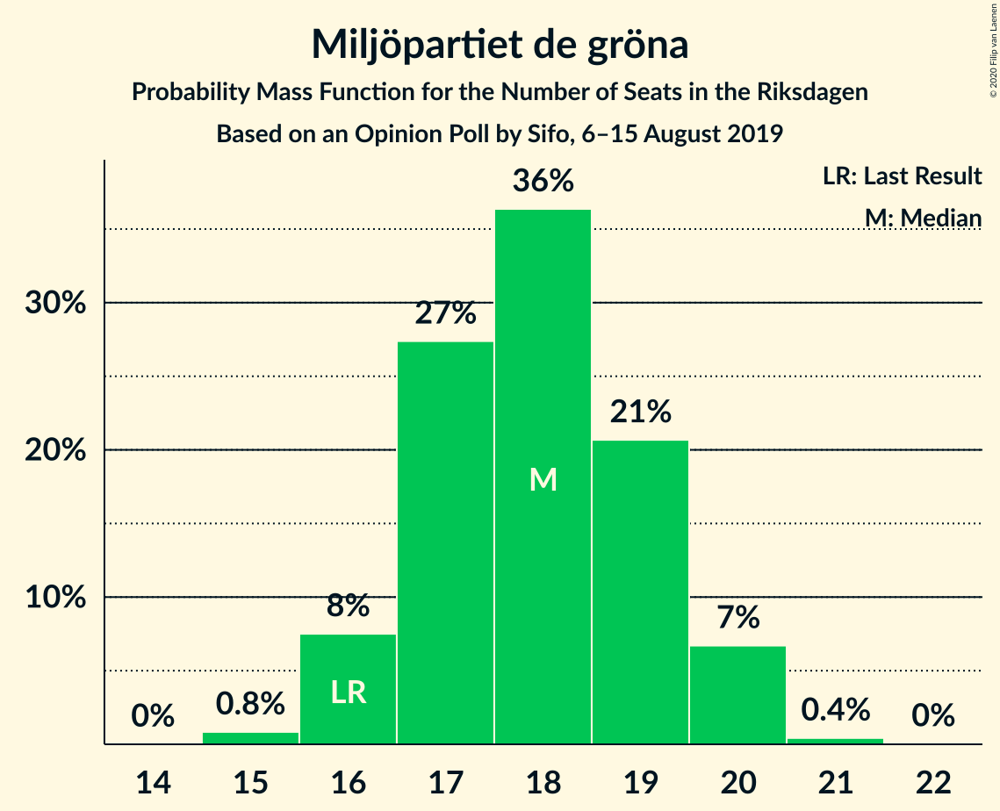

# Opinion Poll by Sifo, 6–15 August 2019

<a href="#voting-intentions">Voting Intentions</a> | <a href="#seats">Seats</a> | <a href="#coalitions">Coalitions</a> | <a href="#technical-information">Technical Information</a>

## Voting Intentions

### Confidence Intervals

| Party | Last Result | Poll Result | 80% Confidence Interval | 90% Confidence Interval | 95% Confidence Interval | 99% Confidence Interval |
|:-----:|:-----------:|:-----------:|:-----------------------:|:-----------------------:|:-----------------------:|:-----------------------:|
| Sveriges socialdemokratiska arbetareparti | 28.3% | 26.8% | 26.1–27.5% |25.9–27.7% |25.7–27.9% |25.3–28.2% |
| Moderata samlingspartiet | 19.8% | 19.1% | 18.4–19.7% |18.3–19.9% |18.1–20.1% |17.8–20.4% |
| Sverigedemokraterna | 17.5% | 18.2% | 17.6–18.8% |17.4–19.0% |17.2–19.2% |16.9–19.5% |
| Centerpartiet | 8.6% | 8.8% | 8.3–9.3% |8.2–9.4% |8.1–9.5% |7.9–9.8% |
| Vänsterpartiet | 8.0% | 8.7% | 8.2–9.2% |8.1–9.3% |8.0–9.4% |7.8–9.6% |
| Kristdemokraterna | 6.3% | 8.4% | 8.0–8.9% |7.8–9.0% |7.7–9.1% |7.5–9.3% |
| Miljöpartiet de gröna | 4.4% | 4.9% | 4.6–5.3% |4.5–5.4% |4.4–5.5% |4.2–5.6% |
| Liberalerna | 5.5% | 3.8% | 3.5–4.1% |3.4–4.2% |3.4–4.3% |3.2–4.5% |

*Note:* The poll result column reflects the actual value used in the calculations. Published results may vary slightly, and in addition be rounded to fewer digits.

## Seats

### Confidence Intervals

| Party | Last Result | Median | 80% Confidence Interval | 90% Confidence Interval | 95% Confidence Interval | 99% Confidence Interval |
|:-----:|:-----------:|:------:|:-----------------------:|:-----------------------:|:-----------------------:|:-----------------------:|
| <a href="#sveriges-socialdemokratiska-arbetareparti">Sveriges socialdemokratiska arbetareparti</a> | 100 | 97 | 93–100 |92–101 |92–103 |91–103 |
| <a href="#moderata-samlingspartiet">Moderata samlingspartiet</a> | 70 | 68 | 66–72 |66–73 |65–74 |65–75 |
| <a href="#sverigedemokraterna">Sverigedemokraterna</a> | 62 | 66 | 63–69 |63–69 |63–70 |61–71 |
| <a href="#centerpartiet">Centerpartiet</a> | 31 | 32 | 30–33 |29–33 |29–34 |28–35 |
| <a href="#vänsterpartiet">Vänsterpartiet</a> | 28 | 32 | 29–33 |29–34 |29–34 |28–35 |
| <a href="#kristdemokraterna">Kristdemokraterna</a> | 22 | 31 | 28–33 |28–34 |28–34 |27–34 |
| <a href="#miljöpartiet-de-gröna">Miljöpartiet de gröna</a> | 16 | 18 | 17–19 |16–20 |16–20 |15–21 |
| <a href="#liberalerna">Liberalerna</a> | 20 | 0 | 0–15 |0–15 |0–15 |0–16 |

### Sveriges socialdemokratiska arbetareparti

*For a full overview of the results for this party, see the [Sveriges socialdemokratiska arbetareparti](party-sverigessocialdemokratiskaarbetareparti.html) page.*

| Number of Seats | Probability | Accumulated | Special Marks |
|:---------------:|:-----------:|:-----------:|:-------------:|
| 88 | 0.1% | 100% |  |
| 89 | 0% | 99.9% |  |
| 90 | 0.3% | 99.9% |  |
| 91 | 0.6% | 99.6% |  |
| 92 | 9% | 98.9% |  |
| 93 | 6% | 90% |  |
| 94 | 12% | 84% |  |
| 95 | 12% | 72% |  |
| 96 | 6% | 61% |  |
| 97 | 14% | 54% | Median |
| 98 | 14% | 40% |  |
| 99 | 16% | 27% |  |
| 100 | 3% | 11% | Last Result |
| 101 | 3% | 7% |  |
| 102 | 1.1% | 5% |  |
| 103 | 3% | 4% |  |
| 104 | 0.3% | 0.4% |  |
| 105 | 0% | 0% |  |

### Moderata samlingspartiet

*For a full overview of the results for this party, see the [Moderata samlingspartiet](party-moderatasamlingspartiet.html) page.*

| Number of Seats | Probability | Accumulated | Special Marks |
|:---------------:|:-----------:|:-----------:|:-------------:|
| 63 | 0.1% | 100% |  |
| 64 | 0.3% | 99.9% |  |
| 65 | 2% | 99.6% |  |
| 66 | 11% | 97% |  |
| 67 | 25% | 87% |  |
| 68 | 36% | 61% | Median |
| 69 | 8% | 26% |  |
| 70 | 4% | 18% | Last Result |
| 71 | 2% | 14% |  |
| 72 | 5% | 12% |  |
| 73 | 2% | 7% |  |
| 74 | 3% | 5% |  |
| 75 | 2% | 2% |  |
| 76 | 0.4% | 0.4% |  |
| 77 | 0% | 0% |  |

### Sverigedemokraterna

*For a full overview of the results for this party, see the [Sverigedemokraterna](party-sverigedemokraterna.html) page.*

| Number of Seats | Probability | Accumulated | Special Marks |
|:---------------:|:-----------:|:-----------:|:-------------:|
| 60 | 0.1% | 100% |  |
| 61 | 0.7% | 99.9% |  |
| 62 | 2% | 99.2% | Last Result |
| 63 | 10% | 98% |  |
| 64 | 10% | 88% |  |
| 65 | 24% | 78% |  |
| 66 | 5% | 54% | Median |
| 67 | 17% | 49% |  |
| 68 | 12% | 32% |  |
| 69 | 16% | 20% |  |
| 70 | 3% | 4% |  |
| 71 | 0.7% | 0.9% |  |
| 72 | 0.1% | 0.2% |  |
| 73 | 0% | 0.1% |  |
| 74 | 0.1% | 0.1% |  |
| 75 | 0% | 0% |  |

### Centerpartiet

*For a full overview of the results for this party, see the [Centerpartiet](party-centerpartiet.html) page.*

| Number of Seats | Probability | Accumulated | Special Marks |
|:---------------:|:-----------:|:-----------:|:-------------:|
| 28 | 0.5% | 100% |  |
| 29 | 5% | 99.5% |  |
| 30 | 7% | 95% |  |
| 31 | 20% | 88% | Last Result |
| 32 | 39% | 67% | Median |
| 33 | 25% | 29% |  |
| 34 | 2% | 3% |  |
| 35 | 0.7% | 1.1% |  |
| 36 | 0.2% | 0.3% |  |
| 37 | 0.1% | 0.1% |  |
| 38 | 0% | 0% |  |

### Vänsterpartiet

*For a full overview of the results for this party, see the [Vänsterpartiet](party-vänsterpartiet.html) page.*

| Number of Seats | Probability | Accumulated | Special Marks |
|:---------------:|:-----------:|:-----------:|:-------------:|
| 28 | 0.6% | 100% | Last Result |
| 29 | 12% | 99.4% |  |
| 30 | 12% | 87% |  |
| 31 | 18% | 76% |  |
| 32 | 37% | 58% | Median |
| 33 | 11% | 21% |  |
| 34 | 9% | 10% |  |
| 35 | 0.7% | 1.1% |  |
| 36 | 0.4% | 0.4% |  |
| 37 | 0% | 0% |  |

### Kristdemokraterna

*For a full overview of the results for this party, see the [Kristdemokraterna](party-kristdemokraterna.html) page.*

| Number of Seats | Probability | Accumulated | Special Marks |
|:---------------:|:-----------:|:-----------:|:-------------:|
| 22 | 0% | 100% | Last Result |
| 23 | 0% | 100% |  |
| 24 | 0% | 100% |  |
| 25 | 0% | 100% |  |
| 26 | 0.1% | 100% |  |
| 27 | 0.5% | 99.9% |  |
| 28 | 10% | 99.4% |  |
| 29 | 6% | 89% |  |
| 30 | 26% | 83% |  |
| 31 | 29% | 57% | Median |
| 32 | 17% | 27% |  |
| 33 | 3% | 10% |  |
| 34 | 7% | 7% |  |
| 35 | 0.3% | 0.4% |  |
| 36 | 0% | 0% |  |

### Miljöpartiet de gröna

*For a full overview of the results for this party, see the [Miljöpartiet de gröna](party-miljöpartietdegröna.html) page.*

| Number of Seats | Probability | Accumulated | Special Marks |
|:---------------:|:-----------:|:-----------:|:-------------:|
| 15 | 0.8% | 100% |  |
| 16 | 5% | 99.2% | Last Result |
| 17 | 25% | 94% |  |
| 18 | 42% | 69% | Median |
| 19 | 17% | 27% |  |
| 20 | 9% | 10% |  |
| 21 | 0.6% | 0.6% |  |
| 22 | 0% | 0% |  |

### Liberalerna

*For a full overview of the results for this party, see the [Liberalerna](party-liberalerna.html) page.*

| Number of Seats | Probability | Accumulated | Special Marks |
|:---------------:|:-----------:|:-----------:|:-------------:|
| 0 | 60% | 100% | Median |
| 1 | 0% | 40% |  |
| 2 | 0% | 40% |  |
| 3 | 0% | 40% |  |
| 4 | 0% | 40% |  |
| 5 | 0% | 40% |  |
| 6 | 0% | 40% |  |
| 7 | 0% | 40% |  |
| 8 | 0% | 40% |  |
| 9 | 0% | 40% |  |
| 10 | 0% | 40% |  |
| 11 | 0% | 40% |  |
| 12 | 0% | 40% |  |
| 13 | 0% | 40% |  |
| 14 | 21% | 40% |  |
| 15 | 18% | 19% |  |
| 16 | 1.4% | 1.5% |  |
| 17 | 0.1% | 0.1% |  |
| 18 | 0% | 0% |  |
| 19 | 0% | 0% |  |
| 20 | 0% | 0% | Last Result |

## Coalitions

### Confidence Intervals

| Coalition | Last Result | Median | Majority? | 80% Confidence Interval | 90% Confidence Interval | 95% Confidence Interval | 99% Confidence Interval |
|:---------:|:-----------:|:------:|:---------:|:-----------------------:|:-----------------------:|:-----------------------:|:-----------------------:|
| Sveriges socialdemokratiska arbetareparti – Moderata samlingspartiet – Centerpartiet | 201 | 198 | 100% | 191–202 | 191–204 | 190–205 | 188–206 |
| Sveriges socialdemokratiska arbetareparti – Centerpartiet – Vänsterpartiet – Miljöpartiet de gröna – Liberalerna | 195 | 183 | 99.8% | 179–190 | 178–190 | 177–190 | 175–192 |
| Sveriges socialdemokratiska arbetareparti – Moderata samlingspartiet | 170 | 165 | 0.7% | 160–171 | 159–172 | 159–173 | 157–175 |
| Moderata samlingspartiet – Sverigedemokraterna – Kristdemokraterna | 154 | 166 | 0.2% | 159–170 | 159–171 | 159–172 | 157–174 |
| Sveriges socialdemokratiska arbetareparti – Centerpartiet – Miljöpartiet de gröna – Liberalerna | 167 | 150 | 0% | 147–158 | 146–158 | 145–158 | 143–160 |
| Sveriges socialdemokratiska arbetareparti – Vänsterpartiet – Miljöpartiet de gröna | 144 | 147 | 0% | 140–151 | 140–151 | 140–153 | 138–154 |
| Moderata samlingspartiet – Centerpartiet – Kristdemokraterna – Liberalerna | 143 | 135 | 0% | 131–145 | 130–145 | 130–145 | 128–146 |
| Moderata samlingspartiet – Sverigedemokraterna | 132 | 135 | 0% | 130–138 | 130–140 | 129–141 | 128–143 |
| Moderata samlingspartiet – Centerpartiet – Kristdemokraterna | 123 | 131 | 0% | 125–135 | 125–136 | 125–137 | 124–139 |
| Sveriges socialdemokratiska arbetareparti – Vänsterpartiet | 128 | 129 | 0% | 123–132 | 123–134 | 123–135 | 121–135 |
| Sveriges socialdemokratiska arbetareparti – Miljöpartiet de gröna | 116 | 115 | 0% | 110–117 | 110–120 | 110–121 | 108–122 |
| Moderata samlingspartiet – Centerpartiet – Liberalerna | 121 | 103 | 0% | 100–114 | 99–114 | 99–114 | 97–116 |
| Moderata samlingspartiet – Centerpartiet | 101 | 100 | 0% | 97–103 | 96–105 | 96–106 | 94–108 |

### Sveriges socialdemokratiska arbetareparti – Moderata samlingspartiet – Centerpartiet

| Number of Seats | Probability | Accumulated | Special Marks |
|:---------------:|:-----------:|:-----------:|:-------------:|
| 186 | 0.2% | 100% |  |
| 187 | 0.2% | 99.8% |  |
| 188 | 0.7% | 99.6% |  |
| 189 | 0.6% | 98.9% |  |
| 190 | 3% | 98% |  |
| 191 | 8% | 95% |  |
| 192 | 16% | 87% |  |
| 193 | 1.3% | 71% |  |
| 194 | 9% | 70% |  |
| 195 | 0.7% | 61% |  |
| 196 | 0.6% | 60% |  |
| 197 | 8% | 59% | Median |
| 198 | 12% | 51% |  |
| 199 | 16% | 39% |  |
| 200 | 5% | 23% |  |
| 201 | 2% | 17% | Last Result |
| 202 | 5% | 15% |  |
| 203 | 4% | 10% |  |
| 204 | 3% | 6% |  |
| 205 | 2% | 3% |  |
| 206 | 1.0% | 1.2% |  |
| 207 | 0.1% | 0.2% |  |
| 208 | 0% | 0.1% |  |
| 209 | 0% | 0% |  |

### Sveriges socialdemokratiska arbetareparti – Centerpartiet – Vänsterpartiet – Miljöpartiet de gröna – Liberalerna

| Number of Seats | Probability | Accumulated | Special Marks |
|:---------------:|:-----------:|:-----------:|:-------------:|
| 174 | 0.2% | 100% |  |
| 175 | 0.5% | 99.8% | Majority |
| 176 | 1.2% | 99.3% |  |
| 177 | 1.4% | 98% |  |
| 178 | 4% | 97% |  |
| 179 | 5% | 92% | Median |
| 180 | 9% | 88% |  |
| 181 | 13% | 78% |  |
| 182 | 8% | 65% |  |
| 183 | 13% | 57% |  |
| 184 | 2% | 44% |  |
| 185 | 2% | 43% |  |
| 186 | 15% | 40% |  |
| 187 | 5% | 26% |  |
| 188 | 10% | 21% |  |
| 189 | 0.2% | 11% |  |
| 190 | 9% | 11% |  |
| 191 | 0.4% | 2% |  |
| 192 | 0.9% | 1.2% |  |
| 193 | 0.2% | 0.3% |  |
| 194 | 0.1% | 0.1% |  |
| 195 | 0% | 0% | Last Result |

### Sveriges socialdemokratiska arbetareparti – Moderata samlingspartiet

| Number of Seats | Probability | Accumulated | Special Marks |
|:---------------:|:-----------:|:-----------:|:-------------:|
| 155 | 0.1% | 100% |  |
| 156 | 0.2% | 99.9% |  |
| 157 | 0.5% | 99.7% |  |
| 158 | 0.5% | 99.2% |  |
| 159 | 8% | 98.7% |  |
| 160 | 3% | 91% |  |
| 161 | 14% | 88% |  |
| 162 | 10% | 74% |  |
| 163 | 4% | 64% |  |
| 164 | 1.3% | 60% |  |
| 165 | 19% | 58% | Median |
| 166 | 6% | 40% |  |
| 167 | 14% | 33% |  |
| 168 | 3% | 19% |  |
| 169 | 2% | 16% |  |
| 170 | 2% | 15% | Last Result |
| 171 | 5% | 13% |  |
| 172 | 3% | 8% |  |
| 173 | 2% | 4% |  |
| 174 | 1.2% | 2% |  |
| 175 | 0.6% | 0.7% | Majority |
| 176 | 0% | 0% |  |

### Moderata samlingspartiet – Sverigedemokraterna – Kristdemokraterna

| Number of Seats | Probability | Accumulated | Special Marks |
|:---------------:|:-----------:|:-----------:|:-------------:|
| 154 | 0% | 100% | Last Result |
| 155 | 0.1% | 100% |  |
| 156 | 0.2% | 99.9% |  |
| 157 | 0.9% | 99.7% |  |
| 158 | 0.4% | 98.8% |  |
| 159 | 9% | 98% |  |
| 160 | 0.2% | 89% |  |
| 161 | 10% | 89% |  |
| 162 | 5% | 79% |  |
| 163 | 15% | 74% |  |
| 164 | 2% | 60% |  |
| 165 | 2% | 57% | Median |
| 166 | 13% | 56% |  |
| 167 | 8% | 43% |  |
| 168 | 13% | 35% |  |
| 169 | 9% | 22% |  |
| 170 | 5% | 12% |  |
| 171 | 4% | 8% |  |
| 172 | 1.4% | 3% |  |
| 173 | 1.2% | 2% |  |
| 174 | 0.5% | 0.7% |  |
| 175 | 0.2% | 0.2% | Majority |
| 176 | 0% | 0% |  |

### Sveriges socialdemokratiska arbetareparti – Centerpartiet – Miljöpartiet de gröna – Liberalerna

| Number of Seats | Probability | Accumulated | Special Marks |
|:---------------:|:-----------:|:-----------:|:-------------:|
| 143 | 0.9% | 100% |  |
| 144 | 0.6% | 99.0% |  |
| 145 | 3% | 98% |  |
| 146 | 2% | 96% |  |
| 147 | 5% | 94% | Median |
| 148 | 9% | 89% |  |
| 149 | 21% | 80% |  |
| 150 | 13% | 60% |  |
| 151 | 0.6% | 47% |  |
| 152 | 2% | 46% |  |
| 153 | 2% | 44% |  |
| 154 | 3% | 43% |  |
| 155 | 0.5% | 39% |  |
| 156 | 6% | 39% |  |
| 157 | 22% | 33% |  |
| 158 | 9% | 11% |  |
| 159 | 1.2% | 2% |  |
| 160 | 0.2% | 0.6% |  |
| 161 | 0.3% | 0.4% |  |
| 162 | 0.1% | 0.1% |  |
| 163 | 0% | 0% |  |
| 164 | 0% | 0% |  |
| 165 | 0% | 0% |  |
| 166 | 0% | 0% |  |
| 167 | 0% | 0% | Last Result |

### Sveriges socialdemokratiska arbetareparti – Vänsterpartiet – Miljöpartiet de gröna

| Number of Seats | Probability | Accumulated | Special Marks |
|:---------------:|:-----------:|:-----------:|:-------------:|
| 136 | 0.1% | 100% |  |
| 137 | 0.1% | 99.9% |  |
| 138 | 0.5% | 99.8% |  |
| 139 | 0.7% | 99.3% |  |
| 140 | 13% | 98.7% |  |
| 141 | 7% | 85% |  |
| 142 | 3% | 78% |  |
| 143 | 4% | 75% |  |
| 144 | 3% | 71% | Last Result |
| 145 | 11% | 68% |  |
| 146 | 3% | 57% |  |
| 147 | 11% | 54% | Median |
| 148 | 4% | 42% |  |
| 149 | 17% | 38% |  |
| 150 | 9% | 21% |  |
| 151 | 7% | 11% |  |
| 152 | 1.5% | 5% |  |
| 153 | 2% | 3% |  |
| 154 | 0.4% | 0.6% |  |
| 155 | 0% | 0.3% |  |
| 156 | 0.2% | 0.2% |  |
| 157 | 0% | 0% |  |

### Moderata samlingspartiet – Centerpartiet – Kristdemokraterna – Liberalerna

| Number of Seats | Probability | Accumulated | Special Marks |
|:---------------:|:-----------:|:-----------:|:-------------:|
| 126 | 0% | 100% |  |
| 127 | 0.4% | 99.9% |  |
| 128 | 0.1% | 99.5% |  |
| 129 | 0.5% | 99.5% |  |
| 130 | 5% | 99.0% |  |
| 131 | 22% | 94% | Median |
| 132 | 9% | 72% |  |
| 133 | 1.3% | 64% |  |
| 134 | 3% | 62% |  |
| 135 | 12% | 60% |  |
| 136 | 5% | 48% |  |
| 137 | 2% | 43% |  |
| 138 | 1.0% | 41% |  |
| 139 | 9% | 40% |  |
| 140 | 2% | 32% |  |
| 141 | 5% | 30% |  |
| 142 | 1.0% | 24% |  |
| 143 | 0.7% | 23% | Last Result |
| 144 | 10% | 23% |  |
| 145 | 12% | 13% |  |
| 146 | 0.8% | 1.1% |  |
| 147 | 0.2% | 0.3% |  |
| 148 | 0% | 0.1% |  |
| 149 | 0% | 0% |  |

### Moderata samlingspartiet – Sverigedemokraterna

| Number of Seats | Probability | Accumulated | Special Marks |
|:---------------:|:-----------:|:-----------:|:-------------:|
| 126 | 0.2% | 100% |  |
| 127 | 0.1% | 99.8% |  |
| 128 | 1.2% | 99.7% |  |
| 129 | 2% | 98.6% |  |
| 130 | 7% | 97% |  |
| 131 | 11% | 89% |  |
| 132 | 8% | 79% | Last Result |
| 133 | 10% | 70% |  |
| 134 | 9% | 60% | Median |
| 135 | 14% | 50% |  |
| 136 | 3% | 37% |  |
| 137 | 19% | 34% |  |
| 138 | 5% | 15% |  |
| 139 | 4% | 10% |  |
| 140 | 2% | 6% |  |
| 141 | 2% | 4% |  |
| 142 | 2% | 2% |  |
| 143 | 0.3% | 0.6% |  |
| 144 | 0% | 0.3% |  |
| 145 | 0.2% | 0.2% |  |
| 146 | 0% | 0% |  |

### Moderata samlingspartiet – Centerpartiet – Kristdemokraterna

| Number of Seats | Probability | Accumulated | Special Marks |
|:---------------:|:-----------:|:-----------:|:-------------:|
| 122 | 0.2% | 100% |  |
| 123 | 0.2% | 99.7% | Last Result |
| 124 | 0.2% | 99.5% |  |
| 125 | 10% | 99.3% |  |
| 126 | 4% | 90% |  |
| 127 | 3% | 85% |  |
| 128 | 0.8% | 83% |  |
| 129 | 2% | 82% |  |
| 130 | 24% | 80% |  |
| 131 | 23% | 55% | Median |
| 132 | 9% | 32% |  |
| 133 | 1.3% | 23% |  |
| 134 | 3% | 22% |  |
| 135 | 12% | 19% |  |
| 136 | 5% | 8% |  |
| 137 | 2% | 3% |  |
| 138 | 0.8% | 1.4% |  |
| 139 | 0.2% | 0.6% |  |
| 140 | 0.4% | 0.5% |  |
| 141 | 0.1% | 0.1% |  |
| 142 | 0% | 0% |  |

### Sveriges socialdemokratiska arbetareparti – Vänsterpartiet

| Number of Seats | Probability | Accumulated | Special Marks |
|:---------------:|:-----------:|:-----------:|:-------------:|
| 119 | 0% | 100% |  |
| 120 | 0.4% | 99.9% |  |
| 121 | 1.2% | 99.5% |  |
| 122 | 0.3% | 98% |  |
| 123 | 20% | 98% |  |
| 124 | 2% | 78% |  |
| 125 | 2% | 76% |  |
| 126 | 6% | 74% |  |
| 127 | 10% | 68% |  |
| 128 | 6% | 58% | Last Result |
| 129 | 14% | 52% | Median |
| 130 | 3% | 38% |  |
| 131 | 21% | 35% |  |
| 132 | 6% | 14% |  |
| 133 | 2% | 8% |  |
| 134 | 3% | 6% |  |
| 135 | 2% | 3% |  |
| 136 | 0.1% | 0.4% |  |
| 137 | 0.3% | 0.3% |  |
| 138 | 0% | 0% |  |

### Sveriges socialdemokratiska arbetareparti – Miljöpartiet de gröna

| Number of Seats | Probability | Accumulated | Special Marks |
|:---------------:|:-----------:|:-----------:|:-------------:|
| 105 | 0.1% | 100% |  |
| 106 | 0.1% | 99.9% |  |
| 107 | 0.1% | 99.8% |  |
| 108 | 0.9% | 99.7% |  |
| 109 | 0% | 98.8% |  |
| 110 | 12% | 98.8% |  |
| 111 | 12% | 87% |  |
| 112 | 3% | 75% |  |
| 113 | 15% | 72% |  |
| 114 | 2% | 56% |  |
| 115 | 9% | 54% | Median |
| 116 | 4% | 45% | Last Result |
| 117 | 33% | 41% |  |
| 118 | 1.0% | 9% |  |
| 119 | 2% | 7% |  |
| 120 | 3% | 6% |  |
| 121 | 2% | 3% |  |
| 122 | 0.6% | 0.8% |  |
| 123 | 0.2% | 0.2% |  |
| 124 | 0% | 0% |  |

### Moderata samlingspartiet – Centerpartiet – Liberalerna

| Number of Seats | Probability | Accumulated | Special Marks |
|:---------------:|:-----------:|:-----------:|:-------------:|
| 96 | 0.1% | 100% |  |
| 97 | 0.6% | 99.9% |  |
| 98 | 0.8% | 99.3% |  |
| 99 | 5% | 98.5% |  |
| 100 | 20% | 93% | Median |
| 101 | 9% | 73% |  |
| 102 | 10% | 64% |  |
| 103 | 4% | 54% |  |
| 104 | 3% | 50% |  |
| 105 | 4% | 47% |  |
| 106 | 0.7% | 43% |  |
| 107 | 1.3% | 42% |  |
| 108 | 0.9% | 41% |  |
| 109 | 1.4% | 40% |  |
| 110 | 0.1% | 39% |  |
| 111 | 14% | 39% |  |
| 112 | 1.4% | 25% |  |
| 113 | 1.0% | 23% |  |
| 114 | 20% | 22% |  |
| 115 | 0.7% | 2% |  |
| 116 | 0.7% | 1.2% |  |
| 117 | 0.4% | 0.5% |  |
| 118 | 0% | 0% |  |
| 119 | 0% | 0% |  |
| 120 | 0% | 0% |  |
| 121 | 0% | 0% | Last Result |

### Moderata samlingspartiet – Centerpartiet

| Number of Seats | Probability | Accumulated | Special Marks |
|:---------------:|:-----------:|:-----------:|:-------------:|
| 92 | 0.1% | 100% |  |
| 93 | 0.1% | 99.9% |  |
| 94 | 0.8% | 99.8% |  |
| 95 | 0.7% | 99.0% |  |
| 96 | 4% | 98% |  |
| 97 | 12% | 94% |  |
| 98 | 1.1% | 82% |  |
| 99 | 18% | 81% |  |
| 100 | 30% | 63% | Median |
| 101 | 9% | 33% | Last Result |
| 102 | 11% | 24% |  |
| 103 | 4% | 13% |  |
| 104 | 3% | 9% |  |
| 105 | 4% | 6% |  |
| 106 | 0.6% | 3% |  |
| 107 | 1.2% | 2% |  |
| 108 | 0.8% | 0.9% |  |
| 109 | 0.1% | 0.1% |  |
| 110 | 0% | 0% |  |

## Technical Information

### Opinion Poll

+ **Polling firm:** Sifo
+ **Commissioner(s):** —
+ **Fieldwork period:** 6–15 August 2019

### Calculations

+ **Sample size:** 6316
+ **Simulations done:** 131,072
+ **Error estimate:** 0.75%

