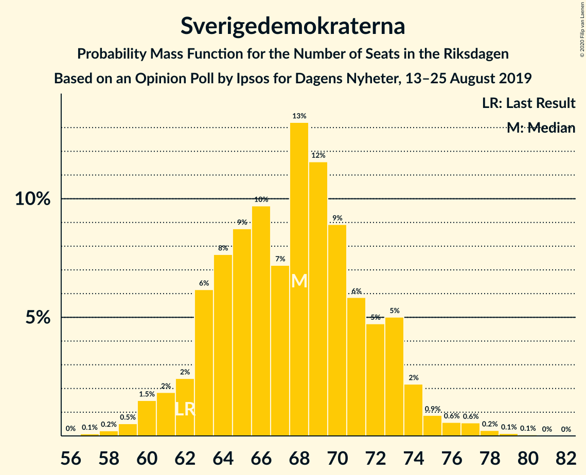
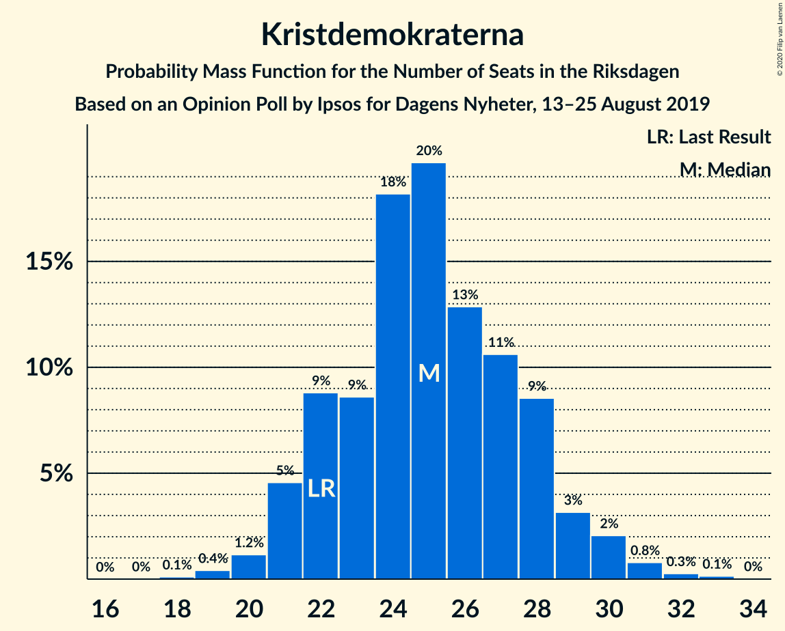
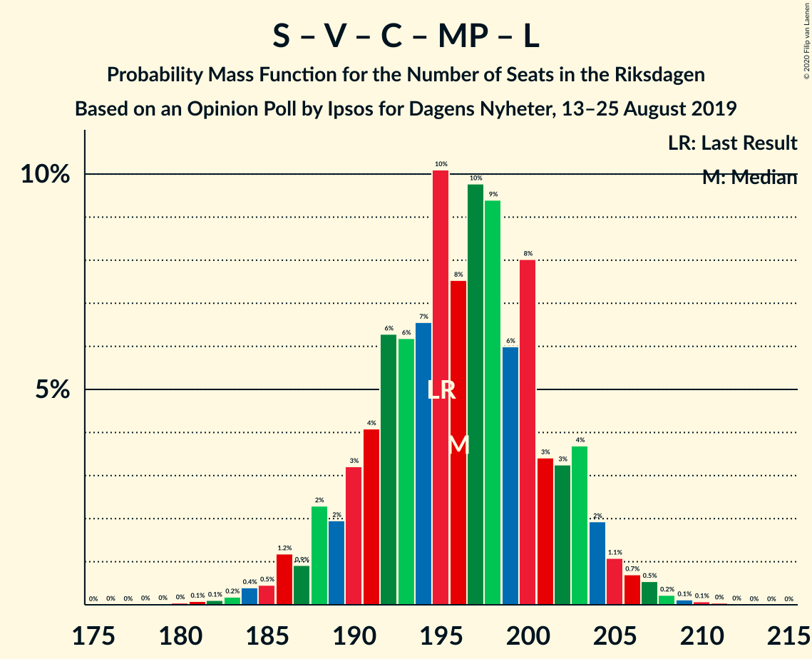
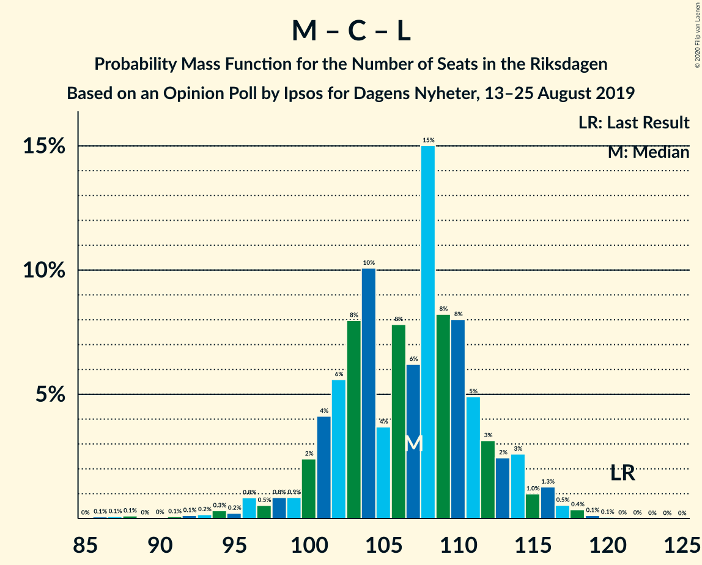

# Opinion Poll by Ipsos for Dagens Nyheter, 13–25 August 2019

<a href="#voting-intentions">Voting Intentions</a> | <a href="#seats">Seats</a> | <a href="#coalitions">Coalitions</a> | <a href="#technical-information">Technical Information</a>

## Voting Intentions

### Confidence Intervals

| Party | Last Result | Poll Result | 80% Confidence Interval | 90% Confidence Interval | 95% Confidence Interval | 99% Confidence Interval |
|:-----:|:-----------:|:-----------:|:-----------------------:|:-----------------------:|:-----------------------:|:-----------------------:|
| Sveriges socialdemokratiska arbetareparti | 28.3% | 26.0% | 24.6–27.5% |24.2–27.9% |23.9–28.2% |23.2–28.9% |
| Sverigedemokraterna | 17.5% | 19.0% | 17.8–20.3% |17.4–20.7% |17.1–21.1% |16.6–21.7% |
| Moderata samlingspartiet | 19.8% | 17.0% | 15.8–18.3% |15.5–18.7% |15.2–19.0% |14.7–19.6% |
| Vänsterpartiet | 8.0% | 10.0% | 9.1–11.0% |8.8–11.3% |8.6–11.6% |8.2–12.1% |
| Centerpartiet | 8.6% | 8.0% | 7.2–8.9% |6.9–9.2% |6.7–9.5% |6.4–9.9% |
| Kristdemokraterna | 6.3% | 7.0% | 6.2–7.9% |6.0–8.2% |5.9–8.4% |5.5–8.9% |
| Miljöpartiet de gröna | 4.4% | 6.0% | 5.3–6.8% |5.1–7.1% |4.9–7.3% |4.6–7.7% |
| Liberalerna | 5.5% | 5.0% | 4.4–5.8% |4.2–6.0% |4.0–6.2% |3.7–6.6% |

*Note:* The poll result column reflects the actual value used in the calculations. Published results may vary slightly, and in addition be rounded to fewer digits.

## Seats

### Confidence Intervals

| Party | Last Result | Median | 80% Confidence Interval | 90% Confidence Interval | 95% Confidence Interval | 99% Confidence Interval |
|:-----:|:-----------:|:------:|:-----------------------:|:-----------------------:|:-----------------------:|:-----------------------:|
| <a href="#sveriges-socialdemokratiska-arbetareparti">Sveriges socialdemokratiska arbetareparti</a> | 100 | 93 | 89–97 |87–98 |86–99 |83–102 |
| <a href="#sverigedemokraterna">Sverigedemokraterna</a> | 62 | 66 | 64–71 |62–73 |62–75 |60–77 |
| <a href="#moderata-samlingspartiet">Moderata samlingspartiet</a> | 70 | 60 | 56–64 |55–66 |54–67 |53–69 |
| <a href="#vänsterpartiet">Vänsterpartiet</a> | 28 | 36 | 32–39 |31–39 |30–40 |29–43 |
| <a href="#centerpartiet">Centerpartiet</a> | 31 | 28 | 26–32 |25–32 |24–33 |23–35 |
| <a href="#kristdemokraterna">Kristdemokraterna</a> | 22 | 25 | 23–28 |22–29 |21–30 |20–31 |
| <a href="#miljöpartiet-de-gröna">Miljöpartiet de gröna</a> | 16 | 22 | 19–24 |18–25 |18–25 |17–27 |
| <a href="#liberalerna">Liberalerna</a> | 20 | 17 | 15–20 |15–21 |14–21 |0–24 |

### Sveriges socialdemokratiska arbetareparti

*For a full overview of the results for this party, see the [Sveriges socialdemokratiska arbetareparti](party-sverigessocialdemokratiskaarbetareparti.html) page.*

| Number of Seats | Probability | Accumulated | Special Marks |
|:---------------:|:-----------:|:-----------:|:-------------:|
| 79 | 0.1% | 100% |  |
| 80 | 0.1% | 99.9% |  |
| 81 | 0.2% | 99.9% |  |
| 82 | 0.1% | 99.6% |  |
| 83 | 0.5% | 99.5% |  |
| 84 | 0.3% | 99.0% |  |
| 85 | 1.2% | 98.7% |  |
| 86 | 1.3% | 98% |  |
| 87 | 3% | 96% |  |
| 88 | 1.4% | 93% |  |
| 89 | 2% | 92% |  |
| 90 | 6% | 89% |  |
| 91 | 8% | 83% |  |
| 92 | 20% | 75% |  |
| 93 | 16% | 56% | Median |
| 94 | 9% | 40% |  |
| 95 | 4% | 32% |  |
| 96 | 7% | 27% |  |
| 97 | 10% | 20% |  |
| 98 | 6% | 10% |  |
| 99 | 1.4% | 3% |  |
| 100 | 0.9% | 2% | Last Result |
| 101 | 0.1% | 1.0% |  |
| 102 | 0.5% | 0.8% |  |
| 103 | 0.1% | 0.4% |  |
| 104 | 0.1% | 0.2% |  |
| 105 | 0.1% | 0.1% |  |
| 106 | 0% | 0.1% |  |
| 107 | 0% | 0% |  |

### Sverigedemokraterna

*For a full overview of the results for this party, see the [Sverigedemokraterna](party-sverigedemokraterna.html) page.*

| Number of Seats | Probability | Accumulated | Special Marks |
|:---------------:|:-----------:|:-----------:|:-------------:|
| 57 | 0.1% | 100% |  |
| 58 | 0.1% | 99.9% |  |
| 59 | 0.2% | 99.8% |  |
| 60 | 0.6% | 99.6% |  |
| 61 | 1.1% | 99.1% |  |
| 62 | 4% | 98% | Last Result |
| 63 | 3% | 94% |  |
| 64 | 11% | 91% |  |
| 65 | 12% | 80% |  |
| 66 | 23% | 68% | Median |
| 67 | 10% | 45% |  |
| 68 | 9% | 35% |  |
| 69 | 6% | 26% |  |
| 70 | 10% | 20% |  |
| 71 | 2% | 11% |  |
| 72 | 3% | 9% |  |
| 73 | 2% | 6% |  |
| 74 | 1.2% | 5% |  |
| 75 | 2% | 3% |  |
| 76 | 1.1% | 2% |  |
| 77 | 0.3% | 0.7% |  |
| 78 | 0.1% | 0.3% |  |
| 79 | 0.1% | 0.2% |  |
| 80 | 0% | 0.1% |  |
| 81 | 0% | 0% |  |

### Moderata samlingspartiet

*For a full overview of the results for this party, see the [Moderata samlingspartiet](party-moderatasamlingspartiet.html) page.*

| Number of Seats | Probability | Accumulated | Special Marks |
|:---------------:|:-----------:|:-----------:|:-------------:|
| 50 | 0.1% | 100% |  |
| 51 | 0.2% | 99.9% |  |
| 52 | 0.2% | 99.7% |  |
| 53 | 0.5% | 99.5% |  |
| 54 | 2% | 99.0% |  |
| 55 | 7% | 97% |  |
| 56 | 3% | 90% |  |
| 57 | 3% | 87% |  |
| 58 | 7% | 85% |  |
| 59 | 19% | 78% |  |
| 60 | 15% | 59% | Median |
| 61 | 11% | 44% |  |
| 62 | 3% | 33% |  |
| 63 | 8% | 30% |  |
| 64 | 14% | 22% |  |
| 65 | 3% | 8% |  |
| 66 | 2% | 5% |  |
| 67 | 1.0% | 3% |  |
| 68 | 1.1% | 2% |  |
| 69 | 0.7% | 1.2% |  |
| 70 | 0.2% | 0.5% | Last Result |
| 71 | 0.2% | 0.3% |  |
| 72 | 0% | 0.1% |  |
| 73 | 0% | 0% |  |

### Vänsterpartiet

*For a full overview of the results for this party, see the [Vänsterpartiet](party-vänsterpartiet.html) page.*

| Number of Seats | Probability | Accumulated | Special Marks |
|:---------------:|:-----------:|:-----------:|:-------------:|
| 28 | 0.2% | 100% | Last Result |
| 29 | 0.8% | 99.7% |  |
| 30 | 2% | 98.9% |  |
| 31 | 3% | 97% |  |
| 32 | 6% | 94% |  |
| 33 | 11% | 88% |  |
| 34 | 7% | 77% |  |
| 35 | 19% | 70% |  |
| 36 | 12% | 51% | Median |
| 37 | 12% | 39% |  |
| 38 | 13% | 27% |  |
| 39 | 9% | 14% |  |
| 40 | 2% | 5% |  |
| 41 | 0.7% | 2% |  |
| 42 | 1.0% | 1.5% |  |
| 43 | 0.3% | 0.5% |  |
| 44 | 0.2% | 0.3% |  |
| 45 | 0% | 0.1% |  |
| 46 | 0% | 0% |  |

### Centerpartiet

*For a full overview of the results for this party, see the [Centerpartiet](party-centerpartiet.html) page.*

| Number of Seats | Probability | Accumulated | Special Marks |
|:---------------:|:-----------:|:-----------:|:-------------:|
| 21 | 0% | 100% |  |
| 22 | 0.2% | 99.9% |  |
| 23 | 2% | 99.8% |  |
| 24 | 3% | 98% |  |
| 25 | 4% | 95% |  |
| 26 | 6% | 91% |  |
| 27 | 16% | 85% |  |
| 28 | 22% | 69% | Median |
| 29 | 15% | 47% |  |
| 30 | 10% | 32% |  |
| 31 | 8% | 22% | Last Result |
| 32 | 10% | 15% |  |
| 33 | 3% | 4% |  |
| 34 | 0.8% | 2% |  |
| 35 | 0.4% | 0.8% |  |
| 36 | 0.3% | 0.4% |  |
| 37 | 0.1% | 0.1% |  |
| 38 | 0% | 0% |  |

### Kristdemokraterna

*For a full overview of the results for this party, see the [Kristdemokraterna](party-kristdemokraterna.html) page.*

| Number of Seats | Probability | Accumulated | Special Marks |
|:---------------:|:-----------:|:-----------:|:-------------:|
| 18 | 0.1% | 100% |  |
| 19 | 0.2% | 99.9% |  |
| 20 | 0.9% | 99.8% |  |
| 21 | 2% | 98.9% |  |
| 22 | 6% | 97% | Last Result |
| 23 | 8% | 91% |  |
| 24 | 24% | 83% |  |
| 25 | 20% | 59% | Median |
| 26 | 14% | 39% |  |
| 27 | 11% | 25% |  |
| 28 | 6% | 15% |  |
| 29 | 5% | 9% |  |
| 30 | 3% | 4% |  |
| 31 | 0.5% | 1.0% |  |
| 32 | 0.3% | 0.5% |  |
| 33 | 0.1% | 0.1% |  |
| 34 | 0% | 0% |  |

### Miljöpartiet de gröna

*For a full overview of the results for this party, see the [Miljöpartiet de gröna](party-miljöpartietdegröna.html) page.*

| Number of Seats | Probability | Accumulated | Special Marks |
|:---------------:|:-----------:|:-----------:|:-------------:|
| 15 | 0.1% | 100% |  |
| 16 | 0.4% | 99.9% | Last Result |
| 17 | 1.5% | 99.5% |  |
| 18 | 4% | 98% |  |
| 19 | 6% | 94% |  |
| 20 | 15% | 88% |  |
| 21 | 22% | 73% |  |
| 22 | 27% | 51% | Median |
| 23 | 10% | 24% |  |
| 24 | 6% | 14% |  |
| 25 | 6% | 8% |  |
| 26 | 1.3% | 2% |  |
| 27 | 0.6% | 0.8% |  |
| 28 | 0.1% | 0.3% |  |
| 29 | 0.1% | 0.1% |  |
| 30 | 0% | 0% |  |

### Liberalerna

*For a full overview of the results for this party, see the [Liberalerna](party-liberalerna.html) page.*

| Number of Seats | Probability | Accumulated | Special Marks |
|:---------------:|:-----------:|:-----------:|:-------------:|
| 0 | 2% | 100% |  |
| 1 | 0% | 98% |  |
| 2 | 0% | 98% |  |
| 3 | 0% | 98% |  |
| 4 | 0% | 98% |  |
| 5 | 0% | 98% |  |
| 6 | 0% | 98% |  |
| 7 | 0% | 98% |  |
| 8 | 0% | 98% |  |
| 9 | 0% | 98% |  |
| 10 | 0% | 98% |  |
| 11 | 0% | 98% |  |
| 12 | 0% | 98% |  |
| 13 | 0% | 98% |  |
| 14 | 3% | 98% |  |
| 15 | 7% | 95% |  |
| 16 | 14% | 89% |  |
| 17 | 25% | 74% | Median |
| 18 | 17% | 49% |  |
| 19 | 15% | 32% |  |
| 20 | 8% | 17% | Last Result |
| 21 | 7% | 9% |  |
| 22 | 1.4% | 2% |  |
| 23 | 0.5% | 1.0% |  |
| 24 | 0.4% | 0.5% |  |
| 25 | 0.1% | 0.1% |  |
| 26 | 0% | 0% |  |

## Coalitions

### Confidence Intervals

| Coalition | Last Result | Median | Majority? | 80% Confidence Interval | 90% Confidence Interval | 95% Confidence Interval | 99% Confidence Interval |
|:---------:|:-----------:|:------:|:---------:|:-----------------------:|:-----------------------:|:-----------------------:|:-----------------------:|
| Sveriges socialdemokratiska arbetareparti – Vänsterpartiet – Centerpartiet – Miljöpartiet de gröna – Liberalerna | 195 | 197 | 100% | 192–201 | 188–201 | 187–205 | 184–206 |
| Sveriges socialdemokratiska arbetareparti – Moderata samlingspartiet – Centerpartiet | 201 | 183 | 96% | 177–187 | 175–189 | 173–191 | 171–195 |
| Sveriges socialdemokratiska arbetareparti – Centerpartiet – Miljöpartiet de gröna – Liberalerna | 167 | 162 | 0% | 155–166 | 154–168 | 152–168 | 147–171 |
| Sverigedemokraterna – Moderata samlingspartiet – Kristdemokraterna | 154 | 152 | 0% | 148–157 | 148–161 | 144–162 | 143–165 |
| Sveriges socialdemokratiska arbetareparti – Moderata samlingspartiet | 170 | 154 | 0% | 149–158 | 147–159 | 145–161 | 141–166 |
| Sveriges socialdemokratiska arbetareparti – Vänsterpartiet – Miljöpartiet de gröna | 144 | 151 | 0% | 144–155 | 143–156 | 141–157 | 139–162 |
| Moderata samlingspartiet – Centerpartiet – Kristdemokraterna – Liberalerna | 143 | 133 | 0% | 127–138 | 125–139 | 123–141 | 116–144 |
| Sverigedemokraterna – Moderata samlingspartiet | 132 | 127 | 0% | 122–133 | 122–135 | 121–136 | 118–140 |
| Sveriges socialdemokratiska arbetareparti – Vänsterpartiet | 128 | 129 | 0% | 124–133 | 122–134 | 121–135 | 118–139 |
| Moderata samlingspartiet – Centerpartiet – Kristdemokraterna | 123 | 114 | 0% | 109–119 | 108–121 | 106–123 | 104–126 |
| Sveriges socialdemokratiska arbetareparti – Miljöpartiet de gröna | 116 | 114 | 0% | 110–119 | 108–121 | 107–122 | 103–124 |
| Moderata samlingspartiet – Centerpartiet – Liberalerna | 121 | 107 | 0% | 101–111 | 99–113 | 98–115 | 93–118 |
| Moderata samlingspartiet – Centerpartiet | 101 | 89 | 0% | 83–93 | 83–95 | 81–98 | 80–99 |

### Sveriges socialdemokratiska arbetareparti – Vänsterpartiet – Centerpartiet – Miljöpartiet de gröna – Liberalerna

| Number of Seats | Probability | Accumulated | Special Marks |
|:---------------:|:-----------:|:-----------:|:-------------:|
| 179 | 0% | 100% |  |
| 180 | 0.1% | 99.9% |  |
| 181 | 0.1% | 99.9% |  |
| 182 | 0% | 99.8% |  |
| 183 | 0% | 99.8% |  |
| 184 | 0.3% | 99.7% |  |
| 185 | 0.5% | 99.4% |  |
| 186 | 0.3% | 99.0% |  |
| 187 | 2% | 98.6% |  |
| 188 | 2% | 97% |  |
| 189 | 1.3% | 95% |  |
| 190 | 1.0% | 94% |  |
| 191 | 2% | 93% |  |
| 192 | 8% | 91% |  |
| 193 | 9% | 83% |  |
| 194 | 14% | 74% |  |
| 195 | 8% | 60% | Last Result |
| 196 | 0.8% | 52% | Median |
| 197 | 3% | 51% |  |
| 198 | 7% | 49% |  |
| 199 | 6% | 42% |  |
| 200 | 23% | 36% |  |
| 201 | 8% | 13% |  |
| 202 | 1.4% | 5% |  |
| 203 | 0.3% | 3% |  |
| 204 | 0.2% | 3% |  |
| 205 | 2% | 3% |  |
| 206 | 0.8% | 1.2% |  |
| 207 | 0.2% | 0.4% |  |
| 208 | 0.1% | 0.2% |  |
| 209 | 0.1% | 0.1% |  |
| 210 | 0% | 0% |  |

### Sveriges socialdemokratiska arbetareparti – Moderata samlingspartiet – Centerpartiet

| Number of Seats | Probability | Accumulated | Special Marks |
|:---------------:|:-----------:|:-----------:|:-------------:|
| 167 | 0% | 100% |  |
| 168 | 0.1% | 99.9% |  |
| 169 | 0.2% | 99.8% |  |
| 170 | 0.1% | 99.6% |  |
| 171 | 0.3% | 99.5% |  |
| 172 | 0.5% | 99.2% |  |
| 173 | 2% | 98.7% |  |
| 174 | 1.0% | 97% |  |
| 175 | 2% | 96% | Majority |
| 176 | 3% | 94% |  |
| 177 | 6% | 91% |  |
| 178 | 6% | 85% |  |
| 179 | 3% | 79% |  |
| 180 | 4% | 76% |  |
| 181 | 10% | 72% | Median |
| 182 | 11% | 62% |  |
| 183 | 10% | 51% |  |
| 184 | 11% | 41% |  |
| 185 | 15% | 30% |  |
| 186 | 4% | 15% |  |
| 187 | 5% | 11% |  |
| 188 | 1.5% | 7% |  |
| 189 | 2% | 5% |  |
| 190 | 1.0% | 3% |  |
| 191 | 0.7% | 3% |  |
| 192 | 0.6% | 2% |  |
| 193 | 0.6% | 1.2% |  |
| 194 | 0.1% | 0.6% |  |
| 195 | 0.1% | 0.6% |  |
| 196 | 0.2% | 0.4% |  |
| 197 | 0% | 0.2% |  |
| 198 | 0% | 0.1% |  |
| 199 | 0% | 0.1% |  |
| 200 | 0% | 0.1% |  |
| 201 | 0% | 0.1% | Last Result |
| 202 | 0% | 0% |  |

### Sveriges socialdemokratiska arbetareparti – Centerpartiet – Miljöpartiet de gröna – Liberalerna

| Number of Seats | Probability | Accumulated | Special Marks |
|:---------------:|:-----------:|:-----------:|:-------------:|
| 141 | 0% | 100% |  |
| 142 | 0% | 99.9% |  |
| 143 | 0% | 99.9% |  |
| 144 | 0% | 99.9% |  |
| 145 | 0.1% | 99.9% |  |
| 146 | 0.1% | 99.8% |  |
| 147 | 0.7% | 99.7% |  |
| 148 | 0.1% | 99.0% |  |
| 149 | 0.2% | 98.8% |  |
| 150 | 0.5% | 98.6% |  |
| 151 | 0.5% | 98% |  |
| 152 | 0.7% | 98% |  |
| 153 | 2% | 97% |  |
| 154 | 1.4% | 95% |  |
| 155 | 5% | 94% |  |
| 156 | 6% | 88% |  |
| 157 | 10% | 82% |  |
| 158 | 3% | 72% |  |
| 159 | 8% | 69% |  |
| 160 | 5% | 61% | Median |
| 161 | 4% | 56% |  |
| 162 | 17% | 52% |  |
| 163 | 5% | 35% |  |
| 164 | 5% | 30% |  |
| 165 | 13% | 25% |  |
| 166 | 5% | 12% |  |
| 167 | 1.1% | 7% | Last Result |
| 168 | 4% | 6% |  |
| 169 | 0.3% | 2% |  |
| 170 | 0.6% | 1.4% |  |
| 171 | 0.3% | 0.8% |  |
| 172 | 0.2% | 0.5% |  |
| 173 | 0.1% | 0.3% |  |
| 174 | 0.2% | 0.2% |  |
| 175 | 0% | 0% | Majority |

### Sverigedemokraterna – Moderata samlingspartiet – Kristdemokraterna

| Number of Seats | Probability | Accumulated | Special Marks |
|:---------------:|:-----------:|:-----------:|:-------------:|
| 140 | 0.1% | 100% |  |
| 141 | 0.1% | 99.9% |  |
| 142 | 0.2% | 99.8% |  |
| 143 | 0.8% | 99.6% |  |
| 144 | 2% | 98.8% |  |
| 145 | 0.2% | 97% |  |
| 146 | 0.3% | 97% |  |
| 147 | 1.4% | 97% |  |
| 148 | 8% | 95% |  |
| 149 | 23% | 87% |  |
| 150 | 6% | 64% |  |
| 151 | 7% | 58% | Median |
| 152 | 3% | 51% |  |
| 153 | 0.8% | 49% |  |
| 154 | 8% | 48% | Last Result |
| 155 | 14% | 40% |  |
| 156 | 9% | 26% |  |
| 157 | 8% | 17% |  |
| 158 | 2% | 9% |  |
| 159 | 1.0% | 7% |  |
| 160 | 1.3% | 6% |  |
| 161 | 2% | 5% |  |
| 162 | 2% | 3% |  |
| 163 | 0.3% | 1.4% |  |
| 164 | 0.5% | 1.0% |  |
| 165 | 0.3% | 0.6% |  |
| 166 | 0% | 0.3% |  |
| 167 | 0% | 0.2% |  |
| 168 | 0.1% | 0.2% |  |
| 169 | 0.1% | 0.1% |  |
| 170 | 0% | 0.1% |  |
| 171 | 0% | 0% |  |

### Sveriges socialdemokratiska arbetareparti – Moderata samlingspartiet

| Number of Seats | Probability | Accumulated | Special Marks |
|:---------------:|:-----------:|:-----------:|:-------------:|
| 138 | 0% | 100% |  |
| 139 | 0.1% | 99.9% |  |
| 140 | 0.1% | 99.9% |  |
| 141 | 0.3% | 99.8% |  |
| 142 | 0.2% | 99.5% |  |
| 143 | 0.5% | 99.3% |  |
| 144 | 0.6% | 98.8% |  |
| 145 | 1.1% | 98% |  |
| 146 | 2% | 97% |  |
| 147 | 3% | 95% |  |
| 148 | 1.3% | 93% |  |
| 149 | 7% | 91% |  |
| 150 | 4% | 84% |  |
| 151 | 7% | 80% |  |
| 152 | 17% | 74% |  |
| 153 | 4% | 57% | Median |
| 154 | 9% | 52% |  |
| 155 | 4% | 43% |  |
| 156 | 18% | 39% |  |
| 157 | 9% | 22% |  |
| 158 | 3% | 13% |  |
| 159 | 5% | 10% |  |
| 160 | 1.4% | 5% |  |
| 161 | 1.2% | 3% |  |
| 162 | 1.1% | 2% |  |
| 163 | 0.4% | 1.2% |  |
| 164 | 0.1% | 0.8% |  |
| 165 | 0.1% | 0.7% |  |
| 166 | 0.1% | 0.5% |  |
| 167 | 0.3% | 0.5% |  |
| 168 | 0.1% | 0.2% |  |
| 169 | 0% | 0.1% |  |
| 170 | 0% | 0.1% | Last Result |
| 171 | 0% | 0% |  |

### Sveriges socialdemokratiska arbetareparti – Vänsterpartiet – Miljöpartiet de gröna

| Number of Seats | Probability | Accumulated | Special Marks |
|:---------------:|:-----------:|:-----------:|:-------------:|
| 135 | 0.1% | 100% |  |
| 136 | 0% | 99.8% |  |
| 137 | 0.1% | 99.8% |  |
| 138 | 0.1% | 99.7% |  |
| 139 | 0.3% | 99.6% |  |
| 140 | 0.3% | 99.3% |  |
| 141 | 2% | 99.0% |  |
| 142 | 1.5% | 97% |  |
| 143 | 3% | 96% |  |
| 144 | 4% | 93% | Last Result |
| 145 | 4% | 89% |  |
| 146 | 8% | 85% |  |
| 147 | 3% | 76% |  |
| 148 | 1.1% | 73% |  |
| 149 | 7% | 72% |  |
| 150 | 5% | 66% |  |
| 151 | 18% | 61% | Median |
| 152 | 12% | 43% |  |
| 153 | 5% | 31% |  |
| 154 | 12% | 25% |  |
| 155 | 8% | 14% |  |
| 156 | 3% | 6% |  |
| 157 | 0.6% | 3% |  |
| 158 | 0.6% | 2% |  |
| 159 | 0.5% | 2% |  |
| 160 | 0.4% | 1.3% |  |
| 161 | 0.3% | 0.8% |  |
| 162 | 0.2% | 0.6% |  |
| 163 | 0.3% | 0.4% |  |
| 164 | 0% | 0.2% |  |
| 165 | 0% | 0.1% |  |
| 166 | 0% | 0.1% |  |
| 167 | 0.1% | 0.1% |  |
| 168 | 0% | 0% |  |

### Moderata samlingspartiet – Centerpartiet – Kristdemokraterna – Liberalerna

| Number of Seats | Probability | Accumulated | Special Marks |
|:---------------:|:-----------:|:-----------:|:-------------:|
| 111 | 0% | 100% |  |
| 112 | 0% | 99.9% |  |
| 113 | 0% | 99.9% |  |
| 114 | 0.1% | 99.9% |  |
| 115 | 0.1% | 99.9% |  |
| 116 | 0.3% | 99.7% |  |
| 117 | 0.1% | 99.5% |  |
| 118 | 0.1% | 99.4% |  |
| 119 | 0.3% | 99.3% |  |
| 120 | 0.2% | 99.0% |  |
| 121 | 0.4% | 98.8% |  |
| 122 | 0.2% | 98% |  |
| 123 | 0.8% | 98% |  |
| 124 | 2% | 97% |  |
| 125 | 2% | 95% |  |
| 126 | 2% | 93% |  |
| 127 | 7% | 90% |  |
| 128 | 4% | 83% |  |
| 129 | 15% | 80% |  |
| 130 | 2% | 64% | Median |
| 131 | 3% | 62% |  |
| 132 | 9% | 59% |  |
| 133 | 23% | 50% |  |
| 134 | 6% | 27% |  |
| 135 | 4% | 21% |  |
| 136 | 3% | 17% |  |
| 137 | 3% | 14% |  |
| 138 | 5% | 10% |  |
| 139 | 0.7% | 5% |  |
| 140 | 2% | 4% |  |
| 141 | 1.0% | 3% |  |
| 142 | 0.4% | 2% |  |
| 143 | 0.6% | 1.2% | Last Result |
| 144 | 0.2% | 0.5% |  |
| 145 | 0.1% | 0.3% |  |
| 146 | 0.2% | 0.3% |  |
| 147 | 0% | 0.1% |  |
| 148 | 0% | 0% |  |

### Sverigedemokraterna – Moderata samlingspartiet

| Number of Seats | Probability | Accumulated | Special Marks |
|:---------------:|:-----------:|:-----------:|:-------------:|
| 115 | 0% | 100% |  |
| 116 | 0.2% | 99.9% |  |
| 117 | 0.2% | 99.7% |  |
| 118 | 0.2% | 99.6% |  |
| 119 | 1.2% | 99.3% |  |
| 120 | 0.5% | 98% |  |
| 121 | 2% | 98% |  |
| 122 | 6% | 96% |  |
| 123 | 6% | 90% |  |
| 124 | 1.1% | 84% |  |
| 125 | 24% | 82% |  |
| 126 | 6% | 59% | Median |
| 127 | 5% | 53% |  |
| 128 | 9% | 47% |  |
| 129 | 8% | 38% |  |
| 130 | 11% | 30% |  |
| 131 | 6% | 19% |  |
| 132 | 3% | 13% | Last Result |
| 133 | 2% | 10% |  |
| 134 | 3% | 8% |  |
| 135 | 2% | 5% |  |
| 136 | 0.7% | 3% |  |
| 137 | 0.8% | 2% |  |
| 138 | 0.7% | 1.5% |  |
| 139 | 0.2% | 0.8% |  |
| 140 | 0.3% | 0.6% |  |
| 141 | 0.1% | 0.3% |  |
| 142 | 0.1% | 0.2% |  |
| 143 | 0.1% | 0.1% |  |
| 144 | 0% | 0.1% |  |
| 145 | 0% | 0% |  |

### Sveriges socialdemokratiska arbetareparti – Vänsterpartiet

| Number of Seats | Probability | Accumulated | Special Marks |
|:---------------:|:-----------:|:-----------:|:-------------:|
| 114 | 0.1% | 100% |  |
| 115 | 0.1% | 99.9% |  |
| 116 | 0.2% | 99.9% |  |
| 117 | 0.1% | 99.7% |  |
| 118 | 0.4% | 99.5% |  |
| 119 | 0.7% | 99.2% |  |
| 120 | 1.0% | 98.5% |  |
| 121 | 1.4% | 98% |  |
| 122 | 3% | 96% |  |
| 123 | 3% | 94% |  |
| 124 | 6% | 91% |  |
| 125 | 3% | 85% |  |
| 126 | 8% | 82% |  |
| 127 | 9% | 74% |  |
| 128 | 6% | 66% | Last Result |
| 129 | 14% | 59% | Median |
| 130 | 12% | 45% |  |
| 131 | 5% | 33% |  |
| 132 | 14% | 28% |  |
| 133 | 7% | 14% |  |
| 134 | 2% | 7% |  |
| 135 | 2% | 5% |  |
| 136 | 0.9% | 2% |  |
| 137 | 0.4% | 2% |  |
| 138 | 0.5% | 1.2% |  |
| 139 | 0.2% | 0.7% |  |
| 140 | 0.1% | 0.4% |  |
| 141 | 0.1% | 0.4% |  |
| 142 | 0.1% | 0.2% |  |
| 143 | 0.1% | 0.1% |  |
| 144 | 0% | 0% |  |

### Moderata samlingspartiet – Centerpartiet – Kristdemokraterna

| Number of Seats | Probability | Accumulated | Special Marks |
|:---------------:|:-----------:|:-----------:|:-------------:|
| 101 | 0% | 100% |  |
| 102 | 0.2% | 99.9% |  |
| 103 | 0.1% | 99.8% |  |
| 104 | 0.3% | 99.7% |  |
| 105 | 0.7% | 99.4% |  |
| 106 | 1.4% | 98.7% |  |
| 107 | 0.9% | 97% |  |
| 108 | 5% | 96% |  |
| 109 | 7% | 91% |  |
| 110 | 2% | 85% |  |
| 111 | 6% | 83% |  |
| 112 | 14% | 78% |  |
| 113 | 5% | 64% | Median |
| 114 | 9% | 59% |  |
| 115 | 8% | 50% |  |
| 116 | 19% | 41% |  |
| 117 | 2% | 22% |  |
| 118 | 3% | 20% |  |
| 119 | 8% | 17% |  |
| 120 | 2% | 8% |  |
| 121 | 2% | 7% |  |
| 122 | 2% | 5% |  |
| 123 | 2% | 3% | Last Result |
| 124 | 0.8% | 2% |  |
| 125 | 0.1% | 0.8% |  |
| 126 | 0.5% | 0.7% |  |
| 127 | 0.1% | 0.2% |  |
| 128 | 0% | 0.1% |  |
| 129 | 0% | 0.1% |  |
| 130 | 0% | 0.1% |  |
| 131 | 0% | 0% |  |

### Sveriges socialdemokratiska arbetareparti – Miljöpartiet de gröna

| Number of Seats | Probability | Accumulated | Special Marks |
|:---------------:|:-----------:|:-----------:|:-------------:|
| 100 | 0% | 100% |  |
| 101 | 0.1% | 99.9% |  |
| 102 | 0.2% | 99.9% |  |
| 103 | 0.2% | 99.7% |  |
| 104 | 0.4% | 99.5% |  |
| 105 | 0.6% | 99.0% |  |
| 106 | 0.5% | 98% |  |
| 107 | 1.2% | 98% |  |
| 108 | 3% | 97% |  |
| 109 | 3% | 94% |  |
| 110 | 5% | 91% |  |
| 111 | 6% | 86% |  |
| 112 | 4% | 80% |  |
| 113 | 20% | 77% |  |
| 114 | 10% | 57% |  |
| 115 | 4% | 47% | Median |
| 116 | 12% | 43% | Last Result |
| 117 | 4% | 32% |  |
| 118 | 5% | 27% |  |
| 119 | 15% | 23% |  |
| 120 | 0.4% | 7% |  |
| 121 | 3% | 7% |  |
| 122 | 2% | 4% |  |
| 123 | 0.4% | 2% |  |
| 124 | 0.9% | 1.3% |  |
| 125 | 0.1% | 0.4% |  |
| 126 | 0.1% | 0.3% |  |
| 127 | 0.1% | 0.2% |  |
| 128 | 0% | 0.1% |  |
| 129 | 0% | 0% |  |

### Moderata samlingspartiet – Centerpartiet – Liberalerna

| Number of Seats | Probability | Accumulated | Special Marks |
|:---------------:|:-----------:|:-----------:|:-------------:|
| 86 | 0% | 100% |  |
| 87 | 0% | 99.9% |  |
| 88 | 0.1% | 99.9% |  |
| 89 | 0.1% | 99.8% |  |
| 90 | 0.1% | 99.7% |  |
| 91 | 0.1% | 99.7% |  |
| 92 | 0.1% | 99.6% |  |
| 93 | 0.1% | 99.5% |  |
| 94 | 0.3% | 99.4% |  |
| 95 | 0.1% | 99.1% |  |
| 96 | 0.3% | 99.0% |  |
| 97 | 0.3% | 98.7% |  |
| 98 | 3% | 98% |  |
| 99 | 2% | 96% |  |
| 100 | 3% | 94% |  |
| 101 | 6% | 92% |  |
| 102 | 2% | 85% |  |
| 103 | 1.2% | 83% |  |
| 104 | 3% | 82% |  |
| 105 | 16% | 79% | Median |
| 106 | 4% | 63% |  |
| 107 | 17% | 58% |  |
| 108 | 11% | 41% |  |
| 109 | 14% | 30% |  |
| 110 | 4% | 16% |  |
| 111 | 3% | 12% |  |
| 112 | 2% | 9% |  |
| 113 | 3% | 7% |  |
| 114 | 1.3% | 4% |  |
| 115 | 1.1% | 3% |  |
| 116 | 1.0% | 2% |  |
| 117 | 0.5% | 1.1% |  |
| 118 | 0.3% | 0.5% |  |
| 119 | 0.1% | 0.2% |  |
| 120 | 0.1% | 0.1% |  |
| 121 | 0% | 0.1% | Last Result |
| 122 | 0% | 0% |  |

### Moderata samlingspartiet – Centerpartiet

| Number of Seats | Probability | Accumulated | Special Marks |
|:---------------:|:-----------:|:-----------:|:-------------:|
| 77 | 0% | 100% |  |
| 78 | 0.1% | 99.9% |  |
| 79 | 0.2% | 99.9% |  |
| 80 | 1.5% | 99.6% |  |
| 81 | 1.2% | 98% |  |
| 82 | 1.4% | 97% |  |
| 83 | 8% | 96% |  |
| 84 | 2% | 88% |  |
| 85 | 3% | 86% |  |
| 86 | 5% | 83% |  |
| 87 | 3% | 78% |  |
| 88 | 15% | 75% | Median |
| 89 | 17% | 60% |  |
| 90 | 5% | 42% |  |
| 91 | 14% | 38% |  |
| 92 | 12% | 24% |  |
| 93 | 3% | 12% |  |
| 94 | 2% | 9% |  |
| 95 | 2% | 7% |  |
| 96 | 0.7% | 5% |  |
| 97 | 1.5% | 4% |  |
| 98 | 2% | 3% |  |
| 99 | 0.3% | 0.7% |  |
| 100 | 0.3% | 0.5% |  |
| 101 | 0% | 0.2% | Last Result |
| 102 | 0.1% | 0.1% |  |
| 103 | 0% | 0.1% |  |
| 104 | 0% | 0.1% |  |
| 105 | 0% | 0% |  |

## Technical Information

### Opinion Poll

+ **Polling firm:** Ipsos
+ **Commissioner(s):** Dagens Nyheter
+ **Fieldwork period:** 13–25 August 2019

### Calculations

+ **Sample size:** 1551
+ **Simulations done:** 262,144
+ **Error estimate:** 1.42%

