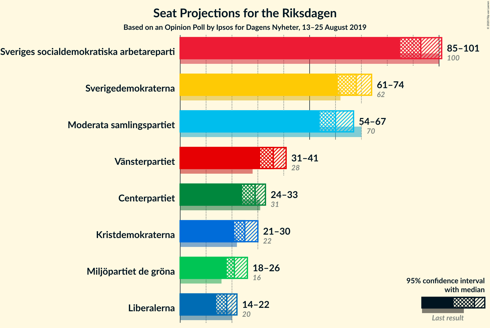
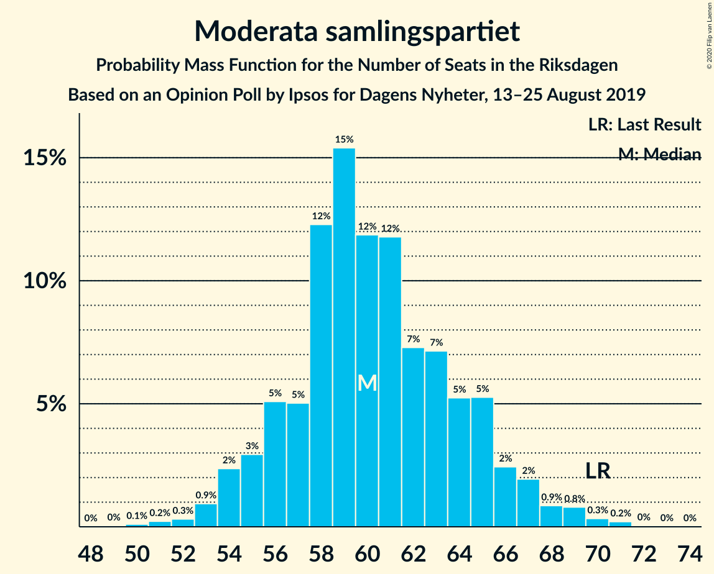
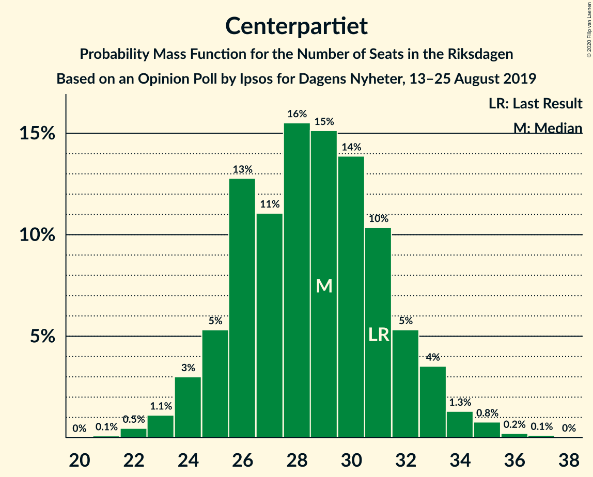
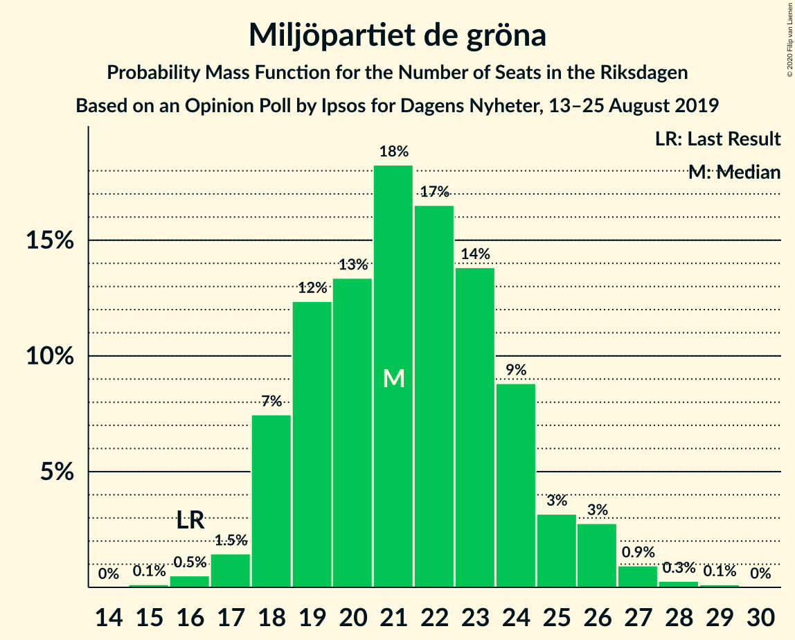
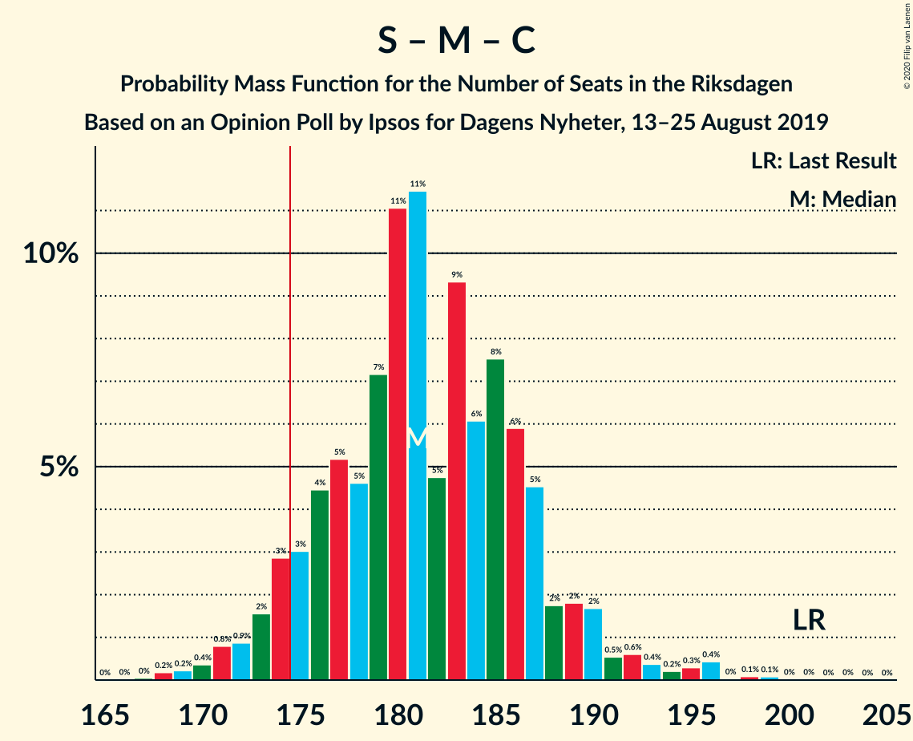

# Opinion Poll by Ipsos for Dagens Nyheter, 13–25 August 2019

<a href="#voting-intentions">Voting Intentions</a> | <a href="#seats">Seats</a> | <a href="#coalitions">Coalitions</a> | <a href="#technical-information">Technical Information</a>

## Voting Intentions

### Confidence Intervals

| Party | Last Result | Poll Result | 80% Confidence Interval | 90% Confidence Interval | 95% Confidence Interval | 99% Confidence Interval |
|:-----:|:-----------:|:-----------:|:-----------------------:|:-----------------------:|:-----------------------:|:-----------------------:|
| Sveriges socialdemokratiska arbetareparti | 28.3% | 26.0% | 24.6–27.5% |24.2–27.9% |23.9–28.3% |23.2–29.0% |
| Sverigedemokraterna | 17.5% | 19.0% | 17.8–20.4% |17.4–20.7% |17.1–21.1% |16.5–21.7% |
| Moderata samlingspartiet | 19.8% | 17.0% | 15.8–18.3% |15.5–18.7% |15.2–19.0% |14.7–19.6% |
| Vänsterpartiet | 8.0% | 10.0% | 9.1–11.1% |8.8–11.4% |8.6–11.7% |8.2–12.2% |
| Centerpartiet | 8.6% | 8.0% | 7.1–9.0% |6.9–9.2% |6.7–9.5% |6.3–10.0% |
| Kristdemokraterna | 6.3% | 7.0% | 6.2–7.9% |6.0–8.2% |5.8–8.4% |5.5–8.9% |
| Miljöpartiet de gröna | 4.4% | 6.0% | 5.3–6.9% |5.1–7.1% |4.9–7.3% |4.6–7.8% |
| Liberalerna | 5.5% | 5.0% | 4.4–5.8% |4.2–6.0% |4.0–6.2% |3.7–6.6% |

*Note:* The poll result column reflects the actual value used in the calculations. Published results may vary slightly, and in addition be rounded to fewer digits.

## Seats

### Confidence Intervals

| Party | Last Result | Median | 80% Confidence Interval | 90% Confidence Interval | 95% Confidence Interval | 99% Confidence Interval |
|:-----:|:-----------:|:------:|:-----------------------:|:-----------------------:|:-----------------------:|:-----------------------:|
| <a href="#sveriges-socialdemokratiska-arbetareparti">Sveriges socialdemokratiska arbetareparti</a> | 100 | 93 | 87–98 |86–99 |85–101 |82–103 |
| <a href="#sverigedemokraterna">Sverigedemokraterna</a> | 62 | 68 | 63–72 |62–73 |61–74 |59–77 |
| <a href="#moderata-samlingspartiet">Moderata samlingspartiet</a> | 70 | 60 | 56–65 |55–66 |54–67 |52–70 |
| <a href="#vänsterpartiet">Vänsterpartiet</a> | 28 | 36 | 32–39 |31–40 |31–41 |29–43 |
| <a href="#centerpartiet">Centerpartiet</a> | 31 | 29 | 25–32 |25–33 |24–33 |22–35 |
| <a href="#kristdemokraterna">Kristdemokraterna</a> | 22 | 25 | 22–28 |21–29 |21–30 |19–31 |
| <a href="#miljöpartiet-de-gröna">Miljöpartiet de gröna</a> | 16 | 21 | 19–24 |18–25 |18–26 |16–27 |
| <a href="#liberalerna">Liberalerna</a> | 20 | 18 | 16–21 |15–22 |14–22 |0–24 |

### Sveriges socialdemokratiska arbetareparti

*For a full overview of the results for this party, see the [Sveriges socialdemokratiska arbetareparti](party-sverigessocialdemokratiskaarbetareparti.html) page.*

| Number of Seats | Probability | Accumulated | Special Marks |
|:---------------:|:-----------:|:-----------:|:-------------:|
| 79 | 0% | 100% |  |
| 80 | 0.1% | 99.9% |  |
| 81 | 0.2% | 99.9% |  |
| 82 | 0.3% | 99.7% |  |
| 83 | 0.6% | 99.4% |  |
| 84 | 1.0% | 98.8% |  |
| 85 | 2% | 98% |  |
| 86 | 2% | 96% |  |
| 87 | 4% | 94% |  |
| 88 | 4% | 90% |  |
| 89 | 7% | 86% |  |
| 90 | 9% | 79% |  |
| 91 | 10% | 70% |  |
| 92 | 7% | 60% |  |
| 93 | 12% | 53% | Median |
| 94 | 9% | 41% |  |
| 95 | 11% | 33% |  |
| 96 | 5% | 21% |  |
| 97 | 6% | 17% |  |
| 98 | 4% | 10% |  |
| 99 | 2% | 7% |  |
| 100 | 2% | 5% | Last Result |
| 101 | 1.3% | 3% |  |
| 102 | 0.5% | 1.4% |  |
| 103 | 0.5% | 0.9% |  |
| 104 | 0.2% | 0.4% |  |
| 105 | 0.2% | 0.3% |  |
| 106 | 0% | 0.1% |  |
| 107 | 0% | 0.1% |  |
| 108 | 0% | 0% |  |

### Sverigedemokraterna

*For a full overview of the results for this party, see the [Sverigedemokraterna](party-sverigedemokraterna.html) page.*

| Number of Seats | Probability | Accumulated | Special Marks |
|:---------------:|:-----------:|:-----------:|:-------------:|
| 56 | 0% | 100% |  |
| 57 | 0.1% | 99.9% |  |
| 58 | 0.2% | 99.8% |  |
| 59 | 0.5% | 99.6% |  |
| 60 | 1.5% | 99.1% |  |
| 61 | 2% | 98% |  |
| 62 | 2% | 96% | Last Result |
| 63 | 6% | 93% |  |
| 64 | 8% | 87% |  |
| 65 | 9% | 80% |  |
| 66 | 10% | 71% |  |
| 67 | 7% | 61% |  |
| 68 | 13% | 54% | Median |
| 69 | 12% | 41% |  |
| 70 | 9% | 29% |  |
| 71 | 6% | 20% |  |
| 72 | 5% | 14% |  |
| 73 | 5% | 10% |  |
| 74 | 2% | 5% |  |
| 75 | 0.9% | 2% |  |
| 76 | 0.6% | 2% |  |
| 77 | 0.6% | 1.0% |  |
| 78 | 0.2% | 0.4% |  |
| 79 | 0.1% | 0.2% |  |
| 80 | 0.1% | 0.1% |  |
| 81 | 0% | 0% |  |

### Moderata samlingspartiet

*For a full overview of the results for this party, see the [Moderata samlingspartiet](party-moderatasamlingspartiet.html) page.*

| Number of Seats | Probability | Accumulated | Special Marks |
|:---------------:|:-----------:|:-----------:|:-------------:|
| 49 | 0% | 100% |  |
| 50 | 0.1% | 99.9% |  |
| 51 | 0.2% | 99.8% |  |
| 52 | 0.3% | 99.6% |  |
| 53 | 0.9% | 99.3% |  |
| 54 | 2% | 98% |  |
| 55 | 3% | 96% |  |
| 56 | 5% | 93% |  |
| 57 | 5% | 88% |  |
| 58 | 12% | 83% |  |
| 59 | 15% | 71% |  |
| 60 | 12% | 55% | Median |
| 61 | 12% | 43% |  |
| 62 | 7% | 32% |  |
| 63 | 7% | 24% |  |
| 64 | 5% | 17% |  |
| 65 | 5% | 12% |  |
| 66 | 2% | 7% |  |
| 67 | 2% | 4% |  |
| 68 | 0.9% | 2% |  |
| 69 | 0.8% | 1.4% |  |
| 70 | 0.3% | 0.6% | Last Result |
| 71 | 0.2% | 0.3% |  |
| 72 | 0% | 0.1% |  |
| 73 | 0% | 0% |  |

### Vänsterpartiet

*For a full overview of the results for this party, see the [Vänsterpartiet](party-vänsterpartiet.html) page.*

| Number of Seats | Probability | Accumulated | Special Marks |
|:---------------:|:-----------:|:-----------:|:-------------:|
| 27 | 0% | 100% |  |
| 28 | 0.2% | 99.9% | Last Result |
| 29 | 0.5% | 99.7% |  |
| 30 | 1.3% | 99.3% |  |
| 31 | 4% | 98% |  |
| 32 | 6% | 94% |  |
| 33 | 8% | 88% |  |
| 34 | 13% | 80% |  |
| 35 | 14% | 67% |  |
| 36 | 13% | 53% | Median |
| 37 | 15% | 40% |  |
| 38 | 11% | 25% |  |
| 39 | 5% | 15% |  |
| 40 | 5% | 9% |  |
| 41 | 2% | 4% |  |
| 42 | 0.9% | 2% |  |
| 43 | 0.6% | 1.0% |  |
| 44 | 0.3% | 0.5% |  |
| 45 | 0.1% | 0.1% |  |
| 46 | 0% | 0% |  |

### Centerpartiet

*For a full overview of the results for this party, see the [Centerpartiet](party-centerpartiet.html) page.*

| Number of Seats | Probability | Accumulated | Special Marks |
|:---------------:|:-----------:|:-----------:|:-------------:|
| 21 | 0.1% | 100% |  |
| 22 | 0.5% | 99.9% |  |
| 23 | 1.1% | 99.4% |  |
| 24 | 3% | 98% |  |
| 25 | 5% | 95% |  |
| 26 | 13% | 90% |  |
| 27 | 11% | 77% |  |
| 28 | 16% | 66% |  |
| 29 | 15% | 51% | Median |
| 30 | 14% | 36% |  |
| 31 | 10% | 22% | Last Result |
| 32 | 5% | 11% |  |
| 33 | 4% | 6% |  |
| 34 | 1.3% | 2% |  |
| 35 | 0.8% | 1.1% |  |
| 36 | 0.2% | 0.4% |  |
| 37 | 0.1% | 0.2% |  |
| 38 | 0% | 0% |  |

### Kristdemokraterna

*For a full overview of the results for this party, see the [Kristdemokraterna](party-kristdemokraterna.html) page.*

| Number of Seats | Probability | Accumulated | Special Marks |
|:---------------:|:-----------:|:-----------:|:-------------:|
| 18 | 0.1% | 100% |  |
| 19 | 0.4% | 99.9% |  |
| 20 | 1.2% | 99.5% |  |
| 21 | 5% | 98% |  |
| 22 | 9% | 94% | Last Result |
| 23 | 9% | 85% |  |
| 24 | 18% | 76% |  |
| 25 | 20% | 58% | Median |
| 26 | 13% | 38% |  |
| 27 | 11% | 26% |  |
| 28 | 9% | 15% |  |
| 29 | 3% | 6% |  |
| 30 | 2% | 3% |  |
| 31 | 0.8% | 1.2% |  |
| 32 | 0.3% | 0.4% |  |
| 33 | 0.1% | 0.2% |  |
| 34 | 0% | 0% |  |

### Miljöpartiet de gröna

*For a full overview of the results for this party, see the [Miljöpartiet de gröna](party-miljöpartietdegröna.html) page.*

| Number of Seats | Probability | Accumulated | Special Marks |
|:---------------:|:-----------:|:-----------:|:-------------:|
| 15 | 0.1% | 100% |  |
| 16 | 0.5% | 99.9% | Last Result |
| 17 | 1.5% | 99.3% |  |
| 18 | 7% | 98% |  |
| 19 | 12% | 90% |  |
| 20 | 13% | 78% |  |
| 21 | 18% | 65% | Median |
| 22 | 17% | 46% |  |
| 23 | 14% | 30% |  |
| 24 | 9% | 16% |  |
| 25 | 3% | 7% |  |
| 26 | 3% | 4% |  |
| 27 | 0.9% | 1.4% |  |
| 28 | 0.3% | 0.4% |  |
| 29 | 0.1% | 0.2% |  |
| 30 | 0% | 0% |  |

### Liberalerna

*For a full overview of the results for this party, see the [Liberalerna](party-liberalerna.html) page.*

| Number of Seats | Probability | Accumulated | Special Marks |
|:---------------:|:-----------:|:-----------:|:-------------:|
| 0 | 2% | 100% |  |
| 1 | 0% | 98% |  |
| 2 | 0% | 98% |  |
| 3 | 0% | 98% |  |
| 4 | 0% | 98% |  |
| 5 | 0% | 98% |  |
| 6 | 0% | 98% |  |
| 7 | 0% | 98% |  |
| 8 | 0% | 98% |  |
| 9 | 0% | 98% |  |
| 10 | 0% | 98% |  |
| 11 | 0% | 98% |  |
| 12 | 0% | 98% |  |
| 13 | 0% | 98% |  |
| 14 | 0.6% | 98% |  |
| 15 | 6% | 97% |  |
| 16 | 15% | 91% |  |
| 17 | 17% | 76% |  |
| 18 | 19% | 60% | Median |
| 19 | 19% | 41% |  |
| 20 | 10% | 21% | Last Result |
| 21 | 6% | 11% |  |
| 22 | 3% | 5% |  |
| 23 | 1.3% | 2% |  |
| 24 | 0.4% | 0.5% |  |
| 25 | 0.1% | 0.2% |  |
| 26 | 0% | 0% |  |

## Coalitions

### Confidence Intervals

| Coalition | Last Result | Median | Majority? | 80% Confidence Interval | 90% Confidence Interval | 95% Confidence Interval | 99% Confidence Interval |
|:---------:|:-----------:|:------:|:---------:|:-----------------------:|:-----------------------:|:-----------------------:|:-----------------------:|
| Sveriges socialdemokratiska arbetareparti – Vänsterpartiet – Centerpartiet – Miljöpartiet de gröna – Liberalerna | 195 | 196 | 100% | 190–202 | 188–203 | 186–205 | 183–207 |
| Sveriges socialdemokratiska arbetareparti – Moderata samlingspartiet – Centerpartiet | 201 | 181 | 93% | 176–187 | 174–189 | 172–191 | 170–196 |
| Sveriges socialdemokratiska arbetareparti – Centerpartiet – Miljöpartiet de gröna – Liberalerna | 167 | 160 | 0.1% | 155–166 | 152–168 | 151–169 | 147–172 |
| Sverigedemokraterna – Moderata samlingspartiet – Kristdemokraterna | 154 | 153 | 0% | 147–159 | 146–161 | 144–163 | 142–166 |
| Sveriges socialdemokratiska arbetareparti – Moderata samlingspartiet | 170 | 153 | 0% | 147–159 | 145–161 | 144–162 | 141–167 |
| Sveriges socialdemokratiska arbetareparti – Vänsterpartiet – Miljöpartiet de gröna | 144 | 150 | 0% | 144–156 | 143–158 | 141–159 | 138–163 |
| Moderata samlingspartiet – Centerpartiet – Kristdemokraterna – Liberalerna | 143 | 132 | 0% | 126–137 | 124–139 | 122–141 | 117–143 |
| Sverigedemokraterna – Moderata samlingspartiet | 132 | 128 | 0% | 122–134 | 121–135 | 119–137 | 117–140 |
| Sveriges socialdemokratiska arbetareparti – Vänsterpartiet | 128 | 129 | 0% | 123–134 | 121–136 | 119–137 | 117–140 |
| Moderata samlingspartiet – Centerpartiet – Kristdemokraterna | 123 | 114 | 0% | 108–119 | 107–121 | 106–123 | 103–126 |
| Sveriges socialdemokratiska arbetareparti – Miljöpartiet de gröna | 116 | 114 | 0% | 109–120 | 107–121 | 106–122 | 103–125 |
| Moderata samlingspartiet – Centerpartiet – Liberalerna | 121 | 107 | 0% | 101–112 | 100–114 | 97–115 | 92–118 |
| Moderata samlingspartiet – Centerpartiet | 101 | 89 | 0% | 84–94 | 82–96 | 81–97 | 79–99 |

### Sveriges socialdemokratiska arbetareparti – Vänsterpartiet – Centerpartiet – Miljöpartiet de gröna – Liberalerna

| Number of Seats | Probability | Accumulated | Special Marks |
|:---------------:|:-----------:|:-----------:|:-------------:|
| 178 | 0% | 100% |  |
| 179 | 0% | 99.9% |  |
| 180 | 0% | 99.9% |  |
| 181 | 0.1% | 99.9% |  |
| 182 | 0.1% | 99.8% |  |
| 183 | 0.2% | 99.7% |  |
| 184 | 0.4% | 99.5% |  |
| 185 | 0.5% | 99.1% |  |
| 186 | 1.2% | 98.6% |  |
| 187 | 0.9% | 97% |  |
| 188 | 2% | 97% |  |
| 189 | 2% | 94% |  |
| 190 | 3% | 92% |  |
| 191 | 4% | 89% |  |
| 192 | 6% | 85% |  |
| 193 | 6% | 79% |  |
| 194 | 7% | 73% |  |
| 195 | 10% | 66% | Last Result |
| 196 | 8% | 56% |  |
| 197 | 10% | 48% | Median |
| 198 | 9% | 39% |  |
| 199 | 6% | 29% |  |
| 200 | 8% | 23% |  |
| 201 | 3% | 15% |  |
| 202 | 3% | 12% |  |
| 203 | 4% | 8% |  |
| 204 | 2% | 5% |  |
| 205 | 1.1% | 3% |  |
| 206 | 0.7% | 2% |  |
| 207 | 0.5% | 1.0% |  |
| 208 | 0.2% | 0.5% |  |
| 209 | 0.1% | 0.3% |  |
| 210 | 0.1% | 0.1% |  |
| 211 | 0% | 0.1% |  |
| 212 | 0% | 0% |  |

### Sveriges socialdemokratiska arbetareparti – Moderata samlingspartiet – Centerpartiet

| Number of Seats | Probability | Accumulated | Special Marks |
|:---------------:|:-----------:|:-----------:|:-------------:|
| 167 | 0% | 100% |  |
| 168 | 0.2% | 99.9% |  |
| 169 | 0.2% | 99.7% |  |
| 170 | 0.4% | 99.5% |  |
| 171 | 0.8% | 99.1% |  |
| 172 | 0.9% | 98% |  |
| 173 | 2% | 97% |  |
| 174 | 3% | 96% |  |
| 175 | 3% | 93% | Majority |
| 176 | 4% | 90% |  |
| 177 | 5% | 86% |  |
| 178 | 5% | 80% |  |
| 179 | 7% | 76% |  |
| 180 | 11% | 69% |  |
| 181 | 11% | 58% |  |
| 182 | 5% | 46% | Median |
| 183 | 9% | 41% |  |
| 184 | 6% | 32% |  |
| 185 | 8% | 26% |  |
| 186 | 6% | 18% |  |
| 187 | 5% | 13% |  |
| 188 | 2% | 8% |  |
| 189 | 2% | 6% |  |
| 190 | 2% | 4% |  |
| 191 | 0.5% | 3% |  |
| 192 | 0.6% | 2% |  |
| 193 | 0.4% | 2% |  |
| 194 | 0.2% | 1.2% |  |
| 195 | 0.3% | 1.0% |  |
| 196 | 0.4% | 0.7% |  |
| 197 | 0% | 0.3% |  |
| 198 | 0.1% | 0.2% |  |
| 199 | 0.1% | 0.2% |  |
| 200 | 0% | 0.1% |  |
| 201 | 0% | 0.1% | Last Result |
| 202 | 0% | 0% |  |

### Sveriges socialdemokratiska arbetareparti – Centerpartiet – Miljöpartiet de gröna – Liberalerna

| Number of Seats | Probability | Accumulated | Special Marks |
|:---------------:|:-----------:|:-----------:|:-------------:|
| 140 | 0% | 100% |  |
| 141 | 0% | 99.9% |  |
| 142 | 0% | 99.9% |  |
| 143 | 0% | 99.9% |  |
| 144 | 0.1% | 99.8% |  |
| 145 | 0.1% | 99.7% |  |
| 146 | 0.1% | 99.6% |  |
| 147 | 0.2% | 99.5% |  |
| 148 | 0.4% | 99.3% |  |
| 149 | 0.4% | 98.9% |  |
| 150 | 0.5% | 98% |  |
| 151 | 2% | 98% |  |
| 152 | 2% | 96% |  |
| 153 | 1.4% | 94% |  |
| 154 | 2% | 93% |  |
| 155 | 5% | 90% |  |
| 156 | 4% | 85% |  |
| 157 | 6% | 81% |  |
| 158 | 10% | 75% |  |
| 159 | 6% | 65% |  |
| 160 | 10% | 59% |  |
| 161 | 8% | 48% | Median |
| 162 | 8% | 41% |  |
| 163 | 8% | 32% |  |
| 164 | 5% | 24% |  |
| 165 | 6% | 20% |  |
| 166 | 5% | 13% |  |
| 167 | 3% | 9% | Last Result |
| 168 | 1.2% | 5% |  |
| 169 | 2% | 4% |  |
| 170 | 0.9% | 2% |  |
| 171 | 0.4% | 1.0% |  |
| 172 | 0.3% | 0.7% |  |
| 173 | 0.2% | 0.4% |  |
| 174 | 0.1% | 0.1% |  |
| 175 | 0.1% | 0.1% | Majority |
| 176 | 0% | 0% |  |

### Sverigedemokraterna – Moderata samlingspartiet – Kristdemokraterna

| Number of Seats | Probability | Accumulated | Special Marks |
|:---------------:|:-----------:|:-----------:|:-------------:|
| 138 | 0% | 100% |  |
| 139 | 0.1% | 99.9% |  |
| 140 | 0.1% | 99.9% |  |
| 141 | 0.2% | 99.7% |  |
| 142 | 0.5% | 99.5% |  |
| 143 | 0.7% | 99.0% |  |
| 144 | 1.1% | 98% |  |
| 145 | 2% | 97% |  |
| 146 | 4% | 95% |  |
| 147 | 3% | 92% |  |
| 148 | 3% | 88% |  |
| 149 | 8% | 85% |  |
| 150 | 6% | 77% |  |
| 151 | 9% | 71% |  |
| 152 | 10% | 61% |  |
| 153 | 8% | 52% | Median |
| 154 | 10% | 44% | Last Result |
| 155 | 7% | 34% |  |
| 156 | 6% | 27% |  |
| 157 | 6% | 21% |  |
| 158 | 4% | 15% |  |
| 159 | 3% | 11% |  |
| 160 | 2% | 8% |  |
| 161 | 2% | 6% |  |
| 162 | 0.9% | 3% |  |
| 163 | 1.2% | 3% |  |
| 164 | 0.5% | 1.4% |  |
| 165 | 0.4% | 0.9% |  |
| 166 | 0.2% | 0.5% |  |
| 167 | 0.1% | 0.3% |  |
| 168 | 0.1% | 0.2% |  |
| 169 | 0% | 0.1% |  |
| 170 | 0% | 0.1% |  |
| 171 | 0% | 0.1% |  |
| 172 | 0% | 0% |  |

### Sveriges socialdemokratiska arbetareparti – Moderata samlingspartiet

| Number of Seats | Probability | Accumulated | Special Marks |
|:---------------:|:-----------:|:-----------:|:-------------:|
| 138 | 0% | 100% |  |
| 139 | 0.1% | 99.9% |  |
| 140 | 0.1% | 99.9% |  |
| 141 | 0.3% | 99.7% |  |
| 142 | 0.8% | 99.4% |  |
| 143 | 0.5% | 98.6% |  |
| 144 | 1.1% | 98% |  |
| 145 | 2% | 97% |  |
| 146 | 2% | 95% |  |
| 147 | 4% | 93% |  |
| 148 | 4% | 89% |  |
| 149 | 7% | 85% |  |
| 150 | 8% | 78% |  |
| 151 | 10% | 70% |  |
| 152 | 7% | 61% |  |
| 153 | 9% | 54% | Median |
| 154 | 10% | 45% |  |
| 155 | 8% | 34% |  |
| 156 | 5% | 26% |  |
| 157 | 7% | 21% |  |
| 158 | 3% | 14% |  |
| 159 | 3% | 11% |  |
| 160 | 3% | 8% |  |
| 161 | 2% | 5% |  |
| 162 | 1.0% | 3% |  |
| 163 | 0.6% | 2% |  |
| 164 | 0.4% | 2% |  |
| 165 | 0.3% | 1.2% |  |
| 166 | 0.1% | 0.8% |  |
| 167 | 0.5% | 0.7% |  |
| 168 | 0.1% | 0.2% |  |
| 169 | 0.1% | 0.1% |  |
| 170 | 0% | 0.1% | Last Result |
| 171 | 0% | 0.1% |  |
| 172 | 0% | 0% |  |

### Sveriges socialdemokratiska arbetareparti – Vänsterpartiet – Miljöpartiet de gröna

| Number of Seats | Probability | Accumulated | Special Marks |
|:---------------:|:-----------:|:-----------:|:-------------:|
| 135 | 0% | 100% |  |
| 136 | 0.1% | 99.9% |  |
| 137 | 0.1% | 99.8% |  |
| 138 | 0.5% | 99.7% |  |
| 139 | 0.4% | 99.2% |  |
| 140 | 0.7% | 98.8% |  |
| 141 | 1.4% | 98% |  |
| 142 | 1.4% | 97% |  |
| 143 | 4% | 95% |  |
| 144 | 3% | 92% | Last Result |
| 145 | 6% | 88% |  |
| 146 | 5% | 82% |  |
| 147 | 8% | 77% |  |
| 148 | 8% | 69% |  |
| 149 | 7% | 60% |  |
| 150 | 10% | 54% | Median |
| 151 | 10% | 43% |  |
| 152 | 4% | 33% |  |
| 153 | 11% | 29% |  |
| 154 | 4% | 18% |  |
| 155 | 3% | 13% |  |
| 156 | 3% | 11% |  |
| 157 | 2% | 8% |  |
| 158 | 2% | 5% |  |
| 159 | 0.9% | 3% |  |
| 160 | 0.7% | 2% |  |
| 161 | 0.4% | 1.1% |  |
| 162 | 0.2% | 0.7% |  |
| 163 | 0.3% | 0.5% |  |
| 164 | 0.1% | 0.3% |  |
| 165 | 0.1% | 0.2% |  |
| 166 | 0% | 0.1% |  |
| 167 | 0% | 0.1% |  |
| 168 | 0% | 0% |  |

### Moderata samlingspartiet – Centerpartiet – Kristdemokraterna – Liberalerna

| Number of Seats | Probability | Accumulated | Special Marks |
|:---------------:|:-----------:|:-----------:|:-------------:|
| 111 | 0% | 100% |  |
| 112 | 0% | 99.9% |  |
| 113 | 0.1% | 99.9% |  |
| 114 | 0.1% | 99.8% |  |
| 115 | 0.1% | 99.8% |  |
| 116 | 0.1% | 99.7% |  |
| 117 | 0.1% | 99.6% |  |
| 118 | 0.2% | 99.5% |  |
| 119 | 0.2% | 99.3% |  |
| 120 | 0.3% | 99.1% |  |
| 121 | 0.4% | 98.8% |  |
| 122 | 1.0% | 98% |  |
| 123 | 1.4% | 97% |  |
| 124 | 2% | 96% |  |
| 125 | 3% | 94% |  |
| 126 | 4% | 91% |  |
| 127 | 3% | 87% |  |
| 128 | 7% | 85% |  |
| 129 | 11% | 78% |  |
| 130 | 7% | 67% |  |
| 131 | 9% | 60% |  |
| 132 | 8% | 51% | Median |
| 133 | 10% | 44% |  |
| 134 | 7% | 34% |  |
| 135 | 7% | 27% |  |
| 136 | 6% | 19% |  |
| 137 | 4% | 13% |  |
| 138 | 3% | 9% |  |
| 139 | 2% | 6% |  |
| 140 | 1.2% | 4% |  |
| 141 | 1.3% | 3% |  |
| 142 | 0.7% | 1.5% |  |
| 143 | 0.4% | 0.8% | Last Result |
| 144 | 0.2% | 0.4% |  |
| 145 | 0.1% | 0.2% |  |
| 146 | 0.1% | 0.1% |  |
| 147 | 0% | 0.1% |  |
| 148 | 0% | 0% |  |

### Sverigedemokraterna – Moderata samlingspartiet

| Number of Seats | Probability | Accumulated | Special Marks |
|:---------------:|:-----------:|:-----------:|:-------------:|
| 114 | 0.1% | 100% |  |
| 115 | 0.1% | 99.9% |  |
| 116 | 0.3% | 99.8% |  |
| 117 | 0.4% | 99.5% |  |
| 118 | 0.7% | 99.1% |  |
| 119 | 1.2% | 98% |  |
| 120 | 2% | 97% |  |
| 121 | 2% | 96% |  |
| 122 | 5% | 94% |  |
| 123 | 4% | 89% |  |
| 124 | 5% | 84% |  |
| 125 | 8% | 79% |  |
| 126 | 8% | 71% |  |
| 127 | 12% | 64% |  |
| 128 | 8% | 51% | Median |
| 129 | 10% | 44% |  |
| 130 | 8% | 33% |  |
| 131 | 6% | 26% |  |
| 132 | 5% | 20% | Last Result |
| 133 | 3% | 14% |  |
| 134 | 5% | 12% |  |
| 135 | 2% | 7% |  |
| 136 | 1.4% | 4% |  |
| 137 | 1.1% | 3% |  |
| 138 | 0.7% | 2% |  |
| 139 | 0.5% | 1.2% |  |
| 140 | 0.3% | 0.7% |  |
| 141 | 0.1% | 0.4% |  |
| 142 | 0.1% | 0.2% |  |
| 143 | 0.1% | 0.1% |  |
| 144 | 0% | 0.1% |  |
| 145 | 0% | 0% |  |

### Sveriges socialdemokratiska arbetareparti – Vänsterpartiet

| Number of Seats | Probability | Accumulated | Special Marks |
|:---------------:|:-----------:|:-----------:|:-------------:|
| 114 | 0% | 100% |  |
| 115 | 0.1% | 99.9% |  |
| 116 | 0.2% | 99.9% |  |
| 117 | 0.4% | 99.7% |  |
| 118 | 0.7% | 99.3% |  |
| 119 | 1.1% | 98.6% |  |
| 120 | 1.0% | 97% |  |
| 121 | 2% | 96% |  |
| 122 | 3% | 94% |  |
| 123 | 4% | 91% |  |
| 124 | 7% | 88% |  |
| 125 | 7% | 81% |  |
| 126 | 8% | 74% |  |
| 127 | 8% | 66% |  |
| 128 | 8% | 58% | Last Result |
| 129 | 7% | 50% | Median |
| 130 | 12% | 43% |  |
| 131 | 9% | 31% |  |
| 132 | 5% | 22% |  |
| 133 | 6% | 17% |  |
| 134 | 4% | 12% |  |
| 135 | 3% | 8% |  |
| 136 | 2% | 5% |  |
| 137 | 1.3% | 3% |  |
| 138 | 0.9% | 2% |  |
| 139 | 0.4% | 1.2% |  |
| 140 | 0.4% | 0.8% |  |
| 141 | 0.2% | 0.4% |  |
| 142 | 0.1% | 0.3% |  |
| 143 | 0.1% | 0.2% |  |
| 144 | 0% | 0.1% |  |
| 145 | 0% | 0.1% |  |
| 146 | 0% | 0% |  |

### Moderata samlingspartiet – Centerpartiet – Kristdemokraterna

| Number of Seats | Probability | Accumulated | Special Marks |
|:---------------:|:-----------:|:-----------:|:-------------:|
| 100 | 0% | 100% |  |
| 101 | 0.1% | 99.9% |  |
| 102 | 0.2% | 99.8% |  |
| 103 | 0.4% | 99.7% |  |
| 104 | 0.9% | 99.3% |  |
| 105 | 0.7% | 98% |  |
| 106 | 2% | 98% |  |
| 107 | 3% | 96% |  |
| 108 | 4% | 94% |  |
| 109 | 5% | 90% |  |
| 110 | 7% | 85% |  |
| 111 | 7% | 78% |  |
| 112 | 8% | 71% |  |
| 113 | 10% | 63% |  |
| 114 | 11% | 53% | Median |
| 115 | 10% | 42% |  |
| 116 | 6% | 32% |  |
| 117 | 7% | 26% |  |
| 118 | 6% | 19% |  |
| 119 | 4% | 13% |  |
| 120 | 3% | 9% |  |
| 121 | 2% | 7% |  |
| 122 | 2% | 4% |  |
| 123 | 1.1% | 3% | Last Result |
| 124 | 0.5% | 2% |  |
| 125 | 0.5% | 1.0% |  |
| 126 | 0.3% | 0.5% |  |
| 127 | 0.1% | 0.3% |  |
| 128 | 0.1% | 0.2% |  |
| 129 | 0% | 0.1% |  |
| 130 | 0% | 0.1% |  |
| 131 | 0% | 0% |  |

### Sveriges socialdemokratiska arbetareparti – Miljöpartiet de gröna

| Number of Seats | Probability | Accumulated | Special Marks |
|:---------------:|:-----------:|:-----------:|:-------------:|
| 100 | 0% | 100% |  |
| 101 | 0.1% | 99.9% |  |
| 102 | 0.2% | 99.9% |  |
| 103 | 0.3% | 99.7% |  |
| 104 | 0.8% | 99.4% |  |
| 105 | 0.7% | 98.5% |  |
| 106 | 1.4% | 98% |  |
| 107 | 2% | 96% |  |
| 108 | 3% | 95% |  |
| 109 | 7% | 92% |  |
| 110 | 8% | 84% |  |
| 111 | 6% | 77% |  |
| 112 | 7% | 71% |  |
| 113 | 7% | 65% |  |
| 114 | 12% | 57% | Median |
| 115 | 10% | 46% |  |
| 116 | 10% | 36% | Last Result |
| 117 | 8% | 26% |  |
| 118 | 4% | 18% |  |
| 119 | 3% | 14% |  |
| 120 | 2% | 10% |  |
| 121 | 4% | 8% |  |
| 122 | 2% | 5% |  |
| 123 | 1.1% | 2% |  |
| 124 | 0.6% | 1.4% |  |
| 125 | 0.3% | 0.8% |  |
| 126 | 0.1% | 0.5% |  |
| 127 | 0.1% | 0.3% |  |
| 128 | 0.1% | 0.2% |  |
| 129 | 0% | 0.1% |  |
| 130 | 0% | 0% |  |

### Moderata samlingspartiet – Centerpartiet – Liberalerna

| Number of Seats | Probability | Accumulated | Special Marks |
|:---------------:|:-----------:|:-----------:|:-------------:|
| 85 | 0% | 100% |  |
| 86 | 0.1% | 99.9% |  |
| 87 | 0.1% | 99.9% |  |
| 88 | 0.1% | 99.8% |  |
| 89 | 0% | 99.7% |  |
| 90 | 0% | 99.7% |  |
| 91 | 0.1% | 99.6% |  |
| 92 | 0.1% | 99.5% |  |
| 93 | 0.2% | 99.4% |  |
| 94 | 0.3% | 99.3% |  |
| 95 | 0.2% | 98.9% |  |
| 96 | 0.8% | 98.7% |  |
| 97 | 0.5% | 98% |  |
| 98 | 0.8% | 97% |  |
| 99 | 0.9% | 96% |  |
| 100 | 2% | 96% |  |
| 101 | 4% | 93% |  |
| 102 | 6% | 89% |  |
| 103 | 8% | 84% |  |
| 104 | 10% | 76% |  |
| 105 | 4% | 65% |  |
| 106 | 8% | 62% |  |
| 107 | 6% | 54% | Median |
| 108 | 15% | 48% |  |
| 109 | 8% | 33% |  |
| 110 | 8% | 25% |  |
| 111 | 5% | 17% |  |
| 112 | 3% | 12% |  |
| 113 | 2% | 8% |  |
| 114 | 3% | 6% |  |
| 115 | 1.0% | 3% |  |
| 116 | 1.3% | 2% |  |
| 117 | 0.5% | 1.1% |  |
| 118 | 0.4% | 0.6% |  |
| 119 | 0.1% | 0.2% |  |
| 120 | 0.1% | 0.1% |  |
| 121 | 0% | 0.1% | Last Result |
| 122 | 0% | 0% |  |

### Moderata samlingspartiet – Centerpartiet

| Number of Seats | Probability | Accumulated | Special Marks |
|:---------------:|:-----------:|:-----------:|:-------------:|
| 76 | 0% | 100% |  |
| 77 | 0.1% | 99.9% |  |
| 78 | 0.2% | 99.9% |  |
| 79 | 0.4% | 99.7% |  |
| 80 | 0.6% | 99.3% |  |
| 81 | 1.3% | 98.7% |  |
| 82 | 3% | 97% |  |
| 83 | 3% | 95% |  |
| 84 | 5% | 91% |  |
| 85 | 7% | 86% |  |
| 86 | 9% | 80% |  |
| 87 | 7% | 71% |  |
| 88 | 9% | 64% |  |
| 89 | 12% | 54% | Median |
| 90 | 11% | 42% |  |
| 91 | 6% | 31% |  |
| 92 | 7% | 25% |  |
| 93 | 7% | 18% |  |
| 94 | 3% | 11% |  |
| 95 | 3% | 8% |  |
| 96 | 2% | 5% |  |
| 97 | 2% | 4% |  |
| 98 | 0.7% | 2% |  |
| 99 | 0.5% | 0.9% |  |
| 100 | 0.2% | 0.5% |  |
| 101 | 0.1% | 0.3% | Last Result |
| 102 | 0.1% | 0.2% |  |
| 103 | 0% | 0.1% |  |
| 104 | 0% | 0% |  |

## Technical Information

### Opinion Poll

+ **Polling firm:** Ipsos
+ **Commissioner(s):** Dagens Nyheter
+ **Fieldwork period:** 13–25 August 2019

### Calculations

+ **Sample size:** 1515
+ **Simulations done:** 1,048,576
+ **Error estimate:** 0.98%

