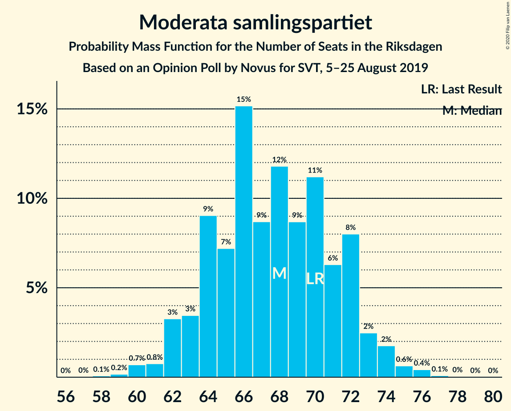
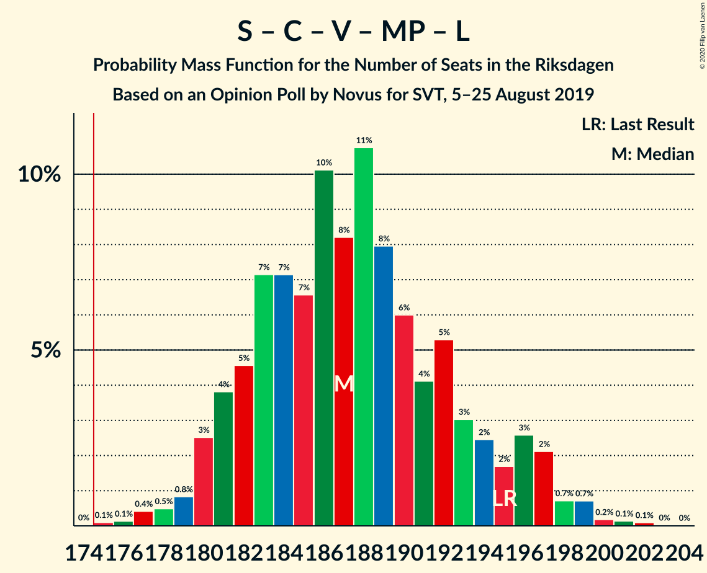

# Opinion Poll by Novus for SVT, 5–25 August 2019

<a href="#voting-intentions">Voting Intentions</a> | <a href="#seats">Seats</a> | <a href="#coalitions">Coalitions</a> | <a href="#technical-information">Technical Information</a>

## Voting Intentions

### Confidence Intervals

| Party | Last Result | Poll Result | 80% Confidence Interval | 90% Confidence Interval | 95% Confidence Interval | 99% Confidence Interval |
|:-----:|:-----------:|:-----------:|:-----------------------:|:-----------------------:|:-----------------------:|:-----------------------:|
| Sveriges socialdemokratiska arbetareparti | 28.3% | 26.3% | 25.2–27.4% |24.9–27.8% |24.7–28.0% |24.2–28.6% |
| Moderata samlingspartiet | 19.8% | 18.5% | 17.6–19.5% |17.3–19.8% |17.1–20.0% |16.6–20.5% |
| Sverigedemokraterna | 17.5% | 18.4% | 17.4–19.4% |17.2–19.7% |16.9–19.9% |16.5–20.4% |
| Centerpartiet | 8.6% | 9.4% | 8.7–10.2% |8.5–10.4% |8.3–10.6% |8.0–11.0% |
| Vänsterpartiet | 8.0% | 9.0% | 8.3–9.7% |8.1–10.0% |8.0–10.1% |7.6–10.5% |
| Kristdemokraterna | 6.3% | 7.2% | 6.6–7.9% |6.4–8.1% |6.3–8.3% |6.0–8.6% |
| Miljöpartiet de gröna | 4.4% | 5.6% | 5.1–6.2% |4.9–6.4% |4.8–6.6% |4.5–6.9% |
| Liberalerna | 5.5% | 3.7% | 3.2–4.2% |3.1–4.3% |3.0–4.5% |2.8–4.7% |

*Note:* The poll result column reflects the actual value used in the calculations. Published results may vary slightly, and in addition be rounded to fewer digits.

## Seats

### Confidence Intervals

| Party | Last Result | Median | 80% Confidence Interval | 90% Confidence Interval | 95% Confidence Interval | 99% Confidence Interval |
|:-----:|:-----------:|:------:|:-----------------------:|:-----------------------:|:-----------------------:|:-----------------------:|
| <a href="#sveriges-socialdemokratiska-arbetareparti">Sveriges socialdemokratiska arbetareparti</a> | 100 | 97 | 91–100 |91–100 |89–102 |87–104 |
| <a href="#moderata-samlingspartiet">Moderata samlingspartiet</a> | 70 | 66 | 65–71 |63–73 |63–73 |61–75 |
| <a href="#sverigedemokraterna">Sverigedemokraterna</a> | 62 | 68 | 63–70 |63–71 |62–72 |60–74 |
| <a href="#centerpartiet">Centerpartiet</a> | 31 | 35 | 32–37 |31–38 |30–39 |29–40 |
| <a href="#vänsterpartiet">Vänsterpartiet</a> | 28 | 33 | 31–36 |31–36 |30–36 |28–38 |
| <a href="#kristdemokraterna">Kristdemokraterna</a> | 22 | 26 | 24–30 |24–30 |23–30 |22–31 |
| <a href="#miljöpartiet-de-gröna">Miljöpartiet de gröna</a> | 16 | 20 | 19–23 |18–24 |17–24 |16–25 |
| <a href="#liberalerna">Liberalerna</a> | 20 | 0 | 0–15 |0–15 |0–16 |0–17 |

### Sveriges socialdemokratiska arbetareparti

*For a full overview of the results for this party, see the [Sveriges socialdemokratiska arbetareparti](party-sverigessocialdemokratiskaarbetareparti.html) page.*

| Number of Seats | Probability | Accumulated | Special Marks |
|:---------------:|:-----------:|:-----------:|:-------------:|
| 84 | 0% | 100% |  |
| 85 | 0.2% | 99.9% |  |
| 86 | 0.2% | 99.8% |  |
| 87 | 0.5% | 99.6% |  |
| 88 | 0.6% | 99.1% |  |
| 89 | 3% | 98% |  |
| 90 | 0.6% | 96% |  |
| 91 | 6% | 95% |  |
| 92 | 4% | 90% |  |
| 93 | 13% | 86% |  |
| 94 | 9% | 73% |  |
| 95 | 7% | 64% |  |
| 96 | 2% | 58% |  |
| 97 | 29% | 56% | Median |
| 98 | 3% | 27% |  |
| 99 | 6% | 24% |  |
| 100 | 14% | 18% | Last Result |
| 101 | 0.6% | 4% |  |
| 102 | 1.3% | 3% |  |
| 103 | 1.1% | 2% |  |
| 104 | 0.3% | 0.6% |  |
| 105 | 0.2% | 0.3% |  |
| 106 | 0.1% | 0.2% |  |
| 107 | 0% | 0.1% |  |
| 108 | 0% | 0% |  |

### Moderata samlingspartiet

*For a full overview of the results for this party, see the [Moderata samlingspartiet](party-moderatasamlingspartiet.html) page.*

| Number of Seats | Probability | Accumulated | Special Marks |
|:---------------:|:-----------:|:-----------:|:-------------:|
| 58 | 0% | 100% |  |
| 59 | 0.1% | 99.9% |  |
| 60 | 0.1% | 99.9% |  |
| 61 | 0.8% | 99.8% |  |
| 62 | 2% | 99.0% |  |
| 63 | 3% | 98% |  |
| 64 | 3% | 95% |  |
| 65 | 13% | 92% |  |
| 66 | 36% | 79% | Median |
| 67 | 9% | 43% |  |
| 68 | 11% | 34% |  |
| 69 | 5% | 23% |  |
| 70 | 3% | 18% | Last Result |
| 71 | 6% | 15% |  |
| 72 | 4% | 9% |  |
| 73 | 4% | 5% |  |
| 74 | 0.6% | 1.2% |  |
| 75 | 0.2% | 0.6% |  |
| 76 | 0.3% | 0.4% |  |
| 77 | 0% | 0.1% |  |
| 78 | 0% | 0.1% |  |
| 79 | 0% | 0% |  |

### Sverigedemokraterna

*For a full overview of the results for this party, see the [Sverigedemokraterna](party-sverigedemokraterna.html) page.*

| Number of Seats | Probability | Accumulated | Special Marks |
|:---------------:|:-----------:|:-----------:|:-------------:|
| 58 | 0.1% | 100% |  |
| 59 | 0.2% | 99.9% |  |
| 60 | 0.8% | 99.7% |  |
| 61 | 0.5% | 98.9% |  |
| 62 | 3% | 98% | Last Result |
| 63 | 9% | 95% |  |
| 64 | 5% | 86% |  |
| 65 | 2% | 81% |  |
| 66 | 11% | 79% |  |
| 67 | 13% | 68% |  |
| 68 | 16% | 56% | Median |
| 69 | 28% | 40% |  |
| 70 | 3% | 12% |  |
| 71 | 5% | 10% |  |
| 72 | 2% | 4% |  |
| 73 | 1.4% | 2% |  |
| 74 | 0.3% | 0.8% |  |
| 75 | 0.3% | 0.5% |  |
| 76 | 0.1% | 0.2% |  |
| 77 | 0% | 0.1% |  |
| 78 | 0% | 0% |  |

### Centerpartiet

*For a full overview of the results for this party, see the [Centerpartiet](party-centerpartiet.html) page.*

| Number of Seats | Probability | Accumulated | Special Marks |
|:---------------:|:-----------:|:-----------:|:-------------:|
| 28 | 0% | 100% |  |
| 29 | 1.3% | 99.9% |  |
| 30 | 2% | 98.7% |  |
| 31 | 4% | 97% | Last Result |
| 32 | 5% | 93% |  |
| 33 | 9% | 88% |  |
| 34 | 11% | 79% |  |
| 35 | 25% | 68% | Median |
| 36 | 30% | 43% |  |
| 37 | 7% | 13% |  |
| 38 | 3% | 5% |  |
| 39 | 1.3% | 3% |  |
| 40 | 1.2% | 2% |  |
| 41 | 0.2% | 0.3% |  |
| 42 | 0.1% | 0.1% |  |
| 43 | 0% | 0% |  |

### Vänsterpartiet

*For a full overview of the results for this party, see the [Vänsterpartiet](party-vänsterpartiet.html) page.*

| Number of Seats | Probability | Accumulated | Special Marks |
|:---------------:|:-----------:|:-----------:|:-------------:|
| 26 | 0.1% | 100% |  |
| 27 | 0.2% | 99.9% |  |
| 28 | 0.8% | 99.7% | Last Result |
| 29 | 0.9% | 98.9% |  |
| 30 | 3% | 98% |  |
| 31 | 6% | 95% |  |
| 32 | 12% | 89% |  |
| 33 | 39% | 77% | Median |
| 34 | 19% | 38% |  |
| 35 | 8% | 19% |  |
| 36 | 9% | 11% |  |
| 37 | 2% | 2% |  |
| 38 | 0.5% | 0.7% |  |
| 39 | 0.1% | 0.2% |  |
| 40 | 0.1% | 0.2% |  |
| 41 | 0% | 0% |  |

### Kristdemokraterna

*For a full overview of the results for this party, see the [Kristdemokraterna](party-kristdemokraterna.html) page.*

| Number of Seats | Probability | Accumulated | Special Marks |
|:---------------:|:-----------:|:-----------:|:-------------:|
| 21 | 0.3% | 100% |  |
| 22 | 0.6% | 99.7% | Last Result |
| 23 | 3% | 99.1% |  |
| 24 | 11% | 96% |  |
| 25 | 13% | 86% |  |
| 26 | 46% | 72% | Median |
| 27 | 4% | 27% |  |
| 28 | 6% | 22% |  |
| 29 | 4% | 16% |  |
| 30 | 10% | 12% |  |
| 31 | 2% | 2% |  |
| 32 | 0.2% | 0.3% |  |
| 33 | 0.1% | 0.1% |  |
| 34 | 0% | 0% |  |

### Miljöpartiet de gröna

*For a full overview of the results for this party, see the [Miljöpartiet de gröna](party-miljöpartietdegröna.html) page.*

| Number of Seats | Probability | Accumulated | Special Marks |
|:---------------:|:-----------:|:-----------:|:-------------:|
| 16 | 2% | 100% | Last Result |
| 17 | 1.3% | 98% |  |
| 18 | 5% | 97% |  |
| 19 | 14% | 91% |  |
| 20 | 28% | 78% | Median |
| 21 | 10% | 49% |  |
| 22 | 27% | 39% |  |
| 23 | 5% | 11% |  |
| 24 | 4% | 6% |  |
| 25 | 2% | 2% |  |
| 26 | 0.1% | 0.2% |  |
| 27 | 0.1% | 0.1% |  |
| 28 | 0% | 0% |  |

### Liberalerna

*For a full overview of the results for this party, see the [Liberalerna](party-liberalerna.html) page.*

| Number of Seats | Probability | Accumulated | Special Marks |
|:---------------:|:-----------:|:-----------:|:-------------:|
| 0 | 78% | 100% | Median |
| 1 | 0% | 22% |  |
| 2 | 0% | 22% |  |
| 3 | 0% | 22% |  |
| 4 | 0% | 22% |  |
| 5 | 0% | 22% |  |
| 6 | 0% | 22% |  |
| 7 | 0% | 22% |  |
| 8 | 0% | 22% |  |
| 9 | 0% | 22% |  |
| 10 | 0% | 22% |  |
| 11 | 0% | 22% |  |
| 12 | 0% | 22% |  |
| 13 | 0% | 22% |  |
| 14 | 4% | 22% |  |
| 15 | 16% | 19% |  |
| 16 | 2% | 3% |  |
| 17 | 0.4% | 0.6% |  |
| 18 | 0.1% | 0.2% |  |
| 19 | 0% | 0% |  |
| 20 | 0% | 0% | Last Result |

## Coalitions

### Confidence Intervals

| Coalition | Last Result | Median | Majority? | 80% Confidence Interval | 90% Confidence Interval | 95% Confidence Interval | 99% Confidence Interval |
|:---------:|:-----------:|:------:|:---------:|:-----------------------:|:-----------------------:|:-----------------------:|:-----------------------:|
| Sveriges socialdemokratiska arbetareparti – Moderata samlingspartiet – Centerpartiet | 201 | 199 | 100% | 193–202 | 190–203 | 188–205 | 186–209 |
| Sveriges socialdemokratiska arbetareparti – Centerpartiet – Vänsterpartiet – Miljöpartiet de gröna – Liberalerna | 195 | 188 | 100% | 182–197 | 181–197 | 180–197 | 178–199 |
| Sveriges socialdemokratiska arbetareparti – Moderata samlingspartiet | 170 | 163 | 0.6% | 158–167 | 156–167 | 155–171 | 153–175 |
| Moderata samlingspartiet – Sverigedemokraterna – Kristdemokraterna | 154 | 161 | 0% | 152–167 | 152–168 | 152–169 | 150–171 |
| Sveriges socialdemokratiska arbetareparti – Centerpartiet – Miljöpartiet de gröna – Liberalerna | 167 | 155 | 0% | 149–164 | 147–164 | 146–164 | 145–166 |
| Sveriges socialdemokratiska arbetareparti – Vänsterpartiet – Miljöpartiet de gröna | 144 | 152 | 0% | 145–154 | 140–154 | 140–155 | 137–158 |
| Moderata samlingspartiet – Centerpartiet – Kristdemokraterna – Liberalerna | 143 | 130 | 0% | 127–140 | 125–142 | 124–145 | 123–146 |
| Moderata samlingspartiet – Sverigedemokraterna | 132 | 135 | 0% | 128–139 | 128–141 | 127–142 | 125–144 |
| Moderata samlingspartiet – Centerpartiet – Kristdemokraterna | 123 | 128 | 0% | 124–134 | 121–136 | 120–137 | 119–138 |
| Sveriges socialdemokratiska arbetareparti – Vänsterpartiet | 128 | 130 | 0% | 124–134 | 123–135 | 121–135 | 118–137 |
| Sveriges socialdemokratiska arbetareparti – Miljöpartiet de gröna | 116 | 118 | 0% | 111–120 | 109–121 | 107–122 | 106–125 |
| Moderata samlingspartiet – Centerpartiet – Liberalerna | 121 | 103 | 0% | 101–116 | 100–116 | 98–118 | 96–119 |
| Moderata samlingspartiet – Centerpartiet | 101 | 102 | 0% | 97–106 | 96–108 | 96–108 | 94–111 |

### Sveriges socialdemokratiska arbetareparti – Moderata samlingspartiet – Centerpartiet

| Number of Seats | Probability | Accumulated | Special Marks |
|:---------------:|:-----------:|:-----------:|:-------------:|
| 184 | 0.1% | 100% |  |
| 185 | 0.2% | 99.9% |  |
| 186 | 0.3% | 99.7% |  |
| 187 | 2% | 99.4% |  |
| 188 | 0.6% | 98% |  |
| 189 | 1.2% | 97% |  |
| 190 | 2% | 96% |  |
| 191 | 1.3% | 94% |  |
| 192 | 1.3% | 92% |  |
| 193 | 4% | 91% |  |
| 194 | 10% | 87% |  |
| 195 | 2% | 78% |  |
| 196 | 3% | 75% |  |
| 197 | 8% | 72% |  |
| 198 | 2% | 64% | Median |
| 199 | 31% | 62% |  |
| 200 | 5% | 31% |  |
| 201 | 14% | 26% | Last Result |
| 202 | 6% | 12% |  |
| 203 | 1.1% | 6% |  |
| 204 | 2% | 5% |  |
| 205 | 0.4% | 3% |  |
| 206 | 0.7% | 2% |  |
| 207 | 0.2% | 2% |  |
| 208 | 0.2% | 1.3% |  |
| 209 | 0.8% | 1.1% |  |
| 210 | 0.1% | 0.4% |  |
| 211 | 0.2% | 0.2% |  |
| 212 | 0% | 0% |  |

### Sveriges socialdemokratiska arbetareparti – Centerpartiet – Vänsterpartiet – Miljöpartiet de gröna – Liberalerna

| Number of Seats | Probability | Accumulated | Special Marks |
|:---------------:|:-----------:|:-----------:|:-------------:|
| 175 | 0.1% | 100% | Majority |
| 176 | 0% | 99.8% |  |
| 177 | 0.1% | 99.8% |  |
| 178 | 0.3% | 99.7% |  |
| 179 | 0.2% | 99.4% |  |
| 180 | 2% | 99.2% |  |
| 181 | 6% | 97% |  |
| 182 | 2% | 91% |  |
| 183 | 2% | 89% |  |
| 184 | 4% | 87% |  |
| 185 | 9% | 83% | Median |
| 186 | 6% | 75% |  |
| 187 | 6% | 69% |  |
| 188 | 24% | 63% |  |
| 189 | 15% | 39% |  |
| 190 | 2% | 23% |  |
| 191 | 2% | 22% |  |
| 192 | 4% | 20% |  |
| 193 | 2% | 16% |  |
| 194 | 1.0% | 13% |  |
| 195 | 0.4% | 12% | Last Result |
| 196 | 1.4% | 12% |  |
| 197 | 9% | 10% |  |
| 198 | 0.8% | 1.4% |  |
| 199 | 0.2% | 0.6% |  |
| 200 | 0.1% | 0.4% |  |
| 201 | 0.1% | 0.2% |  |
| 202 | 0.1% | 0.1% |  |
| 203 | 0% | 0% |  |

### Sveriges socialdemokratiska arbetareparti – Moderata samlingspartiet

| Number of Seats | Probability | Accumulated | Special Marks |
|:---------------:|:-----------:|:-----------:|:-------------:|
| 151 | 0.1% | 100% |  |
| 152 | 0.2% | 99.9% |  |
| 153 | 0.5% | 99.7% |  |
| 154 | 1.1% | 99.2% |  |
| 155 | 0.9% | 98% |  |
| 156 | 4% | 97% |  |
| 157 | 0.9% | 93% |  |
| 158 | 9% | 92% |  |
| 159 | 2% | 84% |  |
| 160 | 2% | 81% |  |
| 161 | 5% | 79% |  |
| 162 | 2% | 74% |  |
| 163 | 28% | 72% | Median |
| 164 | 8% | 43% |  |
| 165 | 10% | 36% |  |
| 166 | 15% | 25% |  |
| 167 | 6% | 11% |  |
| 168 | 1.1% | 5% |  |
| 169 | 0.5% | 4% |  |
| 170 | 0.6% | 3% | Last Result |
| 171 | 0.2% | 3% |  |
| 172 | 0.7% | 2% |  |
| 173 | 0.9% | 2% |  |
| 174 | 0.1% | 0.8% |  |
| 175 | 0.4% | 0.6% | Majority |
| 176 | 0.1% | 0.2% |  |
| 177 | 0.1% | 0.1% |  |
| 178 | 0% | 0% |  |

### Moderata samlingspartiet – Sverigedemokraterna – Kristdemokraterna

| Number of Seats | Probability | Accumulated | Special Marks |
|:---------------:|:-----------:|:-----------:|:-------------:|
| 147 | 0.1% | 100% |  |
| 148 | 0.1% | 99.9% |  |
| 149 | 0.1% | 99.8% |  |
| 150 | 0.2% | 99.6% |  |
| 151 | 0.8% | 99.4% |  |
| 152 | 9% | 98.6% |  |
| 153 | 1.4% | 90% |  |
| 154 | 0.4% | 88% | Last Result |
| 155 | 1.0% | 88% |  |
| 156 | 2% | 87% |  |
| 157 | 4% | 84% |  |
| 158 | 2% | 80% |  |
| 159 | 2% | 78% |  |
| 160 | 15% | 77% | Median |
| 161 | 24% | 61% |  |
| 162 | 6% | 37% |  |
| 163 | 6% | 31% |  |
| 164 | 9% | 25% |  |
| 165 | 4% | 17% |  |
| 166 | 2% | 13% |  |
| 167 | 2% | 11% |  |
| 168 | 6% | 9% |  |
| 169 | 2% | 3% |  |
| 170 | 0.2% | 0.8% |  |
| 171 | 0.3% | 0.6% |  |
| 172 | 0.1% | 0.3% |  |
| 173 | 0% | 0.2% |  |
| 174 | 0.1% | 0.2% |  |
| 175 | 0% | 0% | Majority |

### Sveriges socialdemokratiska arbetareparti – Centerpartiet – Miljöpartiet de gröna – Liberalerna

| Number of Seats | Probability | Accumulated | Special Marks |
|:---------------:|:-----------:|:-----------:|:-------------:|
| 141 | 0% | 100% |  |
| 142 | 0.2% | 99.9% |  |
| 143 | 0.1% | 99.8% |  |
| 144 | 0.1% | 99.7% |  |
| 145 | 0.2% | 99.6% |  |
| 146 | 3% | 99.3% |  |
| 147 | 5% | 96% |  |
| 148 | 1.2% | 92% |  |
| 149 | 6% | 90% |  |
| 150 | 4% | 85% |  |
| 151 | 3% | 81% |  |
| 152 | 5% | 78% | Median |
| 153 | 7% | 73% |  |
| 154 | 3% | 66% |  |
| 155 | 33% | 63% |  |
| 156 | 5% | 29% |  |
| 157 | 2% | 24% |  |
| 158 | 2% | 22% |  |
| 159 | 2% | 20% |  |
| 160 | 4% | 19% |  |
| 161 | 1.1% | 15% |  |
| 162 | 1.4% | 14% |  |
| 163 | 2% | 13% |  |
| 164 | 9% | 10% |  |
| 165 | 0.5% | 2% |  |
| 166 | 0.6% | 1.1% |  |
| 167 | 0.2% | 0.4% | Last Result |
| 168 | 0.1% | 0.2% |  |
| 169 | 0% | 0.2% |  |
| 170 | 0.1% | 0.1% |  |
| 171 | 0% | 0.1% |  |
| 172 | 0% | 0% |  |

### Sveriges socialdemokratiska arbetareparti – Vänsterpartiet – Miljöpartiet de gröna

| Number of Seats | Probability | Accumulated | Special Marks |
|:---------------:|:-----------:|:-----------:|:-------------:|
| 136 | 0.1% | 100% |  |
| 137 | 1.1% | 99.9% |  |
| 138 | 0.2% | 98.8% |  |
| 139 | 0.1% | 98.6% |  |
| 140 | 4% | 98% |  |
| 141 | 0.2% | 95% |  |
| 142 | 0.5% | 95% |  |
| 143 | 1.4% | 94% |  |
| 144 | 3% | 93% | Last Result |
| 145 | 0.7% | 90% |  |
| 146 | 14% | 90% |  |
| 147 | 6% | 76% |  |
| 148 | 2% | 69% |  |
| 149 | 3% | 68% |  |
| 150 | 1.1% | 65% | Median |
| 151 | 9% | 64% |  |
| 152 | 32% | 55% |  |
| 153 | 7% | 23% |  |
| 154 | 12% | 16% |  |
| 155 | 3% | 4% |  |
| 156 | 0.2% | 1.4% |  |
| 157 | 0.5% | 1.1% |  |
| 158 | 0.3% | 0.6% |  |
| 159 | 0.2% | 0.3% |  |
| 160 | 0.1% | 0.2% |  |
| 161 | 0% | 0.1% |  |
| 162 | 0% | 0.1% |  |
| 163 | 0% | 0% |  |

### Moderata samlingspartiet – Centerpartiet – Kristdemokraterna – Liberalerna

| Number of Seats | Probability | Accumulated | Special Marks |
|:---------------:|:-----------:|:-----------:|:-------------:|
| 119 | 0% | 100% |  |
| 120 | 0.1% | 99.9% |  |
| 121 | 0.1% | 99.8% |  |
| 122 | 0.1% | 99.7% |  |
| 123 | 0.7% | 99.7% |  |
| 124 | 2% | 99.0% |  |
| 125 | 2% | 97% |  |
| 126 | 3% | 95% |  |
| 127 | 10% | 92% | Median |
| 128 | 23% | 81% |  |
| 129 | 6% | 58% |  |
| 130 | 9% | 52% |  |
| 131 | 5% | 43% |  |
| 132 | 2% | 39% |  |
| 133 | 2% | 36% |  |
| 134 | 7% | 34% |  |
| 135 | 2% | 28% |  |
| 136 | 4% | 26% |  |
| 137 | 4% | 22% |  |
| 138 | 3% | 18% |  |
| 139 | 1.1% | 16% |  |
| 140 | 9% | 15% |  |
| 141 | 0.2% | 6% |  |
| 142 | 0.7% | 6% |  |
| 143 | 2% | 5% | Last Result |
| 144 | 0.4% | 3% |  |
| 145 | 2% | 3% |  |
| 146 | 0.4% | 0.6% |  |
| 147 | 0.1% | 0.2% |  |
| 148 | 0.1% | 0.2% |  |
| 149 | 0% | 0.1% |  |
| 150 | 0% | 0% |  |

### Moderata samlingspartiet – Sverigedemokraterna

| Number of Seats | Probability | Accumulated | Special Marks |
|:---------------:|:-----------:|:-----------:|:-------------:|
| 122 | 0.1% | 100% |  |
| 123 | 0.1% | 99.8% |  |
| 124 | 0.1% | 99.8% |  |
| 125 | 2% | 99.7% |  |
| 126 | 0.2% | 98% |  |
| 127 | 1.0% | 98% |  |
| 128 | 10% | 97% |  |
| 129 | 1.1% | 87% |  |
| 130 | 2% | 86% |  |
| 131 | 5% | 85% |  |
| 132 | 4% | 79% | Last Result |
| 133 | 4% | 76% |  |
| 134 | 14% | 72% | Median |
| 135 | 27% | 58% |  |
| 136 | 5% | 31% |  |
| 137 | 5% | 26% |  |
| 138 | 6% | 21% |  |
| 139 | 8% | 15% |  |
| 140 | 1.1% | 7% |  |
| 141 | 2% | 5% |  |
| 142 | 3% | 4% |  |
| 143 | 0.2% | 0.7% |  |
| 144 | 0.4% | 0.5% |  |
| 145 | 0.1% | 0.2% |  |
| 146 | 0% | 0.1% |  |
| 147 | 0% | 0.1% |  |
| 148 | 0% | 0% |  |

### Moderata samlingspartiet – Centerpartiet – Kristdemokraterna

| Number of Seats | Probability | Accumulated | Special Marks |
|:---------------:|:-----------:|:-----------:|:-------------:|
| 116 | 0.1% | 100% |  |
| 117 | 0.1% | 99.9% |  |
| 118 | 0.1% | 99.8% |  |
| 119 | 0.2% | 99.7% |  |
| 120 | 2% | 99.5% |  |
| 121 | 3% | 97% |  |
| 122 | 2% | 94% |  |
| 123 | 1.0% | 93% | Last Result |
| 124 | 3% | 92% |  |
| 125 | 11% | 89% |  |
| 126 | 4% | 78% |  |
| 127 | 11% | 74% | Median |
| 128 | 24% | 63% |  |
| 129 | 8% | 40% |  |
| 130 | 11% | 32% |  |
| 131 | 5% | 21% |  |
| 132 | 2% | 16% |  |
| 133 | 2% | 14% |  |
| 134 | 5% | 12% |  |
| 135 | 2% | 7% |  |
| 136 | 0.6% | 5% |  |
| 137 | 3% | 5% |  |
| 138 | 1.1% | 1.3% |  |
| 139 | 0.1% | 0.2% |  |
| 140 | 0.1% | 0.1% |  |
| 141 | 0% | 0.1% |  |
| 142 | 0% | 0% |  |

### Sveriges socialdemokratiska arbetareparti – Vänsterpartiet

| Number of Seats | Probability | Accumulated | Special Marks |
|:---------------:|:-----------:|:-----------:|:-------------:|
| 115 | 0.1% | 100% |  |
| 116 | 0.1% | 99.8% |  |
| 117 | 0.1% | 99.7% |  |
| 118 | 0.7% | 99.7% |  |
| 119 | 0.6% | 99.0% |  |
| 120 | 0.2% | 98% |  |
| 121 | 3% | 98% |  |
| 122 | 0.3% | 96% |  |
| 123 | 0.7% | 95% |  |
| 124 | 5% | 95% |  |
| 125 | 3% | 90% |  |
| 126 | 11% | 87% |  |
| 127 | 7% | 76% |  |
| 128 | 8% | 69% | Last Result |
| 129 | 4% | 61% |  |
| 130 | 27% | 57% | Median |
| 131 | 3% | 30% |  |
| 132 | 7% | 27% |  |
| 133 | 3% | 20% |  |
| 134 | 12% | 18% |  |
| 135 | 4% | 6% |  |
| 136 | 0.5% | 2% |  |
| 137 | 0.9% | 1.3% |  |
| 138 | 0.2% | 0.4% |  |
| 139 | 0.1% | 0.2% |  |
| 140 | 0.1% | 0.1% |  |
| 141 | 0% | 0.1% |  |
| 142 | 0% | 0% |  |

### Sveriges socialdemokratiska arbetareparti – Miljöpartiet de gröna

| Number of Seats | Probability | Accumulated | Special Marks |
|:---------------:|:-----------:|:-----------:|:-------------:|
| 103 | 0% | 100% |  |
| 104 | 0% | 99.9% |  |
| 105 | 0.4% | 99.9% |  |
| 106 | 0.1% | 99.5% |  |
| 107 | 2% | 99.4% |  |
| 108 | 2% | 97% |  |
| 109 | 0.6% | 95% |  |
| 110 | 0.5% | 94% |  |
| 111 | 4% | 94% |  |
| 112 | 4% | 90% |  |
| 113 | 10% | 86% |  |
| 114 | 3% | 76% |  |
| 115 | 8% | 73% |  |
| 116 | 5% | 65% | Last Result |
| 117 | 7% | 60% | Median |
| 118 | 6% | 53% |  |
| 119 | 26% | 47% |  |
| 120 | 15% | 21% |  |
| 121 | 2% | 6% |  |
| 122 | 2% | 4% |  |
| 123 | 0.8% | 2% |  |
| 124 | 0.5% | 1.0% |  |
| 125 | 0.3% | 0.5% |  |
| 126 | 0.1% | 0.3% |  |
| 127 | 0.1% | 0.2% |  |
| 128 | 0% | 0.1% |  |
| 129 | 0% | 0% |  |

### Moderata samlingspartiet – Centerpartiet – Liberalerna

| Number of Seats | Probability | Accumulated | Special Marks |
|:---------------:|:-----------:|:-----------:|:-------------:|
| 94 | 0.1% | 100% |  |
| 95 | 0.2% | 99.9% |  |
| 96 | 0.7% | 99.7% |  |
| 97 | 1.3% | 99.0% |  |
| 98 | 0.8% | 98% |  |
| 99 | 2% | 97% |  |
| 100 | 4% | 95% |  |
| 101 | 14% | 92% | Median |
| 102 | 26% | 77% |  |
| 103 | 6% | 52% |  |
| 104 | 6% | 45% |  |
| 105 | 5% | 40% |  |
| 106 | 2% | 34% |  |
| 107 | 4% | 32% |  |
| 108 | 4% | 27% |  |
| 109 | 2% | 24% |  |
| 110 | 2% | 22% |  |
| 111 | 3% | 20% |  |
| 112 | 2% | 17% |  |
| 113 | 1.0% | 16% |  |
| 114 | 0.8% | 15% |  |
| 115 | 0.5% | 14% |  |
| 116 | 9% | 13% |  |
| 117 | 2% | 5% |  |
| 118 | 0.6% | 3% |  |
| 119 | 2% | 2% |  |
| 120 | 0.1% | 0.3% |  |
| 121 | 0.1% | 0.2% | Last Result |
| 122 | 0% | 0.1% |  |
| 123 | 0% | 0.1% |  |
| 124 | 0.1% | 0.1% |  |
| 125 | 0% | 0% |  |

### Moderata samlingspartiet – Centerpartiet

| Number of Seats | Probability | Accumulated | Special Marks |
|:---------------:|:-----------:|:-----------:|:-------------:|
| 91 | 0.1% | 100% |  |
| 92 | 0.2% | 99.9% |  |
| 93 | 0.2% | 99.7% |  |
| 94 | 0.3% | 99.5% |  |
| 95 | 1.4% | 99.2% |  |
| 96 | 5% | 98% |  |
| 97 | 3% | 93% |  |
| 98 | 1.0% | 90% |  |
| 99 | 2% | 89% |  |
| 100 | 4% | 87% |  |
| 101 | 23% | 82% | Last Result, Median |
| 102 | 26% | 59% |  |
| 103 | 8% | 33% |  |
| 104 | 8% | 25% |  |
| 105 | 6% | 18% |  |
| 106 | 2% | 12% |  |
| 107 | 4% | 10% |  |
| 108 | 3% | 5% |  |
| 109 | 0.8% | 2% |  |
| 110 | 0.2% | 0.8% |  |
| 111 | 0.2% | 0.6% |  |
| 112 | 0.2% | 0.3% |  |
| 113 | 0.1% | 0.1% |  |
| 114 | 0% | 0.1% |  |
| 115 | 0% | 0% |  |

## Technical Information

### Opinion Poll

+ **Polling firm:** Novus
+ **Commissioner(s):** SVT
+ **Fieldwork period:** 5–25 August 2019

### Calculations

+ **Sample size:** 2660
+ **Simulations done:** 131,072
+ **Error estimate:** 1.04%

