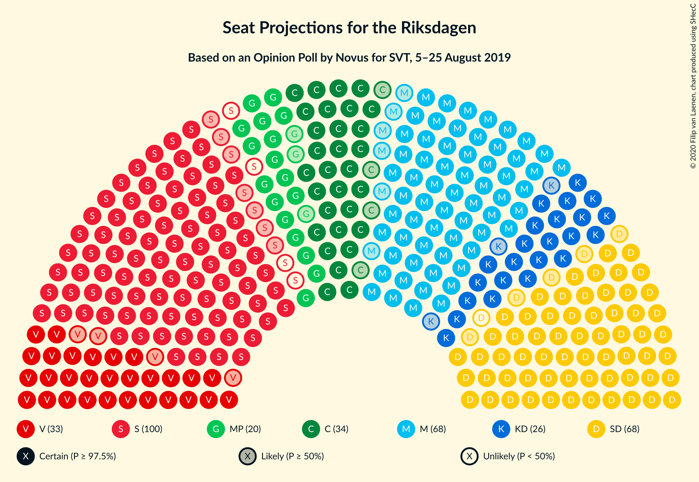
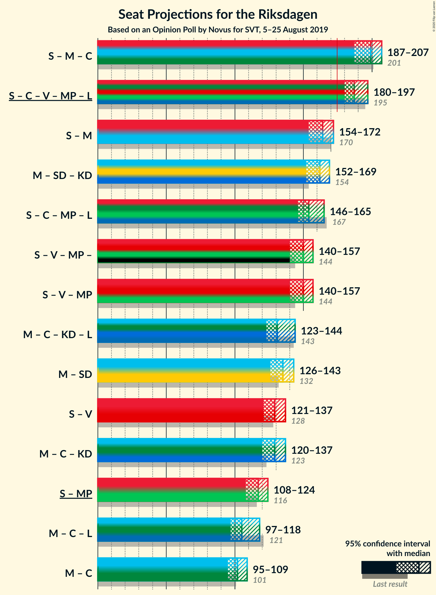

# Opinion Poll by Novus for SVT, 5–25 August 2019

<a href="#voting-intentions">Voting Intentions</a> | <a href="#seats">Seats</a> | <a href="#coalitions">Coalitions</a> | <a href="#technical-information">Technical Information</a>

## Voting Intentions

### Confidence Intervals

| Party | Last Result | Poll Result | 80% Confidence Interval | 90% Confidence Interval | 95% Confidence Interval | 99% Confidence Interval |
|:-----:|:-----------:|:-----------:|:-----------------------:|:-----------------------:|:-----------------------:|:-----------------------:|
| Sveriges socialdemokratiska arbetareparti | 28.3% | 26.3% | 25.2–27.4% |24.9–27.8% |24.7–28.0% |24.2–28.6% |
| Moderata samlingspartiet | 19.8% | 18.5% | 17.6–19.5% |17.3–19.8% |17.1–20.0% |16.6–20.5% |
| Sverigedemokraterna | 17.5% | 18.4% | 17.4–19.4% |17.2–19.7% |16.9–19.9% |16.5–20.4% |
| Centerpartiet | 8.6% | 9.4% | 8.7–10.2% |8.5–10.4% |8.3–10.6% |8.0–11.0% |
| Vänsterpartiet | 8.0% | 9.0% | 8.3–9.7% |8.1–10.0% |8.0–10.1% |7.6–10.5% |
| Kristdemokraterna | 6.3% | 7.2% | 6.6–7.9% |6.4–8.1% |6.3–8.3% |6.0–8.6% |
| Miljöpartiet de gröna | 4.4% | 5.6% | 5.1–6.2% |4.9–6.4% |4.8–6.6% |4.5–6.9% |
| Liberalerna | 5.5% | 3.7% | 3.2–4.2% |3.1–4.3% |3.0–4.5% |2.8–4.7% |

*Note:* The poll result column reflects the actual value used in the calculations. Published results may vary slightly, and in addition be rounded to fewer digits.

## Seats

### Confidence Intervals

| Party | Last Result | Median | 80% Confidence Interval | 90% Confidence Interval | 95% Confidence Interval | 99% Confidence Interval |
|:-----:|:-----------:|:------:|:-----------------------:|:-----------------------:|:-----------------------:|:-----------------------:|
| <a href="#sveriges-socialdemokratiska-arbetareparti">Sveriges socialdemokratiska arbetareparti</a> | 100 | 97 | 91–100 |90–101 |89–103 |87–105 |
| <a href="#moderata-samlingspartiet">Moderata samlingspartiet</a> | 70 | 66 | 64–71 |64–72 |62–73 |60–75 |
| <a href="#sverigedemokraterna">Sverigedemokraterna</a> | 62 | 68 | 63–71 |63–72 |62–72 |60–75 |
| <a href="#centerpartiet">Centerpartiet</a> | 31 | 35 | 32–37 |31–38 |31–39 |29–40 |
| <a href="#vänsterpartiet">Vänsterpartiet</a> | 28 | 33 | 31–35 |30–36 |29–37 |28–38 |
| <a href="#kristdemokraterna">Kristdemokraterna</a> | 22 | 26 | 24–30 |24–30 |23–31 |22–31 |
| <a href="#miljöpartiet-de-gröna">Miljöpartiet de gröna</a> | 16 | 21 | 19–23 |18–23 |17–24 |16–25 |
| <a href="#liberalerna">Liberalerna</a> | 20 | 0 | 0–15 |0–16 |0–16 |0–17 |

### Sveriges socialdemokratiska arbetareparti

*For a full overview of the results for this party, see the [Sveriges socialdemokratiska arbetareparti](party-sverigessocialdemokratiskaarbetareparti.html) page.*

| Number of Seats | Probability | Accumulated | Special Marks |
|:---------------:|:-----------:|:-----------:|:-------------:|
| 85 | 0.1% | 100% |  |
| 86 | 0.2% | 99.8% |  |
| 87 | 0.7% | 99.6% |  |
| 88 | 0.7% | 98.9% |  |
| 89 | 2% | 98% |  |
| 90 | 1.4% | 96% |  |
| 91 | 8% | 95% |  |
| 92 | 5% | 87% |  |
| 93 | 8% | 82% |  |
| 94 | 11% | 75% |  |
| 95 | 7% | 63% |  |
| 96 | 3% | 56% |  |
| 97 | 24% | 53% | Median |
| 98 | 3% | 29% |  |
| 99 | 7% | 26% |  |
| 100 | 13% | 19% | Last Result |
| 101 | 1.4% | 6% |  |
| 102 | 2% | 5% |  |
| 103 | 0.9% | 3% |  |
| 104 | 1.0% | 2% |  |
| 105 | 0.4% | 0.8% |  |
| 106 | 0.3% | 0.4% |  |
| 107 | 0% | 0.1% |  |
| 108 | 0% | 0% |  |

### Moderata samlingspartiet

*For a full overview of the results for this party, see the [Moderata samlingspartiet](party-moderatasamlingspartiet.html) page.*

| Number of Seats | Probability | Accumulated | Special Marks |
|:---------------:|:-----------:|:-----------:|:-------------:|
| 58 | 0% | 100% |  |
| 59 | 0.1% | 99.9% |  |
| 60 | 0.4% | 99.8% |  |
| 61 | 0.9% | 99.4% |  |
| 62 | 2% | 98.5% |  |
| 63 | 2% | 97% |  |
| 64 | 8% | 95% |  |
| 65 | 13% | 87% |  |
| 66 | 28% | 75% | Median |
| 67 | 9% | 47% |  |
| 68 | 10% | 37% |  |
| 69 | 7% | 27% |  |
| 70 | 9% | 21% | Last Result |
| 71 | 4% | 11% |  |
| 72 | 3% | 8% |  |
| 73 | 3% | 4% |  |
| 74 | 1.2% | 2% |  |
| 75 | 0.3% | 0.7% |  |
| 76 | 0.2% | 0.4% |  |
| 77 | 0.1% | 0.1% |  |
| 78 | 0.1% | 0.1% |  |
| 79 | 0% | 0% |  |

### Sverigedemokraterna

*For a full overview of the results for this party, see the [Sverigedemokraterna](party-sverigedemokraterna.html) page.*

| Number of Seats | Probability | Accumulated | Special Marks |
|:---------------:|:-----------:|:-----------:|:-------------:|
| 58 | 0% | 100% |  |
| 59 | 0.1% | 99.9% |  |
| 60 | 0.6% | 99.8% |  |
| 61 | 1.2% | 99.2% |  |
| 62 | 2% | 98% | Last Result |
| 63 | 9% | 96% |  |
| 64 | 4% | 86% |  |
| 65 | 9% | 82% |  |
| 66 | 10% | 73% |  |
| 67 | 11% | 63% |  |
| 68 | 14% | 53% | Median |
| 69 | 20% | 38% |  |
| 70 | 4% | 18% |  |
| 71 | 7% | 13% |  |
| 72 | 4% | 7% |  |
| 73 | 1.3% | 2% |  |
| 74 | 0.5% | 1.1% |  |
| 75 | 0.4% | 0.6% |  |
| 76 | 0.1% | 0.2% |  |
| 77 | 0% | 0.1% |  |
| 78 | 0% | 0.1% |  |
| 79 | 0% | 0% |  |

### Centerpartiet

*For a full overview of the results for this party, see the [Centerpartiet](party-centerpartiet.html) page.*

| Number of Seats | Probability | Accumulated | Special Marks |
|:---------------:|:-----------:|:-----------:|:-------------:|
| 28 | 0.1% | 100% |  |
| 29 | 0.8% | 99.9% |  |
| 30 | 2% | 99.1% |  |
| 31 | 6% | 98% | Last Result |
| 32 | 7% | 91% |  |
| 33 | 15% | 84% |  |
| 34 | 17% | 69% |  |
| 35 | 16% | 52% | Median |
| 36 | 22% | 36% |  |
| 37 | 7% | 14% |  |
| 38 | 2% | 7% |  |
| 39 | 3% | 4% |  |
| 40 | 0.9% | 1.3% |  |
| 41 | 0.2% | 0.3% |  |
| 42 | 0.1% | 0.1% |  |
| 43 | 0% | 0% |  |

### Vänsterpartiet

*For a full overview of the results for this party, see the [Vänsterpartiet](party-vänsterpartiet.html) page.*

| Number of Seats | Probability | Accumulated | Special Marks |
|:---------------:|:-----------:|:-----------:|:-------------:|
| 26 | 0.1% | 100% |  |
| 27 | 0.2% | 99.9% |  |
| 28 | 0.9% | 99.7% | Last Result |
| 29 | 1.4% | 98.8% |  |
| 30 | 4% | 97% |  |
| 31 | 6% | 94% |  |
| 32 | 11% | 87% |  |
| 33 | 31% | 76% | Median |
| 34 | 22% | 45% |  |
| 35 | 14% | 23% |  |
| 36 | 7% | 9% |  |
| 37 | 2% | 3% |  |
| 38 | 0.5% | 0.8% |  |
| 39 | 0.1% | 0.3% |  |
| 40 | 0.1% | 0.1% |  |
| 41 | 0% | 0% |  |

### Kristdemokraterna

*For a full overview of the results for this party, see the [Kristdemokraterna](party-kristdemokraterna.html) page.*

| Number of Seats | Probability | Accumulated | Special Marks |
|:---------------:|:-----------:|:-----------:|:-------------:|
| 21 | 0.2% | 100% |  |
| 22 | 0.9% | 99.8% | Last Result |
| 23 | 3% | 98.9% |  |
| 24 | 7% | 96% |  |
| 25 | 10% | 89% |  |
| 26 | 31% | 78% | Median |
| 27 | 15% | 47% |  |
| 28 | 17% | 32% |  |
| 29 | 4% | 15% |  |
| 30 | 9% | 11% |  |
| 31 | 3% | 3% |  |
| 32 | 0.2% | 0.3% |  |
| 33 | 0.1% | 0.1% |  |
| 34 | 0% | 0% |  |

### Miljöpartiet de gröna

*For a full overview of the results for this party, see the [Miljöpartiet de gröna](party-miljöpartietdegröna.html) page.*

| Number of Seats | Probability | Accumulated | Special Marks |
|:---------------:|:-----------:|:-----------:|:-------------:|
| 16 | 1.2% | 100% | Last Result |
| 17 | 3% | 98.7% |  |
| 18 | 5% | 96% |  |
| 19 | 16% | 91% |  |
| 20 | 24% | 75% |  |
| 21 | 14% | 51% | Median |
| 22 | 23% | 37% |  |
| 23 | 10% | 15% |  |
| 24 | 3% | 5% |  |
| 25 | 1.2% | 1.5% |  |
| 26 | 0.2% | 0.3% |  |
| 27 | 0% | 0.1% |  |
| 28 | 0% | 0% |  |

### Liberalerna

*For a full overview of the results for this party, see the [Liberalerna](party-liberalerna.html) page.*

| Number of Seats | Probability | Accumulated | Special Marks |
|:---------------:|:-----------:|:-----------:|:-------------:|
| 0 | 78% | 100% | Median |
| 1 | 0% | 22% |  |
| 2 | 0% | 22% |  |
| 3 | 0% | 22% |  |
| 4 | 0% | 22% |  |
| 5 | 0% | 22% |  |
| 6 | 0% | 22% |  |
| 7 | 0% | 22% |  |
| 8 | 0% | 22% |  |
| 9 | 0% | 22% |  |
| 10 | 0% | 22% |  |
| 11 | 0% | 22% |  |
| 12 | 0% | 22% |  |
| 13 | 0% | 22% |  |
| 14 | 4% | 22% |  |
| 15 | 13% | 18% |  |
| 16 | 4% | 5% |  |
| 17 | 0.5% | 0.6% |  |
| 18 | 0.1% | 0.1% |  |
| 19 | 0% | 0% |  |
| 20 | 0% | 0% | Last Result |

## Coalitions

### Confidence Intervals

| Coalition | Last Result | Median | Majority? | 80% Confidence Interval | 90% Confidence Interval | 95% Confidence Interval | 99% Confidence Interval |
|:---------:|:-----------:|:------:|:---------:|:-----------------------:|:-----------------------:|:-----------------------:|:-----------------------:|
| Sveriges socialdemokratiska arbetareparti – Moderata samlingspartiet – Centerpartiet | 201 | 199 | 100% | 191–202 | 189–204 | 188–206 | 186–209 |
| Sveriges socialdemokratiska arbetareparti – Centerpartiet – Vänsterpartiet – Miljöpartiet de gröna – Liberalerna | 195 | 188 | 100% | 182–194 | 181–197 | 180–197 | 178–199 |
| Sveriges socialdemokratiska arbetareparti – Moderata samlingspartiet | 170 | 163 | 0.7% | 157–167 | 156–169 | 154–172 | 153–175 |
| Moderata samlingspartiet – Sverigedemokraterna – Kristdemokraterna | 154 | 161 | 0% | 155–167 | 152–168 | 152–169 | 150–171 |
| Sveriges socialdemokratiska arbetareparti – Centerpartiet – Miljöpartiet de gröna – Liberalerna | 167 | 155 | 0% | 148–162 | 147–164 | 146–164 | 144–167 |
| Sveriges socialdemokratiska arbetareparti – Vänsterpartiet – Miljöpartiet de gröna | 144 | 151 | 0% | 143–155 | 142–157 | 140–158 | 137–160 |
| Moderata samlingspartiet – Centerpartiet – Kristdemokraterna – Liberalerna | 143 | 131 | 0% | 125–140 | 124–142 | 123–144 | 122–146 |
| Moderata samlingspartiet – Sverigedemokraterna | 132 | 135 | 0% | 129–139 | 128–141 | 127–142 | 125–144 |
| Sveriges socialdemokratiska arbetareparti – Vänsterpartiet | 128 | 130 | 0% | 124–134 | 122–135 | 121–137 | 118–139 |
| Moderata samlingspartiet – Centerpartiet – Kristdemokraterna | 123 | 128 | 0% | 124–134 | 122–135 | 120–137 | 117–138 |
| Sveriges socialdemokratiska arbetareparti – Miljöpartiet de gröna | 116 | 117 | 0% | 111–121 | 110–123 | 108–124 | 106–126 |
| Moderata samlingspartiet – Centerpartiet – Liberalerna | 121 | 104 | 0% | 99–115 | 97–116 | 97–117 | 96–119 |
| Moderata samlingspartiet – Centerpartiet | 101 | 102 | 0% | 97–105 | 96–107 | 95–108 | 93–111 |

### Sveriges socialdemokratiska arbetareparti – Moderata samlingspartiet – Centerpartiet

| Number of Seats | Probability | Accumulated | Special Marks |
|:---------------:|:-----------:|:-----------:|:-------------:|
| 183 | 0% | 100% |  |
| 184 | 0.1% | 99.9% |  |
| 185 | 0.3% | 99.9% |  |
| 186 | 0.2% | 99.5% |  |
| 187 | 2% | 99.4% |  |
| 188 | 2% | 98% |  |
| 189 | 0.9% | 95% |  |
| 190 | 4% | 94% |  |
| 191 | 1.1% | 90% |  |
| 192 | 2% | 89% |  |
| 193 | 3% | 87% |  |
| 194 | 7% | 84% |  |
| 195 | 4% | 77% |  |
| 196 | 3% | 73% |  |
| 197 | 12% | 70% |  |
| 198 | 7% | 59% | Median |
| 199 | 21% | 51% |  |
| 200 | 5% | 30% |  |
| 201 | 13% | 25% | Last Result |
| 202 | 3% | 11% |  |
| 203 | 1.4% | 8% |  |
| 204 | 3% | 7% |  |
| 205 | 0.6% | 3% |  |
| 206 | 1.0% | 3% |  |
| 207 | 0.6% | 2% |  |
| 208 | 0.4% | 1.2% |  |
| 209 | 0.6% | 0.9% |  |
| 210 | 0.1% | 0.3% |  |
| 211 | 0.2% | 0.2% |  |
| 212 | 0% | 0% |  |

### Sveriges socialdemokratiska arbetareparti – Centerpartiet – Vänsterpartiet – Miljöpartiet de gröna – Liberalerna

| Number of Seats | Probability | Accumulated | Special Marks |
|:---------------:|:-----------:|:-----------:|:-------------:|
| 175 | 0.1% | 100% | Majority |
| 176 | 0% | 99.9% |  |
| 177 | 0.2% | 99.9% |  |
| 178 | 0.4% | 99.7% |  |
| 179 | 0.2% | 99.3% |  |
| 180 | 2% | 99.1% |  |
| 181 | 4% | 97% |  |
| 182 | 3% | 93% |  |
| 183 | 7% | 90% |  |
| 184 | 4% | 82% |  |
| 185 | 6% | 78% |  |
| 186 | 12% | 72% | Median |
| 187 | 5% | 60% |  |
| 188 | 15% | 55% |  |
| 189 | 11% | 40% |  |
| 190 | 6% | 29% |  |
| 191 | 3% | 22% |  |
| 192 | 6% | 20% |  |
| 193 | 3% | 14% |  |
| 194 | 2% | 11% |  |
| 195 | 1.2% | 9% | Last Result |
| 196 | 1.3% | 8% |  |
| 197 | 5% | 7% |  |
| 198 | 0.7% | 1.3% |  |
| 199 | 0.2% | 0.6% |  |
| 200 | 0.1% | 0.4% |  |
| 201 | 0.2% | 0.3% |  |
| 202 | 0.1% | 0.1% |  |
| 203 | 0% | 0% |  |

### Sveriges socialdemokratiska arbetareparti – Moderata samlingspartiet

| Number of Seats | Probability | Accumulated | Special Marks |
|:---------------:|:-----------:|:-----------:|:-------------:|
| 149 | 0% | 100% |  |
| 150 | 0% | 99.9% |  |
| 151 | 0.1% | 99.9% |  |
| 152 | 0.2% | 99.8% |  |
| 153 | 0.3% | 99.7% |  |
| 154 | 2% | 99.4% |  |
| 155 | 1.5% | 97% |  |
| 156 | 3% | 96% |  |
| 157 | 5% | 93% |  |
| 158 | 5% | 89% |  |
| 159 | 4% | 83% |  |
| 160 | 4% | 79% |  |
| 161 | 4% | 75% |  |
| 162 | 3% | 72% |  |
| 163 | 21% | 69% | Median |
| 164 | 13% | 48% |  |
| 165 | 7% | 35% |  |
| 166 | 12% | 28% |  |
| 167 | 9% | 16% |  |
| 168 | 2% | 7% |  |
| 169 | 1.2% | 5% |  |
| 170 | 1.0% | 4% | Last Result |
| 171 | 0.4% | 3% |  |
| 172 | 0.8% | 3% |  |
| 173 | 0.9% | 2% |  |
| 174 | 0.4% | 1.1% |  |
| 175 | 0.3% | 0.7% | Majority |
| 176 | 0.4% | 0.4% |  |
| 177 | 0.1% | 0.1% |  |
| 178 | 0% | 0% |  |

### Moderata samlingspartiet – Sverigedemokraterna – Kristdemokraterna

| Number of Seats | Probability | Accumulated | Special Marks |
|:---------------:|:-----------:|:-----------:|:-------------:|
| 147 | 0.1% | 100% |  |
| 148 | 0.2% | 99.9% |  |
| 149 | 0.1% | 99.7% |  |
| 150 | 0.2% | 99.6% |  |
| 151 | 0.7% | 99.4% |  |
| 152 | 5% | 98.7% |  |
| 153 | 1.3% | 93% |  |
| 154 | 1.2% | 92% | Last Result |
| 155 | 2% | 91% |  |
| 156 | 3% | 89% |  |
| 157 | 6% | 86% |  |
| 158 | 3% | 80% |  |
| 159 | 6% | 78% |  |
| 160 | 11% | 71% | Median |
| 161 | 15% | 60% |  |
| 162 | 5% | 45% |  |
| 163 | 12% | 40% |  |
| 164 | 6% | 28% |  |
| 165 | 4% | 22% |  |
| 166 | 7% | 18% |  |
| 167 | 3% | 10% |  |
| 168 | 4% | 7% |  |
| 169 | 2% | 3% |  |
| 170 | 0.2% | 0.9% |  |
| 171 | 0.4% | 0.7% |  |
| 172 | 0.2% | 0.3% |  |
| 173 | 0% | 0.1% |  |
| 174 | 0.1% | 0.1% |  |
| 175 | 0% | 0% | Majority |

### Sveriges socialdemokratiska arbetareparti – Centerpartiet – Miljöpartiet de gröna – Liberalerna

| Number of Seats | Probability | Accumulated | Special Marks |
|:---------------:|:-----------:|:-----------:|:-------------:|
| 141 | 0% | 100% |  |
| 142 | 0.1% | 99.9% |  |
| 143 | 0.1% | 99.8% |  |
| 144 | 0.4% | 99.8% |  |
| 145 | 0.2% | 99.4% |  |
| 146 | 2% | 99.1% |  |
| 147 | 4% | 97% |  |
| 148 | 4% | 94% |  |
| 149 | 6% | 90% |  |
| 150 | 6% | 84% |  |
| 151 | 6% | 78% |  |
| 152 | 4% | 72% |  |
| 153 | 9% | 68% | Median |
| 154 | 7% | 60% |  |
| 155 | 19% | 53% |  |
| 156 | 8% | 33% |  |
| 157 | 3% | 25% |  |
| 158 | 3% | 23% |  |
| 159 | 5% | 20% |  |
| 160 | 3% | 15% |  |
| 161 | 2% | 12% |  |
| 162 | 1.2% | 10% |  |
| 163 | 2% | 9% |  |
| 164 | 5% | 7% |  |
| 165 | 0.5% | 2% |  |
| 166 | 0.7% | 1.3% |  |
| 167 | 0.1% | 0.6% | Last Result |
| 168 | 0.1% | 0.4% |  |
| 169 | 0.1% | 0.3% |  |
| 170 | 0% | 0.2% |  |
| 171 | 0.1% | 0.1% |  |
| 172 | 0% | 0% |  |

### Sveriges socialdemokratiska arbetareparti – Vänsterpartiet – Miljöpartiet de gröna

| Number of Seats | Probability | Accumulated | Special Marks |
|:---------------:|:-----------:|:-----------:|:-------------:|
| 136 | 0.1% | 100% |  |
| 137 | 0.6% | 99.9% |  |
| 138 | 0.3% | 99.3% |  |
| 139 | 0.1% | 99.0% |  |
| 140 | 2% | 98.9% |  |
| 141 | 0.5% | 97% |  |
| 142 | 2% | 96% |  |
| 143 | 5% | 95% |  |
| 144 | 2% | 89% | Last Result |
| 145 | 2% | 87% |  |
| 146 | 11% | 85% |  |
| 147 | 5% | 74% |  |
| 148 | 3% | 69% |  |
| 149 | 4% | 66% |  |
| 150 | 4% | 62% |  |
| 151 | 9% | 58% | Median |
| 152 | 24% | 49% |  |
| 153 | 8% | 25% |  |
| 154 | 7% | 18% |  |
| 155 | 2% | 10% |  |
| 156 | 1.3% | 8% |  |
| 157 | 4% | 7% |  |
| 158 | 0.7% | 3% |  |
| 159 | 0.6% | 2% |  |
| 160 | 1.0% | 1.4% |  |
| 161 | 0.3% | 0.4% |  |
| 162 | 0% | 0.1% |  |
| 163 | 0% | 0% |  |

### Moderata samlingspartiet – Centerpartiet – Kristdemokraterna – Liberalerna

| Number of Seats | Probability | Accumulated | Special Marks |
|:---------------:|:-----------:|:-----------:|:-------------:|
| 119 | 0% | 100% |  |
| 120 | 0.3% | 99.9% |  |
| 121 | 0.1% | 99.7% |  |
| 122 | 0.8% | 99.6% |  |
| 123 | 2% | 98.8% |  |
| 124 | 5% | 97% |  |
| 125 | 2% | 92% |  |
| 126 | 2% | 90% |  |
| 127 | 9% | 88% | Median |
| 128 | 17% | 78% |  |
| 129 | 4% | 62% |  |
| 130 | 7% | 58% |  |
| 131 | 5% | 51% |  |
| 132 | 9% | 46% |  |
| 133 | 5% | 37% |  |
| 134 | 6% | 32% |  |
| 135 | 2% | 26% |  |
| 136 | 2% | 24% |  |
| 137 | 4% | 21% |  |
| 138 | 2% | 18% |  |
| 139 | 2% | 16% |  |
| 140 | 6% | 14% |  |
| 141 | 3% | 8% |  |
| 142 | 0.7% | 5% |  |
| 143 | 2% | 4% | Last Result |
| 144 | 0.5% | 3% |  |
| 145 | 2% | 2% |  |
| 146 | 0.3% | 0.6% |  |
| 147 | 0.2% | 0.3% |  |
| 148 | 0.1% | 0.1% |  |
| 149 | 0% | 0.1% |  |
| 150 | 0% | 0% |  |

### Moderata samlingspartiet – Sverigedemokraterna

| Number of Seats | Probability | Accumulated | Special Marks |
|:---------------:|:-----------:|:-----------:|:-------------:|
| 122 | 0.2% | 100% |  |
| 123 | 0.1% | 99.8% |  |
| 124 | 0.1% | 99.7% |  |
| 125 | 1.0% | 99.6% |  |
| 126 | 0.6% | 98.6% |  |
| 127 | 1.0% | 98% |  |
| 128 | 7% | 97% |  |
| 129 | 1.1% | 90% |  |
| 130 | 4% | 89% |  |
| 131 | 7% | 85% |  |
| 132 | 9% | 78% | Last Result |
| 133 | 4% | 70% |  |
| 134 | 10% | 65% | Median |
| 135 | 23% | 56% |  |
| 136 | 6% | 33% |  |
| 137 | 4% | 26% |  |
| 138 | 8% | 22% |  |
| 139 | 6% | 14% |  |
| 140 | 3% | 8% |  |
| 141 | 2% | 6% |  |
| 142 | 2% | 3% |  |
| 143 | 0.4% | 1.2% |  |
| 144 | 0.4% | 0.7% |  |
| 145 | 0.1% | 0.3% |  |
| 146 | 0.1% | 0.2% |  |
| 147 | 0.1% | 0.1% |  |
| 148 | 0% | 0.1% |  |
| 149 | 0% | 0% |  |

### Sveriges socialdemokratiska arbetareparti – Vänsterpartiet

| Number of Seats | Probability | Accumulated | Special Marks |
|:---------------:|:-----------:|:-----------:|:-------------:|
| 115 | 0.1% | 100% |  |
| 116 | 0.1% | 99.9% |  |
| 117 | 0% | 99.8% |  |
| 118 | 0.5% | 99.8% |  |
| 119 | 0.4% | 99.3% |  |
| 120 | 1.2% | 98.8% |  |
| 121 | 2% | 98% |  |
| 122 | 0.8% | 95% |  |
| 123 | 2% | 95% |  |
| 124 | 6% | 93% |  |
| 125 | 4% | 87% |  |
| 126 | 8% | 83% |  |
| 127 | 5% | 75% |  |
| 128 | 10% | 70% | Last Result |
| 129 | 5% | 60% |  |
| 130 | 21% | 55% | Median |
| 131 | 3% | 34% |  |
| 132 | 11% | 32% |  |
| 133 | 2% | 21% |  |
| 134 | 11% | 18% |  |
| 135 | 3% | 7% |  |
| 136 | 2% | 4% |  |
| 137 | 0.9% | 3% |  |
| 138 | 0.4% | 2% |  |
| 139 | 1.0% | 1.3% |  |
| 140 | 0.3% | 0.4% |  |
| 141 | 0% | 0.1% |  |
| 142 | 0% | 0.1% |  |
| 143 | 0% | 0% |  |

### Moderata samlingspartiet – Centerpartiet – Kristdemokraterna

| Number of Seats | Probability | Accumulated | Special Marks |
|:---------------:|:-----------:|:-----------:|:-------------:|
| 116 | 0.4% | 100% |  |
| 117 | 0.1% | 99.6% |  |
| 118 | 0.3% | 99.5% |  |
| 119 | 0.3% | 99.2% |  |
| 120 | 2% | 98.9% |  |
| 121 | 2% | 97% |  |
| 122 | 2% | 96% |  |
| 123 | 4% | 94% | Last Result |
| 124 | 7% | 90% |  |
| 125 | 10% | 83% |  |
| 126 | 3% | 73% |  |
| 127 | 10% | 70% | Median |
| 128 | 17% | 60% |  |
| 129 | 5% | 43% |  |
| 130 | 9% | 38% |  |
| 131 | 5% | 29% |  |
| 132 | 9% | 24% |  |
| 133 | 5% | 16% |  |
| 134 | 5% | 11% |  |
| 135 | 2% | 6% |  |
| 136 | 0.8% | 4% |  |
| 137 | 2% | 3% |  |
| 138 | 0.7% | 0.9% |  |
| 139 | 0.1% | 0.2% |  |
| 140 | 0% | 0.1% |  |
| 141 | 0% | 0.1% |  |
| 142 | 0% | 0% |  |

### Sveriges socialdemokratiska arbetareparti – Miljöpartiet de gröna

| Number of Seats | Probability | Accumulated | Special Marks |
|:---------------:|:-----------:|:-----------:|:-------------:|
| 104 | 0% | 100% |  |
| 105 | 0.2% | 99.9% |  |
| 106 | 0.2% | 99.7% |  |
| 107 | 1.4% | 99.5% |  |
| 108 | 1.5% | 98% |  |
| 109 | 0.9% | 97% |  |
| 110 | 3% | 96% |  |
| 111 | 4% | 93% |  |
| 112 | 7% | 89% |  |
| 113 | 7% | 82% |  |
| 114 | 3% | 75% |  |
| 115 | 9% | 72% |  |
| 116 | 6% | 63% | Last Result |
| 117 | 9% | 57% |  |
| 118 | 9% | 49% | Median |
| 119 | 19% | 40% |  |
| 120 | 9% | 21% |  |
| 121 | 2% | 12% |  |
| 122 | 2% | 10% |  |
| 123 | 4% | 7% |  |
| 124 | 1.4% | 3% |  |
| 125 | 1.1% | 2% |  |
| 126 | 0.4% | 0.6% |  |
| 127 | 0.1% | 0.2% |  |
| 128 | 0.1% | 0.1% |  |
| 129 | 0% | 0% |  |

### Moderata samlingspartiet – Centerpartiet – Liberalerna

| Number of Seats | Probability | Accumulated | Special Marks |
|:---------------:|:-----------:|:-----------:|:-------------:|
| 93 | 0.1% | 100% |  |
| 94 | 0.1% | 99.9% |  |
| 95 | 0.1% | 99.8% |  |
| 96 | 1.5% | 99.7% |  |
| 97 | 6% | 98% |  |
| 98 | 0.9% | 93% |  |
| 99 | 4% | 92% |  |
| 100 | 6% | 87% |  |
| 101 | 9% | 81% | Median |
| 102 | 15% | 72% |  |
| 103 | 6% | 57% |  |
| 104 | 11% | 51% |  |
| 105 | 8% | 39% |  |
| 106 | 2% | 31% |  |
| 107 | 3% | 29% |  |
| 108 | 3% | 26% |  |
| 109 | 2% | 24% |  |
| 110 | 2% | 21% |  |
| 111 | 2% | 19% |  |
| 112 | 1.0% | 17% |  |
| 113 | 3% | 16% |  |
| 114 | 0.6% | 13% |  |
| 115 | 3% | 12% |  |
| 116 | 5% | 9% |  |
| 117 | 2% | 4% |  |
| 118 | 0.4% | 2% |  |
| 119 | 1.3% | 2% |  |
| 120 | 0.2% | 0.4% |  |
| 121 | 0.1% | 0.2% | Last Result |
| 122 | 0% | 0.1% |  |
| 123 | 0% | 0.1% |  |
| 124 | 0.1% | 0.1% |  |
| 125 | 0% | 0% |  |

### Moderata samlingspartiet – Centerpartiet

| Number of Seats | Probability | Accumulated | Special Marks |
|:---------------:|:-----------:|:-----------:|:-------------:|
| 91 | 0.1% | 100% |  |
| 92 | 0.2% | 99.9% |  |
| 93 | 0.5% | 99.7% |  |
| 94 | 0.7% | 99.2% |  |
| 95 | 1.1% | 98.6% |  |
| 96 | 5% | 97% |  |
| 97 | 6% | 92% |  |
| 98 | 3% | 86% |  |
| 99 | 7% | 83% |  |
| 100 | 7% | 75% |  |
| 101 | 15% | 68% | Last Result, Median |
| 102 | 16% | 53% |  |
| 103 | 7% | 38% |  |
| 104 | 13% | 31% |  |
| 105 | 8% | 18% |  |
| 106 | 2% | 10% |  |
| 107 | 3% | 8% |  |
| 108 | 2% | 5% |  |
| 109 | 0.9% | 2% |  |
| 110 | 0.5% | 1.3% |  |
| 111 | 0.6% | 0.9% |  |
| 112 | 0.2% | 0.3% |  |
| 113 | 0.1% | 0.1% |  |
| 114 | 0% | 0% |  |

## Technical Information

### Opinion Poll

+ **Polling firm:** Novus
+ **Commissioner(s):** SVT
+ **Fieldwork period:** 5–25 August 2019

### Calculations

+ **Sample size:** 2660
+ **Simulations done:** 262,144
+ **Error estimate:** 1.08%

