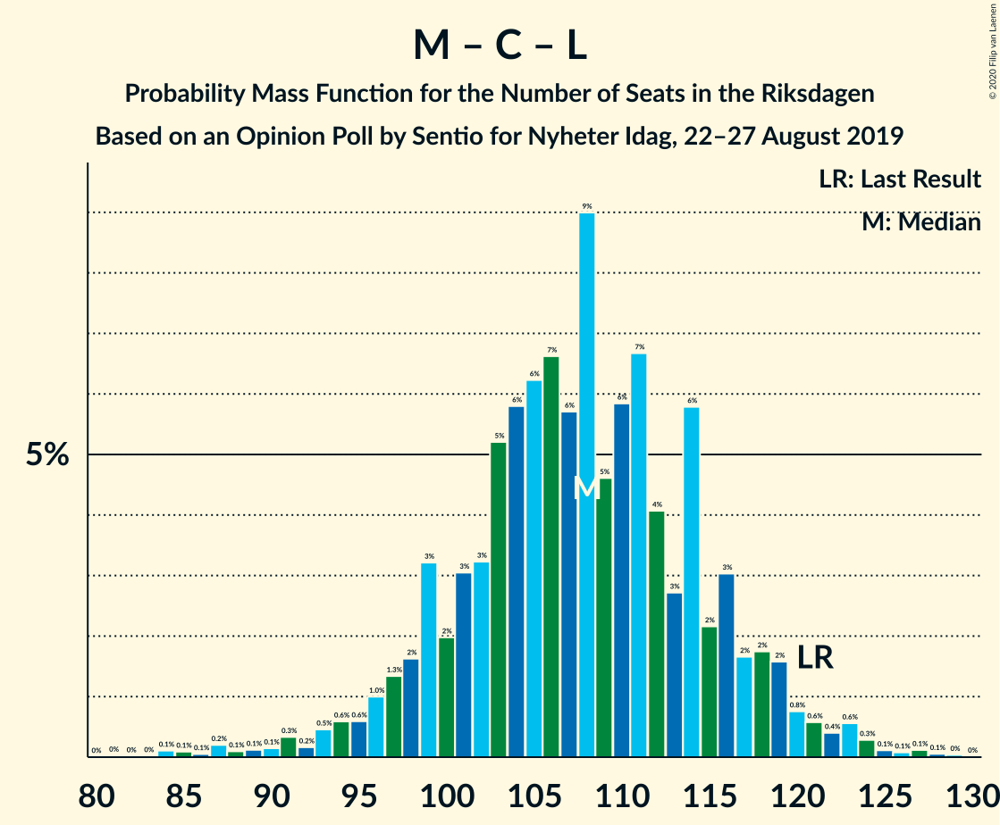

# Opinion Poll by Sentio, 22–27 August 2019

<a href="#voting-intentions">Voting Intentions</a> | <a href="#seats">Seats</a> | <a href="#coalitions">Coalitions</a> | <a href="#technical-information">Technical Information</a>

## Voting Intentions

### Confidence Intervals

| Party | Last Result | Poll Result | 80% Confidence Interval | 90% Confidence Interval | 95% Confidence Interval | 99% Confidence Interval |
|:-----:|:-----------:|:-----------:|:-----------------------:|:-----------------------:|:-----------------------:|:-----------------------:|
| Sverigedemokraterna | 17.5% | 23.6% | 21.7–25.6% |21.2–26.2% |20.8–26.7% |19.9–27.6% |
| Sveriges socialdemokratiska arbetareparti | 28.3% | 23.3% | 21.5–25.3% |21.0–25.9% |20.5–26.4% |19.6–27.4% |
| Moderata samlingspartiet | 19.8% | 18.4% | 16.7–20.3% |16.3–20.8% |15.9–21.3% |15.1–22.2% |
| Vänsterpartiet | 8.0% | 10.6% | 9.3–12.1% |8.9–12.6% |8.6–12.9% |8.0–13.7% |
| Centerpartiet | 8.6% | 6.2% | 5.2–7.4% |4.9–7.8% |4.7–8.1% |4.3–8.7% |
| Kristdemokraterna | 6.3% | 5.8% | 4.9–7.0% |4.6–7.4% |4.4–7.7% |4.0–8.3% |
| Liberalerna | 5.5% | 5.4% | 4.5–6.6% |4.3–6.9% |4.1–7.2% |3.7–7.8% |
| Miljöpartiet de gröna | 4.4% | 4.7% | 3.8–5.8% |3.6–6.1% |3.4–6.4% |3.0–7.0% |

*Note:* The poll result column reflects the actual value used in the calculations. Published results may vary slightly, and in addition be rounded to fewer digits.

## Seats

### Confidence Intervals

| Party | Last Result | Median | 80% Confidence Interval | 90% Confidence Interval | 95% Confidence Interval | 99% Confidence Interval |
|:-----:|:-----------:|:------:|:-----------------------:|:-----------------------:|:-----------------------:|:-----------------------:|
| <a href="#sverigedemokraterna">Sverigedemokraterna</a> | 62 | 84 | 77–92 |75–95 |73–97 |71–100 |
| <a href="#sveriges-socialdemokratiska-arbetareparti">Sveriges socialdemokratiska arbetareparti</a> | 100 | 82 | 74–91 |74–93 |73–95 |70–99 |
| <a href="#moderata-samlingspartiet">Moderata samlingspartiet</a> | 70 | 66 | 60–73 |58–74 |55–77 |54–80 |
| <a href="#vänsterpartiet">Vänsterpartiet</a> | 28 | 38 | 35–44 |31–45 |30–47 |29–48 |
| <a href="#centerpartiet">Centerpartiet</a> | 31 | 23 | 19–26 |18–27 |17–29 |15–31 |
| <a href="#kristdemokraterna">Kristdemokraterna</a> | 22 | 20 | 18–25 |17–26 |15–28 |0–29 |
| <a href="#liberalerna">Liberalerna</a> | 20 | 19 | 17–23 |15–24 |14–25 |0–28 |
| <a href="#miljöpartiet-de-gröna">Miljöpartiet de gröna</a> | 16 | 17 | 0–22 |0–23 |0–23 |0–25 |

### Sverigedemokraterna

*For a full overview of the results for this party, see the [Sverigedemokraterna](party-sverigedemokraterna.html) page.*

| Number of Seats | Probability | Accumulated | Special Marks |
|:---------------:|:-----------:|:-----------:|:-------------:|
| 62 | 0% | 100% | Last Result |
| 63 | 0% | 100% |  |
| 64 | 0% | 100% |  |
| 65 | 0% | 100% |  |
| 66 | 0% | 100% |  |
| 67 | 0.1% | 100% |  |
| 68 | 0.1% | 99.9% |  |
| 69 | 0% | 99.8% |  |
| 70 | 0.2% | 99.7% |  |
| 71 | 1.1% | 99.5% |  |
| 72 | 0.4% | 98% |  |
| 73 | 0.6% | 98% |  |
| 74 | 2% | 97% |  |
| 75 | 0.8% | 95% |  |
| 76 | 5% | 95% |  |
| 77 | 5% | 90% |  |
| 78 | 5% | 85% |  |
| 79 | 6% | 80% |  |
| 80 | 6% | 74% |  |
| 81 | 5% | 68% |  |
| 82 | 3% | 63% |  |
| 83 | 5% | 61% |  |
| 84 | 7% | 56% | Median |
| 85 | 4% | 48% |  |
| 86 | 15% | 45% |  |
| 87 | 2% | 30% |  |
| 88 | 6% | 28% |  |
| 89 | 8% | 22% |  |
| 90 | 0.8% | 14% |  |
| 91 | 2% | 13% |  |
| 92 | 1.4% | 11% |  |
| 93 | 2% | 10% |  |
| 94 | 3% | 8% |  |
| 95 | 1.0% | 6% |  |
| 96 | 1.2% | 5% |  |
| 97 | 2% | 3% |  |
| 98 | 0.3% | 1.4% |  |
| 99 | 0.5% | 1.1% |  |
| 100 | 0.3% | 0.6% |  |
| 101 | 0% | 0.3% |  |
| 102 | 0% | 0.3% |  |
| 103 | 0.2% | 0.3% |  |
| 104 | 0% | 0.1% |  |
| 105 | 0% | 0.1% |  |
| 106 | 0% | 0.1% |  |
| 107 | 0% | 0% |  |

### Sveriges socialdemokratiska arbetareparti

*For a full overview of the results for this party, see the [Sveriges socialdemokratiska arbetareparti](party-sverigessocialdemokratiskaarbetareparti.html) page.*

| Number of Seats | Probability | Accumulated | Special Marks |
|:---------------:|:-----------:|:-----------:|:-------------:|
| 66 | 0% | 100% |  |
| 67 | 0.1% | 99.9% |  |
| 68 | 0.1% | 99.9% |  |
| 69 | 0.2% | 99.8% |  |
| 70 | 0.2% | 99.6% |  |
| 71 | 0.1% | 99.4% |  |
| 72 | 0.3% | 99.3% |  |
| 73 | 3% | 99.1% |  |
| 74 | 6% | 96% |  |
| 75 | 2% | 90% |  |
| 76 | 3% | 88% |  |
| 77 | 4% | 85% |  |
| 78 | 5% | 81% |  |
| 79 | 5% | 77% |  |
| 80 | 12% | 72% |  |
| 81 | 7% | 61% |  |
| 82 | 5% | 54% | Median |
| 83 | 6% | 49% |  |
| 84 | 17% | 43% |  |
| 85 | 2% | 26% |  |
| 86 | 3% | 24% |  |
| 87 | 4% | 21% |  |
| 88 | 3% | 17% |  |
| 89 | 1.5% | 14% |  |
| 90 | 2% | 12% |  |
| 91 | 3% | 10% |  |
| 92 | 0.3% | 8% |  |
| 93 | 3% | 7% |  |
| 94 | 0.9% | 5% |  |
| 95 | 2% | 4% |  |
| 96 | 0.2% | 2% |  |
| 97 | 0.8% | 2% |  |
| 98 | 0.4% | 1.0% |  |
| 99 | 0.2% | 0.5% |  |
| 100 | 0.2% | 0.3% | Last Result |
| 101 | 0.1% | 0.1% |  |
| 102 | 0% | 0.1% |  |
| 103 | 0% | 0.1% |  |
| 104 | 0% | 0.1% |  |
| 105 | 0% | 0% |  |

### Moderata samlingspartiet

*For a full overview of the results for this party, see the [Moderata samlingspartiet](party-moderatasamlingspartiet.html) page.*

| Number of Seats | Probability | Accumulated | Special Marks |
|:---------------:|:-----------:|:-----------:|:-------------:|
| 50 | 0% | 100% |  |
| 51 | 0.1% | 99.9% |  |
| 52 | 0.2% | 99.9% |  |
| 53 | 0.1% | 99.6% |  |
| 54 | 0.3% | 99.5% |  |
| 55 | 2% | 99.2% |  |
| 56 | 1.2% | 97% |  |
| 57 | 0.8% | 96% |  |
| 58 | 1.5% | 95% |  |
| 59 | 2% | 94% |  |
| 60 | 2% | 91% |  |
| 61 | 7% | 89% |  |
| 62 | 17% | 82% |  |
| 63 | 3% | 66% |  |
| 64 | 9% | 63% |  |
| 65 | 4% | 54% |  |
| 66 | 8% | 50% | Median |
| 67 | 6% | 43% |  |
| 68 | 9% | 36% |  |
| 69 | 9% | 28% |  |
| 70 | 2% | 18% | Last Result |
| 71 | 1.2% | 17% |  |
| 72 | 5% | 15% |  |
| 73 | 3% | 11% |  |
| 74 | 3% | 7% |  |
| 75 | 1.0% | 4% |  |
| 76 | 0.3% | 3% |  |
| 77 | 0.5% | 3% |  |
| 78 | 0.8% | 2% |  |
| 79 | 0.6% | 2% |  |
| 80 | 0.6% | 1.0% |  |
| 81 | 0.1% | 0.4% |  |
| 82 | 0.1% | 0.3% |  |
| 83 | 0% | 0.2% |  |
| 84 | 0% | 0.2% |  |
| 85 | 0.1% | 0.1% |  |
| 86 | 0% | 0% |  |

### Vänsterpartiet

*For a full overview of the results for this party, see the [Vänsterpartiet](party-vänsterpartiet.html) page.*

| Number of Seats | Probability | Accumulated | Special Marks |
|:---------------:|:-----------:|:-----------:|:-------------:|
| 27 | 0.1% | 100% |  |
| 28 | 0.3% | 99.9% | Last Result |
| 29 | 1.1% | 99.6% |  |
| 30 | 1.3% | 98% |  |
| 31 | 2% | 97% |  |
| 32 | 0.5% | 95% |  |
| 33 | 0.9% | 94% |  |
| 34 | 2% | 93% |  |
| 35 | 10% | 92% |  |
| 36 | 7% | 82% |  |
| 37 | 24% | 74% |  |
| 38 | 17% | 51% | Median |
| 39 | 6% | 34% |  |
| 40 | 4% | 27% |  |
| 41 | 3% | 23% |  |
| 42 | 1.5% | 20% |  |
| 43 | 3% | 18% |  |
| 44 | 9% | 15% |  |
| 45 | 3% | 6% |  |
| 46 | 1.1% | 4% |  |
| 47 | 1.4% | 3% |  |
| 48 | 0.9% | 1.2% |  |
| 49 | 0.1% | 0.4% |  |
| 50 | 0.1% | 0.3% |  |
| 51 | 0.1% | 0.3% |  |
| 52 | 0.1% | 0.2% |  |
| 53 | 0% | 0.1% |  |
| 54 | 0.1% | 0.1% |  |
| 55 | 0% | 0% |  |

### Centerpartiet

*For a full overview of the results for this party, see the [Centerpartiet](party-centerpartiet.html) page.*

| Number of Seats | Probability | Accumulated | Special Marks |
|:---------------:|:-----------:|:-----------:|:-------------:|
| 0 | 0.1% | 100% |  |
| 1 | 0% | 99.9% |  |
| 2 | 0% | 99.9% |  |
| 3 | 0% | 99.9% |  |
| 4 | 0% | 99.9% |  |
| 5 | 0% | 99.9% |  |
| 6 | 0% | 99.9% |  |
| 7 | 0% | 99.9% |  |
| 8 | 0% | 99.9% |  |
| 9 | 0% | 99.9% |  |
| 10 | 0% | 99.9% |  |
| 11 | 0% | 99.9% |  |
| 12 | 0% | 99.9% |  |
| 13 | 0% | 99.9% |  |
| 14 | 0% | 99.9% |  |
| 15 | 0.7% | 99.8% |  |
| 16 | 2% | 99.2% |  |
| 17 | 2% | 98% |  |
| 18 | 5% | 96% |  |
| 19 | 5% | 90% |  |
| 20 | 7% | 85% |  |
| 21 | 13% | 78% |  |
| 22 | 14% | 66% |  |
| 23 | 9% | 52% | Median |
| 24 | 6% | 42% |  |
| 25 | 8% | 36% |  |
| 26 | 22% | 29% |  |
| 27 | 3% | 7% |  |
| 28 | 0.9% | 4% |  |
| 29 | 2% | 3% |  |
| 30 | 0.7% | 1.2% |  |
| 31 | 0.3% | 0.6% | Last Result |
| 32 | 0.1% | 0.3% |  |
| 33 | 0.1% | 0.2% |  |
| 34 | 0% | 0% |  |

### Kristdemokraterna

*For a full overview of the results for this party, see the [Kristdemokraterna](party-kristdemokraterna.html) page.*

| Number of Seats | Probability | Accumulated | Special Marks |
|:---------------:|:-----------:|:-----------:|:-------------:|
| 0 | 2% | 100% |  |
| 1 | 0% | 98% |  |
| 2 | 0% | 98% |  |
| 3 | 0% | 98% |  |
| 4 | 0% | 98% |  |
| 5 | 0% | 98% |  |
| 6 | 0% | 98% |  |
| 7 | 0% | 98% |  |
| 8 | 0% | 98% |  |
| 9 | 0% | 98% |  |
| 10 | 0% | 98% |  |
| 11 | 0% | 98% |  |
| 12 | 0% | 98% |  |
| 13 | 0% | 98% |  |
| 14 | 0.8% | 98% |  |
| 15 | 0.8% | 98% |  |
| 16 | 0.7% | 97% |  |
| 17 | 2% | 96% |  |
| 18 | 8% | 94% |  |
| 19 | 32% | 86% |  |
| 20 | 9% | 54% | Median |
| 21 | 6% | 46% |  |
| 22 | 3% | 39% | Last Result |
| 23 | 15% | 37% |  |
| 24 | 7% | 21% |  |
| 25 | 8% | 14% |  |
| 26 | 2% | 5% |  |
| 27 | 0.4% | 3% |  |
| 28 | 2% | 3% |  |
| 29 | 0.5% | 0.9% |  |
| 30 | 0.2% | 0.4% |  |
| 31 | 0.1% | 0.2% |  |
| 32 | 0% | 0% |  |

### Liberalerna

*For a full overview of the results for this party, see the [Liberalerna](party-liberalerna.html) page.*

| Number of Seats | Probability | Accumulated | Special Marks |
|:---------------:|:-----------:|:-----------:|:-------------:|
| 0 | 2% | 100% |  |
| 1 | 0% | 98% |  |
| 2 | 0% | 98% |  |
| 3 | 0% | 98% |  |
| 4 | 0% | 98% |  |
| 5 | 0% | 98% |  |
| 6 | 0% | 98% |  |
| 7 | 0% | 98% |  |
| 8 | 0% | 98% |  |
| 9 | 0% | 98% |  |
| 10 | 0% | 98% |  |
| 11 | 0% | 98% |  |
| 12 | 0% | 98% |  |
| 13 | 0% | 98% |  |
| 14 | 1.3% | 98% |  |
| 15 | 3% | 97% |  |
| 16 | 2% | 94% |  |
| 17 | 11% | 92% |  |
| 18 | 21% | 81% |  |
| 19 | 19% | 60% | Median |
| 20 | 14% | 41% | Last Result |
| 21 | 6% | 27% |  |
| 22 | 5% | 21% |  |
| 23 | 9% | 17% |  |
| 24 | 4% | 8% |  |
| 25 | 1.5% | 4% |  |
| 26 | 1.1% | 2% |  |
| 27 | 0.7% | 1.3% |  |
| 28 | 0.3% | 0.6% |  |
| 29 | 0.2% | 0.3% |  |
| 30 | 0.1% | 0.1% |  |
| 31 | 0% | 0% |  |

### Miljöpartiet de gröna

*For a full overview of the results for this party, see the [Miljöpartiet de gröna](party-miljöpartietdegröna.html) page.*

| Number of Seats | Probability | Accumulated | Special Marks |
|:---------------:|:-----------:|:-----------:|:-------------:|
| 0 | 13% | 100% |  |
| 1 | 0% | 87% |  |
| 2 | 0% | 87% |  |
| 3 | 0% | 87% |  |
| 4 | 0% | 87% |  |
| 5 | 0% | 87% |  |
| 6 | 0% | 87% |  |
| 7 | 0% | 87% |  |
| 8 | 0% | 87% |  |
| 9 | 0% | 87% |  |
| 10 | 0% | 87% |  |
| 11 | 0% | 87% |  |
| 12 | 0% | 87% |  |
| 13 | 0% | 87% |  |
| 14 | 3% | 87% |  |
| 15 | 10% | 84% |  |
| 16 | 16% | 74% | Last Result |
| 17 | 19% | 58% | Median |
| 18 | 7% | 39% |  |
| 19 | 9% | 33% |  |
| 20 | 9% | 23% |  |
| 21 | 4% | 14% |  |
| 22 | 5% | 10% |  |
| 23 | 4% | 5% |  |
| 24 | 0.3% | 0.9% |  |
| 25 | 0.3% | 0.5% |  |
| 26 | 0.2% | 0.2% |  |
| 27 | 0% | 0.1% |  |
| 28 | 0% | 0% |  |

## Coalitions

### Confidence Intervals

| Coalition | Last Result | Median | Majority? | 80% Confidence Interval | 90% Confidence Interval | 95% Confidence Interval | 99% Confidence Interval |
|:---------:|:-----------:|:------:|:---------:|:-----------------------:|:-----------------------:|:-----------------------:|:-----------------------:|
| Sveriges socialdemokratiska arbetareparti – Vänsterpartiet – Centerpartiet – Liberalerna – Miljöpartiet de gröna | 195 | 179 | 69% | 170–187 | 166–190 | 164–192 | 156–196 |
| Sveriges socialdemokratiska arbetareparti – Moderata samlingspartiet – Centerpartiet | 201 | 172 | 23% | 162–178 | 159–183 | 157–188 | 152–192 |
| Sverigedemokraterna – Moderata samlingspartiet – Kristdemokraterna | 154 | 170 | 31% | 162–179 | 159–183 | 157–185 | 153–193 |
| Sverigedemokraterna – Moderata samlingspartiet | 132 | 149 | 0.2% | 142–159 | 138–162 | 138–164 | 133–170 |
| Sveriges socialdemokratiska arbetareparti – Moderata samlingspartiet | 170 | 147 | 0.1% | 139–158 | 137–160 | 136–163 | 132–172 |
| Sveriges socialdemokratiska arbetareparti – Centerpartiet – Liberalerna – Miljöpartiet de gröna | 167 | 141 | 0% | 130–149 | 127–152 | 124–153 | 119–157 |
| Sveriges socialdemokratiska arbetareparti – Vänsterpartiet – Miljöpartiet de gröna | 144 | 138 | 0% | 128–145 | 125–147 | 121–150 | 112–154 |
| Moderata samlingspartiet – Centerpartiet – Kristdemokraterna – Liberalerna | 143 | 128 | 0% | 120–137 | 118–140 | 114–143 | 108–146 |
| Sveriges socialdemokratiska arbetareparti – Vänsterpartiet | 128 | 121 | 0% | 112–130 | 112–133 | 110–134 | 105–139 |
| Moderata samlingspartiet – Centerpartiet – Kristdemokraterna | 123 | 109 | 0% | 103–118 | 100–120 | 97–122 | 92–127 |
| Moderata samlingspartiet – Centerpartiet – Liberalerna | 121 | 107 | 0% | 101–116 | 98–119 | 95–120 | 87–124 |
| Sveriges socialdemokratiska arbetareparti – Miljöpartiet de gröna | 116 | 100 | 0% | 88–107 | 85–109 | 82–111 | 75–115 |
| Moderata samlingspartiet – Centerpartiet | 101 | 88 | 0% | 82–96 | 80–97 | 78–100 | 75–105 |

### Sveriges socialdemokratiska arbetareparti – Vänsterpartiet – Centerpartiet – Liberalerna – Miljöpartiet de gröna

| Number of Seats | Probability | Accumulated | Special Marks |
|:---------------:|:-----------:|:-----------:|:-------------:|
| 146 | 0.1% | 100% |  |
| 147 | 0% | 99.9% |  |
| 148 | 0% | 99.9% |  |
| 149 | 0% | 99.9% |  |
| 150 | 0% | 99.9% |  |
| 151 | 0% | 99.9% |  |
| 152 | 0% | 99.9% |  |
| 153 | 0% | 99.9% |  |
| 154 | 0.1% | 99.9% |  |
| 155 | 0% | 99.7% |  |
| 156 | 0.3% | 99.7% |  |
| 157 | 0% | 99.4% |  |
| 158 | 0.1% | 99.3% |  |
| 159 | 0.2% | 99.3% |  |
| 160 | 0.2% | 99.1% |  |
| 161 | 0.1% | 98.9% |  |
| 162 | 0.5% | 98.8% |  |
| 163 | 0.4% | 98% |  |
| 164 | 0.4% | 98% |  |
| 165 | 1.4% | 97% |  |
| 166 | 1.1% | 96% |  |
| 167 | 2% | 95% |  |
| 168 | 1.2% | 93% |  |
| 169 | 1.3% | 92% |  |
| 170 | 3% | 91% |  |
| 171 | 2% | 88% |  |
| 172 | 1.5% | 86% |  |
| 173 | 9% | 84% |  |
| 174 | 6% | 75% |  |
| 175 | 3% | 69% | Majority |
| 176 | 2% | 66% |  |
| 177 | 9% | 64% |  |
| 178 | 4% | 55% |  |
| 179 | 2% | 51% | Median |
| 180 | 3% | 49% |  |
| 181 | 5% | 46% |  |
| 182 | 19% | 42% |  |
| 183 | 2% | 23% |  |
| 184 | 3% | 21% |  |
| 185 | 5% | 18% |  |
| 186 | 2% | 13% |  |
| 187 | 2% | 11% |  |
| 188 | 3% | 9% |  |
| 189 | 0.8% | 6% |  |
| 190 | 2% | 6% |  |
| 191 | 1.2% | 4% |  |
| 192 | 0.8% | 3% |  |
| 193 | 0.6% | 2% |  |
| 194 | 0.2% | 1.2% |  |
| 195 | 0.2% | 1.0% | Last Result |
| 196 | 0.5% | 0.9% |  |
| 197 | 0.1% | 0.4% |  |
| 198 | 0.1% | 0.2% |  |
| 199 | 0.1% | 0.2% |  |
| 200 | 0% | 0.1% |  |
| 201 | 0% | 0.1% |  |
| 202 | 0% | 0% |  |

### Sveriges socialdemokratiska arbetareparti – Moderata samlingspartiet – Centerpartiet

| Number of Seats | Probability | Accumulated | Special Marks |
|:---------------:|:-----------:|:-----------:|:-------------:|
| 150 | 0% | 100% |  |
| 151 | 0% | 99.9% |  |
| 152 | 0.4% | 99.9% |  |
| 153 | 0.1% | 99.4% |  |
| 154 | 0.2% | 99.3% |  |
| 155 | 0.2% | 99.1% |  |
| 156 | 0.5% | 98.9% |  |
| 157 | 1.0% | 98% |  |
| 158 | 1.2% | 97% |  |
| 159 | 2% | 96% |  |
| 160 | 0.4% | 94% |  |
| 161 | 2% | 94% |  |
| 162 | 2% | 92% |  |
| 163 | 3% | 90% |  |
| 164 | 1.1% | 86% |  |
| 165 | 6% | 85% |  |
| 166 | 3% | 79% |  |
| 167 | 4% | 76% |  |
| 168 | 5% | 73% |  |
| 169 | 5% | 67% |  |
| 170 | 3% | 62% |  |
| 171 | 8% | 60% | Median |
| 172 | 17% | 52% |  |
| 173 | 7% | 35% |  |
| 174 | 6% | 29% |  |
| 175 | 5% | 23% | Majority |
| 176 | 1.4% | 18% |  |
| 177 | 3% | 17% |  |
| 178 | 4% | 14% |  |
| 179 | 0.6% | 10% |  |
| 180 | 1.4% | 9% |  |
| 181 | 0.2% | 8% |  |
| 182 | 0.7% | 8% |  |
| 183 | 2% | 7% |  |
| 184 | 0.5% | 5% |  |
| 185 | 0.5% | 4% |  |
| 186 | 0.6% | 4% |  |
| 187 | 0.4% | 3% |  |
| 188 | 1.3% | 3% |  |
| 189 | 0.3% | 1.3% |  |
| 190 | 0.3% | 1.0% |  |
| 191 | 0.1% | 0.7% |  |
| 192 | 0.3% | 0.6% |  |
| 193 | 0% | 0.3% |  |
| 194 | 0% | 0.3% |  |
| 195 | 0% | 0.3% |  |
| 196 | 0.1% | 0.3% |  |
| 197 | 0% | 0.1% |  |
| 198 | 0.1% | 0.1% |  |
| 199 | 0% | 0.1% |  |
| 200 | 0% | 0.1% |  |
| 201 | 0% | 0% | Last Result |

### Sverigedemokraterna – Moderata samlingspartiet – Kristdemokraterna

| Number of Seats | Probability | Accumulated | Special Marks |
|:---------------:|:-----------:|:-----------:|:-------------:|
| 148 | 0% | 100% |  |
| 149 | 0% | 99.9% |  |
| 150 | 0.1% | 99.9% |  |
| 151 | 0.1% | 99.8% |  |
| 152 | 0.1% | 99.8% |  |
| 153 | 0.5% | 99.6% |  |
| 154 | 0.2% | 99.1% | Last Result |
| 155 | 0.2% | 99.0% |  |
| 156 | 0.6% | 98.8% |  |
| 157 | 0.8% | 98% |  |
| 158 | 1.2% | 97% |  |
| 159 | 2% | 96% |  |
| 160 | 0.8% | 94% |  |
| 161 | 3% | 94% |  |
| 162 | 2% | 91% |  |
| 163 | 2% | 89% |  |
| 164 | 5% | 87% |  |
| 165 | 3% | 82% |  |
| 166 | 2% | 79% |  |
| 167 | 19% | 77% |  |
| 168 | 5% | 58% |  |
| 169 | 3% | 54% |  |
| 170 | 2% | 51% | Median |
| 171 | 4% | 49% |  |
| 172 | 9% | 45% |  |
| 173 | 2% | 36% |  |
| 174 | 3% | 34% |  |
| 175 | 6% | 31% | Majority |
| 176 | 9% | 25% |  |
| 177 | 1.5% | 16% |  |
| 178 | 2% | 14% |  |
| 179 | 3% | 12% |  |
| 180 | 1.3% | 9% |  |
| 181 | 1.2% | 8% |  |
| 182 | 2% | 7% |  |
| 183 | 1.1% | 5% |  |
| 184 | 1.4% | 4% |  |
| 185 | 0.4% | 3% |  |
| 186 | 0.4% | 2% |  |
| 187 | 0.5% | 2% |  |
| 188 | 0.1% | 1.2% |  |
| 189 | 0.2% | 1.1% |  |
| 190 | 0.2% | 0.9% |  |
| 191 | 0.1% | 0.7% |  |
| 192 | 0% | 0.6% |  |
| 193 | 0.3% | 0.6% |  |
| 194 | 0% | 0.3% |  |
| 195 | 0.1% | 0.3% |  |
| 196 | 0% | 0.1% |  |
| 197 | 0% | 0.1% |  |
| 198 | 0% | 0.1% |  |
| 199 | 0% | 0.1% |  |
| 200 | 0% | 0.1% |  |
| 201 | 0% | 0.1% |  |
| 202 | 0% | 0.1% |  |
| 203 | 0.1% | 0.1% |  |
| 204 | 0% | 0% |  |

### Sverigedemokraterna – Moderata samlingspartiet

| Number of Seats | Probability | Accumulated | Special Marks |
|:---------------:|:-----------:|:-----------:|:-------------:|
| 129 | 0% | 100% |  |
| 130 | 0.1% | 99.9% |  |
| 131 | 0% | 99.9% |  |
| 132 | 0.1% | 99.8% | Last Result |
| 133 | 0.7% | 99.8% |  |
| 134 | 0% | 99.1% |  |
| 135 | 0.5% | 99.1% |  |
| 136 | 0.3% | 98.6% |  |
| 137 | 0.6% | 98% |  |
| 138 | 3% | 98% |  |
| 139 | 0.2% | 95% |  |
| 140 | 2% | 95% |  |
| 141 | 2% | 92% |  |
| 142 | 1.3% | 90% |  |
| 143 | 7% | 89% |  |
| 144 | 3% | 82% |  |
| 145 | 4% | 79% |  |
| 146 | 6% | 75% |  |
| 147 | 0.4% | 69% |  |
| 148 | 16% | 69% |  |
| 149 | 10% | 53% |  |
| 150 | 5% | 44% | Median |
| 151 | 3% | 38% |  |
| 152 | 3% | 36% |  |
| 153 | 6% | 32% |  |
| 154 | 2% | 26% |  |
| 155 | 4% | 24% |  |
| 156 | 4% | 20% |  |
| 157 | 5% | 16% |  |
| 158 | 0.7% | 11% |  |
| 159 | 2% | 10% |  |
| 160 | 1.0% | 8% |  |
| 161 | 1.3% | 7% |  |
| 162 | 2% | 6% |  |
| 163 | 0.6% | 4% |  |
| 164 | 1.3% | 4% |  |
| 165 | 0.5% | 2% |  |
| 166 | 0.2% | 2% |  |
| 167 | 0.4% | 2% |  |
| 168 | 0.2% | 1.2% |  |
| 169 | 0.5% | 1.0% |  |
| 170 | 0.1% | 0.6% |  |
| 171 | 0.1% | 0.4% |  |
| 172 | 0% | 0.3% |  |
| 173 | 0.1% | 0.3% |  |
| 174 | 0% | 0.2% |  |
| 175 | 0% | 0.2% | Majority |
| 176 | 0% | 0.2% |  |
| 177 | 0.1% | 0.2% |  |
| 178 | 0% | 0.1% |  |
| 179 | 0.1% | 0.1% |  |
| 180 | 0% | 0% |  |

### Sveriges socialdemokratiska arbetareparti – Moderata samlingspartiet

| Number of Seats | Probability | Accumulated | Special Marks |
|:---------------:|:-----------:|:-----------:|:-------------:|
| 128 | 0% | 100% |  |
| 129 | 0% | 99.9% |  |
| 130 | 0.1% | 99.9% |  |
| 131 | 0.3% | 99.8% |  |
| 132 | 0.3% | 99.5% |  |
| 133 | 0.6% | 99.2% |  |
| 134 | 0% | 98.6% |  |
| 135 | 0.2% | 98.5% |  |
| 136 | 2% | 98% |  |
| 137 | 1.4% | 96% |  |
| 138 | 2% | 95% |  |
| 139 | 3% | 93% |  |
| 140 | 0.2% | 90% |  |
| 141 | 2% | 90% |  |
| 142 | 3% | 87% |  |
| 143 | 8% | 84% |  |
| 144 | 0.9% | 76% |  |
| 145 | 4% | 75% |  |
| 146 | 16% | 71% |  |
| 147 | 5% | 55% |  |
| 148 | 17% | 50% | Median |
| 149 | 3% | 33% |  |
| 150 | 2% | 30% |  |
| 151 | 0.8% | 29% |  |
| 152 | 2% | 28% |  |
| 153 | 6% | 26% |  |
| 154 | 1.5% | 20% |  |
| 155 | 4% | 18% |  |
| 156 | 2% | 15% |  |
| 157 | 2% | 12% |  |
| 158 | 0.8% | 10% |  |
| 159 | 2% | 10% |  |
| 160 | 4% | 8% |  |
| 161 | 0.5% | 4% |  |
| 162 | 0.5% | 3% |  |
| 163 | 0.4% | 3% |  |
| 164 | 0.2% | 2% |  |
| 165 | 1.0% | 2% |  |
| 166 | 0.2% | 1.2% |  |
| 167 | 0.2% | 1.0% |  |
| 168 | 0.1% | 0.8% |  |
| 169 | 0% | 0.7% |  |
| 170 | 0.1% | 0.7% | Last Result |
| 171 | 0.1% | 0.6% |  |
| 172 | 0.2% | 0.5% |  |
| 173 | 0.2% | 0.3% |  |
| 174 | 0% | 0.1% |  |
| 175 | 0% | 0.1% | Majority |
| 176 | 0% | 0% |  |

### Sveriges socialdemokratiska arbetareparti – Centerpartiet – Liberalerna – Miljöpartiet de gröna

| Number of Seats | Probability | Accumulated | Special Marks |
|:---------------:|:-----------:|:-----------:|:-------------:|
| 102 | 0.1% | 100% |  |
| 103 | 0% | 99.9% |  |
| 104 | 0% | 99.9% |  |
| 105 | 0% | 99.9% |  |
| 106 | 0% | 99.9% |  |
| 107 | 0% | 99.9% |  |
| 108 | 0% | 99.9% |  |
| 109 | 0% | 99.9% |  |
| 110 | 0% | 99.9% |  |
| 111 | 0% | 99.9% |  |
| 112 | 0% | 99.9% |  |
| 113 | 0% | 99.9% |  |
| 114 | 0.1% | 99.9% |  |
| 115 | 0% | 99.8% |  |
| 116 | 0% | 99.7% |  |
| 117 | 0.1% | 99.7% |  |
| 118 | 0.1% | 99.6% |  |
| 119 | 0.1% | 99.5% |  |
| 120 | 0.1% | 99.4% |  |
| 121 | 0.4% | 99.3% |  |
| 122 | 1.0% | 99.0% |  |
| 123 | 0.4% | 98% |  |
| 124 | 0.7% | 98% |  |
| 125 | 0.5% | 97% |  |
| 126 | 1.2% | 96% |  |
| 127 | 2% | 95% |  |
| 128 | 0.9% | 93% |  |
| 129 | 0.1% | 92% |  |
| 130 | 4% | 92% |  |
| 131 | 0.8% | 89% |  |
| 132 | 3% | 88% |  |
| 133 | 5% | 85% |  |
| 134 | 0.6% | 80% |  |
| 135 | 8% | 79% |  |
| 136 | 0.3% | 72% |  |
| 137 | 3% | 71% |  |
| 138 | 7% | 69% |  |
| 139 | 8% | 62% |  |
| 140 | 3% | 53% |  |
| 141 | 2% | 50% | Median |
| 142 | 3% | 49% |  |
| 143 | 3% | 45% |  |
| 144 | 4% | 42% |  |
| 145 | 16% | 38% |  |
| 146 | 4% | 22% |  |
| 147 | 8% | 18% |  |
| 148 | 0.5% | 11% |  |
| 149 | 1.3% | 10% |  |
| 150 | 2% | 9% |  |
| 151 | 1.3% | 7% |  |
| 152 | 3% | 6% |  |
| 153 | 0.3% | 3% |  |
| 154 | 0.7% | 2% |  |
| 155 | 0.1% | 2% |  |
| 156 | 0.8% | 1.4% |  |
| 157 | 0.1% | 0.6% |  |
| 158 | 0.2% | 0.5% |  |
| 159 | 0.2% | 0.3% |  |
| 160 | 0% | 0.1% |  |
| 161 | 0% | 0.1% |  |
| 162 | 0% | 0.1% |  |
| 163 | 0% | 0% |  |
| 164 | 0% | 0% |  |
| 165 | 0% | 0% |  |
| 166 | 0% | 0% |  |
| 167 | 0% | 0% | Last Result |

### Sveriges socialdemokratiska arbetareparti – Vänsterpartiet – Miljöpartiet de gröna

| Number of Seats | Probability | Accumulated | Special Marks |
|:---------------:|:-----------:|:-----------:|:-------------:|
| 109 | 0.1% | 100% |  |
| 110 | 0.3% | 99.9% |  |
| 111 | 0% | 99.6% |  |
| 112 | 0.1% | 99.6% |  |
| 113 | 0% | 99.5% |  |
| 114 | 0.1% | 99.5% |  |
| 115 | 0% | 99.3% |  |
| 116 | 0.5% | 99.3% |  |
| 117 | 0% | 98.9% |  |
| 118 | 0.5% | 98.8% |  |
| 119 | 0.2% | 98% |  |
| 120 | 0.5% | 98% |  |
| 121 | 0.4% | 98% |  |
| 122 | 0.6% | 97% |  |
| 123 | 0.4% | 97% |  |
| 124 | 0.3% | 96% |  |
| 125 | 3% | 96% |  |
| 126 | 0.8% | 93% |  |
| 127 | 1.5% | 92% |  |
| 128 | 2% | 91% |  |
| 129 | 0.4% | 89% |  |
| 130 | 2% | 88% |  |
| 131 | 11% | 87% |  |
| 132 | 6% | 76% |  |
| 133 | 4% | 69% |  |
| 134 | 4% | 65% |  |
| 135 | 2% | 60% |  |
| 136 | 2% | 58% |  |
| 137 | 2% | 56% | Median |
| 138 | 18% | 54% |  |
| 139 | 7% | 36% |  |
| 140 | 6% | 29% |  |
| 141 | 2% | 24% |  |
| 142 | 3% | 22% |  |
| 143 | 2% | 19% |  |
| 144 | 6% | 17% | Last Result |
| 145 | 1.4% | 11% |  |
| 146 | 3% | 9% |  |
| 147 | 1.4% | 6% |  |
| 148 | 0.6% | 5% |  |
| 149 | 1.3% | 4% |  |
| 150 | 1.3% | 3% |  |
| 151 | 0.2% | 1.5% |  |
| 152 | 0.6% | 1.3% |  |
| 153 | 0.1% | 0.7% |  |
| 154 | 0.3% | 0.6% |  |
| 155 | 0.1% | 0.3% |  |
| 156 | 0.1% | 0.3% |  |
| 157 | 0.1% | 0.2% |  |
| 158 | 0% | 0.1% |  |
| 159 | 0.1% | 0.1% |  |
| 160 | 0% | 0.1% |  |
| 161 | 0% | 0.1% |  |
| 162 | 0% | 0% |  |

### Moderata samlingspartiet – Centerpartiet – Kristdemokraterna – Liberalerna

| Number of Seats | Probability | Accumulated | Special Marks |
|:---------------:|:-----------:|:-----------:|:-------------:|
| 103 | 0.2% | 100% |  |
| 104 | 0% | 99.8% |  |
| 105 | 0% | 99.8% |  |
| 106 | 0.1% | 99.8% |  |
| 107 | 0% | 99.6% |  |
| 108 | 0.2% | 99.6% |  |
| 109 | 0.1% | 99.4% |  |
| 110 | 0% | 99.2% |  |
| 111 | 0.1% | 99.2% |  |
| 112 | 0.3% | 99.1% |  |
| 113 | 0.3% | 98.8% |  |
| 114 | 1.0% | 98% |  |
| 115 | 0.9% | 97% |  |
| 116 | 0.3% | 97% |  |
| 117 | 0.8% | 96% |  |
| 118 | 0.9% | 95% |  |
| 119 | 1.5% | 95% |  |
| 120 | 3% | 93% |  |
| 121 | 0.7% | 90% |  |
| 122 | 1.3% | 89% |  |
| 123 | 3% | 88% |  |
| 124 | 6% | 85% |  |
| 125 | 16% | 78% |  |
| 126 | 5% | 63% |  |
| 127 | 4% | 57% |  |
| 128 | 5% | 53% | Median |
| 129 | 8% | 48% |  |
| 130 | 8% | 41% |  |
| 131 | 2% | 33% |  |
| 132 | 4% | 30% |  |
| 133 | 4% | 26% |  |
| 134 | 5% | 22% |  |
| 135 | 4% | 17% |  |
| 136 | 2% | 13% |  |
| 137 | 2% | 11% |  |
| 138 | 2% | 9% |  |
| 139 | 1.3% | 7% |  |
| 140 | 1.2% | 6% |  |
| 141 | 0.5% | 4% |  |
| 142 | 0.4% | 4% |  |
| 143 | 2% | 4% | Last Result |
| 144 | 0.6% | 2% |  |
| 145 | 0.2% | 0.9% |  |
| 146 | 0.3% | 0.8% |  |
| 147 | 0.2% | 0.5% |  |
| 148 | 0% | 0.3% |  |
| 149 | 0.2% | 0.3% |  |
| 150 | 0% | 0.1% |  |
| 151 | 0% | 0.1% |  |
| 152 | 0% | 0% |  |

### Sveriges socialdemokratiska arbetareparti – Vänsterpartiet

| Number of Seats | Probability | Accumulated | Special Marks |
|:---------------:|:-----------:|:-----------:|:-------------:|
| 101 | 0.1% | 100% |  |
| 102 | 0% | 99.9% |  |
| 103 | 0.1% | 99.9% |  |
| 104 | 0.1% | 99.8% |  |
| 105 | 0.3% | 99.7% |  |
| 106 | 0.1% | 99.4% |  |
| 107 | 0.4% | 99.2% |  |
| 108 | 0.2% | 98.8% |  |
| 109 | 0.4% | 98.6% |  |
| 110 | 2% | 98% |  |
| 111 | 0.3% | 96% |  |
| 112 | 7% | 95% |  |
| 113 | 2% | 89% |  |
| 114 | 2% | 87% |  |
| 115 | 8% | 85% |  |
| 116 | 4% | 77% |  |
| 117 | 4% | 73% |  |
| 118 | 10% | 69% |  |
| 119 | 2% | 59% |  |
| 120 | 2% | 57% | Median |
| 121 | 19% | 55% |  |
| 122 | 1.0% | 36% |  |
| 123 | 8% | 35% |  |
| 124 | 2% | 27% |  |
| 125 | 3% | 25% |  |
| 126 | 3% | 22% |  |
| 127 | 1.2% | 19% |  |
| 128 | 3% | 18% | Last Result |
| 129 | 4% | 15% |  |
| 130 | 1.5% | 11% |  |
| 131 | 2% | 10% |  |
| 132 | 2% | 7% |  |
| 133 | 2% | 6% |  |
| 134 | 2% | 4% |  |
| 135 | 1.0% | 2% |  |
| 136 | 0.4% | 1.4% |  |
| 137 | 0.2% | 1.0% |  |
| 138 | 0.1% | 0.8% |  |
| 139 | 0.2% | 0.7% |  |
| 140 | 0.1% | 0.4% |  |
| 141 | 0.1% | 0.3% |  |
| 142 | 0.1% | 0.2% |  |
| 143 | 0% | 0.1% |  |
| 144 | 0.1% | 0.1% |  |
| 145 | 0% | 0% |  |

### Moderata samlingspartiet – Centerpartiet – Kristdemokraterna

| Number of Seats | Probability | Accumulated | Special Marks |
|:---------------:|:-----------:|:-----------:|:-------------:|
| 85 | 0% | 100% |  |
| 86 | 0% | 99.9% |  |
| 87 | 0% | 99.9% |  |
| 88 | 0% | 99.9% |  |
| 89 | 0.2% | 99.9% |  |
| 90 | 0% | 99.7% |  |
| 91 | 0.1% | 99.7% |  |
| 92 | 0.2% | 99.6% |  |
| 93 | 0.5% | 99.4% |  |
| 94 | 0.1% | 98.9% |  |
| 95 | 0.3% | 98.8% |  |
| 96 | 0.8% | 98.6% |  |
| 97 | 0.9% | 98% |  |
| 98 | 0.4% | 97% |  |
| 99 | 1.0% | 96% |  |
| 100 | 3% | 95% |  |
| 101 | 2% | 93% |  |
| 102 | 0.8% | 91% |  |
| 103 | 3% | 90% |  |
| 104 | 7% | 87% |  |
| 105 | 2% | 80% |  |
| 106 | 8% | 79% |  |
| 107 | 17% | 71% |  |
| 108 | 3% | 54% |  |
| 109 | 3% | 51% | Median |
| 110 | 12% | 49% |  |
| 111 | 7% | 37% |  |
| 112 | 1.5% | 30% |  |
| 113 | 5% | 28% |  |
| 114 | 7% | 24% |  |
| 115 | 3% | 17% |  |
| 116 | 1.4% | 14% |  |
| 117 | 2% | 13% |  |
| 118 | 4% | 10% |  |
| 119 | 1.2% | 6% |  |
| 120 | 0.5% | 5% |  |
| 121 | 2% | 5% |  |
| 122 | 0.8% | 3% |  |
| 123 | 0.1% | 2% | Last Result |
| 124 | 0.3% | 2% |  |
| 125 | 0.3% | 1.5% |  |
| 126 | 0.1% | 1.2% |  |
| 127 | 0.7% | 1.1% |  |
| 128 | 0% | 0.4% |  |
| 129 | 0.2% | 0.4% |  |
| 130 | 0% | 0.1% |  |
| 131 | 0% | 0.1% |  |
| 132 | 0% | 0.1% |  |
| 133 | 0% | 0% |  |

### Moderata samlingspartiet – Centerpartiet – Liberalerna

| Number of Seats | Probability | Accumulated | Special Marks |
|:---------------:|:-----------:|:-----------:|:-------------:|
| 82 | 0% | 100% |  |
| 83 | 0.1% | 99.9% |  |
| 84 | 0.1% | 99.9% |  |
| 85 | 0% | 99.7% |  |
| 86 | 0% | 99.7% |  |
| 87 | 0.2% | 99.7% |  |
| 88 | 0.1% | 99.5% |  |
| 89 | 0.1% | 99.4% |  |
| 90 | 0% | 99.3% |  |
| 91 | 0.1% | 99.3% |  |
| 92 | 0.1% | 99.1% |  |
| 93 | 0.3% | 99.0% |  |
| 94 | 0.4% | 98.7% |  |
| 95 | 0.9% | 98% |  |
| 96 | 0.6% | 97% |  |
| 97 | 1.3% | 97% |  |
| 98 | 2% | 95% |  |
| 99 | 2% | 94% |  |
| 100 | 1.0% | 91% |  |
| 101 | 1.4% | 90% |  |
| 102 | 4% | 89% |  |
| 103 | 1.3% | 86% |  |
| 104 | 5% | 84% |  |
| 105 | 13% | 80% |  |
| 106 | 15% | 66% |  |
| 107 | 8% | 51% |  |
| 108 | 4% | 43% | Median |
| 109 | 2% | 38% |  |
| 110 | 8% | 36% |  |
| 111 | 6% | 28% |  |
| 112 | 5% | 23% |  |
| 113 | 0.8% | 18% |  |
| 114 | 2% | 17% |  |
| 115 | 4% | 15% |  |
| 116 | 2% | 11% |  |
| 117 | 0.4% | 9% |  |
| 118 | 2% | 9% |  |
| 119 | 4% | 7% |  |
| 120 | 0.8% | 3% |  |
| 121 | 0.3% | 2% | Last Result |
| 122 | 1.1% | 2% |  |
| 123 | 0.3% | 0.9% |  |
| 124 | 0.2% | 0.6% |  |
| 125 | 0.1% | 0.4% |  |
| 126 | 0.1% | 0.3% |  |
| 127 | 0% | 0.2% |  |
| 128 | 0.1% | 0.1% |  |
| 129 | 0% | 0% |  |

### Sveriges socialdemokratiska arbetareparti – Miljöpartiet de gröna

| Number of Seats | Probability | Accumulated | Special Marks |
|:---------------:|:-----------:|:-----------:|:-------------:|
| 73 | 0.2% | 100% |  |
| 74 | 0% | 99.8% |  |
| 75 | 0.5% | 99.7% |  |
| 76 | 0% | 99.2% |  |
| 77 | 0.1% | 99.2% |  |
| 78 | 0.5% | 99.1% |  |
| 79 | 0% | 98.6% |  |
| 80 | 0.5% | 98.6% |  |
| 81 | 0.1% | 98% |  |
| 82 | 1.3% | 98% |  |
| 83 | 0.5% | 97% |  |
| 84 | 0.5% | 96% |  |
| 85 | 0.9% | 96% |  |
| 86 | 1.1% | 95% |  |
| 87 | 2% | 94% |  |
| 88 | 2% | 91% |  |
| 89 | 2% | 89% |  |
| 90 | 3% | 87% |  |
| 91 | 2% | 85% |  |
| 92 | 1.5% | 83% |  |
| 93 | 6% | 82% |  |
| 94 | 1.0% | 75% |  |
| 95 | 5% | 74% |  |
| 96 | 9% | 69% |  |
| 97 | 2% | 60% |  |
| 98 | 5% | 59% |  |
| 99 | 3% | 54% | Median |
| 100 | 4% | 51% |  |
| 101 | 19% | 46% |  |
| 102 | 4% | 27% |  |
| 103 | 4% | 23% |  |
| 104 | 3% | 20% |  |
| 105 | 3% | 17% |  |
| 106 | 3% | 14% |  |
| 107 | 2% | 11% |  |
| 108 | 3% | 9% |  |
| 109 | 3% | 6% |  |
| 110 | 1.1% | 4% |  |
| 111 | 0.4% | 3% |  |
| 112 | 1.1% | 2% |  |
| 113 | 0.3% | 1.1% |  |
| 114 | 0.3% | 0.9% |  |
| 115 | 0.1% | 0.5% |  |
| 116 | 0.2% | 0.4% | Last Result |
| 117 | 0.1% | 0.2% |  |
| 118 | 0.1% | 0.1% |  |
| 119 | 0% | 0.1% |  |
| 120 | 0% | 0.1% |  |
| 121 | 0% | 0% |  |

### Moderata samlingspartiet – Centerpartiet

| Number of Seats | Probability | Accumulated | Special Marks |
|:---------------:|:-----------:|:-----------:|:-------------:|
| 69 | 0% | 100% |  |
| 70 | 0% | 99.9% |  |
| 71 | 0.1% | 99.9% |  |
| 72 | 0.1% | 99.9% |  |
| 73 | 0.1% | 99.8% |  |
| 74 | 0.2% | 99.7% |  |
| 75 | 0.4% | 99.5% |  |
| 76 | 0.4% | 99.1% |  |
| 77 | 1.2% | 98.7% |  |
| 78 | 0.6% | 98% |  |
| 79 | 0.8% | 97% |  |
| 80 | 3% | 96% |  |
| 81 | 3% | 93% |  |
| 82 | 3% | 90% |  |
| 83 | 2% | 88% |  |
| 84 | 3% | 86% |  |
| 85 | 9% | 82% |  |
| 86 | 10% | 74% |  |
| 87 | 4% | 64% |  |
| 88 | 17% | 60% |  |
| 89 | 2% | 43% | Median |
| 90 | 6% | 41% |  |
| 91 | 11% | 36% |  |
| 92 | 5% | 24% |  |
| 93 | 3% | 19% |  |
| 94 | 2% | 16% |  |
| 95 | 3% | 14% |  |
| 96 | 2% | 10% |  |
| 97 | 4% | 8% |  |
| 98 | 0.7% | 4% |  |
| 99 | 0.8% | 3% |  |
| 100 | 0.3% | 3% |  |
| 101 | 0.2% | 2% | Last Result |
| 102 | 0.1% | 2% |  |
| 103 | 0.8% | 2% |  |
| 104 | 0.6% | 1.2% |  |
| 105 | 0.3% | 0.6% |  |
| 106 | 0.2% | 0.3% |  |
| 107 | 0.1% | 0.1% |  |
| 108 | 0% | 0.1% |  |
| 109 | 0% | 0.1% |  |
| 110 | 0% | 0% |  |

## Technical Information

### Opinion Poll

+ **Polling firm:** Sentio
+ **Commissioner(s):** —
+ **Fieldwork period:** 22–27 August 2019

### Calculations

+ **Sample size:** 793
+ **Simulations done:** 131,072
+ **Error estimate:** 1.33%

