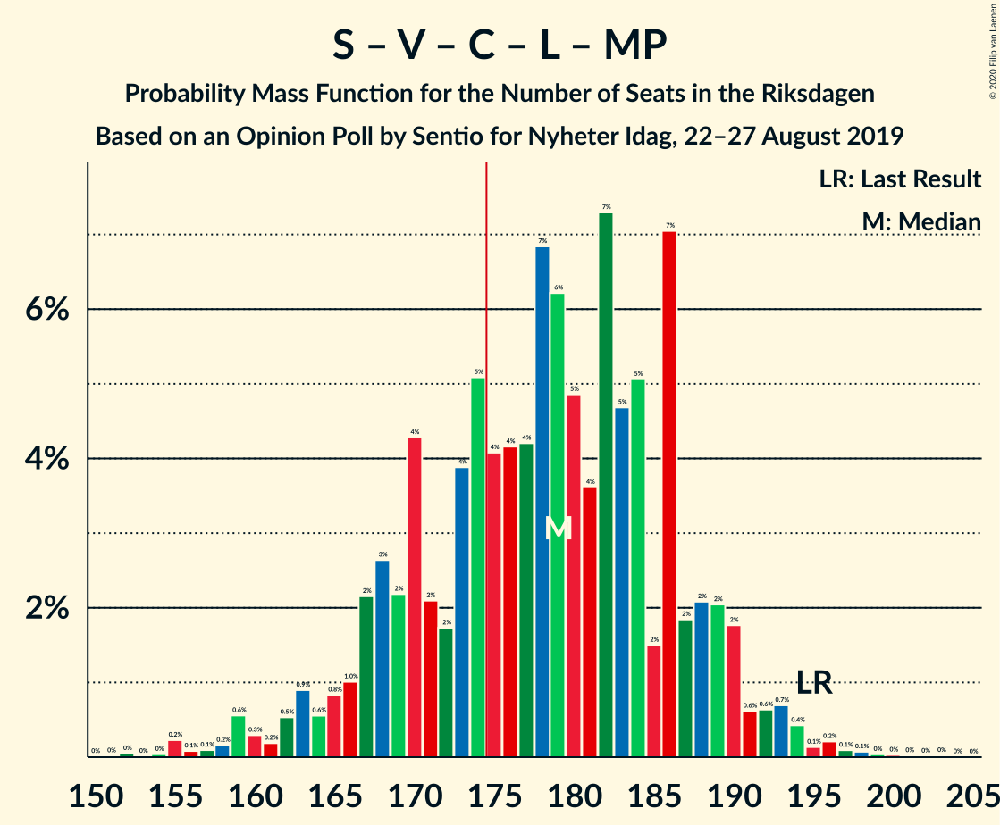
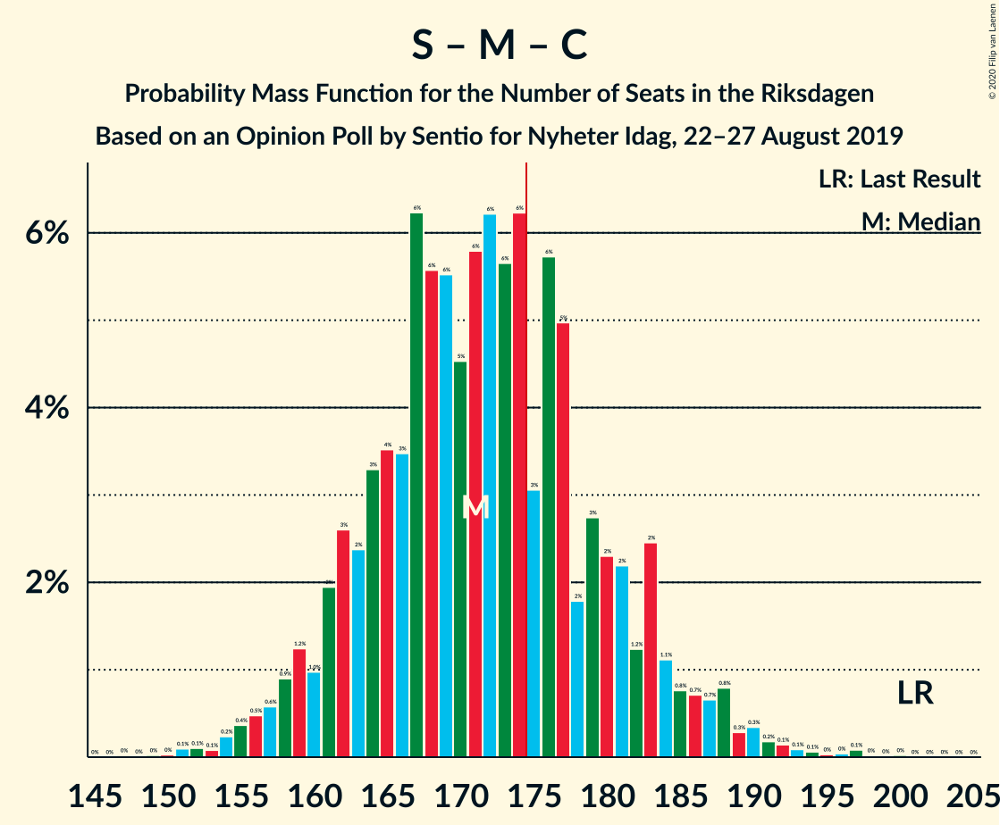

# Opinion Poll by Sentio, 22–27 August 2019

<a href="#voting-intentions">Voting Intentions</a> | <a href="#seats">Seats</a> | <a href="#coalitions">Coalitions</a> | <a href="#technical-information">Technical Information</a>

## Voting Intentions

### Confidence Intervals

| Party | Last Result | Poll Result | 80% Confidence Interval | 90% Confidence Interval | 95% Confidence Interval | 99% Confidence Interval |
|:-----:|:-----------:|:-----------:|:-----------------------:|:-----------------------:|:-----------------------:|:-----------------------:|
| Sverigedemokraterna | 17.5% | 23.6% | 21.7–25.6% |21.2–26.2% |20.8–26.7% |19.9–27.6% |
| Sveriges socialdemokratiska arbetareparti | 28.3% | 23.3% | 21.5–25.3% |21.0–25.9% |20.5–26.4% |19.6–27.4% |
| Moderata samlingspartiet | 19.8% | 18.4% | 16.7–20.3% |16.3–20.8% |15.9–21.3% |15.1–22.2% |
| Vänsterpartiet | 8.0% | 10.6% | 9.3–12.1% |8.9–12.6% |8.6–12.9% |8.0–13.7% |
| Centerpartiet | 8.6% | 6.2% | 5.2–7.4% |4.9–7.8% |4.7–8.1% |4.3–8.7% |
| Kristdemokraterna | 6.3% | 5.8% | 4.9–7.0% |4.6–7.4% |4.4–7.7% |4.0–8.3% |
| Liberalerna | 5.5% | 5.4% | 4.5–6.6% |4.3–6.9% |4.1–7.2% |3.7–7.8% |
| Miljöpartiet de gröna | 4.4% | 4.7% | 3.8–5.8% |3.6–6.1% |3.4–6.4% |3.0–7.0% |

*Note:* The poll result column reflects the actual value used in the calculations. Published results may vary slightly, and in addition be rounded to fewer digits.

## Seats

### Confidence Intervals

| Party | Last Result | Median | 80% Confidence Interval | 90% Confidence Interval | 95% Confidence Interval | 99% Confidence Interval |
|:-----:|:-----------:|:------:|:-----------------------:|:-----------------------:|:-----------------------:|:-----------------------:|
| <a href="#sverigedemokraterna">Sverigedemokraterna</a> | 62 | 79 | 75–94 |72–97 |71–97 |71–97 |
| <a href="#sveriges-socialdemokratiska-arbetareparti">Sveriges socialdemokratiska arbetareparti</a> | 100 | 81 | 75–89 |74–90 |74–95 |69–99 |
| <a href="#moderata-samlingspartiet">Moderata samlingspartiet</a> | 70 | 64 | 57–74 |55–74 |55–74 |54–80 |
| <a href="#vänsterpartiet">Vänsterpartiet</a> | 28 | 37 | 35–46 |34–47 |30–47 |28–47 |
| <a href="#centerpartiet">Centerpartiet</a> | 31 | 22 | 18–26 |18–26 |17–27 |16–31 |
| <a href="#kristdemokraterna">Kristdemokraterna</a> | 22 | 23 | 19–25 |15–25 |14–26 |0–28 |
| <a href="#liberalerna">Liberalerna</a> | 20 | 19 | 18–23 |17–23 |15–24 |0–27 |
| <a href="#miljöpartiet-de-gröna">Miljöpartiet de gröna</a> | 16 | 19 | 0–23 |0–23 |0–23 |0–25 |

### Sverigedemokraterna

*For a full overview of the results for this party, see the [Sverigedemokraterna](party-sverigedemokraterna.html) page.*

| Number of Seats | Probability | Accumulated | Special Marks |
|:---------------:|:-----------:|:-----------:|:-------------:|
| 62 | 0% | 100% | Last Result |
| 63 | 0% | 100% |  |
| 64 | 0% | 100% |  |
| 65 | 0% | 100% |  |
| 66 | 0% | 100% |  |
| 67 | 0% | 100% |  |
| 68 | 0% | 100% |  |
| 69 | 0% | 100% |  |
| 70 | 0.1% | 99.9% |  |
| 71 | 4% | 99.9% |  |
| 72 | 0.8% | 96% |  |
| 73 | 0.5% | 95% |  |
| 74 | 4% | 94% |  |
| 75 | 0.6% | 90% |  |
| 76 | 3% | 90% |  |
| 77 | 0.2% | 87% |  |
| 78 | 8% | 87% |  |
| 79 | 31% | 78% | Median |
| 80 | 0.2% | 47% |  |
| 81 | 1.2% | 47% |  |
| 82 | 2% | 46% |  |
| 83 | 13% | 44% |  |
| 84 | 1.0% | 31% |  |
| 85 | 0.4% | 30% |  |
| 86 | 2% | 29% |  |
| 87 | 0.1% | 28% |  |
| 88 | 1.0% | 28% |  |
| 89 | 7% | 27% |  |
| 90 | 2% | 19% |  |
| 91 | 0% | 17% |  |
| 92 | 6% | 17% |  |
| 93 | 0.3% | 11% |  |
| 94 | 2% | 11% |  |
| 95 | 0% | 9% |  |
| 96 | 0.3% | 9% |  |
| 97 | 8% | 9% |  |
| 98 | 0% | 0.2% |  |
| 99 | 0% | 0.1% |  |
| 100 | 0% | 0.1% |  |
| 101 | 0% | 0.1% |  |
| 102 | 0% | 0.1% |  |
| 103 | 0% | 0.1% |  |
| 104 | 0% | 0.1% |  |
| 105 | 0% | 0.1% |  |
| 106 | 0% | 0.1% |  |
| 107 | 0.1% | 0.1% |  |
| 108 | 0% | 0% |  |

### Sveriges socialdemokratiska arbetareparti

*For a full overview of the results for this party, see the [Sveriges socialdemokratiska arbetareparti](party-sverigessocialdemokratiskaarbetareparti.html) page.*

| Number of Seats | Probability | Accumulated | Special Marks |
|:---------------:|:-----------:|:-----------:|:-------------:|
| 66 | 0.1% | 100% |  |
| 67 | 0% | 99.9% |  |
| 68 | 0.3% | 99.9% |  |
| 69 | 0.1% | 99.6% |  |
| 70 | 0.2% | 99.5% |  |
| 71 | 0.1% | 99.3% |  |
| 72 | 0.1% | 99.2% |  |
| 73 | 0.4% | 99.1% |  |
| 74 | 6% | 98.7% |  |
| 75 | 3% | 93% |  |
| 76 | 0% | 90% |  |
| 77 | 1.2% | 90% |  |
| 78 | 8% | 88% |  |
| 79 | 4% | 80% |  |
| 80 | 1.5% | 77% |  |
| 81 | 30% | 75% | Median |
| 82 | 10% | 45% |  |
| 83 | 0.2% | 35% |  |
| 84 | 1.1% | 35% |  |
| 85 | 4% | 34% |  |
| 86 | 16% | 30% |  |
| 87 | 3% | 14% |  |
| 88 | 0.3% | 11% |  |
| 89 | 1.0% | 11% |  |
| 90 | 5% | 9% |  |
| 91 | 0.8% | 5% |  |
| 92 | 0.1% | 4% |  |
| 93 | 0.6% | 4% |  |
| 94 | 0.3% | 3% |  |
| 95 | 2% | 3% |  |
| 96 | 0% | 1.1% |  |
| 97 | 0% | 1.1% |  |
| 98 | 0.1% | 1.1% |  |
| 99 | 0.6% | 1.0% |  |
| 100 | 0% | 0.4% | Last Result |
| 101 | 0.3% | 0.4% |  |
| 102 | 0% | 0% |  |

### Moderata samlingspartiet

*For a full overview of the results for this party, see the [Moderata samlingspartiet](party-moderatasamlingspartiet.html) page.*

| Number of Seats | Probability | Accumulated | Special Marks |
|:---------------:|:-----------:|:-----------:|:-------------:|
| 52 | 0.1% | 100% |  |
| 53 | 0.1% | 99.8% |  |
| 54 | 0.6% | 99.8% |  |
| 55 | 7% | 99.2% |  |
| 56 | 0.3% | 92% |  |
| 57 | 2% | 92% |  |
| 58 | 0.1% | 89% |  |
| 59 | 1.0% | 89% |  |
| 60 | 2% | 88% |  |
| 61 | 4% | 86% |  |
| 62 | 5% | 82% |  |
| 63 | 1.3% | 77% |  |
| 64 | 33% | 76% | Median |
| 65 | 1.1% | 43% |  |
| 66 | 0.1% | 42% |  |
| 67 | 12% | 41% |  |
| 68 | 2% | 30% |  |
| 69 | 0.9% | 28% |  |
| 70 | 8% | 27% | Last Result |
| 71 | 0.6% | 19% |  |
| 72 | 2% | 18% |  |
| 73 | 0.5% | 17% |  |
| 74 | 14% | 16% |  |
| 75 | 0.2% | 2% |  |
| 76 | 0.6% | 2% |  |
| 77 | 0% | 1.1% |  |
| 78 | 0.1% | 1.1% |  |
| 79 | 0.1% | 1.0% |  |
| 80 | 0.5% | 0.9% |  |
| 81 | 0% | 0.3% |  |
| 82 | 0% | 0.3% |  |
| 83 | 0% | 0.3% |  |
| 84 | 0% | 0.3% |  |
| 85 | 0.3% | 0.3% |  |
| 86 | 0% | 0% |  |

### Vänsterpartiet

*For a full overview of the results for this party, see the [Vänsterpartiet](party-vänsterpartiet.html) page.*

| Number of Seats | Probability | Accumulated | Special Marks |
|:---------------:|:-----------:|:-----------:|:-------------:|
| 26 | 0% | 100% |  |
| 27 | 0.1% | 99.9% |  |
| 28 | 1.5% | 99.9% | Last Result |
| 29 | 0.4% | 98% |  |
| 30 | 0.8% | 98% |  |
| 31 | 0.2% | 97% |  |
| 32 | 0.7% | 97% |  |
| 33 | 0.1% | 96% |  |
| 34 | 2% | 96% |  |
| 35 | 8% | 94% |  |
| 36 | 2% | 86% |  |
| 37 | 38% | 84% | Median |
| 38 | 2% | 46% |  |
| 39 | 0.6% | 44% |  |
| 40 | 7% | 43% |  |
| 41 | 1.5% | 36% |  |
| 42 | 5% | 34% |  |
| 43 | 14% | 29% |  |
| 44 | 1.2% | 15% |  |
| 45 | 0.6% | 14% |  |
| 46 | 4% | 13% |  |
| 47 | 9% | 9% |  |
| 48 | 0% | 0.2% |  |
| 49 | 0% | 0.1% |  |
| 50 | 0% | 0.1% |  |
| 51 | 0% | 0.1% |  |
| 52 | 0% | 0.1% |  |
| 53 | 0% | 0% |  |

### Centerpartiet

*For a full overview of the results for this party, see the [Centerpartiet](party-centerpartiet.html) page.*

| Number of Seats | Probability | Accumulated | Special Marks |
|:---------------:|:-----------:|:-----------:|:-------------:|
| 15 | 0.2% | 100% |  |
| 16 | 2% | 99.7% |  |
| 17 | 1.1% | 98% |  |
| 18 | 13% | 97% |  |
| 19 | 0.8% | 84% |  |
| 20 | 5% | 83% |  |
| 21 | 15% | 78% |  |
| 22 | 34% | 63% | Median |
| 23 | 9% | 29% |  |
| 24 | 0.1% | 20% |  |
| 25 | 8% | 20% |  |
| 26 | 9% | 13% |  |
| 27 | 2% | 3% |  |
| 28 | 0.5% | 2% |  |
| 29 | 0% | 1.3% |  |
| 30 | 0.1% | 1.3% |  |
| 31 | 0.9% | 1.2% | Last Result |
| 32 | 0.2% | 0.3% |  |
| 33 | 0% | 0.1% |  |
| 34 | 0% | 0% |  |

### Kristdemokraterna

*For a full overview of the results for this party, see the [Kristdemokraterna](party-kristdemokraterna.html) page.*

| Number of Seats | Probability | Accumulated | Special Marks |
|:---------------:|:-----------:|:-----------:|:-------------:|
| 0 | 0.6% | 100% |  |
| 1 | 0% | 99.4% |  |
| 2 | 0% | 99.4% |  |
| 3 | 0% | 99.4% |  |
| 4 | 0% | 99.4% |  |
| 5 | 0% | 99.4% |  |
| 6 | 0% | 99.4% |  |
| 7 | 0% | 99.4% |  |
| 8 | 0% | 99.4% |  |
| 9 | 0% | 99.4% |  |
| 10 | 0% | 99.4% |  |
| 11 | 0% | 99.4% |  |
| 12 | 0% | 99.4% |  |
| 13 | 0% | 99.4% |  |
| 14 | 3% | 99.4% |  |
| 15 | 3% | 96% |  |
| 16 | 0.3% | 94% |  |
| 17 | 1.2% | 93% |  |
| 18 | 1.1% | 92% |  |
| 19 | 9% | 91% |  |
| 20 | 23% | 83% |  |
| 21 | 7% | 60% |  |
| 22 | 2% | 52% | Last Result |
| 23 | 7% | 51% | Median |
| 24 | 6% | 44% |  |
| 25 | 34% | 38% |  |
| 26 | 3% | 4% |  |
| 27 | 0.3% | 1.0% |  |
| 28 | 0.3% | 0.6% |  |
| 29 | 0.1% | 0.4% |  |
| 30 | 0.2% | 0.3% |  |
| 31 | 0% | 0.1% |  |
| 32 | 0% | 0.1% |  |
| 33 | 0% | 0% |  |

### Liberalerna

*For a full overview of the results for this party, see the [Liberalerna](party-liberalerna.html) page.*

| Number of Seats | Probability | Accumulated | Special Marks |
|:---------------:|:-----------:|:-----------:|:-------------:|
| 0 | 2% | 100% |  |
| 1 | 0% | 98% |  |
| 2 | 0% | 98% |  |
| 3 | 0% | 98% |  |
| 4 | 0% | 98% |  |
| 5 | 0% | 98% |  |
| 6 | 0% | 98% |  |
| 7 | 0% | 98% |  |
| 8 | 0% | 98% |  |
| 9 | 0% | 98% |  |
| 10 | 0% | 98% |  |
| 11 | 0% | 98% |  |
| 12 | 0% | 98% |  |
| 13 | 0% | 98% |  |
| 14 | 0.4% | 98% |  |
| 15 | 1.3% | 98% |  |
| 16 | 0.6% | 96% |  |
| 17 | 4% | 96% |  |
| 18 | 8% | 92% |  |
| 19 | 47% | 84% | Median |
| 20 | 2% | 37% | Last Result |
| 21 | 25% | 35% |  |
| 22 | 0.3% | 10% |  |
| 23 | 7% | 10% |  |
| 24 | 0.5% | 3% |  |
| 25 | 0.4% | 2% |  |
| 26 | 0.6% | 2% |  |
| 27 | 0.8% | 1.2% |  |
| 28 | 0.1% | 0.4% |  |
| 29 | 0.2% | 0.3% |  |
| 30 | 0% | 0.1% |  |
| 31 | 0.1% | 0.1% |  |
| 32 | 0% | 0% |  |

### Miljöpartiet de gröna

*For a full overview of the results for this party, see the [Miljöpartiet de gröna](party-miljöpartietdegröna.html) page.*

| Number of Seats | Probability | Accumulated | Special Marks |
|:---------------:|:-----------:|:-----------:|:-------------:|
| 0 | 22% | 100% |  |
| 1 | 0% | 78% |  |
| 2 | 0% | 78% |  |
| 3 | 0% | 78% |  |
| 4 | 0% | 78% |  |
| 5 | 0% | 78% |  |
| 6 | 0% | 78% |  |
| 7 | 0% | 78% |  |
| 8 | 0% | 78% |  |
| 9 | 0% | 78% |  |
| 10 | 0% | 78% |  |
| 11 | 0% | 78% |  |
| 12 | 0% | 78% |  |
| 13 | 0% | 78% |  |
| 14 | 1.3% | 78% |  |
| 15 | 0.8% | 76% |  |
| 16 | 6% | 76% | Last Result |
| 17 | 3% | 70% |  |
| 18 | 7% | 66% |  |
| 19 | 14% | 59% | Median |
| 20 | 4% | 45% |  |
| 21 | 0.7% | 41% |  |
| 22 | 30% | 40% |  |
| 23 | 8% | 10% |  |
| 24 | 2% | 2% |  |
| 25 | 0.6% | 0.6% |  |
| 26 | 0% | 0.1% |  |
| 27 | 0% | 0.1% |  |
| 28 | 0% | 0.1% |  |
| 29 | 0% | 0.1% |  |
| 30 | 0% | 0% |  |

## Coalitions

### Confidence Intervals

| Coalition | Last Result | Median | Majority? | 80% Confidence Interval | 90% Confidence Interval | 95% Confidence Interval | 99% Confidence Interval |
|:---------:|:-----------:|:------:|:---------:|:-----------------------:|:-----------------------:|:-----------------------:|:-----------------------:|
| Sveriges socialdemokratiska arbetareparti – Vänsterpartiet – Centerpartiet – Liberalerna – Miljöpartiet de gröna | 195 | 181 | 78% | 166–187 | 165–193 | 165–196 | 161–196 |
| Sveriges socialdemokratiska arbetareparti – Moderata samlingspartiet – Centerpartiet | 201 | 167 | 23% | 166–183 | 163–183 | 154–185 | 152–189 |
| Sverigedemokraterna – Moderata samlingspartiet – Kristdemokraterna | 154 | 168 | 22% | 162–183 | 156–184 | 153–184 | 153–188 |
| Sverigedemokraterna – Moderata samlingspartiet | 132 | 144 | 0.3% | 140–163 | 135–164 | 133–164 | 133–168 |
| Sveriges socialdemokratiska arbetareparti – Moderata samlingspartiet | 170 | 146 | 0% | 141–160 | 141–160 | 132–162 | 132–166 |
| Sveriges socialdemokratiska arbetareparti – Centerpartiet – Liberalerna – Miljöpartiet de gröna | 167 | 144 | 0% | 126–152 | 122–156 | 122–156 | 122–157 |
| Sveriges socialdemokratiska arbetareparti – Vänsterpartiet – Miljöpartiet de gröna | 144 | 140 | 0% | 125–147 | 125–149 | 125–150 | 121–153 |
| Moderata samlingspartiet – Centerpartiet – Kristdemokraterna – Liberalerna | 143 | 130 | 0% | 120–138 | 118–138 | 116–140 | 113–145 |
| Sveriges socialdemokratiska arbetareparti – Vänsterpartiet | 128 | 118 | 0% | 115–133 | 115–133 | 108–134 | 106–139 |
| Moderata samlingspartiet – Centerpartiet – Kristdemokraterna | 123 | 111 | 0% | 101–117 | 101–117 | 97–122 | 92–125 |
| Moderata samlingspartiet – Centerpartiet – Liberalerna | 121 | 105 | 0% | 99–118 | 98–118 | 96–118 | 89–123 |
| Sveriges socialdemokratiska arbetareparti – Miljöpartiet de gröna | 116 | 103 | 0% | 85–107 | 82–109 | 82–113 | 82–116 |
| Moderata samlingspartiet – Centerpartiet | 101 | 86 | 0% | 80–97 | 80–97 | 77–98 | 74–102 |

### Sveriges socialdemokratiska arbetareparti – Vänsterpartiet – Centerpartiet – Liberalerna – Miljöpartiet de gröna

| Number of Seats | Probability | Accumulated | Special Marks |
|:---------------:|:-----------:|:-----------:|:-------------:|
| 150 | 0.3% | 100% |  |
| 151 | 0% | 99.7% |  |
| 152 | 0% | 99.7% |  |
| 153 | 0% | 99.7% |  |
| 154 | 0% | 99.7% |  |
| 155 | 0% | 99.7% |  |
| 156 | 0.1% | 99.7% |  |
| 157 | 0% | 99.6% |  |
| 158 | 0% | 99.6% |  |
| 159 | 0% | 99.6% |  |
| 160 | 0.1% | 99.6% |  |
| 161 | 0.2% | 99.5% |  |
| 162 | 0% | 99.3% |  |
| 163 | 0.2% | 99.3% |  |
| 164 | 0.9% | 99.1% |  |
| 165 | 8% | 98% |  |
| 166 | 0.7% | 90% |  |
| 167 | 0% | 89% |  |
| 168 | 0.1% | 89% |  |
| 169 | 6% | 89% |  |
| 170 | 3% | 83% |  |
| 171 | 2% | 80% |  |
| 172 | 0.5% | 79% |  |
| 173 | 0.2% | 78% |  |
| 174 | 0% | 78% |  |
| 175 | 3% | 78% | Majority |
| 176 | 1.1% | 75% |  |
| 177 | 16% | 74% |  |
| 178 | 2% | 58% | Median |
| 179 | 0.5% | 56% |  |
| 180 | 2% | 56% |  |
| 181 | 30% | 54% |  |
| 182 | 2% | 24% |  |
| 183 | 0.1% | 22% |  |
| 184 | 7% | 22% |  |
| 185 | 0.1% | 14% |  |
| 186 | 0.3% | 14% |  |
| 187 | 4% | 14% |  |
| 188 | 0% | 10% |  |
| 189 | 1.0% | 10% |  |
| 190 | 0.5% | 9% |  |
| 191 | 0.1% | 8% |  |
| 192 | 3% | 8% |  |
| 193 | 0.6% | 6% |  |
| 194 | 0.6% | 5% |  |
| 195 | 0% | 4% | Last Result |
| 196 | 4% | 4% |  |
| 197 | 0% | 0.1% |  |
| 198 | 0.1% | 0.1% |  |
| 199 | 0% | 0% |  |

### Sveriges socialdemokratiska arbetareparti – Moderata samlingspartiet – Centerpartiet

| Number of Seats | Probability | Accumulated | Special Marks |
|:---------------:|:-----------:|:-----------:|:-------------:|
| 151 | 0.1% | 100% |  |
| 152 | 2% | 99.9% |  |
| 153 | 0.1% | 98% |  |
| 154 | 0.1% | 98% |  |
| 155 | 0% | 97% |  |
| 156 | 0.2% | 97% |  |
| 157 | 0% | 97% |  |
| 158 | 0% | 97% |  |
| 159 | 0.2% | 97% |  |
| 160 | 0% | 97% |  |
| 161 | 0.2% | 97% |  |
| 162 | 0.3% | 97% |  |
| 163 | 2% | 96% |  |
| 164 | 4% | 94% |  |
| 165 | 0% | 90% |  |
| 166 | 22% | 90% |  |
| 167 | 30% | 69% | Median |
| 168 | 0.2% | 39% |  |
| 169 | 0.2% | 39% |  |
| 170 | 9% | 38% |  |
| 171 | 1.2% | 29% |  |
| 172 | 3% | 28% |  |
| 173 | 2% | 25% |  |
| 174 | 0% | 23% |  |
| 175 | 0.6% | 23% | Majority |
| 176 | 3% | 23% |  |
| 177 | 0.8% | 20% |  |
| 178 | 6% | 19% |  |
| 179 | 0.8% | 13% |  |
| 180 | 0.2% | 12% |  |
| 181 | 0.1% | 12% |  |
| 182 | 0.3% | 12% |  |
| 183 | 8% | 11% |  |
| 184 | 0.1% | 3% |  |
| 185 | 0.8% | 3% |  |
| 186 | 0.5% | 2% |  |
| 187 | 0.5% | 2% |  |
| 188 | 0.1% | 1.2% |  |
| 189 | 0.7% | 1.1% |  |
| 190 | 0.4% | 0.4% |  |
| 191 | 0% | 0.1% |  |
| 192 | 0% | 0.1% |  |
| 193 | 0% | 0% |  |
| 194 | 0% | 0% |  |
| 195 | 0% | 0% |  |
| 196 | 0% | 0% |  |
| 197 | 0% | 0% |  |
| 198 | 0% | 0% |  |
| 199 | 0% | 0% |  |
| 200 | 0% | 0% |  |
| 201 | 0% | 0% | Last Result |

### Sverigedemokraterna – Moderata samlingspartiet – Kristdemokraterna

| Number of Seats | Probability | Accumulated | Special Marks |
|:---------------:|:-----------:|:-----------:|:-------------:|
| 151 | 0.1% | 100% |  |
| 152 | 0% | 99.9% |  |
| 153 | 4% | 99.9% |  |
| 154 | 0% | 96% | Last Result |
| 155 | 0.6% | 96% |  |
| 156 | 0.6% | 95% |  |
| 157 | 3% | 94% |  |
| 158 | 0.1% | 92% |  |
| 159 | 0.5% | 92% |  |
| 160 | 1.0% | 91% |  |
| 161 | 0% | 90% |  |
| 162 | 4% | 90% |  |
| 163 | 0.3% | 86% |  |
| 164 | 0.1% | 86% |  |
| 165 | 8% | 86% |  |
| 166 | 0.1% | 78% | Median |
| 167 | 2% | 78% |  |
| 168 | 30% | 76% |  |
| 169 | 2% | 46% |  |
| 170 | 0.5% | 44% |  |
| 171 | 2% | 44% |  |
| 172 | 16% | 42% |  |
| 173 | 1.1% | 26% |  |
| 174 | 3% | 25% |  |
| 175 | 0% | 22% | Majority |
| 176 | 0.2% | 22% |  |
| 177 | 0.5% | 22% |  |
| 178 | 2% | 21% |  |
| 179 | 3% | 20% |  |
| 180 | 6% | 17% |  |
| 181 | 0.1% | 11% |  |
| 182 | 0% | 11% |  |
| 183 | 0.7% | 11% |  |
| 184 | 8% | 10% |  |
| 185 | 0.9% | 2% |  |
| 186 | 0.2% | 0.9% |  |
| 187 | 0% | 0.7% |  |
| 188 | 0.2% | 0.7% |  |
| 189 | 0.1% | 0.5% |  |
| 190 | 0% | 0.4% |  |
| 191 | 0% | 0.4% |  |
| 192 | 0% | 0.4% |  |
| 193 | 0.1% | 0.4% |  |
| 194 | 0% | 0.3% |  |
| 195 | 0% | 0.3% |  |
| 196 | 0% | 0.3% |  |
| 197 | 0% | 0.3% |  |
| 198 | 0% | 0.3% |  |
| 199 | 0.3% | 0.3% |  |
| 200 | 0% | 0% |  |

### Sverigedemokraterna – Moderata samlingspartiet

| Number of Seats | Probability | Accumulated | Special Marks |
|:---------------:|:-----------:|:-----------:|:-------------:|
| 130 | 0% | 100% |  |
| 131 | 0% | 99.9% |  |
| 132 | 0% | 99.9% | Last Result |
| 133 | 5% | 99.9% |  |
| 134 | 0% | 95% |  |
| 135 | 0.4% | 95% |  |
| 136 | 0.1% | 95% |  |
| 137 | 0% | 95% |  |
| 138 | 4% | 95% |  |
| 139 | 0.2% | 91% |  |
| 140 | 0.9% | 91% |  |
| 141 | 0% | 90% |  |
| 142 | 0.5% | 90% |  |
| 143 | 33% | 89% | Median |
| 144 | 8% | 56% |  |
| 145 | 0% | 48% |  |
| 146 | 0.1% | 48% |  |
| 147 | 0.1% | 48% |  |
| 148 | 0.6% | 47% |  |
| 149 | 3% | 47% |  |
| 150 | 0.5% | 44% |  |
| 151 | 2% | 43% |  |
| 152 | 10% | 41% |  |
| 153 | 10% | 32% |  |
| 154 | 3% | 22% |  |
| 155 | 0.1% | 18% |  |
| 156 | 0% | 18% |  |
| 157 | 7% | 18% |  |
| 158 | 0.2% | 12% |  |
| 159 | 0% | 11% |  |
| 160 | 1.1% | 11% |  |
| 161 | 0.2% | 10% |  |
| 162 | 0.2% | 10% |  |
| 163 | 0.3% | 10% |  |
| 164 | 9% | 10% |  |
| 165 | 0% | 1.0% |  |
| 166 | 0% | 1.0% |  |
| 167 | 0.1% | 1.0% |  |
| 168 | 0.5% | 0.9% |  |
| 169 | 0% | 0.4% |  |
| 170 | 0% | 0.3% |  |
| 171 | 0% | 0.3% |  |
| 172 | 0% | 0.3% |  |
| 173 | 0% | 0.3% |  |
| 174 | 0% | 0.3% |  |
| 175 | 0.3% | 0.3% | Majority |
| 176 | 0% | 0% |  |

### Sveriges socialdemokratiska arbetareparti – Moderata samlingspartiet

| Number of Seats | Probability | Accumulated | Special Marks |
|:---------------:|:-----------:|:-----------:|:-------------:|
| 129 | 0.1% | 100% |  |
| 130 | 0.1% | 99.9% |  |
| 131 | 0.1% | 99.8% |  |
| 132 | 2% | 99.6% |  |
| 133 | 0% | 97% |  |
| 134 | 0.1% | 97% |  |
| 135 | 0.2% | 97% |  |
| 136 | 0.1% | 97% |  |
| 137 | 0.1% | 97% |  |
| 138 | 0% | 97% |  |
| 139 | 0% | 97% |  |
| 140 | 1.0% | 97% |  |
| 141 | 7% | 96% |  |
| 142 | 2% | 89% |  |
| 143 | 4% | 87% |  |
| 144 | 0.5% | 83% |  |
| 145 | 30% | 82% | Median |
| 146 | 4% | 52% |  |
| 147 | 0.2% | 48% |  |
| 148 | 14% | 48% |  |
| 149 | 8% | 34% |  |
| 150 | 0.1% | 25% |  |
| 151 | 0.1% | 25% |  |
| 152 | 7% | 25% |  |
| 153 | 1.5% | 19% |  |
| 154 | 4% | 17% |  |
| 155 | 0% | 13% |  |
| 156 | 0.1% | 13% |  |
| 157 | 0.7% | 13% |  |
| 158 | 0% | 13% |  |
| 159 | 0.5% | 13% |  |
| 160 | 9% | 12% |  |
| 161 | 0% | 3% |  |
| 162 | 0.3% | 3% |  |
| 163 | 0.2% | 2% |  |
| 164 | 0.5% | 2% |  |
| 165 | 0.5% | 2% |  |
| 166 | 0.9% | 1.0% |  |
| 167 | 0% | 0.1% |  |
| 168 | 0% | 0.1% |  |
| 169 | 0% | 0.1% |  |
| 170 | 0% | 0.1% | Last Result |
| 171 | 0% | 0% |  |

### Sveriges socialdemokratiska arbetareparti – Centerpartiet – Liberalerna – Miljöpartiet de gröna

| Number of Seats | Probability | Accumulated | Special Marks |
|:---------------:|:-----------:|:-----------:|:-------------:|
| 115 | 0.3% | 100% |  |
| 116 | 0% | 99.7% |  |
| 117 | 0% | 99.7% |  |
| 118 | 0.1% | 99.7% |  |
| 119 | 0% | 99.6% |  |
| 120 | 0% | 99.6% |  |
| 121 | 0.1% | 99.6% |  |
| 122 | 8% | 99.5% |  |
| 123 | 1.2% | 91% |  |
| 124 | 0% | 90% |  |
| 125 | 0% | 90% |  |
| 126 | 6% | 90% |  |
| 127 | 0% | 84% |  |
| 128 | 3% | 84% |  |
| 129 | 0% | 81% |  |
| 130 | 9% | 81% |  |
| 131 | 0.1% | 72% |  |
| 132 | 0.8% | 72% |  |
| 133 | 2% | 71% |  |
| 134 | 0% | 69% |  |
| 135 | 0.7% | 69% |  |
| 136 | 0.7% | 68% |  |
| 137 | 0.1% | 67% |  |
| 138 | 0.3% | 67% |  |
| 139 | 0.4% | 67% |  |
| 140 | 8% | 66% |  |
| 141 | 4% | 59% | Median |
| 142 | 0.4% | 55% |  |
| 143 | 3% | 54% |  |
| 144 | 32% | 52% |  |
| 145 | 0.4% | 20% |  |
| 146 | 0.1% | 19% |  |
| 147 | 0.5% | 19% |  |
| 148 | 0.7% | 19% |  |
| 149 | 8% | 18% |  |
| 150 | 0% | 10% |  |
| 151 | 0.1% | 10% |  |
| 152 | 4% | 10% |  |
| 153 | 0.4% | 6% |  |
| 154 | 0% | 5% |  |
| 155 | 0% | 5% |  |
| 156 | 5% | 5% |  |
| 157 | 0.7% | 0.8% |  |
| 158 | 0.1% | 0.1% |  |
| 159 | 0% | 0% |  |
| 160 | 0% | 0% |  |
| 161 | 0% | 0% |  |
| 162 | 0% | 0% |  |
| 163 | 0% | 0% |  |
| 164 | 0% | 0% |  |
| 165 | 0% | 0% |  |
| 166 | 0% | 0% |  |
| 167 | 0% | 0% | Last Result |

### Sveriges socialdemokratiska arbetareparti – Vänsterpartiet – Miljöpartiet de gröna

| Number of Seats | Probability | Accumulated | Special Marks |
|:---------------:|:-----------:|:-----------:|:-------------:|
| 110 | 0.3% | 100% |  |
| 111 | 0% | 99.7% |  |
| 112 | 0% | 99.7% |  |
| 113 | 0.1% | 99.7% |  |
| 114 | 0% | 99.6% |  |
| 115 | 0% | 99.6% |  |
| 116 | 0% | 99.6% |  |
| 117 | 0% | 99.6% |  |
| 118 | 0% | 99.6% |  |
| 119 | 0% | 99.6% |  |
| 120 | 0% | 99.5% |  |
| 121 | 0.7% | 99.5% |  |
| 122 | 0.2% | 98.8% |  |
| 123 | 0% | 98.6% |  |
| 124 | 0% | 98.6% |  |
| 125 | 9% | 98.6% |  |
| 126 | 0.2% | 90% |  |
| 127 | 4% | 89% |  |
| 128 | 0.2% | 85% |  |
| 129 | 0.2% | 85% |  |
| 130 | 0.4% | 85% |  |
| 131 | 0% | 85% |  |
| 132 | 0.7% | 85% |  |
| 133 | 14% | 84% |  |
| 134 | 3% | 70% |  |
| 135 | 0.1% | 67% |  |
| 136 | 2% | 67% |  |
| 137 | 0.1% | 65% | Median |
| 138 | 9% | 65% |  |
| 139 | 2% | 56% |  |
| 140 | 37% | 55% |  |
| 141 | 0.2% | 18% |  |
| 142 | 0% | 17% |  |
| 143 | 6% | 17% |  |
| 144 | 0.2% | 11% | Last Result |
| 145 | 0.2% | 11% |  |
| 146 | 0% | 11% |  |
| 147 | 3% | 11% |  |
| 148 | 0.2% | 7% |  |
| 149 | 4% | 7% |  |
| 150 | 0.9% | 3% |  |
| 151 | 0% | 2% |  |
| 152 | 1.1% | 2% |  |
| 153 | 0.5% | 0.7% |  |
| 154 | 0% | 0.2% |  |
| 155 | 0% | 0.1% |  |
| 156 | 0% | 0.1% |  |
| 157 | 0% | 0.1% |  |
| 158 | 0% | 0.1% |  |
| 159 | 0% | 0% |  |

### Moderata samlingspartiet – Centerpartiet – Kristdemokraterna – Liberalerna

| Number of Seats | Probability | Accumulated | Special Marks |
|:---------------:|:-----------:|:-----------:|:-------------:|
| 107 | 0.2% | 100% |  |
| 108 | 0% | 99.7% |  |
| 109 | 0% | 99.7% |  |
| 110 | 0% | 99.7% |  |
| 111 | 0% | 99.7% |  |
| 112 | 0% | 99.6% |  |
| 113 | 0.2% | 99.6% |  |
| 114 | 0.9% | 99.5% |  |
| 115 | 0.9% | 98.6% |  |
| 116 | 1.1% | 98% |  |
| 117 | 1.3% | 96% |  |
| 118 | 1.1% | 95% |  |
| 119 | 0.5% | 94% |  |
| 120 | 8% | 94% |  |
| 121 | 0% | 85% |  |
| 122 | 0.5% | 85% |  |
| 123 | 2% | 85% |  |
| 124 | 1.0% | 82% |  |
| 125 | 0.6% | 81% |  |
| 126 | 3% | 81% |  |
| 127 | 8% | 78% |  |
| 128 | 8% | 69% | Median |
| 129 | 5% | 62% |  |
| 130 | 33% | 57% |  |
| 131 | 0.1% | 24% |  |
| 132 | 4% | 24% |  |
| 133 | 6% | 19% |  |
| 134 | 0.2% | 13% |  |
| 135 | 0.2% | 13% |  |
| 136 | 0.5% | 13% |  |
| 137 | 0% | 12% |  |
| 138 | 8% | 12% |  |
| 139 | 0.1% | 4% |  |
| 140 | 2% | 4% |  |
| 141 | 0.1% | 2% |  |
| 142 | 0.6% | 2% |  |
| 143 | 0.2% | 1.1% | Last Result |
| 144 | 0% | 0.9% |  |
| 145 | 0.4% | 0.9% |  |
| 146 | 0% | 0.5% |  |
| 147 | 0% | 0.5% |  |
| 148 | 0% | 0.4% |  |
| 149 | 0.3% | 0.4% |  |
| 150 | 0% | 0.2% |  |
| 151 | 0% | 0.1% |  |
| 152 | 0% | 0.1% |  |
| 153 | 0% | 0% |  |

### Sveriges socialdemokratiska arbetareparti – Vänsterpartiet

| Number of Seats | Probability | Accumulated | Special Marks |
|:---------------:|:-----------:|:-----------:|:-------------:|
| 103 | 0.3% | 100% |  |
| 104 | 0.1% | 99.6% |  |
| 105 | 0% | 99.6% |  |
| 106 | 0.1% | 99.5% |  |
| 107 | 0.6% | 99.4% |  |
| 108 | 1.5% | 98.8% |  |
| 109 | 0% | 97% |  |
| 110 | 0.4% | 97% |  |
| 111 | 0.1% | 97% |  |
| 112 | 0.1% | 97% |  |
| 113 | 0.2% | 97% |  |
| 114 | 0.5% | 97% |  |
| 115 | 8% | 96% |  |
| 116 | 0.1% | 88% |  |
| 117 | 9% | 88% |  |
| 118 | 32% | 79% | Median |
| 119 | 1.3% | 48% |  |
| 120 | 0.3% | 46% |  |
| 121 | 7% | 46% |  |
| 122 | 0.3% | 39% |  |
| 123 | 0.4% | 39% |  |
| 124 | 0.6% | 38% |  |
| 125 | 14% | 38% |  |
| 126 | 0.3% | 23% |  |
| 127 | 6% | 23% |  |
| 128 | 0.3% | 17% | Last Result |
| 129 | 0.1% | 17% |  |
| 130 | 4% | 17% |  |
| 131 | 0.1% | 12% |  |
| 132 | 1.2% | 12% |  |
| 133 | 8% | 11% |  |
| 134 | 0.5% | 3% |  |
| 135 | 0.7% | 2% |  |
| 136 | 0.6% | 1.4% |  |
| 137 | 0% | 0.8% |  |
| 138 | 0% | 0.8% |  |
| 139 | 0.7% | 0.8% |  |
| 140 | 0% | 0.1% |  |
| 141 | 0% | 0.1% |  |
| 142 | 0% | 0.1% |  |
| 143 | 0% | 0.1% |  |
| 144 | 0% | 0.1% |  |
| 145 | 0% | 0.1% |  |
| 146 | 0% | 0% |  |

### Moderata samlingspartiet – Centerpartiet – Kristdemokraterna

| Number of Seats | Probability | Accumulated | Special Marks |
|:---------------:|:-----------:|:-----------:|:-------------:|
| 92 | 0.9% | 100% |  |
| 93 | 0.1% | 99.1% |  |
| 94 | 0% | 99.0% |  |
| 95 | 0% | 99.0% |  |
| 96 | 1.3% | 99.0% |  |
| 97 | 0.6% | 98% |  |
| 98 | 0.2% | 97% |  |
| 99 | 0.5% | 97% |  |
| 100 | 0.2% | 96% |  |
| 101 | 9% | 96% |  |
| 102 | 3% | 87% |  |
| 103 | 4% | 85% |  |
| 104 | 0.9% | 81% |  |
| 105 | 1.0% | 80% |  |
| 106 | 0.2% | 79% |  |
| 107 | 8% | 79% |  |
| 108 | 13% | 72% |  |
| 109 | 4% | 59% | Median |
| 110 | 0.3% | 55% |  |
| 111 | 30% | 55% |  |
| 112 | 1.2% | 24% |  |
| 113 | 3% | 23% |  |
| 114 | 1.1% | 20% |  |
| 115 | 6% | 19% |  |
| 116 | 0.1% | 13% |  |
| 117 | 9% | 13% |  |
| 118 | 0.9% | 4% |  |
| 119 | 0% | 4% |  |
| 120 | 0.3% | 4% |  |
| 121 | 0.5% | 3% |  |
| 122 | 2% | 3% |  |
| 123 | 0.2% | 0.8% | Last Result |
| 124 | 0% | 0.6% |  |
| 125 | 0.1% | 0.5% |  |
| 126 | 0% | 0.5% |  |
| 127 | 0.1% | 0.5% |  |
| 128 | 0% | 0.4% |  |
| 129 | 0% | 0.4% |  |
| 130 | 0% | 0.3% |  |
| 131 | 0.3% | 0.3% |  |
| 132 | 0% | 0.1% |  |
| 133 | 0% | 0.1% |  |
| 134 | 0% | 0% |  |

### Moderata samlingspartiet – Centerpartiet – Liberalerna

| Number of Seats | Probability | Accumulated | Special Marks |
|:---------------:|:-----------:|:-----------:|:-------------:|
| 83 | 0% | 100% |  |
| 84 | 0% | 99.9% |  |
| 85 | 0.1% | 99.9% |  |
| 86 | 0% | 99.8% |  |
| 87 | 0% | 99.8% |  |
| 88 | 0.2% | 99.8% |  |
| 89 | 0.9% | 99.7% |  |
| 90 | 0% | 98.8% |  |
| 91 | 0% | 98.8% |  |
| 92 | 0.2% | 98.8% |  |
| 93 | 0.1% | 98.6% |  |
| 94 | 0% | 98% |  |
| 95 | 0.8% | 98% |  |
| 96 | 1.1% | 98% |  |
| 97 | 0.1% | 96% |  |
| 98 | 4% | 96% |  |
| 99 | 7% | 93% |  |
| 100 | 0.5% | 86% |  |
| 101 | 0.1% | 85% |  |
| 102 | 2% | 85% |  |
| 103 | 0.1% | 83% |  |
| 104 | 3% | 83% |  |
| 105 | 31% | 80% | Median |
| 106 | 0.5% | 49% |  |
| 107 | 8% | 49% |  |
| 108 | 4% | 40% |  |
| 109 | 12% | 36% |  |
| 110 | 6% | 24% |  |
| 111 | 0% | 18% |  |
| 112 | 3% | 18% |  |
| 113 | 0.3% | 15% |  |
| 114 | 0.9% | 15% |  |
| 115 | 2% | 14% |  |
| 116 | 2% | 12% |  |
| 117 | 0.1% | 11% |  |
| 118 | 9% | 11% |  |
| 119 | 0.2% | 2% |  |
| 120 | 0% | 1.5% |  |
| 121 | 0% | 1.5% | Last Result |
| 122 | 0.5% | 1.4% |  |
| 123 | 0.5% | 1.0% |  |
| 124 | 0% | 0.5% |  |
| 125 | 0.3% | 0.4% |  |
| 126 | 0% | 0.1% |  |
| 127 | 0% | 0.1% |  |
| 128 | 0% | 0% |  |

### Sveriges socialdemokratiska arbetareparti – Miljöpartiet de gröna

| Number of Seats | Probability | Accumulated | Special Marks |
|:---------------:|:-----------:|:-----------:|:-------------:|
| 75 | 0.3% | 100% |  |
| 76 | 0% | 99.7% |  |
| 77 | 0% | 99.7% |  |
| 78 | 0.1% | 99.7% |  |
| 79 | 0% | 99.6% |  |
| 80 | 0% | 99.6% |  |
| 81 | 0% | 99.6% |  |
| 82 | 8% | 99.6% |  |
| 83 | 0% | 91% |  |
| 84 | 0.1% | 91% |  |
| 85 | 3% | 91% |  |
| 86 | 9% | 88% |  |
| 87 | 0.2% | 80% |  |
| 88 | 0.4% | 79% |  |
| 89 | 0.1% | 79% |  |
| 90 | 6% | 79% |  |
| 91 | 0.6% | 73% |  |
| 92 | 2% | 72% |  |
| 93 | 1.1% | 70% |  |
| 94 | 0% | 68% |  |
| 95 | 0.8% | 68% |  |
| 96 | 0.5% | 68% |  |
| 97 | 4% | 67% |  |
| 98 | 0.8% | 63% |  |
| 99 | 1.5% | 63% |  |
| 100 | 0.2% | 61% | Median |
| 101 | 8% | 61% |  |
| 102 | 3% | 53% |  |
| 103 | 30% | 51% |  |
| 104 | 0.2% | 21% |  |
| 105 | 9% | 21% |  |
| 106 | 0.5% | 12% |  |
| 107 | 3% | 11% |  |
| 108 | 0.5% | 9% |  |
| 109 | 6% | 8% |  |
| 110 | 0.1% | 3% |  |
| 111 | 0% | 3% |  |
| 112 | 0% | 3% |  |
| 113 | 1.0% | 3% |  |
| 114 | 0.8% | 1.5% |  |
| 115 | 0% | 0.7% |  |
| 116 | 0.6% | 0.7% | Last Result |
| 117 | 0% | 0.1% |  |
| 118 | 0% | 0.1% |  |
| 119 | 0% | 0% |  |

### Moderata samlingspartiet – Centerpartiet

| Number of Seats | Probability | Accumulated | Special Marks |
|:---------------:|:-----------:|:-----------:|:-------------:|
| 71 | 0.1% | 100% |  |
| 72 | 0% | 99.9% |  |
| 73 | 0.1% | 99.9% |  |
| 74 | 0.6% | 99.8% |  |
| 75 | 0.9% | 99.2% |  |
| 76 | 0.1% | 98% |  |
| 77 | 2% | 98% |  |
| 78 | 0.2% | 96% |  |
| 79 | 0.1% | 96% |  |
| 80 | 7% | 96% |  |
| 81 | 3% | 88% |  |
| 82 | 0.9% | 86% |  |
| 83 | 0.3% | 85% |  |
| 84 | 0.3% | 84% |  |
| 85 | 4% | 84% |  |
| 86 | 30% | 80% | Median |
| 87 | 3% | 50% |  |
| 88 | 21% | 47% |  |
| 89 | 4% | 26% |  |
| 90 | 0.3% | 21% |  |
| 91 | 0% | 21% |  |
| 92 | 6% | 21% |  |
| 93 | 0.3% | 15% |  |
| 94 | 0.8% | 15% |  |
| 95 | 0.2% | 14% |  |
| 96 | 1.2% | 14% |  |
| 97 | 8% | 12% |  |
| 98 | 3% | 4% |  |
| 99 | 0.5% | 1.4% |  |
| 100 | 0.2% | 0.8% |  |
| 101 | 0.1% | 0.6% | Last Result |
| 102 | 0% | 0.5% |  |
| 103 | 0% | 0.5% |  |
| 104 | 0% | 0.5% |  |
| 105 | 0% | 0.4% |  |
| 106 | 0.1% | 0.4% |  |
| 107 | 0.3% | 0.3% |  |
| 108 | 0% | 0% |  |

## Technical Information

### Opinion Poll

+ **Polling firm:** Sentio
+ **Commissioner(s):** —
+ **Fieldwork period:** 22–27 August 2019

### Calculations

+ **Sample size:** 793
+ **Simulations done:** 16,384
+ **Error estimate:** 2.35%

