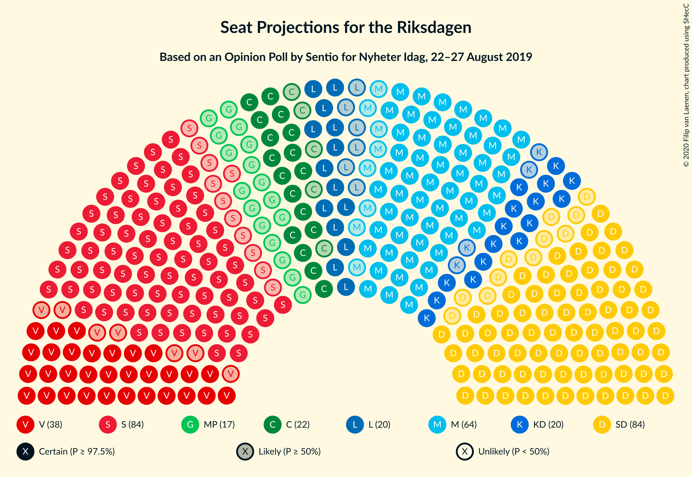

# Opinion Poll by Sentio for Nyheter Idag, 22–27 August 2019

<a href="#voting-intentions">Voting Intentions</a> | <a href="#seats">Seats</a> | <a href="#coalitions">Coalitions</a> | <a href="#technical-information">Technical Information</a>

## Voting Intentions

### Confidence Intervals

| Party | Last Result | Poll Result | 80% Confidence Interval | 90% Confidence Interval | 95% Confidence Interval | 99% Confidence Interval |
|:-----:|:-----------:|:-----------:|:-----------------------:|:-----------------------:|:-----------------------:|:-----------------------:|
| Sverigedemokraterna | 17.5% | 23.6% | 21.7–25.6% |21.2–26.2% |20.8–26.7% |19.9–27.6% |
| Sveriges socialdemokratiska arbetareparti | 28.3% | 23.3% | 21.5–25.3% |21.0–25.9% |20.5–26.4% |19.6–27.4% |
| Moderata samlingspartiet | 19.8% | 18.4% | 16.7–20.3% |16.3–20.8% |15.9–21.3% |15.1–22.2% |
| Vänsterpartiet | 8.0% | 10.6% | 9.3–12.1% |8.9–12.6% |8.6–12.9% |8.0–13.7% |
| Centerpartiet | 8.6% | 6.2% | 5.2–7.4% |4.9–7.8% |4.7–8.1% |4.3–8.7% |
| Kristdemokraterna | 6.3% | 5.8% | 4.9–7.0% |4.6–7.4% |4.4–7.7% |4.0–8.3% |
| Liberalerna | 5.5% | 5.4% | 4.5–6.6% |4.3–6.9% |4.1–7.2% |3.7–7.8% |
| Miljöpartiet de gröna | 4.4% | 4.7% | 3.8–5.8% |3.6–6.1% |3.4–6.4% |3.0–7.0% |

*Note:* The poll result column reflects the actual value used in the calculations. Published results may vary slightly, and in addition be rounded to fewer digits.

## Seats

### Confidence Intervals

| Party | Last Result | Median | 80% Confidence Interval | 90% Confidence Interval | 95% Confidence Interval | 99% Confidence Interval |
|:-----:|:-----------:|:------:|:-----------------------:|:-----------------------:|:-----------------------:|:-----------------------:|
| <a href="#sverigedemokraterna">Sverigedemokraterna</a> | 62 | 84 | 77–91 |75–94 |73–96 |71–100 |
| <a href="#sveriges-socialdemokratiska-arbetareparti">Sveriges socialdemokratiska arbetareparti</a> | 100 | 84 | 76–90 |74–93 |73–95 |69–98 |
| <a href="#moderata-samlingspartiet">Moderata samlingspartiet</a> | 70 | 66 | 59–73 |58–74 |56–76 |54–80 |
| <a href="#vänsterpartiet">Vänsterpartiet</a> | 28 | 38 | 33–43 |32–45 |31–46 |29–49 |
| <a href="#centerpartiet">Centerpartiet</a> | 31 | 22 | 18–26 |17–28 |17–29 |15–31 |
| <a href="#kristdemokraterna">Kristdemokraterna</a> | 22 | 21 | 17–25 |17–26 |16–27 |0–29 |
| <a href="#liberalerna">Liberalerna</a> | 20 | 19 | 17–24 |15–25 |14–26 |0–28 |
| <a href="#miljöpartiet-de-gröna">Miljöpartiet de gröna</a> | 16 | 17 | 0–21 |0–22 |0–23 |0–25 |

### Sverigedemokraterna

*For a full overview of the results for this party, see the [Sverigedemokraterna](party-sverigedemokraterna.html) page.*

| Number of Seats | Probability | Accumulated | Special Marks |
|:---------------:|:-----------:|:-----------:|:-------------:|
| 62 | 0% | 100% | Last Result |
| 63 | 0% | 100% |  |
| 64 | 0% | 100% |  |
| 65 | 0% | 100% |  |
| 66 | 0% | 100% |  |
| 67 | 0% | 100% |  |
| 68 | 0.1% | 99.9% |  |
| 69 | 0.1% | 99.8% |  |
| 70 | 0.2% | 99.7% |  |
| 71 | 0.6% | 99.6% |  |
| 72 | 0.4% | 99.0% |  |
| 73 | 1.2% | 98.6% |  |
| 74 | 1.0% | 97% |  |
| 75 | 3% | 96% |  |
| 76 | 3% | 93% |  |
| 77 | 2% | 91% |  |
| 78 | 5% | 89% |  |
| 79 | 8% | 84% |  |
| 80 | 5% | 76% |  |
| 81 | 6% | 72% |  |
| 82 | 10% | 66% |  |
| 83 | 4% | 55% |  |
| 84 | 5% | 51% | Median |
| 85 | 5% | 46% |  |
| 86 | 7% | 41% |  |
| 87 | 7% | 33% |  |
| 88 | 3% | 27% |  |
| 89 | 7% | 23% |  |
| 90 | 4% | 16% |  |
| 91 | 2% | 12% |  |
| 92 | 2% | 9% |  |
| 93 | 2% | 7% |  |
| 94 | 2% | 5% |  |
| 95 | 1.1% | 4% |  |
| 96 | 0.6% | 3% |  |
| 97 | 0.8% | 2% |  |
| 98 | 0.3% | 1.2% |  |
| 99 | 0.4% | 0.9% |  |
| 100 | 0.2% | 0.5% |  |
| 101 | 0.1% | 0.3% |  |
| 102 | 0.1% | 0.2% |  |
| 103 | 0.1% | 0.1% |  |
| 104 | 0% | 0.1% |  |
| 105 | 0% | 0% |  |

### Sveriges socialdemokratiska arbetareparti

*For a full overview of the results for this party, see the [Sveriges socialdemokratiska arbetareparti](party-sverigessocialdemokratiskaarbetareparti.html) page.*

| Number of Seats | Probability | Accumulated | Special Marks |
|:---------------:|:-----------:|:-----------:|:-------------:|
| 66 | 0% | 100% |  |
| 67 | 0.1% | 99.9% |  |
| 68 | 0.2% | 99.8% |  |
| 69 | 0.3% | 99.6% |  |
| 70 | 0.2% | 99.4% |  |
| 71 | 0.5% | 99.2% |  |
| 72 | 0.5% | 98.7% |  |
| 73 | 1.4% | 98% |  |
| 74 | 3% | 97% |  |
| 75 | 2% | 94% |  |
| 76 | 3% | 92% |  |
| 77 | 5% | 88% |  |
| 78 | 7% | 83% |  |
| 79 | 4% | 77% |  |
| 80 | 6% | 73% |  |
| 81 | 5% | 67% |  |
| 82 | 5% | 62% |  |
| 83 | 4% | 57% |  |
| 84 | 6% | 53% | Median |
| 85 | 3% | 46% |  |
| 86 | 9% | 44% |  |
| 87 | 9% | 35% |  |
| 88 | 10% | 26% |  |
| 89 | 4% | 16% |  |
| 90 | 4% | 12% |  |
| 91 | 2% | 9% |  |
| 92 | 1.2% | 7% |  |
| 93 | 2% | 6% |  |
| 94 | 1.2% | 4% |  |
| 95 | 0.9% | 3% |  |
| 96 | 0.7% | 2% |  |
| 97 | 0.4% | 1.2% |  |
| 98 | 0.3% | 0.8% |  |
| 99 | 0.2% | 0.5% |  |
| 100 | 0.1% | 0.3% | Last Result |
| 101 | 0% | 0.1% |  |
| 102 | 0% | 0.1% |  |
| 103 | 0% | 0.1% |  |
| 104 | 0% | 0% |  |

### Moderata samlingspartiet

*For a full overview of the results for this party, see the [Moderata samlingspartiet](party-moderatasamlingspartiet.html) page.*

| Number of Seats | Probability | Accumulated | Special Marks |
|:---------------:|:-----------:|:-----------:|:-------------:|
| 51 | 0.1% | 100% |  |
| 52 | 0.1% | 99.8% |  |
| 53 | 0.1% | 99.7% |  |
| 54 | 0.3% | 99.6% |  |
| 55 | 1.0% | 99.3% |  |
| 56 | 1.2% | 98% |  |
| 57 | 1.0% | 97% |  |
| 58 | 1.3% | 96% |  |
| 59 | 8% | 95% |  |
| 60 | 4% | 87% |  |
| 61 | 3% | 83% |  |
| 62 | 6% | 80% |  |
| 63 | 8% | 74% |  |
| 64 | 10% | 67% |  |
| 65 | 5% | 56% |  |
| 66 | 4% | 51% | Median |
| 67 | 10% | 47% |  |
| 68 | 7% | 37% |  |
| 69 | 8% | 30% |  |
| 70 | 4% | 22% | Last Result |
| 71 | 4% | 19% |  |
| 72 | 4% | 14% |  |
| 73 | 4% | 11% |  |
| 74 | 2% | 7% |  |
| 75 | 1.2% | 4% |  |
| 76 | 1.0% | 3% |  |
| 77 | 0.9% | 2% |  |
| 78 | 0.4% | 1.3% |  |
| 79 | 0.3% | 0.9% |  |
| 80 | 0.2% | 0.6% |  |
| 81 | 0.1% | 0.3% |  |
| 82 | 0.1% | 0.2% |  |
| 83 | 0.1% | 0.1% |  |
| 84 | 0% | 0.1% |  |
| 85 | 0% | 0.1% |  |
| 86 | 0% | 0% |  |

### Vänsterpartiet

*For a full overview of the results for this party, see the [Vänsterpartiet](party-vänsterpartiet.html) page.*

| Number of Seats | Probability | Accumulated | Special Marks |
|:---------------:|:-----------:|:-----------:|:-------------:|
| 26 | 0% | 100% |  |
| 27 | 0.2% | 99.9% |  |
| 28 | 0.2% | 99.8% | Last Result |
| 29 | 0.6% | 99.6% |  |
| 30 | 1.0% | 98.9% |  |
| 31 | 3% | 98% |  |
| 32 | 3% | 95% |  |
| 33 | 4% | 92% |  |
| 34 | 5% | 88% |  |
| 35 | 10% | 83% |  |
| 36 | 10% | 72% |  |
| 37 | 10% | 63% |  |
| 38 | 7% | 53% | Median |
| 39 | 11% | 46% |  |
| 40 | 7% | 35% |  |
| 41 | 7% | 28% |  |
| 42 | 6% | 21% |  |
| 43 | 5% | 15% |  |
| 44 | 4% | 9% |  |
| 45 | 2% | 6% |  |
| 46 | 2% | 4% |  |
| 47 | 0.8% | 2% |  |
| 48 | 0.5% | 1.2% |  |
| 49 | 0.3% | 0.7% |  |
| 50 | 0.2% | 0.4% |  |
| 51 | 0.1% | 0.2% |  |
| 52 | 0% | 0.1% |  |
| 53 | 0% | 0.1% |  |
| 54 | 0% | 0% |  |

### Centerpartiet

*For a full overview of the results for this party, see the [Centerpartiet](party-centerpartiet.html) page.*

| Number of Seats | Probability | Accumulated | Special Marks |
|:---------------:|:-----------:|:-----------:|:-------------:|
| 0 | 0.1% | 100% |  |
| 1 | 0% | 99.9% |  |
| 2 | 0% | 99.9% |  |
| 3 | 0% | 99.9% |  |
| 4 | 0% | 99.9% |  |
| 5 | 0% | 99.9% |  |
| 6 | 0% | 99.9% |  |
| 7 | 0% | 99.9% |  |
| 8 | 0% | 99.9% |  |
| 9 | 0% | 99.9% |  |
| 10 | 0% | 99.9% |  |
| 11 | 0% | 99.9% |  |
| 12 | 0% | 99.9% |  |
| 13 | 0% | 99.9% |  |
| 14 | 0% | 99.9% |  |
| 15 | 0.7% | 99.8% |  |
| 16 | 1.3% | 99.1% |  |
| 17 | 3% | 98% |  |
| 18 | 5% | 95% |  |
| 19 | 5% | 90% |  |
| 20 | 11% | 84% |  |
| 21 | 15% | 73% |  |
| 22 | 11% | 58% | Median |
| 23 | 11% | 48% |  |
| 24 | 8% | 37% |  |
| 25 | 9% | 29% |  |
| 26 | 11% | 19% |  |
| 27 | 3% | 9% |  |
| 28 | 2% | 5% |  |
| 29 | 1.2% | 3% |  |
| 30 | 1.1% | 2% |  |
| 31 | 0.4% | 0.7% | Last Result |
| 32 | 0.2% | 0.4% |  |
| 33 | 0.1% | 0.2% |  |
| 34 | 0% | 0.1% |  |
| 35 | 0% | 0% |  |

### Kristdemokraterna

*For a full overview of the results for this party, see the [Kristdemokraterna](party-kristdemokraterna.html) page.*

| Number of Seats | Probability | Accumulated | Special Marks |
|:---------------:|:-----------:|:-----------:|:-------------:|
| 0 | 0.8% | 100% |  |
| 1 | 0% | 99.2% |  |
| 2 | 0% | 99.2% |  |
| 3 | 0% | 99.2% |  |
| 4 | 0% | 99.2% |  |
| 5 | 0% | 99.2% |  |
| 6 | 0% | 99.2% |  |
| 7 | 0% | 99.2% |  |
| 8 | 0% | 99.2% |  |
| 9 | 0% | 99.2% |  |
| 10 | 0% | 99.2% |  |
| 11 | 0% | 99.2% |  |
| 12 | 0% | 99.2% |  |
| 13 | 0% | 99.2% |  |
| 14 | 0.2% | 99.2% |  |
| 15 | 0.9% | 98.9% |  |
| 16 | 3% | 98% |  |
| 17 | 9% | 95% |  |
| 18 | 9% | 86% |  |
| 19 | 12% | 78% |  |
| 20 | 8% | 65% |  |
| 21 | 10% | 58% | Median |
| 22 | 12% | 48% | Last Result |
| 23 | 15% | 35% |  |
| 24 | 7% | 20% |  |
| 25 | 6% | 13% |  |
| 26 | 3% | 7% |  |
| 27 | 2% | 4% |  |
| 28 | 1.4% | 2% |  |
| 29 | 0.4% | 0.9% |  |
| 30 | 0.2% | 0.5% |  |
| 31 | 0.2% | 0.3% |  |
| 32 | 0% | 0.1% |  |
| 33 | 0% | 0.1% |  |
| 34 | 0% | 0% |  |

### Liberalerna

*For a full overview of the results for this party, see the [Liberalerna](party-liberalerna.html) page.*

| Number of Seats | Probability | Accumulated | Special Marks |
|:---------------:|:-----------:|:-----------:|:-------------:|
| 0 | 2% | 100% |  |
| 1 | 0% | 98% |  |
| 2 | 0% | 98% |  |
| 3 | 0% | 98% |  |
| 4 | 0% | 98% |  |
| 5 | 0% | 98% |  |
| 6 | 0% | 98% |  |
| 7 | 0% | 98% |  |
| 8 | 0% | 98% |  |
| 9 | 0% | 98% |  |
| 10 | 0% | 98% |  |
| 11 | 0% | 98% |  |
| 12 | 0% | 98% |  |
| 13 | 0% | 98% |  |
| 14 | 0.7% | 98% |  |
| 15 | 2% | 97% |  |
| 16 | 3% | 95% |  |
| 17 | 10% | 91% |  |
| 18 | 15% | 81% |  |
| 19 | 22% | 66% | Median |
| 20 | 13% | 44% | Last Result |
| 21 | 9% | 31% |  |
| 22 | 5% | 23% |  |
| 23 | 7% | 18% |  |
| 24 | 5% | 11% |  |
| 25 | 3% | 6% |  |
| 26 | 1.5% | 3% |  |
| 27 | 0.7% | 1.2% |  |
| 28 | 0.3% | 0.6% |  |
| 29 | 0.1% | 0.3% |  |
| 30 | 0.1% | 0.2% |  |
| 31 | 0.1% | 0.1% |  |
| 32 | 0% | 0% |  |

### Miljöpartiet de gröna

*For a full overview of the results for this party, see the [Miljöpartiet de gröna](party-miljöpartietdegröna.html) page.*

| Number of Seats | Probability | Accumulated | Special Marks |
|:---------------:|:-----------:|:-----------:|:-------------:|
| 0 | 17% | 100% |  |
| 1 | 0% | 83% |  |
| 2 | 0% | 83% |  |
| 3 | 0% | 83% |  |
| 4 | 0% | 83% |  |
| 5 | 0% | 83% |  |
| 6 | 0% | 83% |  |
| 7 | 0% | 83% |  |
| 8 | 0% | 83% |  |
| 9 | 0% | 83% |  |
| 10 | 0% | 83% |  |
| 11 | 0% | 83% |  |
| 12 | 0% | 83% |  |
| 13 | 0% | 83% |  |
| 14 | 2% | 83% |  |
| 15 | 13% | 81% |  |
| 16 | 14% | 68% | Last Result |
| 17 | 15% | 54% | Median |
| 18 | 10% | 39% |  |
| 19 | 13% | 29% |  |
| 20 | 5% | 16% |  |
| 21 | 5% | 11% |  |
| 22 | 3% | 6% |  |
| 23 | 2% | 3% |  |
| 24 | 0.6% | 1.1% |  |
| 25 | 0.4% | 0.6% |  |
| 26 | 0.1% | 0.2% |  |
| 27 | 0% | 0.1% |  |
| 28 | 0% | 0% |  |

## Coalitions

### Confidence Intervals

| Coalition | Last Result | Median | Majority? | 80% Confidence Interval | 90% Confidence Interval | 95% Confidence Interval | 99% Confidence Interval |
|:---------:|:-----------:|:------:|:---------:|:-----------------------:|:-----------------------:|:-----------------------:|:-----------------------:|
| Sveriges socialdemokratiska arbetareparti – Vänsterpartiet – Centerpartiet – Liberalerna – Miljöpartiet de gröna | 195 | 179 | 69% | 168–187 | 166–189 | 163–191 | 158–196 |
| Sveriges socialdemokratiska arbetareparti – Moderata samlingspartiet – Centerpartiet | 201 | 172 | 33% | 163–182 | 161–184 | 158–187 | 154–191 |
| Sverigedemokraterna – Moderata samlingspartiet – Kristdemokraterna | 154 | 170 | 31% | 162–181 | 160–183 | 158–186 | 153–191 |
| Sverigedemokraterna – Moderata samlingspartiet | 132 | 149 | 0.1% | 141–159 | 139–162 | 138–165 | 133–169 |
| Sveriges socialdemokratiska arbetareparti – Moderata samlingspartiet | 170 | 148 | 0.1% | 141–158 | 138–161 | 136–162 | 132–169 |
| Sveriges socialdemokratiska arbetareparti – Centerpartiet – Liberalerna – Miljöpartiet de gröna | 167 | 141 | 0% | 130–149 | 127–152 | 124–153 | 118–157 |
| Sveriges socialdemokratiska arbetareparti – Vänsterpartiet – Miljöpartiet de gröna | 144 | 136 | 0% | 126–146 | 123–148 | 121–150 | 116–154 |
| Moderata samlingspartiet – Centerpartiet – Kristdemokraterna – Liberalerna | 143 | 128 | 0% | 120–137 | 117–140 | 115–143 | 109–146 |
| Sveriges socialdemokratiska arbetareparti – Vänsterpartiet | 128 | 121 | 0% | 113–130 | 112–132 | 110–134 | 106–139 |
| Moderata samlingspartiet – Centerpartiet – Kristdemokraterna | 123 | 109 | 0% | 101–118 | 99–120 | 97–121 | 92–126 |
| Moderata samlingspartiet – Centerpartiet – Liberalerna | 121 | 108 | 0% | 99–116 | 97–118 | 94–120 | 87–124 |
| Sveriges socialdemokratiska arbetareparti – Miljöpartiet de gröna | 116 | 99 | 0% | 88–107 | 86–109 | 83–111 | 76–115 |
| Moderata samlingspartiet – Centerpartiet | 101 | 88 | 0% | 81–96 | 79–98 | 78–100 | 74–104 |

### Sveriges socialdemokratiska arbetareparti – Vänsterpartiet – Centerpartiet – Liberalerna – Miljöpartiet de gröna

| Number of Seats | Probability | Accumulated | Special Marks |
|:---------------:|:-----------:|:-----------:|:-------------:|
| 150 | 0% | 100% |  |
| 151 | 0% | 99.9% |  |
| 152 | 0% | 99.9% |  |
| 153 | 0% | 99.9% |  |
| 154 | 0% | 99.9% |  |
| 155 | 0.2% | 99.9% |  |
| 156 | 0.1% | 99.7% |  |
| 157 | 0% | 99.6% |  |
| 158 | 0.2% | 99.5% |  |
| 159 | 0.7% | 99.4% |  |
| 160 | 0.3% | 98.7% |  |
| 161 | 0.2% | 98% |  |
| 162 | 0.6% | 98% |  |
| 163 | 0.6% | 98% |  |
| 164 | 0.5% | 97% |  |
| 165 | 1.2% | 97% |  |
| 166 | 1.0% | 95% |  |
| 167 | 3% | 94% |  |
| 168 | 3% | 92% |  |
| 169 | 2% | 89% |  |
| 170 | 4% | 87% |  |
| 171 | 2% | 83% |  |
| 172 | 2% | 80% |  |
| 173 | 4% | 79% |  |
| 174 | 5% | 74% |  |
| 175 | 4% | 69% | Majority |
| 176 | 3% | 66% |  |
| 177 | 5% | 62% |  |
| 178 | 6% | 57% |  |
| 179 | 4% | 51% |  |
| 180 | 7% | 47% | Median |
| 181 | 3% | 41% |  |
| 182 | 10% | 38% |  |
| 183 | 4% | 28% |  |
| 184 | 5% | 24% |  |
| 185 | 2% | 19% |  |
| 186 | 6% | 17% |  |
| 187 | 1.4% | 11% |  |
| 188 | 3% | 9% |  |
| 189 | 2% | 6% |  |
| 190 | 2% | 5% |  |
| 191 | 0.6% | 3% |  |
| 192 | 0.8% | 2% |  |
| 193 | 0.5% | 2% |  |
| 194 | 0.4% | 1.1% |  |
| 195 | 0.2% | 0.7% | Last Result |
| 196 | 0.3% | 0.6% |  |
| 197 | 0.1% | 0.3% |  |
| 198 | 0.1% | 0.2% |  |
| 199 | 0% | 0.1% |  |
| 200 | 0% | 0.1% |  |
| 201 | 0% | 0.1% |  |
| 202 | 0% | 0% |  |

### Sveriges socialdemokratiska arbetareparti – Moderata samlingspartiet – Centerpartiet

| Number of Seats | Probability | Accumulated | Special Marks |
|:---------------:|:-----------:|:-----------:|:-------------:|
| 149 | 0% | 100% |  |
| 150 | 0% | 99.9% |  |
| 151 | 0% | 99.9% |  |
| 152 | 0.2% | 99.9% |  |
| 153 | 0.1% | 99.7% |  |
| 154 | 0.2% | 99.6% |  |
| 155 | 0.4% | 99.4% |  |
| 156 | 0.3% | 99.0% |  |
| 157 | 0.7% | 98.7% |  |
| 158 | 1.1% | 98% |  |
| 159 | 0.9% | 97% |  |
| 160 | 1.0% | 96% |  |
| 161 | 3% | 95% |  |
| 162 | 2% | 92% |  |
| 163 | 2% | 91% |  |
| 164 | 3% | 89% |  |
| 165 | 5% | 86% |  |
| 166 | 3% | 81% |  |
| 167 | 9% | 78% |  |
| 168 | 4% | 70% |  |
| 169 | 7% | 65% |  |
| 170 | 3% | 58% |  |
| 171 | 5% | 56% |  |
| 172 | 7% | 51% | Median |
| 173 | 4% | 43% |  |
| 174 | 6% | 40% |  |
| 175 | 4% | 33% | Majority |
| 176 | 4% | 29% |  |
| 177 | 5% | 25% |  |
| 178 | 2% | 20% |  |
| 179 | 4% | 18% |  |
| 180 | 2% | 15% |  |
| 181 | 2% | 13% |  |
| 182 | 1.0% | 11% |  |
| 183 | 4% | 10% |  |
| 184 | 1.1% | 6% |  |
| 185 | 1.1% | 5% |  |
| 186 | 0.5% | 3% |  |
| 187 | 0.6% | 3% |  |
| 188 | 1.2% | 2% |  |
| 189 | 0.2% | 1.1% |  |
| 190 | 0.3% | 0.8% |  |
| 191 | 0.1% | 0.5% |  |
| 192 | 0.1% | 0.4% |  |
| 193 | 0% | 0.3% |  |
| 194 | 0.1% | 0.2% |  |
| 195 | 0% | 0.2% |  |
| 196 | 0.1% | 0.2% |  |
| 197 | 0% | 0.1% |  |
| 198 | 0% | 0.1% |  |
| 199 | 0% | 0.1% |  |
| 200 | 0% | 0% |  |
| 201 | 0% | 0% | Last Result |

### Sverigedemokraterna – Moderata samlingspartiet – Kristdemokraterna

| Number of Seats | Probability | Accumulated | Special Marks |
|:---------------:|:-----------:|:-----------:|:-------------:|
| 148 | 0% | 100% |  |
| 149 | 0% | 99.9% |  |
| 150 | 0% | 99.9% |  |
| 151 | 0.1% | 99.9% |  |
| 152 | 0.1% | 99.8% |  |
| 153 | 0.3% | 99.7% |  |
| 154 | 0.2% | 99.4% | Last Result |
| 155 | 0.4% | 99.3% |  |
| 156 | 0.5% | 98.9% |  |
| 157 | 0.8% | 98% |  |
| 158 | 0.6% | 98% |  |
| 159 | 2% | 97% |  |
| 160 | 2% | 95% |  |
| 161 | 3% | 93% |  |
| 162 | 1.4% | 90% |  |
| 163 | 6% | 89% |  |
| 164 | 2% | 83% |  |
| 165 | 5% | 81% |  |
| 166 | 4% | 76% |  |
| 167 | 10% | 72% |  |
| 168 | 3% | 62% |  |
| 169 | 7% | 59% |  |
| 170 | 4% | 52% |  |
| 171 | 6% | 49% | Median |
| 172 | 5% | 43% |  |
| 173 | 3% | 38% |  |
| 174 | 4% | 34% |  |
| 175 | 5% | 31% | Majority |
| 176 | 4% | 25% |  |
| 177 | 2% | 21% |  |
| 178 | 2% | 20% |  |
| 179 | 4% | 17% |  |
| 180 | 2% | 13% |  |
| 181 | 3% | 11% |  |
| 182 | 2% | 8% |  |
| 183 | 1.0% | 6% |  |
| 184 | 1.2% | 5% |  |
| 185 | 0.5% | 3% |  |
| 186 | 0.6% | 3% |  |
| 187 | 0.6% | 2% |  |
| 188 | 0.2% | 2% |  |
| 189 | 0.3% | 2% |  |
| 190 | 0.7% | 1.3% |  |
| 191 | 0.1% | 0.6% |  |
| 192 | 0% | 0.5% |  |
| 193 | 0.1% | 0.4% |  |
| 194 | 0.2% | 0.3% |  |
| 195 | 0% | 0.1% |  |
| 196 | 0% | 0.1% |  |
| 197 | 0% | 0.1% |  |
| 198 | 0% | 0.1% |  |
| 199 | 0% | 0.1% |  |
| 200 | 0% | 0% |  |

### Sverigedemokraterna – Moderata samlingspartiet

| Number of Seats | Probability | Accumulated | Special Marks |
|:---------------:|:-----------:|:-----------:|:-------------:|
| 129 | 0% | 100% |  |
| 130 | 0% | 99.9% |  |
| 131 | 0.1% | 99.9% |  |
| 132 | 0.1% | 99.8% | Last Result |
| 133 | 0.4% | 99.7% |  |
| 134 | 0.2% | 99.4% |  |
| 135 | 0.4% | 99.1% |  |
| 136 | 0.6% | 98.7% |  |
| 137 | 0.6% | 98% |  |
| 138 | 1.1% | 98% |  |
| 139 | 2% | 96% |  |
| 140 | 2% | 95% |  |
| 141 | 5% | 93% |  |
| 142 | 3% | 88% |  |
| 143 | 4% | 85% |  |
| 144 | 4% | 81% |  |
| 145 | 2% | 77% |  |
| 146 | 11% | 75% |  |
| 147 | 3% | 63% |  |
| 148 | 8% | 60% |  |
| 149 | 5% | 52% |  |
| 150 | 5% | 47% | Median |
| 151 | 4% | 42% |  |
| 152 | 4% | 38% |  |
| 153 | 4% | 34% |  |
| 154 | 4% | 30% |  |
| 155 | 3% | 26% |  |
| 156 | 4% | 23% |  |
| 157 | 5% | 19% |  |
| 158 | 4% | 14% |  |
| 159 | 3% | 11% |  |
| 160 | 0.9% | 8% |  |
| 161 | 2% | 7% |  |
| 162 | 1.0% | 6% |  |
| 163 | 1.1% | 5% |  |
| 164 | 0.7% | 3% |  |
| 165 | 0.8% | 3% |  |
| 166 | 0.5% | 2% |  |
| 167 | 0.7% | 1.5% |  |
| 168 | 0.1% | 0.8% |  |
| 169 | 0.2% | 0.7% |  |
| 170 | 0.1% | 0.5% |  |
| 171 | 0.1% | 0.4% |  |
| 172 | 0.1% | 0.3% |  |
| 173 | 0.1% | 0.2% |  |
| 174 | 0% | 0.1% |  |
| 175 | 0% | 0.1% | Majority |
| 176 | 0% | 0.1% |  |
| 177 | 0% | 0.1% |  |
| 178 | 0% | 0.1% |  |
| 179 | 0% | 0% |  |

### Sveriges socialdemokratiska arbetareparti – Moderata samlingspartiet

| Number of Seats | Probability | Accumulated | Special Marks |
|:---------------:|:-----------:|:-----------:|:-------------:|
| 128 | 0% | 100% |  |
| 129 | 0.1% | 99.9% |  |
| 130 | 0.1% | 99.9% |  |
| 131 | 0.1% | 99.8% |  |
| 132 | 0.3% | 99.7% |  |
| 133 | 0.4% | 99.4% |  |
| 134 | 0.4% | 99.0% |  |
| 135 | 0.4% | 98.5% |  |
| 136 | 0.8% | 98% |  |
| 137 | 1.2% | 97% |  |
| 138 | 2% | 96% |  |
| 139 | 2% | 94% |  |
| 140 | 2% | 93% |  |
| 141 | 2% | 91% |  |
| 142 | 7% | 89% |  |
| 143 | 3% | 82% |  |
| 144 | 4% | 79% |  |
| 145 | 4% | 75% |  |
| 146 | 9% | 71% |  |
| 147 | 7% | 61% |  |
| 148 | 6% | 54% |  |
| 149 | 5% | 48% |  |
| 150 | 2% | 43% | Median |
| 151 | 4% | 41% |  |
| 152 | 2% | 37% |  |
| 153 | 7% | 35% |  |
| 154 | 2% | 29% |  |
| 155 | 2% | 26% |  |
| 156 | 4% | 25% |  |
| 157 | 7% | 21% |  |
| 158 | 4% | 14% |  |
| 159 | 2% | 10% |  |
| 160 | 2% | 7% |  |
| 161 | 2% | 6% |  |
| 162 | 1.3% | 3% |  |
| 163 | 0.3% | 2% |  |
| 164 | 0.5% | 2% |  |
| 165 | 0.4% | 1.2% |  |
| 166 | 0.1% | 0.8% |  |
| 167 | 0.1% | 0.7% |  |
| 168 | 0.1% | 0.6% |  |
| 169 | 0.1% | 0.5% |  |
| 170 | 0.1% | 0.4% | Last Result |
| 171 | 0.1% | 0.3% |  |
| 172 | 0.1% | 0.2% |  |
| 173 | 0.1% | 0.1% |  |
| 174 | 0% | 0.1% |  |
| 175 | 0% | 0.1% | Majority |
| 176 | 0% | 0% |  |

### Sveriges socialdemokratiska arbetareparti – Centerpartiet – Liberalerna – Miljöpartiet de gröna

| Number of Seats | Probability | Accumulated | Special Marks |
|:---------------:|:-----------:|:-----------:|:-------------:|
| 110 | 0% | 100% |  |
| 111 | 0% | 99.9% |  |
| 112 | 0% | 99.9% |  |
| 113 | 0% | 99.9% |  |
| 114 | 0.1% | 99.9% |  |
| 115 | 0% | 99.8% |  |
| 116 | 0.1% | 99.8% |  |
| 117 | 0% | 99.7% |  |
| 118 | 0.2% | 99.6% |  |
| 119 | 0.2% | 99.4% |  |
| 120 | 0.1% | 99.3% |  |
| 121 | 0.3% | 99.1% |  |
| 122 | 0.7% | 98.8% |  |
| 123 | 0.3% | 98% |  |
| 124 | 0.4% | 98% |  |
| 125 | 1.0% | 97% |  |
| 126 | 0.6% | 96% |  |
| 127 | 1.1% | 96% |  |
| 128 | 3% | 95% |  |
| 129 | 1.1% | 92% |  |
| 130 | 2% | 91% |  |
| 131 | 2% | 89% |  |
| 132 | 3% | 87% |  |
| 133 | 5% | 84% |  |
| 134 | 3% | 79% |  |
| 135 | 3% | 76% |  |
| 136 | 5% | 73% |  |
| 137 | 3% | 69% |  |
| 138 | 5% | 66% |  |
| 139 | 7% | 61% |  |
| 140 | 3% | 54% |  |
| 141 | 6% | 52% |  |
| 142 | 3% | 46% | Median |
| 143 | 5% | 43% |  |
| 144 | 7% | 37% |  |
| 145 | 6% | 30% |  |
| 146 | 6% | 24% |  |
| 147 | 3% | 18% |  |
| 148 | 3% | 15% |  |
| 149 | 2% | 12% |  |
| 150 | 3% | 10% |  |
| 151 | 1.1% | 7% |  |
| 152 | 2% | 6% |  |
| 153 | 0.9% | 3% |  |
| 154 | 0.8% | 2% |  |
| 155 | 0.3% | 2% |  |
| 156 | 0.6% | 1.3% |  |
| 157 | 0.3% | 0.7% |  |
| 158 | 0.1% | 0.4% |  |
| 159 | 0.1% | 0.3% |  |
| 160 | 0.1% | 0.2% |  |
| 161 | 0.1% | 0.1% |  |
| 162 | 0% | 0.1% |  |
| 163 | 0% | 0.1% |  |
| 164 | 0% | 0% |  |
| 165 | 0% | 0% |  |
| 166 | 0% | 0% |  |
| 167 | 0% | 0% | Last Result |

### Sveriges socialdemokratiska arbetareparti – Vänsterpartiet – Miljöpartiet de gröna

| Number of Seats | Probability | Accumulated | Special Marks |
|:---------------:|:-----------:|:-----------:|:-------------:|
| 110 | 0.1% | 100% |  |
| 111 | 0% | 99.9% |  |
| 112 | 0% | 99.8% |  |
| 113 | 0.1% | 99.8% |  |
| 114 | 0% | 99.7% |  |
| 115 | 0.1% | 99.7% |  |
| 116 | 0.4% | 99.6% |  |
| 117 | 0.4% | 99.3% |  |
| 118 | 0.3% | 98.8% |  |
| 119 | 0.5% | 98.5% |  |
| 120 | 0.2% | 98% |  |
| 121 | 0.5% | 98% |  |
| 122 | 0.8% | 97% |  |
| 123 | 3% | 96% |  |
| 124 | 0.9% | 93% |  |
| 125 | 2% | 92% |  |
| 126 | 2% | 91% |  |
| 127 | 1.3% | 89% |  |
| 128 | 2% | 88% |  |
| 129 | 4% | 86% |  |
| 130 | 3% | 82% |  |
| 131 | 6% | 79% |  |
| 132 | 3% | 73% |  |
| 133 | 5% | 70% |  |
| 134 | 4% | 65% |  |
| 135 | 3% | 61% |  |
| 136 | 8% | 58% |  |
| 137 | 3% | 50% |  |
| 138 | 8% | 47% |  |
| 139 | 4% | 39% | Median |
| 140 | 6% | 35% |  |
| 141 | 3% | 29% |  |
| 142 | 4% | 26% |  |
| 143 | 2% | 22% |  |
| 144 | 5% | 20% | Last Result |
| 145 | 3% | 15% |  |
| 146 | 4% | 12% |  |
| 147 | 1.4% | 8% |  |
| 148 | 2% | 7% |  |
| 149 | 2% | 5% |  |
| 150 | 0.9% | 3% |  |
| 151 | 0.6% | 2% |  |
| 152 | 0.5% | 1.3% |  |
| 153 | 0.3% | 0.8% |  |
| 154 | 0.1% | 0.5% |  |
| 155 | 0.1% | 0.4% |  |
| 156 | 0.1% | 0.3% |  |
| 157 | 0.1% | 0.2% |  |
| 158 | 0% | 0.1% |  |
| 159 | 0% | 0.1% |  |
| 160 | 0% | 0.1% |  |
| 161 | 0% | 0% |  |

### Moderata samlingspartiet – Centerpartiet – Kristdemokraterna – Liberalerna

| Number of Seats | Probability | Accumulated | Special Marks |
|:---------------:|:-----------:|:-----------:|:-------------:|
| 103 | 0.1% | 100% |  |
| 104 | 0% | 99.8% |  |
| 105 | 0% | 99.8% |  |
| 106 | 0% | 99.8% |  |
| 107 | 0% | 99.7% |  |
| 108 | 0.2% | 99.7% |  |
| 109 | 0.2% | 99.5% |  |
| 110 | 0.5% | 99.3% |  |
| 111 | 0.1% | 98.9% |  |
| 112 | 0.3% | 98.8% |  |
| 113 | 0.4% | 98% |  |
| 114 | 0.5% | 98% |  |
| 115 | 1.4% | 98% |  |
| 116 | 0.4% | 96% |  |
| 117 | 0.7% | 96% |  |
| 118 | 1.3% | 95% |  |
| 119 | 1.5% | 94% |  |
| 120 | 3% | 92% |  |
| 121 | 5% | 89% |  |
| 122 | 1.2% | 84% |  |
| 123 | 2% | 83% |  |
| 124 | 6% | 81% |  |
| 125 | 7% | 75% |  |
| 126 | 9% | 68% |  |
| 127 | 5% | 59% |  |
| 128 | 5% | 54% | Median |
| 129 | 4% | 50% |  |
| 130 | 6% | 46% |  |
| 131 | 8% | 40% |  |
| 132 | 3% | 32% |  |
| 133 | 4% | 28% |  |
| 134 | 4% | 25% |  |
| 135 | 3% | 21% |  |
| 136 | 2% | 18% |  |
| 137 | 6% | 16% |  |
| 138 | 3% | 10% |  |
| 139 | 2% | 7% |  |
| 140 | 1.1% | 5% |  |
| 141 | 0.7% | 4% |  |
| 142 | 0.7% | 3% |  |
| 143 | 1.0% | 3% | Last Result |
| 144 | 0.4% | 2% |  |
| 145 | 0.6% | 1.2% |  |
| 146 | 0.1% | 0.6% |  |
| 147 | 0.1% | 0.4% |  |
| 148 | 0.1% | 0.3% |  |
| 149 | 0.1% | 0.3% |  |
| 150 | 0% | 0.1% |  |
| 151 | 0.1% | 0.1% |  |
| 152 | 0% | 0% |  |

### Sveriges socialdemokratiska arbetareparti – Vänsterpartiet

| Number of Seats | Probability | Accumulated | Special Marks |
|:---------------:|:-----------:|:-----------:|:-------------:|
| 101 | 0.1% | 100% |  |
| 102 | 0% | 99.9% |  |
| 103 | 0.1% | 99.9% |  |
| 104 | 0.2% | 99.8% |  |
| 105 | 0.1% | 99.7% |  |
| 106 | 0.3% | 99.6% |  |
| 107 | 0.4% | 99.3% |  |
| 108 | 0.5% | 98.9% |  |
| 109 | 0.7% | 98% |  |
| 110 | 1.3% | 98% |  |
| 111 | 0.8% | 96% |  |
| 112 | 5% | 96% |  |
| 113 | 2% | 90% |  |
| 114 | 2% | 89% |  |
| 115 | 6% | 87% |  |
| 116 | 3% | 81% |  |
| 117 | 7% | 78% |  |
| 118 | 7% | 71% |  |
| 119 | 3% | 65% |  |
| 120 | 3% | 62% |  |
| 121 | 11% | 58% |  |
| 122 | 3% | 47% | Median |
| 123 | 8% | 44% |  |
| 124 | 6% | 36% |  |
| 125 | 2% | 30% |  |
| 126 | 3% | 28% |  |
| 127 | 3% | 24% |  |
| 128 | 2% | 22% | Last Result |
| 129 | 9% | 20% |  |
| 130 | 3% | 11% |  |
| 131 | 2% | 8% |  |
| 132 | 1.4% | 6% |  |
| 133 | 2% | 5% |  |
| 134 | 0.7% | 3% |  |
| 135 | 0.6% | 2% |  |
| 136 | 0.2% | 1.5% |  |
| 137 | 0.4% | 1.3% |  |
| 138 | 0.2% | 0.9% |  |
| 139 | 0.2% | 0.7% |  |
| 140 | 0.2% | 0.5% |  |
| 141 | 0.1% | 0.3% |  |
| 142 | 0.1% | 0.2% |  |
| 143 | 0% | 0.1% |  |
| 144 | 0% | 0.1% |  |
| 145 | 0% | 0.1% |  |
| 146 | 0% | 0% |  |

### Moderata samlingspartiet – Centerpartiet – Kristdemokraterna

| Number of Seats | Probability | Accumulated | Special Marks |
|:---------------:|:-----------:|:-----------:|:-------------:|
| 85 | 0% | 100% |  |
| 86 | 0% | 99.9% |  |
| 87 | 0% | 99.9% |  |
| 88 | 0% | 99.9% |  |
| 89 | 0.1% | 99.9% |  |
| 90 | 0.2% | 99.8% |  |
| 91 | 0.1% | 99.6% |  |
| 92 | 0.1% | 99.5% |  |
| 93 | 0.3% | 99.4% |  |
| 94 | 0.1% | 99.0% |  |
| 95 | 0.7% | 98.9% |  |
| 96 | 0.6% | 98% |  |
| 97 | 0.8% | 98% |  |
| 98 | 1.3% | 97% |  |
| 99 | 0.9% | 96% |  |
| 100 | 3% | 95% |  |
| 101 | 2% | 91% |  |
| 102 | 5% | 90% |  |
| 103 | 3% | 85% |  |
| 104 | 5% | 82% |  |
| 105 | 5% | 77% |  |
| 106 | 5% | 72% |  |
| 107 | 10% | 67% |  |
| 108 | 3% | 57% |  |
| 109 | 6% | 54% | Median |
| 110 | 5% | 48% |  |
| 111 | 5% | 43% |  |
| 112 | 9% | 38% |  |
| 113 | 5% | 29% |  |
| 114 | 4% | 24% |  |
| 115 | 3% | 20% |  |
| 116 | 2% | 17% |  |
| 117 | 2% | 15% |  |
| 118 | 5% | 14% |  |
| 119 | 3% | 9% |  |
| 120 | 2% | 6% |  |
| 121 | 2% | 4% |  |
| 122 | 0.6% | 2% |  |
| 123 | 0.3% | 2% | Last Result |
| 124 | 0.4% | 1.5% |  |
| 125 | 0.3% | 1.1% |  |
| 126 | 0.2% | 0.7% |  |
| 127 | 0.2% | 0.5% |  |
| 128 | 0.1% | 0.3% |  |
| 129 | 0.1% | 0.2% |  |
| 130 | 0% | 0.1% |  |
| 131 | 0% | 0.1% |  |
| 132 | 0% | 0% |  |

### Moderata samlingspartiet – Centerpartiet – Liberalerna

| Number of Seats | Probability | Accumulated | Special Marks |
|:---------------:|:-----------:|:-----------:|:-------------:|
| 79 | 0.1% | 100% |  |
| 80 | 0% | 99.9% |  |
| 81 | 0% | 99.9% |  |
| 82 | 0% | 99.9% |  |
| 83 | 0% | 99.9% |  |
| 84 | 0% | 99.9% |  |
| 85 | 0.1% | 99.8% |  |
| 86 | 0.1% | 99.7% |  |
| 87 | 0.3% | 99.7% |  |
| 88 | 0.1% | 99.4% |  |
| 89 | 0.1% | 99.2% |  |
| 90 | 0.2% | 99.2% |  |
| 91 | 0.3% | 99.0% |  |
| 92 | 0.1% | 98.7% |  |
| 93 | 0.6% | 98.6% |  |
| 94 | 0.6% | 98% |  |
| 95 | 0.6% | 97% |  |
| 96 | 1.0% | 97% |  |
| 97 | 1.0% | 96% |  |
| 98 | 1.3% | 95% |  |
| 99 | 5% | 94% |  |
| 100 | 1.1% | 89% |  |
| 101 | 3% | 88% |  |
| 102 | 4% | 85% |  |
| 103 | 4% | 81% |  |
| 104 | 6% | 77% |  |
| 105 | 8% | 71% |  |
| 106 | 7% | 63% |  |
| 107 | 6% | 56% | Median |
| 108 | 9% | 50% |  |
| 109 | 4% | 42% |  |
| 110 | 4% | 38% |  |
| 111 | 6% | 33% |  |
| 112 | 5% | 27% |  |
| 113 | 1.4% | 22% |  |
| 114 | 7% | 21% |  |
| 115 | 2% | 14% |  |
| 116 | 3% | 12% |  |
| 117 | 2% | 8% |  |
| 118 | 2% | 6% |  |
| 119 | 1.3% | 4% |  |
| 120 | 0.6% | 3% |  |
| 121 | 0.7% | 2% | Last Result |
| 122 | 0.4% | 2% |  |
| 123 | 0.8% | 1.4% |  |
| 124 | 0.2% | 0.6% |  |
| 125 | 0.1% | 0.4% |  |
| 126 | 0.1% | 0.4% |  |
| 127 | 0.1% | 0.3% |  |
| 128 | 0.1% | 0.1% |  |
| 129 | 0% | 0.1% |  |
| 130 | 0% | 0% |  |

### Sveriges socialdemokratiska arbetareparti – Miljöpartiet de gröna

| Number of Seats | Probability | Accumulated | Special Marks |
|:---------------:|:-----------:|:-----------:|:-------------:|
| 73 | 0.1% | 100% |  |
| 74 | 0% | 99.9% |  |
| 75 | 0.2% | 99.9% |  |
| 76 | 0.1% | 99.6% |  |
| 77 | 0.2% | 99.5% |  |
| 78 | 0.3% | 99.3% |  |
| 79 | 0.3% | 99.1% |  |
| 80 | 0.3% | 98.8% |  |
| 81 | 0.4% | 98% |  |
| 82 | 0.5% | 98% |  |
| 83 | 1.0% | 98% |  |
| 84 | 0.3% | 97% |  |
| 85 | 0.7% | 96% |  |
| 86 | 2% | 96% |  |
| 87 | 2% | 94% |  |
| 88 | 5% | 92% |  |
| 89 | 2% | 87% |  |
| 90 | 3% | 86% |  |
| 91 | 1.1% | 82% |  |
| 92 | 2% | 81% |  |
| 93 | 6% | 79% |  |
| 94 | 3% | 74% |  |
| 95 | 4% | 71% |  |
| 96 | 5% | 67% |  |
| 97 | 6% | 62% |  |
| 98 | 2% | 56% |  |
| 99 | 6% | 54% |  |
| 100 | 2% | 48% |  |
| 101 | 13% | 45% | Median |
| 102 | 4% | 33% |  |
| 103 | 4% | 29% |  |
| 104 | 6% | 25% |  |
| 105 | 4% | 20% |  |
| 106 | 2% | 15% |  |
| 107 | 3% | 13% |  |
| 108 | 2% | 10% |  |
| 109 | 3% | 7% |  |
| 110 | 1.0% | 5% |  |
| 111 | 1.4% | 4% |  |
| 112 | 0.9% | 2% |  |
| 113 | 0.5% | 1.4% |  |
| 114 | 0.3% | 0.9% |  |
| 115 | 0.3% | 0.6% |  |
| 116 | 0.1% | 0.3% | Last Result |
| 117 | 0.1% | 0.2% |  |
| 118 | 0.1% | 0.2% |  |
| 119 | 0% | 0.1% |  |
| 120 | 0% | 0.1% |  |
| 121 | 0% | 0% |  |

### Moderata samlingspartiet – Centerpartiet

| Number of Seats | Probability | Accumulated | Special Marks |
|:---------------:|:-----------:|:-----------:|:-------------:|
| 68 | 0% | 100% |  |
| 69 | 0% | 99.9% |  |
| 70 | 0% | 99.9% |  |
| 71 | 0.1% | 99.9% |  |
| 72 | 0.1% | 99.8% |  |
| 73 | 0.2% | 99.7% |  |
| 74 | 0.2% | 99.5% |  |
| 75 | 0.4% | 99.4% |  |
| 76 | 0.5% | 99.0% |  |
| 77 | 0.9% | 98% |  |
| 78 | 1.4% | 98% |  |
| 79 | 2% | 96% |  |
| 80 | 4% | 94% |  |
| 81 | 3% | 90% |  |
| 82 | 4% | 87% |  |
| 83 | 4% | 83% |  |
| 84 | 5% | 79% |  |
| 85 | 6% | 74% |  |
| 86 | 6% | 68% |  |
| 87 | 5% | 63% |  |
| 88 | 11% | 58% | Median |
| 89 | 7% | 47% |  |
| 90 | 7% | 40% |  |
| 91 | 6% | 34% |  |
| 92 | 4% | 27% |  |
| 93 | 4% | 23% |  |
| 94 | 3% | 19% |  |
| 95 | 5% | 15% |  |
| 96 | 2% | 10% |  |
| 97 | 2% | 9% |  |
| 98 | 2% | 6% |  |
| 99 | 1.2% | 4% |  |
| 100 | 0.5% | 3% |  |
| 101 | 0.9% | 2% | Last Result |
| 102 | 0.2% | 1.4% |  |
| 103 | 0.4% | 1.2% |  |
| 104 | 0.3% | 0.8% |  |
| 105 | 0.2% | 0.5% |  |
| 106 | 0.1% | 0.3% |  |
| 107 | 0.1% | 0.1% |  |
| 108 | 0% | 0.1% |  |
| 109 | 0% | 0.1% |  |
| 110 | 0% | 0% |  |

## Technical Information

### Opinion Poll

+ **Polling firm:** Sentio
+ **Commissioner(s):** Nyheter Idag
+ **Fieldwork period:** 22–27 August 2019

### Calculations

+ **Sample size:** 793
+ **Simulations done:** 524,288
+ **Error estimate:** 2.26%

