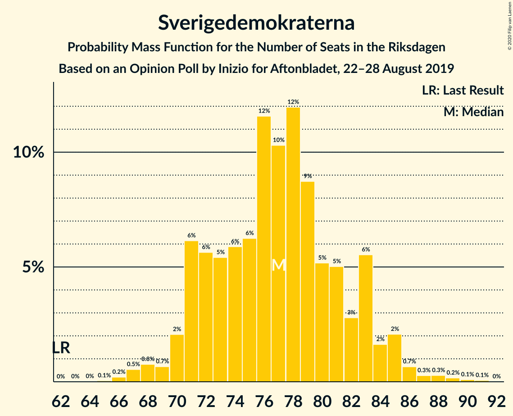
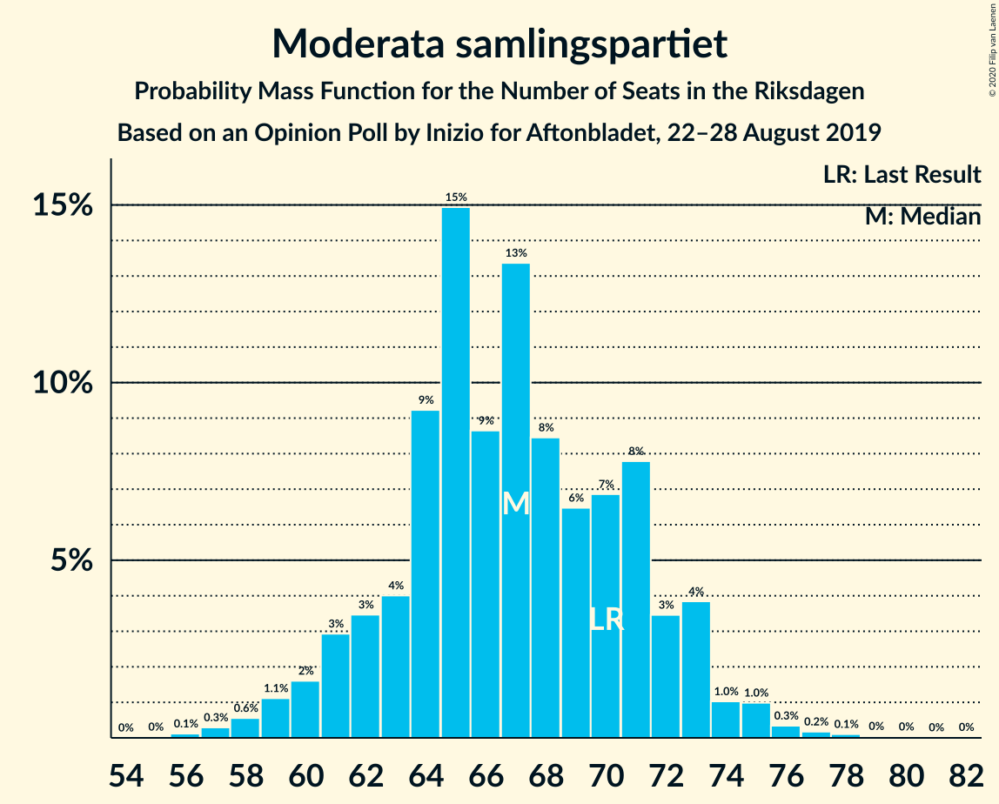
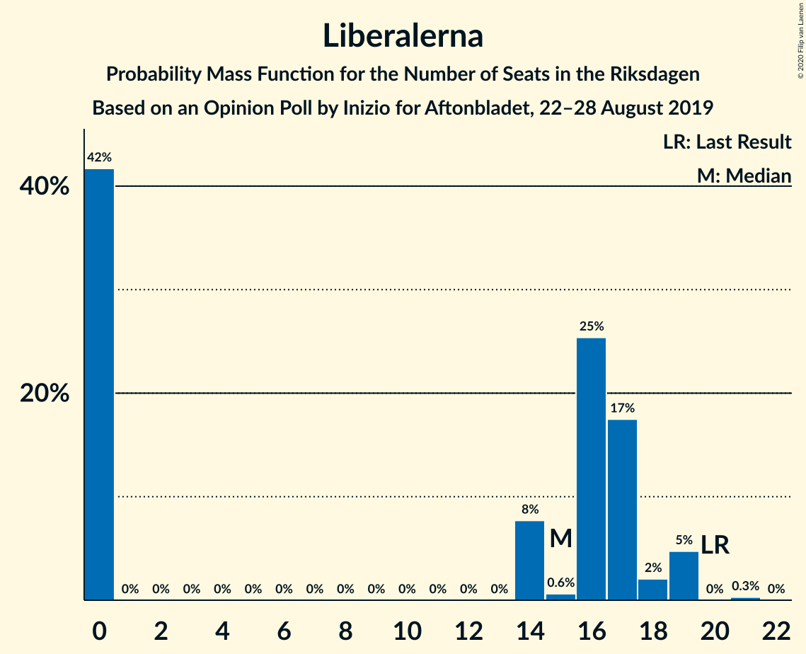
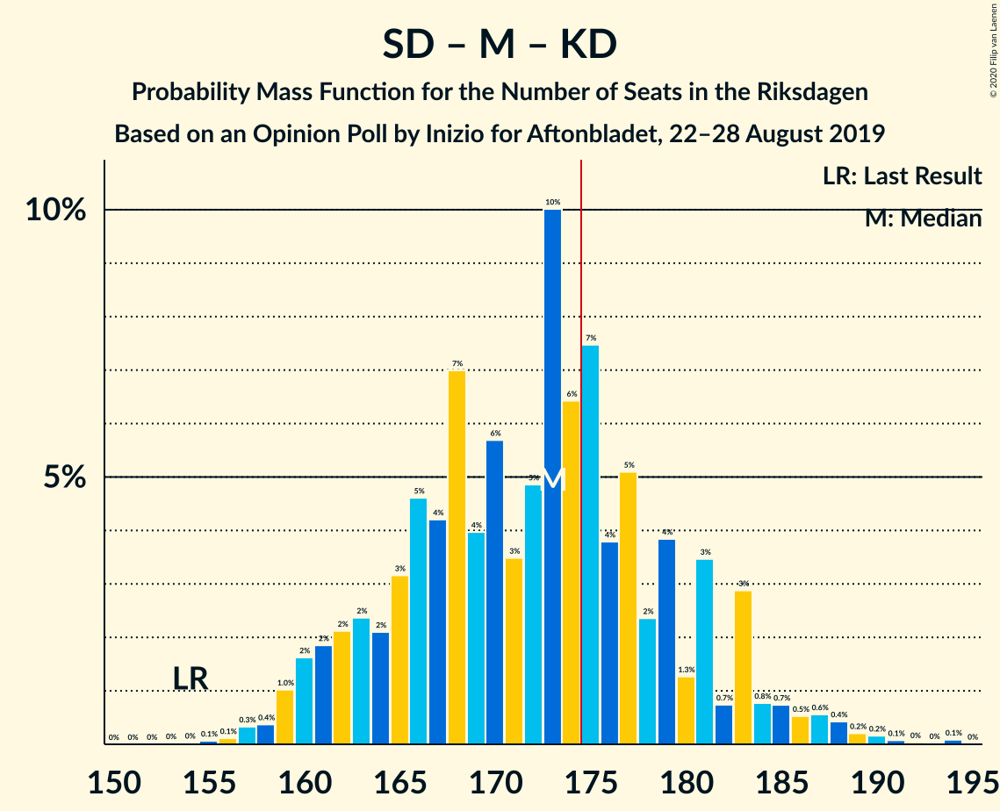

# Opinion Poll by Inizio for Aftonbladet, 22–28 August 2019

<a href="#voting-intentions">Voting Intentions</a> | <a href="#seats">Seats</a> | <a href="#coalitions">Coalitions</a> | <a href="#technical-information">Technical Information</a>

## Voting Intentions

### Confidence Intervals

| Party | Last Result | Poll Result | 80% Confidence Interval | 90% Confidence Interval | 95% Confidence Interval | 99% Confidence Interval |
|:-----:|:-----------:|:-----------:|:-----------------------:|:-----------------------:|:-----------------------:|:-----------------------:|
| Sveriges socialdemokratiska arbetareparti | 28.3% | 25.5% | 24.2–26.7% |23.9–27.1% |23.6–27.4% |23.0–28.0% |
| Sverigedemokraterna | 17.5% | 21.0% | 19.9–22.2% |19.5–22.5% |19.3–22.8% |18.7–23.4% |
| Moderata samlingspartiet | 19.8% | 18.3% | 17.2–19.4% |16.9–19.7% |16.6–20.0% |16.1–20.6% |
| Centerpartiet | 8.6% | 9.4% | 8.6–10.3% |8.4–10.5% |8.2–10.7% |7.8–11.2% |
| Vänsterpartiet | 8.0% | 7.9% | 7.2–8.7% |7.0–8.9% |6.8–9.2% |6.4–9.6% |
| Kristdemokraterna | 6.3% | 7.7% | 7.0–8.5% |6.8–8.7% |6.6–8.9% |6.3–9.4% |
| Liberalerna | 5.5% | 4.2% | 3.7–4.9% |3.5–5.0% |3.4–5.2% |3.2–5.5% |
| Miljöpartiet de gröna | 4.4% | 4.2% | 3.7–4.9% |3.5–5.0% |3.4–5.2% |3.2–5.5% |

*Note:* The poll result column reflects the actual value used in the calculations. Published results may vary slightly, and in addition be rounded to fewer digits.

## Seats

### Confidence Intervals

| Party | Last Result | Median | 80% Confidence Interval | 90% Confidence Interval | 95% Confidence Interval | 99% Confidence Interval |
|:-----:|:-----------:|:------:|:-----------------------:|:-----------------------:|:-----------------------:|:-----------------------:|
| <a href="#sveriges-socialdemokratiska-arbetareparti">Sveriges socialdemokratiska arbetareparti</a> | 100 | 92 | 87–99 |86–101 |85–104 |83–107 |
| <a href="#sverigedemokraterna">Sverigedemokraterna</a> | 62 | 77 | 71–83 |71–83 |70–85 |67–88 |
| <a href="#moderata-samlingspartiet">Moderata samlingspartiet</a> | 70 | 67 | 62–72 |61–73 |59–74 |58–76 |
| <a href="#centerpartiet">Centerpartiet</a> | 31 | 34 | 31–38 |30–39 |30–40 |28–42 |
| <a href="#vänsterpartiet">Vänsterpartiet</a> | 28 | 29 | 26–32 |26–34 |25–34 |23–36 |
| <a href="#kristdemokraterna">Kristdemokraterna</a> | 22 | 28 | 25–31 |25–32 |24–33 |23–34 |
| <a href="#liberalerna">Liberalerna</a> | 20 | 16 | 0–17 |0–19 |0–19 |0–19 |
| <a href="#miljöpartiet-de-gröna">Miljöpartiet de gröna</a> | 16 | 15 | 0–17 |0–18 |0–18 |0–20 |

### Sveriges socialdemokratiska arbetareparti

*For a full overview of the results for this party, see the [Sveriges socialdemokratiska arbetareparti](party-sverigessocialdemokratiskaarbetareparti.html) page.*

| Number of Seats | Probability | Accumulated | Special Marks |
|:---------------:|:-----------:|:-----------:|:-------------:|
| 80 | 0.1% | 100% |  |
| 81 | 0.1% | 99.9% |  |
| 82 | 0.2% | 99.8% |  |
| 83 | 0.4% | 99.6% |  |
| 84 | 2% | 99.2% |  |
| 85 | 2% | 98% |  |
| 86 | 3% | 95% |  |
| 87 | 2% | 92% |  |
| 88 | 3% | 90% |  |
| 89 | 13% | 87% |  |
| 90 | 5% | 74% |  |
| 91 | 9% | 68% |  |
| 92 | 11% | 60% | Median |
| 93 | 6% | 49% |  |
| 94 | 10% | 43% |  |
| 95 | 10% | 34% |  |
| 96 | 3% | 24% |  |
| 97 | 6% | 21% |  |
| 98 | 4% | 15% |  |
| 99 | 2% | 11% |  |
| 100 | 2% | 9% | Last Result |
| 101 | 2% | 7% |  |
| 102 | 0.6% | 5% |  |
| 103 | 0.6% | 4% |  |
| 104 | 3% | 4% |  |
| 105 | 0.2% | 0.9% |  |
| 106 | 0.2% | 0.7% |  |
| 107 | 0.4% | 0.6% |  |
| 108 | 0.1% | 0.1% |  |
| 109 | 0% | 0% |  |

### Sverigedemokraterna

*For a full overview of the results for this party, see the [Sverigedemokraterna](party-sverigedemokraterna.html) page.*

| Number of Seats | Probability | Accumulated | Special Marks |
|:---------------:|:-----------:|:-----------:|:-------------:|
| 62 | 0% | 100% | Last Result |
| 63 | 0% | 100% |  |
| 64 | 0% | 100% |  |
| 65 | 0% | 100% |  |
| 66 | 0.3% | 99.9% |  |
| 67 | 0.4% | 99.6% |  |
| 68 | 0.6% | 99.2% |  |
| 69 | 0.5% | 98.7% |  |
| 70 | 3% | 98% |  |
| 71 | 9% | 96% |  |
| 72 | 3% | 86% |  |
| 73 | 4% | 83% |  |
| 74 | 6% | 79% |  |
| 75 | 9% | 73% |  |
| 76 | 7% | 65% |  |
| 77 | 9% | 58% | Median |
| 78 | 18% | 48% |  |
| 79 | 4% | 30% |  |
| 80 | 7% | 27% |  |
| 81 | 6% | 20% |  |
| 82 | 4% | 15% |  |
| 83 | 6% | 11% |  |
| 84 | 2% | 5% |  |
| 85 | 1.4% | 3% |  |
| 86 | 0.8% | 2% |  |
| 87 | 0.2% | 0.8% |  |
| 88 | 0.3% | 0.6% |  |
| 89 | 0.2% | 0.3% |  |
| 90 | 0% | 0.1% |  |
| 91 | 0% | 0.1% |  |
| 92 | 0% | 0% |  |

### Moderata samlingspartiet

*For a full overview of the results for this party, see the [Moderata samlingspartiet](party-moderatasamlingspartiet.html) page.*

| Number of Seats | Probability | Accumulated | Special Marks |
|:---------------:|:-----------:|:-----------:|:-------------:|
| 56 | 0.1% | 100% |  |
| 57 | 0.3% | 99.9% |  |
| 58 | 0.6% | 99.5% |  |
| 59 | 1.5% | 99.0% |  |
| 60 | 1.3% | 97% |  |
| 61 | 2% | 96% |  |
| 62 | 4% | 94% |  |
| 63 | 5% | 90% |  |
| 64 | 7% | 84% |  |
| 65 | 10% | 78% |  |
| 66 | 10% | 68% |  |
| 67 | 18% | 57% | Median |
| 68 | 11% | 39% |  |
| 69 | 6% | 28% |  |
| 70 | 5% | 23% | Last Result |
| 71 | 6% | 17% |  |
| 72 | 5% | 11% |  |
| 73 | 3% | 6% |  |
| 74 | 1.1% | 3% |  |
| 75 | 1.0% | 2% |  |
| 76 | 0.2% | 0.7% |  |
| 77 | 0.3% | 0.4% |  |
| 78 | 0.1% | 0.2% |  |
| 79 | 0% | 0.1% |  |
| 80 | 0% | 0.1% |  |
| 81 | 0% | 0% |  |

### Centerpartiet

*For a full overview of the results for this party, see the [Centerpartiet](party-centerpartiet.html) page.*

| Number of Seats | Probability | Accumulated | Special Marks |
|:---------------:|:-----------:|:-----------:|:-------------:|
| 27 | 0.1% | 100% |  |
| 28 | 0.4% | 99.8% |  |
| 29 | 2% | 99.4% |  |
| 30 | 4% | 98% |  |
| 31 | 7% | 94% | Last Result |
| 32 | 11% | 87% |  |
| 33 | 17% | 77% |  |
| 34 | 12% | 60% | Median |
| 35 | 16% | 48% |  |
| 36 | 12% | 32% |  |
| 37 | 5% | 19% |  |
| 38 | 8% | 15% |  |
| 39 | 4% | 7% |  |
| 40 | 1.4% | 3% |  |
| 41 | 0.7% | 1.3% |  |
| 42 | 0.4% | 0.5% |  |
| 43 | 0.1% | 0.2% |  |
| 44 | 0.1% | 0.1% |  |
| 45 | 0% | 0% |  |

### Vänsterpartiet

*For a full overview of the results for this party, see the [Vänsterpartiet](party-vänsterpartiet.html) page.*

| Number of Seats | Probability | Accumulated | Special Marks |
|:---------------:|:-----------:|:-----------:|:-------------:|
| 22 | 0.1% | 100% |  |
| 23 | 0.4% | 99.9% |  |
| 24 | 1.4% | 99.5% |  |
| 25 | 3% | 98% |  |
| 26 | 9% | 95% |  |
| 27 | 11% | 87% |  |
| 28 | 19% | 75% | Last Result |
| 29 | 16% | 56% | Median |
| 30 | 14% | 40% |  |
| 31 | 14% | 26% |  |
| 32 | 5% | 12% |  |
| 33 | 2% | 7% |  |
| 34 | 4% | 5% |  |
| 35 | 0.6% | 1.4% |  |
| 36 | 0.8% | 0.9% |  |
| 37 | 0.1% | 0.1% |  |
| 38 | 0% | 0% |  |

### Kristdemokraterna

*For a full overview of the results for this party, see the [Kristdemokraterna](party-kristdemokraterna.html) page.*

| Number of Seats | Probability | Accumulated | Special Marks |
|:---------------:|:-----------:|:-----------:|:-------------:|
| 22 | 0.3% | 100% | Last Result |
| 23 | 1.0% | 99.6% |  |
| 24 | 3% | 98.6% |  |
| 25 | 8% | 96% |  |
| 26 | 7% | 87% |  |
| 27 | 17% | 81% |  |
| 28 | 16% | 63% | Median |
| 29 | 19% | 47% |  |
| 30 | 14% | 28% |  |
| 31 | 6% | 14% |  |
| 32 | 4% | 9% |  |
| 33 | 3% | 4% |  |
| 34 | 1.2% | 2% |  |
| 35 | 0.3% | 0.5% |  |
| 36 | 0.1% | 0.2% |  |
| 37 | 0% | 0.1% |  |
| 38 | 0% | 0% |  |

### Liberalerna

*For a full overview of the results for this party, see the [Liberalerna](party-liberalerna.html) page.*

| Number of Seats | Probability | Accumulated | Special Marks |
|:---------------:|:-----------:|:-----------:|:-------------:|
| 0 | 39% | 100% |  |
| 1 | 0% | 61% |  |
| 2 | 0% | 61% |  |
| 3 | 0% | 61% |  |
| 4 | 0% | 61% |  |
| 5 | 0% | 61% |  |
| 6 | 0% | 61% |  |
| 7 | 0% | 61% |  |
| 8 | 0% | 61% |  |
| 9 | 0% | 61% |  |
| 10 | 0% | 61% |  |
| 11 | 0% | 61% |  |
| 12 | 0% | 61% |  |
| 13 | 0% | 61% |  |
| 14 | 8% | 61% |  |
| 15 | 0.6% | 53% |  |
| 16 | 26% | 52% | Median |
| 17 | 19% | 26% |  |
| 18 | 1.5% | 7% |  |
| 19 | 6% | 6% |  |
| 20 | 0% | 0.3% | Last Result |
| 21 | 0.3% | 0.3% |  |
| 22 | 0% | 0% |  |

### Miljöpartiet de gröna

*For a full overview of the results for this party, see the [Miljöpartiet de gröna](party-miljöpartietdegröna.html) page.*

| Number of Seats | Probability | Accumulated | Special Marks |
|:---------------:|:-----------:|:-----------:|:-------------:|
| 0 | 35% | 100% |  |
| 1 | 0% | 65% |  |
| 2 | 0% | 65% |  |
| 3 | 0% | 65% |  |
| 4 | 0% | 65% |  |
| 5 | 0% | 65% |  |
| 6 | 0% | 65% |  |
| 7 | 0% | 65% |  |
| 8 | 0% | 65% |  |
| 9 | 0% | 65% |  |
| 10 | 0% | 65% |  |
| 11 | 0% | 65% |  |
| 12 | 0% | 65% |  |
| 13 | 0% | 65% |  |
| 14 | 2% | 65% |  |
| 15 | 26% | 63% | Median |
| 16 | 13% | 37% | Last Result |
| 17 | 15% | 24% |  |
| 18 | 7% | 9% |  |
| 19 | 2% | 2% |  |
| 20 | 0.4% | 0.5% |  |
| 21 | 0.1% | 0.1% |  |
| 22 | 0% | 0% |  |

## Coalitions

### Confidence Intervals

| Coalition | Last Result | Median | Majority? | 80% Confidence Interval | 90% Confidence Interval | 95% Confidence Interval | 99% Confidence Interval |
|:---------:|:-----------:|:------:|:---------:|:-----------------------:|:-----------------------:|:-----------------------:|:-----------------------:|
| Sveriges socialdemokratiska arbetareparti – Moderata samlingspartiet – Centerpartiet | 201 | 195 | 100% | 186–204 | 183–210 | 181–210 | 179–214 |
| Sveriges socialdemokratiska arbetareparti – Centerpartiet – Vänsterpartiet – Liberalerna – Miljöpartiet de gröna | 195 | 176 | 68% | 168–185 | 166–188 | 163–189 | 161–191 |
| Sverigedemokraterna – Moderata samlingspartiet – Kristdemokraterna | 154 | 173 | 32% | 164–181 | 161–183 | 160–186 | 158–188 |
| Sveriges socialdemokratiska arbetareparti – Moderata samlingspartiet | 170 | 159 | 3% | 152–169 | 150–172 | 148–175 | 146–177 |
| Sveriges socialdemokratiska arbetareparti – Centerpartiet – Liberalerna – Miljöpartiet de gröna | 167 | 147 | 0% | 139–156 | 136–161 | 132–162 | 130–163 |
| Sverigedemokraterna – Moderata samlingspartiet | 132 | 144 | 0% | 136–151 | 134–154 | 133–156 | 130–160 |
| Moderata samlingspartiet – Centerpartiet – Kristdemokraterna – Liberalerna | 143 | 140 | 0% | 130–149 | 129–151 | 126–152 | 123–155 |
| Sveriges socialdemokratiska arbetareparti – Vänsterpartiet – Miljöpartiet de gröna | 144 | 133 | 0% | 121–141 | 120–143 | 120–145 | 116–147 |
| Moderata samlingspartiet – Centerpartiet – Kristdemokraterna | 123 | 129 | 0% | 123–136 | 121–138 | 119–141 | 117–143 |
| Sveriges socialdemokratiska arbetareparti – Vänsterpartiet | 128 | 121 | 0% | 116–129 | 114–132 | 112–133 | 110–138 |
| Moderata samlingspartiet – Centerpartiet – Liberalerna | 121 | 112 | 0% | 101–120 | 100–122 | 99–123 | 97–126 |
| Sveriges socialdemokratiska arbetareparti – Miljöpartiet de gröna | 116 | 104 | 0% | 93–112 | 91–114 | 90–115 | 88–118 |
| Moderata samlingspartiet – Centerpartiet | 101 | 101 | 0% | 96–107 | 94–109 | 92–111 | 90–113 |

### Sveriges socialdemokratiska arbetareparti – Moderata samlingspartiet – Centerpartiet

| Number of Seats | Probability | Accumulated | Special Marks |
|:---------------:|:-----------:|:-----------:|:-------------:|
| 176 | 0% | 100% |  |
| 177 | 0.2% | 99.9% |  |
| 178 | 0.2% | 99.7% |  |
| 179 | 0.1% | 99.6% |  |
| 180 | 0.3% | 99.4% |  |
| 181 | 2% | 99.2% |  |
| 182 | 2% | 97% |  |
| 183 | 2% | 95% |  |
| 184 | 0.9% | 94% |  |
| 185 | 2% | 93% |  |
| 186 | 1.2% | 90% |  |
| 187 | 9% | 89% |  |
| 188 | 5% | 80% |  |
| 189 | 2% | 75% |  |
| 190 | 7% | 73% |  |
| 191 | 3% | 66% |  |
| 192 | 3% | 63% |  |
| 193 | 4% | 60% | Median |
| 194 | 4% | 56% |  |
| 195 | 5% | 51% |  |
| 196 | 20% | 46% |  |
| 197 | 2% | 27% |  |
| 198 | 0.9% | 25% |  |
| 199 | 3% | 24% |  |
| 200 | 2% | 21% |  |
| 201 | 4% | 19% | Last Result |
| 202 | 3% | 15% |  |
| 203 | 3% | 13% |  |
| 204 | 2% | 10% |  |
| 205 | 1.1% | 8% |  |
| 206 | 0.1% | 7% |  |
| 207 | 0.2% | 7% |  |
| 208 | 0.4% | 6% |  |
| 209 | 0.4% | 6% |  |
| 210 | 5% | 6% |  |
| 211 | 0.1% | 1.0% |  |
| 212 | 0.1% | 0.8% |  |
| 213 | 0.1% | 0.7% |  |
| 214 | 0.1% | 0.6% |  |
| 215 | 0.3% | 0.5% |  |
| 216 | 0.1% | 0.1% |  |
| 217 | 0% | 0.1% |  |
| 218 | 0% | 0% |  |

### Sveriges socialdemokratiska arbetareparti – Centerpartiet – Vänsterpartiet – Liberalerna – Miljöpartiet de gröna

| Number of Seats | Probability | Accumulated | Special Marks |
|:---------------:|:-----------:|:-----------:|:-------------:|
| 156 | 0% | 100% |  |
| 157 | 0% | 99.9% |  |
| 158 | 0.1% | 99.9% |  |
| 159 | 0.2% | 99.8% |  |
| 160 | 0.1% | 99.7% |  |
| 161 | 0.8% | 99.6% |  |
| 162 | 0.8% | 98.8% |  |
| 163 | 0.6% | 98% |  |
| 164 | 0.5% | 97% |  |
| 165 | 0.9% | 97% |  |
| 166 | 3% | 96% |  |
| 167 | 0.5% | 93% |  |
| 168 | 5% | 93% |  |
| 169 | 1.3% | 88% |  |
| 170 | 4% | 86% |  |
| 171 | 3% | 82% |  |
| 172 | 4% | 80% |  |
| 173 | 3% | 75% |  |
| 174 | 5% | 72% |  |
| 175 | 10% | 68% | Majority |
| 176 | 7% | 57% |  |
| 177 | 7% | 50% |  |
| 178 | 4% | 43% |  |
| 179 | 3% | 39% |  |
| 180 | 2% | 36% |  |
| 181 | 10% | 33% |  |
| 182 | 4% | 23% |  |
| 183 | 6% | 20% |  |
| 184 | 3% | 14% |  |
| 185 | 3% | 11% |  |
| 186 | 1.3% | 8% | Median |
| 187 | 2% | 7% |  |
| 188 | 1.3% | 5% |  |
| 189 | 2% | 4% |  |
| 190 | 1.2% | 2% |  |
| 191 | 0.5% | 0.9% |  |
| 192 | 0.2% | 0.5% |  |
| 193 | 0.2% | 0.3% |  |
| 194 | 0.1% | 0.1% |  |
| 195 | 0% | 0% | Last Result |

### Sverigedemokraterna – Moderata samlingspartiet – Kristdemokraterna

| Number of Seats | Probability | Accumulated | Special Marks |
|:---------------:|:-----------:|:-----------:|:-------------:|
| 154 | 0% | 100% | Last Result |
| 155 | 0.1% | 100% |  |
| 156 | 0.2% | 99.9% |  |
| 157 | 0.2% | 99.7% |  |
| 158 | 0.5% | 99.5% |  |
| 159 | 1.2% | 99.1% |  |
| 160 | 2% | 98% |  |
| 161 | 1.3% | 96% |  |
| 162 | 2% | 95% |  |
| 163 | 1.3% | 93% |  |
| 164 | 3% | 92% |  |
| 165 | 3% | 89% |  |
| 166 | 6% | 86% |  |
| 167 | 4% | 80% |  |
| 168 | 10% | 77% |  |
| 169 | 2% | 67% |  |
| 170 | 3% | 64% |  |
| 171 | 4% | 61% |  |
| 172 | 7% | 57% | Median |
| 173 | 7% | 50% |  |
| 174 | 10% | 43% |  |
| 175 | 5% | 32% | Majority |
| 176 | 3% | 28% |  |
| 177 | 4% | 25% |  |
| 178 | 3% | 20% |  |
| 179 | 4% | 18% |  |
| 180 | 1.3% | 14% |  |
| 181 | 5% | 12% |  |
| 182 | 0.5% | 7% |  |
| 183 | 3% | 7% |  |
| 184 | 0.9% | 4% |  |
| 185 | 0.5% | 3% |  |
| 186 | 0.6% | 3% |  |
| 187 | 0.8% | 2% |  |
| 188 | 0.8% | 1.2% |  |
| 189 | 0.1% | 0.4% |  |
| 190 | 0.2% | 0.3% |  |
| 191 | 0.1% | 0.2% |  |
| 192 | 0% | 0.1% |  |
| 193 | 0% | 0.1% |  |
| 194 | 0% | 0% |  |

### Sveriges socialdemokratiska arbetareparti – Moderata samlingspartiet

| Number of Seats | Probability | Accumulated | Special Marks |
|:---------------:|:-----------:|:-----------:|:-------------:|
| 143 | 0.1% | 100% |  |
| 144 | 0.1% | 99.9% |  |
| 145 | 0.2% | 99.8% |  |
| 146 | 0.3% | 99.6% |  |
| 147 | 0.4% | 99.3% |  |
| 148 | 2% | 99.0% |  |
| 149 | 0.8% | 97% |  |
| 150 | 1.2% | 96% |  |
| 151 | 1.0% | 95% |  |
| 152 | 4% | 94% |  |
| 153 | 2% | 89% |  |
| 154 | 8% | 87% |  |
| 155 | 4% | 79% |  |
| 156 | 6% | 75% |  |
| 157 | 4% | 69% |  |
| 158 | 13% | 64% |  |
| 159 | 6% | 52% | Median |
| 160 | 3% | 46% |  |
| 161 | 9% | 43% |  |
| 162 | 6% | 34% |  |
| 163 | 3% | 27% |  |
| 164 | 2% | 24% |  |
| 165 | 4% | 22% |  |
| 166 | 2% | 18% |  |
| 167 | 4% | 17% |  |
| 168 | 2% | 13% |  |
| 169 | 2% | 11% |  |
| 170 | 2% | 8% | Last Result |
| 171 | 0.8% | 6% |  |
| 172 | 0.9% | 6% |  |
| 173 | 0.7% | 5% |  |
| 174 | 0.6% | 4% |  |
| 175 | 3% | 3% | Majority |
| 176 | 0.1% | 0.7% |  |
| 177 | 0.3% | 0.6% |  |
| 178 | 0.1% | 0.3% |  |
| 179 | 0.1% | 0.1% |  |
| 180 | 0% | 0.1% |  |
| 181 | 0% | 0% |  |

### Sveriges socialdemokratiska arbetareparti – Centerpartiet – Liberalerna – Miljöpartiet de gröna

| Number of Seats | Probability | Accumulated | Special Marks |
|:---------------:|:-----------:|:-----------:|:-------------:|
| 127 | 0% | 100% |  |
| 128 | 0% | 99.9% |  |
| 129 | 0.1% | 99.9% |  |
| 130 | 1.2% | 99.8% |  |
| 131 | 0.8% | 98.6% |  |
| 132 | 0.7% | 98% |  |
| 133 | 0.3% | 97% |  |
| 134 | 0% | 97% |  |
| 135 | 0.3% | 97% |  |
| 136 | 2% | 96% |  |
| 137 | 0.8% | 94% |  |
| 138 | 3% | 93% |  |
| 139 | 6% | 90% |  |
| 140 | 3% | 84% |  |
| 141 | 2% | 81% |  |
| 142 | 0.3% | 79% |  |
| 143 | 0.4% | 78% |  |
| 144 | 5% | 78% |  |
| 145 | 7% | 73% |  |
| 146 | 11% | 66% |  |
| 147 | 10% | 54% |  |
| 148 | 6% | 45% |  |
| 149 | 1.4% | 39% |  |
| 150 | 0.9% | 38% |  |
| 151 | 0.7% | 37% |  |
| 152 | 1.4% | 36% |  |
| 153 | 10% | 35% |  |
| 154 | 6% | 24% |  |
| 155 | 8% | 18% |  |
| 156 | 2% | 10% |  |
| 157 | 1.3% | 8% | Median |
| 158 | 0.1% | 7% |  |
| 159 | 0.3% | 7% |  |
| 160 | 0.7% | 6% |  |
| 161 | 1.4% | 6% |  |
| 162 | 3% | 4% |  |
| 163 | 1.0% | 1.2% |  |
| 164 | 0.1% | 0.2% |  |
| 165 | 0% | 0.1% |  |
| 166 | 0% | 0.1% |  |
| 167 | 0% | 0% | Last Result |

### Sverigedemokraterna – Moderata samlingspartiet

| Number of Seats | Probability | Accumulated | Special Marks |
|:---------------:|:-----------:|:-----------:|:-------------:|
| 127 | 0% | 100% |  |
| 128 | 0.1% | 99.9% |  |
| 129 | 0.2% | 99.9% |  |
| 130 | 0.2% | 99.6% |  |
| 131 | 0.6% | 99.4% |  |
| 132 | 0.5% | 98.8% | Last Result |
| 133 | 2% | 98% |  |
| 134 | 3% | 97% |  |
| 135 | 2% | 94% |  |
| 136 | 3% | 92% |  |
| 137 | 4% | 89% |  |
| 138 | 4% | 85% |  |
| 139 | 3% | 81% |  |
| 140 | 9% | 78% |  |
| 141 | 2% | 70% |  |
| 142 | 6% | 67% |  |
| 143 | 5% | 61% |  |
| 144 | 7% | 57% | Median |
| 145 | 11% | 49% |  |
| 146 | 8% | 38% |  |
| 147 | 6% | 30% |  |
| 148 | 4% | 25% |  |
| 149 | 4% | 20% |  |
| 150 | 4% | 16% |  |
| 151 | 4% | 13% |  |
| 152 | 1.2% | 9% |  |
| 153 | 2% | 7% |  |
| 154 | 2% | 6% |  |
| 155 | 0.7% | 3% |  |
| 156 | 0.7% | 3% |  |
| 157 | 0.9% | 2% |  |
| 158 | 0.4% | 1.0% |  |
| 159 | 0% | 0.6% |  |
| 160 | 0.2% | 0.6% |  |
| 161 | 0.3% | 0.4% |  |
| 162 | 0% | 0.1% |  |
| 163 | 0% | 0.1% |  |
| 164 | 0.1% | 0.1% |  |
| 165 | 0% | 0% |  |

### Moderata samlingspartiet – Centerpartiet – Kristdemokraterna – Liberalerna

| Number of Seats | Probability | Accumulated | Special Marks |
|:---------------:|:-----------:|:-----------:|:-------------:|
| 120 | 0% | 100% |  |
| 121 | 0.2% | 99.9% |  |
| 122 | 0.1% | 99.7% |  |
| 123 | 0.3% | 99.6% |  |
| 124 | 0.1% | 99.3% |  |
| 125 | 0.4% | 99.2% |  |
| 126 | 2% | 98.8% |  |
| 127 | 0.9% | 97% |  |
| 128 | 0.5% | 96% |  |
| 129 | 3% | 95% |  |
| 130 | 5% | 92% |  |
| 131 | 2% | 87% |  |
| 132 | 1.4% | 85% |  |
| 133 | 5% | 84% |  |
| 134 | 4% | 78% |  |
| 135 | 2% | 75% |  |
| 136 | 7% | 73% |  |
| 137 | 3% | 65% |  |
| 138 | 8% | 63% |  |
| 139 | 5% | 55% |  |
| 140 | 3% | 50% |  |
| 141 | 4% | 47% |  |
| 142 | 8% | 43% |  |
| 143 | 5% | 35% | Last Result |
| 144 | 3% | 30% |  |
| 145 | 4% | 27% | Median |
| 146 | 7% | 22% |  |
| 147 | 2% | 15% |  |
| 148 | 2% | 13% |  |
| 149 | 2% | 11% |  |
| 150 | 4% | 9% |  |
| 151 | 0.6% | 5% |  |
| 152 | 3% | 5% |  |
| 153 | 0.3% | 1.3% |  |
| 154 | 0.2% | 1.0% |  |
| 155 | 0.3% | 0.8% |  |
| 156 | 0.2% | 0.4% |  |
| 157 | 0.2% | 0.3% |  |
| 158 | 0% | 0.1% |  |
| 159 | 0% | 0% |  |

### Sveriges socialdemokratiska arbetareparti – Vänsterpartiet – Miljöpartiet de gröna

| Number of Seats | Probability | Accumulated | Special Marks |
|:---------------:|:-----------:|:-----------:|:-------------:|
| 114 | 0.2% | 100% |  |
| 115 | 0.2% | 99.8% |  |
| 116 | 0.9% | 99.7% |  |
| 117 | 0.4% | 98.8% |  |
| 118 | 0.2% | 98% |  |
| 119 | 0.5% | 98% |  |
| 120 | 4% | 98% |  |
| 121 | 4% | 94% |  |
| 122 | 0.6% | 90% |  |
| 123 | 2% | 89% |  |
| 124 | 2% | 87% |  |
| 125 | 6% | 85% |  |
| 126 | 2% | 80% |  |
| 127 | 3% | 77% |  |
| 128 | 3% | 75% |  |
| 129 | 4% | 72% |  |
| 130 | 3% | 69% |  |
| 131 | 3% | 65% |  |
| 132 | 10% | 62% |  |
| 133 | 5% | 53% |  |
| 134 | 4% | 47% |  |
| 135 | 7% | 43% |  |
| 136 | 3% | 36% | Median |
| 137 | 9% | 32% |  |
| 138 | 3% | 24% |  |
| 139 | 5% | 21% |  |
| 140 | 4% | 16% |  |
| 141 | 5% | 12% |  |
| 142 | 2% | 7% |  |
| 143 | 1.4% | 5% |  |
| 144 | 1.1% | 4% | Last Result |
| 145 | 2% | 3% |  |
| 146 | 0.3% | 1.2% |  |
| 147 | 0.6% | 0.9% |  |
| 148 | 0.1% | 0.4% |  |
| 149 | 0.1% | 0.3% |  |
| 150 | 0.1% | 0.2% |  |
| 151 | 0% | 0.1% |  |
| 152 | 0% | 0% |  |

### Moderata samlingspartiet – Centerpartiet – Kristdemokraterna

| Number of Seats | Probability | Accumulated | Special Marks |
|:---------------:|:-----------:|:-----------:|:-------------:|
| 114 | 0% | 100% |  |
| 115 | 0.1% | 99.9% |  |
| 116 | 0.2% | 99.8% |  |
| 117 | 0.7% | 99.6% |  |
| 118 | 0.9% | 99.0% |  |
| 119 | 0.8% | 98% |  |
| 120 | 1.3% | 97% |  |
| 121 | 3% | 96% |  |
| 122 | 0.9% | 93% |  |
| 123 | 3% | 93% | Last Result |
| 124 | 6% | 89% |  |
| 125 | 6% | 84% |  |
| 126 | 9% | 78% |  |
| 127 | 6% | 69% |  |
| 128 | 5% | 63% |  |
| 129 | 9% | 58% | Median |
| 130 | 8% | 49% |  |
| 131 | 7% | 41% |  |
| 132 | 3% | 34% |  |
| 133 | 7% | 31% |  |
| 134 | 4% | 24% |  |
| 135 | 4% | 21% |  |
| 136 | 7% | 17% |  |
| 137 | 2% | 10% |  |
| 138 | 4% | 8% |  |
| 139 | 0.7% | 4% |  |
| 140 | 0.5% | 3% |  |
| 141 | 1.2% | 3% |  |
| 142 | 0.1% | 1.5% |  |
| 143 | 0.8% | 1.3% |  |
| 144 | 0.2% | 0.5% |  |
| 145 | 0.1% | 0.3% |  |
| 146 | 0.1% | 0.2% |  |
| 147 | 0.1% | 0.1% |  |
| 148 | 0% | 0% |  |

### Sveriges socialdemokratiska arbetareparti – Vänsterpartiet

| Number of Seats | Probability | Accumulated | Special Marks |
|:---------------:|:-----------:|:-----------:|:-------------:|
| 107 | 0.1% | 100% |  |
| 108 | 0.1% | 99.9% |  |
| 109 | 0.2% | 99.8% |  |
| 110 | 0.3% | 99.6% |  |
| 111 | 1.4% | 99.2% |  |
| 112 | 1.4% | 98% |  |
| 113 | 1.2% | 96% |  |
| 114 | 2% | 95% |  |
| 115 | 3% | 93% |  |
| 116 | 3% | 90% |  |
| 117 | 11% | 87% |  |
| 118 | 4% | 77% |  |
| 119 | 5% | 72% |  |
| 120 | 11% | 67% |  |
| 121 | 7% | 56% | Median |
| 122 | 5% | 49% |  |
| 123 | 6% | 44% |  |
| 124 | 6% | 38% |  |
| 125 | 8% | 32% |  |
| 126 | 7% | 24% |  |
| 127 | 3% | 17% |  |
| 128 | 2% | 14% | Last Result |
| 129 | 3% | 12% |  |
| 130 | 1.2% | 9% |  |
| 131 | 2% | 8% |  |
| 132 | 1.0% | 6% |  |
| 133 | 3% | 5% |  |
| 134 | 0.4% | 2% |  |
| 135 | 0.1% | 1.4% |  |
| 136 | 0.6% | 1.3% |  |
| 137 | 0.1% | 0.7% |  |
| 138 | 0.4% | 0.6% |  |
| 139 | 0.1% | 0.2% |  |
| 140 | 0% | 0% |  |

### Moderata samlingspartiet – Centerpartiet – Liberalerna

| Number of Seats | Probability | Accumulated | Special Marks |
|:---------------:|:-----------:|:-----------:|:-------------:|
| 92 | 0% | 100% |  |
| 93 | 0% | 99.9% |  |
| 94 | 0.1% | 99.9% |  |
| 95 | 0.2% | 99.8% |  |
| 96 | 0.1% | 99.6% |  |
| 97 | 2% | 99.5% |  |
| 98 | 0.5% | 98% |  |
| 99 | 1.1% | 98% |  |
| 100 | 2% | 96% |  |
| 101 | 6% | 94% |  |
| 102 | 2% | 89% |  |
| 103 | 4% | 87% |  |
| 104 | 4% | 82% |  |
| 105 | 2% | 78% |  |
| 106 | 8% | 76% |  |
| 107 | 3% | 68% |  |
| 108 | 3% | 65% |  |
| 109 | 3% | 63% |  |
| 110 | 3% | 59% |  |
| 111 | 4% | 57% |  |
| 112 | 4% | 53% |  |
| 113 | 4% | 49% |  |
| 114 | 11% | 45% |  |
| 115 | 3% | 34% |  |
| 116 | 5% | 31% |  |
| 117 | 5% | 26% | Median |
| 118 | 2% | 22% |  |
| 119 | 7% | 20% |  |
| 120 | 3% | 12% |  |
| 121 | 2% | 10% | Last Result |
| 122 | 4% | 8% |  |
| 123 | 2% | 4% |  |
| 124 | 0.7% | 2% |  |
| 125 | 0.4% | 1.2% |  |
| 126 | 0.3% | 0.7% |  |
| 127 | 0.2% | 0.4% |  |
| 128 | 0.1% | 0.2% |  |
| 129 | 0% | 0.1% |  |
| 130 | 0% | 0.1% |  |
| 131 | 0% | 0% |  |

### Sveriges socialdemokratiska arbetareparti – Miljöpartiet de gröna

| Number of Seats | Probability | Accumulated | Special Marks |
|:---------------:|:-----------:|:-----------:|:-------------:|
| 85 | 0% | 100% |  |
| 86 | 0.1% | 99.9% |  |
| 87 | 0.1% | 99.8% |  |
| 88 | 1.1% | 99.7% |  |
| 89 | 1.0% | 98.6% |  |
| 90 | 0.3% | 98% |  |
| 91 | 5% | 97% |  |
| 92 | 2% | 92% |  |
| 93 | 0.8% | 90% |  |
| 94 | 7% | 89% |  |
| 95 | 1.4% | 83% |  |
| 96 | 1.3% | 81% |  |
| 97 | 4% | 80% |  |
| 98 | 2% | 76% |  |
| 99 | 3% | 74% |  |
| 100 | 2% | 71% |  |
| 101 | 5% | 69% |  |
| 102 | 1.5% | 65% |  |
| 103 | 2% | 63% |  |
| 104 | 13% | 61% |  |
| 105 | 4% | 48% |  |
| 106 | 2% | 44% |  |
| 107 | 13% | 42% | Median |
| 108 | 4% | 29% |  |
| 109 | 3% | 26% |  |
| 110 | 8% | 23% |  |
| 111 | 4% | 15% |  |
| 112 | 4% | 10% |  |
| 113 | 1.3% | 7% |  |
| 114 | 3% | 5% |  |
| 115 | 0.9% | 3% |  |
| 116 | 0.6% | 2% | Last Result |
| 117 | 0.5% | 1.0% |  |
| 118 | 0.2% | 0.6% |  |
| 119 | 0.3% | 0.4% |  |
| 120 | 0% | 0.1% |  |
| 121 | 0% | 0.1% |  |
| 122 | 0% | 0% |  |

### Moderata samlingspartiet – Centerpartiet

| Number of Seats | Probability | Accumulated | Special Marks |
|:---------------:|:-----------:|:-----------:|:-------------:|
| 87 | 0.1% | 100% |  |
| 88 | 0.2% | 99.9% |  |
| 89 | 0.2% | 99.8% |  |
| 90 | 0.3% | 99.6% |  |
| 91 | 1.3% | 99.3% |  |
| 92 | 1.1% | 98% |  |
| 93 | 1.3% | 97% |  |
| 94 | 2% | 96% |  |
| 95 | 3% | 94% |  |
| 96 | 3% | 91% |  |
| 97 | 5% | 87% |  |
| 98 | 13% | 83% |  |
| 99 | 7% | 70% |  |
| 100 | 4% | 63% |  |
| 101 | 10% | 59% | Last Result, Median |
| 102 | 9% | 49% |  |
| 103 | 7% | 40% |  |
| 104 | 9% | 32% |  |
| 105 | 6% | 24% |  |
| 106 | 7% | 18% |  |
| 107 | 3% | 11% |  |
| 108 | 2% | 8% |  |
| 109 | 2% | 6% |  |
| 110 | 0.7% | 4% |  |
| 111 | 1.1% | 3% |  |
| 112 | 1.0% | 2% |  |
| 113 | 0.2% | 0.7% |  |
| 114 | 0.2% | 0.5% |  |
| 115 | 0.1% | 0.3% |  |
| 116 | 0% | 0.1% |  |
| 117 | 0% | 0.1% |  |
| 118 | 0% | 0.1% |  |
| 119 | 0% | 0% |  |

## Technical Information

### Opinion Poll

+ **Polling firm:** Inizio
+ **Commissioner(s):** Aftonbladet
+ **Fieldwork period:** 22–28 August 2019

### Calculations

+ **Sample size:** 2015
+ **Simulations done:** 524,288
+ **Error estimate:** 2.15%

