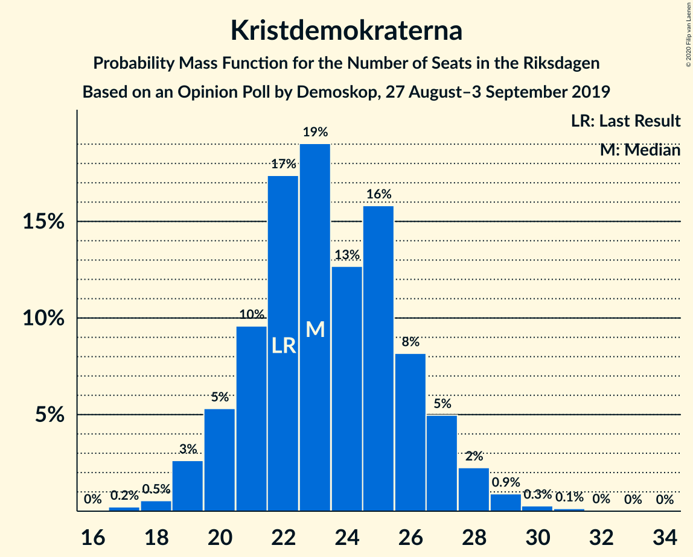
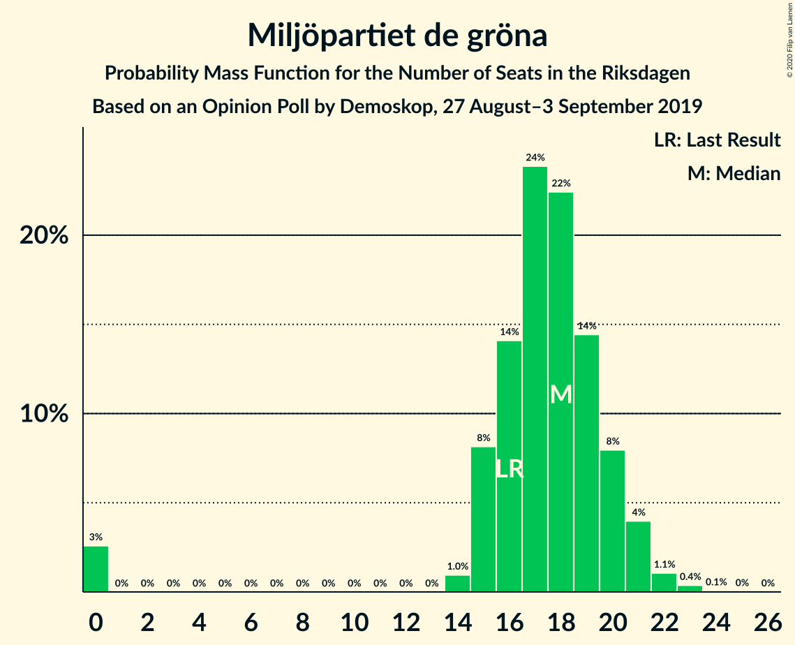

# Opinion Poll by Demoskop, 27 August–3 September 2019

<a href="#voting-intentions">Voting Intentions</a> | <a href="#seats">Seats</a> | <a href="#coalitions">Coalitions</a> | <a href="#technical-information">Technical Information</a>

## Voting Intentions

### Confidence Intervals

| Party | Last Result | Poll Result | 80% Confidence Interval | 90% Confidence Interval | 95% Confidence Interval | 99% Confidence Interval |
|:-----:|:-----------:|:-----------:|:-----------------------:|:-----------------------:|:-----------------------:|:-----------------------:|
| Sveriges socialdemokratiska arbetareparti | 28.3% | 24.0% | 22.7–25.4% |22.3–25.8% |22.0–26.2% |21.4–26.9% |
| Sverigedemokraterna | 17.5% | 21.4% | 20.1–22.8% |19.8–23.2% |19.5–23.5% |18.9–24.2% |
| Moderata samlingspartiet | 19.8% | 19.4% | 18.2–20.7% |17.9–21.1% |17.6–21.4% |17.0–22.1% |
| Centerpartiet | 8.6% | 8.4% | 7.5–9.3% |7.3–9.6% |7.1–9.8% |6.7–10.3% |
| Vänsterpartiet | 8.0% | 8.4% | 7.5–9.3% |7.3–9.6% |7.1–9.8% |6.7–10.3% |
| Kristdemokraterna | 6.3% | 6.5% | 5.8–7.4% |5.6–7.6% |5.4–7.8% |5.1–8.3% |
| Miljöpartiet de gröna | 4.4% | 4.9% | 4.3–5.7% |4.1–5.9% |3.9–6.1% |3.7–6.5% |
| Liberalerna | 5.5% | 4.6% | 4.0–5.3% |3.8–5.5% |3.7–5.7% |3.4–6.1% |

*Note:* The poll result column reflects the actual value used in the calculations. Published results may vary slightly, and in addition be rounded to fewer digits.

## Seats

### Confidence Intervals

| Party | Last Result | Median | 80% Confidence Interval | 90% Confidence Interval | 95% Confidence Interval | 99% Confidence Interval |
|:-----:|:-----------:|:------:|:-----------------------:|:-----------------------:|:-----------------------:|:-----------------------:|
| <a href="#sveriges-socialdemokratiska-arbetareparti">Sveriges socialdemokratiska arbetareparti</a> | 100 | 85 | 81–91 |80–93 |79–94 |76–97 |
| <a href="#sverigedemokraterna">Sverigedemokraterna</a> | 62 | 77 | 72–82 |70–83 |70–85 |67–87 |
| <a href="#moderata-samlingspartiet">Moderata samlingspartiet</a> | 70 | 70 | 65–75 |64–76 |63–78 |60–80 |
| <a href="#centerpartiet">Centerpartiet</a> | 31 | 30 | 27–34 |26–35 |25–35 |24–37 |
| <a href="#vänsterpartiet">Vänsterpartiet</a> | 28 | 30 | 27–34 |26–35 |25–35 |24–37 |
| <a href="#kristdemokraterna">Kristdemokraterna</a> | 22 | 24 | 21–26 |20–27 |19–28 |18–30 |
| <a href="#miljöpartiet-de-gröna">Miljöpartiet de gröna</a> | 16 | 18 | 15–20 |15–21 |0–22 |0–23 |
| <a href="#liberalerna">Liberalerna</a> | 20 | 17 | 0–19 |0–20 |0–20 |0–22 |

### Sveriges socialdemokratiska arbetareparti

*For a full overview of the results for this party, see the [Sveriges socialdemokratiska arbetareparti](party-sverigessocialdemokratiskaarbetareparti.html) page.*

| Number of Seats | Probability | Accumulated | Special Marks |
|:---------------:|:-----------:|:-----------:|:-------------:|
| 74 | 0.1% | 100% |  |
| 75 | 0.1% | 99.9% |  |
| 76 | 0.5% | 99.7% |  |
| 77 | 0.5% | 99.2% |  |
| 78 | 1.1% | 98.7% |  |
| 79 | 2% | 98% |  |
| 80 | 3% | 96% |  |
| 81 | 9% | 93% |  |
| 82 | 5% | 84% |  |
| 83 | 7% | 79% |  |
| 84 | 10% | 72% |  |
| 85 | 14% | 62% | Median |
| 86 | 7% | 48% |  |
| 87 | 7% | 41% |  |
| 88 | 6% | 34% |  |
| 89 | 8% | 27% |  |
| 90 | 7% | 19% |  |
| 91 | 4% | 12% |  |
| 92 | 2% | 9% |  |
| 93 | 2% | 6% |  |
| 94 | 2% | 4% |  |
| 95 | 1.0% | 2% |  |
| 96 | 0.5% | 1.1% |  |
| 97 | 0.2% | 0.6% |  |
| 98 | 0.2% | 0.4% |  |
| 99 | 0.1% | 0.3% |  |
| 100 | 0.1% | 0.2% | Last Result |
| 101 | 0.1% | 0.1% |  |
| 102 | 0% | 0% |  |

### Sverigedemokraterna

*For a full overview of the results for this party, see the [Sverigedemokraterna](party-sverigedemokraterna.html) page.*

| Number of Seats | Probability | Accumulated | Special Marks |
|:---------------:|:-----------:|:-----------:|:-------------:|
| 62 | 0% | 100% | Last Result |
| 63 | 0% | 100% |  |
| 64 | 0% | 100% |  |
| 65 | 0.1% | 100% |  |
| 66 | 0.2% | 99.9% |  |
| 67 | 0.3% | 99.7% |  |
| 68 | 0.6% | 99.3% |  |
| 69 | 1.2% | 98.7% |  |
| 70 | 3% | 98% |  |
| 71 | 4% | 95% |  |
| 72 | 7% | 91% |  |
| 73 | 8% | 85% |  |
| 74 | 8% | 77% |  |
| 75 | 8% | 69% |  |
| 76 | 9% | 61% |  |
| 77 | 8% | 52% | Median |
| 78 | 11% | 44% |  |
| 79 | 7% | 33% |  |
| 80 | 8% | 26% |  |
| 81 | 5% | 17% |  |
| 82 | 4% | 12% |  |
| 83 | 3% | 8% |  |
| 84 | 2% | 4% |  |
| 85 | 1.4% | 3% |  |
| 86 | 0.7% | 1.5% |  |
| 87 | 0.3% | 0.7% |  |
| 88 | 0.1% | 0.5% |  |
| 89 | 0.2% | 0.3% |  |
| 90 | 0.1% | 0.1% |  |
| 91 | 0.1% | 0.1% |  |
| 92 | 0% | 0% |  |

### Moderata samlingspartiet

*For a full overview of the results for this party, see the [Moderata samlingspartiet](party-moderatasamlingspartiet.html) page.*

| Number of Seats | Probability | Accumulated | Special Marks |
|:---------------:|:-----------:|:-----------:|:-------------:|
| 58 | 0% | 100% |  |
| 59 | 0.1% | 99.9% |  |
| 60 | 0.4% | 99.8% |  |
| 61 | 0.4% | 99.4% |  |
| 62 | 1.4% | 99.1% |  |
| 63 | 2% | 98% |  |
| 64 | 2% | 95% |  |
| 65 | 8% | 94% |  |
| 66 | 3% | 86% |  |
| 67 | 11% | 83% |  |
| 68 | 15% | 72% |  |
| 69 | 4% | 57% |  |
| 70 | 14% | 53% | Last Result, Median |
| 71 | 5% | 39% |  |
| 72 | 12% | 34% |  |
| 73 | 8% | 23% |  |
| 74 | 2% | 15% |  |
| 75 | 5% | 13% |  |
| 76 | 3% | 8% |  |
| 77 | 2% | 5% |  |
| 78 | 2% | 3% |  |
| 79 | 0.2% | 1.4% |  |
| 80 | 0.7% | 1.2% |  |
| 81 | 0.2% | 0.5% |  |
| 82 | 0.1% | 0.2% |  |
| 83 | 0.1% | 0.1% |  |
| 84 | 0% | 0% |  |

### Centerpartiet

*For a full overview of the results for this party, see the [Centerpartiet](party-centerpartiet.html) page.*

| Number of Seats | Probability | Accumulated | Special Marks |
|:---------------:|:-----------:|:-----------:|:-------------:|
| 23 | 0.2% | 100% |  |
| 24 | 0.5% | 99.8% |  |
| 25 | 2% | 99.2% |  |
| 26 | 5% | 97% |  |
| 27 | 9% | 93% |  |
| 28 | 11% | 83% |  |
| 29 | 15% | 72% |  |
| 30 | 13% | 58% | Median |
| 31 | 13% | 44% | Last Result |
| 32 | 8% | 31% |  |
| 33 | 13% | 23% |  |
| 34 | 5% | 10% |  |
| 35 | 3% | 6% |  |
| 36 | 1.5% | 2% |  |
| 37 | 0.5% | 0.9% |  |
| 38 | 0.3% | 0.4% |  |
| 39 | 0.1% | 0.1% |  |
| 40 | 0% | 0% |  |

### Vänsterpartiet

*For a full overview of the results for this party, see the [Vänsterpartiet](party-vänsterpartiet.html) page.*

| Number of Seats | Probability | Accumulated | Special Marks |
|:---------------:|:-----------:|:-----------:|:-------------:|
| 23 | 0.2% | 100% |  |
| 24 | 0.7% | 99.8% |  |
| 25 | 2% | 99.0% |  |
| 26 | 3% | 97% |  |
| 27 | 7% | 94% |  |
| 28 | 10% | 86% | Last Result |
| 29 | 10% | 76% |  |
| 30 | 22% | 66% | Median |
| 31 | 12% | 44% |  |
| 32 | 8% | 32% |  |
| 33 | 12% | 24% |  |
| 34 | 6% | 12% |  |
| 35 | 3% | 5% |  |
| 36 | 1.2% | 2% |  |
| 37 | 0.7% | 1.0% |  |
| 38 | 0.2% | 0.4% |  |
| 39 | 0.1% | 0.1% |  |
| 40 | 0% | 0.1% |  |
| 41 | 0% | 0% |  |

### Kristdemokraterna

*For a full overview of the results for this party, see the [Kristdemokraterna](party-kristdemokraterna.html) page.*

| Number of Seats | Probability | Accumulated | Special Marks |
|:---------------:|:-----------:|:-----------:|:-------------:|
| 17 | 0.1% | 100% |  |
| 18 | 0.9% | 99.9% |  |
| 19 | 2% | 98.9% |  |
| 20 | 6% | 97% |  |
| 21 | 8% | 91% |  |
| 22 | 15% | 83% | Last Result |
| 23 | 17% | 68% |  |
| 24 | 18% | 51% | Median |
| 25 | 15% | 34% |  |
| 26 | 9% | 19% |  |
| 27 | 5% | 10% |  |
| 28 | 3% | 5% |  |
| 29 | 1.5% | 2% |  |
| 30 | 0.4% | 0.6% |  |
| 31 | 0.2% | 0.2% |  |
| 32 | 0% | 0.1% |  |
| 33 | 0% | 0% |  |

### Miljöpartiet de gröna

*For a full overview of the results for this party, see the [Miljöpartiet de gröna](party-miljöpartietdegröna.html) page.*

| Number of Seats | Probability | Accumulated | Special Marks |
|:---------------:|:-----------:|:-----------:|:-------------:|
| 0 | 3% | 100% |  |
| 1 | 0% | 97% |  |
| 2 | 0% | 97% |  |
| 3 | 0% | 97% |  |
| 4 | 0% | 97% |  |
| 5 | 0% | 97% |  |
| 6 | 0% | 97% |  |
| 7 | 0% | 97% |  |
| 8 | 0% | 97% |  |
| 9 | 0% | 97% |  |
| 10 | 0% | 97% |  |
| 11 | 0% | 97% |  |
| 12 | 0% | 97% |  |
| 13 | 0% | 97% |  |
| 14 | 0.9% | 97% |  |
| 15 | 9% | 96% |  |
| 16 | 14% | 87% | Last Result |
| 17 | 19% | 73% |  |
| 18 | 22% | 54% | Median |
| 19 | 14% | 32% |  |
| 20 | 8% | 18% |  |
| 21 | 6% | 10% |  |
| 22 | 3% | 4% |  |
| 23 | 0.6% | 0.9% |  |
| 24 | 0.2% | 0.3% |  |
| 25 | 0.1% | 0.1% |  |
| 26 | 0% | 0% |  |

### Liberalerna

*For a full overview of the results for this party, see the [Liberalerna](party-liberalerna.html) page.*

| Number of Seats | Probability | Accumulated | Special Marks |
|:---------------:|:-----------:|:-----------:|:-------------:|
| 0 | 12% | 100% |  |
| 1 | 0% | 88% |  |
| 2 | 0% | 88% |  |
| 3 | 0% | 88% |  |
| 4 | 0% | 88% |  |
| 5 | 0% | 88% |  |
| 6 | 0% | 88% |  |
| 7 | 0% | 88% |  |
| 8 | 0% | 88% |  |
| 9 | 0% | 88% |  |
| 10 | 0% | 88% |  |
| 11 | 0% | 88% |  |
| 12 | 0% | 88% |  |
| 13 | 0% | 88% |  |
| 14 | 2% | 88% |  |
| 15 | 13% | 86% |  |
| 16 | 21% | 74% |  |
| 17 | 24% | 52% | Median |
| 18 | 12% | 28% |  |
| 19 | 10% | 16% |  |
| 20 | 4% | 6% | Last Result |
| 21 | 1.2% | 2% |  |
| 22 | 0.4% | 0.7% |  |
| 23 | 0.2% | 0.3% |  |
| 24 | 0% | 0% |  |

## Coalitions

### Confidence Intervals

| Coalition | Last Result | Median | Majority? | 80% Confidence Interval | 90% Confidence Interval | 95% Confidence Interval | 99% Confidence Interval |
|:---------:|:-----------:|:------:|:---------:|:-----------------------:|:-----------------------:|:-----------------------:|:-----------------------:|
| Sveriges socialdemokratiska arbetareparti – Moderata samlingspartiet – Centerpartiet | 201 | 185 | 99.3% | 180–193 | 178–198 | 176–199 | 174–203 |
| Sveriges socialdemokratiska arbetareparti – Centerpartiet – Vänsterpartiet – Miljöpartiet de gröna – Liberalerna | 195 | 179 | 78% | 172–185 | 169–187 | 167–189 | 163–191 |
| Sverigedemokraterna – Moderata samlingspartiet – Kristdemokraterna | 154 | 170 | 21% | 164–177 | 162–180 | 160–182 | 158–186 |
| Sveriges socialdemokratiska arbetareparti – Moderata samlingspartiet | 170 | 155 | 0.1% | 150–163 | 148–165 | 146–167 | 144–171 |
| Sverigedemokraterna – Moderata samlingspartiet | 132 | 146 | 0% | 140–153 | 139–156 | 137–158 | 135–162 |
| Sveriges socialdemokratiska arbetareparti – Centerpartiet – Miljöpartiet de gröna – Liberalerna | 167 | 149 | 0% | 140–155 | 138–158 | 135–158 | 132–161 |
| Moderata samlingspartiet – Centerpartiet – Kristdemokraterna – Liberalerna | 143 | 139 | 0% | 131–145 | 129–147 | 127–149 | 123–152 |
| Sveriges socialdemokratiska arbetareparti – Vänsterpartiet – Miljöpartiet de gröna | 144 | 133 | 0% | 128–140 | 126–142 | 123–144 | 116–147 |
| Moderata samlingspartiet – Centerpartiet – Kristdemokraterna | 123 | 124 | 0% | 118–130 | 116–132 | 114–134 | 112–137 |
| Sveriges socialdemokratiska arbetareparti – Vänsterpartiet | 128 | 116 | 0% | 111–122 | 109–124 | 108–126 | 105–129 |
| Moderata samlingspartiet – Centerpartiet – Liberalerna | 121 | 115 | 0% | 107–121 | 106–124 | 101–125 | 98–128 |
| Sveriges socialdemokratiska arbetareparti – Miljöpartiet de gröna | 116 | 103 | 0% | 98–109 | 96–111 | 93–112 | 86–116 |
| Moderata samlingspartiet – Centerpartiet | 101 | 100 | 0% | 95–107 | 93–108 | 91–109 | 89–113 |

### Sveriges socialdemokratiska arbetareparti – Moderata samlingspartiet – Centerpartiet

| Number of Seats | Probability | Accumulated | Special Marks |
|:---------------:|:-----------:|:-----------:|:-------------:|
| 170 | 0% | 100% |  |
| 171 | 0% | 99.9% |  |
| 172 | 0.1% | 99.9% |  |
| 173 | 0.2% | 99.8% |  |
| 174 | 0.2% | 99.6% |  |
| 175 | 0.6% | 99.3% | Majority |
| 176 | 2% | 98.7% |  |
| 177 | 2% | 97% |  |
| 178 | 1.3% | 96% |  |
| 179 | 4% | 94% |  |
| 180 | 6% | 90% |  |
| 181 | 7% | 84% |  |
| 182 | 7% | 76% |  |
| 183 | 9% | 70% |  |
| 184 | 7% | 61% |  |
| 185 | 7% | 54% | Median |
| 186 | 8% | 47% |  |
| 187 | 4% | 39% |  |
| 188 | 7% | 35% |  |
| 189 | 5% | 28% |  |
| 190 | 4% | 23% |  |
| 191 | 3% | 19% |  |
| 192 | 2% | 15% |  |
| 193 | 5% | 14% |  |
| 194 | 0.9% | 9% |  |
| 195 | 1.3% | 8% |  |
| 196 | 0.7% | 7% |  |
| 197 | 0.5% | 6% |  |
| 198 | 3% | 6% |  |
| 199 | 0.6% | 3% |  |
| 200 | 0.4% | 2% |  |
| 201 | 0.9% | 2% | Last Result |
| 202 | 0.3% | 1.0% |  |
| 203 | 0.4% | 0.7% |  |
| 204 | 0.1% | 0.3% |  |
| 205 | 0.1% | 0.2% |  |
| 206 | 0% | 0.2% |  |
| 207 | 0% | 0.1% |  |
| 208 | 0% | 0.1% |  |
| 209 | 0% | 0% |  |

### Sveriges socialdemokratiska arbetareparti – Centerpartiet – Vänsterpartiet – Miljöpartiet de gröna – Liberalerna

| Number of Seats | Probability | Accumulated | Special Marks |
|:---------------:|:-----------:|:-----------:|:-------------:|
| 158 | 0% | 100% |  |
| 159 | 0% | 99.9% |  |
| 160 | 0.1% | 99.9% |  |
| 161 | 0.1% | 99.8% |  |
| 162 | 0.1% | 99.7% |  |
| 163 | 0.2% | 99.6% |  |
| 164 | 1.2% | 99.4% |  |
| 165 | 0.1% | 98% |  |
| 166 | 0.3% | 98% |  |
| 167 | 1.1% | 98% |  |
| 168 | 0.7% | 97% |  |
| 169 | 3% | 96% |  |
| 170 | 0.6% | 93% |  |
| 171 | 1.4% | 93% |  |
| 172 | 3% | 91% |  |
| 173 | 4% | 88% |  |
| 174 | 6% | 85% |  |
| 175 | 4% | 78% | Majority |
| 176 | 5% | 74% |  |
| 177 | 9% | 70% |  |
| 178 | 7% | 61% |  |
| 179 | 8% | 54% |  |
| 180 | 6% | 46% | Median |
| 181 | 3% | 40% |  |
| 182 | 12% | 37% |  |
| 183 | 4% | 25% |  |
| 184 | 7% | 21% |  |
| 185 | 5% | 15% |  |
| 186 | 2% | 9% |  |
| 187 | 3% | 7% |  |
| 188 | 1.4% | 4% |  |
| 189 | 0.6% | 3% |  |
| 190 | 2% | 2% |  |
| 191 | 0.2% | 0.5% |  |
| 192 | 0.2% | 0.4% |  |
| 193 | 0.1% | 0.2% |  |
| 194 | 0% | 0.1% |  |
| 195 | 0% | 0.1% | Last Result |
| 196 | 0% | 0% |  |

### Sverigedemokraterna – Moderata samlingspartiet – Kristdemokraterna

| Number of Seats | Probability | Accumulated | Special Marks |
|:---------------:|:-----------:|:-----------:|:-------------:|
| 154 | 0% | 100% | Last Result |
| 155 | 0% | 99.9% |  |
| 156 | 0.1% | 99.9% |  |
| 157 | 0.2% | 99.8% |  |
| 158 | 0.2% | 99.6% |  |
| 159 | 2% | 99.5% |  |
| 160 | 0.6% | 98% |  |
| 161 | 1.4% | 97% |  |
| 162 | 3% | 96% |  |
| 163 | 2% | 93% |  |
| 164 | 5% | 91% |  |
| 165 | 7% | 85% |  |
| 166 | 4% | 79% |  |
| 167 | 12% | 75% |  |
| 168 | 3% | 63% |  |
| 169 | 6% | 60% |  |
| 170 | 8% | 54% |  |
| 171 | 7% | 46% | Median |
| 172 | 9% | 39% |  |
| 173 | 4% | 30% |  |
| 174 | 4% | 26% |  |
| 175 | 6% | 21% | Majority |
| 176 | 4% | 15% |  |
| 177 | 3% | 12% |  |
| 178 | 1.4% | 9% |  |
| 179 | 0.6% | 7% |  |
| 180 | 3% | 7% |  |
| 181 | 0.7% | 4% |  |
| 182 | 1.1% | 3% |  |
| 183 | 0.3% | 2% |  |
| 184 | 0.1% | 2% |  |
| 185 | 1.2% | 2% |  |
| 186 | 0.2% | 0.6% |  |
| 187 | 0.1% | 0.4% |  |
| 188 | 0.1% | 0.3% |  |
| 189 | 0.1% | 0.2% |  |
| 190 | 0% | 0.1% |  |
| 191 | 0% | 0.1% |  |
| 192 | 0% | 0% |  |

### Sveriges socialdemokratiska arbetareparti – Moderata samlingspartiet

| Number of Seats | Probability | Accumulated | Special Marks |
|:---------------:|:-----------:|:-----------:|:-------------:|
| 141 | 0.1% | 100% |  |
| 142 | 0.1% | 99.9% |  |
| 143 | 0.2% | 99.8% |  |
| 144 | 0.3% | 99.6% |  |
| 145 | 0.5% | 99.3% |  |
| 146 | 1.3% | 98.7% |  |
| 147 | 1.4% | 97% |  |
| 148 | 2% | 96% |  |
| 149 | 4% | 94% |  |
| 150 | 3% | 90% |  |
| 151 | 5% | 87% |  |
| 152 | 10% | 82% |  |
| 153 | 11% | 71% |  |
| 154 | 9% | 61% |  |
| 155 | 5% | 52% | Median |
| 156 | 11% | 47% |  |
| 157 | 5% | 36% |  |
| 158 | 7% | 32% |  |
| 159 | 3% | 24% |  |
| 160 | 4% | 21% |  |
| 161 | 4% | 17% |  |
| 162 | 2% | 13% |  |
| 163 | 2% | 12% |  |
| 164 | 1.4% | 10% |  |
| 165 | 4% | 8% |  |
| 166 | 0.7% | 5% |  |
| 167 | 2% | 4% |  |
| 168 | 0.4% | 2% |  |
| 169 | 1.0% | 2% |  |
| 170 | 0.2% | 1.0% | Last Result |
| 171 | 0.4% | 0.8% |  |
| 172 | 0.2% | 0.4% |  |
| 173 | 0% | 0.2% |  |
| 174 | 0.1% | 0.2% |  |
| 175 | 0% | 0.1% | Majority |
| 176 | 0% | 0.1% |  |
| 177 | 0% | 0.1% |  |
| 178 | 0% | 0% |  |

### Sverigedemokraterna – Moderata samlingspartiet

| Number of Seats | Probability | Accumulated | Special Marks |
|:---------------:|:-----------:|:-----------:|:-------------:|
| 131 | 0% | 100% |  |
| 132 | 0% | 99.9% | Last Result |
| 133 | 0.1% | 99.9% |  |
| 134 | 0.1% | 99.8% |  |
| 135 | 0.4% | 99.6% |  |
| 136 | 1.1% | 99.2% |  |
| 137 | 2% | 98% |  |
| 138 | 1.1% | 96% |  |
| 139 | 2% | 95% |  |
| 140 | 4% | 93% |  |
| 141 | 5% | 89% |  |
| 142 | 5% | 84% |  |
| 143 | 10% | 79% |  |
| 144 | 6% | 70% |  |
| 145 | 9% | 64% |  |
| 146 | 8% | 55% |  |
| 147 | 7% | 46% | Median |
| 148 | 8% | 39% |  |
| 149 | 4% | 31% |  |
| 150 | 4% | 28% |  |
| 151 | 8% | 23% |  |
| 152 | 0.8% | 15% |  |
| 153 | 5% | 14% |  |
| 154 | 1.3% | 9% |  |
| 155 | 1.4% | 7% |  |
| 156 | 1.3% | 6% |  |
| 157 | 1.0% | 5% |  |
| 158 | 1.5% | 4% |  |
| 159 | 0.8% | 2% |  |
| 160 | 0.3% | 1.3% |  |
| 161 | 0.1% | 1.0% |  |
| 162 | 0.7% | 0.9% |  |
| 163 | 0.1% | 0.2% |  |
| 164 | 0% | 0.1% |  |
| 165 | 0% | 0.1% |  |
| 166 | 0% | 0.1% |  |
| 167 | 0% | 0% |  |

### Sveriges socialdemokratiska arbetareparti – Centerpartiet – Miljöpartiet de gröna – Liberalerna

| Number of Seats | Probability | Accumulated | Special Marks |
|:---------------:|:-----------:|:-----------:|:-------------:|
| 125 | 0% | 100% |  |
| 126 | 0% | 99.9% |  |
| 127 | 0% | 99.9% |  |
| 128 | 0.1% | 99.9% |  |
| 129 | 0% | 99.8% |  |
| 130 | 0.1% | 99.8% |  |
| 131 | 0.1% | 99.7% |  |
| 132 | 0.8% | 99.6% |  |
| 133 | 0.8% | 98.8% |  |
| 134 | 0.5% | 98% |  |
| 135 | 0.7% | 98% |  |
| 136 | 0.4% | 97% |  |
| 137 | 1.0% | 96% |  |
| 138 | 1.2% | 95% |  |
| 139 | 1.0% | 94% |  |
| 140 | 3% | 93% |  |
| 141 | 2% | 90% |  |
| 142 | 1.3% | 88% |  |
| 143 | 2% | 87% |  |
| 144 | 6% | 84% |  |
| 145 | 5% | 79% |  |
| 146 | 6% | 74% |  |
| 147 | 10% | 68% |  |
| 148 | 4% | 58% |  |
| 149 | 9% | 54% |  |
| 150 | 5% | 44% | Median |
| 151 | 9% | 40% |  |
| 152 | 7% | 31% |  |
| 153 | 4% | 23% |  |
| 154 | 4% | 19% |  |
| 155 | 5% | 14% |  |
| 156 | 3% | 10% |  |
| 157 | 1.1% | 6% |  |
| 158 | 3% | 5% |  |
| 159 | 0.6% | 2% |  |
| 160 | 0.5% | 1.2% |  |
| 161 | 0.3% | 0.7% |  |
| 162 | 0.2% | 0.4% |  |
| 163 | 0.1% | 0.2% |  |
| 164 | 0.1% | 0.1% |  |
| 165 | 0% | 0% |  |
| 166 | 0% | 0% |  |
| 167 | 0% | 0% | Last Result |

### Moderata samlingspartiet – Centerpartiet – Kristdemokraterna – Liberalerna

| Number of Seats | Probability | Accumulated | Special Marks |
|:---------------:|:-----------:|:-----------:|:-------------:|
| 118 | 0% | 100% |  |
| 119 | 0.1% | 99.9% |  |
| 120 | 0.1% | 99.8% |  |
| 121 | 0.1% | 99.8% |  |
| 122 | 0.1% | 99.7% |  |
| 123 | 0.2% | 99.5% |  |
| 124 | 0.8% | 99.3% |  |
| 125 | 0.1% | 98% |  |
| 126 | 0.4% | 98% |  |
| 127 | 2% | 98% |  |
| 128 | 0.7% | 96% |  |
| 129 | 3% | 96% |  |
| 130 | 0.8% | 93% |  |
| 131 | 3% | 92% |  |
| 132 | 3% | 89% |  |
| 133 | 4% | 86% |  |
| 134 | 3% | 82% |  |
| 135 | 3% | 79% |  |
| 136 | 7% | 76% |  |
| 137 | 9% | 69% |  |
| 138 | 6% | 60% |  |
| 139 | 8% | 54% |  |
| 140 | 4% | 46% |  |
| 141 | 13% | 42% | Median |
| 142 | 5% | 29% |  |
| 143 | 7% | 24% | Last Result |
| 144 | 5% | 17% |  |
| 145 | 2% | 12% |  |
| 146 | 4% | 10% |  |
| 147 | 2% | 6% |  |
| 148 | 1.2% | 4% |  |
| 149 | 0.7% | 3% |  |
| 150 | 0.7% | 2% |  |
| 151 | 0.7% | 1.3% |  |
| 152 | 0.2% | 0.7% |  |
| 153 | 0.2% | 0.5% |  |
| 154 | 0.1% | 0.3% |  |
| 155 | 0.1% | 0.2% |  |
| 156 | 0% | 0.1% |  |
| 157 | 0% | 0.1% |  |
| 158 | 0% | 0% |  |

### Sveriges socialdemokratiska arbetareparti – Vänsterpartiet – Miljöpartiet de gröna

| Number of Seats | Probability | Accumulated | Special Marks |
|:---------------:|:-----------:|:-----------:|:-------------:|
| 113 | 0.1% | 100% |  |
| 114 | 0.1% | 99.9% |  |
| 115 | 0% | 99.8% |  |
| 116 | 0.3% | 99.8% |  |
| 117 | 0.1% | 99.5% |  |
| 118 | 0.2% | 99.4% |  |
| 119 | 0.3% | 99.2% |  |
| 120 | 0.3% | 98.9% |  |
| 121 | 0.4% | 98.5% |  |
| 122 | 0.3% | 98% |  |
| 123 | 0.6% | 98% |  |
| 124 | 0.5% | 97% |  |
| 125 | 0.8% | 97% |  |
| 126 | 2% | 96% |  |
| 127 | 3% | 94% |  |
| 128 | 4% | 90% |  |
| 129 | 6% | 87% |  |
| 130 | 9% | 80% |  |
| 131 | 5% | 72% |  |
| 132 | 7% | 67% |  |
| 133 | 11% | 59% | Median |
| 134 | 6% | 49% |  |
| 135 | 7% | 43% |  |
| 136 | 8% | 36% |  |
| 137 | 5% | 27% |  |
| 138 | 7% | 22% |  |
| 139 | 3% | 15% |  |
| 140 | 4% | 12% |  |
| 141 | 2% | 8% |  |
| 142 | 2% | 6% |  |
| 143 | 1.3% | 5% |  |
| 144 | 0.7% | 3% | Last Result |
| 145 | 0.7% | 2% |  |
| 146 | 1.0% | 2% |  |
| 147 | 0.2% | 0.7% |  |
| 148 | 0.2% | 0.5% |  |
| 149 | 0.1% | 0.3% |  |
| 150 | 0.1% | 0.1% |  |
| 151 | 0% | 0.1% |  |
| 152 | 0% | 0.1% |  |
| 153 | 0% | 0% |  |

### Moderata samlingspartiet – Centerpartiet – Kristdemokraterna

| Number of Seats | Probability | Accumulated | Special Marks |
|:---------------:|:-----------:|:-----------:|:-------------:|
| 109 | 0.1% | 100% |  |
| 110 | 0.1% | 99.9% |  |
| 111 | 0.2% | 99.9% |  |
| 112 | 0.4% | 99.6% |  |
| 113 | 1.1% | 99.2% |  |
| 114 | 1.3% | 98% |  |
| 115 | 0.9% | 97% |  |
| 116 | 2% | 96% |  |
| 117 | 3% | 94% |  |
| 118 | 7% | 91% |  |
| 119 | 8% | 84% |  |
| 120 | 4% | 76% |  |
| 121 | 6% | 71% |  |
| 122 | 5% | 65% |  |
| 123 | 9% | 61% | Last Result |
| 124 | 13% | 52% | Median |
| 125 | 9% | 39% |  |
| 126 | 3% | 31% |  |
| 127 | 6% | 28% |  |
| 128 | 3% | 22% |  |
| 129 | 7% | 19% |  |
| 130 | 2% | 12% |  |
| 131 | 3% | 9% |  |
| 132 | 2% | 6% |  |
| 133 | 2% | 4% |  |
| 134 | 0.7% | 3% |  |
| 135 | 0.5% | 2% |  |
| 136 | 0.4% | 1.5% |  |
| 137 | 0.6% | 1.0% |  |
| 138 | 0.2% | 0.4% |  |
| 139 | 0% | 0.3% |  |
| 140 | 0.1% | 0.2% |  |
| 141 | 0.1% | 0.1% |  |
| 142 | 0% | 0% |  |

### Sveriges socialdemokratiska arbetareparti – Vänsterpartiet

| Number of Seats | Probability | Accumulated | Special Marks |
|:---------------:|:-----------:|:-----------:|:-------------:|
| 103 | 0.1% | 100% |  |
| 104 | 0.2% | 99.9% |  |
| 105 | 0.3% | 99.7% |  |
| 106 | 0.4% | 99.4% |  |
| 107 | 0.8% | 99.0% |  |
| 108 | 2% | 98% |  |
| 109 | 2% | 96% |  |
| 110 | 5% | 95% |  |
| 111 | 8% | 90% |  |
| 112 | 5% | 83% |  |
| 113 | 6% | 78% |  |
| 114 | 6% | 72% |  |
| 115 | 10% | 66% | Median |
| 116 | 13% | 56% |  |
| 117 | 7% | 43% |  |
| 118 | 5% | 37% |  |
| 119 | 9% | 31% |  |
| 120 | 5% | 23% |  |
| 121 | 5% | 18% |  |
| 122 | 2% | 12% |  |
| 123 | 5% | 10% |  |
| 124 | 1.2% | 5% |  |
| 125 | 0.8% | 4% |  |
| 126 | 0.8% | 3% |  |
| 127 | 0.9% | 2% |  |
| 128 | 0.7% | 1.5% | Last Result |
| 129 | 0.3% | 0.8% |  |
| 130 | 0.1% | 0.4% |  |
| 131 | 0.2% | 0.3% |  |
| 132 | 0% | 0.1% |  |
| 133 | 0% | 0.1% |  |
| 134 | 0% | 0.1% |  |
| 135 | 0% | 0% |  |

### Moderata samlingspartiet – Centerpartiet – Liberalerna

| Number of Seats | Probability | Accumulated | Special Marks |
|:---------------:|:-----------:|:-----------:|:-------------:|
| 94 | 0% | 100% |  |
| 95 | 0.1% | 99.9% |  |
| 96 | 0.1% | 99.9% |  |
| 97 | 0.2% | 99.8% |  |
| 98 | 0.2% | 99.6% |  |
| 99 | 0.7% | 99.4% |  |
| 100 | 0.5% | 98.7% |  |
| 101 | 0.9% | 98% |  |
| 102 | 0.4% | 97% |  |
| 103 | 0.6% | 97% |  |
| 104 | 0.4% | 96% |  |
| 105 | 0.6% | 96% |  |
| 106 | 3% | 95% |  |
| 107 | 3% | 93% |  |
| 108 | 2% | 90% |  |
| 109 | 2% | 87% |  |
| 110 | 2% | 85% |  |
| 111 | 5% | 83% |  |
| 112 | 2% | 79% |  |
| 113 | 10% | 76% |  |
| 114 | 13% | 66% |  |
| 115 | 5% | 53% |  |
| 116 | 4% | 48% |  |
| 117 | 13% | 44% | Median |
| 118 | 7% | 32% |  |
| 119 | 6% | 25% |  |
| 120 | 5% | 20% |  |
| 121 | 6% | 15% | Last Result |
| 122 | 2% | 9% |  |
| 123 | 2% | 7% |  |
| 124 | 3% | 5% |  |
| 125 | 0.5% | 3% |  |
| 126 | 0.9% | 2% |  |
| 127 | 0.5% | 1.2% |  |
| 128 | 0.3% | 0.7% |  |
| 129 | 0.2% | 0.4% |  |
| 130 | 0.1% | 0.2% |  |
| 131 | 0.1% | 0.1% |  |
| 132 | 0% | 0% |  |

### Sveriges socialdemokratiska arbetareparti – Miljöpartiet de gröna

| Number of Seats | Probability | Accumulated | Special Marks |
|:---------------:|:-----------:|:-----------:|:-------------:|
| 81 | 0.1% | 100% |  |
| 82 | 0% | 99.9% |  |
| 83 | 0% | 99.9% |  |
| 84 | 0.2% | 99.9% |  |
| 85 | 0.1% | 99.7% |  |
| 86 | 0.2% | 99.6% |  |
| 87 | 0.2% | 99.4% |  |
| 88 | 0.1% | 99.2% |  |
| 89 | 0.3% | 99.1% |  |
| 90 | 0.3% | 98.7% |  |
| 91 | 0.4% | 98% |  |
| 92 | 0.2% | 98% |  |
| 93 | 0.5% | 98% |  |
| 94 | 0.7% | 97% |  |
| 95 | 0.8% | 97% |  |
| 96 | 2% | 96% |  |
| 97 | 3% | 94% |  |
| 98 | 3% | 91% |  |
| 99 | 8% | 88% |  |
| 100 | 9% | 80% |  |
| 101 | 5% | 70% |  |
| 102 | 7% | 65% |  |
| 103 | 9% | 59% | Median |
| 104 | 13% | 50% |  |
| 105 | 6% | 37% |  |
| 106 | 7% | 31% |  |
| 107 | 7% | 24% |  |
| 108 | 3% | 16% |  |
| 109 | 5% | 14% |  |
| 110 | 3% | 9% |  |
| 111 | 2% | 6% |  |
| 112 | 2% | 4% |  |
| 113 | 0.9% | 2% |  |
| 114 | 0.4% | 1.4% |  |
| 115 | 0.2% | 1.0% |  |
| 116 | 0.4% | 0.8% | Last Result |
| 117 | 0.2% | 0.4% |  |
| 118 | 0.1% | 0.2% |  |
| 119 | 0.1% | 0.1% |  |
| 120 | 0% | 0% |  |

### Moderata samlingspartiet – Centerpartiet

| Number of Seats | Probability | Accumulated | Special Marks |
|:---------------:|:-----------:|:-----------:|:-------------:|
| 87 | 0.1% | 100% |  |
| 88 | 0.1% | 99.9% |  |
| 89 | 0.5% | 99.8% |  |
| 90 | 1.2% | 99.3% |  |
| 91 | 0.8% | 98% |  |
| 92 | 2% | 97% |  |
| 93 | 2% | 96% |  |
| 94 | 3% | 94% |  |
| 95 | 7% | 91% |  |
| 96 | 7% | 84% |  |
| 97 | 7% | 77% |  |
| 98 | 10% | 70% |  |
| 99 | 6% | 59% |  |
| 100 | 9% | 53% | Median |
| 101 | 11% | 44% | Last Result |
| 102 | 5% | 32% |  |
| 103 | 6% | 28% |  |
| 104 | 4% | 22% |  |
| 105 | 3% | 17% |  |
| 106 | 4% | 14% |  |
| 107 | 5% | 10% |  |
| 108 | 2% | 6% |  |
| 109 | 1.0% | 3% |  |
| 110 | 0.4% | 2% |  |
| 111 | 0.4% | 2% |  |
| 112 | 0.6% | 1.2% |  |
| 113 | 0.2% | 0.6% |  |
| 114 | 0.3% | 0.4% |  |
| 115 | 0.1% | 0.2% |  |
| 116 | 0% | 0.1% |  |
| 117 | 0% | 0% |  |

## Technical Information

### Opinion Poll

+ **Polling firm:** Demoskop
+ **Commissioner(s):** —
+ **Fieldwork period:** 27 August–3 September 2019

### Calculations

+ **Sample size:** 1611
+ **Simulations done:** 524,288
+ **Error estimate:** 1.59%

