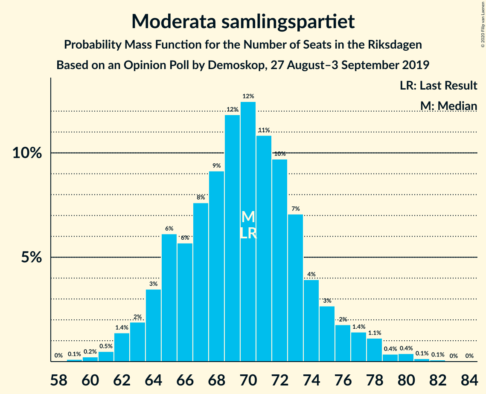
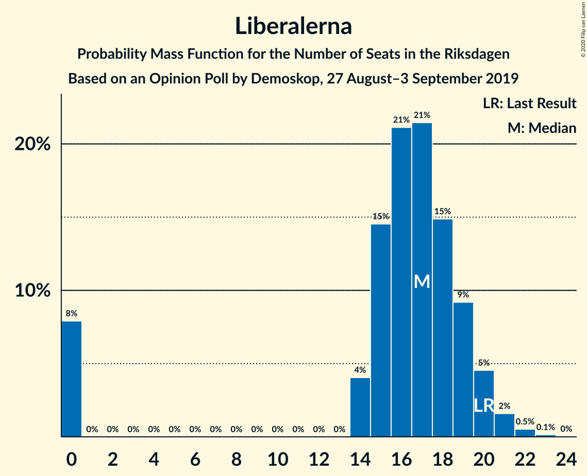

# Opinion Poll by Demoskop, 27 August–3 September 2019

<a href="#voting-intentions">Voting Intentions</a> | <a href="#seats">Seats</a> | <a href="#coalitions">Coalitions</a> | <a href="#technical-information">Technical Information</a>

## Voting Intentions

### Confidence Intervals

| Party | Last Result | Poll Result | 80% Confidence Interval | 90% Confidence Interval | 95% Confidence Interval | 99% Confidence Interval |
|:-----:|:-----------:|:-----------:|:-----------------------:|:-----------------------:|:-----------------------:|:-----------------------:|
| Sveriges socialdemokratiska arbetareparti | 28.3% | 24.0% | 22.7–25.4% |22.3–25.8% |22.0–26.2% |21.4–26.9% |
| Sverigedemokraterna | 17.5% | 21.4% | 20.1–22.8% |19.8–23.2% |19.5–23.5% |18.9–24.2% |
| Moderata samlingspartiet | 19.8% | 19.4% | 18.2–20.7% |17.9–21.1% |17.6–21.4% |17.0–22.1% |
| Centerpartiet | 8.6% | 8.4% | 7.5–9.3% |7.3–9.6% |7.1–9.8% |6.7–10.3% |
| Vänsterpartiet | 8.0% | 8.4% | 7.5–9.3% |7.3–9.6% |7.1–9.8% |6.7–10.3% |
| Kristdemokraterna | 6.3% | 6.5% | 5.8–7.4% |5.6–7.6% |5.4–7.8% |5.1–8.3% |
| Miljöpartiet de gröna | 4.4% | 4.9% | 4.3–5.7% |4.1–5.9% |3.9–6.1% |3.7–6.5% |
| Liberalerna | 5.5% | 4.6% | 4.0–5.3% |3.8–5.5% |3.7–5.7% |3.4–6.1% |

*Note:* The poll result column reflects the actual value used in the calculations. Published results may vary slightly, and in addition be rounded to fewer digits.

## Seats

### Confidence Intervals

| Party | Last Result | Median | 80% Confidence Interval | 90% Confidence Interval | 95% Confidence Interval | 99% Confidence Interval |
|:-----:|:-----------:|:------:|:-----------------------:|:-----------------------:|:-----------------------:|:-----------------------:|
| <a href="#sveriges-socialdemokratiska-arbetareparti">Sveriges socialdemokratiska arbetareparti</a> | 100 | 85 | 81–90 |79–91 |78–93 |76–96 |
| <a href="#sverigedemokraterna">Sverigedemokraterna</a> | 62 | 76 | 72–80 |71–81 |69–83 |67–86 |
| <a href="#moderata-samlingspartiet">Moderata samlingspartiet</a> | 70 | 70 | 65–75 |64–77 |63–78 |61–80 |
| <a href="#centerpartiet">Centerpartiet</a> | 31 | 30 | 28–35 |27–35 |26–36 |25–37 |
| <a href="#vänsterpartiet">Vänsterpartiet</a> | 28 | 31 | 27–34 |27–35 |26–36 |25–37 |
| <a href="#kristdemokraterna">Kristdemokraterna</a> | 22 | 24 | 21–27 |21–27 |20–29 |19–30 |
| <a href="#miljöpartiet-de-gröna">Miljöpartiet de gröna</a> | 16 | 18 | 15–20 |15–21 |14–22 |0–23 |
| <a href="#liberalerna">Liberalerna</a> | 20 | 16 | 0–18 |0–19 |0–20 |0–21 |

### Sveriges socialdemokratiska arbetareparti

*For a full overview of the results for this party, see the [Sveriges socialdemokratiska arbetareparti](party-sverigessocialdemokratiskaarbetareparti.html) page.*

| Number of Seats | Probability | Accumulated | Special Marks |
|:---------------:|:-----------:|:-----------:|:-------------:|
| 73 | 0% | 100% |  |
| 74 | 0.1% | 99.9% |  |
| 75 | 0.2% | 99.9% |  |
| 76 | 0.9% | 99.7% |  |
| 77 | 0.6% | 98.7% |  |
| 78 | 0.8% | 98% |  |
| 79 | 4% | 97% |  |
| 80 | 2% | 93% |  |
| 81 | 13% | 91% |  |
| 82 | 3% | 78% |  |
| 83 | 6% | 75% |  |
| 84 | 15% | 68% |  |
| 85 | 21% | 54% | Median |
| 86 | 4% | 32% |  |
| 87 | 5% | 29% |  |
| 88 | 8% | 24% |  |
| 89 | 5% | 16% |  |
| 90 | 4% | 11% |  |
| 91 | 2% | 7% |  |
| 92 | 2% | 5% |  |
| 93 | 0.6% | 3% |  |
| 94 | 1.3% | 2% |  |
| 95 | 0.3% | 1.1% |  |
| 96 | 0.3% | 0.8% |  |
| 97 | 0.2% | 0.5% |  |
| 98 | 0.2% | 0.3% |  |
| 99 | 0.1% | 0.1% |  |
| 100 | 0% | 0% | Last Result |

### Sverigedemokraterna

*For a full overview of the results for this party, see the [Sverigedemokraterna](party-sverigedemokraterna.html) page.*

| Number of Seats | Probability | Accumulated | Special Marks |
|:---------------:|:-----------:|:-----------:|:-------------:|
| 62 | 0% | 100% | Last Result |
| 63 | 0% | 100% |  |
| 64 | 0% | 100% |  |
| 65 | 0.1% | 100% |  |
| 66 | 0.1% | 99.8% |  |
| 67 | 0.6% | 99.8% |  |
| 68 | 0.2% | 99.1% |  |
| 69 | 2% | 99.0% |  |
| 70 | 1.4% | 97% |  |
| 71 | 5% | 96% |  |
| 72 | 9% | 91% |  |
| 73 | 8% | 82% |  |
| 74 | 14% | 74% |  |
| 75 | 7% | 60% |  |
| 76 | 10% | 54% | Median |
| 77 | 3% | 44% |  |
| 78 | 14% | 42% |  |
| 79 | 3% | 28% |  |
| 80 | 17% | 25% |  |
| 81 | 4% | 8% |  |
| 82 | 2% | 4% |  |
| 83 | 0.4% | 3% |  |
| 84 | 0.7% | 2% |  |
| 85 | 0.9% | 2% |  |
| 86 | 0.2% | 0.6% |  |
| 87 | 0.1% | 0.5% |  |
| 88 | 0% | 0.3% |  |
| 89 | 0.1% | 0.3% |  |
| 90 | 0.1% | 0.2% |  |
| 91 | 0% | 0.1% |  |
| 92 | 0% | 0% |  |

### Moderata samlingspartiet

*For a full overview of the results for this party, see the [Moderata samlingspartiet](party-moderatasamlingspartiet.html) page.*

| Number of Seats | Probability | Accumulated | Special Marks |
|:---------------:|:-----------:|:-----------:|:-------------:|
| 59 | 0.1% | 100% |  |
| 60 | 0.2% | 99.8% |  |
| 61 | 0.2% | 99.7% |  |
| 62 | 2% | 99.4% |  |
| 63 | 0.6% | 98% |  |
| 64 | 4% | 97% |  |
| 65 | 3% | 93% |  |
| 66 | 1.4% | 90% |  |
| 67 | 26% | 88% |  |
| 68 | 3% | 63% |  |
| 69 | 7% | 59% |  |
| 70 | 14% | 52% | Last Result, Median |
| 71 | 2% | 38% |  |
| 72 | 17% | 36% |  |
| 73 | 4% | 19% |  |
| 74 | 3% | 15% |  |
| 75 | 4% | 12% |  |
| 76 | 0.6% | 7% |  |
| 77 | 4% | 7% |  |
| 78 | 0.8% | 3% |  |
| 79 | 0.1% | 2% |  |
| 80 | 1.3% | 2% |  |
| 81 | 0% | 0.5% |  |
| 82 | 0.2% | 0.4% |  |
| 83 | 0.2% | 0.2% |  |
| 84 | 0% | 0% |  |

### Centerpartiet

*For a full overview of the results for this party, see the [Centerpartiet](party-centerpartiet.html) page.*

| Number of Seats | Probability | Accumulated | Special Marks |
|:---------------:|:-----------:|:-----------:|:-------------:|
| 23 | 0.2% | 100% |  |
| 24 | 0.1% | 99.8% |  |
| 25 | 1.0% | 99.6% |  |
| 26 | 1.1% | 98.6% |  |
| 27 | 4% | 97% |  |
| 28 | 8% | 94% |  |
| 29 | 21% | 86% |  |
| 30 | 17% | 66% | Median |
| 31 | 18% | 49% | Last Result |
| 32 | 6% | 31% |  |
| 33 | 10% | 25% |  |
| 34 | 4% | 15% |  |
| 35 | 8% | 11% |  |
| 36 | 2% | 3% |  |
| 37 | 0.9% | 1.2% |  |
| 38 | 0.2% | 0.3% |  |
| 39 | 0.1% | 0.1% |  |
| 40 | 0% | 0% |  |

### Vänsterpartiet

*For a full overview of the results for this party, see the [Vänsterpartiet](party-vänsterpartiet.html) page.*

| Number of Seats | Probability | Accumulated | Special Marks |
|:---------------:|:-----------:|:-----------:|:-------------:|
| 23 | 0.1% | 100% |  |
| 24 | 0.2% | 99.9% |  |
| 25 | 2% | 99.6% |  |
| 26 | 1.2% | 98% |  |
| 27 | 7% | 97% |  |
| 28 | 9% | 90% | Last Result |
| 29 | 8% | 81% |  |
| 30 | 19% | 73% |  |
| 31 | 14% | 54% | Median |
| 32 | 10% | 40% |  |
| 33 | 10% | 30% |  |
| 34 | 11% | 20% |  |
| 35 | 5% | 8% |  |
| 36 | 3% | 4% |  |
| 37 | 0.9% | 1.1% |  |
| 38 | 0.1% | 0.2% |  |
| 39 | 0.1% | 0.1% |  |
| 40 | 0% | 0% |  |

### Kristdemokraterna

*For a full overview of the results for this party, see the [Kristdemokraterna](party-kristdemokraterna.html) page.*

| Number of Seats | Probability | Accumulated | Special Marks |
|:---------------:|:-----------:|:-----------:|:-------------:|
| 17 | 0.1% | 100% |  |
| 18 | 0.3% | 99.9% |  |
| 19 | 0.9% | 99.6% |  |
| 20 | 3% | 98.7% |  |
| 21 | 6% | 95% |  |
| 22 | 10% | 89% | Last Result |
| 23 | 18% | 79% |  |
| 24 | 15% | 61% | Median |
| 25 | 25% | 46% |  |
| 26 | 8% | 21% |  |
| 27 | 9% | 13% |  |
| 28 | 2% | 5% |  |
| 29 | 2% | 3% |  |
| 30 | 0.4% | 0.7% |  |
| 31 | 0.2% | 0.3% |  |
| 32 | 0% | 0% |  |

### Miljöpartiet de gröna

*For a full overview of the results for this party, see the [Miljöpartiet de gröna](party-miljöpartietdegröna.html) page.*

| Number of Seats | Probability | Accumulated | Special Marks |
|:---------------:|:-----------:|:-----------:|:-------------:|
| 0 | 2% | 100% |  |
| 1 | 0% | 98% |  |
| 2 | 0% | 98% |  |
| 3 | 0% | 98% |  |
| 4 | 0% | 98% |  |
| 5 | 0% | 98% |  |
| 6 | 0% | 98% |  |
| 7 | 0% | 98% |  |
| 8 | 0% | 98% |  |
| 9 | 0% | 98% |  |
| 10 | 0% | 98% |  |
| 11 | 0% | 98% |  |
| 12 | 0% | 98% |  |
| 13 | 0% | 98% |  |
| 14 | 1.3% | 98% |  |
| 15 | 14% | 97% |  |
| 16 | 19% | 83% | Last Result |
| 17 | 11% | 64% |  |
| 18 | 17% | 53% | Median |
| 19 | 16% | 36% |  |
| 20 | 11% | 20% |  |
| 21 | 6% | 9% |  |
| 22 | 3% | 4% |  |
| 23 | 0.6% | 1.0% |  |
| 24 | 0.3% | 0.4% |  |
| 25 | 0.1% | 0.1% |  |
| 26 | 0% | 0% |  |

### Liberalerna

*For a full overview of the results for this party, see the [Liberalerna](party-liberalerna.html) page.*

| Number of Seats | Probability | Accumulated | Special Marks |
|:---------------:|:-----------:|:-----------:|:-------------:|
| 0 | 10% | 100% |  |
| 1 | 0% | 90% |  |
| 2 | 0% | 90% |  |
| 3 | 0% | 90% |  |
| 4 | 0% | 90% |  |
| 5 | 0% | 90% |  |
| 6 | 0% | 90% |  |
| 7 | 0% | 90% |  |
| 8 | 0% | 90% |  |
| 9 | 0% | 90% |  |
| 10 | 0% | 90% |  |
| 11 | 0% | 90% |  |
| 12 | 0% | 90% |  |
| 13 | 0% | 90% |  |
| 14 | 2% | 90% |  |
| 15 | 17% | 88% |  |
| 16 | 22% | 71% | Median |
| 17 | 26% | 48% |  |
| 18 | 15% | 23% |  |
| 19 | 4% | 8% |  |
| 20 | 2% | 3% | Last Result |
| 21 | 0.8% | 1.2% |  |
| 22 | 0.2% | 0.3% |  |
| 23 | 0.1% | 0.1% |  |
| 24 | 0% | 0% |  |

## Coalitions

### Confidence Intervals

| Coalition | Last Result | Median | Majority? | 80% Confidence Interval | 90% Confidence Interval | 95% Confidence Interval | 99% Confidence Interval |
|:---------:|:-----------:|:------:|:---------:|:-----------------------:|:-----------------------:|:-----------------------:|:-----------------------:|
| Sveriges socialdemokratiska arbetareparti – Moderata samlingspartiet – Centerpartiet | 201 | 184 | 99.4% | 181–193 | 179–195 | 177–200 | 174–203 |
| Sveriges socialdemokratiska arbetareparti – Centerpartiet – Vänsterpartiet – Miljöpartiet de gröna – Liberalerna | 195 | 180 | 82% | 172–185 | 169–187 | 167–188 | 163–190 |
| Sverigedemokraterna – Moderata samlingspartiet – Kristdemokraterna | 154 | 169 | 18% | 164–177 | 162–180 | 161–182 | 159–186 |
| Sveriges socialdemokratiska arbetareparti – Moderata samlingspartiet | 170 | 153 | 0.1% | 150–161 | 147–163 | 146–168 | 144–170 |
| Sveriges socialdemokratiska arbetareparti – Centerpartiet – Miljöpartiet de gröna – Liberalerna | 167 | 147 | 0% | 141–155 | 137–157 | 132–158 | 131–161 |
| Sverigedemokraterna – Moderata samlingspartiet | 132 | 146 | 0% | 141–151 | 139–155 | 137–157 | 135–160 |
| Moderata samlingspartiet – Centerpartiet – Kristdemokraterna – Liberalerna | 143 | 140 | 0% | 133–146 | 131–147 | 127–149 | 123–152 |
| Sveriges socialdemokratiska arbetareparti – Vänsterpartiet – Miljöpartiet de gröna | 144 | 132 | 0% | 127–140 | 126–142 | 125–144 | 116–146 |
| Moderata samlingspartiet – Centerpartiet – Kristdemokraterna | 123 | 124 | 0% | 119–130 | 118–132 | 116–135 | 113–138 |
| Sveriges socialdemokratiska arbetareparti – Vänsterpartiet | 128 | 115 | 0% | 110–121 | 109–124 | 108–126 | 105–128 |
| Moderata samlingspartiet – Centerpartiet – Liberalerna | 121 | 115 | 0% | 109–121 | 106–124 | 102–124 | 98–129 |
| Sveriges socialdemokratiska arbetareparti – Miljöpartiet de gröna | 116 | 102 | 0% | 98–108 | 97–110 | 94–111 | 87–115 |
| Moderata samlingspartiet – Centerpartiet | 101 | 100 | 0% | 96–106 | 94–107 | 92–110 | 90–114 |

### Sveriges socialdemokratiska arbetareparti – Moderata samlingspartiet – Centerpartiet

| Number of Seats | Probability | Accumulated | Special Marks |
|:---------------:|:-----------:|:-----------:|:-------------:|
| 171 | 0% | 100% |  |
| 172 | 0.2% | 99.9% |  |
| 173 | 0.2% | 99.7% |  |
| 174 | 0.1% | 99.6% |  |
| 175 | 0.7% | 99.4% | Majority |
| 176 | 1.1% | 98.8% |  |
| 177 | 1.0% | 98% |  |
| 178 | 1.5% | 97% |  |
| 179 | 4% | 95% |  |
| 180 | 0.6% | 91% |  |
| 181 | 17% | 91% |  |
| 182 | 1.0% | 74% |  |
| 183 | 18% | 73% |  |
| 184 | 13% | 55% |  |
| 185 | 3% | 43% | Median |
| 186 | 9% | 40% |  |
| 187 | 3% | 31% |  |
| 188 | 3% | 28% |  |
| 189 | 6% | 25% |  |
| 190 | 4% | 20% |  |
| 191 | 0.4% | 16% |  |
| 192 | 1.3% | 16% |  |
| 193 | 8% | 14% |  |
| 194 | 1.0% | 6% |  |
| 195 | 0.4% | 5% |  |
| 196 | 1.0% | 5% |  |
| 197 | 0.3% | 4% |  |
| 198 | 0.4% | 3% |  |
| 199 | 0.4% | 3% |  |
| 200 | 0.4% | 3% |  |
| 201 | 1.0% | 2% | Last Result |
| 202 | 0.1% | 1.3% |  |
| 203 | 0.8% | 1.2% |  |
| 204 | 0.1% | 0.4% |  |
| 205 | 0.1% | 0.2% |  |
| 206 | 0% | 0.2% |  |
| 207 | 0.1% | 0.1% |  |
| 208 | 0% | 0.1% |  |
| 209 | 0% | 0.1% |  |
| 210 | 0.1% | 0.1% |  |
| 211 | 0% | 0% |  |

### Sveriges socialdemokratiska arbetareparti – Centerpartiet – Vänsterpartiet – Miljöpartiet de gröna – Liberalerna

| Number of Seats | Probability | Accumulated | Special Marks |
|:---------------:|:-----------:|:-----------:|:-------------:|
| 160 | 0.1% | 100% |  |
| 161 | 0% | 99.8% |  |
| 162 | 0.1% | 99.8% |  |
| 163 | 0.3% | 99.7% |  |
| 164 | 0.3% | 99.4% |  |
| 165 | 0.3% | 99.1% |  |
| 166 | 0.4% | 98.8% |  |
| 167 | 2% | 98% |  |
| 168 | 0.9% | 96% |  |
| 169 | 0.8% | 95% |  |
| 170 | 0.6% | 94% |  |
| 171 | 0.5% | 94% |  |
| 172 | 7% | 93% |  |
| 173 | 2% | 86% |  |
| 174 | 2% | 84% |  |
| 175 | 6% | 82% | Majority |
| 176 | 0.9% | 77% |  |
| 177 | 19% | 76% |  |
| 178 | 4% | 57% |  |
| 179 | 2% | 53% |  |
| 180 | 15% | 51% | Median |
| 181 | 0.7% | 36% |  |
| 182 | 7% | 35% |  |
| 183 | 8% | 28% |  |
| 184 | 1.0% | 21% |  |
| 185 | 11% | 20% |  |
| 186 | 3% | 8% |  |
| 187 | 1.5% | 6% |  |
| 188 | 2% | 4% |  |
| 189 | 0.1% | 2% |  |
| 190 | 1.4% | 2% |  |
| 191 | 0.2% | 0.4% |  |
| 192 | 0.1% | 0.3% |  |
| 193 | 0.1% | 0.2% |  |
| 194 | 0% | 0.1% |  |
| 195 | 0% | 0.1% | Last Result |
| 196 | 0% | 0% |  |

### Sverigedemokraterna – Moderata samlingspartiet – Kristdemokraterna

| Number of Seats | Probability | Accumulated | Special Marks |
|:---------------:|:-----------:|:-----------:|:-------------:|
| 154 | 0% | 100% | Last Result |
| 155 | 0% | 99.9% |  |
| 156 | 0.1% | 99.9% |  |
| 157 | 0.1% | 99.8% |  |
| 158 | 0.2% | 99.7% |  |
| 159 | 1.4% | 99.6% |  |
| 160 | 0.1% | 98% |  |
| 161 | 2% | 98% |  |
| 162 | 1.5% | 96% |  |
| 163 | 3% | 94% |  |
| 164 | 11% | 92% |  |
| 165 | 1.0% | 80% |  |
| 166 | 8% | 79% |  |
| 167 | 7% | 72% |  |
| 168 | 0.7% | 65% |  |
| 169 | 15% | 64% |  |
| 170 | 2% | 48% | Median |
| 171 | 4% | 47% |  |
| 172 | 19% | 43% |  |
| 173 | 0.9% | 24% |  |
| 174 | 6% | 23% |  |
| 175 | 2% | 18% | Majority |
| 176 | 2% | 16% |  |
| 177 | 7% | 14% |  |
| 178 | 0.5% | 7% |  |
| 179 | 0.6% | 6% |  |
| 180 | 0.8% | 6% |  |
| 181 | 0.9% | 5% |  |
| 182 | 2% | 4% |  |
| 183 | 0.4% | 2% |  |
| 184 | 0.3% | 1.2% |  |
| 185 | 0.3% | 0.9% |  |
| 186 | 0.3% | 0.6% |  |
| 187 | 0.1% | 0.3% |  |
| 188 | 0% | 0.2% |  |
| 189 | 0.1% | 0.2% |  |
| 190 | 0% | 0% |  |

### Sveriges socialdemokratiska arbetareparti – Moderata samlingspartiet

| Number of Seats | Probability | Accumulated | Special Marks |
|:---------------:|:-----------:|:-----------:|:-------------:|
| 141 | 0.2% | 100% |  |
| 142 | 0.1% | 99.8% |  |
| 143 | 0.1% | 99.7% |  |
| 144 | 0.4% | 99.6% |  |
| 145 | 1.0% | 99.2% |  |
| 146 | 2% | 98% |  |
| 147 | 2% | 97% |  |
| 148 | 0.9% | 95% |  |
| 149 | 1.1% | 94% |  |
| 150 | 6% | 93% |  |
| 151 | 9% | 87% |  |
| 152 | 22% | 77% |  |
| 153 | 5% | 55% |  |
| 154 | 5% | 50% |  |
| 155 | 2% | 45% | Median |
| 156 | 14% | 43% |  |
| 157 | 5% | 29% |  |
| 158 | 9% | 24% |  |
| 159 | 1.4% | 15% |  |
| 160 | 2% | 14% |  |
| 161 | 4% | 12% |  |
| 162 | 1.4% | 9% |  |
| 163 | 2% | 7% |  |
| 164 | 0.6% | 5% |  |
| 165 | 0.5% | 4% |  |
| 166 | 0.6% | 4% |  |
| 167 | 0.4% | 3% |  |
| 168 | 0.2% | 3% |  |
| 169 | 2% | 2% |  |
| 170 | 0.3% | 0.6% | Last Result |
| 171 | 0% | 0.3% |  |
| 172 | 0% | 0.3% |  |
| 173 | 0.1% | 0.2% |  |
| 174 | 0.1% | 0.2% |  |
| 175 | 0.1% | 0.1% | Majority |
| 176 | 0% | 0% |  |

### Sveriges socialdemokratiska arbetareparti – Centerpartiet – Miljöpartiet de gröna – Liberalerna

| Number of Seats | Probability | Accumulated | Special Marks |
|:---------------:|:-----------:|:-----------:|:-------------:|
| 126 | 0% | 100% |  |
| 127 | 0% | 99.9% |  |
| 128 | 0.1% | 99.9% |  |
| 129 | 0% | 99.8% |  |
| 130 | 0.1% | 99.8% |  |
| 131 | 0.2% | 99.7% |  |
| 132 | 2% | 99.5% |  |
| 133 | 0.2% | 97% |  |
| 134 | 0.4% | 97% |  |
| 135 | 1.0% | 97% |  |
| 136 | 0.8% | 96% |  |
| 137 | 1.2% | 95% |  |
| 138 | 0.9% | 94% |  |
| 139 | 1.0% | 93% |  |
| 140 | 0.7% | 92% |  |
| 141 | 1.3% | 91% |  |
| 142 | 0.7% | 90% |  |
| 143 | 3% | 89% |  |
| 144 | 0.7% | 86% |  |
| 145 | 14% | 85% |  |
| 146 | 3% | 72% |  |
| 147 | 19% | 69% |  |
| 148 | 1.2% | 49% |  |
| 149 | 9% | 48% | Median |
| 150 | 2% | 39% |  |
| 151 | 15% | 37% |  |
| 152 | 2% | 22% |  |
| 153 | 3% | 19% |  |
| 154 | 3% | 16% |  |
| 155 | 8% | 13% |  |
| 156 | 0.2% | 5% |  |
| 157 | 2% | 5% |  |
| 158 | 1.0% | 3% |  |
| 159 | 1.5% | 2% |  |
| 160 | 0% | 0.6% |  |
| 161 | 0.3% | 0.5% |  |
| 162 | 0.1% | 0.2% |  |
| 163 | 0% | 0.1% |  |
| 164 | 0.1% | 0.1% |  |
| 165 | 0% | 0% |  |
| 166 | 0% | 0% |  |
| 167 | 0% | 0% | Last Result |

### Sverigedemokraterna – Moderata samlingspartiet

| Number of Seats | Probability | Accumulated | Special Marks |
|:---------------:|:-----------:|:-----------:|:-------------:|
| 131 | 0% | 100% |  |
| 132 | 0% | 99.9% | Last Result |
| 133 | 0.1% | 99.9% |  |
| 134 | 0.2% | 99.8% |  |
| 135 | 0.3% | 99.6% |  |
| 136 | 1.0% | 99.2% |  |
| 137 | 2% | 98% |  |
| 138 | 1.0% | 97% |  |
| 139 | 3% | 96% |  |
| 140 | 2% | 92% |  |
| 141 | 11% | 90% |  |
| 142 | 5% | 80% |  |
| 143 | 8% | 75% |  |
| 144 | 9% | 67% |  |
| 145 | 5% | 58% |  |
| 146 | 4% | 52% | Median |
| 147 | 12% | 48% |  |
| 148 | 11% | 36% |  |
| 149 | 3% | 25% |  |
| 150 | 8% | 21% |  |
| 151 | 4% | 14% |  |
| 152 | 1.4% | 10% |  |
| 153 | 2% | 8% |  |
| 154 | 0.4% | 6% |  |
| 155 | 1.3% | 6% |  |
| 156 | 0.5% | 5% |  |
| 157 | 2% | 4% |  |
| 158 | 0.3% | 2% |  |
| 159 | 0.9% | 1.5% |  |
| 160 | 0.2% | 0.6% |  |
| 161 | 0.1% | 0.4% |  |
| 162 | 0.2% | 0.3% |  |
| 163 | 0.1% | 0.1% |  |
| 164 | 0% | 0% |  |

### Moderata samlingspartiet – Centerpartiet – Kristdemokraterna – Liberalerna

| Number of Seats | Probability | Accumulated | Special Marks |
|:---------------:|:-----------:|:-----------:|:-------------:|
| 118 | 0% | 100% |  |
| 119 | 0% | 99.9% |  |
| 120 | 0.1% | 99.9% |  |
| 121 | 0% | 99.8% |  |
| 122 | 0% | 99.8% |  |
| 123 | 0.4% | 99.8% |  |
| 124 | 0.2% | 99.3% |  |
| 125 | 0.1% | 99.2% |  |
| 126 | 0.3% | 99.0% |  |
| 127 | 2% | 98.7% |  |
| 128 | 0.3% | 97% |  |
| 129 | 1.1% | 97% |  |
| 130 | 0.6% | 96% |  |
| 131 | 0.7% | 95% |  |
| 132 | 4% | 94% |  |
| 133 | 1.4% | 91% |  |
| 134 | 3% | 89% |  |
| 135 | 2% | 86% |  |
| 136 | 2% | 84% |  |
| 137 | 14% | 82% |  |
| 138 | 2% | 68% |  |
| 139 | 14% | 65% |  |
| 140 | 4% | 51% | Median |
| 141 | 12% | 47% |  |
| 142 | 10% | 35% |  |
| 143 | 2% | 26% | Last Result |
| 144 | 12% | 24% |  |
| 145 | 0.6% | 13% |  |
| 146 | 5% | 12% |  |
| 147 | 3% | 7% |  |
| 148 | 0.7% | 3% |  |
| 149 | 1.1% | 3% |  |
| 150 | 0.4% | 2% |  |
| 151 | 0.5% | 1.3% |  |
| 152 | 0.3% | 0.7% |  |
| 153 | 0.2% | 0.5% |  |
| 154 | 0.2% | 0.3% |  |
| 155 | 0% | 0.1% |  |
| 156 | 0% | 0.1% |  |
| 157 | 0% | 0% |  |

### Sveriges socialdemokratiska arbetareparti – Vänsterpartiet – Miljöpartiet de gröna

| Number of Seats | Probability | Accumulated | Special Marks |
|:---------------:|:-----------:|:-----------:|:-------------:|
| 113 | 0% | 100% |  |
| 114 | 0.1% | 99.9% |  |
| 115 | 0% | 99.8% |  |
| 116 | 0.3% | 99.8% |  |
| 117 | 0% | 99.4% |  |
| 118 | 0.1% | 99.4% |  |
| 119 | 0.1% | 99.3% |  |
| 120 | 0.2% | 99.2% |  |
| 121 | 0.2% | 99.0% |  |
| 122 | 0.3% | 98.8% |  |
| 123 | 0.5% | 98% |  |
| 124 | 0.5% | 98% |  |
| 125 | 0.4% | 98% |  |
| 126 | 4% | 97% |  |
| 127 | 5% | 94% |  |
| 128 | 2% | 88% |  |
| 129 | 3% | 86% |  |
| 130 | 18% | 83% |  |
| 131 | 6% | 65% |  |
| 132 | 9% | 59% |  |
| 133 | 3% | 50% |  |
| 134 | 5% | 46% | Median |
| 135 | 9% | 41% |  |
| 136 | 5% | 31% |  |
| 137 | 5% | 26% |  |
| 138 | 11% | 21% |  |
| 139 | 0.4% | 11% |  |
| 140 | 4% | 10% |  |
| 141 | 1.0% | 6% |  |
| 142 | 0.6% | 5% |  |
| 143 | 1.3% | 5% |  |
| 144 | 2% | 3% | Last Result |
| 145 | 0.2% | 2% |  |
| 146 | 1.3% | 2% |  |
| 147 | 0.1% | 0.4% |  |
| 148 | 0.1% | 0.3% |  |
| 149 | 0% | 0.3% |  |
| 150 | 0.2% | 0.2% |  |
| 151 | 0% | 0.1% |  |
| 152 | 0% | 0.1% |  |
| 153 | 0% | 0% |  |

### Moderata samlingspartiet – Centerpartiet – Kristdemokraterna

| Number of Seats | Probability | Accumulated | Special Marks |
|:---------------:|:-----------:|:-----------:|:-------------:|
| 109 | 0.1% | 100% |  |
| 110 | 0% | 99.9% |  |
| 111 | 0% | 99.9% |  |
| 112 | 0.1% | 99.8% |  |
| 113 | 0.3% | 99.7% |  |
| 114 | 1.0% | 99.4% |  |
| 115 | 0.7% | 98% |  |
| 116 | 0.5% | 98% |  |
| 117 | 0.6% | 97% |  |
| 118 | 4% | 97% |  |
| 119 | 10% | 93% |  |
| 120 | 3% | 83% |  |
| 121 | 3% | 80% |  |
| 122 | 4% | 77% |  |
| 123 | 13% | 73% | Last Result |
| 124 | 13% | 60% | Median |
| 125 | 11% | 47% |  |
| 126 | 3% | 36% |  |
| 127 | 3% | 33% |  |
| 128 | 8% | 30% |  |
| 129 | 9% | 21% |  |
| 130 | 3% | 12% |  |
| 131 | 1.1% | 9% |  |
| 132 | 4% | 8% |  |
| 133 | 0.6% | 4% |  |
| 134 | 0.9% | 3% |  |
| 135 | 0.5% | 3% |  |
| 136 | 0.9% | 2% |  |
| 137 | 0.5% | 1.1% |  |
| 138 | 0.2% | 0.6% |  |
| 139 | 0% | 0.4% |  |
| 140 | 0.2% | 0.4% |  |
| 141 | 0.1% | 0.1% |  |
| 142 | 0% | 0% |  |

### Sveriges socialdemokratiska arbetareparti – Vänsterpartiet

| Number of Seats | Probability | Accumulated | Special Marks |
|:---------------:|:-----------:|:-----------:|:-------------:|
| 102 | 0% | 100% |  |
| 103 | 0% | 99.9% |  |
| 104 | 0.4% | 99.9% |  |
| 105 | 0.1% | 99.5% |  |
| 106 | 0.3% | 99.4% |  |
| 107 | 0.2% | 99.1% |  |
| 108 | 4% | 98.9% |  |
| 109 | 0.7% | 95% |  |
| 110 | 7% | 95% |  |
| 111 | 6% | 88% |  |
| 112 | 2% | 82% |  |
| 113 | 10% | 80% |  |
| 114 | 8% | 71% |  |
| 115 | 18% | 62% |  |
| 116 | 9% | 44% | Median |
| 117 | 2% | 36% |  |
| 118 | 4% | 34% |  |
| 119 | 11% | 30% |  |
| 120 | 6% | 19% |  |
| 121 | 4% | 13% |  |
| 122 | 3% | 10% |  |
| 123 | 1.1% | 6% |  |
| 124 | 0.4% | 5% |  |
| 125 | 1.0% | 5% |  |
| 126 | 1.4% | 4% |  |
| 127 | 1.5% | 2% |  |
| 128 | 0.2% | 0.6% | Last Result |
| 129 | 0.2% | 0.5% |  |
| 130 | 0.1% | 0.3% |  |
| 131 | 0% | 0.2% |  |
| 132 | 0.1% | 0.2% |  |
| 133 | 0.1% | 0.1% |  |
| 134 | 0% | 0% |  |

### Moderata samlingspartiet – Centerpartiet – Liberalerna

| Number of Seats | Probability | Accumulated | Special Marks |
|:---------------:|:-----------:|:-----------:|:-------------:|
| 94 | 0.1% | 100% |  |
| 95 | 0% | 99.9% |  |
| 96 | 0% | 99.9% |  |
| 97 | 0.1% | 99.9% |  |
| 98 | 0.5% | 99.8% |  |
| 99 | 0.1% | 99.3% |  |
| 100 | 1.2% | 99.3% |  |
| 101 | 0.5% | 98% |  |
| 102 | 0.5% | 98% |  |
| 103 | 0.5% | 97% |  |
| 104 | 0.3% | 97% |  |
| 105 | 1.1% | 96% |  |
| 106 | 0.3% | 95% |  |
| 107 | 4% | 95% |  |
| 108 | 0.5% | 91% |  |
| 109 | 0.5% | 90% |  |
| 110 | 3% | 90% |  |
| 111 | 3% | 87% |  |
| 112 | 0.9% | 83% |  |
| 113 | 4% | 82% |  |
| 114 | 23% | 78% |  |
| 115 | 5% | 55% |  |
| 116 | 1.1% | 50% | Median |
| 117 | 19% | 49% |  |
| 118 | 5% | 30% |  |
| 119 | 1.4% | 25% |  |
| 120 | 5% | 24% |  |
| 121 | 9% | 18% | Last Result |
| 122 | 2% | 10% |  |
| 123 | 2% | 7% |  |
| 124 | 4% | 5% |  |
| 125 | 0.4% | 2% |  |
| 126 | 0.1% | 1.5% |  |
| 127 | 0.7% | 1.3% |  |
| 128 | 0.1% | 0.7% |  |
| 129 | 0.2% | 0.5% |  |
| 130 | 0.2% | 0.3% |  |
| 131 | 0.1% | 0.1% |  |
| 132 | 0% | 0% |  |

### Sveriges socialdemokratiska arbetareparti – Miljöpartiet de gröna

| Number of Seats | Probability | Accumulated | Special Marks |
|:---------------:|:-----------:|:-----------:|:-------------:|
| 82 | 0% | 100% |  |
| 83 | 0% | 99.9% |  |
| 84 | 0% | 99.9% |  |
| 85 | 0.3% | 99.9% |  |
| 86 | 0% | 99.5% |  |
| 87 | 0.3% | 99.5% |  |
| 88 | 0.2% | 99.2% |  |
| 89 | 0.1% | 99.0% |  |
| 90 | 0.1% | 98.9% |  |
| 91 | 0.6% | 98.9% |  |
| 92 | 0.1% | 98% |  |
| 93 | 0.4% | 98% |  |
| 94 | 0.6% | 98% |  |
| 95 | 0.8% | 97% |  |
| 96 | 0.7% | 96% |  |
| 97 | 4% | 96% |  |
| 98 | 8% | 92% |  |
| 99 | 7% | 84% |  |
| 100 | 17% | 77% |  |
| 101 | 4% | 60% |  |
| 102 | 7% | 57% |  |
| 103 | 7% | 50% | Median |
| 104 | 22% | 42% |  |
| 105 | 3% | 21% |  |
| 106 | 3% | 17% |  |
| 107 | 2% | 14% |  |
| 108 | 5% | 12% |  |
| 109 | 1.4% | 7% |  |
| 110 | 3% | 6% |  |
| 111 | 0.9% | 3% |  |
| 112 | 0.4% | 2% |  |
| 113 | 1.1% | 2% |  |
| 114 | 0.2% | 0.8% |  |
| 115 | 0.3% | 0.6% |  |
| 116 | 0.1% | 0.3% | Last Result |
| 117 | 0.2% | 0.3% |  |
| 118 | 0% | 0.1% |  |
| 119 | 0% | 0% |  |

### Moderata samlingspartiet – Centerpartiet

| Number of Seats | Probability | Accumulated | Special Marks |
|:---------------:|:-----------:|:-----------:|:-------------:|
| 88 | 0.1% | 100% |  |
| 89 | 0.1% | 99.9% |  |
| 90 | 0.5% | 99.7% |  |
| 91 | 0.2% | 99.3% |  |
| 92 | 2% | 99.1% |  |
| 93 | 0.7% | 97% |  |
| 94 | 3% | 97% |  |
| 95 | 2% | 94% |  |
| 96 | 11% | 92% |  |
| 97 | 2% | 81% |  |
| 98 | 17% | 79% |  |
| 99 | 2% | 61% |  |
| 100 | 17% | 59% | Median |
| 101 | 6% | 42% | Last Result |
| 102 | 7% | 37% |  |
| 103 | 5% | 30% |  |
| 104 | 3% | 24% |  |
| 105 | 7% | 21% |  |
| 106 | 4% | 14% |  |
| 107 | 5% | 10% |  |
| 108 | 0.8% | 5% |  |
| 109 | 0.9% | 4% |  |
| 110 | 0.5% | 3% |  |
| 111 | 0.8% | 2% |  |
| 112 | 0.2% | 2% |  |
| 113 | 0.4% | 1.5% |  |
| 114 | 0.8% | 1.1% |  |
| 115 | 0.2% | 0.3% |  |
| 116 | 0% | 0.1% |  |
| 117 | 0% | 0.1% |  |
| 118 | 0% | 0% |  |

## Technical Information

### Opinion Poll

+ **Polling firm:** Demoskop
+ **Commissioner(s):** —
+ **Fieldwork period:** 27 August–3 September 2019

### Calculations

+ **Sample size:** 1611
+ **Simulations done:** 131,072
+ **Error estimate:** 1.36%

