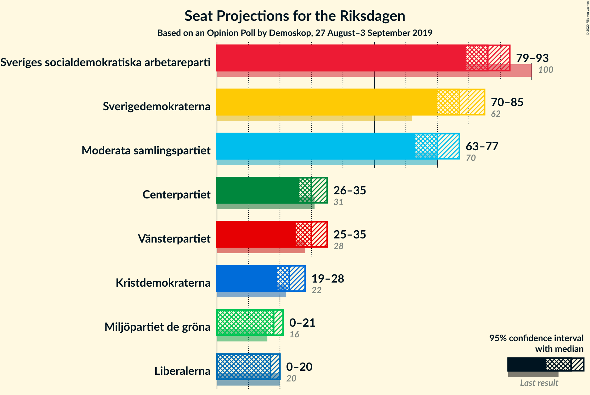
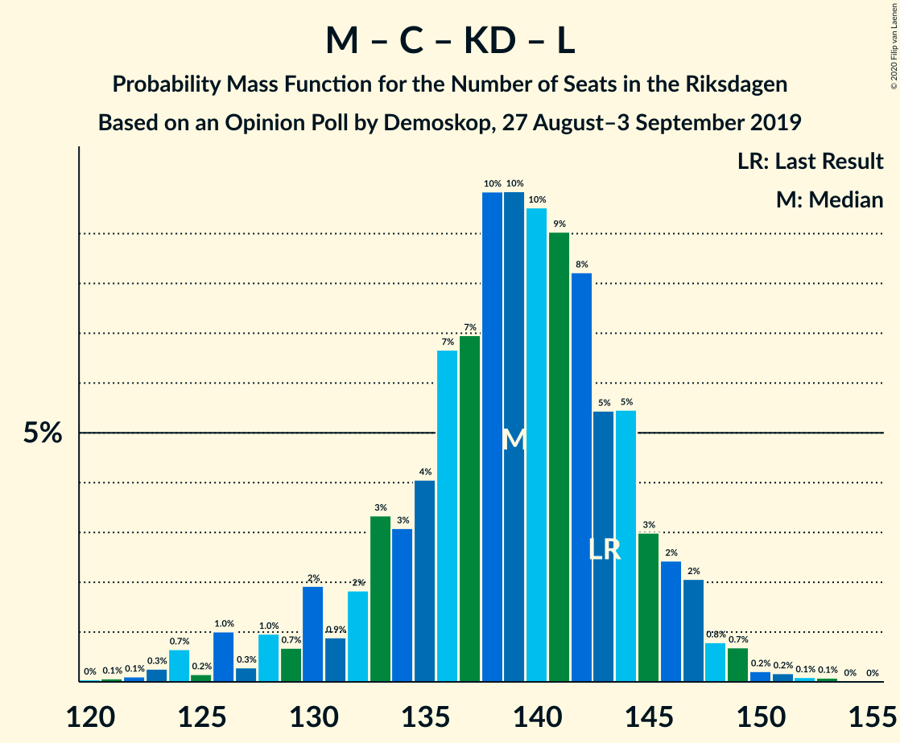

# Opinion Poll by Demoskop, 27 August–3 September 2019

<a href="#voting-intentions">Voting Intentions</a> | <a href="#seats">Seats</a> | <a href="#coalitions">Coalitions</a> | <a href="#technical-information">Technical Information</a>

## Voting Intentions

### Confidence Intervals

| Party | Last Result | Poll Result | 80% Confidence Interval | 90% Confidence Interval | 95% Confidence Interval | 99% Confidence Interval |
|:-----:|:-----------:|:-----------:|:-----------------------:|:-----------------------:|:-----------------------:|:-----------------------:|
| Sveriges socialdemokratiska arbetareparti | 28.3% | 24.1% | 22.8–25.6% |22.4–26.0% |22.1–26.3% |21.5–27.0% |
| Sverigedemokraterna | 17.5% | 21.5% | 20.3–22.9% |19.9–23.3% |19.6–23.6% |19.0–24.3% |
| Moderata samlingspartiet | 19.8% | 19.5% | 18.3–20.8% |17.9–21.2% |17.6–21.5% |17.1–22.1% |
| Centerpartiet | 8.6% | 8.4% | 7.6–9.4% |7.4–9.7% |7.2–9.9% |6.8–10.4% |
| Vänsterpartiet | 8.0% | 8.4% | 7.6–9.4% |7.4–9.7% |7.2–9.9% |6.8–10.4% |
| Kristdemokraterna | 6.3% | 6.5% | 5.8–7.4% |5.6–7.6% |5.4–7.8% |5.1–8.3% |
| Miljöpartiet de gröna | 4.4% | 4.9% | 4.3–5.7% |4.1–5.9% |3.9–6.1% |3.7–6.5% |
| Liberalerna | 5.5% | 4.7% | 4.0–5.4% |3.9–5.6% |3.7–5.8% |3.4–6.2% |

*Note:* The poll result column reflects the actual value used in the calculations. Published results may vary slightly, and in addition be rounded to fewer digits.

## Seats

### Confidence Intervals

| Party | Last Result | Median | 80% Confidence Interval | 90% Confidence Interval | 95% Confidence Interval | 99% Confidence Interval |
|:-----:|:-----------:|:------:|:-----------------------:|:-----------------------:|:-----------------------:|:-----------------------:|
| <a href="#sveriges-socialdemokratiska-arbetareparti">Sveriges socialdemokratiska arbetareparti</a> | 100 | 87 | 83–91 |82–94 |81–94 |78–98 |
| <a href="#sverigedemokraterna">Sverigedemokraterna</a> | 62 | 75 | 71–81 |70–83 |69–83 |67–88 |
| <a href="#moderata-samlingspartiet">Moderata samlingspartiet</a> | 70 | 70 | 65–74 |63–77 |62–78 |61–80 |
| <a href="#centerpartiet">Centerpartiet</a> | 31 | 30 | 26–32 |26–34 |25–35 |23–37 |
| <a href="#vänsterpartiet">Vänsterpartiet</a> | 28 | 31 | 27–35 |26–35 |26–36 |25–37 |
| <a href="#kristdemokraterna">Kristdemokraterna</a> | 22 | 25 | 20–27 |19–27 |18–28 |17–29 |
| <a href="#miljöpartiet-de-gröna">Miljöpartiet de gröna</a> | 16 | 18 | 15–20 |15–21 |0–22 |0–23 |
| <a href="#liberalerna">Liberalerna</a> | 20 | 16 | 0–18 |0–19 |0–20 |0–21 |

### Sveriges socialdemokratiska arbetareparti

*For a full overview of the results for this party, see the [Sveriges socialdemokratiska arbetareparti](party-sverigessocialdemokratiskaarbetareparti.html) page.*

| Number of Seats | Probability | Accumulated | Special Marks |
|:---------------:|:-----------:|:-----------:|:-------------:|
| 74 | 0% | 100% |  |
| 75 | 0.1% | 99.9% |  |
| 76 | 0.1% | 99.8% |  |
| 77 | 0.1% | 99.7% |  |
| 78 | 0.5% | 99.6% |  |
| 79 | 0.2% | 99.2% |  |
| 80 | 0.8% | 98.9% |  |
| 81 | 2% | 98% |  |
| 82 | 3% | 96% |  |
| 83 | 4% | 93% |  |
| 84 | 7% | 89% |  |
| 85 | 7% | 82% |  |
| 86 | 15% | 75% |  |
| 87 | 16% | 60% | Median |
| 88 | 4% | 44% |  |
| 89 | 10% | 40% |  |
| 90 | 18% | 30% |  |
| 91 | 3% | 12% |  |
| 92 | 2% | 9% |  |
| 93 | 0.7% | 6% |  |
| 94 | 3% | 5% |  |
| 95 | 0.9% | 2% |  |
| 96 | 0.4% | 1.4% |  |
| 97 | 0.5% | 1.0% |  |
| 98 | 0.2% | 0.5% |  |
| 99 | 0% | 0.3% |  |
| 100 | 0.1% | 0.3% | Last Result |
| 101 | 0% | 0.1% |  |
| 102 | 0% | 0.1% |  |
| 103 | 0% | 0.1% |  |
| 104 | 0% | 0% |  |

### Sverigedemokraterna

*For a full overview of the results for this party, see the [Sverigedemokraterna](party-sverigedemokraterna.html) page.*

| Number of Seats | Probability | Accumulated | Special Marks |
|:---------------:|:-----------:|:-----------:|:-------------:|
| 62 | 0% | 100% | Last Result |
| 63 | 0% | 100% |  |
| 64 | 0% | 100% |  |
| 65 | 0% | 99.9% |  |
| 66 | 0.1% | 99.9% |  |
| 67 | 0.6% | 99.8% |  |
| 68 | 1.2% | 99.2% |  |
| 69 | 1.4% | 98% |  |
| 70 | 4% | 97% |  |
| 71 | 8% | 93% |  |
| 72 | 6% | 85% |  |
| 73 | 17% | 79% |  |
| 74 | 7% | 63% |  |
| 75 | 8% | 56% | Median |
| 76 | 7% | 48% |  |
| 77 | 8% | 41% |  |
| 78 | 6% | 33% |  |
| 79 | 5% | 27% |  |
| 80 | 9% | 21% |  |
| 81 | 5% | 13% |  |
| 82 | 1.3% | 8% |  |
| 83 | 4% | 7% |  |
| 84 | 0.4% | 2% |  |
| 85 | 1.0% | 2% |  |
| 86 | 0.3% | 1.0% |  |
| 87 | 0.1% | 0.6% |  |
| 88 | 0.3% | 0.5% |  |
| 89 | 0.1% | 0.2% |  |
| 90 | 0.1% | 0.1% |  |
| 91 | 0% | 0.1% |  |
| 92 | 0% | 0% |  |

### Moderata samlingspartiet

*For a full overview of the results for this party, see the [Moderata samlingspartiet](party-moderatasamlingspartiet.html) page.*

| Number of Seats | Probability | Accumulated | Special Marks |
|:---------------:|:-----------:|:-----------:|:-------------:|
| 58 | 0.1% | 100% |  |
| 59 | 0.1% | 99.9% |  |
| 60 | 0.1% | 99.8% |  |
| 61 | 0.9% | 99.7% |  |
| 62 | 2% | 98.8% |  |
| 63 | 2% | 97% |  |
| 64 | 5% | 95% |  |
| 65 | 6% | 90% |  |
| 66 | 5% | 84% |  |
| 67 | 3% | 79% |  |
| 68 | 9% | 75% |  |
| 69 | 14% | 67% |  |
| 70 | 9% | 53% | Last Result, Median |
| 71 | 4% | 44% |  |
| 72 | 14% | 40% |  |
| 73 | 13% | 26% |  |
| 74 | 5% | 13% |  |
| 75 | 1.0% | 8% |  |
| 76 | 0.8% | 7% |  |
| 77 | 2% | 6% |  |
| 78 | 2% | 4% |  |
| 79 | 0.6% | 2% |  |
| 80 | 0.6% | 1.1% |  |
| 81 | 0.3% | 0.4% |  |
| 82 | 0.1% | 0.1% |  |
| 83 | 0% | 0.1% |  |
| 84 | 0% | 0% |  |

### Centerpartiet

*For a full overview of the results for this party, see the [Centerpartiet](party-centerpartiet.html) page.*

| Number of Seats | Probability | Accumulated | Special Marks |
|:---------------:|:-----------:|:-----------:|:-------------:|
| 22 | 0.1% | 100% |  |
| 23 | 0.7% | 99.8% |  |
| 24 | 1.3% | 99.2% |  |
| 25 | 2% | 98% |  |
| 26 | 9% | 96% |  |
| 27 | 12% | 88% |  |
| 28 | 18% | 75% |  |
| 29 | 6% | 57% |  |
| 30 | 14% | 51% | Median |
| 31 | 20% | 37% | Last Result |
| 32 | 9% | 17% |  |
| 33 | 3% | 8% |  |
| 34 | 2% | 5% |  |
| 35 | 1.2% | 3% |  |
| 36 | 1.1% | 2% |  |
| 37 | 0.3% | 0.5% |  |
| 38 | 0.1% | 0.2% |  |
| 39 | 0.1% | 0.1% |  |
| 40 | 0% | 0% |  |

### Vänsterpartiet

*For a full overview of the results for this party, see the [Vänsterpartiet](party-vänsterpartiet.html) page.*

| Number of Seats | Probability | Accumulated | Special Marks |
|:---------------:|:-----------:|:-----------:|:-------------:|
| 23 | 0.2% | 100% |  |
| 24 | 0.3% | 99.8% |  |
| 25 | 2% | 99.6% |  |
| 26 | 5% | 98% |  |
| 27 | 5% | 93% |  |
| 28 | 4% | 88% | Last Result |
| 29 | 6% | 84% |  |
| 30 | 15% | 77% |  |
| 31 | 15% | 63% | Median |
| 32 | 7% | 48% |  |
| 33 | 13% | 41% |  |
| 34 | 14% | 27% |  |
| 35 | 10% | 13% |  |
| 36 | 2% | 3% |  |
| 37 | 0.8% | 1.2% |  |
| 38 | 0.3% | 0.4% |  |
| 39 | 0% | 0.1% |  |
| 40 | 0% | 0% |  |

### Kristdemokraterna

*For a full overview of the results for this party, see the [Kristdemokraterna](party-kristdemokraterna.html) page.*

| Number of Seats | Probability | Accumulated | Special Marks |
|:---------------:|:-----------:|:-----------:|:-------------:|
| 16 | 0.1% | 100% |  |
| 17 | 1.1% | 99.9% |  |
| 18 | 1.4% | 98.8% |  |
| 19 | 7% | 97% |  |
| 20 | 4% | 90% |  |
| 21 | 2% | 87% |  |
| 22 | 1.1% | 85% | Last Result |
| 23 | 3% | 84% |  |
| 24 | 10% | 80% |  |
| 25 | 27% | 70% | Median |
| 26 | 27% | 43% |  |
| 27 | 11% | 16% |  |
| 28 | 4% | 5% |  |
| 29 | 0.9% | 1.0% |  |
| 30 | 0% | 0.1% |  |
| 31 | 0% | 0% |  |

### Miljöpartiet de gröna

*For a full overview of the results for this party, see the [Miljöpartiet de gröna](party-miljöpartietdegröna.html) page.*

| Number of Seats | Probability | Accumulated | Special Marks |
|:---------------:|:-----------:|:-----------:|:-------------:|
| 0 | 3% | 100% |  |
| 1 | 0% | 97% |  |
| 2 | 0% | 97% |  |
| 3 | 0% | 97% |  |
| 4 | 0% | 97% |  |
| 5 | 0% | 97% |  |
| 6 | 0% | 97% |  |
| 7 | 0% | 97% |  |
| 8 | 0% | 97% |  |
| 9 | 0% | 97% |  |
| 10 | 0% | 97% |  |
| 11 | 0% | 97% |  |
| 12 | 0% | 97% |  |
| 13 | 0% | 97% |  |
| 14 | 2% | 97% |  |
| 15 | 8% | 95% |  |
| 16 | 11% | 87% | Last Result |
| 17 | 16% | 76% |  |
| 18 | 28% | 60% | Median |
| 19 | 17% | 32% |  |
| 20 | 6% | 15% |  |
| 21 | 6% | 9% |  |
| 22 | 2% | 3% |  |
| 23 | 1.0% | 1.4% |  |
| 24 | 0.4% | 0.5% |  |
| 25 | 0.1% | 0.1% |  |
| 26 | 0% | 0% |  |

### Liberalerna

*For a full overview of the results for this party, see the [Liberalerna](party-liberalerna.html) page.*

| Number of Seats | Probability | Accumulated | Special Marks |
|:---------------:|:-----------:|:-----------:|:-------------:|
| 0 | 20% | 100% |  |
| 1 | 0% | 80% |  |
| 2 | 0% | 80% |  |
| 3 | 0% | 80% |  |
| 4 | 0% | 80% |  |
| 5 | 0% | 80% |  |
| 6 | 0% | 80% |  |
| 7 | 0% | 80% |  |
| 8 | 0% | 80% |  |
| 9 | 0% | 80% |  |
| 10 | 0% | 80% |  |
| 11 | 0% | 80% |  |
| 12 | 0% | 80% |  |
| 13 | 0% | 80% |  |
| 14 | 2% | 80% |  |
| 15 | 17% | 78% |  |
| 16 | 21% | 60% | Median |
| 17 | 23% | 39% |  |
| 18 | 10% | 17% |  |
| 19 | 3% | 7% |  |
| 20 | 2% | 4% | Last Result |
| 21 | 1.2% | 2% |  |
| 22 | 0.3% | 0.4% |  |
| 23 | 0.1% | 0.1% |  |
| 24 | 0% | 0% |  |

## Coalitions

### Confidence Intervals

| Coalition | Last Result | Median | Majority? | 80% Confidence Interval | 90% Confidence Interval | 95% Confidence Interval | 99% Confidence Interval |
|:---------:|:-----------:|:------:|:---------:|:-----------------------:|:-----------------------:|:-----------------------:|:-----------------------:|
| Sveriges socialdemokratiska arbetareparti – Moderata samlingspartiet – Centerpartiet | 201 | 186 | 98.8% | 181–193 | 178–197 | 176–198 | 174–202 |
| Sveriges socialdemokratiska arbetareparti – Centerpartiet – Vänsterpartiet – Miljöpartiet de gröna – Liberalerna | 195 | 179 | 79% | 170–186 | 168–188 | 168–190 | 165–192 |
| Sverigedemokraterna – Moderata samlingspartiet – Kristdemokraterna | 154 | 170 | 21% | 163–179 | 161–181 | 159–181 | 157–184 |
| Sveriges socialdemokratiska arbetareparti – Moderata samlingspartiet | 170 | 158 | 0.2% | 151–164 | 149–165 | 148–168 | 145–172 |
| Sveriges socialdemokratiska arbetareparti – Centerpartiet – Miljöpartiet de gröna – Liberalerna | 167 | 148 | 0% | 138–156 | 136–158 | 134–158 | 133–161 |
| Sverigedemokraterna – Moderata samlingspartiet | 132 | 145 | 0% | 140–153 | 138–155 | 137–157 | 135–160 |
| Moderata samlingspartiet – Centerpartiet – Kristdemokraterna – Liberalerna | 143 | 138 | 0% | 129–144 | 126–145 | 126–147 | 121–150 |
| Sveriges socialdemokratiska arbetareparti – Vänsterpartiet – Miljöpartiet de gröna | 144 | 136 | 0% | 133–141 | 131–143 | 129–143 | 121–145 |
| Moderata samlingspartiet – Centerpartiet – Kristdemokraterna | 123 | 124 | 0% | 117–130 | 115–133 | 114–134 | 112–139 |
| Sveriges socialdemokratiska arbetareparti – Vänsterpartiet | 128 | 118 | 0% | 114–124 | 112–125 | 112–127 | 108–130 |
| Moderata samlingspartiet – Centerpartiet – Liberalerna | 121 | 114 | 0% | 103–118 | 100–120 | 100–122 | 97–126 |
| Sveriges socialdemokratiska arbetareparti – Miljöpartiet de gröna | 116 | 105 | 0% | 101–109 | 100–110 | 96–110 | 91–113 |
| Moderata samlingspartiet – Centerpartiet | 101 | 100 | 0% | 94–104 | 92–108 | 90–109 | 89–111 |

### Sveriges socialdemokratiska arbetareparti – Moderata samlingspartiet – Centerpartiet

| Number of Seats | Probability | Accumulated | Special Marks |
|:---------------:|:-----------:|:-----------:|:-------------:|
| 172 | 0.2% | 100% |  |
| 173 | 0.2% | 99.8% |  |
| 174 | 0.8% | 99.6% |  |
| 175 | 0.1% | 98.8% | Majority |
| 176 | 2% | 98.7% |  |
| 177 | 0.8% | 97% |  |
| 178 | 2% | 96% |  |
| 179 | 2% | 94% |  |
| 180 | 2% | 92% |  |
| 181 | 1.2% | 90% |  |
| 182 | 11% | 89% |  |
| 183 | 5% | 78% |  |
| 184 | 8% | 74% |  |
| 185 | 3% | 66% |  |
| 186 | 20% | 63% |  |
| 187 | 2% | 43% | Median |
| 188 | 7% | 41% |  |
| 189 | 6% | 34% |  |
| 190 | 14% | 29% |  |
| 191 | 0.8% | 14% |  |
| 192 | 2% | 13% |  |
| 193 | 2% | 11% |  |
| 194 | 0.7% | 10% |  |
| 195 | 0.2% | 9% |  |
| 196 | 3% | 9% |  |
| 197 | 1.1% | 6% |  |
| 198 | 2% | 5% |  |
| 199 | 0.6% | 2% |  |
| 200 | 1.0% | 2% |  |
| 201 | 0.1% | 0.7% | Last Result |
| 202 | 0.3% | 0.6% |  |
| 203 | 0% | 0.4% |  |
| 204 | 0% | 0.4% |  |
| 205 | 0.1% | 0.3% |  |
| 206 | 0.1% | 0.3% |  |
| 207 | 0% | 0.2% |  |
| 208 | 0.1% | 0.2% |  |
| 209 | 0% | 0.1% |  |
| 210 | 0% | 0.1% |  |
| 211 | 0% | 0% |  |

### Sveriges socialdemokratiska arbetareparti – Centerpartiet – Vänsterpartiet – Miljöpartiet de gröna – Liberalerna

| Number of Seats | Probability | Accumulated | Special Marks |
|:---------------:|:-----------:|:-----------:|:-------------:|
| 160 | 0% | 100% |  |
| 161 | 0% | 99.9% |  |
| 162 | 0.1% | 99.9% |  |
| 163 | 0.1% | 99.8% |  |
| 164 | 0% | 99.7% |  |
| 165 | 0.6% | 99.7% |  |
| 166 | 0.4% | 99.0% |  |
| 167 | 1.0% | 98.6% |  |
| 168 | 3% | 98% |  |
| 169 | 4% | 94% |  |
| 170 | 1.1% | 91% |  |
| 171 | 0.7% | 90% |  |
| 172 | 1.1% | 89% |  |
| 173 | 8% | 88% |  |
| 174 | 1.2% | 80% |  |
| 175 | 4% | 79% | Majority |
| 176 | 1.3% | 74% |  |
| 177 | 6% | 73% |  |
| 178 | 12% | 67% |  |
| 179 | 6% | 55% |  |
| 180 | 12% | 48% |  |
| 181 | 4% | 37% |  |
| 182 | 13% | 33% | Median |
| 183 | 1.1% | 20% |  |
| 184 | 4% | 19% |  |
| 185 | 2% | 15% |  |
| 186 | 6% | 13% |  |
| 187 | 2% | 7% |  |
| 188 | 2% | 5% |  |
| 189 | 0.5% | 4% |  |
| 190 | 2% | 3% |  |
| 191 | 0.8% | 2% |  |
| 192 | 0.7% | 0.9% |  |
| 193 | 0% | 0.2% |  |
| 194 | 0.1% | 0.2% |  |
| 195 | 0.1% | 0.1% | Last Result |
| 196 | 0% | 0% |  |

### Sverigedemokraterna – Moderata samlingspartiet – Kristdemokraterna

| Number of Seats | Probability | Accumulated | Special Marks |
|:---------------:|:-----------:|:-----------:|:-------------:|
| 154 | 0.1% | 100% | Last Result |
| 155 | 0.1% | 99.9% |  |
| 156 | 0% | 99.8% |  |
| 157 | 0.7% | 99.8% |  |
| 158 | 0.8% | 99.1% |  |
| 159 | 2% | 98% |  |
| 160 | 0.5% | 97% |  |
| 161 | 2% | 96% |  |
| 162 | 2% | 95% |  |
| 163 | 6% | 93% |  |
| 164 | 2% | 87% |  |
| 165 | 4% | 85% |  |
| 166 | 1.1% | 81% |  |
| 167 | 13% | 80% |  |
| 168 | 4% | 67% |  |
| 169 | 12% | 63% |  |
| 170 | 6% | 52% | Median |
| 171 | 12% | 45% |  |
| 172 | 6% | 33% |  |
| 173 | 1.3% | 27% |  |
| 174 | 4% | 26% |  |
| 175 | 1.2% | 21% | Majority |
| 176 | 8% | 20% |  |
| 177 | 1.1% | 12% |  |
| 178 | 0.7% | 11% |  |
| 179 | 1.1% | 10% |  |
| 180 | 4% | 9% |  |
| 181 | 3% | 6% |  |
| 182 | 1.0% | 2% |  |
| 183 | 0.4% | 1.4% |  |
| 184 | 0.6% | 1.0% |  |
| 185 | 0% | 0.3% |  |
| 186 | 0.1% | 0.3% |  |
| 187 | 0.1% | 0.2% |  |
| 188 | 0% | 0.1% |  |
| 189 | 0% | 0.1% |  |
| 190 | 0% | 0% |  |

### Sveriges socialdemokratiska arbetareparti – Moderata samlingspartiet

| Number of Seats | Probability | Accumulated | Special Marks |
|:---------------:|:-----------:|:-----------:|:-------------:|
| 142 | 0% | 100% |  |
| 143 | 0.1% | 99.9% |  |
| 144 | 0.1% | 99.8% |  |
| 145 | 0.3% | 99.7% |  |
| 146 | 1.0% | 99.4% |  |
| 147 | 0.8% | 98% |  |
| 148 | 1.5% | 98% |  |
| 149 | 3% | 96% |  |
| 150 | 2% | 94% |  |
| 151 | 3% | 91% |  |
| 152 | 4% | 88% |  |
| 153 | 5% | 84% |  |
| 154 | 8% | 79% |  |
| 155 | 8% | 71% |  |
| 156 | 6% | 63% |  |
| 157 | 5% | 57% | Median |
| 158 | 7% | 52% |  |
| 159 | 19% | 46% |  |
| 160 | 8% | 26% |  |
| 161 | 3% | 18% |  |
| 162 | 2% | 15% |  |
| 163 | 1.4% | 13% |  |
| 164 | 3% | 12% |  |
| 165 | 4% | 8% |  |
| 166 | 0.3% | 5% |  |
| 167 | 1.4% | 5% |  |
| 168 | 0.9% | 3% |  |
| 169 | 0.4% | 2% |  |
| 170 | 1.1% | 2% | Last Result |
| 171 | 0.1% | 0.9% |  |
| 172 | 0.4% | 0.8% |  |
| 173 | 0.1% | 0.4% |  |
| 174 | 0.1% | 0.2% |  |
| 175 | 0% | 0.2% | Majority |
| 176 | 0.1% | 0.1% |  |
| 177 | 0% | 0.1% |  |
| 178 | 0% | 0% |  |

### Sveriges socialdemokratiska arbetareparti – Centerpartiet – Miljöpartiet de gröna – Liberalerna

| Number of Seats | Probability | Accumulated | Special Marks |
|:---------------:|:-----------:|:-----------:|:-------------:|
| 129 | 0.1% | 100% |  |
| 130 | 0.1% | 99.9% |  |
| 131 | 0.2% | 99.8% |  |
| 132 | 0.1% | 99.6% |  |
| 133 | 1.3% | 99.5% |  |
| 134 | 3% | 98% |  |
| 135 | 0.3% | 96% |  |
| 136 | 4% | 95% |  |
| 137 | 0.6% | 91% |  |
| 138 | 6% | 91% |  |
| 139 | 2% | 85% |  |
| 140 | 1.1% | 83% |  |
| 141 | 2% | 82% |  |
| 142 | 2% | 79% |  |
| 143 | 2% | 77% |  |
| 144 | 2% | 75% |  |
| 145 | 5% | 73% |  |
| 146 | 3% | 68% |  |
| 147 | 13% | 66% |  |
| 148 | 6% | 53% |  |
| 149 | 9% | 47% |  |
| 150 | 7% | 38% |  |
| 151 | 4% | 31% | Median |
| 152 | 3% | 27% |  |
| 153 | 4% | 24% |  |
| 154 | 3% | 19% |  |
| 155 | 4% | 16% |  |
| 156 | 5% | 12% |  |
| 157 | 1.0% | 7% |  |
| 158 | 4% | 7% |  |
| 159 | 0.6% | 2% |  |
| 160 | 1.0% | 2% |  |
| 161 | 0.4% | 0.7% |  |
| 162 | 0.1% | 0.3% |  |
| 163 | 0.1% | 0.2% |  |
| 164 | 0.1% | 0.1% |  |
| 165 | 0% | 0.1% |  |
| 166 | 0% | 0% |  |
| 167 | 0% | 0% | Last Result |

### Sverigedemokraterna – Moderata samlingspartiet

| Number of Seats | Probability | Accumulated | Special Marks |
|:---------------:|:-----------:|:-----------:|:-------------:|
| 132 | 0% | 100% | Last Result |
| 133 | 0.1% | 99.9% |  |
| 134 | 0.2% | 99.8% |  |
| 135 | 0.3% | 99.6% |  |
| 136 | 1.2% | 99.3% |  |
| 137 | 0.9% | 98% |  |
| 138 | 3% | 97% |  |
| 139 | 2% | 94% |  |
| 140 | 5% | 92% |  |
| 141 | 6% | 88% |  |
| 142 | 10% | 82% |  |
| 143 | 11% | 72% |  |
| 144 | 8% | 61% |  |
| 145 | 6% | 53% | Median |
| 146 | 11% | 48% |  |
| 147 | 6% | 37% |  |
| 148 | 7% | 31% |  |
| 149 | 2% | 24% |  |
| 150 | 8% | 22% |  |
| 151 | 3% | 14% |  |
| 152 | 0.9% | 12% |  |
| 153 | 2% | 11% |  |
| 154 | 0.5% | 9% |  |
| 155 | 5% | 8% |  |
| 156 | 0.4% | 3% |  |
| 157 | 1.0% | 3% |  |
| 158 | 1.0% | 2% |  |
| 159 | 0.2% | 0.9% |  |
| 160 | 0.4% | 0.7% |  |
| 161 | 0.1% | 0.3% |  |
| 162 | 0.1% | 0.2% |  |
| 163 | 0% | 0.1% |  |
| 164 | 0% | 0.1% |  |
| 165 | 0% | 0% |  |

### Moderata samlingspartiet – Centerpartiet – Kristdemokraterna – Liberalerna

| Number of Seats | Probability | Accumulated | Special Marks |
|:---------------:|:-----------:|:-----------:|:-------------:|
| 119 | 0% | 100% |  |
| 120 | 0.1% | 99.9% |  |
| 121 | 0.4% | 99.9% |  |
| 122 | 0.3% | 99.5% |  |
| 123 | 0.8% | 99.2% |  |
| 124 | 0.3% | 98% |  |
| 125 | 0.1% | 98% |  |
| 126 | 6% | 98% |  |
| 127 | 0.3% | 92% |  |
| 128 | 0.4% | 92% |  |
| 129 | 3% | 91% |  |
| 130 | 2% | 88% |  |
| 131 | 3% | 86% |  |
| 132 | 3% | 84% |  |
| 133 | 5% | 81% |  |
| 134 | 7% | 75% |  |
| 135 | 6% | 68% |  |
| 136 | 4% | 63% |  |
| 137 | 5% | 58% |  |
| 138 | 6% | 54% |  |
| 139 | 13% | 48% |  |
| 140 | 2% | 35% |  |
| 141 | 12% | 33% | Median |
| 142 | 6% | 21% |  |
| 143 | 2% | 15% | Last Result |
| 144 | 7% | 13% |  |
| 145 | 2% | 6% |  |
| 146 | 0.6% | 4% |  |
| 147 | 2% | 3% |  |
| 148 | 0.2% | 0.9% |  |
| 149 | 0.1% | 0.7% |  |
| 150 | 0.2% | 0.5% |  |
| 151 | 0.1% | 0.4% |  |
| 152 | 0.1% | 0.3% |  |
| 153 | 0.1% | 0.2% |  |
| 154 | 0% | 0.2% |  |
| 155 | 0% | 0.1% |  |
| 156 | 0% | 0.1% |  |
| 157 | 0% | 0.1% |  |
| 158 | 0% | 0.1% |  |
| 159 | 0% | 0% |  |

### Sveriges socialdemokratiska arbetareparti – Vänsterpartiet – Miljöpartiet de gröna

| Number of Seats | Probability | Accumulated | Special Marks |
|:---------------:|:-----------:|:-----------:|:-------------:|
| 111 | 0% | 100% |  |
| 112 | 0% | 99.9% |  |
| 113 | 0.1% | 99.9% |  |
| 114 | 0.1% | 99.9% |  |
| 115 | 0% | 99.8% |  |
| 116 | 0% | 99.8% |  |
| 117 | 0% | 99.8% |  |
| 118 | 0% | 99.7% |  |
| 119 | 0% | 99.7% |  |
| 120 | 0.1% | 99.6% |  |
| 121 | 0.1% | 99.5% |  |
| 122 | 0.1% | 99.5% |  |
| 123 | 0.3% | 99.4% |  |
| 124 | 0.1% | 99.1% |  |
| 125 | 0.1% | 99.0% |  |
| 126 | 0.1% | 98.9% |  |
| 127 | 0.1% | 98.8% |  |
| 128 | 1.2% | 98.8% |  |
| 129 | 0.3% | 98% |  |
| 130 | 1.0% | 97% |  |
| 131 | 3% | 96% |  |
| 132 | 3% | 93% |  |
| 133 | 7% | 90% |  |
| 134 | 9% | 84% |  |
| 135 | 20% | 75% |  |
| 136 | 13% | 55% | Median |
| 137 | 10% | 42% |  |
| 138 | 10% | 32% |  |
| 139 | 7% | 22% |  |
| 140 | 3% | 15% |  |
| 141 | 3% | 12% |  |
| 142 | 2% | 9% |  |
| 143 | 6% | 7% |  |
| 144 | 0.2% | 1.0% | Last Result |
| 145 | 0.5% | 0.8% |  |
| 146 | 0.1% | 0.2% |  |
| 147 | 0% | 0.2% |  |
| 148 | 0.1% | 0.2% |  |
| 149 | 0% | 0% |  |

### Moderata samlingspartiet – Centerpartiet – Kristdemokraterna

| Number of Seats | Probability | Accumulated | Special Marks |
|:---------------:|:-----------:|:-----------:|:-------------:|
| 110 | 0.1% | 100% |  |
| 111 | 0.2% | 99.9% |  |
| 112 | 0.6% | 99.7% |  |
| 113 | 0.1% | 99.1% |  |
| 114 | 2% | 99.0% |  |
| 115 | 3% | 97% |  |
| 116 | 3% | 95% |  |
| 117 | 3% | 92% |  |
| 118 | 7% | 89% |  |
| 119 | 1.3% | 82% |  |
| 120 | 8% | 80% |  |
| 121 | 3% | 72% |  |
| 122 | 10% | 69% |  |
| 123 | 2% | 59% | Last Result |
| 124 | 10% | 57% |  |
| 125 | 14% | 47% | Median |
| 126 | 7% | 33% |  |
| 127 | 3% | 26% |  |
| 128 | 3% | 23% |  |
| 129 | 9% | 21% |  |
| 130 | 2% | 12% |  |
| 131 | 2% | 9% |  |
| 132 | 1.2% | 7% |  |
| 133 | 2% | 6% |  |
| 134 | 2% | 4% |  |
| 135 | 0.3% | 1.3% |  |
| 136 | 0.1% | 1.0% |  |
| 137 | 0.2% | 0.9% |  |
| 138 | 0.2% | 0.7% |  |
| 139 | 0.4% | 0.5% |  |
| 140 | 0% | 0.1% |  |
| 141 | 0% | 0.1% |  |
| 142 | 0% | 0% |  |

### Sveriges socialdemokratiska arbetareparti – Vänsterpartiet

| Number of Seats | Probability | Accumulated | Special Marks |
|:---------------:|:-----------:|:-----------:|:-------------:|
| 103 | 0% | 100% |  |
| 104 | 0.1% | 99.9% |  |
| 105 | 0.1% | 99.9% |  |
| 106 | 0% | 99.7% |  |
| 107 | 0.2% | 99.7% |  |
| 108 | 0.3% | 99.5% |  |
| 109 | 0.2% | 99.2% |  |
| 110 | 0.4% | 99.0% |  |
| 111 | 0.5% | 98.6% |  |
| 112 | 4% | 98% |  |
| 113 | 3% | 94% |  |
| 114 | 7% | 92% |  |
| 115 | 1.1% | 85% |  |
| 116 | 3% | 84% |  |
| 117 | 24% | 81% |  |
| 118 | 11% | 57% | Median |
| 119 | 8% | 46% |  |
| 120 | 8% | 38% |  |
| 121 | 5% | 30% |  |
| 122 | 8% | 25% |  |
| 123 | 3% | 17% |  |
| 124 | 4% | 14% |  |
| 125 | 6% | 10% |  |
| 126 | 0.6% | 4% |  |
| 127 | 0.7% | 3% |  |
| 128 | 1.3% | 2% | Last Result |
| 129 | 0.2% | 1.1% |  |
| 130 | 0.6% | 0.9% |  |
| 131 | 0.1% | 0.3% |  |
| 132 | 0% | 0.3% |  |
| 133 | 0.2% | 0.2% |  |
| 134 | 0% | 0.1% |  |
| 135 | 0% | 0% |  |

### Moderata samlingspartiet – Centerpartiet – Liberalerna

| Number of Seats | Probability | Accumulated | Special Marks |
|:---------------:|:-----------:|:-----------:|:-------------:|
| 93 | 0% | 100% |  |
| 94 | 0% | 99.9% |  |
| 95 | 0.3% | 99.9% |  |
| 96 | 0% | 99.6% |  |
| 97 | 0.4% | 99.6% |  |
| 98 | 0.2% | 99.2% |  |
| 99 | 0.7% | 99.0% |  |
| 100 | 6% | 98% |  |
| 101 | 0.3% | 92% |  |
| 102 | 0.5% | 92% |  |
| 103 | 4% | 92% |  |
| 104 | 2% | 88% |  |
| 105 | 0.8% | 86% |  |
| 106 | 0.9% | 85% |  |
| 107 | 3% | 84% |  |
| 108 | 2% | 81% |  |
| 109 | 7% | 79% |  |
| 110 | 5% | 72% |  |
| 111 | 3% | 66% |  |
| 112 | 5% | 64% |  |
| 113 | 3% | 59% |  |
| 114 | 8% | 56% |  |
| 115 | 7% | 48% |  |
| 116 | 19% | 41% | Median |
| 117 | 4% | 22% |  |
| 118 | 9% | 18% |  |
| 119 | 2% | 9% |  |
| 120 | 2% | 7% |  |
| 121 | 2% | 5% | Last Result |
| 122 | 1.1% | 3% |  |
| 123 | 0.5% | 2% |  |
| 124 | 0.8% | 2% |  |
| 125 | 0.2% | 0.7% |  |
| 126 | 0.2% | 0.5% |  |
| 127 | 0.1% | 0.3% |  |
| 128 | 0.1% | 0.2% |  |
| 129 | 0% | 0.1% |  |
| 130 | 0% | 0.1% |  |
| 131 | 0% | 0.1% |  |
| 132 | 0% | 0% |  |

### Sveriges socialdemokratiska arbetareparti – Miljöpartiet de gröna

| Number of Seats | Probability | Accumulated | Special Marks |
|:---------------:|:-----------:|:-----------:|:-------------:|
| 80 | 0% | 100% |  |
| 81 | 0% | 99.9% |  |
| 82 | 0% | 99.9% |  |
| 83 | 0% | 99.9% |  |
| 84 | 0% | 99.8% |  |
| 85 | 0% | 99.8% |  |
| 86 | 0% | 99.8% |  |
| 87 | 0% | 99.8% |  |
| 88 | 0% | 99.7% |  |
| 89 | 0% | 99.7% |  |
| 90 | 0.2% | 99.7% |  |
| 91 | 0% | 99.5% |  |
| 92 | 0.2% | 99.5% |  |
| 93 | 0.3% | 99.3% |  |
| 94 | 1.1% | 99.0% |  |
| 95 | 0.2% | 98% |  |
| 96 | 0.2% | 98% |  |
| 97 | 0.6% | 97% |  |
| 98 | 0.5% | 97% |  |
| 99 | 0.2% | 96% |  |
| 100 | 4% | 96% |  |
| 101 | 9% | 92% |  |
| 102 | 1.5% | 83% |  |
| 103 | 6% | 82% |  |
| 104 | 24% | 76% |  |
| 105 | 9% | 52% | Median |
| 106 | 13% | 43% |  |
| 107 | 6% | 30% |  |
| 108 | 13% | 25% |  |
| 109 | 5% | 12% |  |
| 110 | 5% | 7% |  |
| 111 | 0.5% | 2% |  |
| 112 | 0.7% | 2% |  |
| 113 | 0.7% | 1.0% |  |
| 114 | 0.1% | 0.3% |  |
| 115 | 0% | 0.2% |  |
| 116 | 0% | 0.1% | Last Result |
| 117 | 0.1% | 0.1% |  |
| 118 | 0% | 0% |  |

### Moderata samlingspartiet – Centerpartiet

| Number of Seats | Probability | Accumulated | Special Marks |
|:---------------:|:-----------:|:-----------:|:-------------:|
| 86 | 0.1% | 100% |  |
| 87 | 0% | 99.9% |  |
| 88 | 0.2% | 99.8% |  |
| 89 | 0.3% | 99.7% |  |
| 90 | 2% | 99.4% |  |
| 91 | 0.5% | 97% |  |
| 92 | 4% | 96% |  |
| 93 | 2% | 93% |  |
| 94 | 6% | 91% |  |
| 95 | 4% | 85% |  |
| 96 | 5% | 81% |  |
| 97 | 11% | 76% |  |
| 98 | 6% | 65% |  |
| 99 | 7% | 60% |  |
| 100 | 21% | 52% | Median |
| 101 | 4% | 32% | Last Result |
| 102 | 4% | 27% |  |
| 103 | 11% | 24% |  |
| 104 | 4% | 12% |  |
| 105 | 1.2% | 9% |  |
| 106 | 1.0% | 8% |  |
| 107 | 0.7% | 6% |  |
| 108 | 2% | 6% |  |
| 109 | 3% | 4% |  |
| 110 | 0.4% | 1.3% |  |
| 111 | 0.4% | 0.9% |  |
| 112 | 0.3% | 0.5% |  |
| 113 | 0.1% | 0.2% |  |
| 114 | 0% | 0.1% |  |
| 115 | 0% | 0.1% |  |
| 116 | 0% | 0% |  |

## Technical Information

### Opinion Poll

+ **Polling firm:** Demoskop
+ **Commissioner(s):** —
+ **Fieldwork period:** 27 August–3 September 2019

### Calculations

+ **Sample size:** 1611
+ **Simulations done:** 131,072
+ **Error estimate:** 1.23%

