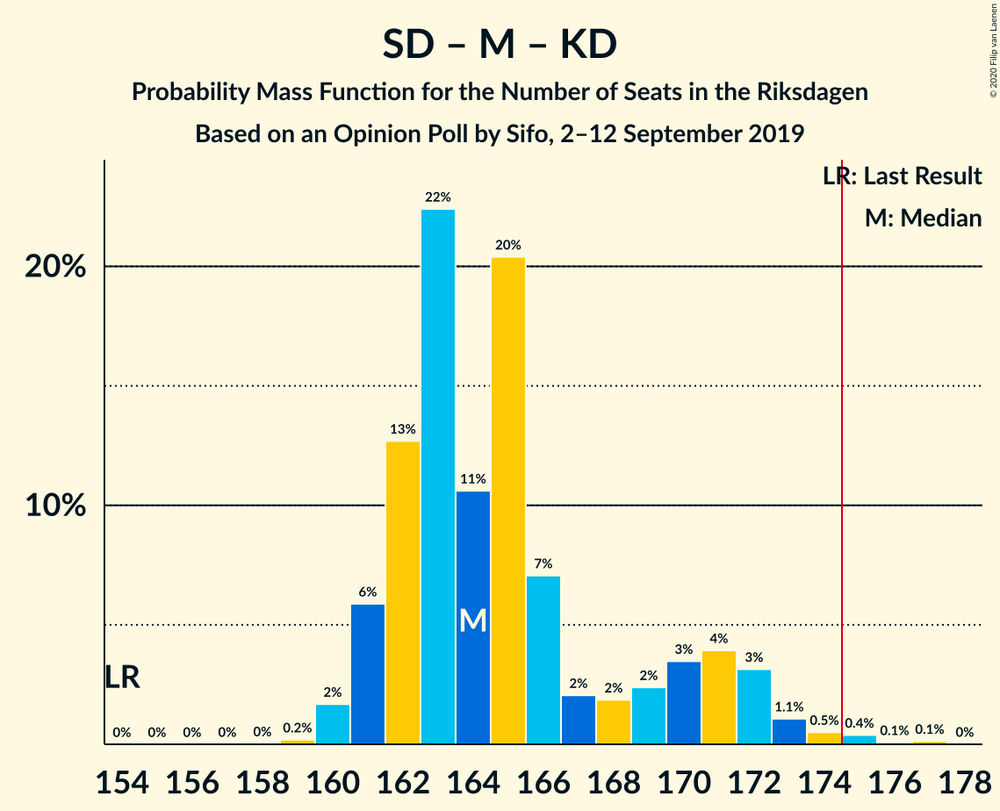

# Opinion Poll by Sifo, 2–12 September 2019

<a href="#voting-intentions">Voting Intentions</a> | <a href="#seats">Seats</a> | <a href="#coalitions">Coalitions</a> | <a href="#technical-information">Technical Information</a>

## Voting Intentions

### Confidence Intervals

| Party | Last Result | Poll Result | 80% Confidence Interval | 90% Confidence Interval | 95% Confidence Interval | 99% Confidence Interval |
|:-----:|:-----------:|:-----------:|:-----------------------:|:-----------------------:|:-----------------------:|:-----------------------:|
| Sveriges socialdemokratiska arbetareparti | 28.3% | 25.8% | 25.2–26.4% |25.0–26.6% |24.9–26.7% |24.6–27.0% |
| Sverigedemokraterna | 17.5% | 20.2% | 19.6–20.7% |19.5–20.9% |19.4–21.0% |19.1–21.3% |
| Moderata samlingspartiet | 19.8% | 18.9% | 18.4–19.4% |18.2–19.6% |18.1–19.7% |17.8–20.0% |
| Centerpartiet | 8.6% | 8.6% | 8.2–9.0% |8.1–9.1% |8.0–9.2% |7.8–9.4% |
| Vänsterpartiet | 8.0% | 8.5% | 8.1–8.9% |8.0–9.0% |7.9–9.1% |7.8–9.3% |
| Kristdemokraterna | 6.3% | 7.3% | 7.0–7.7% |6.9–7.8% |6.8–7.9% |6.6–8.0% |
| Miljöpartiet de gröna | 4.4% | 5.1% | 4.8–5.4% |4.7–5.5% |4.6–5.6% |4.5–5.7% |
| Liberalerna | 5.5% | 4.2% | 3.9–4.5% |3.9–4.6% |3.8–4.6% |3.7–4.8% |

*Note:* The poll result column reflects the actual value used in the calculations. Published results may vary slightly, and in addition be rounded to fewer digits.

## Seats

### Confidence Intervals

| Party | Last Result | Median | 80% Confidence Interval | 90% Confidence Interval | 95% Confidence Interval | 99% Confidence Interval |
|:-----:|:-----------:|:------:|:-----------------------:|:-----------------------:|:-----------------------:|:-----------------------:|
| <a href="#sveriges-socialdemokratiska-arbetareparti">Sveriges socialdemokratiska arbetareparti</a> | 100 | 91 | 90–96 |89–97 |89–97 |87–99 |
| <a href="#sverigedemokraterna">Sverigedemokraterna</a> | 62 | 72 | 69–75 |69–76 |68–76 |68–77 |
| <a href="#moderata-samlingspartiet">Moderata samlingspartiet</a> | 70 | 67 | 65–70 |65–71 |64–71 |63–73 |
| <a href="#centerpartiet">Centerpartiet</a> | 31 | 31 | 29–33 |29–33 |29–33 |28–34 |
| <a href="#vänsterpartiet">Vänsterpartiet</a> | 28 | 31 | 29–32 |29–33 |28–33 |28–34 |
| <a href="#kristdemokraterna">Kristdemokraterna</a> | 22 | 26 | 24–27 |24–27 |24–28 |23–29 |
| <a href="#miljöpartiet-de-gröna">Miljöpartiet de gröna</a> | 16 | 18 | 17–20 |17–20 |17–20 |16–21 |
| <a href="#liberalerna">Liberalerna</a> | 20 | 15 | 0–16 |0–16 |0–16 |0–17 |

### Sveriges socialdemokratiska arbetareparti

*For a full overview of the results for this party, see the [Sveriges socialdemokratiska arbetareparti](party-sverigessocialdemokratiskaarbetareparti.html) page.*

| Number of Seats | Probability | Accumulated | Special Marks |
|:---------------:|:-----------:|:-----------:|:-------------:|
| 86 | 0.1% | 100% |  |
| 87 | 0.6% | 99.9% |  |
| 88 | 1.2% | 99.3% |  |
| 89 | 4% | 98% |  |
| 90 | 17% | 94% |  |
| 91 | 34% | 77% | Median |
| 92 | 10% | 43% |  |
| 93 | 7% | 33% |  |
| 94 | 10% | 26% |  |
| 95 | 5% | 15% |  |
| 96 | 5% | 11% |  |
| 97 | 5% | 6% |  |
| 98 | 0.2% | 1.0% |  |
| 99 | 0.7% | 0.8% |  |
| 100 | 0% | 0.1% | Last Result |
| 101 | 0.1% | 0.1% |  |
| 102 | 0% | 0% |  |

### Sverigedemokraterna

*For a full overview of the results for this party, see the [Sverigedemokraterna](party-sverigedemokraterna.html) page.*

| Number of Seats | Probability | Accumulated | Special Marks |
|:---------------:|:-----------:|:-----------:|:-------------:|
| 62 | 0% | 100% | Last Result |
| 63 | 0% | 100% |  |
| 64 | 0% | 100% |  |
| 65 | 0% | 100% |  |
| 66 | 0% | 100% |  |
| 67 | 0.3% | 100% |  |
| 68 | 3% | 99.7% |  |
| 69 | 7% | 97% |  |
| 70 | 18% | 90% |  |
| 71 | 18% | 72% |  |
| 72 | 19% | 54% | Median |
| 73 | 14% | 35% |  |
| 74 | 10% | 21% |  |
| 75 | 4% | 12% |  |
| 76 | 6% | 7% |  |
| 77 | 1.0% | 1.2% |  |
| 78 | 0.2% | 0.3% |  |
| 79 | 0.1% | 0.1% |  |
| 80 | 0% | 0% |  |

### Moderata samlingspartiet

*For a full overview of the results for this party, see the [Moderata samlingspartiet](party-moderatasamlingspartiet.html) page.*

| Number of Seats | Probability | Accumulated | Special Marks |
|:---------------:|:-----------:|:-----------:|:-------------:|
| 62 | 0.1% | 100% |  |
| 63 | 0.9% | 99.8% |  |
| 64 | 3% | 99.0% |  |
| 65 | 18% | 96% |  |
| 66 | 19% | 78% |  |
| 67 | 17% | 60% | Median |
| 68 | 16% | 42% |  |
| 69 | 13% | 26% |  |
| 70 | 3% | 13% | Last Result |
| 71 | 8% | 10% |  |
| 72 | 0.9% | 2% |  |
| 73 | 0.8% | 0.9% |  |
| 74 | 0.1% | 0.1% |  |
| 75 | 0% | 0% |  |

### Centerpartiet

*For a full overview of the results for this party, see the [Centerpartiet](party-centerpartiet.html) page.*

| Number of Seats | Probability | Accumulated | Special Marks |
|:---------------:|:-----------:|:-----------:|:-------------:|
| 27 | 0.1% | 100% |  |
| 28 | 2% | 99.9% |  |
| 29 | 12% | 98% |  |
| 30 | 25% | 86% |  |
| 31 | 39% | 61% | Last Result, Median |
| 32 | 10% | 22% |  |
| 33 | 10% | 11% |  |
| 34 | 1.1% | 1.2% |  |
| 35 | 0.1% | 0.1% |  |
| 36 | 0% | 0% |  |

### Vänsterpartiet

*For a full overview of the results for this party, see the [Vänsterpartiet](party-vänsterpartiet.html) page.*

| Number of Seats | Probability | Accumulated | Special Marks |
|:---------------:|:-----------:|:-----------:|:-------------:|
| 27 | 0.2% | 100% |  |
| 28 | 3% | 99.8% | Last Result |
| 29 | 11% | 97% |  |
| 30 | 24% | 86% |  |
| 31 | 27% | 63% | Median |
| 32 | 31% | 36% |  |
| 33 | 4% | 5% |  |
| 34 | 1.2% | 1.2% |  |
| 35 | 0% | 0% |  |

### Kristdemokraterna

*For a full overview of the results for this party, see the [Kristdemokraterna](party-kristdemokraterna.html) page.*

| Number of Seats | Probability | Accumulated | Special Marks |
|:---------------:|:-----------:|:-----------:|:-------------:|
| 22 | 0% | 100% | Last Result |
| 23 | 0.6% | 100% |  |
| 24 | 13% | 99.4% |  |
| 25 | 19% | 86% |  |
| 26 | 51% | 67% | Median |
| 27 | 12% | 16% |  |
| 28 | 4% | 5% |  |
| 29 | 0.9% | 1.0% |  |
| 30 | 0.1% | 0.1% |  |
| 31 | 0% | 0% |  |

### Miljöpartiet de gröna

*For a full overview of the results for this party, see the [Miljöpartiet de gröna](party-miljöpartietdegröna.html) page.*

| Number of Seats | Probability | Accumulated | Special Marks |
|:---------------:|:-----------:|:-----------:|:-------------:|
| 16 | 1.4% | 100% | Last Result |
| 17 | 16% | 98.6% |  |
| 18 | 41% | 83% | Median |
| 19 | 28% | 42% |  |
| 20 | 14% | 14% |  |
| 21 | 0.8% | 0.8% |  |
| 22 | 0% | 0% |  |

### Liberalerna

*For a full overview of the results for this party, see the [Liberalerna](party-liberalerna.html) page.*

| Number of Seats | Probability | Accumulated | Special Marks |
|:---------------:|:-----------:|:-----------:|:-------------:|
| 0 | 21% | 100% |  |
| 1 | 0% | 79% |  |
| 2 | 0% | 79% |  |
| 3 | 0% | 79% |  |
| 4 | 0% | 79% |  |
| 5 | 0% | 79% |  |
| 6 | 0% | 79% |  |
| 7 | 0% | 79% |  |
| 8 | 0% | 79% |  |
| 9 | 0% | 79% |  |
| 10 | 0% | 79% |  |
| 11 | 0% | 79% |  |
| 12 | 0% | 79% |  |
| 13 | 0% | 79% |  |
| 14 | 4% | 79% |  |
| 15 | 52% | 75% | Median |
| 16 | 22% | 24% |  |
| 17 | 2% | 2% |  |
| 18 | 0% | 0% |  |
| 19 | 0% | 0% |  |
| 20 | 0% | 0% | Last Result |

## Coalitions

### Confidence Intervals

| Coalition | Last Result | Median | Majority? | 80% Confidence Interval | 90% Confidence Interval | 95% Confidence Interval | 99% Confidence Interval |
|:---------:|:-----------:|:------:|:---------:|:-----------------------:|:-----------------------:|:-----------------------:|:-----------------------:|
| Sveriges socialdemokratiska arbetareparti – Moderata samlingspartiet – Centerpartiet | 201 | 189 | 100% | 186–198 | 186–198 | 186–198 | 184–201 |
| Sveriges socialdemokratiska arbetareparti – Centerpartiet – Vänsterpartiet – Miljöpartiet de gröna – Liberalerna | 195 | 185 | 99.2% | 178–187 | 178–188 | 176–189 | 174–189 |
| Sverigedemokraterna – Moderata samlingspartiet – Kristdemokraterna | 154 | 164 | 0.8% | 162–171 | 161–171 | 160–173 | 160–175 |
| Sveriges socialdemokratiska arbetareparti – Moderata samlingspartiet | 170 | 158 | 0% | 156–165 | 155–165 | 155–167 | 153–169 |
| Sveriges socialdemokratiska arbetareparti – Centerpartiet – Miljöpartiet de gröna – Liberalerna | 167 | 155 | 0% | 146–157 | 146–158 | 144–159 | 143–159 |
| Sveriges socialdemokratiska arbetareparti – Vänsterpartiet – Miljöpartiet de gröna | 144 | 141 | 0% | 138–146 | 137–148 | 137–148 | 135–149 |
| Sverigedemokraterna – Moderata samlingspartiet | 132 | 139 | 0% | 136–145 | 135–145 | 134–145 | 134–148 |
| Moderata samlingspartiet – Centerpartiet – Kristdemokraterna – Liberalerna | 143 | 137 | 0% | 128–140 | 126–141 | 125–141 | 125–143 |
| Moderata samlingspartiet – Centerpartiet – Kristdemokraterna | 123 | 123 | 0% | 121–129 | 120–130 | 120–130 | 119–132 |
| Sveriges socialdemokratiska arbetareparti – Vänsterpartiet | 128 | 123 | 0% | 120–127 | 119–129 | 119–129 | 117–131 |
| Sveriges socialdemokratiska arbetareparti – Miljöpartiet de gröna | 116 | 110 | 0% | 107–114 | 107–116 | 107–116 | 105–119 |
| Moderata samlingspartiet – Centerpartiet – Liberalerna | 121 | 112 | 0% | 101–114 | 99–115 | 99–116 | 99–117 |
| Moderata samlingspartiet – Centerpartiet | 101 | 97 | 0% | 95–102 | 94–104 | 94–104 | 93–105 |

### Sveriges socialdemokratiska arbetareparti – Moderata samlingspartiet – Centerpartiet

| Number of Seats | Probability | Accumulated | Special Marks |
|:---------------:|:-----------:|:-----------:|:-------------:|
| 183 | 0.2% | 100% |  |
| 184 | 0.6% | 99.7% |  |
| 185 | 1.2% | 99.1% |  |
| 186 | 13% | 98% |  |
| 187 | 6% | 84% |  |
| 188 | 28% | 78% |  |
| 189 | 17% | 50% | Median |
| 190 | 7% | 34% |  |
| 191 | 3% | 27% |  |
| 192 | 0.9% | 25% |  |
| 193 | 2% | 24% |  |
| 194 | 1.1% | 22% |  |
| 195 | 0.8% | 21% |  |
| 196 | 6% | 20% |  |
| 197 | 3% | 14% |  |
| 198 | 8% | 10% |  |
| 199 | 0.6% | 2% |  |
| 200 | 0.7% | 2% |  |
| 201 | 0.7% | 0.9% | Last Result |
| 202 | 0.1% | 0.1% |  |
| 203 | 0% | 0% |  |

### Sveriges socialdemokratiska arbetareparti – Centerpartiet – Vänsterpartiet – Miljöpartiet de gröna – Liberalerna

| Number of Seats | Probability | Accumulated | Special Marks |
|:---------------:|:-----------:|:-----------:|:-------------:|
| 172 | 0.2% | 100% |  |
| 173 | 0.1% | 99.8% |  |
| 174 | 0.5% | 99.7% |  |
| 175 | 0.3% | 99.2% | Majority |
| 176 | 2% | 98.9% |  |
| 177 | 2% | 97% |  |
| 178 | 8% | 95% |  |
| 179 | 7% | 87% |  |
| 180 | 0.9% | 80% |  |
| 181 | 3% | 79% |  |
| 182 | 1.4% | 77% |  |
| 183 | 6% | 75% |  |
| 184 | 9% | 69% |  |
| 185 | 14% | 60% |  |
| 186 | 14% | 46% | Median |
| 187 | 25% | 32% |  |
| 188 | 3% | 7% |  |
| 189 | 4% | 4% |  |
| 190 | 0.2% | 0.3% |  |
| 191 | 0% | 0% |  |
| 192 | 0% | 0% |  |
| 193 | 0% | 0% |  |
| 194 | 0% | 0% |  |
| 195 | 0% | 0% | Last Result |

### Sverigedemokraterna – Moderata samlingspartiet – Kristdemokraterna

| Number of Seats | Probability | Accumulated | Special Marks |
|:---------------:|:-----------:|:-----------:|:-------------:|
| 154 | 0% | 100% | Last Result |
| 155 | 0% | 100% |  |
| 156 | 0% | 100% |  |
| 157 | 0% | 100% |  |
| 158 | 0% | 100% |  |
| 159 | 0.2% | 100% |  |
| 160 | 4% | 99.7% |  |
| 161 | 3% | 96% |  |
| 162 | 25% | 93% |  |
| 163 | 14% | 68% |  |
| 164 | 14% | 54% |  |
| 165 | 9% | 40% | Median |
| 166 | 6% | 31% |  |
| 167 | 1.4% | 25% |  |
| 168 | 3% | 23% |  |
| 169 | 0.9% | 21% |  |
| 170 | 7% | 20% |  |
| 171 | 8% | 13% |  |
| 172 | 2% | 5% |  |
| 173 | 2% | 3% |  |
| 174 | 0.3% | 1.1% |  |
| 175 | 0.5% | 0.8% | Majority |
| 176 | 0.1% | 0.3% |  |
| 177 | 0.2% | 0.2% |  |
| 178 | 0% | 0% |  |

### Sveriges socialdemokratiska arbetareparti – Moderata samlingspartiet

| Number of Seats | Probability | Accumulated | Special Marks |
|:---------------:|:-----------:|:-----------:|:-------------:|
| 153 | 1.0% | 100% |  |
| 154 | 0.8% | 99.0% |  |
| 155 | 4% | 98% |  |
| 156 | 8% | 95% |  |
| 157 | 24% | 86% |  |
| 158 | 24% | 63% | Median |
| 159 | 8% | 38% |  |
| 160 | 5% | 31% |  |
| 161 | 2% | 25% |  |
| 162 | 1.1% | 24% |  |
| 163 | 2% | 23% |  |
| 164 | 2% | 20% |  |
| 165 | 14% | 19% |  |
| 166 | 1.4% | 4% |  |
| 167 | 2% | 3% |  |
| 168 | 0.6% | 1.3% |  |
| 169 | 0.5% | 0.7% |  |
| 170 | 0.2% | 0.2% | Last Result |
| 171 | 0% | 0% |  |

### Sveriges socialdemokratiska arbetareparti – Centerpartiet – Miljöpartiet de gröna – Liberalerna

| Number of Seats | Probability | Accumulated | Special Marks |
|:---------------:|:-----------:|:-----------:|:-------------:|
| 141 | 0.1% | 100% |  |
| 142 | 0.2% | 99.9% |  |
| 143 | 0.7% | 99.8% |  |
| 144 | 2% | 99.1% |  |
| 145 | 2% | 97% |  |
| 146 | 10% | 95% |  |
| 147 | 5% | 86% |  |
| 148 | 0.7% | 81% |  |
| 149 | 0.9% | 80% |  |
| 150 | 0.7% | 79% |  |
| 151 | 2% | 79% |  |
| 152 | 2% | 77% |  |
| 153 | 13% | 75% |  |
| 154 | 7% | 62% |  |
| 155 | 29% | 56% | Median |
| 156 | 11% | 26% |  |
| 157 | 6% | 16% |  |
| 158 | 6% | 10% |  |
| 159 | 3% | 4% |  |
| 160 | 0.4% | 0.5% |  |
| 161 | 0% | 0% |  |
| 162 | 0% | 0% |  |
| 163 | 0% | 0% |  |
| 164 | 0% | 0% |  |
| 165 | 0% | 0% |  |
| 166 | 0% | 0% |  |
| 167 | 0% | 0% | Last Result |

### Sveriges socialdemokratiska arbetareparti – Vänsterpartiet – Miljöpartiet de gröna

| Number of Seats | Probability | Accumulated | Special Marks |
|:---------------:|:-----------:|:-----------:|:-------------:|
| 134 | 0.3% | 100% |  |
| 135 | 0.4% | 99.7% |  |
| 136 | 0.8% | 99.3% |  |
| 137 | 4% | 98% |  |
| 138 | 11% | 95% |  |
| 139 | 17% | 84% |  |
| 140 | 10% | 67% | Median |
| 141 | 23% | 58% |  |
| 142 | 12% | 35% |  |
| 143 | 2% | 24% |  |
| 144 | 2% | 21% | Last Result |
| 145 | 9% | 19% |  |
| 146 | 0.8% | 10% |  |
| 147 | 3% | 10% |  |
| 148 | 5% | 6% |  |
| 149 | 0.8% | 1.1% |  |
| 150 | 0.1% | 0.3% |  |
| 151 | 0.2% | 0.2% |  |
| 152 | 0% | 0% |  |

### Sverigedemokraterna – Moderata samlingspartiet

| Number of Seats | Probability | Accumulated | Special Marks |
|:---------------:|:-----------:|:-----------:|:-------------:|
| 132 | 0% | 100% | Last Result |
| 133 | 0.2% | 100% |  |
| 134 | 4% | 99.7% |  |
| 135 | 2% | 96% |  |
| 136 | 21% | 93% |  |
| 137 | 12% | 72% |  |
| 138 | 9% | 60% |  |
| 139 | 7% | 51% | Median |
| 140 | 19% | 44% |  |
| 141 | 3% | 25% |  |
| 142 | 2% | 21% |  |
| 143 | 1.2% | 20% |  |
| 144 | 6% | 19% |  |
| 145 | 10% | 12% |  |
| 146 | 0.9% | 2% |  |
| 147 | 0.6% | 1.3% |  |
| 148 | 0.5% | 0.7% |  |
| 149 | 0.2% | 0.3% |  |
| 150 | 0.1% | 0.1% |  |
| 151 | 0% | 0% |  |

### Moderata samlingspartiet – Centerpartiet – Kristdemokraterna – Liberalerna

| Number of Seats | Probability | Accumulated | Special Marks |
|:---------------:|:-----------:|:-----------:|:-------------:|
| 124 | 0.2% | 100% |  |
| 125 | 5% | 99.8% |  |
| 126 | 0.6% | 95% |  |
| 127 | 3% | 95% |  |
| 128 | 2% | 91% |  |
| 129 | 1.4% | 90% |  |
| 130 | 7% | 88% |  |
| 131 | 1.1% | 81% |  |
| 132 | 1.0% | 80% |  |
| 133 | 0.6% | 79% |  |
| 134 | 1.1% | 78% |  |
| 135 | 2% | 77% |  |
| 136 | 13% | 75% |  |
| 137 | 16% | 61% |  |
| 138 | 19% | 46% |  |
| 139 | 17% | 27% | Median |
| 140 | 5% | 10% |  |
| 141 | 3% | 6% |  |
| 142 | 2% | 2% |  |
| 143 | 0.5% | 0.7% | Last Result |
| 144 | 0.1% | 0.1% |  |
| 145 | 0% | 0% |  |

### Moderata samlingspartiet – Centerpartiet – Kristdemokraterna

| Number of Seats | Probability | Accumulated | Special Marks |
|:---------------:|:-----------:|:-----------:|:-------------:|
| 117 | 0.1% | 100% |  |
| 118 | 0.2% | 99.9% |  |
| 119 | 2% | 99.8% |  |
| 120 | 5% | 98% |  |
| 121 | 17% | 93% |  |
| 122 | 12% | 76% |  |
| 123 | 20% | 64% | Last Result |
| 124 | 14% | 44% | Median |
| 125 | 10% | 31% |  |
| 126 | 2% | 20% |  |
| 127 | 5% | 18% |  |
| 128 | 2% | 13% |  |
| 129 | 1.5% | 11% |  |
| 130 | 7% | 10% |  |
| 131 | 1.1% | 2% |  |
| 132 | 0.9% | 1.1% |  |
| 133 | 0.1% | 0.2% |  |
| 134 | 0% | 0.1% |  |
| 135 | 0% | 0% |  |

### Sveriges socialdemokratiska arbetareparti – Vänsterpartiet

| Number of Seats | Probability | Accumulated | Special Marks |
|:---------------:|:-----------:|:-----------:|:-------------:|
| 116 | 0.1% | 100% |  |
| 117 | 0.5% | 99.9% |  |
| 118 | 1.1% | 99.3% |  |
| 119 | 3% | 98% |  |
| 120 | 16% | 95% |  |
| 121 | 16% | 79% |  |
| 122 | 10% | 63% | Median |
| 123 | 26% | 53% |  |
| 124 | 4% | 27% |  |
| 125 | 3% | 23% |  |
| 126 | 9% | 21% |  |
| 127 | 2% | 12% |  |
| 128 | 1.2% | 10% | Last Result |
| 129 | 7% | 8% |  |
| 130 | 0.4% | 0.9% |  |
| 131 | 0.5% | 0.5% |  |
| 132 | 0.1% | 0.1% |  |
| 133 | 0% | 0% |  |

### Sveriges socialdemokratiska arbetareparti – Miljöpartiet de gröna

| Number of Seats | Probability | Accumulated | Special Marks |
|:---------------:|:-----------:|:-----------:|:-------------:|
| 104 | 0.2% | 100% |  |
| 105 | 0.3% | 99.7% |  |
| 106 | 1.1% | 99.4% |  |
| 107 | 11% | 98% |  |
| 108 | 4% | 87% |  |
| 109 | 32% | 83% | Median |
| 110 | 8% | 51% |  |
| 111 | 13% | 42% |  |
| 112 | 7% | 30% |  |
| 113 | 10% | 23% |  |
| 114 | 6% | 13% |  |
| 115 | 0.9% | 7% |  |
| 116 | 5% | 6% | Last Result |
| 117 | 0.5% | 1.2% |  |
| 118 | 0.1% | 0.7% |  |
| 119 | 0.5% | 0.5% |  |
| 120 | 0.1% | 0.1% |  |
| 121 | 0% | 0% |  |

### Moderata samlingspartiet – Centerpartiet – Liberalerna

| Number of Seats | Probability | Accumulated | Special Marks |
|:---------------:|:-----------:|:-----------:|:-------------:|
| 97 | 0.1% | 100% |  |
| 98 | 0.3% | 99.9% |  |
| 99 | 5% | 99.5% |  |
| 100 | 2% | 95% |  |
| 101 | 3% | 93% |  |
| 102 | 2% | 90% |  |
| 103 | 1.1% | 88% |  |
| 104 | 8% | 87% |  |
| 105 | 0.6% | 80% |  |
| 106 | 0.3% | 79% |  |
| 107 | 0.1% | 79% |  |
| 108 | 2% | 79% |  |
| 109 | 0.7% | 77% |  |
| 110 | 11% | 76% |  |
| 111 | 8% | 65% |  |
| 112 | 20% | 57% |  |
| 113 | 22% | 37% | Median |
| 114 | 9% | 16% |  |
| 115 | 3% | 7% |  |
| 116 | 3% | 3% |  |
| 117 | 0.5% | 0.7% |  |
| 118 | 0.1% | 0.1% |  |
| 119 | 0% | 0% |  |
| 120 | 0% | 0% |  |
| 121 | 0% | 0% | Last Result |

### Moderata samlingspartiet – Centerpartiet

| Number of Seats | Probability | Accumulated | Special Marks |
|:---------------:|:-----------:|:-----------:|:-------------:|
| 92 | 0.1% | 100% |  |
| 93 | 1.0% | 99.9% |  |
| 94 | 4% | 98.8% |  |
| 95 | 9% | 95% |  |
| 96 | 11% | 86% |  |
| 97 | 26% | 75% |  |
| 98 | 14% | 49% | Median |
| 99 | 13% | 35% |  |
| 100 | 6% | 22% |  |
| 101 | 4% | 16% | Last Result |
| 102 | 2% | 12% |  |
| 103 | 1.2% | 10% |  |
| 104 | 8% | 8% |  |
| 105 | 0.6% | 0.9% |  |
| 106 | 0.3% | 0.3% |  |
| 107 | 0% | 0% |  |

## Technical Information

### Opinion Poll

+ **Polling firm:** Sifo
+ **Commissioner(s):** —
+ **Fieldwork period:** 2–12 September 2019

### Calculations

+ **Sample size:** 8949
+ **Simulations done:** 262,144
+ **Error estimate:** 0.49%

