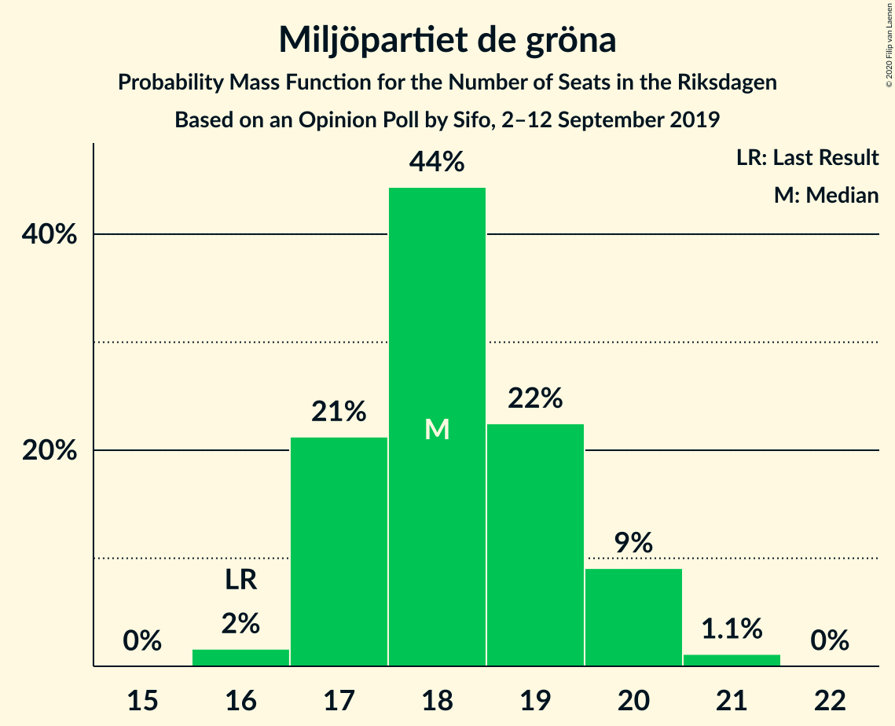
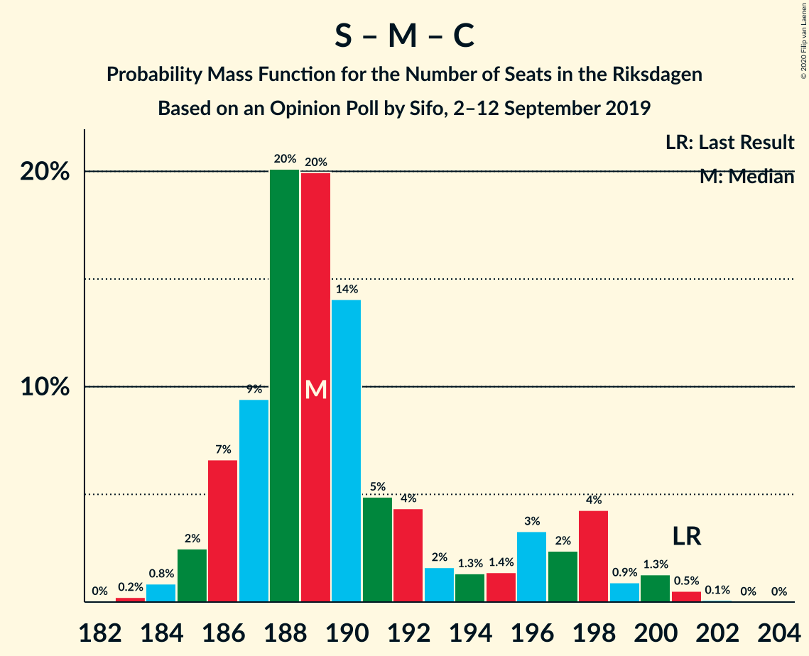
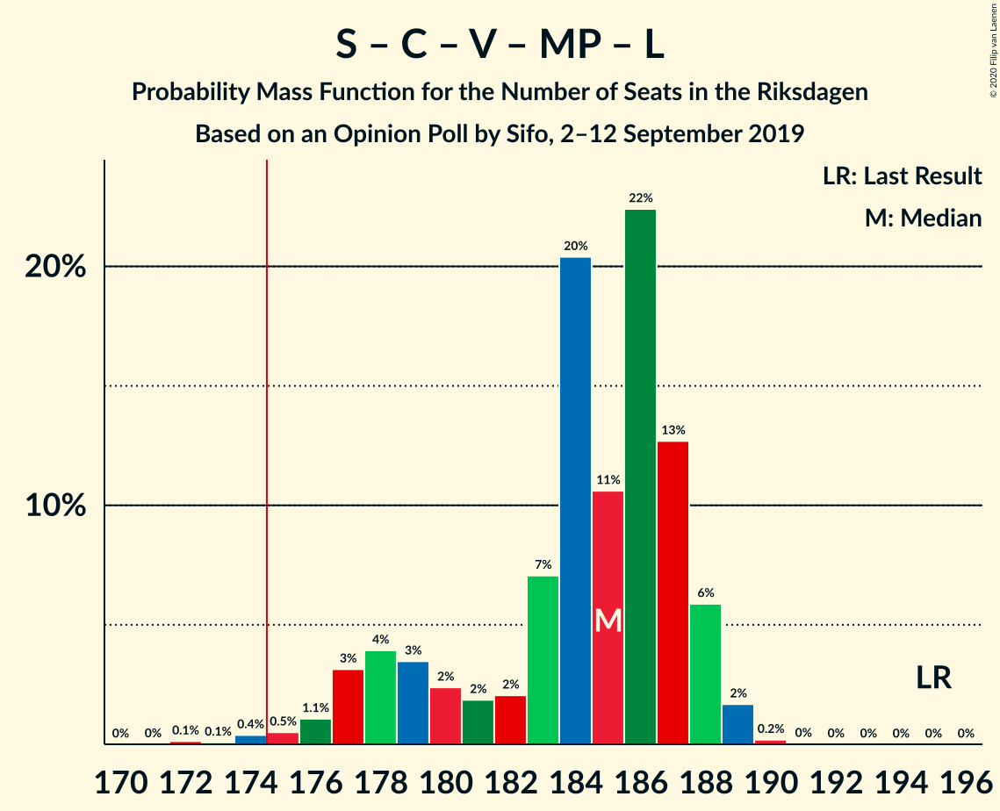

# Opinion Poll by Sifo, 2–12 September 2019

<a href="#voting-intentions">Voting Intentions</a> | <a href="#seats">Seats</a> | <a href="#coalitions">Coalitions</a> | <a href="#technical-information">Technical Information</a>

## Voting Intentions

### Confidence Intervals

| Party | Last Result | Poll Result | 80% Confidence Interval | 90% Confidence Interval | 95% Confidence Interval | 99% Confidence Interval |
|:-----:|:-----------:|:-----------:|:-----------------------:|:-----------------------:|:-----------------------:|:-----------------------:|
| Sveriges socialdemokratiska arbetareparti | 28.3% | 25.8% | 25.2–26.4% |25.0–26.6% |24.9–26.7% |24.6–27.0% |
| Sverigedemokraterna | 17.5% | 20.2% | 19.6–20.7% |19.5–20.9% |19.4–21.0% |19.1–21.3% |
| Moderata samlingspartiet | 19.8% | 18.9% | 18.4–19.4% |18.2–19.6% |18.1–19.7% |17.8–20.0% |
| Centerpartiet | 8.6% | 8.6% | 8.2–9.0% |8.1–9.1% |8.0–9.2% |7.8–9.4% |
| Vänsterpartiet | 8.0% | 8.5% | 8.1–8.9% |8.0–9.0% |7.9–9.1% |7.8–9.3% |
| Kristdemokraterna | 6.3% | 7.3% | 7.0–7.7% |6.9–7.8% |6.8–7.9% |6.6–8.0% |
| Miljöpartiet de gröna | 4.4% | 5.1% | 4.8–5.4% |4.7–5.5% |4.6–5.6% |4.5–5.7% |
| Liberalerna | 5.5% | 4.2% | 3.9–4.5% |3.9–4.6% |3.8–4.6% |3.7–4.8% |

*Note:* The poll result column reflects the actual value used in the calculations. Published results may vary slightly, and in addition be rounded to fewer digits.

## Seats

### Confidence Intervals

| Party | Last Result | Median | 80% Confidence Interval | 90% Confidence Interval | 95% Confidence Interval | 99% Confidence Interval |
|:-----:|:-----------:|:------:|:-----------------------:|:-----------------------:|:-----------------------:|:-----------------------:|
| <a href="#sveriges-socialdemokratiska-arbetareparti">Sveriges socialdemokratiska arbetareparti</a> | 100 | 91 | 90–95 |89–96 |89–97 |87–99 |
| <a href="#sverigedemokraterna">Sverigedemokraterna</a> | 62 | 71 | 70–74 |69–76 |69–76 |68–77 |
| <a href="#moderata-samlingspartiet">Moderata samlingspartiet</a> | 70 | 67 | 65–70 |65–71 |64–71 |63–73 |
| <a href="#centerpartiet">Centerpartiet</a> | 31 | 31 | 29–32 |29–33 |29–33 |28–34 |
| <a href="#vänsterpartiet">Vänsterpartiet</a> | 28 | 31 | 29–32 |29–32 |28–33 |28–34 |
| <a href="#kristdemokraterna">Kristdemokraterna</a> | 22 | 26 | 25–27 |24–28 |24–28 |24–29 |
| <a href="#miljöpartiet-de-gröna">Miljöpartiet de gröna</a> | 16 | 18 | 17–20 |17–20 |17–20 |16–21 |
| <a href="#liberalerna">Liberalerna</a> | 20 | 15 | 0–16 |0–16 |0–16 |0–17 |

### Sveriges socialdemokratiska arbetareparti

*For a full overview of the results for this party, see the [Sveriges socialdemokratiska arbetareparti](party-sverigessocialdemokratiskaarbetareparti.html) page.*

| Number of Seats | Probability | Accumulated | Special Marks |
|:---------------:|:-----------:|:-----------:|:-------------:|
| 86 | 0.1% | 100% |  |
| 87 | 0.6% | 99.9% |  |
| 88 | 1.5% | 99.3% |  |
| 89 | 6% | 98% |  |
| 90 | 26% | 92% |  |
| 91 | 19% | 66% | Median |
| 92 | 15% | 47% |  |
| 93 | 10% | 32% |  |
| 94 | 7% | 22% |  |
| 95 | 6% | 14% |  |
| 96 | 4% | 9% |  |
| 97 | 3% | 4% |  |
| 98 | 0.9% | 1.5% |  |
| 99 | 0.4% | 0.6% |  |
| 100 | 0.1% | 0.1% | Last Result |
| 101 | 0.1% | 0.1% |  |
| 102 | 0% | 0% |  |

### Sverigedemokraterna

*For a full overview of the results for this party, see the [Sverigedemokraterna](party-sverigedemokraterna.html) page.*

| Number of Seats | Probability | Accumulated | Special Marks |
|:---------------:|:-----------:|:-----------:|:-------------:|
| 62 | 0% | 100% | Last Result |
| 63 | 0% | 100% |  |
| 64 | 0% | 100% |  |
| 65 | 0% | 100% |  |
| 66 | 0% | 100% |  |
| 67 | 0.2% | 100% |  |
| 68 | 2% | 99.7% |  |
| 69 | 6% | 98% |  |
| 70 | 19% | 92% |  |
| 71 | 24% | 73% | Median |
| 72 | 20% | 49% |  |
| 73 | 10% | 29% |  |
| 74 | 10% | 19% |  |
| 75 | 3% | 9% |  |
| 76 | 4% | 5% |  |
| 77 | 0.8% | 1.0% |  |
| 78 | 0.2% | 0.3% |  |
| 79 | 0.1% | 0.1% |  |
| 80 | 0% | 0% |  |

### Moderata samlingspartiet

*For a full overview of the results for this party, see the [Moderata samlingspartiet](party-moderatasamlingspartiet.html) page.*

| Number of Seats | Probability | Accumulated | Special Marks |
|:---------------:|:-----------:|:-----------:|:-------------:|
| 62 | 0.1% | 100% |  |
| 63 | 0.7% | 99.9% |  |
| 64 | 2% | 99.2% |  |
| 65 | 16% | 97% |  |
| 66 | 12% | 81% |  |
| 67 | 24% | 69% | Median |
| 68 | 12% | 45% |  |
| 69 | 22% | 33% |  |
| 70 | 3% | 11% | Last Result |
| 71 | 6% | 7% |  |
| 72 | 1.0% | 2% |  |
| 73 | 0.6% | 0.7% |  |
| 74 | 0% | 0.1% |  |
| 75 | 0% | 0% |  |

### Centerpartiet

*For a full overview of the results for this party, see the [Centerpartiet](party-centerpartiet.html) page.*

| Number of Seats | Probability | Accumulated | Special Marks |
|:---------------:|:-----------:|:-----------:|:-------------:|
| 27 | 0.1% | 100% |  |
| 28 | 2% | 99.9% |  |
| 29 | 9% | 98% |  |
| 30 | 28% | 89% |  |
| 31 | 36% | 60% | Last Result, Median |
| 32 | 16% | 24% |  |
| 33 | 7% | 8% |  |
| 34 | 1.2% | 1.3% |  |
| 35 | 0.1% | 0.1% |  |
| 36 | 0% | 0% |  |

### Vänsterpartiet

*For a full overview of the results for this party, see the [Vänsterpartiet](party-vänsterpartiet.html) page.*

| Number of Seats | Probability | Accumulated | Special Marks |
|:---------------:|:-----------:|:-----------:|:-------------:|
| 27 | 0.3% | 100% |  |
| 28 | 3% | 99.7% | Last Result |
| 29 | 11% | 97% |  |
| 30 | 32% | 86% |  |
| 31 | 28% | 54% | Median |
| 32 | 22% | 26% |  |
| 33 | 4% | 4% |  |
| 34 | 0.8% | 0.9% |  |
| 35 | 0% | 0% |  |

### Kristdemokraterna

*For a full overview of the results for this party, see the [Kristdemokraterna](party-kristdemokraterna.html) page.*

| Number of Seats | Probability | Accumulated | Special Marks |
|:---------------:|:-----------:|:-----------:|:-------------:|
| 22 | 0% | 100% | Last Result |
| 23 | 0.4% | 100% |  |
| 24 | 9% | 99.6% |  |
| 25 | 28% | 91% |  |
| 26 | 46% | 63% | Median |
| 27 | 12% | 17% |  |
| 28 | 4% | 5% |  |
| 29 | 0.7% | 0.9% |  |
| 30 | 0.2% | 0.2% |  |
| 31 | 0% | 0% |  |

### Miljöpartiet de gröna

*For a full overview of the results for this party, see the [Miljöpartiet de gröna](party-miljöpartietdegröna.html) page.*

| Number of Seats | Probability | Accumulated | Special Marks |
|:---------------:|:-----------:|:-----------:|:-------------:|
| 16 | 1.3% | 100% | Last Result |
| 17 | 20% | 98.7% |  |
| 18 | 48% | 79% | Median |
| 19 | 20% | 31% |  |
| 20 | 11% | 12% |  |
| 21 | 0.7% | 0.7% |  |
| 22 | 0.1% | 0.1% |  |
| 23 | 0% | 0% |  |

### Liberalerna

*For a full overview of the results for this party, see the [Liberalerna](party-liberalerna.html) page.*

| Number of Seats | Probability | Accumulated | Special Marks |
|:---------------:|:-----------:|:-----------:|:-------------:|
| 0 | 18% | 100% |  |
| 1 | 0% | 82% |  |
| 2 | 0% | 82% |  |
| 3 | 0% | 82% |  |
| 4 | 0% | 82% |  |
| 5 | 0% | 82% |  |
| 6 | 0% | 82% |  |
| 7 | 0% | 82% |  |
| 8 | 0% | 82% |  |
| 9 | 0% | 82% |  |
| 10 | 0% | 82% |  |
| 11 | 0% | 82% |  |
| 12 | 0% | 82% |  |
| 13 | 0% | 82% |  |
| 14 | 11% | 82% |  |
| 15 | 48% | 71% | Median |
| 16 | 21% | 23% |  |
| 17 | 2% | 2% |  |
| 18 | 0% | 0% |  |
| 19 | 0% | 0% |  |
| 20 | 0% | 0% | Last Result |

## Coalitions

### Confidence Intervals

| Coalition | Last Result | Median | Majority? | 80% Confidence Interval | 90% Confidence Interval | 95% Confidence Interval | 99% Confidence Interval |
|:---------:|:-----------:|:------:|:---------:|:-----------------------:|:-----------------------:|:-----------------------:|:-----------------------:|
| Sveriges socialdemokratiska arbetareparti – Moderata samlingspartiet – Centerpartiet | 201 | 189 | 100% | 186–197 | 186–198 | 186–199 | 184–201 |
| Sveriges socialdemokratiska arbetareparti – Centerpartiet – Vänsterpartiet – Miljöpartiet de gröna – Liberalerna | 195 | 184 | 99.3% | 179–187 | 178–188 | 177–188 | 174–189 |
| Sverigedemokraterna – Moderata samlingspartiet – Kristdemokraterna | 154 | 165 | 0.7% | 162–170 | 161–171 | 161–172 | 160–175 |
| Sveriges socialdemokratiska arbetareparti – Moderata samlingspartiet | 170 | 159 | 0% | 156–165 | 155–165 | 154–167 | 153–169 |
| Sveriges socialdemokratiska arbetareparti – Centerpartiet – Miljöpartiet de gröna – Liberalerna | 167 | 154 | 0% | 146–158 | 146–158 | 145–159 | 143–159 |
| Sveriges socialdemokratiska arbetareparti – Vänsterpartiet – Miljöpartiet de gröna | 144 | 140 | 0% | 138–145 | 137–147 | 137–148 | 135–150 |
| Sverigedemokraterna – Moderata samlingspartiet | 132 | 139 | 0% | 136–144 | 135–145 | 134–146 | 133–148 |
| Moderata samlingspartiet – Centerpartiet – Kristdemokraterna – Liberalerna | 143 | 138 | 0% | 128–140 | 127–141 | 126–141 | 125–143 |
| Moderata samlingspartiet – Centerpartiet – Kristdemokraterna | 123 | 123 | 0% | 121–128 | 120–130 | 120–130 | 119–132 |
| Sveriges socialdemokratiska arbetareparti – Vänsterpartiet | 128 | 122 | 0% | 120–127 | 119–129 | 119–129 | 117–131 |
| Sveriges socialdemokratiska arbetareparti – Miljöpartiet de gröna | 116 | 109 | 0% | 107–114 | 107–115 | 107–116 | 106–118 |
| Moderata samlingspartiet – Centerpartiet – Liberalerna | 121 | 112 | 0% | 102–115 | 101–115 | 99–116 | 99–117 |
| Moderata samlingspartiet – Centerpartiet | 101 | 98 | 0% | 95–101 | 95–103 | 94–104 | 93–105 |

### Sveriges socialdemokratiska arbetareparti – Moderata samlingspartiet – Centerpartiet

| Number of Seats | Probability | Accumulated | Special Marks |
|:---------------:|:-----------:|:-----------:|:-------------:|
| 183 | 0.2% | 100% |  |
| 184 | 1.1% | 99.7% |  |
| 185 | 1.1% | 98.7% |  |
| 186 | 9% | 98% |  |
| 187 | 9% | 89% |  |
| 188 | 17% | 80% |  |
| 189 | 19% | 63% | Median |
| 190 | 18% | 44% |  |
| 191 | 5% | 26% |  |
| 192 | 1.5% | 21% |  |
| 193 | 2% | 19% |  |
| 194 | 1.4% | 18% |  |
| 195 | 1.0% | 16% |  |
| 196 | 5% | 15% |  |
| 197 | 2% | 10% |  |
| 198 | 5% | 8% |  |
| 199 | 1.5% | 3% |  |
| 200 | 0.9% | 2% |  |
| 201 | 0.7% | 0.8% | Last Result |
| 202 | 0.1% | 0.1% |  |
| 203 | 0% | 0% |  |

### Sveriges socialdemokratiska arbetareparti – Centerpartiet – Vänsterpartiet – Miljöpartiet de gröna – Liberalerna

| Number of Seats | Probability | Accumulated | Special Marks |
|:---------------:|:-----------:|:-----------:|:-------------:|
| 172 | 0.1% | 100% |  |
| 173 | 0.1% | 99.9% |  |
| 174 | 0.5% | 99.8% |  |
| 175 | 0.3% | 99.3% | Majority |
| 176 | 1.3% | 98.9% |  |
| 177 | 3% | 98% |  |
| 178 | 5% | 95% |  |
| 179 | 6% | 90% |  |
| 180 | 1.4% | 85% |  |
| 181 | 3% | 83% |  |
| 182 | 2% | 80% |  |
| 183 | 5% | 79% |  |
| 184 | 25% | 73% |  |
| 185 | 9% | 48% |  |
| 186 | 15% | 39% | Median |
| 187 | 16% | 24% |  |
| 188 | 6% | 8% |  |
| 189 | 2% | 2% |  |
| 190 | 0.2% | 0.2% |  |
| 191 | 0% | 0% |  |
| 192 | 0% | 0% |  |
| 193 | 0% | 0% |  |
| 194 | 0% | 0% |  |
| 195 | 0% | 0% | Last Result |

### Sverigedemokraterna – Moderata samlingspartiet – Kristdemokraterna

| Number of Seats | Probability | Accumulated | Special Marks |
|:---------------:|:-----------:|:-----------:|:-------------:|
| 154 | 0% | 100% | Last Result |
| 155 | 0% | 100% |  |
| 156 | 0% | 100% |  |
| 157 | 0% | 100% |  |
| 158 | 0% | 100% |  |
| 159 | 0.2% | 100% |  |
| 160 | 2% | 99.8% |  |
| 161 | 6% | 98% |  |
| 162 | 16% | 92% |  |
| 163 | 15% | 76% |  |
| 164 | 9% | 61% | Median |
| 165 | 25% | 52% |  |
| 166 | 5% | 27% |  |
| 167 | 2% | 21% |  |
| 168 | 3% | 20% |  |
| 169 | 1.4% | 17% |  |
| 170 | 6% | 15% |  |
| 171 | 5% | 10% |  |
| 172 | 3% | 5% |  |
| 173 | 1.3% | 2% |  |
| 174 | 0.3% | 1.1% |  |
| 175 | 0.5% | 0.7% | Majority |
| 176 | 0.1% | 0.2% |  |
| 177 | 0.1% | 0.1% |  |
| 178 | 0% | 0% |  |

### Sveriges socialdemokratiska arbetareparti – Moderata samlingspartiet

| Number of Seats | Probability | Accumulated | Special Marks |
|:---------------:|:-----------:|:-----------:|:-------------:|
| 152 | 0.1% | 100% |  |
| 153 | 0.6% | 99.9% |  |
| 154 | 2% | 99.3% |  |
| 155 | 3% | 97% |  |
| 156 | 7% | 95% |  |
| 157 | 16% | 87% |  |
| 158 | 19% | 72% | Median |
| 159 | 24% | 53% |  |
| 160 | 7% | 28% |  |
| 161 | 2% | 22% |  |
| 162 | 2% | 20% |  |
| 163 | 2% | 18% |  |
| 164 | 3% | 16% |  |
| 165 | 8% | 13% |  |
| 166 | 1.3% | 5% |  |
| 167 | 2% | 4% |  |
| 168 | 0.4% | 1.2% |  |
| 169 | 0.4% | 0.8% |  |
| 170 | 0.3% | 0.4% | Last Result |
| 171 | 0% | 0.1% |  |
| 172 | 0% | 0% |  |

### Sveriges socialdemokratiska arbetareparti – Centerpartiet – Miljöpartiet de gröna – Liberalerna

| Number of Seats | Probability | Accumulated | Special Marks |
|:---------------:|:-----------:|:-----------:|:-------------:|
| 141 | 0.1% | 100% |  |
| 142 | 0.3% | 99.9% |  |
| 143 | 0.5% | 99.7% |  |
| 144 | 1.4% | 99.2% |  |
| 145 | 2% | 98% |  |
| 146 | 6% | 96% |  |
| 147 | 5% | 90% |  |
| 148 | 0.8% | 85% |  |
| 149 | 1.0% | 84% |  |
| 150 | 0.7% | 83% |  |
| 151 | 1.5% | 82% |  |
| 152 | 3% | 81% |  |
| 153 | 16% | 78% |  |
| 154 | 19% | 61% |  |
| 155 | 17% | 42% | Median |
| 156 | 8% | 25% |  |
| 157 | 6% | 17% |  |
| 158 | 8% | 11% |  |
| 159 | 3% | 3% |  |
| 160 | 0.3% | 0.3% |  |
| 161 | 0.1% | 0.1% |  |
| 162 | 0% | 0% |  |
| 163 | 0% | 0% |  |
| 164 | 0% | 0% |  |
| 165 | 0% | 0% |  |
| 166 | 0% | 0% |  |
| 167 | 0% | 0% | Last Result |

### Sveriges socialdemokratiska arbetareparti – Vänsterpartiet – Miljöpartiet de gröna

| Number of Seats | Probability | Accumulated | Special Marks |
|:---------------:|:-----------:|:-----------:|:-------------:|
| 133 | 0.1% | 100% |  |
| 134 | 0.2% | 99.9% |  |
| 135 | 0.5% | 99.8% |  |
| 136 | 2% | 99.2% |  |
| 137 | 3% | 98% |  |
| 138 | 21% | 95% |  |
| 139 | 13% | 74% |  |
| 140 | 17% | 61% | Median |
| 141 | 17% | 44% |  |
| 142 | 7% | 27% |  |
| 143 | 2% | 20% |  |
| 144 | 2% | 18% | Last Result |
| 145 | 6% | 15% |  |
| 146 | 0.8% | 10% |  |
| 147 | 4% | 9% |  |
| 148 | 3% | 4% |  |
| 149 | 0.5% | 1.0% |  |
| 150 | 0.4% | 0.5% |  |
| 151 | 0.1% | 0.1% |  |
| 152 | 0% | 0% |  |

### Sverigedemokraterna – Moderata samlingspartiet

| Number of Seats | Probability | Accumulated | Special Marks |
|:---------------:|:-----------:|:-----------:|:-------------:|
| 132 | 0% | 100% | Last Result |
| 133 | 0.5% | 100% |  |
| 134 | 2% | 99.5% |  |
| 135 | 5% | 97% |  |
| 136 | 14% | 93% |  |
| 137 | 13% | 79% |  |
| 138 | 8% | 66% | Median |
| 139 | 12% | 58% |  |
| 140 | 24% | 46% |  |
| 141 | 4% | 22% |  |
| 142 | 2% | 18% |  |
| 143 | 4% | 16% |  |
| 144 | 4% | 12% |  |
| 145 | 5% | 8% |  |
| 146 | 0.8% | 3% |  |
| 147 | 1.4% | 2% |  |
| 148 | 0.4% | 0.6% |  |
| 149 | 0.1% | 0.2% |  |
| 150 | 0% | 0% |  |

### Moderata samlingspartiet – Centerpartiet – Kristdemokraterna – Liberalerna

| Number of Seats | Probability | Accumulated | Special Marks |
|:---------------:|:-----------:|:-----------:|:-------------:|
| 124 | 0.1% | 100% |  |
| 125 | 2% | 99.8% |  |
| 126 | 0.8% | 98% |  |
| 127 | 2% | 97% |  |
| 128 | 5% | 95% |  |
| 129 | 1.4% | 90% |  |
| 130 | 5% | 89% |  |
| 131 | 0.8% | 84% |  |
| 132 | 0.8% | 83% |  |
| 133 | 0.6% | 82% |  |
| 134 | 0.7% | 82% |  |
| 135 | 3% | 81% |  |
| 136 | 8% | 79% |  |
| 137 | 16% | 71% |  |
| 138 | 17% | 55% |  |
| 139 | 16% | 38% | Median |
| 140 | 16% | 21% |  |
| 141 | 3% | 5% |  |
| 142 | 1.3% | 2% |  |
| 143 | 0.4% | 0.5% | Last Result |
| 144 | 0.1% | 0.1% |  |
| 145 | 0% | 0% |  |

### Moderata samlingspartiet – Centerpartiet – Kristdemokraterna

| Number of Seats | Probability | Accumulated | Special Marks |
|:---------------:|:-----------:|:-----------:|:-------------:|
| 117 | 0.1% | 100% |  |
| 118 | 0.2% | 99.9% |  |
| 119 | 1.2% | 99.7% |  |
| 120 | 4% | 98.5% |  |
| 121 | 11% | 95% |  |
| 122 | 9% | 84% |  |
| 123 | 27% | 75% | Last Result |
| 124 | 12% | 49% | Median |
| 125 | 17% | 36% |  |
| 126 | 3% | 19% |  |
| 127 | 4% | 17% |  |
| 128 | 5% | 13% |  |
| 129 | 1.5% | 8% |  |
| 130 | 5% | 6% |  |
| 131 | 0.8% | 2% |  |
| 132 | 0.8% | 0.9% |  |
| 133 | 0.1% | 0.2% |  |
| 134 | 0% | 0% |  |

### Sveriges socialdemokratiska arbetareparti – Vänsterpartiet

| Number of Seats | Probability | Accumulated | Special Marks |
|:---------------:|:-----------:|:-----------:|:-------------:|
| 116 | 0.1% | 100% |  |
| 117 | 0.8% | 99.9% |  |
| 118 | 1.5% | 99.0% |  |
| 119 | 3% | 98% |  |
| 120 | 22% | 94% |  |
| 121 | 14% | 72% |  |
| 122 | 10% | 59% | Median |
| 123 | 26% | 49% |  |
| 124 | 4% | 23% |  |
| 125 | 2% | 19% |  |
| 126 | 5% | 16% |  |
| 127 | 4% | 11% |  |
| 128 | 1.1% | 7% | Last Result |
| 129 | 5% | 6% |  |
| 130 | 0.3% | 0.9% |  |
| 131 | 0.5% | 0.6% |  |
| 132 | 0.1% | 0.1% |  |
| 133 | 0% | 0% |  |

### Sveriges socialdemokratiska arbetareparti – Miljöpartiet de gröna

| Number of Seats | Probability | Accumulated | Special Marks |
|:---------------:|:-----------:|:-----------:|:-------------:|
| 104 | 0.2% | 100% |  |
| 105 | 0.2% | 99.8% |  |
| 106 | 2% | 99.5% |  |
| 107 | 10% | 98% |  |
| 108 | 18% | 88% |  |
| 109 | 25% | 70% | Median |
| 110 | 8% | 45% |  |
| 111 | 13% | 37% |  |
| 112 | 6% | 24% |  |
| 113 | 6% | 19% |  |
| 114 | 5% | 12% |  |
| 115 | 3% | 7% |  |
| 116 | 3% | 5% | Last Result |
| 117 | 1.0% | 2% |  |
| 118 | 0.2% | 0.6% |  |
| 119 | 0.3% | 0.3% |  |
| 120 | 0.1% | 0.1% |  |
| 121 | 0% | 0% |  |

### Moderata samlingspartiet – Centerpartiet – Liberalerna

| Number of Seats | Probability | Accumulated | Special Marks |
|:---------------:|:-----------:|:-----------:|:-------------:|
| 97 | 0.1% | 100% |  |
| 98 | 0.3% | 99.9% |  |
| 99 | 3% | 99.6% |  |
| 100 | 2% | 97% |  |
| 101 | 4% | 95% |  |
| 102 | 2% | 92% |  |
| 103 | 2% | 89% |  |
| 104 | 4% | 87% |  |
| 105 | 0.5% | 83% |  |
| 106 | 0.2% | 83% |  |
| 107 | 0.1% | 82% |  |
| 108 | 1.0% | 82% |  |
| 109 | 1.0% | 81% |  |
| 110 | 7% | 80% |  |
| 111 | 14% | 73% |  |
| 112 | 15% | 59% |  |
| 113 | 19% | 44% | Median |
| 114 | 7% | 25% |  |
| 115 | 15% | 18% |  |
| 116 | 2% | 3% |  |
| 117 | 0.4% | 0.6% |  |
| 118 | 0.1% | 0.1% |  |
| 119 | 0% | 0% |  |
| 120 | 0% | 0% |  |
| 121 | 0% | 0% | Last Result |

### Moderata samlingspartiet – Centerpartiet

| Number of Seats | Probability | Accumulated | Special Marks |
|:---------------:|:-----------:|:-----------:|:-------------:|
| 92 | 0.1% | 100% |  |
| 93 | 0.8% | 99.9% |  |
| 94 | 3% | 99.1% |  |
| 95 | 6% | 96% |  |
| 96 | 10% | 90% |  |
| 97 | 28% | 80% |  |
| 98 | 12% | 52% | Median |
| 99 | 10% | 40% |  |
| 100 | 15% | 30% |  |
| 101 | 5% | 15% | Last Result |
| 102 | 3% | 10% |  |
| 103 | 2% | 7% |  |
| 104 | 4% | 5% |  |
| 105 | 0.5% | 0.6% |  |
| 106 | 0.2% | 0.2% |  |
| 107 | 0% | 0% |  |

## Technical Information

### Opinion Poll

+ **Polling firm:** Sifo
+ **Commissioner(s):** —
+ **Fieldwork period:** 2–12 September 2019

### Calculations

+ **Sample size:** 8949
+ **Simulations done:** 524,288
+ **Error estimate:** 0.53%

