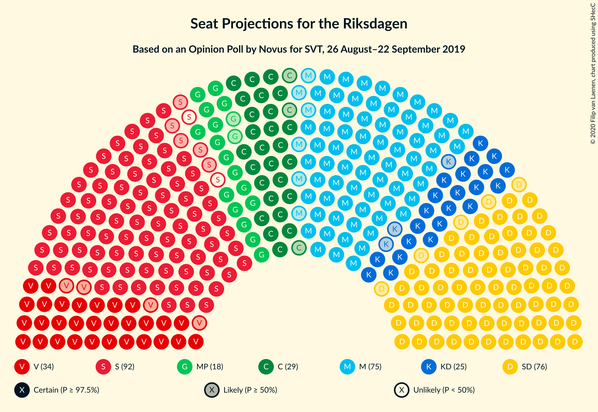
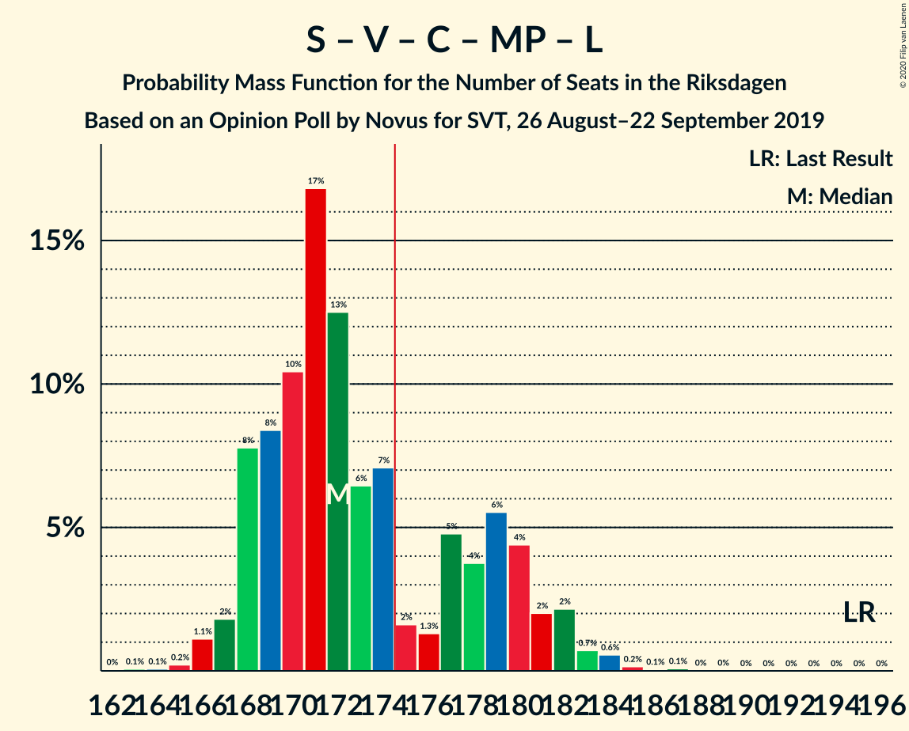

# Opinion Poll by Novus for SVT, 26 August–22 September 2019

<a href="#voting-intentions">Voting Intentions</a> | <a href="#seats">Seats</a> | <a href="#coalitions">Coalitions</a> | <a href="#technical-information">Technical Information</a>

## Voting Intentions

### Confidence Intervals

| Party | Last Result | Poll Result | 80% Confidence Interval | 90% Confidence Interval | 95% Confidence Interval | 99% Confidence Interval |
|:-----:|:-----------:|:-----------:|:-----------------------:|:-----------------------:|:-----------------------:|:-----------------------:|
| Sveriges socialdemokratiska arbetareparti | 28.3% | 24.7% | 23.7–25.6% |23.5–25.8% |23.3–26.1% |22.9–26.5% |
| Sverigedemokraterna | 17.5% | 20.7% | 19.8–21.6% |19.6–21.8% |19.4–22.0% |19.0–22.4% |
| Moderata samlingspartiet | 19.8% | 20.4% | 19.5–21.2% |19.3–21.5% |19.1–21.7% |18.7–22.1% |
| Vänsterpartiet | 8.0% | 9.2% | 8.6–9.8% |8.4–10.0% |8.3–10.2% |8.0–10.5% |
| Centerpartiet | 8.6% | 8.0% | 7.4–8.6% |7.3–8.8% |7.2–8.9% |6.9–9.2% |
| Kristdemokraterna | 6.3% | 6.8% | 6.3–7.3% |6.1–7.5% |6.0–7.6% |5.8–7.9% |
| Miljöpartiet de gröna | 4.4% | 5.0% | 4.5–5.5% |4.4–5.6% |4.3–5.7% |4.1–6.0% |
| Liberalerna | 5.5% | 3.6% | 3.2–4.0% |3.1–4.2% |3.0–4.3% |2.9–4.5% |

*Note:* The poll result column reflects the actual value used in the calculations. Published results may vary slightly, and in addition be rounded to fewer digits.

## Seats

### Confidence Intervals

| Party | Last Result | Median | 80% Confidence Interval | 90% Confidence Interval | 95% Confidence Interval | 99% Confidence Interval |
|:-----:|:-----------:|:------:|:-----------------------:|:-----------------------:|:-----------------------:|:-----------------------:|
| <a href="#sveriges-socialdemokratiska-arbetareparti">Sveriges socialdemokratiska arbetareparti</a> | 100 | 92 | 87–94 |85–96 |82–96 |82–98 |
| <a href="#sverigedemokraterna">Sverigedemokraterna</a> | 62 | 76 | 72–79 |71–80 |70–81 |68–83 |
| <a href="#moderata-samlingspartiet">Moderata samlingspartiet</a> | 70 | 74 | 71–78 |71–79 |69–80 |68–82 |
| <a href="#vänsterpartiet">Vänsterpartiet</a> | 28 | 34 | 31–36 |31–37 |30–37 |29–38 |
| <a href="#centerpartiet">Centerpartiet</a> | 31 | 30 | 28–31 |27–31 |26–32 |25–34 |
| <a href="#kristdemokraterna">Kristdemokraterna</a> | 22 | 24 | 22–27 |22–27 |22–28 |20–30 |
| <a href="#miljöpartiet-de-gröna">Miljöpartiet de gröna</a> | 16 | 19 | 17–21 |16–21 |16–21 |15–22 |
| <a href="#liberalerna">Liberalerna</a> | 20 | 0 | 0 |0–14 |0–15 |0–16 |

### Sveriges socialdemokratiska arbetareparti

*For a full overview of the results for this party, see the [Sveriges socialdemokratiska arbetareparti](party-sverigessocialdemokratiskaarbetareparti.html) page.*

| Number of Seats | Probability | Accumulated | Special Marks |
|:---------------:|:-----------:|:-----------:|:-------------:|
| 81 | 0.1% | 100% |  |
| 82 | 3% | 99.9% |  |
| 83 | 0.8% | 97% |  |
| 84 | 0.7% | 96% |  |
| 85 | 1.3% | 95% |  |
| 86 | 1.3% | 94% |  |
| 87 | 6% | 93% |  |
| 88 | 12% | 86% |  |
| 89 | 7% | 74% |  |
| 90 | 2% | 68% |  |
| 91 | 7% | 65% |  |
| 92 | 20% | 58% | Median |
| 93 | 12% | 38% |  |
| 94 | 16% | 26% |  |
| 95 | 4% | 9% |  |
| 96 | 4% | 5% |  |
| 97 | 0.8% | 2% |  |
| 98 | 0.4% | 0.8% |  |
| 99 | 0.3% | 0.4% |  |
| 100 | 0.1% | 0.2% | Last Result |
| 101 | 0% | 0% |  |

### Sverigedemokraterna

*For a full overview of the results for this party, see the [Sverigedemokraterna](party-sverigedemokraterna.html) page.*

| Number of Seats | Probability | Accumulated | Special Marks |
|:---------------:|:-----------:|:-----------:|:-------------:|
| 62 | 0% | 100% | Last Result |
| 63 | 0% | 100% |  |
| 64 | 0% | 100% |  |
| 65 | 0% | 100% |  |
| 66 | 0% | 100% |  |
| 67 | 0.1% | 100% |  |
| 68 | 0.4% | 99.9% |  |
| 69 | 0.7% | 99.5% |  |
| 70 | 2% | 98.8% |  |
| 71 | 6% | 96% |  |
| 72 | 4% | 90% |  |
| 73 | 15% | 86% |  |
| 74 | 16% | 71% |  |
| 75 | 5% | 55% |  |
| 76 | 20% | 50% | Median |
| 77 | 12% | 30% |  |
| 78 | 6% | 18% |  |
| 79 | 2% | 12% |  |
| 80 | 7% | 10% |  |
| 81 | 0.9% | 3% |  |
| 82 | 2% | 2% |  |
| 83 | 0.3% | 0.5% |  |
| 84 | 0.1% | 0.2% |  |
| 85 | 0.1% | 0.2% |  |
| 86 | 0.1% | 0.1% |  |
| 87 | 0% | 0% |  |

### Moderata samlingspartiet

*For a full overview of the results for this party, see the [Moderata samlingspartiet](party-moderatasamlingspartiet.html) page.*

| Number of Seats | Probability | Accumulated | Special Marks |
|:---------------:|:-----------:|:-----------:|:-------------:|
| 64 | 0.1% | 100% |  |
| 65 | 0% | 99.9% |  |
| 66 | 0% | 99.9% |  |
| 67 | 0.3% | 99.9% |  |
| 68 | 0.4% | 99.6% |  |
| 69 | 2% | 99.2% |  |
| 70 | 2% | 97% | Last Result |
| 71 | 13% | 95% |  |
| 72 | 11% | 82% |  |
| 73 | 14% | 71% |  |
| 74 | 18% | 57% | Median |
| 75 | 8% | 39% |  |
| 76 | 12% | 31% |  |
| 77 | 4% | 20% |  |
| 78 | 8% | 15% |  |
| 79 | 4% | 7% |  |
| 80 | 0.8% | 3% |  |
| 81 | 1.4% | 2% |  |
| 82 | 0.3% | 0.5% |  |
| 83 | 0.2% | 0.2% |  |
| 84 | 0% | 0% |  |

### Vänsterpartiet

*For a full overview of the results for this party, see the [Vänsterpartiet](party-vänsterpartiet.html) page.*

| Number of Seats | Probability | Accumulated | Special Marks |
|:---------------:|:-----------:|:-----------:|:-------------:|
| 28 | 0.1% | 100% | Last Result |
| 29 | 0.8% | 99.9% |  |
| 30 | 2% | 99.2% |  |
| 31 | 7% | 97% |  |
| 32 | 9% | 90% |  |
| 33 | 21% | 80% |  |
| 34 | 17% | 59% | Median |
| 35 | 25% | 43% |  |
| 36 | 10% | 18% |  |
| 37 | 7% | 8% |  |
| 38 | 0.7% | 0.8% |  |
| 39 | 0.1% | 0.1% |  |
| 40 | 0% | 0.1% |  |
| 41 | 0% | 0% |  |

### Centerpartiet

*For a full overview of the results for this party, see the [Centerpartiet](party-centerpartiet.html) page.*

| Number of Seats | Probability | Accumulated | Special Marks |
|:---------------:|:-----------:|:-----------:|:-------------:|
| 23 | 0.1% | 100% |  |
| 24 | 0.3% | 99.9% |  |
| 25 | 2% | 99.6% |  |
| 26 | 2% | 98% |  |
| 27 | 1.0% | 96% |  |
| 28 | 7% | 95% |  |
| 29 | 23% | 88% |  |
| 30 | 33% | 65% | Median |
| 31 | 28% | 32% | Last Result |
| 32 | 3% | 4% |  |
| 33 | 0.3% | 1.0% |  |
| 34 | 0.4% | 0.7% |  |
| 35 | 0.2% | 0.3% |  |
| 36 | 0.1% | 0.1% |  |
| 37 | 0% | 0% |  |

### Kristdemokraterna

*For a full overview of the results for this party, see the [Kristdemokraterna](party-kristdemokraterna.html) page.*

| Number of Seats | Probability | Accumulated | Special Marks |
|:---------------:|:-----------:|:-----------:|:-------------:|
| 20 | 0.6% | 100% |  |
| 21 | 1.3% | 99.4% |  |
| 22 | 8% | 98% | Last Result |
| 23 | 14% | 90% |  |
| 24 | 28% | 75% | Median |
| 25 | 19% | 48% |  |
| 26 | 8% | 28% |  |
| 27 | 16% | 20% |  |
| 28 | 2% | 5% |  |
| 29 | 2% | 2% |  |
| 30 | 0.6% | 0.6% |  |
| 31 | 0% | 0% |  |

### Miljöpartiet de gröna

*For a full overview of the results for this party, see the [Miljöpartiet de gröna](party-miljöpartietdegröna.html) page.*

| Number of Seats | Probability | Accumulated | Special Marks |
|:---------------:|:-----------:|:-----------:|:-------------:|
| 0 | 0.3% | 100% |  |
| 1 | 0% | 99.7% |  |
| 2 | 0% | 99.7% |  |
| 3 | 0% | 99.7% |  |
| 4 | 0% | 99.7% |  |
| 5 | 0% | 99.7% |  |
| 6 | 0% | 99.7% |  |
| 7 | 0% | 99.7% |  |
| 8 | 0% | 99.7% |  |
| 9 | 0% | 99.7% |  |
| 10 | 0% | 99.7% |  |
| 11 | 0% | 99.7% |  |
| 12 | 0% | 99.7% |  |
| 13 | 0% | 99.7% |  |
| 14 | 0.1% | 99.7% |  |
| 15 | 1.1% | 99.6% |  |
| 16 | 5% | 98.5% | Last Result |
| 17 | 19% | 93% |  |
| 18 | 17% | 74% |  |
| 19 | 17% | 56% | Median |
| 20 | 14% | 39% |  |
| 21 | 23% | 26% |  |
| 22 | 2% | 2% |  |
| 23 | 0.3% | 0.3% |  |
| 24 | 0% | 0% |  |

### Liberalerna

*For a full overview of the results for this party, see the [Liberalerna](party-liberalerna.html) page.*

| Number of Seats | Probability | Accumulated | Special Marks |
|:---------------:|:-----------:|:-----------:|:-------------:|
| 0 | 92% | 100% | Median |
| 1 | 0% | 8% |  |
| 2 | 0% | 8% |  |
| 3 | 0% | 8% |  |
| 4 | 0% | 8% |  |
| 5 | 0% | 8% |  |
| 6 | 0% | 8% |  |
| 7 | 0% | 8% |  |
| 8 | 0% | 8% |  |
| 9 | 0% | 8% |  |
| 10 | 0% | 8% |  |
| 11 | 0% | 8% |  |
| 12 | 0% | 8% |  |
| 13 | 0% | 8% |  |
| 14 | 4% | 8% |  |
| 15 | 4% | 5% |  |
| 16 | 1.2% | 1.3% |  |
| 17 | 0.1% | 0.1% |  |
| 18 | 0% | 0% |  |
| 19 | 0% | 0% |  |
| 20 | 0% | 0% | Last Result |

## Coalitions

### Confidence Intervals

| Coalition | Last Result | Median | Majority? | 80% Confidence Interval | 90% Confidence Interval | 95% Confidence Interval | 99% Confidence Interval |
|:---------:|:-----------:|:------:|:---------:|:-----------------------:|:-----------------------:|:-----------------------:|:-----------------------:|
| Sveriges socialdemokratiska arbetareparti – Moderata samlingspartiet – Centerpartiet | 201 | 196 | 100% | 191–200 | 188–201 | 185–203 | 182–204 |
| Sverigedemokraterna – Moderata samlingspartiet – Kristdemokraterna | 154 | 172 | 28% | 170–183 | 170–183 | 168–183 | 162–184 |
| Sveriges socialdemokratiska arbetareparti – Vänsterpartiet – Centerpartiet – Miljöpartiet de gröna – Liberalerna | 195 | 177 | 72% | 166–179 | 166–179 | 166–181 | 165–187 |
| Sveriges socialdemokratiska arbetareparti – Moderata samlingspartiet | 170 | 166 | 0.2% | 161–170 | 159–171 | 157–172 | 154–174 |
| Sverigedemokraterna – Moderata samlingspartiet | 132 | 148 | 0% | 146–156 | 145–157 | 143–157 | 139–160 |
| Sveriges socialdemokratiska arbetareparti – Vänsterpartiet – Miljöpartiet de gröna | 144 | 147 | 0% | 137–149 | 135–149 | 131–149 | 129–151 |
| Sveriges socialdemokratiska arbetareparti – Centerpartiet – Miljöpartiet de gröna – Liberalerna | 167 | 142 | 0% | 134–144 | 133–146 | 133–147 | 130–155 |
| Moderata samlingspartiet – Centerpartiet – Kristdemokraterna – Liberalerna | 143 | 130 | 0% | 125–136 | 125–139 | 124–143 | 122–145 |
| Moderata samlingspartiet – Centerpartiet – Kristdemokraterna | 123 | 129 | 0% | 125–135 | 124–135 | 122–137 | 119–137 |
| Sveriges socialdemokratiska arbetareparti – Vänsterpartiet | 128 | 126 | 0% | 119–130 | 117–130 | 114–131 | 112–133 |
| Moderata samlingspartiet – Centerpartiet – Liberalerna | 121 | 104 | 0% | 101–110 | 101–116 | 100–118 | 98–120 |
| Sveriges socialdemokratiska arbetareparti – Miljöpartiet de gröna | 116 | 112 | 0% | 104–114 | 102–114 | 100–115 | 99–117 |
| Moderata samlingspartiet – Centerpartiet | 101 | 104 | 0% | 101–108 | 100–108 | 98–110 | 96–111 |

### Sveriges socialdemokratiska arbetareparti – Moderata samlingspartiet – Centerpartiet

| Number of Seats | Probability | Accumulated | Special Marks |
|:---------------:|:-----------:|:-----------:|:-------------:|
| 179 | 0.1% | 100% |  |
| 180 | 0.1% | 99.9% |  |
| 181 | 0.1% | 99.8% |  |
| 182 | 0.3% | 99.7% |  |
| 183 | 0.1% | 99.4% |  |
| 184 | 0.6% | 99.4% |  |
| 185 | 2% | 98.8% |  |
| 186 | 0.5% | 97% |  |
| 187 | 1.1% | 97% |  |
| 188 | 2% | 96% |  |
| 189 | 1.0% | 93% |  |
| 190 | 2% | 92% |  |
| 191 | 6% | 90% |  |
| 192 | 6% | 84% |  |
| 193 | 4% | 79% |  |
| 194 | 12% | 74% |  |
| 195 | 10% | 62% |  |
| 196 | 16% | 52% | Median |
| 197 | 16% | 35% |  |
| 198 | 7% | 19% |  |
| 199 | 2% | 12% |  |
| 200 | 4% | 11% |  |
| 201 | 2% | 6% | Last Result |
| 202 | 0.6% | 4% |  |
| 203 | 2% | 3% |  |
| 204 | 0.6% | 0.8% |  |
| 205 | 0% | 0.1% |  |
| 206 | 0% | 0.1% |  |
| 207 | 0% | 0.1% |  |
| 208 | 0% | 0.1% |  |
| 209 | 0% | 0% |  |

### Sverigedemokraterna – Moderata samlingspartiet – Kristdemokraterna

| Number of Seats | Probability | Accumulated | Special Marks |
|:---------------:|:-----------:|:-----------:|:-------------:|
| 154 | 0% | 100% | Last Result |
| 155 | 0% | 100% |  |
| 156 | 0% | 100% |  |
| 157 | 0% | 100% |  |
| 158 | 0% | 100% |  |
| 159 | 0% | 100% |  |
| 160 | 0.1% | 100% |  |
| 161 | 0.1% | 99.9% |  |
| 162 | 0.5% | 99.8% |  |
| 163 | 0.4% | 99.3% |  |
| 164 | 1.0% | 98.9% |  |
| 165 | 0.1% | 98% |  |
| 166 | 0% | 98% |  |
| 167 | 0.1% | 98% |  |
| 168 | 0.6% | 98% |  |
| 169 | 0.5% | 97% |  |
| 170 | 9% | 97% |  |
| 171 | 29% | 88% |  |
| 172 | 23% | 59% |  |
| 173 | 5% | 36% |  |
| 174 | 3% | 31% | Median |
| 175 | 0.9% | 28% | Majority |
| 176 | 0.4% | 27% |  |
| 177 | 0.1% | 27% |  |
| 178 | 0.4% | 27% |  |
| 179 | 1.5% | 26% |  |
| 180 | 2% | 25% |  |
| 181 | 7% | 23% |  |
| 182 | 6% | 16% |  |
| 183 | 9% | 10% |  |
| 184 | 1.2% | 2% |  |
| 185 | 0.2% | 0.5% |  |
| 186 | 0% | 0.3% |  |
| 187 | 0% | 0.2% |  |
| 188 | 0.1% | 0.2% |  |
| 189 | 0% | 0.1% |  |
| 190 | 0.1% | 0.1% |  |
| 191 | 0.1% | 0.1% |  |
| 192 | 0% | 0% |  |

### Sveriges socialdemokratiska arbetareparti – Vänsterpartiet – Centerpartiet – Miljöpartiet de gröna – Liberalerna

| Number of Seats | Probability | Accumulated | Special Marks |
|:---------------:|:-----------:|:-----------:|:-------------:|
| 158 | 0.1% | 100% |  |
| 159 | 0.1% | 99.9% |  |
| 160 | 0% | 99.9% |  |
| 161 | 0.1% | 99.9% |  |
| 162 | 0% | 99.8% |  |
| 163 | 0% | 99.8% |  |
| 164 | 0.2% | 99.7% |  |
| 165 | 1.2% | 99.5% |  |
| 166 | 9% | 98% |  |
| 167 | 6% | 90% |  |
| 168 | 7% | 84% |  |
| 169 | 2% | 77% |  |
| 170 | 1.5% | 75% |  |
| 171 | 0.4% | 74% |  |
| 172 | 0.1% | 73% |  |
| 173 | 0.4% | 73% |  |
| 174 | 0.9% | 73% |  |
| 175 | 3% | 72% | Median, Majority |
| 176 | 5% | 69% |  |
| 177 | 23% | 64% |  |
| 178 | 29% | 41% |  |
| 179 | 9% | 12% |  |
| 180 | 0.5% | 3% |  |
| 181 | 0.6% | 3% |  |
| 182 | 0.1% | 2% |  |
| 183 | 0% | 2% |  |
| 184 | 0.1% | 2% |  |
| 185 | 1.0% | 2% |  |
| 186 | 0.4% | 1.1% |  |
| 187 | 0.5% | 0.7% |  |
| 188 | 0.1% | 0.2% |  |
| 189 | 0.1% | 0.1% |  |
| 190 | 0% | 0% |  |
| 191 | 0% | 0% |  |
| 192 | 0% | 0% |  |
| 193 | 0% | 0% |  |
| 194 | 0% | 0% |  |
| 195 | 0% | 0% | Last Result |

### Sveriges socialdemokratiska arbetareparti – Moderata samlingspartiet

| Number of Seats | Probability | Accumulated | Special Marks |
|:---------------:|:-----------:|:-----------:|:-------------:|
| 151 | 0.1% | 100% |  |
| 152 | 0% | 99.9% |  |
| 153 | 0.1% | 99.9% |  |
| 154 | 0.2% | 99.7% |  |
| 155 | 0.4% | 99.5% |  |
| 156 | 1.2% | 99.0% |  |
| 157 | 0.4% | 98% |  |
| 158 | 2% | 97% |  |
| 159 | 2% | 95% |  |
| 160 | 2% | 94% |  |
| 161 | 3% | 92% |  |
| 162 | 6% | 88% |  |
| 163 | 5% | 82% |  |
| 164 | 20% | 77% |  |
| 165 | 5% | 57% |  |
| 166 | 16% | 52% | Median |
| 167 | 12% | 36% |  |
| 168 | 10% | 24% |  |
| 169 | 4% | 14% |  |
| 170 | 4% | 10% | Last Result |
| 171 | 1.3% | 6% |  |
| 172 | 3% | 4% |  |
| 173 | 0.6% | 1.3% |  |
| 174 | 0.6% | 0.8% |  |
| 175 | 0.1% | 0.2% | Majority |
| 176 | 0% | 0.1% |  |
| 177 | 0.1% | 0.1% |  |
| 178 | 0% | 0% |  |

### Sverigedemokraterna – Moderata samlingspartiet

| Number of Seats | Probability | Accumulated | Special Marks |
|:---------------:|:-----------:|:-----------:|:-------------:|
| 132 | 0% | 100% | Last Result |
| 133 | 0% | 100% |  |
| 134 | 0% | 100% |  |
| 135 | 0% | 100% |  |
| 136 | 0.1% | 100% |  |
| 137 | 0.3% | 99.9% |  |
| 138 | 0% | 99.6% |  |
| 139 | 0.2% | 99.5% |  |
| 140 | 0% | 99.3% |  |
| 141 | 0.4% | 99.3% |  |
| 142 | 1.3% | 98.9% |  |
| 143 | 0.8% | 98% |  |
| 144 | 0.8% | 97% |  |
| 145 | 3% | 96% |  |
| 146 | 7% | 93% |  |
| 147 | 26% | 86% |  |
| 148 | 22% | 60% |  |
| 149 | 7% | 38% |  |
| 150 | 2% | 32% | Median |
| 151 | 2% | 30% |  |
| 152 | 3% | 28% |  |
| 153 | 2% | 24% |  |
| 154 | 6% | 23% |  |
| 155 | 2% | 16% |  |
| 156 | 8% | 14% |  |
| 157 | 5% | 6% |  |
| 158 | 0.6% | 2% |  |
| 159 | 0.7% | 1.2% |  |
| 160 | 0.2% | 0.5% |  |
| 161 | 0.2% | 0.4% |  |
| 162 | 0% | 0.2% |  |
| 163 | 0.1% | 0.1% |  |
| 164 | 0% | 0.1% |  |
| 165 | 0.1% | 0.1% |  |
| 166 | 0% | 0% |  |

### Sveriges socialdemokratiska arbetareparti – Vänsterpartiet – Miljöpartiet de gröna

| Number of Seats | Probability | Accumulated | Special Marks |
|:---------------:|:-----------:|:-----------:|:-------------:|
| 125 | 0% | 100% |  |
| 126 | 0% | 99.9% |  |
| 127 | 0.1% | 99.9% |  |
| 128 | 0.1% | 99.9% |  |
| 129 | 0.5% | 99.8% |  |
| 130 | 0.2% | 99.3% |  |
| 131 | 2% | 99.1% |  |
| 132 | 0.8% | 97% |  |
| 133 | 0.4% | 97% |  |
| 134 | 0.4% | 96% |  |
| 135 | 2% | 96% |  |
| 136 | 4% | 94% |  |
| 137 | 5% | 90% |  |
| 138 | 13% | 85% |  |
| 139 | 1.3% | 72% |  |
| 140 | 2% | 71% |  |
| 141 | 2% | 69% |  |
| 142 | 1.0% | 67% |  |
| 143 | 0.6% | 66% |  |
| 144 | 2% | 65% | Last Result |
| 145 | 2% | 64% | Median |
| 146 | 11% | 62% |  |
| 147 | 23% | 51% |  |
| 148 | 14% | 28% |  |
| 149 | 12% | 14% |  |
| 150 | 1.4% | 2% |  |
| 151 | 0.5% | 0.7% |  |
| 152 | 0.2% | 0.2% |  |
| 153 | 0% | 0% |  |

### Sveriges socialdemokratiska arbetareparti – Centerpartiet – Miljöpartiet de gröna – Liberalerna

| Number of Seats | Probability | Accumulated | Special Marks |
|:---------------:|:-----------:|:-----------:|:-------------:|
| 124 | 0.1% | 100% |  |
| 125 | 0% | 99.9% |  |
| 126 | 0.1% | 99.8% |  |
| 127 | 0% | 99.8% |  |
| 128 | 0% | 99.8% |  |
| 129 | 0% | 99.8% |  |
| 130 | 0.3% | 99.8% |  |
| 131 | 0.4% | 99.5% |  |
| 132 | 0.7% | 99.1% |  |
| 133 | 5% | 98% |  |
| 134 | 4% | 94% |  |
| 135 | 15% | 89% |  |
| 136 | 0.7% | 74% |  |
| 137 | 0.1% | 74% |  |
| 138 | 0.1% | 73% |  |
| 139 | 0.2% | 73% |  |
| 140 | 0.4% | 73% |  |
| 141 | 2% | 73% | Median |
| 142 | 23% | 71% |  |
| 143 | 18% | 48% |  |
| 144 | 23% | 30% |  |
| 145 | 2% | 7% |  |
| 146 | 1.3% | 5% |  |
| 147 | 1.3% | 4% |  |
| 148 | 0.2% | 2% |  |
| 149 | 0% | 2% |  |
| 150 | 0% | 2% |  |
| 151 | 0.1% | 2% |  |
| 152 | 1.3% | 2% |  |
| 153 | 0% | 0.8% |  |
| 154 | 0.1% | 0.7% |  |
| 155 | 0.5% | 0.6% |  |
| 156 | 0.1% | 0.2% |  |
| 157 | 0% | 0% |  |
| 158 | 0% | 0% |  |
| 159 | 0% | 0% |  |
| 160 | 0% | 0% |  |
| 161 | 0% | 0% |  |
| 162 | 0% | 0% |  |
| 163 | 0% | 0% |  |
| 164 | 0% | 0% |  |
| 165 | 0% | 0% |  |
| 166 | 0% | 0% |  |
| 167 | 0% | 0% | Last Result |

### Moderata samlingspartiet – Centerpartiet – Kristdemokraterna – Liberalerna

| Number of Seats | Probability | Accumulated | Special Marks |
|:---------------:|:-----------:|:-----------:|:-------------:|
| 120 | 0.1% | 100% |  |
| 121 | 0.2% | 99.9% |  |
| 122 | 0.5% | 99.7% |  |
| 123 | 0.7% | 99.2% |  |
| 124 | 1.0% | 98% |  |
| 125 | 15% | 97% |  |
| 126 | 19% | 83% |  |
| 127 | 5% | 63% |  |
| 128 | 2% | 58% | Median |
| 129 | 5% | 56% |  |
| 130 | 14% | 52% |  |
| 131 | 10% | 38% |  |
| 132 | 3% | 28% |  |
| 133 | 5% | 25% |  |
| 134 | 1.2% | 20% |  |
| 135 | 7% | 19% |  |
| 136 | 2% | 12% |  |
| 137 | 3% | 10% |  |
| 138 | 0.5% | 7% |  |
| 139 | 2% | 6% |  |
| 140 | 0.5% | 4% |  |
| 141 | 1.1% | 4% |  |
| 142 | 0.1% | 3% |  |
| 143 | 0.2% | 3% | Last Result |
| 144 | 0.1% | 2% |  |
| 145 | 2% | 2% |  |
| 146 | 0.1% | 0.3% |  |
| 147 | 0.2% | 0.2% |  |
| 148 | 0% | 0% |  |

### Moderata samlingspartiet – Centerpartiet – Kristdemokraterna

| Number of Seats | Probability | Accumulated | Special Marks |
|:---------------:|:-----------:|:-----------:|:-------------:|
| 118 | 0.2% | 100% |  |
| 119 | 0.4% | 99.8% |  |
| 120 | 0.4% | 99.5% |  |
| 121 | 0.7% | 99.0% |  |
| 122 | 1.3% | 98% |  |
| 123 | 2% | 97% | Last Result |
| 124 | 1.4% | 95% |  |
| 125 | 16% | 94% |  |
| 126 | 20% | 78% |  |
| 127 | 5% | 57% |  |
| 128 | 2% | 52% | Median |
| 129 | 5% | 50% |  |
| 130 | 14% | 46% |  |
| 131 | 11% | 31% |  |
| 132 | 3% | 20% |  |
| 133 | 5% | 16% |  |
| 134 | 0.9% | 12% |  |
| 135 | 7% | 11% |  |
| 136 | 1.3% | 4% |  |
| 137 | 2% | 3% |  |
| 138 | 0.2% | 0.5% |  |
| 139 | 0.1% | 0.2% |  |
| 140 | 0% | 0.1% |  |
| 141 | 0% | 0% |  |

### Sveriges socialdemokratiska arbetareparti – Vänsterpartiet

| Number of Seats | Probability | Accumulated | Special Marks |
|:---------------:|:-----------:|:-----------:|:-------------:|
| 112 | 0.5% | 100% |  |
| 113 | 2% | 99.5% |  |
| 114 | 0.6% | 98% |  |
| 115 | 0.5% | 97% |  |
| 116 | 0.9% | 97% |  |
| 117 | 1.3% | 96% |  |
| 118 | 1.2% | 95% |  |
| 119 | 5% | 93% |  |
| 120 | 5% | 88% |  |
| 121 | 10% | 83% |  |
| 122 | 2% | 73% |  |
| 123 | 3% | 70% |  |
| 124 | 2% | 67% |  |
| 125 | 10% | 65% |  |
| 126 | 11% | 55% | Median |
| 127 | 8% | 45% |  |
| 128 | 13% | 37% | Last Result |
| 129 | 10% | 24% |  |
| 130 | 8% | 13% |  |
| 131 | 4% | 5% |  |
| 132 | 0.4% | 1.1% |  |
| 133 | 0.5% | 0.7% |  |
| 134 | 0.2% | 0.3% |  |
| 135 | 0% | 0% |  |

### Moderata samlingspartiet – Centerpartiet – Liberalerna

| Number of Seats | Probability | Accumulated | Special Marks |
|:---------------:|:-----------:|:-----------:|:-------------:|
| 96 | 0.1% | 100% |  |
| 97 | 0.2% | 99.9% |  |
| 98 | 0.5% | 99.6% |  |
| 99 | 1.3% | 99.2% |  |
| 100 | 2% | 98% |  |
| 101 | 13% | 95% |  |
| 102 | 9% | 82% |  |
| 103 | 13% | 73% |  |
| 104 | 11% | 60% | Median |
| 105 | 15% | 49% |  |
| 106 | 5% | 34% |  |
| 107 | 5% | 29% |  |
| 108 | 11% | 24% |  |
| 109 | 0.8% | 13% |  |
| 110 | 3% | 12% |  |
| 111 | 0.5% | 9% |  |
| 112 | 0.9% | 8% |  |
| 113 | 0.5% | 8% |  |
| 114 | 1.0% | 7% |  |
| 115 | 0.8% | 6% |  |
| 116 | 0.7% | 5% |  |
| 117 | 1.3% | 4% |  |
| 118 | 0.8% | 3% |  |
| 119 | 0.1% | 2% |  |
| 120 | 2% | 2% |  |
| 121 | 0.1% | 0.4% | Last Result |
| 122 | 0.2% | 0.3% |  |
| 123 | 0% | 0.1% |  |
| 124 | 0% | 0% |  |

### Sveriges socialdemokratiska arbetareparti – Miljöpartiet de gröna

| Number of Seats | Probability | Accumulated | Special Marks |
|:---------------:|:-----------:|:-----------:|:-------------:|
| 89 | 0.1% | 100% |  |
| 90 | 0% | 99.9% |  |
| 91 | 0% | 99.9% |  |
| 92 | 0% | 99.9% |  |
| 93 | 0% | 99.9% |  |
| 94 | 0.1% | 99.9% |  |
| 95 | 0.1% | 99.8% |  |
| 96 | 0% | 99.7% |  |
| 97 | 0% | 99.7% |  |
| 98 | 0.1% | 99.7% |  |
| 99 | 0.8% | 99.6% |  |
| 100 | 3% | 98.7% |  |
| 101 | 0.7% | 96% |  |
| 102 | 0.9% | 95% |  |
| 103 | 1.3% | 94% |  |
| 104 | 5% | 93% |  |
| 105 | 11% | 88% |  |
| 106 | 8% | 77% |  |
| 107 | 2% | 69% |  |
| 108 | 0.8% | 67% |  |
| 109 | 0.5% | 66% |  |
| 110 | 2% | 65% |  |
| 111 | 3% | 63% | Median |
| 112 | 20% | 61% |  |
| 113 | 27% | 40% |  |
| 114 | 10% | 13% |  |
| 115 | 1.3% | 3% |  |
| 116 | 0.9% | 2% | Last Result |
| 117 | 0.6% | 0.8% |  |
| 118 | 0.2% | 0.2% |  |
| 119 | 0% | 0% |  |

### Moderata samlingspartiet – Centerpartiet

| Number of Seats | Probability | Accumulated | Special Marks |
|:---------------:|:-----------:|:-----------:|:-------------:|
| 93 | 0% | 100% |  |
| 94 | 0.1% | 99.9% |  |
| 95 | 0.1% | 99.8% |  |
| 96 | 0.4% | 99.7% |  |
| 97 | 0.7% | 99.3% |  |
| 98 | 1.2% | 98.6% |  |
| 99 | 2% | 97% |  |
| 100 | 3% | 95% |  |
| 101 | 14% | 92% | Last Result |
| 102 | 10% | 78% |  |
| 103 | 15% | 69% |  |
| 104 | 12% | 54% | Median |
| 105 | 15% | 42% |  |
| 106 | 7% | 27% |  |
| 107 | 5% | 20% |  |
| 108 | 11% | 15% |  |
| 109 | 0.8% | 4% |  |
| 110 | 3% | 4% |  |
| 111 | 0.2% | 0.7% |  |
| 112 | 0.2% | 0.5% |  |
| 113 | 0.2% | 0.3% |  |
| 114 | 0% | 0.1% |  |
| 115 | 0% | 0% |  |

## Technical Information

### Opinion Poll

+ **Polling firm:** Novus
+ **Commissioner(s):** SVT
+ **Fieldwork period:** 26 August–22 September 2019

### Calculations

+ **Sample size:** 3716
+ **Simulations done:** 131,072
+ **Error estimate:** 1.63%

