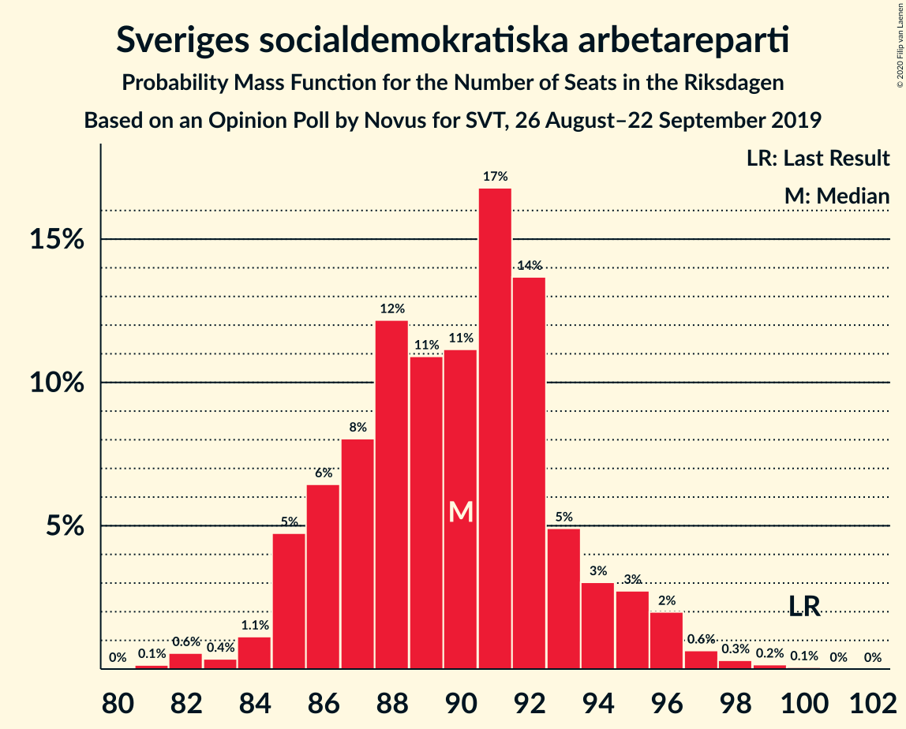
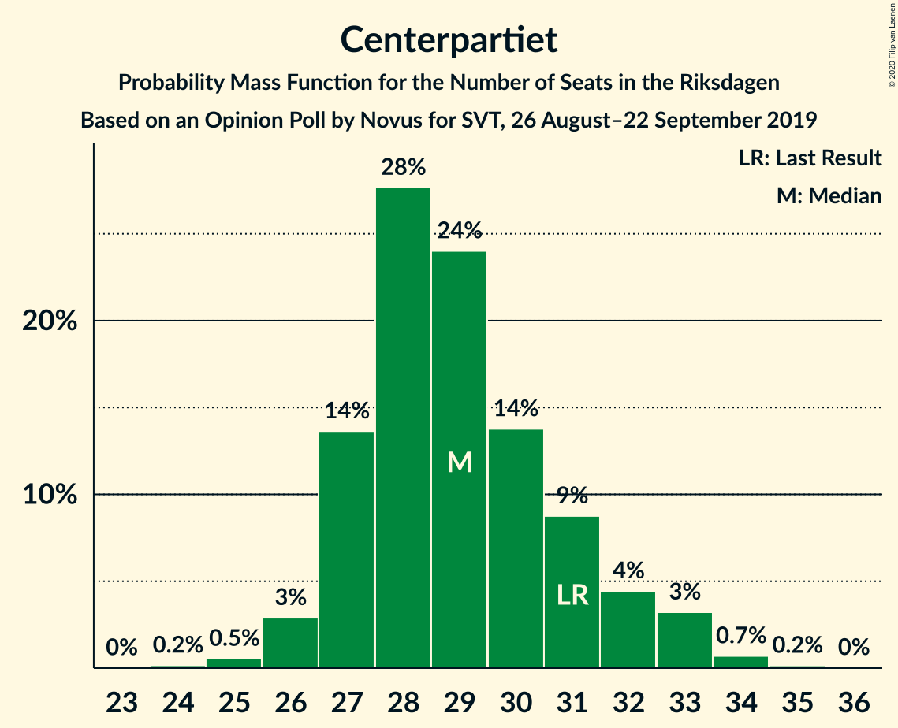
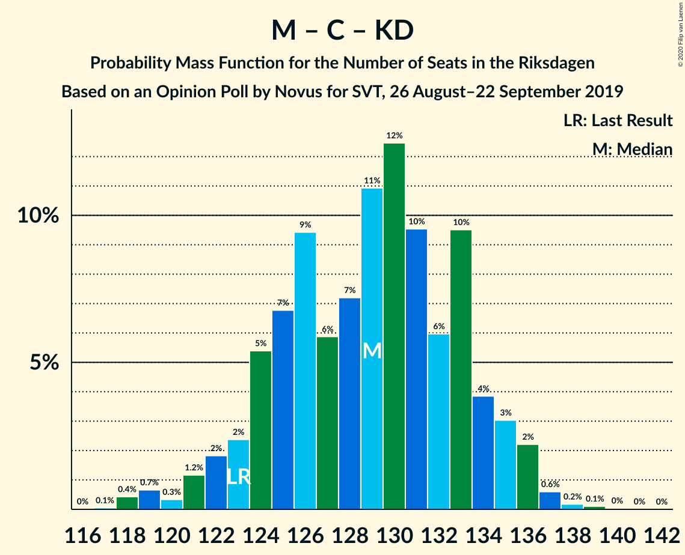

# Opinion Poll by Novus for SVT, 26 August–22 September 2019

<a href="#voting-intentions">Voting Intentions</a> | <a href="#seats">Seats</a> | <a href="#coalitions">Coalitions</a> | <a href="#technical-information">Technical Information</a>

## Voting Intentions

### Confidence Intervals

| Party | Last Result | Poll Result | 80% Confidence Interval | 90% Confidence Interval | 95% Confidence Interval | 99% Confidence Interval |
|:-----:|:-----------:|:-----------:|:-----------------------:|:-----------------------:|:-----------------------:|:-----------------------:|
| Sveriges socialdemokratiska arbetareparti | 28.3% | 24.7% | 23.7–25.6% |23.5–25.8% |23.3–26.1% |22.9–26.5% |
| Sverigedemokraterna | 17.5% | 20.7% | 19.8–21.6% |19.6–21.8% |19.4–22.0% |19.0–22.4% |
| Moderata samlingspartiet | 19.8% | 20.4% | 19.5–21.2% |19.3–21.5% |19.1–21.7% |18.7–22.1% |
| Vänsterpartiet | 8.0% | 9.2% | 8.6–9.8% |8.4–10.0% |8.3–10.2% |8.0–10.5% |
| Centerpartiet | 8.6% | 8.0% | 7.4–8.6% |7.3–8.8% |7.2–8.9% |6.9–9.2% |
| Kristdemokraterna | 6.3% | 6.8% | 6.3–7.3% |6.1–7.5% |6.0–7.6% |5.8–7.9% |
| Miljöpartiet de gröna | 4.4% | 5.0% | 4.5–5.5% |4.4–5.6% |4.3–5.7% |4.1–6.0% |
| Liberalerna | 5.5% | 3.6% | 3.2–4.0% |3.1–4.2% |3.0–4.3% |2.9–4.5% |

*Note:* The poll result column reflects the actual value used in the calculations. Published results may vary slightly, and in addition be rounded to fewer digits.

## Seats

### Confidence Intervals

| Party | Last Result | Median | 80% Confidence Interval | 90% Confidence Interval | 95% Confidence Interval | 99% Confidence Interval |
|:-----:|:-----------:|:------:|:-----------------------:|:-----------------------:|:-----------------------:|:-----------------------:|
| <a href="#sveriges-socialdemokratiska-arbetareparti">Sveriges socialdemokratiska arbetareparti</a> | 100 | 90 | 86–93 |85–95 |85–96 |82–98 |
| <a href="#sverigedemokraterna">Sverigedemokraterna</a> | 62 | 76 | 72–80 |72–80 |71–81 |69–82 |
| <a href="#moderata-samlingspartiet">Moderata samlingspartiet</a> | 70 | 75 | 71–78 |70–79 |69–80 |68–82 |
| <a href="#vänsterpartiet">Vänsterpartiet</a> | 28 | 34 | 31–36 |31–37 |30–37 |29–38 |
| <a href="#centerpartiet">Centerpartiet</a> | 31 | 29 | 27–31 |27–32 |26–33 |25–34 |
| <a href="#kristdemokraterna">Kristdemokraterna</a> | 22 | 25 | 23–27 |23–28 |22–28 |21–29 |
| <a href="#miljöpartiet-de-gröna">Miljöpartiet de gröna</a> | 16 | 18 | 16–20 |16–21 |16–21 |15–22 |
| <a href="#liberalerna">Liberalerna</a> | 20 | 0 | 0–14 |0–15 |0–15 |0–16 |

### Sveriges socialdemokratiska arbetareparti

*For a full overview of the results for this party, see the [Sveriges socialdemokratiska arbetareparti](party-sverigessocialdemokratiskaarbetareparti.html) page.*

| Number of Seats | Probability | Accumulated | Special Marks |
|:---------------:|:-----------:|:-----------:|:-------------:|
| 81 | 0.1% | 100% |  |
| 82 | 0.6% | 99.8% |  |
| 83 | 0.4% | 99.3% |  |
| 84 | 1.1% | 98.9% |  |
| 85 | 5% | 98% |  |
| 86 | 6% | 93% |  |
| 87 | 8% | 87% |  |
| 88 | 12% | 79% |  |
| 89 | 11% | 66% |  |
| 90 | 11% | 55% | Median |
| 91 | 17% | 44% |  |
| 92 | 14% | 28% |  |
| 93 | 5% | 14% |  |
| 94 | 3% | 9% |  |
| 95 | 3% | 6% |  |
| 96 | 2% | 3% |  |
| 97 | 0.6% | 1.2% |  |
| 98 | 0.3% | 0.5% |  |
| 99 | 0.2% | 0.2% |  |
| 100 | 0.1% | 0.1% | Last Result |
| 101 | 0% | 0% |  |

### Sverigedemokraterna

*For a full overview of the results for this party, see the [Sverigedemokraterna](party-sverigedemokraterna.html) page.*

| Number of Seats | Probability | Accumulated | Special Marks |
|:---------------:|:-----------:|:-----------:|:-------------:|
| 62 | 0% | 100% | Last Result |
| 63 | 0% | 100% |  |
| 64 | 0% | 100% |  |
| 65 | 0% | 100% |  |
| 66 | 0% | 100% |  |
| 67 | 0.1% | 100% |  |
| 68 | 0.2% | 99.9% |  |
| 69 | 0.5% | 99.7% |  |
| 70 | 1.3% | 99.2% |  |
| 71 | 3% | 98% |  |
| 72 | 7% | 95% |  |
| 73 | 7% | 88% |  |
| 74 | 9% | 80% |  |
| 75 | 17% | 71% |  |
| 76 | 12% | 54% | Median |
| 77 | 10% | 42% |  |
| 78 | 7% | 33% |  |
| 79 | 15% | 25% |  |
| 80 | 6% | 10% |  |
| 81 | 3% | 5% |  |
| 82 | 1.2% | 2% |  |
| 83 | 0.3% | 0.5% |  |
| 84 | 0.1% | 0.2% |  |
| 85 | 0% | 0.1% |  |
| 86 | 0% | 0% |  |

### Moderata samlingspartiet

*For a full overview of the results for this party, see the [Moderata samlingspartiet](party-moderatasamlingspartiet.html) page.*

| Number of Seats | Probability | Accumulated | Special Marks |
|:---------------:|:-----------:|:-----------:|:-------------:|
| 66 | 0.1% | 100% |  |
| 67 | 0.2% | 99.9% |  |
| 68 | 0.4% | 99.7% |  |
| 69 | 2% | 99.3% |  |
| 70 | 2% | 97% | Last Result |
| 71 | 5% | 95% |  |
| 72 | 9% | 90% |  |
| 73 | 12% | 80% |  |
| 74 | 14% | 69% |  |
| 75 | 14% | 55% | Median |
| 76 | 13% | 41% |  |
| 77 | 12% | 28% |  |
| 78 | 7% | 16% |  |
| 79 | 5% | 9% |  |
| 80 | 3% | 4% |  |
| 81 | 1.1% | 2% |  |
| 82 | 0.4% | 0.6% |  |
| 83 | 0.1% | 0.2% |  |
| 84 | 0.1% | 0.1% |  |
| 85 | 0% | 0% |  |

### Vänsterpartiet

*For a full overview of the results for this party, see the [Vänsterpartiet](party-vänsterpartiet.html) page.*

| Number of Seats | Probability | Accumulated | Special Marks |
|:---------------:|:-----------:|:-----------:|:-------------:|
| 28 | 0.1% | 100% | Last Result |
| 29 | 0.7% | 99.8% |  |
| 30 | 3% | 99.2% |  |
| 31 | 7% | 96% |  |
| 32 | 17% | 89% |  |
| 33 | 18% | 73% |  |
| 34 | 20% | 55% | Median |
| 35 | 18% | 34% |  |
| 36 | 8% | 16% |  |
| 37 | 5% | 7% |  |
| 38 | 2% | 2% |  |
| 39 | 0.4% | 0.5% |  |
| 40 | 0.1% | 0.1% |  |
| 41 | 0% | 0% |  |

### Centerpartiet

*For a full overview of the results for this party, see the [Centerpartiet](party-centerpartiet.html) page.*

| Number of Seats | Probability | Accumulated | Special Marks |
|:---------------:|:-----------:|:-----------:|:-------------:|
| 24 | 0.2% | 100% |  |
| 25 | 0.5% | 99.8% |  |
| 26 | 3% | 99.3% |  |
| 27 | 14% | 96% |  |
| 28 | 28% | 83% |  |
| 29 | 24% | 55% | Median |
| 30 | 14% | 31% |  |
| 31 | 9% | 17% | Last Result |
| 32 | 4% | 9% |  |
| 33 | 3% | 4% |  |
| 34 | 0.7% | 0.9% |  |
| 35 | 0.2% | 0.2% |  |
| 36 | 0% | 0% |  |

### Kristdemokraterna

*For a full overview of the results for this party, see the [Kristdemokraterna](party-kristdemokraterna.html) page.*

| Number of Seats | Probability | Accumulated | Special Marks |
|:---------------:|:-----------:|:-----------:|:-------------:|
| 20 | 0.2% | 100% |  |
| 21 | 0.9% | 99.8% |  |
| 22 | 4% | 98.9% | Last Result |
| 23 | 13% | 95% |  |
| 24 | 15% | 82% |  |
| 25 | 27% | 68% | Median |
| 26 | 19% | 40% |  |
| 27 | 15% | 22% |  |
| 28 | 6% | 7% |  |
| 29 | 0.9% | 1.2% |  |
| 30 | 0.3% | 0.3% |  |
| 31 | 0% | 0% |  |

### Miljöpartiet de gröna

*For a full overview of the results for this party, see the [Miljöpartiet de gröna](party-miljöpartietdegröna.html) page.*

| Number of Seats | Probability | Accumulated | Special Marks |
|:---------------:|:-----------:|:-----------:|:-------------:|
| 0 | 0.2% | 100% |  |
| 1 | 0% | 99.8% |  |
| 2 | 0% | 99.8% |  |
| 3 | 0% | 99.8% |  |
| 4 | 0% | 99.8% |  |
| 5 | 0% | 99.8% |  |
| 6 | 0% | 99.8% |  |
| 7 | 0% | 99.8% |  |
| 8 | 0% | 99.8% |  |
| 9 | 0% | 99.8% |  |
| 10 | 0% | 99.8% |  |
| 11 | 0% | 99.8% |  |
| 12 | 0% | 99.8% |  |
| 13 | 0% | 99.8% |  |
| 14 | 0% | 99.8% |  |
| 15 | 2% | 99.8% |  |
| 16 | 10% | 98% | Last Result |
| 17 | 22% | 89% |  |
| 18 | 29% | 66% | Median |
| 19 | 23% | 38% |  |
| 20 | 9% | 15% |  |
| 21 | 5% | 6% |  |
| 22 | 0.7% | 0.8% |  |
| 23 | 0.1% | 0.1% |  |
| 24 | 0% | 0% |  |

### Liberalerna

*For a full overview of the results for this party, see the [Liberalerna](party-liberalerna.html) page.*

| Number of Seats | Probability | Accumulated | Special Marks |
|:---------------:|:-----------:|:-----------:|:-------------:|
| 0 | 84% | 100% | Median |
| 1 | 0% | 16% |  |
| 2 | 0% | 16% |  |
| 3 | 0% | 16% |  |
| 4 | 0% | 16% |  |
| 5 | 0% | 16% |  |
| 6 | 0% | 16% |  |
| 7 | 0% | 16% |  |
| 8 | 0% | 16% |  |
| 9 | 0% | 16% |  |
| 10 | 0% | 16% |  |
| 11 | 0% | 16% |  |
| 12 | 0% | 16% |  |
| 13 | 0% | 16% |  |
| 14 | 7% | 16% |  |
| 15 | 8% | 9% |  |
| 16 | 1.5% | 2% |  |
| 17 | 0.1% | 0.1% |  |
| 18 | 0% | 0% |  |
| 19 | 0% | 0% |  |
| 20 | 0% | 0% | Last Result |

## Coalitions

### Confidence Intervals

| Coalition | Last Result | Median | Majority? | 80% Confidence Interval | 90% Confidence Interval | 95% Confidence Interval | 99% Confidence Interval |
|:---------:|:-----------:|:------:|:---------:|:-----------------------:|:-----------------------:|:-----------------------:|:-----------------------:|
| Sveriges socialdemokratiska arbetareparti – Moderata samlingspartiet – Centerpartiet | 201 | 194 | 100% | 188–198 | 186–200 | 185–200 | 182–203 |
| Sveriges socialdemokratiska arbetareparti – Vänsterpartiet – Centerpartiet – Miljöpartiet de gröna – Liberalerna | 195 | 172 | 27% | 168–180 | 168–181 | 167–182 | 166–184 |
| Sverigedemokraterna – Moderata samlingspartiet – Kristdemokraterna | 154 | 177 | 73% | 169–181 | 168–181 | 167–182 | 165–183 |
| Sveriges socialdemokratiska arbetareparti – Moderata samlingspartiet | 170 | 165 | 0.2% | 159–170 | 157–170 | 156–172 | 153–174 |
| Sverigedemokraterna – Moderata samlingspartiet | 132 | 152 | 0% | 145–155 | 144–156 | 143–157 | 141–159 |
| Sveriges socialdemokratiska arbetareparti – Vänsterpartiet – Miljöpartiet de gröna | 144 | 141 | 0% | 137–147 | 135–148 | 134–149 | 132–150 |
| Sveriges socialdemokratiska arbetareparti – Centerpartiet – Miljöpartiet de gröna – Liberalerna | 167 | 138 | 0% | 135–147 | 134–148 | 133–149 | 132–151 |
| Moderata samlingspartiet – Centerpartiet – Kristdemokraterna – Liberalerna | 143 | 131 | 0% | 126–138 | 125–140 | 124–142 | 123–144 |
| Moderata samlingspartiet – Centerpartiet – Kristdemokraterna | 123 | 129 | 0% | 124–134 | 123–135 | 121–136 | 119–137 |
| Sveriges socialdemokratiska arbetareparti – Vänsterpartiet | 128 | 123 | 0% | 119–128 | 118–129 | 117–130 | 114–132 |
| Moderata samlingspartiet – Centerpartiet – Liberalerna | 121 | 105 | 0% | 101–114 | 100–116 | 99–118 | 98–120 |
| Sveriges socialdemokratiska arbetareparti – Miljöpartiet de gröna | 116 | 108 | 0% | 104–112 | 103–113 | 102–114 | 100–117 |
| Moderata samlingspartiet – Centerpartiet | 101 | 104 | 0% | 100–108 | 99–109 | 97–110 | 95–112 |

### Sveriges socialdemokratiska arbetareparti – Moderata samlingspartiet – Centerpartiet

| Number of Seats | Probability | Accumulated | Special Marks |
|:---------------:|:-----------:|:-----------:|:-------------:|
| 180 | 0.1% | 100% |  |
| 181 | 0.3% | 99.9% |  |
| 182 | 0.2% | 99.6% |  |
| 183 | 0.7% | 99.4% |  |
| 184 | 0.8% | 98.7% |  |
| 185 | 2% | 98% |  |
| 186 | 3% | 96% |  |
| 187 | 2% | 93% |  |
| 188 | 3% | 91% |  |
| 189 | 3% | 87% |  |
| 190 | 4% | 84% |  |
| 191 | 6% | 80% |  |
| 192 | 9% | 74% |  |
| 193 | 7% | 65% |  |
| 194 | 12% | 57% | Median |
| 195 | 10% | 45% |  |
| 196 | 11% | 35% |  |
| 197 | 9% | 24% |  |
| 198 | 5% | 15% |  |
| 199 | 3% | 10% |  |
| 200 | 4% | 6% |  |
| 201 | 1.0% | 2% | Last Result |
| 202 | 0.6% | 1.4% |  |
| 203 | 0.5% | 0.8% |  |
| 204 | 0.1% | 0.3% |  |
| 205 | 0% | 0.2% |  |
| 206 | 0% | 0.1% |  |
| 207 | 0% | 0.1% |  |
| 208 | 0% | 0.1% |  |
| 209 | 0% | 0% |  |

### Sveriges socialdemokratiska arbetareparti – Vänsterpartiet – Centerpartiet – Miljöpartiet de gröna – Liberalerna

| Number of Seats | Probability | Accumulated | Special Marks |
|:---------------:|:-----------:|:-----------:|:-------------:|
| 162 | 0% | 100% |  |
| 163 | 0.1% | 99.9% |  |
| 164 | 0.1% | 99.9% |  |
| 165 | 0.2% | 99.8% |  |
| 166 | 1.1% | 99.6% |  |
| 167 | 2% | 98% |  |
| 168 | 8% | 97% |  |
| 169 | 8% | 89% |  |
| 170 | 10% | 80% |  |
| 171 | 17% | 70% | Median |
| 172 | 13% | 53% |  |
| 173 | 6% | 41% |  |
| 174 | 7% | 34% |  |
| 175 | 2% | 27% | Majority |
| 176 | 1.3% | 26% |  |
| 177 | 5% | 24% |  |
| 178 | 4% | 19% |  |
| 179 | 6% | 16% |  |
| 180 | 4% | 10% |  |
| 181 | 2% | 6% |  |
| 182 | 2% | 4% |  |
| 183 | 0.7% | 2% |  |
| 184 | 0.6% | 0.9% |  |
| 185 | 0.2% | 0.3% |  |
| 186 | 0.1% | 0.2% |  |
| 187 | 0.1% | 0.1% |  |
| 188 | 0% | 0.1% |  |
| 189 | 0% | 0% |  |
| 190 | 0% | 0% |  |
| 191 | 0% | 0% |  |
| 192 | 0% | 0% |  |
| 193 | 0% | 0% |  |
| 194 | 0% | 0% |  |
| 195 | 0% | 0% | Last Result |

### Sverigedemokraterna – Moderata samlingspartiet – Kristdemokraterna

| Number of Seats | Probability | Accumulated | Special Marks |
|:---------------:|:-----------:|:-----------:|:-------------:|
| 154 | 0% | 100% | Last Result |
| 155 | 0% | 100% |  |
| 156 | 0% | 100% |  |
| 157 | 0% | 100% |  |
| 158 | 0% | 100% |  |
| 159 | 0% | 100% |  |
| 160 | 0% | 100% |  |
| 161 | 0% | 100% |  |
| 162 | 0.1% | 99.9% |  |
| 163 | 0.1% | 99.9% |  |
| 164 | 0.2% | 99.8% |  |
| 165 | 0.6% | 99.7% |  |
| 166 | 0.7% | 99.1% |  |
| 167 | 2% | 98% |  |
| 168 | 2% | 96% |  |
| 169 | 4% | 94% |  |
| 170 | 6% | 90% |  |
| 171 | 4% | 84% |  |
| 172 | 5% | 81% |  |
| 173 | 1.3% | 76% |  |
| 174 | 2% | 74% |  |
| 175 | 7% | 73% | Majority |
| 176 | 6% | 66% | Median |
| 177 | 13% | 59% |  |
| 178 | 17% | 47% |  |
| 179 | 10% | 30% |  |
| 180 | 8% | 20% |  |
| 181 | 8% | 11% |  |
| 182 | 2% | 3% |  |
| 183 | 1.1% | 2% |  |
| 184 | 0.2% | 0.4% |  |
| 185 | 0.1% | 0.2% |  |
| 186 | 0.1% | 0.1% |  |
| 187 | 0% | 0.1% |  |
| 188 | 0% | 0% |  |

### Sveriges socialdemokratiska arbetareparti – Moderata samlingspartiet

| Number of Seats | Probability | Accumulated | Special Marks |
|:---------------:|:-----------:|:-----------:|:-------------:|
| 151 | 0% | 100% |  |
| 152 | 0.1% | 99.9% |  |
| 153 | 0.4% | 99.9% |  |
| 154 | 0.3% | 99.5% |  |
| 155 | 0.6% | 99.2% |  |
| 156 | 1.4% | 98.6% |  |
| 157 | 3% | 97% |  |
| 158 | 3% | 95% |  |
| 159 | 3% | 92% |  |
| 160 | 3% | 89% |  |
| 161 | 6% | 86% |  |
| 162 | 7% | 80% |  |
| 163 | 5% | 73% |  |
| 164 | 15% | 67% |  |
| 165 | 7% | 53% | Median |
| 166 | 13% | 45% |  |
| 167 | 7% | 32% |  |
| 168 | 11% | 25% |  |
| 169 | 4% | 15% |  |
| 170 | 6% | 11% | Last Result |
| 171 | 2% | 5% |  |
| 172 | 2% | 3% |  |
| 173 | 0.4% | 1.1% |  |
| 174 | 0.4% | 0.6% |  |
| 175 | 0.1% | 0.2% | Majority |
| 176 | 0.1% | 0.1% |  |
| 177 | 0% | 0.1% |  |
| 178 | 0% | 0% |  |

### Sverigedemokraterna – Moderata samlingspartiet

| Number of Seats | Probability | Accumulated | Special Marks |
|:---------------:|:-----------:|:-----------:|:-------------:|
| 132 | 0% | 100% | Last Result |
| 133 | 0% | 100% |  |
| 134 | 0% | 100% |  |
| 135 | 0% | 100% |  |
| 136 | 0% | 100% |  |
| 137 | 0% | 100% |  |
| 138 | 0% | 99.9% |  |
| 139 | 0.1% | 99.9% |  |
| 140 | 0.1% | 99.8% |  |
| 141 | 0.5% | 99.7% |  |
| 142 | 1.3% | 99.2% |  |
| 143 | 1.0% | 98% |  |
| 144 | 4% | 97% |  |
| 145 | 4% | 92% |  |
| 146 | 3% | 89% |  |
| 147 | 6% | 86% |  |
| 148 | 5% | 79% |  |
| 149 | 6% | 75% |  |
| 150 | 9% | 69% |  |
| 151 | 9% | 60% | Median |
| 152 | 15% | 51% |  |
| 153 | 11% | 36% |  |
| 154 | 10% | 25% |  |
| 155 | 6% | 15% |  |
| 156 | 5% | 9% |  |
| 157 | 2% | 4% |  |
| 158 | 1.3% | 2% |  |
| 159 | 0.6% | 0.8% |  |
| 160 | 0.1% | 0.3% |  |
| 161 | 0.1% | 0.1% |  |
| 162 | 0% | 0.1% |  |
| 163 | 0% | 0% |  |

### Sveriges socialdemokratiska arbetareparti – Vänsterpartiet – Miljöpartiet de gröna

| Number of Seats | Probability | Accumulated | Special Marks |
|:---------------:|:-----------:|:-----------:|:-------------:|
| 128 | 0% | 100% |  |
| 129 | 0.1% | 99.9% |  |
| 130 | 0.1% | 99.9% |  |
| 131 | 0.3% | 99.8% |  |
| 132 | 0.3% | 99.6% |  |
| 133 | 0.7% | 99.3% |  |
| 134 | 2% | 98.6% |  |
| 135 | 2% | 97% |  |
| 136 | 3% | 95% |  |
| 137 | 3% | 91% |  |
| 138 | 8% | 89% |  |
| 139 | 7% | 81% |  |
| 140 | 11% | 74% |  |
| 141 | 14% | 63% |  |
| 142 | 11% | 49% | Median |
| 143 | 6% | 38% |  |
| 144 | 12% | 32% | Last Result |
| 145 | 5% | 20% |  |
| 146 | 4% | 15% |  |
| 147 | 4% | 11% |  |
| 148 | 3% | 6% |  |
| 149 | 2% | 4% |  |
| 150 | 0.9% | 1.4% |  |
| 151 | 0.3% | 0.5% |  |
| 152 | 0.1% | 0.2% |  |
| 153 | 0.1% | 0.1% |  |
| 154 | 0% | 0% |  |

### Sveriges socialdemokratiska arbetareparti – Centerpartiet – Miljöpartiet de gröna – Liberalerna

| Number of Seats | Probability | Accumulated | Special Marks |
|:---------------:|:-----------:|:-----------:|:-------------:|
| 127 | 0% | 100% |  |
| 128 | 0% | 99.9% |  |
| 129 | 0% | 99.9% |  |
| 130 | 0.1% | 99.9% |  |
| 131 | 0.1% | 99.8% |  |
| 132 | 1.1% | 99.7% |  |
| 133 | 2% | 98.5% |  |
| 134 | 6% | 97% |  |
| 135 | 10% | 91% |  |
| 136 | 10% | 81% |  |
| 137 | 15% | 71% | Median |
| 138 | 14% | 56% |  |
| 139 | 8% | 42% |  |
| 140 | 6% | 34% |  |
| 141 | 2% | 28% |  |
| 142 | 2% | 25% |  |
| 143 | 2% | 23% |  |
| 144 | 3% | 21% |  |
| 145 | 4% | 18% |  |
| 146 | 4% | 14% |  |
| 147 | 3% | 11% |  |
| 148 | 4% | 8% |  |
| 149 | 2% | 4% |  |
| 150 | 1.0% | 2% |  |
| 151 | 0.8% | 1.3% |  |
| 152 | 0.3% | 0.5% |  |
| 153 | 0% | 0.2% |  |
| 154 | 0% | 0.2% |  |
| 155 | 0.1% | 0.1% |  |
| 156 | 0% | 0% |  |
| 157 | 0% | 0% |  |
| 158 | 0% | 0% |  |
| 159 | 0% | 0% |  |
| 160 | 0% | 0% |  |
| 161 | 0% | 0% |  |
| 162 | 0% | 0% |  |
| 163 | 0% | 0% |  |
| 164 | 0% | 0% |  |
| 165 | 0% | 0% |  |
| 166 | 0% | 0% |  |
| 167 | 0% | 0% | Last Result |

### Moderata samlingspartiet – Centerpartiet – Kristdemokraterna – Liberalerna

| Number of Seats | Probability | Accumulated | Special Marks |
|:---------------:|:-----------:|:-----------:|:-------------:|
| 120 | 0% | 100% |  |
| 121 | 0.1% | 99.9% |  |
| 122 | 0.2% | 99.9% |  |
| 123 | 1.2% | 99.6% |  |
| 124 | 2% | 98% |  |
| 125 | 4% | 97% |  |
| 126 | 8% | 93% |  |
| 127 | 5% | 85% |  |
| 128 | 7% | 80% |  |
| 129 | 9% | 73% | Median |
| 130 | 12% | 63% |  |
| 131 | 9% | 51% |  |
| 132 | 6% | 42% |  |
| 133 | 10% | 35% |  |
| 134 | 5% | 26% |  |
| 135 | 3% | 21% |  |
| 136 | 4% | 18% |  |
| 137 | 2% | 14% |  |
| 138 | 4% | 12% |  |
| 139 | 2% | 9% |  |
| 140 | 2% | 7% |  |
| 141 | 2% | 5% |  |
| 142 | 0.6% | 3% |  |
| 143 | 2% | 2% | Last Result |
| 144 | 0.4% | 0.8% |  |
| 145 | 0.3% | 0.4% |  |
| 146 | 0% | 0.1% |  |
| 147 | 0.1% | 0.1% |  |
| 148 | 0% | 0% |  |

### Moderata samlingspartiet – Centerpartiet – Kristdemokraterna

| Number of Seats | Probability | Accumulated | Special Marks |
|:---------------:|:-----------:|:-----------:|:-------------:|
| 117 | 0.1% | 100% |  |
| 118 | 0.4% | 99.9% |  |
| 119 | 0.7% | 99.5% |  |
| 120 | 0.3% | 98.8% |  |
| 121 | 1.2% | 98.5% |  |
| 122 | 2% | 97% |  |
| 123 | 2% | 96% | Last Result |
| 124 | 5% | 93% |  |
| 125 | 7% | 88% |  |
| 126 | 9% | 81% |  |
| 127 | 6% | 72% |  |
| 128 | 7% | 66% |  |
| 129 | 11% | 58% | Median |
| 130 | 12% | 48% |  |
| 131 | 10% | 35% |  |
| 132 | 6% | 26% |  |
| 133 | 10% | 20% |  |
| 134 | 4% | 10% |  |
| 135 | 3% | 6% |  |
| 136 | 2% | 3% |  |
| 137 | 0.6% | 0.9% |  |
| 138 | 0.2% | 0.3% |  |
| 139 | 0.1% | 0.2% |  |
| 140 | 0% | 0.1% |  |
| 141 | 0% | 0% |  |

### Sveriges socialdemokratiska arbetareparti – Vänsterpartiet

| Number of Seats | Probability | Accumulated | Special Marks |
|:---------------:|:-----------:|:-----------:|:-------------:|
| 112 | 0.1% | 100% |  |
| 113 | 0.2% | 99.9% |  |
| 114 | 0.2% | 99.7% |  |
| 115 | 0.4% | 99.5% |  |
| 116 | 1.3% | 99.1% |  |
| 117 | 3% | 98% |  |
| 118 | 2% | 95% |  |
| 119 | 4% | 93% |  |
| 120 | 5% | 88% |  |
| 121 | 10% | 83% |  |
| 122 | 11% | 73% |  |
| 123 | 12% | 62% |  |
| 124 | 10% | 50% | Median |
| 125 | 12% | 39% |  |
| 126 | 9% | 28% |  |
| 127 | 6% | 18% |  |
| 128 | 6% | 13% | Last Result |
| 129 | 3% | 7% |  |
| 130 | 3% | 4% |  |
| 131 | 1.0% | 2% |  |
| 132 | 0.5% | 0.9% |  |
| 133 | 0.2% | 0.4% |  |
| 134 | 0.1% | 0.1% |  |
| 135 | 0% | 0% |  |

### Moderata samlingspartiet – Centerpartiet – Liberalerna

| Number of Seats | Probability | Accumulated | Special Marks |
|:---------------:|:-----------:|:-----------:|:-------------:|
| 96 | 0.1% | 100% |  |
| 97 | 0.2% | 99.8% |  |
| 98 | 1.0% | 99.6% |  |
| 99 | 2% | 98.7% |  |
| 100 | 2% | 97% |  |
| 101 | 8% | 95% |  |
| 102 | 8% | 87% |  |
| 103 | 11% | 79% |  |
| 104 | 11% | 69% | Median |
| 105 | 12% | 58% |  |
| 106 | 8% | 46% |  |
| 107 | 10% | 38% |  |
| 108 | 5% | 28% |  |
| 109 | 5% | 23% |  |
| 110 | 2% | 19% |  |
| 111 | 2% | 17% |  |
| 112 | 1.3% | 15% |  |
| 113 | 3% | 14% |  |
| 114 | 1.2% | 11% |  |
| 115 | 4% | 10% |  |
| 116 | 2% | 6% |  |
| 117 | 1.4% | 5% |  |
| 118 | 2% | 3% |  |
| 119 | 0.3% | 1.1% |  |
| 120 | 0.5% | 0.8% |  |
| 121 | 0.1% | 0.2% | Last Result |
| 122 | 0.1% | 0.1% |  |
| 123 | 0% | 0% |  |

### Sveriges socialdemokratiska arbetareparti – Miljöpartiet de gröna

| Number of Seats | Probability | Accumulated | Special Marks |
|:---------------:|:-----------:|:-----------:|:-------------:|
| 94 | 0% | 100% |  |
| 95 | 0% | 99.9% |  |
| 96 | 0.1% | 99.9% |  |
| 97 | 0% | 99.9% |  |
| 98 | 0.1% | 99.8% |  |
| 99 | 0.1% | 99.7% |  |
| 100 | 0.5% | 99.6% |  |
| 101 | 1.0% | 99.1% |  |
| 102 | 2% | 98% |  |
| 103 | 4% | 96% |  |
| 104 | 6% | 92% |  |
| 105 | 8% | 86% |  |
| 106 | 10% | 78% |  |
| 107 | 15% | 68% |  |
| 108 | 10% | 53% | Median |
| 109 | 12% | 43% |  |
| 110 | 14% | 32% |  |
| 111 | 4% | 18% |  |
| 112 | 5% | 14% |  |
| 113 | 4% | 8% |  |
| 114 | 2% | 4% |  |
| 115 | 1.0% | 2% |  |
| 116 | 0.8% | 1.4% | Last Result |
| 117 | 0.5% | 0.7% |  |
| 118 | 0.1% | 0.2% |  |
| 119 | 0.1% | 0.1% |  |
| 120 | 0% | 0% |  |

### Moderata samlingspartiet – Centerpartiet

| Number of Seats | Probability | Accumulated | Special Marks |
|:---------------:|:-----------:|:-----------:|:-------------:|
| 94 | 0.1% | 100% |  |
| 95 | 0.6% | 99.9% |  |
| 96 | 0.8% | 99.3% |  |
| 97 | 1.4% | 98% |  |
| 98 | 2% | 97% |  |
| 99 | 4% | 95% |  |
| 100 | 5% | 91% |  |
| 101 | 10% | 86% | Last Result |
| 102 | 10% | 76% |  |
| 103 | 11% | 66% |  |
| 104 | 12% | 54% | Median |
| 105 | 12% | 42% |  |
| 106 | 8% | 30% |  |
| 107 | 10% | 22% |  |
| 108 | 5% | 12% |  |
| 109 | 4% | 7% |  |
| 110 | 1.3% | 3% |  |
| 111 | 1.0% | 2% |  |
| 112 | 0.3% | 0.5% |  |
| 113 | 0.2% | 0.2% |  |
| 114 | 0.1% | 0.1% |  |
| 115 | 0% | 0% |  |

## Technical Information

### Opinion Poll

+ **Polling firm:** Novus
+ **Commissioner(s):** SVT
+ **Fieldwork period:** 26 August–22 September 2019

### Calculations

+ **Sample size:** 3716
+ **Simulations done:** 1,048,576
+ **Error estimate:** 1.14%

