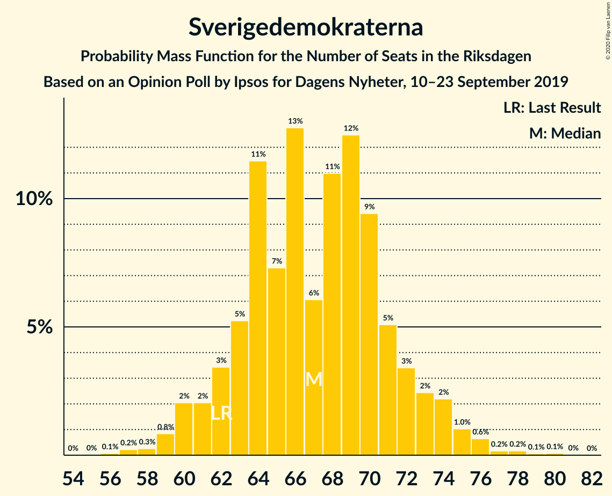
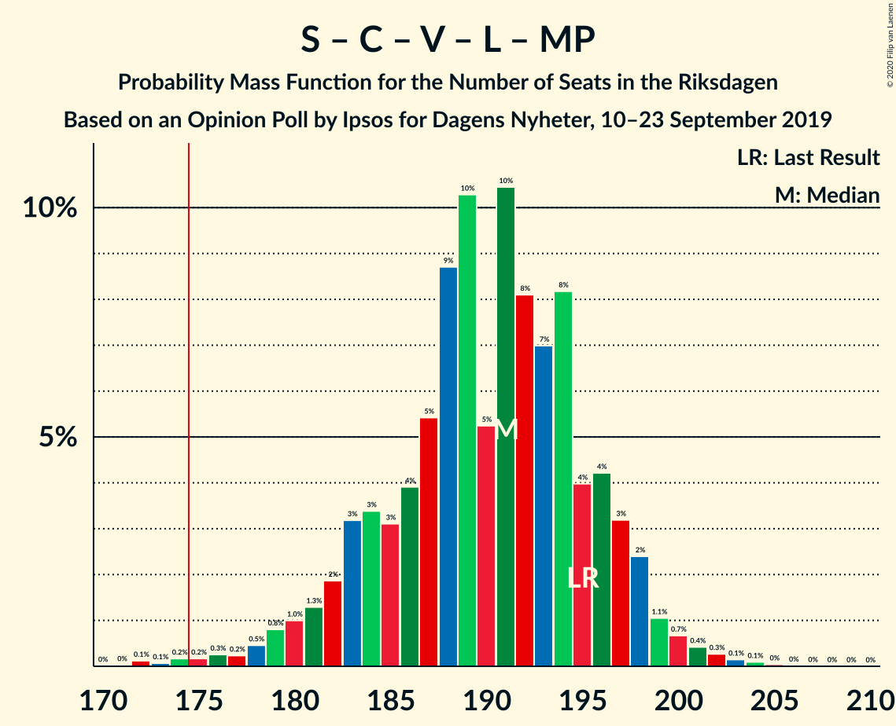

# Opinion Poll by Ipsos for Dagens Nyheter, 10–23 September 2019

<a href="#voting-intentions">Voting Intentions</a> | <a href="#seats">Seats</a> | <a href="#coalitions">Coalitions</a> | <a href="#technical-information">Technical Information</a>

## Voting Intentions

### Confidence Intervals

| Party | Last Result | Poll Result | 80% Confidence Interval | 90% Confidence Interval | 95% Confidence Interval | 99% Confidence Interval |
|:-----:|:-----------:|:-----------:|:-----------------------:|:-----------------------:|:-----------------------:|:-----------------------:|
| Sveriges socialdemokratiska arbetareparti | 28.3% | 26.0% | 24.6–27.5% |24.2–27.9% |23.9–28.3% |23.2–29.0% |
| Moderata samlingspartiet | 19.8% | 19.0% | 17.8–20.3% |17.4–20.7% |17.1–21.0% |16.5–21.7% |
| Sverigedemokraterna | 17.5% | 19.0% | 17.8–20.3% |17.4–20.7% |17.1–21.0% |16.5–21.7% |
| Centerpartiet | 8.6% | 9.0% | 8.1–10.0% |7.8–10.3% |7.7–10.5% |7.2–11.0% |
| Vänsterpartiet | 8.0% | 9.0% | 8.1–10.0% |7.8–10.3% |7.7–10.5% |7.2–11.0% |
| Kristdemokraterna | 6.3% | 7.0% | 6.2–7.9% |6.0–8.2% |5.9–8.4% |5.5–8.9% |
| Liberalerna | 5.5% | 5.0% | 4.4–5.8% |4.2–6.0% |4.0–6.2% |3.7–6.6% |
| Miljöpartiet de gröna | 4.4% | 5.0% | 4.4–5.8% |4.2–6.0% |4.0–6.2% |3.7–6.6% |

*Note:* The poll result column reflects the actual value used in the calculations. Published results may vary slightly, and in addition be rounded to fewer digits.

## Seats

### Confidence Intervals

| Party | Last Result | Median | 80% Confidence Interval | 90% Confidence Interval | 95% Confidence Interval | 99% Confidence Interval |
|:-----:|:-----------:|:------:|:-----------------------:|:-----------------------:|:-----------------------:|:-----------------------:|
| <a href="#sveriges-socialdemokratiska-arbetareparti">Sveriges socialdemokratiska arbetareparti</a> | 100 | 93 | 88–98 |86–100 |85–101 |82–104 |
| <a href="#moderata-samlingspartiet">Moderata samlingspartiet</a> | 70 | 65 | 61–70 |61–72 |60–73 |58–77 |
| <a href="#sverigedemokraterna">Sverigedemokraterna</a> | 62 | 68 | 63–70 |60–71 |59–74 |57–76 |
| <a href="#centerpartiet">Centerpartiet</a> | 31 | 32 | 29–35 |28–36 |28–37 |26–39 |
| <a href="#vänsterpartiet">Vänsterpartiet</a> | 28 | 33 | 29–34 |29–35 |29–38 |25–39 |
| <a href="#kristdemokraterna">Kristdemokraterna</a> | 22 | 24 | 21–27 |21–28 |20–29 |19–31 |
| <a href="#liberalerna">Liberalerna</a> | 20 | 17 | 16–20 |0–22 |0–22 |0–22 |
| <a href="#miljöpartiet-de-gröna">Miljöpartiet de gröna</a> | 16 | 18 | 16–20 |15–21 |14–22 |0–23 |

### Sveriges socialdemokratiska arbetareparti

*For a full overview of the results for this party, see the [Sveriges socialdemokratiska arbetareparti](party-sverigessocialdemokratiskaarbetareparti.html) page.*

| Number of Seats | Probability | Accumulated | Special Marks |
|:---------------:|:-----------:|:-----------:|:-------------:|
| 79 | 0% | 100% |  |
| 80 | 0.2% | 99.9% |  |
| 81 | 0.1% | 99.8% |  |
| 82 | 0.3% | 99.6% |  |
| 83 | 0.4% | 99.4% |  |
| 84 | 0.5% | 99.0% |  |
| 85 | 3% | 98% |  |
| 86 | 1.3% | 96% |  |
| 87 | 5% | 95% |  |
| 88 | 3% | 90% |  |
| 89 | 4% | 87% |  |
| 90 | 10% | 84% |  |
| 91 | 6% | 74% |  |
| 92 | 8% | 67% |  |
| 93 | 13% | 59% | Median |
| 94 | 8% | 47% |  |
| 95 | 15% | 39% |  |
| 96 | 8% | 24% |  |
| 97 | 2% | 16% |  |
| 98 | 5% | 14% |  |
| 99 | 3% | 9% |  |
| 100 | 1.5% | 6% | Last Result |
| 101 | 4% | 5% |  |
| 102 | 0.5% | 1.2% |  |
| 103 | 0.1% | 0.7% |  |
| 104 | 0.3% | 0.6% |  |
| 105 | 0.2% | 0.3% |  |
| 106 | 0% | 0.1% |  |
| 107 | 0% | 0.1% |  |
| 108 | 0% | 0% |  |

### Moderata samlingspartiet

*For a full overview of the results for this party, see the [Moderata samlingspartiet](party-moderatasamlingspartiet.html) page.*

| Number of Seats | Probability | Accumulated | Special Marks |
|:---------------:|:-----------:|:-----------:|:-------------:|
| 55 | 0.1% | 100% |  |
| 56 | 0.1% | 99.9% |  |
| 57 | 0.1% | 99.9% |  |
| 58 | 0.6% | 99.7% |  |
| 59 | 0.3% | 99.1% |  |
| 60 | 3% | 98.8% |  |
| 61 | 6% | 96% |  |
| 62 | 3% | 90% |  |
| 63 | 13% | 86% |  |
| 64 | 19% | 73% |  |
| 65 | 8% | 54% | Median |
| 66 | 8% | 47% |  |
| 67 | 8% | 38% |  |
| 68 | 4% | 30% |  |
| 69 | 13% | 26% |  |
| 70 | 5% | 13% | Last Result |
| 71 | 3% | 9% |  |
| 72 | 2% | 6% |  |
| 73 | 2% | 4% |  |
| 74 | 0.9% | 2% |  |
| 75 | 0.4% | 1.2% |  |
| 76 | 0.2% | 0.8% |  |
| 77 | 0.2% | 0.6% |  |
| 78 | 0.2% | 0.4% |  |
| 79 | 0% | 0.1% |  |
| 80 | 0.1% | 0.1% |  |
| 81 | 0% | 0% |  |

### Sverigedemokraterna

*For a full overview of the results for this party, see the [Sverigedemokraterna](party-sverigedemokraterna.html) page.*

| Number of Seats | Probability | Accumulated | Special Marks |
|:---------------:|:-----------:|:-----------:|:-------------:|
| 56 | 0.1% | 100% |  |
| 57 | 0.6% | 99.9% |  |
| 58 | 0.2% | 99.3% |  |
| 59 | 2% | 99.1% |  |
| 60 | 4% | 97% |  |
| 61 | 0.8% | 94% |  |
| 62 | 2% | 93% | Last Result |
| 63 | 2% | 92% |  |
| 64 | 4% | 90% |  |
| 65 | 8% | 86% |  |
| 66 | 14% | 78% |  |
| 67 | 12% | 63% |  |
| 68 | 7% | 51% | Median |
| 69 | 23% | 45% |  |
| 70 | 13% | 22% |  |
| 71 | 4% | 9% |  |
| 72 | 2% | 5% |  |
| 73 | 0.4% | 3% |  |
| 74 | 1.3% | 3% |  |
| 75 | 0.7% | 1.5% |  |
| 76 | 0.3% | 0.7% |  |
| 77 | 0.1% | 0.4% |  |
| 78 | 0.2% | 0.3% |  |
| 79 | 0% | 0.2% |  |
| 80 | 0.1% | 0.1% |  |
| 81 | 0% | 0% |  |

### Centerpartiet

*For a full overview of the results for this party, see the [Centerpartiet](party-centerpartiet.html) page.*

| Number of Seats | Probability | Accumulated | Special Marks |
|:---------------:|:-----------:|:-----------:|:-------------:|
| 24 | 0% | 100% |  |
| 25 | 0.2% | 99.9% |  |
| 26 | 0.9% | 99.7% |  |
| 27 | 0.8% | 98.8% |  |
| 28 | 6% | 98% |  |
| 29 | 5% | 92% |  |
| 30 | 11% | 87% |  |
| 31 | 12% | 75% | Last Result |
| 32 | 24% | 63% | Median |
| 33 | 14% | 40% |  |
| 34 | 7% | 26% |  |
| 35 | 8% | 18% |  |
| 36 | 6% | 10% |  |
| 37 | 2% | 4% |  |
| 38 | 1.2% | 2% |  |
| 39 | 0.4% | 0.8% |  |
| 40 | 0.3% | 0.4% |  |
| 41 | 0% | 0.1% |  |
| 42 | 0% | 0.1% |  |
| 43 | 0% | 0% |  |

### Vänsterpartiet

*For a full overview of the results for this party, see the [Vänsterpartiet](party-vänsterpartiet.html) page.*

| Number of Seats | Probability | Accumulated | Special Marks |
|:---------------:|:-----------:|:-----------:|:-------------:|
| 25 | 1.0% | 100% |  |
| 26 | 0.6% | 99.0% |  |
| 27 | 0% | 98% |  |
| 28 | 0% | 98% | Last Result |
| 29 | 12% | 98% |  |
| 30 | 28% | 86% |  |
| 31 | 2% | 58% |  |
| 32 | 0.4% | 56% |  |
| 33 | 7% | 56% | Median |
| 34 | 39% | 49% |  |
| 35 | 5% | 10% |  |
| 36 | 1.0% | 4% |  |
| 37 | 0.1% | 3% |  |
| 38 | 2% | 3% |  |
| 39 | 1.2% | 1.4% |  |
| 40 | 0.1% | 0.2% |  |
| 41 | 0.1% | 0.1% |  |
| 42 | 0% | 0% |  |

### Kristdemokraterna

*For a full overview of the results for this party, see the [Kristdemokraterna](party-kristdemokraterna.html) page.*

| Number of Seats | Probability | Accumulated | Special Marks |
|:---------------:|:-----------:|:-----------:|:-------------:|
| 18 | 0.1% | 100% |  |
| 19 | 0.6% | 99.9% |  |
| 20 | 3% | 99.2% |  |
| 21 | 7% | 96% |  |
| 22 | 15% | 90% | Last Result |
| 23 | 19% | 75% |  |
| 24 | 15% | 56% | Median |
| 25 | 20% | 42% |  |
| 26 | 9% | 21% |  |
| 27 | 4% | 12% |  |
| 28 | 3% | 8% |  |
| 29 | 2% | 5% |  |
| 30 | 2% | 2% |  |
| 31 | 0.6% | 0.9% |  |
| 32 | 0.3% | 0.4% |  |
| 33 | 0.1% | 0.1% |  |
| 34 | 0% | 0.1% |  |
| 35 | 0% | 0% |  |

### Liberalerna

*For a full overview of the results for this party, see the [Liberalerna](party-liberalerna.html) page.*

| Number of Seats | Probability | Accumulated | Special Marks |
|:---------------:|:-----------:|:-----------:|:-------------:|
| 0 | 5% | 100% |  |
| 1 | 0% | 95% |  |
| 2 | 0% | 95% |  |
| 3 | 0% | 95% |  |
| 4 | 0% | 95% |  |
| 5 | 0% | 95% |  |
| 6 | 0% | 95% |  |
| 7 | 0% | 95% |  |
| 8 | 0% | 95% |  |
| 9 | 0% | 95% |  |
| 10 | 0% | 95% |  |
| 11 | 0% | 95% |  |
| 12 | 0% | 95% |  |
| 13 | 0% | 95% |  |
| 14 | 1.2% | 95% |  |
| 15 | 0.1% | 93% |  |
| 16 | 36% | 93% |  |
| 17 | 17% | 57% | Median |
| 18 | 0% | 40% |  |
| 19 | 27% | 40% |  |
| 20 | 6% | 13% | Last Result |
| 21 | 0.1% | 7% |  |
| 22 | 7% | 7% |  |
| 23 | 0% | 0.3% |  |
| 24 | 0.1% | 0.2% |  |
| 25 | 0.2% | 0.2% |  |
| 26 | 0% | 0% |  |

### Miljöpartiet de gröna

*For a full overview of the results for this party, see the [Miljöpartiet de gröna](party-miljöpartietdegröna.html) page.*

| Number of Seats | Probability | Accumulated | Special Marks |
|:---------------:|:-----------:|:-----------:|:-------------:|
| 0 | 2% | 100% |  |
| 1 | 0% | 98% |  |
| 2 | 0% | 98% |  |
| 3 | 0% | 98% |  |
| 4 | 0% | 98% |  |
| 5 | 0% | 98% |  |
| 6 | 0% | 98% |  |
| 7 | 0% | 98% |  |
| 8 | 0% | 98% |  |
| 9 | 0% | 98% |  |
| 10 | 0% | 98% |  |
| 11 | 0% | 98% |  |
| 12 | 0% | 98% |  |
| 13 | 0% | 98% |  |
| 14 | 1.1% | 98% |  |
| 15 | 5% | 96% |  |
| 16 | 14% | 92% | Last Result |
| 17 | 23% | 78% |  |
| 18 | 13% | 55% | Median |
| 19 | 23% | 42% |  |
| 20 | 10% | 19% |  |
| 21 | 6% | 9% |  |
| 22 | 2% | 3% |  |
| 23 | 0.5% | 0.8% |  |
| 24 | 0.2% | 0.3% |  |
| 25 | 0.1% | 0.1% |  |
| 26 | 0% | 0% |  |

## Coalitions

### Confidence Intervals

| Coalition | Last Result | Median | Majority? | 80% Confidence Interval | 90% Confidence Interval | 95% Confidence Interval | 99% Confidence Interval |
|:---------:|:-----------:|:------:|:---------:|:-----------------------:|:-----------------------:|:-----------------------:|:-----------------------:|
| Sveriges socialdemokratiska arbetareparti – Moderata samlingspartiet – Centerpartiet | 201 | 192 | 100% | 185–198 | 182–199 | 181–202 | 179–208 |
| Sveriges socialdemokratiska arbetareparti – Centerpartiet – Vänsterpartiet – Liberalerna – Miljöpartiet de gröna | 195 | 193 | 99.6% | 184–196 | 182–198 | 180–198 | 175–200 |
| Moderata samlingspartiet – Sverigedemokraterna – Kristdemokraterna | 154 | 156 | 0.4% | 153–165 | 151–167 | 151–169 | 149–174 |
| Sveriges socialdemokratiska arbetareparti – Moderata samlingspartiet | 170 | 159 | 0.2% | 153–165 | 150–167 | 150–169 | 146–174 |
| Sveriges socialdemokratiska arbetareparti – Centerpartiet – Liberalerna – Miljöpartiet de gröna | 167 | 160 | 0% | 152–165 | 149–167 | 148–167 | 144–170 |
| Sveriges socialdemokratiska arbetareparti – Vänsterpartiet – Miljöpartiet de gröna | 144 | 143 | 0% | 137–148 | 134–150 | 132–152 | 128–155 |
| Moderata samlingspartiet – Centerpartiet – Kristdemokraterna – Liberalerna | 143 | 138 | 0% | 134–146 | 130–148 | 127–150 | 124–155 |
| Moderata samlingspartiet – Sverigedemokraterna | 132 | 132 | 0% | 130–139 | 128–140 | 125–144 | 122–146 |
| Sveriges socialdemokratiska arbetareparti – Vänsterpartiet | 128 | 125 | 0% | 120–131 | 118–132 | 115–134 | 112–137 |
| Moderata samlingspartiet – Centerpartiet – Kristdemokraterna | 123 | 122 | 0% | 117–128 | 115–130 | 114–133 | 113–137 |
| Moderata samlingspartiet – Centerpartiet – Liberalerna | 121 | 114 | 0% | 109–120 | 105–123 | 101–124 | 98–128 |
| Sveriges socialdemokratiska arbetareparti – Miljöpartiet de gröna | 116 | 112 | 0% | 105–116 | 103–118 | 101–119 | 94–122 |
| Moderata samlingspartiet – Centerpartiet | 101 | 97 | 0% | 92–103 | 92–105 | 89–107 | 88–110 |

### Sveriges socialdemokratiska arbetareparti – Moderata samlingspartiet – Centerpartiet

| Number of Seats | Probability | Accumulated | Special Marks |
|:---------------:|:-----------:|:-----------:|:-------------:|
| 176 | 0% | 100% |  |
| 177 | 0.1% | 99.9% |  |
| 178 | 0.2% | 99.8% |  |
| 179 | 0.4% | 99.6% |  |
| 180 | 0.8% | 99.2% |  |
| 181 | 2% | 98% |  |
| 182 | 3% | 97% |  |
| 183 | 2% | 94% |  |
| 184 | 1.0% | 92% |  |
| 185 | 3% | 91% |  |
| 186 | 4% | 88% |  |
| 187 | 7% | 84% |  |
| 188 | 8% | 77% |  |
| 189 | 5% | 69% |  |
| 190 | 5% | 64% | Median |
| 191 | 8% | 58% |  |
| 192 | 14% | 50% |  |
| 193 | 14% | 36% |  |
| 194 | 3% | 22% |  |
| 195 | 4% | 19% |  |
| 196 | 3% | 15% |  |
| 197 | 2% | 12% |  |
| 198 | 4% | 10% |  |
| 199 | 2% | 6% |  |
| 200 | 0.8% | 4% |  |
| 201 | 0.9% | 4% | Last Result |
| 202 | 0.6% | 3% |  |
| 203 | 0.5% | 2% |  |
| 204 | 0.1% | 2% |  |
| 205 | 0.3% | 2% |  |
| 206 | 0.6% | 1.2% |  |
| 207 | 0.1% | 0.6% |  |
| 208 | 0.3% | 0.5% |  |
| 209 | 0.1% | 0.3% |  |
| 210 | 0.1% | 0.2% |  |
| 211 | 0% | 0.1% |  |
| 212 | 0% | 0.1% |  |
| 213 | 0% | 0% |  |

### Sveriges socialdemokratiska arbetareparti – Centerpartiet – Vänsterpartiet – Liberalerna – Miljöpartiet de gröna

| Number of Seats | Probability | Accumulated | Special Marks |
|:---------------:|:-----------:|:-----------:|:-------------:|
| 170 | 0% | 100% |  |
| 171 | 0% | 99.9% |  |
| 172 | 0% | 99.9% |  |
| 173 | 0.1% | 99.9% |  |
| 174 | 0.1% | 99.8% |  |
| 175 | 0.2% | 99.6% | Majority |
| 176 | 0.1% | 99.4% |  |
| 177 | 0.1% | 99.3% |  |
| 178 | 0.2% | 99.2% |  |
| 179 | 1.0% | 99.0% |  |
| 180 | 0.7% | 98% |  |
| 181 | 0.7% | 97% |  |
| 182 | 2% | 97% |  |
| 183 | 1.4% | 94% |  |
| 184 | 3% | 93% |  |
| 185 | 2% | 90% |  |
| 186 | 0.6% | 88% |  |
| 187 | 0.5% | 88% |  |
| 188 | 6% | 87% |  |
| 189 | 2% | 81% |  |
| 190 | 2% | 79% |  |
| 191 | 14% | 77% |  |
| 192 | 8% | 63% |  |
| 193 | 13% | 55% | Median |
| 194 | 18% | 42% |  |
| 195 | 8% | 24% | Last Result |
| 196 | 7% | 16% |  |
| 197 | 4% | 10% |  |
| 198 | 4% | 6% |  |
| 199 | 0.8% | 2% |  |
| 200 | 0.7% | 0.9% |  |
| 201 | 0.1% | 0.2% |  |
| 202 | 0% | 0.1% |  |
| 203 | 0% | 0% |  |

### Moderata samlingspartiet – Sverigedemokraterna – Kristdemokraterna

| Number of Seats | Probability | Accumulated | Special Marks |
|:---------------:|:-----------:|:-----------:|:-------------:|
| 147 | 0% | 100% |  |
| 148 | 0.1% | 99.9% |  |
| 149 | 0.7% | 99.8% |  |
| 150 | 0.8% | 99.1% |  |
| 151 | 4% | 98% |  |
| 152 | 4% | 94% |  |
| 153 | 7% | 90% |  |
| 154 | 8% | 84% | Last Result |
| 155 | 18% | 76% |  |
| 156 | 13% | 58% |  |
| 157 | 8% | 45% | Median |
| 158 | 14% | 37% |  |
| 159 | 2% | 23% |  |
| 160 | 2% | 21% |  |
| 161 | 6% | 19% |  |
| 162 | 0.5% | 13% |  |
| 163 | 0.6% | 12% |  |
| 164 | 2% | 12% |  |
| 165 | 3% | 10% |  |
| 166 | 1.4% | 7% |  |
| 167 | 2% | 6% |  |
| 168 | 0.7% | 3% |  |
| 169 | 0.7% | 3% |  |
| 170 | 1.0% | 2% |  |
| 171 | 0.2% | 1.0% |  |
| 172 | 0.1% | 0.8% |  |
| 173 | 0.1% | 0.7% |  |
| 174 | 0.2% | 0.6% |  |
| 175 | 0.1% | 0.4% | Majority |
| 176 | 0.1% | 0.2% |  |
| 177 | 0% | 0.1% |  |
| 178 | 0% | 0.1% |  |
| 179 | 0% | 0.1% |  |
| 180 | 0% | 0% |  |

### Sveriges socialdemokratiska arbetareparti – Moderata samlingspartiet

| Number of Seats | Probability | Accumulated | Special Marks |
|:---------------:|:-----------:|:-----------:|:-------------:|
| 144 | 0.1% | 100% |  |
| 145 | 0% | 99.9% |  |
| 146 | 0.5% | 99.8% |  |
| 147 | 0.2% | 99.3% |  |
| 148 | 0.3% | 99.1% |  |
| 149 | 0.2% | 98.8% |  |
| 150 | 5% | 98.6% |  |
| 151 | 0.5% | 94% |  |
| 152 | 3% | 93% |  |
| 153 | 4% | 90% |  |
| 154 | 4% | 87% |  |
| 155 | 2% | 83% |  |
| 156 | 12% | 80% |  |
| 157 | 7% | 69% |  |
| 158 | 7% | 62% | Median |
| 159 | 18% | 55% |  |
| 160 | 6% | 37% |  |
| 161 | 3% | 31% |  |
| 162 | 6% | 28% |  |
| 163 | 8% | 22% |  |
| 164 | 1.0% | 14% |  |
| 165 | 5% | 14% |  |
| 166 | 3% | 9% |  |
| 167 | 2% | 6% |  |
| 168 | 0.7% | 4% |  |
| 169 | 1.4% | 3% |  |
| 170 | 0.5% | 2% | Last Result |
| 171 | 0.5% | 2% |  |
| 172 | 0.2% | 1.1% |  |
| 173 | 0.1% | 0.9% |  |
| 174 | 0.5% | 0.8% |  |
| 175 | 0.1% | 0.2% | Majority |
| 176 | 0.1% | 0.2% |  |
| 177 | 0% | 0.1% |  |
| 178 | 0.1% | 0.1% |  |
| 179 | 0% | 0% |  |

### Sveriges socialdemokratiska arbetareparti – Centerpartiet – Liberalerna – Miljöpartiet de gröna

| Number of Seats | Probability | Accumulated | Special Marks |
|:---------------:|:-----------:|:-----------:|:-------------:|
| 137 | 0% | 100% |  |
| 138 | 0% | 99.9% |  |
| 139 | 0% | 99.9% |  |
| 140 | 0% | 99.9% |  |
| 141 | 0% | 99.8% |  |
| 142 | 0.1% | 99.8% |  |
| 143 | 0.1% | 99.7% |  |
| 144 | 0.3% | 99.6% |  |
| 145 | 0.1% | 99.3% |  |
| 146 | 0.4% | 99.2% |  |
| 147 | 0.8% | 98.9% |  |
| 148 | 0.6% | 98% |  |
| 149 | 3% | 97% |  |
| 150 | 0.9% | 94% |  |
| 151 | 2% | 93% |  |
| 152 | 2% | 91% |  |
| 153 | 0.9% | 89% |  |
| 154 | 7% | 88% |  |
| 155 | 1.2% | 82% |  |
| 156 | 3% | 81% |  |
| 157 | 2% | 78% |  |
| 158 | 3% | 75% |  |
| 159 | 10% | 72% |  |
| 160 | 13% | 62% | Median |
| 161 | 14% | 49% |  |
| 162 | 7% | 35% |  |
| 163 | 5% | 27% |  |
| 164 | 10% | 22% |  |
| 165 | 4% | 13% |  |
| 166 | 4% | 9% |  |
| 167 | 4% | 5% | Last Result |
| 168 | 0.3% | 2% |  |
| 169 | 0.9% | 1.4% |  |
| 170 | 0.1% | 0.5% |  |
| 171 | 0.3% | 0.4% |  |
| 172 | 0% | 0.1% |  |
| 173 | 0% | 0.1% |  |
| 174 | 0% | 0% |  |

### Sveriges socialdemokratiska arbetareparti – Vänsterpartiet – Miljöpartiet de gröna

| Number of Seats | Probability | Accumulated | Special Marks |
|:---------------:|:-----------:|:-----------:|:-------------:|
| 122 | 0% | 100% |  |
| 123 | 0% | 99.9% |  |
| 124 | 0% | 99.9% |  |
| 125 | 0% | 99.9% |  |
| 126 | 0.1% | 99.9% |  |
| 127 | 0.2% | 99.8% |  |
| 128 | 0.2% | 99.6% |  |
| 129 | 0.8% | 99.4% |  |
| 130 | 0.6% | 98.6% |  |
| 131 | 0.3% | 98% |  |
| 132 | 2% | 98% |  |
| 133 | 0.6% | 96% |  |
| 134 | 1.3% | 95% |  |
| 135 | 1.5% | 94% |  |
| 136 | 1.2% | 92% |  |
| 137 | 3% | 91% |  |
| 138 | 2% | 89% |  |
| 139 | 6% | 87% |  |
| 140 | 8% | 81% |  |
| 141 | 6% | 73% |  |
| 142 | 13% | 67% |  |
| 143 | 8% | 54% |  |
| 144 | 4% | 46% | Last Result, Median |
| 145 | 11% | 41% |  |
| 146 | 10% | 31% |  |
| 147 | 5% | 21% |  |
| 148 | 8% | 16% |  |
| 149 | 3% | 8% |  |
| 150 | 0.7% | 5% |  |
| 151 | 0.6% | 5% |  |
| 152 | 2% | 4% |  |
| 153 | 0.2% | 2% |  |
| 154 | 0.1% | 1.5% |  |
| 155 | 0.9% | 1.3% |  |
| 156 | 0.2% | 0.4% |  |
| 157 | 0.1% | 0.2% |  |
| 158 | 0.1% | 0.1% |  |
| 159 | 0% | 0% |  |

### Moderata samlingspartiet – Centerpartiet – Kristdemokraterna – Liberalerna

| Number of Seats | Probability | Accumulated | Special Marks |
|:---------------:|:-----------:|:-----------:|:-------------:|
| 120 | 0.1% | 100% |  |
| 121 | 0.2% | 99.9% |  |
| 122 | 0% | 99.7% |  |
| 123 | 0.1% | 99.7% |  |
| 124 | 0.8% | 99.6% |  |
| 125 | 0.1% | 98.8% |  |
| 126 | 1.0% | 98.7% |  |
| 127 | 0.3% | 98% |  |
| 128 | 0.3% | 97% |  |
| 129 | 0.2% | 97% |  |
| 130 | 2% | 97% |  |
| 131 | 1.3% | 95% |  |
| 132 | 0.6% | 94% |  |
| 133 | 2% | 93% |  |
| 134 | 9% | 91% |  |
| 135 | 2% | 81% |  |
| 136 | 10% | 79% |  |
| 137 | 7% | 69% |  |
| 138 | 15% | 62% | Median |
| 139 | 11% | 48% |  |
| 140 | 8% | 37% |  |
| 141 | 4% | 29% |  |
| 142 | 5% | 26% |  |
| 143 | 6% | 21% | Last Result |
| 144 | 3% | 15% |  |
| 145 | 2% | 12% |  |
| 146 | 3% | 10% |  |
| 147 | 2% | 7% |  |
| 148 | 0.9% | 5% |  |
| 149 | 2% | 5% |  |
| 150 | 0.7% | 3% |  |
| 151 | 0.8% | 2% |  |
| 152 | 0.5% | 2% |  |
| 153 | 0.4% | 1.1% |  |
| 154 | 0.1% | 0.7% |  |
| 155 | 0.4% | 0.7% |  |
| 156 | 0.1% | 0.3% |  |
| 157 | 0% | 0.2% |  |
| 158 | 0.1% | 0.1% |  |
| 159 | 0% | 0% |  |

### Moderata samlingspartiet – Sverigedemokraterna

| Number of Seats | Probability | Accumulated | Special Marks |
|:---------------:|:-----------:|:-----------:|:-------------:|
| 121 | 0% | 100% |  |
| 122 | 0.5% | 99.9% |  |
| 123 | 0.6% | 99.4% |  |
| 124 | 0.8% | 98.8% |  |
| 125 | 2% | 98% |  |
| 126 | 0.4% | 96% |  |
| 127 | 0.6% | 96% |  |
| 128 | 0.4% | 95% |  |
| 129 | 3% | 95% |  |
| 130 | 16% | 91% |  |
| 131 | 6% | 75% |  |
| 132 | 26% | 69% | Last Result |
| 133 | 18% | 43% | Median |
| 134 | 0.7% | 25% |  |
| 135 | 1.4% | 24% |  |
| 136 | 0.7% | 22% |  |
| 137 | 4% | 22% |  |
| 138 | 2% | 17% |  |
| 139 | 9% | 15% |  |
| 140 | 1.4% | 6% |  |
| 141 | 0.3% | 4% |  |
| 142 | 0.1% | 4% |  |
| 143 | 1.3% | 4% |  |
| 144 | 0.5% | 3% |  |
| 145 | 1.0% | 2% |  |
| 146 | 0.8% | 1.2% |  |
| 147 | 0.1% | 0.4% |  |
| 148 | 0.1% | 0.2% |  |
| 149 | 0% | 0.2% |  |
| 150 | 0% | 0.2% |  |
| 151 | 0% | 0.1% |  |
| 152 | 0% | 0.1% |  |
| 153 | 0% | 0.1% |  |
| 154 | 0% | 0% |  |

### Sveriges socialdemokratiska arbetareparti – Vänsterpartiet

| Number of Seats | Probability | Accumulated | Special Marks |
|:---------------:|:-----------:|:-----------:|:-------------:|
| 109 | 0% | 100% |  |
| 110 | 0.1% | 99.9% |  |
| 111 | 0.2% | 99.8% |  |
| 112 | 0.2% | 99.6% |  |
| 113 | 0.4% | 99.4% |  |
| 114 | 0.4% | 99.0% |  |
| 115 | 2% | 98.6% |  |
| 116 | 0.7% | 97% |  |
| 117 | 0.8% | 96% |  |
| 118 | 0.8% | 95% |  |
| 119 | 2% | 95% |  |
| 120 | 6% | 92% |  |
| 121 | 4% | 87% |  |
| 122 | 4% | 82% |  |
| 123 | 6% | 79% |  |
| 124 | 9% | 72% |  |
| 125 | 17% | 63% |  |
| 126 | 7% | 46% | Median |
| 127 | 13% | 39% |  |
| 128 | 5% | 27% | Last Result |
| 129 | 9% | 21% |  |
| 130 | 2% | 12% |  |
| 131 | 3% | 11% |  |
| 132 | 3% | 7% |  |
| 133 | 0.7% | 5% |  |
| 134 | 2% | 4% |  |
| 135 | 1.1% | 2% |  |
| 136 | 0.4% | 1.0% |  |
| 137 | 0.2% | 0.5% |  |
| 138 | 0.1% | 0.4% |  |
| 139 | 0.1% | 0.3% |  |
| 140 | 0.1% | 0.1% |  |
| 141 | 0% | 0.1% |  |
| 142 | 0% | 0% |  |

### Moderata samlingspartiet – Centerpartiet – Kristdemokraterna

| Number of Seats | Probability | Accumulated | Special Marks |
|:---------------:|:-----------:|:-----------:|:-------------:|
| 110 | 0.1% | 100% |  |
| 111 | 0.2% | 99.9% |  |
| 112 | 0.2% | 99.7% |  |
| 113 | 0.4% | 99.5% |  |
| 114 | 2% | 99.1% |  |
| 115 | 3% | 97% |  |
| 116 | 3% | 95% |  |
| 117 | 5% | 91% |  |
| 118 | 11% | 87% |  |
| 119 | 8% | 76% |  |
| 120 | 10% | 68% |  |
| 121 | 5% | 58% | Median |
| 122 | 13% | 53% |  |
| 123 | 9% | 40% | Last Result |
| 124 | 6% | 31% |  |
| 125 | 3% | 25% |  |
| 126 | 6% | 22% |  |
| 127 | 4% | 15% |  |
| 128 | 2% | 11% |  |
| 129 | 2% | 9% |  |
| 130 | 3% | 7% |  |
| 131 | 1.0% | 4% |  |
| 132 | 0.8% | 3% |  |
| 133 | 0.7% | 3% |  |
| 134 | 0.4% | 2% |  |
| 135 | 0.5% | 1.5% |  |
| 136 | 0.4% | 1.0% |  |
| 137 | 0.1% | 0.6% |  |
| 138 | 0.1% | 0.5% |  |
| 139 | 0.2% | 0.3% |  |
| 140 | 0.1% | 0.2% |  |
| 141 | 0% | 0.1% |  |
| 142 | 0% | 0% |  |

### Moderata samlingspartiet – Centerpartiet – Liberalerna

| Number of Seats | Probability | Accumulated | Special Marks |
|:---------------:|:-----------:|:-----------:|:-------------:|
| 93 | 0.1% | 100% |  |
| 94 | 0% | 99.9% |  |
| 95 | 0.1% | 99.9% |  |
| 96 | 0.1% | 99.9% |  |
| 97 | 0% | 99.7% |  |
| 98 | 1.1% | 99.7% |  |
| 99 | 0.8% | 98.6% |  |
| 100 | 0% | 98% |  |
| 101 | 0.5% | 98% |  |
| 102 | 0.1% | 97% |  |
| 103 | 0.1% | 97% |  |
| 104 | 2% | 97% |  |
| 105 | 0.7% | 96% |  |
| 106 | 0.3% | 95% |  |
| 107 | 1.1% | 94% |  |
| 108 | 3% | 93% |  |
| 109 | 1.0% | 91% |  |
| 110 | 0.9% | 90% |  |
| 111 | 15% | 89% |  |
| 112 | 0.6% | 74% |  |
| 113 | 15% | 74% |  |
| 114 | 10% | 59% | Median |
| 115 | 4% | 49% |  |
| 116 | 6% | 45% |  |
| 117 | 14% | 39% |  |
| 118 | 1.2% | 25% |  |
| 119 | 10% | 23% |  |
| 120 | 4% | 14% |  |
| 121 | 0.5% | 10% | Last Result |
| 122 | 3% | 9% |  |
| 123 | 2% | 6% |  |
| 124 | 1.3% | 4% |  |
| 125 | 1.0% | 2% |  |
| 126 | 0.7% | 1.4% |  |
| 127 | 0.1% | 0.7% |  |
| 128 | 0.3% | 0.6% |  |
| 129 | 0.1% | 0.3% |  |
| 130 | 0.2% | 0.3% |  |
| 131 | 0% | 0.1% |  |
| 132 | 0% | 0.1% |  |
| 133 | 0% | 0% |  |

### Sveriges socialdemokratiska arbetareparti – Miljöpartiet de gröna

| Number of Seats | Probability | Accumulated | Special Marks |
|:---------------:|:-----------:|:-----------:|:-------------:|
| 90 | 0.1% | 100% |  |
| 91 | 0.1% | 99.9% |  |
| 92 | 0% | 99.8% |  |
| 93 | 0.1% | 99.8% |  |
| 94 | 0.3% | 99.7% |  |
| 95 | 0.2% | 99.4% |  |
| 96 | 0.1% | 99.2% |  |
| 97 | 0.2% | 99.1% |  |
| 98 | 0.7% | 98.9% |  |
| 99 | 0.4% | 98% |  |
| 100 | 0.3% | 98% |  |
| 101 | 1.0% | 98% |  |
| 102 | 1.5% | 97% |  |
| 103 | 2% | 95% |  |
| 104 | 2% | 93% |  |
| 105 | 3% | 92% |  |
| 106 | 8% | 89% |  |
| 107 | 4% | 81% |  |
| 108 | 4% | 76% |  |
| 109 | 6% | 72% |  |
| 110 | 6% | 66% |  |
| 111 | 9% | 60% | Median |
| 112 | 20% | 51% |  |
| 113 | 7% | 31% |  |
| 114 | 4% | 24% |  |
| 115 | 6% | 20% |  |
| 116 | 6% | 14% | Last Result |
| 117 | 2% | 8% |  |
| 118 | 3% | 6% |  |
| 119 | 1.2% | 3% |  |
| 120 | 0.3% | 2% |  |
| 121 | 0.9% | 2% |  |
| 122 | 0.5% | 0.7% |  |
| 123 | 0.1% | 0.2% |  |
| 124 | 0.1% | 0.1% |  |
| 125 | 0% | 0.1% |  |
| 126 | 0% | 0% |  |

### Moderata samlingspartiet – Centerpartiet

| Number of Seats | Probability | Accumulated | Special Marks |
|:---------------:|:-----------:|:-----------:|:-------------:|
| 85 | 0% | 100% |  |
| 86 | 0.1% | 99.9% |  |
| 87 | 0.2% | 99.8% |  |
| 88 | 0.2% | 99.7% |  |
| 89 | 2% | 99.5% |  |
| 90 | 0.1% | 97% |  |
| 91 | 1.3% | 97% |  |
| 92 | 8% | 96% |  |
| 93 | 0.7% | 88% |  |
| 94 | 4% | 88% |  |
| 95 | 14% | 84% |  |
| 96 | 1.1% | 69% |  |
| 97 | 24% | 68% | Median |
| 98 | 5% | 44% |  |
| 99 | 2% | 40% |  |
| 100 | 10% | 38% |  |
| 101 | 9% | 27% | Last Result |
| 102 | 5% | 18% |  |
| 103 | 3% | 12% |  |
| 104 | 3% | 9% |  |
| 105 | 2% | 6% |  |
| 106 | 2% | 4% |  |
| 107 | 1.2% | 3% |  |
| 108 | 0.4% | 1.4% |  |
| 109 | 0.3% | 1.0% |  |
| 110 | 0.3% | 0.7% |  |
| 111 | 0.1% | 0.4% |  |
| 112 | 0.2% | 0.3% |  |
| 113 | 0.1% | 0.2% |  |
| 114 | 0% | 0.1% |  |
| 115 | 0% | 0% |  |

## Technical Information

### Opinion Poll

+ **Polling firm:** Ipsos
+ **Commissioner(s):** Dagens Nyheter
+ **Fieldwork period:** 10–23 September 2019

### Calculations

+ **Sample size:** 1537
+ **Simulations done:** 262,144
+ **Error estimate:** 1.23%

