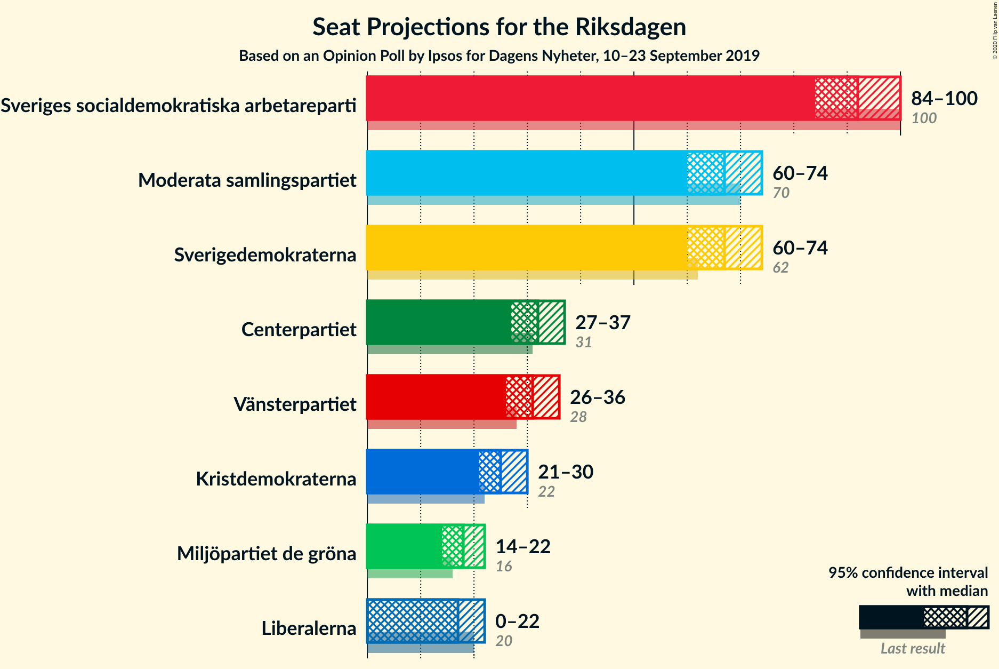
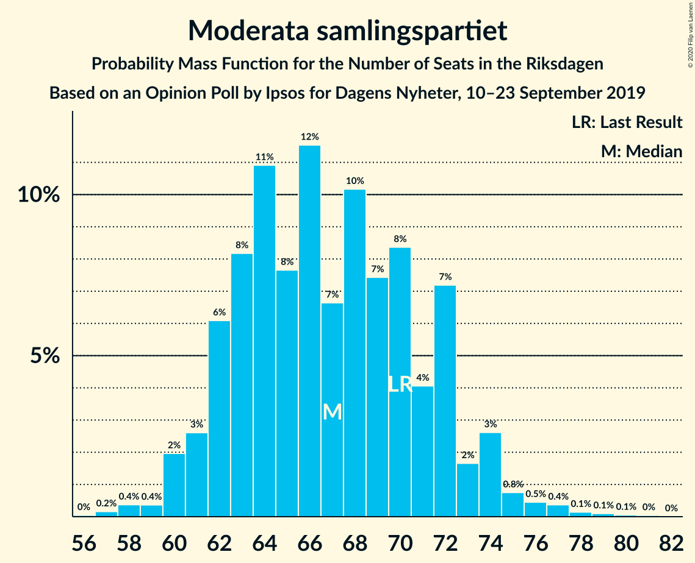
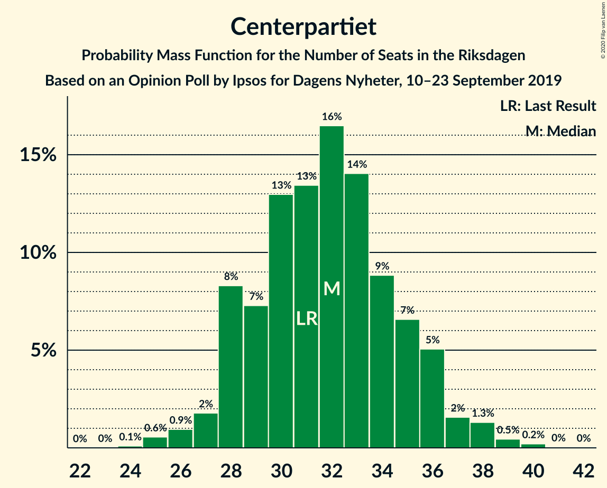
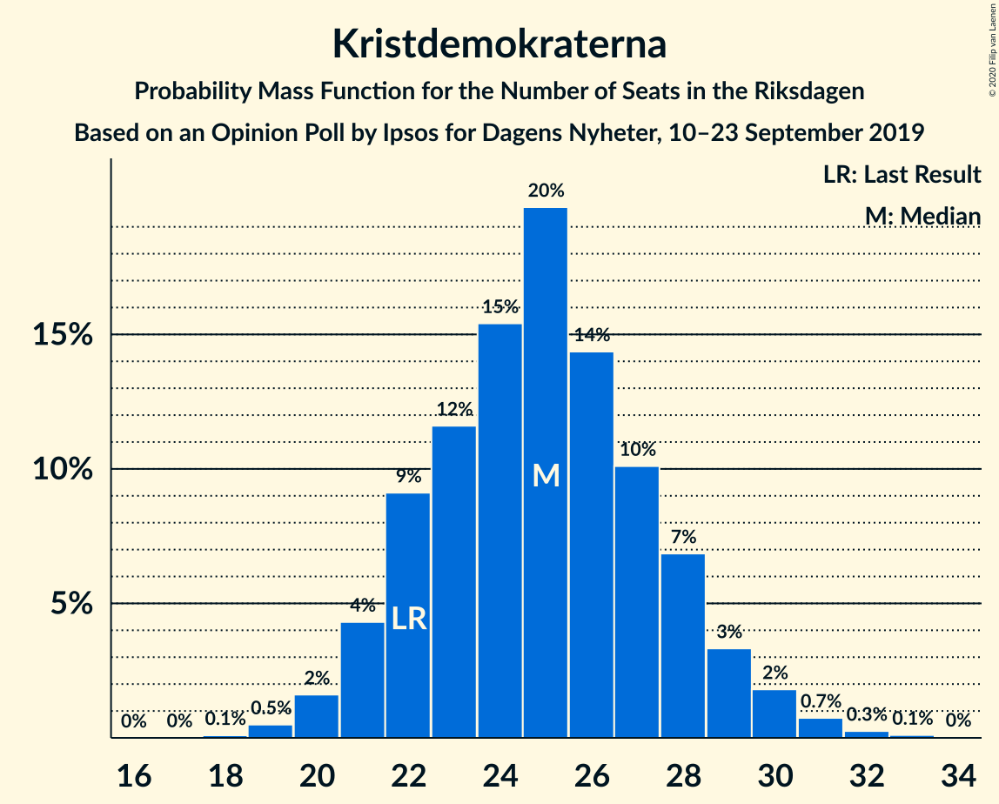

# Opinion Poll by Ipsos for Dagens Nyheter, 10–23 September 2019

<a href="#voting-intentions">Voting Intentions</a> | <a href="#seats">Seats</a> | <a href="#coalitions">Coalitions</a> | <a href="#technical-information">Technical Information</a>

## Voting Intentions

### Confidence Intervals

| Party | Last Result | Poll Result | 80% Confidence Interval | 90% Confidence Interval | 95% Confidence Interval | 99% Confidence Interval |
|:-----:|:-----------:|:-----------:|:-----------------------:|:-----------------------:|:-----------------------:|:-----------------------:|
| Sveriges socialdemokratiska arbetareparti | 28.3% | 26.0% | 24.6–27.5% |24.2–27.9% |23.9–28.3% |23.2–29.0% |
| Moderata samlingspartiet | 19.8% | 19.0% | 17.8–20.3% |17.4–20.7% |17.1–21.0% |16.5–21.7% |
| Sverigedemokraterna | 17.5% | 19.0% | 17.8–20.3% |17.4–20.7% |17.1–21.0% |16.5–21.7% |
| Centerpartiet | 8.6% | 9.0% | 8.1–10.0% |7.8–10.3% |7.7–10.5% |7.2–11.0% |
| Vänsterpartiet | 8.0% | 9.0% | 8.1–10.0% |7.8–10.3% |7.7–10.5% |7.2–11.0% |
| Kristdemokraterna | 6.3% | 7.0% | 6.2–7.9% |6.0–8.2% |5.9–8.4% |5.5–8.9% |
| Liberalerna | 5.5% | 5.0% | 4.4–5.8% |4.2–6.0% |4.0–6.2% |3.7–6.6% |
| Miljöpartiet de gröna | 4.4% | 5.0% | 4.4–5.8% |4.2–6.0% |4.0–6.2% |3.7–6.6% |

*Note:* The poll result column reflects the actual value used in the calculations. Published results may vary slightly, and in addition be rounded to fewer digits.

## Seats

### Confidence Intervals

| Party | Last Result | Median | 80% Confidence Interval | 90% Confidence Interval | 95% Confidence Interval | 99% Confidence Interval |
|:-----:|:-----------:|:------:|:-----------------------:|:-----------------------:|:-----------------------:|:-----------------------:|
| <a href="#sveriges-socialdemokratiska-arbetareparti">Sveriges socialdemokratiska arbetareparti</a> | 100 | 92 | 87–97 |85–99 |84–101 |82–103 |
| <a href="#moderata-samlingspartiet">Moderata samlingspartiet</a> | 70 | 67 | 62–72 |61–73 |60–74 |58–77 |
| <a href="#sverigedemokraterna">Sverigedemokraterna</a> | 62 | 67 | 63–72 |61–74 |60–75 |58–77 |
| <a href="#centerpartiet">Centerpartiet</a> | 31 | 32 | 28–35 |28–36 |28–37 |25–39 |
| <a href="#vänsterpartiet">Vänsterpartiet</a> | 28 | 31 | 29–35 |29–35 |26–37 |25–39 |
| <a href="#kristdemokraterna">Kristdemokraterna</a> | 22 | 25 | 22–28 |21–29 |21–30 |19–32 |
| <a href="#liberalerna">Liberalerna</a> | 20 | 17 | 16–20 |0–22 |0–22 |0–22 |
| <a href="#miljöpartiet-de-gröna">Miljöpartiet de gröna</a> | 16 | 18 | 15–20 |14–21 |0–22 |0–23 |

### Sveriges socialdemokratiska arbetareparti

*For a full overview of the results for this party, see the [Sveriges socialdemokratiska arbetareparti](party-sverigessocialdemokratiskaarbetareparti.html) page.*

| Number of Seats | Probability | Accumulated | Special Marks |
|:---------------:|:-----------:|:-----------:|:-------------:|
| 79 | 0% | 100% |  |
| 80 | 0.1% | 99.9% |  |
| 81 | 0.2% | 99.8% |  |
| 82 | 0.4% | 99.6% |  |
| 83 | 1.1% | 99.2% |  |
| 84 | 2% | 98% |  |
| 85 | 2% | 96% |  |
| 86 | 3% | 94% |  |
| 87 | 6% | 91% |  |
| 88 | 6% | 86% |  |
| 89 | 4% | 80% |  |
| 90 | 11% | 76% |  |
| 91 | 7% | 64% |  |
| 92 | 13% | 57% | Median |
| 93 | 9% | 44% |  |
| 94 | 6% | 35% |  |
| 95 | 9% | 28% |  |
| 96 | 6% | 19% |  |
| 97 | 3% | 13% |  |
| 98 | 4% | 10% |  |
| 99 | 2% | 6% |  |
| 100 | 1.1% | 4% | Last Result |
| 101 | 2% | 3% |  |
| 102 | 0.4% | 1.0% |  |
| 103 | 0.1% | 0.6% |  |
| 104 | 0.2% | 0.4% |  |
| 105 | 0.1% | 0.2% |  |
| 106 | 0% | 0.1% |  |
| 107 | 0% | 0.1% |  |
| 108 | 0% | 0% |  |

### Moderata samlingspartiet

*For a full overview of the results for this party, see the [Moderata samlingspartiet](party-moderatasamlingspartiet.html) page.*

| Number of Seats | Probability | Accumulated | Special Marks |
|:---------------:|:-----------:|:-----------:|:-------------:|
| 55 | 0.1% | 100% |  |
| 56 | 0.1% | 99.9% |  |
| 57 | 0.1% | 99.9% |  |
| 58 | 0.5% | 99.7% |  |
| 59 | 0.3% | 99.2% |  |
| 60 | 2% | 98.9% |  |
| 61 | 4% | 97% |  |
| 62 | 4% | 93% |  |
| 63 | 9% | 89% |  |
| 64 | 12% | 80% |  |
| 65 | 8% | 68% |  |
| 66 | 7% | 59% |  |
| 67 | 7% | 52% | Median |
| 68 | 7% | 45% |  |
| 69 | 12% | 39% |  |
| 70 | 8% | 27% | Last Result |
| 71 | 2% | 19% |  |
| 72 | 11% | 17% |  |
| 73 | 2% | 6% |  |
| 74 | 2% | 4% |  |
| 75 | 0.8% | 2% |  |
| 76 | 0.2% | 1.2% |  |
| 77 | 0.5% | 1.0% |  |
| 78 | 0.2% | 0.4% |  |
| 79 | 0% | 0.2% |  |
| 80 | 0.1% | 0.2% |  |
| 81 | 0.1% | 0.1% |  |
| 82 | 0% | 0% |  |

### Sverigedemokraterna

*For a full overview of the results for this party, see the [Sverigedemokraterna](party-sverigedemokraterna.html) page.*

| Number of Seats | Probability | Accumulated | Special Marks |
|:---------------:|:-----------:|:-----------:|:-------------:|
| 56 | 0.1% | 100% |  |
| 57 | 0.4% | 99.9% |  |
| 58 | 0.2% | 99.5% |  |
| 59 | 1.3% | 99.3% |  |
| 60 | 2% | 98% |  |
| 61 | 2% | 96% |  |
| 62 | 3% | 94% | Last Result |
| 63 | 3% | 91% |  |
| 64 | 11% | 88% |  |
| 65 | 10% | 77% |  |
| 66 | 12% | 67% |  |
| 67 | 8% | 55% | Median |
| 68 | 8% | 47% |  |
| 69 | 13% | 39% |  |
| 70 | 9% | 26% |  |
| 71 | 4% | 16% |  |
| 72 | 4% | 12% |  |
| 73 | 2% | 9% |  |
| 74 | 4% | 7% |  |
| 75 | 2% | 3% |  |
| 76 | 1.0% | 2% |  |
| 77 | 0.2% | 0.6% |  |
| 78 | 0.2% | 0.4% |  |
| 79 | 0.1% | 0.2% |  |
| 80 | 0.1% | 0.1% |  |
| 81 | 0% | 0% |  |

### Centerpartiet

*For a full overview of the results for this party, see the [Centerpartiet](party-centerpartiet.html) page.*

| Number of Seats | Probability | Accumulated | Special Marks |
|:---------------:|:-----------:|:-----------:|:-------------:|
| 24 | 0.1% | 100% |  |
| 25 | 0.5% | 99.9% |  |
| 26 | 0.8% | 99.4% |  |
| 27 | 1.0% | 98.6% |  |
| 28 | 9% | 98% |  |
| 29 | 7% | 88% |  |
| 30 | 11% | 81% |  |
| 31 | 17% | 70% | Last Result |
| 32 | 17% | 53% | Median |
| 33 | 12% | 36% |  |
| 34 | 10% | 24% |  |
| 35 | 6% | 14% |  |
| 36 | 5% | 8% |  |
| 37 | 2% | 4% |  |
| 38 | 1.0% | 2% |  |
| 39 | 0.4% | 0.7% |  |
| 40 | 0.2% | 0.3% |  |
| 41 | 0% | 0.1% |  |
| 42 | 0% | 0% |  |

### Vänsterpartiet

*For a full overview of the results for this party, see the [Vänsterpartiet](party-vänsterpartiet.html) page.*

| Number of Seats | Probability | Accumulated | Special Marks |
|:---------------:|:-----------:|:-----------:|:-------------:|
| 25 | 0.7% | 100% |  |
| 26 | 2% | 99.2% |  |
| 27 | 0.3% | 97% |  |
| 28 | 0.1% | 96% | Last Result |
| 29 | 8% | 96% |  |
| 30 | 37% | 89% |  |
| 31 | 9% | 52% | Median |
| 32 | 0.9% | 43% |  |
| 33 | 4% | 42% |  |
| 34 | 23% | 38% |  |
| 35 | 10% | 14% |  |
| 36 | 1.3% | 4% |  |
| 37 | 0.7% | 3% |  |
| 38 | 1.1% | 2% |  |
| 39 | 0.9% | 1.1% |  |
| 40 | 0.1% | 0.2% |  |
| 41 | 0% | 0.1% |  |
| 42 | 0% | 0% |  |

### Kristdemokraterna

*For a full overview of the results for this party, see the [Kristdemokraterna](party-kristdemokraterna.html) page.*

| Number of Seats | Probability | Accumulated | Special Marks |
|:---------------:|:-----------:|:-----------:|:-------------:|
| 18 | 0.1% | 100% |  |
| 19 | 0.6% | 99.8% |  |
| 20 | 2% | 99.3% |  |
| 21 | 5% | 98% |  |
| 22 | 10% | 93% | Last Result |
| 23 | 13% | 83% |  |
| 24 | 17% | 70% |  |
| 25 | 18% | 53% | Median |
| 26 | 12% | 35% |  |
| 27 | 9% | 23% |  |
| 28 | 6% | 15% |  |
| 29 | 5% | 8% |  |
| 30 | 2% | 3% |  |
| 31 | 0.8% | 1.3% |  |
| 32 | 0.4% | 0.6% |  |
| 33 | 0.1% | 0.2% |  |
| 34 | 0% | 0% |  |

### Liberalerna

*For a full overview of the results for this party, see the [Liberalerna](party-liberalerna.html) page.*

| Number of Seats | Probability | Accumulated | Special Marks |
|:---------------:|:-----------:|:-----------:|:-------------:|
| 0 | 5% | 100% |  |
| 1 | 0% | 95% |  |
| 2 | 0% | 95% |  |
| 3 | 0% | 95% |  |
| 4 | 0% | 95% |  |
| 5 | 0% | 95% |  |
| 6 | 0% | 95% |  |
| 7 | 0% | 95% |  |
| 8 | 0% | 95% |  |
| 9 | 0% | 95% |  |
| 10 | 0% | 95% |  |
| 11 | 0% | 95% |  |
| 12 | 0% | 95% |  |
| 13 | 0% | 95% |  |
| 14 | 0.9% | 95% |  |
| 15 | 0.1% | 94% |  |
| 16 | 30% | 94% |  |
| 17 | 20% | 64% | Median |
| 18 | 0% | 44% |  |
| 19 | 31% | 44% |  |
| 20 | 5% | 12% | Last Result |
| 21 | 0.2% | 7% |  |
| 22 | 6% | 7% |  |
| 23 | 0.1% | 0.4% |  |
| 24 | 0.1% | 0.3% |  |
| 25 | 0.1% | 0.2% |  |
| 26 | 0% | 0% |  |

### Miljöpartiet de gröna

*For a full overview of the results for this party, see the [Miljöpartiet de gröna](party-miljöpartietdegröna.html) page.*

| Number of Seats | Probability | Accumulated | Special Marks |
|:---------------:|:-----------:|:-----------:|:-------------:|
| 0 | 3% | 100% |  |
| 1 | 0% | 97% |  |
| 2 | 0% | 97% |  |
| 3 | 0% | 97% |  |
| 4 | 0% | 97% |  |
| 5 | 0% | 97% |  |
| 6 | 0% | 97% |  |
| 7 | 0% | 97% |  |
| 8 | 0% | 97% |  |
| 9 | 0% | 97% |  |
| 10 | 0% | 97% |  |
| 11 | 0% | 97% |  |
| 12 | 0% | 97% |  |
| 13 | 0% | 97% |  |
| 14 | 2% | 97% |  |
| 15 | 6% | 95% |  |
| 16 | 12% | 88% | Last Result |
| 17 | 25% | 77% |  |
| 18 | 12% | 52% | Median |
| 19 | 19% | 40% |  |
| 20 | 11% | 21% |  |
| 21 | 6% | 10% |  |
| 22 | 2% | 3% |  |
| 23 | 0.5% | 0.8% |  |
| 24 | 0.2% | 0.3% |  |
| 25 | 0.1% | 0.1% |  |
| 26 | 0% | 0% |  |

## Coalitions

### Confidence Intervals

| Coalition | Last Result | Median | Majority? | 80% Confidence Interval | 90% Confidence Interval | 95% Confidence Interval | 99% Confidence Interval |
|:---------:|:-----------:|:------:|:---------:|:-----------------------:|:-----------------------:|:-----------------------:|:-----------------------:|
| Sveriges socialdemokratiska arbetareparti – Moderata samlingspartiet – Centerpartiet | 201 | 191 | 100% | 184–197 | 182–199 | 181–201 | 179–207 |
| Sveriges socialdemokratiska arbetareparti – Centerpartiet – Vänsterpartiet – Liberalerna – Miljöpartiet de gröna | 195 | 191 | 99.6% | 183–196 | 182–197 | 179–198 | 175–202 |
| Moderata samlingspartiet – Sverigedemokraterna – Kristdemokraterna | 154 | 158 | 0.4% | 153–166 | 152–167 | 151–170 | 147–174 |
| Sveriges socialdemokratiska arbetareparti – Moderata samlingspartiet | 170 | 159 | 0.3% | 153–165 | 151–167 | 150–169 | 146–174 |
| Sveriges socialdemokratiska arbetareparti – Centerpartiet – Liberalerna – Miljöpartiet de gröna | 167 | 159 | 0% | 151–164 | 149–166 | 146–167 | 142–170 |
| Sveriges socialdemokratiska arbetareparti – Vänsterpartiet – Miljöpartiet de gröna | 144 | 141 | 0% | 135–148 | 134–149 | 131–152 | 124–155 |
| Moderata samlingspartiet – Centerpartiet – Kristdemokraterna – Liberalerna | 143 | 140 | 0% | 134–148 | 131–149 | 128–151 | 124–155 |
| Moderata samlingspartiet – Sverigedemokraterna | 132 | 134 | 0% | 130–139 | 129–143 | 125–144 | 122–147 |
| Sveriges socialdemokratiska arbetareparti – Vänsterpartiet | 128 | 124 | 0% | 118–129 | 117–132 | 115–134 | 113–136 |
| Moderata samlingspartiet – Centerpartiet – Kristdemokraterna | 123 | 123 | 0% | 117–130 | 115–133 | 114–133 | 113–137 |
| Moderata samlingspartiet – Centerpartiet – Liberalerna | 121 | 116 | 0% | 110–122 | 107–124 | 101–125 | 98–128 |
| Sveriges socialdemokratiska arbetareparti – Miljöpartiet de gröna | 116 | 110 | 0% | 104–116 | 101–117 | 99–118 | 91–121 |
| Moderata samlingspartiet – Centerpartiet | 101 | 99 | 0% | 93–104 | 91–106 | 91–108 | 88–111 |

### Sveriges socialdemokratiska arbetareparti – Moderata samlingspartiet – Centerpartiet

| Number of Seats | Probability | Accumulated | Special Marks |
|:---------------:|:-----------:|:-----------:|:-------------:|
| 175 | 0% | 100% | Majority |
| 176 | 0% | 99.9% |  |
| 177 | 0.2% | 99.9% |  |
| 178 | 0.2% | 99.7% |  |
| 179 | 0.4% | 99.5% |  |
| 180 | 1.2% | 99.1% |  |
| 181 | 1.4% | 98% |  |
| 182 | 3% | 97% |  |
| 183 | 3% | 94% |  |
| 184 | 3% | 91% |  |
| 185 | 3% | 88% |  |
| 186 | 3% | 85% |  |
| 187 | 8% | 82% |  |
| 188 | 7% | 73% |  |
| 189 | 6% | 66% |  |
| 190 | 4% | 60% |  |
| 191 | 7% | 56% | Median |
| 192 | 11% | 49% |  |
| 193 | 14% | 39% |  |
| 194 | 3% | 25% |  |
| 195 | 8% | 22% |  |
| 196 | 4% | 14% |  |
| 197 | 1.3% | 10% |  |
| 198 | 3% | 9% |  |
| 199 | 2% | 6% |  |
| 200 | 0.7% | 4% |  |
| 201 | 0.8% | 3% | Last Result |
| 202 | 0.4% | 2% |  |
| 203 | 0.4% | 2% |  |
| 204 | 0.1% | 2% |  |
| 205 | 0.5% | 1.5% |  |
| 206 | 0.4% | 1.0% |  |
| 207 | 0.1% | 0.6% |  |
| 208 | 0.2% | 0.5% |  |
| 209 | 0% | 0.2% |  |
| 210 | 0.1% | 0.2% |  |
| 211 | 0% | 0.2% |  |
| 212 | 0% | 0.1% |  |
| 213 | 0% | 0.1% |  |
| 214 | 0% | 0% |  |

### Sveriges socialdemokratiska arbetareparti – Centerpartiet – Vänsterpartiet – Liberalerna – Miljöpartiet de gröna

| Number of Seats | Probability | Accumulated | Special Marks |
|:---------------:|:-----------:|:-----------:|:-------------:|
| 171 | 0% | 100% |  |
| 172 | 0% | 99.9% |  |
| 173 | 0.1% | 99.9% |  |
| 174 | 0.2% | 99.8% |  |
| 175 | 0.2% | 99.6% | Majority |
| 176 | 0.3% | 99.4% |  |
| 177 | 0.1% | 99.1% |  |
| 178 | 0.3% | 98.9% |  |
| 179 | 1.2% | 98.6% |  |
| 180 | 1.0% | 97% |  |
| 181 | 0.9% | 96% |  |
| 182 | 2% | 95% |  |
| 183 | 3% | 93% |  |
| 184 | 5% | 90% |  |
| 185 | 3% | 85% |  |
| 186 | 4% | 83% |  |
| 187 | 5% | 79% |  |
| 188 | 9% | 74% |  |
| 189 | 11% | 65% |  |
| 190 | 4% | 54% | Median |
| 191 | 11% | 50% |  |
| 192 | 7% | 39% |  |
| 193 | 8% | 32% |  |
| 194 | 10% | 24% |  |
| 195 | 4% | 15% | Last Result |
| 196 | 4% | 10% |  |
| 197 | 2% | 7% |  |
| 198 | 2% | 4% |  |
| 199 | 0.7% | 2% |  |
| 200 | 0.7% | 2% |  |
| 201 | 0.4% | 0.9% |  |
| 202 | 0.3% | 0.6% |  |
| 203 | 0.1% | 0.3% |  |
| 204 | 0.1% | 0.1% |  |
| 205 | 0.1% | 0.1% |  |
| 206 | 0% | 0% |  |

### Moderata samlingspartiet – Sverigedemokraterna – Kristdemokraterna

| Number of Seats | Probability | Accumulated | Special Marks |
|:---------------:|:-----------:|:-----------:|:-------------:|
| 144 | 0.1% | 100% |  |
| 145 | 0.1% | 99.9% |  |
| 146 | 0.1% | 99.9% |  |
| 147 | 0.3% | 99.7% |  |
| 148 | 0.4% | 99.4% |  |
| 149 | 0.7% | 99.1% |  |
| 150 | 0.7% | 98% |  |
| 151 | 2% | 98% |  |
| 152 | 2% | 96% |  |
| 153 | 4% | 93% |  |
| 154 | 4% | 90% | Last Result |
| 155 | 10% | 85% |  |
| 156 | 8% | 76% |  |
| 157 | 7% | 68% |  |
| 158 | 11% | 61% |  |
| 159 | 4% | 50% | Median |
| 160 | 11% | 46% |  |
| 161 | 9% | 35% |  |
| 162 | 5% | 26% |  |
| 163 | 4% | 21% |  |
| 164 | 3% | 17% |  |
| 165 | 5% | 15% |  |
| 166 | 3% | 10% |  |
| 167 | 2% | 7% |  |
| 168 | 0.9% | 5% |  |
| 169 | 1.0% | 4% |  |
| 170 | 1.2% | 3% |  |
| 171 | 0.3% | 1.4% |  |
| 172 | 0.1% | 1.1% |  |
| 173 | 0.3% | 0.9% |  |
| 174 | 0.2% | 0.6% |  |
| 175 | 0.2% | 0.4% | Majority |
| 176 | 0.1% | 0.2% |  |
| 177 | 0% | 0.1% |  |
| 178 | 0% | 0.1% |  |
| 179 | 0% | 0% |  |

### Sveriges socialdemokratiska arbetareparti – Moderata samlingspartiet

| Number of Seats | Probability | Accumulated | Special Marks |
|:---------------:|:-----------:|:-----------:|:-------------:|
| 144 | 0.1% | 100% |  |
| 145 | 0.1% | 99.9% |  |
| 146 | 0.3% | 99.8% |  |
| 147 | 0.3% | 99.5% |  |
| 148 | 0.7% | 99.2% |  |
| 149 | 0.3% | 98.5% |  |
| 150 | 3% | 98% |  |
| 151 | 2% | 95% |  |
| 152 | 2% | 93% |  |
| 153 | 4% | 90% |  |
| 154 | 6% | 86% |  |
| 155 | 4% | 80% |  |
| 156 | 8% | 77% |  |
| 157 | 7% | 69% |  |
| 158 | 6% | 62% |  |
| 159 | 13% | 56% | Median |
| 160 | 9% | 44% |  |
| 161 | 3% | 35% |  |
| 162 | 5% | 32% |  |
| 163 | 5% | 26% |  |
| 164 | 9% | 22% |  |
| 165 | 4% | 12% |  |
| 166 | 3% | 9% |  |
| 167 | 1.3% | 5% |  |
| 168 | 0.6% | 4% |  |
| 169 | 1.0% | 3% |  |
| 170 | 0.8% | 2% | Last Result |
| 171 | 0.5% | 2% |  |
| 172 | 0.2% | 1.1% |  |
| 173 | 0.2% | 0.8% |  |
| 174 | 0.3% | 0.6% |  |
| 175 | 0.1% | 0.3% | Majority |
| 176 | 0.1% | 0.2% |  |
| 177 | 0% | 0.1% |  |
| 178 | 0% | 0.1% |  |
| 179 | 0% | 0.1% |  |
| 180 | 0% | 0% |  |

### Sveriges socialdemokratiska arbetareparti – Centerpartiet – Liberalerna – Miljöpartiet de gröna

| Number of Seats | Probability | Accumulated | Special Marks |
|:---------------:|:-----------:|:-----------:|:-------------:|
| 137 | 0.1% | 100% |  |
| 138 | 0% | 99.9% |  |
| 139 | 0.1% | 99.9% |  |
| 140 | 0.1% | 99.8% |  |
| 141 | 0.1% | 99.7% |  |
| 142 | 0.2% | 99.6% |  |
| 143 | 0.2% | 99.4% |  |
| 144 | 0.3% | 99.2% |  |
| 145 | 0.2% | 98.9% |  |
| 146 | 1.3% | 98.7% |  |
| 147 | 0.9% | 97% |  |
| 148 | 0.8% | 96% |  |
| 149 | 3% | 96% |  |
| 150 | 1.2% | 93% |  |
| 151 | 2% | 92% |  |
| 152 | 3% | 90% |  |
| 153 | 5% | 87% |  |
| 154 | 7% | 81% |  |
| 155 | 2% | 74% |  |
| 156 | 6% | 72% |  |
| 157 | 4% | 66% |  |
| 158 | 5% | 62% |  |
| 159 | 13% | 58% | Median |
| 160 | 10% | 45% |  |
| 161 | 10% | 35% |  |
| 162 | 7% | 24% |  |
| 163 | 3% | 17% |  |
| 164 | 6% | 14% |  |
| 165 | 2% | 9% |  |
| 166 | 2% | 6% |  |
| 167 | 2% | 4% | Last Result |
| 168 | 0.4% | 2% |  |
| 169 | 0.5% | 1.2% |  |
| 170 | 0.2% | 0.6% |  |
| 171 | 0.3% | 0.5% |  |
| 172 | 0.1% | 0.2% |  |
| 173 | 0% | 0.1% |  |
| 174 | 0% | 0% |  |

### Sveriges socialdemokratiska arbetareparti – Vänsterpartiet – Miljöpartiet de gröna

| Number of Seats | Probability | Accumulated | Special Marks |
|:---------------:|:-----------:|:-----------:|:-------------:|
| 121 | 0.1% | 100% |  |
| 122 | 0% | 99.9% |  |
| 123 | 0% | 99.9% |  |
| 124 | 0.4% | 99.9% |  |
| 125 | 0.1% | 99.5% |  |
| 126 | 0.1% | 99.4% |  |
| 127 | 0.1% | 99.3% |  |
| 128 | 0.2% | 99.2% |  |
| 129 | 0.5% | 98.9% |  |
| 130 | 0.7% | 98% |  |
| 131 | 0.5% | 98% |  |
| 132 | 2% | 97% |  |
| 133 | 0.7% | 96% |  |
| 134 | 5% | 95% |  |
| 135 | 4% | 90% |  |
| 136 | 4% | 87% |  |
| 137 | 3% | 83% |  |
| 138 | 6% | 80% |  |
| 139 | 10% | 74% |  |
| 140 | 8% | 64% |  |
| 141 | 7% | 56% | Median |
| 142 | 9% | 48% |  |
| 143 | 7% | 40% |  |
| 144 | 6% | 33% | Last Result |
| 145 | 7% | 27% |  |
| 146 | 7% | 21% |  |
| 147 | 3% | 14% |  |
| 148 | 5% | 11% |  |
| 149 | 2% | 6% |  |
| 150 | 0.7% | 4% |  |
| 151 | 0.6% | 3% |  |
| 152 | 2% | 3% |  |
| 153 | 0.2% | 1.2% |  |
| 154 | 0.2% | 1.1% |  |
| 155 | 0.6% | 0.9% |  |
| 156 | 0.1% | 0.3% |  |
| 157 | 0.1% | 0.2% |  |
| 158 | 0% | 0.1% |  |
| 159 | 0% | 0.1% |  |
| 160 | 0% | 0% |  |

### Moderata samlingspartiet – Centerpartiet – Kristdemokraterna – Liberalerna

| Number of Seats | Probability | Accumulated | Special Marks |
|:---------------:|:-----------:|:-----------:|:-------------:|
| 120 | 0.1% | 100% |  |
| 121 | 0.3% | 99.9% |  |
| 122 | 0% | 99.6% |  |
| 123 | 0.1% | 99.6% |  |
| 124 | 0.6% | 99.6% |  |
| 125 | 0.2% | 98.9% |  |
| 126 | 0.9% | 98.8% |  |
| 127 | 0.3% | 98% |  |
| 128 | 0.3% | 98% |  |
| 129 | 0.2% | 97% |  |
| 130 | 2% | 97% |  |
| 131 | 1.1% | 96% |  |
| 132 | 0.8% | 94% |  |
| 133 | 2% | 94% |  |
| 134 | 6% | 92% |  |
| 135 | 2% | 86% |  |
| 136 | 7% | 83% |  |
| 137 | 5% | 76% |  |
| 138 | 9% | 71% |  |
| 139 | 8% | 61% |  |
| 140 | 7% | 54% |  |
| 141 | 5% | 47% | Median |
| 142 | 5% | 42% |  |
| 143 | 4% | 37% | Last Result |
| 144 | 4% | 32% |  |
| 145 | 6% | 28% |  |
| 146 | 8% | 22% |  |
| 147 | 3% | 14% |  |
| 148 | 1.4% | 11% |  |
| 149 | 5% | 9% |  |
| 150 | 1.2% | 4% |  |
| 151 | 0.9% | 3% |  |
| 152 | 1.0% | 2% |  |
| 153 | 0.5% | 1.1% |  |
| 154 | 0.1% | 0.6% |  |
| 155 | 0.2% | 0.5% |  |
| 156 | 0.1% | 0.3% |  |
| 157 | 0.1% | 0.2% |  |
| 158 | 0.1% | 0.1% |  |
| 159 | 0% | 0% |  |

### Moderata samlingspartiet – Sverigedemokraterna

| Number of Seats | Probability | Accumulated | Special Marks |
|:---------------:|:-----------:|:-----------:|:-------------:|
| 121 | 0.1% | 100% |  |
| 122 | 0.5% | 99.9% |  |
| 123 | 0.8% | 99.4% |  |
| 124 | 0.6% | 98.6% |  |
| 125 | 1.1% | 98% |  |
| 126 | 0.3% | 97% |  |
| 127 | 0.5% | 97% |  |
| 128 | 0.9% | 96% |  |
| 129 | 5% | 95% |  |
| 130 | 11% | 90% |  |
| 131 | 5% | 79% |  |
| 132 | 14% | 74% | Last Result |
| 133 | 10% | 60% |  |
| 134 | 2% | 50% | Median |
| 135 | 5% | 48% |  |
| 136 | 15% | 43% |  |
| 137 | 9% | 28% |  |
| 138 | 4% | 19% |  |
| 139 | 6% | 14% |  |
| 140 | 0.8% | 8% |  |
| 141 | 0.6% | 7% |  |
| 142 | 0.4% | 6% |  |
| 143 | 3% | 6% |  |
| 144 | 1.2% | 3% |  |
| 145 | 1.1% | 2% |  |
| 146 | 0.5% | 1.1% |  |
| 147 | 0.2% | 0.6% |  |
| 148 | 0.1% | 0.5% |  |
| 149 | 0.2% | 0.4% |  |
| 150 | 0.1% | 0.3% |  |
| 151 | 0% | 0.2% |  |
| 152 | 0.1% | 0.1% |  |
| 153 | 0% | 0% |  |

### Sveriges socialdemokratiska arbetareparti – Vänsterpartiet

| Number of Seats | Probability | Accumulated | Special Marks |
|:---------------:|:-----------:|:-----------:|:-------------:|
| 110 | 0.1% | 100% |  |
| 111 | 0.1% | 99.9% |  |
| 112 | 0.2% | 99.8% |  |
| 113 | 0.4% | 99.5% |  |
| 114 | 0.7% | 99.1% |  |
| 115 | 1.5% | 98% |  |
| 116 | 1.4% | 97% |  |
| 117 | 4% | 96% |  |
| 118 | 4% | 92% |  |
| 119 | 4% | 88% |  |
| 120 | 7% | 83% |  |
| 121 | 8% | 76% |  |
| 122 | 10% | 69% |  |
| 123 | 6% | 58% | Median |
| 124 | 8% | 52% |  |
| 125 | 11% | 45% |  |
| 126 | 5% | 34% |  |
| 127 | 10% | 29% |  |
| 128 | 4% | 19% | Last Result |
| 129 | 6% | 15% |  |
| 130 | 1.3% | 9% |  |
| 131 | 2% | 8% |  |
| 132 | 2% | 6% |  |
| 133 | 0.6% | 4% |  |
| 134 | 2% | 3% |  |
| 135 | 0.7% | 1.5% |  |
| 136 | 0.3% | 0.7% |  |
| 137 | 0.1% | 0.4% |  |
| 138 | 0.1% | 0.3% |  |
| 139 | 0.1% | 0.2% |  |
| 140 | 0% | 0.1% |  |
| 141 | 0% | 0.1% |  |
| 142 | 0% | 0% |  |

### Moderata samlingspartiet – Centerpartiet – Kristdemokraterna

| Number of Seats | Probability | Accumulated | Special Marks |
|:---------------:|:-----------:|:-----------:|:-------------:|
| 110 | 0.1% | 100% |  |
| 111 | 0.2% | 99.9% |  |
| 112 | 0.2% | 99.7% |  |
| 113 | 0.4% | 99.6% |  |
| 114 | 2% | 99.1% |  |
| 115 | 2% | 97% |  |
| 116 | 2% | 95% |  |
| 117 | 4% | 93% |  |
| 118 | 7% | 89% |  |
| 119 | 5% | 82% |  |
| 120 | 7% | 76% |  |
| 121 | 5% | 69% |  |
| 122 | 9% | 65% |  |
| 123 | 7% | 55% | Last Result |
| 124 | 7% | 48% | Median |
| 125 | 4% | 41% |  |
| 126 | 6% | 37% |  |
| 127 | 10% | 31% |  |
| 128 | 4% | 21% |  |
| 129 | 4% | 17% |  |
| 130 | 5% | 13% |  |
| 131 | 2% | 9% |  |
| 132 | 0.9% | 6% |  |
| 133 | 3% | 6% |  |
| 134 | 0.4% | 2% |  |
| 135 | 0.6% | 2% |  |
| 136 | 0.7% | 1.3% |  |
| 137 | 0.2% | 0.6% |  |
| 138 | 0.2% | 0.5% |  |
| 139 | 0.1% | 0.3% |  |
| 140 | 0.1% | 0.2% |  |
| 141 | 0% | 0.1% |  |
| 142 | 0% | 0% |  |

### Moderata samlingspartiet – Centerpartiet – Liberalerna

| Number of Seats | Probability | Accumulated | Special Marks |
|:---------------:|:-----------:|:-----------:|:-------------:|
| 94 | 0% | 100% |  |
| 95 | 0.1% | 99.9% |  |
| 96 | 0.1% | 99.9% |  |
| 97 | 0.1% | 99.8% |  |
| 98 | 0.8% | 99.7% |  |
| 99 | 0.4% | 98.9% |  |
| 100 | 0.4% | 98% |  |
| 101 | 0.6% | 98% |  |
| 102 | 0.1% | 97% |  |
| 103 | 0.1% | 97% |  |
| 104 | 1.1% | 97% |  |
| 105 | 0.5% | 96% |  |
| 106 | 0.7% | 96% |  |
| 107 | 1.4% | 95% |  |
| 108 | 2% | 94% |  |
| 109 | 0.9% | 92% |  |
| 110 | 2% | 91% |  |
| 111 | 9% | 89% |  |
| 112 | 1.3% | 79% |  |
| 113 | 12% | 78% |  |
| 114 | 8% | 66% |  |
| 115 | 3% | 58% |  |
| 116 | 11% | 55% | Median |
| 117 | 9% | 43% |  |
| 118 | 3% | 35% |  |
| 119 | 8% | 32% |  |
| 120 | 4% | 23% |  |
| 121 | 0.9% | 19% | Last Result |
| 122 | 11% | 18% |  |
| 123 | 2% | 7% |  |
| 124 | 1.5% | 5% |  |
| 125 | 2% | 4% |  |
| 126 | 0.5% | 2% |  |
| 127 | 0.7% | 1.5% |  |
| 128 | 0.3% | 0.7% |  |
| 129 | 0.1% | 0.4% |  |
| 130 | 0.2% | 0.3% |  |
| 131 | 0% | 0.2% |  |
| 132 | 0% | 0.1% |  |
| 133 | 0.1% | 0.1% |  |
| 134 | 0% | 0% |  |

### Sveriges socialdemokratiska arbetareparti – Miljöpartiet de gröna

| Number of Seats | Probability | Accumulated | Special Marks |
|:---------------:|:-----------:|:-----------:|:-------------:|
| 89 | 0.1% | 100% |  |
| 90 | 0% | 99.9% |  |
| 91 | 0.4% | 99.8% |  |
| 92 | 0.1% | 99.4% |  |
| 93 | 0.1% | 99.3% |  |
| 94 | 0.2% | 99.2% |  |
| 95 | 0.2% | 99.0% |  |
| 96 | 0.1% | 98.9% |  |
| 97 | 0.7% | 98.8% |  |
| 98 | 0.5% | 98% |  |
| 99 | 0.9% | 98% |  |
| 100 | 0.5% | 97% |  |
| 101 | 1.3% | 96% |  |
| 102 | 1.4% | 95% |  |
| 103 | 3% | 93% |  |
| 104 | 6% | 91% |  |
| 105 | 3% | 85% |  |
| 106 | 8% | 82% |  |
| 107 | 5% | 74% |  |
| 108 | 5% | 69% |  |
| 109 | 12% | 63% |  |
| 110 | 7% | 52% | Median |
| 111 | 8% | 45% |  |
| 112 | 12% | 37% |  |
| 113 | 6% | 24% |  |
| 114 | 3% | 18% |  |
| 115 | 4% | 14% |  |
| 116 | 5% | 11% | Last Result |
| 117 | 2% | 6% |  |
| 118 | 2% | 4% |  |
| 119 | 0.8% | 2% |  |
| 120 | 0.3% | 1.5% |  |
| 121 | 0.7% | 1.2% |  |
| 122 | 0.3% | 0.5% |  |
| 123 | 0.1% | 0.2% |  |
| 124 | 0.1% | 0.1% |  |
| 125 | 0% | 0.1% |  |
| 126 | 0% | 0% |  |

### Moderata samlingspartiet – Centerpartiet

| Number of Seats | Probability | Accumulated | Special Marks |
|:---------------:|:-----------:|:-----------:|:-------------:|
| 85 | 0% | 100% |  |
| 86 | 0.1% | 99.9% |  |
| 87 | 0.1% | 99.8% |  |
| 88 | 0.3% | 99.7% |  |
| 89 | 2% | 99.4% |  |
| 90 | 0.2% | 98% |  |
| 91 | 3% | 98% |  |
| 92 | 4% | 95% |  |
| 93 | 0.9% | 91% |  |
| 94 | 6% | 90% |  |
| 95 | 8% | 84% |  |
| 96 | 5% | 76% |  |
| 97 | 16% | 71% |  |
| 98 | 5% | 55% |  |
| 99 | 5% | 50% | Median |
| 100 | 11% | 45% |  |
| 101 | 6% | 34% | Last Result |
| 102 | 4% | 28% |  |
| 103 | 10% | 23% |  |
| 104 | 3% | 13% |  |
| 105 | 3% | 10% |  |
| 106 | 4% | 7% |  |
| 107 | 1.0% | 4% |  |
| 108 | 1.2% | 3% |  |
| 109 | 0.5% | 1.4% |  |
| 110 | 0.3% | 0.8% |  |
| 111 | 0.2% | 0.6% |  |
| 112 | 0.1% | 0.4% |  |
| 113 | 0.1% | 0.3% |  |
| 114 | 0.1% | 0.2% |  |
| 115 | 0.1% | 0.1% |  |
| 116 | 0% | 0% |  |

## Technical Information

### Opinion Poll

+ **Polling firm:** Ipsos
+ **Commissioner(s):** Dagens Nyheter
+ **Fieldwork period:** 10–23 September 2019

### Calculations

+ **Sample size:** 1537
+ **Simulations done:** 524,288
+ **Error estimate:** 2.29%

