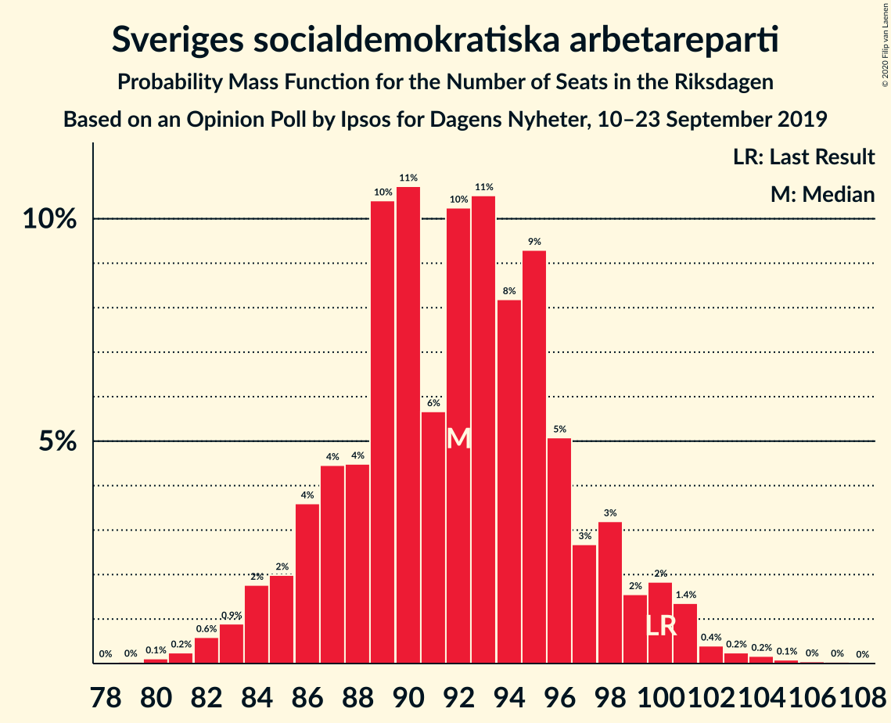
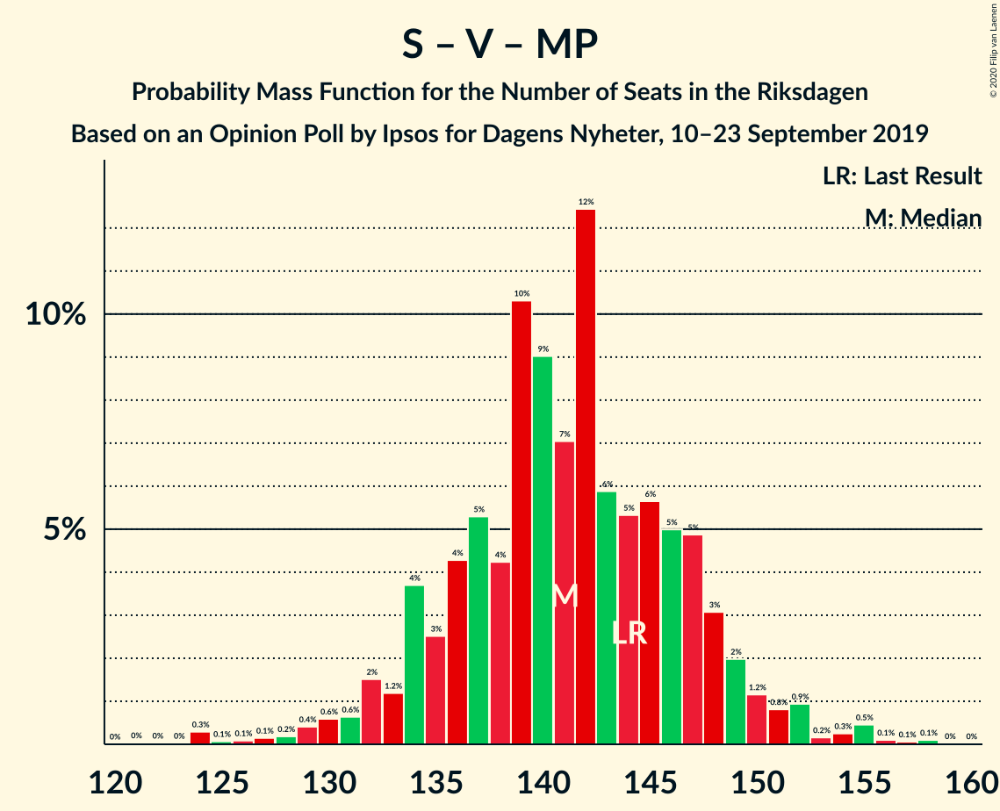
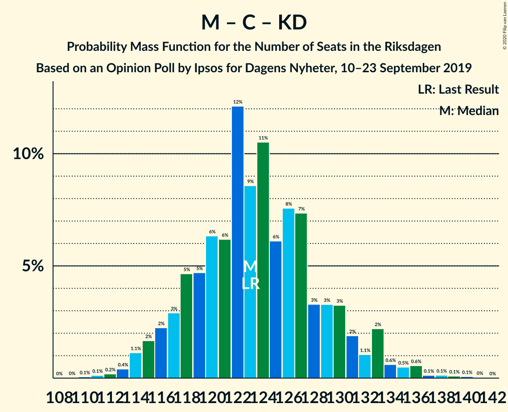
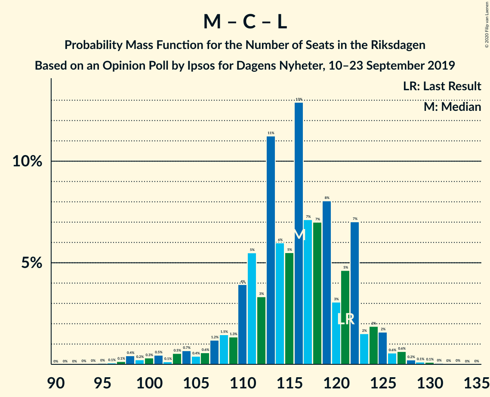

# Opinion Poll by Ipsos for Dagens Nyheter, 10–23 September 2019

<a href="#voting-intentions">Voting Intentions</a> | <a href="#seats">Seats</a> | <a href="#coalitions">Coalitions</a> | <a href="#technical-information">Technical Information</a>

## Voting Intentions

### Confidence Intervals

| Party | Last Result | Poll Result | 80% Confidence Interval | 90% Confidence Interval | 95% Confidence Interval | 99% Confidence Interval |
|:-----:|:-----------:|:-----------:|:-----------------------:|:-----------------------:|:-----------------------:|:-----------------------:|
| Sveriges socialdemokratiska arbetareparti | 28.3% | 26.0% | 24.6–27.5% |24.2–27.9% |23.9–28.3% |23.2–29.0% |
| Moderata samlingspartiet | 19.8% | 19.0% | 17.8–20.3% |17.4–20.7% |17.1–21.0% |16.5–21.7% |
| Sverigedemokraterna | 17.5% | 19.0% | 17.8–20.3% |17.4–20.7% |17.1–21.0% |16.5–21.7% |
| Centerpartiet | 8.6% | 9.0% | 8.1–10.0% |7.8–10.3% |7.7–10.5% |7.2–11.0% |
| Vänsterpartiet | 8.0% | 9.0% | 8.1–10.0% |7.8–10.3% |7.7–10.5% |7.2–11.0% |
| Kristdemokraterna | 6.3% | 7.0% | 6.2–7.9% |6.0–8.2% |5.9–8.4% |5.5–8.9% |
| Liberalerna | 5.5% | 5.0% | 4.4–5.8% |4.2–6.0% |4.0–6.2% |3.7–6.6% |
| Miljöpartiet de gröna | 4.4% | 5.0% | 4.4–5.8% |4.2–6.0% |4.0–6.2% |3.7–6.6% |

*Note:* The poll result column reflects the actual value used in the calculations. Published results may vary slightly, and in addition be rounded to fewer digits.

## Seats

### Confidence Intervals

| Party | Last Result | Median | 80% Confidence Interval | 90% Confidence Interval | 95% Confidence Interval | 99% Confidence Interval |
|:-----:|:-----------:|:------:|:-----------------------:|:-----------------------:|:-----------------------:|:-----------------------:|
| <a href="#sveriges-socialdemokratiska-arbetareparti">Sveriges socialdemokratiska arbetareparti</a> | 100 | 93 | 88–98 |87–99 |85–100 |83–102 |
| <a href="#moderata-samlingspartiet">Moderata samlingspartiet</a> | 70 | 66 | 61–70 |61–71 |60–73 |58–75 |
| <a href="#sverigedemokraterna">Sverigedemokraterna</a> | 62 | 69 | 64–70 |60–71 |60–72 |57–75 |
| <a href="#centerpartiet">Centerpartiet</a> | 31 | 32 | 29–35 |28–36 |28–37 |26–38 |
| <a href="#vänsterpartiet">Vänsterpartiet</a> | 28 | 33 | 29–34 |29–35 |29–38 |25–39 |
| <a href="#kristdemokraterna">Kristdemokraterna</a> | 22 | 25 | 22–27 |21–28 |20–29 |19–31 |
| <a href="#liberalerna">Liberalerna</a> | 20 | 17 | 16–20 |0–22 |0–22 |0–22 |
| <a href="#miljöpartiet-de-gröna">Miljöpartiet de gröna</a> | 16 | 18 | 16–20 |15–21 |0–22 |0–23 |

### Sveriges socialdemokratiska arbetareparti

*For a full overview of the results for this party, see the [Sveriges socialdemokratiska arbetareparti](party-sverigessocialdemokratiskaarbetareparti.html) page.*

| Number of Seats | Probability | Accumulated | Special Marks |
|:---------------:|:-----------:|:-----------:|:-------------:|
| 80 | 0% | 100% |  |
| 81 | 0.1% | 99.9% |  |
| 82 | 0.1% | 99.9% |  |
| 83 | 0.4% | 99.8% |  |
| 84 | 0.4% | 99.4% |  |
| 85 | 2% | 99.0% |  |
| 86 | 0.7% | 97% |  |
| 87 | 5% | 96% |  |
| 88 | 3% | 91% |  |
| 89 | 2% | 88% |  |
| 90 | 14% | 86% |  |
| 91 | 8% | 72% |  |
| 92 | 11% | 64% |  |
| 93 | 5% | 53% | Median |
| 94 | 10% | 48% |  |
| 95 | 18% | 37% |  |
| 96 | 5% | 19% |  |
| 97 | 2% | 14% |  |
| 98 | 5% | 12% |  |
| 99 | 3% | 7% |  |
| 100 | 2% | 4% | Last Result |
| 101 | 1.3% | 2% |  |
| 102 | 0.6% | 1.0% |  |
| 103 | 0.1% | 0.5% |  |
| 104 | 0.3% | 0.4% |  |
| 105 | 0% | 0.1% |  |
| 106 | 0% | 0% |  |

### Moderata samlingspartiet

*For a full overview of the results for this party, see the [Moderata samlingspartiet](party-moderatasamlingspartiet.html) page.*

| Number of Seats | Probability | Accumulated | Special Marks |
|:---------------:|:-----------:|:-----------:|:-------------:|
| 56 | 0% | 100% |  |
| 57 | 0.1% | 99.9% |  |
| 58 | 0.5% | 99.8% |  |
| 59 | 0.3% | 99.3% |  |
| 60 | 3% | 99.0% |  |
| 61 | 6% | 96% |  |
| 62 | 3% | 90% |  |
| 63 | 5% | 86% |  |
| 64 | 25% | 82% |  |
| 65 | 4% | 56% |  |
| 66 | 12% | 52% | Median |
| 67 | 4% | 40% |  |
| 68 | 5% | 36% |  |
| 69 | 17% | 30% |  |
| 70 | 6% | 13% | Last Result |
| 71 | 3% | 7% |  |
| 72 | 2% | 5% |  |
| 73 | 2% | 3% |  |
| 74 | 0.5% | 1.2% |  |
| 75 | 0.3% | 0.7% |  |
| 76 | 0.2% | 0.4% |  |
| 77 | 0.1% | 0.3% |  |
| 78 | 0.1% | 0.1% |  |
| 79 | 0% | 0.1% |  |
| 80 | 0% | 0% |  |

### Sverigedemokraterna

*For a full overview of the results for this party, see the [Sverigedemokraterna](party-sverigedemokraterna.html) page.*

| Number of Seats | Probability | Accumulated | Special Marks |
|:---------------:|:-----------:|:-----------:|:-------------:|
| 56 | 0.1% | 100% |  |
| 57 | 0.6% | 99.9% |  |
| 58 | 0.2% | 99.4% |  |
| 59 | 1.2% | 99.2% |  |
| 60 | 4% | 98% |  |
| 61 | 1.0% | 94% |  |
| 62 | 0.8% | 93% | Last Result |
| 63 | 2% | 92% |  |
| 64 | 4% | 90% |  |
| 65 | 4% | 86% |  |
| 66 | 12% | 81% |  |
| 67 | 12% | 69% |  |
| 68 | 6% | 56% |  |
| 69 | 23% | 51% | Median |
| 70 | 18% | 27% |  |
| 71 | 5% | 9% |  |
| 72 | 1.3% | 4% |  |
| 73 | 0.5% | 2% |  |
| 74 | 0.9% | 2% |  |
| 75 | 0.6% | 1.0% |  |
| 76 | 0.2% | 0.4% |  |
| 77 | 0% | 0.1% |  |
| 78 | 0% | 0.1% |  |
| 79 | 0% | 0.1% |  |
| 80 | 0% | 0% |  |

### Centerpartiet

*For a full overview of the results for this party, see the [Centerpartiet](party-centerpartiet.html) page.*

| Number of Seats | Probability | Accumulated | Special Marks |
|:---------------:|:-----------:|:-----------:|:-------------:|
| 25 | 0.2% | 100% |  |
| 26 | 0.5% | 99.8% |  |
| 27 | 0.5% | 99.3% |  |
| 28 | 7% | 98.8% |  |
| 29 | 6% | 92% |  |
| 30 | 8% | 86% |  |
| 31 | 14% | 78% | Last Result |
| 32 | 21% | 64% | Median |
| 33 | 18% | 42% |  |
| 34 | 7% | 24% |  |
| 35 | 7% | 17% |  |
| 36 | 7% | 10% |  |
| 37 | 1.3% | 3% |  |
| 38 | 1.0% | 1.4% |  |
| 39 | 0.2% | 0.4% |  |
| 40 | 0.2% | 0.2% |  |
| 41 | 0% | 0.1% |  |
| 42 | 0% | 0% |  |

### Vänsterpartiet

*For a full overview of the results for this party, see the [Vänsterpartiet](party-vänsterpartiet.html) page.*

| Number of Seats | Probability | Accumulated | Special Marks |
|:---------------:|:-----------:|:-----------:|:-------------:|
| 25 | 0.8% | 100% |  |
| 26 | 0.2% | 99.2% |  |
| 27 | 0% | 99.0% |  |
| 28 | 0% | 99.0% | Last Result |
| 29 | 17% | 99.0% |  |
| 30 | 28% | 82% |  |
| 31 | 2% | 54% |  |
| 32 | 0.3% | 52% |  |
| 33 | 6% | 52% | Median |
| 34 | 37% | 46% |  |
| 35 | 5% | 9% |  |
| 36 | 1.0% | 4% |  |
| 37 | 0.1% | 3% |  |
| 38 | 2% | 3% |  |
| 39 | 1.0% | 1.1% |  |
| 40 | 0.1% | 0.1% |  |
| 41 | 0% | 0% |  |

### Kristdemokraterna

*For a full overview of the results for this party, see the [Kristdemokraterna](party-kristdemokraterna.html) page.*

| Number of Seats | Probability | Accumulated | Special Marks |
|:---------------:|:-----------:|:-----------:|:-------------:|
| 18 | 0.1% | 100% |  |
| 19 | 0.8% | 99.9% |  |
| 20 | 2% | 99.1% |  |
| 21 | 6% | 97% |  |
| 22 | 11% | 91% | Last Result |
| 23 | 12% | 81% |  |
| 24 | 17% | 68% |  |
| 25 | 29% | 52% | Median |
| 26 | 12% | 23% |  |
| 27 | 5% | 11% |  |
| 28 | 3% | 6% |  |
| 29 | 1.3% | 3% |  |
| 30 | 0.8% | 2% |  |
| 31 | 0.5% | 0.7% |  |
| 32 | 0.1% | 0.2% |  |
| 33 | 0% | 0.1% |  |
| 34 | 0% | 0% |  |

### Liberalerna

*For a full overview of the results for this party, see the [Liberalerna](party-liberalerna.html) page.*

| Number of Seats | Probability | Accumulated | Special Marks |
|:---------------:|:-----------:|:-----------:|:-------------:|
| 0 | 7% | 100% |  |
| 1 | 0% | 93% |  |
| 2 | 0% | 93% |  |
| 3 | 0% | 93% |  |
| 4 | 0% | 93% |  |
| 5 | 0% | 93% |  |
| 6 | 0% | 93% |  |
| 7 | 0% | 93% |  |
| 8 | 0% | 93% |  |
| 9 | 0% | 93% |  |
| 10 | 0% | 93% |  |
| 11 | 0% | 93% |  |
| 12 | 0% | 93% |  |
| 13 | 0% | 93% |  |
| 14 | 1.3% | 93% |  |
| 15 | 0% | 92% |  |
| 16 | 38% | 92% |  |
| 17 | 14% | 54% | Median |
| 18 | 0% | 40% |  |
| 19 | 22% | 40% |  |
| 20 | 9% | 17% | Last Result |
| 21 | 0.1% | 9% |  |
| 22 | 8% | 9% |  |
| 23 | 0% | 0.2% |  |
| 24 | 0.1% | 0.2% |  |
| 25 | 0.1% | 0.1% |  |
| 26 | 0% | 0% |  |

### Miljöpartiet de gröna

*For a full overview of the results for this party, see the [Miljöpartiet de gröna](party-miljöpartietdegröna.html) page.*

| Number of Seats | Probability | Accumulated | Special Marks |
|:---------------:|:-----------:|:-----------:|:-------------:|
| 0 | 3% | 100% |  |
| 1 | 0% | 97% |  |
| 2 | 0% | 97% |  |
| 3 | 0% | 97% |  |
| 4 | 0% | 97% |  |
| 5 | 0% | 97% |  |
| 6 | 0% | 97% |  |
| 7 | 0% | 97% |  |
| 8 | 0% | 97% |  |
| 9 | 0% | 97% |  |
| 10 | 0% | 97% |  |
| 11 | 0% | 97% |  |
| 12 | 0% | 97% |  |
| 13 | 0% | 97% |  |
| 14 | 0.7% | 97% |  |
| 15 | 5% | 96% |  |
| 16 | 16% | 91% | Last Result |
| 17 | 23% | 75% |  |
| 18 | 13% | 52% | Median |
| 19 | 17% | 39% |  |
| 20 | 13% | 22% |  |
| 21 | 6% | 9% |  |
| 22 | 3% | 3% |  |
| 23 | 0.5% | 0.7% |  |
| 24 | 0.2% | 0.3% |  |
| 25 | 0.1% | 0.1% |  |
| 26 | 0% | 0% |  |

## Coalitions

### Confidence Intervals

| Coalition | Last Result | Median | Majority? | 80% Confidence Interval | 90% Confidence Interval | 95% Confidence Interval | 99% Confidence Interval |
|:---------:|:-----------:|:------:|:---------:|:-----------------------:|:-----------------------:|:-----------------------:|:-----------------------:|
| Sveriges socialdemokratiska arbetareparti – Moderata samlingspartiet – Centerpartiet | 201 | 192 | 100% | 183–198 | 182–199 | 181–201 | 179–206 |
| Sveriges socialdemokratiska arbetareparti – Centerpartiet – Vänsterpartiet – Liberalerna – Miljöpartiet de gröna | 195 | 192 | 99.9% | 186–194 | 184–196 | 182–196 | 178–197 |
| Sveriges socialdemokratiska arbetareparti – Moderata samlingspartiet | 170 | 159 | 0.3% | 152–165 | 150–167 | 150–169 | 146–174 |
| Moderata samlingspartiet – Sverigedemokraterna – Kristdemokraterna | 154 | 157 | 0.1% | 155–163 | 153–165 | 153–167 | 152–171 |
| Sveriges socialdemokratiska arbetareparti – Centerpartiet – Liberalerna – Miljöpartiet de gröna | 167 | 160 | 0% | 152–164 | 149–166 | 149–166 | 146–169 |
| Sveriges socialdemokratiska arbetareparti – Vänsterpartiet – Miljöpartiet de gröna | 144 | 142 | 0% | 138–147 | 135–149 | 132–152 | 129–155 |
| Moderata samlingspartiet – Centerpartiet – Kristdemokraterna – Liberalerna | 143 | 139 | 0% | 134–145 | 130–147 | 126–150 | 124–155 |
| Moderata samlingspartiet – Sverigedemokraterna | 132 | 133 | 0% | 130–139 | 129–139 | 126–141 | 124–145 |
| Sveriges socialdemokratiska arbetareparti – Vänsterpartiet | 128 | 125 | 0% | 120–129 | 119–132 | 119–134 | 114–136 |
| Moderata samlingspartiet – Centerpartiet – Kristdemokraterna | 123 | 122 | 0% | 117–127 | 116–130 | 115–132 | 114–136 |
| Moderata samlingspartiet – Centerpartiet – Liberalerna | 121 | 115 | 0% | 108–121 | 104–123 | 99–125 | 98–128 |
| Sveriges socialdemokratiska arbetareparti – Miljöpartiet de gröna | 116 | 111 | 0% | 106–116 | 103–117 | 100–119 | 94–121 |
| Moderata samlingspartiet – Centerpartiet | 101 | 97 | 0% | 92–104 | 91–105 | 89–106 | 88–109 |

### Sveriges socialdemokratiska arbetareparti – Moderata samlingspartiet – Centerpartiet

| Number of Seats | Probability | Accumulated | Special Marks |
|:---------------:|:-----------:|:-----------:|:-------------:|
| 177 | 0.1% | 100% |  |
| 178 | 0.1% | 99.8% |  |
| 179 | 0.5% | 99.7% |  |
| 180 | 1.1% | 99.2% |  |
| 181 | 2% | 98% |  |
| 182 | 4% | 96% |  |
| 183 | 2% | 91% |  |
| 184 | 0.8% | 90% |  |
| 185 | 3% | 89% |  |
| 186 | 5% | 86% |  |
| 187 | 8% | 81% |  |
| 188 | 2% | 72% |  |
| 189 | 4% | 70% |  |
| 190 | 2% | 67% |  |
| 191 | 10% | 65% | Median |
| 192 | 18% | 55% |  |
| 193 | 15% | 37% |  |
| 194 | 4% | 22% |  |
| 195 | 1.5% | 18% |  |
| 196 | 2% | 17% |  |
| 197 | 2% | 14% |  |
| 198 | 6% | 13% |  |
| 199 | 3% | 6% |  |
| 200 | 0.6% | 4% |  |
| 201 | 0.9% | 3% | Last Result |
| 202 | 0.3% | 2% |  |
| 203 | 0.4% | 2% |  |
| 204 | 0.1% | 2% |  |
| 205 | 0.3% | 1.5% |  |
| 206 | 0.9% | 1.2% |  |
| 207 | 0.1% | 0.3% |  |
| 208 | 0% | 0.3% |  |
| 209 | 0% | 0.2% |  |
| 210 | 0% | 0.2% |  |
| 211 | 0% | 0.2% |  |
| 212 | 0.1% | 0.1% |  |
| 213 | 0.1% | 0.1% |  |
| 214 | 0% | 0% |  |

### Sveriges socialdemokratiska arbetareparti – Centerpartiet – Vänsterpartiet – Liberalerna – Miljöpartiet de gröna

| Number of Seats | Probability | Accumulated | Special Marks |
|:---------------:|:-----------:|:-----------:|:-------------:|
| 168 | 0% | 100% |  |
| 169 | 0% | 99.9% |  |
| 170 | 0% | 99.9% |  |
| 171 | 0% | 99.9% |  |
| 172 | 0% | 99.9% |  |
| 173 | 0% | 99.9% |  |
| 174 | 0% | 99.9% |  |
| 175 | 0% | 99.9% | Majority |
| 176 | 0.1% | 99.9% |  |
| 177 | 0.1% | 99.7% |  |
| 178 | 0.2% | 99.6% |  |
| 179 | 0.1% | 99.4% |  |
| 180 | 0.3% | 99.4% |  |
| 181 | 0.1% | 99.1% |  |
| 182 | 1.5% | 98.9% |  |
| 183 | 1.1% | 97% |  |
| 184 | 4% | 96% |  |
| 185 | 2% | 92% |  |
| 186 | 0.6% | 90% |  |
| 187 | 0.1% | 90% |  |
| 188 | 9% | 90% |  |
| 189 | 3% | 81% |  |
| 190 | 3% | 78% |  |
| 191 | 21% | 74% |  |
| 192 | 13% | 53% |  |
| 193 | 19% | 40% | Median |
| 194 | 12% | 21% |  |
| 195 | 3% | 9% | Last Result |
| 196 | 5% | 7% |  |
| 197 | 0.8% | 1.2% |  |
| 198 | 0.3% | 0.4% |  |
| 199 | 0% | 0.1% |  |
| 200 | 0% | 0.1% |  |
| 201 | 0% | 0% |  |

### Sveriges socialdemokratiska arbetareparti – Moderata samlingspartiet

| Number of Seats | Probability | Accumulated | Special Marks |
|:---------------:|:-----------:|:-----------:|:-------------:|
| 144 | 0.1% | 100% |  |
| 145 | 0.1% | 99.8% |  |
| 146 | 0.8% | 99.8% |  |
| 147 | 0.2% | 99.0% |  |
| 148 | 0.3% | 98.8% |  |
| 149 | 0.2% | 98% |  |
| 150 | 6% | 98% |  |
| 151 | 0.2% | 93% |  |
| 152 | 4% | 93% |  |
| 153 | 4% | 88% |  |
| 154 | 2% | 84% |  |
| 155 | 3% | 82% |  |
| 156 | 2% | 80% |  |
| 157 | 9% | 78% |  |
| 158 | 9% | 68% |  |
| 159 | 26% | 59% | Median |
| 160 | 2% | 32% |  |
| 161 | 3% | 30% |  |
| 162 | 9% | 27% |  |
| 163 | 4% | 19% |  |
| 164 | 0.9% | 14% |  |
| 165 | 4% | 14% |  |
| 166 | 3% | 10% |  |
| 167 | 2% | 6% |  |
| 168 | 0.4% | 4% |  |
| 169 | 2% | 4% |  |
| 170 | 0.3% | 2% | Last Result |
| 171 | 0.4% | 2% |  |
| 172 | 0.2% | 1.4% |  |
| 173 | 0.1% | 1.2% |  |
| 174 | 0.8% | 1.1% |  |
| 175 | 0% | 0.3% | Majority |
| 176 | 0.1% | 0.2% |  |
| 177 | 0% | 0.1% |  |
| 178 | 0.1% | 0.1% |  |
| 179 | 0% | 0% |  |

### Moderata samlingspartiet – Sverigedemokraterna – Kristdemokraterna

| Number of Seats | Probability | Accumulated | Special Marks |
|:---------------:|:-----------:|:-----------:|:-------------:|
| 149 | 0% | 100% |  |
| 150 | 0% | 99.9% |  |
| 151 | 0.3% | 99.9% |  |
| 152 | 0.8% | 99.6% |  |
| 153 | 5% | 98.8% |  |
| 154 | 3% | 93% | Last Result |
| 155 | 12% | 91% |  |
| 156 | 19% | 79% |  |
| 157 | 13% | 60% |  |
| 158 | 21% | 47% |  |
| 159 | 3% | 26% |  |
| 160 | 3% | 22% | Median |
| 161 | 9% | 19% |  |
| 162 | 0.1% | 10% |  |
| 163 | 0.6% | 10% |  |
| 164 | 2% | 10% |  |
| 165 | 4% | 8% |  |
| 166 | 1.1% | 4% |  |
| 167 | 1.5% | 3% |  |
| 168 | 0.1% | 1.1% |  |
| 169 | 0.3% | 0.9% |  |
| 170 | 0.1% | 0.6% |  |
| 171 | 0.2% | 0.6% |  |
| 172 | 0.1% | 0.4% |  |
| 173 | 0.1% | 0.3% |  |
| 174 | 0% | 0.1% |  |
| 175 | 0% | 0.1% | Majority |
| 176 | 0% | 0.1% |  |
| 177 | 0% | 0.1% |  |
| 178 | 0% | 0.1% |  |
| 179 | 0% | 0.1% |  |
| 180 | 0% | 0.1% |  |
| 181 | 0% | 0.1% |  |
| 182 | 0% | 0% |  |

### Sveriges socialdemokratiska arbetareparti – Centerpartiet – Liberalerna – Miljöpartiet de gröna

| Number of Seats | Probability | Accumulated | Special Marks |
|:---------------:|:-----------:|:-----------:|:-------------:|
| 137 | 0% | 100% |  |
| 138 | 0% | 99.9% |  |
| 139 | 0.1% | 99.9% |  |
| 140 | 0% | 99.9% |  |
| 141 | 0% | 99.9% |  |
| 142 | 0% | 99.8% |  |
| 143 | 0.1% | 99.8% |  |
| 144 | 0.1% | 99.7% |  |
| 145 | 0.1% | 99.7% |  |
| 146 | 0.2% | 99.6% |  |
| 147 | 0.9% | 99.4% |  |
| 148 | 0.7% | 98% |  |
| 149 | 4% | 98% |  |
| 150 | 0.5% | 94% |  |
| 151 | 2% | 93% |  |
| 152 | 2% | 91% |  |
| 153 | 0.4% | 89% |  |
| 154 | 10% | 89% |  |
| 155 | 0.8% | 79% |  |
| 156 | 3% | 79% |  |
| 157 | 3% | 75% |  |
| 158 | 5% | 73% |  |
| 159 | 13% | 68% |  |
| 160 | 6% | 55% | Median |
| 161 | 22% | 49% |  |
| 162 | 2% | 26% |  |
| 163 | 7% | 24% |  |
| 164 | 9% | 17% |  |
| 165 | 1.5% | 8% |  |
| 166 | 5% | 6% |  |
| 167 | 0.9% | 2% | Last Result |
| 168 | 0.2% | 0.8% |  |
| 169 | 0.4% | 0.6% |  |
| 170 | 0.1% | 0.2% |  |
| 171 | 0.1% | 0.1% |  |
| 172 | 0% | 0% |  |

### Sveriges socialdemokratiska arbetareparti – Vänsterpartiet – Miljöpartiet de gröna

| Number of Seats | Probability | Accumulated | Special Marks |
|:---------------:|:-----------:|:-----------:|:-------------:|
| 125 | 0% | 100% |  |
| 126 | 0.1% | 99.9% |  |
| 127 | 0.2% | 99.9% |  |
| 128 | 0.1% | 99.6% |  |
| 129 | 0.8% | 99.6% |  |
| 130 | 0.7% | 98.8% |  |
| 131 | 0.2% | 98% |  |
| 132 | 0.9% | 98% |  |
| 133 | 0.3% | 97% |  |
| 134 | 0.5% | 97% |  |
| 135 | 2% | 96% |  |
| 136 | 0.8% | 94% |  |
| 137 | 3% | 93% |  |
| 138 | 1.3% | 90% |  |
| 139 | 8% | 89% |  |
| 140 | 12% | 81% |  |
| 141 | 5% | 69% |  |
| 142 | 19% | 64% |  |
| 143 | 11% | 45% |  |
| 144 | 4% | 34% | Last Result, Median |
| 145 | 12% | 30% |  |
| 146 | 2% | 18% |  |
| 147 | 7% | 16% |  |
| 148 | 2% | 9% |  |
| 149 | 3% | 7% |  |
| 150 | 0.3% | 4% |  |
| 151 | 0.4% | 4% |  |
| 152 | 2% | 3% |  |
| 153 | 0.1% | 2% |  |
| 154 | 0.1% | 2% |  |
| 155 | 1.3% | 2% |  |
| 156 | 0.2% | 0.3% |  |
| 157 | 0% | 0.1% |  |
| 158 | 0.1% | 0.1% |  |
| 159 | 0% | 0% |  |

### Moderata samlingspartiet – Centerpartiet – Kristdemokraterna – Liberalerna

| Number of Seats | Probability | Accumulated | Special Marks |
|:---------------:|:-----------:|:-----------:|:-------------:|
| 121 | 0.2% | 100% |  |
| 122 | 0% | 99.7% |  |
| 123 | 0% | 99.7% |  |
| 124 | 1.3% | 99.7% |  |
| 125 | 0.1% | 98% |  |
| 126 | 2% | 98% |  |
| 127 | 0.2% | 97% |  |
| 128 | 0.4% | 97% |  |
| 129 | 0.1% | 96% |  |
| 130 | 3% | 96% |  |
| 131 | 0.2% | 93% |  |
| 132 | 0.4% | 93% |  |
| 133 | 1.1% | 93% |  |
| 134 | 4% | 92% |  |
| 135 | 0.5% | 88% |  |
| 136 | 10% | 87% |  |
| 137 | 6% | 78% |  |
| 138 | 19% | 72% |  |
| 139 | 13% | 53% |  |
| 140 | 11% | 40% | Median |
| 141 | 3% | 29% |  |
| 142 | 3% | 26% |  |
| 143 | 7% | 22% | Last Result |
| 144 | 4% | 15% |  |
| 145 | 1.4% | 11% |  |
| 146 | 5% | 10% |  |
| 147 | 1.3% | 5% |  |
| 148 | 0.3% | 4% |  |
| 149 | 0.9% | 4% |  |
| 150 | 0.8% | 3% |  |
| 151 | 0.4% | 2% |  |
| 152 | 0.5% | 1.4% |  |
| 153 | 0.2% | 1.0% |  |
| 154 | 0.1% | 0.7% |  |
| 155 | 0.5% | 0.7% |  |
| 156 | 0% | 0.2% |  |
| 157 | 0% | 0.2% |  |
| 158 | 0.1% | 0.2% |  |
| 159 | 0% | 0% |  |

### Moderata samlingspartiet – Sverigedemokraterna

| Number of Seats | Probability | Accumulated | Special Marks |
|:---------------:|:-----------:|:-----------:|:-------------:|
| 122 | 0% | 100% |  |
| 123 | 0.1% | 99.9% |  |
| 124 | 0.7% | 99.8% |  |
| 125 | 1.5% | 99.1% |  |
| 126 | 0.4% | 98% |  |
| 127 | 0.4% | 97% |  |
| 128 | 0.5% | 97% |  |
| 129 | 2% | 96% |  |
| 130 | 17% | 94% |  |
| 131 | 3% | 77% |  |
| 132 | 18% | 75% | Last Result |
| 133 | 28% | 57% |  |
| 134 | 0.9% | 28% |  |
| 135 | 2% | 27% | Median |
| 136 | 0.4% | 25% |  |
| 137 | 4% | 25% |  |
| 138 | 3% | 21% |  |
| 139 | 14% | 18% |  |
| 140 | 2% | 5% |  |
| 141 | 0.4% | 3% |  |
| 142 | 0% | 2% |  |
| 143 | 2% | 2% |  |
| 144 | 0.3% | 0.9% |  |
| 145 | 0.2% | 0.6% |  |
| 146 | 0.1% | 0.4% |  |
| 147 | 0.1% | 0.3% |  |
| 148 | 0% | 0.2% |  |
| 149 | 0% | 0.1% |  |
| 150 | 0.1% | 0.1% |  |
| 151 | 0% | 0.1% |  |
| 152 | 0% | 0.1% |  |
| 153 | 0.1% | 0.1% |  |
| 154 | 0% | 0% |  |

### Sveriges socialdemokratiska arbetareparti – Vänsterpartiet

| Number of Seats | Probability | Accumulated | Special Marks |
|:---------------:|:-----------:|:-----------:|:-------------:|
| 109 | 0% | 100% |  |
| 110 | 0% | 99.9% |  |
| 111 | 0.1% | 99.9% |  |
| 112 | 0.1% | 99.8% |  |
| 113 | 0.1% | 99.8% |  |
| 114 | 0.1% | 99.6% |  |
| 115 | 0.1% | 99.5% |  |
| 116 | 0.2% | 99.4% |  |
| 117 | 0.5% | 99.1% |  |
| 118 | 1.0% | 98.7% |  |
| 119 | 3% | 98% |  |
| 120 | 8% | 95% |  |
| 121 | 5% | 87% |  |
| 122 | 4% | 82% |  |
| 123 | 6% | 78% |  |
| 124 | 12% | 71% |  |
| 125 | 24% | 59% |  |
| 126 | 9% | 35% | Median |
| 127 | 7% | 26% |  |
| 128 | 6% | 20% | Last Result |
| 129 | 4% | 14% |  |
| 130 | 2% | 10% |  |
| 131 | 2% | 8% |  |
| 132 | 2% | 6% |  |
| 133 | 0.6% | 4% |  |
| 134 | 3% | 4% |  |
| 135 | 0.1% | 0.7% |  |
| 136 | 0.4% | 0.6% |  |
| 137 | 0.1% | 0.2% |  |
| 138 | 0% | 0.1% |  |
| 139 | 0% | 0.1% |  |
| 140 | 0% | 0.1% |  |
| 141 | 0% | 0.1% |  |
| 142 | 0% | 0% |  |

### Moderata samlingspartiet – Centerpartiet – Kristdemokraterna

| Number of Seats | Probability | Accumulated | Special Marks |
|:---------------:|:-----------:|:-----------:|:-------------:|
| 111 | 0.1% | 100% |  |
| 112 | 0% | 99.8% |  |
| 113 | 0.2% | 99.8% |  |
| 114 | 1.4% | 99.6% |  |
| 115 | 2% | 98% |  |
| 116 | 2% | 96% |  |
| 117 | 7% | 94% |  |
| 118 | 4% | 88% |  |
| 119 | 6% | 83% |  |
| 120 | 11% | 77% |  |
| 121 | 3% | 66% |  |
| 122 | 19% | 63% |  |
| 123 | 11% | 44% | Last Result, Median |
| 124 | 7% | 33% |  |
| 125 | 3% | 26% |  |
| 126 | 8% | 23% |  |
| 127 | 6% | 15% |  |
| 128 | 2% | 10% |  |
| 129 | 1.1% | 8% |  |
| 130 | 3% | 6% |  |
| 131 | 1.1% | 4% |  |
| 132 | 0.3% | 3% |  |
| 133 | 0.9% | 2% |  |
| 134 | 0.3% | 2% |  |
| 135 | 0.5% | 1.2% |  |
| 136 | 0.4% | 0.7% |  |
| 137 | 0.1% | 0.3% |  |
| 138 | 0% | 0.2% |  |
| 139 | 0% | 0.2% |  |
| 140 | 0.1% | 0.2% |  |
| 141 | 0% | 0% |  |

### Moderata samlingspartiet – Centerpartiet – Liberalerna

| Number of Seats | Probability | Accumulated | Special Marks |
|:---------------:|:-----------:|:-----------:|:-------------:|
| 94 | 0% | 100% |  |
| 95 | 0.1% | 99.9% |  |
| 96 | 0.2% | 99.8% |  |
| 97 | 0% | 99.6% |  |
| 98 | 2% | 99.6% |  |
| 99 | 1.2% | 98% |  |
| 100 | 0% | 97% |  |
| 101 | 0.6% | 97% |  |
| 102 | 0% | 96% |  |
| 103 | 0.1% | 96% |  |
| 104 | 2% | 96% |  |
| 105 | 0.9% | 94% |  |
| 106 | 0.3% | 93% |  |
| 107 | 1.2% | 93% |  |
| 108 | 3% | 92% |  |
| 109 | 0.9% | 89% |  |
| 110 | 0.6% | 88% |  |
| 111 | 9% | 87% |  |
| 112 | 0.8% | 78% |  |
| 113 | 17% | 77% |  |
| 114 | 8% | 61% |  |
| 115 | 5% | 52% | Median |
| 116 | 7% | 47% |  |
| 117 | 16% | 40% |  |
| 118 | 0.7% | 24% |  |
| 119 | 8% | 23% |  |
| 120 | 5% | 16% |  |
| 121 | 0.3% | 10% | Last Result |
| 122 | 3% | 10% |  |
| 123 | 2% | 7% |  |
| 124 | 2% | 4% |  |
| 125 | 1.0% | 3% |  |
| 126 | 0.9% | 2% |  |
| 127 | 0% | 0.6% |  |
| 128 | 0.2% | 0.6% |  |
| 129 | 0.1% | 0.3% |  |
| 130 | 0.2% | 0.2% |  |
| 131 | 0% | 0.1% |  |
| 132 | 0% | 0% |  |

### Sveriges socialdemokratiska arbetareparti – Miljöpartiet de gröna

| Number of Seats | Probability | Accumulated | Special Marks |
|:---------------:|:-----------:|:-----------:|:-------------:|
| 91 | 0.1% | 100% |  |
| 92 | 0% | 99.9% |  |
| 93 | 0% | 99.9% |  |
| 94 | 0.5% | 99.9% |  |
| 95 | 0.3% | 99.4% |  |
| 96 | 0% | 99.1% |  |
| 97 | 0% | 99.0% |  |
| 98 | 1.0% | 99.0% |  |
| 99 | 0.3% | 98% |  |
| 100 | 0.3% | 98% |  |
| 101 | 1.2% | 97% |  |
| 102 | 0.4% | 96% |  |
| 103 | 2% | 96% |  |
| 104 | 0.5% | 94% |  |
| 105 | 3% | 93% |  |
| 106 | 12% | 91% |  |
| 107 | 5% | 79% |  |
| 108 | 4% | 74% |  |
| 109 | 8% | 70% |  |
| 110 | 8% | 61% |  |
| 111 | 7% | 54% | Median |
| 112 | 17% | 46% |  |
| 113 | 9% | 29% |  |
| 114 | 5% | 21% |  |
| 115 | 2% | 16% |  |
| 116 | 8% | 14% | Last Result |
| 117 | 2% | 6% |  |
| 118 | 0.8% | 4% |  |
| 119 | 1.0% | 3% |  |
| 120 | 0.3% | 2% |  |
| 121 | 1.2% | 2% |  |
| 122 | 0.2% | 0.4% |  |
| 123 | 0.1% | 0.2% |  |
| 124 | 0.1% | 0.1% |  |
| 125 | 0% | 0% |  |

### Moderata samlingspartiet – Centerpartiet

| Number of Seats | Probability | Accumulated | Special Marks |
|:---------------:|:-----------:|:-----------:|:-------------:|
| 86 | 0.1% | 100% |  |
| 87 | 0.2% | 99.9% |  |
| 88 | 0.3% | 99.7% |  |
| 89 | 3% | 99.4% |  |
| 90 | 0.1% | 96% |  |
| 91 | 1.3% | 96% |  |
| 92 | 8% | 95% |  |
| 93 | 0.6% | 87% |  |
| 94 | 2% | 86% |  |
| 95 | 10% | 84% |  |
| 96 | 1.2% | 74% |  |
| 97 | 26% | 72% |  |
| 98 | 4% | 46% | Median |
| 99 | 2% | 42% |  |
| 100 | 7% | 40% |  |
| 101 | 13% | 34% | Last Result |
| 102 | 7% | 20% |  |
| 103 | 3% | 13% |  |
| 104 | 4% | 11% |  |
| 105 | 2% | 6% |  |
| 106 | 1.3% | 4% |  |
| 107 | 1.3% | 2% |  |
| 108 | 0.3% | 1.1% |  |
| 109 | 0.3% | 0.8% |  |
| 110 | 0.1% | 0.5% |  |
| 111 | 0% | 0.3% |  |
| 112 | 0.1% | 0.3% |  |
| 113 | 0.1% | 0.2% |  |
| 114 | 0% | 0.1% |  |
| 115 | 0% | 0% |  |

## Technical Information

### Opinion Poll

+ **Polling firm:** Ipsos
+ **Commissioner(s):** Dagens Nyheter
+ **Fieldwork period:** 10–23 September 2019

### Calculations

+ **Sample size:** 1537
+ **Simulations done:** 131,072
+ **Error estimate:** 2.39%

