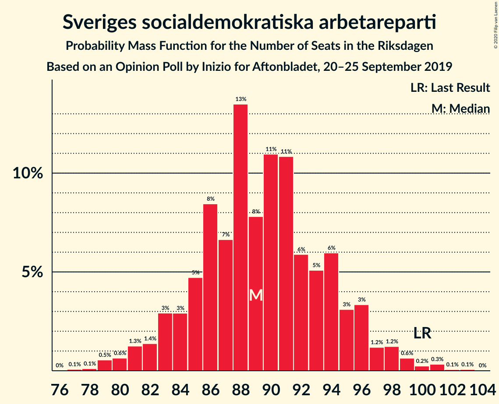
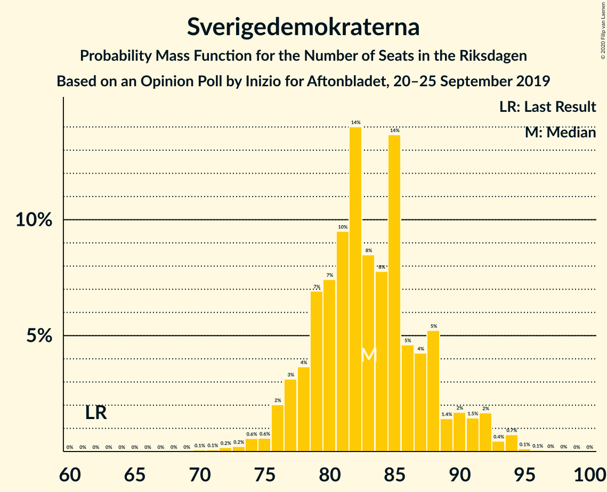
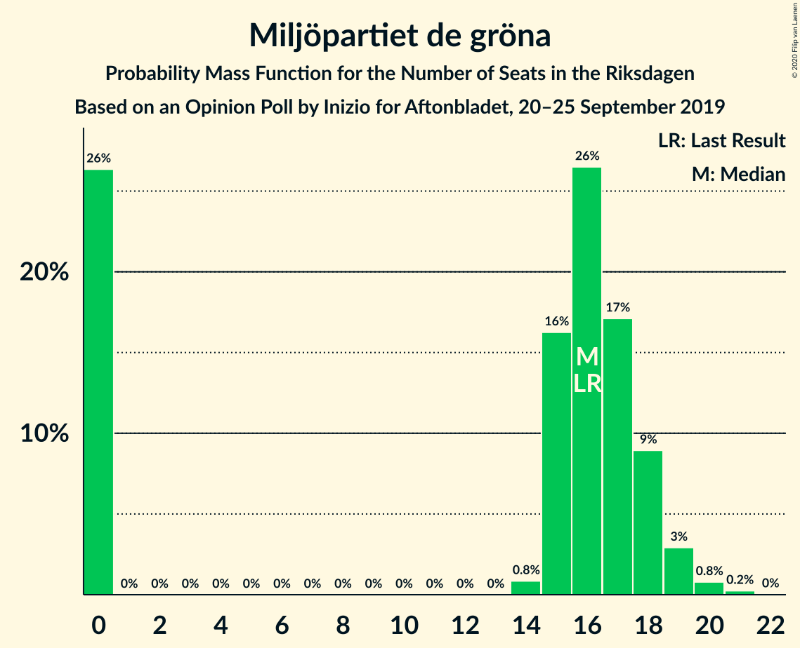
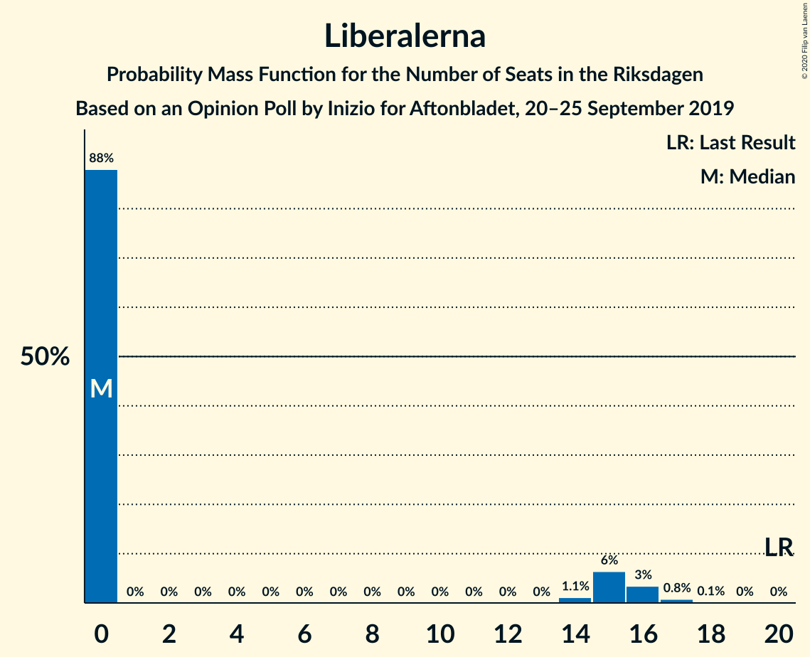
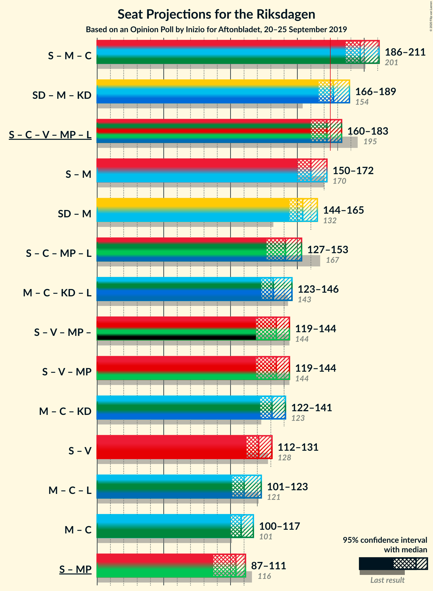
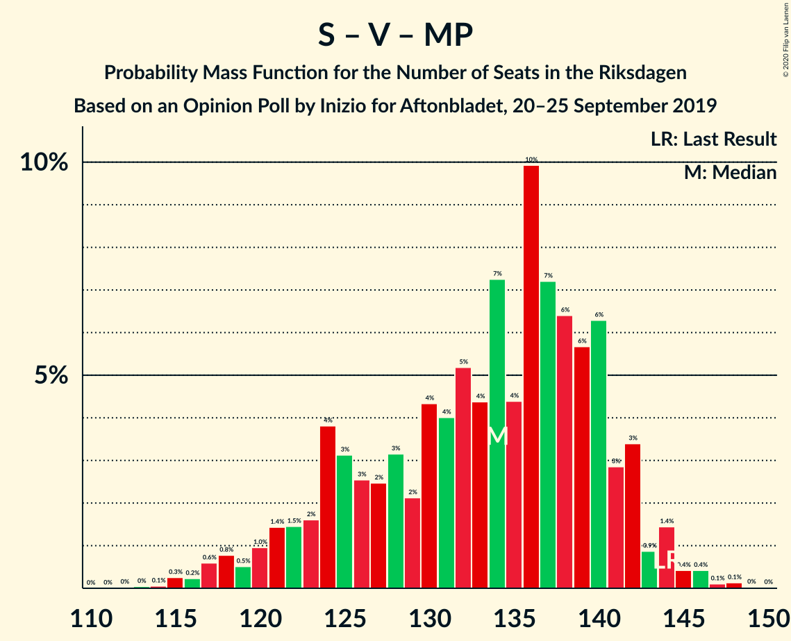

# Opinion Poll by Inizio for Aftonbladet, 20–25 September 2019

<a href="#voting-intentions">Voting Intentions</a> | <a href="#seats">Seats</a> | <a href="#coalitions">Coalitions</a> | <a href="#technical-information">Technical Information</a>

## Voting Intentions

### Confidence Intervals

| Party | Last Result | Poll Result | 80% Confidence Interval | 90% Confidence Interval | 95% Confidence Interval | 99% Confidence Interval |
|:-----:|:-----------:|:-----------:|:-----------------------:|:-----------------------:|:-----------------------:|:-----------------------:|
| Sveriges socialdemokratiska arbetareparti | 28.3% | 24.0% | 22.8–25.2% |22.5–25.6% |22.2–25.9% |21.7–26.5% |
| Sverigedemokraterna | 17.5% | 22.3% | 21.1–23.5% |20.8–23.8% |20.5–24.1% |20.0–24.7% |
| Moderata samlingspartiet | 19.8% | 19.1% | 18.0–20.2% |17.7–20.5% |17.4–20.8% |16.9–21.4% |
| Centerpartiet | 8.6% | 9.9% | 9.1–10.8% |8.9–11.1% |8.7–11.3% |8.3–11.7% |
| Vänsterpartiet | 8.0% | 8.5% | 7.8–9.4% |7.6–9.6% |7.4–9.8% |7.1–10.2% |
| Kristdemokraterna | 6.3% | 6.0% | 5.4–6.7% |5.2–6.9% |5.1–7.1% |4.8–7.5% |
| Miljöpartiet de gröna | 4.4% | 4.2% | 3.7–4.8% |3.5–5.0% |3.4–5.2% |3.2–5.5% |
| Liberalerna | 5.5% | 3.5% | 3.1–4.1% |2.9–4.3% |2.8–4.4% |2.6–4.7% |

*Note:* The poll result column reflects the actual value used in the calculations. Published results may vary slightly, and in addition be rounded to fewer digits.

## Seats

### Confidence Intervals

| Party | Last Result | Median | 80% Confidence Interval | 90% Confidence Interval | 95% Confidence Interval | 99% Confidence Interval |
|:-----:|:-----------:|:------:|:-----------------------:|:-----------------------:|:-----------------------:|:-----------------------:|
| <a href="#sveriges-socialdemokratiska-arbetareparti">Sveriges socialdemokratiska arbetareparti</a> | 100 | 89 | 85–94 |83–96 |81–98 |79–99 |
| <a href="#sverigedemokraterna">Sverigedemokraterna</a> | 62 | 82 | 78–89 |76–91 |76–94 |73–94 |
| <a href="#moderata-samlingspartiet">Moderata samlingspartiet</a> | 70 | 71 | 67–76 |65–78 |64–78 |62–81 |
| <a href="#centerpartiet">Centerpartiet</a> | 31 | 37 | 34–40 |33–41 |33–42 |31–43 |
| <a href="#vänsterpartiet">Vänsterpartiet</a> | 28 | 32 | 29–35 |28–36 |28–37 |26–39 |
| <a href="#kristdemokraterna">Kristdemokraterna</a> | 22 | 23 | 20–25 |19–26 |19–27 |18–29 |
| <a href="#miljöpartiet-de-gröna">Miljöpartiet de gröna</a> | 16 | 16 | 0–18 |0–18 |0–19 |0–20 |
| <a href="#liberalerna">Liberalerna</a> | 20 | 0 | 0–14 |0–15 |0–16 |0–17 |

### Sveriges socialdemokratiska arbetareparti

*For a full overview of the results for this party, see the [Sveriges socialdemokratiska arbetareparti](party-sverigessocialdemokratiskaarbetareparti.html) page.*

| Number of Seats | Probability | Accumulated | Special Marks |
|:---------------:|:-----------:|:-----------:|:-------------:|
| 77 | 0.1% | 100% |  |
| 78 | 0.3% | 99.9% |  |
| 79 | 0.4% | 99.6% |  |
| 80 | 1.3% | 99.3% |  |
| 81 | 0.9% | 98% |  |
| 82 | 0.7% | 97% |  |
| 83 | 1.4% | 96% |  |
| 84 | 2% | 95% |  |
| 85 | 3% | 93% |  |
| 86 | 2% | 90% |  |
| 87 | 24% | 88% |  |
| 88 | 13% | 64% |  |
| 89 | 7% | 51% | Median |
| 90 | 8% | 44% |  |
| 91 | 6% | 36% |  |
| 92 | 3% | 30% |  |
| 93 | 2% | 27% |  |
| 94 | 15% | 25% |  |
| 95 | 3% | 10% |  |
| 96 | 3% | 7% |  |
| 97 | 0.5% | 3% |  |
| 98 | 2% | 3% |  |
| 99 | 0.8% | 1.3% |  |
| 100 | 0.2% | 0.5% | Last Result |
| 101 | 0.1% | 0.3% |  |
| 102 | 0% | 0.2% |  |
| 103 | 0.1% | 0.1% |  |
| 104 | 0% | 0.1% |  |
| 105 | 0% | 0% |  |

### Sverigedemokraterna

*For a full overview of the results for this party, see the [Sverigedemokraterna](party-sverigedemokraterna.html) page.*

| Number of Seats | Probability | Accumulated | Special Marks |
|:---------------:|:-----------:|:-----------:|:-------------:|
| 62 | 0% | 100% | Last Result |
| 63 | 0% | 100% |  |
| 64 | 0% | 100% |  |
| 65 | 0% | 100% |  |
| 66 | 0% | 100% |  |
| 67 | 0% | 100% |  |
| 68 | 0% | 100% |  |
| 69 | 0% | 100% |  |
| 70 | 0.2% | 100% |  |
| 71 | 0.1% | 99.8% |  |
| 72 | 0.1% | 99.7% |  |
| 73 | 0.3% | 99.6% |  |
| 74 | 0.3% | 99.2% |  |
| 75 | 0.6% | 99.0% |  |
| 76 | 4% | 98% |  |
| 77 | 2% | 95% |  |
| 78 | 3% | 93% |  |
| 79 | 3% | 90% |  |
| 80 | 15% | 87% |  |
| 81 | 17% | 72% |  |
| 82 | 24% | 56% | Median |
| 83 | 4% | 32% |  |
| 84 | 5% | 28% |  |
| 85 | 2% | 23% |  |
| 86 | 5% | 20% |  |
| 87 | 4% | 16% |  |
| 88 | 1.2% | 12% |  |
| 89 | 2% | 10% |  |
| 90 | 3% | 9% |  |
| 91 | 1.3% | 6% |  |
| 92 | 0.8% | 5% |  |
| 93 | 0.2% | 4% |  |
| 94 | 3% | 4% |  |
| 95 | 0% | 0.3% |  |
| 96 | 0.2% | 0.2% |  |
| 97 | 0% | 0% |  |

### Moderata samlingspartiet

*For a full overview of the results for this party, see the [Moderata samlingspartiet](party-moderatasamlingspartiet.html) page.*

| Number of Seats | Probability | Accumulated | Special Marks |
|:---------------:|:-----------:|:-----------:|:-------------:|
| 60 | 0% | 100% |  |
| 61 | 0.4% | 99.9% |  |
| 62 | 1.1% | 99.6% |  |
| 63 | 0.3% | 98% |  |
| 64 | 3% | 98% |  |
| 65 | 1.4% | 95% |  |
| 66 | 1.3% | 94% |  |
| 67 | 3% | 93% |  |
| 68 | 16% | 89% |  |
| 69 | 6% | 73% |  |
| 70 | 2% | 68% | Last Result |
| 71 | 20% | 66% | Median |
| 72 | 10% | 46% |  |
| 73 | 6% | 36% |  |
| 74 | 15% | 30% |  |
| 75 | 0.4% | 14% |  |
| 76 | 5% | 14% |  |
| 77 | 2% | 9% |  |
| 78 | 5% | 7% |  |
| 79 | 0.6% | 2% |  |
| 80 | 0.2% | 1.2% |  |
| 81 | 0.8% | 1.1% |  |
| 82 | 0.1% | 0.3% |  |
| 83 | 0.2% | 0.2% |  |
| 84 | 0% | 0% |  |

### Centerpartiet

*For a full overview of the results for this party, see the [Centerpartiet](party-centerpartiet.html) page.*

| Number of Seats | Probability | Accumulated | Special Marks |
|:---------------:|:-----------:|:-----------:|:-------------:|
| 29 | 0.2% | 100% |  |
| 30 | 0.2% | 99.8% |  |
| 31 | 0.5% | 99.6% | Last Result |
| 32 | 1.1% | 99.1% |  |
| 33 | 3% | 98% |  |
| 34 | 23% | 95% |  |
| 35 | 9% | 72% |  |
| 36 | 3% | 63% |  |
| 37 | 27% | 60% | Median |
| 38 | 10% | 32% |  |
| 39 | 7% | 23% |  |
| 40 | 7% | 16% |  |
| 41 | 4% | 9% |  |
| 42 | 2% | 4% |  |
| 43 | 2% | 2% |  |
| 44 | 0.1% | 0.4% |  |
| 45 | 0.1% | 0.3% |  |
| 46 | 0.1% | 0.2% |  |
| 47 | 0% | 0% |  |

### Vänsterpartiet

*For a full overview of the results for this party, see the [Vänsterpartiet](party-vänsterpartiet.html) page.*

| Number of Seats | Probability | Accumulated | Special Marks |
|:---------------:|:-----------:|:-----------:|:-------------:|
| 25 | 0.4% | 100% |  |
| 26 | 0.6% | 99.5% |  |
| 27 | 1.4% | 99.0% |  |
| 28 | 4% | 98% | Last Result |
| 29 | 12% | 93% |  |
| 30 | 15% | 81% |  |
| 31 | 9% | 66% |  |
| 32 | 10% | 57% | Median |
| 33 | 26% | 47% |  |
| 34 | 9% | 21% |  |
| 35 | 6% | 12% |  |
| 36 | 4% | 7% |  |
| 37 | 1.3% | 3% |  |
| 38 | 0.3% | 2% |  |
| 39 | 1.0% | 1.2% |  |
| 40 | 0.1% | 0.2% |  |
| 41 | 0% | 0% |  |

### Kristdemokraterna

*For a full overview of the results for this party, see the [Kristdemokraterna](party-kristdemokraterna.html) page.*

| Number of Seats | Probability | Accumulated | Special Marks |
|:---------------:|:-----------:|:-----------:|:-------------:|
| 16 | 0.1% | 100% |  |
| 17 | 0.2% | 99.9% |  |
| 18 | 2% | 99.7% |  |
| 19 | 3% | 98% |  |
| 20 | 6% | 95% |  |
| 21 | 15% | 89% |  |
| 22 | 20% | 74% | Last Result |
| 23 | 6% | 54% | Median |
| 24 | 35% | 49% |  |
| 25 | 4% | 13% |  |
| 26 | 6% | 9% |  |
| 27 | 2% | 3% |  |
| 28 | 0.3% | 1.2% |  |
| 29 | 0.7% | 0.8% |  |
| 30 | 0% | 0.1% |  |
| 31 | 0% | 0% |  |

### Miljöpartiet de gröna

*For a full overview of the results for this party, see the [Miljöpartiet de gröna](party-miljöpartietdegröna.html) page.*

| Number of Seats | Probability | Accumulated | Special Marks |
|:---------------:|:-----------:|:-----------:|:-------------:|
| 0 | 25% | 100% |  |
| 1 | 0% | 75% |  |
| 2 | 0% | 75% |  |
| 3 | 0% | 75% |  |
| 4 | 0% | 75% |  |
| 5 | 0% | 75% |  |
| 6 | 0% | 75% |  |
| 7 | 0% | 75% |  |
| 8 | 0% | 75% |  |
| 9 | 0% | 75% |  |
| 10 | 0% | 75% |  |
| 11 | 0% | 75% |  |
| 12 | 0% | 75% |  |
| 13 | 0% | 75% |  |
| 14 | 0.2% | 75% |  |
| 15 | 19% | 75% |  |
| 16 | 22% | 56% | Last Result, Median |
| 17 | 7% | 34% |  |
| 18 | 23% | 28% |  |
| 19 | 3% | 4% |  |
| 20 | 1.3% | 1.4% |  |
| 21 | 0.1% | 0.2% |  |
| 22 | 0% | 0% |  |

### Liberalerna

*For a full overview of the results for this party, see the [Liberalerna](party-liberalerna.html) page.*

| Number of Seats | Probability | Accumulated | Special Marks |
|:---------------:|:-----------:|:-----------:|:-------------:|
| 0 | 90% | 100% | Median |
| 1 | 0% | 10% |  |
| 2 | 0% | 10% |  |
| 3 | 0% | 10% |  |
| 4 | 0% | 10% |  |
| 5 | 0% | 10% |  |
| 6 | 0% | 10% |  |
| 7 | 0% | 10% |  |
| 8 | 0% | 10% |  |
| 9 | 0% | 10% |  |
| 10 | 0% | 10% |  |
| 11 | 0% | 10% |  |
| 12 | 0% | 10% |  |
| 13 | 0% | 10% |  |
| 14 | 1.3% | 10% |  |
| 15 | 4% | 9% |  |
| 16 | 4% | 5% |  |
| 17 | 0.5% | 0.8% |  |
| 18 | 0.2% | 0.2% |  |
| 19 | 0% | 0.1% |  |
| 20 | 0% | 0% | Last Result |

## Coalitions

### Confidence Intervals

| Coalition | Last Result | Median | Majority? | 80% Confidence Interval | 90% Confidence Interval | 95% Confidence Interval | 99% Confidence Interval |
|:---------:|:-----------:|:------:|:---------:|:-----------------------:|:-----------------------:|:-----------------------:|:-----------------------:|
| Sveriges socialdemokratiska arbetareparti – Moderata samlingspartiet – Centerpartiet | 201 | 198 | 100% | 192–205 | 188–208 | 185–211 | 183–212 |
| Sverigedemokraterna – Moderata samlingspartiet – Kristdemokraterna | 154 | 177 | 63% | 170–187 | 168–189 | 163–189 | 161–191 |
| Sveriges socialdemokratiska arbetareparti – Centerpartiet – Vänsterpartiet – Miljöpartiet de gröna – Liberalerna | 195 | 172 | 37% | 162–179 | 160–181 | 160–186 | 158–188 |
| Sveriges socialdemokratiska arbetareparti – Moderata samlingspartiet | 170 | 162 | 0.9% | 154–167 | 152–171 | 150–173 | 147–175 |
| Sverigedemokraterna – Moderata samlingspartiet | 132 | 153 | 0% | 148–162 | 146–165 | 143–167 | 139–168 |
| Sveriges socialdemokratiska arbetareparti – Centerpartiet – Miljöpartiet de gröna – Liberalerna | 167 | 140 | 0% | 130–147 | 129–150 | 127–153 | 124–156 |
| Moderata samlingspartiet – Centerpartiet – Kristdemokraterna – Liberalerna | 143 | 131 | 0% | 126–140 | 126–143 | 124–145 | 121–150 |
| Sveriges socialdemokratiska arbetareparti – Vänsterpartiet – Miljöpartiet de gröna | 144 | 137 | 0% | 124–141 | 122–142 | 120–142 | 117–147 |
| Moderata samlingspartiet – Centerpartiet – Kristdemokraterna | 123 | 130 | 0% | 126–138 | 123–140 | 120–141 | 117–143 |
| Sveriges socialdemokratiska arbetareparti – Vänsterpartiet | 128 | 122 | 0% | 116–127 | 114–129 | 112–131 | 107–134 |
| Moderata samlingspartiet – Centerpartiet – Liberalerna | 121 | 109 | 0% | 105–116 | 103–120 | 102–123 | 99–128 |
| Moderata samlingspartiet – Centerpartiet | 101 | 108 | 0% | 103–115 | 101–116 | 99–117 | 97–120 |
| Sveriges socialdemokratiska arbetareparti – Miljöpartiet de gröna | 116 | 105 | 0% | 91–109 | 89–109 | 87–110 | 86–113 |

### Sveriges socialdemokratiska arbetareparti – Moderata samlingspartiet – Centerpartiet

| Number of Seats | Probability | Accumulated | Special Marks |
|:---------------:|:-----------:|:-----------:|:-------------:|
| 177 | 0.1% | 100% |  |
| 178 | 0% | 99.9% |  |
| 179 | 0% | 99.9% |  |
| 180 | 0.2% | 99.9% |  |
| 181 | 0.1% | 99.6% |  |
| 182 | 0.1% | 99.6% |  |
| 183 | 0.5% | 99.5% |  |
| 184 | 0.3% | 99.0% |  |
| 185 | 1.3% | 98.8% |  |
| 186 | 0.4% | 97% |  |
| 187 | 1.3% | 97% |  |
| 188 | 2% | 96% |  |
| 189 | 2% | 94% |  |
| 190 | 0.6% | 93% |  |
| 191 | 2% | 92% |  |
| 192 | 17% | 90% |  |
| 193 | 1.0% | 73% |  |
| 194 | 3% | 72% |  |
| 195 | 4% | 69% |  |
| 196 | 2% | 65% |  |
| 197 | 9% | 63% | Median |
| 198 | 6% | 54% |  |
| 199 | 16% | 48% |  |
| 200 | 4% | 32% |  |
| 201 | 2% | 27% | Last Result |
| 202 | 7% | 26% |  |
| 203 | 6% | 19% |  |
| 204 | 0.9% | 12% |  |
| 205 | 1.5% | 11% |  |
| 206 | 2% | 10% |  |
| 207 | 2% | 8% |  |
| 208 | 0.6% | 5% |  |
| 209 | 0.2% | 5% |  |
| 210 | 1.3% | 5% |  |
| 211 | 2% | 3% |  |
| 212 | 1.0% | 2% |  |
| 213 | 0.1% | 0.5% |  |
| 214 | 0.1% | 0.3% |  |
| 215 | 0.1% | 0.3% |  |
| 216 | 0% | 0.2% |  |
| 217 | 0% | 0.2% |  |
| 218 | 0.1% | 0.2% |  |
| 219 | 0% | 0% |  |

### Sverigedemokraterna – Moderata samlingspartiet – Kristdemokraterna

| Number of Seats | Probability | Accumulated | Special Marks |
|:---------------:|:-----------:|:-----------:|:-------------:|
| 154 | 0% | 100% | Last Result |
| 155 | 0% | 100% |  |
| 156 | 0% | 100% |  |
| 157 | 0% | 100% |  |
| 158 | 0% | 99.9% |  |
| 159 | 0% | 99.9% |  |
| 160 | 0% | 99.9% |  |
| 161 | 1.0% | 99.9% |  |
| 162 | 0.2% | 98.8% |  |
| 163 | 1.2% | 98.6% |  |
| 164 | 0.3% | 97% |  |
| 165 | 0.6% | 97% |  |
| 166 | 0.2% | 97% |  |
| 167 | 0.7% | 96% |  |
| 168 | 1.3% | 96% |  |
| 169 | 2% | 94% |  |
| 170 | 9% | 93% |  |
| 171 | 1.1% | 83% |  |
| 172 | 2% | 82% |  |
| 173 | 12% | 80% |  |
| 174 | 4% | 68% |  |
| 175 | 2% | 63% | Majority |
| 176 | 7% | 62% | Median |
| 177 | 19% | 54% |  |
| 178 | 6% | 35% |  |
| 179 | 7% | 30% |  |
| 180 | 1.5% | 23% |  |
| 181 | 2% | 21% |  |
| 182 | 2% | 20% |  |
| 183 | 2% | 18% |  |
| 184 | 3% | 16% |  |
| 185 | 0.9% | 13% |  |
| 186 | 1.5% | 12% |  |
| 187 | 0.9% | 11% |  |
| 188 | 4% | 10% |  |
| 189 | 5% | 6% |  |
| 190 | 0.1% | 0.7% |  |
| 191 | 0.3% | 0.6% |  |
| 192 | 0% | 0.2% |  |
| 193 | 0.1% | 0.2% |  |
| 194 | 0% | 0.1% |  |
| 195 | 0% | 0.1% |  |
| 196 | 0% | 0% |  |

### Sveriges socialdemokratiska arbetareparti – Centerpartiet – Vänsterpartiet – Miljöpartiet de gröna – Liberalerna

| Number of Seats | Probability | Accumulated | Special Marks |
|:---------------:|:-----------:|:-----------:|:-------------:|
| 154 | 0% | 100% |  |
| 155 | 0% | 99.9% |  |
| 156 | 0.1% | 99.9% |  |
| 157 | 0% | 99.8% |  |
| 158 | 0.3% | 99.7% |  |
| 159 | 0.1% | 99.4% |  |
| 160 | 5% | 99.3% |  |
| 161 | 4% | 94% |  |
| 162 | 0.9% | 90% |  |
| 163 | 1.5% | 89% |  |
| 164 | 0.9% | 88% |  |
| 165 | 3% | 87% |  |
| 166 | 2% | 84% |  |
| 167 | 2% | 82% |  |
| 168 | 2% | 80% |  |
| 169 | 1.5% | 79% |  |
| 170 | 7% | 77% |  |
| 171 | 6% | 70% |  |
| 172 | 19% | 65% |  |
| 173 | 7% | 46% |  |
| 174 | 2% | 38% | Median |
| 175 | 4% | 37% | Majority |
| 176 | 12% | 32% |  |
| 177 | 2% | 20% |  |
| 178 | 1.1% | 18% |  |
| 179 | 9% | 17% |  |
| 180 | 2% | 7% |  |
| 181 | 1.3% | 6% |  |
| 182 | 0.7% | 4% |  |
| 183 | 0.2% | 4% |  |
| 184 | 0.6% | 3% |  |
| 185 | 0.3% | 3% |  |
| 186 | 1.2% | 3% |  |
| 187 | 0.2% | 1.4% |  |
| 188 | 1.0% | 1.2% |  |
| 189 | 0% | 0.1% |  |
| 190 | 0% | 0.1% |  |
| 191 | 0% | 0.1% |  |
| 192 | 0% | 0.1% |  |
| 193 | 0% | 0% |  |
| 194 | 0% | 0% |  |
| 195 | 0% | 0% | Last Result |

### Sveriges socialdemokratiska arbetareparti – Moderata samlingspartiet

| Number of Seats | Probability | Accumulated | Special Marks |
|:---------------:|:-----------:|:-----------:|:-------------:|
| 144 | 0.2% | 100% |  |
| 145 | 0.1% | 99.8% |  |
| 146 | 0.1% | 99.7% |  |
| 147 | 0.5% | 99.6% |  |
| 148 | 0.2% | 99.0% |  |
| 149 | 0.3% | 98.8% |  |
| 150 | 2% | 98.5% |  |
| 151 | 2% | 97% |  |
| 152 | 0.5% | 95% |  |
| 153 | 2% | 95% |  |
| 154 | 4% | 92% |  |
| 155 | 2% | 89% |  |
| 156 | 2% | 87% |  |
| 157 | 3% | 85% |  |
| 158 | 17% | 82% |  |
| 159 | 3% | 65% |  |
| 160 | 3% | 62% | Median |
| 161 | 5% | 59% |  |
| 162 | 23% | 54% |  |
| 163 | 5% | 30% |  |
| 164 | 7% | 25% |  |
| 165 | 2% | 18% |  |
| 166 | 6% | 16% |  |
| 167 | 2% | 11% |  |
| 168 | 2% | 9% |  |
| 169 | 0.9% | 6% |  |
| 170 | 0.5% | 6% | Last Result |
| 171 | 0.5% | 5% |  |
| 172 | 1.4% | 5% |  |
| 173 | 2% | 3% |  |
| 174 | 0.2% | 1.2% |  |
| 175 | 0.5% | 0.9% | Majority |
| 176 | 0.3% | 0.5% |  |
| 177 | 0% | 0.1% |  |
| 178 | 0% | 0.1% |  |
| 179 | 0% | 0% |  |

### Sverigedemokraterna – Moderata samlingspartiet

| Number of Seats | Probability | Accumulated | Special Marks |
|:---------------:|:-----------:|:-----------:|:-------------:|
| 132 | 0% | 100% | Last Result |
| 133 | 0% | 100% |  |
| 134 | 0% | 100% |  |
| 135 | 0% | 100% |  |
| 136 | 0% | 100% |  |
| 137 | 0% | 99.9% |  |
| 138 | 0.1% | 99.9% |  |
| 139 | 0.4% | 99.9% |  |
| 140 | 0.2% | 99.5% |  |
| 141 | 0% | 99.3% |  |
| 142 | 0.3% | 99.3% |  |
| 143 | 2% | 99.0% |  |
| 144 | 1.1% | 97% |  |
| 145 | 0.7% | 96% |  |
| 146 | 2% | 95% |  |
| 147 | 1.3% | 93% |  |
| 148 | 5% | 92% |  |
| 149 | 15% | 87% |  |
| 150 | 2% | 72% |  |
| 151 | 3% | 70% |  |
| 152 | 2% | 67% |  |
| 153 | 21% | 65% | Median |
| 154 | 8% | 43% |  |
| 155 | 2% | 35% |  |
| 156 | 6% | 33% |  |
| 157 | 1.3% | 27% |  |
| 158 | 8% | 26% |  |
| 159 | 2% | 18% |  |
| 160 | 3% | 16% |  |
| 161 | 1.2% | 13% |  |
| 162 | 2% | 12% |  |
| 163 | 1.4% | 10% |  |
| 164 | 2% | 8% |  |
| 165 | 2% | 7% |  |
| 166 | 0.4% | 5% |  |
| 167 | 3% | 4% |  |
| 168 | 0.5% | 0.7% |  |
| 169 | 0.1% | 0.3% |  |
| 170 | 0.1% | 0.1% |  |
| 171 | 0% | 0.1% |  |
| 172 | 0% | 0% |  |

### Sveriges socialdemokratiska arbetareparti – Centerpartiet – Miljöpartiet de gröna – Liberalerna

| Number of Seats | Probability | Accumulated | Special Marks |
|:---------------:|:-----------:|:-----------:|:-------------:|
| 122 | 0.1% | 100% |  |
| 123 | 0.2% | 99.9% |  |
| 124 | 0.3% | 99.7% |  |
| 125 | 0.1% | 99.4% |  |
| 126 | 0.2% | 99.3% |  |
| 127 | 2% | 99.1% |  |
| 128 | 0.1% | 97% |  |
| 129 | 4% | 97% |  |
| 130 | 5% | 93% |  |
| 131 | 4% | 87% |  |
| 132 | 0.8% | 84% |  |
| 133 | 2% | 83% |  |
| 134 | 1.0% | 81% |  |
| 135 | 0.7% | 80% |  |
| 136 | 0.7% | 80% |  |
| 137 | 2% | 79% |  |
| 138 | 2% | 77% |  |
| 139 | 24% | 75% |  |
| 140 | 2% | 51% |  |
| 141 | 6% | 49% |  |
| 142 | 6% | 42% | Median |
| 143 | 2% | 37% |  |
| 144 | 3% | 35% |  |
| 145 | 0.5% | 32% |  |
| 146 | 19% | 32% |  |
| 147 | 5% | 13% |  |
| 148 | 3% | 9% |  |
| 149 | 0.6% | 6% |  |
| 150 | 0.3% | 5% |  |
| 151 | 0.2% | 5% |  |
| 152 | 0.3% | 5% |  |
| 153 | 2% | 4% |  |
| 154 | 0.2% | 2% |  |
| 155 | 1.2% | 2% |  |
| 156 | 0.2% | 0.5% |  |
| 157 | 0.2% | 0.3% |  |
| 158 | 0% | 0.1% |  |
| 159 | 0.1% | 0.1% |  |
| 160 | 0% | 0.1% |  |
| 161 | 0% | 0% |  |
| 162 | 0% | 0% |  |
| 163 | 0% | 0% |  |
| 164 | 0% | 0% |  |
| 165 | 0% | 0% |  |
| 166 | 0% | 0% |  |
| 167 | 0% | 0% | Last Result |

### Moderata samlingspartiet – Centerpartiet – Kristdemokraterna – Liberalerna

| Number of Seats | Probability | Accumulated | Special Marks |
|:---------------:|:-----------:|:-----------:|:-------------:|
| 118 | 0% | 100% |  |
| 119 | 0.1% | 99.9% |  |
| 120 | 0.3% | 99.9% |  |
| 121 | 0.2% | 99.5% |  |
| 122 | 0.6% | 99.4% |  |
| 123 | 0.2% | 98.8% |  |
| 124 | 2% | 98.6% |  |
| 125 | 0.6% | 96% |  |
| 126 | 8% | 96% |  |
| 127 | 2% | 88% |  |
| 128 | 0.5% | 86% |  |
| 129 | 26% | 86% |  |
| 130 | 1.5% | 59% |  |
| 131 | 8% | 58% | Median |
| 132 | 6% | 50% |  |
| 133 | 10% | 44% |  |
| 134 | 4% | 34% |  |
| 135 | 2% | 29% |  |
| 136 | 6% | 27% |  |
| 137 | 0.9% | 21% |  |
| 138 | 6% | 20% |  |
| 139 | 2% | 14% |  |
| 140 | 3% | 12% |  |
| 141 | 0.7% | 9% |  |
| 142 | 0.9% | 8% |  |
| 143 | 3% | 7% | Last Result |
| 144 | 1.3% | 4% |  |
| 145 | 0.4% | 3% |  |
| 146 | 1.0% | 2% |  |
| 147 | 0.1% | 1.3% |  |
| 148 | 0.1% | 1.3% |  |
| 149 | 0.1% | 1.1% |  |
| 150 | 0.5% | 1.0% |  |
| 151 | 0.3% | 0.5% |  |
| 152 | 0% | 0.1% |  |
| 153 | 0% | 0.1% |  |
| 154 | 0% | 0.1% |  |
| 155 | 0% | 0% |  |

### Sveriges socialdemokratiska arbetareparti – Vänsterpartiet – Miljöpartiet de gröna

| Number of Seats | Probability | Accumulated | Special Marks |
|:---------------:|:-----------:|:-----------:|:-------------:|
| 112 | 0% | 100% |  |
| 113 | 0% | 99.9% |  |
| 114 | 0.1% | 99.9% |  |
| 115 | 0.1% | 99.8% |  |
| 116 | 0.1% | 99.8% |  |
| 117 | 1.3% | 99.6% |  |
| 118 | 0.2% | 98% |  |
| 119 | 0.4% | 98% |  |
| 120 | 0.3% | 98% |  |
| 121 | 2% | 97% |  |
| 122 | 4% | 95% |  |
| 123 | 1.4% | 92% |  |
| 124 | 4% | 90% |  |
| 125 | 4% | 87% |  |
| 126 | 3% | 83% |  |
| 127 | 0.3% | 79% |  |
| 128 | 2% | 79% |  |
| 129 | 2% | 77% |  |
| 130 | 1.2% | 75% |  |
| 131 | 4% | 74% |  |
| 132 | 2% | 70% |  |
| 133 | 7% | 68% |  |
| 134 | 6% | 61% |  |
| 135 | 2% | 55% |  |
| 136 | 1.3% | 53% |  |
| 137 | 4% | 51% | Median |
| 138 | 23% | 47% |  |
| 139 | 10% | 24% |  |
| 140 | 3% | 14% |  |
| 141 | 3% | 12% |  |
| 142 | 6% | 8% |  |
| 143 | 0.4% | 2% |  |
| 144 | 0.2% | 2% | Last Result |
| 145 | 0.6% | 2% |  |
| 146 | 0.3% | 0.9% |  |
| 147 | 0.3% | 0.5% |  |
| 148 | 0.2% | 0.2% |  |
| 149 | 0% | 0.1% |  |
| 150 | 0% | 0% |  |

### Moderata samlingspartiet – Centerpartiet – Kristdemokraterna

| Number of Seats | Probability | Accumulated | Special Marks |
|:---------------:|:-----------:|:-----------:|:-------------:|
| 116 | 0% | 100% |  |
| 117 | 1.0% | 99.9% |  |
| 118 | 0.8% | 98.9% |  |
| 119 | 0.2% | 98% |  |
| 120 | 0.5% | 98% |  |
| 121 | 0.7% | 97% |  |
| 122 | 1.0% | 97% |  |
| 123 | 1.0% | 96% | Last Result |
| 124 | 3% | 95% |  |
| 125 | 0.7% | 92% |  |
| 126 | 8% | 91% |  |
| 127 | 2% | 83% |  |
| 128 | 2% | 81% |  |
| 129 | 28% | 79% |  |
| 130 | 2% | 51% |  |
| 131 | 8% | 49% | Median |
| 132 | 6% | 41% |  |
| 133 | 10% | 35% |  |
| 134 | 4% | 25% |  |
| 135 | 2% | 21% |  |
| 136 | 6% | 19% |  |
| 137 | 0.4% | 13% |  |
| 138 | 6% | 12% |  |
| 139 | 2% | 7% |  |
| 140 | 3% | 5% |  |
| 141 | 0.6% | 3% |  |
| 142 | 0.2% | 2% |  |
| 143 | 1.4% | 2% |  |
| 144 | 0.1% | 0.5% |  |
| 145 | 0.2% | 0.4% |  |
| 146 | 0.1% | 0.1% |  |
| 147 | 0% | 0.1% |  |
| 148 | 0% | 0% |  |

### Sveriges socialdemokratiska arbetareparti – Vänsterpartiet

| Number of Seats | Probability | Accumulated | Special Marks |
|:---------------:|:-----------:|:-----------:|:-------------:|
| 106 | 0.1% | 100% |  |
| 107 | 0.9% | 99.9% |  |
| 108 | 0.2% | 98.9% |  |
| 109 | 0.1% | 98.8% |  |
| 110 | 0.3% | 98.6% |  |
| 111 | 0.9% | 98% |  |
| 112 | 0.4% | 98% |  |
| 113 | 0.8% | 97% |  |
| 114 | 1.4% | 96% |  |
| 115 | 3% | 95% |  |
| 116 | 6% | 92% |  |
| 117 | 7% | 86% |  |
| 118 | 2% | 79% |  |
| 119 | 3% | 77% |  |
| 120 | 17% | 74% |  |
| 121 | 7% | 57% | Median |
| 122 | 12% | 50% |  |
| 123 | 5% | 38% |  |
| 124 | 13% | 34% |  |
| 125 | 5% | 21% |  |
| 126 | 3% | 16% |  |
| 127 | 5% | 13% |  |
| 128 | 2% | 8% | Last Result |
| 129 | 2% | 5% |  |
| 130 | 0.3% | 4% |  |
| 131 | 1.0% | 3% |  |
| 132 | 0.5% | 2% |  |
| 133 | 0.4% | 2% |  |
| 134 | 1.4% | 2% |  |
| 135 | 0% | 0.2% |  |
| 136 | 0.1% | 0.2% |  |
| 137 | 0% | 0.1% |  |
| 138 | 0% | 0.1% |  |
| 139 | 0% | 0% |  |

### Moderata samlingspartiet – Centerpartiet – Liberalerna

| Number of Seats | Probability | Accumulated | Special Marks |
|:---------------:|:-----------:|:-----------:|:-------------:|
| 96 | 0% | 100% |  |
| 97 | 0% | 99.9% |  |
| 98 | 0.3% | 99.9% |  |
| 99 | 0.2% | 99.5% |  |
| 100 | 0.2% | 99.3% |  |
| 101 | 2% | 99.1% |  |
| 102 | 2% | 98% |  |
| 103 | 2% | 96% |  |
| 104 | 0.7% | 94% |  |
| 105 | 30% | 93% |  |
| 106 | 2% | 63% |  |
| 107 | 3% | 61% |  |
| 108 | 4% | 59% | Median |
| 109 | 6% | 54% |  |
| 110 | 6% | 48% |  |
| 111 | 11% | 42% |  |
| 112 | 7% | 31% |  |
| 113 | 3% | 25% |  |
| 114 | 2% | 21% |  |
| 115 | 6% | 19% |  |
| 116 | 3% | 13% |  |
| 117 | 1.1% | 10% |  |
| 118 | 1.2% | 9% |  |
| 119 | 2% | 8% |  |
| 120 | 1.2% | 6% |  |
| 121 | 0.6% | 5% | Last Result |
| 122 | 1.4% | 4% |  |
| 123 | 0.3% | 3% |  |
| 124 | 0.9% | 2% |  |
| 125 | 0.4% | 1.4% |  |
| 126 | 0.2% | 1.0% |  |
| 127 | 0% | 0.7% |  |
| 128 | 0.4% | 0.7% |  |
| 129 | 0.2% | 0.3% |  |
| 130 | 0.1% | 0.1% |  |
| 131 | 0% | 0% |  |

### Moderata samlingspartiet – Centerpartiet

| Number of Seats | Probability | Accumulated | Special Marks |
|:---------------:|:-----------:|:-----------:|:-------------:|
| 95 | 0% | 100% |  |
| 96 | 0.1% | 99.9% |  |
| 97 | 1.3% | 99.9% |  |
| 98 | 0.7% | 98.5% |  |
| 99 | 0.5% | 98% |  |
| 100 | 2% | 97% |  |
| 101 | 2% | 96% | Last Result |
| 102 | 2% | 94% |  |
| 103 | 2% | 92% |  |
| 104 | 1.0% | 89% |  |
| 105 | 31% | 88% |  |
| 106 | 3% | 57% |  |
| 107 | 4% | 54% |  |
| 108 | 5% | 51% | Median |
| 109 | 7% | 46% |  |
| 110 | 6% | 39% |  |
| 111 | 10% | 33% |  |
| 112 | 7% | 23% |  |
| 113 | 3% | 16% |  |
| 114 | 2% | 13% |  |
| 115 | 5% | 11% |  |
| 116 | 2% | 5% |  |
| 117 | 1.0% | 3% |  |
| 118 | 0.3% | 2% |  |
| 119 | 1.3% | 2% |  |
| 120 | 0.2% | 0.6% |  |
| 121 | 0.1% | 0.4% |  |
| 122 | 0.3% | 0.3% |  |
| 123 | 0% | 0% |  |

### Sveriges socialdemokratiska arbetareparti – Miljöpartiet de gröna

| Number of Seats | Probability | Accumulated | Special Marks |
|:---------------:|:-----------:|:-----------:|:-------------:|
| 81 | 0% | 100% |  |
| 82 | 0.1% | 99.9% |  |
| 83 | 0.1% | 99.9% |  |
| 84 | 0.1% | 99.8% |  |
| 85 | 0.1% | 99.7% |  |
| 86 | 0.3% | 99.6% |  |
| 87 | 3% | 99.4% |  |
| 88 | 0.5% | 96% |  |
| 89 | 0.8% | 96% |  |
| 90 | 3% | 95% |  |
| 91 | 5% | 91% |  |
| 92 | 3% | 86% |  |
| 93 | 0.6% | 83% |  |
| 94 | 0.9% | 83% |  |
| 95 | 2% | 82% |  |
| 96 | 3% | 80% |  |
| 97 | 2% | 77% |  |
| 98 | 2% | 75% |  |
| 99 | 1.0% | 73% |  |
| 100 | 2% | 72% |  |
| 101 | 5% | 70% |  |
| 102 | 0.7% | 65% |  |
| 103 | 0.7% | 64% |  |
| 104 | 13% | 64% |  |
| 105 | 24% | 51% | Median |
| 106 | 3% | 27% |  |
| 107 | 0.4% | 24% |  |
| 108 | 4% | 23% |  |
| 109 | 15% | 19% |  |
| 110 | 2% | 5% |  |
| 111 | 0.3% | 2% |  |
| 112 | 0.2% | 2% |  |
| 113 | 2% | 2% |  |
| 114 | 0.1% | 0.3% |  |
| 115 | 0% | 0.2% |  |
| 116 | 0% | 0.2% | Last Result |
| 117 | 0.2% | 0.2% |  |
| 118 | 0% | 0% |  |

## Technical Information

### Opinion Poll

+ **Polling firm:** Inizio
+ **Commissioner(s):** Aftonbladet
+ **Fieldwork period:** 20–25 September 2019

### Calculations

+ **Sample size:** 2097
+ **Simulations done:** 131,072
+ **Error estimate:** 1.92%

