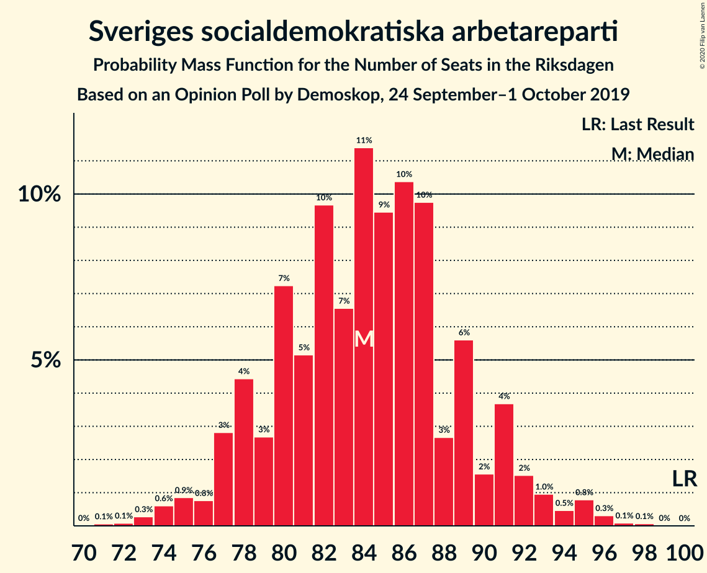
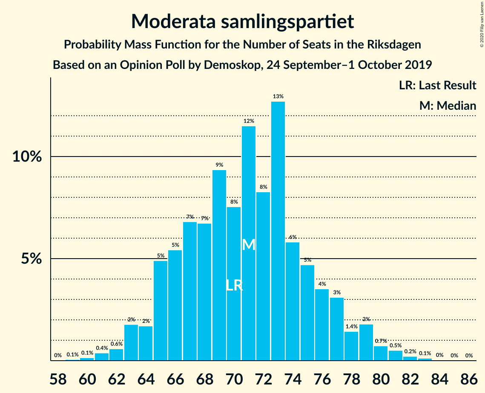
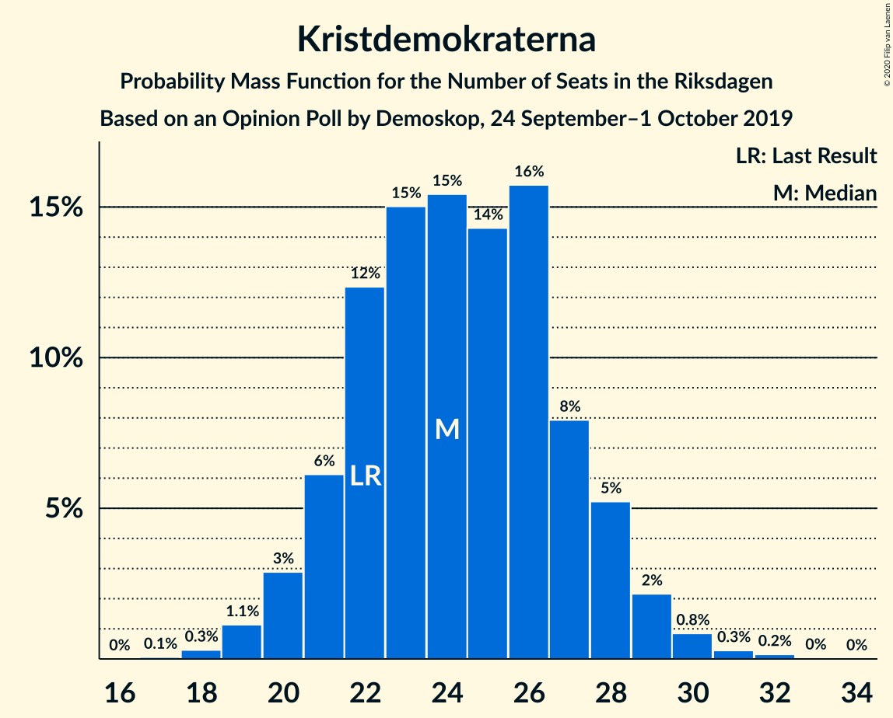
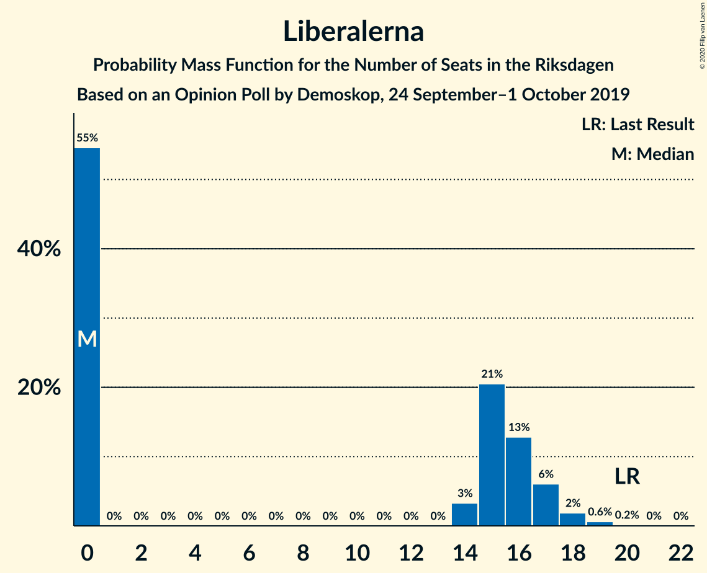
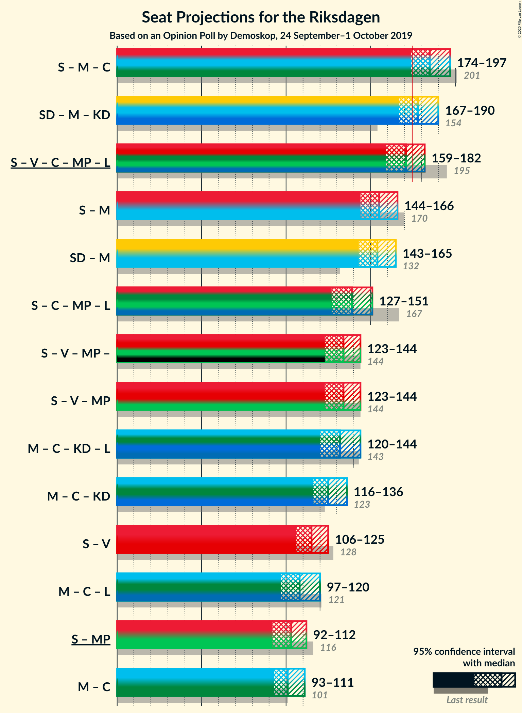

# Opinion Poll by Demoskop, 24 September–1 October 2019

<a href="#voting-intentions">Voting Intentions</a> | <a href="#seats">Seats</a> | <a href="#coalitions">Coalitions</a> | <a href="#technical-information">Technical Information</a>

## Voting Intentions

### Confidence Intervals

| Party | Last Result | Poll Result | 80% Confidence Interval | 90% Confidence Interval | 95% Confidence Interval | 99% Confidence Interval |
|:-----:|:-----------:|:-----------:|:-----------------------:|:-----------------------:|:-----------------------:|:-----------------------:|
| Sveriges socialdemokratiska arbetareparti | 28.3% | 23.1% | 21.8–24.5% |21.4–24.9% |21.1–25.3% |20.5–25.9% |
| Sverigedemokraterna | 17.5% | 22.9% | 21.6–24.3% |21.2–24.7% |20.9–25.0% |20.3–25.7% |
| Moderata samlingspartiet | 19.8% | 19.5% | 18.3–20.8% |17.9–21.2% |17.6–21.5% |17.0–22.1% |
| Vänsterpartiet | 8.0% | 8.6% | 7.8–9.6% |7.5–9.8% |7.3–10.1% |6.9–10.5% |
| Centerpartiet | 8.6% | 8.3% | 7.5–9.2% |7.2–9.5% |7.0–9.7% |6.7–10.2% |
| Kristdemokraterna | 6.3% | 6.6% | 5.9–7.5% |5.7–7.7% |5.5–7.9% |5.2–8.4% |
| Miljöpartiet de gröna | 4.4% | 5.0% | 4.4–5.8% |4.2–6.0% |4.0–6.2% |3.8–6.6% |
| Liberalerna | 5.5% | 3.9% | 3.3–4.6% |3.2–4.8% |3.0–5.0% |2.8–5.3% |

*Note:* The poll result column reflects the actual value used in the calculations. Published results may vary slightly, and in addition be rounded to fewer digits.

## Seats

### Confidence Intervals

| Party | Last Result | Median | 80% Confidence Interval | 90% Confidence Interval | 95% Confidence Interval | 99% Confidence Interval |
|:-----:|:-----------:|:------:|:-----------------------:|:-----------------------:|:-----------------------:|:-----------------------:|
| <a href="#sveriges-socialdemokratiska-arbetareparti">Sveriges socialdemokratiska arbetareparti</a> | 100 | 84 | 79–89 |77–91 |77–93 |74–96 |
| <a href="#sverigedemokraterna">Sverigedemokraterna</a> | 62 | 83 | 78–88 |77–90 |75–92 |73–94 |
| <a href="#moderata-samlingspartiet">Moderata samlingspartiet</a> | 70 | 71 | 65–76 |65–77 |63–79 |61–81 |
| <a href="#vänsterpartiet">Vänsterpartiet</a> | 28 | 31 | 28–35 |28–36 |27–37 |25–39 |
| <a href="#centerpartiet">Centerpartiet</a> | 31 | 30 | 27–33 |26–34 |26–36 |24–37 |
| <a href="#kristdemokraterna">Kristdemokraterna</a> | 22 | 24 | 21–27 |21–28 |20–29 |19–31 |
| <a href="#miljöpartiet-de-gröna">Miljöpartiet de gröna</a> | 16 | 18 | 15–21 |15–22 |15–22 |0–24 |
| <a href="#liberalerna">Liberalerna</a> | 20 | 0 | 0–17 |0–17 |0–18 |0–19 |

### Sveriges socialdemokratiska arbetareparti

*For a full overview of the results for this party, see the [Sveriges socialdemokratiska arbetareparti](party-sverigessocialdemokratiskaarbetareparti.html) page.*

| Number of Seats | Probability | Accumulated | Special Marks |
|:---------------:|:-----------:|:-----------:|:-------------:|
| 71 | 0.1% | 100% |  |
| 72 | 0.1% | 99.9% |  |
| 73 | 0.2% | 99.8% |  |
| 74 | 0.6% | 99.6% |  |
| 75 | 0.8% | 99.0% |  |
| 76 | 0.6% | 98% |  |
| 77 | 3% | 98% |  |
| 78 | 3% | 94% |  |
| 79 | 3% | 91% |  |
| 80 | 7% | 89% |  |
| 81 | 4% | 82% |  |
| 82 | 9% | 77% |  |
| 83 | 8% | 68% |  |
| 84 | 12% | 60% | Median |
| 85 | 8% | 48% |  |
| 86 | 15% | 40% |  |
| 87 | 9% | 26% |  |
| 88 | 3% | 17% |  |
| 89 | 5% | 14% |  |
| 90 | 2% | 9% |  |
| 91 | 3% | 7% |  |
| 92 | 2% | 4% |  |
| 93 | 1.2% | 3% |  |
| 94 | 0.7% | 1.4% |  |
| 95 | 0.2% | 0.7% |  |
| 96 | 0.3% | 0.5% |  |
| 97 | 0.1% | 0.2% |  |
| 98 | 0% | 0.1% |  |
| 99 | 0% | 0% |  |
| 100 | 0% | 0% | Last Result |

### Sverigedemokraterna

*For a full overview of the results for this party, see the [Sverigedemokraterna](party-sverigedemokraterna.html) page.*

| Number of Seats | Probability | Accumulated | Special Marks |
|:---------------:|:-----------:|:-----------:|:-------------:|
| 62 | 0% | 100% | Last Result |
| 63 | 0% | 100% |  |
| 64 | 0% | 100% |  |
| 65 | 0% | 100% |  |
| 66 | 0% | 100% |  |
| 67 | 0% | 100% |  |
| 68 | 0% | 100% |  |
| 69 | 0% | 100% |  |
| 70 | 0.1% | 100% |  |
| 71 | 0.1% | 99.9% |  |
| 72 | 0.2% | 99.8% |  |
| 73 | 0.3% | 99.5% |  |
| 74 | 1.1% | 99.3% |  |
| 75 | 1.4% | 98% |  |
| 76 | 1.0% | 97% |  |
| 77 | 2% | 96% |  |
| 78 | 8% | 94% |  |
| 79 | 7% | 85% |  |
| 80 | 9% | 78% |  |
| 81 | 10% | 70% |  |
| 82 | 9% | 60% |  |
| 83 | 8% | 50% | Median |
| 84 | 6% | 42% |  |
| 85 | 13% | 36% |  |
| 86 | 6% | 23% |  |
| 87 | 2% | 16% |  |
| 88 | 5% | 14% |  |
| 89 | 2% | 9% |  |
| 90 | 3% | 7% |  |
| 91 | 2% | 5% |  |
| 92 | 0.8% | 3% |  |
| 93 | 0.9% | 2% |  |
| 94 | 0.6% | 1.0% |  |
| 95 | 0.2% | 0.4% |  |
| 96 | 0.1% | 0.2% |  |
| 97 | 0.1% | 0.1% |  |
| 98 | 0% | 0.1% |  |
| 99 | 0% | 0% |  |

### Moderata samlingspartiet

*For a full overview of the results for this party, see the [Moderata samlingspartiet](party-moderatasamlingspartiet.html) page.*

| Number of Seats | Probability | Accumulated | Special Marks |
|:---------------:|:-----------:|:-----------:|:-------------:|
| 59 | 0.1% | 100% |  |
| 60 | 0.1% | 99.9% |  |
| 61 | 0.3% | 99.8% |  |
| 62 | 0.7% | 99.5% |  |
| 63 | 1.4% | 98.8% |  |
| 64 | 2% | 97% |  |
| 65 | 5% | 95% |  |
| 66 | 7% | 90% |  |
| 67 | 7% | 83% |  |
| 68 | 6% | 76% |  |
| 69 | 9% | 70% |  |
| 70 | 9% | 61% | Last Result |
| 71 | 7% | 51% | Median |
| 72 | 8% | 44% |  |
| 73 | 15% | 36% |  |
| 74 | 6% | 21% |  |
| 75 | 4% | 15% |  |
| 76 | 3% | 11% |  |
| 77 | 3% | 8% |  |
| 78 | 1.2% | 4% |  |
| 79 | 1.3% | 3% |  |
| 80 | 0.8% | 2% |  |
| 81 | 0.6% | 0.9% |  |
| 82 | 0.1% | 0.3% |  |
| 83 | 0.1% | 0.2% |  |
| 84 | 0% | 0.1% |  |
| 85 | 0% | 0% |  |

### Vänsterpartiet

*For a full overview of the results for this party, see the [Vänsterpartiet](party-vänsterpartiet.html) page.*

| Number of Seats | Probability | Accumulated | Special Marks |
|:---------------:|:-----------:|:-----------:|:-------------:|
| 23 | 0.1% | 100% |  |
| 24 | 0.2% | 99.9% |  |
| 25 | 0.4% | 99.7% |  |
| 26 | 2% | 99.3% |  |
| 27 | 2% | 98% |  |
| 28 | 9% | 96% | Last Result |
| 29 | 10% | 87% |  |
| 30 | 16% | 77% |  |
| 31 | 25% | 61% | Median |
| 32 | 11% | 36% |  |
| 33 | 7% | 25% |  |
| 34 | 7% | 17% |  |
| 35 | 4% | 11% |  |
| 36 | 4% | 7% |  |
| 37 | 2% | 3% |  |
| 38 | 0.6% | 1.3% |  |
| 39 | 0.6% | 0.8% |  |
| 40 | 0.1% | 0.2% |  |
| 41 | 0% | 0% |  |

### Centerpartiet

*For a full overview of the results for this party, see the [Centerpartiet](party-centerpartiet.html) page.*

| Number of Seats | Probability | Accumulated | Special Marks |
|:---------------:|:-----------:|:-----------:|:-------------:|
| 22 | 0.1% | 100% |  |
| 23 | 0.2% | 99.9% |  |
| 24 | 0.5% | 99.8% |  |
| 25 | 1.2% | 99.3% |  |
| 26 | 5% | 98% |  |
| 27 | 11% | 93% |  |
| 28 | 7% | 82% |  |
| 29 | 17% | 75% |  |
| 30 | 15% | 58% | Median |
| 31 | 15% | 43% | Last Result |
| 32 | 8% | 28% |  |
| 33 | 10% | 20% |  |
| 34 | 5% | 10% |  |
| 35 | 2% | 5% |  |
| 36 | 1.5% | 3% |  |
| 37 | 1.4% | 2% |  |
| 38 | 0.2% | 0.3% |  |
| 39 | 0% | 0.1% |  |
| 40 | 0% | 0% |  |

### Kristdemokraterna

*For a full overview of the results for this party, see the [Kristdemokraterna](party-kristdemokraterna.html) page.*

| Number of Seats | Probability | Accumulated | Special Marks |
|:---------------:|:-----------:|:-----------:|:-------------:|
| 17 | 0.1% | 100% |  |
| 18 | 0.4% | 99.9% |  |
| 19 | 1.3% | 99.6% |  |
| 20 | 3% | 98% |  |
| 21 | 7% | 96% |  |
| 22 | 11% | 89% | Last Result |
| 23 | 14% | 77% |  |
| 24 | 17% | 63% | Median |
| 25 | 14% | 46% |  |
| 26 | 16% | 32% |  |
| 27 | 6% | 16% |  |
| 28 | 6% | 9% |  |
| 29 | 2% | 4% |  |
| 30 | 1.1% | 2% |  |
| 31 | 0.3% | 0.5% |  |
| 32 | 0.2% | 0.2% |  |
| 33 | 0% | 0.1% |  |
| 34 | 0% | 0% |  |

### Miljöpartiet de gröna

*For a full overview of the results for this party, see the [Miljöpartiet de gröna](party-miljöpartietdegröna.html) page.*

| Number of Seats | Probability | Accumulated | Special Marks |
|:---------------:|:-----------:|:-----------:|:-------------:|
| 0 | 2% | 100% |  |
| 1 | 0% | 98% |  |
| 2 | 0% | 98% |  |
| 3 | 0% | 98% |  |
| 4 | 0% | 98% |  |
| 5 | 0% | 98% |  |
| 6 | 0% | 98% |  |
| 7 | 0% | 98% |  |
| 8 | 0% | 98% |  |
| 9 | 0% | 98% |  |
| 10 | 0% | 98% |  |
| 11 | 0% | 98% |  |
| 12 | 0% | 98% |  |
| 13 | 0% | 98% |  |
| 14 | 0.2% | 98% |  |
| 15 | 9% | 98% |  |
| 16 | 10% | 89% | Last Result |
| 17 | 16% | 79% |  |
| 18 | 18% | 63% | Median |
| 19 | 21% | 46% |  |
| 20 | 13% | 25% |  |
| 21 | 5% | 11% |  |
| 22 | 4% | 6% |  |
| 23 | 2% | 2% |  |
| 24 | 0.3% | 0.6% |  |
| 25 | 0.2% | 0.3% |  |
| 26 | 0% | 0.1% |  |
| 27 | 0% | 0% |  |

### Liberalerna

*For a full overview of the results for this party, see the [Liberalerna](party-liberalerna.html) page.*

| Number of Seats | Probability | Accumulated | Special Marks |
|:---------------:|:-----------:|:-----------:|:-------------:|
| 0 | 52% | 100% | Median |
| 1 | 0% | 48% |  |
| 2 | 0% | 48% |  |
| 3 | 0% | 48% |  |
| 4 | 0% | 48% |  |
| 5 | 0% | 48% |  |
| 6 | 0% | 48% |  |
| 7 | 0% | 48% |  |
| 8 | 0% | 48% |  |
| 9 | 0% | 48% |  |
| 10 | 0% | 48% |  |
| 11 | 0% | 48% |  |
| 12 | 0% | 48% |  |
| 13 | 0% | 48% |  |
| 14 | 2% | 48% |  |
| 15 | 22% | 47% |  |
| 16 | 14% | 24% |  |
| 17 | 7% | 10% |  |
| 18 | 2% | 3% |  |
| 19 | 0.7% | 0.9% |  |
| 20 | 0.2% | 0.2% | Last Result |
| 21 | 0% | 0% |  |

## Coalitions

### Confidence Intervals

| Coalition | Last Result | Median | Majority? | 80% Confidence Interval | 90% Confidence Interval | 95% Confidence Interval | 99% Confidence Interval |
|:---------:|:-----------:|:------:|:---------:|:-----------------------:|:-----------------------:|:-----------------------:|:-----------------------:|
| Sveriges socialdemokratiska arbetareparti – Moderata samlingspartiet – Centerpartiet | 201 | 185 | 97% | 178–194 | 175–195 | 173–197 | 170–201 |
| Sverigedemokraterna – Moderata samlingspartiet – Kristdemokraterna | 154 | 177 | 68% | 170–186 | 168–188 | 167–189 | 163–194 |
| Sveriges socialdemokratiska arbetareparti – Vänsterpartiet – Centerpartiet – Miljöpartiet de gröna – Liberalerna | 195 | 172 | 32% | 163–179 | 161–181 | 160–182 | 155–186 |
| Sveriges socialdemokratiska arbetareparti – Moderata samlingspartiet | 170 | 155 | 0% | 148–162 | 146–164 | 145–167 | 142–170 |
| Sverigedemokraterna – Moderata samlingspartiet | 132 | 153 | 0% | 146–161 | 144–163 | 143–165 | 140–169 |
| Sveriges socialdemokratiska arbetareparti – Centerpartiet – Miljöpartiet de gröna – Liberalerna | 167 | 140 | 0% | 132–148 | 130–150 | 128–152 | 122–155 |
| Sveriges socialdemokratiska arbetareparti – Vänsterpartiet – Miljöpartiet de gröna | 144 | 133 | 0% | 126–140 | 125–143 | 123–144 | 116–147 |
| Moderata samlingspartiet – Centerpartiet – Kristdemokraterna – Liberalerna | 143 | 133 | 0% | 125–140 | 122–142 | 121–144 | 117–148 |
| Moderata samlingspartiet – Centerpartiet – Kristdemokraterna | 123 | 125 | 0% | 119–132 | 117–133 | 116–135 | 113–140 |
| Sveriges socialdemokratiska arbetareparti – Vänsterpartiet | 128 | 115 | 0% | 109–122 | 108–124 | 106–126 | 103–129 |
| Moderata samlingspartiet – Centerpartiet – Liberalerna | 121 | 109 | 0% | 99–117 | 98–119 | 96–121 | 94–124 |
| Sveriges socialdemokratiska arbetareparti – Miljöpartiet de gröna | 116 | 103 | 0% | 96–108 | 95–110 | 92–111 | 84–114 |
| Moderata samlingspartiet – Centerpartiet | 101 | 101 | 0% | 96–107 | 94–110 | 93–110 | 90–113 |

### Sveriges socialdemokratiska arbetareparti – Moderata samlingspartiet – Centerpartiet

| Number of Seats | Probability | Accumulated | Special Marks |
|:---------------:|:-----------:|:-----------:|:-------------:|
| 168 | 0% | 100% |  |
| 169 | 0.1% | 99.9% |  |
| 170 | 0.4% | 99.8% |  |
| 171 | 0.5% | 99.4% |  |
| 172 | 0.6% | 98.9% |  |
| 173 | 0.8% | 98% |  |
| 174 | 0.9% | 97% |  |
| 175 | 2% | 97% | Majority |
| 176 | 1.4% | 95% |  |
| 177 | 1.2% | 93% |  |
| 178 | 4% | 92% |  |
| 179 | 3% | 88% |  |
| 180 | 7% | 86% |  |
| 181 | 7% | 78% |  |
| 182 | 8% | 72% |  |
| 183 | 6% | 63% |  |
| 184 | 3% | 57% |  |
| 185 | 11% | 54% | Median |
| 186 | 6% | 43% |  |
| 187 | 2% | 36% |  |
| 188 | 11% | 35% |  |
| 189 | 3% | 24% |  |
| 190 | 3% | 21% |  |
| 191 | 2% | 18% |  |
| 192 | 4% | 16% |  |
| 193 | 1.3% | 13% |  |
| 194 | 2% | 11% |  |
| 195 | 5% | 9% |  |
| 196 | 0.9% | 4% |  |
| 197 | 2% | 4% |  |
| 198 | 0.5% | 2% |  |
| 199 | 0.2% | 1.4% |  |
| 200 | 0.5% | 1.3% |  |
| 201 | 0.4% | 0.7% | Last Result |
| 202 | 0.1% | 0.4% |  |
| 203 | 0.2% | 0.3% |  |
| 204 | 0% | 0.1% |  |
| 205 | 0% | 0.1% |  |
| 206 | 0% | 0.1% |  |
| 207 | 0% | 0% |  |

### Sverigedemokraterna – Moderata samlingspartiet – Kristdemokraterna

| Number of Seats | Probability | Accumulated | Special Marks |
|:---------------:|:-----------:|:-----------:|:-------------:|
| 154 | 0% | 100% | Last Result |
| 155 | 0% | 100% |  |
| 156 | 0% | 100% |  |
| 157 | 0% | 100% |  |
| 158 | 0% | 100% |  |
| 159 | 0% | 100% |  |
| 160 | 0% | 100% |  |
| 161 | 0.1% | 100% |  |
| 162 | 0.1% | 99.9% |  |
| 163 | 0.3% | 99.8% |  |
| 164 | 0.3% | 99.5% |  |
| 165 | 1.4% | 99.2% |  |
| 166 | 0.2% | 98% |  |
| 167 | 0.9% | 98% |  |
| 168 | 3% | 97% |  |
| 169 | 3% | 94% |  |
| 170 | 2% | 91% |  |
| 171 | 6% | 89% |  |
| 172 | 8% | 83% |  |
| 173 | 2% | 75% |  |
| 174 | 5% | 73% |  |
| 175 | 8% | 68% | Majority |
| 176 | 3% | 60% |  |
| 177 | 7% | 56% |  |
| 178 | 5% | 50% | Median |
| 179 | 3% | 45% |  |
| 180 | 4% | 42% |  |
| 181 | 6% | 38% |  |
| 182 | 3% | 32% |  |
| 183 | 7% | 29% |  |
| 184 | 10% | 22% |  |
| 185 | 2% | 12% |  |
| 186 | 2% | 10% |  |
| 187 | 2% | 8% |  |
| 188 | 2% | 6% |  |
| 189 | 2% | 4% |  |
| 190 | 0.7% | 2% |  |
| 191 | 0.3% | 2% |  |
| 192 | 0.3% | 1.3% |  |
| 193 | 0.4% | 1.0% |  |
| 194 | 0.2% | 0.6% |  |
| 195 | 0.2% | 0.4% |  |
| 196 | 0% | 0.2% |  |
| 197 | 0.1% | 0.2% |  |
| 198 | 0% | 0.1% |  |
| 199 | 0% | 0% |  |

### Sveriges socialdemokratiska arbetareparti – Vänsterpartiet – Centerpartiet – Miljöpartiet de gröna – Liberalerna

| Number of Seats | Probability | Accumulated | Special Marks |
|:---------------:|:-----------:|:-----------:|:-------------:|
| 151 | 0% | 100% |  |
| 152 | 0.1% | 99.9% |  |
| 153 | 0% | 99.8% |  |
| 154 | 0.2% | 99.8% |  |
| 155 | 0.2% | 99.6% |  |
| 156 | 0.4% | 99.4% |  |
| 157 | 0.3% | 99.0% |  |
| 158 | 0.3% | 98.7% |  |
| 159 | 0.7% | 98% |  |
| 160 | 2% | 98% |  |
| 161 | 2% | 96% |  |
| 162 | 2% | 94% |  |
| 163 | 2% | 92% | Median |
| 164 | 2% | 90% |  |
| 165 | 10% | 88% |  |
| 166 | 7% | 78% |  |
| 167 | 3% | 71% |  |
| 168 | 6% | 68% |  |
| 169 | 4% | 62% |  |
| 170 | 3% | 58% |  |
| 171 | 5% | 55% |  |
| 172 | 7% | 50% |  |
| 173 | 3% | 44% |  |
| 174 | 8% | 40% |  |
| 175 | 5% | 32% | Majority |
| 176 | 2% | 27% |  |
| 177 | 8% | 25% |  |
| 178 | 6% | 17% |  |
| 179 | 2% | 11% |  |
| 180 | 3% | 9% |  |
| 181 | 3% | 6% |  |
| 182 | 0.9% | 3% |  |
| 183 | 0.2% | 2% |  |
| 184 | 1.4% | 2% |  |
| 185 | 0.3% | 0.8% |  |
| 186 | 0.3% | 0.5% |  |
| 187 | 0.1% | 0.2% |  |
| 188 | 0.1% | 0.1% |  |
| 189 | 0% | 0% |  |
| 190 | 0% | 0% |  |
| 191 | 0% | 0% |  |
| 192 | 0% | 0% |  |
| 193 | 0% | 0% |  |
| 194 | 0% | 0% |  |
| 195 | 0% | 0% | Last Result |

### Sveriges socialdemokratiska arbetareparti – Moderata samlingspartiet

| Number of Seats | Probability | Accumulated | Special Marks |
|:---------------:|:-----------:|:-----------:|:-------------:|
| 137 | 0% | 100% |  |
| 138 | 0% | 99.9% |  |
| 139 | 0.1% | 99.9% |  |
| 140 | 0.2% | 99.8% |  |
| 141 | 0.2% | 99.7% |  |
| 142 | 0.5% | 99.5% |  |
| 143 | 0.6% | 99.1% |  |
| 144 | 0.9% | 98% |  |
| 145 | 2% | 98% |  |
| 146 | 2% | 96% |  |
| 147 | 2% | 93% |  |
| 148 | 2% | 91% |  |
| 149 | 9% | 89% |  |
| 150 | 2% | 81% |  |
| 151 | 7% | 78% |  |
| 152 | 8% | 71% |  |
| 153 | 6% | 63% |  |
| 154 | 3% | 57% |  |
| 155 | 10% | 54% | Median |
| 156 | 3% | 44% |  |
| 157 | 4% | 41% |  |
| 158 | 8% | 36% |  |
| 159 | 11% | 29% |  |
| 160 | 3% | 18% |  |
| 161 | 3% | 15% |  |
| 162 | 3% | 12% |  |
| 163 | 2% | 9% |  |
| 164 | 3% | 7% |  |
| 165 | 1.0% | 4% |  |
| 166 | 0.4% | 3% |  |
| 167 | 1.3% | 3% |  |
| 168 | 0.7% | 2% |  |
| 169 | 0.3% | 0.8% |  |
| 170 | 0.2% | 0.6% | Last Result |
| 171 | 0.2% | 0.3% |  |
| 172 | 0% | 0.1% |  |
| 173 | 0% | 0.1% |  |
| 174 | 0% | 0.1% |  |
| 175 | 0% | 0% | Majority |

### Sverigedemokraterna – Moderata samlingspartiet

| Number of Seats | Probability | Accumulated | Special Marks |
|:---------------:|:-----------:|:-----------:|:-------------:|
| 132 | 0% | 100% | Last Result |
| 133 | 0% | 100% |  |
| 134 | 0% | 100% |  |
| 135 | 0% | 100% |  |
| 136 | 0% | 100% |  |
| 137 | 0% | 100% |  |
| 138 | 0% | 99.9% |  |
| 139 | 0.3% | 99.9% |  |
| 140 | 0.1% | 99.6% |  |
| 141 | 0.6% | 99.5% |  |
| 142 | 0.3% | 98.9% |  |
| 143 | 2% | 98.7% |  |
| 144 | 2% | 97% |  |
| 145 | 1.4% | 94% |  |
| 146 | 3% | 93% |  |
| 147 | 6% | 90% |  |
| 148 | 6% | 84% |  |
| 149 | 6% | 79% |  |
| 150 | 8% | 72% |  |
| 151 | 2% | 64% |  |
| 152 | 8% | 63% |  |
| 153 | 6% | 55% |  |
| 154 | 4% | 49% | Median |
| 155 | 5% | 45% |  |
| 156 | 8% | 40% |  |
| 157 | 4% | 32% |  |
| 158 | 11% | 28% |  |
| 159 | 2% | 17% |  |
| 160 | 5% | 16% |  |
| 161 | 3% | 10% |  |
| 162 | 1.4% | 7% |  |
| 163 | 2% | 6% |  |
| 164 | 0.9% | 4% |  |
| 165 | 0.8% | 3% |  |
| 166 | 0.6% | 2% |  |
| 167 | 0.8% | 2% |  |
| 168 | 0.2% | 0.8% |  |
| 169 | 0.2% | 0.6% |  |
| 170 | 0.1% | 0.3% |  |
| 171 | 0.1% | 0.2% |  |
| 172 | 0% | 0.1% |  |
| 173 | 0% | 0% |  |

### Sveriges socialdemokratiska arbetareparti – Centerpartiet – Miljöpartiet de gröna – Liberalerna

| Number of Seats | Probability | Accumulated | Special Marks |
|:---------------:|:-----------:|:-----------:|:-------------:|
| 117 | 0% | 100% |  |
| 118 | 0.1% | 99.9% |  |
| 119 | 0.1% | 99.9% |  |
| 120 | 0.1% | 99.8% |  |
| 121 | 0.1% | 99.7% |  |
| 122 | 0.3% | 99.7% |  |
| 123 | 0.1% | 99.3% |  |
| 124 | 0.2% | 99.2% |  |
| 125 | 0.4% | 99.0% |  |
| 126 | 0.2% | 98.6% |  |
| 127 | 0.7% | 98% |  |
| 128 | 1.2% | 98% |  |
| 129 | 1.2% | 97% |  |
| 130 | 3% | 95% |  |
| 131 | 2% | 92% |  |
| 132 | 3% | 90% | Median |
| 133 | 3% | 87% |  |
| 134 | 11% | 84% |  |
| 135 | 6% | 73% |  |
| 136 | 3% | 68% |  |
| 137 | 6% | 64% |  |
| 138 | 2% | 58% |  |
| 139 | 3% | 56% |  |
| 140 | 3% | 53% |  |
| 141 | 5% | 49% |  |
| 142 | 5% | 45% |  |
| 143 | 3% | 39% |  |
| 144 | 4% | 36% |  |
| 145 | 6% | 32% |  |
| 146 | 5% | 26% |  |
| 147 | 8% | 21% |  |
| 148 | 4% | 13% |  |
| 149 | 1.1% | 9% |  |
| 150 | 3% | 8% |  |
| 151 | 2% | 5% |  |
| 152 | 1.2% | 3% |  |
| 153 | 0.7% | 2% |  |
| 154 | 0.2% | 0.9% |  |
| 155 | 0.4% | 0.6% |  |
| 156 | 0.1% | 0.3% |  |
| 157 | 0.1% | 0.1% |  |
| 158 | 0.1% | 0.1% |  |
| 159 | 0% | 0% |  |
| 160 | 0% | 0% |  |
| 161 | 0% | 0% |  |
| 162 | 0% | 0% |  |
| 163 | 0% | 0% |  |
| 164 | 0% | 0% |  |
| 165 | 0% | 0% |  |
| 166 | 0% | 0% |  |
| 167 | 0% | 0% | Last Result |

### Sveriges socialdemokratiska arbetareparti – Vänsterpartiet – Miljöpartiet de gröna

| Number of Seats | Probability | Accumulated | Special Marks |
|:---------------:|:-----------:|:-----------:|:-------------:|
| 112 | 0.2% | 100% |  |
| 113 | 0% | 99.8% |  |
| 114 | 0% | 99.8% |  |
| 115 | 0.2% | 99.8% |  |
| 116 | 0.1% | 99.6% |  |
| 117 | 0.1% | 99.4% |  |
| 118 | 0.1% | 99.3% |  |
| 119 | 0.3% | 99.3% |  |
| 120 | 0.2% | 99.0% |  |
| 121 | 0.3% | 98.8% |  |
| 122 | 0.5% | 98% |  |
| 123 | 1.0% | 98% |  |
| 124 | 2% | 97% |  |
| 125 | 2% | 95% |  |
| 126 | 5% | 93% |  |
| 127 | 1.0% | 88% |  |
| 128 | 3% | 87% |  |
| 129 | 6% | 84% |  |
| 130 | 7% | 78% |  |
| 131 | 5% | 71% |  |
| 132 | 11% | 66% |  |
| 133 | 5% | 55% | Median |
| 134 | 5% | 50% |  |
| 135 | 10% | 45% |  |
| 136 | 10% | 36% |  |
| 137 | 4% | 26% |  |
| 138 | 7% | 22% |  |
| 139 | 3% | 15% |  |
| 140 | 3% | 12% |  |
| 141 | 3% | 9% |  |
| 142 | 1.1% | 6% |  |
| 143 | 2% | 5% |  |
| 144 | 2% | 3% | Last Result |
| 145 | 0.6% | 2% |  |
| 146 | 0.3% | 1.0% |  |
| 147 | 0.3% | 0.7% |  |
| 148 | 0.1% | 0.3% |  |
| 149 | 0.1% | 0.2% |  |
| 150 | 0% | 0.1% |  |
| 151 | 0% | 0% |  |

### Moderata samlingspartiet – Centerpartiet – Kristdemokraterna – Liberalerna

| Number of Seats | Probability | Accumulated | Special Marks |
|:---------------:|:-----------:|:-----------:|:-------------:|
| 115 | 0.1% | 100% |  |
| 116 | 0.3% | 99.9% |  |
| 117 | 0.2% | 99.7% |  |
| 118 | 0.3% | 99.4% |  |
| 119 | 1.3% | 99.2% |  |
| 120 | 0.4% | 98% |  |
| 121 | 2% | 98% |  |
| 122 | 2% | 96% |  |
| 123 | 1.4% | 94% |  |
| 124 | 1.3% | 92% |  |
| 125 | 3% | 91% | Median |
| 126 | 5% | 87% |  |
| 127 | 2% | 83% |  |
| 128 | 12% | 80% |  |
| 129 | 3% | 69% |  |
| 130 | 4% | 65% |  |
| 131 | 5% | 61% |  |
| 132 | 5% | 56% |  |
| 133 | 3% | 50% |  |
| 134 | 2% | 47% |  |
| 135 | 10% | 45% |  |
| 136 | 5% | 35% |  |
| 137 | 2% | 31% |  |
| 138 | 5% | 29% |  |
| 139 | 10% | 24% |  |
| 140 | 5% | 15% |  |
| 141 | 2% | 10% |  |
| 142 | 3% | 7% |  |
| 143 | 1.2% | 4% | Last Result |
| 144 | 0.7% | 3% |  |
| 145 | 0.6% | 2% |  |
| 146 | 0.3% | 2% |  |
| 147 | 0.9% | 2% |  |
| 148 | 0.3% | 0.7% |  |
| 149 | 0.1% | 0.4% |  |
| 150 | 0.1% | 0.3% |  |
| 151 | 0.1% | 0.2% |  |
| 152 | 0% | 0.1% |  |
| 153 | 0% | 0% |  |

### Moderata samlingspartiet – Centerpartiet – Kristdemokraterna

| Number of Seats | Probability | Accumulated | Special Marks |
|:---------------:|:-----------:|:-----------:|:-------------:|
| 110 | 0.1% | 100% |  |
| 111 | 0.1% | 99.9% |  |
| 112 | 0.1% | 99.8% |  |
| 113 | 0.7% | 99.7% |  |
| 114 | 0.5% | 99.0% |  |
| 115 | 0.8% | 98% |  |
| 116 | 2% | 98% |  |
| 117 | 0.9% | 95% |  |
| 118 | 1.4% | 94% |  |
| 119 | 3% | 93% |  |
| 120 | 11% | 90% |  |
| 121 | 6% | 79% |  |
| 122 | 5% | 73% |  |
| 123 | 6% | 68% | Last Result |
| 124 | 9% | 62% |  |
| 125 | 7% | 53% | Median |
| 126 | 6% | 46% |  |
| 127 | 5% | 40% |  |
| 128 | 12% | 35% |  |
| 129 | 4% | 23% |  |
| 130 | 4% | 20% |  |
| 131 | 5% | 16% |  |
| 132 | 4% | 11% |  |
| 133 | 3% | 7% |  |
| 134 | 0.8% | 4% |  |
| 135 | 1.1% | 3% |  |
| 136 | 0.5% | 2% |  |
| 137 | 0.4% | 2% |  |
| 138 | 0.2% | 1.2% |  |
| 139 | 0.4% | 1.0% |  |
| 140 | 0.2% | 0.5% |  |
| 141 | 0.2% | 0.3% |  |
| 142 | 0% | 0.1% |  |
| 143 | 0% | 0% |  |

### Sveriges socialdemokratiska arbetareparti – Vänsterpartiet

| Number of Seats | Probability | Accumulated | Special Marks |
|:---------------:|:-----------:|:-----------:|:-------------:|
| 101 | 0.2% | 100% |  |
| 102 | 0.2% | 99.8% |  |
| 103 | 0.2% | 99.6% |  |
| 104 | 0.3% | 99.4% |  |
| 105 | 0.5% | 99.1% |  |
| 106 | 2% | 98.6% |  |
| 107 | 0.9% | 97% |  |
| 108 | 4% | 96% |  |
| 109 | 4% | 92% |  |
| 110 | 2% | 88% |  |
| 111 | 5% | 85% |  |
| 112 | 7% | 80% |  |
| 113 | 3% | 73% |  |
| 114 | 10% | 70% |  |
| 115 | 13% | 60% | Median |
| 116 | 6% | 47% |  |
| 117 | 10% | 40% |  |
| 118 | 8% | 31% |  |
| 119 | 4% | 23% |  |
| 120 | 5% | 19% |  |
| 121 | 2% | 14% |  |
| 122 | 4% | 12% |  |
| 123 | 2% | 8% |  |
| 124 | 2% | 5% |  |
| 125 | 1.1% | 4% |  |
| 126 | 1.1% | 3% |  |
| 127 | 0.6% | 1.5% |  |
| 128 | 0.2% | 0.9% | Last Result |
| 129 | 0.4% | 0.6% |  |
| 130 | 0.1% | 0.3% |  |
| 131 | 0% | 0.1% |  |
| 132 | 0.1% | 0.1% |  |
| 133 | 0% | 0% |  |

### Moderata samlingspartiet – Centerpartiet – Liberalerna

| Number of Seats | Probability | Accumulated | Special Marks |
|:---------------:|:-----------:|:-----------:|:-------------:|
| 90 | 0% | 100% |  |
| 91 | 0.1% | 99.9% |  |
| 92 | 0.1% | 99.9% |  |
| 93 | 0.2% | 99.8% |  |
| 94 | 0.3% | 99.6% |  |
| 95 | 1.1% | 99.3% |  |
| 96 | 0.9% | 98% |  |
| 97 | 1.4% | 97% |  |
| 98 | 2% | 96% |  |
| 99 | 4% | 94% |  |
| 100 | 2% | 90% |  |
| 101 | 4% | 87% | Median |
| 102 | 11% | 84% |  |
| 103 | 5% | 73% |  |
| 104 | 3% | 68% |  |
| 105 | 3% | 65% |  |
| 106 | 3% | 62% |  |
| 107 | 3% | 58% |  |
| 108 | 2% | 55% |  |
| 109 | 3% | 52% |  |
| 110 | 5% | 50% |  |
| 111 | 6% | 45% |  |
| 112 | 6% | 38% |  |
| 113 | 6% | 32% |  |
| 114 | 5% | 27% |  |
| 115 | 6% | 22% |  |
| 116 | 5% | 16% |  |
| 117 | 3% | 12% |  |
| 118 | 3% | 9% |  |
| 119 | 1.2% | 6% |  |
| 120 | 2% | 5% |  |
| 121 | 0.7% | 3% | Last Result |
| 122 | 0.9% | 2% |  |
| 123 | 0.4% | 1.0% |  |
| 124 | 0.2% | 0.6% |  |
| 125 | 0.1% | 0.4% |  |
| 126 | 0.1% | 0.2% |  |
| 127 | 0% | 0.1% |  |
| 128 | 0% | 0.1% |  |
| 129 | 0% | 0% |  |

### Sveriges socialdemokratiska arbetareparti – Miljöpartiet de gröna

| Number of Seats | Probability | Accumulated | Special Marks |
|:---------------:|:-----------:|:-----------:|:-------------:|
| 80 | 0.1% | 100% |  |
| 81 | 0% | 99.8% |  |
| 82 | 0.1% | 99.8% |  |
| 83 | 0.1% | 99.7% |  |
| 84 | 0.2% | 99.6% |  |
| 85 | 0.1% | 99.4% |  |
| 86 | 0% | 99.3% |  |
| 87 | 0.1% | 99.3% |  |
| 88 | 0.3% | 99.2% |  |
| 89 | 0.4% | 98.9% |  |
| 90 | 0.2% | 98% |  |
| 91 | 0.4% | 98% |  |
| 92 | 0.4% | 98% |  |
| 93 | 0.8% | 97% |  |
| 94 | 1.3% | 97% |  |
| 95 | 5% | 95% |  |
| 96 | 2% | 91% |  |
| 97 | 2% | 88% |  |
| 98 | 5% | 86% |  |
| 99 | 7% | 81% |  |
| 100 | 9% | 74% |  |
| 101 | 10% | 65% |  |
| 102 | 4% | 55% | Median |
| 103 | 5% | 51% |  |
| 104 | 13% | 47% |  |
| 105 | 15% | 34% |  |
| 106 | 6% | 19% |  |
| 107 | 1.2% | 13% |  |
| 108 | 2% | 12% |  |
| 109 | 3% | 10% |  |
| 110 | 3% | 7% |  |
| 111 | 2% | 4% |  |
| 112 | 0.8% | 2% |  |
| 113 | 0.2% | 1.4% |  |
| 114 | 0.7% | 1.2% |  |
| 115 | 0.2% | 0.5% |  |
| 116 | 0.2% | 0.3% | Last Result |
| 117 | 0% | 0.1% |  |
| 118 | 0% | 0% |  |

### Moderata samlingspartiet – Centerpartiet

| Number of Seats | Probability | Accumulated | Special Marks |
|:---------------:|:-----------:|:-----------:|:-------------:|
| 87 | 0% | 100% |  |
| 88 | 0.1% | 99.9% |  |
| 89 | 0.1% | 99.8% |  |
| 90 | 0.6% | 99.7% |  |
| 91 | 0.4% | 99.0% |  |
| 92 | 0.7% | 98.6% |  |
| 93 | 2% | 98% |  |
| 94 | 3% | 96% |  |
| 95 | 3% | 93% |  |
| 96 | 8% | 90% |  |
| 97 | 5% | 83% |  |
| 98 | 9% | 77% |  |
| 99 | 12% | 68% |  |
| 100 | 4% | 56% |  |
| 101 | 8% | 52% | Last Result, Median |
| 102 | 13% | 44% |  |
| 103 | 7% | 31% |  |
| 104 | 4% | 23% |  |
| 105 | 3% | 19% |  |
| 106 | 4% | 16% |  |
| 107 | 4% | 12% |  |
| 108 | 2% | 8% |  |
| 109 | 1.2% | 6% |  |
| 110 | 3% | 5% |  |
| 111 | 0.6% | 2% |  |
| 112 | 0.8% | 2% |  |
| 113 | 0.4% | 0.9% |  |
| 114 | 0.2% | 0.5% |  |
| 115 | 0.1% | 0.3% |  |
| 116 | 0.1% | 0.1% |  |
| 117 | 0.1% | 0.1% |  |
| 118 | 0% | 0% |  |

## Technical Information

### Opinion Poll

+ **Polling firm:** Demoskop
+ **Commissioner(s):** —
+ **Fieldwork period:** 24 September–1 October 2019

### Calculations

+ **Sample size:** 1617
+ **Simulations done:** 524,288
+ **Error estimate:** 1.04%

