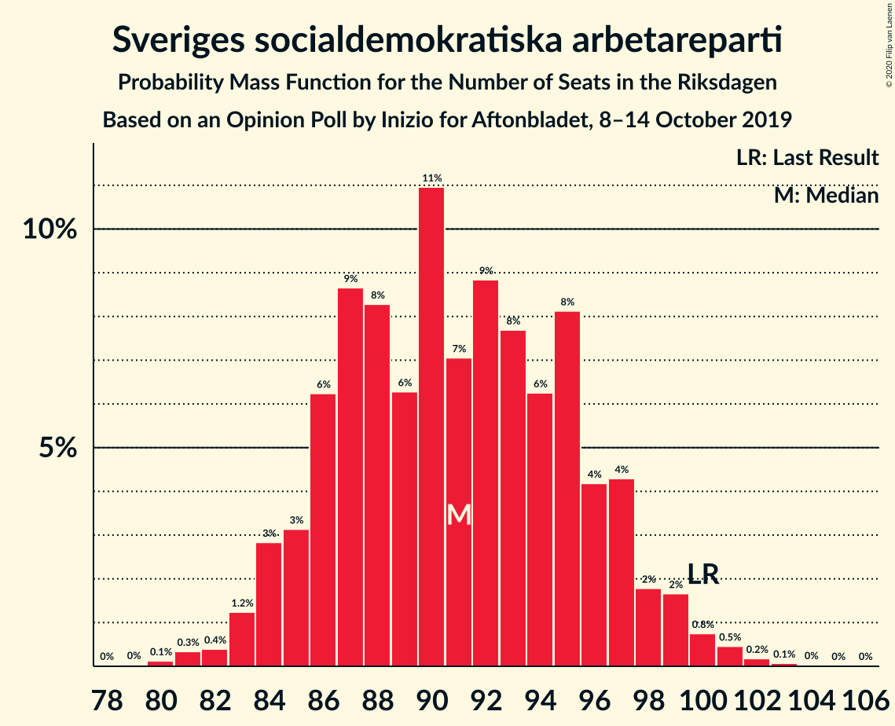
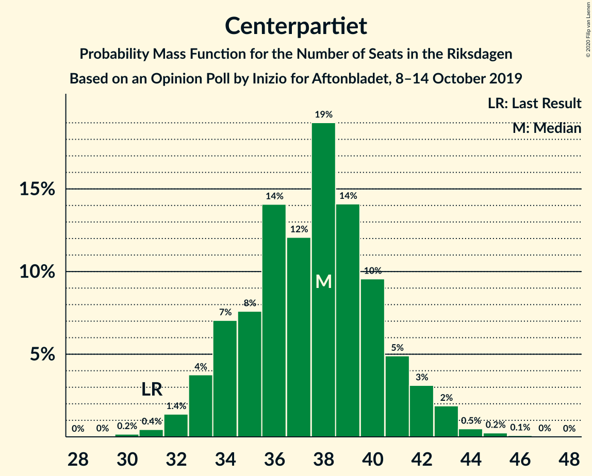
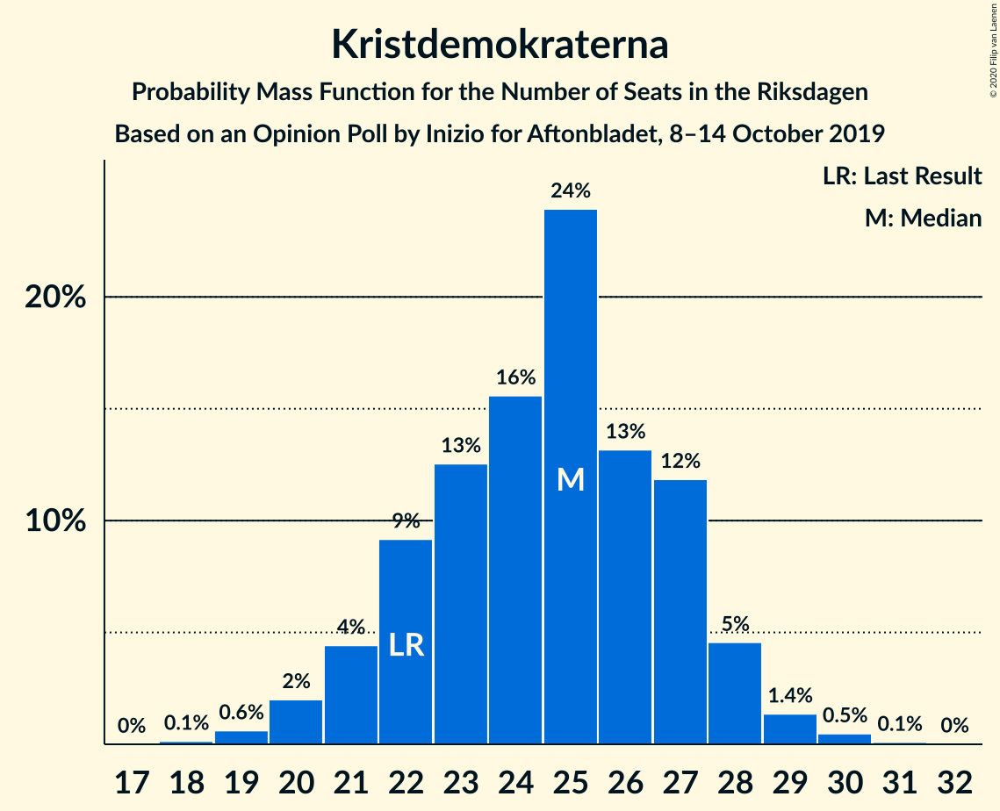
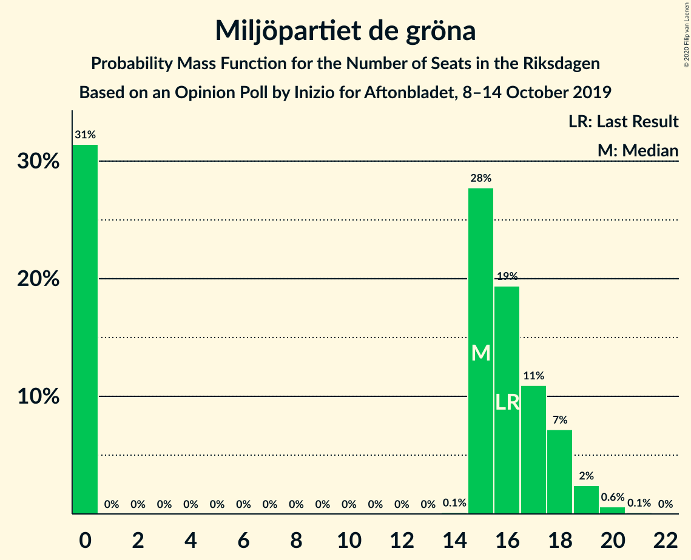
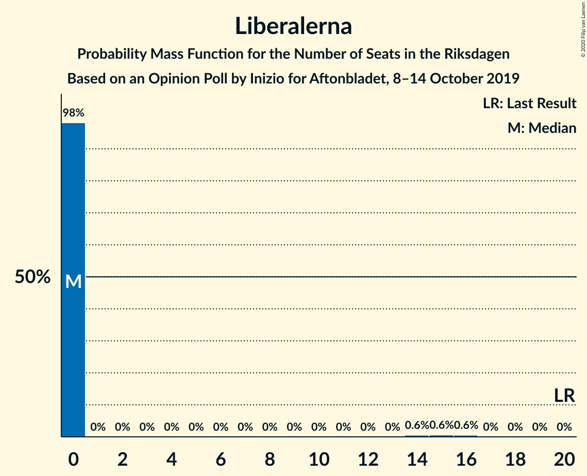
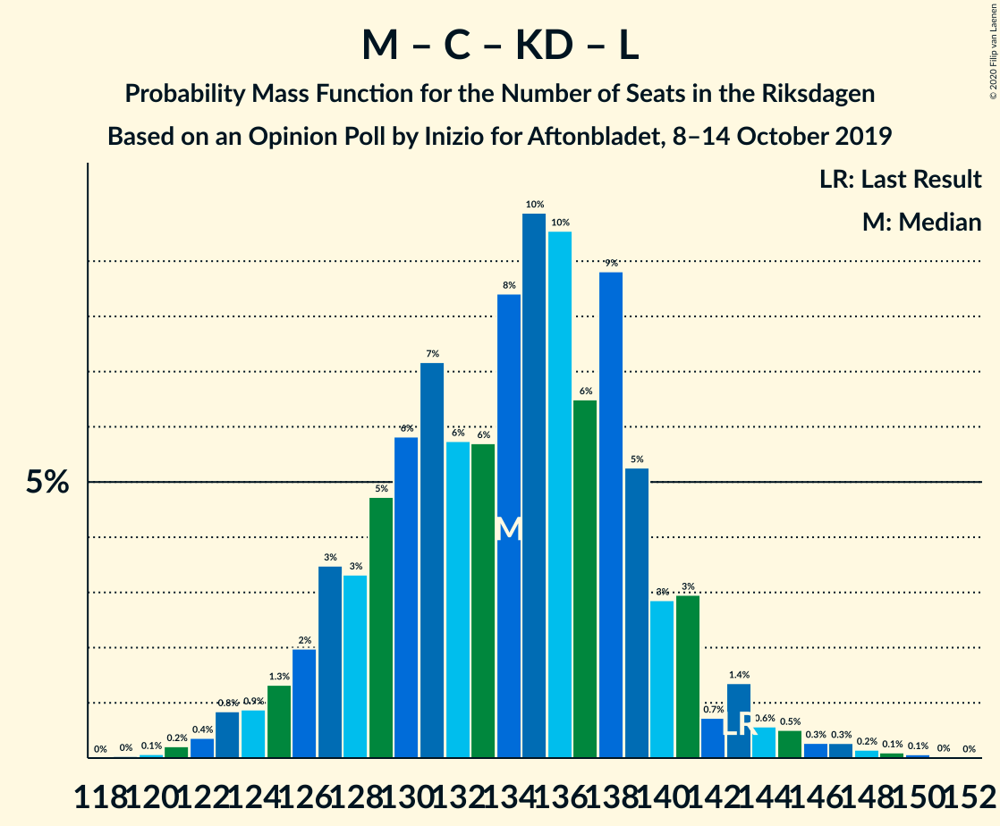
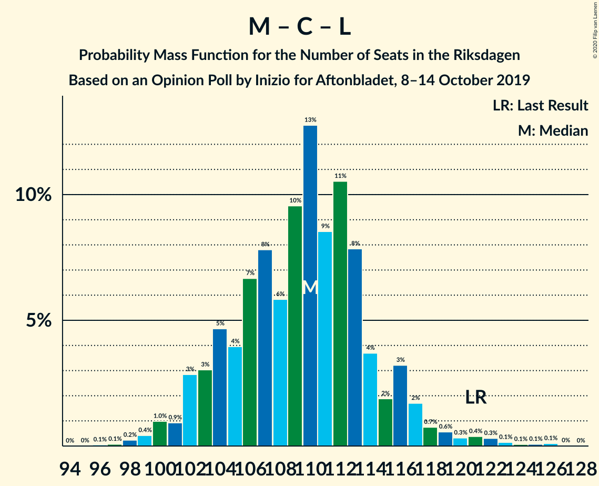

# Opinion Poll by Inizio for Aftonbladet, 8–14 October 2019

<a href="#voting-intentions">Voting Intentions</a> | <a href="#seats">Seats</a> | <a href="#coalitions">Coalitions</a> | <a href="#technical-information">Technical Information</a>

## Voting Intentions

### Confidence Intervals

| Party | Last Result | Poll Result | 80% Confidence Interval | 90% Confidence Interval | 95% Confidence Interval | 99% Confidence Interval |
|:-----:|:-----------:|:-----------:|:-----------------------:|:-----------------------:|:-----------------------:|:-----------------------:|
| Sveriges socialdemokratiska arbetareparti | 28.3% | 24.7% | 23.5–26.0% |23.2–26.3% |22.9–26.6% |22.4–27.2% |
| Sverigedemokraterna | 17.5% | 22.6% | 21.5–23.8% |21.2–24.1% |20.9–24.4% |20.3–25.0% |
| Moderata samlingspartiet | 19.8% | 19.3% | 18.2–20.4% |17.9–20.7% |17.6–21.0% |17.1–21.6% |
| Centerpartiet | 8.6% | 10.1% | 9.3–11.0% |9.1–11.2% |8.9–11.4% |8.5–11.9% |
| Vänsterpartiet | 8.0% | 8.0% | 7.3–8.8% |7.1–9.1% |6.9–9.3% |6.6–9.7% |
| Kristdemokraterna | 6.3% | 6.5% | 5.9–7.3% |5.7–7.5% |5.5–7.7% |5.2–8.0% |
| Miljöpartiet de gröna | 4.4% | 4.2% | 3.7–4.8% |3.6–5.0% |3.4–5.2% |3.2–5.5% |
| Liberalerna | 5.5% | 3.2% | 2.7–3.7% |2.6–3.9% |2.5–4.0% |2.3–4.3% |

*Note:* The poll result column reflects the actual value used in the calculations. Published results may vary slightly, and in addition be rounded to fewer digits.

## Seats

### Confidence Intervals

| Party | Last Result | Median | 80% Confidence Interval | 90% Confidence Interval | 95% Confidence Interval | 99% Confidence Interval |
|:-----:|:-----------:|:------:|:-----------------------:|:-----------------------:|:-----------------------:|:-----------------------:|
| <a href="#sveriges-socialdemokratiska-arbetareparti">Sveriges socialdemokratiska arbetareparti</a> | 100 | 91 | 86–96 |85–97 |84–99 |81–101 |
| <a href="#sverigedemokraterna">Sverigedemokraterna</a> | 62 | 83 | 79–88 |77–90 |76–91 |75–94 |
| <a href="#moderata-samlingspartiet">Moderata samlingspartiet</a> | 70 | 72 | 67–76 |66–77 |65–78 |63–81 |
| <a href="#centerpartiet">Centerpartiet</a> | 31 | 38 | 34–41 |33–42 |33–43 |31–44 |
| <a href="#vänsterpartiet">Vänsterpartiet</a> | 28 | 29 | 27–32 |26–33 |25–34 |24–36 |
| <a href="#kristdemokraterna">Kristdemokraterna</a> | 22 | 25 | 22–27 |21–28 |20–28 |19–30 |
| <a href="#miljöpartiet-de-gröna">Miljöpartiet de gröna</a> | 16 | 15 | 0–18 |0–18 |0–19 |0–20 |
| <a href="#liberalerna">Liberalerna</a> | 20 | 0 | 0 |0 |0 |0–16 |

### Sveriges socialdemokratiska arbetareparti

*For a full overview of the results for this party, see the [Sveriges socialdemokratiska arbetareparti](party-sverigessocialdemokratiskaarbetareparti.html) page.*

| Number of Seats | Probability | Accumulated | Special Marks |
|:---------------:|:-----------:|:-----------:|:-------------:|
| 79 | 0% | 100% |  |
| 80 | 0.1% | 99.9% |  |
| 81 | 0.3% | 99.8% |  |
| 82 | 0.4% | 99.5% |  |
| 83 | 1.2% | 99.1% |  |
| 84 | 3% | 98% |  |
| 85 | 3% | 95% |  |
| 86 | 6% | 92% |  |
| 87 | 9% | 86% |  |
| 88 | 8% | 77% |  |
| 89 | 6% | 69% |  |
| 90 | 11% | 62% |  |
| 91 | 7% | 51% | Median |
| 92 | 9% | 44% |  |
| 93 | 8% | 36% |  |
| 94 | 6% | 28% |  |
| 95 | 8% | 22% |  |
| 96 | 4% | 13% |  |
| 97 | 4% | 9% |  |
| 98 | 2% | 5% |  |
| 99 | 2% | 3% |  |
| 100 | 0.8% | 2% | Last Result |
| 101 | 0.5% | 0.8% |  |
| 102 | 0.2% | 0.3% |  |
| 103 | 0.1% | 0.2% |  |
| 104 | 0% | 0.1% |  |
| 105 | 0% | 0.1% |  |
| 106 | 0% | 0% |  |

### Sverigedemokraterna

*For a full overview of the results for this party, see the [Sverigedemokraterna](party-sverigedemokraterna.html) page.*

| Number of Seats | Probability | Accumulated | Special Marks |
|:---------------:|:-----------:|:-----------:|:-------------:|
| 62 | 0% | 100% | Last Result |
| 63 | 0% | 100% |  |
| 64 | 0% | 100% |  |
| 65 | 0% | 100% |  |
| 66 | 0% | 100% |  |
| 67 | 0% | 100% |  |
| 68 | 0% | 100% |  |
| 69 | 0% | 100% |  |
| 70 | 0% | 100% |  |
| 71 | 0% | 100% |  |
| 72 | 0.1% | 100% |  |
| 73 | 0.2% | 99.9% |  |
| 74 | 0.2% | 99.7% |  |
| 75 | 0.8% | 99.5% |  |
| 76 | 2% | 98.7% |  |
| 77 | 2% | 97% |  |
| 78 | 4% | 95% |  |
| 79 | 6% | 91% |  |
| 80 | 9% | 85% |  |
| 81 | 8% | 76% |  |
| 82 | 8% | 68% |  |
| 83 | 13% | 59% | Median |
| 84 | 10% | 46% |  |
| 85 | 10% | 37% |  |
| 86 | 5% | 27% |  |
| 87 | 7% | 21% |  |
| 88 | 7% | 15% |  |
| 89 | 2% | 7% |  |
| 90 | 2% | 5% |  |
| 91 | 1.3% | 3% |  |
| 92 | 0.9% | 2% |  |
| 93 | 0.4% | 0.9% |  |
| 94 | 0.2% | 0.5% |  |
| 95 | 0.1% | 0.3% |  |
| 96 | 0.1% | 0.1% |  |
| 97 | 0% | 0.1% |  |
| 98 | 0% | 0% |  |

### Moderata samlingspartiet

*For a full overview of the results for this party, see the [Moderata samlingspartiet](party-moderatasamlingspartiet.html) page.*

| Number of Seats | Probability | Accumulated | Special Marks |
|:---------------:|:-----------:|:-----------:|:-------------:|
| 61 | 0.1% | 100% |  |
| 62 | 0.2% | 99.8% |  |
| 63 | 0.4% | 99.6% |  |
| 64 | 0.8% | 99.3% |  |
| 65 | 2% | 98% |  |
| 66 | 3% | 97% |  |
| 67 | 5% | 93% |  |
| 68 | 5% | 89% |  |
| 69 | 8% | 84% |  |
| 70 | 10% | 76% | Last Result |
| 71 | 8% | 66% |  |
| 72 | 18% | 58% | Median |
| 73 | 15% | 40% |  |
| 74 | 7% | 25% |  |
| 75 | 7% | 18% |  |
| 76 | 6% | 11% |  |
| 77 | 2% | 6% |  |
| 78 | 2% | 4% |  |
| 79 | 0.8% | 2% |  |
| 80 | 0.5% | 1.1% |  |
| 81 | 0.3% | 0.6% |  |
| 82 | 0.1% | 0.3% |  |
| 83 | 0.1% | 0.2% |  |
| 84 | 0.1% | 0.1% |  |
| 85 | 0% | 0% |  |

### Centerpartiet

*For a full overview of the results for this party, see the [Centerpartiet](party-centerpartiet.html) page.*

| Number of Seats | Probability | Accumulated | Special Marks |
|:---------------:|:-----------:|:-----------:|:-------------:|
| 30 | 0.2% | 100% |  |
| 31 | 0.4% | 99.8% | Last Result |
| 32 | 1.4% | 99.4% |  |
| 33 | 4% | 98% |  |
| 34 | 7% | 94% |  |
| 35 | 8% | 87% |  |
| 36 | 14% | 80% |  |
| 37 | 12% | 65% |  |
| 38 | 19% | 53% | Median |
| 39 | 14% | 34% |  |
| 40 | 10% | 20% |  |
| 41 | 5% | 11% |  |
| 42 | 3% | 6% |  |
| 43 | 2% | 3% |  |
| 44 | 0.5% | 0.9% |  |
| 45 | 0.2% | 0.4% |  |
| 46 | 0.1% | 0.1% |  |
| 47 | 0% | 0.1% |  |
| 48 | 0% | 0% |  |

### Vänsterpartiet

*For a full overview of the results for this party, see the [Vänsterpartiet](party-vänsterpartiet.html) page.*

| Number of Seats | Probability | Accumulated | Special Marks |
|:---------------:|:-----------:|:-----------:|:-------------:|
| 23 | 0.1% | 100% |  |
| 24 | 0.6% | 99.9% |  |
| 25 | 2% | 99.2% |  |
| 26 | 4% | 97% |  |
| 27 | 6% | 93% |  |
| 28 | 15% | 87% | Last Result |
| 29 | 23% | 72% | Median |
| 30 | 18% | 50% |  |
| 31 | 13% | 32% |  |
| 32 | 10% | 19% |  |
| 33 | 5% | 10% |  |
| 34 | 3% | 4% |  |
| 35 | 0.8% | 1.4% |  |
| 36 | 0.4% | 0.6% |  |
| 37 | 0.2% | 0.2% |  |
| 38 | 0% | 0.1% |  |
| 39 | 0% | 0% |  |

### Kristdemokraterna

*For a full overview of the results for this party, see the [Kristdemokraterna](party-kristdemokraterna.html) page.*

| Number of Seats | Probability | Accumulated | Special Marks |
|:---------------:|:-----------:|:-----------:|:-------------:|
| 18 | 0.1% | 100% |  |
| 19 | 0.6% | 99.8% |  |
| 20 | 2% | 99.2% |  |
| 21 | 4% | 97% |  |
| 22 | 9% | 93% | Last Result |
| 23 | 13% | 84% |  |
| 24 | 16% | 71% |  |
| 25 | 24% | 55% | Median |
| 26 | 13% | 32% |  |
| 27 | 12% | 18% |  |
| 28 | 5% | 7% |  |
| 29 | 1.4% | 2% |  |
| 30 | 0.5% | 0.6% |  |
| 31 | 0.1% | 0.1% |  |
| 32 | 0% | 0% |  |

### Miljöpartiet de gröna

*For a full overview of the results for this party, see the [Miljöpartiet de gröna](party-miljöpartietdegröna.html) page.*

| Number of Seats | Probability | Accumulated | Special Marks |
|:---------------:|:-----------:|:-----------:|:-------------:|
| 0 | 31% | 100% |  |
| 1 | 0% | 69% |  |
| 2 | 0% | 69% |  |
| 3 | 0% | 69% |  |
| 4 | 0% | 69% |  |
| 5 | 0% | 69% |  |
| 6 | 0% | 69% |  |
| 7 | 0% | 69% |  |
| 8 | 0% | 69% |  |
| 9 | 0% | 69% |  |
| 10 | 0% | 69% |  |
| 11 | 0% | 69% |  |
| 12 | 0% | 69% |  |
| 13 | 0% | 69% |  |
| 14 | 0.1% | 69% |  |
| 15 | 28% | 68% | Median |
| 16 | 19% | 41% | Last Result |
| 17 | 11% | 21% |  |
| 18 | 7% | 10% |  |
| 19 | 2% | 3% |  |
| 20 | 0.6% | 0.8% |  |
| 21 | 0.1% | 0.1% |  |
| 22 | 0% | 0% |  |

### Liberalerna

*For a full overview of the results for this party, see the [Liberalerna](party-liberalerna.html) page.*

| Number of Seats | Probability | Accumulated | Special Marks |
|:---------------:|:-----------:|:-----------:|:-------------:|
| 0 | 98% | 100% | Median |
| 1 | 0% | 2% |  |
| 2 | 0% | 2% |  |
| 3 | 0% | 2% |  |
| 4 | 0% | 2% |  |
| 5 | 0% | 2% |  |
| 6 | 0% | 2% |  |
| 7 | 0% | 2% |  |
| 8 | 0% | 2% |  |
| 9 | 0% | 2% |  |
| 10 | 0% | 2% |  |
| 11 | 0% | 2% |  |
| 12 | 0% | 2% |  |
| 13 | 0% | 2% |  |
| 14 | 0.6% | 2% |  |
| 15 | 0.6% | 1.2% |  |
| 16 | 0.6% | 0.6% |  |
| 17 | 0% | 0% |  |
| 18 | 0% | 0% |  |
| 19 | 0% | 0% |  |
| 20 | 0% | 0% | Last Result |

## Coalitions

### Confidence Intervals

| Coalition | Last Result | Median | Majority? | 80% Confidence Interval | 90% Confidence Interval | 95% Confidence Interval | 99% Confidence Interval |
|:---------:|:-----------:|:------:|:---------:|:-----------------------:|:-----------------------:|:-----------------------:|:-----------------------:|
| Sveriges socialdemokratiska arbetareparti – Moderata samlingspartiet – Centerpartiet | 201 | 199 | 100% | 193–208 | 192–210 | 190–212 | 187–215 |
| Sverigedemokraterna – Moderata samlingspartiet – Kristdemokraterna | 154 | 180 | 82% | 173–186 | 171–189 | 170–190 | 166–193 |
| Sveriges socialdemokratiska arbetareparti – Centerpartiet – Vänsterpartiet – Miljöpartiet de gröna – Liberalerna | 195 | 169 | 18% | 163–176 | 160–178 | 159–179 | 156–183 |
| Sveriges socialdemokratiska arbetareparti – Moderata samlingspartiet | 170 | 162 | 1.3% | 156–170 | 154–172 | 153–174 | 150–177 |
| Sverigedemokraterna – Moderata samlingspartiet | 132 | 155 | 0% | 149–161 | 147–163 | 145–165 | 143–169 |
| Sveriges socialdemokratiska arbetareparti – Centerpartiet – Miljöpartiet de gröna – Liberalerna | 167 | 140 | 0% | 132–147 | 130–149 | 128–151 | 125–155 |
| Moderata samlingspartiet – Centerpartiet – Kristdemokraterna – Liberalerna | 143 | 134 | 0% | 128–139 | 126–141 | 125–143 | 122–147 |
| Moderata samlingspartiet – Centerpartiet – Kristdemokraterna | 123 | 134 | 0% | 127–139 | 126–141 | 124–143 | 121–145 |
| Sveriges socialdemokratiska arbetareparti – Vänsterpartiet – Miljöpartiet de gröna | 144 | 132 | 0% | 123–139 | 122–140 | 120–142 | 117–144 |
| Sveriges socialdemokratiska arbetareparti – Vänsterpartiet | 128 | 120 | 0% | 115–127 | 114–128 | 112–130 | 110–133 |
| Moderata samlingspartiet – Centerpartiet – Liberalerna | 121 | 110 | 0% | 104–114 | 102–116 | 101–118 | 99–122 |
| Moderata samlingspartiet – Centerpartiet | 101 | 110 | 0% | 104–114 | 102–116 | 101–117 | 98–121 |
| Sveriges socialdemokratiska arbetareparti – Miljöpartiet de gröna | 116 | 103 | 0% | 93–110 | 92–111 | 90–113 | 87–115 |

### Sveriges socialdemokratiska arbetareparti – Moderata samlingspartiet – Centerpartiet

| Number of Seats | Probability | Accumulated | Special Marks |
|:---------------:|:-----------:|:-----------:|:-------------:|
| 182 | 0% | 100% |  |
| 183 | 0% | 99.9% |  |
| 184 | 0.1% | 99.9% |  |
| 185 | 0.1% | 99.8% |  |
| 186 | 0.1% | 99.7% |  |
| 187 | 0.3% | 99.6% |  |
| 188 | 0.6% | 99.3% |  |
| 189 | 0.8% | 98.7% |  |
| 190 | 1.0% | 98% |  |
| 191 | 1.5% | 97% |  |
| 192 | 3% | 96% |  |
| 193 | 4% | 92% |  |
| 194 | 5% | 88% |  |
| 195 | 6% | 83% |  |
| 196 | 5% | 77% |  |
| 197 | 11% | 72% |  |
| 198 | 5% | 61% |  |
| 199 | 7% | 56% |  |
| 200 | 5% | 50% |  |
| 201 | 8% | 45% | Last Result, Median |
| 202 | 4% | 37% |  |
| 203 | 5% | 33% |  |
| 204 | 7% | 28% |  |
| 205 | 2% | 22% |  |
| 206 | 2% | 19% |  |
| 207 | 7% | 18% |  |
| 208 | 1.4% | 11% |  |
| 209 | 2% | 9% |  |
| 210 | 3% | 8% |  |
| 211 | 0.9% | 4% |  |
| 212 | 1.5% | 4% |  |
| 213 | 1.1% | 2% |  |
| 214 | 0.2% | 1.0% |  |
| 215 | 0.4% | 0.7% |  |
| 216 | 0.2% | 0.3% |  |
| 217 | 0% | 0.1% |  |
| 218 | 0.1% | 0.1% |  |
| 219 | 0% | 0% |  |

### Sverigedemokraterna – Moderata samlingspartiet – Kristdemokraterna

| Number of Seats | Probability | Accumulated | Special Marks |
|:---------------:|:-----------:|:-----------:|:-------------:|
| 154 | 0% | 100% | Last Result |
| 155 | 0% | 100% |  |
| 156 | 0% | 100% |  |
| 157 | 0% | 100% |  |
| 158 | 0% | 100% |  |
| 159 | 0% | 100% |  |
| 160 | 0% | 100% |  |
| 161 | 0% | 100% |  |
| 162 | 0% | 100% |  |
| 163 | 0.1% | 99.9% |  |
| 164 | 0.2% | 99.9% |  |
| 165 | 0.1% | 99.7% |  |
| 166 | 0.4% | 99.6% |  |
| 167 | 0.3% | 99.2% |  |
| 168 | 0.5% | 98.9% |  |
| 169 | 0.9% | 98% |  |
| 170 | 1.4% | 98% |  |
| 171 | 2% | 96% |  |
| 172 | 2% | 94% |  |
| 173 | 3% | 91% |  |
| 174 | 7% | 88% |  |
| 175 | 4% | 82% | Majority |
| 176 | 7% | 78% |  |
| 177 | 5% | 71% |  |
| 178 | 10% | 66% |  |
| 179 | 6% | 56% |  |
| 180 | 14% | 50% | Median |
| 181 | 3% | 36% |  |
| 182 | 3% | 33% |  |
| 183 | 5% | 31% |  |
| 184 | 5% | 26% |  |
| 185 | 6% | 21% |  |
| 186 | 7% | 15% |  |
| 187 | 1.0% | 8% |  |
| 188 | 1.4% | 7% |  |
| 189 | 1.4% | 6% |  |
| 190 | 2% | 4% |  |
| 191 | 0.8% | 2% |  |
| 192 | 0.5% | 1.4% |  |
| 193 | 0.5% | 0.9% |  |
| 194 | 0.2% | 0.4% |  |
| 195 | 0.1% | 0.2% |  |
| 196 | 0% | 0.1% |  |
| 197 | 0% | 0.1% |  |
| 198 | 0% | 0% |  |

### Sveriges socialdemokratiska arbetareparti – Centerpartiet – Vänsterpartiet – Miljöpartiet de gröna – Liberalerna

| Number of Seats | Probability | Accumulated | Special Marks |
|:---------------:|:-----------:|:-----------:|:-------------:|
| 152 | 0% | 100% |  |
| 153 | 0% | 99.9% |  |
| 154 | 0.1% | 99.9% |  |
| 155 | 0.2% | 99.8% |  |
| 156 | 0.5% | 99.6% |  |
| 157 | 0.5% | 99.1% |  |
| 158 | 0.8% | 98.6% |  |
| 159 | 2% | 98% |  |
| 160 | 1.4% | 96% |  |
| 161 | 1.4% | 94% |  |
| 162 | 1.0% | 93% |  |
| 163 | 7% | 92% |  |
| 164 | 6% | 85% |  |
| 165 | 5% | 79% |  |
| 166 | 5% | 74% |  |
| 167 | 3% | 69% |  |
| 168 | 3% | 67% |  |
| 169 | 14% | 64% |  |
| 170 | 6% | 50% |  |
| 171 | 10% | 44% |  |
| 172 | 5% | 34% |  |
| 173 | 7% | 29% | Median |
| 174 | 4% | 22% |  |
| 175 | 7% | 18% | Majority |
| 176 | 3% | 12% |  |
| 177 | 2% | 9% |  |
| 178 | 2% | 6% |  |
| 179 | 1.4% | 4% |  |
| 180 | 0.9% | 2% |  |
| 181 | 0.5% | 2% |  |
| 182 | 0.3% | 1.1% |  |
| 183 | 0.4% | 0.8% |  |
| 184 | 0.1% | 0.4% |  |
| 185 | 0.2% | 0.3% |  |
| 186 | 0.1% | 0.1% |  |
| 187 | 0% | 0.1% |  |
| 188 | 0% | 0% |  |
| 189 | 0% | 0% |  |
| 190 | 0% | 0% |  |
| 191 | 0% | 0% |  |
| 192 | 0% | 0% |  |
| 193 | 0% | 0% |  |
| 194 | 0% | 0% |  |
| 195 | 0% | 0% | Last Result |

### Sveriges socialdemokratiska arbetareparti – Moderata samlingspartiet

| Number of Seats | Probability | Accumulated | Special Marks |
|:---------------:|:-----------:|:-----------:|:-------------:|
| 146 | 0% | 100% |  |
| 147 | 0% | 99.9% |  |
| 148 | 0.1% | 99.9% |  |
| 149 | 0.1% | 99.8% |  |
| 150 | 0.3% | 99.7% |  |
| 151 | 0.3% | 99.4% |  |
| 152 | 0.7% | 99.1% |  |
| 153 | 1.2% | 98% |  |
| 154 | 2% | 97% |  |
| 155 | 3% | 95% |  |
| 156 | 5% | 92% |  |
| 157 | 4% | 87% |  |
| 158 | 4% | 84% |  |
| 159 | 10% | 80% |  |
| 160 | 6% | 70% |  |
| 161 | 8% | 64% |  |
| 162 | 7% | 56% |  |
| 163 | 9% | 49% | Median |
| 164 | 9% | 41% |  |
| 165 | 5% | 32% |  |
| 166 | 4% | 26% |  |
| 167 | 4% | 23% |  |
| 168 | 5% | 19% |  |
| 169 | 3% | 14% |  |
| 170 | 3% | 11% | Last Result |
| 171 | 2% | 8% |  |
| 172 | 1.1% | 5% |  |
| 173 | 1.5% | 4% |  |
| 174 | 1.4% | 3% |  |
| 175 | 0.4% | 1.3% | Majority |
| 176 | 0.3% | 0.9% |  |
| 177 | 0.3% | 0.6% |  |
| 178 | 0.1% | 0.2% |  |
| 179 | 0.1% | 0.1% |  |
| 180 | 0% | 0.1% |  |
| 181 | 0% | 0% |  |

### Sverigedemokraterna – Moderata samlingspartiet

| Number of Seats | Probability | Accumulated | Special Marks |
|:---------------:|:-----------:|:-----------:|:-------------:|
| 132 | 0% | 100% | Last Result |
| 133 | 0% | 100% |  |
| 134 | 0% | 100% |  |
| 135 | 0% | 100% |  |
| 136 | 0% | 100% |  |
| 137 | 0% | 100% |  |
| 138 | 0% | 100% |  |
| 139 | 0% | 100% |  |
| 140 | 0.1% | 99.9% |  |
| 141 | 0.2% | 99.9% |  |
| 142 | 0.1% | 99.7% |  |
| 143 | 0.5% | 99.5% |  |
| 144 | 0.5% | 99.0% |  |
| 145 | 1.5% | 98.5% |  |
| 146 | 2% | 97% |  |
| 147 | 1.1% | 95% |  |
| 148 | 4% | 94% |  |
| 149 | 3% | 90% |  |
| 150 | 4% | 87% |  |
| 151 | 4% | 83% |  |
| 152 | 5% | 78% |  |
| 153 | 11% | 73% |  |
| 154 | 4% | 63% |  |
| 155 | 15% | 59% | Median |
| 156 | 10% | 44% |  |
| 157 | 5% | 34% |  |
| 158 | 9% | 29% |  |
| 159 | 3% | 20% |  |
| 160 | 7% | 17% |  |
| 161 | 2% | 10% |  |
| 162 | 2% | 8% |  |
| 163 | 2% | 6% |  |
| 164 | 0.6% | 4% |  |
| 165 | 1.2% | 3% |  |
| 166 | 0.7% | 2% |  |
| 167 | 0.5% | 2% |  |
| 168 | 0.5% | 1.0% |  |
| 169 | 0.3% | 0.5% |  |
| 170 | 0.2% | 0.2% |  |
| 171 | 0% | 0.1% |  |
| 172 | 0% | 0% |  |

### Sveriges socialdemokratiska arbetareparti – Centerpartiet – Miljöpartiet de gröna – Liberalerna

| Number of Seats | Probability | Accumulated | Special Marks |
|:---------------:|:-----------:|:-----------:|:-------------:|
| 122 | 0% | 100% |  |
| 123 | 0.1% | 99.9% |  |
| 124 | 0.2% | 99.8% |  |
| 125 | 0.1% | 99.6% |  |
| 126 | 0.4% | 99.5% |  |
| 127 | 0.8% | 99.1% |  |
| 128 | 1.1% | 98% |  |
| 129 | 0.8% | 97% |  |
| 130 | 2% | 96% |  |
| 131 | 2% | 94% |  |
| 132 | 6% | 92% |  |
| 133 | 2% | 86% |  |
| 134 | 7% | 85% |  |
| 135 | 3% | 78% |  |
| 136 | 4% | 75% |  |
| 137 | 4% | 71% |  |
| 138 | 4% | 67% |  |
| 139 | 7% | 62% |  |
| 140 | 10% | 55% |  |
| 141 | 5% | 45% |  |
| 142 | 5% | 40% |  |
| 143 | 9% | 35% |  |
| 144 | 5% | 26% | Median |
| 145 | 5% | 21% |  |
| 146 | 5% | 16% |  |
| 147 | 3% | 11% |  |
| 148 | 3% | 9% |  |
| 149 | 2% | 6% |  |
| 150 | 1.1% | 4% |  |
| 151 | 1.0% | 3% |  |
| 152 | 0.5% | 2% |  |
| 153 | 0.2% | 1.1% |  |
| 154 | 0.2% | 0.9% |  |
| 155 | 0.3% | 0.7% |  |
| 156 | 0.1% | 0.3% |  |
| 157 | 0.2% | 0.3% |  |
| 158 | 0% | 0.1% |  |
| 159 | 0% | 0.1% |  |
| 160 | 0% | 0% |  |
| 161 | 0% | 0% |  |
| 162 | 0% | 0% |  |
| 163 | 0% | 0% |  |
| 164 | 0% | 0% |  |
| 165 | 0% | 0% |  |
| 166 | 0% | 0% |  |
| 167 | 0% | 0% | Last Result |

### Moderata samlingspartiet – Centerpartiet – Kristdemokraterna – Liberalerna

| Number of Seats | Probability | Accumulated | Special Marks |
|:---------------:|:-----------:|:-----------:|:-------------:|
| 119 | 0% | 100% |  |
| 120 | 0.1% | 99.9% |  |
| 121 | 0.2% | 99.9% |  |
| 122 | 0.4% | 99.7% |  |
| 123 | 0.8% | 99.3% |  |
| 124 | 0.9% | 98% |  |
| 125 | 1.3% | 98% |  |
| 126 | 2% | 96% |  |
| 127 | 3% | 94% |  |
| 128 | 3% | 91% |  |
| 129 | 5% | 87% |  |
| 130 | 6% | 83% |  |
| 131 | 7% | 77% |  |
| 132 | 6% | 70% |  |
| 133 | 6% | 64% |  |
| 134 | 8% | 58% |  |
| 135 | 10% | 50% | Median |
| 136 | 10% | 40% |  |
| 137 | 6% | 30% |  |
| 138 | 9% | 24% |  |
| 139 | 5% | 15% |  |
| 140 | 3% | 10% |  |
| 141 | 3% | 7% |  |
| 142 | 0.7% | 4% |  |
| 143 | 1.4% | 3% | Last Result |
| 144 | 0.6% | 2% |  |
| 145 | 0.5% | 1.4% |  |
| 146 | 0.3% | 0.9% |  |
| 147 | 0.3% | 0.6% |  |
| 148 | 0.2% | 0.4% |  |
| 149 | 0.1% | 0.2% |  |
| 150 | 0.1% | 0.1% |  |
| 151 | 0% | 0.1% |  |
| 152 | 0% | 0% |  |

### Moderata samlingspartiet – Centerpartiet – Kristdemokraterna

| Number of Seats | Probability | Accumulated | Special Marks |
|:---------------:|:-----------:|:-----------:|:-------------:|
| 118 | 0% | 100% |  |
| 119 | 0.1% | 99.9% |  |
| 120 | 0.1% | 99.9% |  |
| 121 | 0.3% | 99.8% |  |
| 122 | 0.4% | 99.5% |  |
| 123 | 1.0% | 99.1% | Last Result |
| 124 | 1.1% | 98% |  |
| 125 | 2% | 97% |  |
| 126 | 2% | 95% |  |
| 127 | 4% | 93% |  |
| 128 | 3% | 90% |  |
| 129 | 5% | 86% |  |
| 130 | 6% | 81% |  |
| 131 | 7% | 76% |  |
| 132 | 6% | 68% |  |
| 133 | 6% | 62% |  |
| 134 | 8% | 57% |  |
| 135 | 10% | 48% | Median |
| 136 | 9% | 38% |  |
| 137 | 6% | 29% |  |
| 138 | 9% | 22% |  |
| 139 | 5% | 14% |  |
| 140 | 3% | 9% |  |
| 141 | 3% | 6% |  |
| 142 | 0.6% | 3% |  |
| 143 | 1.3% | 3% |  |
| 144 | 0.5% | 1.3% |  |
| 145 | 0.4% | 0.8% |  |
| 146 | 0.2% | 0.4% |  |
| 147 | 0.2% | 0.3% |  |
| 148 | 0% | 0.1% |  |
| 149 | 0% | 0.1% |  |
| 150 | 0% | 0% |  |

### Sveriges socialdemokratiska arbetareparti – Vänsterpartiet – Miljöpartiet de gröna

| Number of Seats | Probability | Accumulated | Special Marks |
|:---------------:|:-----------:|:-----------:|:-------------:|
| 114 | 0.1% | 100% |  |
| 115 | 0.1% | 99.9% |  |
| 116 | 0.2% | 99.9% |  |
| 117 | 0.5% | 99.6% |  |
| 118 | 0.3% | 99.2% |  |
| 119 | 0.8% | 98.9% |  |
| 120 | 0.8% | 98% |  |
| 121 | 2% | 97% |  |
| 122 | 1.3% | 96% |  |
| 123 | 5% | 94% |  |
| 124 | 2% | 89% |  |
| 125 | 6% | 88% |  |
| 126 | 3% | 81% |  |
| 127 | 4% | 78% |  |
| 128 | 3% | 74% |  |
| 129 | 4% | 71% |  |
| 130 | 4% | 67% |  |
| 131 | 10% | 63% |  |
| 132 | 4% | 52% |  |
| 133 | 8% | 48% |  |
| 134 | 5% | 39% |  |
| 135 | 8% | 35% | Median |
| 136 | 5% | 27% |  |
| 137 | 5% | 21% |  |
| 138 | 4% | 16% |  |
| 139 | 5% | 12% |  |
| 140 | 3% | 8% |  |
| 141 | 1.4% | 5% |  |
| 142 | 2% | 3% |  |
| 143 | 0.8% | 2% |  |
| 144 | 0.3% | 0.8% | Last Result |
| 145 | 0.3% | 0.5% |  |
| 146 | 0.1% | 0.2% |  |
| 147 | 0.1% | 0.1% |  |
| 148 | 0% | 0% |  |

### Sveriges socialdemokratiska arbetareparti – Vänsterpartiet

| Number of Seats | Probability | Accumulated | Special Marks |
|:---------------:|:-----------:|:-----------:|:-------------:|
| 107 | 0% | 100% |  |
| 108 | 0.1% | 99.9% |  |
| 109 | 0.2% | 99.9% |  |
| 110 | 0.6% | 99.7% |  |
| 111 | 0.5% | 99.1% |  |
| 112 | 1.3% | 98.6% |  |
| 113 | 2% | 97% |  |
| 114 | 5% | 96% |  |
| 115 | 3% | 91% |  |
| 116 | 11% | 88% |  |
| 117 | 4% | 76% |  |
| 118 | 10% | 72% |  |
| 119 | 6% | 62% |  |
| 120 | 8% | 56% | Median |
| 121 | 7% | 48% |  |
| 122 | 6% | 41% |  |
| 123 | 8% | 36% |  |
| 124 | 5% | 27% |  |
| 125 | 7% | 22% |  |
| 126 | 3% | 15% |  |
| 127 | 5% | 12% |  |
| 128 | 2% | 7% | Last Result |
| 129 | 1.2% | 5% |  |
| 130 | 1.4% | 4% |  |
| 131 | 0.9% | 2% |  |
| 132 | 0.8% | 1.4% |  |
| 133 | 0.3% | 0.6% |  |
| 134 | 0.1% | 0.3% |  |
| 135 | 0.1% | 0.1% |  |
| 136 | 0% | 0.1% |  |
| 137 | 0% | 0% |  |

### Moderata samlingspartiet – Centerpartiet – Liberalerna

| Number of Seats | Probability | Accumulated | Special Marks |
|:---------------:|:-----------:|:-----------:|:-------------:|
| 96 | 0.1% | 100% |  |
| 97 | 0.1% | 99.9% |  |
| 98 | 0.2% | 99.9% |  |
| 99 | 0.4% | 99.6% |  |
| 100 | 1.0% | 99.2% |  |
| 101 | 0.9% | 98% |  |
| 102 | 3% | 97% |  |
| 103 | 3% | 94% |  |
| 104 | 5% | 91% |  |
| 105 | 4% | 87% |  |
| 106 | 7% | 83% |  |
| 107 | 8% | 76% |  |
| 108 | 6% | 68% |  |
| 109 | 10% | 62% |  |
| 110 | 13% | 53% | Median |
| 111 | 9% | 40% |  |
| 112 | 11% | 32% |  |
| 113 | 8% | 21% |  |
| 114 | 4% | 13% |  |
| 115 | 2% | 10% |  |
| 116 | 3% | 8% |  |
| 117 | 2% | 4% |  |
| 118 | 0.7% | 3% |  |
| 119 | 0.6% | 2% |  |
| 120 | 0.3% | 1.4% |  |
| 121 | 0.4% | 1.1% | Last Result |
| 122 | 0.3% | 0.7% |  |
| 123 | 0.1% | 0.4% |  |
| 124 | 0.1% | 0.3% |  |
| 125 | 0.1% | 0.2% |  |
| 126 | 0.1% | 0.1% |  |
| 127 | 0% | 0% |  |

### Moderata samlingspartiet – Centerpartiet

| Number of Seats | Probability | Accumulated | Special Marks |
|:---------------:|:-----------:|:-----------:|:-------------:|
| 96 | 0.1% | 100% |  |
| 97 | 0.1% | 99.9% |  |
| 98 | 0.3% | 99.8% |  |
| 99 | 0.5% | 99.5% |  |
| 100 | 1.0% | 99.0% |  |
| 101 | 1.2% | 98% | Last Result |
| 102 | 3% | 97% |  |
| 103 | 3% | 94% |  |
| 104 | 5% | 90% |  |
| 105 | 4% | 86% |  |
| 106 | 7% | 82% |  |
| 107 | 8% | 75% |  |
| 108 | 6% | 67% |  |
| 109 | 10% | 61% |  |
| 110 | 13% | 51% | Median |
| 111 | 9% | 38% |  |
| 112 | 11% | 30% |  |
| 113 | 8% | 19% |  |
| 114 | 4% | 12% |  |
| 115 | 2% | 8% |  |
| 116 | 3% | 6% |  |
| 117 | 1.4% | 3% |  |
| 118 | 0.6% | 2% |  |
| 119 | 0.5% | 1.2% |  |
| 120 | 0.2% | 0.7% |  |
| 121 | 0.3% | 0.5% |  |
| 122 | 0.1% | 0.2% |  |
| 123 | 0% | 0.1% |  |
| 124 | 0% | 0.1% |  |
| 125 | 0% | 0% |  |

### Sveriges socialdemokratiska arbetareparti – Miljöpartiet de gröna

| Number of Seats | Probability | Accumulated | Special Marks |
|:---------------:|:-----------:|:-----------:|:-------------:|
| 84 | 0.1% | 100% |  |
| 85 | 0.1% | 99.9% |  |
| 86 | 0.2% | 99.8% |  |
| 87 | 0.4% | 99.6% |  |
| 88 | 0.5% | 99.1% |  |
| 89 | 0.4% | 98.6% |  |
| 90 | 1.1% | 98% |  |
| 91 | 0.7% | 97% |  |
| 92 | 4% | 96% |  |
| 93 | 4% | 92% |  |
| 94 | 4% | 88% |  |
| 95 | 6% | 85% |  |
| 96 | 3% | 79% |  |
| 97 | 4% | 76% |  |
| 98 | 2% | 72% |  |
| 99 | 2% | 70% |  |
| 100 | 5% | 68% |  |
| 101 | 4% | 64% |  |
| 102 | 10% | 60% |  |
| 103 | 6% | 50% |  |
| 104 | 6% | 45% |  |
| 105 | 8% | 39% |  |
| 106 | 7% | 31% | Median |
| 107 | 5% | 24% |  |
| 108 | 5% | 20% |  |
| 109 | 3% | 15% |  |
| 110 | 3% | 11% |  |
| 111 | 3% | 8% |  |
| 112 | 2% | 4% |  |
| 113 | 1.2% | 3% |  |
| 114 | 0.7% | 1.3% |  |
| 115 | 0.4% | 0.7% |  |
| 116 | 0.2% | 0.3% | Last Result |
| 117 | 0.1% | 0.1% |  |
| 118 | 0% | 0.1% |  |
| 119 | 0% | 0% |  |

## Technical Information

### Opinion Poll

+ **Polling firm:** Inizio
+ **Commissioner(s):** Aftonbladet
+ **Fieldwork period:** 8–14 October 2019

### Calculations

+ **Sample size:** 2132
+ **Simulations done:** 1,048,576
+ **Error estimate:** 0.78%

