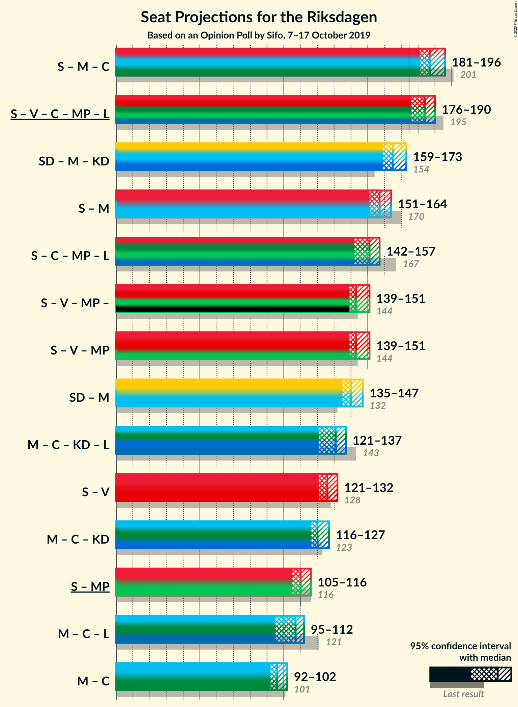
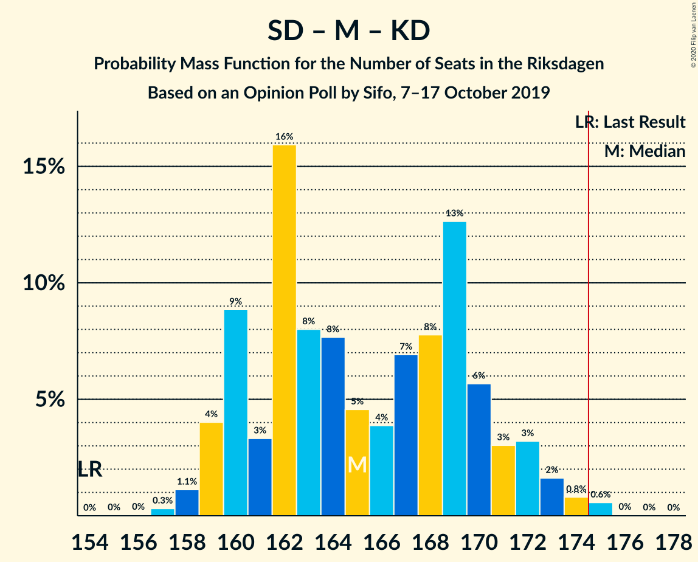
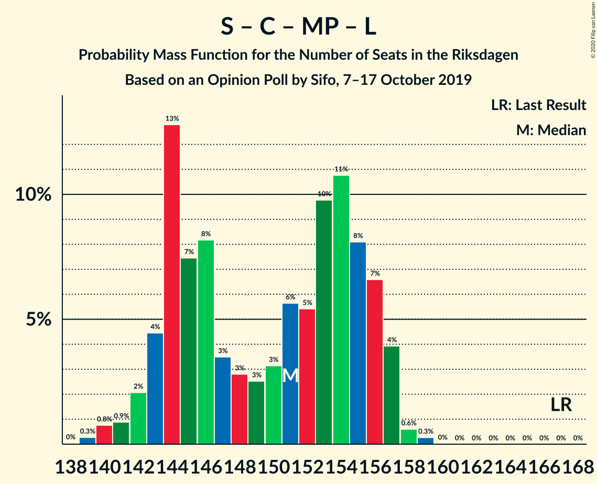

# Opinion Poll by Sifo, 7–17 October 2019

<a href="#voting-intentions">Voting Intentions</a> | <a href="#seats">Seats</a> | <a href="#coalitions">Coalitions</a> | <a href="#technical-information">Technical Information</a>

## Voting Intentions

### Confidence Intervals

| Party | Last Result | Poll Result | 80% Confidence Interval | 90% Confidence Interval | 95% Confidence Interval | 99% Confidence Interval |
|:-----:|:-----------:|:-----------:|:-----------------------:|:-----------------------:|:-----------------------:|:-----------------------:|
| Sveriges socialdemokratiska arbetareparti | 28.3% | 25.5% | 24.8–26.1% |24.6–26.3% |24.5–26.4% |24.2–26.8% |
| Sverigedemokraterna | 17.5% | 21.0% | 20.4–21.6% |20.2–21.7% |20.1–21.9% |19.8–22.2% |
| Moderata samlingspartiet | 19.8% | 18.1% | 17.5–18.7% |17.4–18.8% |17.3–19.0% |17.0–19.3% |
| Vänsterpartiet | 8.0% | 9.4% | 9.0–9.8% |8.9–10.0% |8.8–10.1% |8.6–10.3% |
| Centerpartiet | 8.6% | 8.6% | 8.2–9.0% |8.1–9.1% |8.0–9.2% |7.8–9.4% |
| Kristdemokraterna | 6.3% | 6.9% | 6.5–7.2% |6.4–7.3% |6.3–7.4% |6.1–7.6% |
| Miljöpartiet de gröna | 4.4% | 5.1% | 4.8–5.5% |4.7–5.5% |4.6–5.6% |4.5–5.8% |
| Liberalerna | 5.5% | 4.0% | 3.7–4.3% |3.6–4.4% |3.6–4.5% |3.4–4.6% |

*Note:* The poll result column reflects the actual value used in the calculations. Published results may vary slightly, and in addition be rounded to fewer digits.

## Seats

### Confidence Intervals

| Party | Last Result | Median | 80% Confidence Interval | 90% Confidence Interval | 95% Confidence Interval | 99% Confidence Interval |
|:-----:|:-----------:|:------:|:-----------------------:|:-----------------------:|:-----------------------:|:-----------------------:|
| <a href="#sveriges-socialdemokratiska-arbetareparti">Sveriges socialdemokratiska arbetareparti</a> | 100 | 93 | 90–96 |88–97 |87–98 |85–99 |
| <a href="#sverigedemokraterna">Sverigedemokraterna</a> | 62 | 77 | 74–80 |73–81 |72–81 |71–82 |
| <a href="#moderata-samlingspartiet">Moderata samlingspartiet</a> | 70 | 65 | 63–68 |62–68 |62–69 |60–70 |
| <a href="#vänsterpartiet">Vänsterpartiet</a> | 28 | 34 | 32–36 |32–36 |32–37 |31–38 |
| <a href="#centerpartiet">Centerpartiet</a> | 31 | 31 | 30–34 |29–34 |29–34 |27–35 |
| <a href="#kristdemokraterna">Kristdemokraterna</a> | 22 | 26 | 24–27 |23–28 |23–28 |23–28 |
| <a href="#miljöpartiet-de-gröna">Miljöpartiet de gröna</a> | 16 | 18 | 17–20 |17–20 |16–20 |16–21 |
| <a href="#liberalerna">Liberalerna</a> | 20 | 0 | 0–15 |0–15 |0–15 |0–16 |

### Sveriges socialdemokratiska arbetareparti

*For a full overview of the results for this party, see the [Sveriges socialdemokratiska arbetareparti](party-sverigessocialdemokratiskaarbetareparti.html) page.*

| Number of Seats | Probability | Accumulated | Special Marks |
|:---------------:|:-----------:|:-----------:|:-------------:|
| 85 | 0.7% | 100% |  |
| 86 | 0.9% | 99.3% |  |
| 87 | 2% | 98% |  |
| 88 | 4% | 96% |  |
| 89 | 2% | 92% |  |
| 90 | 8% | 90% |  |
| 91 | 8% | 82% |  |
| 92 | 16% | 74% |  |
| 93 | 10% | 58% | Median |
| 94 | 14% | 48% |  |
| 95 | 16% | 34% |  |
| 96 | 9% | 18% |  |
| 97 | 5% | 9% |  |
| 98 | 3% | 4% |  |
| 99 | 1.0% | 1.5% |  |
| 100 | 0.3% | 0.5% | Last Result |
| 101 | 0.2% | 0.2% |  |
| 102 | 0% | 0% |  |

### Sverigedemokraterna

*For a full overview of the results for this party, see the [Sverigedemokraterna](party-sverigedemokraterna.html) page.*

| Number of Seats | Probability | Accumulated | Special Marks |
|:---------------:|:-----------:|:-----------:|:-------------:|
| 62 | 0% | 100% | Last Result |
| 63 | 0% | 100% |  |
| 64 | 0% | 100% |  |
| 65 | 0% | 100% |  |
| 66 | 0% | 100% |  |
| 67 | 0% | 100% |  |
| 68 | 0% | 100% |  |
| 69 | 0.1% | 100% |  |
| 70 | 0.3% | 99.9% |  |
| 71 | 0.3% | 99.6% |  |
| 72 | 3% | 99.3% |  |
| 73 | 6% | 96% |  |
| 74 | 5% | 91% |  |
| 75 | 18% | 85% |  |
| 76 | 16% | 68% |  |
| 77 | 16% | 52% | Median |
| 78 | 6% | 36% |  |
| 79 | 15% | 30% |  |
| 80 | 8% | 15% |  |
| 81 | 6% | 7% |  |
| 82 | 0.2% | 0.6% |  |
| 83 | 0.3% | 0.4% |  |
| 84 | 0.1% | 0.1% |  |
| 85 | 0% | 0% |  |

### Moderata samlingspartiet

*For a full overview of the results for this party, see the [Moderata samlingspartiet](party-moderatasamlingspartiet.html) page.*

| Number of Seats | Probability | Accumulated | Special Marks |
|:---------------:|:-----------:|:-----------:|:-------------:|
| 59 | 0.3% | 100% |  |
| 60 | 1.2% | 99.7% |  |
| 61 | 0.9% | 98% |  |
| 62 | 4% | 98% |  |
| 63 | 8% | 94% |  |
| 64 | 17% | 86% |  |
| 65 | 28% | 69% | Median |
| 66 | 22% | 41% |  |
| 67 | 8% | 19% |  |
| 68 | 6% | 10% |  |
| 69 | 2% | 4% |  |
| 70 | 1.4% | 2% | Last Result |
| 71 | 0.3% | 0.3% |  |
| 72 | 0% | 0% |  |

### Vänsterpartiet

*For a full overview of the results for this party, see the [Vänsterpartiet](party-vänsterpartiet.html) page.*

| Number of Seats | Probability | Accumulated | Special Marks |
|:---------------:|:-----------:|:-----------:|:-------------:|
| 28 | 0% | 100% | Last Result |
| 29 | 0% | 100% |  |
| 30 | 0.1% | 100% |  |
| 31 | 2% | 99.9% |  |
| 32 | 16% | 98% |  |
| 33 | 18% | 82% |  |
| 34 | 18% | 64% | Median |
| 35 | 28% | 46% |  |
| 36 | 14% | 18% |  |
| 37 | 4% | 5% |  |
| 38 | 0.5% | 0.6% |  |
| 39 | 0% | 0% |  |

### Centerpartiet

*For a full overview of the results for this party, see the [Centerpartiet](party-centerpartiet.html) page.*

| Number of Seats | Probability | Accumulated | Special Marks |
|:---------------:|:-----------:|:-----------:|:-------------:|
| 27 | 0.6% | 100% |  |
| 28 | 1.2% | 99.4% |  |
| 29 | 4% | 98% |  |
| 30 | 17% | 95% |  |
| 31 | 37% | 78% | Last Result, Median |
| 32 | 17% | 41% |  |
| 33 | 14% | 24% |  |
| 34 | 9% | 11% |  |
| 35 | 2% | 2% |  |
| 36 | 0% | 0% |  |

### Kristdemokraterna

*For a full overview of the results for this party, see the [Kristdemokraterna](party-kristdemokraterna.html) page.*

| Number of Seats | Probability | Accumulated | Special Marks |
|:---------------:|:-----------:|:-----------:|:-------------:|
| 21 | 0.1% | 100% |  |
| 22 | 0.3% | 99.9% | Last Result |
| 23 | 6% | 99.6% |  |
| 24 | 14% | 94% |  |
| 25 | 20% | 79% |  |
| 26 | 31% | 59% | Median |
| 27 | 23% | 28% |  |
| 28 | 5% | 5% |  |
| 29 | 0.1% | 0.1% |  |
| 30 | 0% | 0% |  |

### Miljöpartiet de gröna

*For a full overview of the results for this party, see the [Miljöpartiet de gröna](party-miljöpartietdegröna.html) page.*

| Number of Seats | Probability | Accumulated | Special Marks |
|:---------------:|:-----------:|:-----------:|:-------------:|
| 15 | 0.1% | 100% |  |
| 16 | 2% | 99.9% | Last Result |
| 17 | 19% | 97% |  |
| 18 | 42% | 78% | Median |
| 19 | 26% | 36% |  |
| 20 | 10% | 10% |  |
| 21 | 0.6% | 0.6% |  |
| 22 | 0% | 0% |  |

### Liberalerna

*For a full overview of the results for this party, see the [Liberalerna](party-liberalerna.html) page.*

| Number of Seats | Probability | Accumulated | Special Marks |
|:---------------:|:-----------:|:-----------:|:-------------:|
| 0 | 70% | 100% | Median |
| 1 | 0% | 30% |  |
| 2 | 0% | 30% |  |
| 3 | 0% | 30% |  |
| 4 | 0% | 30% |  |
| 5 | 0% | 30% |  |
| 6 | 0% | 30% |  |
| 7 | 0% | 30% |  |
| 8 | 0% | 30% |  |
| 9 | 0% | 30% |  |
| 10 | 0% | 30% |  |
| 11 | 0% | 30% |  |
| 12 | 0% | 30% |  |
| 13 | 0% | 30% |  |
| 14 | 10% | 30% |  |
| 15 | 18% | 20% |  |
| 16 | 2% | 2% |  |
| 17 | 0.4% | 0.4% |  |
| 18 | 0% | 0% |  |
| 19 | 0% | 0% |  |
| 20 | 0% | 0% | Last Result |

## Coalitions

### Confidence Intervals

| Coalition | Last Result | Median | Majority? | 80% Confidence Interval | 90% Confidence Interval | 95% Confidence Interval | 99% Confidence Interval |
|:---------:|:-----------:|:------:|:---------:|:-----------------------:|:-----------------------:|:-----------------------:|:-----------------------:|
| Sveriges socialdemokratiska arbetareparti – Moderata samlingspartiet – Centerpartiet | 201 | 191 | 100% | 184–194 | 182–195 | 181–196 | 180–197 |
| Sveriges socialdemokratiska arbetareparti – Vänsterpartiet – Centerpartiet – Miljöpartiet de gröna – Liberalerna | 195 | 180 | 99.0% | 176–187 | 176–189 | 175–189 | 174–192 |
| Sverigedemokraterna – Moderata samlingspartiet – Kristdemokraterna | 154 | 169 | 1.0% | 162–173 | 160–173 | 160–174 | 157–175 |
| Sveriges socialdemokratiska arbetareparti – Moderata samlingspartiet | 170 | 159 | 0% | 152–162 | 151–163 | 150–164 | 148–165 |
| Sveriges socialdemokratiska arbetareparti – Centerpartiet – Miljöpartiet de gröna – Liberalerna | 167 | 145 | 0% | 143–155 | 142–156 | 142–156 | 140–157 |
| Sveriges socialdemokratiska arbetareparti – Vänsterpartiet – Miljöpartiet de gröna | 144 | 146 | 0% | 141–150 | 139–150 | 137–151 | 137–153 |
| Sverigedemokraterna – Moderata samlingspartiet | 132 | 142 | 0% | 137–147 | 136–147 | 135–147 | 134–149 |
| Moderata samlingspartiet – Centerpartiet – Kristdemokraterna – Liberalerna | 143 | 125 | 0% | 122–135 | 121–136 | 120–137 | 119–138 |
| Sveriges socialdemokratiska arbetareparti – Vänsterpartiet | 128 | 128 | 0% | 123–132 | 121–133 | 120–133 | 118–135 |
| Moderata samlingspartiet – Centerpartiet – Kristdemokraterna | 123 | 122 | 0% | 119–126 | 118–127 | 116–128 | 115–130 |
| Sveriges socialdemokratiska arbetareparti – Miljöpartiet de gröna | 116 | 112 | 0% | 108–115 | 106–115 | 104–117 | 103–119 |
| Moderata samlingspartiet – Centerpartiet – Liberalerna | 121 | 99 | 0% | 96–110 | 95–111 | 95–112 | 94–113 |
| Moderata samlingspartiet – Centerpartiet | 101 | 96 | 0% | 94–100 | 93–102 | 92–103 | 90–104 |

### Sveriges socialdemokratiska arbetareparti – Moderata samlingspartiet – Centerpartiet

| Number of Seats | Probability | Accumulated | Special Marks |
|:---------------:|:-----------:|:-----------:|:-------------:|
| 179 | 0.5% | 100% |  |
| 180 | 1.3% | 99.5% |  |
| 181 | 3% | 98% |  |
| 182 | 2% | 96% |  |
| 183 | 2% | 93% |  |
| 184 | 2% | 91% |  |
| 185 | 4% | 89% |  |
| 186 | 13% | 85% |  |
| 187 | 2% | 72% |  |
| 188 | 2% | 71% |  |
| 189 | 4% | 69% | Median |
| 190 | 13% | 65% |  |
| 191 | 15% | 52% |  |
| 192 | 11% | 37% |  |
| 193 | 10% | 25% |  |
| 194 | 7% | 15% |  |
| 195 | 4% | 8% |  |
| 196 | 2% | 4% |  |
| 197 | 2% | 2% |  |
| 198 | 0.4% | 0.5% |  |
| 199 | 0.1% | 0.1% |  |
| 200 | 0% | 0% |  |
| 201 | 0% | 0% | Last Result |

### Sveriges socialdemokratiska arbetareparti – Vänsterpartiet – Centerpartiet – Miljöpartiet de gröna – Liberalerna

| Number of Seats | Probability | Accumulated | Special Marks |
|:---------------:|:-----------:|:-----------:|:-------------:|
| 174 | 1.0% | 100% |  |
| 175 | 3% | 99.0% | Majority |
| 176 | 8% | 96% | Median |
| 177 | 4% | 88% |  |
| 178 | 1.4% | 84% |  |
| 179 | 18% | 83% |  |
| 180 | 23% | 65% |  |
| 181 | 7% | 43% |  |
| 182 | 2% | 36% |  |
| 183 | 2% | 33% |  |
| 184 | 4% | 31% |  |
| 185 | 10% | 27% |  |
| 186 | 3% | 17% |  |
| 187 | 4% | 14% |  |
| 188 | 3% | 10% |  |
| 189 | 5% | 7% |  |
| 190 | 0.6% | 2% |  |
| 191 | 0.6% | 1.2% |  |
| 192 | 0.4% | 0.6% |  |
| 193 | 0.2% | 0.2% |  |
| 194 | 0% | 0% |  |
| 195 | 0% | 0% | Last Result |

### Sverigedemokraterna – Moderata samlingspartiet – Kristdemokraterna

| Number of Seats | Probability | Accumulated | Special Marks |
|:---------------:|:-----------:|:-----------:|:-------------:|
| 154 | 0% | 100% | Last Result |
| 155 | 0% | 100% |  |
| 156 | 0.2% | 100% |  |
| 157 | 0.4% | 99.8% |  |
| 158 | 0.6% | 99.4% |  |
| 159 | 0.6% | 98.8% |  |
| 160 | 5% | 98% |  |
| 161 | 3% | 93% |  |
| 162 | 4% | 90% |  |
| 163 | 3% | 86% |  |
| 164 | 10% | 83% |  |
| 165 | 4% | 73% |  |
| 166 | 2% | 69% |  |
| 167 | 2% | 67% |  |
| 168 | 7% | 64% | Median |
| 169 | 23% | 57% |  |
| 170 | 18% | 35% |  |
| 171 | 1.4% | 17% |  |
| 172 | 4% | 16% |  |
| 173 | 8% | 12% |  |
| 174 | 3% | 4% |  |
| 175 | 1.0% | 1.0% | Majority |
| 176 | 0% | 0% |  |

### Sveriges socialdemokratiska arbetareparti – Moderata samlingspartiet

| Number of Seats | Probability | Accumulated | Special Marks |
|:---------------:|:-----------:|:-----------:|:-------------:|
| 147 | 0.1% | 100% |  |
| 148 | 0.6% | 99.9% |  |
| 149 | 1.3% | 99.4% |  |
| 150 | 1.3% | 98% |  |
| 151 | 3% | 97% |  |
| 152 | 4% | 94% |  |
| 153 | 5% | 90% |  |
| 154 | 2% | 85% |  |
| 155 | 2% | 83% |  |
| 156 | 9% | 81% |  |
| 157 | 6% | 72% |  |
| 158 | 7% | 66% | Median |
| 159 | 11% | 59% |  |
| 160 | 24% | 47% |  |
| 161 | 3% | 24% |  |
| 162 | 13% | 21% |  |
| 163 | 4% | 8% |  |
| 164 | 2% | 3% |  |
| 165 | 0.9% | 1.1% |  |
| 166 | 0.1% | 0.2% |  |
| 167 | 0.1% | 0.1% |  |
| 168 | 0% | 0% |  |
| 169 | 0% | 0% |  |
| 170 | 0% | 0% | Last Result |

### Sveriges socialdemokratiska arbetareparti – Centerpartiet – Miljöpartiet de gröna – Liberalerna

| Number of Seats | Probability | Accumulated | Special Marks |
|:---------------:|:-----------:|:-----------:|:-------------:|
| 138 | 0.1% | 100% |  |
| 139 | 0.1% | 99.8% |  |
| 140 | 1.2% | 99.7% |  |
| 141 | 0.6% | 98.5% |  |
| 142 | 7% | 98% | Median |
| 143 | 7% | 91% |  |
| 144 | 28% | 85% |  |
| 145 | 10% | 56% |  |
| 146 | 9% | 46% |  |
| 147 | 0.6% | 37% |  |
| 148 | 3% | 36% |  |
| 149 | 2% | 34% |  |
| 150 | 3% | 32% |  |
| 151 | 5% | 29% |  |
| 152 | 1.2% | 24% |  |
| 153 | 11% | 23% |  |
| 154 | 0.8% | 12% |  |
| 155 | 5% | 11% |  |
| 156 | 4% | 6% |  |
| 157 | 2% | 2% |  |
| 158 | 0.2% | 0.3% |  |
| 159 | 0.1% | 0.1% |  |
| 160 | 0% | 0% |  |
| 161 | 0% | 0% |  |
| 162 | 0% | 0% |  |
| 163 | 0% | 0% |  |
| 164 | 0% | 0% |  |
| 165 | 0% | 0% |  |
| 166 | 0% | 0% |  |
| 167 | 0% | 0% | Last Result |

### Sveriges socialdemokratiska arbetareparti – Vänsterpartiet – Miljöpartiet de gröna

| Number of Seats | Probability | Accumulated | Special Marks |
|:---------------:|:-----------:|:-----------:|:-------------:|
| 135 | 0.4% | 100% |  |
| 136 | 0.1% | 99.6% |  |
| 137 | 2% | 99.6% |  |
| 138 | 2% | 97% |  |
| 139 | 2% | 96% |  |
| 140 | 2% | 94% |  |
| 141 | 14% | 92% |  |
| 142 | 4% | 78% |  |
| 143 | 8% | 73% |  |
| 144 | 7% | 66% | Last Result |
| 145 | 4% | 59% | Median |
| 146 | 8% | 55% |  |
| 147 | 5% | 47% |  |
| 148 | 17% | 42% |  |
| 149 | 13% | 25% |  |
| 150 | 7% | 12% |  |
| 151 | 4% | 5% |  |
| 152 | 0.4% | 1.2% |  |
| 153 | 0.4% | 0.8% |  |
| 154 | 0.4% | 0.4% |  |
| 155 | 0% | 0% |  |

### Sverigedemokraterna – Moderata samlingspartiet

| Number of Seats | Probability | Accumulated | Special Marks |
|:---------------:|:-----------:|:-----------:|:-------------:|
| 131 | 0.1% | 100% |  |
| 132 | 0.2% | 99.9% | Last Result |
| 133 | 0.2% | 99.7% |  |
| 134 | 1.3% | 99.5% |  |
| 135 | 2% | 98% |  |
| 136 | 6% | 96% |  |
| 137 | 2% | 90% |  |
| 138 | 3% | 89% |  |
| 139 | 11% | 86% |  |
| 140 | 4% | 75% |  |
| 141 | 8% | 71% |  |
| 142 | 19% | 63% | Median |
| 143 | 5% | 44% |  |
| 144 | 19% | 39% |  |
| 145 | 4% | 19% |  |
| 146 | 3% | 15% |  |
| 147 | 11% | 12% |  |
| 148 | 1.0% | 2% |  |
| 149 | 0.5% | 0.7% |  |
| 150 | 0.2% | 0.2% |  |
| 151 | 0% | 0% |  |

### Moderata samlingspartiet – Centerpartiet – Kristdemokraterna – Liberalerna

| Number of Seats | Probability | Accumulated | Special Marks |
|:---------------:|:-----------:|:-----------:|:-------------:|
| 118 | 0.1% | 100% |  |
| 119 | 0.5% | 99.9% |  |
| 120 | 2% | 99.4% |  |
| 121 | 6% | 97% |  |
| 122 | 16% | 91% | Median |
| 123 | 9% | 76% |  |
| 124 | 13% | 67% |  |
| 125 | 9% | 54% |  |
| 126 | 9% | 45% |  |
| 127 | 3% | 36% |  |
| 128 | 2% | 33% |  |
| 129 | 0.5% | 31% |  |
| 130 | 2% | 31% |  |
| 131 | 1.4% | 29% |  |
| 132 | 1.4% | 27% |  |
| 133 | 12% | 26% |  |
| 134 | 3% | 14% |  |
| 135 | 6% | 11% |  |
| 136 | 2% | 5% |  |
| 137 | 2% | 3% |  |
| 138 | 0.8% | 1.1% |  |
| 139 | 0.2% | 0.3% |  |
| 140 | 0% | 0% |  |
| 141 | 0% | 0% |  |
| 142 | 0% | 0% |  |
| 143 | 0% | 0% | Last Result |

### Sveriges socialdemokratiska arbetareparti – Vänsterpartiet

| Number of Seats | Probability | Accumulated | Special Marks |
|:---------------:|:-----------:|:-----------:|:-------------:|
| 118 | 0.8% | 100% |  |
| 119 | 0.8% | 99.2% |  |
| 120 | 1.5% | 98% |  |
| 121 | 3% | 97% |  |
| 122 | 2% | 94% |  |
| 123 | 7% | 91% |  |
| 124 | 12% | 85% |  |
| 125 | 11% | 72% |  |
| 126 | 5% | 62% |  |
| 127 | 4% | 56% | Median |
| 128 | 5% | 52% | Last Result |
| 129 | 12% | 47% |  |
| 130 | 22% | 35% |  |
| 131 | 2% | 13% |  |
| 132 | 5% | 11% |  |
| 133 | 5% | 6% |  |
| 134 | 0.3% | 0.9% |  |
| 135 | 0.7% | 0.7% |  |
| 136 | 0% | 0% |  |

### Moderata samlingspartiet – Centerpartiet – Kristdemokraterna

| Number of Seats | Probability | Accumulated | Special Marks |
|:---------------:|:-----------:|:-----------:|:-------------:|
| 113 | 0.1% | 100% |  |
| 114 | 0.4% | 99.9% |  |
| 115 | 0.9% | 99.5% |  |
| 116 | 2% | 98.6% |  |
| 117 | 2% | 97% |  |
| 118 | 4% | 95% |  |
| 119 | 12% | 92% |  |
| 120 | 7% | 80% |  |
| 121 | 8% | 73% |  |
| 122 | 18% | 64% | Median |
| 123 | 10% | 47% | Last Result |
| 124 | 13% | 37% |  |
| 125 | 9% | 24% |  |
| 126 | 9% | 15% |  |
| 127 | 3% | 6% |  |
| 128 | 2% | 3% |  |
| 129 | 0.3% | 1.1% |  |
| 130 | 0.8% | 0.9% |  |
| 131 | 0.1% | 0.1% |  |
| 132 | 0% | 0% |  |

### Sveriges socialdemokratiska arbetareparti – Miljöpartiet de gröna

| Number of Seats | Probability | Accumulated | Special Marks |
|:---------------:|:-----------:|:-----------:|:-------------:|
| 102 | 0.3% | 100% |  |
| 103 | 0.7% | 99.7% |  |
| 104 | 2% | 99.0% |  |
| 105 | 2% | 97% |  |
| 106 | 3% | 95% |  |
| 107 | 2% | 92% |  |
| 108 | 6% | 90% |  |
| 109 | 16% | 84% |  |
| 110 | 8% | 68% |  |
| 111 | 7% | 60% | Median |
| 112 | 12% | 53% |  |
| 113 | 16% | 41% |  |
| 114 | 10% | 24% |  |
| 115 | 10% | 15% |  |
| 116 | 2% | 5% | Last Result |
| 117 | 1.0% | 3% |  |
| 118 | 1.0% | 1.5% |  |
| 119 | 0.5% | 0.5% |  |
| 120 | 0% | 0% |  |

### Moderata samlingspartiet – Centerpartiet – Liberalerna

| Number of Seats | Probability | Accumulated | Special Marks |
|:---------------:|:-----------:|:-----------:|:-------------:|
| 93 | 0.1% | 100% |  |
| 94 | 2% | 99.9% |  |
| 95 | 7% | 98% |  |
| 96 | 20% | 92% | Median |
| 97 | 11% | 72% |  |
| 98 | 9% | 60% |  |
| 99 | 9% | 52% |  |
| 100 | 4% | 42% |  |
| 101 | 2% | 39% |  |
| 102 | 4% | 37% |  |
| 103 | 2% | 33% |  |
| 104 | 1.1% | 31% |  |
| 105 | 0.4% | 30% |  |
| 106 | 1.0% | 29% |  |
| 107 | 2% | 28% |  |
| 108 | 8% | 26% |  |
| 109 | 5% | 18% |  |
| 110 | 5% | 13% |  |
| 111 | 5% | 8% |  |
| 112 | 2% | 3% |  |
| 113 | 1.2% | 1.4% |  |
| 114 | 0.2% | 0.2% |  |
| 115 | 0% | 0% |  |
| 116 | 0% | 0% |  |
| 117 | 0% | 0% |  |
| 118 | 0% | 0% |  |
| 119 | 0% | 0% |  |
| 120 | 0% | 0% |  |
| 121 | 0% | 0% | Last Result |

### Moderata samlingspartiet – Centerpartiet

| Number of Seats | Probability | Accumulated | Special Marks |
|:---------------:|:-----------:|:-----------:|:-------------:|
| 89 | 0.3% | 100% |  |
| 90 | 0.3% | 99.6% |  |
| 91 | 1.1% | 99.3% |  |
| 92 | 2% | 98% |  |
| 93 | 2% | 96% |  |
| 94 | 12% | 95% |  |
| 95 | 12% | 82% |  |
| 96 | 25% | 70% | Median |
| 97 | 13% | 45% |  |
| 98 | 10% | 31% |  |
| 99 | 10% | 22% |  |
| 100 | 4% | 12% |  |
| 101 | 2% | 8% | Last Result |
| 102 | 4% | 7% |  |
| 103 | 2% | 3% |  |
| 104 | 0.8% | 0.8% |  |
| 105 | 0.1% | 0.1% |  |
| 106 | 0% | 0% |  |

## Technical Information

### Opinion Poll

+ **Polling firm:** Sifo
+ **Commissioner(s):** —
+ **Fieldwork period:** 7–17 October 2019

### Calculations

+ **Sample size:** 7792
+ **Simulations done:** 131,072
+ **Error estimate:** 0.70%

