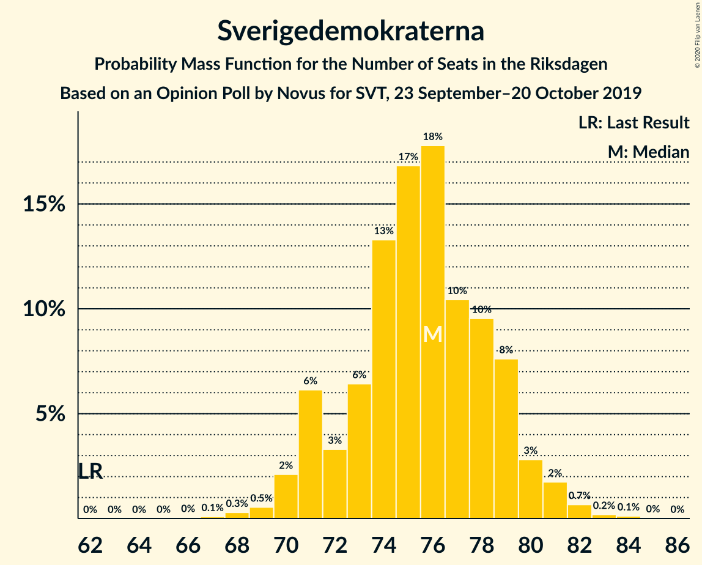
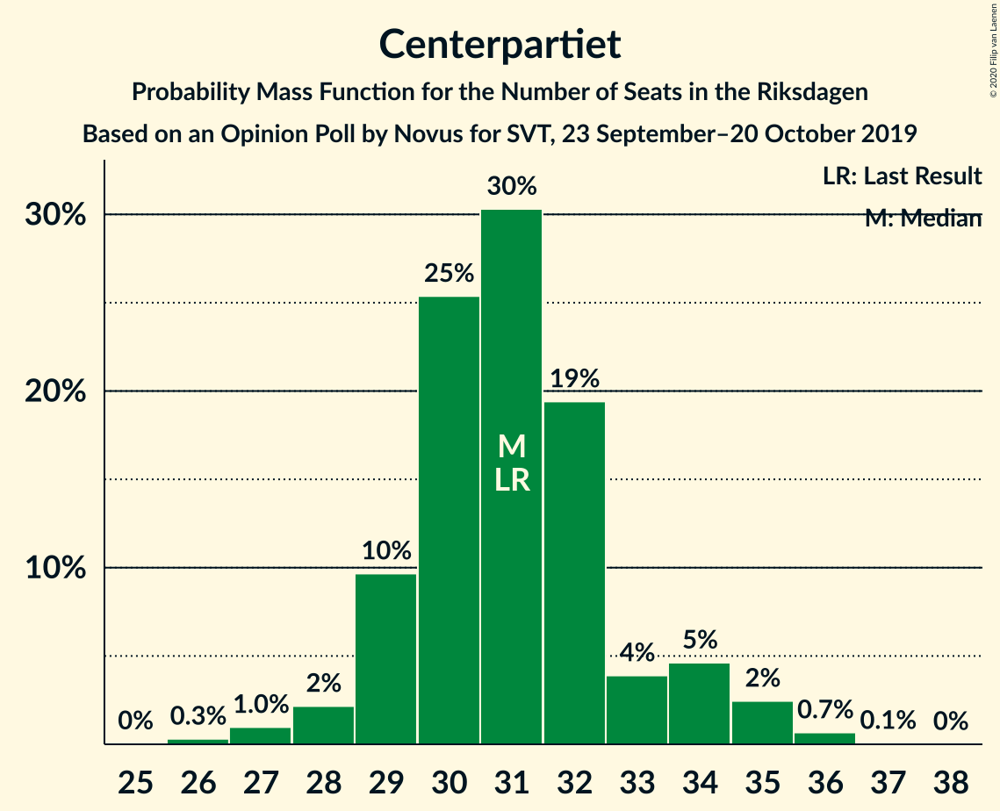
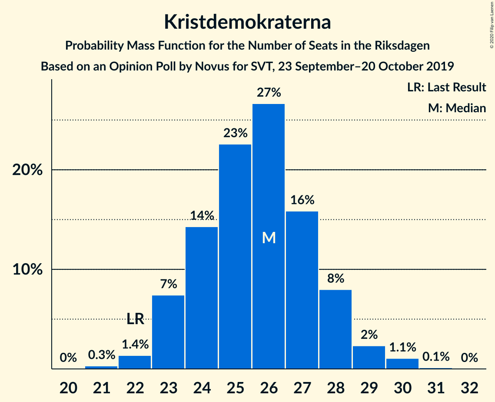
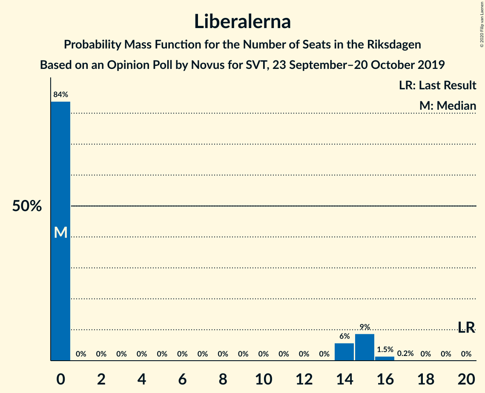
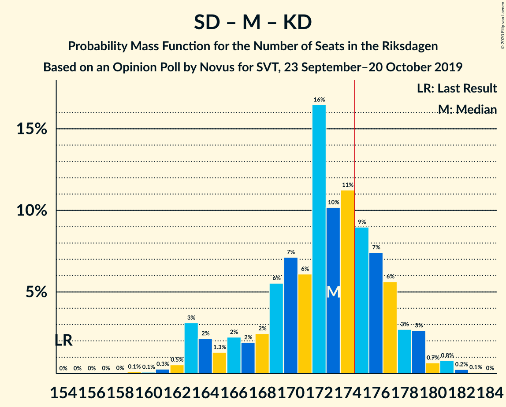
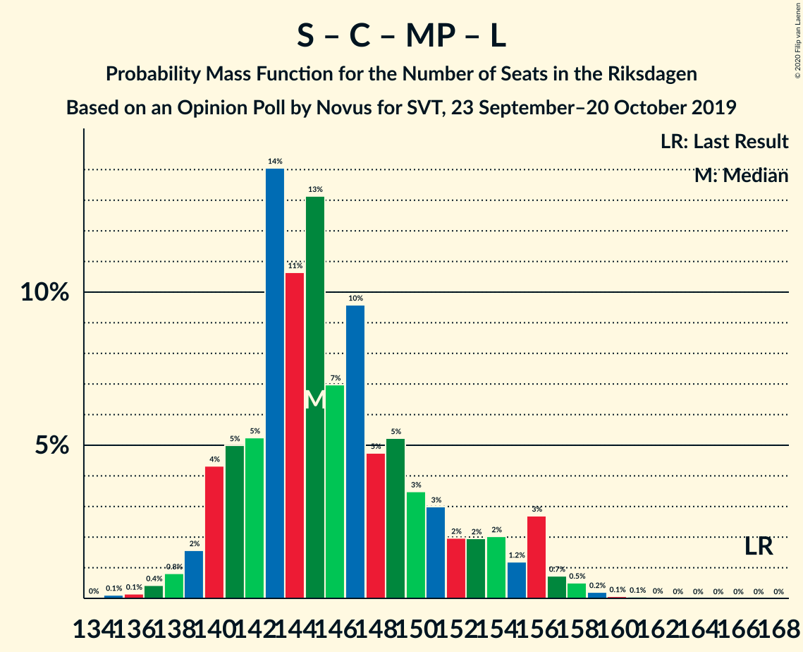
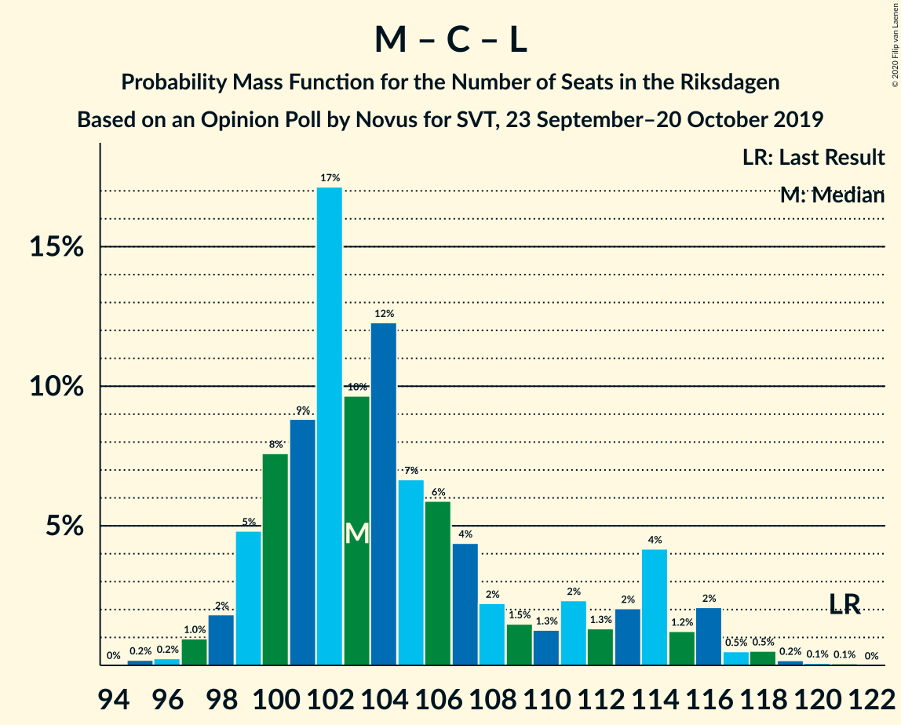

# Opinion Poll by Novus for SVT, 23 September–20 October 2019

<a href="#voting-intentions">Voting Intentions</a> | <a href="#seats">Seats</a> | <a href="#coalitions">Coalitions</a> | <a href="#technical-information">Technical Information</a>

## Voting Intentions

### Confidence Intervals

| Party | Last Result | Poll Result | 80% Confidence Interval | 90% Confidence Interval | 95% Confidence Interval | 99% Confidence Interval |
|:-----:|:-----------:|:-----------:|:-----------------------:|:-----------------------:|:-----------------------:|:-----------------------:|
| Sveriges socialdemokratiska arbetareparti | 28.3% | 25.7% | 24.8–26.7% |24.6–26.9% |24.4–27.2% |23.9–27.6% |
| Sverigedemokraterna | 17.5% | 20.7% | 19.8–21.5% |19.6–21.8% |19.4–22.0% |19.0–22.4% |
| Moderata samlingspartiet | 19.8% | 19.5% | 18.7–20.3% |18.4–20.6% |18.2–20.8% |17.8–21.2% |
| Centerpartiet | 8.6% | 8.5% | 7.9–9.1% |7.8–9.3% |7.6–9.4% |7.4–9.7% |
| Vänsterpartiet | 8.0% | 8.4% | 7.8–9.0% |7.7–9.2% |7.5–9.3% |7.3–9.6% |
| Kristdemokraterna | 6.3% | 7.0% | 6.5–7.6% |6.3–7.7% |6.2–7.9% |6.0–8.1% |
| Miljöpartiet de gröna | 4.4% | 5.0% | 4.6–5.5% |4.4–5.6% |4.3–5.7% |4.1–6.0% |
| Liberalerna | 5.5% | 3.7% | 3.3–4.1% |3.2–4.2% |3.1–4.3% |3.0–4.6% |

*Note:* The poll result column reflects the actual value used in the calculations. Published results may vary slightly, and in addition be rounded to fewer digits.

## Seats

### Confidence Intervals

| Party | Last Result | Median | 80% Confidence Interval | 90% Confidence Interval | 95% Confidence Interval | 99% Confidence Interval |
|:-----:|:-----------:|:------:|:-----------------------:|:-----------------------:|:-----------------------:|:-----------------------:|
| <a href="#sveriges-socialdemokratiska-arbetareparti">Sveriges socialdemokratiska arbetareparti</a> | 100 | 95 | 91–98 |90–100 |89–100 |87–101 |
| <a href="#sverigedemokraterna">Sverigedemokraterna</a> | 62 | 76 | 73–79 |73–79 |71–81 |69–83 |
| <a href="#moderata-samlingspartiet">Moderata samlingspartiet</a> | 70 | 72 | 69–75 |68–75 |67–76 |65–77 |
| <a href="#centerpartiet">Centerpartiet</a> | 31 | 30 | 29–34 |29–35 |28–35 |26–36 |
| <a href="#vänsterpartiet">Vänsterpartiet</a> | 28 | 31 | 29–33 |28–33 |28–34 |27–35 |
| <a href="#kristdemokraterna">Kristdemokraterna</a> | 22 | 25 | 24–27 |23–28 |23–28 |22–30 |
| <a href="#miljöpartiet-de-gröna">Miljöpartiet de gröna</a> | 16 | 18 | 17–20 |16–21 |16–21 |15–22 |
| <a href="#liberalerna">Liberalerna</a> | 20 | 0 | 0 |0 |0–14 |0–16 |

### Sveriges socialdemokratiska arbetareparti

*For a full overview of the results for this party, see the [Sveriges socialdemokratiska arbetareparti](party-sverigessocialdemokratiskaarbetareparti.html) page.*

| Number of Seats | Probability | Accumulated | Special Marks |
|:---------------:|:-----------:|:-----------:|:-------------:|
| 85 | 0% | 100% |  |
| 86 | 0.1% | 99.9% |  |
| 87 | 0.5% | 99.9% |  |
| 88 | 0.8% | 99.4% |  |
| 89 | 2% | 98.6% |  |
| 90 | 3% | 97% |  |
| 91 | 4% | 94% |  |
| 92 | 8% | 90% |  |
| 93 | 11% | 82% |  |
| 94 | 3% | 71% |  |
| 95 | 25% | 68% | Median |
| 96 | 6% | 43% |  |
| 97 | 5% | 37% |  |
| 98 | 23% | 32% |  |
| 99 | 2% | 8% |  |
| 100 | 5% | 6% | Last Result |
| 101 | 0.7% | 1.0% |  |
| 102 | 0.1% | 0.3% |  |
| 103 | 0.1% | 0.2% |  |
| 104 | 0.1% | 0.1% |  |
| 105 | 0% | 0% |  |

### Sverigedemokraterna

*For a full overview of the results for this party, see the [Sverigedemokraterna](party-sverigedemokraterna.html) page.*

| Number of Seats | Probability | Accumulated | Special Marks |
|:---------------:|:-----------:|:-----------:|:-------------:|
| 62 | 0% | 100% | Last Result |
| 63 | 0% | 100% |  |
| 64 | 0% | 100% |  |
| 65 | 0% | 100% |  |
| 66 | 0.1% | 100% |  |
| 67 | 0.1% | 99.9% |  |
| 68 | 0.1% | 99.9% |  |
| 69 | 0.6% | 99.8% |  |
| 70 | 0.4% | 99.2% |  |
| 71 | 2% | 98.8% |  |
| 72 | 2% | 97% |  |
| 73 | 8% | 96% |  |
| 74 | 14% | 87% |  |
| 75 | 2% | 74% |  |
| 76 | 23% | 71% | Median |
| 77 | 13% | 48% |  |
| 78 | 6% | 35% |  |
| 79 | 26% | 30% |  |
| 80 | 1.1% | 4% |  |
| 81 | 0.4% | 3% |  |
| 82 | 2% | 2% |  |
| 83 | 0.4% | 0.7% |  |
| 84 | 0.3% | 0.4% |  |
| 85 | 0.1% | 0.1% |  |
| 86 | 0% | 0% |  |

### Moderata samlingspartiet

*For a full overview of the results for this party, see the [Moderata samlingspartiet](party-moderatasamlingspartiet.html) page.*

| Number of Seats | Probability | Accumulated | Special Marks |
|:---------------:|:-----------:|:-----------:|:-------------:|
| 63 | 0% | 100% |  |
| 64 | 0.3% | 99.9% |  |
| 65 | 0.3% | 99.6% |  |
| 66 | 0.8% | 99.3% |  |
| 67 | 2% | 98% |  |
| 68 | 3% | 97% |  |
| 69 | 6% | 94% |  |
| 70 | 25% | 87% | Last Result |
| 71 | 11% | 62% |  |
| 72 | 25% | 51% | Median |
| 73 | 6% | 26% |  |
| 74 | 7% | 20% |  |
| 75 | 11% | 13% |  |
| 76 | 2% | 3% |  |
| 77 | 0.7% | 1.1% |  |
| 78 | 0.2% | 0.4% |  |
| 79 | 0.1% | 0.2% |  |
| 80 | 0.1% | 0.1% |  |
| 81 | 0% | 0% |  |

### Centerpartiet

*For a full overview of the results for this party, see the [Centerpartiet](party-centerpartiet.html) page.*

| Number of Seats | Probability | Accumulated | Special Marks |
|:---------------:|:-----------:|:-----------:|:-------------:|
| 26 | 0.5% | 100% |  |
| 27 | 0.5% | 99.5% |  |
| 28 | 2% | 99.0% |  |
| 29 | 10% | 97% |  |
| 30 | 53% | 87% | Median |
| 31 | 12% | 34% | Last Result |
| 32 | 7% | 22% |  |
| 33 | 3% | 15% |  |
| 34 | 4% | 12% |  |
| 35 | 7% | 8% |  |
| 36 | 1.0% | 1.0% |  |
| 37 | 0% | 0.1% |  |
| 38 | 0% | 0% |  |

### Vänsterpartiet

*For a full overview of the results for this party, see the [Vänsterpartiet](party-vänsterpartiet.html) page.*

| Number of Seats | Probability | Accumulated | Special Marks |
|:---------------:|:-----------:|:-----------:|:-------------:|
| 26 | 0.2% | 100% |  |
| 27 | 1.3% | 99.8% |  |
| 28 | 4% | 98.5% | Last Result |
| 29 | 13% | 94% |  |
| 30 | 13% | 82% |  |
| 31 | 28% | 68% | Median |
| 32 | 28% | 40% |  |
| 33 | 8% | 13% |  |
| 34 | 4% | 5% |  |
| 35 | 1.0% | 1.1% |  |
| 36 | 0.1% | 0.1% |  |
| 37 | 0% | 0% |  |

### Kristdemokraterna

*For a full overview of the results for this party, see the [Kristdemokraterna](party-kristdemokraterna.html) page.*

| Number of Seats | Probability | Accumulated | Special Marks |
|:---------------:|:-----------:|:-----------:|:-------------:|
| 21 | 0.2% | 100% |  |
| 22 | 0.9% | 99.7% | Last Result |
| 23 | 6% | 98.9% |  |
| 24 | 4% | 93% |  |
| 25 | 45% | 89% | Median |
| 26 | 17% | 44% |  |
| 27 | 21% | 27% |  |
| 28 | 4% | 5% |  |
| 29 | 1.1% | 2% |  |
| 30 | 0.5% | 0.6% |  |
| 31 | 0.1% | 0.1% |  |
| 32 | 0% | 0% |  |

### Miljöpartiet de gröna

*For a full overview of the results for this party, see the [Miljöpartiet de gröna](party-miljöpartietdegröna.html) page.*

| Number of Seats | Probability | Accumulated | Special Marks |
|:---------------:|:-----------:|:-----------:|:-------------:|
| 0 | 0.2% | 100% |  |
| 1 | 0% | 99.8% |  |
| 2 | 0% | 99.8% |  |
| 3 | 0% | 99.8% |  |
| 4 | 0% | 99.8% |  |
| 5 | 0% | 99.8% |  |
| 6 | 0% | 99.8% |  |
| 7 | 0% | 99.8% |  |
| 8 | 0% | 99.8% |  |
| 9 | 0% | 99.8% |  |
| 10 | 0% | 99.8% |  |
| 11 | 0% | 99.8% |  |
| 12 | 0% | 99.8% |  |
| 13 | 0% | 99.8% |  |
| 14 | 0% | 99.8% |  |
| 15 | 2% | 99.8% |  |
| 16 | 5% | 98% | Last Result |
| 17 | 29% | 92% |  |
| 18 | 39% | 64% | Median |
| 19 | 13% | 24% |  |
| 20 | 5% | 11% |  |
| 21 | 5% | 6% |  |
| 22 | 0.9% | 1.0% |  |
| 23 | 0.1% | 0.1% |  |
| 24 | 0% | 0% |  |

### Liberalerna

*For a full overview of the results for this party, see the [Liberalerna](party-liberalerna.html) page.*

| Number of Seats | Probability | Accumulated | Special Marks |
|:---------------:|:-----------:|:-----------:|:-------------:|
| 0 | 97% | 100% | Median |
| 1 | 0% | 3% |  |
| 2 | 0% | 3% |  |
| 3 | 0% | 3% |  |
| 4 | 0% | 3% |  |
| 5 | 0% | 3% |  |
| 6 | 0% | 3% |  |
| 7 | 0% | 3% |  |
| 8 | 0% | 3% |  |
| 9 | 0% | 3% |  |
| 10 | 0% | 3% |  |
| 11 | 0% | 3% |  |
| 12 | 0% | 3% |  |
| 13 | 0% | 3% |  |
| 14 | 1.0% | 3% |  |
| 15 | 1.3% | 2% |  |
| 16 | 0.6% | 0.8% |  |
| 17 | 0.2% | 0.2% |  |
| 18 | 0% | 0% |  |
| 19 | 0% | 0% |  |
| 20 | 0% | 0% | Last Result |

## Coalitions

### Confidence Intervals

| Coalition | Last Result | Median | Majority? | 80% Confidence Interval | 90% Confidence Interval | 95% Confidence Interval | 99% Confidence Interval |
|:---------:|:-----------:|:------:|:---------:|:-----------------------:|:-----------------------:|:-----------------------:|:-----------------------:|
| Sveriges socialdemokratiska arbetareparti – Moderata samlingspartiet – Centerpartiet | 201 | 198 | 100% | 193–201 | 192–202 | 190–203 | 185–205 |
| Sveriges socialdemokratiska arbetareparti – Centerpartiet – Vänsterpartiet – Miljöpartiet de gröna – Liberalerna | 195 | 175 | 75% | 170–179 | 170–181 | 169–182 | 168–186 |
| Sverigedemokraterna – Moderata samlingspartiet – Kristdemokraterna | 154 | 174 | 25% | 170–179 | 168–179 | 167–180 | 163–181 |
| Sveriges socialdemokratiska arbetareparti – Moderata samlingspartiet | 170 | 167 | 0.2% | 163–171 | 161–172 | 160–172 | 156–173 |
| Sverigedemokraterna – Moderata samlingspartiet | 132 | 148 | 0% | 144–152 | 142–152 | 142–154 | 138–155 |
| Sveriges socialdemokratiska arbetareparti – Centerpartiet – Miljöpartiet de gröna – Liberalerna | 167 | 145 | 0% | 141–148 | 140–150 | 138–151 | 136–156 |
| Sveriges socialdemokratiska arbetareparti – Vänsterpartiet – Miljöpartiet de gröna | 144 | 145 | 0% | 140–147 | 139–147 | 138–148 | 136–151 |
| Moderata samlingspartiet – Centerpartiet – Kristdemokraterna – Liberalerna | 143 | 127 | 0% | 125–133 | 124–135 | 124–137 | 121–141 |
| Moderata samlingspartiet – Centerpartiet – Kristdemokraterna | 123 | 127 | 0% | 125–132 | 124–133 | 122–135 | 119–136 |
| Sveriges socialdemokratiska arbetareparti – Vänsterpartiet | 128 | 127 | 0% | 122–129 | 121–129 | 120–129 | 118–133 |
| Sveriges socialdemokratiska arbetareparti – Miljöpartiet de gröna | 116 | 113 | 0% | 110–117 | 108–118 | 107–118 | 106–119 |
| Moderata samlingspartiet – Centerpartiet – Liberalerna | 121 | 102 | 0% | 100–107 | 99–109 | 99–111 | 95–116 |
| Moderata samlingspartiet – Centerpartiet | 101 | 102 | 0% | 99–106 | 99–107 | 97–109 | 95–110 |

### Sveriges socialdemokratiska arbetareparti – Moderata samlingspartiet – Centerpartiet

| Number of Seats | Probability | Accumulated | Special Marks |
|:---------------:|:-----------:|:-----------:|:-------------:|
| 184 | 0.1% | 100% |  |
| 185 | 0.5% | 99.9% |  |
| 186 | 0.1% | 99.4% |  |
| 187 | 0.3% | 99.2% |  |
| 188 | 0.2% | 98.9% |  |
| 189 | 0.4% | 98.7% |  |
| 190 | 1.4% | 98% |  |
| 191 | 2% | 97% |  |
| 192 | 1.0% | 95% |  |
| 193 | 5% | 94% |  |
| 194 | 1.1% | 89% |  |
| 195 | 24% | 88% |  |
| 196 | 3% | 64% |  |
| 197 | 9% | 61% | Median |
| 198 | 10% | 52% |  |
| 199 | 2% | 42% |  |
| 200 | 16% | 39% |  |
| 201 | 15% | 23% | Last Result |
| 202 | 5% | 8% |  |
| 203 | 2% | 3% |  |
| 204 | 0.7% | 1.3% |  |
| 205 | 0.3% | 0.6% |  |
| 206 | 0.2% | 0.4% |  |
| 207 | 0.1% | 0.2% |  |
| 208 | 0.1% | 0.2% |  |
| 209 | 0% | 0% |  |

### Sveriges socialdemokratiska arbetareparti – Centerpartiet – Vänsterpartiet – Miljöpartiet de gröna – Liberalerna

| Number of Seats | Probability | Accumulated | Special Marks |
|:---------------:|:-----------:|:-----------:|:-------------:|
| 166 | 0% | 100% |  |
| 167 | 0.4% | 99.9% |  |
| 168 | 2% | 99.6% |  |
| 169 | 2% | 98% |  |
| 170 | 7% | 96% |  |
| 171 | 2% | 89% |  |
| 172 | 2% | 88% |  |
| 173 | 2% | 86% |  |
| 174 | 8% | 83% | Median |
| 175 | 28% | 75% | Majority |
| 176 | 15% | 46% |  |
| 177 | 17% | 31% |  |
| 178 | 1.4% | 14% |  |
| 179 | 4% | 13% |  |
| 180 | 2% | 8% |  |
| 181 | 2% | 6% |  |
| 182 | 2% | 4% |  |
| 183 | 0.8% | 2% |  |
| 184 | 0.5% | 2% |  |
| 185 | 0.3% | 1.0% |  |
| 186 | 0.3% | 0.7% |  |
| 187 | 0.3% | 0.4% |  |
| 188 | 0.1% | 0.2% |  |
| 189 | 0% | 0% |  |
| 190 | 0% | 0% |  |
| 191 | 0% | 0% |  |
| 192 | 0% | 0% |  |
| 193 | 0% | 0% |  |
| 194 | 0% | 0% |  |
| 195 | 0% | 0% | Last Result |

### Sverigedemokraterna – Moderata samlingspartiet – Kristdemokraterna

| Number of Seats | Probability | Accumulated | Special Marks |
|:---------------:|:-----------:|:-----------:|:-------------:|
| 154 | 0% | 100% | Last Result |
| 155 | 0% | 100% |  |
| 156 | 0% | 100% |  |
| 157 | 0% | 100% |  |
| 158 | 0% | 100% |  |
| 159 | 0% | 100% |  |
| 160 | 0% | 100% |  |
| 161 | 0.1% | 100% |  |
| 162 | 0.3% | 99.8% |  |
| 163 | 0.3% | 99.6% |  |
| 164 | 0.3% | 99.3% |  |
| 165 | 0.5% | 99.0% |  |
| 166 | 0.8% | 98% |  |
| 167 | 2% | 98% |  |
| 168 | 2% | 96% |  |
| 169 | 2% | 94% |  |
| 170 | 4% | 92% |  |
| 171 | 1.4% | 87% |  |
| 172 | 17% | 86% |  |
| 173 | 15% | 69% | Median |
| 174 | 28% | 54% |  |
| 175 | 8% | 25% | Majority |
| 176 | 2% | 17% |  |
| 177 | 2% | 14% |  |
| 178 | 2% | 12% |  |
| 179 | 7% | 11% |  |
| 180 | 2% | 4% |  |
| 181 | 2% | 2% |  |
| 182 | 0.4% | 0.4% |  |
| 183 | 0% | 0.1% |  |
| 184 | 0% | 0% |  |

### Sveriges socialdemokratiska arbetareparti – Moderata samlingspartiet

| Number of Seats | Probability | Accumulated | Special Marks |
|:---------------:|:-----------:|:-----------:|:-------------:|
| 153 | 0% | 100% |  |
| 154 | 0.1% | 99.9% |  |
| 155 | 0.2% | 99.9% |  |
| 156 | 0.5% | 99.7% |  |
| 157 | 0.5% | 99.2% |  |
| 158 | 0.4% | 98.8% |  |
| 159 | 0.8% | 98% |  |
| 160 | 2% | 98% |  |
| 161 | 3% | 95% |  |
| 162 | 2% | 93% |  |
| 163 | 6% | 91% |  |
| 164 | 4% | 84% |  |
| 165 | 21% | 81% |  |
| 166 | 7% | 60% |  |
| 167 | 7% | 53% | Median |
| 168 | 11% | 46% |  |
| 169 | 5% | 35% |  |
| 170 | 19% | 30% | Last Result |
| 171 | 5% | 11% |  |
| 172 | 4% | 6% |  |
| 173 | 1.1% | 2% |  |
| 174 | 0.3% | 0.5% |  |
| 175 | 0% | 0.2% | Majority |
| 176 | 0.1% | 0.1% |  |
| 177 | 0% | 0.1% |  |
| 178 | 0% | 0% |  |

### Sverigedemokraterna – Moderata samlingspartiet

| Number of Seats | Probability | Accumulated | Special Marks |
|:---------------:|:-----------:|:-----------:|:-------------:|
| 132 | 0% | 100% | Last Result |
| 133 | 0% | 100% |  |
| 134 | 0% | 100% |  |
| 135 | 0.1% | 100% |  |
| 136 | 0.1% | 99.9% |  |
| 137 | 0.1% | 99.8% |  |
| 138 | 0.3% | 99.7% |  |
| 139 | 0.4% | 99.4% |  |
| 140 | 0.5% | 99.0% |  |
| 141 | 0.6% | 98% |  |
| 142 | 3% | 98% |  |
| 143 | 1.4% | 95% |  |
| 144 | 5% | 93% |  |
| 145 | 9% | 89% |  |
| 146 | 4% | 80% |  |
| 147 | 10% | 76% |  |
| 148 | 20% | 66% | Median |
| 149 | 25% | 46% |  |
| 150 | 4% | 21% |  |
| 151 | 4% | 17% |  |
| 152 | 9% | 13% |  |
| 153 | 1.0% | 4% |  |
| 154 | 2% | 3% |  |
| 155 | 1.1% | 1.3% |  |
| 156 | 0.1% | 0.2% |  |
| 157 | 0.1% | 0.2% |  |
| 158 | 0% | 0.1% |  |
| 159 | 0% | 0% |  |

### Sveriges socialdemokratiska arbetareparti – Centerpartiet – Miljöpartiet de gröna – Liberalerna

| Number of Seats | Probability | Accumulated | Special Marks |
|:---------------:|:-----------:|:-----------:|:-------------:|
| 134 | 0% | 100% |  |
| 135 | 0.4% | 99.9% |  |
| 136 | 0.1% | 99.5% |  |
| 137 | 1.2% | 99.4% |  |
| 138 | 0.8% | 98% |  |
| 139 | 2% | 97% |  |
| 140 | 3% | 96% |  |
| 141 | 9% | 92% |  |
| 142 | 7% | 84% |  |
| 143 | 22% | 76% | Median |
| 144 | 4% | 54% |  |
| 145 | 17% | 50% |  |
| 146 | 12% | 33% |  |
| 147 | 6% | 21% |  |
| 148 | 7% | 15% |  |
| 149 | 2% | 8% |  |
| 150 | 3% | 6% |  |
| 151 | 0.7% | 3% |  |
| 152 | 0.5% | 2% |  |
| 153 | 0.6% | 2% |  |
| 154 | 0.3% | 1.4% |  |
| 155 | 0.3% | 1.1% |  |
| 156 | 0.4% | 0.8% |  |
| 157 | 0.2% | 0.4% |  |
| 158 | 0.1% | 0.2% |  |
| 159 | 0% | 0.1% |  |
| 160 | 0% | 0.1% |  |
| 161 | 0% | 0% |  |
| 162 | 0% | 0% |  |
| 163 | 0% | 0% |  |
| 164 | 0% | 0% |  |
| 165 | 0% | 0% |  |
| 166 | 0% | 0% |  |
| 167 | 0% | 0% | Last Result |

### Sveriges socialdemokratiska arbetareparti – Vänsterpartiet – Miljöpartiet de gröna

| Number of Seats | Probability | Accumulated | Special Marks |
|:---------------:|:-----------:|:-----------:|:-------------:|
| 131 | 0% | 100% |  |
| 132 | 0.1% | 99.9% |  |
| 133 | 0% | 99.9% |  |
| 134 | 0.2% | 99.8% |  |
| 135 | 0.1% | 99.7% |  |
| 136 | 0.3% | 99.6% |  |
| 137 | 0.5% | 99.3% |  |
| 138 | 3% | 98.9% |  |
| 139 | 4% | 95% |  |
| 140 | 12% | 91% |  |
| 141 | 3% | 80% |  |
| 142 | 3% | 77% |  |
| 143 | 0.3% | 74% |  |
| 144 | 5% | 73% | Last Result, Median |
| 145 | 27% | 68% |  |
| 146 | 22% | 41% |  |
| 147 | 15% | 18% |  |
| 148 | 2% | 4% |  |
| 149 | 0.8% | 2% |  |
| 150 | 0.2% | 0.9% |  |
| 151 | 0.2% | 0.6% |  |
| 152 | 0.2% | 0.4% |  |
| 153 | 0.2% | 0.3% |  |
| 154 | 0.1% | 0.1% |  |
| 155 | 0% | 0% |  |

### Moderata samlingspartiet – Centerpartiet – Kristdemokraterna – Liberalerna

| Number of Seats | Probability | Accumulated | Special Marks |
|:---------------:|:-----------:|:-----------:|:-------------:|
| 120 | 0.4% | 100% |  |
| 121 | 0.1% | 99.5% |  |
| 122 | 0.4% | 99.4% |  |
| 123 | 0.6% | 99.1% |  |
| 124 | 5% | 98% |  |
| 125 | 19% | 94% |  |
| 126 | 10% | 75% |  |
| 127 | 17% | 65% | Median |
| 128 | 9% | 48% |  |
| 129 | 4% | 39% |  |
| 130 | 12% | 36% |  |
| 131 | 4% | 24% |  |
| 132 | 8% | 20% |  |
| 133 | 5% | 12% |  |
| 134 | 0.4% | 7% |  |
| 135 | 3% | 6% |  |
| 136 | 0.6% | 3% |  |
| 137 | 0.9% | 3% |  |
| 138 | 0.2% | 2% |  |
| 139 | 0.6% | 1.5% |  |
| 140 | 0.3% | 0.9% |  |
| 141 | 0.2% | 0.6% |  |
| 142 | 0.2% | 0.4% |  |
| 143 | 0.1% | 0.2% | Last Result |
| 144 | 0% | 0.1% |  |
| 145 | 0% | 0.1% |  |
| 146 | 0% | 0% |  |

### Moderata samlingspartiet – Centerpartiet – Kristdemokraterna

| Number of Seats | Probability | Accumulated | Special Marks |
|:---------------:|:-----------:|:-----------:|:-------------:|
| 117 | 0.2% | 100% |  |
| 118 | 0.2% | 99.8% |  |
| 119 | 0.2% | 99.5% |  |
| 120 | 0.5% | 99.4% |  |
| 121 | 0.2% | 98.9% |  |
| 122 | 1.3% | 98.6% |  |
| 123 | 0.7% | 97% | Last Result |
| 124 | 5% | 97% |  |
| 125 | 19% | 91% |  |
| 126 | 10% | 72% |  |
| 127 | 17% | 62% | Median |
| 128 | 9% | 45% |  |
| 129 | 4% | 36% |  |
| 130 | 12% | 33% |  |
| 131 | 4% | 21% |  |
| 132 | 8% | 17% |  |
| 133 | 5% | 9% |  |
| 134 | 0.3% | 4% |  |
| 135 | 3% | 4% |  |
| 136 | 0.6% | 0.8% |  |
| 137 | 0.1% | 0.2% |  |
| 138 | 0.1% | 0.1% |  |
| 139 | 0.1% | 0.1% |  |
| 140 | 0% | 0% |  |

### Sveriges socialdemokratiska arbetareparti – Vänsterpartiet

| Number of Seats | Probability | Accumulated | Special Marks |
|:---------------:|:-----------:|:-----------:|:-------------:|
| 113 | 0% | 100% |  |
| 114 | 0% | 99.9% |  |
| 115 | 0% | 99.9% |  |
| 116 | 0.1% | 99.9% |  |
| 117 | 0.2% | 99.8% |  |
| 118 | 0.2% | 99.5% |  |
| 119 | 0.5% | 99.3% |  |
| 120 | 3% | 98.8% |  |
| 121 | 5% | 96% |  |
| 122 | 10% | 90% |  |
| 123 | 5% | 80% |  |
| 124 | 1.4% | 75% |  |
| 125 | 2% | 74% |  |
| 126 | 7% | 73% | Median |
| 127 | 21% | 65% |  |
| 128 | 16% | 44% | Last Result |
| 129 | 26% | 28% |  |
| 130 | 1.0% | 2% |  |
| 131 | 0.4% | 1.2% |  |
| 132 | 0.1% | 0.8% |  |
| 133 | 0.2% | 0.7% |  |
| 134 | 0.2% | 0.5% |  |
| 135 | 0.1% | 0.3% |  |
| 136 | 0.1% | 0.1% |  |
| 137 | 0% | 0% |  |

### Sveriges socialdemokratiska arbetareparti – Miljöpartiet de gröna

| Number of Seats | Probability | Accumulated | Special Marks |
|:---------------:|:-----------:|:-----------:|:-------------:|
| 101 | 0.1% | 100% |  |
| 102 | 0% | 99.8% |  |
| 103 | 0% | 99.8% |  |
| 104 | 0.1% | 99.8% |  |
| 105 | 0.2% | 99.7% |  |
| 106 | 1.4% | 99.5% |  |
| 107 | 2% | 98% |  |
| 108 | 3% | 96% |  |
| 109 | 2% | 93% |  |
| 110 | 8% | 92% |  |
| 111 | 12% | 84% |  |
| 112 | 3% | 72% |  |
| 113 | 24% | 69% | Median |
| 114 | 8% | 45% |  |
| 115 | 21% | 37% |  |
| 116 | 2% | 15% | Last Result |
| 117 | 6% | 13% |  |
| 118 | 6% | 7% |  |
| 119 | 0.7% | 1.1% |  |
| 120 | 0.1% | 0.4% |  |
| 121 | 0.2% | 0.2% |  |
| 122 | 0% | 0.1% |  |
| 123 | 0% | 0% |  |

### Moderata samlingspartiet – Centerpartiet – Liberalerna

| Number of Seats | Probability | Accumulated | Special Marks |
|:---------------:|:-----------:|:-----------:|:-------------:|
| 94 | 0.1% | 100% |  |
| 95 | 0.4% | 99.9% |  |
| 96 | 0.2% | 99.5% |  |
| 97 | 1.0% | 99.3% |  |
| 98 | 0.7% | 98% |  |
| 99 | 6% | 98% |  |
| 100 | 21% | 92% |  |
| 101 | 11% | 71% |  |
| 102 | 18% | 60% | Median |
| 103 | 10% | 42% |  |
| 104 | 3% | 32% |  |
| 105 | 14% | 29% |  |
| 106 | 4% | 15% |  |
| 107 | 3% | 11% |  |
| 108 | 0.4% | 7% |  |
| 109 | 4% | 7% |  |
| 110 | 0.4% | 3% |  |
| 111 | 0.4% | 3% |  |
| 112 | 0.4% | 2% |  |
| 113 | 0.1% | 2% |  |
| 114 | 1.1% | 2% |  |
| 115 | 0.1% | 0.9% |  |
| 116 | 0.4% | 0.8% |  |
| 117 | 0.2% | 0.4% |  |
| 118 | 0.1% | 0.2% |  |
| 119 | 0.1% | 0.2% |  |
| 120 | 0% | 0.1% |  |
| 121 | 0% | 0% | Last Result |

### Moderata samlingspartiet – Centerpartiet

| Number of Seats | Probability | Accumulated | Special Marks |
|:---------------:|:-----------:|:-----------:|:-------------:|
| 92 | 0% | 100% |  |
| 93 | 0.3% | 99.9% |  |
| 94 | 0.1% | 99.7% |  |
| 95 | 0.7% | 99.6% |  |
| 96 | 0.4% | 98.9% |  |
| 97 | 1.3% | 98% |  |
| 98 | 1.0% | 97% |  |
| 99 | 7% | 96% |  |
| 100 | 21% | 89% |  |
| 101 | 11% | 69% | Last Result |
| 102 | 18% | 57% | Median |
| 103 | 10% | 39% |  |
| 104 | 3% | 29% |  |
| 105 | 14% | 25% |  |
| 106 | 4% | 12% |  |
| 107 | 3% | 7% |  |
| 108 | 0.4% | 4% |  |
| 109 | 3% | 4% |  |
| 110 | 0.3% | 0.6% |  |
| 111 | 0.3% | 0.3% |  |
| 112 | 0% | 0.1% |  |
| 113 | 0% | 0% |  |

## Technical Information

### Opinion Poll

+ **Polling firm:** Novus
+ **Commissioner(s):** SVT
+ **Fieldwork period:** 23 September–20 October 2019

### Calculations

+ **Sample size:** 3745
+ **Simulations done:** 131,072
+ **Error estimate:** 0.64%

