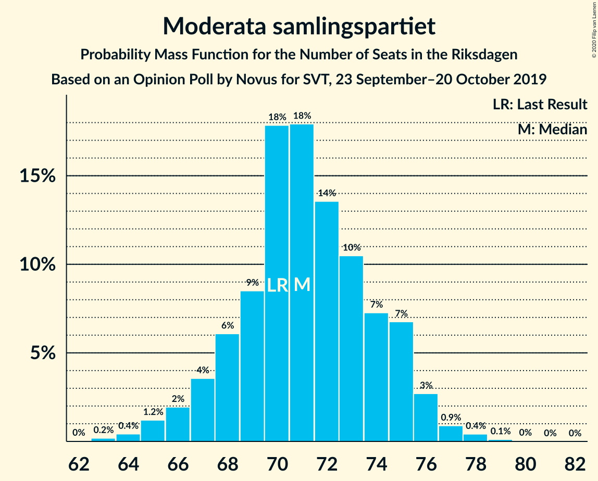
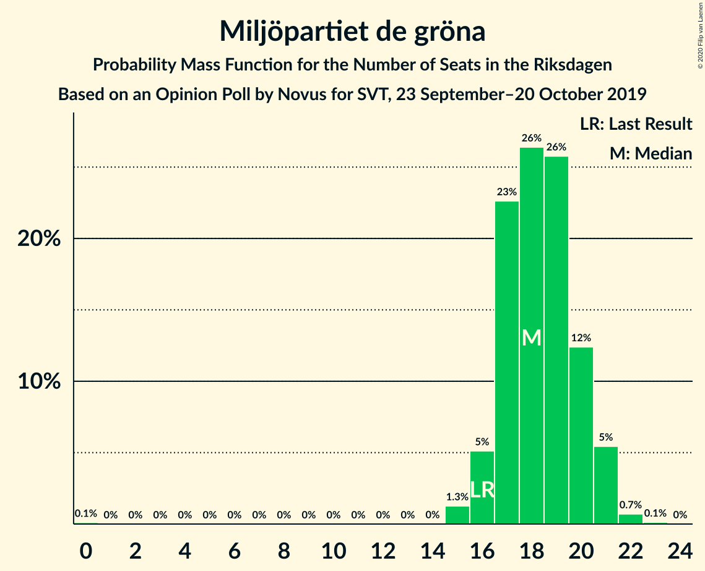

# Opinion Poll by Novus for SVT, 23 September–20 October 2019

<a href="#voting-intentions">Voting Intentions</a> | <a href="#seats">Seats</a> | <a href="#coalitions">Coalitions</a> | <a href="#technical-information">Technical Information</a>

## Voting Intentions

### Confidence Intervals

| Party | Last Result | Poll Result | 80% Confidence Interval | 90% Confidence Interval | 95% Confidence Interval | 99% Confidence Interval |
|:-----:|:-----------:|:-----------:|:-----------------------:|:-----------------------:|:-----------------------:|:-----------------------:|
| Sveriges socialdemokratiska arbetareparti | 28.3% | 25.7% | 24.8–26.7% |24.6–26.9% |24.4–27.2% |23.9–27.6% |
| Sverigedemokraterna | 17.5% | 20.7% | 19.8–21.5% |19.6–21.8% |19.4–22.0% |19.0–22.4% |
| Moderata samlingspartiet | 19.8% | 19.5% | 18.7–20.3% |18.4–20.6% |18.2–20.8% |17.8–21.2% |
| Centerpartiet | 8.6% | 8.5% | 7.9–9.1% |7.8–9.3% |7.6–9.4% |7.4–9.7% |
| Vänsterpartiet | 8.0% | 8.4% | 7.8–9.0% |7.7–9.2% |7.5–9.3% |7.3–9.6% |
| Kristdemokraterna | 6.3% | 7.0% | 6.5–7.6% |6.3–7.7% |6.2–7.9% |6.0–8.1% |
| Miljöpartiet de gröna | 4.4% | 5.0% | 4.6–5.5% |4.4–5.6% |4.3–5.7% |4.1–6.0% |
| Liberalerna | 5.5% | 3.7% | 3.3–4.1% |3.2–4.2% |3.1–4.3% |3.0–4.6% |

*Note:* The poll result column reflects the actual value used in the calculations. Published results may vary slightly, and in addition be rounded to fewer digits.

## Seats

### Confidence Intervals

| Party | Last Result | Median | 80% Confidence Interval | 90% Confidence Interval | 95% Confidence Interval | 99% Confidence Interval |
|:-----:|:-----------:|:------:|:-----------------------:|:-----------------------:|:-----------------------:|:-----------------------:|
| <a href="#sveriges-socialdemokratiska-arbetareparti">Sveriges socialdemokratiska arbetareparti</a> | 100 | 94 | 90–98 |89–99 |88–100 |86–101 |
| <a href="#sverigedemokraterna">Sverigedemokraterna</a> | 62 | 76 | 72–79 |71–80 |70–81 |69–82 |
| <a href="#moderata-samlingspartiet">Moderata samlingspartiet</a> | 70 | 71 | 68–75 |67–75 |66–76 |64–78 |
| <a href="#centerpartiet">Centerpartiet</a> | 31 | 31 | 29–33 |29–34 |28–35 |27–36 |
| <a href="#vänsterpartiet">Vänsterpartiet</a> | 28 | 31 | 29–33 |28–33 |27–34 |27–35 |
| <a href="#kristdemokraterna">Kristdemokraterna</a> | 22 | 26 | 24–28 |23–28 |23–29 |22–30 |
| <a href="#miljöpartiet-de-gröna">Miljöpartiet de gröna</a> | 16 | 18 | 17–20 |16–21 |16–21 |15–22 |
| <a href="#liberalerna">Liberalerna</a> | 20 | 0 | 0–15 |0–15 |0–15 |0–16 |

### Sveriges socialdemokratiska arbetareparti

*For a full overview of the results for this party, see the [Sveriges socialdemokratiska arbetareparti](party-sverigessocialdemokratiskaarbetareparti.html) page.*

| Number of Seats | Probability | Accumulated | Special Marks |
|:---------------:|:-----------:|:-----------:|:-------------:|
| 84 | 0.1% | 100% |  |
| 85 | 0.2% | 99.9% |  |
| 86 | 0.3% | 99.7% |  |
| 87 | 1.3% | 99.5% |  |
| 88 | 3% | 98% |  |
| 89 | 2% | 96% |  |
| 90 | 6% | 93% |  |
| 91 | 5% | 88% |  |
| 92 | 8% | 83% |  |
| 93 | 14% | 75% |  |
| 94 | 14% | 61% | Median |
| 95 | 14% | 47% |  |
| 96 | 10% | 33% |  |
| 97 | 8% | 23% |  |
| 98 | 9% | 15% |  |
| 99 | 2% | 6% |  |
| 100 | 3% | 4% | Last Result |
| 101 | 0.6% | 1.0% |  |
| 102 | 0.2% | 0.4% |  |
| 103 | 0.1% | 0.2% |  |
| 104 | 0% | 0% |  |

### Sverigedemokraterna

*For a full overview of the results for this party, see the [Sverigedemokraterna](party-sverigedemokraterna.html) page.*

| Number of Seats | Probability | Accumulated | Special Marks |
|:---------------:|:-----------:|:-----------:|:-------------:|
| 62 | 0% | 100% | Last Result |
| 63 | 0% | 100% |  |
| 64 | 0% | 100% |  |
| 65 | 0% | 100% |  |
| 66 | 0% | 100% |  |
| 67 | 0.1% | 99.9% |  |
| 68 | 0.3% | 99.9% |  |
| 69 | 0.5% | 99.6% |  |
| 70 | 2% | 99.0% |  |
| 71 | 6% | 97% |  |
| 72 | 3% | 91% |  |
| 73 | 6% | 87% |  |
| 74 | 13% | 81% |  |
| 75 | 17% | 68% |  |
| 76 | 18% | 51% | Median |
| 77 | 10% | 33% |  |
| 78 | 10% | 23% |  |
| 79 | 8% | 13% |  |
| 80 | 3% | 6% |  |
| 81 | 2% | 3% |  |
| 82 | 0.7% | 1.0% |  |
| 83 | 0.2% | 0.4% |  |
| 84 | 0.1% | 0.2% |  |
| 85 | 0% | 0% |  |

### Moderata samlingspartiet

*For a full overview of the results for this party, see the [Moderata samlingspartiet](party-moderatasamlingspartiet.html) page.*

| Number of Seats | Probability | Accumulated | Special Marks |
|:---------------:|:-----------:|:-----------:|:-------------:|
| 63 | 0.2% | 100% |  |
| 64 | 0.4% | 99.8% |  |
| 65 | 1.2% | 99.3% |  |
| 66 | 2% | 98% |  |
| 67 | 4% | 96% |  |
| 68 | 6% | 93% |  |
| 69 | 9% | 87% |  |
| 70 | 18% | 78% | Last Result |
| 71 | 18% | 60% | Median |
| 72 | 14% | 42% |  |
| 73 | 10% | 29% |  |
| 74 | 7% | 18% |  |
| 75 | 7% | 11% |  |
| 76 | 3% | 4% |  |
| 77 | 0.9% | 1.5% |  |
| 78 | 0.4% | 0.6% |  |
| 79 | 0.1% | 0.2% |  |
| 80 | 0% | 0.1% |  |
| 81 | 0% | 0% |  |

### Centerpartiet

*For a full overview of the results for this party, see the [Centerpartiet](party-centerpartiet.html) page.*

| Number of Seats | Probability | Accumulated | Special Marks |
|:---------------:|:-----------:|:-----------:|:-------------:|
| 25 | 0% | 100% |  |
| 26 | 0.3% | 99.9% |  |
| 27 | 1.0% | 99.6% |  |
| 28 | 2% | 98.7% |  |
| 29 | 10% | 96% |  |
| 30 | 25% | 87% |  |
| 31 | 30% | 61% | Last Result, Median |
| 32 | 19% | 31% |  |
| 33 | 4% | 12% |  |
| 34 | 5% | 8% |  |
| 35 | 2% | 3% |  |
| 36 | 0.7% | 0.8% |  |
| 37 | 0.1% | 0.1% |  |
| 38 | 0% | 0% |  |

### Vänsterpartiet

*For a full overview of the results for this party, see the [Vänsterpartiet](party-vänsterpartiet.html) page.*

| Number of Seats | Probability | Accumulated | Special Marks |
|:---------------:|:-----------:|:-----------:|:-------------:|
| 25 | 0.1% | 100% |  |
| 26 | 0.3% | 99.9% |  |
| 27 | 2% | 99.6% |  |
| 28 | 7% | 97% | Last Result |
| 29 | 13% | 90% |  |
| 30 | 22% | 77% |  |
| 31 | 18% | 55% | Median |
| 32 | 22% | 37% |  |
| 33 | 10% | 15% |  |
| 34 | 4% | 5% |  |
| 35 | 1.0% | 1.3% |  |
| 36 | 0.2% | 0.3% |  |
| 37 | 0% | 0.1% |  |
| 38 | 0% | 0% |  |

### Kristdemokraterna

*For a full overview of the results for this party, see the [Kristdemokraterna](party-kristdemokraterna.html) page.*

| Number of Seats | Probability | Accumulated | Special Marks |
|:---------------:|:-----------:|:-----------:|:-------------:|
| 21 | 0.3% | 100% |  |
| 22 | 1.4% | 99.7% | Last Result |
| 23 | 7% | 98% |  |
| 24 | 14% | 91% |  |
| 25 | 23% | 77% |  |
| 26 | 27% | 54% | Median |
| 27 | 16% | 27% |  |
| 28 | 8% | 12% |  |
| 29 | 2% | 4% |  |
| 30 | 1.1% | 1.2% |  |
| 31 | 0.1% | 0.1% |  |
| 32 | 0% | 0% |  |

### Miljöpartiet de gröna

*For a full overview of the results for this party, see the [Miljöpartiet de gröna](party-miljöpartietdegröna.html) page.*

| Number of Seats | Probability | Accumulated | Special Marks |
|:---------------:|:-----------:|:-----------:|:-------------:|
| 0 | 0.1% | 100% |  |
| 1 | 0% | 99.9% |  |
| 2 | 0% | 99.9% |  |
| 3 | 0% | 99.9% |  |
| 4 | 0% | 99.9% |  |
| 5 | 0% | 99.9% |  |
| 6 | 0% | 99.9% |  |
| 7 | 0% | 99.9% |  |
| 8 | 0% | 99.9% |  |
| 9 | 0% | 99.9% |  |
| 10 | 0% | 99.9% |  |
| 11 | 0% | 99.9% |  |
| 12 | 0% | 99.9% |  |
| 13 | 0% | 99.9% |  |
| 14 | 0% | 99.9% |  |
| 15 | 1.3% | 99.9% |  |
| 16 | 5% | 98.6% | Last Result |
| 17 | 23% | 93% |  |
| 18 | 26% | 71% | Median |
| 19 | 26% | 44% |  |
| 20 | 12% | 19% |  |
| 21 | 5% | 6% |  |
| 22 | 0.7% | 0.8% |  |
| 23 | 0.1% | 0.1% |  |
| 24 | 0% | 0% |  |

### Liberalerna

*For a full overview of the results for this party, see the [Liberalerna](party-liberalerna.html) page.*

| Number of Seats | Probability | Accumulated | Special Marks |
|:---------------:|:-----------:|:-----------:|:-------------:|
| 0 | 84% | 100% | Median |
| 1 | 0% | 16% |  |
| 2 | 0% | 16% |  |
| 3 | 0% | 16% |  |
| 4 | 0% | 16% |  |
| 5 | 0% | 16% |  |
| 6 | 0% | 16% |  |
| 7 | 0% | 16% |  |
| 8 | 0% | 16% |  |
| 9 | 0% | 16% |  |
| 10 | 0% | 16% |  |
| 11 | 0% | 16% |  |
| 12 | 0% | 16% |  |
| 13 | 0% | 16% |  |
| 14 | 6% | 16% |  |
| 15 | 9% | 10% |  |
| 16 | 1.5% | 2% |  |
| 17 | 0.2% | 0.2% |  |
| 18 | 0% | 0% |  |
| 19 | 0% | 0% |  |
| 20 | 0% | 0% | Last Result |

## Coalitions

### Confidence Intervals

| Coalition | Last Result | Median | Majority? | 80% Confidence Interval | 90% Confidence Interval | 95% Confidence Interval | 99% Confidence Interval |
|:---------:|:-----------:|:------:|:---------:|:-----------------------:|:-----------------------:|:-----------------------:|:-----------------------:|
| Sveriges socialdemokratiska arbetareparti – Moderata samlingspartiet – Centerpartiet | 201 | 197 | 100% | 190–201 | 188–202 | 187–203 | 184–205 |
| Sveriges socialdemokratiska arbetareparti – Centerpartiet – Vänsterpartiet – Miljöpartiet de gröna – Liberalerna | 195 | 176 | 71% | 172–182 | 171–185 | 170–186 | 168–188 |
| Sverigedemokraterna – Moderata samlingspartiet – Kristdemokraterna | 154 | 173 | 29% | 167–177 | 164–178 | 163–179 | 161–181 |
| Sveriges socialdemokratiska arbetareparti – Moderata samlingspartiet | 170 | 166 | 0.3% | 160–170 | 158–171 | 157–172 | 154–174 |
| Sveriges socialdemokratiska arbetareparti – Centerpartiet – Miljöpartiet de gröna – Liberalerna | 167 | 145 | 0% | 141–152 | 140–155 | 139–156 | 137–158 |
| Sverigedemokraterna – Moderata samlingspartiet | 132 | 147 | 0% | 142–151 | 140–152 | 138–153 | 137–155 |
| Sveriges socialdemokratiska arbetareparti – Vänsterpartiet – Miljöpartiet de gröna | 144 | 144 | 0% | 138–147 | 136–148 | 135–149 | 133–151 |
| Moderata samlingspartiet – Centerpartiet – Kristdemokraterna – Liberalerna | 143 | 129 | 0% | 125–137 | 125–140 | 124–141 | 122–143 |
| Moderata samlingspartiet – Centerpartiet – Kristdemokraterna | 123 | 128 | 0% | 123–132 | 122–133 | 120–134 | 118–136 |
| Sveriges socialdemokratiska arbetareparti – Vänsterpartiet | 128 | 126 | 0% | 120–129 | 118–129 | 117–130 | 116–133 |
| Sveriges socialdemokratiska arbetareparti – Miljöpartiet de gröna | 116 | 113 | 0% | 108–117 | 107–117 | 105–118 | 103–120 |
| Moderata samlingspartiet – Centerpartiet – Liberalerna | 121 | 103 | 0% | 100–113 | 99–114 | 98–116 | 97–118 |
| Moderata samlingspartiet – Centerpartiet | 101 | 102 | 0% | 99–106 | 97–107 | 96–108 | 93–110 |

### Sveriges socialdemokratiska arbetareparti – Moderata samlingspartiet – Centerpartiet

| Number of Seats | Probability | Accumulated | Special Marks |
|:---------------:|:-----------:|:-----------:|:-------------:|
| 182 | 0.1% | 100% |  |
| 183 | 0.3% | 99.8% |  |
| 184 | 0.2% | 99.6% |  |
| 185 | 0.8% | 99.4% |  |
| 186 | 0.3% | 98.6% |  |
| 187 | 3% | 98% |  |
| 188 | 1.3% | 96% |  |
| 189 | 3% | 94% |  |
| 190 | 3% | 91% |  |
| 191 | 2% | 89% |  |
| 192 | 2% | 86% |  |
| 193 | 5% | 84% |  |
| 194 | 5% | 79% |  |
| 195 | 10% | 74% |  |
| 196 | 8% | 64% | Median |
| 197 | 13% | 56% |  |
| 198 | 10% | 43% |  |
| 199 | 11% | 33% |  |
| 200 | 9% | 22% |  |
| 201 | 7% | 14% | Last Result |
| 202 | 3% | 7% |  |
| 203 | 2% | 4% |  |
| 204 | 1.0% | 2% |  |
| 205 | 0.7% | 1.1% |  |
| 206 | 0.2% | 0.4% |  |
| 207 | 0.1% | 0.2% |  |
| 208 | 0% | 0.1% |  |
| 209 | 0% | 0% |  |

### Sveriges socialdemokratiska arbetareparti – Centerpartiet – Vänsterpartiet – Miljöpartiet de gröna – Liberalerna

| Number of Seats | Probability | Accumulated | Special Marks |
|:---------------:|:-----------:|:-----------:|:-------------:|
| 166 | 0.1% | 100% |  |
| 167 | 0.2% | 99.9% |  |
| 168 | 0.8% | 99.6% |  |
| 169 | 0.7% | 98.8% |  |
| 170 | 3% | 98% |  |
| 171 | 3% | 96% |  |
| 172 | 6% | 93% |  |
| 173 | 7% | 87% |  |
| 174 | 9% | 80% | Median |
| 175 | 11% | 71% | Majority |
| 176 | 10% | 60% |  |
| 177 | 16% | 49% |  |
| 178 | 6% | 33% |  |
| 179 | 7% | 27% |  |
| 180 | 6% | 20% |  |
| 181 | 2% | 14% |  |
| 182 | 2% | 12% |  |
| 183 | 2% | 10% |  |
| 184 | 1.3% | 8% |  |
| 185 | 2% | 6% |  |
| 186 | 3% | 4% |  |
| 187 | 0.5% | 1.0% |  |
| 188 | 0.3% | 0.5% |  |
| 189 | 0.1% | 0.2% |  |
| 190 | 0.1% | 0.1% |  |
| 191 | 0% | 0% |  |
| 192 | 0% | 0% |  |
| 193 | 0% | 0% |  |
| 194 | 0% | 0% |  |
| 195 | 0% | 0% | Last Result |

### Sverigedemokraterna – Moderata samlingspartiet – Kristdemokraterna

| Number of Seats | Probability | Accumulated | Special Marks |
|:---------------:|:-----------:|:-----------:|:-------------:|
| 154 | 0% | 100% | Last Result |
| 155 | 0% | 100% |  |
| 156 | 0% | 100% |  |
| 157 | 0% | 100% |  |
| 158 | 0% | 100% |  |
| 159 | 0.1% | 100% |  |
| 160 | 0.1% | 99.9% |  |
| 161 | 0.3% | 99.8% |  |
| 162 | 0.5% | 99.5% |  |
| 163 | 3% | 99.0% |  |
| 164 | 2% | 96% |  |
| 165 | 1.3% | 94% |  |
| 166 | 2% | 92% |  |
| 167 | 2% | 90% |  |
| 168 | 2% | 88% |  |
| 169 | 6% | 86% |  |
| 170 | 7% | 80% |  |
| 171 | 6% | 73% |  |
| 172 | 16% | 67% |  |
| 173 | 10% | 51% | Median |
| 174 | 11% | 40% |  |
| 175 | 9% | 29% | Majority |
| 176 | 7% | 20% |  |
| 177 | 6% | 13% |  |
| 178 | 3% | 7% |  |
| 179 | 3% | 4% |  |
| 180 | 0.7% | 2% |  |
| 181 | 0.8% | 1.2% |  |
| 182 | 0.2% | 0.4% |  |
| 183 | 0.1% | 0.1% |  |
| 184 | 0% | 0% |  |

### Sveriges socialdemokratiska arbetareparti – Moderata samlingspartiet

| Number of Seats | Probability | Accumulated | Special Marks |
|:---------------:|:-----------:|:-----------:|:-------------:|
| 152 | 0% | 100% |  |
| 153 | 0.3% | 99.9% |  |
| 154 | 0.3% | 99.6% |  |
| 155 | 0.4% | 99.3% |  |
| 156 | 1.0% | 99.0% |  |
| 157 | 2% | 98% |  |
| 158 | 2% | 96% |  |
| 159 | 2% | 94% |  |
| 160 | 5% | 92% |  |
| 161 | 3% | 88% |  |
| 162 | 5% | 85% |  |
| 163 | 6% | 80% |  |
| 164 | 9% | 74% |  |
| 165 | 14% | 65% | Median |
| 166 | 10% | 51% |  |
| 167 | 8% | 41% |  |
| 168 | 13% | 33% |  |
| 169 | 7% | 20% |  |
| 170 | 7% | 13% | Last Result |
| 171 | 2% | 6% |  |
| 172 | 3% | 4% |  |
| 173 | 0.6% | 1.2% |  |
| 174 | 0.4% | 0.6% |  |
| 175 | 0.2% | 0.3% | Majority |
| 176 | 0% | 0.1% |  |
| 177 | 0% | 0% |  |

### Sveriges socialdemokratiska arbetareparti – Centerpartiet – Miljöpartiet de gröna – Liberalerna

| Number of Seats | Probability | Accumulated | Special Marks |
|:---------------:|:-----------:|:-----------:|:-------------:|
| 134 | 0% | 100% |  |
| 135 | 0.1% | 99.9% |  |
| 136 | 0.1% | 99.8% |  |
| 137 | 0.4% | 99.7% |  |
| 138 | 0.8% | 99.3% |  |
| 139 | 2% | 98% |  |
| 140 | 4% | 97% |  |
| 141 | 5% | 93% |  |
| 142 | 5% | 88% |  |
| 143 | 14% | 82% | Median |
| 144 | 11% | 68% |  |
| 145 | 13% | 58% |  |
| 146 | 7% | 44% |  |
| 147 | 10% | 37% |  |
| 148 | 5% | 28% |  |
| 149 | 5% | 23% |  |
| 150 | 3% | 18% |  |
| 151 | 3% | 14% |  |
| 152 | 2% | 11% |  |
| 153 | 2% | 9% |  |
| 154 | 2% | 8% |  |
| 155 | 1.2% | 5% |  |
| 156 | 3% | 4% |  |
| 157 | 0.7% | 2% |  |
| 158 | 0.5% | 0.9% |  |
| 159 | 0.2% | 0.4% |  |
| 160 | 0.1% | 0.1% |  |
| 161 | 0.1% | 0.1% |  |
| 162 | 0% | 0% |  |
| 163 | 0% | 0% |  |
| 164 | 0% | 0% |  |
| 165 | 0% | 0% |  |
| 166 | 0% | 0% |  |
| 167 | 0% | 0% | Last Result |

### Sverigedemokraterna – Moderata samlingspartiet

| Number of Seats | Probability | Accumulated | Special Marks |
|:---------------:|:-----------:|:-----------:|:-------------:|
| 132 | 0% | 100% | Last Result |
| 133 | 0% | 100% |  |
| 134 | 0% | 100% |  |
| 135 | 0.1% | 99.9% |  |
| 136 | 0.3% | 99.8% |  |
| 137 | 0.4% | 99.6% |  |
| 138 | 2% | 99.1% |  |
| 139 | 1.5% | 97% |  |
| 140 | 3% | 96% |  |
| 141 | 2% | 92% |  |
| 142 | 3% | 91% |  |
| 143 | 6% | 88% |  |
| 144 | 5% | 81% |  |
| 145 | 10% | 76% |  |
| 146 | 7% | 66% |  |
| 147 | 16% | 59% | Median |
| 148 | 11% | 43% |  |
| 149 | 10% | 32% |  |
| 150 | 8% | 22% |  |
| 151 | 5% | 13% |  |
| 152 | 5% | 9% |  |
| 153 | 2% | 4% |  |
| 154 | 0.9% | 2% |  |
| 155 | 0.5% | 0.9% |  |
| 156 | 0.2% | 0.3% |  |
| 157 | 0.1% | 0.1% |  |
| 158 | 0% | 0.1% |  |
| 159 | 0% | 0% |  |

### Sveriges socialdemokratiska arbetareparti – Vänsterpartiet – Miljöpartiet de gröna

| Number of Seats | Probability | Accumulated | Special Marks |
|:---------------:|:-----------:|:-----------:|:-------------:|
| 130 | 0% | 100% |  |
| 131 | 0.1% | 99.9% |  |
| 132 | 0.1% | 99.9% |  |
| 133 | 0.4% | 99.7% |  |
| 134 | 2% | 99.3% |  |
| 135 | 2% | 98% |  |
| 136 | 1.3% | 95% |  |
| 137 | 2% | 94% |  |
| 138 | 2% | 92% |  |
| 139 | 5% | 90% |  |
| 140 | 8% | 85% |  |
| 141 | 8% | 78% |  |
| 142 | 7% | 70% |  |
| 143 | 5% | 63% | Median |
| 144 | 9% | 58% | Last Result |
| 145 | 18% | 48% |  |
| 146 | 14% | 31% |  |
| 147 | 8% | 16% |  |
| 148 | 5% | 9% |  |
| 149 | 1.4% | 3% |  |
| 150 | 0.8% | 2% |  |
| 151 | 0.5% | 1.0% |  |
| 152 | 0.3% | 0.5% |  |
| 153 | 0.2% | 0.2% |  |
| 154 | 0.1% | 0.1% |  |
| 155 | 0% | 0% |  |

### Moderata samlingspartiet – Centerpartiet – Kristdemokraterna – Liberalerna

| Number of Seats | Probability | Accumulated | Special Marks |
|:---------------:|:-----------:|:-----------:|:-------------:|
| 120 | 0.1% | 100% |  |
| 121 | 0.2% | 99.8% |  |
| 122 | 0.5% | 99.6% |  |
| 123 | 1.2% | 99.1% |  |
| 124 | 3% | 98% |  |
| 125 | 6% | 95% |  |
| 126 | 8% | 90% |  |
| 127 | 11% | 81% |  |
| 128 | 15% | 70% | Median |
| 129 | 8% | 55% |  |
| 130 | 11% | 47% |  |
| 131 | 5% | 36% |  |
| 132 | 7% | 31% |  |
| 133 | 4% | 24% |  |
| 134 | 4% | 20% |  |
| 135 | 2% | 16% |  |
| 136 | 2% | 15% |  |
| 137 | 4% | 12% |  |
| 138 | 1.2% | 9% |  |
| 139 | 2% | 7% |  |
| 140 | 2% | 5% |  |
| 141 | 1.2% | 3% |  |
| 142 | 0.8% | 2% |  |
| 143 | 0.4% | 0.7% | Last Result |
| 144 | 0.1% | 0.4% |  |
| 145 | 0.2% | 0.2% |  |
| 146 | 0% | 0.1% |  |
| 147 | 0% | 0% |  |

### Moderata samlingspartiet – Centerpartiet – Kristdemokraterna

| Number of Seats | Probability | Accumulated | Special Marks |
|:---------------:|:-----------:|:-----------:|:-------------:|
| 116 | 0% | 100% |  |
| 117 | 0.2% | 99.9% |  |
| 118 | 0.5% | 99.8% |  |
| 119 | 0.8% | 99.2% |  |
| 120 | 1.0% | 98% |  |
| 121 | 2% | 97% |  |
| 122 | 2% | 96% |  |
| 123 | 5% | 94% | Last Result |
| 124 | 4% | 89% |  |
| 125 | 9% | 85% |  |
| 126 | 9% | 76% |  |
| 127 | 12% | 67% |  |
| 128 | 16% | 55% | Median |
| 129 | 8% | 39% |  |
| 130 | 11% | 31% |  |
| 131 | 5% | 20% |  |
| 132 | 7% | 15% |  |
| 133 | 4% | 9% |  |
| 134 | 3% | 5% |  |
| 135 | 1.3% | 2% |  |
| 136 | 0.4% | 0.7% |  |
| 137 | 0.3% | 0.4% |  |
| 138 | 0.1% | 0.1% |  |
| 139 | 0% | 0% |  |

### Sveriges socialdemokratiska arbetareparti – Vänsterpartiet

| Number of Seats | Probability | Accumulated | Special Marks |
|:---------------:|:-----------:|:-----------:|:-------------:|
| 113 | 0% | 100% |  |
| 114 | 0% | 99.9% |  |
| 115 | 0.2% | 99.9% |  |
| 116 | 1.0% | 99.7% |  |
| 117 | 2% | 98.7% |  |
| 118 | 2% | 97% |  |
| 119 | 2% | 95% |  |
| 120 | 4% | 93% |  |
| 121 | 5% | 89% |  |
| 122 | 9% | 84% |  |
| 123 | 9% | 75% |  |
| 124 | 4% | 66% |  |
| 125 | 7% | 62% | Median |
| 126 | 13% | 55% |  |
| 127 | 18% | 42% |  |
| 128 | 11% | 23% | Last Result |
| 129 | 8% | 12% |  |
| 130 | 2% | 4% |  |
| 131 | 0.7% | 2% |  |
| 132 | 0.8% | 2% |  |
| 133 | 0.4% | 0.8% |  |
| 134 | 0.3% | 0.4% |  |
| 135 | 0.1% | 0.1% |  |
| 136 | 0% | 0% |  |

### Sveriges socialdemokratiska arbetareparti – Miljöpartiet de gröna

| Number of Seats | Probability | Accumulated | Special Marks |
|:---------------:|:-----------:|:-----------:|:-------------:|
| 99 | 0% | 100% |  |
| 100 | 0% | 99.9% |  |
| 101 | 0.1% | 99.9% |  |
| 102 | 0.1% | 99.8% |  |
| 103 | 0.3% | 99.7% |  |
| 104 | 0.5% | 99.5% |  |
| 105 | 2% | 99.0% |  |
| 106 | 1.1% | 97% |  |
| 107 | 4% | 96% |  |
| 108 | 3% | 92% |  |
| 109 | 4% | 89% |  |
| 110 | 9% | 84% |  |
| 111 | 10% | 75% |  |
| 112 | 11% | 65% | Median |
| 113 | 18% | 54% |  |
| 114 | 7% | 36% |  |
| 115 | 11% | 30% |  |
| 116 | 8% | 19% | Last Result |
| 117 | 6% | 11% |  |
| 118 | 3% | 5% |  |
| 119 | 0.7% | 2% |  |
| 120 | 0.7% | 1.1% |  |
| 121 | 0.3% | 0.4% |  |
| 122 | 0% | 0.1% |  |
| 123 | 0% | 0% |  |

### Moderata samlingspartiet – Centerpartiet – Liberalerna

| Number of Seats | Probability | Accumulated | Special Marks |
|:---------------:|:-----------:|:-----------:|:-------------:|
| 95 | 0.2% | 100% |  |
| 96 | 0.2% | 99.8% |  |
| 97 | 1.0% | 99.5% |  |
| 98 | 2% | 98.6% |  |
| 99 | 5% | 97% |  |
| 100 | 8% | 92% |  |
| 101 | 9% | 84% |  |
| 102 | 17% | 75% | Median |
| 103 | 10% | 58% |  |
| 104 | 12% | 49% |  |
| 105 | 7% | 36% |  |
| 106 | 6% | 30% |  |
| 107 | 4% | 24% |  |
| 108 | 2% | 19% |  |
| 109 | 1.5% | 17% |  |
| 110 | 1.3% | 16% |  |
| 111 | 2% | 15% |  |
| 112 | 1.3% | 12% |  |
| 113 | 2% | 11% |  |
| 114 | 4% | 9% |  |
| 115 | 1.2% | 5% |  |
| 116 | 2% | 3% |  |
| 117 | 0.5% | 1.4% |  |
| 118 | 0.5% | 0.9% |  |
| 119 | 0.2% | 0.3% |  |
| 120 | 0.1% | 0.2% |  |
| 121 | 0.1% | 0.1% | Last Result |
| 122 | 0% | 0% |  |

### Moderata samlingspartiet – Centerpartiet

| Number of Seats | Probability | Accumulated | Special Marks |
|:---------------:|:-----------:|:-----------:|:-------------:|
| 92 | 0.1% | 100% |  |
| 93 | 0.4% | 99.9% |  |
| 94 | 0.5% | 99.5% |  |
| 95 | 1.1% | 99.0% |  |
| 96 | 1.1% | 98% |  |
| 97 | 3% | 97% |  |
| 98 | 3% | 93% |  |
| 99 | 8% | 90% |  |
| 100 | 10% | 82% |  |
| 101 | 11% | 72% | Last Result |
| 102 | 18% | 61% | Median |
| 103 | 10% | 43% |  |
| 104 | 12% | 33% |  |
| 105 | 7% | 20% |  |
| 106 | 6% | 14% |  |
| 107 | 4% | 8% |  |
| 108 | 2% | 4% |  |
| 109 | 1.1% | 2% |  |
| 110 | 0.3% | 0.6% |  |
| 111 | 0.2% | 0.3% |  |
| 112 | 0% | 0% |  |

## Technical Information

### Opinion Poll

+ **Polling firm:** Novus
+ **Commissioner(s):** SVT
+ **Fieldwork period:** 23 September–20 October 2019

### Calculations

+ **Sample size:** 3745
+ **Simulations done:** 1,048,576
+ **Error estimate:** 0.76%

